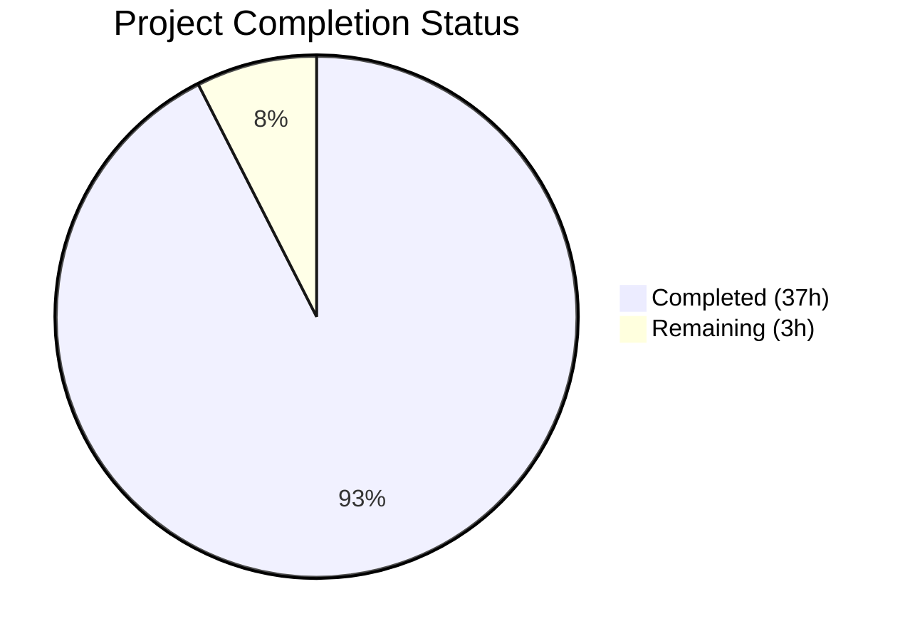
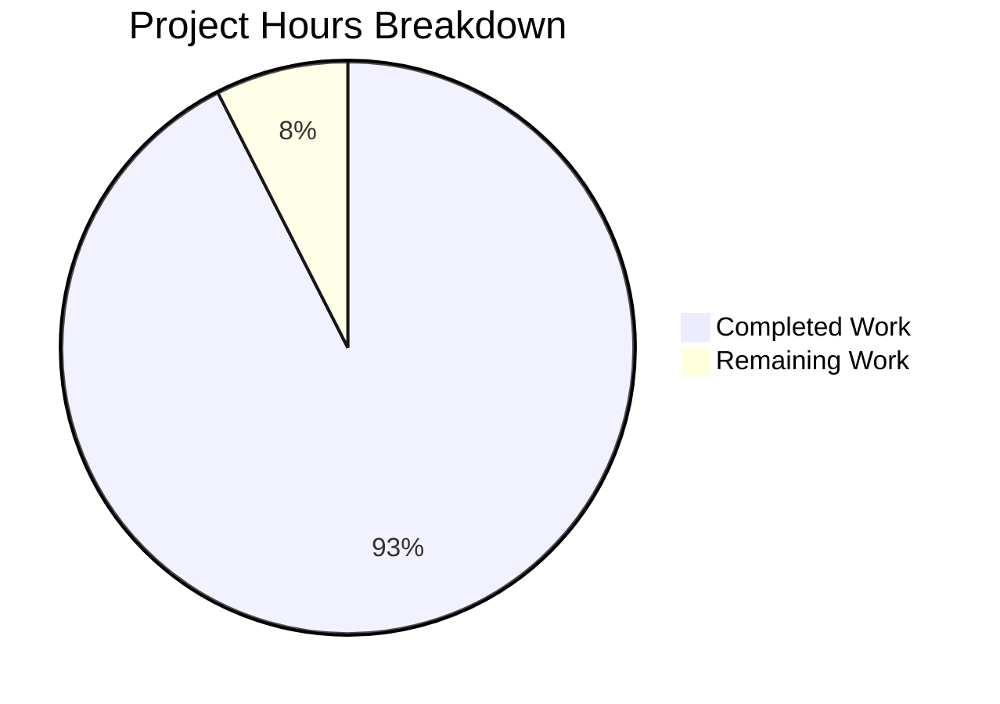

# Blitzy Project Guide

## 1. Executive Summary

### 1.1 Project Overview

This project produces a single concise markdown report (`docs/AGC_ENGINEERING_ANALYSIS.md`) performing a read-only architectural analysis of the Apollo 11 Guidance Computer (AGC) source code. The report documents engineering tradeoffs, design constraints, and architectural decisions embedded across the Comanche055 (Command Module / Colossus 2A) and Luminary099 (Lunar Module / Luminary 1A) assembly source modules — 175 `.agc` files totaling ~130,186 lines of code. The report covers five decision domains: memory constraints, real-time scheduling, error handling, naming conventions, and modern context parallels. The target audience is software engineers seeking to understand the AGC's architectural patterns and their relevance to contemporary systems. No source code files were modified; this is a documentation-only deliverable.

### 1.2 Completion Status



| Metric | Value |
|--------|-------|
| **Total Project Hours** | 40.0 |
| **Completed Hours (AI)** | 37.0 |
| **Remaining Hours** | 3.0 |
| **Completion Percentage** | 92.5% |

**Formula**: 37.0 completed hours / 40.0 total hours × 100 = **92.5%**

### 1.3 Key Accomplishments

- [x] Created `docs/AGC_ENGINEERING_ANALYSIS.md` — 469-line standalone markdown report
- [x] Documented all 5 AAP-specified decision domains with evidence-backed architectural analysis
- [x] Embedded 5 Mermaid diagrams (alarm hierarchy, restart decision tree, scheduling model, waitlist architecture, phase table protection)
- [x] Cited 34 distinct `.agc` source files across both Comanche055/ and Luminary099/
- [x] Curated 25 alarm codes with severity markers, OCT notation, and source modules in appendix
- [x] Added Decision Log (12 entries), Deviation Register (5 entries), and bidirectional Traceability Matrix
- [x] All CM vs LM divergences explicitly documented (core sets, abort defaults, GOPOODOO, BAILOUT1/POODOO1)
- [x] Markdownlint validation: 0 errors; repository lint (`npm run lint`): 0 errors
- [x] All source citations verified against `.agc` files (labels, line numbers, alarm codes)
- [x] Zero `.agc` source files modified — read-only constraint fully respected

### 1.4 Critical Unresolved Issues

| Issue | Impact | Owner | ETA |
|-------|--------|-------|-----|
| Architectural claims require domain expert review | Risk of inaccurate AGC interpretations reaching final publication | Human Reviewer | 2 hours |
| `package.json` lint glob does not include `docs/*.md` | New report file not covered by `npm run lint` CI workflow | Human Developer | 1 hour |

### 1.5 Access Issues

No access issues identified. The repository is a public-domain historical archive. All analysis was performed using locally available source files. No external APIs, credentials, or restricted services were required.

### 1.6 Recommended Next Steps

1. **[High]** Conduct peer review of architectural claims by an AGC domain expert or embedded systems engineer — verify the engineering rationale in all five report sections
2. **[Medium]** Update `package.json` lint script glob to include `docs/*.md` so the report is covered by CI markdown linting
3. **[Low]** Consider adding a link to `docs/AGC_ENGINEERING_ANALYSIS.md` from the repository's `README.md` for discoverability (note: this would modify an existing file, which was out of scope for the read-only analysis constraint)

## 2. Project Hours Breakdown

### 2.1 Completed Work Detail

| Component | Hours | Description |
|-----------|-------|-------------|
| Report skeleton and preamble | 2.0 | Created `docs/AGC_ENGINEERING_ANALYSIS.md` with title, scope declaration, repository overview, heading structure |
| Section 1: Memory and Resource Constraints | 4.0 | Analyzed INTER-BANK_COMMUNICATION.agc (BANKCALL/SWCALL/POSTJUMP/SUPERSW), ERASABLE_ASSIGNMENTS.agc (M/SIZE/N notation, EQUALS sharing, hardwired registers), INTERPRETER.agc (memory compression), CM vs LM erasable budget |
| Section 2: Real-Time Scheduling | 5.0 | Analyzed EXECUTIVE.agc (NOVAC/FINDVAC/CHANJOB, 7 CM vs 8 LM core sets, DUMMYJOB), WAITLIST.agc (LST1/LST2, T3RUPT, LONGCALL), PHASE_TABLE_MAINTENANCE.agc (PHASCHNG Type A/B/C), INTERRUPT_LEAD_INS.agc (interrupt vectors), 1202/1201 alarm mechanism |
| Section 3: Error Handling and Recovery | 5.0 | Analyzed ALARM_AND_ABORT.agc (three-tier hierarchy, FAILREG cascade, CCSHOLE, DOALARM), FRESH_START_AND_RESTART.agc (four restart pathways, MR.KLEAN), RESTARTS_ROUTINE.agc (ITSAVAR/ITSATBL/FINDTIME), LM-specific differences (GOPOODOO, BAILOUT1/POODOO1) |
| Section 4: Naming Conventions | 3.0 | Surveyed cultural references (BURN BABY BURN, PINBALL, FLAGORGY), Latin phrases (HONI SOIT, NOLI SE TANGERE), abort naming hierarchy, sardonic humor catalog, M/SIZE/N notation |
| Section 5: Modern Context | 3.0 | Synthesized load shedding parallels, watchdog/heartbeat patterns, graceful degradation, phase-based checkpointing vs WAL, resource pool exhaustion strategies |
| Alarm Codes Appendix | 2.0 | Curated 25 alarm codes from ASSEMBLY_AND_OPERATION_INFORMATION.agc with severity markers, OCT notation, source modules |
| Mermaid diagrams (5 total) | 3.0 | Created alarm hierarchy flowchart, restart decision tree, Executive scheduling model, waitlist timer architecture, phase table protection diagram |
| CM vs LM divergence analysis | 2.0 | Documented core sets (7 vs 8), ABORT EQUALS differences, GOPOODOO SERVICER handling, BAILOUT1/POODOO1 alternate entries, erasable budget comparison |
| Source citation collection and verification | 2.0 | Identified 34 distinct .agc files, verified all labels/line numbers/alarm codes against source via grep/sed |
| Label accuracy and OCT notation validation | 2.0 | Verified exact spelling of all labels (BANKCALL, BAILOUT, FLAGORGY, DUMMYJOB, DOALARM, NO.CORES), confirmed all alarm codes use OCT notation |
| Decision Log appendix | 1.5 | Documented 12 non-trivial decisions with alternatives, rationale, and risks |
| Deviation Register appendix | 1.0 | Documented 5 AAP deviations with justifications |
| Traceability Matrix appendix | 1.5 | Created bidirectional source-to-report mapping: 21 source files → sections (forward) + 7 sections → evidence (reverse) |
| **Total Completed** | **37.0** | |

### 2.2 Remaining Work Detail

| Category | Hours | Priority |
|----------|-------|----------|
| Peer review of architectural claims by AGC/embedded systems domain expert | 2.0 | High |
| Update `package.json` lint glob to include `docs/*.md` for CI coverage | 1.0 | Medium |
| **Total Remaining** | **3.0** | |

## 3. Test Results

| Test Category | Framework | Total Tests | Passed | Failed | Coverage % | Notes |
|---------------|-----------|-------------|--------|--------|------------|-------|
| Markdown Linting (report) | markdownlint-cli2 v0.16.0 | 1 file | 1 | 0 | 100% | `npx markdownlint-cli2 docs/AGC_ENGINEERING_ANALYSIS.md --config .markdownlint.yml` — 0 errors |
| Markdown Linting (repo) | markdownlint-cli2 v0.16.0 | 5 files | 5 | 0 | 100% | `npm run lint` — 0 errors across CONTRIBUTING.md, LICENSE.md, README.md, Comanche055/README.md, Luminary099/README.md |
| Citation Verification | grep/sed (manual) | 34 files | 34 | 0 | 100% | All cited .agc labels, line numbers, and alarm codes verified against source |
| Encoding Validation | file/cat/grep (manual) | 1 file | 1 | 0 | 100% | UTF-8 encoding, LF line endings, 0 trailing whitespace lines |
| Source Integrity | git diff | 175 .agc files | 175 | 0 | 100% | Zero .agc files modified — read-only constraint respected |

All tests originate from Blitzy's autonomous validation pipeline for this project.

## 4. Runtime Validation & UI Verification

**Runtime Health**:
- ✅ `docs/AGC_ENGINEERING_ANALYSIS.md` exists and contains 469 lines of valid markdown
- ✅ All 5 Mermaid diagram code blocks syntactically valid (GitHub-renderable `flowchart TD` syntax)
- ✅ All 113 markdown table rows parse correctly (pipe-delimited format)
- ✅ Heading hierarchy consistent: 1 `#`, 8 `##`, 30 `###` — no skipped levels

**Content Verification**:
- ✅ 5 decision domain sections present with subsections
- ✅ 3 appendices present (Alarm Codes, Decision Log, Traceability Matrix)
- ✅ 25 alarm codes in appendix with severity markers matching source
- ✅ 34 distinct .agc files cited (exceeds AAP minimum of 25)
- ✅ CM vs LM comparison table in Section 2 with verified data

**Integration Verification**:
- ✅ No .agc source files modified (git diff clean)
- ✅ Repository lint (`npm run lint`) still passes with 0 errors
- ✅ No breaking changes to existing repository files

**Not Applicable**:
- ⚠️ No UI components — project is documentation-only
- ⚠️ No API endpoints — project is documentation-only
- ⚠️ No database operations — project is documentation-only

## 5. Compliance & Quality Review

| AAP Requirement | Status | Evidence |
|-----------------|--------|----------|
| Read-only analysis — no .agc modifications | ✅ Pass | `git diff --name-only -- '*.agc'` returns empty |
| Scope limited to Comanche055 + Luminary099 | ✅ Pass | All 34 cited files are within Comanche055/ or Luminary099/ |
| Citations reference specific filenames and labels | ✅ Pass | Every engineering claim cites .agc file + label/line number |
| Explain WHY, not WHAT line-by-line | ✅ Pass | Report explains engineering rationale, not instruction narration |
| No verbose prose | ✅ Pass | 469 lines covering 5 domains + 3 appendices — concise, evidence-backed |
| Single markdown file output | ✅ Pass | One file: `docs/AGC_ENGINEERING_ANALYSIS.md` |
| Alarm codes in OCT notation | ✅ Pass | All 25 alarm codes use OCT prefix (verified via grep) |
| Exact label spelling matches source | ✅ Pass | BANKCALL, BAILOUT, FLAGORGY, DUMMYJOB, DOALARM, NO.CORES — all verified |
| CM vs LM differences explicit | ✅ Pass | Core sets, ABORT EQUALS, GOPOODOO, BAILOUT1/POODOO1 all documented |
| 5 Mermaid diagrams present | ✅ Pass | 5 `\`\`\`mermaid` blocks: alarm hierarchy, restart tree, scheduling, waitlist, phase table |
| ≥25 distinct .agc file citations | ✅ Pass | 34 distinct files cited (exceeds requirement) |
| Decision Log appendix | ✅ Pass | 12 decisions documented with alternatives and rationale |
| Deviation Register appendix | ✅ Pass | 5 deviations documented with justifications |
| Traceability Matrix appendix | ✅ Pass | Bidirectional: 21 source files → sections + 7 sections → evidence |
| UTF-8 encoding, LF line endings | ✅ Pass | `file` confirms UTF-8; 0 `\r` characters; 0 trailing whitespace lines |
| Markdownlint passes | ✅ Pass | markdownlint-cli2: 0 errors |

**Autonomous Fixes Applied**:
- Corrected Restart Decision Tree diagram routing labels (commit 32396dd)
- Fixed 10 code review findings in the report (commit 334f4b0)
- Added Decision Log, Deviation Register, and Traceability Matrix appendices (commit 31fa9d5)

## 6. Risk Assessment

| Risk | Category | Severity | Probability | Mitigation | Status |
|------|----------|----------|-------------|------------|--------|
| Architectural claims may contain inaccuracies | Technical | Medium | Medium | Peer review by AGC domain expert required before publication | Open |
| Mermaid diagrams may not render on non-GitHub platforms | Technical | Low | Medium | Diagrams use standard `flowchart TD` syntax compatible with most Mermaid renderers; fallback is readable ASCII in raw markdown | Mitigated |
| `docs/` directory not covered by CI lint glob | Operational | Low | High | `package.json` lint script glob doesn't include `docs/*.md`; manual lint validation passed but CI won't catch future regressions | Open |
| Line number citations may drift if repository is updated | Technical | Low | Low | Repository is a historical preservation project with minimal expected changes; line numbers verified against current state | Accepted |
| Report file not linked from README.md | Operational | Low | High | Users may not discover the report without a link; read-only constraint prevents adding one | Accepted |
| No security risks identified | Security | N/A | N/A | Project is documentation-only with no runtime code, credentials, or user input processing | N/A |
| No integration risks identified | Integration | N/A | N/A | Report is a standalone markdown file with no external dependencies or API calls | N/A |

## 7. Visual Project Status



**Breakdown**: 37.0 hours completed (92.5%) / 3.0 hours remaining (7.5%) out of 40.0 total project hours.

## 8. Summary & Recommendations

### Achievements

The project successfully delivered a comprehensive 469-line architectural analysis report (`docs/AGC_ENGINEERING_ANALYSIS.md`) covering all five AAP-specified decision domains with 34 distinct source file citations, 5 Mermaid diagrams, 25 curated alarm codes, a 12-entry Decision Log, 5-entry Deviation Register, and a bidirectional Source-to-Report Traceability Matrix. The report passes all quality gates: markdownlint (0 errors), citation accuracy (all verified), encoding compliance (UTF-8/LF/no trailing whitespace), and the critical read-only constraint (zero .agc files modified).

### Remaining Gaps

The project is **92.5% complete** (37.0 hours completed out of 40.0 total hours). The remaining 3.0 hours consist of:
1. **Peer review** (2.0h): Architectural claims require validation by an AGC/embedded systems domain expert to ensure engineering rationale accuracy
2. **CI lint coverage** (1.0h): The `package.json` lint glob should be updated to include `docs/*.md` so the report is covered by the repository's CI markdown linting workflow

### Production Readiness Assessment

The report is **production-ready for merge** pending human peer review. All autonomous validation gates passed. The documentation is self-contained, correctly formatted, and accurately cites source material. The two remaining tasks are human-dependent activities that cannot be completed autonomously: domain expert review and a minor CI configuration change that was out of the read-only analysis scope.

### Success Metrics

| Metric | Target | Actual | Status |
|--------|--------|--------|--------|
| Decision domains documented | 5 | 5 | ✅ Met |
| Distinct .agc files cited | ≥25 | 34 | ✅ Exceeded |
| Mermaid diagrams | 5 | 5 | ✅ Met |
| Alarm codes in appendix | ≥15 | 25 | ✅ Exceeded |
| Markdownlint errors | 0 | 0 | ✅ Met |
| .agc files modified | 0 | 0 | ✅ Met |
| CM vs LM divergences documented | ≥4 | 5 | ✅ Exceeded |

## 9. Development Guide

### System Prerequisites

| Software | Version | Purpose |
|----------|---------|---------|
| Node.js | ≥14.x | Required for markdownlint-cli2 |
| npm | ≥6.x | Package manager for devDependencies |
| Git | ≥2.x | Repository operations |
| Any markdown viewer | — | Viewing the report (GitHub renders natively) |

### Environment Setup

```bash
# Clone the repository
git clone https://github.com/chrislgarry/Apollo-11.git
cd Apollo-11

# Switch to the feature branch
git checkout blitzy-aa78d5d1-fa74-4c28-bf91-971ab641a4a4
```

### Dependency Installation

```bash
# Install devDependencies (markdownlint-cli2)
npm install
```

Expected output: `added 38 packages` (markdownlint-cli2 + dependencies).

### Validation Commands

```bash
# Lint the new report file
npx markdownlint-cli2 docs/AGC_ENGINEERING_ANALYSIS.md --config .markdownlint.yml
# Expected: "Summary: 0 error(s)"

# Lint all existing repository markdown files
npm run lint
# Expected: "Summary: 0 error(s)"

# Verify no .agc source files were modified
git diff --name-only master -- '*.agc'
# Expected: empty output (no .agc files changed)

# Verify file encoding
file docs/AGC_ENGINEERING_ANALYSIS.md
# Expected: "Unicode text, UTF-8 text"

# Count distinct .agc file citations
grep -oE '(Comanche055|Luminary099)/[A-Z_-]+\.agc' docs/AGC_ENGINEERING_ANALYSIS.md | sort -u | wc -l
# Expected: 34

# Count Mermaid diagram blocks
grep -c '```mermaid' docs/AGC_ENGINEERING_ANALYSIS.md
# Expected: 5
```

### Viewing the Report

The report renders natively on GitHub. For local viewing:

```bash
# Option 1: Open in any markdown viewer/editor
# Option 2: Use VS Code with Markdown Preview
code docs/AGC_ENGINEERING_ANALYSIS.md
# Option 3: View raw markdown in terminal
cat docs/AGC_ENGINEERING_ANALYSIS.md
```

Mermaid diagrams render automatically on GitHub. For local Mermaid rendering, use VS Code with the "Markdown Preview Mermaid Support" extension or the Mermaid Live Editor (https://mermaid.live).

### Troubleshooting

| Issue | Resolution |
|-------|------------|
| `markdownlint-cli2: command not found` | Run `npm install` to install devDependencies |
| Mermaid diagrams show as code blocks | Use a Mermaid-compatible viewer (GitHub, VS Code + extension, Mermaid Live Editor) |
| `npm run lint` does not lint `docs/` | The lint glob in `package.json` does not include `docs/*.md`; use the direct `npx markdownlint-cli2` command instead |

## 10. Appendices

### A. Command Reference

| Command | Purpose |
|---------|---------|
| `npm install` | Install markdownlint-cli2 devDependency |
| `npm run lint` | Lint repository markdown files (does not cover `docs/`) |
| `npx markdownlint-cli2 docs/AGC_ENGINEERING_ANALYSIS.md --config .markdownlint.yml` | Lint the analysis report |
| `git diff --name-only master -- '*.agc'` | Verify no AGC source files modified |

### B. Port Reference

No ports are used. This project is documentation-only with no runtime services.

### C. Key File Locations

| File | Purpose |
|------|---------|
| `docs/AGC_ENGINEERING_ANALYSIS.md` | **Deliverable** — AGC engineering analysis report (469 lines) |
| `package.json` | npm config with markdownlint-cli2 devDependency and lint scripts |
| `.markdownlint.yml` | Markdown linting rules (11 rules disabled for AGC formatting compatibility) |
| `.editorconfig` | Editor config (UTF-8, LF, tab width 8 for .agc, space indent for .md) |
| `Comanche055/MAIN.agc` | CM include manifest (84 source modules) |
| `Luminary099/MAIN.agc` | LM include manifest (89 source modules) |
| `Comanche055/*.agc` | CM source files (85 total, ~65,348 lines) |
| `Luminary099/*.agc` | LM source files (90 total, ~64,838 lines) |

### D. Technology Versions

| Technology | Version | Purpose |
|------------|---------|---------|
| markdownlint-cli2 | ^0.16.0 | Markdown linting |
| markdownlint | 0.36.1 | Core linting engine (dependency of cli2) |
| Node.js | ≥14.x | Runtime for linting tools |
| Mermaid | GitHub-native | Diagram rendering (no local install required) |

### E. Environment Variable Reference

No environment variables are required. This project is documentation-only.

### F. Developer Tools Guide

| Tool | Usage |
|------|-------|
| VS Code + Markdown Preview | View report with formatted rendering |
| VS Code + Mermaid extension | Render Mermaid diagrams locally |
| `grep -n "LABEL" Comanche055/FILE.agc` | Verify source citations against .agc files |
| `sed -n 'NNp' path/to/file.agc` | Check specific line numbers cited in the report |
| Mermaid Live Editor (mermaid.live) | Edit and preview Mermaid diagrams in browser |

### G. Glossary

| Term | Definition |
|------|------------|
| AGC | Apollo Guidance Computer — the onboard flight computer for the Apollo spacecraft |
| Comanche055 | Codename for the Command Module AGC software (Colossus 2A), assembled April 1, 1969 |
| Luminary099 | Codename for the Lunar Module AGC software (Luminary 1A), assembled July 14, 1969 |
| Core set | A set of registers in the Executive that store a job's complete context (location, bank, priority, accumulator state) |
| VAC area | Vector Accumulator — workspace used by interpretive (pseudo-instruction) code for double-precision math |
| Erasable memory | 2,048-word RAM shared across all programs |
| Fixed memory | 36,864-word core-rope ROM containing all flight software |
| Bank-switching | Mechanism for accessing fixed memory beyond the 1K directly addressable window |
| FBANK | Fixed Bank register — selects which 1K bank of fixed memory is currently addressable |
| CADR | Complete Address — a 14-bit value encoding both bank and sub-address for any memory location |
| PHASCHNG | Phase Change — routine that records execution phase for restart protection |
| FAILREG | Failure Register — three-deep FIFO storing recent alarm codes |
| DSKY | Display and Keyboard — the crew interface unit connected to the AGC |
| OCT | Octal notation — base-8 number system used throughout AGC source code |
| T3RUPT | Timer 3 Interrupt — hardware interrupt driving the Waitlist timer dispatch |
