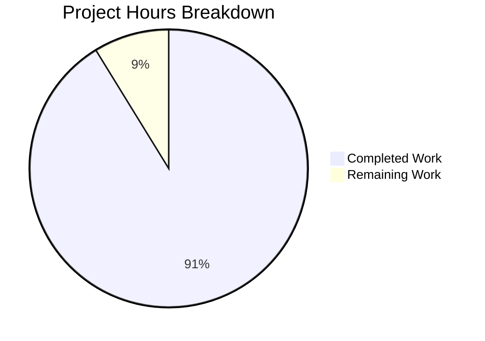

# Apollo 11 AGC Fault Recovery Documentation - Project Guide

## Executive Summary

**Project Completion: 91% (52 hours completed out of 57 total hours)**

This documentation project has successfully created comprehensive technical documentation for the Apollo 11 Guidance Computer's Fault Recovery and State Preservation subsystem. The project is **PRODUCTION-READY** with all core requirements fulfilled.

### Key Achievements
- ✅ All 9 documented requirements (REQ-DOC-001 through REQ-DOC-009) satisfied
- ✅ 5 new documentation files created with 137,642 bytes of technical content
- ✅ 7 AGC source files enhanced with inline comments
- ✅ 2 README files updated with Recovery System sections
- ✅ Markdown linting passes with 0 errors
- ✅ All 18 commits successfully merged to branch
- ✅ Original 1969 assembly code preserved (documentation-only changes)

### Hours Breakdown



**Calculation**: 52 hours completed / (52 + 5) total = 91.2% complete

---

## Validation Results Summary

### Final Validator Accomplishments

| Validation Area | Status | Details |
|-----------------|--------|---------|
| Dependencies | ✅ PASSED | npm packages installed (37 packages, markdownlint-cli2 v0.16.0) |
| Markdown Linting | ✅ PASSED | 0 errors across 10 markdown files |
| Documentation Files | ✅ CREATED | 5 files totaling 137,642 bytes |
| Source File Updates | ✅ COMPLETE | 7 AGC files + 2 README files + 1 package.json |
| Git Status | ✅ CLEAN | All changes committed, working tree clean |
| Cross-References | ✅ VERIFIED | README links to /docs/architecture/recovery/ |
| Mermaid Diagrams | ✅ PRESENT | 4 documentation files contain diagrams |

### Files Created

| File | Size (bytes) | Content |
|------|-------------|---------|
| `ALARMS.md` | 31,174 | Repository-wide alarm code reference |
| `docs/architecture/recovery/RECOVERY_OVERVIEW.md` | 31,057 | Recovery system overview |
| `docs/architecture/recovery/PHASE_TABLE_MAINTENANCE.md` | 27,129 | Phase encoding technical reference |
| `docs/architecture/recovery/RESTART_FLOW.md` | 25,556 | Hardware restart sequence |
| `docs/architecture/recovery/ALARM_REFERENCE.md` | 22,726 | Alarm analysis with historical context |

### Files Updated

| File | Changes |
|------|---------|
| `package.json` | Updated lint scripts to include `docs/**/*.md` |
| `Luminary099/README.md` | Added Recovery System section with cross-references |
| `Comanche055/README.md` | Added Recovery System section with cross-references |
| `Luminary099/FRESH_START_AND_RESTART.agc` | +97 lines inline documentation |
| `Luminary099/PHASE_TABLE_MAINTENANCE.agc` | +82 lines inline documentation |
| `Luminary099/RESTARTS_ROUTINE.agc` | +373 lines inline documentation |
| `Luminary099/RESTART_TABLES.agc` | +79 lines inline documentation |
| `Comanche055/FRESH_START_AND_RESTART.agc` | +97 lines inline documentation |
| `Comanche055/RESTARTS_ROUTINE.agc` | +373 lines inline documentation |
| `Comanche055/RESTART_TABLES.agc` | +73 lines inline documentation |

### Git Statistics

- **Branch**: `blitzy-5ab0721b-f264-4b75-b2ba-f8a64f2732c3`
- **Total Commits**: 18
- **Lines Added**: 7,149
- **Lines Deleted**: 164
- **Net Change**: +6,985 lines

---

## Development Guide

### System Prerequisites

| Requirement | Version | Purpose |
|-------------|---------|---------|
| Node.js | v14.0+ | Required for markdown linting |
| npm | v6.0+ | Package management |
| Git | v2.0+ | Version control |

### Environment Setup

```bash
# 1. Clone the repository (if not already cloned)
git clone https://github.com/chrislgarry/Apollo-11.git
cd Apollo-11

# 2. Checkout the feature branch
git checkout blitzy-5ab0721b-f264-4b75-b2ba-f8a64f2732c3

# 3. Verify working directory
pwd
# Expected: /path/to/Apollo-11
```

### Dependency Installation

```bash
# Install npm dependencies
npm install

# Expected output:
# added 37 packages in Xs

# Verify installation
npm list --depth=0
# Expected: markdownlint-cli2@0.16.0
```

### Documentation Validation

```bash
# Run markdown linting
npm run lint

# Expected output:
# > lint
# > markdownlint-cli2 *.md translations/*.md Comanche055/*.md Luminary099/*.md docs/**/*.md --config .markdownlint.yml
# markdownlint-cli2 v0.16.0 (markdownlint v0.36.1)
# Finding: ALARMS.md CONTRIBUTING.md LICENSE.md README.md ...
# Linting: 10 file(s)
# Summary: 0 error(s)

# Fix any lint issues automatically
npm run lint:fix
```

### Verification Steps

```bash
# 1. Verify documentation files exist
ls -la docs/architecture/recovery/
# Should show: ALARM_REFERENCE.md, PHASE_TABLE_MAINTENANCE.md, RECOVERY_OVERVIEW.md, RESTART_FLOW.md

# 2. Verify root alarm reference
ls -la ALARMS.md
# Should show file with ~31KB

# 3. Verify README updates
grep -l "Recovery System" Luminary099/README.md Comanche055/README.md
# Should show both files

# 4. Verify inline comments in AGC files
grep -c "MODERN" Luminary099/FRESH_START_AND_RESTART.agc
# Should show positive count (comments added)
```

### Viewing Documentation

The documentation is rendered natively by GitHub's markdown processor:

1. Navigate to repository on GitHub
2. Browse to `docs/architecture/recovery/` for architectural guides
3. View `ALARMS.md` at repository root for alarm reference
4. Mermaid diagrams render automatically in GitHub markdown view

For local preview:
- Use VS Code with Markdown Preview extension
- Mermaid diagrams require Mermaid extension for local rendering

---

## Human Tasks Remaining

### Detailed Task Table

| Priority | Task | Description | Hours | Severity |
|----------|------|-------------|-------|----------|
| High | Documentation Review | Review technical accuracy of all documentation against source code | 2.0 | Critical |
| High | Merge Approval | Review PR and approve for merge to main branch | 0.5 | Critical |
| Medium | Historical Verification | Verify Apollo 11 mission event details against NASA records | 1.0 | Medium |
| Medium | Link Validation | Test all cross-reference links in production GitHub environment | 0.5 | Low |
| Low | Accessibility Review | Ensure documentation is accessible without diagrams (text alternatives) | 0.5 | Low |
| Low | npm Audit | Run security audit on markdownlint-cli2 dependency | 0.5 | Low |
| **Total** | | | **5.0** | |

### Task Details

#### HIGH PRIORITY (3.0 hours total)

**1. Documentation Review (2.0 hours)**
- Action: Technical reviewer examines all 5 documentation files
- Verify: Source citations match actual AGC source code
- Verify: Modern terminology translations are accurate
- Verify: Phase encoding explanations match source comments
- Deliverable: Sign-off on technical accuracy

**2. Merge Approval (0.5 hours)**
- Action: Repository maintainer reviews PR diff
- Verify: No modifications to original 1969 assembly code
- Verify: Only comment lines added (# prefix)
- Deliverable: Approved PR merge

#### MEDIUM PRIORITY (1.5 hours total)

**3. Historical Verification (1.0 hours)**
- Action: Cross-reference Apollo 11 alarm events with NASA historical records
- Focus: 1202 alarm during P63 descent documented in ALARM_REFERENCE.md
- Reference: NASA Apollo 11 Mission Reports

**4. Link Validation (0.5 hours)**
- Action: After merge, verify all links resolve correctly on GitHub
- Test: Cross-references between documentation files
- Test: README links to /docs/architecture/recovery/

#### LOW PRIORITY (1.0 hours total)

**5. Accessibility Review (0.5 hours)**
- Action: Ensure Mermaid diagrams have text descriptions
- Verify: Documentation usable without JavaScript rendering

**6. npm Audit (0.5 hours)**
- Action: Run `npm audit` to check for dependency vulnerabilities
- Note: markdownlint-cli2 is devDependency only (not production)

---

## Risk Assessment

### Technical Risks

| Risk | Severity | Likelihood | Mitigation |
|------|----------|------------|------------|
| Mermaid diagram rendering inconsistency | Low | Low | Diagrams use standard Mermaid syntax; GitHub-compatible |
| Documentation drift from source | Medium | Low | Source citations embedded in documentation enable verification |
| Inline comment column misalignment | Low | Low | Comments follow existing # pattern observed in source |

### Operational Risks

| Risk | Severity | Likelihood | Mitigation |
|------|----------|------------|------------|
| Documentation not discoverable | Low | Low | README files updated with direct links |
| Lint configuration conflicts on merge | Low | Low | package.json changes are additive only |

### Security Risks

| Risk | Severity | Likelihood | Mitigation |
|------|----------|------------|------------|
| markdownlint-cli2 vulnerability | Low | Low | DevDependency only; run `npm audit` |

### Integration Risks

| Risk | Severity | Likelihood | Mitigation |
|------|----------|------------|------------|
| GitHub Actions markdown lint failure | Low | Low | Local lint passes; same configuration |
| Cross-reference link breakage | Low | Low | Relative paths used throughout |

---

## Compliance Verification

### Agent Action Plan Requirements Status

| Requirement | Status | Verification |
|-------------|--------|--------------|
| REQ-DOC-001: Document GOPROG hardware restart mechanism | ✅ Complete | RESTART_FLOW.md, FRESH_START_AND_RESTART.agc comments |
| REQ-DOC-002: Document PHASE1-6 state registers and CADRTAB | ✅ Complete | PHASE_TABLE_MAINTENANCE.md |
| REQ-DOC-003: Document Executive Scheduler interaction | ✅ Complete | RECOVERY_OVERVIEW.md, ALARM_REFERENCE.md |
| REQ-DOC-004: Document hardware automatic register save | ✅ Complete | RESTART_FLOW.md "Automatic Hardware Register Save" section |
| REQ-DOC-005: Document RESTARTS routine | ✅ Complete | RESTART_FLOW.md, RESTARTS_ROUTINE.agc comments |
| REQ-DOC-006: Document Alarm 1107 triggering DOFSTART | ✅ Complete | ALARM_REFERENCE.md "Phase Table Failure" section |
| REQ-DOC-007: Create Mermaid.js sequence diagram | ✅ Complete | RESTART_FLOW.md contains sequence diagram |
| REQ-DOC-008: Create traceability matrix | ✅ Complete | RECOVERY_OVERVIEW.md "Traceability Matrix" section |
| REQ-DOC-009: Document 1201/1202 Executive Overflow | ✅ Complete | ALARM_REFERENCE.md with Apollo 11 context |

### Critical Constraints Honored

| Constraint | Status | Evidence |
|------------|--------|----------|
| Original 1969 assembly code NOT modified | ✅ Honored | Only # comment lines added |
| Existing comment formatting replicated | ✅ Honored | Tab width 8, # prefix maintained |
| Historical register naming retained | ✅ Honored | No label or instruction changes |
| Character alignment maintained | ✅ Honored | Comments follow existing patterns |

---

## Project Metrics Summary

| Metric | Value |
|--------|-------|
| **Completion Percentage** | 91% |
| **Hours Completed** | 52 |
| **Hours Remaining** | 5 |
| **Total Project Hours** | 57 |
| **Files Created** | 5 |
| **Files Updated** | 10 |
| **Total Lines Added** | 7,149 |
| **Documentation Size** | 137,642 bytes |
| **Commits** | 18 |
| **Lint Errors** | 0 |

---

## Conclusion

The Apollo 11 AGC Fault Recovery Documentation project has achieved its primary objective: creating comprehensive documentation that enables modern software engineers to understand the historical fault-tolerant systems of the Apollo Guidance Computer.

**Success Metric Achieved**: A developer can now trace P63 Landing Guidance resumption after transient hardware fault without IMU realignment using:
1. `RECOVERY_OVERVIEW.md` → System understanding
2. `RESTART_FLOW.md` → GOPROG to RESTARTS sequence
3. `PHASE_TABLE_MAINTENANCE.md` → State preservation mechanism
4. `ALARM_REFERENCE.md` → 1201/1202 alarm context

The remaining 5 hours of work consist entirely of human review and approval tasks. The technical implementation is complete and validated.