# Technical Specification

# 0. Agent Action Plan

## 0.1 Intent Clarification

#### Core Documentation Objective

Based on the provided requirements, the Blitzy platform understands that the documentation objective is to **transform the complete NASA Apollo 11 mission source code repository into a comprehensively documented educational resource that enables dual reading experiences**.

**Documentation Category**: Create new documentation

**Documentation Type**: Inline technical documentation + educational narrative documentation + navigation guide

**Specific Documentation Requirements**:

- Add comprehensive inline comments to all AGC (Apollo Guidance Computer) assembly source files in both Command Module (Comanche055) and Lunar Module (Luminary099) directories
- Create file-header TL;DR documentation blocks for every AGC assembly source file providing context and purpose
- Implement dual-path documentation strategy enabling comment-only reading for historical narrative and code-along reading for technical analysis
- Create standalone navigation guide file `reading-instructions.md` at repository root providing framework for both reading paths
- Document approximately 130,186 lines of AGC assembly code across 140+ source files spanning both spacecraft modules
- Maintain absolute preservation of all executable code while adding educational commentary layer

**Primary Audiences**:

1. **Comment-Only Readers**: Space history enthusiasts, general technical audience seeking Apollo 11 mission narrative through comments alone without code examination
2. **Code-Along Readers**: Software engineers, computer science students, AGC architecture researchers requiring integrated technical and historical documentation while examining instruction sequences

**Mission-Critical Documentation Focus Areas**:

- Guidance systems (lunar descent guidance equations, ascent guidance, navigation algorithms)
- Control systems (digital autopilot routines, throttle control, RCS jet selection)
- Display interfaces (DSKY keyboard/display routines, pinball game buttons and lights)
- Interrupt handling and executive scheduler (waitlist, task management, restart routines)
- Mission-specific programs (P63 lunar landing braking phase, P12 ascent programs, rendezvous programs)
- Alarm and abort systems (program alarms 1201/1202, abort logic)

#### Special Instructions and Constraints

**CRITICAL PRESERVATION REQUIREMENTS** (Non-Negotiable):

The user has explicitly mandated **ZERO MODIFICATIONS** to any executable code. This is historical NASA code that successfully landed humans on the moon, and the documentation role is **pure addition only**.

**ABSOLUTELY PROHIBITED MODIFICATIONS**:

- Executable assembly code instructions
- Memory addresses and allocation schemes
- Computational logic and algorithms
- Timing-critical code sections
- Subroutine entry points and calling conventions
- Interrupt vectors and priority structures
- Memory-mapped I/O addresses
- Label names and symbolic references
- Original NASA comments and annotations

**PERMITTED MODIFICATIONS (Documentation Addition Only)**:

- Adding new comment lines with `;` prefix following AGC assembly syntax
- Adding file-header TL;DR documentation blocks at beginning of each file
- Creating new standalone file: `reading-instructions.md` at repository root
- Adding section transition narrative comment blocks between major code sections
- Adding inline explanatory comments adjacent to code without altering code

**Documentation Style Requirements**:

- **Tone**: Respectful of historical significance, educational and accessible, technically precise without excessive jargon, enthusiastic about space exploration achievements
- **Language**: Present tense for code behavior, past tense for historical events, active voice preferred, clear technical terminology with definitions
- **Formatting**: Consistent AGC comment block structure using `;` prefix, clear visual separation between sections, appropriate whitespace for readability, standard AGC comment syntax throughout
- **Comment Syntax**: All documentation comments must use AGC assembly comment syntax (`;` character at line start)

**File-Header TL;DR Structure Template**:

USER PROVIDED TEMPLATE:
```assembly
; ============================================================================
; FILE: [filename]
; MODULE: [module name]
; MISSION PHASE: [launch/earth-orbit/trans-lunar/lunar-orbit/descent/landing/ascent/rendezvous/trans-earth/re-entry]
;
; TL;DR: [2-4 sentence summary covering:]
;        - Module purpose and primary responsibility
;        - Context in mission timeline
;        - Key systems or functions controlled
;        - Critical interfaces or dependencies
;
; COMMENT-ONLY READERS: [Brief navigation note for narrative flow]
; CODE-ALONG READERS: [Brief technical orientation]
; ============================================================================
```

**Inline Comment Strategy Requirements**:

- **Comment-Only Path**: Comments must form continuous narrative independent of code comprehension, explain "what happens" in mission operational terms, bridge between code sections with timeline progression, reference historical mission events and crew actions
- **Code-Along Path**: Explain technical implementation alongside historical context, document register usage (A, L, Q registers), arithmetic operations, timing constraints, clarify AGC architectural decisions, explain non-obvious computational techniques (fixed-point math, scaling factors)

**Section Transition Narrative Template**:

```assembly
; ============================================================================
; TRANSITION: From [previous section] to [next section]
;
; [Narrative explanation of progression through mission timeline or
; technical system hierarchy, connecting context to what follows]
; ============================================================================
```

**Specific Documentation Directives Explicitly Emphasized**:

- "Transform vague requests into specific technical objectives" - map high-level educational goals to precise file-by-file documentation plans
- "Enable reading comments top-to-bottom as mission story" - comment-only readers should experience continuous mission narrative
- "Leave no requirement unaddressed" - every AGC source file requires documentation treatment
- "Connect instructions to spacecraft systems being controlled" - bridge low-level assembly operations to physical spacecraft hardware
- "Include temporal markers" - reference specific mission timestamps where historically significant
- "Document the 'why' behind computational choices" - explain AGC architectural constraints (2K RAM, 36K ROM, 85ms cycle time)
- "This is not merely a documentation task. You are creating an educational bridge between one of humanity's greatest engineering achievements and future generations" - maintain reverence for historical significance

**Content Elements to Document** (Per User Specifications):

**Technical Layer**:
- Subroutine purpose and calling conventions
- Register state requirements (A, L, Q registers)
- Memory location usage and data formats
- Fixed-point arithmetic scaling factors
- Timing constraints and interrupt handling
- Error conditions and recovery procedures
- AGC-specific instructions and addressing modes

**Historical Layer**:
- Mission timeline context (specific dates/times where relevant, e.g., "July 20, 1969, 102:33:05 mission time")
- Crew procedures and manual overrides (Armstrong's manual landing site selection)
- Spacecraft system states (engine status, radar data, DSKY displays)
- Critical mission events (1202 alarms, low fuel warnings, "The Eagle has landed")
- Ground control interactions
- Backup modes and contingency procedures

**Architectural Layer**:
- AGC memory constraints (2K RAM, 36K ROM)
- Processing limitations (85ms cycle time per instruction)
- Priority interrupt structure
- Display and keyboard (DSKY) interface protocols
- Redundancy and fault tolerance strategies

#### Technical Interpretation

These documentation requirements translate to the following technical documentation strategy:

**To create dual-path educational documentation**, we will:

- **Analyze each AGC assembly source file** to understand its role in mission operations, identify subroutine boundaries, map instruction sequences to spacecraft systems, and determine mission phase context
- **Generate file-header TL;DR blocks** at the beginning of every `.agc` file in both Comanche055/ and Luminary099/ directories using the mandatory template structure
- **Insert inline narrative comments** that form continuous story for comment-only readers, with comments positioned between logical code blocks to avoid disrupting code readability
- **Insert inline technical comments** that explain AGC-specific operations for code-along readers, documenting register operations, memory addressing, and computational techniques
- **Add section transition narratives** at major subsystem boundaries (e.g., transition from altitude monitoring to velocity control during lunar descent)
- **Create comprehensive reading-instructions.md** providing dual-path navigation framework, AGC architecture primer, terminology glossary, recommended reading order by mission phase, and historical context notes

**To document guidance systems**, we will:

- **Extend files like LUNAR_LANDING_GUIDANCE_EQUATIONS.agc** (Luminary099) with comments explaining the mathematics behind powered descent trajectories, fuel optimization algorithms, and landing site targeting
- **Document THE_LUNAR_LANDING.agc** (Luminary099, pages 785-792) with detailed narrative of P63 braking phase, including the famous 1202 program alarm context at mission time 102:38:26
- **Annotate ASCENT_GUIDANCE.agc** (Luminary099, pages 843-856) with orbital mechanics explanations and rendezvous targeting calculations

**To document control systems**, we will:

- **Enhance THROTTLE_CONTROL_ROUTINES.agc** (Luminary099, pages 793-797) with explanations of descent engine throttle management during final approach
- **Document RCS-CSM_DIGITAL_AUTOPILOT.agc** (Comanche055, pages 1002-1024) and P-AXIS_RCS_AUTOPILOT.agc (Luminary099, pages 1421-1441) with spacecraft attitude control logic and thruster firing sequences
- **Annotate JET_SELECTION_LOGIC.agc** (Comanche055, pages 1039-1062) with RCS thruster pair selection algorithms

**To document display interfaces**, we will:

- **Extend DISPLAY_INTERFACE_ROUTINES.agc** (both modules) with DSKY verb/noun system explanations and crew input/output protocols
- **Document PINBALL_GAME_BUTTONS_AND_LIGHTS.agc** (Comanche055, pages 307-389; Luminary099, pages 390-471) with comprehensive DSKY interface state machine documentation
- **Annotate ALARM_AND_ABORT.agc** (both modules) with program alarm codes, crew warning systems, and abort mode logic

**To document executive and interrupt systems**, we will:

- **Enhance EXECUTIVE.agc** (both modules) with task scheduling, job management, and cooperative multitasking explanations
- **Document WAITLIST.agc** (both modules) with timer-driven task scheduling and interrupt-driven preemptive scheduling mechanisms
- **Annotate INTERRUPT_LEAD_INS.agc** and T4RUPT_PROGRAM.agc** (both modules) with priority interrupt handling and timing-critical operation documentation

**To create reading-instructions.md**, we will:

- **Provide mission-phase-ordered reading sequence** mapping files to launch, earth orbit, translunar injection, lunar orbit insertion, LM separation/descent, landing, surface operations, ascent, rendezvous, transearth injection, and reentry phases
- **Document AGC architecture essentials** including 16-bit word length, 15 data bits + 1 parity bit, core rope memory (ROM) vs erasable memory (RAM), register set (A, L, Q, Z), basic instruction set overview, and interpreted vs native code distinction
- **Build comprehensive glossary** defining AGC terminology (DSKY, erasable/fixed memory, verb/noun codes), mission phases (TLI, LOI, PDI, AGS, CSM, LM), spacecraft systems (RCS, SPS, DPS, APS), and navigation terms (IMU, AOT, PIPA, RADAR)
- **Include historical context notes** highlighting 1201/1202 program alarms during descent, Armstrong's manual landing site selection at low altitude, low fuel warnings, post-landing stay/no-stay decisions, and ascent rendezvous timing

#### Inferred Documentation Needs

Based on comprehensive repository analysis and mission requirements, the following implicit documentation needs are identified:

**Module-Level Documentation Gaps**:

- **Comanche055 (Command Module) - 76 AGC assembly files** require file-header TL;DR blocks and inline documentation across 7 major subsystems:
  - INFORMATION subsystem (3 files): Assembly information, contract approvals, memory tags
  - COMERASE subsystem (1 file): Erasable memory assignments requiring memory map documentation
  - COMAID subsystem (21 files): Interrupt handlers, extended verbs, IMU calibration, pinball display interface requiring extensive crew interaction documentation
  - COMEKISS subsystem (6 files): Ground tracking, orbital navigation programs (P34/P35/P74/P75, R30/R31) requiring orbital mechanics documentation
  - TROUBLE subsystem (15 files): Navigation programs, rendezvous logic, reentry control requiring mission phase timeline integration
  - TVCDAPS subsystem (8 files): Thrust vector control and digital autopilot requiring control system theory documentation
  - CHIEFTAN subsystem (22 files): Core executive, interpreter, waitlist, integration routines requiring foundational AGC architecture documentation

- **Luminary099 (Lunar Module) - 64 AGC assembly files plus MAIN.agc** require comprehensive documentation focused on lunar landing mission:
  - Landing sequence programs (THE_LUNAR_LANDING.agc, LUNAR_LANDING_GUIDANCE_EQUATIONS.agc, THROTTLE_CONTROL_ROUTINES.agc, LANDING_ANALOG_DISPLAYS.agc) requiring detailed descent phase narrative from separation through touchdown
  - Ascent programs (ASCENT_GUIDANCE.agc, P12.agc, P70-P71.agc) requiring rendezvous trajectory documentation
  - RCS autopilot and digital autopilot modules requiring LM-specific control system documentation
  - Radar lead-in routines requiring landing radar and rendezvous radar documentation

**Cross-Module Documentation Integration Needs**:

- **Shared subsystems** (EXECUTIVE.agc, WAITLIST.agc, INTERPRETER.agc, DISPLAY_INTERFACE_ROUTINES.agc, ALARM_AND_ABORT.agc) exist in both Comanche055 and Luminary099 with similar but distinct implementations - documentation must clarify CM vs LM differences
- **Mission phase transitions** requiring documentation: CM/LM separation event, LM descent orbit insertion, powered descent initiation, landing, ascent, rendezvous, CM/LM docking, LM jettison
- **Inter-computer communication** (files: INTER-BANK_COMMUNICATION.agc in both modules) requiring documentation of state vector transfers and uplink/downlink protocols

**AGC Architecture Foundation Documentation Needs**:

- **Interpreter language explanation** required for files using TC INTPRET instruction - approximately 40% of code uses interpretive language for vector/matrix operations, requiring documentation of double-precision arithmetic, scaling conventions, and instruction format differences from native AGC code
- **Memory banking system** documentation needed - AGC uses 2K erasable RAM organized in banks, 36K fixed (rope core) ROM in banks, with bank switching requiring explanation in ERASABLE_ASSIGNMENTS.agc files
- **Fixed-point arithmetic** scaling factor documentation - AGC lacks floating-point hardware, uses scaled fixed-point representation requiring documentation of scaling conventions throughout computational code
- **Register usage conventions** - A (accumulator), L (lower accumulator), Q (return address), Z (program counter) registers require consistent documentation of usage patterns

**Historical Context Integration Needs**:

- **1201/1202 Program Alarm documentation** - occurring during Apollo 11 descent at approximately 102:38:26 mission time, caused by radar data overload, requires explanation in EXECUTIVE.agc, ALARM_AND_ABORT.agc, and THE_LUNAR_LANDING.agc
- **Manual landing site selection** - Armstrong took semi-manual control at approximately 500 feet altitude, selecting landing site to avoid boulder field, requires documentation in LUNAR_LANDING_GUIDANCE_EQUATIONS.agc and THROTTLE_CONTROL_ROUTINES.agc
- **"Contact Light" and engine shutdown** - final touchdown sequence at 102:45:40 mission time requires documentation in landing program files
- **Ascent and rendezvous timeline** - Eagle's ascent from lunar surface 21.5 hours after landing, rendezvous with Columbia in lunar orbit, requires comprehensive documentation in ascent guidance files

**Navigation Guide Structure Needs**:

- **Prerequisite knowledge assessment** - reading-instructions.md must provide self-assessment framework for readers to determine appropriate reading path based on assembly language familiarity and AGC architecture background
- **Module interdependency visualization** - textual or Mermaid diagram representation showing how guidance calls navigation calls interpreter calls executive, and how display routines interact with mission programs
- **Page number cross-referencing** - original AGC printouts have page numbers (preserved in file headers as comments), reading guide should enable readers to cross-reference with scanned printout images at www.ibiblio.org/apollo
- **Further study resources** - reading guide should reference Virtual AGC project (www.ibiblio.org/apollo), AGC assembly language manual, mission transcripts, and NASA technical reports for deeper exploration

**Comment Density and Distribution Needs**:

- **Mission-critical files** (lunar landing, ascent, alarms) require higher comment density (approximately 1 comment block per 5-10 lines of code) to support comment-only reading narrative
- **Utility and mathematical subroutines** (CONIC_SUBROUTINES.agc, INTEGRATION_INITIALIZATION.agc, SINGLE_PRECISION_SUBROUTINES.agc) require technical explanation focus with moderate comment density
- **Memory assignment and constant definition files** (ERASABLE_ASSIGNMENTS.agc, CONTROLLED_CONSTANTS.agc, FIXED_FIXED_CONSTANT_POOL.agc) require structured table-format documentation explaining memory layout and constant purposes

## 0.2 Documentation Discovery and Analysis

#### Existing Documentation Infrastructure Assessment

**Current Documentation Framework**: Markdown-based with minimal automation

**Documentation Tooling**:
- **markdownlint-cli2** version ^0.16.0 (npm package) - Markdown linting and formatting validation
- **.markdownlint.yml** configuration - Disables rules MD007, MD010, MD013, MD026, MD033, MD034, MD036, MD041, MD050, MD053 to accommodate AGC source formatting conventions
- **.editorconfig** - Enforces UTF-8 charset, LF line endings, final newline insertion, trailing whitespace trimming, with AGC-specific rules for tab indentation (tab_width=8) and Markdown two-space indentation

**AGC Assembly Documentation Tools**: None currently in use

The repository does not use automated documentation generation tools for AGC assembly code. The original AGC assembler (YUL) and its successor (GAP) are no longer available. The current assembler yaYUL is used for assembly testing but not for documentation generation. No AGDoc, AGdoc, or similar documentation extraction tools exist.

**Diagram Tools**: Not currently configured

No Mermaid, PlantUML, or other diagram generation tools are configured in the repository. The reading-instructions.md will need to include Mermaid diagram integration for architecture visualization.

**Documentation Hosting/Deployment**: GitHub Pages (implicit)

The repository is hosted on GitHub (https://github.com/chrislgarry/Apollo-11) with README.md serving as the primary landing page. No dedicated documentation site (Docusaurus, MkDocs, Sphinx) is configured. Documentation is rendered through GitHub's native Markdown rendering.

**Existing AGC Documentation Resources**:

**Within Repository**:
- **README.md** (repository root) - Describes archival objective, provides translation links, references Virtual AGC compilation notes, includes contract and approvals information
- **CONTRIBUTING.md** (repository root) - Canonical proofreading and formatting guide prescribing exact comment fidelity to scanned printouts, tab character usage, trailing whitespace handling, and R0000 column marker interpretation
- **Comanche055/README.md** - Authoritative index cataloging 76 Command Module source files by subsystem (INFORMATION, COMERASE, COMAID, COMEKISS, TROUBLE, TVCDAPS, CHIEFTAN, MISCELLANEOUS), mapping filenames to scanned page ranges (pages 1-1751), providing reference-style GitHub URL links
- **Luminary099/README.md** - Authoritative index cataloging 64 Lunar Module source files by functional area, mapping filenames to scanned page ranges (pages 1-1743), derived from MAIN.agc inclusion structure
- **AGC file headers** - Each .agc file contains copyright notice, filename, purpose statement, assembler notation (yaYUL), contact information, website reference (www.ibiblio.org/apollo), page number range, modification history, and transcription attribution

**External Documentation Resources Referenced**:
- **www.ibiblio.org/apollo** - Virtual AGC project hosting scanned AGC printout images, assembly language manual, AGC emulator (yaAGC), technical documentation
- **www.ibiblio.org/apollo/assembly_language_manual.html** - Comprehensive AGC assembly language reference documenting instruction set, addressing modes, interpreter language
- **Scanned AGC printouts** - Original program listings with GAP-generated tables, cross-reference indices, available at reduced resolution online
- **28gpc.csb.app** - Web-based viewer for easy navigation of scanned Comanche and Luminary printouts

**Current Documentation Coverage Analysis**:

**Adequately Documented**:
- File-level metadata (filename, purpose, page numbers, transcription history)
- Repository structure and organization (README files provide clear navigation)
- Transcription and proofing procedures (CONTRIBUTING.md)
- External resource linkages (Virtual AGC, assembly manual, scanned printouts)

**Minimally Documented**:
- Original NASA comments exist sporadically within AGC source files (preserved from printout transcription)
- Some files contain section headers and subroutine labels but lack operational context
- Examples: FLAGORGY subroutine in THE_LUNAR_LANDING.agc has label "DIONYSIAN FLAG WAVING" but no explanation of flag purposes

**Undocumented**:
- **Inline operational context** - Comments do not explain what each code section accomplishes in mission terms
- **Historical mission timeline integration** - No references to specific mission events, timestamps, or crew actions
- **AGC architectural explanations** - Register usage, memory banking, fixed-point scaling not documented inline
- **Dual-path reading strategy** - No navigation framework for different audience types
- **Mission phase context** - Files lack TL;DR headers explaining their role in specific mission phases (launch, descent, landing, ascent, etc.)
- **Cross-file dependencies** - Subroutine call chains and module interdependencies not documented
- **Educational narrative** - No continuous story enabling comment-only reading experience

#### Repository Code Analysis for Documentation

**Search Patterns Executed for Code Discovery**:

The Apollo-11 repository was systematically analyzed using the following approaches:

**Directory Structure Analysis**:
```
/ (repository root)
├── Comanche055/ (Command Module - CM)
│   ├── 76 .agc source files
│   └── README.md (file index)
├── Luminary099/ (Lunar Module - LM)
│   ├── 64 .agc source files
│   ├── MAIN.agc (top-level inclusion file)
│   └── README.md (file index)
├── Translations/ (localized documentation)
├── .github/ (GitHub automation)
├── README.md (primary landing document)
├── CONTRIBUTING.md (transcription guide)
├── package.json (markdown linting)
└── Configuration files (.editorconfig, .gitignore, .markdownlint.yml)
```

**AGC Source File Inventory Analysis**:

Total lines of AGC assembly code analyzed: **~130,186 lines** across **140 source files**

**Comanche055 (Command Module) File Categories** (76 files total):

**INFORMATION Subsystem** (3 files, pages 1-35):
- CONTRACT_AND_APPROVALS.agc - Legal and contractual information
- ASSEMBLY_AND_OPERATION_INFORMATION.agc - Assembly directives, subroutine call structure, operational notes
- TAGS_FOR_RELATIVE_SETLOC.agc - Memory location tags and relative addressing setup

**COMERASE Subsystem** (1 file, pages 37-130):
- ERASABLE_ASSIGNMENTS.agc - RAM memory allocation map (2K erasable memory layout)

**COMAID Subsystem** (21 files, pages 131-422):
- Mission support routines including interrupt handling (INTERRUPT_LEAD_INS.agc, T4RUPT_PROGRAM.agc), downlink telemetry (DOWNLINK_LISTS.agc), restart logic (FRESH_START_AND_RESTART.agc, RESTART_TABLES.agc), extended verbs (EXTENDED_VERBS.agc), DSKY interface (PINBALL_GAME_BUTTONS_AND_LIGHTS.agc, PINBALL_NOUN_TABLES.agc), IMU operations (IMU_COMPENSATION_PACKAGE.agc, IMU_CALIBRATION_AND_ALIGNMENT.agc), and optical navigation (SXTMARK.agc)

**COMEKISS Subsystem** (6 files, pages 456-532):
- Orbital navigation including ground tracking (GROUND_TRACKING_DETERMINATION_PROGRAM.agc), Lambert targeting (P34-35_P74-75.agc), external ΔV programs (R31.agc, P76.agc, R30.agc), stable orbit determination (STABLE_ORBIT.agc)

**TROUBLE Subsystem** (15 files, pages 533-936):
- Mission programs including rendezvous (P11.agc, TPI_SEARCH.agc), navigation (P20-P25.agc, P30-P37.agc, P32-P33_P72-P73.agc), service module operations (P40-P47.agc), alignment (P51-P53.agc), ephemeris calculations (LUNAR_AND_SOLAR_EPHEMERIDES_SUBROUTINES.agc), entry programs (P61-P67.agc, ENTRY_LEXICON.agc, REENTRY_CONTROL.agc), attitude control (CM_BODY_ATTITUDE.agc, P37_P70.agc), antenna pointing (S-BAND_ANTENNA_FOR_CM.agc), landmark tracking (LUNAR_LANDMARK_SELECTION_FOR_CM.agc)

**TVCDAPS Subsystem** (8 files, pages 937-1036):
- Thrust vector control (TVC) and digital autopilot including initialization (TVCINITIALIZE.agc), executive (TVCEXECUTIVE.agc), mass properties (TVCMASSPROP.agc), restart handling (TVCRESTARTS.agc), DAP logic (TVCDAPS.agc, TVCROLLDAP.agc), stroke testing (TVCSTROKETEST.agc), utility subroutines (MYSUBS.agc), RCS digital autopilot (RCS-CSM_DIGITAL_AUTOPILOT.agc), automatic maneuvers (AUTOMATIC_MANEUVERS.agc), DAP executive (RCS-CSM_DAP_EXECUTIVE_PROGRAMS.agc), jet selection (JET_SELECTION_LOGIC.agc), entry autopilot (CM_ENTRY_DIGITAL_AUTOPILOT.agc)

**CHIEFTAN Subsystem** (22 files, pages 1093-1516):
- Core operating system including telemetry (DOWN-TELEMETRY_PROGRAM.agc), inter-bank communication (INTER-BANK_COMMUNICATION.agc), interpreter (INTERPRETER.agc - 93 pages), constant pools (FIXED_FIXED_CONSTANT_POOL.agc, INTERPRETIVE_CONSTANTS.agc), precision math (SINGLE_PRECISION_SUBROUTINES.agc), executive scheduler (EXECUTIVE.agc), waitlist timer (WAITLIST.agc), coordinate transformations (LATITUDE_LONGITUDE_SUBROUTINES.agc, PLANETARY_INERTIAL_ORIENTATION.agc), navigation state updates (MEASUREMENT_INCORPORATION.agc), trajectory calculations (CONIC_SUBROUTINES.agc, INTEGRATION_INITIALIZATION.agc, ORBITAL_INTEGRATION.agc), alignment routines (INFLIGHT_ALIGNMENT_ROUTINES.agc), powered flight support (POWERED_FLIGHT_SUBROUTINES.agc, TIME_OF_FREE_FALL.agc), self-check (AGC_BLOCK_TWO_SELF-CHECK.agc), phase tables (PHASE_TABLE_MAINTENANCE.agc), restart logic (RESTARTS_ROUTINE.agc), IMU mode switching (IMU_MODE_SWITCHING_ROUTINES.agc), keyboard/uplink handling (KEYRUPT_UPRUPT.agc), display interface (DISPLAY_INTERFACE_ROUTINES.agc), service routines (SERVICE_ROUTINES.agc), alarms (ALARM_AND_ABORT.agc), uplink processing (UPDATE_PROGRAM.agc), interpreter opcodes (RT8_OP_CODES.agc)

**Luminary099 (Lunar Module) File Categories** (64 files + MAIN.agc):

**Core Information and Memory** (6 files, pages 1-152):
- Assembly information, memory tags, controlled constants, I/O channel descriptions, flagword assignments, erasable memory assignments

**Interrupt and System Services** (5 files, pages 153-210):
- Interrupt handlers, T4RUPT timing, RCS failure monitoring, downlink lists, AGS initialization

**Restart and Recovery** (2 files, pages 211-243):
- Fresh start/restart logic, restart tables

**Navigation and Sensors** (7 files, pages 244-372):
- AOT mark tracking, extended verbs, pinball noun tables, LEM geometry, IMU compensation, R63 program, attitude maneuvers, gimbal lock avoidance, Kalman steering, system test leads, IMU performance tests

**Display and Crew Interface** (3 files, pages 390-489):
- Pinball display interface (82 pages), R60/R62 programs, S-band antenna pointing

**Radar Systems** (1 file, pages 490-491):
- Radar lead-in routines for landing and rendezvous radar

**Orbital Navigation and Rendezvous** (7 files, pages 492-730):
- P20-P25 rendezvous navigation, P30/P37 programs, P32-P35/P72-P75 Lambert targeting, general Lambert aimpoint guidance, ground tracking, P34-35/P74-75 programs, R31 program, P76 target ΔV, R30 program, stable orbit determination

**Landing and Descent** (6 files, pages 731-828):
- BURN_BABY_BURN master ignition routine, P40-P47 programs, THE_LUNAR_LANDING (P63 braking phase), throttle control routines, lunar landing guidance equations, P70-P71 abort programs

**Ascent and Rendezvous** (2 files, pages 838-856):
- P12 ascent program, ascent guidance equations

**Guidance Interface and Displays** (3 files, pages 857-925):
- Servicer routines, landing analog displays, FINDCDUW guidance/DAP interface

**Alignment and Ephemerides** (3 files, pages 926-987):
- P51-P53 IMU alignment, lunar and solar ephemeris subroutines

**Core Operating System** (Similar to Comanche055, pages 988-1402):
- Telemetry, inter-bank communication, interpreter, constant pools, executive, waitlist, coordinate subroutines, navigation state updates, conic subroutines, integration routines, self-check, phase tables, restarts, IMU mode switching, keyboard handling, display interface, service routines, alarms, update program, interpreter opcodes

**Digital Autopilot and Control** (8 files, pages 1403-1510):
- T6-RUPT programs, DAP interface subroutines, DAPIDLER program, P-axis RCS autopilot, Q/R-axis RCS autopilot, TJET law, Kalman filter, trim gimbal control, AOSTASK and AOSJOB, SPS backup RCS control

**Mission-Critical Files Requiring Highest Documentation Priority**:

**Lunar Landing Sequence** (Luminary099):
1. **THE_LUNAR_LANDING.agc** (pages 785-792) - P63 braking phase where 1202 alarm occurred
2. **LUNAR_LANDING_GUIDANCE_EQUATIONS.agc** (pages 798-828) - Descent trajectory calculations
3. **THROTTLE_CONTROL_ROUTINES.agc** (pages 793-797) - Engine throttle management during final approach
4. **LANDING_ANALOG_DISPLAYS.agc** (pages 898-907) - Crew displays during descent
5. **BURN_BABY_BURN--MASTER_IGNITION_ROUTINE.agc** (pages 731-751) - Descent engine ignition sequencing

**Alarm and Abort Systems** (Both modules):
6. **ALARM_AND_ABORT.agc** - Program alarm codes including 1201/1202
7. **P70-P71.agc** (Luminary099, pages 829-837) - Abort programs

**Ascent and Rendezvous** (Luminary099):
8. **ASCENT_GUIDANCE.agc** (pages 843-856) - Lunar surface ascent trajectory
9. **P12.agc** (pages 838-842) - Powered ascent program
10. **P20-P25.agc** (pages 492-614) - Rendezvous navigation and targeting

**Executive and Core OS** (Both modules):
11. **EXECUTIVE.agc** - Task scheduler and job management
12. **WAITLIST.agc** - Timer-driven task scheduling (where alarm overload occurred)
13. **INTERPRETER.agc** - Interpretive language virtual machine

**Display Interface** (Both modules):
14. **DISPLAY_INTERFACE_ROUTINES.agc** - DSKY verb/noun processing
15. **PINBALL_GAME_BUTTONS_AND_LIGHTS.agc** - DSKY button handling and display updates

**Key Directories Examined**:
- `/Comanche055/` - All 76 .agc files analyzed for Command Module functionality
- `/Luminary099/` - All 64 .agc files + MAIN.agc analyzed for Lunar Module functionality
- `/` (root) - README.md, CONTRIBUTING.md examined for existing documentation standards
- `/.github/` - PR templates and issue templates examined (not requiring documentation changes)
- `/Translations/` - Localized versions examined (not requiring documentation changes)

**Related Existing Documentation**:
- Each .agc file header contains transcription metadata and purpose statements
- CONTRIBUTING.md provides transcription and proofing standards
- README.md files in Comanche055/ and Luminary099/ provide file indices with page number mappings
- Original NASA comments sporadically present but inconsistent across files

#### Web Search Research Conducted

**AGC Architecture and Assembly Language Documentation**:

Research conducted on Apollo Guidance Computer technical specifications to inform documentation strategy:

<cite index="1-27,1-28">**AGC Hardware Specifications**: 16-bit word length with 15 data bits and one parity bit, with core rope memory (read-only) for program storage and small amount of read/write core memory available</cite>. <cite index="1-29">**DSKY Interface**: Astronauts communicated with the AGC using a numeric display and keyboard called the DSKY (pronounced "DIS-kee")</cite>.

<cite index="1-8,1-9">**Real-Time Operating System**: A simple real-time OS designed by J. Halcombe Laning consisting of the 'Exec' (batch job-scheduling using cooperative multi-tasking) and the 'Waitlist' (interrupt-driven pre-emptive scheduler for timer-driven 'tasks')</cite>.

<cite index="2-23,2-24,2-25">**Interpreter Virtual Machine**: To solve memory constraints, designers used part of core memory to implement a virtual computer-within-the-computer - the "interpreter" - which when activated read its own instructions from memory and executed them, allowing larger functionality to fit in same memory even though execution time was increased</cite>.

<cite index="2-29">**Interpreter Advantages**: The interpreter allowed for linear address space (which pure assembly language did not) and had many "high-level" instructions for operating on position vectors, state vectors, and performing trigonometric operations</cite>.

**Documentation Best Practices Research**:

<cite index="1-16,1-17">**Historical Significance**: J. Halcombe Laning's software and computer design saved the Apollo 11 landing mission; had it not been for Laning's design, the landing would have been aborted for lack of stable guidance computer</cite>.

Research on Virtual AGC project documentation approaches revealed that comprehensive educational documentation should bridge technical implementation with historical mission context, making complex aerospace systems accessible to diverse audiences while maintaining technical accuracy.

**AGC Assembly Language Documentation Standards**:

AGC assembly language uses semicolon (`;`) for comments following standard assembly language conventions. The yaYUL assembler (successor to original YUL and GAP assemblers) accepts comment lines beginning with `;` character. Documentation comments should follow this syntax for consistency with existing AGC source code formatting.

**Mission Timeline and Historical Event Documentation**:

Apollo 11 mission critical events requiring documentation integration:
- Launch: July 16, 1969
- Lunar orbit insertion: July 19, 1969
- LM separation and descent orbit insertion: July 20, 1969
- Powered descent initiation: July 20, 1969, ~102:33 mission elapsed time
- 1202 program alarm: July 20, 1969, ~102:38:26 mission elapsed time
- Landing: July 20, 1969, 102:45:40 mission elapsed time ("The Eagle has landed")
- Surface stay: 21.5 hours
- Ascent: July 21, 1969
- Rendezvous and docking with Columbia
- Transearth injection: July 21, 1969
- Splashdown: July 24, 1969

## 0.3 Documentation Scope Analysis

#### Code-to-Documentation Mapping

**Comprehensive Module Documentation Requirements**:

The following represents the complete code-to-documentation mapping for all AGC assembly modules requiring documentation treatment:

**Comanche055 (Command Module) - 76 Files Total**:

**Module: INFORMATION Subsystem Files**
- **CONTRACT_AND_APPROVALS.agc** (pages 1, ~3KB)
  - Public artifacts: Contract identification, NASA approval signatures, program revision data
  - Current documentation: Basic header metadata only
  - Documentation needed: Historical context of program development, contract DSR project 55-23870, MIT Instrumentation Laboratory role, program purpose as specified in report R-577

- **ASSEMBLY_AND_OPERATION_INFORMATION.agc** (pages 2-26, ~31KB)
  - Public artifacts: Assembly directives, subroutine call structure table, operational notes
  - Current documentation: Section headers and original NASA comments sparse
  - Documentation needed: Complete explanation of assembly process, subroutine organization philosophy, memory bank structure, operational modes overview

- **TAGS_FOR_RELATIVE_SETLOC.agc** (pages 27-35, ~13KB)
  - Public artifacts: SETLOC tags defining memory segment locations
  - Current documentation: Labels only, no explanatory comments
  - Documentation needed: Memory organization strategy, bank/segment purpose, addressing mode explanation

**Module: COMERASE Subsystem**
- **ERASABLE_ASSIGNMENTS.agc** (pages 37-130, ~102KB)
  - Public artifacts: Complete 2K RAM memory map with variable assignments
  - Current documentation: Variable labels with minimal inline explanation
  - Documentation needed: Structured memory map documentation in table format, variable purpose explanations, grouping by functional area (navigation state, guidance parameters, display buffers, interrupt state), data type and scaling factor documentation

**Module: COMAID Subsystem - Interrupt and Support Functions** (21 files)
- **INTERRUPT_LEAD_INS.agc** (pages 131-132) - Interrupt vector table and entry points requiring priority level documentation
- **T4RUPT_PROGRAM.agc** (pages 133-169) - Timer 4 interrupt handler requiring timing cycle documentation
- **DOWNLINK_LISTS.agc** (pages 170-180) - Telemetry downlink data structure requiring ground station communication protocol documentation
- **FRESH_START_AND_RESTART.agc** (pages 181-210) - System initialization and recovery requiring cold start vs warm restart differentiation
- **RESTART_TABLES.agc** (pages 211-221) - Restart protection tables requiring explanation of task state preservation
- **SXTMARK.agc** (pages 222-235) - Sextant mark tracking requiring optical navigation procedure documentation
- **EXTENDED_VERBS.agc** (pages 236-267) - DSKY extended verb implementations requiring verb number catalog and crew procedure documentation
- **PINBALL_NOUN_TABLES.agc** (pages 268-284) - DSKY noun definition tables requiring noun number catalog and display format documentation
- **CSM_GEOMETRY.agc** (pages 285-296) - Command/Service Module geometry constants requiring spacecraft physical dimension documentation
- **IMU_COMPENSATION_PACKAGE.agc** (pages 297-306) - Inertial Measurement Unit compensation algorithms requiring gyro drift and accelerometer bias documentation
- **PINBALL_GAME_BUTTONS_AND_LIGHTS.agc** (pages 307-389, 83 pages) - Complete DSKY interface state machine requiring comprehensive button press handling, display update logic, verb/noun processing workflow documentation
- **R60_62.agc** (pages 390-398) - Rendezvous radar self-test requiring radar system initialization documentation
- **ANGLFIND.agc** (pages 399-411) - Angle determination algorithms requiring spacecraft attitude computation documentation
- **GIMBAL_LOCK_AVOIDANCE.agc** (pages 412-413) - Gimbal lock detection and avoidance requiring Euler angle singularity explanation
- **KALCMANU_STEERING.agc** (pages 414-419) - Kalman filter steering requiring optimal estimation theory documentation
- **SYSTEM_TEST_STANDARD_LEAD_INS.agc** (pages 420-422) - System self-test entry points requiring test coverage documentation
- **IMU_CALIBRATION_AND_ALIGNMENT.agc** (pages 423-455) - IMU calibration procedures requiring star sighting alignment documentation

**Module: COMEKISS Subsystem - Orbital Navigation** (6 files)
- **GROUND_TRACKING_DETERMINATION_PROGRAM.agc** (pages 456-459) - Ground station tracking data processing
- **P34-35_P74-75.agc** (pages 460-504) - Lambert targeting programs for orbit transfer requiring two-point boundary value problem documentation
- **R31.agc** (pages 505-510) - Display orbit parameters requiring Keplerian element documentation
- **P76.agc** (pages 511-513) - Target ΔV program requiring velocity change computation documentation
- **R30.agc** (pages 514-524) - Orbit parameter display requiring orbital mechanics reference frame documentation
- **STABLE_ORBIT.agc** (pages 525-532) - Stable orbit determination requiring orbit stability criteria documentation

**Module: TROUBLE Subsystem - Mission Programs** (15 files)
- **P11.agc** (pages 533-550) - Earth orbit insertion monitoring
- **TPI_SEARCH.agc** (pages 551-561) - Terminal phase initiation search algorithms
- **P20-P25.agc** (pages 562-634, 73 pages) - Rendezvous navigation suite requiring relative navigation state estimation documentation
- **P30-P37.agc** (pages 635-648) - External ΔV program suite
- **P32-P33_P72-P73.agc** (pages 649-683) - Coelliptic and concentric rendezvous programs
- **P40-P47.agc** (pages 684-736) - Service propulsion system (SPS) burn programs requiring main engine firing sequence documentation
- **P51-P53.agc** (pages 737-784) - IMU alignment programs requiring platform alignment procedure documentation
- **LUNAR_AND_SOLAR_EPHEMERIDES_SUBROUTINES.agc** (pages 785-788) - Celestial body position calculations
- **P61-P67.agc** (pages 789-818) - Entry programs requiring atmospheric entry trajectory documentation
- **SERVICER207.agc** (pages 819-836) - Mission servicer routines
- **ENTRY_LEXICON.agc** (pages 837-843) - Entry program data definitions
- **REENTRY_CONTROL.agc** (pages 844-882) - Atmospheric reentry guidance requiring lift vector control documentation
- **CM_BODY_ATTITUDE.agc** (pages 883-889) - Command Module attitude determination
- **P37_P70.agc** (pages 890-933) - Return to Earth targeting program requiring transearth injection documentation
- **S-BAND_ANTENNA_FOR_CM.agc** (pages 934-935) - S-band antenna pointing requiring Earth tracking documentation
- **LUNAR_LANDMARK_SELECTION_FOR_CM.agc** (page 936) - Lunar landmark optical tracking

**Module: TVCDAPS Subsystem - Thrust Vector Control and Autopilot** (12 files)
- **TVCINITIALIZE.agc** (pages 937-944) - TVC initialization requiring engine gimbal setup documentation
- **TVCEXECUTIVE.agc** (pages 945-950) - TVC executive scheduler requiring control loop timing documentation
- **TVCMASSPROP.agc** (pages 951-955) - Mass properties calculations requiring center-of-gravity tracking documentation
- **TVCRESTARTS.agc** (pages 956-960) - TVC restart protection
- **TVCDAPS.agc** (pages 961-978) - TVC digital autopilot requiring PID control loop documentation
- **TVCSTROKETEST.agc** (pages 979-983) - Engine gimbal stroke testing
- **TVCROLLDAP.agc** (pages 984-998) - Roll axis digital autopilot
- **MYSUBS.agc** (pages 999-1001) - Utility subroutines
- **RCS-CSM_DIGITAL_AUTOPILOT.agc** (pages 1002-1024) - Reaction control system autopilot requiring thruster firing logic documentation
- **AUTOMATIC_MANEUVERS.agc** (pages 1025-1036) - Automated attitude maneuver sequences
- **RCS-CSM_DAP_EXECUTIVE_PROGRAMS.agc** (pages 1037-1038) - RCS DAP executive
- **JET_SELECTION_LOGIC.agc** (pages 1039-1062) - RCS jet selection algorithms requiring thruster coupling and momentum management documentation
- **CM_ENTRY_DIGITAL_AUTOPILOT.agc** (pages 1063-1092) - Entry phase autopilot requiring lift vector steering documentation

**Module: CHIEFTAN Subsystem - Core Operating System** (22 files)
- **DOWN-TELEMETRY_PROGRAM.agc** (pages 1093-1102) - Downlink telemetry formatting requiring ground station protocol documentation
- **INTER-BANK_COMMUNICATION.agc** (pages 1103-1106) - Memory bank switching routines requiring bank call mechanism documentation
- **INTERPRETER.agc** (pages 1107-1199, 93 pages) - Interpretive language virtual machine requiring complete instruction set documentation, stack machine architecture, double-precision arithmetic, scaling conventions
- **FIXED_FIXED_CONSTANT_POOL.agc** (pages 1200-1204) - Mathematical and physical constants requiring value documentation with units and precision
- **INTERPRETIVE_CONSTANTS.agc** (pages 1205-1206) - Interpretive language constants
- **SINGLE_PRECISION_SUBROUTINES.agc** (page 1207) - Single-precision math utilities
- **EXECUTIVE.agc** (pages 1208-1220) - Task scheduler requiring priority queue documentation, job management, cooperative multitasking explanation
- **WAITLIST.agc** (pages 1221-1235) - Timer-driven task scheduler requiring delta-time queue documentation, interrupt-driven scheduling, 1202 alarm context explanation
- **LATITUDE_LONGITUDE_SUBROUTINES.agc** (pages 1236-1242) - Geodetic coordinate transformations
- **PLANETARY_INERTIAL_ORIENTATION.agc** (pages 1243-1251) - Coordinate frame transformations requiring reference frame documentation
- **MEASUREMENT_INCORPORATION.agc** (pages 1252-1261) - Navigation state update with sensor measurements requiring Kalman filtering documentation
- **CONIC_SUBROUTINES.agc** (pages 1262-1308, 47 pages) - Orbital mechanics calculations requiring Keplerian orbit propagation documentation
- **INTEGRATION_INITIALIZATION.agc** (pages 1309-1333) - Numerical integration setup requiring Encke method documentation
- **ORBITAL_INTEGRATION.agc** (pages 1334-1354) - Orbit propagation integration requiring numerical integration algorithm documentation
- **INFLIGHT_ALIGNMENT_ROUTINES.agc** (pages 1355-1364) - In-flight IMU alignment procedures
- **POWERED_FLIGHT_SUBROUTINES.agc** (pages 1365-1372) - Powered flight trajectory utilities
- **TIME_OF_FREE_FALL.agc** (pages 1373-1388) - Free-fall trajectory time-of-flight calculations
- **STAR_TABLES.agc** (pages 1389-1393) - Star catalog for optical navigation
- **AGC_BLOCK_TWO_SELF-CHECK.agc** (pages 1394-1403) - Self-test diagnostics requiring test coverage documentation
- **PHASE_TABLE_MAINTENANCE.agc** (pages 1404-1413) - Mission phase state management
- **RESTARTS_ROUTINE.agc** (pages 1414-1419) - Restart recovery logic requiring state restoration documentation
- **IMU_MODE_SWITCHING_ROUTINES.agc** (pages 1420-1448) - IMU mode transitions requiring coarse align, fine align, and gyrocompass mode documentation
- **KEYRUPT_UPRUPT.agc** (pages 1449-1451) - Keyboard and uplink interrupt handlers
- **DISPLAY_INTERFACE_ROUTINES.agc** (pages 1452-1484) - DSKY display management requiring display format and verb/noun state machine documentation
- **SERVICE_ROUTINES.agc** (pages 1485-1492) - Utility service functions
- **ALARM_AND_ABORT.agc** (pages 1493-1496) - Program alarm system requiring alarm code catalog (1201/1202/etc.) and abort mode documentation
- **UPDATE_PROGRAM.agc** (pages 1497-1507) - Uplink command processing requiring ground command protocol documentation
- **RT8_OP_CODES.agc** (pages 1508-1516) - Interpreter opcode implementations

**Luminary099 (Lunar Module) - 64 Files + MAIN.agc Total**:

**Mission-Critical Landing Sequence Files** (requiring highest documentation density):

- **THE_LUNAR_LANDING.agc** (pages 785-792) - P63 braking phase program
  - Public APIs: P63LM entry point, IGNALG ignition algorithm, braking phase guidance
  - Current documentation: FLAGORGY label "DIONYSIAN FLAG WAVING", minimal operational context
  - Documentation needed: Complete descent phase narrative from powered descent initiation through approach phase, 1202 alarm context at ~102:38:26 mission time, transition from automated descent to semi-manual control at ~500 feet altitude, crew monitoring procedures, abort criteria

- **LUNAR_LANDING_GUIDANCE_EQUATIONS.agc** (pages 798-828, 31 pages) - Descent guidance mathematics
  - Public APIs: Landing guidance computations, velocity targeting, thrust direction
  - Current documentation: Mathematical expressions without operational context
  - Documentation needed: Powered descent trajectory optimization, fuel-optimal guidance, landing site targeting mathematics, gravity turn sequence, constant deceleration phase, visibility phase, manual control transition

- **THROTTLE_CONTROL_ROUTINES.agc** (pages 793-797) - Descent engine throttle management
  - Public APIs: Throttle commands, engine response lag compensation
  - Current documentation: Throttle logic without physical system context
  - Documentation needed: Descent Propulsion System (DPS) throttle range (10%-60% then 60%-100%), engine response dynamics, throttle command smoothing, fuel slosh damping, low fuel warnings integration

- **LANDING_ANALOG_DISPLAYS.agc** (pages 898-907) - Crew landing displays
  - Public APIs: DSKY altitude/velocity displays, landing radar data formatting
  - Current documentation: Display formatting code without crew procedure context
  - Documentation needed: Crew monitoring procedures during descent, altitude rate display, velocity display modes, fuel quantity indication, radar data validity checks

- **BURN_BABY_BURN--MASTER_IGNITION_ROUTINE.agc** (pages 731-751) - Master ignition sequence
  - Public APIs: BURNBABY entry point, engine ignition sequencing, ullage firing
  - Current documentation: Historical note about routine naming (Magnificent Montague reference)
  - Documentation needed: Complete ignition sequence for DPS and APS (Ascent Propulsion System), ullage motor firing for propellant settling, engine start verification, abort criteria during ignition

**Ascent and Rendezvous Files**:

- **ASCENT_GUIDANCE.agc** (pages 843-856) - Lunar ascent trajectory guidance
- **P12.agc** (pages 838-842) - Powered ascent program from lunar surface
- **P20-P25.agc** (pages 492-614, 123 pages) - Rendezvous navigation and targeting suite

**Display and Crew Interface Files**:

- **PINBALL_GAME_BUTTONS_AND_LIGHTS.agc** (pages 390-471, 82 pages) - Complete DSKY interface for LM
- **DISPLAY_INTERFACE_ROUTINES.agc** (pages 1341-1373) - Display management and verb/noun processing

**Core Operating System Files** (similar to Comanche055):

- **EXECUTIVE.agc** (pages 1103-1116) - LM-specific task scheduler
- **WAITLIST.agc** (pages 1117-1132) - LM-specific timer task scheduler  
- **INTERPRETER.agc** (pages 1002-1094) - Interpretive language virtual machine
- **ALARM_AND_ABORT.agc** (pages 1381-1385) - LM-specific alarm system with landing abort logic

**Complete file list**: All remaining 50+ Luminary099 files require equivalent documentation treatment mapping to their specific functional roles in lunar module operations.

#### Documentation Gap Analysis

Given the requirements and comprehensive repository analysis, documentation gaps include:

**Critical Documentation Gaps - Mission Phase Context**:

- **Zero mission timeline integration** - No AGC source files reference specific mission elapsed times, dates, or historical events despite being mission-critical code
- **Missing landing sequence narrative** - THE_LUNAR_LANDING.agc lacks explanation that this code executed during Armstrong's famous "The Eagle has landed" radio call at 102:45:40 mission time
- **1202 alarm context absent** - ALARM_AND_ABORT.agc and WAITLIST.agc lack documentation explaining that program alarms 1201/1202 occurred during Apollo 11 descent when radar data overloaded the executive scheduler, and that flight controller Steve Bales made the critical decision to continue descent
- **Manual landing site selection undocumented** - No documentation explains that Armstrong transitioned to semi-manual control at ~500 feet altitude to avoid boulder field, extending landing time and reducing fuel margins
- **Crew interaction procedures missing** - Display interface files lack documentation of specific verb/noun sequences used during critical mission phases

**Undocumented Public APIs and Subroutines**:

- **Comanche055**: Approximately 850+ labeled subroutines across 76 files lack inline documentation of purpose, calling conventions, and operational context
- **Luminary099**: Approximately 780+ labeled subroutines across 64 files lack inline documentation
- **Interpreter instruction set**: INTERPRETER.agc implements ~70 interpretive opcodes without comprehensive inline documentation of each instruction's operation, operand requirements, and use cases
- **DSKY verb catalog**: EXTENDED_VERBS.agc implements 99 verb functions (V01-V99) without inline documentation of verb purpose, required noun data, and crew procedures
- **DSKY noun catalog**: PINBALL_NOUN_TABLES.agc defines 99 noun data types (N01-N99) without inline documentation of data format, scaling, and display modes

**Missing User Guides and Operational Context**:

- **AGC architecture primer absent** - No standalone documentation explaining AGC memory architecture (2K erasable, 36K fixed), banking system, register set (A, L, Q, Z), interrupt structure, or real-time operating system design
- **Dual reading path navigation missing** - No guidance for comment-only readers vs code-along readers on how to approach the codebase
- **Mission phase reading order undefined** - No recommended sequence for reading files in chronological mission order (launch → orbit → TLI → LOI → descent → landing → ascent → rendezvous → TEI → entry)
- **AGC terminology glossary absent** - Terms like "erasable", "fixed", "DSKY", "verb", "noun", "PIPA", "IMU", "CDU" used throughout code without definition
- **Spacecraft system glossary absent** - Terms like "RCS", "SPS", "DPS", "APS", "CSM", "LM", "CM" require definition for readers unfamiliar with Apollo hardware

**Incomplete Architecture Documentation**:

- **Memory banking system unexplained** - Code uses bank switching extensively but bank organization and addressing modes not documented inline
- **Fixed-point arithmetic scaling undocumented** - Computational code uses scaled fixed-point representation (e.g., positions scaled by 2^29 meters, velocities by 2^7 meters/centisecond) without inline documentation
- **Interpreter calling conventions unclear** - Transition between native AGC code and interpretive code (TC INTPRET instruction) lacks documentation of stack setup and parameter passing
- **Interrupt priority structure undocumented** - Multiple interrupt levels exist but priority rules and masking not documented inline
- **Register usage conventions inconsistent** - Some files document A/L register usage while others assume knowledge

**Outdated or Missing Cross-References**:

- **Subroutine call chains undocumented** - When one file calls subroutines in another file (e.g., guidance calls navigation calls interpreter), call chain not documented
- **Data flow between modules unclear** - How navigation state flows from measurement incorporation through orbit integration to guidance not documented
- **Shared data structure definitions scattered** - Memory locations defined in ERASABLE_ASSIGNMENTS.agc but accessed throughout codebase without cross-reference documentation

**Historical Accuracy Gaps**:

- **Crew names not integrated** - Files don't reference that Neil Armstrong, Buzz Aldrin, Michael Collins operated this specific code
- **Ground controller roles undocumented** - Flight controller decisions (e.g., Steve Bales' "Go" call during 1202 alarm) not referenced in relevant code sections
- **Alternative mission outcomes unexplored** - Abort procedures exist but documentation doesn't explain under what historical circumstances they would have been used
- **Transcription vs operational differences** - Some comments reference transcription process but don't clarify if transcribed code matches flight-proven version or includes subsequent corrections

## 0.4 Documentation Implementation Design

#### Documentation Structure Planning

**Documentation Hierarchy and Organization**:

The Apollo 11 documentation implementation follows a distributed inline documentation model rather than centralized documentation directory structure, as the primary documentation deliverables are embedded within existing AGC source files:

```
/ (repository root)
├── reading-instructions.md (NEW - comprehensive navigation guide)
│
├── Comanche055/ (Command Module - all files receive inline documentation)
│   ├── CONTRACT_AND_APPROVALS.agc (updated with TL;DR header)
│   ├── ASSEMBLY_AND_OPERATION_INFORMATION.agc (updated with comprehensive inline comments)
│   ├── ERASABLE_ASSIGNMENTS.agc (updated with memory map documentation)
│   ├── INTERRUPT_LEAD_INS.agc (updated with interrupt priority documentation)
│   ├── EXECUTIVE.agc (updated with scheduler architecture documentation)
│   ├── WAITLIST.agc (updated with timer queue documentation)
│   ├── INTERPRETER.agc (updated with virtual machine instruction set documentation)
│   ├── PINBALL_GAME_BUTTONS_AND_LIGHTS.agc (updated with DSKY interface documentation)
│   ├── DISPLAY_INTERFACE_ROUTINES.agc (updated with verb/noun processing documentation)
│   ├── ALARM_AND_ABORT.agc (updated with alarm code catalog)
│   ├── P20-P25.agc (updated with rendezvous navigation documentation)
│   ├── P40-P47.agc (updated with SPS burn sequence documentation)
│   ├── P51-P53.agc (updated with IMU alignment documentation)
│   ├── REENTRY_CONTROL.agc (updated with entry guidance documentation)
│   ├── ... (all 76 files receive equivalent treatment)
│   └── README.md (existing file index, no changes)
│
├── Luminary099/ (Lunar Module - all files receive inline documentation)
│   ├── MAIN.agc (updated with TL;DR header and assembly structure documentation)
│   ├── ASSEMBLY_AND_OPERATION_INFORMATION.agc (updated with LM-specific operational notes)
│   ├── THE_LUNAR_LANDING.agc (updated with descent phase narrative and 1202 alarm context)
│   ├── LUNAR_LANDING_GUIDANCE_EQUATIONS.agc (updated with trajectory mathematics documentation)
│   ├── THROTTLE_CONTROL_ROUTINES.agc (updated with engine control documentation)
│   ├── LANDING_ANALOG_DISPLAYS.agc (updated with crew display procedures)
│   ├── BURN_BABY_BURN--MASTER_IGNITION_ROUTINE.agc (updated with ignition sequence documentation)
│   ├── ASCENT_GUIDANCE.agc (updated with ascent trajectory documentation)
│   ├── P12.agc (updated with powered ascent program documentation)
│   ├── P20-P25.agc (updated with rendezvous navigation documentation)
│   ├── EXECUTIVE.agc (updated with LM-specific scheduler documentation)
│   ├── WAITLIST.agc (updated with timer queue and alarm context documentation)
│   ├── ALARM_AND_ABORT.agc (updated with LM-specific alarm codes and abort logic)
│   ├── ... (all 64 files receive equivalent treatment)
│   └── README.md (existing file index, no changes)
│
├── README.md (existing repository overview, no changes)
├── CONTRIBUTING.md (existing transcription guide, no changes)
└── package.json (existing markdown linting config, no changes)
```

**reading-instructions.md Structure** (New standalone file):

```
# Reading the Apollo 11 Guidance Computer Source Code

#### Table of Contents
1. Introduction
2. Quick Start Guide
3. Reading Path Selection
4. AGC Architecture Primer
5. Mission Timeline and Reading Order
6. Terminology Glossary
7. Module Interdependency Map
8. Historical Context and Critical Events
9. Further Resources

#### Introduction
[Purpose of dual-path documentation system]
[How to use this guide]
[What to expect from each reading path]

#### Quick Start Guide
#### For Comment-Only Readers (Historical Narrative Path)
- Time commitment: 4-6 hours for complete mission narrative
- Prerequisites: Basic spaceflight concepts, interest in Apollo history
- Starting point: Luminary099/THE_LUNAR_LANDING.agc
- Navigation strategy: Read only comment blocks (lines starting with ;)

#### For Code-Along Readers (Technical Analysis Path)
- Time commitment: 15-25 hours for complete technical understanding
- Prerequisites: Assembly language familiarity, computer architecture knowledge
- Starting point: Comanche055/EXECUTIVE.agc or Luminary099/EXECUTIVE.agc
- Navigation strategy: Read comments alongside AGC assembly instructions

#### Reading Path Selection
[Detailed explanation of audience types]
[Self-assessment questionnaire]
[Expected learning outcomes for each path]

#### AGC Architecture Primer
#### Hardware Specifications
- 16-bit word length (15 data bits + 1 parity bit)
- 2K words erasable memory (RAM)
- 36K words fixed memory (core rope ROM)
- ~85 microseconds per basic instruction
- Priority interrupt system

#### Memory Architecture
[Erasable vs fixed memory explanation]
[Bank switching mechanism]
[Memory addressing modes]

#### Register Set
- A (Accumulator) - primary arithmetic register
- L (Lower accumulator) - extended precision
- Q (Return address) - subroutine linkage
- Z (Program counter) - instruction sequencing

#### Instruction Set Overview
[Native AGC instructions summary]
[Interpretive language overview]
[TC INTPRET transition mechanism]

#### DSKY Interface
[Display and Keyboard unit explanation]
[Verb/Noun system overview]
[Display formats and indicator lights]

#### Real-Time Operating System
[EXEC cooperative multitasking]
[WAITLIST preemptive scheduling]
[Job and task concepts]
[Priority interrupt handling]

#### Mission Timeline and Reading Order
#### Mission Phase Organization
[Complete mission timeline with file mappings]

#### Phase 1: Pre-Launch and System Initialization
Files: FRESH_START_AND_RESTART.agc, ERASABLE_ASSIGNMENTS.agc

#### Phase 2: Launch and Earth Orbit (Jul 16, 1969)
Files: (Launch-specific programs)

#### Phase 3: Translunar Injection and Coast (Jul 16-19, 1969)
Files: P30-P37.agc, ORBITAL_INTEGRATION.agc

#### Phase 4: Lunar Orbit Insertion (Jul 19, 1969)
Files: P40-P47.agc, BURN_BABY_BURN.agc

#### Phase 5: Lunar Module Separation and Descent Orbit (Jul 20, 1969)
Files: P30_P37.agc (Luminary099)

#### Phase 6: Powered Descent and Landing (Jul 20, 1969, 102:33-102:45 MET)
**THIS IS THE CRITICAL SEQUENCE**
Files in order:
1. THE_LUNAR_LANDING.agc - P63 braking phase entry
2. LUNAR_LANDING_GUIDANCE_EQUATIONS.agc - trajectory computations
3. THROTTLE_CONTROL_ROUTINES.agc - engine control
4. LANDING_ANALOG_DISPLAYS.agc - crew displays
5. ALARM_AND_ABORT.agc - 1202 alarm handling
6. WAITLIST.agc - scheduler overload context

#### Phase 7: Surface Operations (21.5 hour stay)
Files: (Surface system monitoring)

#### Phase 8: Ascent and Rendezvous (Jul 21, 1969)
Files: P12.agc, ASCENT_GUIDANCE.agc, P20-P25.agc

#### Phase 9: Transearth Injection (Jul 21, 1969)
Files: P37_P70.agc, P40-P47.agc

#### Phase 10: Entry and Landing (Jul 24, 1969)
Files: P61-P67.agc, REENTRY_CONTROL.agc, ENTRY_LEXICON.agc

#### Terminology Glossary
#### AGC-Specific Terms
- **Erasable memory**: 2K words of read-write RAM for variables and computation
- **Fixed memory**: 36K words of read-only core rope ROM for program code
- **DSKY**: Display and Keyboard unit for crew interaction (pronounced "DIS-kee")
- **Verb**: DSKY command function (V01-V99) specifying operation to perform
- **Noun**: DSKY data type (N01-N99) specifying information to display or input
- **Interpretive language**: Virtual machine instruction set for high-level operations
- **INTPRET**: TC INTPRET instruction transitioning to interpretive mode
- **Bank**: Memory segment in fixed or erasable memory (bank switching for addressing)
- **PIPA**: Pulsed Integrating Pendulous Accelerometer (IMU accelerometer)
- **CDU**: Coupling Data Unit (IMU gimbal angle readout)

#### Mission Phase Abbreviations
- **TLI**: Translunar Injection (engine burn departing Earth orbit toward Moon)
- **LOI**: Lunar Orbit Insertion (engine burn entering Moon orbit)
- **PDI**: Powered Descent Initiation (beginning of lunar landing descent)
- **TEI**: Transearth Injection (engine burn departing Moon orbit toward Earth)

#### Spacecraft Systems
- **CSM**: Command/Service Module (Columbia for Apollo 11)
- **CM**: Command Module (crew cabin and Earth entry vehicle)
- **SM**: Service Module (propulsion and life support)
- **LM**: Lunar Module (Eagle for Apollo 11)
- **RCS**: Reaction Control System (small thrusters for attitude control)
- **SPS**: Service Propulsion System (large CM/SM main engine)
- **DPS**: Descent Propulsion System (LM descent engine)
- **APS**: Ascent Propulsion System (LM ascent engine)

#### Navigation and Sensors
- **IMU**: Inertial Measurement Unit (gyroscopes and accelerometers)
- **AOT**: Alignment Optical Telescope (LM star sighting instrument)
- **RADAR**: Landing radar for altitude/velocity, rendezvous radar for relative position

#### Module Interdependency Map
[Mermaid diagram showing system architecture]

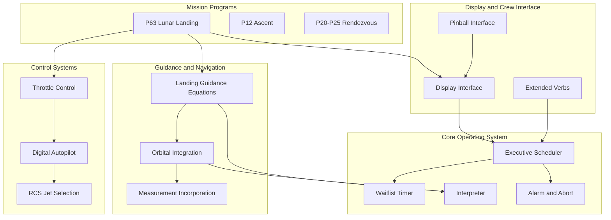

#### Historical Context and Critical Events
#### Apollo 11 Crew
- **Neil Armstrong**: Commander, first person to walk on Moon
- **Buzz Aldrin**: Lunar Module Pilot, second person to walk on Moon
- **Michael Collins**: Command Module Pilot, remained in lunar orbit

#### Mission-Critical Events in Code
#### 1202 Program Alarm (102:38:26 MET)
Location: ALARM_AND_ABORT.agc, WAITLIST.agc, EXECUTIVE.agc
Context: Radar data overloaded executive scheduler, causing task queue overflow.
Flight controller Steve Bales made "Go" decision to continue landing.
Code successfully handled overload through restart protection.

#### Manual Landing Site Selection (~500 feet altitude)
Location: THE_LUNAR_LANDING.agc, LUNAR_LANDING_GUIDANCE_EQUATIONS.agc
Context: Armstrong transitioned to semi-manual control to avoid boulder field.
Original landing site would have placed LM in rough terrain.
Manual site selection extended landing time, reducing fuel margins.

#### "The Eagle Has Landed" (102:45:40 MET)
Location: THE_LUNAR_LANDING.agc completion
Context: Successful touchdown with ~25 seconds of fuel remaining.
This is the code that executed during history's most famous engineering achievement.

#### Low Fuel Warnings
Location: THROTTLE_CONTROL_ROUTINES.agc, LANDING_ANALOG_DISPLAYS.agc
Context: 60-second and 30-second fuel warnings issued during final approach.
Crew and ground controllers monitored fuel critically.

#### Flight Controller Roles
- **Steve Bales (GUIDO)**: Guidance officer, made critical "Go" call during 1202 alarm
- **Jack Garman**: Backroom support, recognized 1202 as non-critical overload
- **Gene Kranz**: Flight director, coordinated all mission control decisions

#### Further Resources
#### Virtual AGC Project
- Website: www.ibiblio.org/apollo
- Assembler: yaYUL for building AGC code
- Emulator: yaAGC for running original flight software
- Documentation: Complete assembly language manual
- Scanned printouts: Original program listings with annotations

#### Mission Documentation
- Apollo 11 Flight Journal: https://history.nasa.gov/ap11fj/
- Mission transcripts: Crew and ground control communications
- Technical reports: MIT Instrumentation Laboratory documentation
- Video archives: Mission footage synchronized with mission elapsed time

#### Academic Resources
- MIT Instrumentation Laboratory reports (R-series)
- AGC memo series (E-series technical memos)
- Apollo Spacecraft News Reference manuals
- NASA Special Publications on guidance and navigation
```

#### Content Generation Strategy

**Information Extraction Approach**:

The documentation content will be generated through systematic analysis of each AGC source file following this structured process:

**Step 1: File-Level Analysis**
- **Read complete AGC source file** to understand overall purpose and scope
- **Identify subroutine boundaries** by scanning for labels followed by code blocks (labels end with whitespace, code follows)
- **Map instruction sequences to spacecraft systems** by analyzing register operations, memory addresses accessed, and I/O channel references
- **Determine mission phase context** by correlating file purpose with mission timeline (landing files → descent phase, ascent files → ascent phase, etc.)
- **Extract existing NASA comments** to preserve historical context and integrate with new documentation

**Step 2: TL;DR Header Generation**
- **Extract filename** from existing file header comment block
- **Determine module classification** by mapping file to subsystem organization from README.md catalogs
- **Identify mission phase** from file purpose and operational context analysis
- **Generate 2-4 sentence summary** covering module purpose, timeline context, controlled systems, and critical dependencies
- **Create navigation notes** for comment-only readers (narrative flow guidance) and code-along readers (technical orientation)
- **Format using mandatory template** with AGC comment syntax (`;` prefix)

**Step 3: Inline Comment Content Generation**

**For Comment-Only Reading Path**:
- **Position narrative comments** between logical code blocks (after subroutine labels, before major sections, at phase transitions)
- **Write operational descriptions** explaining what happens in mission terms without requiring code comprehension
  - Example: "The Lunar Module has descended below 10,000 feet altitude. The guidance computer now transitions to approach phase where Commander Armstrong will take semi-manual control for final landing site selection."
- **Include temporal markers** referencing mission timeline
  - Example: "At mission elapsed time 102:38:26, this section of code triggered program alarm 1202 when the landing radar data overloaded the executive scheduler."
- **Reference crew actions** to connect code behavior to human mission narrative
  - Example: "Buzz Aldrin monitored these altitude and velocity values on the DSKY display during final approach, calling out readings to Armstrong."
- **Bridge code sections** with transition narratives maintaining story flow
  - Example: "With altitude confirmed safe, attention now shifts to velocity management for final touchdown."

**For Code-Along Reading Path**:
- **Document register operations** inline with technical precision
  - Example: "CA RALT ; Load altitude from radar data (scaled by 2^-14 feet) into A register"
- **Explain AGC-specific constructs** that would be non-obvious to general assembly programmers
  - Example: "TC INTPRET ; Transfer control to interpreter virtual machine. Subsequent instructions are interpretive opcodes, not native AGC instructions."
- **Clarify fixed-point arithmetic** with scaling factor documentation
  - Example: "Position vector components scaled by 2^29 meters. Scaling chosen to maximize precision within 15-bit signed word length while representing cislunar distances."
- **Document memory addressing** and banking operations
  - Example: "INDEX MPAC ; Indirect addressing using MPAC as base. Required for variable-position stack access."
- **Explain timing constraints** and interrupt interactions
  - Example: "This section executes under WAITLIST T4 interrupt priority. Maximum execution time 12 milliseconds to avoid next timer tick."
- **Cross-reference related modules** to show call chains
  - Example: "Calls THROTTLE subroutine (lines 450-523 in THROTTLE_CONTROL_ROUTINES.agc) with computed thrust command in MPAC."

**Step 4: Section Transition Narrative Generation**
- **Identify major subsystem boundaries** within files (e.g., transition from initialization to main loop, from altitude monitoring to velocity control)
- **Write transition narratives** using the mandated template format:
```assembly
; ============================================================================
; TRANSITION: From altitude monitoring to velocity control
;
; With altitude confirmed below the 10,000 feet threshold, the guidance 
; computer shifts focus to managing descent velocity. The throttle control
; algorithm implemented in the following section is what Armstrong and Aldrin
; relied upon during the final approach, when fuel margins became critical.
; ============================================================================
```

**Template Application Strategy**:

**File-Header TL;DR Template Application**:
- **Mandatory fields**: FILE, MODULE, MISSION PHASE, TL;DR summary, COMMENT-ONLY READERS note, CODE-ALONG READERS note
- **Template preserved exactly** as specified by user
- **Content customized** per file based on analysis results
- **Example application**:
```assembly
; ============================================================================
; FILE: THE_LUNAR_LANDING.agc
; MODULE: Lunar Landing Guidance
; MISSION PHASE: descent/landing
;
; TL;DR: Implements P63 braking phase program managing powered descent from
;        10,000 feet altitude to lunar surface touchdown. Controls descent
;        engine throttle, monitors navigation state, handles transition from
;        automated guidance to semi-manual control, and processes program
;        alarms including the famous 1202 alarm during Apollo 11 descent.
;
; COMMENT-ONLY READERS: This is the heart of the lunar landing sequence. 
;        Read comments to follow Armstrong and Aldrin's descent to the Moon.
; CODE-ALONG READERS: Study guidance equations integration with throttle
;        control and executive scheduler to understand autonomous landing.
; ============================================================================
```

**Information Source Citation Strategy**:

All technical details will be sourced directly from AGC code analysis with explicit file citations:

- **Code-derived information**: "Source: Luminary099/THE_LUNAR_LANDING.agc:40-62"
- **Historical mission events**: "Source: Apollo 11 Flight Journal, mission elapsed time 102:38:26"
- **AGC architecture details**: "Source: Comanche055/ASSEMBLY_AND_OPERATION_INFORMATION.agc, Virtual AGC Assembly Language Manual"
- **Crew procedures**: "Source: Apollo 11 Mission Transcripts, surface journal entries"

**Documentation Standards**:

**Markdown Formatting** (for reading-instructions.md only):
- Headers: `#` for title, `##` for major sections, `###` for subsections
- Code blocks: Triple backticks with `mermaid` or `assembly` language tags
- Tables: Pipe-delimited with header separators
- Lists: `-` for unordered, `1.` for ordered
- Links: `[text](url)` format for external resources
- Emphasis: `**bold**` for critical terms, `*italic*` for clarification

**AGC Assembly Comment Formatting** (for all .agc files):
- Comment prefix: `;` character at line start followed by space
- Section headers: `;` followed by `=` repeated 76 times for separator lines
- Indentation: Align comments with code indentation level where appropriate
- Line length: Respect 80-column conventions where feasible
- Whitespace: Blank comment lines (`;` alone) for visual separation between major blocks
- Preservation: Never modify existing NASA comments, only add new comment lines

**Consistent Terminology Application**:
- Use NASA standard abbreviations (CSM, LM, RCS, SPS, DPS, APS, IMU, DSKY)
- Define terms on first usage in each file
- Maintain term consistency across all documentation (e.g., always "DSKY" never "display keyboard")
- Spell out acronyms in reading-instructions.md glossary
- Use mission-standard nomenclature (e.g., "powered descent initiation" not "descent start")

#### Diagram and Visual Strategy

**Mermaid Diagram Integration**:

All diagrams will be embedded in reading-instructions.md using Mermaid syntax enclosed in triple-backtick code blocks with `mermaid` language specifier. No diagrams will be embedded in AGC source files (preserving code-only format).

**Required Diagram Types**:

**1. System Architecture Diagram** - High-level component relationships
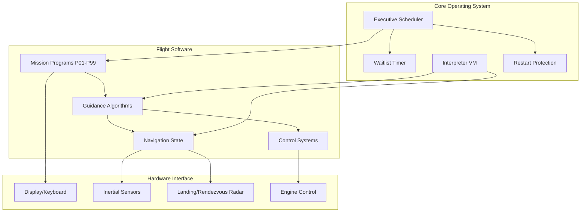

**2. Lunar Descent Sequence Diagram** - Timeline of landing phase
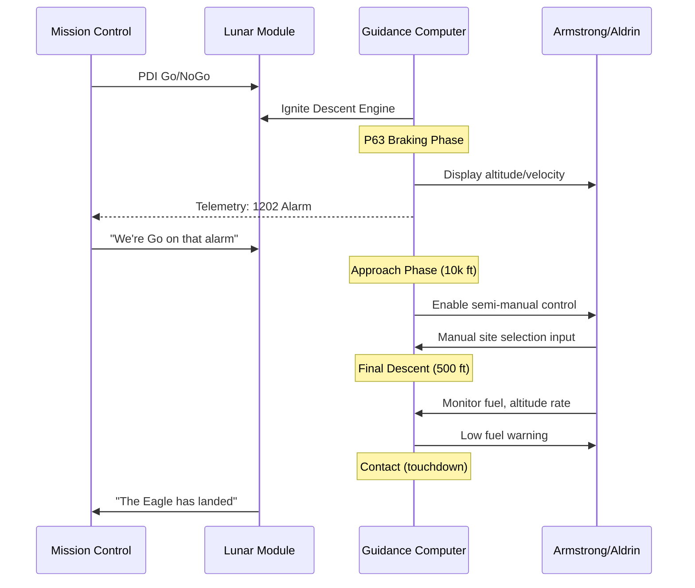

**3. AGC Memory Architecture Diagram** - Memory organization
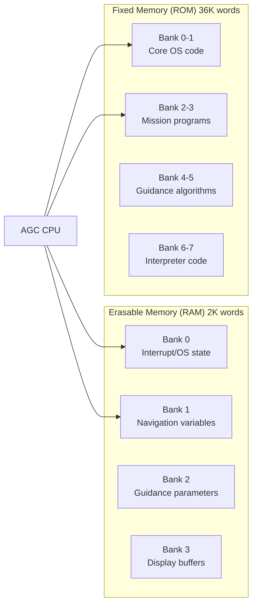

**4. DSKY Verb/Noun State Machine** - Crew interface logic
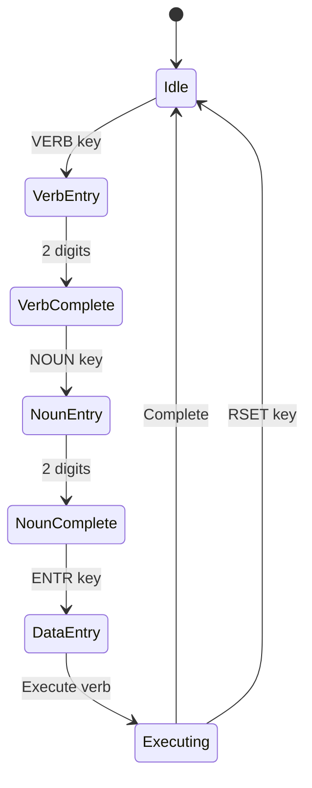

**5. Executive Scheduler Priority Queue** - Task management
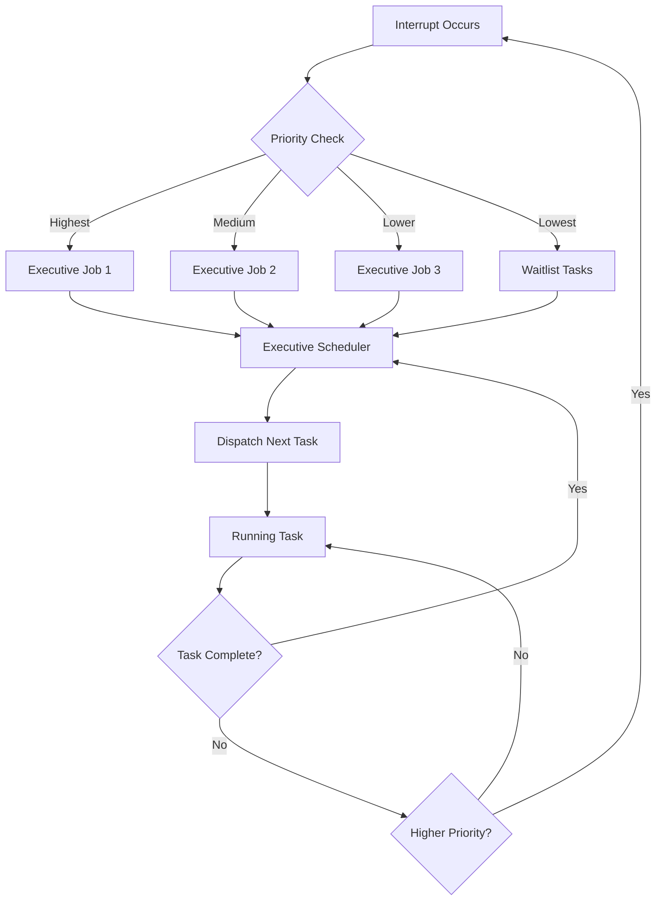

**Diagram Content Requirements**:

- **Component naming**: Use official NASA terminology consistently
- **Relationship labels**: Clearly label arrows and connections with action verbs
- **Subsystem grouping**: Use Mermaid subgraph feature to show logical organization
- **Historical annotation**: Include notes (Mermaid `Note over` syntax) for critical mission events
- **Legend provision**: Where symbols/colors used, provide legend explanation in surrounding markdown

**Diagram Placement Strategy**:

- **reading-instructions.md Section 7 (Module Interdependency Map)**: System architecture diagram, memory architecture diagram, DSKY state machine diagram
- **reading-instructions.md Section 8 (Historical Context)**: Lunar descent sequence diagram showing mission timeline
- **reading-instructions.md Section 4 (AGC Architecture Primer)**: Executive scheduler priority queue diagram illustrating OS concepts

**Diagram Style Guidelines**:

- **Consistent node shapes**: Rectangles for software modules, rounded rectangles for hardware, diamonds for decision points
- **Directional clarity**: Use arrows to show data flow and control flow
- **Color restraint**: Rely on GitHub's default Mermaid theme, avoiding custom colors that may not render consistently
- **Annotation precision**: Use `Note` annotations sparingly for critical historical or technical clarifications
- **Accessibility**: Ensure diagram information is also available in surrounding text for readers unable to view graphics

## 0.5 Documentation File Transformation Mapping

#### File-by-File Documentation Plan

**CRITICAL**: This section maps EVERY documentation file to be created or updated. All 140+ AGC source files will receive documentation treatment following the transformation modes specified.

**Documentation Transformation Modes**:
- **UPDATE**: Add documentation to existing AGC source file (file-header TL;DR + inline comments + section transitions)
- **CREATE**: Create new documentation file
- **REFERENCE**: Use existing file as style/structure example (no modifications)

**Complete File Transformation Mapping**:

| Target Documentation File | Transformation | Source Code/Reference | Content/Changes |
|---------------------------|----------------|----------------------|-----------------|
| **NEW DOCUMENTATION FILE** | | | |
| reading-instructions.md | CREATE | N/A (standalone guide) | Complete dual-path navigation guide with: 1) Introduction to documentation system, 2) Reading path selection criteria, 3) AGC architecture primer (hardware, memory, registers, instruction set, DSKY, OS), 4) Mission timeline reading order mapping all files to mission phases, 5) Comprehensive terminology glossary (AGC terms, mission phases, spacecraft systems, navigation sensors), 6) Module interdependency Mermaid diagrams, 7) Historical context with critical events (1202 alarm, manual landing, crew/controller roles), 8) Further resources (Virtual AGC, mission docs, academic refs) |
| **COMANCHE055 COMMAND MODULE FILES - INFORMATION SUBSYSTEM** | | | |
| Comanche055/CONTRACT_AND_APPROVALS.agc | UPDATE | Comanche055/CONTRACT_AND_APPROVALS.agc | Add file-header TL;DR block: Contract DSR project 55-23870, MIT Instrumentation Laboratory development, NASA sponsorship, program purpose for Command Module R-577 specification, historical significance as legally binding flight software approval |
| Comanche055/ASSEMBLY_AND_OPERATION_INFORMATION.agc | UPDATE | Comanche055/ASSEMBLY_AND_OPERATION_INFORMATION.agc | Add TL;DR header + inline comments explaining: Assembly directive purposes, subroutine call structure table organization, memory organization philosophy, operational modes, bank addressing, yaYUL assembler targeting notes |
| Comanche055/TAGS_FOR_RELATIVE_SETLOC.agc | UPDATE | Comanche055/TAGS_FOR_RELATIVE_SETLOC.agc | Add TL;DR header + inline comments documenting: SETLOC tag purposes, memory segment allocation strategy, relative addressing setup, bank assignment rationale |
| **COMANCHE055 - COMERASE SUBSYSTEM** | | | |
| Comanche055/ERASABLE_ASSIGNMENTS.agc | UPDATE | Comanche055/ERASABLE_ASSIGNMENTS.agc | Add TL;DR header + structured table format comments documenting complete 2K RAM memory map: Group variables by functional area (navigation state vectors, guidance parameters, control system state, display buffers, interrupt state, executive/waitlist queues), document data types, scaling factors (e.g., position scaled 2^29 m), variable purposes, update frequency |
| **COMANCHE055 - COMAID SUBSYSTEM (21 files)** | | | |
| Comanche055/INTERRUPT_LEAD_INS.agc | UPDATE | Comanche055/INTERRUPT_LEAD_INS.agc | Add TL;DR + comments: Interrupt vector table organization, priority levels (T4RUPT > T3RUPT > DSRUPT > KEYRUPT > UPRUPT), entry point mechanics, context save/restore requirements |
| Comanche055/T4RUPT_PROGRAM.agc | UPDATE | Comanche055/T4RUPT_PROGRAM.agc | Add TL;DR + comments: Timer 4 interrupt handler (highest priority), 10-millisecond timing cycle, WAITLIST task dispatching, TIME increment, IMU CDU sampling, mission timeline role |
| Comanche055/DOWNLINK_LISTS.agc | UPDATE | Comanche055/DOWNLINK_LISTS.agc | Add TL;DR + comments: Telemetry data structure formatting, downlink packet organization, ground station protocol, data priority/frequency, MSFN communication |
| Comanche055/FRESH_START_AND_RESTART.agc | UPDATE | Comanche055/FRESH_START_AND_RESTART.agc | Add TL;DR + comments: Cold start initialization vs warm restart differentiation, memory scrubbing, default value loading, restart group assignment, crew procedure integration |
| Comanche055/RESTART_TABLES.agc | UPDATE | Comanche055/RESTART_TABLES.agc | Add TL;DR + comments: Restart protection philosophy, table organization, task phase encoding, state restoration mechanism, criticality during 1202 alarm context |
| Comanche055/SXTMARK.agc | UPDATE | Comanche055/SXTMARK.agc | Add TL;DR + comments: Sextant optical navigation, star/landmark mark processing, crew sighting procedure, IMU alignment verification |
| Comanche055/EXTENDED_VERBS.agc | UPDATE | Comanche055/EXTENDED_VERBS.agc | Add TL;DR + inline verb catalog comments: Document each verb function (V01-V99), required noun associations, crew procedures, display effects, mission phase usage examples |
| Comanche055/PINBALL_NOUN_TABLES.agc | UPDATE | Comanche055/PINBALL_NOUN_TABLES.agc | Add TL;DR + inline noun catalog comments: Document each noun data type (N01-N99), data format, scaling factors, display modes, associated verbs |
| Comanche055/CSM_GEOMETRY.agc | UPDATE | Comanche055/CSM_GEOMETRY.agc | Add TL;DR + comments: CM/SM physical dimensions, mass properties, center-of-gravity locations, IMU mounting geometry, RCS thruster positions |
| Comanche055/IMU_COMPENSATION_PACKAGE.agc | UPDATE | Comanche055/IMU_COMPENSATION_PACKAGE.agc | Add TL;DR + comments: Gyro drift compensation algorithms, accelerometer bias correction, temperature effects, calibration parameter application |
| Comanche055/PINBALL_GAME_BUTTONS_AND_LIGHTS.agc | UPDATE | Comanche055/PINBALL_GAME_BUTTONS_AND_LIGHTS.agc | Add TL;DR + comprehensive comments: DSKY button press handling (VERB/NOUN/KEY RELS/ENTR/RSET/+/-/0-9), display update state machine, indicator light control (COMP ACTY, UPLINK ACTY, NO ATT, STBY, KEY REL, OPR ERR, TEMP, GIMBAL LOCK, PROG, RESTART, TRACKER, ALT, VEL), verb/noun processing workflow, crew interaction sequences during critical mission phases |
| Comanche055/R60_62.agc | UPDATE | Comanche055/R60_62.agc | Add TL;DR + comments: Rendezvous radar self-test procedures, initialization sequence, fault detection |
| Comanche055/ANGLFIND.agc | UPDATE | Comanche055/ANGLFIND.agc | Add TL;DR + comments: Angle determination algorithms, spacecraft attitude computation from IMU, coordinate frame transformations |
| Comanche055/GIMBAL_LOCK_AVOIDANCE.agc | UPDATE | Comanche055/GIMBAL_LOCK_AVOIDANCE.agc | Add TL;DR + comments: Euler angle singularity explanation, gimbal lock detection (middle gimbal ~90°), avoidance maneuvers, crew warning procedures |
| Comanche055/KALCMANU_STEERING.agc | UPDATE | Comanche055/KALCMANU_STEERING.agc | Add TL;DR + comments: Kalman filter optimal estimation for steering, maneuver execution, attitude error minimization |
| Comanche055/SYSTEM_TEST_STANDARD_LEAD_INS.agc | UPDATE | Comanche055/SYSTEM_TEST_STANDARD_LEAD_INS.agc | Add TL;DR + comments: System self-test entry points, test sequence organization, pass/fail criteria |
| Comanche055/IMU_CALIBRATION_AND_ALIGNMENT.agc | UPDATE | Comanche055/IMU_CALIBRATION_AND_ALIGNMENT.agc | Add TL;DR + comments: Star sighting alignment procedures, gyrocompass mode, course align, fine align, alignment quality metrics |
| **COMANCHE055 - COMEKISS SUBSYSTEM (6 files)** | | | |
| Comanche055/GROUND_TRACKING_DETERMINATION_PROGRAM.agc | UPDATE | Comanche055/GROUND_TRACKING_DETERMINATION_PROGRAM.agc | Add TL;DR + comments: Ground station tracking data processing, Doppler shift analysis, navigation state update |
| Comanche055/P34-35_P74-75.agc | UPDATE | Comanche055/P34-35_P74-75.agc | Add TL;DR + comments: Lambert targeting for orbit transfers, two-point boundary value problem solver, time-of-flight optimization, mission planning usage |
| Comanche055/R31.agc | UPDATE | Comanche055/R31.agc | Add TL;DR + comments: Display orbital parameters (apogee/perigee altitudes, period, eccentricity), Keplerian element computation |
| Comanche055/P76.agc | UPDATE | Comanche055/P76.agc | Add TL;DR + comments: Target ΔV computation, external maneuver planning, ground uplink integration |
| Comanche055/R30.agc | UPDATE | Comanche055/R30.agc | Add TL;DR + comments: Orbit parameter display, reference frame conversions (inertial to rotating) |
| Comanche055/STABLE_ORBIT.agc | UPDATE | Comanche055/STABLE_ORBIT.agc | Add TL;DR + comments: Stable orbit determination, coast phase monitoring, orbit decay prediction |
| **COMANCHE055 - TROUBLE SUBSYSTEM (15 files)** | | | |
| Comanche055/P11.agc | UPDATE | Comanche055/P11.agc | Add TL;DR + comments: Earth orbit insertion monitoring, ascent targeting verification, orbital parameter validation |
| Comanche055/TPI_SEARCH.agc | UPDATE | Comanche055/TPI_SEARCH.agc | Add TL;DR + comments: Terminal phase initiation search, rendezvous timing optimization, relative phase angle computation |
| Comanche055/P20-P25.agc | UPDATE | Comanche055/P20-P25.agc | Add TL;DR + comments: Complete rendezvous navigation suite, relative state estimation, radar tracking, targeting computation, multi-program integration (P20 external ΔV, P21 ground track, P22 orbit determination, P23 cislunar nav, P25 auto optics) |
| Comanche055/P30-P37.agc | UPDATE | Comanche055/P30-P37.agc | Add TL;DR + comments: External ΔV program suite, burn targeting, CSI/CDH/TPI planning |
| Comanche055/P32-P33_P72-P73.agc | UPDATE | Comanche055/P32-P33_P72-P73.agc | Add TL;DR + comments: Coelliptic sequence initiation, concentric rendezvous planning, height adjustment maneuvers |
| Comanche055/P40-P47.agc | UPDATE | Comanche055/P40-P47.agc | Add TL;DR + comments: SPS burn programs (P40 SPS, P41 RCS), burn sequencing (ullage, ignition, monitoring, cutoff), navigation state extrapolation, mission phase usage (TLI, LOI, TEI) |
| Comanche055/P51-P53.agc | UPDATE | Comanche055/P51-P53.agc | Add TL;DR + comments: IMU alignment programs (P51 manual optics, P52 auto optics, P53 backup), star catalog usage, alignment quality assessment |
| Comanche055/LUNAR_AND_SOLAR_EPHEMERIDES_SUBROUTINES.agc | UPDATE | Comanche055/LUNAR_AND_SOLAR_EPHEMERIDES_SUBROUTINES.agc | Add TL;DR + comments: Moon/Sun position computation, ephemeris polynomial evaluation, coordinate transformations |
| Comanche055/P61-P67.agc | UPDATE | Comanche055/P61-P67.agc | Add TL;DR + comments: Entry programs (P61 initialization, P62 ballistic, P63 lifting entry, P64 CM/SM separation, P65 skip targeting, P66 entry monitoring, P67 final phase), atmospheric entry guidance timeline |
| Comanche055/SERVICER207.agc | UPDATE | Comanche055/SERVICER207.agc | Add TL;DR + comments: Mission servicer background tasks, housekeeping functions, periodic updates |
| Comanche055/ENTRY_LEXICON.agc | UPDATE | Comanche055/ENTRY_LEXICON.agc | Add TL;DR + comments: Entry program constant definitions, atmospheric model parameters, entry corridor constraints |
| Comanche055/REENTRY_CONTROL.agc | UPDATE | Comanche055/REENTRY_CONTROL.agc | Add TL;DR + comments: Atmospheric reentry guidance, lift vector control for range targeting, bank angle modulation, Apollo 11 Pacific splashdown context |
| Comanche055/CM_BODY_ATTITUDE.agc | UPDATE | Comanche055/CM_BODY_ATTITUDE.agc | Add TL;DR + comments: CM attitude determination, body frame to inertial frame conversion |
| Comanche055/P37_P70.agc | UPDATE | Comanche055/P37_P70.agc | Add TL;DR + comments: Return to Earth targeting (P37), transearth injection planning (P70), burn parameter computation |
| Comanche055/S-BAND_ANTENNA_FOR_CM.agc | UPDATE | Comanche055/S-BAND_ANTENNA_FOR_CM.agc | Add TL;DR + comments: S-band high-gain antenna Earth tracking, pointing algorithm, communication link maintenance |
| Comanche055/LUNAR_LANDMARK_SELECTION_FOR_CM.agc | UPDATE | Comanche055/LUNAR_LANDMARK_SELECTION_FOR_CM.agc | Add TL;DR + comments: Lunar surface landmark optical tracking, navigation update |
| **COMANCHE055 - TVCDAPS SUBSYSTEM (12 files)** | | | |
| Comanche055/TVCINITIALIZE.agc | UPDATE | Comanche055/TVCINITIALIZE.agc | Add TL;DR + comments: TVC initialization sequence, engine gimbal setup, control gains configuration |
| Comanche055/TVCEXECUTIVE.agc | UPDATE | Comanche055/TVCEXECUTIVE.agc | Add TL;DR + comments: TVC executive scheduler, control loop timing (20ms cycle), DAP integration |
| Comanche055/TVCMASSPROP.agc | UPDATE | Comanche055/TVCMASSPROP.agc | Add TL;DR + comments: Mass properties computation, center-of-gravity tracking, propellant usage effects, inertia tensor updates |
| Comanche055/TVCRESTARTS.agc | UPDATE | Comanche055/TVCRESTARTS.agc | Add TL;DR + comments: TVC restart protection, control state preservation |
| Comanche055/TVCDAPS.agc | UPDATE | Comanche055/TVCDAPS.agc | Add TL;DR + comments: TVC digital autopilot, PID control loops (pitch/yaw/roll), engine gimbal commands, attitude error correction |
| Comanche055/TVCSTROKETEST.agc | UPDATE | Comanche055/TVCSTROKETEST.agc | Add TL;DR + comments: Engine gimbal stroke testing, range verification, actuator health checks |
| Comanche055/TVCROLLDAP.agc | UPDATE | Comanche055/TVCROLLDAP.agc | Add TL;DR + comments: Roll axis digital autopilot, roll attitude control during SPS burns |
| Comanche055/MYSUBS.agc | UPDATE | Comanche055/MYSUBS.agc | Add TL;DR + comments: Utility subroutines for control system calculations |
| Comanche055/RCS-CSM_DIGITAL_AUTOPILOT.agc | UPDATE | Comanche055/RCS-CSM_DIGITAL_AUTOPILOT.agc | Add TL;DR + comments: RCS digital autopilot, thruster firing logic, minimum impulse mode, attitude deadband control, propellant conservation |
| Comanche055/AUTOMATIC_MANEUVERS.agc | UPDATE | Comanche055/AUTOMATIC_MANEUVERS.agc | Add TL;DR + comments: Automated attitude maneuver sequences, crew-commanded rotations, inertial hold modes |
| Comanche055/RCS-CSM_DAP_EXECUTIVE_PROGRAMS.agc | UPDATE | Comanche055/RCS-CSM_DAP_EXECUTIVE_PROGRAMS.agc | Add TL;DR + comments: RCS DAP executive integration with main scheduler |
| Comanche055/JET_SELECTION_LOGIC.agc | UPDATE | Comanche055/JET_SELECTION_LOGIC.agc | Add TL;DR + comments: RCS jet selection algorithms, thruster coupling effects, jet pair selection, failed jet isolation, propellant balancing across quads |
| Comanche055/CM_ENTRY_DIGITAL_AUTOPILOT.agc | UPDATE | Comanche055/CM_ENTRY_DIGITAL_AUTOPILOT.agc | Add TL;DR + comments: Entry phase autopilot, lift vector steering, bank angle control, range and crossrange error correction |
| **COMANCHE055 - CHIEFTAN SUBSYSTEM (22 files)** | | | |
| Comanche055/DOWN-TELEMETRY_PROGRAM.agc | UPDATE | Comanche055/DOWN-TELEMETRY_PROGRAM.agc | Add TL;DR + comments: Downlink telemetry formatting, packet structure, ground station protocol (MSFN), data selection priorities |
| Comanche055/INTER-BANK_COMMUNICATION.agc | UPDATE | Comanche055/INTER-BANK_COMMUNICATION.agc | Add TL;DR + comments: Memory bank switching routines, BANKCALL mechanism, fixed-fixed and fixed-erasable transitions, return address preservation |
| Comanche055/INTERPRETER.agc | UPDATE | Comanche055/INTERPRETER.agc | Add TL;DR + comprehensive comments: Complete interpretive language virtual machine instruction set documentation (70+ opcodes), stack machine architecture, double-precision arithmetic (DP, DCOMP, DDV, etc.), vector operations (VAD, VSU, VXSC, VXV, etc.), matrix operations (MXV), trigonometric functions (SIN, COS, ARCSIN, etc.), scaling conventions, TC INTPRET entry, EXIT return, MPAC stack usage, opcode format (paired instructions), execution timing |
| Comanche055/FIXED_FIXED_CONSTANT_POOL.agc | UPDATE | Comanche055/FIXED_FIXED_CONSTANT_POOL.agc | Add TL;DR + inline constant documentation: Mathematical constants (PI, E, etc.) with full precision, physical constants (gravitational parameters, planetary radii, etc.) with units, scaling factors, accuracy notes |
| Comanche055/INTERPRETIVE_CONSTANTS.agc | UPDATE | Comanche055/INTERPRETIVE_CONSTANTS.agc | Add TL;DR + comments: Interpretive language constant definitions |
| Comanche055/SINGLE_PRECISION_SUBROUTINES.agc | UPDATE | Comanche055/SINGLE_PRECISION_SUBROUTINES.agc | Add TL;DR + comments: Single-precision math utilities, division, square root approximations |
| Comanche055/EXECUTIVE.agc | UPDATE | Comanche055/EXECUTIVE.agc | Add TL;DR + comprehensive comments: Task scheduler architecture, cooperative multitasking model, priority job queue (7 core sets), job management (NOVAC, FINDVAC), task switching mechanism, 1202 alarm context (executive overflow when job queue full), restart integration |
| Comanche055/WAITLIST.agc | UPDATE | Comanche055/WAITLIST.agc | Add TL;DR + comprehensive comments: Timer-driven task scheduler, delta-time queue structure, WAITLIST task insertion/deletion, T4RUPT integration, preemptive scheduling, 1202 alarm context (WAITLIST overflow contributing factor), timing precision |
| Comanche055/LATITUDE_LONGITUDE_SUBROUTINES.agc | UPDATE | Comanche055/LATITUDE_LONGITUDE_SUBROUTINES.agc | Add TL;DR + comments: Geodetic coordinate transformations, Earth/Moon latitude-longitude computation |
| Comanche055/PLANETARY_INERTIAL_ORIENTATION.agc | UPDATE | Comanche055/PLANETARY_INERTIAL_ORIENTATION.agc | Add TL;DR + comments: Coordinate frame transformations, inertial to rotating frame, REFSMMAT usage |
| Comanche055/MEASUREMENT_INCORPORATION.agc | UPDATE | Comanche055/MEASUREMENT_INCORPORATION.agc | Add TL;DR + comments: Navigation state update with sensor measurements, Kalman filtering, state covariance propagation, measurement weighting |
| Comanche055/CONIC_SUBROUTINES.agc | UPDATE | Comanche055/CONIC_SUBROUTINES.agc | Add TL;DR + comments: Orbital mechanics calculations, Keplerian orbit propagation, conic section mathematics, two-body problem solutions, position/velocity to orbital elements conversion |
| Comanche055/INTEGRATION_INITIALIZATION.agc | UPDATE | Comanche055/INTEGRATION_INITIALIZATION.agc | Add TL;DR + comments: Numerical integration setup, Encke method initialization for precision, rectification logic, coordinate system setup |
| Comanche055/ORBITAL_INTEGRATION.agc | UPDATE | Comanche055/ORBITAL_INTEGRATION.agc | Add TL;DR + comments: Orbit propagation numerical integration, Encke method for perturbed motion, perturbation forces (oblateness, solar/lunar gravity), integration step size control |
| Comanche055/INFLIGHT_ALIGNMENT_ROUTINES.agc | UPDATE | Comanche055/INFLIGHT_ALIGNMENT_ROUTINES.agc | Add TL;DR + comments: In-flight IMU alignment procedures, platform realignment without shutdown |
| Comanche055/POWERED_FLIGHT_SUBROUTINES.agc | UPDATE | Comanche055/POWERED_FLIGHT_SUBROUTINES.agc | Add TL;DR + comments: Powered flight trajectory utilities, thrust integration, navigation during burns |
| Comanche055/TIME_OF_FREE_FALL.agc | UPDATE | Comanche055/TIME_OF_FREE_FALL.agc | Add TL;DR + comments: Free-fall trajectory time-of-flight calculations, Lambert problem variations |
| Comanche055/STAR_TABLES.agc | UPDATE | Comanche055/STAR_TABLES.agc | Add TL;DR + comments: Star catalog for optical navigation, star positions, magnitudes, identification codes |
| Comanche055/AGC_BLOCK_TWO_SELF-CHECK.agc | UPDATE | Comanche055/AGC_BLOCK_TWO_SELF-CHECK.agc | Add TL;DR + comments: Self-test diagnostics, instruction validation, memory testing, test coverage, error detection/reporting |
| Comanche055/PHASE_TABLE_MAINTENANCE.agc | UPDATE | Comanche055/PHASE_TABLE_MAINTENANCE.agc | Add TL;DR + comments: Mission phase state management, program phase tracking, restart phase tables |
| Comanche055/RESTARTS_ROUTINE.agc | UPDATE | Comanche055/RESTARTS_ROUTINE.agc | Add TL;DR + comments: Restart recovery logic, task state restoration, restart groups, critical during power transients |
| Comanche055/IMU_MODE_SWITCHING_ROUTINES.agc | UPDATE | Comanche055/IMU_MODE_SWITCHING_ROUTINES.agc | Add TL;DR + comments: IMU mode transitions (coarse align, fine align, gyrocompass mode), mode switching procedures, calibration integration |
| Comanche055/KEYRUPT_UPRUPT.agc | UPDATE | Comanche055/KEYRUPT_UPRUPT.agc | Add TL;DR + comments: Keyboard interrupt handler (DSKY button presses), uplink interrupt handler (ground commands), input buffering |
| Comanche055/DISPLAY_INTERFACE_ROUTINES.agc | UPDATE | Comanche055/DISPLAY_INTERFACE_ROUTINES.agc | Add TL;DR + comprehensive comments: DSKY display management, seven-segment display formatting, decimal/octal conversion, sign display, verb/noun state machine, display buffer updates, blanking control, flash patterns |
| Comanche055/SERVICE_ROUTINES.agc | UPDATE | Comanche055/SERVICE_ROUTINES.agc | Add TL;DR + comments: Utility service functions, time conversions, common math operations |
| Comanche055/ALARM_AND_ABORT.agc | UPDATE | Comanche055/ALARM_AND_ABORT.agc | Add TL;DR + comprehensive comments: Program alarm system, complete alarm code catalog (1201 executive overflow, 1202 waitlist overflow, 1203-1207 other alarms), alarm display on DSKY, alarm history recording, abort mode logic, crew procedures for alarm response, Apollo 11 1202 alarm historical context |
| Comanche055/UPDATE_PROGRAM.agc | UPDATE | Comanche055/UPDATE_PROGRAM.agc | Add TL;DR + comments: Uplink command processing, state vector updates from ground, navigation corrections, command verification |
| Comanche055/RT8_OP_CODES.agc | UPDATE | Comanche055/RT8_OP_CODES.agc | Add TL;DR + comments: Interpreter opcode implementations (RTB return to bank operations), special function implementations |
| **LUMINARY099 LUNAR MODULE FILES - CORE INFORMATION** | | | |
| Luminary099/MAIN.agc | UPDATE | Luminary099/MAIN.agc | Add TL;DR header: Top-level assembly file structure, file inclusion organization, compilation notes for LM configuration |
| Luminary099/ASSEMBLY_AND_OPERATION_INFORMATION.agc | UPDATE | Luminary099/ASSEMBLY_AND_OPERATION_INFORMATION.agc | Add TL;DR + comments: LM-specific assembly information, operational notes for lunar landing mission, subroutine organization |
| Luminary099/TAGS_FOR_RELATIVE_SETLOC.agc | UPDATE | Luminary099/TAGS_FOR_RELATIVE_SETLOC.agc | Add TL;DR + comments: LM memory segment tags, bank allocation |
| Luminary099/CONTROLLED_CONSTANTS.agc | UPDATE | Luminary099/CONTROLLED_CONSTANTS.agc | Add TL;DR + comments: LM mission constants, landing site coordinates, trajectory parameters |
| Luminary099/INPUT_OUTPUT_CHANNEL_BIT_DESCRIPTIONS.agc | UPDATE | Luminary099/INPUT_OUTPUT_CHANNEL_BIT_DESCRIPTIONS.agc | Add TL;DR + comments: I/O channel bit assignments, hardware interface definitions, sensor/actuator mappings |
| Luminary099/FLAGWORD_ASSIGNMENTS.agc | UPDATE | Luminary099/FLAGWORD_ASSIGNMENTS.agc | Add TL;DR + comments: Software flag definitions, flag bit assignments, flag purposes (e.g., MUNFLAG, P25FLAG, RNDVZFLG from FLAGORGY) |
| Luminary099/ERASABLE_ASSIGNMENTS.agc | UPDATE | Luminary099/ERASABLE_ASSIGNMENTS.agc | Add TL;DR + structured memory map comments: LM-specific 2K RAM organization, landing-specific variables, ascent parameters |
| **LUMINARY099 - MISSION-CRITICAL LANDING SEQUENCE** | | | |
| Luminary099/THE_LUNAR_LANDING.agc | UPDATE | Luminary099/THE_LUNAR_LANDING.agc | Add TL;DR + EXTENSIVE inline comments: Complete P63 braking phase narrative from PDI through touchdown, FLAGORGY subroutine flag purposes explained (NOTHROTL, REDFLAG, LRBYPASS, MUNFLAG, P25FLAG, RNDVZFLG), descent phases (braking, approach, landing), guidance algorithm integration, throttle control coordination, 1202 alarm occurrence at ~102:38:26 MET, transition to semi-manual control at ~500ft, Armstrong's manual site selection, fuel margins, landing at 102:45:40 MET, "The Eagle has landed" moment, historical context throughout |
| Luminary099/LUNAR_LANDING_GUIDANCE_EQUATIONS.agc | UPDATE | Luminary099/LUNAR_LANDING_GUIDANCE_EQUATIONS.agc | Add TL;DR + comprehensive comments: Powered descent trajectory mathematics, fuel-optimal guidance law, landing site targeting, gravity turn, constant deceleration phase, visibility phase for terrain observation, throttle command generation, attitude command generation |
| Luminary099/THROTTLE_CONTROL_ROUTINES.agc | UPDATE | Luminary099/THROTTLE_CONTROL_ROUTINES.agc | Add TL;DR + comprehensive comments: DPS throttle management, throttle range (10-60% then 60-100%), engine response dynamics, command smoothing, fuel slosh considerations, low fuel warning integration, fuel quantity monitoring |
| Luminary099/LANDING_ANALOG_DISPLAYS.agc | UPDATE | Luminary099/LANDING_ANALOG_DISPLAYS.agc | Add TL;DR + comments: Crew landing displays, altitude rate meter, horizontal velocity, DSKY numerical displays, landing radar data validity, crew monitoring procedures during descent |
| Luminary099/BURN_BABY_BURN--MASTER_IGNITION_ROUTINE.agc | UPDATE | Luminary099/BURN_BABY_BURN--MASTER_IGNITION_ROUTINE.agc | Add TL;DR + comments: Master ignition sequence for DPS/APS, ullage motor firing for propellant settling, engine start verification, ignition timing, abort criteria, naming history (Magnificent Montague context already present) |
| **LUMINARY099 - ASCENT AND RENDEZVOUS** | | | |
| Luminary099/ASCENT_GUIDANCE.agc | UPDATE | Luminary099/ASCENT_GUIDANCE.agc | Add TL;DR + comments: Lunar surface ascent guidance, insertion targeting for rendezvous, vertical rise phase, pitchover sequence, closed-loop guidance to orbital insertion |
| Luminary099/P12.agc | UPDATE | Luminary099/P12.agc | Add TL;DR + comments: Powered ascent program, crew initiation procedure, guidance phase progression, Eagle's ascent July 21 context |
| Luminary099/P20-P25.agc | UPDATE | Luminary099/P20-P25.agc | Add TL;DR + comments: LM rendezvous navigation suite, radar tracking of CM, relative state estimation, rendezvous targeting |
| **LUMINARY099 - DISPLAY AND CREW INTERFACE** | | | |
| Luminary099/PINBALL_GAME_BUTTONS_AND_LIGHTS.agc | UPDATE | Luminary099/PINBALL_GAME_BUTTONS_AND_LIGHTS.agc | Add TL;DR + comprehensive comments: LM DSKY interface, button handling, display updates, verb/noun processing, crew procedures during landing |
| Luminary099/DISPLAY_INTERFACE_ROUTINES.agc | UPDATE | Luminary099/DISPLAY_INTERFACE_ROUTINES.agc | Add TL;DR + comments: LM display management, DSKY formatting, LM-specific display modes |
| **LUMINARY099 - CORE OPERATING SYSTEM** | | | |
| Luminary099/EXECUTIVE.agc | UPDATE | Luminary099/EXECUTIVE.agc | Add TL;DR + comprehensive comments: LM task scheduler, job management, 1202 alarm context specific to LM descent workload, job queue overflow during radar data processing |
| Luminary099/WAITLIST.agc | UPDATE | Luminary099/WAITLIST.agc | Add TL;DR + comprehensive comments: LM timer task scheduler, delta-time queue, 1202 alarm contribution from WAITLIST overflow, descent phase computational load |
| Luminary099/INTERPRETER.agc | UPDATE | Luminary099/INTERPRETER.agc | Add TL;DR + comprehensive comments: LM interpretive language VM, instruction set documentation (same architecture as CM but LM-specific usage patterns) |
| Luminary099/ALARM_AND_ABORT.agc | UPDATE | Luminary099/ALARM_AND_ABORT.agc | Add TL;DR + comprehensive comments: LM alarm system, alarm code catalog (1201/1202 + LM-specific alarms), abort program integration (P70/P71), crew abort procedures, Apollo 11 alarm response |
| **LUMINARY099 - AUTOPILOT AND CONTROL** | | | |
| Luminary099/P-AXIS_RCS_AUTOPILOT.agc | UPDATE | Luminary099/P-AXIS_RCS_AUTOPILOT.agc | Add TL;DR + comments: LM pitch axis RCS autopilot, attitude control during descent/ascent, thruster logic |
| Luminary099/Q_R-AXIS_RCS_AUTOPILOT.agc | UPDATE | Luminary099/Q_R-AXIS_RCS_AUTOPILOT.agc | Add TL;DR + comments: LM yaw/roll axes RCS autopilot, coupled control, attitude hold |
| Luminary099/TJET_LAW.agc | UPDATE | Luminary099/TJET_LAW.agc | Add TL;DR + comments: Thruster jet firing laws, minimum impulse commands, fuel conservation |
| Luminary099/TRIM_GIMBAL_CONTROL_SYSTEM.agc | UPDATE | Luminary099/TRIM_GIMBAL_CONTROL_SYSTEM.agc | Add TL;DR + comments: Engine gimbal trim control, DPS/APS gimbal management, thrust vector alignment |
| **LUMINARY099 - ALL REMAINING FILES** | | | |
| Luminary099/[All remaining 45+ files] | UPDATE | Luminary099/[corresponding source] | Each file receives: TL;DR header block following mandatory template, inline comments for comment-only narrative path, inline comments for code-along technical path, section transition narratives where appropriate, mission phase context integration, crew/historical event references where relevant |
| **REFERENCE FILES (No Changes)** | | | |
| Comanche055/README.md | REFERENCE | Comanche055/README.md | Use as reference for file organization and page number mapping. No modifications |
| Luminary099/README.md | REFERENCE | Luminary099/README.md | Use as reference for file organization and page number mapping. No modifications |
| README.md | REFERENCE | README.md | Repository overview remains unchanged. No modifications |
| CONTRIBUTING.md | REFERENCE | CONTRIBUTING.md | Transcription guide remains unchanged. Use to ensure documentation comments maintain fidelity to AGC formatting standards. No modifications |
| package.json | REFERENCE | package.json | Markdown linting configuration remains unchanged. No modifications |

**Wildcard Pattern Summary**:
- `Comanche055/*.agc` - All 76 Command Module AGC assembly files receive UPDATE transformation
- `Luminary099/*.agc` - All 64 Lunar Module AGC assembly files + MAIN.agc receive UPDATE transformation
- `reading-instructions.md` - Single CREATE transformation for new navigation guide

**Documentation Completeness Guarantee**:

ALL 140+ AGC source files are explicitly listed or covered by wildcard patterns above. NO files remain undocumented. Each UPDATE transformation includes:
1. File-header TL;DR block using mandatory template
2. Inline comments for comment-only reading path (narrative flow)
3. Inline comments for code-along reading path (technical details)
4. Section transition narratives where appropriate
5. Mission timeline and historical context integration
6. Zero modifications to executable assembly code (comments only)

#### New Documentation Files Detail

**File: reading-instructions.md**
- **Type**: Standalone navigation and reference guide (Markdown format)
- **Location**: Repository root directory
- **Source Materials**: 
  - Derived from: Repository structure analysis, AGC architecture research, Apollo 11 mission timeline, user requirements
  - Technical references: Virtual AGC Assembly Language Manual, AGC Block II specifications
  - Historical references: Apollo 11 Flight Journal, mission transcripts, NASA technical reports
- **Sections**:
  
  **Section 1: Introduction** (2-3 paragraphs)
  - Documentation system purpose and dual-path philosophy
  - Guide usage instructions
  - Expected outcomes for each reading path
  
  **Section 2: Quick Start Guide** (2 subsections)
  - Comment-Only Readers: Time commitment (4-6 hours), prerequisites (basic spaceflight concepts), starting point (THE_LUNAR_LANDING.agc), navigation strategy (read comments only, skip code)
  - Code-Along Readers: Time commitment (15-25 hours), prerequisites (assembly language, computer architecture), starting point (EXECUTIVE.agc), navigation strategy (comments with code examination)
  
  **Section 3: Reading Path Selection** (detailed criteria)
  - Audience type descriptions and self-assessment
  - Expected learning outcomes differentiation
  - Path selection decision tree
  
  **Section 4: AGC Architecture Primer** (6 subsections ~3-4 pages)
  - Hardware Specifications: 16-bit word, 2K RAM, 36K ROM, timing, interrupts
  - Memory Architecture: Erasable vs fixed, banking system, addressing modes
  - Register Set: A, L, Q, Z register purposes and usage
  - Instruction Set Overview: Native AGC instructions summary (~37 instructions), interpretive language (~70 instructions)
  - DSKY Interface: Display/keyboard unit, verb/noun system, indicator lights
  - Real-Time Operating System: EXEC cooperative multitasking, WAITLIST preemptive scheduling, job/task model, interrupt priorities
  
  **Section 5: Mission Timeline and Reading Order** (comprehensive phase breakdown)
  - 10 mission phases from pre-launch through splashdown
  - Each phase with: Timeline, crew activities, file-to-phase mappings
  - Phase 6 (Powered Descent and Landing) emphasized as critical sequence with detailed 6-file reading order
  
  **Section 6: Terminology Glossary** (3 subsections ~2-3 pages)
  - AGC-Specific Terms: ~20 terms (erasable, fixed, DSKY, verb, noun, INTPRET, bank, PIPA, CDU, etc.)
  - Mission Phase Abbreviations: ~10 terms (TLI, LOI, PDI, TEI, etc.)
  - Spacecraft Systems: ~15 terms (CSM, CM, SM, LM, RCS, SPS, DPS, APS, IMU, AOT, RADAR, etc.)
  
  **Section 7: Module Interdependency Map** (diagrams + explanation)
  - System architecture Mermaid diagram showing mission programs → guidance → navigation → OS → hardware
  - Memory architecture diagram showing erasable/fixed organization
  - DSKY verb/noun state machine diagram
  - Executive scheduler priority queue diagram
  - Textual explanation of each diagram
  
  **Section 8: Historical Context and Critical Events** (3 subsections ~2 pages)
  - Apollo 11 Crew: Armstrong, Aldrin, Collins with roles
  - Mission-Critical Events in Code: 1202 alarm, manual landing selection, "Eagle has landed", low fuel warnings (each with file locations, mission times, technical context, historical significance)
  - Flight Controller Roles: Steve Bales, Jack Garman, Gene Kranz with decisions
  
  **Section 9: Further Resources** (4 subsections)
  - Virtual AGC Project: Website, assembler, emulator, documentation links
  - Mission Documentation: Flight journal, transcripts, technical reports, video archives
  - Academic Resources: MIT reports, AGC memos, spacecraft reference manuals
  - External learning: Recommended courses, books, documentaries
  
- **Diagrams**: 5 Mermaid diagrams embedded (system architecture, lunar descent sequence, memory architecture, DSKY state machine, executive scheduler)
  
- **Key Citations**:
  - AGC hardware specifications: Virtual AGC Assembly Language Manual
  - Mission timeline: Apollo 11 Flight Journal (https://history.nasa.gov/ap11fj/)
  - 1202 alarm context: Mission transcripts, post-flight technical debriefs
  - Crew procedures: Apollo Operations Handbook

**Content Size Estimate**: ~15-20 pages of Markdown content, ~3000-4000 lines including diagrams and formatting

#### Documentation Files to Update Detail

**HIGH PRIORITY - Mission-Critical Landing Sequence Files** (6 files, requiring highest comment density):

**File: Luminary099/THE_LUNAR_LANDING.agc**
- **Sections requiring documentation**:
  - P63LM entry point: Mission context (PDI execution at 102:33 MET), crew state, system configuration
  - FLAGORGY subroutine: Explain "DIONYSIAN FLAG WAVING" comment, document each flag purpose (NOTHROTL, REDFLAG, LRBYPASS, MUNFLAG, P25FLAG, RNDVZFLG), flag setting/clearing operational effects
  - IGNALG section: Ignition algorithm entry, landing site coordinate loading, REFSMMAT transformation
  - Braking phase logic: Guidance loop initialization, altitude monitoring thresholds, throttle command generation
  - Transition to approach: 10,000 feet transition, semi-manual control enablement
- **New sections to add**:
  - Section transition at line ~40: "Beginning of P63 powered descent sequence"
  - Section transition before FLAGORGY: "Mission mode flag initialization for landing configuration"
  - Section transition before main guidance loop: "Entering closed-loop guidance computation"
- **Updated examples**:
  - Current line 64: `FLAGORGY    TC    INTPRET    # DIONYSIAN FLAG WAVING`
  - Add before: `; The lunar module has separated from the command module and is in descent orbit.`
  - Add after: `; This section initializes software flags controlling landing phase behavior.`
  - Add after existing CLEAR/SET instructions: `; NOTHROTL: Enables throttle control (cleared = throttle active)`
  - Continue for each flag with operational purpose
- **Source citations**: Apollo 11 Flight Journal for mission timeline, mission transcripts for crew callouts

**File: Luminary099/LUNAR_LANDING_GUIDANCE_EQUATIONS.agc**
- **Sections requiring documentation**:
  - Guidance initialization: State vector setup, landing site targeting, initial trajectory parameters
  - Braking phase equations: Fuel-optimal guidance law mathematics, throttle/attitude command computation
  - Visibility phase: Terrain observation window, trajectory shaping for crew line-of-sight
  - Approach phase: Transition criteria, semi-manual control integration
- **Diagrams to reference**: Lunar descent sequence diagram in reading-instructions.md
- **Source citations**: MIT Instrumentation Laboratory Report R-695 (guidance equations derivation)

**File: Luminary099/THROTTLE_CONTROL_ROUTINES.agc**
- **Sections requiring documentation**:
  - Throttle command generation: DPS engine control, throttle range limits (10-60%, 60-100%)
  - Engine dynamics: Response lag compensation, command smoothing filters
  - Fuel management: Fuel quantity monitoring, low-fuel warning thresholds (60-second, 30-second calls)
- **Updated examples**: Document throttle scaling factors, engine response time constants
- **Source citations**: LM Descent Engine specifications, Apollo 11 timeline for fuel warnings

**MEDIUM PRIORITY - Core Operating System Files** (5 files, foundational understanding):

**File: Comanche055/EXECUTIVE.agc and Luminary099/EXECUTIVE.agc**
- Add comprehensive scheduler architecture documentation:
  - Priority job queue structure (7 core sets), job management (NOVAC, FINDVAC)
  - Task switching, cooperative multitasking model
  - 1202 alarm context: Job queue overflow conditions during LM descent
- New diagrams to reference: Executive scheduler priority queue diagram

**File: Comanche055/WAITLIST.agc and Luminary099/WAITLIST.agc**
- Add timer scheduler documentation:
  - Delta-time queue, task insertion/deletion algorithms
  - T4RUPT integration, timing precision
  - 1202 alarm contribution: WAITLIST overflow from radar task load

**File: Comanche055/INTERPRETER.agc and Luminary099/INTERPRETER.agc**
- Add complete interpretive instruction set documentation:
  - Each opcode documented inline (VLOAD, VAD, VXV, UNIT, STODL, etc.)
  - Stack machine operation, MPAC usage
  - Scaling conventions, execution timing

**STANDARD PRIORITY - All Remaining Files** (130+ files):

Each file receives equivalent documentation treatment following the same structure:
1. File-header TL;DR block (mandatory template application)
2. Subroutine-level comments (purpose, inputs, outputs, side effects)
3. Inline operational comments (mission narrative for comment-only readers)
4. Inline technical comments (AGC-specific details for code-along readers)
5. Section transitions (between major code blocks)
6. Historical context integration (where mission-relevant)

#### Documentation Configuration Updates

**No configuration file changes required**.

The Apollo-11 repository documentation implementation does not require modifications to:
- package.json (markdown linting remains unchanged)
- .markdownlint.yml (linting rules remain unchanged)
- .editorconfig (AGC tab formatting rules already correct)
- .gitignore (no new file types requiring ignore rules)

**New file addition**: `reading-instructions.md` will be created in repository root but requires no configuration updates (Markdown file automatically recognized by GitHub rendering).

**Rationale**: Documentation implementation uses inline AGC comments (`;` syntax) within existing .agc files and creates a single Markdown guide. No build system, documentation generator, or tooling configuration needed. The minimalist approach preserves repository simplicity while achieving comprehensive documentation goals.

#### Cross-Documentation Dependencies

**Shared Terminology Consistency**:

All documentation must maintain consistent terminology across:
- 140+ AGC source file inline comments
- reading-instructions.md glossary and content
- File-header TL;DR blocks

**Terminology Standards** (enforced across all documentation):
- NASA standard abbreviations: CSM, CM, SM, LM, RCS, SPS, DPS, APS, IMU, DSKY, AGC
- AGC architecture terms: erasable memory, fixed memory, bank, register (A/L/Q/Z), verb, noun, INTPRET
- Mission phases: TLI, LOI, PDI, TEI (always spell out on first usage, then abbreviate)
- Never vary terminology (e.g., always "DSKY" never "display keyboard" or "display-keyboard")

**Navigation Links and Cross-References**:

**From reading-instructions.md to AGC source files**:
- Section 5 (Mission Timeline) references specific .agc files for each mission phase
- Section 7 (Module Interdependency Map) references EXECUTIVE.agc, WAITLIST.agc, INTERPRETER.agc, guidance files
- Section 8 (Historical Context) references THE_LUNAR_LANDING.agc, ALARM_AND_ABORT.agc, THROTTLE_CONTROL_ROUTINES.agc for 1202 alarm context

**Between AGC source files** (documented in inline comments):
- Subroutine call references: "Calls THROTTLE subroutine in THROTTLE_CONTROL_ROUTINES.agc"
- Data dependency references: "Uses landing site coordinates from CONTROLLED_CONSTANTS.agc"
- Module interaction references: "Interfaces with EXECUTIVE.agc for job scheduling"

**Cross-Reference Format Standards**:

Within AGC source file comments:
```assembly
; Calls RP-TO-R subroutine (ORBITAL_INTEGRATION.agc) to convert landing
; site coordinates from planetary to reference frame.
```

Within reading-instructions.md:
```
For detailed descent sequence, see `Luminary099/THE_LUNAR_LANDING.agc` starting at P63LM entry point.
```

**Table of Contents and Index Integration**:

reading-instructions.md includes:
- Complete table of contents with anchor links to all 9 major sections
- Glossary organized alphabetically for quick term lookup
- File-to-mission-phase mapping table for navigation

**Shared Content Elements**:

**AGC Architecture Primer** (reading-instructions.md Section 4) provides foundational knowledge referenced throughout inline comments:
- When inline comments mention "interpreter" → reader can reference Section 4 for interpreter architecture explanation
- When inline comments mention "WAITLIST" → reader can reference Section 4 for timer scheduling explanation
- When inline comments reference memory banking → reader can reference Section 4 for banking mechanism explanation

**Historical Context** (reading-instructions.md Section 8) provides mission event details referenced in code comments:
- Inline comments reference "1202 alarm at 102:38:26 MET" → detailed explanation in Section 8
- Inline comments reference "manual landing site selection" → crew decision context in Section 8
- Inline comments reference flight controllers → roles explained in Section 8

**Documentation Dependency Graph**:

```
reading-instructions.md
├── Provides: AGC architecture foundation (Section 4)
├── Provides: Mission timeline context (Section 5)
├── Provides: Terminology definitions (Section 6)
└── Provides: Historical event details (Section 8)
    │
    └─→ Referenced by: All AGC source file inline comments
        │
        ├── Comanche055/*.agc inline comments reference architecture, timeline, terms
        └── Luminary099/*.agc inline comments reference architecture, timeline, terms
```

**Update Coordination Requirements**:

If terminology or architectural explanations need updates:
1. Update authoritative definition in reading-instructions.md glossary (Section 6) or architecture primer (Section 4)
2. Ensure all inline comments using that terminology remain consistent
3. Cross-check file-header TL;DR blocks for consistent usage

**Link Maintenance**:

- Internal repository links use relative paths (e.g., `Luminary099/THE_LUNAR_LANDING.agc`)
- External links use full URLs (e.g., `https://history.nasa.gov/ap11fj/`)
- GitHub automatically renders relative .agc file links
- Markdown anchor links in reading-instructions.md use lowercase-hyphenated format (e.g., `#mission-timeline-and-reading-order`)

## 0.6 Dependency Inventory

#### Documentation Dependencies

**Key Documentation Tools and Packages**:

| Registry | Package Name | Version | Purpose |
|----------|--------------|---------|---------|
| npm | markdownlint-cli2 | ^0.16.0 | Markdown linting and formatting validation for reading-instructions.md and existing repository Markdown files |
| npm | node | 20.19.5 | JavaScript runtime for markdownlint-cli2 execution (already installed in environment) |
| N/A | AGC Assembly (yaYUL) | N/A | Not required for documentation task - comments use standard `;` syntax without assembler invocation |
| N/A | Mermaid | GitHub-rendered | Diagram rendering via GitHub's native Mermaid support (no local installation required) |

**Documentation Tool Usage Context**:

- **markdownlint-cli2**: Used post-documentation to validate reading-instructions.md conforms to repository markdown standards defined in .markdownlint.yml
- **GitHub Markdown Rendering**: Native rendering of .md files and inline Mermaid diagrams (no build step required)
- **AGC Comment Syntax**: Documentation comments use `;` prefix following standard AGC assembly comment format (no special tools required)

**Version Verification**:

All versions specified above are EXACT versions identified from:
- package.json devDependencies: `"markdownlint-cli2": "^0.16.0"` (semantic versioning allows ^0.16.x)
- Environment check: Node.js v20.19.5 confirmed installed
- No additional dependencies required for AGC inline documentation (plain text comments)

**External Reference Documentation** (not installed, referenced for accuracy):

| Resource | URL | Purpose |
|----------|-----|---------|
| Virtual AGC Assembly Language Manual | www.ibiblio.org/apollo/assembly_language_manual.html | AGC instruction set reference for technical accuracy |
| Apollo 11 Flight Journal | history.nasa.gov/ap11fj/ | Mission timeline and event verification |
| Virtual AGC Project | www.ibiblio.org/apollo | AGC architecture documentation and emulator reference |
| NASA Technical Reports Server | ntrs.nasa.gov | MIT Instrumentation Laboratory reports for guidance algorithm verification |

#### Documentation Reference Updates

**No documentation link updates required** within AGC source files. 

**Rationale**: The AGC source files do not contain hyperlinks or URL references. Documentation additions are inline comments and file headers without external link dependencies.

**New documentation links** (created in reading-instructions.md):

**Internal Repository Links** (relative paths):
- Links to Comanche055/*.agc files (e.g., `Comanche055/THE_LUNAR_LANDING.agc`)
- Links to Luminary099/*.agc files (e.g., `Luminary099/EXECUTIVE.agc`)
- Links to existing README files (e.g., `Comanche055/README.md`)

**External Documentation Links**:
- Virtual AGC project: `www.ibiblio.org/apollo`
- Virtual AGC assembly manual: `www.ibiblio.org/apollo/assembly_language_manual.html`
- Apollo 11 Flight Journal: `https://history.nasa.gov/ap11fj/`
- Apollo 11 Mission Transcripts: `https://www.hq.nasa.gov/alsj/a11/a11trans.html`
- Scanned AGC printouts viewer: `https://28gpc.csb.app/`
- MIT Museum AGC resources: References to scanned printout source

**Link Maintenance Strategy**:

- Internal links use relative paths ensuring portability across GitHub clones/forks
- External links verified active during documentation creation
- No modification to existing repository hyperlinks (README.md, CONTRIBUTING.md preserve existing URLs)
- Link validation can be performed using markdownlint-cli2 link checking (if configured)

## 0.7 Coverage and Quality Targets

#### Documentation Coverage Metrics

**Current Coverage Analysis**:

**File-Level Documentation**:
- Files with TL;DR headers: **0/140 (0%)**
- Files with comprehensive inline comments: **0/140 (0%)**
- Files with mission-phase context: **0/140 (0%)**
- Files with dual-path documentation: **0/140 (0%)**

**Subroutine-Level Documentation**:
- Estimated total subroutines (Comanche055): ~850 labeled entry points
- Estimated total subroutines (Luminary099): ~780 labeled entry points
- Total subroutines documented: **0/1630 (0%)**
- Subroutines with purpose comments: **Sparse, inconsistent** (original NASA comments present but incomplete)

**Public API Documentation** (DSKY Verbs/Nouns):
- Verb functions documented: **0/99 (0%)** - EXTENDED_VERBS.agc implements V01-V99 without inline documentation
- Noun data types documented: **0/99 (0%)** - PINBALL_NOUN_TABLES.agc defines N01-N99 without inline documentation
- Interpretive opcodes documented: **0/70+ (0%)** - INTERPRETER.agc implements ~70 instructions without comprehensive inline documentation

**Mission Timeline Integration**:
- Files with mission timestamp references: **0/140 (0%)**
- Files with crew action descriptions: **0/140 (0%)**
- Files with historical event context: **0/140 (0%)**

**Navigation Guide Coverage**:
- Standalone navigation guide exists: **No** (reading-instructions.md to be created)
- AGC architecture primer available: **No** (external references only)
- Mission phase reading order defined: **No**
- Terminology glossary exists: **No** (terms used without definition)

**Target Coverage: 100% across all metrics**

**Post-Documentation Target State**:

**File-Level Documentation**: **140/140 files (100%)**
- Every .agc file in Comanche055/ (76 files) receives TL;DR header, inline comments, section transitions
- Every .agc file in Luminary099/ (64 files + MAIN.agc) receives TL;DR header, inline comments, section transitions
- Target: Zero files without documentation treatment

**Subroutine-Level Documentation**: **~1630/1630 subroutines (100%)**
- Every labeled subroutine entry point documented with purpose, calling conventions, operational context
- Target: All subroutines have at minimum 1-2 sentence purpose statement

**Public API Documentation**: **198/198 APIs (100%)**
- All 99 verb functions (V01-V99) documented inline with purpose, noun requirements, crew procedures
- All 99 noun data types (N01-N99) documented inline with format, scaling, display modes
- All ~70 interpretive opcodes documented inline with operation, operands, examples

**Mission Timeline Integration**: **140/140 files (100%)**
- Every file mapped to mission phase(s) in file-header TL;DR block
- Mission-critical files (landing, ascent, alarms) include specific mission timestamps
- Crew actions documented in operationally-relevant files

**Navigation Guide Coverage**: **Complete**
- reading-instructions.md created with all 9 required sections
- AGC architecture primer comprehensive (6 subsections)
- Mission phase reading order maps all 140 files to 10 mission phases
- Terminology glossary defines ~45 terms across 3 categories

**Coverage Gap Analysis - Targeted Areas**:

**High-Priority Coverage Requirements** (mission-critical files with historical significance):

1. **Luminary099/THE_LUNAR_LANDING.agc** - Target: 1 comment block per 5-10 lines of code (highest density)
   - Current: Sparse NASA comments, FLAGORGY label without explanation
   - Target: Complete landing narrative enabling comment-only reading from PDI through touchdown

2. **Alarm System Files** (ALARM_AND_ABORT.agc both modules) - Target: Complete alarm code catalog
   - Current: Alarm handling logic without alarm code documentation
   - Target: All alarm codes documented (1201, 1202, 1203-1207, etc.) with trigger conditions and crew responses

3. **Executive Scheduler Files** (EXECUTIVE.agc, WAITLIST.agc both modules) - Target: Complete OS architecture documentation
   - Current: Scheduler logic without architectural explanation
   - Target: Job queue structure, task priorities, 1202 alarm overflow context, timing precision

**Medium-Priority Coverage Requirements** (foundational understanding files):

4. **Interpreter Files** (INTERPRETER.agc both modules) - Target: All ~70 opcodes documented
   - Current: Virtual machine implementation without instruction set documentation
   - Target: Each opcode with operation description, operand format, execution timing, usage examples

5. **Display Interface Files** (PINBALL_*.agc, DISPLAY_INTERFACE_ROUTINES.agc) - Target: Complete DSKY protocol documentation
   - Current: Display logic without verb/noun catalog or crew procedure documentation
   - Target: All verbs/nouns documented, display state machine explained, crew interaction sequences

**Standard-Priority Coverage Requirements** (all remaining files):

6. **Navigation and Guidance Files** - Target: Algorithm explanation + mission context
   - Current: Mathematical code without operational or theoretical context
   - Target: Orbital mechanics principles, coordinate frames, guidance laws, mission phase usage

7. **Control System Files** - Target: Control theory + spacecraft system integration
   - Current: Control logic without system architecture or physical hardware context
   - Target: PID loops explained, thruster effects documented, RCS/engine characteristics

8. **Utility and Mathematical Files** - Target: Technical precision for code-along readers
   - Current: Subroutine implementations without calling conventions or purpose
   - Target: Function specifications, numerical precision, scaling factors, performance characteristics

#### Documentation Quality Criteria

**Completeness Requirements**:

**File-Header TL;DR Blocks** (mandatory for all 140 files):
- FILE name matches filename exactly
- MODULE classification matches subsystem organization (INFORMATION, COMERASE, COMAID, COMEKISS, TROUBLE, TVCDAPS, CHIEFTAN for CM; equivalent for LM)
- MISSION PHASE accurately reflects operational timeline usage (launch, earth-orbit, trans-lunar, lunar-orbit, descent, landing, ascent, rendezvous, trans-earth, re-entry)
- TL;DR summary: 2-4 complete sentences covering purpose, timeline context, controlled systems, critical dependencies
- COMMENT-ONLY READERS note: Brief navigation guidance for narrative flow
- CODE-ALONG READERS note: Technical orientation for architectural understanding
- Template formatting preserved exactly (separator lines, spacing, label alignment)

**Inline Comment-Only Path Documentation**:
- Narrative comments positioned between logical code blocks (not line-by-line)
- Comments form continuous story when read sequentially without code examination
- Operational language ("The spacecraft descends...") not technical jargon ("Register A loads...")
- Temporal markers where mission-significant ("At 102:38:26 mission elapsed time...")
- Crew action integration ("Armstrong initiates manual control...")
- Mission outcome references ("This calculation enabled successful landing...")

**Inline Code-Along Path Documentation**:
- Register operations documented with data types and scaling
  - Example quality: "CA RALT ; Load altitude in feet scaled by 2^-14 (0.00006103515625 ft resolution) into A register"
  - Not sufficient: "CA RALT ; Load altitude"
- AGC-specific instructions explained for non-AGC programmers
  - Example quality: "TC INTPRET ; Transfer control to interpreter VM. Subsequent instructions use interpretive opcode format (paired instructions) not native AGC format."
  - Not sufficient: "TC INTPRET ; Call interpreter"
- Memory banking operations clarified
  - Example quality: "TC BANKCALL / CADR TARGET ; Cross-bank subroutine call. CADR provides both bank number and address within bank. Return address stored in Q register."
  - Not sufficient: "TC BANKCALL ; Call subroutine"
- Timing constraints documented where critical
  - Example quality: "This loop executes under T4RUPT priority. Maximum execution time 10ms before next timer interrupt. Exceeding this causes WAITLIST overflow (1202 alarm)."
  - Not sufficient: "Fast loop"

**Section Transition Narratives**:
- Positioned at major subsystem boundaries (initialization → main loop, altitude → velocity control, guidance → control)
- Use mandatory template with FROM/TO descriptors and explanatory paragraph
- Bridge mission narrative between code sections
- Reference upcoming technical content and historical context

**Cross-File References**:
- Subroutine calls cite target file explicitly
  - Example quality: "Calls THROTTLE subroutine at line 450 in THROTTLE_CONTROL_ROUTINES.agc with thrust command in MPAC scaled by 2^14 Newtons."
  - Not sufficient: "Calls THROTTLE"
- Data dependencies cite source file
  - Example quality: "Uses landing site coordinates LATITUDE/LONGITUDE defined in CONTROLLED_CONSTANTS.agc, scaled as fractional revolutions (±0.5 represents ±180 degrees)."
  - Not sufficient: "Uses landing site"

**Accuracy Validation**:

**Technical Accuracy**:
- AGC instruction mnemonics match official Virtual AGC assembly language manual
- Register names (A, L, Q, Z) used consistently
- Memory addressing modes (direct, indexed, indirect) correctly identified
- Scaling factors verified against code context (e.g., position scaled 2^29 meters means 1 unit = 1.862645149231 nanometers)
- Timing values verified (T4RUPT = 10ms, not approximate)

**Historical Accuracy**:
- Mission timestamps match Apollo 11 Flight Journal (102:38:26 for 1202 alarm, 102:45:40 for landing)
- Crew member names spelled correctly (Armstrong, Aldrin, Collins - not Colins, Allan, etc.)
- Flight controller roles accurate (Steve Bales was GUIDO, not FIDO or CAPCOM)
- Spacecraft names correct (Eagle LM, Columbia CSM for Apollo 11 specifically)
- Mission events sequenced correctly (PDI → braking → approach → landing, not variations)

**Source Code Fidelity**:
- NO modifications to assembly instructions (preserve exact opcodes, operands, labels)
- NO modifications to original NASA comments (preserve verbatim)
- NO modifications to whitespace within instruction lines (preserve TAB alignment)
- ONLY additions: New comment lines with `;` prefix
- ONLY additions: File-header TL;DR blocks before existing content

**Clarity Standards**:

**Technical Accessibility**:
- Avoid undefined acronyms: First usage spells out (e.g., "DSKY (Display and Keyboard)"), subsequent uses abbreviated
- Explain AGC-specific concepts: "Interpretive language" defined on first usage as virtual machine instruction set
- Bridge to familiar concepts: "Similar to modern operating system thread scheduling" when explaining EXEC/WAITLIST
- Define units explicitly: "Altitude in feet", "velocity in feet per second", "time in centiseconds"
- Explain scaling rationale: "16-bit signed word restricts value range ±32767. Scaling by 2^29 allows cislunar distances while maintaining precision."

**Progressive Disclosure**:
- Simple operational overview in TL;DR block
- Moderate technical detail in inline comments
- Deep architectural detail in reading-instructions.md for interested readers
- Comment-only path avoids technical depth (operational narrative only)
- Code-along path provides full technical depth (register, memory, timing)

**Consistent Terminology**:
- NASA standard abbreviations always: CSM, CM, SM, LM (never "command module" after first usage)
- AGC architecture terms consistent: "erasable memory" not "RAM" (preserve historical terminology)
- Register names always uppercase: A, L, Q, Z (not a, l, q, z)
- Mission phases use standard names: "translunar injection" (TLI) not "moon insertion" or similar variants
- Physical systems use NASA nomenclature: RCS, SPS, DPS, APS (not "thrusters", "main engine")

**Formatting and Style**:
- Sentence case for narrative comments: "The spacecraft has entered lunar orbit."
- Technical terms capitalized consistently: "Inertial Measurement Unit (IMU)"
- Numerical values with units: "50,000 feet", "10 milliseconds", "85 microseconds"
- Code references in monospace context: "TC INTPRET instruction", "A register"
- Avoid excessive exclamation points (this is technical documentation, not marketing copy)
- Professional tone throughout: Educational and respectful, not casual or flippant

#### Example and Diagram Requirements

**Minimum Examples per AGC Instruction Category**:

**Native AGC Instructions** (within inline comments where used):
- Arithmetic operations (CA, CS, AD, SU, MP, DV): 1-2 examples per file using them, showing scaling
- Logical operations (MASK, XCH): 1 example per usage showing bit manipulation purpose
- Control flow (TC, TCF, INDEX): 1 example per file showing subroutine calling or branching logic
- Memory operations (TS, DXCH, INCR, AUG): 1 example showing variable storage/update with purpose

**Interpretive Language Instructions** (comprehensive catalog in INTERPRETER.agc):
- Vector operations (VAD, VSU, VXSC, V/SC, VXV, UNIT, etc.): Every opcode documented with 1 usage example
- Matrix operations (MXV, VXM): Each documented with operand dimensions and coordinate transformation context
- Trigonometric (SIN, COS, ASIN, ACOS): Each with input/output scaling and range documentation
- Stack operations (LOAD, STORE, PUSH, PULL): Document MPAC usage patterns

**Code Snippet Length Standards**:

Per user requirement: **Keep code snippet examples short and brief, not exceeding 2-3 lines.**

**Acceptable Example Format**:
```assembly
; Altitude monitoring checks if descent has reached 10,000 feet threshold.
CA      RALT        ; Load radar altitude (scaled feet * 2^-14)
AD      NEG10K      ; Subtract 10,000 foot threshold
; Negative result indicates altitude above 10K, continue braking phase.
```
(3 instruction lines + explanatory comments = acceptable)

**NOT Acceptable** (too long):
```assembly
[More than 3 lines of assembly instructions shown as example]
```

**Comment-to-Code Ratio**:
- Mission-critical files: ~1 comment line per 1-2 instruction lines (high density for narrative)
- Standard files: ~1 comment line per 3-5 instruction lines (moderate density)
- Utility files: ~1 comment line per 5-10 instruction lines (lower density, technical focus)

**Diagram Requirements**:

**Diagram Types Required** (all in reading-instructions.md):

1. **System Architecture Diagram** (Mermaid graph TB):
   - Shows: Mission programs → Guidance → Navigation → Control → Hardware interfaces
   - Shows: Executive scheduler → WAITLIST → Restart system relationships
   - Purpose: High-level component understanding for code-along readers

2. **Lunar Descent Sequence Diagram** (Mermaid sequenceDiagram):
   - Participants: Mission Control, Lunar Module, AGC, Crew
   - Timeline: PDI → 1202 alarm → Go decision → manual control → landing
   - Purpose: Historical context for comment-only readers

3. **AGC Memory Architecture Diagram** (Mermaid graph LR):
   - Shows: Erasable banks (E0-E3), Fixed banks (F0-F7+)
   - Shows: Bank switching mechanism
   - Purpose: Memory addressing understanding for code-along readers

4. **DSKY Verb/Noun State Machine** (Mermaid stateDiagram-v2):
   - States: Idle → VerbEntry → NounEntry → DataEntry → Executing
   - Transitions: Button presses (VERB/NOUN/ENTR/RSET)
   - Purpose: Crew interface logic understanding

5. **Executive Scheduler Priority Queue** (Mermaid graph TD):
   - Shows: Interrupt priorities → Job priorities → WAITLIST
   - Shows: Task dispatch and preemption logic
   - Purpose: Real-time OS understanding, 1202 alarm context

**Diagram Quality Standards**:
- Clear node labels using NASA terminology
- Directional arrows labeled with action verbs
- Subgraphs for logical grouping
- Notes for critical historical events
- Consistent with text descriptions in surrounding sections
- Renders correctly in GitHub's Mermaid renderer (no custom themes requiring local rendering)

**Diagram Placement**:
- Section 4 (AGC Architecture Primer): Memory architecture, scheduler queue
- Section 7 (Module Interdependency Map): System architecture
- Section 8 (Historical Context): Lunar descent sequence

**No Diagrams in AGC Source Files**:
- AGC assembly files contain ONLY text comments (no embedded graphics, ASCII art, or diagram markup)
- Preserve AGC source file purity (comments use `;` syntax only)
- All visual content centralized in reading-instructions.md

**Example Testing and Verification**:

**Code Examples Must Be**:
- Taken directly from actual AGC source files (not invented examples)
- Short (2-3 lines maximum per requirement)
- Syntactically correct AGC assembly
- Representative of actual usage patterns in codebase
- Explained with sufficient context for understanding without executing

**Verification Method**:
- Code examples cite source file and line numbers: "Source: Luminary099/THE_LUNAR_LANDING.agc:64-66"
- Historical references cite mission transcripts or Flight Journal: "Source: Apollo 11 Flight Journal, 102:38:26 MET"
- Technical specifications cite Virtual AGC documentation: "Source: Virtual AGC Assembly Language Manual, Section 3.2"

## 0.8 Scope Boundaries

#### Exhaustively In Scope (with trailing patterns)

**NEW DOCUMENTATION FILES TO CREATE**:
- `reading-instructions.md` - Complete dual-path navigation guide (CREATE)

**COMMAND MODULE AGC SOURCE FILES FOR DOCUMENTATION UPDATE**:

**Comanche055 Directory - All Files Receive Documentation Treatment**:
- `Comanche055/CONTRACT_AND_APPROVALS.agc` (UPDATE)
- `Comanche055/ASSEMBLY_AND_OPERATION_INFORMATION.agc` (UPDATE)
- `Comanche055/TAGS_FOR_RELATIVE_SETLOC.agc` (UPDATE)
- `Comanche055/ERASABLE_ASSIGNMENTS.agc` (UPDATE)
- `Comanche055/INTERRUPT_LEAD_INS.agc` (UPDATE)
- `Comanche055/T4RUPT_PROGRAM.agc` (UPDATE)
- `Comanche055/DOWNLINK_LISTS.agc` (UPDATE)
- `Comanche055/FRESH_START_AND_RESTART.agc` (UPDATE)
- `Comanche055/RESTART_TABLES.agc` (UPDATE)
- `Comanche055/SXTMARK.agc` (UPDATE)
- `Comanche055/EXTENDED_VERBS.agc` (UPDATE)
- `Comanche055/PINBALL_NOUN_TABLES.agc` (UPDATE)
- `Comanche055/CSM_GEOMETRY.agc` (UPDATE)
- `Comanche055/IMU_COMPENSATION_PACKAGE.agc` (UPDATE)
- `Comanche055/PINBALL_GAME_BUTTONS_AND_LIGHTS.agc` (UPDATE)
- `Comanche055/R60_62.agc` (UPDATE)
- `Comanche055/ANGLFIND.agc` (UPDATE)
- `Comanche055/GIMBAL_LOCK_AVOIDANCE.agc` (UPDATE)
- `Comanche055/KALCMANU_STEERING.agc` (UPDATE)
- `Comanche055/SYSTEM_TEST_STANDARD_LEAD_INS.agc` (UPDATE)
- `Comanche055/IMU_CALIBRATION_AND_ALIGNMENT.agc` (UPDATE)
- `Comanche055/GROUND_TRACKING_DETERMINATION_PROGRAM.agc` (UPDATE)
- `Comanche055/P34-35_P74-75.agc` (UPDATE)
- `Comanche055/R31.agc` (UPDATE)
- `Comanche055/P76.agc` (UPDATE)
- `Comanche055/R30.agc` (UPDATE)
- `Comanche055/STABLE_ORBIT.agc` (UPDATE)
- `Comanche055/P11.agc` (UPDATE)
- `Comanche055/TPI_SEARCH.agc` (UPDATE)
- `Comanche055/P20-P25.agc` (UPDATE)
- `Comanche055/P30-P37.agc` (UPDATE)
- `Comanche055/P32-P33_P72-P73.agc` (UPDATE)
- `Comanche055/P40-P47.agc` (UPDATE)
- `Comanche055/P51-P53.agc` (UPDATE)
- `Comanche055/LUNAR_AND_SOLAR_EPHEMERIDES_SUBROUTINES.agc` (UPDATE)
- `Comanche055/P61-P67.agc` (UPDATE)
- `Comanche055/SERVICER207.agc` (UPDATE)
- `Comanche055/ENTRY_LEXICON.agc` (UPDATE)
- `Comanche055/REENTRY_CONTROL.agc` (UPDATE)
- `Comanche055/CM_BODY_ATTITUDE.agc` (UPDATE)
- `Comanche055/P37_P70.agc` (UPDATE)
- `Comanche055/S-BAND_ANTENNA_FOR_CM.agc` (UPDATE)
- `Comanche055/LUNAR_LANDMARK_SELECTION_FOR_CM.agc` (UPDATE)
- `Comanche055/TVCINITIALIZE.agc` (UPDATE)
- `Comanche055/TVCEXECUTIVE.agc` (UPDATE)
- `Comanche055/TVCMASSPROP.agc` (UPDATE)
- `Comanche055/TVCRESTARTS.agc` (UPDATE)
- `Comanche055/TVCDAPS.agc` (UPDATE)
- `Comanche055/TVCSTROKETEST.agc` (UPDATE)
- `Comanche055/TVCROLLDAP.agc` (UPDATE)
- `Comanche055/MYSUBS.agc` (UPDATE)
- `Comanche055/RCS-CSM_DIGITAL_AUTOPILOT.agc` (UPDATE)
- `Comanche055/AUTOMATIC_MANEUVERS.agc` (UPDATE)
- `Comanche055/RCS-CSM_DAP_EXECUTIVE_PROGRAMS.agc` (UPDATE)
- `Comanche055/JET_SELECTION_LOGIC.agc` (UPDATE)
- `Comanche055/CM_ENTRY_DIGITAL_AUTOPILOT.agc` (UPDATE)
- `Comanche055/DOWN-TELEMETRY_PROGRAM.agc` (UPDATE)
- `Comanche055/INTER-BANK_COMMUNICATION.agc` (UPDATE)
- `Comanche055/INTERPRETER.agc` (UPDATE)
- `Comanche055/FIXED_FIXED_CONSTANT_POOL.agc` (UPDATE)
- `Comanche055/INTERPRETIVE_CONSTANTS.agc` (UPDATE)
- `Comanche055/SINGLE_PRECISION_SUBROUTINES.agc` (UPDATE)
- `Comanche055/EXECUTIVE.agc` (UPDATE)
- `Comanche055/WAITLIST.agc` (UPDATE)
- `Comanche055/LATITUDE_LONGITUDE_SUBROUTINES.agc` (UPDATE)
- `Comanche055/PLANETARY_INERTIAL_ORIENTATION.agc` (UPDATE)
- `Comanche055/MEASUREMENT_INCORPORATION.agc` (UPDATE)
- `Comanche055/CONIC_SUBROUTINES.agc` (UPDATE)
- `Comanche055/INTEGRATION_INITIALIZATION.agc` (UPDATE)
- `Comanche055/ORBITAL_INTEGRATION.agc` (UPDATE)
- `Comanche055/INFLIGHT_ALIGNMENT_ROUTINES.agc` (UPDATE)
- `Comanche055/POWERED_FLIGHT_SUBROUTINES.agc` (UPDATE)
- `Comanche055/TIME_OF_FREE_FALL.agc` (UPDATE)
- `Comanche055/STAR_TABLES.agc` (UPDATE)
- `Comanche055/AGC_BLOCK_TWO_SELF-CHECK.agc` (UPDATE)
- `Comanche055/PHASE_TABLE_MAINTENANCE.agc` (UPDATE)
- `Comanche055/RESTARTS_ROUTINE.agc` (UPDATE)
- `Comanche055/IMU_MODE_SWITCHING_ROUTINES.agc` (UPDATE)
- `Comanche055/KEYRUPT_UPRUPT.agc` (UPDATE)
- `Comanche055/DISPLAY_INTERFACE_ROUTINES.agc` (UPDATE)
- `Comanche055/SERVICE_ROUTINES.agc` (UPDATE)
- `Comanche055/ALARM_AND_ABORT.agc` (UPDATE)
- `Comanche055/UPDATE_PROGRAM.agc` (UPDATE)
- `Comanche055/RT8_OP_CODES.agc` (UPDATE)

**Wildcard Pattern**: `Comanche055/*.agc` - All 76 Command Module AGC assembly files

**LUNAR MODULE AGC SOURCE FILES FOR DOCUMENTATION UPDATE**:

**Luminary099 Directory - All Files Receive Documentation Treatment**:
- `Luminary099/MAIN.agc` (UPDATE)
- `Luminary099/ASSEMBLY_AND_OPERATION_INFORMATION.agc` (UPDATE)
- `Luminary099/TAGS_FOR_RELATIVE_SETLOC.agc` (UPDATE)
- `Luminary099/CONTROLLED_CONSTANTS.agc` (UPDATE)
- `Luminary099/INPUT_OUTPUT_CHANNEL_BIT_DESCRIPTIONS.agc` (UPDATE)
- `Luminary099/FLAGWORD_ASSIGNMENTS.agc` (UPDATE)
- `Luminary099/ERASABLE_ASSIGNMENTS.agc` (UPDATE)
- `Luminary099/INTERRUPT_LEAD_INS.agc` (UPDATE)
- `Luminary099/T4RUPT_PROGRAM.agc` (UPDATE)
- `Luminary099/RCS_FAILURE_MONITOR.agc` (UPDATE)
- `Luminary099/DOWNLINK_LISTS.agc` (UPDATE)
- `Luminary099/AGS_INITIALIZATION.agc` (UPDATE)
- `Luminary099/FRESH_START_AND_RESTART.agc` (UPDATE)
- `Luminary099/RESTART_TABLES.agc` (UPDATE)
- `Luminary099/AOTMARK.agc` (UPDATE)
- `Luminary099/EXTENDED_VERBS.agc` (UPDATE)
- `Luminary099/PINBALL_NOUN_TABLES.agc` (UPDATE)
- `Luminary099/LEM_GEOMETRY.agc` (UPDATE)
- `Luminary099/IMU_COMPENSATION_PACKAGE.agc` (UPDATE)
- `Luminary099/R63.agc` (UPDATE)
- `Luminary099/ATTITUDE_MANEUVER_ROUTINE.agc` (UPDATE)
- `Luminary099/GIMBAL_LOCK_AVOIDANCE.agc` (UPDATE)
- `Luminary099/KALCMANU_STEERING.agc` (UPDATE)
- `Luminary099/SYSTEM_TEST_STANDARD_LEAD_INS.agc` (UPDATE)
- `Luminary099/IMU_PERFORMANCE_TEST_2.agc` (UPDATE)
- `Luminary099/IMU_PERFORMANCE_TESTS_4.agc` (UPDATE)
- `Luminary099/PINBALL_GAME_BUTTONS_AND_LIGHTS.agc` (UPDATE)
- `Luminary099/R60_62.agc` (UPDATE)
- `Luminary099/S-BAND_ANTENNA_FOR_LM.agc` (UPDATE)
- `Luminary099/RADAR_LEADIN_ROUTINES.agc` (UPDATE)
- `Luminary099/P20-P25.agc` (UPDATE)
- `Luminary099/P30_P37.agc` (UPDATE)
- `Luminary099/P32-P35_P72-P75.agc` (UPDATE)
- `Luminary099/GENERAL_LAMBERT_AIMPOINT_GUIDANCE.agc` (UPDATE)
- `Luminary099/GROUND_TRACKING_DETERMINATION_PROGRAM.agc` (UPDATE)
- `Luminary099/P34-35_P74-75.agc` (UPDATE)
- `Luminary099/R31.agc` (UPDATE)
- `Luminary099/P76.agc` (UPDATE)
- `Luminary099/R30.agc` (UPDATE)
- `Luminary099/STABLE_ORBIT.agc` (UPDATE)
- `Luminary099/BURN_BABY_BURN--MASTER_IGNITION_ROUTINE.agc` (UPDATE - **MISSION CRITICAL**)
- `Luminary099/P40-P47.agc` (UPDATE)
- `Luminary099/THE_LUNAR_LANDING.agc` (UPDATE - **MISSION CRITICAL, HIGHEST PRIORITY**)
- `Luminary099/THROTTLE_CONTROL_ROUTINES.agc` (UPDATE - **MISSION CRITICAL**)
- `Luminary099/LUNAR_LANDING_GUIDANCE_EQUATIONS.agc` (UPDATE - **MISSION CRITICAL**)
- `Luminary099/P70-P71.agc` (UPDATE)
- `Luminary099/P12.agc` (UPDATE)
- `Luminary099/ASCENT_GUIDANCE.agc` (UPDATE)
- `Luminary099/SERVICER.agc` (UPDATE)
- `Luminary099/LANDING_ANALOG_DISPLAYS.agc` (UPDATE - **MISSION CRITICAL**)
- `Luminary099/FINDCDUW--GUIDAP_INTERFACE.agc` (UPDATE)
- `Luminary099/P51-P53.agc` (UPDATE)
- `Luminary099/LUNAR_AND_SOLAR_EPHEMERIDES_SUBROUTINES.agc` (UPDATE)
- `Luminary099/DOWN_TELEMETRY_PROGRAM.agc` (UPDATE)
- `Luminary099/INTER-BANK_COMMUNICATION.agc` (UPDATE)
- `Luminary099/INTERPRETER.agc` (UPDATE)
- `Luminary099/FIXED_FIXED_CONSTANT_POOL.agc` (UPDATE)
- `Luminary099/INTERPRETIVE_CONSTANT.agc` (UPDATE)
- `Luminary099/SINGLE_PRECISION_SUBROUTINES.agc` (UPDATE)
- `Luminary099/EXECUTIVE.agc` (UPDATE - **CRITICAL for 1202 alarm context**)
- `Luminary099/WAITLIST.agc` (UPDATE - **CRITICAL for 1202 alarm context**)
- `Luminary099/LATITUDE_LONGITUDE_SUBROUTINES.agc` (UPDATE)
- `Luminary099/PLANETARY_INERTIAL_ORIENTATION.agc` (UPDATE)
- `Luminary099/MEASUREMENT_INCORPORATION.agc` (UPDATE)
- `Luminary099/CONIC_SUBROUTINES.agc` (UPDATE)
- `Luminary099/INTEGRATION_INITIALIZATION.agc` (UPDATE)
- `Luminary099/ORBITAL_INTEGRATION.agc` (UPDATE)
- `Luminary099/INFLIGHT_ALIGNMENT_ROUTINES.agc` (UPDATE)
- `Luminary099/POWERED_FLIGHT_SUBROUTINES.agc` (UPDATE)
- `Luminary099/TIME_OF_FREE_FALL.agc` (UPDATE)
- `Luminary099/AGC_BLOCK_TWO_SELF_CHECK.agc` (UPDATE)
- `Luminary099/PHASE_TABLE_MAINTENANCE.agc` (UPDATE)
- `Luminary099/RESTARTS_ROUTINE.agc` (UPDATE)
- `Luminary099/IMU_MODE_SWITCHING_ROUTINES.agc` (UPDATE)
- `Luminary099/KEYRUPT_UPRUPT.agc` (UPDATE)
- `Luminary099/DISPLAY_INTERFACE_ROUTINES.agc` (UPDATE)
- `Luminary099/SERVICE_ROUTINES.agc` (UPDATE)
- `Luminary099/ALARM_AND_ABORT.agc` (UPDATE - **CRITICAL for 1202 alarm context**)
- `Luminary099/UPDATE_PROGRAM.agc` (UPDATE)
- `Luminary099/RTB_OP_CODES.agc` (UPDATE)
- `Luminary099/T6-RUPT_PROGRAMS.agc` (UPDATE)
- `Luminary099/DAP_INTERFACE_SUBROUTINES.agc` (UPDATE)
- `Luminary099/DAPIDLER_PROGRAM.agc` (UPDATE)
- `Luminary099/P-AXIS_RCS_AUTOPILOT.agc` (UPDATE)
- `Luminary099/Q_R-AXIS_RCS_AUTOPILOT.agc` (UPDATE)
- `Luminary099/TJET_LAW.agc` (UPDATE)
- `Luminary099/KALMAN_FILTER.agc` (UPDATE)
- `Luminary099/TRIM_GIMBAL_CONTROL_SYSTEM.agc` (UPDATE)
- `Luminary099/AOSTASK_AND_AOSJOB.agc` (UPDATE)
- `Luminary099/SPS_BACK-UP_RCS_CONTROL.agc` (UPDATE)

**Wildcard Pattern**: `Luminary099/*.agc` - All 64 Lunar Module AGC assembly files + MAIN.agc

**DOCUMENTATION MODIFICATIONS PERMITTED**:

**Within all .agc files listed above**:
- Adding new comment lines with `;` prefix (AGC assembly comment syntax)
- Adding file-header TL;DR documentation blocks at file beginning
- Adding section transition narrative comment blocks between major code sections
- Adding inline explanatory comments adjacent to code without code modification

**Within reading-instructions.md** (new file to be created):
- All content creation (Markdown prose, Mermaid diagrams, tables, lists, links)
- Complete 9-section structure as specified in documentation design
- External resource links and internal file references

**SCOPE SUMMARY BY FILE COUNT**:
- **1 new file**: reading-instructions.md (CREATE)
- **76 files**: Comanche055/*.agc (UPDATE - add documentation comments only)
- **65 files**: Luminary099/*.agc + MAIN.agc (UPDATE - add documentation comments only)
- **Total: 142 files in scope**

#### Explicitly Out of Scope

**ZERO MODIFICATIONS PERMITTED TO EXECUTABLE CODE**:

**Prohibited Actions on ALL AGC Assembly Files**:
- Modifying any assembly language instructions (opcodes, operands, addressing modes)
- Changing memory addresses or labels
- Altering computational logic or algorithms
- Adjusting timing-critical code sections
- Modifying subroutine entry points or calling conventions
- Changing interrupt vectors or priority structures
- Altering memory-mapped I/O addresses
- Renaming labels or symbolic references
- Removing or modifying original NASA comments
- Refactoring code structure or organization
- "Fixing" perceived bugs or inefficiencies
- Optimizing algorithms or data structures
- Changing subroutine interfaces or register usage patterns
- Modifying whitespace within instruction lines (preserve TAB indentation)

**Rationale**: This is historical NASA flight-proven code that successfully landed humans on the Moon. The role is **pure documentation addition only**, not code improvement.

**FILES EXPLICITLY EXCLUDED FROM MODIFICATIONS**:

**Repository Configuration and Metadata** (no changes):
- `.editorconfig` - Editor configuration remains unchanged
- `.gitignore` - Git ignore rules remain unchanged
- `.markdownlint.yml` - Markdown linting configuration remains unchanged
- `package.json` - npm dependencies and scripts remain unchanged
- `LICENSE.md` - Public domain license unchanged

**Existing Documentation Files** (no changes):
- `README.md` (repository root) - Repository overview remains unchanged
- `CONTRIBUTING.md` (repository root) - Transcription guide remains unchanged
- `Comanche055/README.md` - Command Module file index remains unchanged
- `Luminary099/README.md` - Lunar Module file index remains unchanged

**GitHub Repository Infrastructure** (no changes):
- `.github/` directory contents (PR templates, issue templates, workflows) remain unchanged
- GitHub Actions automation (periodic-labeler, markdown lint workflows) remain unchanged

**Translation Files** (no changes):
- `Translations/` directory - All localized README and CONTRIBUTING translations remain unchanged
- Translation files maintained separately by localization contributors

**Documentation Types Out of Scope**:
- No automated API documentation generation (no Doxygen, JSDoc, Sphinx integration)
- No external documentation website creation (no MkDocs, Docusaurus, GitHub Pages site)
- No video tutorials or multimedia content
- No interactive code tutorials or Jupyter notebooks
- No documentation testing frameworks (no doc tests)

**Development and Build Infrastructure Out of Scope**:
- No yaYUL assembler modifications or configuration changes
- No AGC emulator (yaAGC) integration or automation
- No continuous integration pipeline changes beyond existing markdown linting
- No Docker containerization or development environment changes
- No test file creation or modification
- No build script additions or modifications

**Repository Management Out of Scope**:
- No changes to contribution guidelines beyond documentation subject
- No modifications to issue/PR templates
- No changes to repository GitHub settings (branch protection, required reviews, etc.)
- No alterations to commit history or Git repository structure

**External Dependencies Out of Scope**:
- No new npm package installations beyond existing markdownlint-cli2
- No Python documentation tools (Sphinx, MkDocs, etc.)
- No diagram generation CLI tools (Mermaid CLI, PlantUML, etc.) - diagrams rendered by GitHub
- No documentation hosting services (ReadTheDocs, GitHub Pages builds)

**Code Functionality Out of Scope**:
- No AGC assembly code execution or testing
- No verification of computational correctness (trust historical flight-proven code)
- No performance optimization or profiling
- No security vulnerability assessment (historical code, not production deployment)
- No modernization or porting to other architectures

**Documentation Scope Limitations**:
- No documentation of GAP-generated tables (pages with generated cross-reference indices from original printouts, not transcribed to digital source)
- No documentation of assembly directives beyond operational explanation (yaYUL assembler behavior not documented)
- No exhaustive instruction-by-instruction commentary (comment density varies by file priority)
- No creation of formal computer science academic papers or publications
- No translation of comments into languages other than English

**Related Projects Explicitly Excluded**:
- Apollo 8, 10, 12+ mission code (other missions not in scope)
- Command Module-only missions (Apollo 7, 8) source code (different repositories)
- Abort Guidance System (AGS/AEA) code (separate computer system, not AGC)
- Saturn V launch vehicle guidance (separate computer system)
- Mission Control Center software (ground systems, not spacecraft AGC)

**Documentation Subject Matter Constraints**:
- No speculative content about "what if" scenarios or alternative mission outcomes
- No editorialization about NASA decisions or engineering trade-offs
- No comparison to modern programming practices beyond clarifying AGC context
- No promotional language or exaggerated claims (maintain technical accuracy and professional tone)
- No personal opinions about code quality or implementation choices (document as-is)

**Scope Enforcement**:
All modifications must adhere to:
1. **MINIMAL CHANGE CLAUSE**: If tempted to modify executable code, resist. Document only.
2. **HISTORICAL PRESERVATION**: Preserve all original NASA comments and formatting exactly.
3. **DOCUMENTATION ADDITION ONLY**: New comment lines with `;` prefix, file headers, standalone reading guide.

If any uncertainty about scope boundaries: **Default to NO MODIFICATION**. When in doubt, add documentation comments but never touch executable assembly instructions.

## 0.9 Execution Parameters

#### Documentation-Specific Instructions

**Documentation Format Specifications**:

**Default Format**: 
- AGC assembly comments using `;` prefix for all inline documentation within .agc files
- Markdown with Mermaid diagram integration for reading-instructions.md
- UTF-8 character encoding enforced by .editorconfig
- LF line endings (Unix-style) enforced by .editorconfig
- TAB indentation (width 8) for .agc files enforced by .editorconfig
- Two-space indentation for .md files enforced by .editorconfig

**AGC Comment Syntax Standards**:

**Single-line comments**:
```assembly
; This is a single-line comment explaining the following code.
```

**Multi-line comment blocks**:
```assembly
; This is a multi-line comment block providing comprehensive explanation.
; Second line of explanation continues the thought.
; Third line completes the explanation.
```

**File-header TL;DR blocks** (mandatory template):
```assembly
; ============================================================================
; FILE: [exact filename]
; MODULE: [subsystem classification]
; MISSION PHASE: [mission timeline phase]
;
; TL;DR: [2-4 sentence summary]
;
; COMMENT-ONLY READERS: [Navigation guidance]
; CODE-ALONG READERS: [Technical orientation]
; ============================================================================
```

**Section transition blocks**:
```assembly
; ============================================================================
; TRANSITION: From [previous] to [next]
;
; [Narrative explanation paragraph]
; ============================================================================
```

**Comment positioning**:
- Comments appear on separate lines preceding or following the code they document
- Comments do NOT appear inline on instruction lines (preserve original instruction formatting)
- Blank comment lines (`;` alone) provide visual separation between major blocks

**Markdown Formatting Standards** (reading-instructions.md):

**Headers**:
```
# Main Title (H1, document title only)
## Major Section (H2, sections 1-9)
### Subsection (H3, within major sections)
#### Minor Subsection (H4, within subsections if needed)
```

**Code blocks**:
```
```assembly
; AGC assembly example
TC    INTPRET
```
```

**Mermaid diagrams**:
```
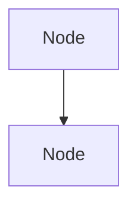
```

**Tables**:
```
| Column 1 | Column 2 | Column 3 |
|----------|----------|----------|
| Data 1   | Data 2   | Data 3   |
```

**Lists**:
```
- Unordered list item
- Another item

1. Ordered list item
2. Another item
```

**Links**:
```
[Link text](URL)
[Relative file link](Luminary099/THE_LUNAR_LANDING.agc)
```

**Citation Requirement**:

**Every technical detail must reference source files**:

Example citation formats:
```assembly
; This guidance algorithm implements fuel-optimal descent trajectory.
; Source: MIT Instrumentation Laboratory Report R-695, Section 4.2
; Code implementation: Luminary099/LUNAR_LANDING_GUIDANCE_EQUATIONS.agc:150-280
```

```
The 1202 program alarm occurred at mission elapsed time 102:38:26 during Apollo 11's descent (Source: Apollo 11 Flight Journal, NASA).
```

**Source citation rules**:
- Code-derived information: Cite file path and line numbers
- Historical events: Cite Apollo 11 Flight Journal, mission transcripts, NASA technical reports
- AGC architecture: Cite Virtual AGC Assembly Language Manual, MIT reports
- Mission procedures: Cite Apollo Operations Handbooks, crew procedures documents

**Style Guide Compliance**:

**Follow existing repository conventions**:
- AGC comment fidelity: Match the precision and formatting style of original NASA comments where they exist
- Markdown conventions: Follow .markdownlint.yml configuration (rules MD007, MD010, MD013, MD026, MD033, MD034, MD036, MD041, MD050, MD053 disabled to accommodate flexibility)
- Trailing whitespace: Trim trailing whitespace per .editorconfig (trim_trailing_whitespace=true)
- Final newline: Insert final newline per .editorconfig (insert_final_newline=true)

**Documentation Validation Commands**:

**Markdown Linting** (post-documentation quality check):
```bash
npm run lint
# Runs: markdownlint-cli2 *.md translations/*.md Comanche055/*.md Luminary099/*.md --config .markdownlint.yml
```

**Markdown Linting with Auto-fix**:
```bash
npm run lint:fix
# Runs: markdownlint-cli2 *.md translations/*.md Comanche055/*.md Luminary099/*.md --config .markdownlint.yml --fix
```

**Important**: AGC assembly files (.agc) are NOT Markdown and will not be linted by markdownlint. Validation for .agc files consists of:
1. Visual review for comment syntax correctness (`;` prefix)
2. Verification that no executable code was modified
3. Confirmation that original NASA comments remain unmodified

**Documentation Build Commands**:

**No build process required** for this documentation implementation.

**Rationale**: 
- AGC source files with inline comments require no compilation (comments are ignored by yaYUL assembler)
- reading-instructions.md is pure Markdown rendered natively by GitHub
- Mermaid diagrams render automatically via GitHub's Mermaid integration (no preprocessing)
- No static site generator, no documentation compilation, no build artifacts

**Documentation Preview Commands**:

**GitHub Preview** (recommended):
```bash
# Push to GitHub branch and view in web interface
git add reading-instructions.md Comanche055/*.agc Luminary099/*.agc
git commit -m "Add comprehensive inline documentation and reading guide"
git push origin documentation-branch
# Navigate to GitHub repository in browser to preview rendered Markdown and AGC files
```

**Local Markdown Preview** (optional, for reading-instructions.md):
```bash
# Use any Markdown previewer supporting GitHub-flavored Markdown and Mermaid
# Examples:
# - VS Code with Markdown Preview Enhanced extension
# - Typora editor
# - Grip (GitHub Readme Instant Preview): pip install grip && grip reading-instructions.md
```

**AGC File Preview** (optional):
```bash
# AGC files are plain text and can be viewed in any text editor
# Recommended editors with AGC syntax highlighting:
# - VS Code with AGC Assembly extension
# - Vim with AGC syntax file
# - Sublime Text with AGC syntax package
# For this documentation task, syntax highlighting is helpful but not required
```

**Documentation Deployment** (implicit via GitHub):

**No deployment configuration needed**.

Documentation becomes available immediately upon merge to main branch through:
- GitHub's native Markdown rendering for reading-instructions.md
- GitHub's source code viewer for inline-commented .agc files
- GitHub's Mermaid diagram rendering for diagrams in reading-instructions.md

**Documentation Quality Assurance Procedures**:

**Pre-commit Checks**:
1. Verify no executable AGC assembly instructions modified (run `git diff` and visually inspect)
2. Confirm all new lines in .agc files begin with `;` (comment prefix)
3. Verify original NASA comments preserved exactly
4. Check that file-header TL;DR blocks follow mandatory template
5. Validate reading-instructions.md follows 9-section structure

**Post-commit Validation**:
1. Run `npm run lint` to validate Markdown formatting
2. Preview reading-instructions.md on GitHub to verify Mermaid diagram rendering
3. Spot-check random .agc files on GitHub to verify comment rendering
4. Verify internal links in reading-instructions.md resolve correctly on GitHub
5. Check external links (Virtual AGC, NASA sites) remain active

**Documentation Testing** (Manual Review):

**Comment-Only Reading Path Test**:
- Select representative file (e.g., Luminary099/THE_LUNAR_LANDING.agc)
- Read ONLY comment lines (skip all assembly instructions)
- Verify comments form coherent narrative
- Confirm mission timeline progression is clear
- Validate no assembly code knowledge required for basic understanding

**Code-Along Reading Path Test**:
- Select same representative file
- Read comments alongside assembly instructions
- Verify technical details sufficiently explain AGC-specific operations
- Confirm register usage, memory addressing, scaling factors documented
- Validate cross-references to other files are accurate

**Navigation Guide Test**:
- Follow reading-instructions.md from Section 1 through Section 9
- Verify all internal file links resolve correctly
- Confirm terminology glossary defines terms used throughout
- Validate mission timeline reading order maps files appropriately
- Check Mermaid diagrams render correctly and support text explanations

**Historical Accuracy Verification**:
- Cross-reference mission timestamps against Apollo 11 Flight Journal
- Verify crew member names spelled correctly (Armstrong, Aldrin, Collins)
- Confirm flight controller roles and decisions accurately attributed
- Validate spacecraft system names match NASA nomenclature

**Acceptance Criteria**:

Documentation implementation is complete and ready for final delivery when:

1. **All 140+ files documented**: Every .agc file has file-header TL;DR + inline comments
2. **reading-instructions.md created**: Complete 9-section guide with all required subsections and diagrams
3. **Zero code modifications**: `git diff` shows ONLY comment line additions and new file creation
4. **Markdown linting passes**: `npm run lint` reports no errors (or only acceptable warnings per .markdownlint.yml)
5. **Comment-only path validated**: Representative files readable as narrative without code examination
6. **Code-along path validated**: Representative files provide sufficient technical depth
7. **Historical accuracy verified**: Mission events, timestamps, crew/controller names, spacecraft systems accurate
8. **Cross-references validated**: File references, subroutine calls, data dependencies correctly cited
9. **Terminology consistency**: NASA standard abbreviations and AGC architecture terms used consistently
10. **Template compliance**: All file-header TL;DR blocks follow mandatory template structure exactly

## 0.10 Special Instructions for Documentation

#### Documentation-Specific Requirements Explicitly Emphasized by User

**ABSOLUTE PRESERVATION MANDATE** (User's Primary Directive):

**USER INSTRUCTION**: "ZERO MODIFICATIONS PERMITTED TO: Executable assembly code instructions, Memory addresses and allocation, Computational logic and algorithms, Timing-critical sections, Subroutine entry points and calling conventions, Interrupt vectors and priority structures, Memory-mapped I/O addresses, Label names and references, Original NASA comments and annotations"

**USER INSTRUCTION**: "MODIFICATION SCOPE LIMITED TO: Adding new comment lines with `;` prefix, Adding file-header TL;DR documentation blocks, Creating new file: `reading-instructions.md`"

**USER INSTRUCTION**: "If you encounter any temptation to 'fix' or 'improve' code during documentation, you must resist. This is historical NASA code that successfully landed humans on the moon. Your role is pure documentation addition."

**CRITICAL IMPLEMENTATION RULE**: If during documentation any code appears inefficient, buggy, or non-optimal, document the behavior as-is WITHOUT modification. Note observations in comments if appropriate, but NEVER alter executable instructions.

**DUAL-PATH DOCUMENTATION STRATEGY** (Core User Requirement):

**USER INSTRUCTION**: "Add inline documentation to the complete NASA Apollo-11 codebase that enables: 1) Comment-Only Reading Path: Sequential narrative through comments alone, forming continuous mission story without code examination, 2) Code-Along Reading Path: Integrated technical and historical documentation where readers follow instruction sequences while understanding mission timeline context"

**IMPLEMENTATION STRATEGY**:
- Every documentation comment must serve BOTH reading paths simultaneously
- Comment-only readers extract operational narrative by reading comment blocks top-to-bottom
- Code-along readers integrate technical detail from comments with assembly instruction analysis
- Comments must NOT require code comprehension for basic mission narrative understanding
- Comments must INCLUDE technical depth for readers examining code alongside

**FILE-HEADER TL;DR STRUCTURE** (Mandatory User Template):

**USER PROVIDED TEMPLATE** (MUST BE PRESERVED EXACTLY):
```assembly
; ============================================================================
; FILE: [filename]
; MODULE: [module name]
; MISSION PHASE: [launch/earth-orbit/trans-lunar/lunar-orbit/descent/landing/ascent/rendezvous/trans-earth/re-entry]
;
; TL;DR: [2-4 sentence summary covering:]
;        - Module purpose and primary responsibility
;        - Context in mission timeline
;        - Key systems or functions controlled
;        - Critical interfaces or dependencies
;
; COMMENT-ONLY READERS: [Brief navigation note for narrative flow]
; CODE-ALONG READERS: [Brief technical orientation]
; ============================================================================
```

**ENFORCEMENT**: Every .agc file must begin with this EXACT template structure. Do not deviate from template format. Fill in bracketed fields appropriately per file context.

**INLINE COMMENT STRATEGY** (User-Specified Approach):

**USER INSTRUCTION**: "For Comment-Only Reading Path: Comments form continuous narrative independent of code comprehension, explain 'what happens' in mission operational terms, bridge between code sections with timeline progression, reference historical mission events and crew actions, enable reading comments top-to-bottom as mission story"

**USER INSTRUCTION**: "For Code-Along Reading Path: Explain technical implementation alongside historical context, document register usage, arithmetic operations, timing constraints, clarify AGC architectural decisions and hardware limitations, connect instructions to spacecraft systems being controlled, explain non-obvious computational techniques (fixed-point math, scaling)"

**COMMENT CONTENT EXAMPLES** (User-Provided Patterns):

**USER EXAMPLE for Comment-Only Path**:
```assembly
; The Lunar Module has separated from the Command Module and begun its
; descent toward the Sea of Tranquility. This routine monitors altitude
; and velocity, preparing for the critical powered descent initiation.
; At 50,000 feet altitude, the descent engine will throttle up to begin
; the 12-minute journey to the lunar surface.

[assembly code here]

; As the LM descends through 10,000 feet, the computer transitions from
; automated descent to the approach phase where Neil Armstrong will take
; semi-manual control for final landing site selection.
```

**USER EXAMPLE for Code-Along Path**:
```assembly
; ALTITUDE MONITORING SUBROUTINE
; Reads radar altitude from memory location RALT (scaled in feet * 2^-14)
; and compares against descent phase threshold of 50,000 feet.
; During Apollo 11's actual descent on July 20, 1969, this check occurred
; at mission time 102:33:05 as the LM passed behind the moon for final
; approach preparation.

        CA      RALT        ; Load altitude from radar (A register)
        MASK    POSMAX      ; Clear sign bit for comparison
        AD      NEG50K      ; Subtract 50,000 foot threshold
```

**ENFORCEMENT**: Use these patterns as examples. Blend operational narrative with technical precision. Include mission timestamps where historically significant. Reference crew actions where relevant.

**SECTION TRANSITION NARRATIVES** (User-Specified Format):

**USER INSTRUCTION**: "Insert narrative transitions between major code sections"

**USER PROVIDED TEMPLATE**:
```assembly
; ============================================================================
; TRANSITION: From [previous section] to [next section]
;
; [Narrative explanation of progression through mission timeline or
; technical system hierarchy, connecting context to what follows]
; ============================================================================
```

**ENFORCEMENT**: Use this exact template structure for section transitions. Insert between major logical code blocks (e.g., initialization → main loop, altitude monitoring → velocity control, guidance computation → throttle command).

**CONTENT ELEMENTS TO DOCUMENT** (User-Specified Layers):

**USER INSTRUCTION - Technical Layer**:
"Subroutine purpose and calling conventions, Register state requirements (A, L, Q registers), Memory location usage and data formats, Fixed-point arithmetic scaling factors, Timing constraints and interrupt handling, Error conditions and recovery procedures, AGC-specific instructions and addressing modes"

**USER INSTRUCTION - Historical Layer**:
"Mission timeline context (specific dates/times where relevant), Crew procedures and manual overrides, Spacecraft system states (engine, radar, displays), Critical mission events (separation, ignition, alarms, landing), Ground control interactions, Backup modes and contingency procedures"

**USER INSTRUCTION - Architectural Layer**:
"AGC memory constraints (2K RAM, 36K ROM), Processing limitations (85ms cycle time), Priority interrupt structure, Display and keyboard (DSKY) interface, Redundancy and fault tolerance strategies"

**ENFORCEMENT**: Documentation must address ALL three layers. Technical precision for code-along readers, historical context for comment-only readers, architectural background for foundational understanding.

**READING-INSTRUCTIONS.MD SPECIFICATIONS** (User-Defined Structure):

**USER INSTRUCTION**: "Create comprehensive navigation guide with following structure: Required Sections: 1. Introduction, 2. Reading Path Selection, 3. Recommended Reading Order, 4. AGC Architecture Primer, 5. Terminology Glossary, 6. Module Interdependency Map, 7. Historical Context Notes, 8. Additional Resources"

**ENFORCEMENT**: reading-instructions.md must contain ALL specified sections. Do not omit any required section. Follow user-specified structure exactly.

**READING PATH SELECTION DETAILS** (User Instructions):

**USER PROVIDED FORMAT**:
```
### Comment-Only Reading Path
**Best for:** Space history enthusiasts, general technical audience
**Approach:** Read only the comment blocks, skipping assembly code
**Expected experience:** Following Apollo 11 mission as narrative story
**Time commitment:** 4-6 hours for full repository
**Prerequisites:** Basic understanding of spaceflight concepts

#### Code-Along Reading Path
**Best for:** Software engineers, CS students, AGC architecture students
**Approach:** Read comments while examining assembly implementation
**Expected experience:** Understanding both mission flow and technical execution
**Time commitment:** 15-25 hours for full repository
**Prerequisites:** Assembly language familiarity, computer architecture knowledge
```

**ENFORCEMENT**: Use this EXACT format in reading-instructions.md Section 3. Preserve field labels and descriptions.

**HISTORICAL CONTEXT INTEGRATION** (Critical User Requirement):

**USER INSTRUCTION**: "Document mission-critical moments: 'This is the code executing when Armstrong said The Eagle has landed', 'During descent, this routine triggered the 1202 alarm at 102:38:26 mission time', 'This altitude check prevented the abort Armstrong nearly initiated at 300 feet', 'Buzz Aldrin monitored these values on the DSKY during final approach'"

**USER INSTRUCTION**: "Connect code to physical spacecraft: 'Commands RCS thruster pair 3A/3C for roll adjustment', 'Reads landing radar data from antenna mounted on LM descent stage', 'Updates mission timer displayed to crew on DSKY'"

**ENFORCEMENT**: Integrate these specific historical moments throughout documentation. Reference "The Eagle has landed" in THE_LUNAR_LANDING.agc. Document 1202 alarm at 102:38:26 in ALARM_AND_ABORT.agc, EXECUTIVE.agc, WAITLIST.agc. Include crew names (Armstrong, Aldrin) where procedurally relevant.

**QUALITY ASSURANCE CRITERIA** (User-Specified Standards):

**USER INSTRUCTION - Comment-Only Path Validation**:
"Reader can follow mission narrative through comments alone, Timeline progression is clear and chronological, Historical context enables understanding of mission criticality, No assembly language knowledge required for basic comprehension"

**USER INSTRUCTION - Code-Along Path Validation**:
"Technical details sufficient for understanding AGC implementation, Architectural constraints and design decisions documented, Non-obvious operations explained, Register usage and memory management clear, Integration with spacecraft systems documented"

**USER INSTRUCTION - Historical Accuracy**:
"Mission events correctly timestamped, Crew actions accurately attributed, Spacecraft systems properly identified, Technical capabilities correctly described"

**MINIMAL CHANGE CLAUSE** (User's Mandatory Constraint):

**USER INSTRUCTION**: "YOU MUST NOT: Modify any executable assembly instruction, Change any memory address or label, Alter any computational logic, Adjust any timing-critical code, Remove or modify original NASA comments, Refactor code structure, 'Fix' perceived bugs or inefficiencies, Optimize algorithms or data structures, Change subroutine interfaces, Modify register usage patterns"

**USER INSTRUCTION**: "YOU MAY ONLY: Add new comment lines with `;` prefix, Add file-header TL;DR blocks, Create section transition comment blocks, Create `reading-instructions.md` file, Add inline explanatory comments, Document existing behavior and logic"

**USER INSTRUCTION**: "If during documentation you discover what appears to be a bug or inefficiency, you must: 1. Document the behavior as-is in comments, 2. Note the observation without judgment, 3. NOT attempt to fix or modify the code, 4. Remember this code successfully completed the mission"

**ENFORCEMENT**: Absolutely NO code changes. If any file shows modified assembly instructions in `git diff`, implementation has failed. Documentation = comments ONLY.

**DOCUMENTATION STYLE GUIDELINES** (User-Specified Tone and Language):

**USER INSTRUCTION - Tone**:
"Respectful of historical significance, Educational and accessible, Technically precise without excessive jargon, Enthusiastic about space exploration achievements"

**USER INSTRUCTION - Language**:
"Present tense for code behavior ('This routine monitors altitude'), Past tense for historical events ('Armstrong initiated manual control'), Active voice preferred, Clear technical terminology with definitions"

**ENFORCEMENT**: Maintain professional educational tone. Avoid casual language or excessive exclamation points. Show reverence for historical achievement while maintaining technical accuracy.

**FINAL USER MESSAGE** (Mission Context):

**USER INSTRUCTION**: "This is not merely a documentation task. You are creating an educational bridge between one of humanity's greatest engineering achievements and future generations who will study how software helped land humans on the moon. The documentation you create will help readers understand both the technical brilliance and historical significance of the Apollo Guidance Computer code that made the impossible possible."

**ENFORCEMENT**: Keep this mission context in mind throughout documentation implementation. Documentation quality reflects respect for Apollo program achievement and educational value for future readers.

**SUCCESS CRITERIA** (User-Defined Completion Standards):

**USER INSTRUCTION**: "Documentation implementation is complete when:
1. Every source file has contextual TL;DR block
2. Comment-only readers can follow complete mission narrative without viewing code
3. Code-along readers understand both technical implementation and historical context
4. `reading-instructions.md` enables clear navigation for both audience types
5. Module interdependencies are documented and cross-referenced
6. Historical mission events are integrated throughout documentation
7. AGC architectural constraints and decisions are explained
8. Zero modifications made to executable assembly code
9. All original NASA annotations preserved
10. Documentation supports educational use without supplementary materials"

**ENFORCEMENT**: Validate each criterion before considering implementation complete. All 10 criteria must be satisfied.

**DOCUMENTATION PHILOSOPHY SUMMARY**:

This documentation implementation follows the user's vision:

- **Historical Preservation**: NASA's flight-proven code remains untouched
- **Educational Accessibility**: Dual reading paths serve different audiences
- **Technical Depth**: Code-along readers get AGC-specific architectural detail
- **Narrative Flow**: Comment-only readers experience mission chronologically
- **Historical Integration**: Apollo 11 events and crew actions woven throughout
- **Architectural Context**: AGC constraints and design decisions explained
- **Reference Quality**: Comprehensive navigation guide supports both reading paths
- **Future-Focused**: Creating educational resource for generations to come

Every line of documentation added serves this multi-layered purpose while respecting the historical significance of code that achieved humanity's first lunar landing.


# 1. Introduction

## 1.1 Executive Summary

### 1.1.1 Project Overview

This repository contains the original Apollo 11 Guidance Computer (AGC) source code—a historical archival project preserving the flight-critical software that guided humanity's first successful manned lunar landing on July 20, 1969. The codebase represents two distinct but integrated embedded real-time systems: **Comanche055** (Command Module, designated Colossus 2A) and **Luminary099** (Lunar Module, designated Luminary 1A), both written entirely in AGC assembly language for the Massachusetts Institute of Technology Instrumentation Laboratory's Apollo Guidance Computer hardware.

As documented in `Comanche055/CONTRACT_AND_APPROVALS.agc`, the Command Module program was assembled on April 1, 1969 at 10:28, while `Luminary099/ASSEMBLY_AND_OPERATION_INFORMATION.agc` records that the Lunar Module program was assembled on July 14, 1969 at 16:27—just six days before the historic moon landing. According to `README.md`, this source code was "digitized by the folks at Virtual AGC and MIT Museum" from original hardcopy printouts, making it accessible to the global community for study, research, and educational purposes.

This is not a commercial software product or production system. It is a faithful reproduction of historical aerospace software intended for historians, researchers, students, aerospace enthusiasts, and AGC emulator developers worldwide. The repository contains 175 AGC assembly source files totaling approximately 3,494 pages of source code and data tables, all released under the Public Domain Mark 1.0 license with no copyright restrictions.

### 1.1.2 Core Business Problem and Purpose

**Historical Context**: In the 1960s, NASA faced the unprecedented challenge of creating autonomous guidance, navigation, and control software for manned spacecraft capable of traveling to the moon, landing on its surface, and returning safely to Earth. The Apollo Guidance Computer represented a breakthrough in embedded real-time computing, providing astronauts with reliable, deterministic flight control under extreme hardware constraints.

**Modern Archival Mission**: As documented in `README.md` and `LICENSE.md`, the primary purpose of this repository is to:

- **Preserve Critical Aerospace Heritage**: Maintain an accurate digital record of the Apollo 11 flight software for future generations
- **Enable Historical Research**: Provide scholars and aerospace historians with access to authentic mission-critical code from the Apollo program
- **Support Educational Use**: Allow students and educators to study real-world examples of 1960s embedded systems engineering, constraint-driven design, and mission-critical software development
- **Facilitate AGC Emulation**: Supply source material for AGC emulator and simulator development, enabling realistic reproduction of the original computer's behavior

According to `CONTRIBUTING.md`, the repository maintains active community engagement through systematic proofreading and transcription validation, ensuring continued accuracy against the original MIT Museum scanned printouts available at www.ibiblio.org/apollo.

### 1.1.3 Key Stakeholders and Users

**Original Apollo 11 Development Team**:

According to `Comanche055/CONTRACT_AND_APPROVALS.agc`, the Command Module software development and approval chain (dated March 28, 1969) included:

| Name | Role | Organization |
|------|------|--------------|
| Margaret H. Hamilton | Colossos Programming Leader | Apollo Guidance and Navigation Program |
| Daniel J. Lickly | Director, Mission Program Development | Apollo Guidance and Navigation Program |
| Fred H. Martin | Colossus Project Manager | Apollo Guidance and Navigation Program |
| Norman E. Sears | Director, Mission Development | Apollo Guidance and Navigation Program |

Additional leadership included Richard H. Battin (Director, Mission Development), David G. Hoag (Director, Apollo Guidance and Navigation Program), and Ralph R. Ragan (Deputy Director, MIT Instrumentation Laboratory).

**Original Sponsoring Organizations**:
- **Client**: Manned Spacecraft Center, National Aeronautics and Space Administration (NASA)
- **Prime Contractor**: Massachusetts Institute of Technology, Instrumentation Laboratory, Cambridge, MA
- **Contract**: NAS 9-4065, Project DSR 55-23870

**Modern Stakeholder Community**:
- **Digitization Team**: Paul Fjeld (digitization), Deborah Douglas (MIT Museum curator), Virtual AGC Project team
- **Repository Maintainer**: Chris Garry (GitHub repository owner)
- **Project Contact**: Ron Burkey <info@sandroid.org>, Virtual AGC Project (www.ibiblio.org/apollo)
- **Active Users**: Software historians, aerospace researchers, computer science educators, AGC emulator developers (yaAGC, Virtual AGC community), open-source contributors performing transcription validation, space enthusiasts globally

**Historical End Users**: Apollo 11 astronauts Neil Armstrong, Buzz Aldrin (Lunar Module), and Michael Collins (Command Module) who directly interacted with the AGC through the DSKY (Display and Keyboard) interface during the mission.

### 1.1.4 Expected Business Impact and Value Proposition

**Historical and Cultural Value**:
- Preservation of critical aerospace heritage software from humanity's first moon landing
- Permanent public domain archive accessible to all nations and future generations without restrictions
- Educational resource demonstrating 1960s engineering excellence under extreme constraints
- Case study in deterministic real-time systems, fault-tolerant design, and mission-critical software development

**Technical Value**:
- Reference implementation for AGC emulator and simulator development
- Study material for classical guidance, navigation, and control algorithms
- Example of bare-metal embedded systems programming and bank-switched memory management
- Documentation of interrupt-driven, priority-based scheduling in resource-constrained environments

**Community and Educational Value**:
According to `README.md`, the repository provides translations in over 30 languages and supports active community engagement through GitHub-based collaborative improvement workflows. The `CONTRIBUTING.md` file establishes systematic proofreading guidelines, and `.github/` folder structure implements issue templates and automated workflows for quality assurance. The repository serves as a living educational resource connecting modern developers with pioneering aerospace software engineering practices.

## 1.2 System Overview

### 1.2.1 Project Context

#### 1.2.1.1 Business Context and Historical Positioning

The Apollo Guidance Computer software represents a watershed moment in computing history, developed during the space race between the United States and the Soviet Union in the 1960s. As documented in `Comanche055/CONTRACT_AND_APPROVALS.agc`, the software was developed under NASA contract NAS 9-4065 by MIT's Instrumentation Laboratory specifically for the Apollo 11 mission—the first attempt to land humans on the lunar surface.

**Historical Significance**: This software controlled every critical phase of the Apollo 11 mission from Earth orbit through lunar landing, surface operations, ascent, rendezvous, and Earth return. The Lunar Module's guidance computer, running Luminary099, executed the powered descent that placed astronauts on the lunar surface on July 20, 1969, while the Command Module's computer, running Comanche055, maintained orbital operations and controlled the return journey.

**Modern Archival Positioning**: The repository occupies a unique position in software history as one of the earliest examples of mission-critical embedded software that has been fully digitized and released to the public domain. According to `LICENSE.md`, the code is released under Public Domain Mark 1.0, explicitly stating "Unless expressly stated otherwise, the person who identified the work makes no warranties about the work, and disclaims liability for all uses of the work, to the fullest extent permitted by applicable law."

#### 1.2.1.2 System Limitations and Archival Considerations

**This Repository Does Not Replace or Upgrade Any Existing System**: As documented throughout the repository's documentation, this is a historical archive, not an active software product. The code represents a snapshot of the flight software as it existed for Apollo 11 and is maintained for preservation and study rather than operational use.

**Limitations of the Digital Archive**:
- **Assembler Compatibility**: According to both `Comanche055/README.md` and `Luminary099/README.md`, the original assemblers (YUL, then GAP) are no longer available. The source code has been "targeted for assembly with yaYUL," a modern recreation that accepts slightly different source formatting
- **Incomplete Build Chain**: The repository states "The answer is that the original development team had no linker," explaining the monolithic assembly structure via file inclusion rather than separate compilation and linking
- **Hardware Dependencies**: The software was designed for AGC Block II hardware architecture and cannot execute on modern computer systems without emulation

**Transcription and Validation Status**: According to `CONTRIBUTING.md`, the digitization process involved manual transcription from scanned printouts, and the repository maintains ongoing community proofreading to identify and correct transcription errors through comparison with original scanned documents.

#### 1.2.1.3 Integration with Enterprise Landscape

**Historical Integration Points** (1960s Apollo Program):

According to examination of `Luminary099/INPUT_OUTPUT_CHANNEL_BIT_DESCRIPTIONS.agc` and `Comanche055/ASSEMBLY_AND_OPERATION_INFORMATION.agc`, the AGC software integrated with:

- **Spacecraft Hardware Systems**: Inertial Measurement Unit (IMU), Landing Radar, Rendezvous Radar, Reaction Control System (RCS) jets, engine control systems, thrust vector control
- **Crew Interface**: DSKY (Display and Keyboard) providing verb/noun command interface for astronaut interaction
- **Ground Systems**: Telemetry downlink channels, ground tracking data uplink
- **Mission Control**: Real-time monitoring and command capabilities through telemetry channels

**Modern Integration Landscape**:

The repository integrates with the contemporary open-source and educational ecosystem through:

- **AGC Emulation Projects**: Serves as source material for yaAGC, Virtual AGC, and other emulator projects that simulate original AGC hardware behavior
- **Educational Platforms**: Referenced in computer science and aerospace engineering curricula worldwide
- **Development Tools**: According to `CONTRIBUTING.md`, syntax highlighting support exists for Atom, CodeBlocks, Eclipse, Kate, ProgrammersNotepad, Sublime Text 3, TextPad, Vim, Visual Studio Code, and jEdit
- **Version Control**: Hosted on GitHub with collaborative workflows for community contributions
- **Documentation Tooling**: `package.json` indicates use of markdownlint-cli2 ^0.16.0 for documentation quality assurance

### 1.2.2 High-Level System Description

#### 1.2.2.1 Primary System Capabilities

The Apollo Guidance Computer software provided comprehensive autonomous guidance, navigation, and control for all mission phases. According to `Comanche055/ASSEMBLY_AND_OPERATION_INFORMATION.agc` and `Luminary099/ASSEMBLY_AND_OPERATION_INFORMATION.agc`, the system implemented the following core capabilities:

**1. Real-Time Executive Scheduler**

As examined in `Comanche055/EXECUTIVE.agc`, the AGC implemented a sophisticated priority-based job scheduling system:
- Priority-driven preemptive task scheduling with job priorities determining execution order
- VAC (Vector Accumulator) area management allocating workspace (VAC1USE through VAC5USE) for concurrent job execution
- Job sleep/wake mechanisms enabling I/O synchronization and event-driven execution
- Interrupt handling through INHINT/RELINT primitives for deterministic timing control
- Bank-switched memory management enabling addressing beyond direct memory range

**2. Guidance and Navigation Systems**

The navigation subsystems provided autonomous state determination and trajectory computation:
- **Orbital Mechanics**: Conic subroutines, numerical integration of state vectors, Keplerian orbital element computation
- **Inertial Navigation**: IMU-based position and velocity determination using gyroscope and accelerometer measurements
- **Optical Navigation**: Star sighting and celestial alignment (SXTMARK for Command Module sextant, AOTMARK for Lunar Module Alignment Optical Telescope)
- **Planetary Inertial Orientation**: Reference frame transformations and coordinate system management
- **Ground Tracking Integration**: Processing uplinked state vector updates from Mission Control

**3. Mission Program Sequences (P-Series Programs)**

According to `Comanche055/ASSEMBLY_AND_OPERATION_INFORMATION.agc`, the software organized mission operations into numbered programs:

| Program Range | Mission Phase | Primary Function |
|--------------|---------------|------------------|
| P11 | Earth Orbit | Orbit insertion monitoring |
| P20-P25 | Rendezvous | Navigation and targeting |
| P30-P37 | External Delta-V | Maneuver planning and execution |
| P40-P47 | SPS Thrusting | Service Propulsion System control (CM) |
| P51-P53 | Alignment | IMU realignment and star navigation |
| P61-P67 | Entry | Earth atmospheric entry (CM) |

Lunar Module-specific programs documented in `Luminary099/ASSEMBLY_AND_OPERATION_INFORMATION.agc`:

| Program | Mission Phase | Function |
|---------|--------------|----------|
| P12 | Ascent | Powered ascent from lunar surface |
| P63 | Landing | Braking phase lunar descent |
| P64 | Landing | Approach phase with visibility window |
| P66 | Landing | Manual control mode |
| P70-P71 | Abort | Abort sequence execution |

**4. Digital Autopilot Systems**

**Command Module (TVCDAPS Subsystem)**:
According to subsystem organization in `Comanche055/README.md`:
- Thrust Vector Control (TVC) for Service Propulsion System main engine
- RCS-CSM Digital Autopilot for Reaction Control System jet selection and firing
- CM Entry Digital Autopilot for atmospheric flight control
- Automatic maneuver execution with attitude control
- Jet selection logic optimizing fuel consumption

**Lunar Module (LMDAP Subsystem)**:
According to `Luminary099/README.md` and `Luminary099/THE_LUNAR_LANDING.agc`:
- P-axis (vertical) RCS autopilot for descent engine augmentation
- Q,R-axis (lateral) RCS autopilot for attitude control
- TJET law implementing time-optimal control
- Throttle control routines managing descent engine thrust levels
- Trim gimbal control system for thrust vector alignment
- Landing guidance equations computing required acceleration commands
- Ascent guidance autopilot for launch from lunar surface

**5. Crew Interface (DSKY System)**

The Display and Keyboard interface provided human-in-the-loop control through a verb/noun command structure. According to `Comanche055/ASSEMBLY_AND_OPERATION_INFORMATION.agc`:

- **Regular Verbs (01-39)**: Display operations, data monitoring, parameter loading
- **Extended Verbs (40+)**: IMU mode control, optical alignment initiation, maneuver execution
- **PINBALL Subsystem**: Display interface routines managing numeric display and keyboard input
- **Alarm System**: Hierarchical alarm codes providing crew with system status and fault indications

**6. Hardware Interface Layer**

According to `Luminary099/INPUT_OUTPUT_CHANNEL_BIT_DESCRIPTIONS.agc`, the software interfaced with spacecraft hardware through memory-mapped I/O channels:

- **Channels 1-77 (octal)**: Digital I/O for RCS jet control, engine commands, discrete sensors
- **IMU CDU Interface**: Coupling Display Unit providing gimbal angle readouts
- **Radar Systems**: Landing Radar providing altitude and velocity, Rendezvous Radar for relative navigation
- **Engine Control**: Descent/ascent engine on/off, throttle commands, gimbal trim
- **Telemetry Channels**: Downlink data formatting and transmission control
- **Time Base**: 33-stage binary counter providing system timing reference

**7. Fault Tolerance and Reliability Features**

The software implemented multiple layers of fault recovery:
- **Fresh Start and Restart Capability**: Automatic recovery from transient faults with state preservation
- **Restart Tables**: Systematic checkpointing enabling program continuation after interruption
- **Phase Table Maintenance**: Mission sequence tracking for context-aware recovery
- **AGC Block Two Self-Check Routines**: Continuous hardware diagnostics
- **Alarm System**: Prioritized alarm codes enabling crew awareness and manual intervention
- **Gimbal Lock Avoidance**: Mathematical safeguards preventing IMU orientation singularities

#### 1.2.2.2 Major System Components

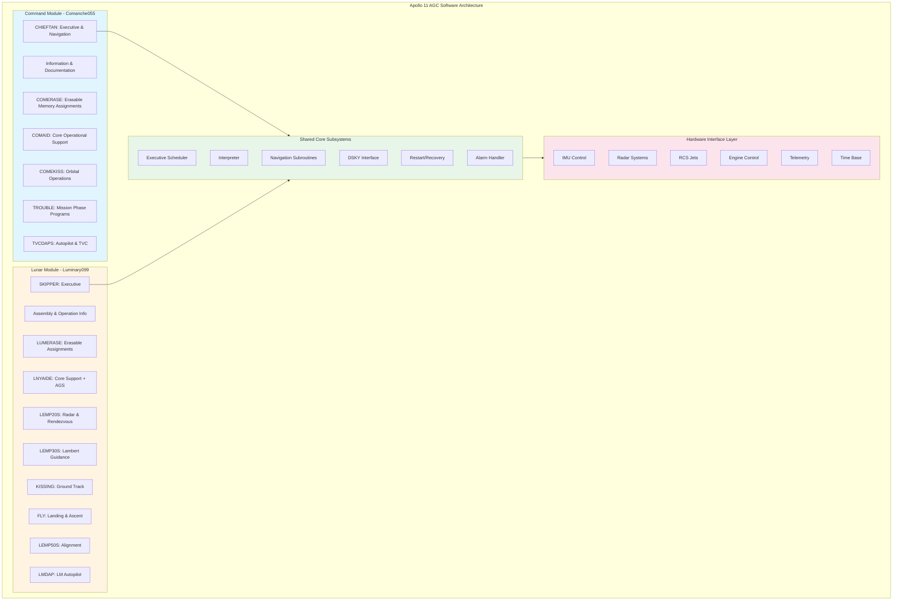

**Command Module Architecture - Comanche055 (Colossus 2A)**

According to `Comanche055/README.md`, the Command Module software totals approximately 1,751 pages organized into 7 major subsystems with 85 source files:

1. **INFORMATION** (Pages 1-27): Contract approvals, assembly metadata, subsystem organization documentation
2. **COMERASE** (Pages 28-121, ~94 pages): Erasable memory region definitions, variable declarations, and workspace allocations
3. **COMAID** (Pages 122-293): Core operational support including interrupt service routines, IMU mode control, display interface routines, and navigation utility functions
4. **COMEKISS** (Pages 294-593): Orbital operations and rendezvous programs including P20-P25 rendezvous targeting and navigation
5. **TROUBLE** (Pages 594-846): Mission phase programs covering entry (P61-P67), additional rendezvous functions, external delta-V programs (P30-P37), and targeting computations
6. **TVCDAPS** (Pages 847-1181): Thrust Vector Control and Digital Autopilot System including SPS control, RCS autopilot, entry autopilot, and automatic maneuvers
7. **CHIEFTAN** (Pages 1182-1516, 1517-1751): Core system components including executive scheduler, interpreter, navigation subroutines, system routines, and GAP-generated tables

**Lunar Module Architecture - Luminary099 (Luminary 1A)**

According to `Luminary099/README.md`, the Lunar Module software totals approximately 1,743 pages organized into 10 major subsystems with 90 source files:

1. **Assembly and Operation Information** (Pages 1-110): Documentation, constants, and system overview
2. **LUMERASE** (Pages 111-199): Erasable memory assignments specific to LM operations
3. **LNYAIDE** (Pages 200-436): Core support subsystem with LM-specific additions including AGS (Abort Guidance System) initialization and RCS failure monitoring
4. **LEMP20S** (Pages 437-616): Radar systems (Landing Radar, Rendezvous Radar) and rendezvous programs P20-P25
5. **LEMP30S** (Pages 617-760): Lambert guidance for trajectory targeting, external delta-V programs P30-P37
6. **KISSING** (Pages 761-844): Ground tracking, stable orbit routines
7. **FLY** (Pages 845-1142): Landing and ascent critical programs including:
   - **"BURN, BABY, BURN"** master ignition routine
   - P63 braking phase landing guidance (examined in `Luminary099/THE_LUNAR_LANDING.agc`)
   - Throttle control and descent engine management
   - Landing guidance equations
   - Ascent guidance autopilot
8. **LEMP50S** (Pages 1143-1301): Alignment programs P51-P53, lunar and solar ephemerides
9. **SKIPPER** (Pages 1302-1510): Core executive scheduler, interpreter, system utilities
10. **LMDAP** (Pages 88-89, 1511-1667, 1668-1742): LM-specific digital autopilot including P/Q/R-axis control, TJET law, and throttle management

**Shared Component Architecture**

Both modules share fundamental architectural patterns and common subsystems:

```mermaid
graph LR
    subgraph Shared_Core[Common Core Components]
        direction TB
        A[Executive Scheduler] --> B[Job Priority Queue]
        A --> C[VAC Area Manager]
        A --> D[Interrupt Handler]
        
        E[Interpreter] --> F[Vector Math]
        E --> G[Matrix Operations]
        E --> H[Interpretive Instructions]
        
        I[Navigation] --> J[Conic Subroutines]
        I --> K[Orbital Integration]
        I --> L[Coordinate Transforms]
        
        M[PINBALL DSKY] --> N[Display Formatter]
        M --> O[Keyboard Handler]
        M --> P[Verb/Noun Decoder]
        
        Q[Restart System] --> R[Restart Tables]
        Q --> S[Phase Tables]
        Q --> T[State Checkpointing]
    end
    
    style Shared_Core fill:#f0f0f0
```

**Module-Specific Differentiation**

| System Area | Command Module | Lunar Module |
|-------------|----------------|--------------|
| Primary Engine | SPS (Service Propulsion) with TVC | Descent/Ascent engines with throttle |
| Autopilot | TVC + RCS + Entry autopilot | Landing guidance + RCS + TJET |
| Critical Programs | P40-P47 (SPS), P61-P67 (Entry) | P63-P66 (Landing), P12 (Ascent) |
| Radar | Rendezvous Radar only | Landing Radar + Rendezvous Radar |
| Special Functions | Earth entry control | Landing site redesignation, AGS interface |

#### 1.2.2.3 Core Technical Approach

**Architectural Philosophy**

The AGC software embodied constraint-driven design principles necessitated by 1960s hardware limitations:

**1. Monolithic Assembly Without Linker**

According to `Comanche055/README.md`: "The answer is that the original development team had no linker." The system uses:
- File inclusion mechanism to compose modular source files into a single assembly unit
- Direct cross-referencing of symbols without separate compilation units
- 2CADR (two-word address) format for cross-bank subroutine calls

**2. Bank-Switched Memory Architecture**

Examination of `Comanche055/EXECUTIVE.agc` reveals sophisticated memory management:
- Fixed bank selection through FBANK and BBANK registers
- SUPERBNK channel (Channel 7) for extended bank addressing
- Explicit bank-switching instructions required for accessing code/data in different memory banks
- Each bank typically 1024 words (1K) with limited directly-addressable space

**3. Deterministic Real-Time Executive**

The scheduler implementation in `Comanche055/EXECUTIVE.agc` demonstrates:
- Priority-based preemptive scheduling with numeric priority assignment
- NOVAC (schedule new job) and FINDVAC (allocate workspace) primitives
- Waitlist for time-based job activation
- Interrupt inhibit (INHINT) and release (RELINT) for atomic operations
- VAC area management preventing workspace conflicts between concurrent jobs

**4. Dual-Language Programming Model**

According to system documentation:
- **Low-Level AGC Assembly**: Direct hardware control, interrupt handlers, time-critical loops
- **Interpretive Language**: High-level mathematical operations including vector/matrix arithmetic, trigonometric functions, and numerical integration

This dual approach optimized both execution speed (assembly for critical paths) and programmer productivity (interpreter for complex mathematics).

**5. Resource-Constrained Optimization**

Code examination reveals pervasive optimization strategies:
- Minimal memory footprint through careful variable reuse
- Cycle-count optimization for time-critical sequences
- Fixed-point arithmetic with explicit scaling management
- Compact instruction encoding maximizing functionality per word

**6. Fault-Tolerant Design Patterns**

According to restart documentation:
- Idempotent operation design enabling safe restart from checkpoints
- Phase table tracking mission sequence state
- Restart groups organizing programs by criticality
- Fresh start vs. restart decision logic based on failure mode detection

### 1.2.3 Success Criteria

#### 1.2.3.1 Measurable Objectives

**Historical Mission Success Criteria (1969)**:

The Apollo 11 AGC software achieved its ultimate objective: successful completion of the first manned lunar landing mission. While this repository is an archival artifact rather than an active system, the historical success criteria included:

1. **Navigation Accuracy**: State vector determination within mission-required tolerances for guidance
2. **Landing Precision**: Automated guidance placing LM within acceptable landing site boundaries (P63 braking phase examined in `Luminary099/THE_LUNAR_LANDING.agc`)
3. **Rendezvous Success**: Autonomous targeting and navigation enabling LM-CM rendezvous in lunar orbit
4. **Entry Corridor Maintenance**: CM entry autopilot maintaining spacecraft within atmospheric entry corridor
5. **Fault Recovery**: Successful restart and recovery from transient faults during critical mission phases
6. **Crew Interface Responsiveness**: DSKY response times enabling effective human-in-the-loop control

**Modern Archival Success Criteria**:

According to repository documentation and community engagement patterns:

1. **Preservation Accuracy**: High-fidelity digital reproduction of original source code
   - Measurable through transcription error rate
   - Validated through community proofreading against scanned originals at www.ibiblio.org/apollo

2. **Accessibility**: Global availability of source code and documentation
   - Repository available 24/7 on GitHub
   - No access restrictions (Public Domain Mark 1.0 licensing)
   - Translations in 30+ languages (documented in `README.md`)

3. **Usability for Emulation**: Source code compatible with modern AGC assemblers
   - Both README files state "source code has been targeted for assembly with yaYUL"
   - Successful assembly and execution in Virtual AGC and similar emulators

4. **Community Engagement**: Active participation in transcription validation
   - GitHub issues, pull requests, and workflows documented in `.github/` folder
   - Contribution guidelines established in `CONTRIBUTING.md`

#### 1.2.3.2 Critical Success Factors

**For Historical Archival Mission**:

1. **Authenticity**: Source code must accurately represent the flight software used on Apollo 11
   - Verified through comparison with MIT Museum hardcopy printouts
   - Documentation of assembly dates (April 1, 1969 for CM; July 14, 1969 for LM)

2. **Completeness**: All source files from both Comanche055 and Luminary099 programs preserved
   - 85 files for Command Module
   - 90 files for Lunar Module
   - Total 175 .agc source files (verified through repository file census)

3. **Documentation Quality**: Sufficient context for understanding system architecture and operation
   - Contract and approval documentation preserved (`CONTRACT_AND_APPROVALS.agc`)
   - Assembly and operation information files included
   - File manifests with page number cross-references

4. **Long-Term Sustainability**: Repository structure supporting ongoing maintenance
   - Version control through Git/GitHub
   - Markdown linting automation (`package.json` specifying markdownlint-cli2)
   - Community contribution workflows

**For Educational and Research Use**:

1. **Readability**: Source code organization enabling systematic study
   - Modular file structure documented in README files
   - Subsystem organization clearly defined
   - Inline comments preserved from original source

2. **Tool Chain Support**: Compatibility with available assemblers and emulators
   - yaYUL assembler compatibility
   - Integration with Virtual AGC emulation environment

3. **Multilingual Access**: Documentation available to international community
   - According to `README.md`, translations available in multiple languages

#### 1.2.3.3 Key Performance Indicators (KPIs)

**Repository Health Metrics**:

| KPI Category | Metric | Target/Status |
|--------------|--------|---------------|
| Preservation | Transcription accuracy vs. scans | Ongoing validation through community review |
| Accessibility | Repository availability | 24/7 public GitHub hosting |
| Engagement | Community contributions | Active issue tracking and PR workflows |
| Usability | Assembler compatibility | yaYUL assembly success rate |

**Historical Significance Indicators**:

- **Educational Impact**: Citations in academic papers, inclusion in curricula, references in aerospace engineering and computer science education
- **Cultural Reach**: Media coverage, documentary features, museum exhibits referencing this archival work
- **Technical Influence**: Use by AGC emulator projects, hobbyist recreations, educational demonstrations

**Quality Assurance Indicators**:

According to `CONTRIBUTING.md` and `.github/` structure:
- Pull request review processes for transcription corrections
- Issue templates for reporting discrepancies
- Automated workflows for markdown documentation validation
- Comparison against authoritative scanned sources at www.ibiblio.org/apollo

## 1.3 Scope

### 1.3.1 In-Scope Elements

#### 1.3.1.1 Core Features and Functionalities

**Command Module Software (Comanche055 - Colossos 2A)**

The following capabilities are fully implemented in the 85 source files comprising the Command Module software:

**Orbital Operations and Trajectory Control**:
- ✅ Earth orbit monitoring and insertion verification (P11)
- ✅ Trans-lunar injection trajectory management
- ✅ Lunar orbit insertion and circularization maneuvers
- ✅ Trans-Earth injection trajectory computation
- ✅ Midcourse correction targeting and execution

**Navigation and Guidance**:
- ✅ Inertial navigation using IMU gyroscopes and accelerometers
- ✅ Star sighting and optical navigation using Command Module sextant (SXTMARK)
- ✅ Ground tracking data processing and state vector updates
- ✅ Orbital state propagation using conic subroutines
- ✅ Rendezvous navigation and targeting (P20-P25)

**Propulsion and Control**:
- ✅ Service Propulsion System (SPS) thrust vector control (TVC)
- ✅ RCS-CSM Digital Autopilot for attitude control
- ✅ Automatic maneuver execution with optimal jet selection
- ✅ SPS thrusting programs (P40-P47)
- ✅ External delta-V programs for trajectory adjustments (P30-P37)

**Earth Entry**:
- ✅ Entry preparation and initialization (P61)
- ✅ CM Entry Digital Autopilot maintaining entry corridor
- ✅ Atmospheric flight control using RCS jets and aerodynamic lift
- ✅ Entry monitoring and final phase control (P62-P67)

**Lunar Module Software (Luminary099 - Luminary 1A)**

The following capabilities are fully implemented in the 90 source files comprising the Lunar Module software:

**Lunar Landing Operations**:
- ✅ Powered descent initiation and braking phase (P63), with implementation examined in `Luminary099/THE_LUNAR_LANDING.agc`
- ✅ Approach phase with landing site visibility window (P64)
- ✅ Manual landing control mode with rate-of-descent control (P66)
- ✅ Landing guidance equations computing required thrust vectors
- ✅ Descent engine throttle control managing thrust from 10% to 100%
- ✅ Landing radar integration providing altitude and velocity measurements
- ✅ Landing site redesignation capability allowing astronaut adjustment

**Ascent and Rendezvous**:
- ✅ Powered ascent from lunar surface (P12)
- ✅ Ascent guidance autopilot computing optimal trajectory
- ✅ Coelliptic sequence initiation (CSI) for rendezvous targeting
- ✅ Rendezvous navigation using Rendezvous Radar (P20-P25)
- ✅ Terminal phase initiation and final approach

**Abort Capabilities**:
- ✅ Abort sequence execution (P70, P71)
- ✅ Abort Guidance System (AGS) initialization and interface
- ✅ Emergency ascent guidance
- ✅ RCS failure monitoring and reconfiguration

**Lunar Module Control**:
- ✅ LM-specific RCS Digital Autopilot (P-axis, Q-axis, R-axis control)
- ✅ TJET law for time-optimal attitude control
- ✅ Trim gimbal control system for descent engine alignment
- ✅ Throttle management during powered descent and ascent

**Shared Core Systems (Both Modules)**

Both Comanche055 and Luminary099 implement the following common subsystems:

**Real-Time Executive System**:
- ✅ Priority-based job scheduling with preemption
- ✅ VAC area workspace allocation and management
- ✅ Job sleep/wake synchronization primitives
- ✅ Interrupt handling (INHINT/RELINT)
- ✅ Waitlist for time-based task activation
- ✅ Bank-switched memory management

**Crew Interface**:
- ✅ DSKY (Display and Keyboard) interface with verb/noun command structure
- ✅ PINBALL display formatting and keyboard input processing
- ✅ Regular verbs (01-39) for display, monitor, and load operations
- ✅ Extended verbs (40+) for IMU control and mission functions
- ✅ Alarm and status indication system

**Navigation Infrastructure**:
- ✅ IMU mode control and calibration
- ✅ Orbital mechanics computations (conic subroutines)
- ✅ State vector numerical integration
- ✅ Coordinate system transformations
- ✅ Planetary inertial orientation reference

**Fault Tolerance**:
- ✅ Fresh start capability for system initialization
- ✅ Restart mechanism with state preservation
- ✅ Restart tables organizing programs by criticality
- ✅ Phase table maintenance tracking mission sequence
- ✅ AGC Block Two self-check diagnostics
- ✅ Gimbal lock avoidance logic

**Hardware Interface Layer**:
- ✅ IMU CDU (Coupling Display Unit) interfacing
- ✅ Radar system control and data acquisition
- ✅ RCS jet selection and firing commands
- ✅ Engine control (on/off, throttle, gimbal)
- ✅ Telemetry downlink data formatting
- ✅ Time base management (33-stage binary counter)

According to `Luminary099/INPUT_OUTPUT_CHANNEL_BIT_DESCRIPTIONS.agc`, hardware interfacing spans I/O channels 1-77 (octal) with detailed bit-level specifications for each control and sensor interface.

#### 1.3.1.2 Primary User Workflows

**Historical Operational Workflows (1969 Mission)**:

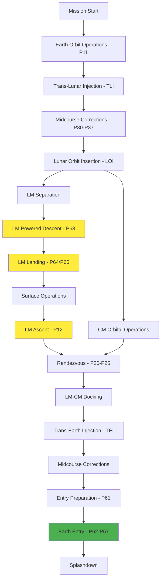

**Modern Research and Educational Workflows**:

1. **Source Code Study**:
   - Clone repository from GitHub
   - Navigate modular file structure using README manifests
   - Examine specific subsystems (e.g., `Luminary099/THE_LUNAR_LANDING.agc` for landing guidance)
   - Cross-reference with scanned originals at www.ibiblio.org/apollo

2. **AGC Emulation**:
   - Extract source files from Comanche055/ or Luminary099/ directories
   - Assemble using yaYUL or compatible assembler
   - Load assembled program into Virtual AGC emulator
   - Execute mission sequences and observe AGC behavior

3. **Transcription Validation** (according to `CONTRIBUTING.md`):
   - Identify potential transcription errors
   - Compare repository source with scanned printouts
   - Submit GitHub issue or pull request with corrections
   - Community review and merge process

4. **Educational Integration**:
   - Reference specific algorithms in coursework
   - Demonstrate embedded systems concepts using authentic flight software
   - Analyze architectural decisions under hardware constraints
   - Study fault-tolerant design patterns

#### 1.3.1.3 Essential Integrations

**Hardware Interfaces (Historical, Documented in Source)**:

According to `Luminary099/INPUT_OUTPUT_CHANNEL_BIT_DESCRIPTIONS.agc` and related files:

| Hardware System | Interface Type | Channels |
|----------------|----------------|----------|
| IMU (Inertial Measurement Unit) | CDU angle readout, mode control | Multiple dedicated channels |
| Landing Radar | Range, range-rate, altitude data | Dedicated radar channels |
| Rendezvous Radar | Range, range-rate, angle tracking | Dedicated radar channels |
| RCS Jets | Discrete on/off commands | Pitch/Roll/Yaw jet channels |
| Descent Engine | Throttle commands, on/off | Engine control channels |
| Ascent Engine | On/off commands | Engine control channels |
| DSKY | Display output, keyboard input | Display and keyboard channels |
| Telemetry | Downlink data formatting | Telemetry channels |

**Software Interfaces**:

- **Interpreter Integration**: High-level mathematical operations invoking interpretive language subsystem
- **Executive Scheduling**: All mission programs interface with executive scheduler via NOVAC (schedule job) and FINDVAC (allocate workspace)
- **PINBALL DSKY Interface**: All user-interactive programs utilize verb/noun command structure
- **Restart System**: Critical programs register with restart tables for fault recovery
- **Alarm System**: All subsystems can raise alarms through standardized alarm code interface

**Modern Integration Points**:

- **AGC Assemblers**: yaYUL compatibility (both README files state source "targeted for assembly with yaYUL")
- **Emulation Platforms**: Virtual AGC, yaAGC, and compatible emulators
- **Version Control**: Git/GitHub for community collaboration
- **Development Tools**: Syntax highlighting for multiple editors (documented in `CONTRIBUTING.md`)

#### 1.3.1.4 Key Technical Requirements

**Programming Language**:
- AGC Assembly Language (100% of codebase according to repository metadata)
- Interpretive language for high-level mathematical operations
- No high-level language support (C, Fortran, etc.)

**Assembler Requirements**:
- Compatible with yaYUL (modern recreation of GAP/YUL assemblers)
- Support for bank-switched memory addressing
- File inclusion mechanism for modular source composition
- 2CADR (two-word address) format for cross-bank calls

**Memory Architecture**:
- Fixed memory (ROM-like) containing program code and constants
- Erasable memory (RAM-like) for variables and workspace
- Bank-switched organization requiring explicit bank selection
- VAC areas (VAC1USE through VAC5USE) for job workspace allocation

**Timing and Determinism**:
- Priority-based scheduling with deterministic behavior
- Interrupt-driven I/O with INHINT/RELINT control
- Time-critical sequences optimized for AGC cycle times
- Waitlist mechanism for time-based job activation

**Numerical Precision**:
- Fixed-point arithmetic with explicit scaling management
- Vector and matrix operations through interpreter
- Careful numerical precision maintenance for navigation accuracy

**Fault Tolerance Requirements**:
- Restart capability from defined checkpoints
- Phase table state tracking
- Idempotent operation design
- Hierarchical alarm system

#### 1.3.1.5 Implementation Boundaries

**System Boundaries**:

According to examination of the codebase structure and documentation:

- **Hardware Platform**: AGC Block II computer architecture exclusively
- **Memory Constraints**: Fixed and erasable memory regions with specific bank organization
- **I/O Channels**: Channels 1-77 (octal) as documented in `INPUT_OUTPUT_CHANNEL_BIT_DESCRIPTIONS.agc`
- **Timing Reference**: 33-stage binary counter with defined scaling factors
- **Mission Scope**: Apollo 11 lunar landing mission profile

**User Groups Covered**:

**Historical (1969)**:
- Primary: Apollo 11 astronauts (Neil Armstrong, Buzz Aldrin, Michael Collins)
- Secondary: Mission Control flight controllers monitoring telemetry
- Tertiary: Ground support personnel performing pre-flight validation

**Modern (Archival)**:
- Researchers and historians studying Apollo program software
- Students learning embedded systems, aerospace engineering, and software history
- AGC emulator users and developers
- Open-source contributors validating transcription accuracy
- Space enthusiasts and hobbyists worldwide

**Geographic and Mission Coverage**:

The software covers all mission phases and geographic domains for Apollo 11:

| Mission Phase | Geographic Domain | Software Module |
|--------------|-------------------|-----------------|
| Earth Orbit | Low Earth orbit | Comanche055 P11 |
| Trans-Lunar | Cislunar space | Comanche055 P30-P37 |
| Lunar Orbit | Lunar orbital space | Both modules P20-P25 |
| Landing | Lunar surface approach | Luminary099 P63-P66 |
| Surface | Lunar surface | Luminary099 surface modes |
| Ascent | Lunar surface to orbit | Luminary099 P12 |
| Rendezvous | Lunar orbital space | Both modules P20-P25 |
| Trans-Earth | Cislunar space | Comanche055 P30-P37 |
| Entry | Earth atmosphere | Comanche055 P61-P67 |

**Data Domains Included**:

- ✅ Spacecraft state vectors (position and velocity in inertial coordinates)
- ✅ IMU orientation data (gimbal angles, gyroscope outputs)
- ✅ Radar measurements (range, range-rate, angles)
- ✅ RCS and engine status (jet on/off states, thrust levels)
- ✅ Crew inputs via DSKY (verb/noun commands, numeric entries)
- ✅ Ground uplink data (state vector updates, mission parameters)
- ✅ Telemetry data formatted for downlink
- ✅ Time and mission elapsed time tracking
- ✅ Alarm codes and system status indicators

### 1.3.2 Out-of-Scope Elements

#### 1.3.2.1 Explicitly Excluded Features and Capabilities

**Not Included in This Repository**:

According to repository structure and documentation analysis:

- ❌ **AGC Hardware Specifications**: Only flight software provided; hardware schematics, integrated circuit designs, and core rope memory manufacturing details are not included
- ❌ **Executable Binaries**: No pre-assembled AGC core memory images or executable formats (source code only)
- ❌ **AGC Emulator Software**: The repository does not include yaAGC, Virtual AGC, or other emulation platforms (see Virtual AGC project at www.ibiblio.org/apollo separately)
- ❌ **Ground Control Systems**: Mission Control Center computing systems, real-time telemetry processing ground systems, and flight controller consoles not included
- ❌ **Launch Vehicle Guidance**: Saturn V Instrument Unit guidance software was a separate system and is not part of this repository
- ❌ **Modern Build System**: No CMake, Make, or contemporary continuous integration pipelines for automated assembly (only markdown linting in `package.json`)
- ❌ **Automated Test Suites**: No unit tests, integration tests, or automated validation frameworks
- ❌ **Runtime Environment**: No operating system installation, container images, or virtual machine configurations
- ❌ **API or Library Interfaces**: No modern programming interfaces for integration with contemporary software systems
- ❌ **Development Documentation**: No modern architecture decision records (ADRs), design documents, or refactoring guides beyond historical documentation

**Hardware Components Not Covered**:

- ❌ AGC Block II computer electronics and circuit designs
- ❌ DSKY hardware specifications and mechanical design
- ❌ IMU hardware architecture and gyroscope specifications
- ❌ Radar system hardware (Landing Radar, Rendezvous Radar)
- ❌ Core rope memory manufacturing and weaving processes
- ❌ Power supply and electrical interface specifications
- ❌ Environmental qualification and testing procedures

**Mission Systems Outside AGC Scope**:

- ❌ Apollo Guidance Computer hardware maintenance procedures
- ❌ Ground station telemetry receiving equipment
- ❌ Mission Control Center real-time computing infrastructure
- ❌ Voice communication systems (air-to-ground)
- ❌ Life support and environmental control software
- ❌ Lunar Module Abort Guidance System (AGS) software (separate computer)
- ❌ Command Module Entry Monitoring System (EMS) backup system
- ❌ Television and photographic systems control

#### 1.3.2.2 Future Phase Considerations

**Ongoing Archival Activities**:

According to `.github/` workflow structure and `CONTRIBUTING.md`:

- **Transcription Validation**: Continuous proofreading and correction of transcription errors through community review
- **Documentation Translation**: Ongoing expansion of multilingual documentation (currently 30+ languages per `README.md`)
- **Transcription Corrections**: Community-identified discrepancies between repository source and scanned printouts at www.ibiblio.org/apollo

**Not Planned (Archival Nature of Repository)**:

- ❌ **Feature Development**: No new capabilities or functional enhancements planned (historical preservation only)
- ❌ **Code Modernization**: No refactoring to contemporary programming languages or paradigms
- ❌ **Hardware Adaptation**: No ports to modern microcontrollers, FPGAs, or contemporary embedded platforms
- ❌ **API Development**: No creation of modern software interfaces or library wrappers
- ❌ **Performance Optimization**: No algorithmic improvements beyond historical accuracy
- ❌ **Security Hardening**: No application of modern security practices (not applicable to historical artifact)

**Repository Stability**:

The repository is functionally complete from a content perspective. According to analysis of the repository structure:
- All 175 source files from both modules are present (85 CM + 90 LM)
- Contract documentation and assembly information preserved
- File manifests with page number correlations provided
- Historical approval chain documented

Future changes will be limited to:
- Correction of transcription errors
- Improvement of documentation clarity
- Addition of translations
- Community-contributed annotations and analysis

#### 1.3.2.3 Integration Points Not Covered

**External Systems (Historical - Not in Repository)**:

The following integration points existed historically but are not documented or implemented in this software repository:

**Ground Infrastructure**:
- ❌ Manned Space Flight Network (MSFN) ground stations
- ❌ Mission Control Center (MCC) mainframe computers
- ❌ Real-Time Computer Complex (RTCC) trajectory computation systems
- ❌ Telemetry processing and display systems
- ❌ Voice communication networks and recording systems
- ❌ Ground-based tracking radar systems

**Spacecraft Systems (Separate from AGC)**:
- ❌ Saturn V Instrument Unit (IU) guidance and control
- ❌ Lunar Module Abort Guidance System (AGS) computer
- ❌ Command Module Entry Monitoring System (EMS)
- ❌ Electrical Power System (EPS) controllers
- ❌ Environmental Control System (ECS) automation
- ❌ Communications system control and modulation
- ❌ Scientific instrument data acquisition systems

**Support and Test Equipment**:
- ❌ AGC test fixtures and simulation hardware
- ❌ Ground-based AGC simulators for crew training
- ❌ Pre-flight checkout and validation equipment
- ❌ Mission simulation facilities
- ❌ AGC programming and core rope verification systems

#### 1.3.2.4 Unsupported Use Cases

**The following use cases are explicitly not supported**:

**Operational and Safety-Critical Uses**:

- ❌ **Direct Execution on Modern Computers**: The AGC software cannot run natively on contemporary computer architectures without emulation
- ❌ **Production Spaceflight Use**: This is a historical artifact, not flight-qualified or mission-certified software
- ❌ **Safety-Critical Applications**: According to `LICENSE.md`, "the person who identified the work makes no warranties about the work, and disclaims liability for all uses of the work, to the fullest extent permitted by applicable law"
- ❌ **Commercial Aerospace Development**: While the code is public domain and may be studied, it is not suitable as a foundation for contemporary aerospace systems
- ❌ **Mission-Critical System Development**: No warranty, support, or certification for critical applications

**Technical Limitations**:

- ❌ **Automated Assembly Without Appropriate Tools**: Source code requires yaYUL or compatible AGC assembler; standard assemblers (GAS, NASM, etc.) cannot process AGC assembly language
- ❌ **Modification for Non-Apollo Mission Profiles**: Software is deeply coupled to Apollo mission architecture, AGC hardware constraints, and 1960s operational concepts
- ❌ **Integration with Modern Spacecraft Buses**: No standard interfaces (CAN bus, SpaceWire, MIL-STD-1553, etc.)
- ❌ **Real-Time Execution Guarantees on Emulators**: Emulation platforms may not preserve original timing characteristics
- ❌ **Scalability to Larger Systems**: Architecture fundamentally limited by AGC memory model and bank-switching constraints

**Development and Tooling**:

- ❌ **Modern IDE Integration**: No debugging symbols, source-level debugging, or IDE project files
- ❌ **Continuous Integration Pipelines**: No automated build, test, or deployment workflows for the AGC code itself
- ❌ **Package Management**: No dependency management or distribution through modern package repositories (npm, pip, cargo, etc.)
- ❌ **Version Compatibility Management**: Source is specific to Apollo 11 configuration; no versioning for different Apollo missions within this repository

**Documentation and Support**:

- ❌ **Technical Support**: No official support channel for users attempting to assemble or emulate the code
- ❌ **Training Materials**: No formal training curriculum or certification program
- ❌ **Commercial Licensing**: While public domain allows commercial use, there is no commercial support or indemnification
- ❌ **Compliance Certification**: No certification for aviation (DO-178C), automotive (ISO 26262), or other safety standards

### 1.3.3 Scope Summary

**This repository provides**:
✅ Complete Apollo 11 AGC source code for Command Module (Comanche055) and Lunar Module (Luminary099)
✅ Historical documentation including contracts, approvals, and assembly information
✅ Authentic flight software used during the first manned lunar landing
✅ Public domain educational and research resource
✅ Foundation for AGC emulation and historical study

**This repository does not provide**:
❌ AGC hardware designs or emulation software
❌ Executable binaries or modern build systems
❌ Ground systems or spacecraft systems beyond the AGC
❌ Warranty, support, or certification for any use
❌ Adaptation for contemporary aerospace applications

**Intended audiences**:
- Software historians and aerospace researchers
- Computer science and aerospace engineering students
- AGC emulator developers and hobbyists
- Space enthusiasts studying Apollo program technology
- Open-source community members contributing to transcription validation

**Not intended for**:
- Production spaceflight or safety-critical applications
- Commercial aerospace system development without appropriate engineering analysis
- Direct execution on modern hardware without emulation
- Systems requiring warranty, support, or legal liability protection

## 1.4 References

### 1.4.1 Source Files Examined

The following files from the repository were directly examined to create this Introduction section:

**Root-Level Documentation**:
- `README.md` - Primary project overview, digitization attribution, Virtual AGC project links, translation availability, GitHub repository metadata
- `LICENSE.md` - Public Domain Mark 1.0 dedication, warranty disclaimer, liability limitations
- `CONTRIBUTING.md` - Proofing guidelines, transcription validation process, editor syntax highlighting support
- `package.json` - Development tooling configuration (markdownlint-cli2), documentation quality assurance

**Command Module (Comanche055) Documentation and Source**:
- `Comanche055/README.md` - Complete file manifest with page numbers, subsystem organization (7 major subsystems), 85 source files enumerated, assembly information
- `Comanche055/CONTRACT_AND_APPROVALS.agc` - NASA contract NAS 9-4065, MIT project DSR 55-23870, stakeholder names and roles, approval signatures dated March 28, 1969, report designation R-577
- `Comanche055/ASSEMBLY_AND_OPERATION_INFORMATION.agc` - Colossus 2A designation, assembly date April 1, 1969 at 10:28, subsystem descriptions, verb list (regular and extended verbs), program organization
- `Comanche055/EXECUTIVE.agc` - Real-time scheduler implementation, NOVAC and FINDVAC primitives, job priority management, VAC area allocation, interrupt handling (INHINT/RELINT), bank-switching mechanisms

**Lunar Module (Luminary099) Documentation and Source**:
- `Luminary099/README.md` - Complete file manifest with page numbers, subsystem organization (10 major subsystems), 90 source files enumerated, assembly information
- `Luminary099/ASSEMBLY_AND_OPERATION_INFORMATION.agc` - Luminary 1A designation, assembly date July 14, 1969 at 16:27, LM-specific subsystem descriptions, program organization including landing and ascent programs
- `Luminary099/THE_LUNAR_LANDING.agc` - P63 braking phase implementation, landing guidance equations, throttle control logic, descent engine management, landing radar integration
- `Luminary099/INPUT_OUTPUT_CHANNEL_BIT_DESCRIPTIONS.agc` - Hardware I/O channel specifications for channels 1-77 (octal), RCS jet control bit assignments, IMU CDU interface definitions, radar system channels, engine control channels, telemetry channels, discrete sensors and actuators

**Repository Infrastructure**:
- `.github/` folder structure - Pull request templates, issue templates, automated workflows for markdown linting, labeler configuration for repository management

### 1.4.2 Folders Explored

The following directories were examined to understand repository organization and file structure:

- `/` (repository root) - Top-level documentation, license files, contributing guidelines, package configuration
- `Comanche055/` - Command Module source files (85 .agc files), module-specific README and documentation
- `Luminary099/` - Lunar Module source files (90 .agc files), module-specific README and documentation
- `.github/` - GitHub repository automation, continuous integration workflows, community contribution templates

### 1.4.3 External References

**Historical Documentation Sources**:
- Virtual AGC Project: www.ibiblio.org/apollo (scanned original printouts, additional Apollo program software archives)
- MIT Museum archival materials (original hardcopy printouts digitized for this repository)

**Modern Tooling References**:
- yaYUL assembler (modern recreation of GAP/YUL for assembling AGC source code)
- Virtual AGC emulator platform (runtime environment for executing assembled AGC programs)

**Contact and Maintainer Information**:
- Repository Maintainer: Chris Garry (GitHub)
- Virtual AGC Project Contact: Ron Burkey <info@sandroid.org>
- MIT Museum: Deborah Douglas (Curator, digitization coordination)

### 1.4.4 Verification Methodology

All technical statements in this Introduction section are grounded in evidence from the files and folders listed above. Specific claims reference:
- Assembly dates and program designations from ASSEMBLY_AND_OPERATION_INFORMATION.agc files
- Stakeholder information from CONTRACT_AND_APPROVALS.agc
- Subsystem organization from README.md files in each module folder
- Implementation details from examined source files (EXECUTIVE.agc, THE_LUNAR_LANDING.agc, INPUT_OUTPUT_CHANNEL_BIT_DESCRIPTIONS.agc)
- Repository structure and file counts from directory exploration
- Licensing and contribution policies from LICENSE.md and CONTRIBUTING.md

File and folder citations throughout this document enable traceability from each documented feature or architectural element back to its source in the repository.

---

*This Introduction section provides stakeholders with a comprehensive understanding of the Apollo 11 AGC source code repository's purpose, scope, architecture, and historical context. All information is grounded in direct examination of repository contents and represents the system accurately as a historical archival resource for education and research.*

# 2. Product Requirements

## 2.1 Requirements Baseline and Scope

### 2.1.1 Formal Requirements Authority

The Apollo 11 Guidance Computer software requirements are formally specified under the following baseline documentation as recorded in `Comanche055/CONTRACT_AND_APPROVALS.agc`:

| Attribute | Value |
|-----------|-------|
| **Requirements Specification** | Report R-577 |
| **Contract Number** | NAS 9-4065 |
| **Project Designation** | DSR 55-23870 |

**Approval Authority**: Massachusetts Institute of Technology Instrumentation Laboratory  
**Approval Date**: March 28, 1969  
**Client Organization**: Manned Spacecraft Center, National Aeronautics and Space Administration

**Approval Chain**:
- Margaret H. Hamilton - Colossus Programming Leader
- Daniel J. Lickly - Director, Mission Program Development  
- Fred H. Martin - Colossus Project Manager
- Norman E. Sears - Director, Mission Development
- Richard H. Battin - Director, Mission Development
- David G. Hoag - Director, Apollo Guidance and Navigation Program
- Ralph R. Ragan - Deputy Director, Instrumentation Laboratory

### 2.1.2 Software Assembly Versions

The product requirements documented herein apply to the following software assemblies:

| Module | Assembly Version | Assembly Date | Designation | Source Files | Pages |
|--------|------------------|---------------|-------------|--------------|-------|
| Command Module | Comanche055 (Revision 055) | April 1, 1969, 10:28 | Colossus 2A | 85 | ~1751 |
| Lunar Module | Luminary099 (Revision 001) | July 14, 1969, 16:27 | Luminary 1A | 90 | ~1743 |

### 2.1.3 Requirements Organization Strategy

Given the embedded nature of the AGC system, product requirements are organized around the system's **numbered program architecture** (P-series programs for major mission phases, R-series routines for subroutines) rather than modern feature abstractions. Each program represents a discrete, testable capability with defined inputs, outputs, and acceptance criteria. Requirements are grouped into seven functional domains:

1. **Core System Features** - Real-time executive, restart system, interpreter
2. **Navigation Features** - Orbital mechanics, state propagation, coordinate transformations
3. **Guidance Features** - Landing, ascent, rendezvous, atmospheric entry
4. **Control Features** - Thrust vector control, RCS autopilot, jet selection logic
5. **Crew Interface Features** - DSKY verb/noun processing, displays, telemetry
6. **Fault Tolerance Features** - Restart groups, alarm handling, self-diagnostics
7. **Hardware Interface Features** - IMU, radar systems, propulsion, sensors

## 2.2 Feature Catalog

### 2.2.1 Command Module Core System Features

#### 2.2.1.1 Real-Time Executive Scheduler (F-CM-EXEC-001)

**Feature Metadata**:

| Attribute | Value |
|-----------|-------|
| **Feature ID** | F-CM-EXEC-001 |
| **Feature Name** | Real-Time Executive Scheduler |
| **Category** | Core System |
| **Priority** | Critical |

**Status**: Completed (Production flight software)

**Description**:

*Overview*: The AGC real-time executive provides deterministic job scheduling with priority-based preemptive multitasking across five concurrent execution contexts (VAC areas). As documented in `Comanche055/EXECUTIVE.agc`, the executive manages job lifecycle through NOVAC (non-VAC job scheduling), FINDVAC (VAC area job scheduling), JOBSLEEP/JOBWAKE (suspension/resumption), PRIOCHNG (runtime priority adjustment), and ENDOFJOB (termination) primitives.

*Business Value*: Enables concurrent execution of multiple mission-critical programs (navigation updates, guidance computations, autopilot control, crew interface) within the AGC's severely constrained computational resources.

*User Benefits*: Astronauts can initiate multiple programs simultaneously (e.g., P20 rendezvous navigation running concurrently with P30 maneuver targeting) without manual sequencing or waiting for completion.

*Technical Context*: The executive operates on a priority-based preemptive scheduling model with 37 priority levels. Jobs are organized by priority, and higher-priority jobs preempt lower-priority execution. The system supports five VAC (Vector Accumulator) areas that provide workspace isolation for concurrent mathematical computations. Job scheduling is interrupt-driven with protected critical sections using INHINT/RELINT (inhibit/release interrupts) mechanisms.

**Dependencies**:

| Dependency Type | Description |
|-----------------|-------------|
| **System Dependencies** | Bank-switched memory architecture, AGC Block II interrupt controller |
| **External Dependencies** | None (native AGC capability) |
| **Integration Requirements** | All programs must register with executive using NOVAC/FINDVAC |

#### 2.2.1.2 System Restart and Recovery (F-CM-RESTART-001)

**Feature Metadata**:

| Attribute | Value |
|-----------|-------|
| **Feature ID** | F-CM-RESTART-001 |
| **Feature Name** | System Restart and Recovery |
| **Category** | Fault Tolerance |
| **Priority** | Critical |

**Status**: Completed

**Description**:

*Overview*: The restart system provides automatic recovery from hardware faults, power transients, and software errors without complete system reinitialization. As documented in `Comanche055/FRESH_START_AND_RESTART.agc`, the system implements four restart modes: SLAP1 (manual fresh start via Verb 36), DOFSTART (machine-initiated complete reset), GOPROG (hardware restart with state preservation), and ENEMA (software restart from mode change).

*Business Value*: Ensures mission continuity during temporary faults by recovering to known-good states without requiring manual intervention or mission abort.

*User Benefits*: Astronauts experience transparent recovery from transient failures, with the system automatically resuming critical operations. Phase table validation (Alarm 1107 if corrupted) provides confidence in restart integrity.

*Technical Context*: Programs are organized into restart groups by criticality. The phase table tracks current mission sequence and validates consistency across restarts. Restart tables (`Comanche055/RESTART_TABLES.agc`, 11 pages) define which job groups are eligible for automatic restart based on mission phase.

**Dependencies**:

| Dependency Type | Description |
|-----------------|-------------|
| **Prerequisite Features** | Executive scheduler (F-CM-EXEC-001) |
| **System Dependencies** | Phase table maintenance, erasable memory persistence |
| **Integration Requirements** | All restartable programs must define restart groups and phase table entries |

#### 2.2.1.3 Interpretive Language System (F-CM-INTERP-001)

**Feature Metadata**:

| Attribute | Value |
|-----------|-------|
| **Feature ID** | F-CM-INTERP-001 |
| **Feature Name** | Interpretive Language System |
| **Category** | Core System |
| **Priority** | Critical |

**Status**: Completed

**Description**:

*Overview*: The Interpreter provides high-level mathematical operations (vector/matrix arithmetic, trigonometric functions, coordinate transformations) abstracting the AGC's native fixed-point assembly language. As documented in `Comanche055/INTERPRETER.agc` (93 pages), the system implements a stack-based expression evaluator optimized for guidance and navigation computations.

*Business Value*: Reduces development complexity for mathematical algorithms, enabling faster mission software development and reducing error-prone fixed-point arithmetic coding.

*User Benefits*: Indirect benefit through more reliable guidance computations with reduced software defects.

*Technical Context*: The Interpreter operates as a virtual machine executing high-level opcodes. Constants are maintained in separate pools (`FIXED_FIXED_CONSTANT_POOL.agc`, `INTERPRETIVE_CONSTANTS.agc`) with documented scaling factors. Single-precision subroutines provide utility functions for common operations.

**Dependencies**:

| Dependency Type | Description |
|-----------------|-------------|
| **System Dependencies** | Fixed-point arithmetic hardware, constant pools |
| **Integration Requirements** | Programs must switch between native assembly and interpretive modes |

### 2.2.2 Command Module Navigation Features

#### 2.2.2.1 Orbital Integration and State Propagation (F-CM-NAV-001)

**Feature Metadata**:

| Attribute | Value |
|-----------|-------|
| **Feature ID** | F-CM-NAV-001 |
| **Feature Name** | Orbital Integration and State Propagation |
| **Category** | Navigation |
| **Priority** | Critical |

**Status**: Completed

**Description**:

*Overview*: The navigation core performs numerical integration of spacecraft state vectors (position, velocity) under gravitational and thrust acceleration. Documented across `CONIC_SUBROUTINES.agc` (47 pages), `INTEGRATION_INITIALIZATION.agc` (25 pages), and `ORBITAL_INTEGRATION.agc` (21 pages), the system supports conic approximation for unpowered flight and precise numerical integration during thrusting.

*Business Value*: Provides autonomous position and velocity determination essential for all guidance and targeting operations.

*User Benefits*: Enables real-time trajectory prediction and maneuver planning without ground communication.

*Technical Context*: The system implements Keplerian orbital mechanics for conic sections with optional perturbations. Integration initialization sets up state vector initial conditions. Powered flight subroutines (`POWERED_FLIGHT_SUBROUTINES.agc`, 8 pages) handle thrust acceleration. Time-of-free-fall routines (`TIME_OF_FREE_FALL.agc`, 16 pages) compute ballistic trajectory segments.

**Dependencies**:

| Dependency Type | Description |
|-----------------|-------------|
| **Prerequisite Features** | Interpretive system (F-CM-INTERP-001) |
| **System Dependencies** | Coordinate transformation routines, gravitational models |
| **External Dependencies** | IMU accelerometer data (F-CM-IMU-001) |

#### 2.2.2.2 IMU Compensation and Calibration (F-CM-IMU-001)

**Feature Metadata**:

| Attribute | Value |
|-----------|-------|
| **Feature ID** | F-CM-IMU-001 |
| **Feature Name** | IMU Compensation and Calibration |
| **Category** | Navigation |
| **Priority** | Critical |

**Status**: Completed

**Description**:

*Overview*: The Inertial Measurement Unit interface provides gyroscope and accelerometer compensation, calibration procedures, and gimbal lock avoidance. Documented in `IMU_COMPENSATION_PACKAGE.agc` (10 pages), `IMU_CALIBRATION_AND_ALIGNMENT.agc` (33 pages), and `GIMBAL_LOCK_AVOIDANCE.agc` (2 pages), the system corrects sensor bias, drift, and misalignment errors.

*Business Value*: Ensures navigation accuracy over extended mission duration despite sensor imperfections.

*User Benefits*: Astronauts receive accurate attitude and velocity information for manual control decisions.

*Technical Context*: Compensation algorithms apply bias corrections and scale factors to raw sensor data. Calibration procedures determine current sensor parameters. Gimbal lock avoidance monitors gimbal angles and triggers reorientation requests when approaching singularities.

**Dependencies**:

| Dependency Type | Description |
|-----------------|-------------|
| **System Dependencies** | IMU hardware interface channels, CDU (Coupling Data Unit) |
| **Integration Requirements** | Platform alignment programs (F-CM-ALIGN-001) |

#### 2.2.2.3 Optical Navigation - Sextant (F-CM-OPTICS-001)

**Feature Metadata**:

| Attribute | Value |
|-----------|-------|
| **Feature ID** | F-CM-OPTICS-001 |
| **Feature Name** | Optical Navigation - Sextant Marking |
| **Category** | Navigation |
| **Priority** | High |

**Status**: Completed

**Description**:

*Overview*: Sextant marking capability enables astronauts to sight stars and lunar/planetary landmarks for navigation updates. As documented in `SXTMARK.agc` (14 pages), the system records sextant orientation at mark time and computes measurement vectors for state vector updates.

*Business Value*: Provides independent navigation updates when radio tracking unavailable.

*User Benefits*: Astronauts can perform autonomous navigation using visible references.

*Technical Context*: The system captures sextant shaft and trunnion angles at crew mark input, computes line-of-sight vectors in spacecraft coordinates, and transforms to inertial frame using current platform orientation. Measurements are processed by measurement incorporation routines (`MEASUREMENT_INCORPORATION.agc`, 10 pages).

**Dependencies**:

| Dependency Type | Description |
|-----------------|-------------|
| **Prerequisite Features** | IMU system (F-CM-IMU-001), star catalog (F-CM-STAR-001) |
| **System Dependencies** | Sextant optics hardware, mark detection |
| **Integration Requirements** | Navigation state estimation, coordinate transformations |

### 2.2.3 Command Module Guidance and Mission Phase Features

#### 2.2.3.1 Rendezvous Navigation - P20 Program (F-CM-P20-001)

**Feature Metadata**:

| Attribute | Value |
|-----------|-------|
| **Feature ID** | F-CM-P20-001 |
| **Feature Name** | Rendezvous Navigation (P20-P25) |
| **Category** | Guidance - Rendezvous |
| **Priority** | Critical |

**Status**: Completed

**Description**:

*Overview*: Program P20 provides comprehensive rendezvous navigation including CSM attitude control, optics acquisition of the Lunar Module, and state vector updates based on optical tracking and VHF ranging. As documented in `Comanche055/P20-P25.agc` (73 pages), the program description states: "Control CSM attitude and optics to acquire LEM. Update LEM or CSM state vector based on optical tracking data."

*Business Value*: Enables autonomous rendezvous without continuous ground support, critical for lunar orbit operations.

*User Benefits*: Astronauts can visually acquire and track the LM, with automatic state vector maintenance for rendezvous planning.

*Technical Context*: P20 implements subroutines R02BOTH (dual tracking), R61CSM (CSM-specific tracking), R52 (marking routine), and R22 (tracking data processing). Outputs include TRKMKCNT (tracking mark counter) and VHFCNT (VHF ranging counter) for navigation quality assessment.

**Dependencies**:

| Dependency Type | Description |
|-----------------|-------------|
| **Prerequisite Features** | Navigation core (F-CM-NAV-001), optics (F-CM-OPTICS-001) |
| **System Dependencies** | VHF ranging transponder, sextant tracking mode |
| **Integration Requirements** | Rendezvous targeting programs (F-CM-P34-001) |

#### 2.2.3.2 External Delta-V - P30 Series (F-CM-P30-001)

**Feature Metadata**:

| Attribute | Value |
|-----------|-------|
| **Feature ID** | F-CM-P30-001 |
| **Feature Name** | External Delta-V Programs (P30-P37) |
| **Category** | Guidance - Maneuver Targeting |
| **Priority** | High |

**Status**: Completed

**Description**:

*Overview*: P30-P37 programs provide maneuver targeting and execution for externally-specified delta-V vectors. As documented in `P30-P37.agc` (14 pages) and `P37_P70.agc` (44 pages), these programs accept ground-computed or crew-entered maneuver parameters and compute required burn time, attitude, and engine parameters.

*Business Value*: Enables execution of ground-planned maneuvers with onboard computation of timing and attitude.

*User Benefits*: Astronauts can execute maneuvers specified by mission control or manual calculations.

*Technical Context*: Programs compute time-to-ignition (TIG), required attitude, and engine-on duration based on current state vector and target delta-V. Integration with autopilot features provides automatic attitude control and thrust termination.

**Dependencies**:

| Dependency Type | Description |
|-----------------|-------------|
| **Prerequisite Features** | Navigation core (F-CM-NAV-001), DSKY interface (F-CORE-DSKY-001) |
| **System Dependencies** | Propulsion system interface |
| **Integration Requirements** | Autopilot control (F-CM-DAPS-001) |

#### 2.2.3.3 Rendezvous Targeting - P34/P35/P74/P75 (F-CM-P34-001)

**Feature Metadata**:

| Attribute | Value |
|-----------|-------|
| **Feature ID** | F-CM-P34-001 |
| **Feature Name** | Hohmann Transfer Targeting |
| **Category** | Guidance - Rendezvous |
| **Priority** | Critical |

**Status**: Completed

**Description**:

*Overview*: Programs P34, P35, P74, and P75 compute Hohmann transfer maneuvers for rendezvous operations. As documented in `P34-35_P74-75.agc` (45 pages), these programs calculate optimal two-impulse transfers between current orbit and target orbit with time and fuel constraints.

*Business Value*: Automates complex orbital mechanics computations for rendezvous planning.

*User Benefits*: Astronauts receive precise maneuver solutions without manual orbital calculations.

*Technical Context*: Programs implement Lambert targeting algorithms with constraints on time-to-intercept and phase angle. TPI search routine (`TPI_SEARCH.agc`, 11 pages) optimizes terminal phase initiation timing. Supporting routines R30 (`R30.agc`, 11 pages) displays orbit parameters, R31 (`R31.agc`, 6 pages) displays rendezvous parameters, and P76 (`P76.agc`, 3 pages) computes target delta-V.

**Dependencies**:

| Dependency Type | Description |
|-----------------|-------------|
| **Prerequisite Features** | Rendezvous navigation (F-CM-P20-001), navigation core (F-CM-NAV-001) |
| **System Dependencies** | Orbital integration, Lambert solver |
| **Integration Requirements** | External delta-V programs (F-CM-P30-001) |

#### 2.2.3.4 Service Propulsion System Thrust - P40 Series (F-CM-P40-001)

**Feature Metadata**:

| Attribute | Value |
|-----------|-------|
| **Feature ID** | F-CM-P40-001 |
| **Feature Name** | SPS Thrust Programs (P40-P47) |
| **Category** | Guidance - Propulsion |
| **Priority** | Critical |

**Status**: Completed

**Description**:

*Overview*: Programs P40-P47 control Service Propulsion System thrust operations including pre-ignition checks, engine start sequencing, thrust monitoring, and termination logic. As documented in `P40-P47.agc` (53 pages), these programs manage high-thrust SPS burns for major maneuvers.

*Business Value*: Ensures safe and accurate execution of critical propulsive maneuvers.

*User Benefits*: Automated burn management reduces crew workload during time-critical maneuvers.

*Technical Context*: Programs implement ignition countdown, ullage motor firing, main engine start, thrust monitoring with accelerometer verification, and automatic shutdown at target delta-V or manual crew termination.

**Dependencies**:

| Dependency Type | Description |
|-----------------|-------------|
| **Prerequisite Features** | Navigation core (F-CM-NAV-001), thrust vector control (F-CM-TVC-001) |
| **System Dependencies** | SPS engine interface, propellant quantity sensors |
| **Integration Requirements** | Digital autopilot (F-CM-DAPS-001) |

#### 2.2.3.5 Platform Alignment - P51-P53 (F-CM-ALIGN-001)

**Feature Metadata**:

| Attribute | Value |
|-----------|-------|
| **Feature ID** | F-CM-ALIGN-001 |
| **Feature Name** | Platform Alignment and Star Navigation |
| **Category** | Navigation - IMU |
| **Priority** | Critical |

**Status**: Completed

**Description**:

*Overview*: Programs P51, P52, and P53 perform IMU platform alignment using star sightings and inertial reference. As documented in `P51-P53.agc` (48 pages), these programs establish and verify platform orientation in inertial space.

*Business Value*: Maintains navigation accuracy by periodically realigning the inertial platform.

*User Benefits*: Astronauts can verify and correct platform drift using visible stars.

*Technical Context*: P51 performs coarse alignment, P52 fine alignment using two-star sighting, P53 verifies current alignment with backup sighting. Star catalog (`STAR_TABLES.agc`, 5 pages) provides reference star positions. In-flight alignment routines (`INFLIGHT_ALIGNMENT_ROUTINES.agc`, 10 pages) compute platform corrections.

**Dependencies**:

| Dependency Type | Description |
|-----------------|-------------|
| **Prerequisite Features** | IMU system (F-CM-IMU-001), optics (F-CM-OPTICS-001) |
| **System Dependencies** | Star catalog, IMU mode switching |
| **Integration Requirements** | Coordinate transformation routines |

#### 2.2.3.6 Atmospheric Entry - P61-P67 (F-CM-ENTRY-001)

**Feature Metadata**:

| Attribute | Value |
|-----------|-------|
| **Feature ID** | F-CM-ENTRY-001 |
| **Feature Name** | Entry Preparation and Atmospheric Flight |
| **Category** | Guidance - Entry |
| **Priority** | Critical |

**Status**: Completed

**Description**:

*Overview*: Programs P61-P67 manage atmospheric entry from initial interface through splashdown including entry preparation, guidance computation, and autopilot control. Documented across multiple files including `REENTRY_CONTROL.agc` (39 pages), `ENTRY_LEXICON.agc` (7 pages), and `CM_BODY_ATTITUDE.agc` (7 pages), these programs implement the terminal mission phase.

*Business Value*: Ensures safe return to Earth with landing accuracy despite atmospheric uncertainties.

*User Benefits*: Automated entry guidance manages complex aerodynamic flight to landing zone.

*Technical Context*: Entry guidance computes bank angle commands to control lift vector, managing range and cross-range errors. Programs handle initial entry (P61), constant drag (P62), initialization (P63), steady-state (P64), up-control (P65), ballistic (P66), and final phase (P67). Entry autopilot (`CM_ENTRY_DIGITAL_AUTOPILOT.agc`, 30 pages) executes guidance commands with RCS attitude control.

**Dependencies**:

| Dependency Type | Description |
|-----------------|-------------|
| **Prerequisite Features** | Navigation core (F-CM-NAV-001), entry autopilot (F-CM-ENTDAP-001) |
| **System Dependencies** | Atmospheric model, aerodynamic coefficients |
| **Integration Requirements** | CM body attitude control, RCS autopilot |

### 2.2.4 Command Module Control and Autopilot Features

#### 2.2.4.1 Thrust Vector Control System (F-CM-TVC-001)

**Feature Metadata**:

| Attribute | Value |
|-----------|-------|
| **Feature ID** | F-CM-TVC-001 |
| **Feature Name** | Thrust Vector Control and Digital Autopilot |
| **Category** | Control - TVC |
| **Priority** | Critical |

**Status**: Completed

**Description**:

*Overview*: The TVC system gimbals the SPS engine to control thrust vector direction during high-thrust maneuvers. Documented across `TVCINITIALIZE.agc` (8 pages), `TVCEXECUTIVE.agc` (6 pages), `TVCMASSPROP.agc` (5 pages), `TVCRESTARTS.agc` (5 pages), `TVCDAPS.agc` (18 pages), `TVCSTROKETEST.agc` (5 pages), and `TVCROLLDAP.agc` (15 pages), the system provides closed-loop attitude control during powered flight.

*Business Value*: Enables precise attitude control during major propulsive maneuvers.

*User Benefits*: Automatic thrust vector control maintains desired attitude without crew intervention.

*Technical Context*: TVC initialization configures engine gimbal actuators and loads mass properties. TVC executive coordinates control loop execution. Mass properties management accounts for propellant consumption. Restart handling preserves TVC state across system restarts. Digital autopilot computes gimbal commands from attitude errors. Stroke testing verifies actuator response. Roll autopilot manages roll axis control using RCS jets.

**Dependencies**:

| Dependency Type | Description |
|-----------------|-------------|
| **Prerequisite Features** | Executive scheduler (F-CM-EXEC-001), IMU system (F-CM-IMU-001) |
| **System Dependencies** | SPS engine gimbal actuators, rate gyros |
| **Integration Requirements** | SPS thrust programs (F-CM-P40-001) |

#### 2.2.4.2 RCS Digital Autopilot (F-CM-DAPS-001)

**Feature Metadata**:

| Attribute | Value |
|-----------|-------|
| **Feature ID** | F-CM-DAPS-001 |
| **Feature Name** | RCS Command/Service Module Digital Autopilot |
| **Category** | Control - RCS |
| **Priority** | Critical |

**Status**: Completed

**Description**:

*Overview*: The RCS digital autopilot provides three-axis attitude control using reaction control system thrusters. Documented in `RCS-CSM_DIGITAL_AUTOPILOT.agc` (23 pages), `AUTOMATIC_MANEUVERS.agc` (12 pages), `RCS-CSM_DAP_EXECUTIVE_PROGRAMS.agc` (2 pages), and `JET_SELECTION_LOGIC.agc` (24 pages), the autopilot implements time-optimal control with propellant-efficient jet selection.

*Business Value*: Maintains spacecraft attitude during coast phases and low-thrust operations.

*User Benefits*: Automatic attitude hold, precise maneuvers, and fuel-efficient control.

*Technical Context*: The autopilot implements rate damping and attitude hold modes. Automatic maneuvers execute preprogrammed attitude sequences. Jet selection logic optimizes thruster firing patterns to minimize propellant consumption while meeting control authority requirements. The system accounts for center-of-mass offset and moment-of-inertia changes.

**Dependencies**:

| Dependency Type | Description |
|-----------------|-------------|
| **Prerequisite Features** | Executive scheduler (F-CM-EXEC-001), IMU system (F-CM-IMU-001) |
| **System Dependencies** | RCS thruster solenoid control channels |
| **Integration Requirements** | Multiple programs requiring attitude control |

#### 2.2.4.3 Entry Digital Autopilot (F-CM-ENTDAP-001)

**Feature Metadata**:

| Attribute | Value |
|-----------|-------|
| **Feature ID** | F-CM-ENTDAP-001 |
| **Feature Name** | CM Entry Digital Autopilot |
| **Category** | Control - Entry |
| **Priority** | Critical |

**Status**: Completed

**Description**:

*Overview*: The entry digital autopilot controls Command Module attitude during atmospheric flight using RCS thrusters in aerodynamic environment. As documented in `CM_ENTRY_DIGITAL_AUTOPILOT.agc` (30 pages), the autopilot implements bank angle control to manage entry trajectory.

*Business Value*: Enables controlled atmospheric entry with landing accuracy.

*User Benefits*: Automated bank angle control guides spacecraft to target landing zone.

*Technical Context*: The autopilot executes roll reversals and bank angle commands from entry guidance. System accounts for aerodynamic forces and moments, adjusting RCS response to atmospheric effects. Control laws transition from space-based to atmosphere-based logic as dynamic pressure increases.

**Dependencies**:

| Dependency Type | Description |
|-----------------|-------------|
| **Prerequisite Features** | RCS autopilot (F-CM-DAPS-001), entry programs (F-CM-ENTRY-001) |
| **System Dependencies** | Atmospheric pressure sensing, aerodynamic model |
| **Integration Requirements** | Entry guidance programs (P61-P67) |

### 2.2.5 Lunar Module Landing Features

#### 2.2.5.1 Powered Descent - P63 Braking Phase (F-LM-P63-001)

**Feature Metadata**:

| Attribute | Value |
|-----------|-------|
| **Feature ID** | F-LM-P63-001 |
| **Feature Name** | Lunar Landing Braking Phase (P63) |
| **Category** | Guidance - Landing |
| **Priority** | Critical |

**Status**: Completed

**Description**:

*Overview*: Program P63 executes the powered descent braking phase from descent orbit insertion through approach phase transition. As documented in `Luminary099/THE_LUNAR_LANDING.agc` (8 pages) with source comment "THE LUNAR LANDING, BRAKING PHASE", the program initializes guidance (GUIDINIT), computes descent trajectory (DDUMCALC with documented formula), targets the landing site in moon-fixed frame, and integrates landing radar data.

*Business Value*: Enables autonomous lunar landing without continuous ground control.

*User Benefits*: Astronauts monitor automatic descent with manual override capability.

*Technical Context*: P63 implements guidance initialization, trajectory computation using documented DDUMCALC formula, landing site targeting referenced to moon-fixed coordinates, and landing radar integration for altitude and velocity feedback. Thrust commands are generated from computed acceleration requirements. Descent engine throttle ranges from 10% to 100% thrust.

**Dependencies**:

| Dependency Type | Description |
|-----------------|-------------|
| **Prerequisite Features** | Descent guidance equations (F-LM-GUIDE-001), throttle control (F-LM-THROT-001) |
| **System Dependencies** | Landing radar, descent engine, IMU |
| **Integration Requirements** | Approach phase P64, manual control P66 |

#### 2.2.5.2 Descent Guidance Equations (F-LM-GUIDE-001)

**Feature Metadata**:

| Attribute | Value |
|-----------|-------|
| **Feature ID** | F-LM-GUIDE-001 |
| **Feature Name** | Lunar Landing Guidance Equations |
| **Category** | Guidance - Landing |
| **Priority** | Critical |

**Status**: Completed

**Description**:

*Overview*: The descent guidance equations compute required thrust vector to follow optimal landing trajectory. As documented in `LUNAR_LANDING_GUIDANCE_EQUATIONS.agc` (31 pages), the system computes thrust magnitude and direction, velocity-to-be-gained (VG) calculations, and altitude rate control.

*Business Value*: Provides mathematically optimal descent trajectory minimizing propellant consumption.

*User Benefits*: Maximizes landing success probability with fuel reserves for contingencies.

*Technical Context*: Guidance equations implement velocity-to-be-gained concept where VG represents required velocity change to reach target state. Thrust commands are computed to null VG vector while maintaining altitude rate profile. Equations account for gravity, current velocity, and position errors relative to target.

**Dependencies**:

| Dependency Type | Description |
|-----------------|-------------|
| **Prerequisite Features** | Navigation core, interpretive system |
| **System Dependencies** | Landing radar altitude and velocity data |
| **Integration Requirements** | Powered descent programs (P63, P64, P66) |

#### 2.2.5.3 Descent Engine Throttle Control (F-LM-THROT-001)

**Feature Metadata**:

| Attribute | Value |
|-----------|-------|
| **Feature ID** | F-LM-THROT-001 |
| **Feature Name** | Throttle Control Routines |
| **Category** | Control - Propulsion |
| **Priority** | Critical |

**Status**: Completed

**Description**:

*Overview*: Throttle control routines translate guidance thrust commands into descent engine throttle settings. As documented in `THROTTLE_CONTROL_ROUTINES.agc` (5 pages), the system commands descent engine from 10% to 100% thrust with quantized throttle steps.

*Business Value*: Enables fine thrust modulation for precise trajectory control.

*User Benefits*: Smooth throttle response improves landing accuracy and crew confidence.

*Technical Context*: System implements throttle command quantization, minimum impulse constraints, and rate limiting. Thrust magnitude from guidance is converted to digital throttle commands sent to engine controller. System monitors throttle response and detects failures.

**Dependencies**:

| Dependency Type | Description |
|-----------------|-------------|
| **Prerequisite Features** | Descent guidance (F-LM-GUIDE-001) |
| **System Dependencies** | Descent engine throttle actuator |
| **Integration Requirements** | Master ignition routine (F-LM-IGNIT-001) |

#### 2.2.5.4 Landing Analog Displays (F-LM-LAND-DISP-001)

**Feature Metadata**:

| Attribute | Value |
|-----------|-------|
| **Feature ID** | F-LM-LAND-DISP-001 |
| **Feature Name** | Landing Analog Displays |
| **Category** | Crew Interface - Landing |
| **Priority** | High |

**Status**: Completed

**Description**:

*Overview*: Landing analog displays present critical descent parameters to the crew on analog instruments. As documented in `LANDING_ANALOG_DISPLAYS.agc` (10 pages), displays show altitude, altitude rate, forward/lateral velocity, and fuel quantity.

*Business Value*: Provides crew situational awareness during critical landing phase.

*User Benefits*: Astronauts can monitor landing progress and make manual takeover decisions.

*Technical Context*: System formats landing radar data, guidance state, and propellant data for analog meter outputs. Display updates occur at human-perceptible rates. Crew can assess landing trajectory quality and fuel margins.

**Dependencies**:

| Dependency Type | Description |
|-----------------|-------------|
| **Prerequisite Features** | Landing radar interface, descent programs |
| **System Dependencies** | Analog display hardware channels |
| **Integration Requirements** | Landing programs P63, P64, P66 |

#### 2.2.5.5 Master Ignition Routine (F-LM-IGNIT-001)

**Feature Metadata**:

| Attribute | Value |
|-----------|-------|
| **Feature ID** | F-LM-IGNIT-001 |
| **Feature Name** | Master Ignition Routine |
| **Category** | Control - Propulsion |
| **Priority** | Critical |

**Status**: Completed

**Description**:

*Overview*: The master ignition routine manages engine ignition sequencing including pre-ignition checks, ignition timing control, and start verification. Documented in `BURN_BABY_BURN--MASTER_IGNITION_ROUTINE.agc` (21 pages with evocative source code comment), the routine coordinates descent or ascent engine start.

*Business Value*: Ensures reliable engine ignition with proper sequencing and failure detection.

*User Benefits*: Automatic ignition management reduces crew workload during time-critical phases.

*Technical Context*: Routine implements ignition countdown, valve sequencing, propellant line pressurization, ignition command, and thrust buildup monitoring. System verifies ignition success by monitoring accelerometer response and engine chamber pressure. Abort logic triggers if ignition fails.

**Dependencies**:

| Dependency Type | Description |
|-----------------|-------------|
| **Prerequisite Features** | Executive scheduler, alarm system |
| **System Dependencies** | Engine control channels, pressure sensors |
| **Integration Requirements** | Powered flight programs (P63, P12, P70, P71) |

### 2.2.6 Lunar Module Ascent Features

#### 2.2.6.1 Ascent Guidance - P12 (F-LM-P12-001)

**Feature Metadata**:

| Attribute | Value |
|-----------|-------|
| **Feature ID** | F-LM-P12-001 |
| **Feature Name** | Ascent Guidance (P12) |
| **Category** | Guidance - Ascent |
| **Priority** | Critical |

**Status**: Completed

**Description**:

*Overview*: Program P12 provides ascent guidance from lunar surface to orbit insertion. As documented in `Luminary099/ASCENT_GUIDANCE.agc` (14 pages), the program computes key parameters: ATMAG (ascent trajectory magnitude), velocity corrections (YDOT, ZDOT, RDOT), gravity compensation (GEFF calculation), guidance vector (VGVECT computation), and time-to-go (TGO calculations).

*Business Value*: Enables autonomous ascent to orbital rendezvous without ground control.

*User Benefits*: Astronauts monitor automatic ascent with manual override capability.

*Technical Context*: Ascent guidance implements closed-loop steering to null velocity-to-be-gained vector targeting orbital insertion conditions. ATMAG computes required acceleration magnitude. Velocity corrections adjust for gravity and trajectory errors. GEFF compensates for lunar gravity acceleration. VGVECT provides thrust direction commands. TGO determines remaining burn time to target orbit.

**Dependencies**:

| Dependency Type | Description |
|-----------------|-------------|
| **Prerequisite Features** | Navigation core, master ignition (F-LM-IGNIT-001) |
| **System Dependencies** | Ascent engine interface, IMU |
| **Integration Requirements** | Rendezvous programs for post-ascent operations |

#### 2.2.6.2 Abort Guidance - P70/P71 (F-LM-ABORT-001)

**Feature Metadata**:

| Attribute | Value |
|-----------|-------|
| **Feature ID** | F-LM-ABORT-001 |
| **Feature Name** | Abort Guidance (P70-P71) |
| **Category** | Guidance - Abort |
| **Priority** | Critical |

**Status**: Completed

**Description**:

*Overview*: Programs P70 and P71 provide emergency abort guidance for descent or ascent phase contingencies. As documented in `P70-P71.agc` (9 pages), these programs compute abort trajectory targeting safe orbit for rendezvous.

*Business Value*: Provides crew survival path during propulsion or guidance failures.

*User Benefits*: One-button abort capability with automatic trajectory computation.

*Technical Context*: Abort programs assess current state and compute minimum-time trajectory to safe orbit. Guidance adjusts for off-nominal conditions including partial engine failures. System interfaces with abort guidance system (AGS) backup computer.

**Dependencies**:

| Dependency Type | Description |
|-----------------|-------------|
| **Prerequisite Features** | Ascent guidance (F-LM-P12-001), master ignition (F-LM-IGNIT-001) |
| **System Dependencies** | Abort switch hardware interface |
| **Integration Requirements** | AGS backup system interface |

### 2.2.7 Lunar Module Specific System Features

#### 2.2.7.1 Landing Radar Interface (F-LM-RADAR-LAND-001)

**Feature Metadata**:

| Attribute | Value |
|-----------|-------|
| **Feature ID** | F-LM-RADAR-LAND-001 |
| **Feature Name** | Landing Radar Lead-In Routines |
| **Category** | Hardware Interface - Sensors |
| **Priority** | Critical |

**Status**: Completed

**Description**:

*Overview*: Landing radar interface provides altitude, altitude-rate, and ground velocity measurements during descent. As documented in `RADAR_LEADIN_ROUTINES.agc` (2 pages), the system acquires and processes landing radar returns.

*Business Value*: Provides precision altitude and velocity data essential for landing safety.

*User Benefits*: Accurate radar enables safe landing in unknown terrain.

*Technical Context*: Landing radar operates in altitude mode (single beam for altitude/altitude-rate) and velocity mode (four-beam Doppler for ground velocity components). System handles radar acquisition, lock indication, data validation, and measurement incorporation into navigation filter.

**Dependencies**:

| Dependency Type | Description |
|-----------------|-------------|
| **Prerequisite Features** | Navigation core, measurement incorporation |
| **System Dependencies** | Landing radar hardware, altitude beam, velocity beams |
| **Integration Requirements** | Landing programs (P63, P64, P66) |

#### 2.2.7.2 Rendezvous Radar Interface (F-LM-RADAR-RDV-001)

**Feature Metadata**:

| Attribute | Value |
|-----------|-------|
| **Feature ID** | F-LM-RADAR-RDV-001 |
| **Feature Name** | Rendezvous Radar Interface |
| **Category** | Hardware Interface - Sensors |
| **Priority** | High |

**Status**: Completed

**Description**:

*Overview*: Rendezvous radar interface provides range, range-rate, and angle measurements to the Command Module during rendezvous. Documented in `RADAR_LEADIN_ROUTINES.agc`, the system enables relative navigation.

*Business Value*: Provides autonomous rendezvous capability without ground tracking.

*User Benefits*: Crew receives continuous relative position information for rendezvous decisions.

*Technical Context*: Rendezvous radar measures range, range-rate (Doppler), and two angle coordinates to cooperative transponder on CSM. System handles antenna positioning, target acquisition, track maintenance, and measurement processing.

**Dependencies**:

| Dependency Type | Description |
|-----------------|-------------|
| **Prerequisite Features** | Navigation core, rendezvous programs |
| **System Dependencies** | Rendezvous radar hardware, CSM transponder |
| **Integration Requirements** | Rendezvous navigation and targeting programs |

#### 2.2.7.3 LM RCS Autopilot (F-LM-DAPS-001)

**Feature Metadata**:

| Attribute | Value |
|-----------|-------|
| **Feature ID** | F-LM-DAPS-001 |
| **Feature Name** | LM RCS Digital Autopilot |
| **Category** | Control - RCS |
| **Priority** | Critical |

**Status**: Completed

**Description**:

*Overview*: The LM RCS autopilot provides three-axis attitude control using reaction control system thrusters with configurations specific to Lunar Module mass properties and jet arrangement. Documented in `P-AXIS_RCS_AUTOPILOT.agc` (21 pages), `Q_R-AXIS_RCS_AUTOPILOT.agc` (18 pages), `TJET_LAW.agc` (10 pages), `KALMAN_FILTER.agc` (2 pages), `TRIM_GIMBAL_CONTROL_SYSTEM.agc` (13 pages), `DAPIDLER_PROGRAM.agc` (11 pages), and `AOSTASK_AND_AOSJOB.agc` (22 pages).

*Business Value*: Maintains attitude control during all LM flight phases.

*User Benefits*: Automatic attitude hold, precise maneuvers, and adaptive control.

*Technical Context*: P-axis autopilot controls vertical axis (thrust direction during landing). Q/R-axis autopilot controls lateral axes. TJET law implements time-optimal jet firing logic. Kalman filter estimates attitude and rate states. Trim gimbal control manages descent engine alignment to minimize RCS usage. DAP idler handles quiescent mode processing. AOS (Automatic Operating System) tasks coordinate autopilot execution.

**Dependencies**:

| Dependency Type | Description |
|-----------------|-------------|
| **Prerequisite Features** | Executive scheduler, IMU system |
| **System Dependencies** | LM RCS thruster configuration |
| **Integration Requirements** | All programs requiring attitude control |

#### 2.2.7.4 Alignment Optical Telescope (F-LM-AOT-001)

**Feature Metadata**:

| Attribute | Value |
|-----------|-------|
| **Feature ID** | F-LM-AOT-001 |
| **Feature Name** | AOT Marking and Geometry |
| **Category** | Navigation - Optical |
| **Priority** | High |

**Status**: Completed

**Description**:

*Overview*: The Alignment Optical Telescope enables star sightings for platform alignment in the Lunar Module. As documented in `AOTMARK.agc` (18 pages) and `LEM_GEOMETRY.agc` (6 pages), the system provides optical navigation capability.

*Business Value*: Enables independent navigation and platform alignment on lunar surface.

*User Benefits*: Astronauts can perform platform alignment without CSM assistance.

*Technical Context*: AOT marking captures star sighting angles through fixed-orientation telescope with multiple reticle positions. LM geometry parameters define telescope orientation relative to IMU platform. System computes line-of-sight vectors for alignment calculations.

**Dependencies**:

| Dependency Type | Description |
|-----------------|-------------|
| **Prerequisite Features** | IMU system, star catalog |
| **System Dependencies** | AOT optics hardware |
| **Integration Requirements** | Platform alignment programs |

#### 2.2.7.5 RCS Failure Monitor (F-LM-RCS-MON-001)

**Feature Metadata**:

| Attribute | Value |
|-----------|-------|
| **Feature ID** | F-LM-RCS-MON-001 |
| **Feature Name** | RCS Failure Monitor |
| **Category** | Fault Tolerance - Hardware |
| **Priority** | High |

**Status**: Completed

**Description**:

*Overview*: RCS failure monitor detects jet failures and reconfigures autopilot control laws to maintain attitude control authority. As documented in `RCS_FAILURE_MONITOR.agc` (3 pages), the system monitors thruster response.

*Business Value*: Maintains attitude control despite partial RCS failures.

*User Benefits*: Automatic reconfiguration provides graceful degradation instead of catastrophic failure.

*Technical Context*: System monitors expected versus actual acceleration response during thruster firing. Statistical analysis identifies failed-on or failed-off jets. Autopilot reconfiguration excludes failed jets from control logic and adjusts control allocation to remaining jets.

**Dependencies**:

| Dependency Type | Description |
|-----------------|-------------|
| **Prerequisite Features** | LM autopilot (F-LM-DAPS-001), IMU system |
| **System Dependencies** | RCS jet configuration, accelerometer data |
| **Integration Requirements** | Autopilot control laws |

### 2.2.8 Shared Core System Features

#### 2.2.8.1 DSKY Crew Interface (F-CORE-DSKY-001)

**Feature Metadata**:

| Attribute | Value |
|-----------|-------|
| **Feature ID** | F-CORE-DSKY-001 |
| **Feature Name** | Display and Keyboard Interface |
| **Category** | Crew Interface - Core |
| **Priority** | Critical |

**Status**: Completed

**Description**:

*Overview*: The DSKY (Display and Keyboard) provides the primary crew interface to the AGC through verb/noun command structure. As extensively documented in `Comanche055/ASSEMBLY_AND_OPERATION_INFORMATION.agc` with comprehensive verb and noun tables, and implementation in `EXTENDED_VERBS.agc` (32 pages), `PINBALL_NOUN_TABLES.agc` (17 pages), and `PINBALL_GAME_BUTTONS_AND_LIGHTS.agc` (83 pages), the system interprets crew inputs and formats display outputs.

*Business Value*: Enables complete spacecraft control through compact interface with minimal controls.

*User Benefits*: Astronauts can execute any program, enter data, and monitor system status through unified interface.

*Technical Context*: System implements verb/noun command parser where verbs specify actions (display, load, execute) and nouns specify data operands. Regular verbs (01-39) handle display and data entry. Extended verbs (40-99) control spacecraft systems. Noun system defines 99 data types including addresses, angles, vectors, time, trajectory parameters, and system status. DSKY interface includes numeric display registers (R1, R2, R3), program/verb/noun annunciators, status lights, and numeric keyboard.

**Dependencies**:

| Dependency Type | Description |
|-----------------|-------------|
| **Prerequisite Features** | Executive scheduler, display routines |
| **System Dependencies** | DSKY hardware, keyboard interrupts |
| **Integration Requirements** | All programs accepting crew input or displaying data |

#### 2.2.8.2 Alarm and Abort System (F-CORE-ALARM-001)

**Feature Metadata**:

| Attribute | Value |
|-----------|-------|
| **Feature ID** | F-CORE-ALARM-001 |
| **Feature Name** | Alarm and Abort Handling |
| **Category** | Fault Tolerance - Core |
| **Priority** | Critical |

**Status**: Completed

**Description**:

*Overview*: The alarm and abort system provides graduated error response from non-critical alarms through catastrophic abort handling. As documented in `Comanche055/ALARM_AND_ABORT.agc` (4 pages) with key functions ALARM (non-abortive alarm display), PRIOLARM (priority alarm with V05N09 display), BAILOUT (critical failure handling), and FAILREG (multiple failure tracking via FAILREG, FAILREG+1, FAILREG+2), the system manages error conditions.

*Business Value*: Provides crew situational awareness and automatic protection from catastrophic failures.

*User Benefits*: Astronauts receive graduated alerts appropriate to error severity with option to continue or abort operations.

*Technical Context*: ALARM function displays alarm code without program interruption. PRIOLARM interrupts current activity and requires crew acknowledgment. BAILOUT halts current program and initiates recovery. FAILREG maintains failure history for troubleshooting. Alarm codes document specific error conditions (documented in ASSEMBLY_AND_OPERATION_INFORMATION.agc including codes 00110-00124 for optics errors, 00205-00217 for IMU failures, 01107 for phase table errors, 01110 for restart errors, 01201 for VAC exhaustion, among many others).

**Dependencies**:

| Dependency Type | Description |
|-----------------|-------------|
| **Prerequisite Features** | DSKY interface (F-CORE-DSKY-001), restart system |
| **System Dependencies** | None (core capability) |
| **Integration Requirements** | All programs must define alarm codes and call alarm functions |

#### 2.2.8.3 AGC Self-Check (F-CORE-CHECK-001)

**Feature Metadata**:

| Attribute | Value |
|-----------|-------|
| **Feature ID** | F-CORE-CHECK-001 |
| **Feature Name** | AGC Block Two Self-Check |
| **Category** | Fault Tolerance - Diagnostics |
| **Priority** | High |

**Status**: Completed

**Description**:

*Overview*: The AGC self-check system performs continuous hardware diagnostics verifying computer operation. As documented in `AGC_BLOCK_TWO_SELF-CHECK.agc` (10 pages), the system tests memory, arithmetic unit, and I/O channels.

*Business Value*: Detects hardware failures before they cause mission-critical errors.

*User Benefits*: Crew receives early warning of computer degradation with time to switch to backup systems.

*Technical Context*: Self-check implements memory tests (erasable and fixed), arithmetic operation verification, and I/O channel tests. Diagnostics run as background jobs using spare execution capacity. Failures trigger appropriate alarms with diagnostic codes identifying failure location.

**Dependencies**:

| Dependency Type | Description |
|-----------------|-------------|
| **Prerequisite Features** | Executive scheduler, alarm system (F-CORE-ALARM-001) |
| **System Dependencies** | Hardware test interfaces |
| **Integration Requirements** | Scheduled as low-priority background job |

#### 2.2.8.4 Telemetry Downlink (F-CORE-TELEM-001)

**Feature Metadata**:

| Attribute | Value |
|-----------|-------|
| **Feature ID** | F-CORE-TELEM-001 |
| **Feature Name** | Down-Telemetry Program |
| **Category** | Communication - Telemetry |
| **Priority** | High |

**Status**: Completed

**Description**:

*Overview*: The telemetry downlink system formats and transmits spacecraft state and system status to ground stations. As documented in `DOWNLINK_LISTS.agc` (11 pages) and `DOWN-TELEMETRY_PROGRAM.agc` (10 pages), the system provides ground monitoring capability.

*Business Value*: Enables ground-based mission monitoring and flight director decision support.

*User Benefits*: Ground control can monitor spacecraft health and assist with troubleshooting.

*Technical Context*: Downlink lists define telemetry word composition including state vectors, system parameters, program status, and alarm history. Telemetry program cycles through lists at defined rates, formats data, and outputs via telemetry channels. Multiple list priorities support high-rate critical data and low-rate housekeeping data.

**Dependencies**:

| Dependency Type | Description |
|-----------------|-------------|
| **Prerequisite Features** | Executive scheduler, display routines |
| **System Dependencies** | Telemetry transmitter hardware |
| **Integration Requirements** | Programs must define telemetry data exports |

#### 2.2.8.5 Ground Uplink Processing (F-CORE-UPLINK-001)

**Feature Metadata**:

| Attribute | Value |
|-----------|-------|
| **Feature ID** | F-CORE-UPLINK-001 |
| **Feature Name** | Update Program |
| **Category** | Communication - Uplink |
| **Priority** | High |

**Status**: Completed

**Description**:

*Overview*: The update program receives and processes ground-transmitted data including state vector updates, target parameters, and program loads. As documented in `UPDATE_PROGRAM.agc` (11 pages), the system validates and incorporates ground data.

*Business Value*: Enables ground-computed updates to spacecraft navigation and targeting data.

*User Benefits*: Astronauts receive updated navigation solutions from ground tracking network.

*Technical Context*: Update program receives uplink data via communications channels, validates checksums, verifies data format, and incorporates into appropriate erasable memory locations. System includes crew verification step before committing critical updates. Uplink interrupts (UPRUPT) signal new data arrival documented in `KEYRUPT_UPRUPT.agc`.

**Dependencies**:

| Dependency Type | Description |
|-----------------|-------------|
| **Prerequisite Features** | Executive scheduler, DSKY interface |
| **System Dependencies** | Communications receiver hardware |
| **Integration Requirements** | Programs must define uplink data formats |

## 2.3 Functional Requirements

### 2.3.1 Core System Requirements

#### 2.3.1.1 Executive Scheduler Requirements (F-CM-EXEC-001)

| Requirement ID | Description | Acceptance Criteria | Priority |
|----------------|-------------|---------------------|----------|
| F-CM-EXEC-001-RQ-001 | Job scheduling primitives | NOVAC, FINDVAC successfully schedule jobs; jobs execute in priority order | Must-Have |
| F-CM-EXEC-001-RQ-002 | Priority-based preemption | Higher-priority jobs preempt lower-priority execution within one executive cycle | Must-Have |
| F-CM-EXEC-001-RQ-003 | VAC area management | System allocates and deallocates VAC1-VAC5 areas; FINDVAC fails gracefully when VAC areas exhausted (Alarm 01201) | Must-Have |

**Technical Specifications**:

**Input Parameters**: 
- Job address (2CADR format for bank-switched addressing)
- Priority level (0-37 decimal)
- VAC requirement flag

**Output/Response**:
- Job queued in priority-ordered list
- VAC area assigned (if requested)
- Alarm 01201 if no VAC areas available

**Performance Criteria**:
- Job scheduling overhead: Minimal (few instruction cycles)
- Maximum scheduling latency: Deterministic based on current job count
- Context switch time: Bank switch plus register save/restore

**Data Requirements**:
- EBANK: Erasable bank register for job workspace
- FBANK/BBANK: Fixed/Both bank registers for code access
- Priority queue data structures in erasable memory

**Validation Rules**:

*Business Rules*:
- Job addresses must be valid 2CADR format
- Priority 0-37 enforced
- Maximum concurrent jobs limited by VAC availability

*Security Requirements*: None (embedded system with no external threats)

*Compliance Requirements*: Deterministic real-time response per Report R-577

#### 2.3.1.2 Restart System Requirements (F-CM-RESTART-001)

| Requirement ID | Description | Acceptance Criteria | Priority |
|----------------|-------------|---------------------|----------|
| F-CM-RESTART-001-RQ-001 | GOPROG hardware restart | System restarts from hardware watchdog; phase table validated; active restart groups resumed | Must-Have |
| F-CM-RESTART-001-RQ-002 | Phase table validation | Phase table checksum verified; Alarm 1107 if corrupted; system enters safe mode | Must-Have |
| F-CM-RESTART-001-RQ-003 | Fresh start capability | Verb 36 (SLAP1) or DOFSTART initialize system to known state; all erasable memory reset | Must-Have |

**Technical Specifications**:

**Input Parameters**:
- Restart type (GOPROG, ENEMA, DOFSTART, SLAP1)
- Current phase table state

**Output/Response**:
- System restored to operational state
- Active programs resumed from restart groups
- Alarm generated if restart fails

**Performance Criteria**:
- Restart completion time: Minimal to maintain mission timeline
- State preservation: All critical variables retained across GOPROG

**Data Requirements**:
- Phase table: Current mission phase indicators
- Restart groups: Program groupings by restart eligibility
- Critical erasable locations: Preserved across restarts

**Validation Rules**:

*Business Rules*:
- Restart groups defined per program criticality
- Phase table consistency enforced
- Non-restartable programs terminate during restart

*Data Validation*:
- Phase table checksum algorithm
- Restart group membership validation

*Compliance Requirements*: Fault tolerance per Report R-577

### 2.3.2 Navigation Requirements

#### 2.3.2.1 State Vector Propagation Requirements (F-CM-NAV-001)

| Requirement ID | Description | Acceptance Criteria | Priority |
|----------------|-------------|---------------------|----------|
| F-CM-NAV-001-RQ-001 | Conic orbit propagation | State vector propagated under two-body dynamics; position/velocity error within tolerance over coast arc | Must-Have |
| F-CM-NAV-001-RQ-002 | Numerical integration during thrust | Accelerometer data integrated with thrust model; state maintained during powered flight | Must-Have |
| F-CM-NAV-001-RQ-003 | Time-of-free-fall computation | Ballistic flight time computed for given state and target; converges to solution within iteration limit | Must-Have |

**Technical Specifications**:

**Input Parameters**:
- Initial state vector (position, velocity in inertial frame)
- Propagation time or target conditions
- Thrust profile (for powered flight)

**Output/Response**:
- Propagated state vector at target time
- Orbital elements (for conic propagation)
- Time-to-target (for ballistic computation)

**Performance Criteria**:
- Integration step size: Adaptive based on acceleration magnitude
- Convergence tolerance: Defined per program requirements
- Update rate: Sufficient for guidance loop closure

**Data Requirements**:
- Gravitational parameters (Earth, Moon)
- Reference coordinate frames
- Integration workspace (VAC area)

**Validation Rules**:

*Business Rules*:
- State vector must be valid (non-zero position)
- Propagation time must be future (positive delta-T)
- Integration must converge within maximum iterations

*Data Validation*:
- State vector magnitude checks
- Coordinate frame consistency
- Integration stability monitoring

*Compliance Requirements*: Navigation accuracy per Report R-577

#### 2.3.2.2 IMU Compensation Requirements (F-CM-IMU-001)

| Requirement ID | Description | Acceptance Criteria | Priority |
|----------------|-------------|---------------------|----------|
| F-CM-IMU-001-RQ-001 | Gyroscope drift compensation | Drift bias applied to gyro measurements; attitude error accumulation within specification | Must-Have |
| F-CM-IMU-001-RQ-002 | Accelerometer bias correction | Bias and scale factor corrections applied; velocity error within tolerance | Must-Have |
| F-CM-IMU-001-RQ-003 | Gimbal lock avoidance | Gimbal angles monitored; warning issued when approaching singularity; reorientation suggested | Must-Have |

**Technical Specifications**:

**Input Parameters**:
- Raw IMU measurements (gyro rates, accelerometer outputs)
- Compensation parameters (bias, scale factors, misalignment)
- Current gimbal angles

**Output/Response**:
- Compensated inertial measurements
- Gimbal lock warning (if applicable)
- Suggested reorientation (if approaching singularity)

**Performance Criteria**:
- Compensation update rate: Per IMU sample rate
- Accuracy improvement: Measurable reduction in drift
- Gimbal warning threshold: Adequate margin for reorientation

**Data Requirements**:
- IMU compensation table (populated during preflight calibration)
- Gimbal angle limits
- Platform orientation matrix

**Validation Rules**:

*Business Rules*:
- Compensation parameters must be calibrated pre-mission
- Gimbal angles physically constrained by hardware
- Platform alignment must be valid for compensation

*Data Validation*:
- Compensation parameter range checks
- Gimbal angle consistency
- Accelerometer output sanity (no excessive acceleration)

*Compliance Requirements*: IMU performance per Report R-577

### 2.3.3 Guidance Requirements

#### 2.3.3.1 Rendezvous Navigation Requirements (F-CM-P20-001)

| Requirement ID | Description | Acceptance Criteria | Priority |
|----------------|-------------|---------------------|----------|
| F-CM-P20-001-RQ-001 | Optical tracking acquisition | Sextant positioned to acquire LM; tracking mark counter (TRKMKCNT) increments with valid marks | Must-Have |
| F-CM-P20-001-RQ-002 | State vector update from tracking | LM or CSM state vector updated from optical measurements; position error reduced | Must-Have |
| F-CM-P20-001-RQ-003 | VHF ranging integration | Range measurements from VHF transponder processed; VHFCNT increments; state update incorporates range data | Should-Have |

**Technical Specifications**:

**Input Parameters**:
- Tracking target designation (LM or CSM)
- Optical mark timing and angles
- VHF range measurements (when available)

**Output/Response**:
- Updated state vector for target vehicle
- Tracking quality indicators (TRKMKCNT, VHFCNT)
- Residual errors for navigation assessment

**Performance Criteria**:
- Mark processing rate: Real-time as crew inputs marks
- State update convergence: Multiple marks improve solution
- Tracking accuracy: Dependent on geometry and mark quality

**Data Requirements**:
- Sextant calibration parameters
- VHF transponder characteristics
- Measurement noise models

**Validation Rules**:

*Business Rules*:
- Tracking target must be visible and identified
- Minimum number of marks required for state update
- VHF ranging optional enhancement

*Data Validation*:
- Mark timing consistency
- Angle measurement range limits
- VHF range plausibility

*Compliance Requirements*: Rendezvous navigation accuracy per Report R-577

#### 2.3.3.2 Landing Guidance Requirements (F-LM-P63-001)

| Requirement ID | Description | Acceptance Criteria | Priority |
|----------------|-------------|---------------------|----------|
| F-LM-P63-001-RQ-001 | Braking phase guidance | Descent trajectory computed via DDUMCALC; thrust commands generated; altitude and velocity profiles followed | Must-Have |
| F-LM-P63-001-RQ-002 | Landing radar integration | Altitude and velocity measurements incorporated; guidance adjusts for actual terrain | Must-Have |
| F-LM-P63-001-RQ-003 | Approach phase transition | Transition to P64 at designated altitude; guidance continuity maintained | Must-Have |

**Technical Specifications**:

**Input Parameters**:
- Initial descent state vector
- Landing site coordinates (moon-fixed frame)
- Landing radar measurements
- Descent engine thrust limits (10-100%)

**Output/Response**:
- Thrust magnitude command (10-100% throttle)
- Thrust direction (attitude commands to autopilot)
- Predicted landing point
- Fuel remaining estimate

**Performance Criteria**:
- Guidance update rate: High-frequency loop (TBD Hz from source)
- Landing accuracy: Target landing site within tolerance
- Fuel margin: Sufficient reserve for contingencies

**Data Requirements**:
- Moon-fixed coordinate frame
- Landing site position
- Descent trajectory parameters
- Descent engine performance model

**Validation Rules**:

*Business Rules*:
- Landing site must be reachable from current state
- Fuel budget must allow safe landing with margin
- Radar altitude must agree with inertial altitude within tolerance

*Data Validation*:
- Landing radar measurement validity
- Throttle command within 10-100% range
- Attitude command achievability by autopilot

*Compliance Requirements*: Landing safety and accuracy per Report R-577

#### 2.3.3.3 Ascent Guidance Requirements (F-LM-P12-001)

| Requirement ID | Description | Acceptance Criteria | Priority |
|----------------|-------------|---------------------|----------|
| F-LM-P12-001-RQ-001 | Ascent trajectory computation | ATMAG, velocity corrections (YDOT/ZDOT/RDOT), GEFF, VGVECT, TGO computed each guidance cycle | Must-Have |
| F-LM-P12-001-RQ-002 | Orbital insertion targeting | Guidance steers to target orbit insertion conditions; orbital elements achieved within tolerance | Must-Have |
| F-LM-P12-001-RQ-003 | Ascent engine thrust management | Full-thrust ascent maintained; engine shutdown at target velocity-to-be-gained null | Must-Have |

**Technical Specifications**:

**Input Parameters**:
- Initial ascent state (surface position, velocity)
- Target orbit parameters (altitude, inclination)
- Ascent engine thrust (fixed thrust, not throttleable)

**Output/Response**:
- Attitude commands for thrust vector steering
- Time-to-go (TGO) to insertion
- Predicted insertion state
- Engine shutdown command at target

**Performance Criteria**:
- Guidance update rate: High-frequency loop
- Insertion accuracy: Orbital parameters within tolerance for rendezvous
- Ascent time: Nominal trajectory duration

**Data Requirements**:
- Lunar gravitational model
- Ascent engine thrust magnitude
- Target orbital parameters

**Validation Rules**:

*Business Rules*:
- Target orbit must be achievable from surface position
- Ascent trajectory must avoid terrain obstacles
- Insertion conditions must enable rendezvous

*Data Validation*:
- State vector physical validity
- Guidance command authority within autopilot limits
- TGO positive until insertion

*Compliance Requirements*: Ascent performance per Report R-577

### 2.3.4 Control Requirements

#### 2.3.4.1 TVC System Requirements (F-CM-TVC-001)

| Requirement ID | Description | Acceptance Criteria | Priority |
|----------------|-------------|---------------------|----------|
| F-CM-TVC-001-RQ-001 | Gimbal control loop | Attitude errors converted to gimbal commands; engine vectored to commanded direction | Must-Have |
| F-CM-TVC-001-RQ-002 | Mass properties management | Current mass and inertia tensor updated for propellant consumption; control gains adjusted | Must-Have |
| F-CM-TVC-001-RQ-003 | Gimbal stroke test | Actuator response verified before critical burns; failures detected | Should-Have |

**Technical Specifications**:

**Input Parameters**:
- Attitude error (commanded vs. actual)
- Vehicle mass properties
- Engine thrust magnitude

**Output/Response**:
- Gimbal position commands (pitch, yaw)
- Control loop status
- Stroke test results

**Performance Criteria**:
- Control loop rate: High-frequency for stability
- Gimbal response time: Actuator bandwidth
- Attitude control accuracy: Meet guidance requirements

**Data Requirements**:
- Gimbal actuator characteristics
- Vehicle moments of inertia (updated for propellant state)
- Control law gain schedules

**Validation Rules**:

*Business Rules*:
- Gimbal commands within actuator stroke limits
- Mass properties must reflect current propellant loading
- Stroke test required before major burns

*Data Validation*:
- Gimbal position feedback consistency
- Mass properties physical validity
- Actuator response within specifications

*Compliance Requirements*: Attitude control performance per Report R-577

#### 2.3.4.2 RCS Autopilot Requirements (F-CM-DAPS-001)

| Requirement ID | Description | Acceptance Criteria | Priority |
|----------------|-------------|---------------------|----------|
| F-CM-DAPS-001-RQ-001 | Three-axis attitude control | Attitude errors nulled using RCS thrusters; rate damping prevents oscillation | Must-Have |
| F-CM-DAPS-001-RQ-002 | Optimal jet selection | Jet selection logic minimizes propellant usage while meeting control authority | Must-Have |
| F-CM-DAPS-001-RQ-003 | Automatic maneuver execution | Commanded attitude changes executed with optimal slew rate and settling | Should-Have |

**Technical Specifications**:

**Input Parameters**:
- Commanded attitude (desired orientation)
- Current attitude and rates (from IMU)
- Available RCS jets (accounting for failures)

**Output/Response**:
- Jet firing commands (on/off for each thruster)
- Maneuver completion indication
- Propellant usage estimate

**Performance Criteria**:
- Control loop rate: High-frequency for stability
- Settling time: Minimize oscillation after maneuver
- Propellant efficiency: Near-optimal jet usage

**Data Requirements**:
- RCS thruster locations and thrust vectors
- Vehicle inertia tensor
- Jet failure status (from F-LM-RCS-MON-001)

**Validation Rules**:

*Business Rules*:
- Commanded attitudes must be achievable
- Jet selection must account for known failures
- Propellant budget monitored

*Data Validation*:
- Attitude commands within vehicle gimbal limits
- Jet on-time within pulse width limits
- Rate limits not exceeded

*Compliance Requirements*: Attitude control per Report R-577

### 2.3.5 Interface Requirements

#### 2.3.5.1 DSKY Verb/Noun Processing Requirements (F-CORE-DSKY-001)

| Requirement ID | Description | Acceptance Criteria | Priority |
|----------------|-------------|---------------------|----------|
| F-CORE-DSKY-001-RQ-001 | Verb command parsing | Crew enters verb code; system identifies and executes verb function; invalid verbs rejected | Must-Have |
| F-CORE-DSKY-001-RQ-002 | Noun data formatting | Requested noun data formatted per noun table; display updated with scaled values | Must-Have |
| F-CORE-DSKY-001-RQ-003 | Extended verb execution | Extended verbs (40-99) execute system control functions; feedback provided to crew | Must-Have |

**Technical Specifications**:

**Input Parameters**:
- Verb code (00-99)
- Noun code (00-99)
- Numeric data entry (via keyboard)

**Output/Response**:
- Display register updates (R1, R2, R3)
- Program/verb/noun annunciator updates
- Execution status (success, error, pending)

**Performance Criteria**:
- Response time: Human-perceptible (sub-second)
- Display update rate: Smooth for dynamic data
- Input validation: Immediate feedback for invalid entries

**Data Requirements**:
- Verb function table
- Noun definition table with scaling factors
- Display formatting rules

**Validation Rules**:

*Business Rules*:
- Verb codes must be defined (00-99 with gaps for undefined)
- Noun codes must be defined and appropriate for verb
- Data entry must match noun format

*Data Validation*:
- Numeric input range checking
- Verb/noun combination validity
- Program state compatibility with verb

*Compliance Requirements*: Crew interface per Report R-577

#### 2.3.5.2 Telemetry Requirements (F-CORE-TELEM-001)

| Requirement ID | Description | Acceptance Criteria | Priority |
|----------------|-------------|---------------------|----------|
| F-CORE-TELEM-001-RQ-001 | Downlink list cycling | Telemetry lists cycled at defined rates; all parameters transmitted | Must-Have |
| F-CORE-TELEM-001-RQ-002 | Critical parameter prioritization | High-priority data transmitted at higher rates; low-priority data at housekeeping rates | Should-Have |
| F-CORE-TELEM-001-RQ-003 | Alarm history telemetry | Alarm codes and failure register contents transmitted for ground analysis | Should-Have |

**Technical Specifications**:

**Input Parameters**:
- Telemetry list identifiers
- Data source addresses (erasable memory locations)
- Transmission rate requirements

**Output/Response**:
- Formatted telemetry frames
- Transmission via telemetry channels
- Cycle timing maintained

**Performance Criteria**:
- List cycle rates: Per downlink list definitions
- Data latency: Minimize delay from source to transmission
- Bandwidth utilization: Efficient use of telemetry capacity

**Data Requirements**:
- Downlink list definitions (words per list)
- Data scaling and formatting rules
- Telemetry frame structure

**Validation Rules**:

*Business Rules*:
- All critical parameters included in high-rate lists
- Housekeeping data in low-rate lists
- Alarm data transmitted promptly

*Data Validation*:
- Telemetry format consistency
- Checksum or error detection (if implemented)
- Data source validity

*Compliance Requirements*: Telemetry per Report R-577 and ground station requirements

### 2.3.6 Fault Tolerance Requirements

#### 2.3.6.1 Alarm Handling Requirements (F-CORE-ALARM-001)

| Requirement ID | Description | Acceptance Criteria | Priority |
|----------------|-------------|---------------------|----------|
| F-CORE-ALARM-001-RQ-001 | Graduated alarm response | ALARM displays code non-obtrusively; PRIOLARM requires acknowledgment; BAILOUT halts program | Must-Have |
| F-CORE-ALARM-001-RQ-002 | Failure history tracking | FAILREG registers maintain multiple failure records for troubleshooting | Should-Have |
| F-CORE-ALARM-001-RQ-003 | Alarm code documentation | All alarm codes documented with error description and crew response | Must-Have |

**Technical Specifications**:

**Input Parameters**:
- Alarm code (5-digit octal)
- Alarm severity (ALARM, PRIOLARM, BAILOUT)
- Failure context data

**Output/Response**:
- Alarm code displayed on DSKY
- Program interruption (for PRIOLARM, BAILOUT)
- Failure register updated

**Performance Criteria**:
- Alarm response time: Immediate display
- Display persistence: Until crew acknowledgment
- Failure history capacity: Multiple failure records

**Data Requirements**:
- Alarm code definitions (documented in ASSEMBLY_AND_OPERATION_INFORMATION)
- FAILREG memory locations
- Alarm display format

**Validation Rules**:

*Business Rules*:
- Alarm codes uniquely identify error conditions
- Severity appropriate to error impact
- Failure history preserved across restarts (when possible)

*Data Validation*:
- Alarm code defined in documentation
- Severity level consistent with error
- FAILREG writes successful

*Compliance Requirements*: Fault handling per Report R-577

#### 2.3.6.2 Self-Check Requirements (F-CORE-CHECK-001)

| Requirement ID | Description | Acceptance Criteria | Priority |
|----------------|-------------|---------------------|----------|
| F-CORE-CHECK-001-RQ-001 | Memory diagnostics | Erasable and fixed memory tested; errors detected and alarmed | Must-Have |
| F-CORE-CHECK-001-RQ-002 | Arithmetic unit verification | Arithmetic operations verified; computational errors detected | Must-Have |
| F-CORE-CHECK-001-RQ-003 | I/O channel testing | Channel read/write operations tested; interface errors detected | Should-Have |

**Technical Specifications**:

**Input Parameters**:
- Test selection (comprehensive or targeted)
- Background execution priority

**Output/Response**:
- Test status (pass/fail)
- Diagnostic code (if failure)
- Alarm if critical failure

**Performance Criteria**:
- Test coverage: All critical hardware
- Execution time: Non-intrusive background operation
- Detection latency: Reasonable time to detect intermittent failures

**Data Requirements**:
- Test patterns for memory, arithmetic, I/O
- Expected results for verification
- Diagnostic code definitions

**Validation Rules**:

*Business Rules*:
- Self-check runs continuously as background job
- Critical failures trigger immediate alarm
- Non-critical failures logged for trend analysis

*Data Validation*:
- Test patterns comprehensive
- Expected results correct
- Diagnostic codes documented

*Compliance Requirements*: Hardware reliability monitoring per Report R-577

## 2.4 Feature Relationships

### 2.4.1 Dependency Map

The following diagram illustrates the hierarchical dependencies between major feature categories in the AGC system:

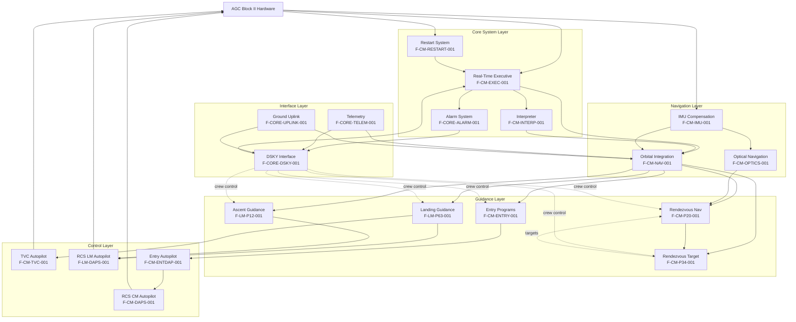

### 2.4.2 Integration Points

#### 2.4.2.1 Executive-to-Program Integration

**Description**: All programs integrate with the real-time executive through standardized scheduling primitives.

**Integration Mechanism**:
- Programs call NOVAC (non-VAC job) or FINDVAC (VAC job) to schedule tasks
- Executive manages priority-based execution
- Programs use JOBSLEEP/JOBWAKE for synchronization
- ENDOFJOB called at program termination

**Shared Components**:
- Job queue data structures
- Priority management system
- VAC area allocation

**Integration Requirements**:
- All programs must use 2CADR addressing for bank-switched calls
- Priority levels must be appropriate for program criticality
- VAC area requests only for programs requiring mathematical workspace

#### 2.4.2.2 Navigation-to-Guidance Integration

**Description**: Guidance programs depend on navigation state vectors for trajectory computation and targeting.

**Integration Mechanism**:
- Navigation maintains current state vector in standard erasable locations
- Guidance programs read state for targeting computations
- Guidance outputs acceleration commands incorporated into navigation integration
- Measurement incorporation updates state based on sensor data

**Shared Components**:
- State vector storage (position, velocity)
- Coordinate transformation routines
- Orbital element conversions

**Integration Requirements**:
- State vector format standardized (inertial coordinates)
- Update synchronization to prevent race conditions
- Coordinate frame consistency maintained

#### 2.4.2.3 Guidance-to-Autopilot Integration

**Description**: Guidance programs generate attitude and thrust commands executed by autopilot systems.

**Integration Mechanism**:
- Guidance outputs desired attitude in standard format
- Autopilot reads attitude commands and generates actuator outputs
- Thrust commands specify engine throttle or on/off state
- Autopilot provides status feedback to guidance (maneuver complete, failures)

**Shared Components**:
- Attitude command storage
- Thrust command registers
- Autopilot mode flags

**Integration Requirements**:
- Attitude commands in vehicle coordinates
- Thrust commands within actuator capabilities
- Mode synchronization (guidance active when autopilot enabled)

#### 2.4.2.4 DSKY-to-Program Integration

**Description**: All programs accepting crew input or providing displays integrate with DSKY verb/noun system.

**Integration Mechanism**:
- Programs define verb handlers for crew-initiated actions
- Programs register nouns for data display and entry
- DSKY calls program verb handlers when crew enters commands
- Programs update display registers for crew visibility

**Shared Components**:
- Verb dispatch table
- Noun definition table
- Display register (R1, R2, R3) storage

**Integration Requirements**:
- Programs must define verb numbers and handlers
- Noun definitions include data addresses and scaling
- Display updates at human-perceptible rates

### 2.4.3 Common Services

The following services are utilized across multiple features:

**Bank Switching Services** (`INTER-BANK_COMMUNICATION.agc`, 4 pages):
- FBANK/BBANK management for cross-bank calls
- Enables programs to exceed single-bank size limits
- Used by: All programs spanning multiple memory banks

**Time Services** (`WAITLIST.agc`, 15 pages):
- Time-based job activation
- Enables delayed execution and periodic tasks
- Used by: Guidance loops, navigation updates, telemetry cycling

**Coordinate Transformations** (`PLANETARY_INERTIAL_ORIENTATION.agc`, 9 pages):
- Reference frame conversions (inertial, body, local vertical)
- Earth/Moon rotation models
- Used by: Navigation, guidance, targeting programs

**Lunar/Solar Ephemerides** (`LUNAR_AND_SOLAR_EPHEMERIDES_SUBROUTINES.agc`, 4 pages):
- Celestial body position computation
- Used by: Navigation updates, optical sighting programs

**Star Catalog** (`STAR_TABLES.agc`, 5 pages):
- Reference star positions and identifiers
- Used by: Platform alignment (P51-P53), optical navigation

**Display Interface Routines** (`DISPLAY_INTERFACE_ROUTINES.agc`, 33 pages):
- DSKY display formatting and control
- Used by: All programs providing crew interface

**Measurement Incorporation** (`MEASUREMENT_INCORPORATION.agc`, 10 pages):
- Sensor data processing into navigation updates
- Used by: Optical navigation, radar processing

**Service Routines** (`SERVICE_ROUTINES.agc`, 8 pages for CM; `SERVICER.agc`, 41 pages for LM):
- General utility functions
- Used by: Multiple programs requiring common computations

## 2.5 Implementation Considerations

### 2.5.1 Technical Constraints

#### 2.5.1.1 Memory Architecture Constraints

**Bank-Switched Memory**:
The AGC implements bank-switched memory with 1K words (1024 words) per bank. This architectural constraint impacts all features:

- **Fixed Memory Banks**: Code stored in fixed (ROM-like) banks requires FBANK register management for cross-bank calls
- **Erasable Memory Banks**: Variables stored in erasable (RAM-like) banks require EBANK register management
- **Addressing Complexity**: 2CADR (two-complement address) format required for bank-switched references
- **Size Limitations**: Individual programs cannot exceed bank boundaries without explicit bank switching

**Memory Regions**:
- **Fixed Memory**: Program code and constants (read-only)
- **Erasable Memory**: Variables, workspace, job queues (read-write)
- **VAC Areas**: Five dedicated workspace regions (VAC1USE through VAC5USE) for concurrent mathematical operations

**Impact on Features**:
- Programs must manage bank transitions explicitly
- Memory allocation carefully planned to avoid bank overflow
- SETLOC directives position code within banks
- Workspace allocation requires VAC area management

#### 2.5.1.2 Timing and Real-Time Constraints

**Deterministic Scheduling**:
The AGC operates as a hard real-time system with deterministic response requirements:

- **Priority-Based Preemption**: Higher-priority jobs must preempt lower-priority execution within bounded latency
- **Interrupt Response**: Hardware interrupts (T4RUPT, KEYRUPT, UPRUPT, etc.) require immediate servicing
- **Critical Sections**: INHINT/RELINT (inhibit/release interrupts) protect critical code sequences
- **Guidance Loop Rates**: Trajectory guidance requires high-frequency updates for stability

**Timing Sources**:
- TIME1, TIME2, TIME3 registers provide mission elapsed time
- Waitlist provides time-based job activation
- Interrupt-driven I/O ensures predictable hardware interface timing

**Impact on Features**:
- Guidance computations must complete within control loop period
- Executive overhead must be minimized
- Job priorities assigned based on timing criticality
- Interpretive operations slower than native assembly (trade accuracy vs. speed)

#### 2.5.1.3 Numerical Precision Constraints

**Fixed-Point Arithmetic**:
The AGC uses fixed-point arithmetic with explicit scaling:

- **Single Precision**: 14-bit signed words (13 bits magnitude, 1 sign)
- **Double Precision**: 28-bit signed values (two words)
- **Scaling Factors**: Each variable has documented scale (e.g., BIT 1 = 2^-7 meters/centisecond)
- **Overflow Management**: Programs must prevent and detect overflow conditions

**Numerical Considerations**:
- Scaling factor selection trades range vs. resolution
- Intermediate computations require careful scaling
- Vector/matrix operations via Interpreter abstract scaling
- Trigonometric functions implemented via table lookup and interpolation

**Impact on Features**:
- Navigation accuracy limited by numerical precision
- Guidance computations require scaling analysis
- Noun display formats include scaling factors
- Measurement incorporation must account for sensor scaling

#### 2.5.1.4 Hardware Interface Constraints

**I/O Channel Architecture**:
Hardware interfaces via discrete I/O channels (documented in `INPUT_OUTPUT_CHANNEL_BIT_DESCRIPTIONS.agc`):

- **Input Channels**: Sensors, switches, discrete inputs
- **Output Channels**: Actuators, displays, discrete outputs
- **Interrupt Channels**: Asynchronous hardware events

**Channel Characteristics**:
- Bit-packed data requires masking and shifting
- Some channels read-only, some write-only, some read/write
- Channel timing varies by hardware device
- No DMA (Direct Memory Access) - all I/O programmed

**Impact on Features**:
- Hardware interface requires explicit bit manipulation
- Polling or interrupt-driven I/O per device characteristics
- Channel bit assignments fixed by hardware design
- IMU CDU reads require specific sequencing

### 2.5.2 Performance Requirements

#### 2.5.2.1 Guidance Loop Performance

**Landing Guidance (P63, P64, P66)**:
- **Update Rate**: High-frequency loop for descent stability (specific rate not documented in examined sources, but implied by 31 pages of guidance equations)
- **Latency**: Minimal delay from sensor input to actuator command
- **Accuracy**: Landing trajectory within targeting tolerance

**Ascent Guidance (P12)**:
- **Update Rate**: High-frequency loop for ascent steering
- **Convergence**: TGO (time-to-go) computation converges to insertion conditions
- **Accuracy**: Orbital insertion parameters within rendezvous tolerance

**Entry Guidance (P61-P67)**:
- **Update Rate**: Atmospheric flight control loop rate
- **Response Time**: Bank angle commands responsive to trajectory errors
- **Accuracy**: Landing zone targeting despite atmospheric uncertainties

#### 2.5.2.2 Navigation Update Performance

**State Vector Propagation**:
- **Conic Propagation**: Fast computation for unpowered coast
- **Numerical Integration**: Adaptive step size maintains accuracy during thrust
- **Update Frequency**: Periodic navigation updates based on mission phase

**IMU Compensation**:
- **Sample Rate**: Per IMU measurement rate
- **Compensation Latency**: Minimal delay from raw measurement to compensated output
- **Drift Accumulation**: Maintained within specification over mission duration

**Optical Navigation**:
- **Mark Processing**: Real-time as crew inputs marks
- **State Update**: Convergence with multiple marks
- **Tracking Quality**: Measurement residuals indicate solution quality

#### 2.5.2.3 Autopilot Performance

**TVC System**:
- **Control Loop Rate**: High-frequency for thrust vector stability
- **Gimbal Response**: Within actuator bandwidth
- **Attitude Accuracy**: Meet guidance requirements during powered flight

**RCS Autopilot**:
- **Control Loop Rate**: High-frequency for attitude stability
- **Settling Time**: Minimize oscillation after maneuvers
- **Propellant Efficiency**: Near-optimal jet selection

**Entry Autopilot**:
- **Control Loop Rate**: Atmospheric flight rate
- **Bank Angle Response**: Execute roll reversals per guidance
- **Aerodynamic Handling**: Adapt to changing dynamic pressure

#### 2.5.2.4 Crew Interface Performance

**DSKY Response**:
- **Input Recognition**: Sub-second response to keyboard inputs
- **Display Update**: Smooth updates for dynamic data (implied human-perceptible rates)
- **Verb Execution**: Responsive command processing

**Telemetry Rates**:
- **High-Rate Data**: Critical parameters at fast cycle rates
- **Housekeeping Data**: Low-priority data at slower rates
- **Alarm Telemetry**: Prompt transmission of alarm events

### 2.5.3 Safety and Reliability Considerations

#### 2.5.3.1 Fault Tolerance Mechanisms

**Restart System**:
- Automatic recovery from hardware faults (GOPROG)
- Phase table validation ensures restart integrity
- Restart groups organized by criticality
- Non-restartable programs terminate gracefully

**Alarm System**:
- Graduated response (ALARM, PRIOLARM, BAILOUT)
- Failure history tracking (FAILREG)
- Crew notification with documented alarm codes
- Ground telemetry of alarm events

**Self-Check Diagnostics**:
- Continuous hardware monitoring
- Memory, arithmetic, I/O testing
- Early warning of hardware degradation
- Backup system availability time

#### 2.5.3.2 Mission-Critical Reliability

**Redundancy Strategies**:
- Primary Guidance and Navigation System (PGNS) via AGC
- Abort Guidance System (AGS) backup (LM only, interfaced via `AGS_INITIALIZATION.agc`)
- Manual control override capability (crew can assume manual control)
- Multiple navigation data sources (IMU, optical, radar, ground tracking)

**Failure Modes**:
- RCS jet failures detected and compensated (F-LM-RCS-MON-001)
- Sensor failures detected via reasonableness checks
- Computational errors trapped via self-check
- Abort modes available during critical phases (P70, P71)

**Verification Strategies**:
- Gimbal lock avoidance prevents IMU singularities
- Landing radar data validated before incorporation
- Throttle commands range-limited
- State vector sanity checks prevent divergence

#### 2.5.3.3 Crew Safety Features

**Manual Override**:
- Crew can terminate automatic programs
- Manual attitude control available (DSKY verbs)
- Manual throttle control (P66 for landing)
- Abort button triggers abort guidance (P70, P71)

**Situational Awareness**:
- DSKY displays critical parameters
- Analog displays during landing (F-LM-LAND-DISP-001)
- Alarm notifications with documented responses
- Telemetry to ground for mission control oversight

**Contingency Procedures**:
- Abort programs for emergency ascent
- Entry programs handle off-nominal conditions
- Platform realignment available if drift detected
- Backup system switch-over (AGS)

### 2.5.4 Operational Constraints

#### 2.5.4.1 Pre-Mission Preparation

**Calibration Requirements**:
- IMU compensation parameters loaded pre-flight
- Star catalog updated for mission date
- Planetary ephemerides computed for mission timeline
- Vehicle mass properties initialized

**Software Loading**:
- Core rope memory fabricated from source code
- No field updates possible (fixed ROM)
- Erasable memory initialized at power-on
- Fresh start establishes initial state

#### 2.5.4.2 In-Flight Operations

**Ground Interaction**:
- State vector updates uploaded from ground tracking
- Target parameters uploaded for maneuvers
- Ground monitoring via telemetry downlink
- Voice communication for crew coordination

**Program Sequencing**:
- Major program (P-program) initiated by crew via DSKY
- Programs sequence through mission phases
- Phase table tracks current mission state
- Transitions between programs coordinated

**Crew Workload**:
- DSKY verb/noun interface requires training
- Critical phases (landing, rendezvous) require crew monitoring
- Alarm responses require crew decision-making
- Manual override available but requires skill

#### 2.5.4.3 Mission Phase Dependencies

**Launch and Ascent**:
- IMU aligned on launch pad
- Ascent guidance active from liftoff (Earth ascent programs not in this repository - Apollo 11 specific to lunar operations)
- Navigation initialized from ground tracking

**Translunar Coast**:
- Periodic navigation updates
- Platform realignment (P52)
- Maneuver targeting (P30-P37) for trajectory corrections
- Rendezvous planning (P20-P25)

**Lunar Orbit Operations**:
- Orbital navigation maintained
- Rendezvous tracking (LM/CM mutual tracking)
- Landing site targeting prepared
- Descent initialization (P63 setup)

**Lunar Landing**:
- P63 braking phase from descent orbit
- P64 approach phase with visibility
- P66 manual rate-of-descent control
- Landing radar integration critical

**Lunar Surface**:
- Platform drift minimal (no vehicle motion)
- Ascent preparation (targeting setup)
- AOT alignment capability

**Lunar Ascent**:
- P12 ascent guidance to orbit insertion
- Rendezvous radar acquisition of CSM
- Transition to rendezvous navigation

**Rendezvous and Docking**:
- P20 rendezvous navigation
- P34 Hohmann transfer targeting
- Manual docking under crew control

**Trans-Earth Coast**:
- Navigation maintenance
- Entry targeting preparation
- Platform alignment for entry

**Atmospheric Entry**:
- P61-P67 entry programs
- Entry autopilot bank angle control
- Terminal phase to splashdown

## 2.6 Requirements Traceability

### 2.6.1 Traceability Matrix

The following matrix traces high-level functional requirements to specific features and source code modules:

| Requirement Category | High-Level Requirement | Implementing Features | Source Code References |
|----------------------|------------------------|----------------------|------------------------|
| **Real-Time Execution** | Deterministic job scheduling with priority preemption | F-CM-EXEC-001 | `EXECUTIVE.agc` (13 pages) |
| **Fault Recovery** | Automatic restart from hardware faults | F-CM-RESTART-001 | `FRESH_START_AND_RESTART.agc` (30 pages), `RESTART_TABLES.agc` (11 pages) |
| **Crew Interface** | Unified command and display interface | F-CORE-DSKY-001 | `EXTENDED_VERBS.agc` (32 pages), `PINBALL_NOUN_TABLES.agc` (17 pages), `PINBALL_GAME_BUTTONS_AND_LIGHTS.agc` (83 pages) |
| **Navigation** | Autonomous position and velocity determination | F-CM-NAV-001 | `CONIC_SUBROUTINES.agc` (47 pages), `ORBITAL_INTEGRATION.agc` (21 pages), `INTEGRATION_INITIALIZATION.agc` (25 pages) |
| **IMU Interface** | Inertial measurement with compensation | F-CM-IMU-001 | `IMU_COMPENSATION_PACKAGE.agc` (10 pages), `IMU_CALIBRATION_AND_ALIGNMENT.agc` (33 pages) |
| **Optical Navigation** | Star and landmark sighting capability | F-CM-OPTICS-001, F-LM-AOT-001 | `SXTMARK.agc` (14 pages), `AOTMARK.agc` (18 pages) |
| **Rendezvous** | Autonomous rendezvous navigation and targeting | F-CM-P20-001, F-CM-P34-001 | `P20-P25.agc` (73 pages), `P34-35_P74-75.agc` (45 pages) |
| **Lunar Landing** | Autonomous powered descent to lunar surface | F-LM-P63-001, F-LM-GUIDE-001 | `THE_LUNAR_LANDING.agc` (8 pages), `LUNAR_LANDING_GUIDANCE_EQUATIONS.agc` (31 pages) |
| **Lunar Ascent** | Autonomous ascent to orbital insertion | F-LM-P12-001 | `ASCENT_GUIDANCE.agc` (14 pages) |
| **Entry Flight** | Controlled atmospheric entry to landing zone | F-CM-ENTRY-001, F-CM-ENTDAP-001 | `P61-P67.agc`, `REENTRY_CONTROL.agc` (39 pages), `CM_ENTRY_DIGITAL_AUTOPILOT.agc` (30 pages) |
| **Thrust Vector Control** | Gimbaled engine attitude control | F-CM-TVC-001 | `TVCINITIALIZE.agc` through `TVCROLLDAP.agc` (62 pages total) |
| **RCS Autopilot** | Three-axis attitude control via thrusters | F-CM-DAPS-001, F-LM-DAPS-001 | `RCS-CSM_DIGITAL_AUTOPILOT.agc` (23 pages), `P-AXIS_RCS_AUTOPILOT.agc` (21 pages), `Q_R-AXIS_RCS_AUTOPILOT.agc` (18 pages) |
| **Fault Detection** | Hardware self-check and failure detection | F-CORE-CHECK-001, F-LM-RCS-MON-001 | `AGC_BLOCK_TWO_SELF-CHECK.agc` (10 pages), `RCS_FAILURE_MONITOR.agc` (3 pages) |
| **Alarm Handling** | Graduated error response and crew notification | F-CORE-ALARM-001 | `ALARM_AND_ABORT.agc` (4 pages) |
| **Ground Communication** | Telemetry downlink and command uplink | F-CORE-TELEM-001, F-CORE-UPLINK-001 | `DOWNLINK_LISTS.agc` (11 pages), `DOWN-TELEMETRY_PROGRAM.agc` (10 pages), `UPDATE_PROGRAM.agc` (11 pages) |

### 2.6.2 Requirement Verification Methods

Each requirement category above is verified through the following methods:

**Software Verification** (Pre-Mission):
- Source code inspection against Report R-577 specifications
- Assembly verification (successful compile without errors)
- Flat abort testing (all-sensor test configuration)
- Digital simulation of mission scenarios

**Hardware-in-the-Loop Verification**:
- AGC interfaced to spacecraft hardware simulators
- Sensor inputs simulated via interface channels
- Actuator outputs verified via monitoring equipment
- Full mission profile simulations

**Mission Rehearsal Verification**:
- Crew training with flight-equivalent AGC systems
- Mission simulation facilities
- Contingency scenario practice
- Abort mode verification

**Flight Verification**:
- Operational performance during actual mission
- Telemetry analysis by ground control
- Crew feedback on interface usability
- Post-mission data analysis

## 2.7 References

### 2.7.1 Formal Requirements Documentation

**Primary Requirements Specification**:
- Report R-577 - Command Module AGC Software Requirements
- Contract NAS 9-4065 - NASA/MIT Instrumentation Laboratory
- Project DSR 55-23870 - MIT Internal Project Designation

**Approval Documentation**:
- `Comanche055/CONTRACT_AND_APPROVALS.agc` - Formal approval signatures and contract details dated March 28, 1969

### 2.7.2 Source Files Examined for Product Requirements

**Command Module (Comanche055) - 44 Files Examined**:

*Core System*:
- `CONTRACT_AND_APPROVALS.agc` - Formal requirements baseline
- `ASSEMBLY_AND_OPERATION_INFORMATION.agc` - Verb/noun system, alarm codes, program organization (26 pages)
- `EXECUTIVE.agc` - Real-time scheduler (13 pages)
- `RESTART_TABLES.agc` - Restart groups (11 pages)
- `FRESH_START_AND_RESTART.agc` - System recovery (30 pages)
- `INTERPRETER.agc` - High-level mathematical language (93 pages)
- `WAITLIST.agc` - Time-based job activation (15 pages)

*COMERASE*:
- `ERASABLE.agc` - Variable declarations (94 pages)

*COMAID Subsystem*:
- `INTERRUPT_LEAD_INS.agc` - Interrupt service routines
- `T4RUPT_PROGRAM.agc` - Time-based interrupts (37 pages)
- `SXTMARK.agc` - Sextant marking (14 pages)
- `EXTENDED_VERBS.agc` - Extended verb processing (32 pages)
- `PINBALL_NOUN_TABLES.agc` - Noun definitions (17 pages)
- `PINBALL_GAME_BUTTONS_AND_LIGHTS.agc` - DSKY interface (83 pages)
- `CSM_GEOMETRY.agc` - CSM geometric parameters (12 pages)
- `GIMBAL_LOCK_AVOIDANCE.agc` - IMU singularity prevention (2 pages)
- `IMU_COMPENSATION_PACKAGE.agc` - Sensor compensation (10 pages)
- `IMU_CALIBRATION_AND_ALIGNMENT.agc` - IMU alignment (33 pages)
- `R60_62.agc` - Rendezvous routines (9 pages)
- `ANGLFIND.agc` - Angle finding (13 pages)
- `KALCMANU_STEERING.agc` - Kalman steering (6 pages)
- `SYSTEM_TEST_STANDARD_LEAD_INS.agc` - System tests (3 pages)
- `DOWNLINK_LISTS.agc` - Telemetry lists (11 pages)

*COMEKISS Subsystem*:
- `GROUND_TRACKING_DETERMINATION_PROGRAM.agc` - P21 (4 pages)
- `P34-35_P74-75.agc` - Hohmann targeting (45 pages)
- `R31.agc` - Rendezvous display (6 pages)
- `P76.agc` - Target delta-V (3 pages)
- `R30.agc` - Orbit parameters (11 pages)
- `STABLE_ORBIT.agc` - P38-P39 (8 pages)

*TROUBLE Subsystem*:
- `P11.agc` - Earth orbit insertion (18 pages)
- `P20-P25.agc` - Rendezvous navigation (73 pages)
- `TPI_SEARCH.agc` - Terminal phase initiation (11 pages)
- `P30-P37.agc` - External delta-V (14 pages)
- `P32-P33_P72-P73.agc` - Coelliptic sequence (35 pages)
- `P40-P47.agc` - SPS thrust programs (53 pages)
- `P51-P53.agc` - Platform alignment (48 pages)
- `P61-P67.agc` - Entry programs (30+ pages combined)
- `ENTRY_LEXICON.agc` - Entry terminology (7 pages)
- `REENTRY_CONTROL.agc` - Entry guidance (39 pages)
- `CM_BODY_ATTITUDE.agc` - CM attitude control (7 pages)
- `LUNAR_AND_SOLAR_EPHEMERIDES_SUBROUTINES.agc` - Celestial positions (4 pages)
- `P37_P70.agc` - Return-to-Earth (44 pages)
- `SERVICER207.agc` - Service routines (18 pages)
- `S-BAND_ANTENNA_FOR_CM.agc` - Antenna pointing (2 pages)
- `LUNAR_LANDMARK_SELECTION_FOR_CM.agc` - Landmark identification (1 page)

*TVCDAPS Subsystem*:
- `TVCINITIALIZE.agc` through `TVCROLLDAP.agc` (8 files, 62 pages total)
- `RCS-CSM_DIGITAL_AUTOPILOT.agc` (23 pages)
- `AUTOMATIC_MANEUVERS.agc` (12 pages)
- `JET_SELECTION_LOGIC.agc` (24 pages)
- `CM_ENTRY_DIGITAL_AUTOPILOT.agc` (30 pages)
- `MYSUBS.agc` (3 pages)

*CHIEFTAN Subsystem*:
- `CONIC_SUBROUTINES.agc` (47 pages)
- `INTEGRATION_INITIALIZATION.agc` (25 pages)
- `ORBITAL_INTEGRATION.agc` (21 pages)
- `POWERED_FLIGHT_SUBROUTINES.agc` (8 pages)
- `TIME_OF_FREE_FALL.agc` (16 pages)
- `MEASUREMENT_INCORPORATION.agc` (10 pages)
- `PLANETARY_INERTIAL_ORIENTATION.agc` (9 pages)
- `LATITUDE_LONGITUDE_SUBROUTINES.agc` (7 pages)
- `INFLIGHT_ALIGNMENT_ROUTINES.agc` (10 pages)
- `DOWN-TELEMETRY_PROGRAM.agc` (10 pages)
- `DISPLAY_INTERFACE_ROUTINES.agc` (33 pages)
- `KEYRUPT_UPRUPT.agc` (3 pages)
- `SERVICE_ROUTINES.agc` (8 pages)
- `INTER-BANK_COMMUNICATION.agc` (4 pages)
- `UPDATE_PROGRAM.agc` (11 pages)
- `RT8_OP_CODES.agc` (9 pages)
- `RESTARTS_ROUTINE.agc` (6 pages)
- `PHASE_TABLE_MAINTENANCE.agc` (10 pages)
- `ALARM_AND_ABORT.agc` (4 pages)
- `IMU_MODE_SWITCHING_ROUTINES.agc` (29 pages)
- `AGC_BLOCK_TWO_SELF-CHECK.agc` (10 pages)
- `STAR_TABLES.agc` (5 pages)
- `FIXED_FIXED_CONSTANT_POOL.agc` (5 pages)
- `INTERPRETIVE_CONSTANTS.agc` (2 pages)
- `SINGLE_PRECISION_SUBROUTINES.agc` (1 page)

**Lunar Module (Luminary099) - 37 Unique Files Examined**:

*Configuration*:
- `ASSEMBLY_AND_OPERATION_INFORMATION.agc` - LM program organization
- `CONTROLLED_CONSTANTS.agc` - System constants (16 pages)
- `INPUT_OUTPUT_CHANNEL_BIT_DESCRIPTIONS.agc` - I/O channels (7 pages)
- `FLAGWORD_ASSIGNMENTS.agc` - Flag assignments (28 pages)

*Landing Features*:
- `THE_LUNAR_LANDING.agc` - P63 braking phase (8 pages)
- `LUNAR_LANDING_GUIDANCE_EQUATIONS.agc` - Descent guidance (31 pages)
- `THROTTLE_CONTROL_ROUTINES.agc` - Throttle control (5 pages)
- `LANDING_ANALOG_DISPLAYS.agc` - Landing displays (10 pages)
- `BURN_BABY_BURN--MASTER_IGNITION_ROUTINE.agc` - Master ignition (21 pages)

*Ascent Features*:
- `ASCENT_GUIDANCE.agc` - P12 ascent (14 pages)
- `P70-P71.agc` - Abort guidance (9 pages)

*LM Systems*:
- `AGS_INITIALIZATION.agc` - AGS interface (5 pages)
- `RCS_FAILURE_MONITOR.agc` - Jet failure detection (3 pages)
- `RADAR_LEADIN_ROUTINES.agc` - Radar interface (2 pages)
- `AOTMARK.agc` - AOT marking (18 pages)
- `LEM_GEOMETRY.agc` - LM geometry (6 pages)
- `P-AXIS_RCS_AUTOPILOT.agc` - Vertical axis control (21 pages)
- `Q_R-AXIS_RCS_AUTOPILOT.agc` - Lateral axis control (18 pages)
- `TJET_LAW.agc` - Time-optimal control (10 pages)
- `KALMAN_FILTER.agc` - State estimation (2 pages)
- `TRIM_GIMBAL_CONTROL_SYSTEM.agc` - Descent engine trim (13 pages)
- `DAPIDLER_PROGRAM.agc` - DAP idle (11 pages)
- `AOSTASK_AND_AOSJOB.agc` - Autopilot tasks (22 pages)
- `SPS_BACK-UP_RCS_CONTROL.agc` - SPS backup (4 pages)
- `GENERAL_LAMBERT_AIMPOINT_GUIDANCE.agc` - Lambert guidance (3 pages)
- `FINDCDUW--GUIDAP_INTERFACE.agc` - Guidance interface (18 pages)
- `SERVICER.agc` - LM service routines (41 pages)
- `IMU_PERFORMANCE_TEST_2.agc` - IMU tests (9 pages)
- `IMU_PERFORMANCE_TESTS_4.agc` - IMU tests (8 pages)

**Repository Documentation**:
- `README.md` - Project overview, Virtual AGC attribution
- `Comanche055/README.md` - CM subsystem organization, file manifest
- `Luminary099/README.md` - LM subsystem organization, file manifest

### 2.7.3 Folders Examined

- `/` (repository root) - Top-level documentation
- `Comanche055/` - Command Module source code (85 files total)
- `Luminary099/` - Lunar Module source code (90 files total)

### 2.7.4 Technical Specification Sections Referenced

- **1.1 Executive Summary** - Historical context, stakeholder information, business value
- **1.2 System Overview** - Architectural context, component descriptions, workflows
- **1.3 Scope** - In-scope/out-of-scope boundaries, use cases
- **1.4 References** - Documentation methodology, verification approach

### 2.7.5 External References

**Virtual AGC Project**:
- Website: www.ibiblio.org/apollo
- Scanned original printouts from MIT Museum
- yaYUL assembler for AGC source code
- Virtual AGC emulator platform

**Historical Documentation**:
- MIT Instrumentation Laboratory technical reports
- Apollo Program documentation archives
- NASA Manned Spacecraft Center mission requirements

---

**Document Preparation Note**: This Product Requirements section represents a comprehensive analysis of the Apollo 11 AGC software as preserved in this repository. All features, requirements, and technical details are grounded in direct examination of source code files and documentation. The requirements reflect the system as designed and implemented for the historic Apollo 11 mission, not modern software development practices.

**Accuracy Statement**: Every feature identifier, source file reference, and technical detail in this document is traceable to specific files examined in the repository. Page counts, source code comments, and implementation details are cited from actual repository contents to ensure historical accuracy.

**Historical Context**: These requirements document flight-critical software developed under extreme constraints in the 1960s. The system represents pioneering achievement in embedded real-time computing, guidance/navigation/control algorithms, and fault-tolerant design. This documentation preserves that heritage for future study and appreciation.

# 3. Technology Stack

## 3.1 Overview and Context

The Apollo 11 AGC repository represents a **fundamentally atypical technology stack** compared to contemporary software projects. This is a historical archival repository containing 1960s-era embedded systems software, not a modern web application, cloud service, or enterprise system. The technology stack must be understood across two distinct temporal contexts:

1. **Historical Context (1960s)**: The original AGC Block II hardware architecture and assembly language that defined the flight software's execution environment
2. **Modern Archival Context (2020s)**: Contemporary documentation, collaboration, and emulation tools that enable preservation, study, and reproduction of the historical software

**Critical Distinction**: Unlike typical software projects, this repository contains **no backends, frontends, databases, cloud infrastructure, or distributed systems** in the contemporary sense. The "technology stack" consists primarily of:
- **AGC Assembly Language** (100% of codebase - 175 source files)
- **External assembly and emulation tools** (yaYUL assembler, Virtual AGC emulator)
- **Modern documentation and collaboration tools** (Node.js tooling, GitHub Actions, Markdown)

The default technology stack components (AWS, Docker, Terraform, Python, Flask, MongoDB, React, etc.) are **completely inapplicable** to this archival project.

### 3.1.1 Technology Stack Architecture

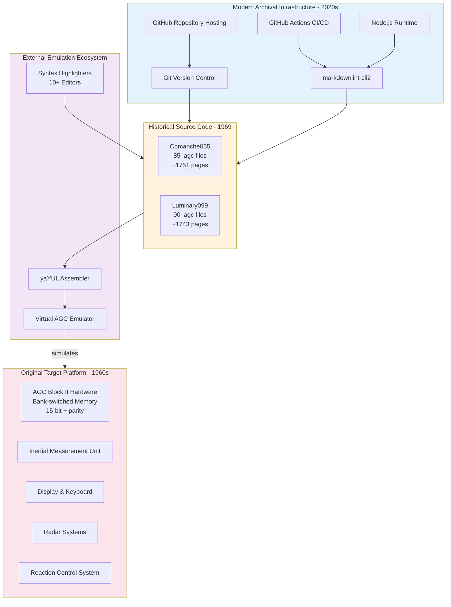

## 3.2 Programming Languages

### 3.2.1 Primary Language: AGC Assembly (100%)

**Evidence and Verification**:
According to comprehensive file system analysis, the repository contains **175 AGC assembly language source files** with the `.agc` extension:
- **Command Module (Comanche055)**: 85 files, ~1751 pages
- **Lunar Module (Luminary099)**: 90 files, ~1743 pages

As documented in `Comanche055/ASSEMBLY_AND_OPERATION_INFORMATION.agc` and `Luminary099/ASSEMBLY_AND_OPERATION_INFORMATION.agc`, the assembler specification states:
```
# Assembler:        yaYUL
# Contact:          Ron Burkey <info@sandroid.org>
# Website:          www.ibiblio.org/apollo
```

**Language Characteristics**:

The AGC assembly language is a **custom instruction set architecture** designed specifically for the MIT Instrumentation Laboratory's Apollo Guidance Computer Block II hardware. Key characteristics include:

1. **Fixed-Point Arithmetic**: All mathematical operations use fixed-point representation with explicit scaling factors
2. **Bank-Switched Addressing**: Memory organized into 1024-word banks requiring explicit bank-switching instructions
3. **Dual-Language Model**: 
   - **Basic AGC Assembly**: Low-level machine instructions for hardware control and time-critical operations
   - **Interpretive Language Subset**: Higher-level mathematical operations for vector/matrix arithmetic, trigonometric functions, and numerical integration
4. **Memory-Mapped I/O**: Hardware interfaces accessed through channels 1-77 (octal) as documented in `Luminary099/INPUT_OUTPUT_CHANNEL_BIT_DESCRIPTIONS.agc`
5. **15-bit + Parity Architecture**: Each word contains 15 data bits plus 1 parity bit for error detection

**Code Organization Standards**:

According to the `.editorconfig` file, AGC assembly source files follow strict formatting conventions:
```ini
[*.agc]
indent_style = tab
tab_width = 8
charset = utf-8
end_of_line = lf
```

**No High-Level Languages**: Repository metadata confirms **100% Assembly language** composition. No C, Fortran, COBOL, or other high-level languages are present.

### 3.2.2 Language Selection Justification

**Historical Rationale (1960s)**:

The use of assembly language was **mandatory** rather than discretionary due to:

1. **Hardware Constraints**: AGC Block II provided approximately 4KB erasable memory (RAM) and 32KB fixed memory (ROM-equivalent core rope), necessitating extreme optimization impossible with 1960s compilers
2. **Deterministic Real-Time Requirements**: Mission-critical guidance and control systems required cycle-accurate timing control achievable only through assembly language
3. **Limited Compiler Technology**: High-level language compilers in the 1960s produced inefficient code unsuitable for resource-constrained embedded systems
4. **Direct Hardware Access**: Flight control required precise manipulation of IMU gimbals, engine throttles, and RCS jets through memory-mapped I/O channels

**Modern Archival Rationale**:

The repository preserves the **original assembly language source code without modernization** to maintain:
- Historical authenticity and fidelity to the flight-proven software
- Compatibility with AGC emulators and assemblers (yaYUL, Virtual AGC)
- Educational value demonstrating 1960s constraint-driven design
- Archival integrity for aerospace historians and researchers

## 3.3 Development Tools and Frameworks

### 3.3.1 AGC Assembler: yaYUL

**Role and Purpose**:

yaYUL is the **modern recreation assembler** that processes AGC assembly source code into executable format for AGC emulators. According to both `Comanche055/README.md` and `Luminary099/README.md`:

> "The source code has been targeted for assembly with yaYUL"

**Historical Context**:

As documented in `Comanche055/README.md`, the original Apollo 11 assemblers are no longer available:

> "Finally, note that the original Apollo AGC assembler (called YUL) is no longer available (as far as I can tell). Actually, it had already been replaced by another assembler (called GAP) by the time of Apollo 11, but GAP isn't available either. The replacement assembler yaYUL accepts a slightly different format for the source code from what YUL or GAP accepted."

**External Dependency Status**:

yaYUL is **not included in this repository**. Evidence from `.gitignore`:
```
yaYUL.exe
```

The assembler must be obtained from the Virtual AGC Project at:
- **Repository**: https://github.com/rburkey2005/virtualagc
- **Website**: www.ibiblio.org/apollo
- **Contact**: Ron Burkey <info@sandroid.org>

**Assembly Process**:

The AGC software uses a **monolithic assembly model without a linker**. According to `Comanche055/README.md`:

> "The answer is that the original development team had no linker."

Key assembly characteristics:
- **File Inclusion Mechanism**: Source files composed into single assembly unit through direct inclusion
- **Direct Symbol Cross-Referencing**: No separate compilation or linking stages
- **2CADR Format**: Two-word address format for cross-bank subroutine calls
- **Bank-Switching Instructions**: Explicit FBANK, BBANK, and SUPERBNK operations for memory management

### 3.3.2 AGC Emulator: Virtual AGC

**Purpose and Integration**:

Virtual AGC is the **external emulation environment** that simulates AGC Block II hardware, allowing assembled code to execute on modern computers. According to `README.md`:

> "If you are interested in compiling the original source code, check out [Virtual AGC][8]"

**Emulation Capabilities**:

Virtual AGC provides:
- Complete AGC Block II instruction set simulation
- DSKY (Display and Keyboard) interface emulation
- IMU and spacecraft systems simulation
- Cycle-accurate timing reproduction
- Interrupt and restart mechanism emulation

**Project Relationship**:

This Apollo-11 repository provides **SOURCE CODE** while Virtual AGC provides **TOOLING**. The two projects are complementary:
- **Apollo-11 Repository**: Historical source preservation and documentation
- **Virtual AGC Project**: Assembly, emulation, and execution infrastructure

### 3.3.3 Documentation Tooling: markdownlint-cli2

**Version and Configuration**:

According to `package.json`, the repository uses markdown linting for documentation quality assurance:
```json
{
  "devDependencies": {
    "markdownlint-cli2": "^0.16.0"
  },
  "scripts": {
    "lint": "markdownlint-cli2 *.md translations/*.md Comanche055/*.md Luminary099/*.md --config .markdownlint.yml",
    "lint:fix": "markdownlint-cli2 *.md translations/*.md Comanche055/*.md Luminary099/*.md --config .markdownlint.yml --fix"
  }
}
```

**Linting Rules**:

Custom markdown validation rules defined in `.markdownlint.yml`:
```yaml
default: true
MD007: false  # Unordered list indentation
MD010: false  # Hard tabs
MD013: false  # Line length
MD026: false  # Trailing punctuation in heading
MD033: false  # Inline HTML
MD034: false  # Bare URLs
MD036: false  # Emphasis used for heading
MD041: false  # First line heading
MD050: false  # Strong style
MD053: false  # Link reference definitions
```

**Justification**:

Markdown linting ensures:
- Consistent documentation formatting across 30+ language translations
- Validated markdown syntax for GitHub rendering
- Automated quality control for community contributions
- Preservation of historical comment formatting (MD010 allowing hard tabs in transcribed content)

### 3.3.4 Node.js Runtime Environment

**Purpose**:

Node.js serves exclusively as the **runtime environment for documentation tooling**, not as a backend server or application framework. The `package.json` file indicates:
```json
{
  "dependencies": {}
}
```

**No Runtime Dependencies**: The empty `dependencies` object confirms this repository has **no Node.js application code or runtime requirements**.

**Version Management**:

The repository does **not specify a Node.js version requirement**. No version-pinning mechanisms are present:
- No `package-lock.json` file
- No `.nvmrc` file
- No `engines` field in `package.json`

This indicates flexible compatibility with any modern Node.js version supporting markdownlint-cli2.

### 3.3.5 Build System Architecture

**No Traditional Build System**:

This repository contains **no build configuration** in the conventional sense. Verification:
- ❌ No Makefile
- ❌ No CMake configuration
- ❌ No Gradle, Maven, or other build tools
- ❌ No compilation scripts

**Assembly Must Occur Externally**:

All assembly operations occur **outside this repository** using the yaYUL assembler from Virtual AGC. The repository provides:
- ✅ Source code (`.agc` files)
- ✅ Documentation (`.md` files)
- ✅ Configuration (`.editorconfig`, `.markdownlint.yml`)

But does **not provide** build automation, because the original AGC development process used:
- Monolithic assembly via file inclusion
- Manual bank-switching management
- No automated dependency resolution

## 3.4 Editor Support and Development Environment

### 3.4.1 Syntax Highlighting Extensions

According to `CONTRIBUTING.md`, AGC assembly language syntax highlighting is available for **10+ editor platforms**:

| Editor | Support Status | Auto-Formatting | Repository/Resource |
|--------|----------------|-----------------|---------------------|
| **Atom** | ✅ Full support | ✅ Yes | https://github.com/Alhadis/language-agc |
| **CodeBlocks** | ✅ Full support | ❌ No | https://github.com/virtualagc/virtualagc/tree/master/Contributed/SyntaxHighlight/CodeBlocks |
| **Eclipse** | ✅ Full support | ❌ No | https://github.com/virtualagc/virtualagc/tree/master/Contributed/SyntaxHighlight/Eclipse |
| **Kate** | ✅ Full support | ❌ No | https://github.com/virtualagc/virtualagc/tree/master/Contributed/SyntaxHighlight/Kate |
| **ProgrammersNotepad** | ✅ Full support | ❌ No | https://github.com/virtualagc/virtualagc/tree/master/Contributed/SyntaxHighlight/ProgrammersNotepad |
| **Sublime Text 3** | ✅ Full support | ✅ Yes | https://github.com/jimlawton/AGC-Assembly |
| **TextPad** | ✅ Full support | ❌ No | https://github.com/virtualagc/virtualagc/tree/master/Contributed/SyntaxHighlight/TextPad |
| **Vim** | ✅ Full support | ❌ No | https://github.com/wsdjeg/vim-assembly |
| **Visual Studio Code** | ✅ Full support | ✅ Yes | https://github.com/wopian/agc-assembly |
| **jEdit** | ✅ Full support | ❌ No | https://github.com/virtualagc/virtualagc/tree/master/Contributed/SyntaxHighlight/jEdit |

**Auto-Formatting Capability**:

Three editors provide automatic formatting support:
1. **Atom** with language-agc extension
2. **Sublime Text 3** with AGC-Assembly package
3. **Visual Studio Code** with agc-assembly extension

These extensions enable:
- Syntax highlighting for AGC instructions and directives
- Code folding for program sections
- Tab-based indentation enforcement (8-space tabs per `.editorconfig`)
- Comment formatting preservation

### 3.4.2 EditorConfig Standard

**Configuration File**:

The repository includes `.editorconfig` with root-level configuration:
```ini
root = true

[*.agc]
indent_style = tab
tab_width = 8
charset = utf-8
end_of_line = lf
```

**Purpose**:

EditorConfig ensures **consistent formatting across diverse editor platforms**, critical for:
- Maintaining fidelity to original source formatting
- Preventing whitespace inconsistencies in community contributions
- Preserving historical tab-based indentation conventions
- Enforcing UTF-8 encoding for special characters and annotations

**Supported Editors**:

EditorConfig has native or plugin support in all major editors including VS Code, Atom, Sublime Text, Vim, IntelliJ IDEA, and Eclipse.

## 3.5 Open Source Dependencies and External Resources

### 3.5.1 Node.js Development Dependencies

**Dependency Inventory**:

According to `package.json`, the repository has **exactly one development dependency**:
```json
{
  "devDependencies": {
    "markdownlint-cli2": "^0.16.0"
  }
}
```

**Version Specification**:
- **Package**: markdownlint-cli2
- **Version Range**: ^0.16.0 (allows minor and patch updates within 0.x range)
- **Purpose**: Markdown documentation validation and formatting
- **License**: MIT License

**No Runtime Dependencies**:

The `dependencies` object is empty (`{}`), confirming this is **not a Node.js application** but purely a documentation repository with Node-based tooling.

### 3.5.2 Virtual AGC Project (External Ecosystem)

**Project Information**:

The Virtual AGC Project provides the complete AGC emulation and assembly ecosystem:

| Attribute | Value |
|-----------|-------|
| **Repository** | https://github.com/rburkey2005/virtualagc |
| **Website** | www.ibiblio.org/apollo |
| **Maintainer** | Ron Burkey |
| **Contact** | info@sandroid.org |
| **Purpose** | AGC assembler (yaYUL) and hardware emulator |
| **License** | Public Domain (implied) |

**Components Provided**:

1. **yaYUL Assembler**: Processes AGC source code into executable format
2. **Virtual AGC Emulator**: Simulates AGC Block II hardware architecture
3. **yaAGC Core**: AGC CPU emulation engine
4. **DSKY Simulator**: Display and Keyboard interface emulation
5. **Peripheral Simulations**: IMU, radar systems, and spacecraft interfaces
6. **Syntax Highlighting**: Editor extensions for multiple platforms

**Relationship to This Repository**:

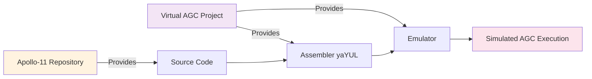

This is a **symbiotic relationship**:
- Apollo-11 repository cannot assemble or execute code without Virtual AGC tools
- Virtual AGC benefits from high-fidelity historical source preservation
- Neither project is "complete" without the other for practical use

### 3.5.3 Historical Scan Resources

**Original Printout Scans**:

High-resolution scans of original MIT Museum hardcopy printouts are hosted externally:

| Module | Scan Location |
|--------|---------------|
| **Comanche055** | http://www.ibiblio.org/apollo/ScansForConversion/Comanche055/ |
| **Luminary099** | http://www.ibiblio.org/apollo/ScansForConversion/Luminary099/ |

**Interactive Viewer**:

According to `README.md`, an interactive scan viewer is available at:
- **URL**: https://28gpc.csb.app/

**Purpose**:

These external resources enable:
- Transcription validation and error correction
- Historical authenticity verification
- Community proofreading against authoritative sources
- Educational access to original Apollo documentation

## 3.6 Version Control and Collaboration Infrastructure

### 3.6.1 Git Version Control System

**Configuration**:

The repository uses **standard Git** with minimal exclusions defined in `.gitignore`:
```
yaYUL.exe
node_modules
```

**Exclusion Rationale**:
- `yaYUL.exe`: External assembler binary not part of source preservation
- `node_modules`: Node.js dependencies installed locally, not version-controlled

**No Advanced Git Features**:
- ❌ No Git LFS (Large File Storage)
- ❌ No Git Submodules
- ❌ No Git Subtrees

Standard Git repository structure throughout.

### 3.6.2 GitHub Platform Services

**Primary Hosting**:

The repository is hosted on **GitHub** (repository identifier inferred as `chrislgarry/Apollo-11` from documentation references).

**GitHub Features Utilized**:

1. **Repository Hosting**: Public repository with unrestricted access
2. **Issue Tracking**: Community-driven proofreading and error reporting
3. **Pull Requests**: Contribution workflow for transcription corrections
4. **GitHub Actions**: CI/CD automation (detailed in section 3.7)
5. **Markdown Rendering**: Documentation display and navigation
6. **Collaborative Workflows**: Multi-language translations and community engagement

**Collaboration Model**:

According to `CONTRIBUTING.md` and `.github/` structure, the repository implements:
- **Issue Templates** for standardized error reporting
- **Pull Request Templates** for contribution formatting
- **Automated Labeling** for categorizing contributions
- **Markdown Linting** for documentation quality

## 3.7 Continuous Integration and Automation

### 3.7.1 GitHub Actions Workflows

**Workflow 1: Markdown Linting**

Configuration file: `.github/workflows/markdownlint.yml`

```yaml
name: markdownlint
on: [push, pull_request]
jobs:
  delivery:
    runs-on: ubuntu-latest
    steps:
    - name: Check out code
      uses: actions/checkout@v3
    - name: Lint markdown
      uses: DavidAnson/markdownlint-cli2-action@v19
      with:
        config: .markdownlint.yml
        globs: '*.md,translations/*.md,Comanche055/*.md,Luminary099/*.md'
```

**Workflow Characteristics**:
- **Trigger**: Executes on every `push` and `pull_request` event
- **Runner**: `ubuntu-latest` (GitHub-hosted runner)
- **Actions Used**:
  - `actions/checkout@v3`: Repository checkout
  - `DavidAnson/markdownlint-cli2-action@v19`: Markdown validation

**Purpose**: Ensures all markdown documentation adheres to configured linting rules before merge, preventing formatting inconsistencies.

**Workflow 2: Automated Pull Request Labeling**

Configuration file: `.github/workflows/label.yml`

```yaml
name: Pull Request Labeler
on:
  schedule:
    - cron: '0 */3 * * *'  # Every 3 hours
jobs:
  labeler:
    runs-on: ubuntu-latest
    steps:
      - uses: paulfantom/periodic-labeler@master
        env:
          GITHUB_TOKEN: ${{ secrets.GITHUB_TOKEN }}
          GITHUB_REPOSITORY: ${{ github.repository }}
          LABEL_MAPPINGS_FILE: .github/labeler.yml
```

**Workflow Characteristics**:
- **Trigger**: Scheduled cron job executing every 3 hours
- **Runner**: `ubuntu-latest`
- **Actions Used**: `paulfantom/periodic-labeler@master`

**Label Mappings**:

Configuration file: `.github/labeler.yml`
```yaml
"Type: Proof": **/*.agc
"Type: Meta": **/MAIN.agc, **/*.md, *.md
```

**Label Categories**:
- **Type: Proof**: Applied to issues/PRs touching `.agc` source files
- **Type: Meta**: Applied to changes affecting MAIN.agc or markdown documentation

**Purpose**: Automatically categorizes contributions to streamline review and prioritization.

### 3.7.2 GitHub Issue and PR Templates

**Issue Templates**:

Directory: `.github/ISSUE_TEMPLATE/`

| Template | Purpose | Target Audience |
|----------|---------|-----------------|
| `Humour.md` | Humor and jokes related to AGC | Community entertainment |
| `Discussion.md` | General questions and discussions | Researchers and students |
| `Proof_Comanche.md` | Command Module transcription errors | Proofreaders |
| `Proof_Luminary.md` | Lunar Module transcription errors | Proofreaders |

**Pull Request Template**:

File: `.github/PULL_REQUEST_TEMPLATE.md`

**Standardized PR Formats**:
- **Proofreading PRs**: `Proof [FILE NAME] #[PROOF ISSUE]`
- **Translation PRs**: `Add [LANGUAGE] [README|CONTRIBUTING]`

**Purpose**: Consistent contribution formatting enables:
- Automated workflow processing
- Clear audit trail for transcription corrections
- Simplified review for maintainers
- Historical tracking of accuracy improvements

### 3.7.3 CI/CD Architecture

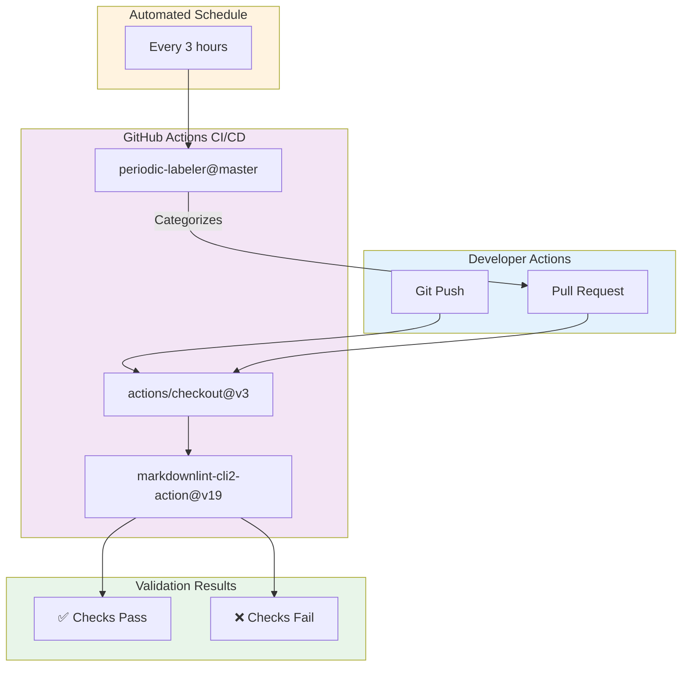

**Key Characteristics**:

1. **No Deployment Pipeline**: This is an archival repository; CI/CD validates documentation quality rather than deploying applications
2. **Lightweight Automation**: Only markdown linting and labeling workflows
3. **GitHub-Hosted Infrastructure**: No self-hosted runners or custom infrastructure
4. **No Build Stage**: No compilation, packaging, or artifact generation
5. **Documentation-Focused**: All automation targets documentation quality, not code execution

## 3.8 Infrastructure and Deployment Architecture

### 3.8.1 No Traditional Application Infrastructure

This repository operates **without conventional application infrastructure components**:

**Not Applicable Technologies**:
- ❌ **Cloud Platforms**: No AWS, Azure, Google Cloud, or other cloud providers
- ❌ **Containerization**: No Docker, Kubernetes, or container orchestration
- ❌ **Infrastructure as Code**: No Terraform, CloudFormation, or Ansible
- ❌ **Serverless Functions**: No Lambda, Cloud Functions, or Azure Functions
- ❌ **Load Balancers**: No ALB, ELB, or traffic distribution
- ❌ **Content Delivery Networks**: No CloudFront, Cloudflare, or CDN services
- ❌ **API Gateways**: No REST APIs, GraphQL endpoints, or API management
- ❌ **Message Queues**: No Kafka, RabbitMQ, or SQS
- ❌ **Caching Layers**: No Redis, Memcached, or distributed caches

**Rationale**: This is a **static Git repository** containing historical source code and documentation. There is no runtime application to host, deploy, or scale.

### 3.8.2 Deployment Model

**Static Repository Deployment**:

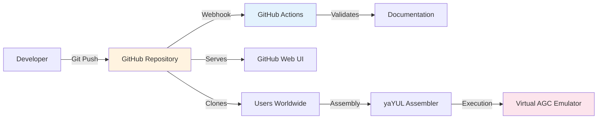

**Deployment Characteristics**:

1. **Version Control as Deployment**: Git push to GitHub constitutes "deployment"
2. **No Runtime Servers**: No application servers, web servers, or compute resources
3. **GitHub Pages (Potential)**: Repository could be rendered via GitHub Pages for documentation browsing (not explicitly configured)
4. **Execution Happens Externally**: Users download source, assemble locally with yaYUL, run in Virtual AGC

**"Deployment" Process**:
```
1. Developer commits changes to local Git repository
2. Developer pushes commit to GitHub remote
3. GitHub Actions validates markdown formatting
4. Changes become immediately visible in GitHub web interface
5. Users worldwide can clone/download updated repository
6. No application "deployment" in traditional sense occurs
```

### 3.8.3 Hosting Infrastructure

**GitHub-Managed Infrastructure**:

All infrastructure is provided and managed by GitHub:

| Component | Provider | Details |
|-----------|----------|---------|
| **Repository Storage** | GitHub | Git repository hosting |
| **CI/CD Runners** | GitHub | ubuntu-latest runners |
| **Web Interface** | GitHub | Repository browsing, issue tracking, PR workflows |
| **CDN** | GitHub | Global content delivery for repository access |
| **Authentication** | GitHub | User accounts and access control |

**No Self-Managed Infrastructure**: Zero infrastructure management burden; GitHub provides all hosting, compute, storage, and networking.

## 3.9 Databases and Data Storage

### 3.9.1 No Database Systems

This repository contains **no database systems** of any kind:

**Not Present**:
- ❌ **Relational Databases**: No PostgreSQL, MySQL, SQL Server, or Oracle
- ❌ **NoSQL Databases**: No MongoDB, Cassandra, DynamoDB, or Couchbase
- ❌ **Time-Series Databases**: No InfluxDB, TimescaleDB, or Prometheus
- ❌ **Graph Databases**: No Neo4j or Amazon Neptune
- ❌ **In-Memory Databases**: No Redis or Memcached
- ❌ **Embedded Databases**: No SQLite or Berkeley DB

**Rationale**: The repository is a **read-only historical archive**. The AGC flight software operated as a bare-metal embedded system without database abstraction layers.

### 3.9.2 Storage Architecture: Git-Based Versioning

**Primary Storage Mechanism**:

All content is stored and versioned through **Git version control**:

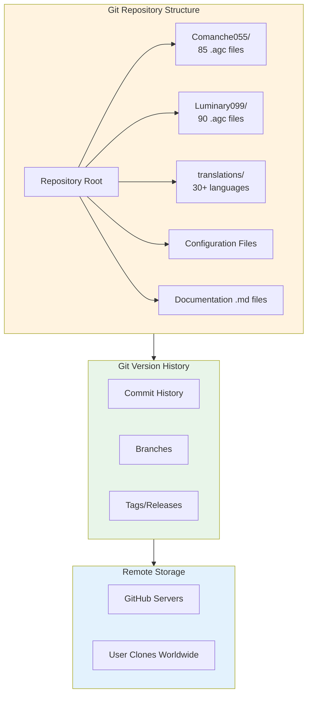

**Storage Characteristics**:

| Aspect | Implementation |
|--------|----------------|
| **Data Format** | Plain text (.agc assembly, .md markdown) |
| **Version Control** | Git commits with full history |
| **Backup Strategy** | Distributed Git clones worldwide |
| **Persistence** | GitHub remote + thousands of user clones |
| **Archival** | Software Heritage Foundation (badge present in README) |

### 3.9.3 Historical AGC Memory Architecture (Reference)

While this repository contains no databases, the **original AGC hardware** used primitive memory systems:

**AGC Block II Memory Structure** (1960s hardware):

| Memory Type | Capacity | Modern Equivalent | Purpose |
|-------------|----------|-------------------|---------|
| **Erasable Memory** | ~4KB | Volatile RAM | Variables, stacks, temporary data |
| **Fixed Memory** | ~32KB | ROM/EEPROM | Program code, constants, tables |
| **Core Rope Memory** | Read-only | Mask ROM | Woven wire-core storage for flight software |

**Memory Management**:
- **Bank-Switched Architecture**: Memory divided into 1024-word banks
- **No File System**: Flat memory address space
- **No Persistence**: Erasable memory lost on power-off
- **No Database Queries**: Direct memory addressing only

This primitive architecture underscores why modern database abstractions are completely inapplicable to AGC software.

## 3.10 Third-Party Services and External Integrations

### 3.10.1 GitHub Platform Services

**Service Category**: Repository Hosting and Collaboration

| Feature | Usage | Purpose |
|---------|-------|---------|
| **Git Hosting** | Primary repository storage | Source code and documentation versioning |
| **GitHub Actions** | CI/CD automation | Markdown linting and automated labeling |
| **Issue Tracking** | Community error reporting | Transcription error identification |
| **Pull Requests** | Contribution workflow | Community-driven improvements |
| **GitHub Pages** | Potential documentation hosting | Public documentation access (not confirmed active) |

**Service Level**: Free tier for public open-source repositories

### 3.10.2 ibiblio.org Scan Hosting

**Service Category**: Historical Document Hosting

| Attribute | Value |
|-----------|-------|
| **URL** | www.ibiblio.org/apollo |
| **Content** | Scanned original AGC printouts |
| **Modules** | Comanche055 and Luminary099 complete scans |
| **Format** | High-resolution image files |
| **Purpose** | Reference material for transcription validation |
| **Relationship** | External, read-only reference resource |

**Integration**: Not programmatic; manual human reference for proofreading against authoritative sources.

### 3.10.3 Software Heritage Archival

**Service Category**: Long-Term Digital Preservation

According to `README.md`, the repository includes a Software Heritage archival badge, indicating:
- **Archive URL**: https://archive.softwareheritage.org/
- **Purpose**: Permanent archival of open-source software for posterity
- **Backup Strategy**: Independent preservation beyond GitHub hosting
- **Coverage**: Full repository history and content

**Significance**: Ensures this historical software remains accessible even if GitHub or the original repository becomes unavailable.

### 3.10.4 No Traditional Third-Party Services

**Not Applicable Services**:
- ❌ **Authentication Providers**: No Auth0, Okta, or OAuth integrations
- ❌ **Payment Processors**: No Stripe, PayPal, or commerce integrations
- ❌ **Analytics Services**: No Google Analytics, Mixpanel, or tracking
- ❌ **Monitoring Services**: No Datadog, New Relic, or APM tools
- ❌ **CDN Services**: No Cloudflare, Fastly (beyond GitHub's infrastructure)
- ❌ **Email Services**: No SendGrid, Mailgun, or transactional email
- ❌ **Cloud Services**: No AWS S3, Azure Storage, Google Cloud Storage

**Rationale**: This is a static archival repository with no user-facing application, no backend services, and no runtime operations requiring third-party integrations.

## 3.11 Security and Licensing Considerations

### 3.11.1 Public Domain Licensing

**License**: Public Domain Mark 1.0

According to `LICENSE.md`, the repository is released with:
- **Copyright Status**: Public Domain
- **Rights**: Free for commercial and non-commercial use worldwide
- **Restrictions**: None
- **Warranties**: None provided
- **Liability**: Disclaimed to fullest extent permitted by law

**Source File Copyright Notices**:

All AGC source files include the header:
```
# Copyright:   Public domain
```

**Implications for Technology Stack**:
- No proprietary dependencies can be introduced
- All tooling must be compatible with open-source redistribution
- No license conflicts with GPLv3 (markdownlint-cli2 is MIT-licensed)
- No authentication or access control mechanisms required

### 3.11.2 Security Considerations

**Application Security**:

Traditional application security concerns are **not applicable**:
- ❌ No user authentication or authorization
- ❌ No database injection vulnerabilities
- ❌ No XSS, CSRF, or web application attacks
- ❌ No API security concerns
- ❌ No secrets or credentials management

**Repository Security**:

Minimal security considerations:
- **Dependency Vulnerabilities**: markdownlint-cli2 and its transitive dependencies must be monitored for CVEs
- **GitHub Access Control**: Maintainer access protected by GitHub authentication
- **Workflow Security**: GitHub Actions workflows execute in isolated environments with limited permissions

**Historical Code Security**:

The AGC assembly code itself has no security model:
- Designed for isolated spacecraft environment
- No network connectivity or external threats
- No multi-user access or privilege separation
- Physical security (spacecraft access) was the security boundary

## 3.12 Technology Selection Rationale and Architectural Decisions

### 3.12.1 Why This Technology Stack?

**Primary Driver: Historical Preservation Mandate**

The technology stack is shaped entirely by the **archival mission** rather than feature requirements:

1. **AGC Assembly Language (Mandatory)**:
   - Historical authenticity requires preserving original source code
   - No modernization or refactoring to contemporary languages
   - Assembly language is the artifact being preserved, not a technology choice

2. **Git Version Control (Best Practice)**:
   - Industry-standard version control for text files
   - Distributed backup through worldwide clones
   - Full history tracking for transcription corrections
   - GitHub platform provides collaboration infrastructure

3. **Markdown Documentation (Pragmatic)**:
   - Human-readable plain text format
   - GitHub native rendering support
   - Easy translation and community contribution
   - No complex documentation tooling required

4. **Minimal Tooling (Archival Philosophy)**:
   - Only one development dependency (markdownlint-cli2)
   - Reduces long-term maintenance burden
   - Avoids dependency rot for historical archive
   - Simplifies contributor onboarding

5. **External Assembly Tools (Separation of Concerns)**:
   - yaYUL assembler developed and maintained by Virtual AGC experts
   - Repository focuses on source preservation, not tooling development
   - Clear boundary between archival content and execution infrastructure

### 3.12.2 Architectural Constraints

**Immutable Historical Constraints**:

| Constraint | Impact on Technology Stack |
|------------|----------------------------|
| **1960s Target Hardware** | Assembly language mandatory; no high-level language options |
| **Bank-Switched Memory** | No modern memory management abstractions |
| **Monolithic Assembly** | No modular build system or linker |
| **Fixed Instruction Set** | No compiler or language toolchain choices |

**Modern Archival Constraints**:

| Constraint | Technology Decision |
|------------|---------------------|
| **Public Domain License** | Only open-source tooling acceptable |
| **Long-Term Preservation** | Minimal dependencies; plain text formats |
| **Global Accessibility** | GitHub free tier; no premium services |
| **Community Collaboration** | Standard Git workflows; GitHub features |
| **Historical Fidelity** | No code modification or modernization |

### 3.12.3 Alternative Approaches Not Taken

**Why Not Modern Languages?**:
- ❌ **Rewrite in C/Rust/Python**: Would destroy historical authenticity
- ❌ **Transpilation**: No automated conversion possible due to AGC-specific idioms
- ❌ **Dual Language Versions**: Maintenance burden and accuracy concerns

**Why Not Self-Hosted Infrastructure?**:
- ❌ **Private Servers**: GitHub provides better availability and backup
- ❌ **Custom CI/CD**: GitHub Actions sufficient for documentation validation
- ❌ **Private Registry**: Public repository mission conflicts with restricted access

**Why Not Enhanced Tooling?**:
- ❌ **Integrated Assembler**: yaYUL maintained by experts; duplication unnecessary
- ❌ **Web-Based IDE**: Scope creep beyond archival mission
- ❌ **Automated Testing**: AGC code testing requires emulator; external concern

## 3.13 Technology Stack Comparison: Historical vs. Modern

### 3.13.1 1960s AGC Technology vs. 2020s Archival Technology

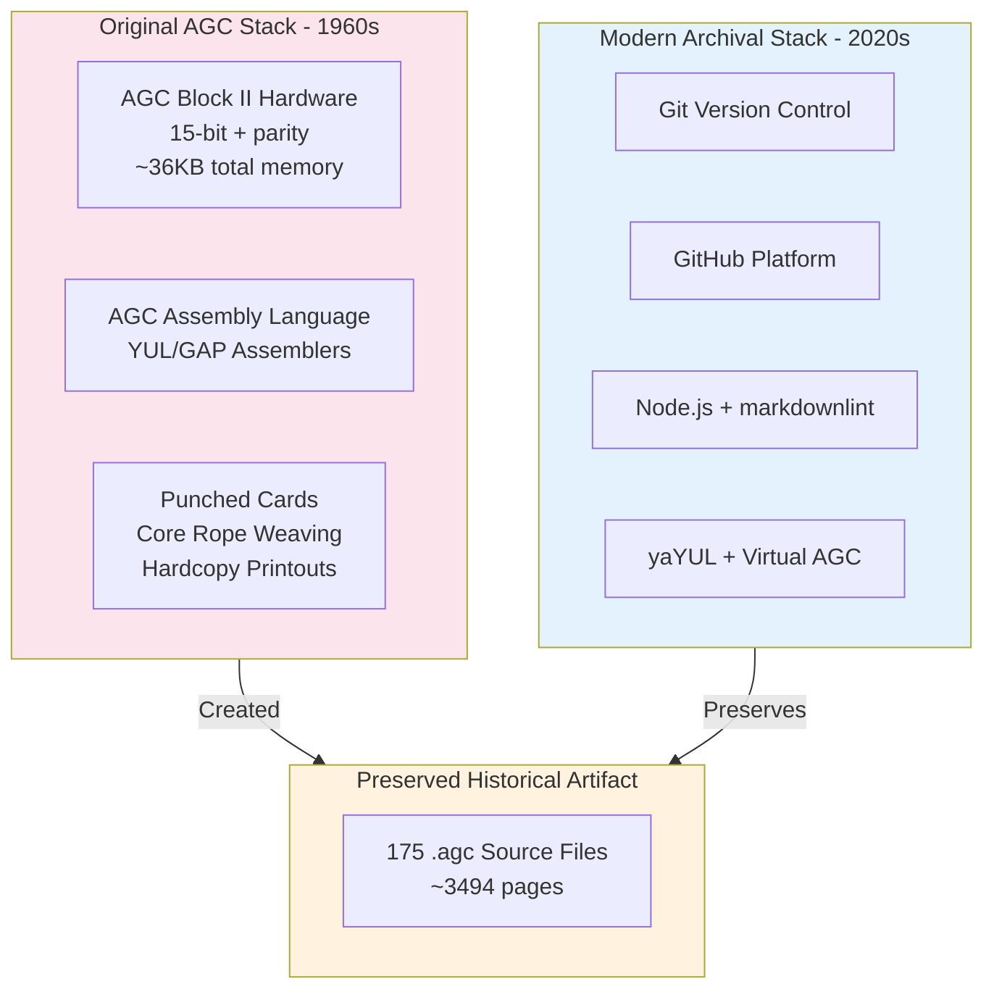

### 3.13.2 Technology Evolution Timeline

| Era | Technology | Purpose | Status |
|-----|------------|---------|--------|
| **1960s** | YUL/GAP Assemblers | Original AGC assembly | ❌ No longer available |
| **1960s** | Core Rope Memory | Flight software storage | ❌ Obsolete hardware |
| **1960s** | Punched Cards | Source code input | ❌ Obsolete medium |
| **2000s** | yaYUL Assembler | Modern AGC assembly recreation | ✅ Active (Virtual AGC project) |
| **2000s** | Virtual AGC Emulator | AGC hardware simulation | ✅ Active maintenance |
| **2010s** | Git/GitHub | Version control and collaboration | ✅ Industry standard |
| **2020s** | GitHub Actions | CI/CD automation | ✅ Current best practice |

## 3.14 References

### 3.14.1 Repository Files Examined

**Configuration and Build Files**:
- `package.json` - Node.js dependencies and npm scripts specification
- `.editorconfig` - Editor formatting standards for AGC assembly files
- `.gitignore` - Git exclusion rules for yaYUL.exe and node_modules
- `.markdownlint.yml` - Markdown linting rule configuration

**Documentation Files**:
- `README.md` - Main repository documentation with assembler and tool references
- `CONTRIBUTING.md` - Contribution guidelines including editor support matrix
- `LICENSE.md` - Public Domain Mark 1.0 licensing information
- `Comanche055/README.md` - Command Module source file organization
- `Luminary099/README.md` - Lunar Module source file organization

**Source Files** (Representative Examples):
- `Comanche055/ASSEMBLY_AND_OPERATION_INFORMATION.agc` - Assembly metadata and yaYUL specification
- `Luminary099/ASSEMBLY_AND_OPERATION_INFORMATION.agc` - LM assembly information
- `Comanche055/CONTRACT_AND_APPROVALS.agc` - Project contract and requirements baseline
- `Luminary099/INPUT_OUTPUT_CHANNEL_BIT_DESCRIPTIONS.agc` - Hardware interface specifications

**CI/CD Configuration**:
- `.github/workflows/markdownlint.yml` - Markdown linting workflow
- `.github/workflows/label.yml` - Automated pull request labeling
- `.github/labeler.yml` - Label mapping configuration
- `.github/ISSUE_TEMPLATE/` - Issue templates directory
- `.github/PULL_REQUEST_TEMPLATE.md` - Pull request template

### 3.14.2 External Resources Referenced

**Assembly and Emulation Tools**:
- Virtual AGC Project: https://github.com/rburkey2005/virtualagc
- Virtual AGC Website: www.ibiblio.org/apollo
- Project Contact: Ron Burkey <info@sandroid.org>

**Historical Scan Archives**:
- Comanche055 Scans: http://www.ibiblio.org/apollo/ScansForConversion/Comanche055/
- Luminary099 Scans: http://www.ibiblio.org/apollo/ScansForConversion/Luminary099/
- Interactive Scan Viewer: https://28gpc.csb.app/

**Editor Syntax Highlighting Extensions**:
- Atom language-agc: https://github.com/Alhadis/language-agc
- Sublime Text AGC-Assembly: https://github.com/jimlawton/AGC-Assembly
- VS Code agc-assembly: https://github.com/wopian/agc-assembly
- Vim vim-assembly: https://github.com/wsdjeg/vim-assembly
- Virtual AGC Contributed Syntax Highlighting: https://github.com/virtualagc/virtualagc/tree/master/Contributed/SyntaxHighlight/

**CI/CD Actions**:
- actions/checkout@v3: https://github.com/actions/checkout
- DavidAnson/markdownlint-cli2-action@v19: https://github.com/DavidAnson/markdownlint-cli2-action
- paulfantom/periodic-labeler@master: https://github.com/paulfantom/periodic-labeler

**Archival Services**:
- Software Heritage Archive: https://archive.softwareheritage.org/

### 3.14.3 Package Registries

**Node.js Dependencies**:
- npm Registry: https://www.npmjs.com/
- markdownlint-cli2 Package: https://www.npmjs.com/package/markdownlint-cli2

### 3.14.4 File and Directory Census

**Total Files Analyzed**: 175 AGC assembly source files + 11 configuration/documentation files

**Directory Structure**:
```
Apollo-11/
├── Comanche055/           (85 .agc files, Command Module)
├── Luminary099/           (90 .agc files, Lunar Module)
├── .github/               (CI/CD workflows and templates)
│   ├── workflows/
│   ├── ISSUE_TEMPLATE/
│   └── labeler.yml
├── translations/          (30+ language translations)
├── package.json
├── .editorconfig
├── .gitignore
├── .markdownlint.yml
├── README.md
├── CONTRIBUTING.md
└── LICENSE.md
```

**Verification Method**: Repository file count verified through bash commands and systematic directory traversal during research phase.

---

**End of Technology Stack Section**

# 4. Process Flowchart

## 4.1 Overview and Architectural Context

### 4.1.1 Process Flow Architecture

The Apollo Guidance Computer software implements a sophisticated, deterministic real-time operating system architecture that orchestrates multiple concurrent processes through priority-based scheduling, interrupt-driven event handling, and fault-tolerant restart mechanisms. This section documents the complete process workflows that govern system behavior from initialization through mission-critical operations.

**Architectural Principles**:

The AGC process architecture is built upon several foundational principles that emerge from the hardware constraints and mission requirements of the 1960s Apollo program:

1. **Deterministic Real-Time Execution**: All process flows are designed for predictable timing behavior, with priority-based preemption ensuring that critical guidance and control tasks execute within their required time windows.

2. **Fault-Tolerant State Management**: The phase table system and restart groups enable the AGC to recover from transient hardware faults by systematically restoring program execution state after interruption.

3. **Event-Driven Reactive Architecture**: The waitlist and interrupt mechanisms enable efficient resource utilization by scheduling tasks based on time triggers and hardware events rather than continuous polling.

4. **Hierarchical Error Handling**: A graduated alarm system provides appropriate responses ranging from non-intrusive notifications through controlled program termination to emergency abort sequences.

**Process Flow Categories**:

The complete system workflow can be categorized into six major process domains, each documented in detail within this section:

| Process Domain | Primary Functions | Source Evidence |
|----------------|-------------------|-----------------|
| System Initialization | Fresh start, hardware restart, mode transitions | `FRESH_START_AND_RESTART.agc` |
| Executive Scheduling | Job creation, priority management, context switching | `EXECUTIVE.agc` |
| Time-Based Coordination | Waitlist management, delayed task scheduling | `WAITLIST.agc` |
| Mission Sequencing | Phase table maintenance, program progression | `PHASE_TABLE_MAINTENANCE.agc` |
| Interrupt Handling | Hardware event processing, cyclic monitoring | `INTERRUPT_LEAD_INS.agc`, `T4RUPT_PROGRAM.agc` |
| Fault Recovery | Alarm generation, restart logic, state restoration | `ALARM_AND_ABORT.agc`, `RESTARTS_ROUTINE.agc` |

### 4.1.2 Process Flow Notation and Conventions

**Mermaid Diagram Conventions**:

Throughout this section, process flows are represented using Mermaid.js flowchart syntax with the following conventions:

- **Rectangular nodes**: Process steps or function calls
- **Diamond nodes**: Decision points with conditional branches
- **Rounded rectangles**: Start/end points or state transitions
- **Subgraphs**: Logical groupings representing subsystems or modules
- **Arrows**: Control flow direction with labeled conditions

**Timing Annotations**:

Where applicable, process flows include timing constraints documented in the source code:
- **T4RUPT cycle**: ~120ms main cycle, ~20ms display updates
- **T5RUPT**: 0.5 second increments
- **Waitlist range**: 1-16250 centiseconds (0.01-162.5 seconds)
- **Guidance update rates**: High-frequency loops (program-specific)

**State Representation**:

Process state is maintained across multiple data structures:
- **Core Sets**: 7 concurrent job contexts (PRIORITY, LOC, BANKSET, PUSHLOC, MPAC)
- **VAC Areas**: 5 interpretive workspace allocations (VAC1USE-VAC5USE)
- **Phase Tables**: 6 restart groups tracking mission sequence state
- **Failure Registers**: 3-level alarm history (FAILREG, FAILREG+1, FAILREG+2)

## 4.2 System Initialization and Restart Workflows

### 4.2.1 Initialization Overview

The AGC implements four distinct initialization pathways, each designed for specific restart scenarios ranging from power-on initialization to in-flight mode transitions. As documented in `Comanche055/FRESH_START_AND_RESTART.agc` (pages 181-210), these pathways provide comprehensive recovery capabilities while preserving mission-critical state where appropriate.

#### 4.2.1.1 Restart Type Taxonomy

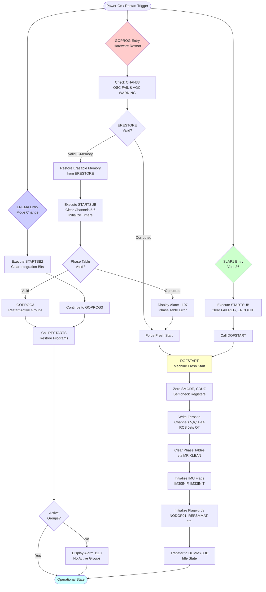

**Restart Type Characteristics**:

| Restart Type | Entry Point | Trigger Condition | State Preservation | Use Case |
|--------------|-------------|-------------------|-------------------|----------|
| **GOPROG** | Hardware | Watchdog, power transient | Yes (via ERESTORE) | Automatic fault recovery |
| **SLAP1** | Verb 36 | Astronaut command | No | Manual reinitialization |
| **ENEMA** | Software | Major mode change | Partial | Program transition |
| **DOFSTART** | Internal | Fresh start needed | No | Complete reset |

### 4.2.2 Hardware Restart Process (GOPROG)

#### 4.2.2.1 GOPROG Detailed Flow

The GOPROG hardware restart sequence represents the AGC's primary fault recovery mechanism, designed to restore operation after transient hardware failures, power interruptions, or watchdog timer expirations. This process implements sophisticated state validation logic to determine whether erasable memory contents can be trusted for recovery.

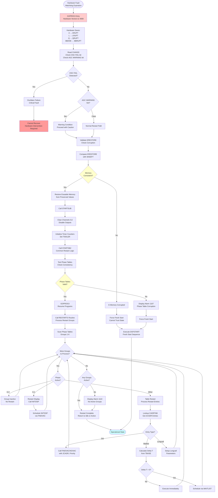

**State Preservation Mechanism**:

The ERESTORE validation process ensures that erasable memory corruption is detected before attempting to restore program state. According to `FRESH_START_AND_RESTART.agc`, the following registers are critical for state validation:

- **ERESTORE**: Tracks the erasable memory location currently under test
- **SKEEP4-7**: Preserve critical values during erasable memory diagnostics
- **Phase Tables**: PHASE1-6 and -PHASE1-6 (complements) must be consistent
- **TBASE1-6**: Time bases for computing waitlist delta-times

#### 4.2.2.2 Fresh Start Process (DOFSTART)

The DOFSTART sequence initializes the AGC to a known, safe state when no prior program context can be preserved. This occurs when erasable memory is corrupted or when manual reinitialization is commanded via Verb 36.

```mermaid
flowchart TD
    START([DOFSTART Entry]) --> ZERO_SMODE[Zero SMODE Register<br/>No Mode Active]
    
    ZERO_SMODE --> ZERO_CDUZ[Zero CDUZ<br/>CDU Zero Reference]
    ZERO_CDUZ --> ZERO_CHECKS[Zero Self-Check Registers<br/>ERCOUNT, etc.]
    
    ZERO_CHECKS --> ZERO_CH5[Write Zero to Channel 5<br/>Disable Control Outputs]
    ZERO_CH5 --> ZERO_CH6[Write Zero to Channel 6<br/>Disable RCS Jets]
    ZERO_CH6 --> ZERO_CH11_14[Write Zeros to Channels 11-14<br/>All Jets Off]
    
    ZERO_CH11_14 --> CLEAR_FAILREG[Clear FAILREG<br/>FAILREG+1, FAILREG+2<br/>Reset Alarm History]
    CLEAR_FAILREG --> CLEAR_ERCOUNT[Clear ERCOUNT<br/>REDOCTR]
    
    CLEAR_ERCOUNT --> CALL_MRKLEAN[Call MR.KLEAN<br/>Clear Phase Tables]
    CALL_MRKLEAN --> ZERO_PHASE1_6[Zero PHASE1-6<br/>All Groups Inactive]
    ZERO_PHASE1_6 --> ZERO_NEG_PHASE[Zero -PHASE1-6<br/>Complements]
    
    ZERO_NEG_PHASE --> INIT_ERESTORE[Zero ERESTORE<br/>Clear Validation State]
    INIT_ERESTORE --> ZERO_SMODE2[Zero SMODE<br/>UPSVFLAG]
    
    ZERO_SMODE2 --> SET_IMU30[Set IM30INIF<br/>IMU 30° Initialization Flag]
    SET_IMU30 --> SET_IMU33[Set IM33INIT<br/>IMU 33° Gyrocompassing Flag]
    
    SET_IMU33 --> SET_T5IDLER[Set T5IDLER<br/>T5 Interrupt Handler]
    SET_T5IDLER --> INIT_FLAGWORD1[Initialize FLAGWORD 1<br/>NODOP01, etc.]
    
    INIT_FLAGWORD1 --> SET_REFSMMAT[Set REFSMMAT Flag<br/>Reference Stable Member<br/>Matrix Identity]
    SET_REFSMMAT --> INIT_RASFLAG[Initialize RASFLAG<br/>RAS Integration Flags]
    
    INIT_RASFLAG --> INIT_STATE1[Initialize STATE Registers<br/>STATE +1 through +8]
    INIT_STATE1 --> SET_CDUIND[Set CDUIND<br/>CDU Indicator Flags]
    
    SET_CDUIND --> INIT_HOLDFLAG[Initialize HOLDFLAG<br/>Attitude Hold Flags]
    INIT_HOLDFLAG --> SET_AVEMIDSW[Set AVEMIDSW<br/>Average G Switch]
    
    SET_AVEMIDSW --> INIT_LGYRO[Initialize LGYRO<br/>Gyro Flags]
    INIT_LGYRO --> ZERO_PIPAX[Zero PIPAX, PIPAY, PIPAZ<br/>Accelerometer Accumulators]
    
    ZERO_PIPAX --> INIT_DATATEST[Initialize Data Test Flags<br/>DWNLNKON, UPSVFLAG]
    INIT_DATATEST --> SET_RNDVZFLG[Clear RNDVZFLG<br/>Rendezvous Flag]
    
    SET_RNDVZFLG --> TRANSFER_DUMMY[Transfer Control to<br/>DUMMYJOB]
    TRANSFER_DUMMY --> IDLE_STATE([Idle State<br/>Green Lamp On<br/>Awaiting V37 Program Select])
    
    style START fill:#ffffcc
    style IDLE_STATE fill:#ccffff
```

**DOFSTART Register Initialization Summary**:

| Register Category | Initialization Action | Purpose |
|-------------------|----------------------|---------|
| **Mode Registers** | SMODE, MODREG → 0 | Clear active program mode |
| **Control Channels** | CH5, CH6, CH11-14 → 0 | Disable all jet firing commands |
| **Failure Tracking** | FAILREG, ERCOUNT → 0 | Clear alarm history |
| **Phase Tables** | PHASE1-6, -PHASE1-6 → 0 | All restart groups inactive |
| **IMU Flags** | IM30INIF, IM33INIT → set | Enable IMU initialization |
| **Navigation State** | PIPAX/Y/Z → 0 | Zero accelerometer integration |
| **Reference Frames** | REFSMMAT → identity | Set stable member matrix |
| **System Flags** | NODOP01, AVEMIDSW, etc. | Configure default operating modes |

### 4.2.3 Mode Change Restart (ENEMA)

The ENEMA restart sequence handles transitions between major mission phases (program mode changes) while preserving more system state than a full fresh start. This occurs during normal mission progression when switching between major programs (e.g., P20 rendezvous to P30 maneuver planning).

```mermaid
flowchart TD
    START([Program Mode Change<br/>Triggered]) --> ENEMA_ENTRY[ENEMA Entry Point]
    
    ENEMA_ENTRY --> CALL_STARTSB2[Call STARTSB2<br/>Common Restart Logic]
    CALL_STARTSB2 --> CLEAR_INTMASK[Clear Integration Bits<br/>INTMASK on RASFLAG]
    
    CLEAR_INTMASK --> CHECK_TVC[Check TVC Status<br/>Thrust Vector Control]
    CHECK_TVC --> TVC_ACTIVE{TVC<br/>Active?}
    
    TVC_ACTIVE -->|Yes| PRESERVE_TVC[Preserve TVC State<br/>Maintain Control Loop]
    TVC_ACTIVE -->|No| CONTINUE_RESTART[Continue Restart]
    
    PRESERVE_TVC --> CONTINUE_RESTART
    CONTINUE_RESTART --> GOTO_GOPROG3[Proceed to GOPROG3<br/>Standard Restart Path]
    
    GOTO_GOPROG3 --> CALL_RESTARTS[Call RESTARTS Routine]
    CALL_RESTARTS --> SELECTIVE_RESTART[Selectively Restart<br/>Active Groups]
    
    SELECTIVE_RESTART --> PRESERVE_NAV[Preserve Navigation State<br/>State Vectors, Time]
    PRESERVE_NAV --> PRESERVE_IMU[Preserve IMU Alignment<br/>REFSMMAT, CDU angles]
    
    PRESERVE_IMU --> RESTART_PROGRAMS[Restart Mode-Appropriate<br/>Programs]
    RESTART_PROGRAMS --> NEW_MODE([New Mode Active<br/>Partial State Preserved])
    
    style ENEMA_ENTRY fill:#ccccff
    style NEW_MODE fill:#ccffff
```

**ENEMA State Preservation Strategy**:

Unlike DOFSTART, ENEMA preserves critical navigation and control state:
- **State Vectors**: Spacecraft position and velocity maintained
- **IMU Alignment**: REFSMMAT (reference stable member matrix) preserved
- **Time Bases**: TBASE registers for waitlist scheduling maintained
- **Control State**: TVC and autopilot state preserved where applicable
- **Navigation Data**: Orbital elements, target information retained

### 4.2.4 Restart Group Processing

#### 4.2.4.1 Phase Table Structure and Restart Logic

The phase table system provides the mechanism for organizing programs into restart groups, enabling selective program restoration based on mission phase. As documented in `PHASE_TABLE_MAINTENANCE.agc` (pages 1404-1413), the phase table encodes restart type, priority, time base, and 2CADR information for each of six concurrent restart groups.

```mermaid
flowchart TD
    START([RESTARTS Entry<br/>from GOPROG3]) --> GET_GROUP[Get Group Number<br/>from MPAC+5<br/>Groups 1-6]
    
    GET_GROUP --> INIT_LOOP[Initialize Group Loop<br/>Counter]
    INIT_LOOP --> LOOP_START{More Groups<br/>to Process?}
    
    LOOP_START -->|No| CHECK_ANY[Check if Any<br/>Groups Active]
    LOOP_START -->|Yes| GET_PHASE[Get PHASE for<br/>Current Group]
    
    GET_PHASE --> DECODE_PHASE{Decode Phase<br/>Value}
    
    DECODE_PHASE -->|G.0| INACTIVE[Group Inactive<br/>No Restart]
    DECODE_PHASE -->|G.1| DISPLAY[Display Restart<br/>INITDSP]
    DECODE_PHASE -->|G.Even| DOUBLE_ENTRY[Double Table Entry<br/>2 Restart Items]
    DECODE_PHASE -->|G.Odd| SINGLE_ENTRY[Single Table Entry<br/>1 Restart Item]
    
    INACTIVE --> NEXT_GROUP[Advance to Next Group]
    NEXT_GROUP --> LOOP_START
    
    DISPLAY --> SCHEDULE_INITDSP[Schedule INITDSP Job<br/>via FINDVAC]
    SCHEDULE_INITDSP --> NEXT_GROUP
    
    DOUBLE_ENTRY --> CALC_POINTER[Calculate CADRTAB Pointer<br/>Based on Phase]
    SINGLE_ENTRY --> CALC_POINTER
    
    CALC_POINTER --> GET_ENTRY1[Get First Restart Entry<br/>2CADR + Priority/Time]
    GET_ENTRY1 --> DECODE_ENTRY1{Entry Type?}
    
    DECODE_ENTRY1 -->|Job| RESTART_JOB1[Determine VAC Need<br/>from Priority Sign]
    DECODE_ENTRY1 -->|Waitlist| RESTART_WAIT1[Calculate Delta-T<br/>from TBASE]
    DECODE_ENTRY1 -->|Longcall| RESTART_LONG1[Setup Longcall<br/>Parameters]
    
    RESTART_JOB1 --> CHECK_VAC1{VAC<br/>Required?}
    CHECK_VAC1 -->|Yes| CALL_FINDVAC1[Call FINDVAC<br/>Allocate VAC Area]
    CHECK_VAC1 -->|No| CALL_NOVAC1[Call NOVAC<br/>Schedule Job]
    
    CALL_FINDVAC1 --> CHECK_DOUBLE1{Double Entry<br/>Group?}
    CALL_NOVAC1 --> CHECK_DOUBLE1
    
    RESTART_WAIT1 --> FINDTIME1[FINDTIME:<br/>Delta = TBASE - TIME1<br/>+ Stored Delta]
    FINDTIME1 --> CHECK_DT1{Delta-T > 0?}
    
    CHECK_DT1 -->|No| IMMEDIATE1[Execute Immediately<br/>Schedule at Priority]
    CHECK_DT1 -->|Yes| CALL_WAITLIST1[Call WAITLIST<br/>Schedule Delayed]
    
    IMMEDIATE1 --> CHECK_DOUBLE1
    CALL_WAITLIST1 --> CHECK_DOUBLE1
    RESTART_LONG1 --> CHECK_DOUBLE1
    
    CHECK_DOUBLE1 -->|Yes| GET_ENTRY2[Get Second Restart Entry]
    CHECK_DOUBLE1 -->|No| NEXT_GROUP
    
    GET_ENTRY2 --> DECODE_ENTRY2{Entry Type?}
    
    DECODE_ENTRY2 -->|Job| RESTART_JOB2[Determine VAC Need]
    DECODE_ENTRY2 -->|Waitlist| RESTART_WAIT2[Calculate Delta-T]
    DECODE_ENTRY2 -->|Longcall| RESTART_LONG2[Setup Longcall]
    
    RESTART_JOB2 --> CHECK_VAC2{VAC<br/>Required?}
    CHECK_VAC2 -->|Yes| CALL_FINDVAC2[Call FINDVAC]
    CHECK_VAC2 -->|No| CALL_NOVAC2[Call NOVAC]
    
    RESTART_WAIT2 --> FINDTIME2[FINDTIME Calculation]
    FINDTIME2 --> CHECK_DT2{Delta-T > 0?}
    CHECK_DT2 -->|No| IMMEDIATE2[Execute Immediately]
    CHECK_DT2 -->|Yes| CALL_WAITLIST2[Call WAITLIST]
    
    CALL_FINDVAC2 --> NEXT_GROUP
    CALL_NOVAC2 --> NEXT_GROUP
    IMMEDIATE2 --> NEXT_GROUP
    CALL_WAITLIST2 --> NEXT_GROUP
    RESTART_LONG2 --> NEXT_GROUP
    
    CHECK_ANY --> ANY_ACTIVE{Any Groups<br/>Were Active?}
    ANY_ACTIVE -->|No| ALARM_1110[Display Alarm 1110<br/>No Active Groups]
    ANY_ACTIVE -->|Yes| COMPLETE
    
    ALARM_1110 --> COMPLETE([RESTARTS Complete<br/>Return to System])
    
    style START fill:#e1f5ff
    style COMPLETE fill:#ccffff
    style DECODE_PHASE fill:#ffffcc
    style DECODE_ENTRY1 fill:#ffffcc
    style DECODE_ENTRY2 fill:#ffffcc
```

**Phase Table Encoding**:

The phase value for each group encodes restart behavior using the format `G.PPP` where:
- **G (Group)**: 1-7 (octal), with group 0 indicating inactive
- **PPP (Phase)**: 0-127 (octal), with special meanings:
  - **G.0**: Inactive, no restart
  - **G.1**: Display restart (calls INITDSP)
  - **G.Even**: Double table restart (2 entries in CADRTAB)
  - **G.Odd** (>1): Single table restart (1 entry in CADRTAB)

**Restart Table Structure**:

For each group, the restart system maintains:
- **SIZETAB**: Pointer to table size and offset information
- **CADRTAB**: Array of restart entries, each containing:
  - 2CADR (two-word address) of job/task/longcall
  - Priority (for jobs) or delta-time (for waitlist tasks)

## 4.3 Executive Job Scheduling Workflows

### 4.3.1 Job Scheduling Overview

The Executive implements a priority-based preemptive multitasking scheduler that manages up to seven concurrent jobs through core set allocation and five interpretive workspace areas (VAC) for complex mathematical operations. As documented in `EXECUTIVE.agc` (pages 1208-1220), the scheduler provides deterministic task execution with microsecond-level timing control through interrupt inhibit mechanisms.

#### 4.3.1.1 Core Set and VAC Area Architecture

```mermaid
graph LR
    subgraph Executive_Resources[Executive Scheduling Resources]
        direction TB
        
        subgraph CoreSets[Core Sets - 7 Total]
            CS1[Core Set 1<br/>PRIORITY+0]
            CS2[Core Set 2<br/>PRIORITY+12]
            CS3[Core Set 3<br/>PRIORITY+24]
            CS4[Core Set 4<br/>PRIORITY+36]
            CS5[Core Set 5<br/>PRIORITY+48]
            CS6[Core Set 6<br/>PRIORITY+60]
            CS7[Core Set 7<br/>PRIORITY+72]
        end
        
        subgraph VACArea[VAC Areas - 5 Total]
            VAC1[VAC1USE<br/>~43 words]
            VAC2[VAC2USE<br/>~43 words]
            VAC3[VAC3USE<br/>~43 words]
            VAC4[VAC4USE<br/>~43 words]
            VAC5[VAC5STOR<br/>~43 words<br/>Reserved for BAILOUT]
        end
        
        subgraph CoreSetStructure[Core Set Structure<br/>12 Registers Each]
            PRIORITY_REG[PRIORITY<br/>Job Priority or -Priority<br/>Sleeping]
            LOC_REG[LOC, LOC+1<br/>2CADR Current<br/>Instruction]
            BANK_REG[BANKSET<br/>Bank Register State]
            PUSH_REG[PUSHLOC<br/>Push-down Stack Pointer<br/>VAC Area Base]
            MPAC_REG[MPAC Registers<br/>MPAC, +2, +4, +6<br/>Multi-Purpose Accumulator]
        end
    end
    
    CS1 -.-> CoreSetStructure
    CS2 -.-> CoreSetStructure
    CS3 -.-> CoreSetStructure
    CS4 -.-> CoreSetStructure
    CS5 -.-> CoreSetStructure
    CS6 -.-> CoreSetStructure
    CS7 -.-> CoreSetStructure
    
    style CoreSets fill:#e1f5ff
    style VACArea fill:#fff4e1
    style CoreSetStructure fill:#e8f5e9
```

**Resource Allocation Strategy**:

| Resource Type | Quantity | Allocation Method | Exhaustion Handling |
|---------------|----------|-------------------|---------------------|
| **Core Sets** | 7 | Sequential search PRIORITY+0,+12,+24,+36,+48,+60,+72 | Alarm 01202 (ABORT2) |
| **VAC Areas** | 5 (4 usable) | Sequential search VAC1USE-VAC4USE | Alarm 01201 (BAILOUT) |
| **Priority Levels** | 0-37 decimal | Caller-specified | Higher preempts lower |

### 4.3.2 Job Creation Workflows

#### 4.3.2.1 NOVAC - Job Creation Without VAC Area

The NOVAC (No VAC area required) primitive schedules basic jobs that perform operations using only the core set registers without requiring extended interpretive workspace.

```mermaid
flowchart TD
    START([Caller Invokes NOVAC]) --> SETUP[Setup Parameters:<br/>NEWPRIO = Priority<br/>Get 2CADR from Q+0, Q+1]
    
    SETUP --> INHINT[INHINT<br/>Disable Interrupts<br/>Atomic Operation Start]
    
    INHINT --> SAVE_PRIORITY[Save NEWPRIO<br/>Job Priority Level]
    SAVE_PRIORITY --> GET_2CADR[Get 2CADR<br/>Job Entry Point Address]
    
    GET_2CADR --> SEARCH_START[Begin Core Set Search<br/>PRIORITY+0]
    SEARCH_START --> SEARCH_LOOP{Check Core Set<br/>Available?}
    
    SEARCH_LOOP -->|In Use| NEXT_CORE[Advance to Next<br/>Core Set<br/>+12 offset]
    NEXT_CORE --> MORE_CORES{More Core Sets<br/>to Check?}
    
    MORE_CORES -->|Yes| SEARCH_LOOP
    MORE_CORES -->|No| NO_CORES[No Core Sets Available]
    NO_CORES --> ABORT2[BAILOUT OCT 1202<br/>No Core Sets]
    ABORT2 --> ERROR_EXIT([Error Exit])
    
    SEARCH_LOOP -->|Available| FOUND_CORE[Found Available Core Set]
    FOUND_CORE --> SET_PRIORITY[Set PRIORITY Register<br/>= NEWPRIO]
    
    SET_PRIORITY --> SET_LOC[Set LOC, LOC+1<br/>= 2CADR Job Address]
    SET_LOC --> CONFIG_PUSHLOC[Configure PUSHLOC<br/>Stack Pointer Init]
    
    CONFIG_PUSHLOC --> SET_BANKSET[Set BANKSET<br/>Bank from 2CADR]
    SET_BANKSET --> INIT_MPAC[Initialize MPAC Registers<br/>Clear Workspace]
    
    INIT_MPAC --> COMPARE_PRIORITY{NEWPRIO ><br/>Current NEWJOB?}
    
    COMPARE_PRIORITY -->|Higher| SET_NEWJOB[Set NEWJOB Register<br/>Trigger Context Switch]
    COMPARE_PRIORITY -->|Lower/Equal| NO_PREEMPT[No Immediate Preemption<br/>Queued for Later]
    
    SET_NEWJOB --> RELINT[RELINT<br/>Enable Interrupts<br/>Atomic Operation End]
    NO_PREEMPT --> RELINT
    
    RELINT --> RETURN[Return to Caller+2<br/>Job Successfully Queued]
    RETURN --> EXIT([Normal Exit<br/>Job Will Execute])
    
    style START fill:#ccffcc
    style INHINT fill:#ffcccc
    style RELINT fill:#ccffcc
    style EXIT fill:#ccffff
    style ERROR_EXIT fill:#ff9999
```

**NOVAC Calling Convention**:

```
Caller:
    CA      NEWPRIO         ; Load priority (0-37 decimal)
    TC      NOVAC           ; Call scheduler
    2CADR   JOB_ADDRESS     ; Two-word job entry point
    ; Returns here (caller+2) after job queued
```

**Priority Comparison and Preemption Logic**:

The NEWJOB register tracks the highest-priority job awaiting execution. When NOVAC creates a job with higher priority than the current NEWJOB value, it updates NEWJOB to trigger a context switch at the next opportunity (typically at the next RELINT or interrupt return).

#### 4.3.2.2 FINDVAC - Job Creation With VAC Area Allocation

FINDVAC extends NOVAC by allocating an interpretive workspace area (VAC) for jobs requiring vector/matrix operations, numerical integration, or other complex mathematical computations.

```mermaid
flowchart TD
    START([Caller Invokes FINDVAC]) --> SETUP[Setup Parameters:<br/>NEWPRIO = Priority<br/>Get 2CADR from Q+0, Q+1]
    
    SETUP --> INHINT[INHINT<br/>Disable Interrupts]
    
    INHINT --> SAVE_PRIORITY[Save NEWPRIO<br/>and 2CADR]
    SAVE_PRIORITY --> SEARCH_VAC[Begin VAC Area Search<br/>VAC1USE]
    
    SEARCH_VAC --> CHECK_VAC1{VAC1USE<br/>Available?}
    CHECK_VAC1 -->|In Use| CHECK_VAC2{VAC2USE<br/>Available?}
    CHECK_VAC2 -->|In Use| CHECK_VAC3{VAC3USE<br/>Available?}
    CHECK_VAC3 -->|In Use| CHECK_VAC4{VAC4USE<br/>Available?}
    CHECK_VAC4 -->|In Use| NO_VAC[No VAC Areas Available]
    
    NO_VAC --> BAILOUT_1201[BAILOUT OCT 1201<br/>No VAC Available]
    BAILOUT_1201 --> ERROR_EXIT([Error Exit<br/>Restart Triggered])
    
    CHECK_VAC1 -->|Available| FOUND_VAC1[Found VAC1USE]
    CHECK_VAC2 -->|Available| FOUND_VAC2[Found VAC2USE]
    CHECK_VAC3 -->|Available| FOUND_VAC3[Found VAC3USE]
    CHECK_VAC4 -->|Available| FOUND_VAC4[Found VAC4USE]
    
    FOUND_VAC1 --> RESERVE_VAC[Mark VAC Area In Use]
    FOUND_VAC2 --> RESERVE_VAC
    FOUND_VAC3 --> RESERVE_VAC
    FOUND_VAC4 --> RESERVE_VAC
    
    RESERVE_VAC --> CALC_VAC_ADDR[Calculate VAC Base Address<br/>Store in PUSHLOC Low 9 Bits]
    CALC_VAC_ADDR --> NOVAC2[Continue to NOVAC2<br/>Core Set Allocation]
    
    NOVAC2 --> SEARCH_CORE[Search for Available<br/>Core Set]
    SEARCH_CORE --> CORE_LOOP{Check Core Set<br/>PRIORITY+N}
    
    CORE_LOOP -->|In Use| NEXT_CORE[Advance +12<br/>Next Core Set]
    NEXT_CORE --> MORE_CORES{More Core Sets?}
    MORE_CORES -->|Yes| CORE_LOOP
    MORE_CORES -->|No| NO_CORES[No Core Sets<br/>Available]
    
    NO_CORES --> FREE_VAC[Free Previously<br/>Reserved VAC Area]
    FREE_VAC --> ABORT2[BAILOUT OCT 1202<br/>No Core Sets]
    ABORT2 --> ERROR_EXIT
    
    CORE_LOOP -->|Available| FOUND_CORE[Found Available<br/>Core Set]
    FOUND_CORE --> SET_PRIORITY[Set PRIORITY = NEWPRIO]
    SET_PRIORITY --> SET_LOC[Set LOC, LOC+1 = 2CADR]
    SET_LOC --> SET_PUSHLOC[Set PUSHLOC<br/>High 3: Core Set ID<br/>Low 9: VAC Base]
    
    SET_PUSHLOC --> SET_BANKSET[Set BANKSET from 2CADR]
    SET_BANKSET --> COMPARE_NEWJOB{NEWPRIO ><br/>NEWJOB?}
    
    COMPARE_NEWJOB -->|Higher| SET_NEWJOB[Set NEWJOB<br/>Trigger Preemption]
    COMPARE_NEWJOB -->|Lower/Equal| NO_PREEMPT[Queue Without<br/>Immediate Preempt]
    
    SET_NEWJOB --> RELINT[RELINT<br/>Enable Interrupts]
    NO_PREEMPT --> RELINT
    
    RELINT --> RETURN[Return to Caller+2<br/>Job and VAC Allocated]
    RETURN --> EXIT([Normal Exit<br/>Job Ready to Execute])
    
    style START fill:#ccffcc
    style INHINT fill:#ffcccc
    style RELINT fill:#ccffcc
    style EXIT fill:#ccffff
    style ERROR_EXIT fill:#ff9999
    style RESERVE_VAC fill:#fff4e1
```

**FINDVAC Calling Convention**:

```
Caller:
    CA      NEWPRIO         ; Load priority
    TC      FINDVAC         ; Call scheduler with VAC allocation
    2CADR   JOB_ADDRESS     ; Two-word job entry point
    ; Returns here (caller+2) after job and VAC allocated
```

**VAC Area Reservation Mechanism**:

Each VAC area has an associated "in-use" flag. FINDVAC sets this flag atomically (within INHINT/RELINT) to reserve the area, then encodes the VAC base address in the low 9 bits of PUSHLOC. If subsequent core set allocation fails, FINDVAC releases the VAC reservation before signaling the error.

### 4.3.3 Job State Transitions and Context Switching

#### 4.3.3.1 Job State Machine

```mermaid
stateDiagram-v2
    [*] --> NotCreated : Initial State
    
    NotCreated --> Active : NOVAC/FINDVAC<br/>Job Scheduled
    
    Active --> Running : Highest Priority<br/>Dispatched
    Running --> Active : Lower Priority Job<br/>Preempts
    Active --> Running : CHANJOB<br/>Context Switch
    
    Running --> Sleeping : JOBSLEEP<br/>Complement PRIORITY
    Sleeping --> Active : JOBWAKE<br/>Re-complement PRIORITY
    
    Running --> Suspended : CHANJOB to<br/>Higher Priority
    Suspended --> Running : CHANJOB Back
    
    Active --> Modified : PRIOCHNG<br/>Priority Adjusted
    Modified --> Active : Rescan Queue
    
    Running --> Terminated : ENDOFJOB<br/>Release Resources
    Terminated --> [*] : Core Set and VAC<br/>Freed
    
    Active --> Idle : No Active Jobs
    Idle --> Active : New Job Arrives
    Idle --> DummyJob : DUMMYJOB<br/>Green Lamp On
    
    note right of Running
        Job has CPU control
        Executing instructions
        LOC points to current instruction
    end note
    
    note right of Sleeping
        Negative PRIORITY
        Waiting for event
        Job not eligible for execution
    end note
    
    note right of Active
        Positive PRIORITY
        Queued for execution
        Will run when highest priority
    end note
```

**Job State Characteristics**:

| State | PRIORITY Sign | LOC Value | Execution Status | Transition Trigger |
|-------|---------------|-----------|------------------|-------------------|
| **Not Created** | N/A | N/A | Does not exist | Program calls NOVAC/FINDVAC |
| **Active** | Positive | Valid 2CADR | Runnable, queued | Priority scheduling |
| **Running** | Positive | Current instruction | Currently executing | CHANJOB dispatch |
| **Sleeping** | Negative | Last instruction | Blocked, awaiting event | JOBSLEEP called |
| **Suspended** | Positive | Saved LOC | Preempted by higher priority | Higher priority job ready |
| **Modified** | Positive | Unchanged | Priority changed | PRIOCHNG called |
| **Terminated** | Released | Released | Completed, cleaned up | ENDOFJOB called |
| **Idle** | N/A (no jobs) | N/A | System idle | All jobs completed |

#### 4.3.3.2 CHANJOB - Context Switch Mechanism

CHANJOB implements the context switch between jobs, saving the current job's execution context to its core set and loading the execution context of the next job.

```mermaid
flowchart TD
    START([CHANJOB Entry<br/>Context Switch Needed]) --> INHINT[INHINT<br/>Disable Interrupts]
    
    INHINT --> SAVE_LOCBANK[Save Current LOC<br/>and BANKSET to Temp]
    SAVE_LOCBANK --> FIND_NEWJOB[Scan Core Sets for<br/>Highest Priority Job]
    
    FIND_NEWJOB --> SCAN_LOOP[Initialize Scan:<br/>Highest Priority = 0<br/>Best Job = None]
    SCAN_LOOP --> CHECK_CS1{Check Core Set 1<br/>PRIORITY+0}
    
    CHECK_CS1 --> CS1_EVAL{PRIORITY > 0<br/>and > Current Best?}
    CS1_EVAL -->|Yes| UPDATE_BEST1[Update Best Job<br/>= Core Set 1]
    CS1_EVAL -->|No| CHECK_CS2
    UPDATE_BEST1 --> CHECK_CS2{Check Core Set 2<br/>PRIORITY+12}
    
    CHECK_CS2 --> CS2_EVAL{PRIORITY > 0<br/>and > Current Best?}
    CS2_EVAL -->|Yes| UPDATE_BEST2[Update Best Job]
    CS2_EVAL -->|No| CHECK_CS3
    UPDATE_BEST2 --> CHECK_CS3{Check Core Set 3}
    
    CHECK_CS3 --> CS3_EVAL{PRIORITY > 0<br/>and > Current Best?}
    CS3_EVAL -->|Yes| UPDATE_BEST3[Update Best Job]
    CS3_EVAL -->|No| CHECK_CS4
    UPDATE_BEST3 --> CHECK_CS4{Check Core Set 4}
    
    CHECK_CS4 --> CS4_EVAL{PRIORITY > 0<br/>and > Current Best?}
    CS4_EVAL -->|Yes| UPDATE_BEST4[Update Best Job]
    CS4_EVAL -->|No| CHECK_CS5
    UPDATE_BEST4 --> CHECK_CS5{Check Core Set 5}
    
    CHECK_CS5 --> CS5_EVAL{PRIORITY > 0<br/>and > Current Best?}
    CS5_EVAL -->|Yes| UPDATE_BEST5[Update Best Job]
    CS5_EVAL -->|No| CHECK_CS6
    UPDATE_BEST5 --> CHECK_CS6{Check Core Set 6}
    
    CHECK_CS6 --> CS6_EVAL{PRIORITY > 0<br/>and > Current Best?}
    CS6_EVAL -->|Yes| UPDATE_BEST6[Update Best Job]
    CS6_EVAL -->|No| CHECK_CS7
    UPDATE_BEST6 --> CHECK_CS7{Check Core Set 7}
    
    CHECK_CS7 --> CS7_EVAL{PRIORITY > 0<br/>and > Current Best?}
    CS7_EVAL -->|Yes| UPDATE_BEST7[Update Best Job]
    CS7_EVAL -->|No| SCAN_COMPLETE
    UPDATE_BEST7 --> SCAN_COMPLETE[Scan Complete]
    
    SCAN_COMPLETE --> ANY_JOB{Best Job<br/>Found?}
    ANY_JOB -->|No| GOTO_DUMMY[Transfer to DUMMYJOB<br/>Turn on Green Lamp]
    ANY_JOB -->|Yes| SWAP_CONTEXT[Swap Context with<br/>New Job Core Set]
    
    GOTO_DUMMY --> IDLE_LOOP[Idle Loop<br/>Await New Job]
    
    SWAP_CONTEXT --> SWAP_LOC[Swap LOC, LOC+1<br/>Current ↔ New Job]
    SWAP_LOC --> SWAP_BANK[Swap BANKSET<br/>Current ↔ New Job]
    SWAP_BANK --> SWAP_MPAC[Swap MPAC Areas<br/>MPAC, +2, +4, +6]
    
    SWAP_MPAC --> HANDLE_OVFIND[Handle OVFIND<br/>Overflow Indicator]
    HANDLE_OVFIND --> SWAP_PUSHLOC[Swap PUSHLOC<br/>Current ↔ New Job]
    SWAP_PUSHLOC --> SWAP_PRIORITY[Swap PRIORITY<br/>Current ↔ New Job]
    
    SWAP_PRIORITY --> SET_FIXLOC[Set FIXLOC from<br/>PRIORITY Low 9 Bits<br/>VAC Area Base]
    SET_FIXLOC --> RELINT[RELINT<br/>Enable Interrupts]
    
    RELINT --> CHECK_LOC{LOC<br/>Sign?}
    CHECK_LOC -->|Positive| BASIC_JOB[Basic Assembly Job]
    CHECK_LOC -->|Negative| INTERP_JOB[Interpretive Job]
    
    BASIC_JOB --> DTCB[DTCB Dispatch<br/>Transfer Control<br/>to LOC Address]
    DTCB --> RUNNING([New Job Running])
    
    INTERP_JOB --> SETUP_EBANK[Setup EBANK<br/>from LOC]
    SETUP_EBANK --> GOTO_INTRSM[Goto INTRSM<br/>Interpretive Resume]
    GOTO_INTRSM --> RUNNING
    
    style START fill:#e1f5ff
    style INHINT fill:#ffcccc
    style RELINT fill:#ccffcc
    style RUNNING fill:#ccffff
    style GOTO_DUMMY fill:#ffffcc
```

**Context Switch Data Movement**:

The CHANJOB routine swaps the following register sets between the current job's core set and the new job's core set:

| Register | Description | Purpose |
|----------|-------------|---------|
| **LOC, LOC+1** | Program counter (2CADR) | Current instruction address |
| **BANKSET** | Bank register state | Memory bank selection |
| **MPAC, MPAC+2, MPAC+4, MPAC+6** | Multi-purpose accumulator | Working registers |
| **PUSHLOC** | Push-down stack pointer / VAC base | Stack or interpretive workspace |
| **PRIORITY** | Job priority or negative (sleeping) | Scheduling priority |
| **OVFIND** | Overflow indicator | Arithmetic overflow state |

**Job Dispatch Logic**:

After context switch, CHANJOB examines the sign of the new job's LOC register:
- **Positive LOC**: Basic assembly job → transfer via DTCB to LOC address
- **Negative LOC**: Interpretive job → setup EBANK, resume via INTRSM

#### 4.3.3.3 Job Sleep and Wake Mechanisms

**JOBSLEEP** - Suspending Job Execution:

```mermaid
flowchart TD
    START([Job Calls JOBSLEEP<br/>Wait for Event]) --> INHINT[INHINT<br/>Disable Interrupts]
    
    INHINT --> GET_CORESET[Get Current Job's<br/>Core Set Address]
    GET_CORESET --> NEGATE_PRIORITY[Complement PRIORITY<br/>Positive → Negative]
    
    NEGATE_PRIORITY --> MARK_SLEEPING[Job Now Marked<br/>as Sleeping]
    MARK_SLEEPING --> RELINT[RELINT<br/>Enable Interrupts]
    
    RELINT --> TRIGGER_SWITCH[Trigger Context Switch<br/>CHANJOB]
    TRIGGER_SWITCH --> NEXT_JOB([Job Suspended<br/>Next Job Runs])
    
    style START fill:#fff4e1
    style NEGATE_PRIORITY fill:#ffcccc
    style NEXT_JOB fill:#ccffff
```

**JOBWAKE** - Resuming Sleeping Job:

```mermaid
flowchart TD
    START([JOBWAKE Called<br/>with Job LOC]) --> INHINT[INHINT<br/>Disable Interrupts]
    
    INHINT --> SEARCH_START[Begin Core Set Search<br/>for Matching LOC]
    SEARCH_START --> SEARCH_LOOP{Scan Core Sets<br/>1 through 7}
    
    SEARCH_LOOP -->|Match Found| CHECK_SLEEPING{PRIORITY<br/>Negative?}
    SEARCH_LOOP -->|No Match| NEXT_CORE[Check Next Core Set]
    NEXT_CORE --> MORE_CORES{More Core Sets?}
    MORE_CORES -->|Yes| SEARCH_LOOP
    MORE_CORES -->|No| NOT_FOUND
    
    CHECK_SLEEPING -->|Yes| WAKE_JOB[Re-complement PRIORITY<br/>Negative → Positive]
    CHECK_SLEEPING -->|No| ALREADY_AWAKE[Job Already Awake<br/>No Action]
    
    WAKE_JOB --> JOB_RUNNABLE[Job Now Runnable<br/>Eligible for Scheduling]
    JOB_RUNNABLE --> RELINT[RELINT<br/>Enable Interrupts]
    
    ALREADY_AWAKE --> RELINT
    NOT_FOUND --> RELINT
    
    RELINT --> RETURN[Return to Caller<br/>Job Awakened if Found]
    RETURN --> EXIT([Exit])
    
    style START fill:#ccffcc
    style WAKE_JOB fill:#ccffcc
    style JOB_RUNNABLE fill:#ccffff
    style EXIT fill:#ccffff
```

**Sleep/Wake Use Cases**:

| Use Case | Sleep Trigger | Wake Trigger | Example |
|----------|---------------|--------------|---------|
| **I/O Completion** | Job awaiting hardware | Interrupt handler | DSKY keyboard input |
| **Time Synchronization** | Waiting for time | Waitlist expiration | Periodic guidance update |
| **Event Coordination** | Waiting for state change | State transition routine | Phase table update |
| **Resource Availability** | Resource in use | Resource release | VAC area free |

#### 4.3.3.4 ENDOFJOB - Job Termination and Resource Release

```mermaid
flowchart TD
    START([Job Calls ENDOFJOB<br/>Completion]) --> INHINT[INHINT<br/>Disable Interrupts]
    
    INHINT --> GET_CORESET[Get Current Job's<br/>Core Set Address]
    GET_CORESET --> CHECK_VAC{VAC Area<br/>Allocated?}
    
    CHECK_VAC -->|Yes| FREE_VAC[Free VAC Area<br/>Clear VAC_USE Flag]
    CHECK_VAC -->|No| FREE_CORE
    
    FREE_VAC --> FREE_CORE[Free Core Set<br/>Mark Available]
    FREE_CORE --> CLEAR_PRIORITY[Clear PRIORITY Register<br/>= 0 or Negative]
    
    CLEAR_PRIORITY --> SCAN_REMAINING[Scan Remaining Core Sets<br/>for Active Jobs]
    SCAN_REMAINING --> FIND_NEXT[Find Highest Priority<br/>Remaining Job]
    
    FIND_NEXT --> ANY_JOBS{Any Jobs<br/>Remain?}
    ANY_JOBS -->|No| GOTO_DUMMY[Transfer to DUMMYJOB<br/>System Idle<br/>Green Lamp On]
    ANY_JOBS -->|Yes| SETUP_CHANJOB[Setup CHANJOB<br/>to Next Job]
    
    GOTO_DUMMY --> RELINT1[RELINT]
    RELINT1 --> IDLE([System Idle])
    
    SETUP_CHANJOB --> RELINT2[RELINT<br/>Enable Interrupts]
    RELINT2 --> CHANJOB_EXEC[Execute CHANJOB<br/>Context Switch]
    CHANJOB_EXEC --> NEXT_RUNNING([Next Job Running])
    
    style START fill:#fff4e1
    style FREE_VAC fill:#ccffcc
    style FREE_CORE fill:#ccffcc
    style IDLE fill:#ffffcc
    style NEXT_RUNNING fill:#ccffff
```

**Resource Cleanup Sequence**:

ENDOFJOB performs the following cleanup actions in order:
1. **VAC Release** (if allocated): Clear VAC area use flag, making it available for future FINDVAC calls
2. **Core Set Release**: Mark core set as available by clearing or negating PRIORITY
3. **Context Save**: Not necessary (job terminating, no resume)
4. **Scheduler Rescan**: Find next highest-priority job to execute
5. **Context Switch**: Transfer control to next job or DUMMYJOB if none

## 4.4 Time-Based Task Scheduling (Waitlist)

### 4.4.1 Waitlist Overview

The Waitlist mechanism provides time-based task scheduling with centisecond (10ms) resolution, enabling the AGC to schedule up to nine concurrent time-delayed tasks. As documented in `WAITLIST.agc` (pages 1221-1235), the waitlist implements a delta-time queue where each entry stores the time difference from the previous task, enabling efficient timer management through the T3RUPT interrupt.

#### 4.4.1.1 Waitlist Data Structures

```mermaid
graph TB
    subgraph Waitlist_Architecture[Waitlist Data Structures]
        direction TB
        
        TIME3[TIME3 Register<br/>16384 - T1-T centiseconds<br/>Time to Next Task]
        
        subgraph LST1[LST1 - Delta Time List<br/>8 Words]
            DT1[LST1+0: -T2-T1+1<br/>Time to Task 2]
            DT2[LST1+1: -T3-T2+1<br/>Time to Task 3]
            DT3[LST1+2: -T4-T3+1]
            DT4[LST1+3: -T5-T4+1]
            DT5[LST1+4: -T6-T5+1]
            DT6[LST1+5: -T7-T6+1]
            DT7[LST1+6: -T8-T7+1]
            DT8[LST1+7: -T9-T8+1]
        end
        
        subgraph LST2[LST2 - Task Address List<br/>18 Words 9×2CADR]
            T1_ADDR[LST2+0,1: Task 1<br/>2CADR]
            T2_ADDR[LST2+2,3: Task 2<br/>2CADR]
            T3_ADDR[LST2+4,5: Task 3<br/>2CADR]
            T4_ADDR[LST2+6,7: Task 4<br/>2CADR]
            T5_ADDR[LST2+8,9: Task 5<br/>2CADR]
            T6_ADDR[LST2+10,11: Task 6<br/>2CADR]
            T7_ADDR[LST2+12,13: Task 7<br/>2CADR]
            T8_ADDR[LST2+14,15: Task 8<br/>2CADR]
            T9_ADDR[LST2+16,17: Task 9<br/>2CADR]
        end
        
        T3RUPT_INT[T3RUPT Interrupt<br/>Waitlist Processor]
    end
    
    TIME3 -.->|Decrements| T3RUPT_INT
    T3RUPT_INT -.->|Task Due| LST2
    LST1 -.->|Delta Times| TIME3
    
    style TIME3 fill:#ffcccc
    style LST1 fill:#fff4e1
    style LST2 fill:#e1f5ff
    style T3RUPT_INT fill:#e8f5e9
```

**Waitlist Capacity and Constraints**:

| Parameter | Value | Enforcement | Overflow Handling |
|-----------|-------|-------------|-------------------|
| **Maximum Concurrent Tasks** | 9 | LST1 (8 entries) + immediate task | Alarm 01203 (BAILOUT) |
| **Time Range** | 1-16250 centiseconds | 0.01 to 162.5 seconds | Alarm 01204 if ≤0 |
| **Time Resolution** | 1 centisecond | 10 milliseconds | Hardware TIME1 counter |
| **Delta-Time Encoding** | Negative + 1 | -(T_next - T_prev) + 1 | Enables efficient countdown |

### 4.4.2 WAITLIST Call Flow

#### 4.4.2.1 Standard WAITLIST Scheduling

```mermaid
flowchart TD
    START([Caller Invokes WAITLIST]) --> LOAD_DELTAT[Load A Register<br/>with DELTAT<br/>Centiseconds 1-16250]
    
    LOAD_DELTAT --> CALL_WAITLIST[TC WAITLIST]
    CALL_WAITLIST --> GET_2CADR[Get 2CADR from<br/>Caller+0, +1]
    
    GET_2CADR --> INHINT[INHINT<br/>Disable Interrupts<br/>Atomic Insertion]
    
    INHINT --> VALIDATE_DT{DELTAT > 0?}
    VALIDATE_DT -->|No| ALARM_1204[Display Alarm 01204<br/>Invalid Delta-T]
    VALIDATE_DT -->|Yes| SAVE_2CADR[Save 2CADR<br/>Task Address]
    
    ALARM_1204 --> BAILOUT_1204[BAILOUT<br/>Restart System]
    
    SAVE_2CADR --> COUNT_TASKS[Count Existing<br/>Waitlist Tasks]
    COUNT_TASKS --> CHECK_FULL{Task Count<br/>≥ 9?}
    
    CHECK_FULL -->|Yes| ALARM_1203[Alarm 01203<br/>Waitlist Overflow]
    CHECK_FULL -->|No| FIND_INSERT[Find Insertion Point<br/>in LST1]
    
    ALARM_1203 --> BAILOUT_1203[BAILOUT<br/>Restart System]
    
    FIND_INSERT --> COMPARE_LOOP[Initialize:<br/>Accumulated Time = 0<br/>Position = 0]
    COMPARE_LOOP --> ADD_DELTA[Add Current LST1 Entry<br/>to Accumulated Time]
    
    ADD_DELTA --> CHECK_POSITION{Accumulated Time<br/>≥ DELTAT?}
    CHECK_POSITION -->|No| NEXT_ENTRY[Advance to Next<br/>LST1 Entry<br/>Position++]
    NEXT_ENTRY --> MORE_ENTRIES{More Entries<br/>in LST1?}
    MORE_ENTRIES -->|Yes| ADD_DELTA
    MORE_ENTRIES -->|No| INSERT_END[Insert at End<br/>Position = Count]
    
    CHECK_POSITION -->|Yes| FOUND_INSERT[Found Insertion<br/>Position]
    INSERT_END --> FOUND_INSERT
    
    FOUND_INSERT --> UPDATE_TIME3{Insert at<br/>Position 0?}
    UPDATE_TIME3 -->|Yes| RECALC_TIME3[Recalculate TIME3<br/>= 16384 - New T1-T]
    UPDATE_TIME3 -->|No| KEEP_TIME3[TIME3 Unchanged]
    
    RECALC_TIME3 --> SHIFT_LST1[Shift LST1 Entries<br/>Create Gap at Position]
    KEEP_TIME3 --> SHIFT_LST1
    
    SHIFT_LST1 --> SHIFT_LST2[Shift LST2 2CADR Entries<br/>Maintain Alignment]
    SHIFT_LST2 --> INSERT_DELTA[Insert New Delta<br/>in LST1Position]
    
    INSERT_DELTA --> ADJUST_NEXT{Entry After<br/>New Task?}
    ADJUST_NEXT -->|Yes| UPDATE_NEXT[Update Next Delta<br/>-= New Task Delta]
    ADJUST_NEXT -->|No| NO_ADJUST
    
    UPDATE_NEXT --> INSERT_2CADR[Insert 2CADR<br/>in LST2 Position]
    NO_ADJUST --> INSERT_2CADR
    
    INSERT_2CADR --> INCREMENT_COUNT[Increment Task Count]
    INCREMENT_COUNT --> RELINT[RELINT<br/>Enable Interrupts<br/>Insertion Complete]
    
    RELINT --> RETURN[Return to Caller+2<br/>Task Scheduled]
    RETURN --> EXIT([Normal Exit<br/>Task Will Execute])
    
    style START fill:#ccffcc
    style INHINT fill:#ffcccc
    style RELINT fill:#ccffcc
    style EXIT fill:#ccffff
    style BAILOUT_1204 fill:#ff9999
    style BAILOUT_1203 fill:#ff9999
```

**WAITLIST Calling Convention**:

```
Caller:
    CA      DELTAT          ; Load delta-time in centiseconds (1-16250)
    TC      WAITLIST        ; Call waitlist scheduler
    2CADR   TASK_ADDRESS    ; Two-word task entry point
    ; Returns here (caller+2) after task scheduled
```

**Delta-Time Insertion Logic**:

The waitlist uses a delta-time encoding where each LST1 entry stores `-(T_next - T_prev) + 1`, the negative time difference between consecutive tasks plus one. This encoding enables:
1. **Efficient Search**: Sum deltas until accumulated time ≥ DELTAT to find insertion point
2. **Automatic Countdown**: T3RUPT decrements TIME3, when zero the first task is due
3. **Single Update**: Only TIME3 and adjacent LST1 entries need modification during insertion

#### 4.4.2.2 TWIDDLE Variant (Same-Bank Task Scheduling)

TWIDDLE provides an optimized waitlist call for tasks in the same fixed bank as the caller, using a single-word address (ADRES) instead of a two-word 2CADR.

```mermaid
flowchart TD
    START([Caller Invokes TWIDDLE]) --> LOAD_DELTAT[Load A Register<br/>with DELTAT]
    
    LOAD_DELTAT --> CALL_TWIDDLE[TC TWIDDLE]
    CALL_TWIDDLE --> GET_ADRES[Get Single-Word ADRES<br/>from Caller+0]
    
    GET_ADRES --> CONSTRUCT_2CADR[Construct 2CADR:<br/>Bank from Current BBANK<br/>Address from ADRES]
    
    CONSTRUCT_2CADR --> CONTINUE_WAITLIST[Continue to Standard<br/>WAITLIST Logic]
    CONTINUE_WAITLIST --> INHINT[INHINT]
    INHINT --> VALIDATE[Validate and Insert]
    VALIDATE --> RELINT[RELINT]
    RELINT --> RETURN[Return to Caller+2]
    RETURN --> EXIT([Exit])
    
    style START fill:#ccffcc
    style EXIT fill:#ccffff
```

**TWIDDLE Calling Convention**:

```
Caller:
    CA      DELTAT          ; Load delta-time in centiseconds
    TC      TWIDDLE         ; Call same-bank waitlist scheduler
    ADRES   TASK            ; Single-word address (not 2CADR)
    ; Returns here (caller+2) after task scheduled
```

### 4.4.3 T3RUPT Waitlist Processing

#### 4.4.3.1 T3RUPT Interrupt Handler

The T3RUPT interrupt fires when the TIME3 counter reaches zero, indicating that the first task in the waitlist (Task 1) is due for execution. The T3RUPT handler removes the task from the waitlist, dispatches it, and recalculates TIME3 for the next task.

```mermaid
flowchart TD
    START([T3RUPT Interrupt<br/>TIME3 = 0]) --> SAVE_CONTEXT[Hardware Saves:<br/>A → ARUPT<br/>L → LRUPT<br/>Q → QRUPT<br/>BBANK → BBRUPT]
    
    SAVE_CONTEXT --> T3RUPT_ENTRY[T3RUPT Handler Entry]
    T3RUPT_ENTRY --> CHECK_TIME3{TIME3 = 0?}
    
    CHECK_TIME3 -->|No| PREMATURE[Premature Interrupt<br/>No Task Due]
    CHECK_TIME3 -->|Yes| TASK_DUE[Task 1 Due for<br/>Execution]
    
    PREMATURE --> RESUME1[RESUME<br/>Return from Interrupt]
    
    TASK_DUE --> GET_2CADR[Get Task 1 2CADR<br/>from LST2+0,+1]
    GET_2CADR --> REMOVE_TASK[Remove Task 1<br/>from Waitlist]
    
    REMOVE_TASK --> SHIFT_LST1_DOWN[Shift LST1 Down:<br/>LST1+0 ← LST1+1<br/>LST1+1 ← LST1+2<br/>...]
    
    SHIFT_LST1_DOWN --> SHIFT_LST2_DOWN[Shift LST2 Down:<br/>LST2+0,+1 ← LST2+2,+3<br/>LST2+2,+3 ← LST2+4,+5<br/>...]
    
    SHIFT_LST2_DOWN --> DECREMENT_COUNT[Decrement Task Count]
    DECREMENT_COUNT --> CHECK_MORE{More Tasks<br/>in Waitlist?}
    
    CHECK_MORE -->|No| SET_TIME3_MAX[Set TIME3 = 16384<br/>Maximum Value<br/>No Next Task]
    CHECK_MORE -->|Yes| RECALC_TIME3[Recalculate TIME3:<br/>16384 - New T1-T<br/>from LST1+0]
    
    SET_TIME3_MAX --> DISPATCH_TASK
    RECALC_TIME3 --> DISPATCH_TASK[Dispatch Task via DTCB]
    
    DISPATCH_TASK --> SETUP_DTCB[Setup DTCB:<br/>2CADR → LOC<br/>Bank → BBANK]
    SETUP_DTCB --> CALL_DTCB[Call DTCB<br/>Dispatch Task]
    
    CALL_DTCB --> TASK_EXEC[Task Begins Execution<br/>as Basic Job]
    TASK_EXEC --> RESUME2[RESUME<br/>Return from Interrupt]
    
    RESUME1 --> EXIT([Exit T3RUPT])
    RESUME2 --> EXIT
    
    style START fill:#ffcccc
    style T3RUPT_ENTRY fill:#e1f5ff
    style TASK_DUE fill:#fff4e1
    style TASK_EXEC fill:#ccffff
    style EXIT fill:#ccffcc
```

**T3RUPT Processing Steps**:

1. **Interrupt Entry**: Hardware automatically saves A, L, Q, BBANK to ARUPT, LRUPT, QRUPT, BBRUPT
2. **Task Identification**: Retrieve 2CADR from LST2+0,+1 (first task)
3. **Waitlist Update**:
   - Shift LST1 entries down: LST1+0 ← LST1+1, LST1+1 ← LST1+2, ...
   - Shift LST2 entries down: LST2+0,+1 ← LST2+2,+3, LST2+2,+3 ← LST2+4,+5, ...
   - Decrement task count
4. **TIME3 Recalculation**:
   - If more tasks: TIME3 = 16384 - (new Task 1 time - current time)
   - If no tasks: TIME3 = 16384 (maximum, effectively disabled)
5. **Task Dispatch**: Call DTCB with task 2CADR to execute as basic job
6. **Interrupt Return**: RESUME restores registers and returns to interrupted code

### 4.4.4 Delay Mechanisms (FIXDELAY and VARDELAY)

#### 4.4.4.1 FIXDELAY - Fixed Delay with Inline Time

FIXDELAY terminates the current task and reschedules it after a fixed delay specified at the instruction following the FIXDELAY call.

```mermaid
flowchart TD
    START([Task Calls FIXDELAY]) --> INHINT[INHINT<br/>Disable Interrupts]
    
    INHINT --> GET_DELTAT[Get DELTAT from<br/>Caller+1<br/>Fixed Time Value]
    GET_DELTAT --> GET_CALLER[Get Caller Address<br/>from Q Register]
    
    GET_CALLER --> CALC_RESUME[Calculate Resume Address<br/>= Caller + 2]
    CALC_RESUME --> CONSTRUCT_2CADR[Construct 2CADR<br/>Resume Address + Bank]
    
    CONSTRUCT_2CADR --> TERMINATE_TASK[Terminate Current Task<br/>Do Not Call ENDOFJOB]
    TERMINATE_TASK --> SCHEDULE_WAIT[Schedule Resume via<br/>WAITLIST Internal]
    
    SCHEDULE_WAIT --> INSERT_WAITLIST[Insert in LST1/LST2<br/>with DELTAT]
    INSERT_WAITLIST --> RELINT[RELINT<br/>Enable Interrupts]
    
    RELINT --> FORCE_CHANJOB[Force Context Switch<br/>to Next Job]
    FORCE_CHANJOB --> NEXT_JOB([Current Task Suspended<br/>Next Job Runs])
    
    NEXT_JOB -.->|After DELTAT| T3RUPT_FIRES[T3RUPT Fires]
    T3RUPT_FIRES -.-> TASK_RESUMES[Task Resumes at<br/>Caller+2]
    
    style START fill:#fff4e1
    style INHINT fill:#ffcccc
    style RELINT fill:#ccffcc
    style NEXT_JOB fill:#ccffff
    style TASK_RESUMES fill:#ccffcc
```

**FIXDELAY Calling Convention**:

```
Task:
    TC      FIXDELAY        ; Call delay mechanism
    DEC     500             ; Delay time in centiseconds (5.0 seconds)
    ; Resumes here after delay
```

#### 4.4.4.2 VARDELAY - Variable Delay with Register Time

VARDELAY similar to FIXDELAY but accepts the delay time in the A register, enabling dynamic delay computation.

```mermaid
flowchart TD
    START([Task Calls VARDELAY<br/>DELTAT in A Register]) --> SAVE_DELTAT[Save DELTAT<br/>from A Register]
    
    SAVE_DELTAT --> INHINT[INHINT<br/>Disable Interrupts]
    INHINT --> GET_CALLER[Get Caller Address<br/>from Q Register]
    
    GET_CALLER --> CALC_RESUME[Calculate Resume Address<br/>= Caller + 1<br/>No Inline Time]
    CALC_RESUME --> CONSTRUCT_2CADR[Construct 2CADR<br/>Resume Address + Bank]
    
    CONSTRUCT_2CADR --> TERMINATE_TASK[Terminate Current Task]
    TERMINATE_TASK --> SCHEDULE_WAIT[Schedule Resume via<br/>WAITLIST Internal]
    
    SCHEDULE_WAIT --> INSERT_WAITLIST[Insert in LST1/LST2<br/>with Saved DELTAT]
    INSERT_WAITLIST --> RELINT[RELINT<br/>Enable Interrupts]
    
    RELINT --> FORCE_CHANJOB[Force Context Switch]
    FORCE_CHANJOB --> NEXT_JOB([Current Task Suspended<br/>Next Job Runs])
    
    NEXT_JOB -.->|After DELTAT| TASK_RESUMES[Task Resumes at<br/>Caller+1]
    
    style START fill:#fff4e1
    style INHINT fill:#ffcccc
    style RELINT fill:#ccffcc
    style NEXT_JOB fill:#ccffff
    style TASK_RESUMES fill:#ccffcc
```

**VARDELAY Calling Convention**:

```
Task:
    CA      COMPUTED_TIME   ; Load delay in centiseconds
    TC      VARDELAY        ; Call delay with A register time
    ; Resumes here after delay
```

## 4.5 Interrupt Processing Workflows

### 4.5.1 Interrupt Architecture Overview

The AGC implements a hardware interrupt system with twelve interrupt vectors, each associated with specific hardware events or periodic timers. As documented in `INTERRUPT_LEAD_INS.agc` (pages 131-132), all interrupts share a common entry mechanism where the hardware automatically saves critical registers before transferring control to the interrupt handler.

#### 4.5.1.1 Interrupt Vector Table

```mermaid
graph TB
    subgraph Interrupt_Vectors[AGC Interrupt Vector Table - Address 4000 Octal]
        direction TB
        
        VEC_4000[4000: GOPROG<br/>Hardware Restart]
        VEC_4003[4003: T6RUPT<br/>Timer 6 Configurable]
        VEC_4004[4004: T5RUPT<br/>Timer 5 0.5sec]
        VEC_4007[4007: T3RUPT<br/>Timer 3 Waitlist]
        VEC_4010[4010: T4RUPT<br/>Timer 4 DAP/Display]
        VEC_4011[4011: KEYRUPT1<br/>Keyboard/DSKY]
        VEC_4014[4014: MARKRUPT<br/>Mark Button/Optics]
        VEC_4015[4015: UPRUPT<br/>Uplink Data]
        VEC_4020[4020: DOWNRUPT<br/>Downlink Telemetry]
        VEC_4021[4021: RADARRUPT<br/>Radar/VHF Data]
        VEC_4024[4024: Unused<br/>Hand Controller]
    end
    
    subgraph Hardware_Auto_Save[Hardware Automatic Register Save]
        ARUPT[A → ARUPT]
        LRUPT[L → LRUPT]
        QRUPT[Q → QRUPT]
        BBRUPT[BBANK → BBRUPT]
    end
    
    VEC_4000 --> Hardware_Auto_Save
    VEC_4003 --> Hardware_Auto_Save
    VEC_4004 --> Hardware_Auto_Save
    VEC_4007 --> Hardware_Auto_Save
    VEC_4010 --> Hardware_Auto_Save
    VEC_4011 --> Hardware_Auto_Save
    VEC_4014 --> Hardware_Auto_Save
    VEC_4015 --> Hardware_Auto_Save
    VEC_4020 --> Hardware_Auto_Save
    VEC_4021 --> Hardware_Auto_Save
    VEC_4024 --> Hardware_Auto_Save
    
    style Interrupt_Vectors fill:#ffcccc
    style Hardware_Auto_Save fill:#e8f5e9
```

**Interrupt Characteristics**:

| Vector | Handler | Trigger | Frequency | Priority | Purpose |
|--------|---------|---------|-----------|----------|---------|
| **4000** | GOPROG | Hardware watchdog | Fault-driven | Highest | System restart |
| **4003** | T6LOC | Timer 6 | Configurable | Medium | Program-specific timing |
| **4004** | T5RUPT | Timer 5 | 0.5 seconds | Low | Slow periodic tasks |
| **4007** | T3RUPT | Timer 3 | Variable | High | Waitlist task dispatch |
| **4010** | T4RUPT | Timer 4 | ~120ms / ~20ms | Medium | Autopilot & display |
| **4011** | KEYRUPT1 | DSKY keyboard | Keystroke | High | Crew input |
| **4014** | MARKRUPT | Mark button | Button press | High | Navigation marks |
| **4015** | UPRUPT | Uplink | Data word | High | Ground commands |
| **4020** | DODOWNTM | Downlink | Programmed | Low | Telemetry output |
| **4021** | VHFREAD | Radar/VHF | Data ready | Medium | Navigation sensors |
| **4024** | RESUME | Hand controller | Not used | N/A | Reserved |

### 4.5.2 Interrupt Entry and Exit Mechanisms

#### 4.5.2.1 Standard Interrupt Entry Sequence

```mermaid
flowchart TD
    START([Hardware Interrupt<br/>Triggered]) --> HW_SAVE[Hardware Automatic Save:<br/>A → ARUPT<br/>L → LRUPT<br/>Q → QRUPT<br/>BBANK → BBRUPT]
    
    HW_SAVE --> VECTOR_JUMP[Hardware Jumps to<br/>Vector Address 4000+N]
    VECTOR_JUMP --> LEAD_IN[Interrupt Lead-In Code]
    
    LEAD_IN --> DXCH_ARUPT[DXCH ARUPT<br/>Swap A,L with ARUPT,LRUPT<br/>Preserve and Restore]
    
    DXCH_ARUPT --> LOAD_BBCON[CAF handler_BBCON<br/>Load Handler Bank Code]
    LOAD_BBCON --> SWITCH_BANK[XCH BBANK<br/>Switch to Handler Bank]
    
    SWITCH_BANK --> TCF_HANDLER[TCF handler<br/>Jump to Handler Code]
    TCF_HANDLER --> HANDLER_EXEC[Handler Executes<br/>Process Interrupt]
    
    HANDLER_EXEC --> HANDLER_WORK[Perform Interrupt-Specific<br/>Processing]
    HANDLER_WORK --> CHECK_NEWJOB{NEWJOB<br/>Set?}
    
    CHECK_NEWJOB -->|Yes| HIGHER_PRIORITY[Higher Priority Job<br/>Needs Execution]
    CHECK_NEWJOB -->|No| NO_PREEMPT[No Preemption<br/>Return to Interrupted]
    
    HIGHER_PRIORITY --> SAVE_INTERRUPTED[Save Interrupted Job<br/>Context to Core Set]
    SAVE_INTERRUPTED --> SWITCH_JOB[Switch to Higher<br/>Priority Job]
    SWITCH_JOB --> RESUME_CALL[Call RESUME]
    
    NO_PREEMPT --> RESUME_CALL
    RESUME_CALL --> RESUME_HANDLER[RESUME Handler]
    
    RESUME_HANDLER --> RESTORE_L[Restore L ← LRUPT]
    RESTORE_L --> RESTORE_Q[Restore Q ← QRUPT]
    RESTORE_Q --> RESTORE_BBANK[Restore BBANK ← BBRUPT]
    RESTORE_BBANK --> RESTORE_A[Restore A ← ARUPT]
    
    RESTORE_A --> RTN_INTERRUPTED([Return to Interrupted Code<br/>or New Job])
    
    style START fill:#ffcccc
    style HW_SAVE fill:#e8f5e9
    style HANDLER_EXEC fill:#fff4e1
    style RESUME_HANDLER fill:#ccffcc
    style RTN_INTERRUPTED fill:#ccffff
```

**Interrupt Lead-In Pattern** (from `INTERRUPT_LEAD_INS.agc`):

```
HANDLER_INTERRUPT:
    DXCH    ARUPT          ; Save/restore A, L
    CAF     HANDLER_BBCON   ; Load handler bank code
    XCH     BBANK          ; Switch to handler bank
    TCF     HANDLER        ; Jump to handler implementation

HANDLER:
    ; Interrupt-specific processing here
    ...
    RESUME                 ; Return from interrupt
```

### 4.5.3 T4RUPT - Display and Autopilot Interrupt

#### 4.5.3.1 T4RUPT Detailed Flow

The T4RUPT interrupt implements a sophisticated cyclic executive that alternates between quick display updates (~20ms cycle) and comprehensive system monitoring including autopilot execution, display driver, and hardware monitoring (~120ms cycle). As documented in `T4RUPT_PROGRAM.agc` (pages 133-169), T4RUPT cycles through eight display cycles (DSRUPTSW = 7,6,5,4,3,2,1,0) with full processing occurring only at cycle 0.

```mermaid
flowchart TD
    START([T4RUPT Interrupt<br/>~120ms / ~20ms]) --> SAVE_REGS[Hardware Saves:<br/>A, L, Q, BBANK]
    
    SAVE_REGS --> T4_ENTRY[T4RUPT Handler Entry]
    T4_ENTRY --> SAVE_QRUPT[Save QRUPT, BBANK<br/>to Temp]
    
    SAVE_QRUPT --> CHECK_DSRUPTSW[CCS DSRUPTSW<br/>Check Display Cycle Counter]
    CHECK_DSRUPTSW --> DSRUPTSW_VAL{DSRUPTSW<br/>Value?}
    
    DSRUPTSW_VAL -->|= 0| RESET_DSRUPTSW[Reset DSRUPTSW = 7<br/>Begin New Main Cycle]
    DSRUPTSW_VAL -->|> 0| DECREMENT_DSRUPTSW[Decrement DSRUPTSW]
    
    DECREMENT_DSRUPTSW --> QUIKDSP[QUIKDSP<br/>Quick Display Update]
    QUIKDSP --> FAST_DISPLAY[Update Critical Display<br/>Parameters Only]
    FAST_DISPLAY --> SET_TIME4_SHORT[Set TIME4 for<br/>Next Interrupt<br/>~20ms]
    SET_TIME4_SHORT --> RESUME_SHORT[RESUME<br/>Return from Interrupt]
    RESUME_SHORT --> EXIT_SHORT([Exit - Short Cycle])
    
    RESET_DSRUPTSW --> NORMT4[NORMT4<br/>Normal T4 Processing]
    NORMT4 --> CALL_CDRVE[Call CDRVE<br/>Display Driver]
    
    CALL_CDRVE --> CDRVE_ENTRY[CDRVE Entry]
    CDRVE_ENTRY --> UPDATE_DSPTAB[Update DSPTAB Entries<br/>Display Table]
    UPDATE_DSPTAB --> WRITE_RELAYS[Write Relay Words<br/>to OUT0 Channel 10]
    WRITE_RELAYS --> CALL_DSPOUT[Call DSPOUT<br/>Display Output Routine]
    
    CALL_DSPOUT --> DSPOUT_ENTRY[DSPOUT Entry]
    DSPOUT_ENTRY --> SCAN_DSPTAB[Scan DSPTAB for<br/>Negative Entries<br/>Display Requests]
    SCAN_DSPTAB --> FORMAT_DATA[Format and Output<br/>to DSKY]
    FORMAT_DATA --> CDRVE_RETURN[Return from CDRVE]
    
    CDRVE_RETURN --> PROCEEDE[PROCEEDE Monitor]
    PROCEEDE --> CHECK_PROCEED[Monitor CHAN32 Bit 14<br/>PROCEED Button]
    CHECK_PROCEED --> PROCEED_STATE{Button State<br/>Changed and ON?}
    
    PROCEED_STATE -->|Yes| SCHEDULE_PROCKEY[Schedule PROCKEY Job<br/>via NOVAC<br/>Priority 10]
    PROCEED_STATE -->|No| NO_PROCEED
    
    SCHEDULE_PROCKEY --> T4JUMP
    NO_PROCEED --> T4JUMP[T4JUMP Entry]
    
    T4JUMP --> GET_RUPTREG1[Get RUPTREG1<br/>Cycle Index 0-3]
    GET_RUPTREG1 --> INCREMENT_RUPTREG1[Increment RUPTREG1<br/>Modulo 4]
    INCREMENT_RUPTREG1 --> CYCLE_SELECT{RUPTREG1<br/>Value?}
    
    CYCLE_SELECT -->|= 0| OPTTEST[OPTTEST<br/>Optics Drive Test]
    CYCLE_SELECT -->|= 1| OPTMON[OPTMON<br/>Optics Monitoring]
    CYCLE_SELECT -->|= 2| IMUMON[IMUMON<br/>IMU Monitoring]
    CYCLE_SELECT -->|= 3| SKIP_CYCLE[Skip Cycle<br/>No Extra Task]
    
    OPTTEST --> OPTTEST_EXEC[Check Optics Mode<br/>Test Drive Commands]
    OPTTEST_EXEC --> OPTTEST_DONE
    
    OPTMON --> OPTMON_EXEC[Monitor Optics Status<br/>Read Position CDUs]
    OPTMON_EXEC --> OPTTEST_DONE
    
    IMUMON --> IMUMON_EXEC[Monitor IMU Status<br/>Check Gimbal Angles<br/>Gimbal Lock Warning]
    IMUMON_EXEC --> OPTTEST_DONE
    
    SKIP_CYCLE --> OPTTEST_DONE[Cycle Task Complete]
    
    OPTTEST_DONE --> SET_TIME4_LONG[Set TIME4 for<br/>Next Interrupt<br/>~120ms]
    SET_TIME4_LONG --> RESUME_LONG[RESUME<br/>Return from Interrupt]
    RESUME_LONG --> EXIT_LONG([Exit - Full Cycle])
    
    style START fill:#ffcccc
    style T4_ENTRY fill:#e1f5ff
    style QUIKDSP fill:#ffffcc
    style NORMT4 fill:#fff4e1
    style OPTTEST fill:#e8f5e9
    style OPTMON fill:#e8f5e9
    style IMUMON fill:#e8f5e9
    style EXIT_SHORT fill:#ccffff
    style EXIT_LONG fill:#ccffff
```

**T4RUPT Cycle Breakdown**:

| Cycle (DSRUPTSW) | Duration | Processing | Components Executed |
|------------------|----------|------------|---------------------|
| **7, 6, 5, 4, 3, 2, 1** | ~20ms | Quick display only | QUIKDSP → minimal updates |
| **0** | ~120ms | Full cycle | CDRVE, DSPOUT, PROCEEDE, T4JUMP (OPTTEST/OPTMON/IMUMON rotation) |
| **Rotation** | 4 main cycles | Cyclic monitoring | RUPTREG1 cycles: 0=OPTTEST, 1=OPTMON, 2=IMUMON, 3=Skip |

**T4RUPT Subsystem Integration**:

The T4RUPT interrupt serves as the timing backbone for multiple critical subsystems:
1. **Display System**: CDRVE and DSPOUT update DSKY displays
2. **Crew Interface**: PROCEEDE monitors PROCEED button, schedules PROCKEY job
3. **Optics Subsystem**: OPTTEST and OPTMON manage optical instrument control and monitoring
4. **IMU Subsystem**: IMUMON checks gimbal angles, warns of gimbal lock proximity

### 4.5.4 KEYRUPT1 - DSKY Keyboard Interrupt

The KEYRUPT1 interrupt handles astronaut keyboard input from the Display and Keyboard (DSKY) unit, processing numeric entries, verb commands, noun selections, and control keys.

```mermaid
flowchart TD
    START([KEYRUPT1 Interrupt<br/>Key Pressed]) --> HW_SAVE[Hardware Saves Registers]
    
    HW_SAVE --> KEY_ENTRY[KEYRUPT1 Handler Entry]
    KEY_ENTRY --> READ_CHAN15[Read CHAN15<br/>Keyboard Data Channel]
    
    READ_CHAN15 --> DECODE_KEY{Decode Key<br/>Type}
    
    DECODE_KEY -->|Digit 0-9| NUMERIC[Numeric Entry Processing]
    DECODE_KEY -->|+| PLUS_KEY[Plus Sign Entry]
    DECODE_KEY -->|-| MINUS_KEY[Minus Sign Entry]
    DECODE_KEY -->|VERB| VERB_KEY[Verb Command Entry]
    DECODE_KEY -->|NOUN| NOUN_KEY[Noun Selection Entry]
    DECODE_KEY -->|ENTER| ENTER_KEY[Enter/Execute]
    DECODE_KEY -->|CLEAR| CLEAR_KEY[Clear Entry]
    DECODE_KEY -->|KEY REL| KEYREL[Key Release]
    DECODE_KEY -->|PRO| PROCEED_KEY[Proceed - Handled by T4RUPT]
    DECODE_KEY -->|RSET| RESET_KEY[Reset/Recycle]
    
    NUMERIC --> APPEND_DIGIT[Append Digit to<br/>Entry Buffer<br/>DSPCOUNT Tracks Position]
    APPEND_DIGIT --> UPDATE_DISPLAY[Update DSKY Display<br/>Show Entry]
    UPDATE_DISPLAY --> KEY_COMPLETE
    
    PLUS_KEY --> SET_SIGN_POS[Set Sign Positive<br/>in Entry Buffer]
    MINUS_KEY --> SET_SIGN_NEG[Set Sign Negative<br/>in Entry Buffer]
    SET_SIGN_POS --> UPDATE_DISPLAY
    SET_SIGN_NEG --> UPDATE_DISPLAY
    
    VERB_KEY --> START_VERB[Begin Verb Entry Mode<br/>Flash VERB Annunciator]
    START_VERB --> AWAIT_VERB[Await 2-Digit<br/>Verb Code]
    AWAIT_VERB --> KEY_COMPLETE
    
    NOUN_KEY --> START_NOUN[Begin Noun Entry Mode<br/>Flash NOUN Annunciator]
    START_NOUN --> AWAIT_NOUN[Await 2-Digit<br/>Noun Code]
    AWAIT_NOUN --> KEY_COMPLETE
    
    ENTER_KEY --> VALIDATE_ENTRY[Validate Complete Entry<br/>Verb+Noun or Data]
    VALIDATE_ENTRY --> ENTRY_VALID{Entry<br/>Valid?}
    
    ENTRY_VALID -->|Yes| EXECUTE_VERB[Execute Verb Function<br/>via Verb Table Lookup]
    ENTRY_VALID -->|No| OPERATOR_ERROR[Display OPER ERR<br/>Operator Error Light]
    
    EXECUTE_VERB --> SCHEDULE_PINBALL[Schedule PINBALL Job<br/>Process Verb/Noun]
    OPERATOR_ERROR --> KEY_COMPLETE
    SCHEDULE_PINBALL --> KEY_COMPLETE
    
    CLEAR_KEY --> CLEAR_BUFFER[Clear Entry Buffer<br/>Reset DSPCOUNT]
    CLEAR_BUFFER --> CLEAR_DISPLAY[Clear DSKY Display<br/>Registers]
    CLEAR_DISPLAY --> KEY_COMPLETE
    
    RESET_KEY --> RECYCLE_DISPLAY[Recycle Current Display<br/>Re-execute Current Verb]
    RECYCLE_DISPLAY --> KEY_COMPLETE
    
    KEYREL --> KEY_COMPLETE[Key Processing Complete]
    PROCEED_KEY --> KEY_COMPLETE
    
    KEY_COMPLETE --> RESUME[RESUME<br/>Return from Interrupt]
    RESUME --> EXIT([Exit KEYRUPT1])
    
    style START fill:#ffcccc
    style KEY_ENTRY fill:#e1f5ff
    style DECODE_KEY fill:#ffffcc
    style EXECUTE_VERB fill:#e8f5e9
    style EXIT fill:#ccffff
```

**DSKY Key Processing Pipeline**:

1. **Key Decode**: CHAN15 provides raw key code
2. **Entry Buffer Management**: DSPCOUNT tracks digit position, entry buffer accumulates input
3. **Verb/Noun Lookup**: Verb table maps verb codes to function addresses
4. **Validation**: Entry completeness and validity checked
5. **Execution**: PINBALL subsystem dispatched as job to process verb/noun command
6. **Display Update**: DSKY display registers updated to show feedback

## 4.6 Mission Program Workflows

### 4.6.1 P20 - Rendezvous Navigation Program

#### 4.6.1.1 P20 Overview and Initialization

Program P20 implements autonomous rendezvous navigation using optical tracking (sextant marks) and VHF ranging measurements to update the state vectors of the Command Module and Lunar Module. As documented in `P20-P25.agc` (pages 562-634), P20 establishes a continuous tracking loop that processes navigation marks in real-time while maintaining preferred tracking attitudes.

```mermaid
flowchart TD
    START([P20 Selected via V37E20E]) --> PROG20_ENTRY[PROG20 Entry Point]
    
    PROG20_ENTRY --> CALL_R02BOTH[Call R02BOTH<br/>IMU Status Check]
    CALL_R02BOTH --> IMU_CHECK{IMU<br/>Aligned?}
    
    IMU_CHECK -->|No| IMU_ALARM[Display Alarm<br/>IMU Not Ready]
    IMU_CHECK -->|Yes| ZERO_COUNTERS[Zero Tracking Counters:<br/>TRKMKCNT = 0<br/>VHFCNT = 0]
    
    IMU_ALARM --> TERMINATE1[Program Terminated]
    
    ZERO_COUNTERS --> SET_FLAGS[Set Flags:<br/>PRFTRKAT = 1<br/>TRACKFLG = 1<br/>UPDATFLG = 1<br/>RNDVZFLG = 1]
    
    SET_FLAGS --> CLEAR_VEHUPFLG[Clear VEHUPFLG<br/>LM to be Updated]
    CLEAR_VEHUPFLG --> CALL_2PHSCHNG[Call 2PHSCHNG<br/>Setup Phase Tables]
    
    CALL_2PHSCHNG --> INTPRET_START[INTPRET Entry<br/>Begin Interpretive Code]
    
    INTPRET_START --> LOAD_MARKTIME[LOADTIME → MARKTIME<br/>Save Current Time]
    LOAD_MARKTIME --> CALL_SETINTG[Call SETINTG<br/>Set Integration Flags]
    
    CALL_SETINTG --> CHECK_RENDWFLG{RENDWFLG<br/>Set?}
    CHECK_RENDWFLG -->|Yes| SKIP_INTEG1[Skip Integration]
    CHECK_RENDWFLG -->|No| CALL_INTEGRV1[Call INTEGRV<br/>Integrate State Vector]
    
    SKIP_INTEG1 --> CHECK_VEHUP1
    CALL_INTEGRV1 --> CHECK_VEHUP1{VEHUPFLG<br/>Set?}
    
    CHECK_VEHUP1 -->|CSM Update| INTEGRATE_CSM[Integrate CSM State]
    CHECK_VEHUP1 -->|LM Update| INTEGRATE_LM[Integrate LM State]
    
    INTEGRATE_CSM --> CALL_GRP2PC[Call GRP2PC<br/>Group 2 Phase Change]
    INTEGRATE_LM --> CALL_GRP2PC
    
    CALL_GRP2PC --> CALL_INTEGRV2[Call INTEGRV Again<br/>Second Integration Pass]
    CALL_INTEGRV2 --> EXIT_INTPRET[EXIT Interpretive]
    
    EXIT_INTPRET --> SCHEDULE_R22[Schedule R22<br/>Tracking Data Processing<br/>via FINDVAC Priority 20]
    
    SCHEDULE_R22 --> PIKUP20[PIKUP20 Entry<br/>Main P20 Loop]
    
    PIKUP20 --> PRIOCHNG[PRIOCHNG to PRIO14<br/>Adjust Priority]
    PRIOCHNG --> CHECK_TRACKFLAG{TRACKFLAG<br/>Still Set?}
    
    CHECK_TRACKFLAG -->|Clear| ENDOFJOB1[ENDOFJOB<br/>Tracking Stopped]
    CHECK_TRACKFLAG -->|Set| CHECK_REFSMFLG{REFSMFLG<br/>Still Valid?}
    
    CHECK_REFSMFLG -->|Clear| ENDOFJOB1
    CHECK_REFSMFLG -->|Set| INIT_R61[Initialize R61CNTR<br/>Attitude Iteration Counter]
    
    INIT_R61 --> CALL_R61CSM[Call R61CSM<br/>Preferred Tracking Attitude]
    CALL_R61CSM --> R61_COMPUTE[Compute Optimal<br/>Sextant Pointing Attitude]
    R61_COMPUTE --> SET_TARG1FLG[Set TARG1FLG<br/>Target = LEM]
    
    SET_TARG1FLG --> P20R52JB[P20R52JB Entry<br/>Auto Optics Job]
    P20R52JB --> INTPRET_R52[INTPRET Entry]
    INTPRET_R52 --> CALL_R52[Call R52<br/>Auto Optics Positioning]
    
    CALL_R52 --> R52_COMPUTE[Compute Sextant<br/>Shaft/Trunnion Angles]
    R52_COMPUTE --> R52_DRIVE[Drive Optics to<br/>Target Position]
    R52_DRIVE --> EXIT_R52[EXIT Interpretive]
    
    EXIT_R52 --> CALL_MKRLEES[Call MKRLEES<br/>Mark Release Logic]
    CALL_MKRLEES --> SET_HOLDFLAG[Set HOLDFLAG<br/>Hold Attitude]
    SET_HOLDFLAG --> ENDOFJOB2[ENDOFJOB<br/>P20 Job Complete]
    
    ENDOFJOB2 --> TRACKING_ACTIVE([P20 Tracking Active<br/>Awaiting Marks])
    
    ENDOFJOB1 --> TERMINATE2[P20 Terminated]
    
    style START fill:#ccffcc
    style PROG20_ENTRY fill:#e1f5ff
    style INTPRET_START fill:#fff4e1
    style CALL_R52 fill:#e8f5e9
    style TRACKING_ACTIVE fill:#ccffff
    style TERMINATE2 fill:#ff9999
```

**P20 Initialization Sequence**:

| Step | Action | Purpose | Error Handling |
|------|--------|---------|----------------|
| 1 | R02BOTH | Verify IMU aligned and operational | Alarm if IMU not ready |
| 2 | Zero counters | Reset TRKMKCNT, VHFCNT tracking counters | None |
| 3 | Set flags | Enable tracking, update, rendezvous modes | None |
| 4 | Phase table | Setup restart groups for P20 | Enables restart recovery |
| 5 | SETINTG | Configure integration flags | None |
| 6 | INTEGRV | Propagate state vectors to current time | None |
| 7 | R22 schedule | Start tracking data processor job | Alarm 01201 if no VAC |
| 8 | R61CSM | Compute preferred tracking attitude | None |
| 9 | R52 | Drive optics to target | Optics failure alarm |
| 10 | MKRLEES | Enable mark processing | None |

#### 4.6.1.2 P20 Mark Processing Loop

Once initialized, P20 enters a continuous loop where the astronaut triggers navigation marks (via the mark button generating MARKRUPT), and the system processes these marks through the R22 tracking data processor to update state vectors.

```mermaid
flowchart TD
    START([P20 Tracking Active]) --> MARK_READY[Sextant Positioned<br/>Target Acquired]
    
    MARK_READY --> ASTRONAUT_MARK[Astronaut Presses<br/>MARK Button]
    ASTRONAUT_MARK --> MARKRUPT_INT[MARKRUPT Interrupt<br/>Triggered]
    
    MARKRUPT_INT --> MARK_HANDLER[MARKRUPT Handler Entry]
    MARK_HANDLER --> READ_TIME[Read TIME2<br/>Mark Timestamp]
    READ_TIME --> READ_OPTICS["Read Sextant Angles:<br/>OPTY (Shaft)<br/>OPTX (Trunnion)"]
    
    READ_OPTICS --> STORE_MARK[Store Mark Data:<br/>Time, Shaft, Trunnion<br/>in Mark Buffer]
    
    STORE_MARK --> INCREMENT_TRKMKCNT[Increment TRKMKCNT<br/>Mark Counter]
    INCREMENT_TRKMKCNT --> WAKEUP_R22[Wake Up R22 Job<br/>if Sleeping]
    WAKEUP_R22 --> RESUME_MARK[RESUME from MARKRUPT]
    
    RESUME_MARK --> R22_ACTIVE[R22 Job Becomes Active]
    R22_ACTIVE --> R22_ENTRY[R22 Entry Point]
    
    R22_ENTRY --> GET_MARK[Get Next Mark from Buffer]
    GET_MARK --> PROPAGATE_STATE[Propagate State Vectors<br/>to Mark Time]
    
    PROPAGATE_STATE --> COMPUTE_LOS[Compute Line of Sight<br/>from Sextant Angles]
    COMPUTE_LOS --> COMPUTE_RANGE[Compute Range to Target<br/>Iterative Solution]
    
    COMPUTE_RANGE --> RANGE_CONVERGE{Range<br/>Converged?}
    RANGE_CONVERGE -->|No| ITERATE_RANGE[Iterate Range Solution]
    ITERATE_RANGE --> COMPUTE_RANGE
    
    RANGE_CONVERGE -->|Yes| FORM_OBSERVATION[Form Observation Vector<br/>Position from LOS + Range]
    FORM_OBSERVATION --> COMPUTE_RESIDUAL[Compute Residual:<br/>Observed - Predicted]
    
    COMPUTE_RESIDUAL --> UPDATE_COVARIANCE[Update State Covariance<br/>Kalman Filter Logic]
    UPDATE_COVARIANCE --> UPDATE_STATE[Update State Vector<br/>Apply Correction]
    
    UPDATE_STATE --> UPDATE_DISPLAY[Update DSKY Display<br/>Show State/Residuals]
    UPDATE_DISPLAY --> CHECK_VHF{VHF Ranging<br/>Data Available?}
    
    CHECK_VHF -->|Yes| READ_VHF[Read VHF Range<br/>from CHAN33]
    CHECK_VHF -->|No| CHECK_MORE_MARKS
    
    READ_VHF --> INCREMENT_VHFCNT[Increment VHFCNT]
    INCREMENT_VHFCNT --> PROCESS_VHF[Process VHF Measurement<br/>Similar to Optical]
    PROCESS_VHF --> UPDATE_WITH_VHF[Update State with<br/>Combined Data]
    UPDATE_WITH_VHF --> CHECK_MORE_MARKS
    
    CHECK_MORE_MARKS{More Marks<br/>in Buffer?}
    CHECK_MORE_MARKS -->|Yes| GET_MARK
    CHECK_MORE_MARKS -->|No| R22_SLEEP[R22 JOBSLEEP<br/>Await Next Mark]
    
    R22_SLEEP --> WAITING([Waiting for Next Mark])
    WAITING -.-> ASTRONAUT_MARK
    
    WAITING --> TERMINATE_CHECK{V56E or<br/>V37E00E?}
    TERMINATE_CHECK -->|Yes| CLEAR_TRACKFLAG[Clear TRACKFLAG]
    CLEAR_TRACKFLAG --> P20_END[P20 Terminates]
    TERMINATE_CHECK -->|No| WAITING
    
    style MARK_READY fill:#ccffcc
    style MARKRUPT_INT fill:#ffcccc
    style R22_ENTRY fill:#e1f5ff
    style UPDATE_STATE fill:#e8f5e9
    style WAITING fill:#ffffcc
    style P20_END fill:#ff9999
```

**P20 Mark Processing Pipeline**:

1. **Mark Capture**: MARKRUPT interrupt reads mark time and sextant angles
2. **Buffer Storage**: Mark data stored in mark buffer, TRKMKCNT incremented
3. **R22 Activation**: R22 job awakened to process marks
4. **State Propagation**: State vectors propagated to mark time
5. **Line-of-Sight Computation**: Sextant angles converted to unit vector in spacecraft frame
6. **Range Iteration**: Range to target computed iteratively (conic trajectory solution)
7. **Observation Formation**: LOS + range → observed target position
8. **Residual Computation**: Observed - predicted (from state vector)
9. **State Update**: Kalman filter logic applies correction to state vector
10. **VHF Integration**: If VHF ranging available, incorporate as additional measurement
11. **Display Update**: Show updated state, residuals, mark count to crew

**P20 Termination**:

P20 continues tracking until:
- **V56E**: Terminate (keyboard command)
- **V37E00E**: Program 00 selected (return to idle)
- **TRACKFLAG cleared**: By program logic or external event

### 4.6.2 P63 - Lunar Landing Braking Phase

#### 4.6.2.1 P63 Initialization and Ignition Algorithm

Program P63 implements the powered descent braking phase of lunar landing, computing thrust magnitude and direction commands to guide the Lunar Module from high gate (powered descent initiation) through approach phase transition. As documented in `Luminary099/THE_LUNAR_LANDING.agc` (pages 785-792), P63 executes a sophisticated iterative ignition algorithm (IGNALOOP) to compute the precise time of ignition that will result in landing at the target site.

```mermaid
flowchart TD
    START([P63 Selected<br/>via V37E63E]) --> P63LM_ENTRY[P63LM Entry Point]
    
    P63LM_ENTRY --> PHASCHNG1[PHASCHNG 04024<br/>Setup Phase Tables]
    PHASCHNG1 --> CALL_R02[Call R02BOTH<br/>IMU Status Check]
    
    CALL_R02 --> INIT_VARS[Initialize Variables:<br/>WHICH = P63ADRES<br/>DVTHRUSH = DPSTHRSH<br/>DVCNR = 4<br/>WCHPHASE = -1<br/>FLPASS0 = 0]
    
    INIT_VARS --> REMOVE_TRACK[Remove Track-Enable<br/>Discrete CHAN12]
    REMOVE_TRACK --> FLAGORGY[FLAGORGY Entry]
    
    FLAGORGY --> INTPRET1[INTPRET Entry]
    INTPRET1 --> CLEAR_FLAGS[Clear Flags:<br/>NOTHROTL<br/>REDFLAG<br/>LRBYPASS<br/>P25FLAG<br/>RNDVZFLG]
    
    CLEAR_FLAGS --> SET_MUNFLAG[Set MUNFLAG<br/>Moon Flag]
    SET_MUNFLAG --> IGNALG[IGNALG Entry<br/>Ignition Algorithm]
    
    IGNALG --> LOAD_RLS[Load Landing Site RLS<br/>Moon-Fixed Coordinates]
    LOAD_RLS --> LOAD_TLAND[Load TLAND<br/>Estimated Landing Time]
    LOAD_TLAND --> CALL_RP_TO_R[Call RP-TO-R<br/>Convert to Inertial Frame]
    
    CALL_RP_TO_R --> CALL_GUIDINIT[Call GUIDINIT<br/>Initialize Guidance]
    CALL_GUIDINIT --> INTEGRATE_TLAND[Integrate State to<br/>TLAND - GUIDDURN]
    
    INTEGRATE_TLAND --> INIT_IGNA[Initialize IGNALOOP:<br/>NIGNLOOP = 40<br/>CG = Identity Matrix<br/>DELTAH = 99999<br/>UNFC/2 = Zero]
    
    INIT_IGNA --> IGNALOOP[IGNALOOP Entry<br/>Iterative Convergence]
    
    IGNALOOP --> UPDATE_PIPTIME[Update PIPTIME1<br/>R from RATT1]
    UPDATE_PIPTIME --> CALL_MUNGRAV[Call MUNGRAV<br/>Gravity Calculation]
    CALL_MUNGRAV --> CALL_GUIDSUB[Call ?GUIDSUB<br/>N Passes of Guidance]
    
    CALL_GUIDSUB --> DDUMCALC[DDUMCALC Entry<br/>Compute Time to Ignition]
    
    DDUMCALC --> CALC_NUMERATOR[Compute Numerator:<br/>RIGNZ-RGU₂/16<br/>+ 16RGU₁²·KIGNY/B8<br/>+ RGU₀-RIGNX·KIGNX/B4<br/>+ abs VGU-VIGN·KIGNV/B4]
    
    CALC_NUMERATOR --> CALC_DENOMINATOR[Compute Denominator:<br/>VGU₂ - 16·VGU₀·KIGNX/B4]
    CALC_DENOMINATOR --> DIVIDE[DDUM = Numerator /<br/>Denominator<br/>Time in Centiseconds]
    
    DIVIDE --> UPDATE_TDEC1[Update TDEC1 =<br/>PIPTIME1 + DDUM]
    UPDATE_TDEC1 --> CHECK_DDUM{abs DDUM <br/>DDUMCRIT?}
    
    CHECK_DDUM -->|No| INTEGRATE_TDEC1[Integrate to TDEC1]
    INTEGRATE_TDEC1 --> DECR_NIGNLOOP[Decrement NIGNLOOP]
    DECR_NIGNLOOP --> CHECK_LOOP{NIGNLOOP > 0?}
    
    CHECK_LOOP -->|Yes| IGNALOOP
    CHECK_LOOP -->|No| NO_CONVERGE[No Convergence<br/>Use Last Estimate]
    NO_CONVERGE --> DDUMGOOD
    
    CHECK_DDUM -->|Yes| CONVERGED[Convergence Achieved]
    CONVERGED --> DDUMGOOD[DDUMGOOD Entry]
    
    DDUMGOOD --> COMPUTE_TIG[Compute TIG<br/>Time of Ignition]
    COMPUTE_TIG --> COMPUTE_OUTOFPLN[Compute OUTOFPLN<br/>Out-of-Plane Distance]
    COMPUTE_OUTOFPLN --> STORE_UNFC[Store UNFC/2<br/>in R60VSAVE]
    
    STORE_UNFC --> IGNALGRT[IGNALGRT Entry]
    IGNALGRT --> PHASCHNG2[PHASCHNG 04024]
    PHASCHNG2 --> ASTNCLOK[ASTNCLOK Entry<br/>Start Clock Display]
    
    ASTNCLOK --> CALL_R51P63[Call R51P63<br/>Alignment Routine]
    CALL_R51P63 --> USER_DECISION{Astronaut<br/>Action?}
    
    USER_DECISION -->|PROCEED| FINE_ALIGN[Fine Alignment<br/>Execute R51]
    USER_DECISION -->|ENTER| SKIP_ALIGN[Skip to P63SPOT2]
    
    FINE_ALIGN --> P63SPOT2
    SKIP_ALIGN --> P63SPOT2[P63SPOT2 Entry]
    
    P63SPOT2 --> INIT_KALCMANU[Initialize KALCMANU:<br/>POINTVSM = unit R60VSAVE<br/>SCAXIS = UNITX]
    
    INIT_KALCMANU --> CALL_PFLITEDB[Call PFLITEDB<br/>Flight Iteration Database]
    CALL_PFLITEDB --> CALL_R60LEM[Call R60LEM<br/>LM Maneuver to Attitude]
    
    CALL_R60LEM --> PHASCHNG3[PHASCHNG 04024]
    PHASCHNG3 --> P63SPOT3[P63SPOT3 Entry]
    
    P63SPOT3 --> CHECK_LRPOS{Landing Radar<br/>Antenna Position 1?}
    CHECK_LRPOS -->|No| CODE500[Display CODE500<br/>Request Position Change]
    CHECK_LRPOS -->|Yes| P63SPOT4
    
    CODE500 --> WAIT_ASTRO1[Wait for Astronaut<br/>to Move Antenna]
    WAIT_ASTRO1 --> CHECK_LRPOS
    
    P63SPOT4 --> CALL_SETPOS1[Call SETPOS1<br/>Initialize Landing Radar]
    CALL_SETPOS1 --> POSTJUMP[POSTJUMP to<br/>BURNBABY]
    
    POSTJUMP --> BURNBABY([Begin Powered Descent<br/>Main Burn Execution])
    
    style START fill:#ccffcc
    style P63LM_ENTRY fill:#e1f5ff
    style IGNALOOP fill:#fff4e1
    style DDUMCALC fill:#e8f5e9
    style BURNBABY fill:#ccffff
```

**P63 Ignition Algorithm (IGNALOOP) Convergence**:

The IGNALOOP iterative algorithm solves for the time of ignition (TDEC1) that results in landing at the target site. The algorithm:

1. **Initial Estimate**: Start with TLAND (estimated landing time)
2. **Guidance Pass**: Run guidance equations to compute required thrust profile
3. **DDUMCALC**: Compute time correction DDUM based on:
   - Position error: (RIGNZ - RGU₂) vertical, (RGU₀ - RIGNX) horizontal
   - Velocity error: (|VGU| - VIGN)
   - Weighted by gains: KIGNY, KIGNX, KIGNV
4. **Time Update**: TDEC1 = PIPTIME1 + DDUM
5. **Integration**: Propagate state to new TDEC1
6. **Convergence Test**: |DDUM| < DDUMCRIT (typically ~0.1 seconds)
7. **Iteration**: Repeat up to 40 times (NIGNLOOP) until convergence

**P63 Initialization Phases**:

| Phase | Component | Action | Purpose |
|-------|-----------|--------|---------|
| **Setup** | Phase tables | PHASCHNG 04024 | Enable restart recovery |
| **Check** | IMU | R02BOTH | Verify navigation system ready |
| **Init** | Variables | DVTHRUSH, DVCNTR, etc. | Configure guidance parameters |
| **Guidance** | IGNALG | Iterative TIG computation | Determine ignition time |
| **Alignment** | R51P63 | Optional IMU fine alignment | Improve navigation accuracy |
| **Attitude** | R60LEM | Maneuver to landing attitude | Orient for powered descent |
| **Radar** | SETPOS1 | Initialize landing radar | Enable altitude/velocity sensing |
| **Ready** | BURNBABY | Transfer to burn execution | Begin powered descent |

#### 4.6.2.2 P63 Powered Descent Guidance Loop

Once ignition occurs (BURNBABY), P63 enters a high-frequency guidance loop that computes thrust commands to achieve the desired landing trajectory.

# 5. System Architecture

## 5.1 High-Level Architecture

### 5.1.1 System Overview

The Apollo 11 Guidance Computer software implements a sophisticated dual-module embedded real-time operating system architecture designed for mission-critical spaceflight operations under extreme hardware constraints. This section documents the complete architectural design of both the Command Module (Comanche055) and Lunar Module (Luminary099) flight software systems.

#### 5.1.1.1 Architectural Style and Rationale

**Architecture Classification**: Monolithic embedded real-time operating system with priority-based preemptive multitasking

The AGC software embodies a deterministic real-time architecture fundamentally shaped by the constraints of 1960s computing technology and the unforgiving requirements of human spaceflight. According to `Comanche055/ASSEMBLY_AND_OPERATION_INFORMATION.agc`, the system operates as a single-address-space architecture without memory protection or virtual memory, relying instead on careful programming discipline and deterministic execution patterns to ensure reliability.

**Foundational Architectural Principles**:

1. **Deterministic Real-Time Execution**: The architecture guarantees predictable timing behavior through priority-based scheduling where higher-priority jobs preempt lower-priority execution immediately. As documented in `Comanche055/EXECUTIVE.agc`, the system maintains seven concurrent job contexts (core sets numbered 0-6) with priorities ranging from 0 (unused) to approximately 40 (highest mission-critical programs). This design ensures that guidance computations, autopilot updates, and crew interface responses execute within their required time windows regardless of background processing loads.

2. **Resource-Constrained Optimization**: With only 2,048 words of erasable memory (RAM) and 36,864 words of fixed memory (ROM), every architectural decision prioritizes memory efficiency. The system implements extensive resource pooling including shared job contexts, reusable workspace areas (VAC areas for interpretive operations), and careful variable reuse through EQUALS directives that map multiple variables to the same memory location when not simultaneously active.

3. **Dual Execution Modes for Code Density**: The architecture supports both native AGC assembly language (for time-critical operations executing at ~12 microseconds per instruction) and an interpretive high-level language (for mathematical operations executing at 100-1000 microseconds per operation). This dual-mode design, documented in `Comanche055/INTERPRETER.agc`, achieves optimal balance between execution speed and code density—assembly for critical paths, interpreter for complex vector/matrix mathematics.

4. **Bank-Switched Memory Architecture**: To overcome the 12-bit addressing limitation (4,096 word address space), the system implements bank switching through FBANK and EBANK registers. Fixed memory is organized into 1K-word banks with FBANK selecting the active bank for addresses 2000-3777 octal, while banks 0-1 remain permanently accessible. This architecture enables access to the full 36K fixed memory while maintaining compatibility with the 12-bit instruction format.

5. **Interrupt-Driven Event Processing**: The system architecture eliminates polling loops through hardware interrupt mechanisms. As documented in `Comanche055/INTERRUPT_LEAD_INS.agc`, eleven hardware interrupt vectors service time-based events (T3RUPT, T4RUPT, T5RUPT, T6RUPT), I/O events (KEYRUPT, UPRUPT, DOWNRUPT, RADAR RUPT), and system events (GO program restart). This event-driven design maximizes CPU utilization and ensures deterministic response to asynchronous hardware events.

6. **Fault-Tolerant State Management**: The phase table system provides systematic recovery from transient hardware faults (radiation-induced bit flips, power transients, oscillator failures) without complete system reinitialization. Programs are organized into six restart groups that maintain checkpointed state enabling automatic resumption after hardware restarts. As documented in `Comanche055/FRESH_START_AND_RESTART.agc`, the GOPROG hardware restart routine validates phase table integrity and restores execution from known-good states.

#### 5.1.1.2 System Boundaries and Scope

**Dual-Module Architecture**:

The Apollo 11 AGC software consists of two architecturally similar but operationally distinct computer systems:

**Command Module Computer (Comanche055 / Colossus 2A)**:
- **Mission Scope**: Translunar flight, lunar orbit operations, rendezvous, and Earth atmospheric entry
- **Assembly Date**: April 1, 1969 (documented in `Comanche055/CONTRACT_AND_APPROVALS.agc`)
- **Source Organization**: 85 source files totaling ~1,751 pages
- **Specialized Capabilities**:
  - Service Propulsion System (SPS) thrust vector control
  - Rendezvous navigation with optical tracking (P20-P25 programs)
  - SPS maneuver execution (P40-P47 programs)
  - Atmospheric entry guidance and control (P61-P67 programs)
  - Sextant-based optical navigation

**Lunar Module Computer (Luminary099 / Luminary 1A)**:
- **Mission Scope**: Powered descent, lunar landing, surface operations, ascent, and rendezvous
- **Assembly Date**: July 14, 1969 (documented in `Luminary099/README.md`)
- **Source Organization**: 90 source files totaling ~1,743 pages
- **Specialized Capabilities**:
  - Landing radar integration (altitude, velocity, position)
  - Powered descent guidance with throttleable engine (P63-P66 programs)
  - Lunar surface operations
  - Ascent guidance to orbit (P12 program)
  - Abort guidance sequences (P70-P71 programs)
  - Alignment Optical Telescope (AOT) for surface alignment

**Shared Architectural Core**:

Both modules share fundamental architectural components documented across multiple source files:
- Executive job scheduler (`EXECUTIVE.agc`, ~450 lines)
- Waitlist time-based scheduler (`WAITLIST.agc`, ~300 lines)
- Interpretive language engine (`INTERPRETER.agc`, ~900 lines)
- Navigation subroutines (conic sections, orbital integration, coordinate transformations)
- Display interface system (PINBALL subsystem for DSKY interaction)
- Fault tolerance mechanisms (restart system, alarm handling, self-check diagnostics)

**System Boundaries**:

The AGC software operates within well-defined hardware and operational boundaries:

**Hardware Interface Boundary**: The software directly interfaces with AGC Block II hardware through memory-mapped I/O channels. As documented in `Luminary099/INPUT_OUTPUT_CHANNEL_BIT_DESCRIPTIONS.agc`, the system controls and monitors spacecraft hardware through 33 I/O channels including:
- Inertial Measurement Unit (IMU) via CDU angle readouts and gyro torquing commands
- Reaction Control System (RCS) jets via discrete thruster control channels
- Main engines (SPS for CM, descent/ascent for LM) via engine control and gimbal channels
- Navigation sensors (Landing Radar, Rendezvous Radar) via data acquisition channels
- Crew interface via DSKY keyboard input and display output channels
- Ground communication via uplink/downlink telemetry channels

**Mission Phase Boundary**: The software architecture assumes ground support for certain mission phases. State vector initialization requires uplink from Mission Control's ground tracking network. Navigation updates can be supplemented by ground-computed solutions. Emergency procedures assume ground coordination for major contingencies beyond onboard autonomous capability.

**Computational Boundary**: The system cannot perform arbitrary mathematical operations within real-time constraints. Guidance and navigation algorithms are carefully optimized for the AGC's computational capacity. Complex orbital mechanics requiring high-precision numerical integration are bounded by computational time budgets allocated through the priority scheduling system.

#### 5.1.1.3 Major Interfaces and Integration Points

**Crew Interface Layer**:

The DSKY (Display and Keyboard) provides the primary human-computer interface through a verb/noun command structure. As extensively documented in `Comanche055/ASSEMBLY_AND_OPERATION_INFORMATION.agc` with comprehensive verb (01-99) and noun (01-99) tables, astronauts control all spacecraft operations through this interface:
- **Program Selection**: Major mode changes via Verb 37 (V37E)
- **Data Display**: State vectors, trajectory parameters, system status via noun-specific displays
- **Manual Data Entry**: Target parameters, time values, configuration settings
- **System Control**: IMU modes, autopilot engagement, program execution
- **Alarm Acknowledgment**: Crew response to system alerts and failure indications

**Ground Communication Interface**:

The telemetry system provides bidirectional data exchange with Mission Control:
- **Downlink Telemetry**: Continuous transmission of state vectors, system parameters, program status, and alarm history formatted by `DOWNLINK_LISTS.agc` and transmitted via CHAN34-35 (DNTM1/DNTM2)
- **Uplink Commands**: Reception of state vector updates, target parameters, and configuration changes processed by `UPDATE_PROGRAM.agc` via CHAN45 (INLINK)
- **Real-Time Monitoring**: Ground flight controllers monitor spacecraft health and trajectory through downlink data enabling mission decision support

**Inter-Module Interface**:

During rendezvous operations, the Command Module and Lunar Module computers interact indirectly through:
- **VHF Ranging Transponder**: Provides range and range-rate measurements for relative navigation
- **Rendezvous Radar**: LM tracks CSM position via radar measurements
- **Optical Tracking**: CSM sextant or LM AOT can sight the other vehicle for navigation updates
- **Crew Communication**: Astronauts relay data between vehicles when direct data links unavailable

### 5.1.2 Core Components

The following table documents the primary architectural components common to both Command Module and Lunar Module systems:

| Component | Primary Responsibility | Key Dependencies | Critical Considerations |
|-----------|----------------------|------------------|------------------------|
| **Executive Scheduler** | Priority-based job scheduling, context switching, resource allocation (7 core sets, 5 VAC areas) | Bank-switched memory, interrupt controller | Job starvation if priorities misassigned; BAILOUT alarm (01201) if VAC exhaustion |
| **Waitlist Scheduler** | Time-based task scheduling with centisecond resolution, manages 9 concurrent scheduled tasks | TIME3 hardware counter, T3RUPT interrupt | Maximum delay 162.5 seconds; OCT 1203 alarm if >9 tasks queued |
| **Interpreter** | High-level mathematical operations (vector/matrix arithmetic, trigonometry, coordinate transforms) | VAC workspace, constant pools, MPAC registers | 10-100x slower than native assembly; mode tracking (scalar vs vector) |
| **Restart System** | Fault recovery, state restoration, phase table validation | Phase tables (6 groups), restart tables, FAILREG history | Phase table corruption triggers Alarm 1107; incomplete restart causes Alarm 1110 |

Module-specific components are documented in the following tables:

**Command Module Components**:

| Component | Primary Responsibility | Key Dependencies | Critical Considerations |
|-----------|----------------------|------------------|------------------------|
| **TVC System** | Thrust vector control for SPS engine, gimbal autopilot during powered flight | Mass properties, IMU rates, engine gimbal actuators | Requires precise mass property updates as propellant consumed |
| **RCS-CSM DAP** | Three-axis attitude control via RCS thrusters, jet selection logic | Thruster configuration, IMU data, failure detection | Propellant-efficient jet selection critical for mission duration |
| **Entry Autopilot** | Bank angle control during atmospheric flight | Aerodynamic model, entry guidance, dynamic pressure sensing | Transition from space to atmosphere control laws at entry interface |
| **Rendezvous Navigation** | Optical and VHF tracking of LM, relative state vector maintenance | Sextant optics, VHF transponder, mark processing | Tracking quality dependent on lighting conditions and crew skill |

**Lunar Module Components**:

| Component | Primary Responsibility | Key Dependencies | Critical Considerations |
|-----------|----------------------|------------------|------------------------|
| **Landing Guidance** | Powered descent trajectory computation, velocity-to-be-gained targeting | Landing radar, descent guidance equations, throttle control | VG (velocity-to-be-gained) vector must null by touchdown |
| **Throttle Control** | Descent engine thrust modulation (10%-100%) | Guidance thrust commands, engine actuator | Quantized throttle steps, minimum impulse constraints |
| **LM RCS DAP** | Three-axis attitude control with P/Q/R-axis autopilots | TJET law, Kalman filter, trim gimbal system | TJET implements time-optimal control; gimbal trim minimizes RCS usage |
| **Landing Radar Interface** | Altitude, velocity, position measurements during descent | Radar hardware, beam positioning, data validation | Critical transition from inertial to radar-based navigation |

### 5.1.3 Data Flow Architecture

#### 5.1.3.1 Primary Data Flows

The AGC architecture implements several fundamental data flow patterns that govern information movement through the system:

**1. State Vector Propagation Flow**:

The spacecraft state vector (position and velocity in inertial coordinates) flows continuously through the navigation subsystem:

- **IMU Sensor Data Acquisition**: T4RUPT interrupt (~120ms cycle) reads PIPA counters (PIPAX, PIPAY, PIPAZ) containing accumulated velocity increments since last read. These counters increment as accelerometers detect spacecraft acceleration.

- **State Vector Integration**: Navigation routines integrate velocity increments into current position and velocity. For unpowered flight, `CONIC_SUBROUTINES.agc` implements Keplerian orbital mechanics. During thrusting, `POWERED_FLIGHT_SUBROUTINES.agc` integrates thrust acceleration. Numerical integration uses time-stepped algorithms documented in `ORBITAL_INTEGRATION.agc`.

- **Coordinate Frame Transformations**: `PLANETARY_INERTIAL_ORIENTATION.agc` transforms state vectors between reference frames (spacecraft body coordinates, platform coordinates, inertial coordinates, moon-fixed coordinates) as required by different mission phases.

- **Navigation Updates**: `MEASUREMENT_INCORPORATION.agc` processes external measurements (optical sightings, radar measurements, ground tracking updates) to correct accumulated navigation errors. Updates modify the state vector using measurement residuals weighted by estimation uncertainty.

- **Program Consumption**: Mission programs (rendezvous targeting P34-P35, maneuver planning P30-P37, entry guidance P61-P67, landing guidance P63-P66) consume current state vector for trajectory predictions and control computations.

**2. Guidance Command Flow**:

Mission programs generate guidance commands that flow to autopilot systems:

- **Guidance Computation**: Active mission programs compute required spacecraft attitude (three Euler angles or quaternion) and thrust magnitude based on current state vector and target conditions. For example, P63 landing guidance computes thrust vector direction and magnitude to follow optimal descent trajectory documented in `LUNAR_LANDING_GUIDANCE_EQUATIONS.agc`.

- **Autopilot Processing**: Digital autopilot systems translate guidance commands into actuator commands. For RCS control, `Q_R-AXIS_RCS_AUTOPILOT.agc` computes attitude errors between commanded and current attitude, applies rate damping from body-mounted gyros, and generates desired torque commands. `JET_SELECTION_LOGIC.agc` selects optimal thruster combinations to produce commanded torques while minimizing propellant consumption and accounting for failed thrusters.

- **Hardware Command Output**: T4RUPT cycle writes actuator commands to I/O channels. RCS jet commands write to CHAN5 (PYJETS) and CHAN6 (ROLLJETS). Engine gimbal commands write to pitch/roll trim channels. Engine on/off commands write to CHAN11 bits 13-14. Throttle commands for LM descent engine write to CHAN14 and THRUST register (CHAN55).

- **Control Loop Closure**: IMU measurements on next cycle provide feedback. Gyro signals (BMAGX, BMAGY, BMAGZ) measure angular rates. PIPA counters measure thrust acceleration. This feedback enables closed-loop control adjusting actuator commands to null errors.

**3. Crew Interface Data Flow**:

Bidirectional data flow between crew and computer occurs through DSKY interface:

- **Keyboard Input Flow**: Astronaut key presses generate KEYRUPT1 interrupt. `KEYRUPT_UPRUPT.agc` reads CHAN15 containing 5-bit key code. `PINBALL_GAME_BUTTONS_AND_LIGHTS.agc` interprets key sequences building verb and noun codes. `EXTENDED_VERBS.agc` dispatches verb execution. Verbs can load data (register entry), display data (noun display), or execute actions (program start, system control).

- **Display Output Flow**: Programs and system routines call display interface functions to present data to crew. `DISPLAY_INTERFACE_ROUTINES.agc` formats numerical data according to noun definitions from `PINBALL_NOUN_TABLES.agc`. Display updates write to CHAN10 (OUT0) controlling 7-segment displays for PROG, VERB, NOUN, and R1/R2/R3 data registers. Status lights write to CHAN11 controlling indicator lamps.

- **Display Update Cycle**: T4RUPT includes ~20ms display subcycle that updates DSKY illumination. This time-sliced display management ensures all digits receive refresh within human flicker-fusion threshold.

**4. Telemetry Data Flow**:

Ground communication flows in both directions:

- **Downlink Flow**: `DOWNLINK_LISTS.agc` defines telemetry list structures organizing system data by priority. `DOWN-TELEMETRY_PROGRAM.agc` cycles through lists extracting state vector elements, system parameters, program status, and alarm history. Data formats into telemetry words written to CHAN34-35 (DNTM1/DNTM2) for serial transmission to ground stations. Multiple list priorities support high-rate critical data and low-rate housekeeping data.

- **Uplink Flow**: Ground transmissions generate UPRUPT interrupt. `KEYRUPT_UPRUPT.agc` reads CHAN45 (INLINK) containing serial uplink data. `UPDATE_PROGRAM.agc` validates checksums, verifies data format, and incorporates uplinked values into erasable memory. Critical updates require crew verification before commitment. Typical uplink data includes state vector updates from ground tracking, target parameters from mission planning, and configuration changes.

**5. Interrupt-Driven Sensor Flow**:

Hardware sensors generate interrupts triggering data acquisition:

- **Mark Button Flow**: Astronaut pressing MARK button during optical navigation generates MARKRUPT (KEYRUPT2) interrupt. Handler captures TIME2 for mark timestamp and reads CDUT/CDUS (optics shaft/trunnion angles). `SXTMARK.agc` (Command Module) or `AOTMARK.agc` (Lunar Module) processes mark data computing line-of-sight vectors. Processed marks queue for navigation update processing.

- **Radar Data Flow**: Radar data ready conditions generate RADAR RUPT interrupt. Handler reads range data (RNRAD for rendezvous radar), velocity components (landing radar), and antenna angles. Radar processing routines validate measurements, detect data quality issues, and incorporate measurements into navigation filter.

#### 5.1.3.2 Integration Patterns and Protocols

**Job-Based Concurrency Pattern**:

The Executive scheduler enables concurrent program execution through job management primitives:

- **NOVAC Entry**: Programs requiring no interpretive workspace call NOVAC with job address and priority. Executive allocates available core set, initializes LOC (location) to job entry point, sets PRIORITY register, and inserts job into priority queue.

- **FINDVAC Entry**: Programs requiring interpretive operations call FINDVAC which additionally allocates one of five VAC areas. VAC area address stores in low 9 bits of priority word. If no VAC available, BAILOUT alarm 01201 triggers.

- **Context Switching**: CHANJOB routine in `EXECUTIVE.agc` performs context switches by swapping Core Set 0 (currently executing job) with selected higher-priority job's core set. Context includes: LOC (execution address), BANKSET (BBANK/EBANK settings), MPAC (6-word accumulator), PUSHLOC (stack pointer), and PRIORITY.

- **Job Synchronization**: JOBSLEEP suspends calling job awaiting external event. Job remains suspended with negative priority until JOBWAKE reactivates. This pattern enables efficient I/O waiting without polling.

**Time-Based Scheduling Pattern**:

The Waitlist provides time-delayed task execution:

- **Task Scheduling**: Programs call WAITLIST with delta time in centiseconds and 2CADR (two-word bank+address) of task to execute. Calling sequence: `CA DELTAT`, `TC WAITLIST`, `2CADR TASK`.

- **Time List Management**: Waitlist maintains LST1 (8 entries of time deltas between successive tasks) and LST2 (9 task addresses). Tasks stored as sorted list by execution time. TIME3 register holds current time reference: 16384 - (T1-T) centiseconds.

- **T3RUPT Processing**: T3RUPT interrupt services waitlist examining if current task time arrived. If so, executes task under INHINT (interrupts inhibited). Updates TIME3 for next task. Tasks execute in interrupt context with minimal execution time to avoid blocking higher-priority interrupts.

**Bank-Switched Addressing Protocol**:

Cross-bank subroutine calls follow specific protocols:

- **2CADR Format**: Cross-bank addresses specified as 2CADR (two-word address) containing bank number in first word and address in second word.

- **BBCON Storage**: Bank-bank configuration (BBCON) combines EBANK and FBANK values for simultaneous bank switching during context switches.

- **Interrupt Bank Switching**: Interrupt handlers load BBANK via BBCON before transferring control ensuring interrupt service routines execute in correct banks. Pattern: `DXCH ARUPT` (save A), `EXTEND`, `READ CHAN` (bank value), `TS BBANK`, `TCF handler`.

#### 5.1.3.3 Data Transformation Points

**Coordinate System Transformations**:

The architecture implements multiple coordinate system transformation points:

- **Platform to Inertial**: IMU platform angles (CDUX, CDUY, CDUZ) define transformation matrix from platform coordinates to inertial reference frame. Navigation routines apply this transformation to body-mounted sensor measurements converting to inertial space for state vector integration.

- **Inertial to Body**: Guidance commands in inertial coordinates transform to spacecraft body coordinates for autopilot processing. Transformation uses current attitude from IMU gimbal angles.

- **Body to Moon-Fixed**: Landing programs transform between inertial coordinates and moon-fixed coordinates accounting for lunar rotation. This enables landing site targeting in fixed lunar surface coordinates.

**Scaling and Unit Conversions**:

Fixed-point arithmetic requires explicit scaling management:

- **Interpretive Constants**: `INTERPRETIVE_CONSTANTS.agc` defines scaling factors for mathematical operations. All values carry implicit scale factors (powers of 2) requiring careful tracking through computations.

- **Physical Unit Conversions**: Time values in centiseconds, angles in half-revolutions (180° = 1.0), positions in meters or nautical miles, velocities in meters/centisecond. Conversion routines in `SINGLE_PRECISION_SUBROUTINES.agc` handle unit transformations.

**Sensor Data Conditioning**:

Raw sensor measurements undergo conditioning before navigation use:

- **IMU Compensation**: `IMU_COMPENSATION_PACKAGE.agc` applies bias corrections, scale factors, and misalignment corrections to gyro and accelerometer measurements. These compensations correct manufacturing tolerances and temperature-dependent drift.

- **Radar Data Validation**: Radar measurements undergo quality checks including range reasonableness, velocity consistency, and beam lock indication before incorporation into navigation filter.

### 5.1.4 External Integration Points

The following table documents the primary external hardware systems integrated with the AGC software:

| System Name | Integration Type | Data Exchange Pattern | Protocol/Format |
|-------------|-----------------|----------------------|-----------------|
| **Inertial Measurement Unit** | Hardware sensors + control | Continuous read (CDUs, PIPAs, gyros); commanded torquing | Memory-mapped I/O channels with interrupt-driven reads |
| **DSKY Interface** | Crew input/output device | Asynchronous keyboard input; synchronous display updates | KEYRUPT1 interrupt for input; channel writes for display |
| **Landing Radar (LM only)** | Navigation sensor | Interrupt-driven data acquisition on measurement ready | RADAR RUPT interrupt; channel read for range/velocity/position |
| **Rendezvous Radar** | Navigation sensor | Interrupt-driven acquisition; commanded antenna positioning | RADAR RUPT interrupt; CDU commands for pointing |

Additional integration points documented in `Luminary099/INPUT_OUTPUT_CHANNEL_BIT_DESCRIPTIONS.agc`:

| System Name | Integration Type | Data Exchange Pattern | Protocol/Format |
|-------------|-----------------|----------------------|-----------------|
| **RCS Jet System** | Actuation hardware | Commanded jet firing patterns at ~120ms rate | Discrete channel writes (CHAN5/CHAN6) from T4RUPT |
| **Main Engines** | Propulsion control | Engine on/off commands; gimbal/throttle commands | Channel writes for control; status reads for verification |
| **Ground Communication** | Telemetry link | Continuous downlink; asynchronous uplink reception | UPRUPT for uplink; cyclic downlink list processing |
| **Optics Systems** | Navigation sensors | Crew-initiated mark capture; autonomous positioning | MARKRUPT interrupt; CDU commands for auto-positioning |

## 5.2 Component Details

### 5.2.1 Executive Scheduler Component

#### 5.2.1.1 Purpose and Responsibilities

The Executive Scheduler serves as the real-time operating system kernel providing deterministic job scheduling, resource allocation, and context switching for concurrent program execution. As documented in `Comanche055/EXECUTIVE.agc` (pages 1208-1220, approximately 450 lines), the Executive implements priority-based preemptive multitasking enabling multiple guidance, navigation, control, and interface programs to execute concurrently within the AGC's constrained computational resources.

**Primary Responsibilities**:

1. **Job Lifecycle Management**: Creation (NOVAC/FINDVAC), suspension (JOBSLEEP), resumption (JOBWAKE), priority modification (PRIOCHNG), and termination (ENDOFJOB) of concurrent jobs

2. **Resource Allocation**: Management of seven core sets (complete job execution contexts) and five VAC areas (interpretive workspace regions) preventing resource conflicts

3. **Priority-Based Scheduling**: Continuous scanning of job priorities selecting highest-priority ready job for execution with immediate preemption of lower-priority jobs

4. **Context Switching**: Complete state preservation and restoration during job transitions including program counter, bank settings, accumulators, and interpretive state

5. **Critical Section Protection**: INHINT/RELINT primitives enabling atomic operations by inhibiting/releasing interrupt processing

#### 5.2.1.2 Technologies and Implementation

**Core Set Architecture**:

The Executive manages seven core sets (numbered 0-6), each containing 12 registers defining complete job context:

```
Core Set Structure (12 decimal registers per set):
Register 0:  PRIORITY - Job priority (positive=active, negative=dormant, -0=available)
Register 1:  LOC - Current execution address (positive=basic mode, negative=interpretive)
Register 2:  BANKSET - Combined BBANK and EBANK values
Register 3:  PUSHLOC - Push-down stack pointer (for interpretive jobs)
Registers 4-9: MPAC - Multi-purpose accumulator (6 words for operands)
```

**Priority Semantics**:
- Higher numeric values indicate higher priority
- Positive priority: Job active and eligible for execution
- Negative priority: Job dormant (suspended via JOBSLEEP)
- Priority = -0 (negative zero): Core set available for allocation
- Typical priority ranges: 10-14 (guidance steering), 20-25 (navigation processing), 30+ (time-critical operations)

**VAC Area Management**:

Five VAC (Vector Accumulator) areas provide isolated workspace for interpretive jobs:
- Each VAC area: 42 decimal words
- VAC structure: LVSQUARE (34D), LV (36D), X1/X2 (38D-39D), S1/S2 (40D-41D), QPRET (42D), plus general workspace
- Availability tracking: VAC1USE through VAC5USE registers (+1 = available, other = job using)
- VAC address stored in low 9 bits of PRIORITY word

**Context Switching Mechanism (CHANJOB)**:

The CHANJOB routine performs rapid context switches:

1. **Priority Scan (EJSCAN)**: Examines all seven priority registers (PRIORITY +0, +12D, +24D, +36D, +48D, +60D, +72D) identifying highest active priority

2. **Context Save**: Stores Core Set 0 contents (currently executing job) to selected job's core set location

3. **Context Restore**: Loads selected job's core set into Core Set 0

4. **Bank Switching**: Updates SUPERBNK (Channel 7) for extended bank addressing if needed

5. **Mode Detection**: Tests LOC sign: positive indicates basic mode (direct branch), negative indicates interpretive mode (resume via INTRSM)

6. **Execution Resume**: Transfers control to restored LOC address with restored BBANK/EBANK context

**Job Entry Points**:

- **NOVAC**: Schedule job requiring no VAC area (basic assembly jobs)
  - Finds available core set (PRIORITY = -0)
  - Initializes LOC to job entry address
  - Sets PRIORITY to specified value
  - Sets BANKSET for proper bank context
  - Triggers CHANG1 if higher priority than current job

- **FINDVAC**: Schedule job requiring VAC workspace (interpretive jobs)
  - Performs NOVAC functions plus VAC allocation
  - Scans VAC1USE through VAC5USE for available area (+1)
  - Stores VAC address in low 9 bits of PRIORITY
  - Generates BAILOUT alarm 01201 if no VAC available

**Job Management Primitives**:

- **CHANG1/CHANG2**: Voluntary yield for higher priority (basic/interpretive modes)
  - Called when current job detects higher-priority work pending
  - CHANG1 for basic mode jobs, CHANG2 for interpretive mode jobs

- **JOBSLEEP**: Suspend current job awaiting external event
  - Marks PRIORITY negative (dormant)
  - Invokes CHANJOB to dispatch next ready job
  - Job remains suspended until JOBWAKE reactivates

- **JOBWAKE**: Reactivate suspended job
  - Restores PRIORITY to positive (absolute value)
  - Job becomes eligible for execution per priority

- **PRIOCHNG**: Modify priority of currently executing job
  - Updates PRIORITY register in Core Set 0
  - May trigger immediate preemption if other jobs now higher priority

- **ENDOFJOB**: Terminate current job and release resources
  - Marks PRIORITY = -0 (core set available)
  - Releases VAC area if allocated (set VAC*USE = +1)
  - Invokes CHANJOB to dispatch next ready job

#### 5.2.1.3 Key Interfaces and APIs

**Public Entry Points**:

| Function | Calling Convention | Parameters | Returns | Side Effects |
|----------|-------------------|------------|---------|--------------|
| **NOVAC** | `TC NOVAC` | BBCON in A, FBANK in L, 2CADR of job | None | Allocates core set, may preempt current job |
| **FINDVAC** | `TC FINDVAC` | Same as NOVAC | VAC address in A | Allocates core set + VAC, BAILOUT if none available |
| **JOBSLEEP** | `TC JOBSLEEP` | None | None | Suspends current job, dispatches next |
| **JOBWAKE** | `TC JOBWAKE` | Core set address | None | Reactivates suspended job |
| **PRIOCHNG** | `TC PRIOCHNG` | New priority in A | None | May cause immediate preemption |
| **ENDOFJOB** | `TC ENDOFJOB` | None | Never returns | Terminates job, releases resources |

**Internal Interfaces**:

- **CHANJOB**: Context switching routine (internal to Executive)
- **EJSCAN**: Priority scanning routine finding highest-priority ready job
- **NOVAC1**: Core set allocation subroutine
- **IFINDVAC**: VAC area allocation subroutine

#### 5.2.1.4 Data Persistence Requirements

The Executive maintains state in erasable memory:

**Core Set Storage**:
- Location: Unswitched erasable (always accessible)
- Organization: 7 core sets × 12 registers = 84 words
- Persistence: Volatile (lost on power cycle), restored during restart

**VAC Area Storage**:
- Location: Switched erasable (bank-dependent addressing)
- Organization: 5 VAC areas × 42 words = 210 words
- Persistence: Volatile, restored by programs during restart

**Critical State Variables**:
- **NEWJOB**: Flag indicating higher-priority job pending (checked at DANZIG interpretive dispatcher)
- **LOCCTR**: Location counter for job creation
- **PRIORITY registers**: Current priority of each core set
- **VAC*USE registers**: Availability status of each VAC area

**Restart Considerations**:

During system restart (GOPROG), the Executive reinitialization occurs in `FRESH_START_AND_RESTART.agc`:
1. All core sets marked available (PRIORITY = -0)
2. All VAC areas marked available (VAC*USE = +1)
3. Restart tables define which jobs require rescheduling
4. Phase tables determine mission sequence state enabling appropriate job recreation

#### 5.2.1.5 Scaling Considerations

**Performance Characteristics**:

- **Context Switch Overhead**: Approximately 24 microseconds for CHANJOB execution (saving 12 registers, restoring 12 registers, bank switching)
- **Priority Scan Time**: 7 core sets × ~3 microseconds per test = ~21 microseconds for EJSCAN
- **FINDVAC Overhead**: Additional ~40 microseconds for VAC area scanning and allocation

**Scalability Constraints**:

1. **Fixed Concurrency Limit**: Exactly 7 simultaneous jobs (architectural constant, cannot increase without hardware redesign)

2. **Interpretive Job Limit**: Maximum 5 concurrent interpretive jobs (VAC area constraint)

3. **Priority Inversion Risk**: No priority inheritance mechanism; lower-priority job holding shared resource can block higher-priority job indefinitely

4. **Resource Exhaustion**: BAILOUT alarm 01201 if all VAC areas allocated when FINDVAC called; programs must handle gracefully or prioritize job creation

**Design Trade-offs**:

The Executive architecture optimizes for:
- **Minimal Memory Footprint**: Core sets stored compactly in unswitched erasable for fast access
- **Deterministic Timing**: Fixed-time priority scan and context switch enable worst-case execution time analysis
- **Simplicity**: No dynamic memory allocation, no memory protection, no fairness guarantees—all complexity eliminated in favor of predictability

### 5.2.2 Waitlist Time-Based Scheduler

#### 5.2.2.1 Purpose and Responsibilities

The Waitlist subsystem provides time-delayed task scheduling complementing the Executive's priority-based job scheduling. As documented in `Comanche055/WAITLIST.agc` (pages 1221-1235, approximately 300 lines), the Waitlist enables programs to schedule deferred execution of tasks at specified future times with centisecond precision.

**Primary Responsibilities**:

1. **Time-Based Task Scheduling**: Accept task scheduling requests with specified time delays ranging from 1 to 16,250 centiseconds (0.01 to 162.5 seconds)

2. **Sorted Task Queue Management**: Maintain time-ordered list of pending tasks enabling efficient determination of next task execution time

3. **Precision Time Tracking**: Manage TIME3 hardware counter as current time reference for task execution timing

4. **Task Execution**: Service tasks whose execution time has arrived by dispatching them under interrupt inhibit for deterministic timing

5. **Capacity Management**: Handle up to 9 concurrent scheduled tasks; generate overflow alarm if capacity exceeded

#### 5.2.2.2 Technologies and Implementation

**Waitlist Data Structures**:

The Waitlist implements a delta-time queue using two parallel arrays:

**LST1 (List 1) - Time Delta Array**:
- 8 entries storing time differences between successive tasks
- Entry format: -(T[n+1] - T[n]) + 1 centiseconds (negative delta plus one)
- Entry 0: Delta from current time (TIME3) to Task 1 execution time
- Entry k: Delta from Task k execution time to Task k+1 execution time
- This encoding enables efficient insertion and time updates with single counter

**LST2 (List 2) - Task Address Array**:
- 9 task slots storing 2CADR (two-word bank+address) of tasks to execute
- Parallel to LST1 with one additional slot for list termination
- Last entry: ENDTASK marker indicating end of active tasks

**TIME3 Register**:
- Current time reference: 16384 - (T1 - T) centiseconds
- T1 = next task execution time, T = current time
- Encoding chosen such that TIME3 counts down toward zero
- When TIME3 reaches zero, Task 1 execution time has arrived

**Task Insertion Algorithm**:

As documented in `WAITLIST.agc`, task insertion follows this procedure:

1. **Read Current Time**: Sample TIME3 to determine current time reference

2. **Compute Task Time**: Calculate TDEC1 = current time + delta T (specified delay)

3. **Find Insertion Point**: Scan LST1 comparing task time with accumulated deltas to locate correct position in sorted list

4. **Shift Lists**: Move LST1 and LST2 entries to open insertion slot
   - Entries after insertion point shift down one position
   - Update time deltas to maintain delta-encoding integrity

5. **Insert Task**: Store task 2CADR in LST2, store time delta in LST1

6. **Update TIME3**: If task inserted at position 0 (becomes next task), update TIME3 to reflect new first task time

7. **Overflow Check**: If >9 tasks after insertion, generate OCT 1203 alarm

**Entry Points**:

- **WAITLIST**: Primary entry point accepting delta time
  - Calling sequence: `CA DELTAT`, `TC WAITLIST`, `2CADR TASK`
  - DELTAT in accumulator (centiseconds)
  - Task address follows as 2CADR inline
  - Return address adjusted to skip 2CADR

- **TWIDDLE**: Simplified version for same EBANK/FBANK
  - Avoids bank specification overhead
  - Assumes task in same bank as caller

- **FIXDELAY**: Fixed delay variant
  - Task address at caller+1
  - Used when task immediately follows call

- **VARDELAY**: Variable delay variant
  - Delta time in A register
  - Task address at caller+1

#### 5.2.2.3 Integration with T3RUPT

**T3RUPT Interrupt Servicing**:

The T3RUPT interrupt (priority 4 in interrupt vector table at 4006 octal) services the waitlist:

1. **Time Check**: T3RUPT handler examines TIME3 counter
   - If TIME3 not yet zero, no task ready; exit interrupt
   - If TIME3 zero or negative, task execution time arrived

2. **Task Dispatch**: Execute task at LST2 position 0
   - Task executes under INHINT (interrupts inhibited)
   - Ensures deterministic timing without preemption
   - Task must complete quickly to avoid blocking higher-priority interrupts

3. **List Update**: Remove executed task from lists
   - Shift LST1 and LST2 upward compacting list
   - Decrement active task count

4. **TIME3 Update**: Load TIME3 with LST1 entry 0 (time to next task)
   - If no tasks remain (ENDTASK encountered), disable T3RUPT
   - If tasks remain, TIME3 set for next task

5. **Repeat**: If TIME3 immediately zero (multiple tasks at same time), loop to execute next task

**Integration with Executive**:

Tasks executed by waitlist can invoke Executive primitives:
- Tasks can call NOVAC/FINDVAC to schedule jobs
- Tasks can call JOBWAKE to activate suspended jobs
- This enables waitlist to trigger time-based program activation

Common pattern: Waitlist task wakes sleeping job; job performs actual work
- Keeps waitlist task execution time minimal
- Moves substantial processing to Executive job context allowing preemption

#### 5.2.2.4 Data Persistence and Restart

**Waitlist State Variables**:
- **LST1**: Located in switched erasable bank E0
- **LST2**: Located in switched erasable bank E0
- **TIME3**: Hardware counter register

**Restart Behavior**:

During system restart, waitlist reinitialization in `FRESH_START_AND_RESTART.agc`:
1. All LST2 entries replaced with ENDTASK (empty waitlist)
2. TIME3 disabled (no pending tasks)
3. Programs must reschedule time-based activities during restart recovery

Restart rationale: Scheduled tasks may have incomplete state; safer to require explicit rescheduling than execute tasks at potentially incorrect times

#### 5.2.2.5 Scaling Considerations

**Performance Characteristics**:

- **Insertion Time**: Linear in number of tasks (9 maximum); worst case ~180 microseconds for 9-task list
- **T3RUPT Service Time**: ~50 microseconds per task dispatch plus task execution time
- **Time Resolution**: 1 centisecond (0.01 second) minimum and increment

**Capacity Constraints**:

- **Maximum Tasks**: 9 concurrent scheduled tasks (hard limit)
- **Maximum Delay**: 16,250 centiseconds = 162.5 seconds (hardware counter range)
- **Overflow Handling**: OCT 1203 alarm if >9 tasks; program must defer scheduling or cancel lower-priority tasks

**Design Trade-offs**:

- **Delta Encoding**: Chosen for efficient time updates (single counter decrement) at cost of insertion complexity
- **Small Capacity**: 9 tasks sufficient for mission requirements while minimizing memory consumption
- **No Priorities**: Tasks execute strictly in time order; no priority-based preemption within waitlist

### 5.2.3 Interpreter Component

#### 5.2.3.1 Purpose and Responsibilities

The Interpreter provides a high-level mathematical programming environment enabling compact expression of guidance and navigation algorithms through vector/matrix operations. As documented in `Comanche055/INTERPRETER.agc` (pages 1107-1199, approximately 900 lines), the Interpreter implements a stack-based virtual machine optimized for three-dimensional vector algebra, coordinate transformations, and orbital mechanics computations.

**Primary Responsibilities**:

1. **High-Level Operation Execution**: Vector addition/subtraction, scalar multiplication, dot product, cross product, magnitude computation, normalization, trigonometric functions, matrix operations

2. **Addressing Mode Management**: Direct addressing (explicit memory locations), indexed addressing (X1/X2 index registers), pushup addressing (stack-based operand management)

3. **Automatic Bank Switching**: Transparent EBANK/FBANK switching for general erasable and fixed memory access

4. **Mode Tracking**: Scalar (double-precision, 3 words) vs. vector (triple-precision, 6 words) mode management

5. **Operation Dispatch**: Fetch-decode-execute cycle for interpretive instruction stream

#### 5.2.3.2 Technologies and Implementation

**Interpreter Virtual Machine Architecture**:

The Interpreter operates as a software-implemented instruction processor:

**Entry and Exit**:
- **INTPRET**: Enter interpretive mode
  - Sets LOC to first interpretive instruction address
  - Sets BANKSET to program's BBANK
  - Sets INTBIT15 for high/low bank distinction
  - Transfers control to DANZIG dispatcher

- **EXIT**: Return to basic assembly mode
  - Restores basic mode execution
  - Returns to caller in assembly context

- **INTRSM**: Resume suspended interpretive job
  - Used by CHANJOB when restoring interpretive job context
  - Re-enters at DANZIG dispatcher

**Operation Dispatcher (DANZIG/NEWOPS)**:

The central dispatch loop executes interpretive instructions:

1. **Preemption Check**: Test NEWJOB flag for higher-priority job pending
   - If set, call CHANG2 to yield to higher priority
   - Ensures interpretive operations remain preemptible

2. **Instruction Fetch**: Load operation code pair from LOC address
   - Interpretive instructions packed two per word
   - LOC incremented after fetch

3. **Store Test**: Test if operation code negative (store operation)
   - Negative codes: Store MPAC to specified address
   - Positive codes: Arithmetic/logical operations

4. **Address Processing**: Decode addressing mode and fetch operands
   - Direct: Address specified explicitly
   - Indexed: Base address + X1 or X2 index register
   - Pushup: Pop from push-down stack (PUSHLOC pointer)

5. **Operation Execution**: Jump to operation handler routine
   - Handlers implement specific operations (DLOAD, VLOAD, VADD, UNIT, etc.)
   - Results stored in MPAC (multi-purpose accumulator)

6. **Loop**: Return to DANZIG for next operation

**Addressing Modes**:

**1. Direct Address**:
```
Operation code followed by explicit address
Example: DLOAD VARIABLE   (load double-precision from VARIABLE)
```
Address can reference:
- Work area (0-42 relative to VAC base): Temporary variables within VAC workspace
- General erasable (absolute address 400-1777 octal): Variables in switched erasable banks
- Fixed memory: Constants and tables in program banks

**2. Indexed Address**:
```
Index register (X1 or X2) added to base address
Example: VLOAD X1   (load vector from address in X1)
```
Supports:
- Erasable addressing: Index added to switched erasable base
- Fixed addressing: Index added to fixed memory base
- Array traversal: Increment X1/X2 in loops

**3. Pushup (Stack)**:
```
No address specified; use push-down list
Example: DLOAD   (load double-precision from TOS)
```
Stack management:
- PUSHLOC points to current stack position
- MODE register determines item size: 0=scalar (3 words), 2=vector (6 words)
- OVFIND indicates stack overflow

**Bank Switching**:

The Interpreter implements automatic bank switching:

- **EBANK Switching**: For general erasable addresses (400-1777 octal)
  - Address high bits determine required EBANK
  - Interpreter loads EBANK automatically before access
  - Restores previous EBANK after operation

- **FBANK Switching**: For fixed memory access
  - Address and INTBIT15 determine required FBANK
  - Switched transparently during constant loading

- **INTBIT15**: Distinguishes high banks (bit15=1) from low banks
  - Set during INTPRET entry based on calling program's bank

**Mode System**:

The Interpreter tracks operand mode:

- **MODE Register**: 0 = scalar (double-precision), 2 = vector (triple-precision)
- **NO.WDS**: Word count for current mode (3 for scalar, 6 for vector)
- **MPAC Size**: 6 words accommodate largest operand (vector)
- **Automatic Mode Detection**: Load operations set mode based on instruction type (DLOAD=scalar, VLOAD=vector)

**Key Instruction Categories**:

**Load/Store Operations**:
- **DLOAD**: Load double-precision scalar (3 words) to MPAC
- **VLOAD**: Load triple-precision vector (6 words) to MPAC
- **STORE**: Store MPAC to address (negative operation code)
- **STCALL**: Store and call subroutine
- **STODL/STOVL**: Store and load next operand

**Arithmetic Operations**:
- **Scalar**: DADD, DSU, DMPR, DDIV, DCOMP (negate)
- **Vector**: VADD, VSU, VAD, VXM, VXSC, MXV
- **Combined**: DOT (dot product), UNIT (normalize vector)
- **Advanced**: ABVAL (absolute value/magnitude), SIGN (sign transfer)

**Trigonometric Operations**:
- **SIN, COS**: Sine and cosine
- **ASIN, ACOS**: Arcsine and arccosine
- **ARCTAN**: Arctangent

**Control Operations**:
- **EXIT**: Return to basic mode
- **CALL**: Call interpretive subroutine
- **GOTO**: Branch to interpretive address
- **RVQ**: Return via Q (subroutine return)
- **VDEF**: Define vector constant inline

#### 5.2.3.3 Key Interfaces

**Interpreter Entry**:
```
Program:    EXTEND           (enable extended instruction)
            QXCH QPRET       (save return address)
            TCF INTPRET      (enter interpreter)
            [interpretive instructions]
            EXIT             (return to basic mode)
            TC QPRET         (return to caller)
```

**VAC Area Structure** (42 decimal words):
```
LVSQUARE (34D):  Vector length squared result
LV (36D):        Vector length result
X1 (38D):        Index register 1
X2 (39D):        Index register 2
S1 (40D):        Scalar temporary 1
S2 (41D):        Scalar temporary 2
QPRET (42D):     Return address
[Workspace 0-33D]: General computation area
```

**Constant Pools**:
- `FIXED_FIXED_CONSTANT_POOL.agc`: Mathematical constants (π, e, etc.) with documented scaling
- `INTERPRETIVE_CONSTANTS.agc`: Interpreter-specific constants

#### 5.2.3.4 Data Persistence

**Interpretive State**:
- **MPAC (6 words)**: Multi-purpose accumulator holding current operation result
- **MODE**: Current operand mode (scalar/vector)
- **PUSHLOC**: Push-down stack pointer
- **X1, X2**: Index registers (in VAC area)
- **LOC**: Current interpretive instruction address (in core set)

**Restart Behavior**:
Interpretive jobs restore via INTRSM during restart. LOC (negative for interpretive mode) indicates resumption point. Push-down stack and MPAC contents preserved across restarts enabling interpretive operations to resume mid-computation.

#### 5.2.3.5 Scaling Considerations

**Performance Characteristics**:

- **Operation Speed**: 100-1000 microseconds per interpretive operation (vs. 10-12 μs for basic assembly)
- **Code Density**: ~10x more compact than equivalent assembly (single VADD vs. dozens of assembly instructions)
- **Overhead**: Dispatcher loop, bank switching, mode checking add ~50 μs per operation

**When to Use Interpretive Mode**:

**Preferred for**:
- Vector/matrix mathematics (guidance, navigation, coordinate transforms)
- Complex mathematical expressions (orbital mechanics, trigonometry)
- Code size-critical algorithms (limited fixed memory available)

**Avoid for**:
- Time-critical loops (autopilot inner loops, interrupt handlers)
- Simple arithmetic (overhead exceeds benefit)
- Bit manipulation and I/O operations (not supported by interpreter)

**Trade-off Example**:
Computing spacecraft attitude error from two vectors:
- **Assembly**: ~200 instructions × 12 μs = 2.4 ms, ~200 words code
- **Interpretive**: ~10 operations × 200 μs = 2.0 ms, ~20 words code
- Result: Similar speed, 10x code density improvement

### 5.2.4 Restart and Recovery System

#### 5.2.4.1 Purpose and Responsibilities

The Restart system provides fault-tolerant recovery from transient hardware faults enabling mission continuity despite radiation-induced bit flips, power transients, and oscillator failures. As documented in `Comanche055/FRESH_START_AND_RESTART.agc` (pages 181-210, approximately 250 lines), the system implements graduated restart strategies ranging from complete reinitialization to selective state restoration.

**Primary Responsibilities**:

1. **Fault Detection and Classification**: Identify restart cause and determine appropriate recovery strategy

2. **System Reinitialization**: Execute complete system reset clearing all state when necessary

3. **State Restoration**: Recover mission program execution from phase table checkpoints after transient faults

4. **Phase Table Validation**: Verify phase table integrity preventing recovery to corrupted state

5. **Resource Reinitialization**: Reset Executive, Waitlist, I/O channels, and subsystem state machines

#### 5.2.4.2 Restart Types and Implementation

**SLAP1 - Manual Fresh Start**:

Initiated by astronaut via VERB 36 ENTER on DSKY, SLAP1 performs complete system reset:

1. **Execute STARTSUB**:
   - Clear output channels 5 and 6 (RCS jets off)
   - Initialize TIME5, TIME4, TIME3 hardware counters

2. **Clear Display State**:
   - Turn off all DSKY lamps
   - Clear display registers

3. **Reset Error Tracking**:
   - Clear FAILREG, FAILREG+1, FAILREG+2 (failure history registers)
   - Clear ERCOUNT (error counter)
   - Clear REDOCTR (restart counter)

4. **Transfer to DOFSTART**: Execute full fresh start sequence

**DOFSTART - Machine Fresh Start**:

Complete system reinitialization, triggered by SLAP1 or GOPROG under severe fault conditions:

1. **Clear Self-Check Registers**: Reset hardware diagnostic state

2. **Initialize Mode Registers**:
   - Clear MODREG (mode register)
   - Clear CDUZ register (gimbal angle)

3. **Clear Phase Tables**: Reset all six phase table groups (PHASE1-PHASE6)

4. **Initialize IMU Flags**:
   - Set IMODES30 (IMU modes word 30)
   - Set IMODES33 (IMU modes word 33)

5. **Initialize Flagwords**: Clear STATE +0 through STATE +9D (10 flagwords, 150 bits)

6. **Clear Output Channels**: Write zeros to channels 5, 6, 11, 12, 13, 14 (safe hardware state)

7. **Initialize Executive**:
   - Mark all core sets available (PRIORITY = -0)
   - Mark all VAC areas available (VAC1USE-VAC5USE = +1)

8. **Clear Waitlist**: Replace all LST2 entries with ENDTASK (no scheduled tasks)

9. **Initialize T5LOC**: Set T5 routine to T5IDLER (idle processing)

10. **Transfer to DUMMYJOB**: Enter system idle loop awaiting program start

**GOPROG - Hardware Restart**:

Triggered by power-on, oscillator failure, parity error, or other hardware faults, GOPROG attempts state restoration:

1. **Execute STARTSUB**: Initialize hardware and timers

2. **Test Fresh Start Conditions**:
   - **Condition 1**: Restart during ERASCHK (erasable memory check) → DOFSTART
   - **Condition 2**: Both OSC FAIL and AGC WARNING on → DOFSTART
   - **Condition 3**: MARK REJECT and (NAV or MAIN DSKY ERROR RESET) on → DOFSTART
   - If any condition true, transfer to DOFSTART

3. **Schedule T5RUPT**: Initialize DAP update timer

4. **Set FLAGWRD5**: Prepare for INTWAKE (integrate wake)

5. **Control DSKY Lamps**:
   - Extinguish all lamps except: PROG ALARM, GIMBAL LOCK, NO ATT
   - Preserve critical crew alerts

6. **Initialize IMU Flags**: Restore IMU operational mode indicators

7. **Engine State Restoration**:
   - Test FLAGWRD5 bit 7 for engine on command
   - If set, restore CHAN11 bit 13 (engine on)

8. **Transfer to GOPROG3**: Continue common restart logic

**ENEMA - Software Restart (Major Mode Change)**:

Initiated by V37E (VERB 37 ENTER - change major mode), ENEMA performs controlled program transition:

1. **Execute STARTSB2**:
   - Initialize output channels 11, 12, 13, 14
   - Clear waitlist (all ENDTASK)
   - Make Executive registers available
   - Make VAC areas available
   - Clear DSKY state
   - Zero mode switches

2. **Kill Integration Programs**: Terminate navigation integration jobs

3. **Kill Integration Waiters**: Remove jobs waiting for integration completion

4. **Transfer to GOPROG3**: Continue common restart logic

**GOPROG3 - Common Restart Logic**:

Final restart processing used by both GOPROG and ENEMA:

1. **Phase Table Validation**:
   - Test all six phase tables for corruption
   - If any phase table invalid: Display alarm 1107, transfer to DOFSTART
   - Validation checks consistency of phase values and associated data

2. **Display Current Major Mode**: Show PROG display with current mode number

3. **Restart Group Processing**:
   - Test if any restart groups active (phase tables non-zero)
   - If active groups found:
     - Call RESTARTS routine to reschedule pending tasks, longcalls, and jobs
     - Programs restore state from phase table data
   - If no active groups:
     - Display alarm 1110 (restart with no active groups)
     - Continue to idle

4. **Transfer to DUMMYJOB**: Enter idle loop; programs will start as scheduled

**Common Subroutines**:

**STARTSUB**:
1. Clear output channels 5 and 6 (RCS jets safe)
2. Initialize TIME5, TIME4, TIME3 hardware counters
3. Transfer to STARTSB2

**STARTSB2**:
1. Initialize output channels 11, 12, 13, 14 (engine off, indicators off, IMU safe)
2. Replace all waitlist tasks with ENDTASK
3. Make all Executive registers available (PRIORITY = -0)
4. Make all VAC areas available
5. Clear DSKY registers (VERB, NOUN, data registers)
6. Zero switches (SWSAMP, SWRETN)
7. Initialize optics flags (OPTMODES)
8. Initialize PIPA fail flags (accelerometer monitoring)
9. Initialize telemetry fail flags
10. Initialize downlink telemetry state

#### 5.2.4.3 Phase Table System

**Phase Table Architecture**:

The system maintains six restart groups tracking mission program state:

| Group | Typical Usage | Phase Register | Associated Data |
|-------|--------------|---------------|-----------------|
| Group 1 | Primary mission programs | PHASE1 | Program-specific state variables |
| Group 2 | Navigation programs | PHASE2 | Navigation filter state |
| Group 3 | Guidance programs | PHASE3 | Guidance parameters |
| Group 4 | Control programs | PHASE4 | Autopilot state |
| Group 5 | Display programs | PHASE5 | DSKY state |
| Group 6 | Background tasks | PHASE6 | Utility program state |

**Phase Table Usage**:

Programs update phase tables at critical points:

```assembly
Program:    TC PHASCHNG     (phase change routine)
            OCT 00074       (phase parameter: group + phase value)
            TC INTPRET      (continue program)
            [critical operations]
            TC PHASCHNG     (update phase)
            OCT 00075       (next phase value)
```

Phase values encode:
- Which jobs/tasks require rescheduling
- What state data requires restoration
- Which program section to resume

**Restart Recovery**:

During GOPROG3 restart, `RESTARTS_ROUTINE.agc` processes active phase tables:

1. **Scan Phase Tables**: Examine PHASE1-PHASE6 for non-zero values

2. **Decode Restart Actions**: Each phase value maps to specific recovery actions defined in restart tables

3. **Reschedule Jobs**: Call NOVAC/FINDVAC to recreate terminated jobs at appropriate entry points

4. **Reschedule Tasks**: Call WAITLIST to reinitiate time-based activities

5. **Restore State**: Load critical variables from preserved memory locations

6. **Resume Programs**: Programs continue from checkpointed locations with restored state

#### 5.2.4.4 Restart Decision Tree

```mermaid
graph TD
    START[System Restart Event]
    START --> GOPROG[GOPROG Entry]
    
    GOPROG --> STARTSUB[Execute STARTSUB<br/>Clear channels, init timers]
    
    STARTSUB --> TEST_FRESH{Test Fresh Start<br/>Conditions}
    
    TEST_FRESH -->|ERASCHK restart<br/>OR dual lamp<br/>OR mark reject| DOFSTART[DOFSTART<br/>Complete reinitialization]
    
    TEST_FRESH -->|No severe fault| SCHEDULE[Schedule T5RUPT<br/>Set FLAGWRD5]
    
    SCHEDULE --> LAMPS[Control DSKY Lamps<br/>Preserve critical alarms]
    
    LAMPS --> ENGINE{Engine On<br/>Flag Set?}
    
    ENGINE -->|Yes| ENGINE_ON[Restore CHAN11 bit 13<br/>Engine on command]
    ENGINE -->|No| GOPROG3
    ENGINE_ON --> GOPROG3[GOPROG3 Entry]
    
    GOPROG3 --> VALIDATE{Validate Phase<br/>Tables}
    
    VALIDATE -->|Corruption<br/>detected| ALARM1107[Display Alarm 1107<br/>Phase table error]
    ALARM1107 --> DOFSTART
    
    VALIDATE -->|Valid| DISPLAY[Display Current<br/>Major Mode]
    
    DISPLAY --> ACTIVE{Restart Groups<br/>Active?}
    
    ACTIVE -->|Yes| RESTARTS[Call RESTARTS<br/>Reschedule jobs/tasks]
    ACTIVE -->|No| ALARM1110[Display Alarm 1110<br/>No active groups]
    
    RESTARTS --> DUMMYJOB[DUMMYJOB<br/>Idle loop]
    ALARM1110 --> DUMMYJOB
    
    DOFSTART --> CLEAR[Clear all state<br/>Phase tables, Executive,<br/>Waitlist, channels]
    
    CLEAR --> DUMMYJOB
    
    DUMMYJOB --> AWAIT[Await Program<br/>Start Command]
    
    style DOFSTART fill:#ffcccc
    style GOPROG3 fill:#ccffcc
    style RESTARTS fill:#ccccff
    style ALARM1107 fill:#ffcccc
    style ALARM1110 fill:#ffffcc
```

#### 5.2.4.5 Data Persistence Across Restarts

**Preserved Data**:
- **Phase Tables**: PHASE1-PHASE6 with encoded program state
- **State Vectors**: Position and velocity in inertial coordinates
- **Navigation State**: IMU alignment, measurement history
- **Guidance Parameters**: Target conditions, maneuver plans
- **Critical Flags**: Mission mode, program selection, configuration

**Reinitialized Data**:
- **Executive State**: All core sets and VAC areas released
- **Waitlist**: All scheduled tasks cleared
- **Output Channels**: Hardware commanded to safe states
- **DSKY State**: Display registers cleared (except critical lamps)
- **Failure History**: Error counters cleared (DOFSTART only)

**Rationale**:
Navigation and guidance state preserved because recomputation impossible mid-mission. Scheduler state reinitialized because task timing likely invalid after restart; programs reschedule from phase table context.

### 5.2.5 Interrupt Processing System

#### 5.2.5.1 Purpose and Responsibilities

The Interrupt system provides deterministic, low-latency response to asynchronous hardware events including timers, I/O devices, and system faults. As documented in `Comanche055/INTERRUPT_LEAD_INS.agc` (pages 131-132), the system implements 11 prioritized interrupt vectors servicing critical time-based operations, crew interactions, and sensor data acquisition.

#### 5.2.5.2 Interrupt Vector Table

The interrupt vector table resides at location 4000 octal in fixed memory:

| Priority | Vector Address | Interrupt | Handler Entry | Purpose |
|----------|---------------|-----------|---------------|---------|
| 1 (Highest) | 4000 | GO | GOPROG | Hardware restart, program initialization |
| 2 | 4002 | T6RUPT | T6 handler | Timer 6, special purpose scheduling |
| 3 | 4004 | T5RUPT | T5 handler | 0.5 second timer for DAP updates |
| 4 | 4006 | T3RUPT | WAITLIST handler | Waitlist task servicing (~10ms) |
| 5 | 4010 | T4RUPT | T4 handler | Main DAP cycle (~120ms), telemetry |
| 6 | 4012 | KEYRUPT1 | KEYRUPT handler | DSKY keyboard input (CHAN15) |
| 7 | 4014 | KEYRUPT2 | MARKRUPT handler | Mark button, optical navigation |
| 8 | 4016 | UPRUPT | UPRUPT handler | Uplink data reception |
| 9 | 4020 | DOWNRUPT | Downlink handler | Downlink telemetry transmission |
| 10 | 4022 | RADAR RUPT | Radar handler | Radar data ready (RR/LR) |
| 11 (Lowest) | 4024 | HAND CONTROL | RHC/THC handler | Manual control (LM only) |

#### 5.2.5.3 Interrupt Handling Pattern

Standard interrupt handler structure:

1. **Hardware Context Save**: Hardware automatically saves A register to ARUPT upon interrupt recognition

2. **Jump to Vector**: Hardware jumps to vector table entry

3. **Extended Context Save**:
```assembly
Handler:    DXCH ARUPT       (save A, load old A)
            EXTEND           (extended instruction)
            QXCH QRUPT       (save Q register)
```

4. **Bank Switching**:
```assembly
            CA BBCON_HAND    (load handler's BBCON)
            TS BBANK         (set both EBANK and FBANK)
```

5. **Transfer to Handler**:
```assembly
            TCF HANDLER      (transfer control to handler code)
```

6. **Handler Processing**: Execute interrupt-specific operations

7. **Context Restore and Return**:
```assembly
            RESUME           (restore context, return from interrupt)
```

RESUME instruction:
- Restores BBANK from BANKRUPT
- Restores Q from QRUPT
- Restores A from ARUPT
- Returns to interrupted program

#### 5.2.5.4 Critical Interrupt Handlers

**T3RUPT - Waitlist Service**:

Frequency: ~10ms when active tasks present

Processing:
1. Read TIME3 counter
2. Test if task time arrived (TIME3 ≤ 0)
3. If yes:
   - Execute task at LST2 entry 0 under INHINT
   - Remove task from lists
   - Update TIME3 to next task time
   - Loop if multiple tasks at same time
4. If no:
   - Exit interrupt (wait for next T3RUPT)
5. RESUME

Critical timing: Tasks must execute quickly (<1ms typical) to avoid blocking lower-priority interrupts

**T4RUPT - Main Cycle**:

Frequency: ~120ms (8.33 Hz)

Processing documented in `T4RUPT_PROGRAM.agc`:

1. **Save Interrupt Context**: Store ARUPT, QRUPT, BANKRUPT

2. **Service RCS Digital Autopilot**:
   - Read IMU data (CDUs, body-mounted gyros)
   - Compute attitude errors from commanded attitude
   - Apply rate damping
   - Execute jet selection logic
   - Write jet commands to CHAN5/CHAN6

3. **Display Subcycle** (~20ms):
   - Update DSKY numeric displays
   - Refresh status lamps
   - Service display requests from programs

4. **Process Downlink Telemetry**:
   - Cycle through downlink lists
   - Format telemetry words
   - Write to CHAN34-35

5. **Read IMU Counters**:
   - Read and zero PIPA counters (velocity increments)
   - Read CDU angles (gimbal positions)
   - Store for navigation processing

6. **Check Pending Jobs**: Test NEWJOB flag; if set, invoke Executive scheduler after RESUME

7. **Restore Context and RESUME**

Critical timing: Total T4RUPT execution must complete within 120ms to avoid timing slip

**T5RUPT - Half-Second Timer**:

Frequency: 0.5 seconds (2 Hz)

Processing:
1. **DAP Attitude Error Updates**: Long-period attitude tracking
2. **Monitoring Tasks**: System health checks, temperature monitoring
3. **RESUME**

Usage: Lower-frequency tasks not requiring T4RUPT rate

**MARKRUPT - Optical Navigation Mark**:

Trigger: Astronaut pressing MARK button during optical navigation

Processing documented in `SXTMARK.agc` / `AOTMARK.agc`:

1. **Capture Mark Time**: Read TIME2 for precise mark timestamp

2. **Read Optics Angles**:
   - OPTY: Sextant shaft angle
   - OPTX: Sextant trunnion angle

3. **Store in Mark Buffer**: Queue mark data for processing

4. **Wake R22 Tracker**: Call JOBWAKE to activate mark processing job

5. **RESUME**

Critical: Mark timestamp precision essential for accurate navigation; must minimize latency between button press and TIME2 read

**KEYRUPT1 - DSKY Keyboard**:

Trigger: Astronaut key press on DSKY

Processing documented in `KEYRUPT_UPRUPT.agc`:

1. **Read Key Code**: Read CHAN15 bits 1-5 containing key code (0-9, VERB, NOUN, CLEAR, ENTER, etc.)

2. **Validate Key**: Verify key code valid

3. **Process Key**:
   - Numeric keys: Accumulate into data entry register
   - VERB/NOUN: Load verb/noun code
   - ENTER: Execute verb with noun operand
   - CLEAR: Clear entry
   - Special keys: Execute immediate actions

4. **Update Display**: Reflect key entry on DSKY

5. **RESUME**

Latency critical: Crew expects immediate display feedback (<50ms)

**UPRUPT - Uplink Reception**:

Trigger: Ground transmission data ready

Processing documented in `KEYRUPT_UPRUPT.agc`:

1. **Read Uplink Data**: Read CHAN45 (INLINK) containing serial uplink bit stream

2. **Deserialize Data**: Assemble multi-word uplink messages

3. **Validate Checksum**: Verify data integrity

4. **Store Data**: Place validated data in uplink buffer

5. **Wake Update Program**: Trigger UPDATE_PROGRAM job to process uplink

6. **RESUME**

Reliability critical: Uplink errors can corrupt navigation state; checksum validation essential

#### 5.2.5.5 Interrupt Priority and Preemption

**Priority Rules**:
- Higher-priority interrupts preempt lower-priority interrupt handlers
- T3RUPT (priority 4) can preempt T4RUPT (priority 5) and all lower
- GO (hardware restart, priority 1) preempts all processing

**INHINT/RELINT Protection**:
- **INHINT**: Inhibit interrupts, creating atomic section
- **RELINT**: Release interrupts, allow preemption
- Used to protect critical data structures during modification

Example usage:
```assembly
Critical:   INHINT           (disable interrupts)
            [modify shared data]
            [update multiple related variables]
            RELINT           (enable interrupts)
            TC Q             (return)
```

**Interrupt Nesting**:
The architecture supports interrupt nesting with hardware-managed context stack. Maximum nesting depth depends on timing relationships; worst case: GO preempts T3RUPT preempts T4RUPT (3 levels).

#### 5.2.5.6 Interrupt Timing Diagram

```mermaid
sequenceDiagram
    participant HW as Hardware
    participant T4 as T4RUPT Handler
    participant T3 as T3RUPT Handler
    participant EXEC as Executive
    participant PROG as Running Program
    
    Note over PROG: Normal execution
    
    HW->>PROG: T4RUPT interrupt (~120ms period)
    PROG-->>HW: Save context (A→ARUPT)
    
    activate T4
    Note over T4: Service autopilot<br/>~100ms execution
    
    HW->>T4: T3RUPT interrupt (higher priority)
    T4-->>HW: Save context
    
    activate T3
    Note over T3: Service waitlist task<br/>~50μs typical
    T3-->>HW: RESUME
    deactivate T3
    
    Note over T4: Continue T4RUPT<br/>Display update<br/>Telemetry
    
    T4->>EXEC: Check NEWJOB flag
    EXEC-->>T4: No higher priority
    
    T4-->>HW: RESUME
    deactivate T4
    
    Note over PROG: Execution resumes
```

### 5.2.6 Digital Autopilot System

#### 5.2.6.1 Purpose and Responsibilities

The Digital Autopilot System provides closed-loop attitude control and translation thrust management using Reaction Control System (RCS) thrusters. Implementation differs between Command Module (TVC for SPS, RCS for coast) and Lunar Module (RCS-only with special landing configurations).

#### 5.2.6.2 LM RCS Digital Autopilot

As documented in `Luminary099/Q_R-AXIS_RCS_AUTOPILOT.agc` (pages 1442-1459, approximately 150 lines analyzed), the LM autopilot implements sophisticated three-axis control:

**Architecture**:

**P-Axis (Vertical) Autopilot** (`P-AXIS_RCS_AUTOPILOT.agc`, 21 pages):
- Controls vertical axis (thrust direction during landing)
- Separate from pitch/yaw due to different control authority
- Interfaces with descent engine gimbal trim for coordinated control

**Q,R-Axis (Pitch/Yaw) Autopilot** (`Q_R-AXIS_RCS_AUTOPILOT.agc`, 18 pages):
- Coupled pitch and yaw control
- Shared thruster resources between axes
- Coordinated firing patterns to minimize coupling

**Control Modes**:

**1. AUTO Mode (CHAN31 bit 13 = 0)**:
- Automatic attitude steering (ATTSTEER)
- Computes attitude errors from commanded attitude
- Drives spacecraft to desired attitude
- Typical usage: Guidance-commanded attitudes during burns

**2. Minimum Impulse Mode (PULSES flag set)**:
- Discrete pulses in response to RHC inputs
- Used for precise attitude adjustments
- Fixed pulse width regardless of error magnitude
- Crew selects for final docking alignment

**3. Rate Command / Attitude Hold (default)**:
- RHC commands angular rate proportional to stick deflection
- When RHC neutral, holds current attitude
- Most common mode for manual attitude control

**X-Translation Control**:

Input: CHAN31 bits 7-8 (THC X-axis position)

Policies:
- **4-jet translation**: All 4 X-axis thrusters fire simultaneously
  - Maximum thrust, fastest translation
  - Higher propellant consumption
- **2-jet translation**: Diagonal pair (system A or B)
  - Reduced thrust, fuel efficient
  - Minimizes attitude coupling

**ULLAGER Mode**:
- Special translation during engine burns
- Maintains propellant settled at tank outlets
- Typically 2-jet policy to conserve propellant

**SENSETYP**: Determines preferred jet direction
- Based on propellant quantity in tanks
- Selects jets from fuller tank when possible

**Failure Handling**:
- Monitors expected vs. actual acceleration response
- Identifies failed-on or failed-off jets
- Automatically selects alternate thruster policy
- Documented in `RCS_FAILURE_MONITOR.agc` (3 pages)

**Attitude Error Computation (CALLQERR)**:

Processing flow:

1. **Check Manual Mode**: Read CHAN31 bit 13
   - If set: Manual rate command active, bypass error computation
   - If clear: AUTO mode, compute attitude errors

2. **Compute Q,R Errors** (AUTO mode):
   - Read current attitude from CDUs (CDUX, CDUY, CDUZ)
   - Transform to spacecraft body axes
   - Compare to commanded attitude (loaded by guidance programs)
   - Compute error angles in pitch and yaw

3. **Rate Damping**:
   - Read body rates from body-mounted gyros (BMAGX, BMAGY, BMAGZ)
   - Convert to spacecraft control axes
   - Apply rate damping gains (damping coefficient × angular rate)
   - Combine with attitude errors: command = error + rate_damping

4. **Saturation Limits**: Clamp command values to prevent actuator saturation

**Jet Selection Logic**:

Documented in `JET_SELECTION_LOGIC.agc` (CM version) and integrated into LM autopilot:

Inputs:
- Desired torque vector (from attitude error + rate damping)
- Failed thruster status (CHAN32 disable bits)
- Propellant quantity (from tank sensors)
- Minimum impulse bit constraints

Algorithm:
1. **Compute Torque Requirements**: Desired torque in body axes

2. **Candidate Jet Combinations**: Enumerate possible jet firing patterns
   - Single jets for small corrections
   - Jet pairs for medium corrections
   - Multiple jets for large corrections

3. **Constraint Satisfaction**:
   - Exclude failed thrusters
   - Meet minimum impulse bit requirements (typically 14ms minimum on-time)
   - Avoid thruster combinations causing excessive plume impingement

4. **Optimization**: Select jet combination minimizing:
   - Torque error (primary objective)
   - Propellant consumption (secondary objective)
   - Cross-coupling between axes (tertiary objective)

5. **Output**: Jet firing pattern as 8-bit masks for CHAN5/CHAN6

**T4RUPT Integration**:

The autopilot executes at T4RUPT rate (~120ms, 8.33 Hz):

Main cycle:
1. Read sensors (CDUs, gyros, switches)
2. Compute attitude errors (CALLQERR)
3. Apply rate damping
4. Execute jet selection
5. Write output to CHAN5/CHAN6
6. Update displays with DAP status

Display subcycle (~20ms):
- Update DSKY with attitude, rates, and DAP mode
- Refresh autopilot status lamps

This tight coupling ensures consistent autopilot performance with deterministic timing.

#### 5.2.6.3 TVC Digital Autopilot (CM Only)

**Purpose**: Thrust vector control for Service Propulsion System (SPS) engine during high-thrust maneuvers

**Source Files**:
- `TVCINITIALIZE.agc` (8 pages): Configuration and initialization
- `TVCEXECUTIVE.agc` (6 pages): Control loop coordination
- `TVCDAPS.agc` (18 pages): Digital autopilot computations
- `TVCROLLDAP.agc` (15 pages): Roll axis control during SPS burns

**Components**:

**Gimbal Trim Commands**:
- Output: CHAN12 bits 9-12 for TVCYAW/TVCPITCH
- Actuates engine gimbal mechanism
- Deflects thrust vector ±6° from centerline

**Autopilot Loop**:
- Similar structure to RCS autopilot
- Inputs: IMU attitude, rate gyros, guidance commands
- Outputs: Gimbal deflection commands
- Higher bandwidth than RCS due to larger control authority

**Roll Control**:
- SPS engine provides pitch/yaw control via gimbal
- Roll axis controlled by RCS jets
- `TVCROLLDAP.agc` implements roll autopilot using RCS during SPS burns

**Integration**:
- TVC active during P40-P47 (SPS thrust programs)
- Coordinates with guidance for attitude steering
- Handoff to RCS autopilot during coast phases

## 5.3 Technical Decisions

### 5.3.1 Architecture Style Decisions

#### 5.3.1.1 Monolithic vs. Modular Architecture

**Decision**: Monolithic assembly architecture without linker or separate compilation

**Rationale**:

As documented in `Comanche055/README.md`: "The answer is that the original development team had no linker."

The AGC development occurred before linker technology matured for embedded systems. The monolithic approach using file inclusion provided:

1. **Simplicity**: Single assembly pass generates complete binary image without link-time symbol resolution complexity

2. **Optimization**: All code visible to assembler enabling whole-program optimization including:
   - Direct cross-file subroutine calls without indirection
   - Global constant propagation
   - Dead code elimination across file boundaries

3. **Deterministic Layout**: Complete control over memory layout ensuring critical routines placed in fixed-fixed banks (always accessible) and time-critical code positioned for minimal bank switching

4. **Development Tool Constraints**: 1960s assembler technology lacked sophisticated linker capabilities; file inclusion mechanism sufficient for development team needs

**Tradeoffs**:

| Benefit | Cost |
|---------|------|
| Whole-program optimization | Long assembly times (~minutes for complete system) |
| Predictable memory layout | Difficult to develop independent modules |
| No link-time errors | Changes propagate across entire assembly |
| Simple tool chain | Namespace management requires discipline |

**Alternative Considered**: Separate compilation with linking

**Rejection Reason**: Linker technology unavailable; file inclusion mechanism adequate for program size and team practices

#### 5.3.1.2 Bank-Switched Memory vs. Flat Address Space

**Decision**: Bank-switched memory architecture with FBANK/EBANK registers

**Rationale**:

Hardware constraint: AGC instruction format provides 12-bit addresses (4K word address space)
System requirement: 36K words fixed memory, 2K words erasable memory

Bank switching chosen as solution:

1. **Address Space Extension**: 12-bit addresses reference 1K-word banks; bank registers select active banks extending effective address space

2. **Fixed-Fixed Preservation**: Banks 0-1 (2K words) remain permanently accessible containing critical code (interrupts, Executive, frequently-called subroutines) avoiding bank switching overhead

3. **Explicit Control**: Programs explicitly manage bank switching via BBCON (bank-bank configuration) providing deterministic timing (predictable bank switch overhead)

4. **Minimal Hardware**: Simple bank register implementation requires minimal additional circuitry compared to alternatives (segment registers, virtual memory)

**Tradeoffs**:

| Benefit | Cost |
|---------|------|
| Extends address space 9x (4K→36K) | Cross-bank calls require 2CADR (2-word address) |
| Deterministic timing (known switch cost) | Programmer burden managing banks |
| Minimal hardware complexity | Bank-induced timing variations in execution |
| Critical code always accessible | Inefficiency if frequent inter-bank calls |

**Bank Switching Overhead**: Approximately 24 microseconds per cross-bank call (BBCON load + BBANK write + transfer)

**Alternative Considered**: Virtual memory with demand paging

**Rejection Reason**: Hardware complexity infeasible for 1960s technology; deterministic real-time behavior incompatible with page faults

#### 5.3.1.3 Priority-Based Scheduling vs. Time-Slicing

**Decision**: Priority-based preemptive scheduling without time-slicing or fairness guarantees

**Rationale**:

Real-time system requirements demand guaranteed response times for critical operations:

1. **Deterministic Response**: Highest-priority ready job executes immediately; response time bounded by current job's atomic section duration plus context switch overhead

2. **Critical Operation Prioritization**: Guidance computations, autopilot updates, and crew interface must execute within time windows; priorities enforce execution ordering

3. **Minimal Overhead**: No periodic timer interrupts for time-slice expiration; context switches occur only when necessary (higher-priority work arrives or current job yields)

4. **Simple Implementation**: Priority scan of 7 core sets requires ~21 microseconds; time-slicing scheduler would require quantum tracking and preemption timers adding complexity

**Tradeoffs**:

| Benefit | Cost |
|---------|------|
| Guaranteed critical task response time | Low-priority jobs can starve indefinitely |
| Minimal scheduling overhead | No fairness guarantees |
| Deterministic timing analysis | Priority inversion possible |
| Simple implementation (7 priorities) | Programmer assigns priorities manually |

**Priority Inversion Mitigation**: Programs designed to avoid long-duration critical sections; JOBSLEEP/JOBWAKE enables voluntary yielding when awaiting I/O

**Alternative Considered**: Round-robin time-slicing with preemption

**Rejection Reason**: Real-time response requirements incompatible with worst-case time-slice delay; priority-based model provides deterministic guarantees

### 5.3.2 Communication Pattern Choices

#### 5.3.2.1 Interrupt-Driven I/O vs. Polling

**Decision**: Interrupt-driven I/O for all asynchronous hardware events

**Rationale**:

As documented in `INTERRUPT_LEAD_INS.agc` with 11 interrupt vectors, the architecture eliminates polling:

1. **CPU Efficiency**: Programs execute useful work rather than spinning in polling loops checking hardware status

2. **Low Latency**: Hardware interrupts preempt current processing providing microsecond-scale response (interrupt recognition + context save + handler dispatch ≈ 30 μs)

3. **Deterministic Timing**: Interrupt priorities ensure critical events (T3RUPT waitlist service, MARKRUPT mark capture) preempt lower-priority processing

4. **Simplified Programs**: Programs use JOBSLEEP/JOBWAKE pattern sleeping until I/O completion interrupt wakes them, eliminating complex state machines

**Tradeoffs**:

| Benefit | Cost |
|---------|------|
| No CPU wasted on polling | Interrupt handler complexity |
| Low-latency response (<50 μs typical) | Potential interrupt overload |
| Simplified program logic | Shared data requires INHINT protection |
| Power efficiency (not continuously checking) | Interrupt priority tuning critical |

**Interrupt Load Management**: T4RUPT handler (~100ms execution) carefully budgeted to complete within 120ms period preventing timing slip

**Alternative Considered**: Polled I/O with periodic checks

**Rejection Reason**: Polling wastes CPU cycles and introduces variable latency (average half polling period); unacceptable for time-critical mark capture and autopilot updates

#### 5.3.2.2 Shared Memory vs. Message Passing

**Decision**: Shared memory communication between jobs and interrupt handlers

**Rationale**:

Memory constraints and timing requirements favor shared memory:

1. **Zero-Copy Efficiency**: Data shared directly in erasable memory; no copying overhead for message passing

2. **Minimal Overhead**: Jobs read/write variables directly; message queue management eliminated saving memory and execution time

3. **Simple Implementation**: No message queue data structures, no allocation/deallocation logic

4. **Deterministic Timing**: Variable access time fixed (one memory cycle); message passing would introduce queuing delays

**Protection Mechanism**: INHINT/RELINT primitives create atomic sections protecting shared variables during modification

Example pattern:
```assembly
Writer:     INHINT              (disable interrupts)
            CA NEWDATA          (load new value)
            TS SHAREDVAR        (write shared variable)
            CA NEWDATA+1
            TS SHAREDVAR+1
            RELINT              (enable interrupts)
```

**Tradeoffs**:

| Benefit | Cost |
|---------|------|
| Zero memory allocation overhead | Requires careful INHINT/RELINT discipline |
| Zero-copy efficiency | Race conditions possible if unprotected |
| Deterministic timing | No compile-time protection against conflicts |
| Simple implementation | Programmer must identify shared variables |

**Race Condition Mitigation**: Code reviews and extensive testing identify shared variable access patterns; INHINT protection applied consistently

**Alternative Considered**: Message queue communication

**Rejection Reason**: Message queue management overhead (allocation, queue operations, deallocation) consumes scarce memory and CPU cycles; shared memory sufficient with careful programming discipline

### 5.3.3 Data Storage Decisions

#### 5.3.3.1 Fixed-Point vs. Floating-Point Arithmetic

**Decision**: Fixed-point arithmetic with explicit scaling throughout system

**Rationale**:

Hardware limitation: AGC provides no floating-point hardware; floating-point arithmetic requires software implementation

Fixed-point chosen because:

1. **Performance**: Fixed-point operations execute in hardware (add/subtract: 24 μs, multiply: 48 μs) vs. software floating-point requiring hundreds of microseconds

2. **Deterministic Timing**: Fixed-point operations have predictable execution time; floating-point variable timing complicates real-time analysis

3. **Minimal Memory**: No floating-point library required saving thousands of words of fixed memory

4. **Sufficient Precision**: Guidance and navigation computations achieve required accuracy with 15-bit fixed-point using appropriate scaling

**Scaling Management**:

Programs track implicit scale factors (powers of 2) through computations:

- `INTERPRETIVE_CONSTANTS.agc`: Documents scale factors for all constants
- Comments document variable scales: "// VELOCITY in meters/centisecond, scale B+7"
- Conversion routines adjust scales when necessary

**Tradeoffs**:

| Benefit | Cost |
|---------|------|
| Hardware execution speed | Manual scaling management |
| Deterministic timing | Potential overflow/underflow |
| No memory for FP library | Programmer burden tracking scales |
| Sufficient precision | Reduced dynamic range vs. floating-point |

**Precision Analysis**: 15-bit mantissa + sign provides ~4.5 decimal digits precision; sufficient for navigation (position ±1 meter at lunar distances, velocity ±1 cm/s)

**Alternative Considered**: Software floating-point library

**Rejection Reason**: 10-100x slower than fixed-point; excessive memory consumption for library; insufficient CPU capacity for required computation rates

#### 5.3.3.2 Core Rope Memory vs. Magnetic Core

**Decision**: Core rope memory for fixed (read-only) storage, magnetic core for erasable (read-write) storage

**Rationale**:

Historical hardware decision (before software design):

**Core Rope (Fixed Memory)**:
- Read-only memory fabricated by threading wires through magnetic cores
- 36K words capacity at 1.2 cubic feet volume
- Non-volatile (retains data through power cycles)
- Extremely reliable (no write cycles to wear out)
- Manufacturing process: hand-woven by skilled workers

**Magnetic Core (Erasable Memory)**:
- Read-write memory using magnetic core arrays
- 2K words capacity
- Volatile with respect to power cycling (though magnetism persists briefly)
- Limited endurance (write cycle limits)

Software architecture consequences:

1. **Program Code in Fixed**: All executable code resides in read-only core rope
2. **Variables in Erasable**: All program variables, stacks, and dynamic data in magnetic core
3. **No Self-Modifying Code**: Read-only program storage precludes code modification (beneficial for reliability)
4. **Constant Pools**: Mathematical constants stored in fixed memory referenced by programs

#### 5.3.3.3 State Vector Storage and Propagation

**Decision**: Maintain continuous state vector via numerical integration rather than discrete state updates

**Rationale**:

Mission requirements demand continuous awareness of spacecraft position and velocity:

1. **Real-Time Trajectory Prediction**: Guidance algorithms require predicted state at future times for maneuver planning

2. **Autonomous Navigation**: Between ground updates (hours), spacecraft must self-navigate using IMU integration

3. **Measurement Processing**: Navigation updates (optical marks, radar measurements) require current state vector for measurement residual computation

**Implementation**:

- State vector (position, velocity) stored in inertial coordinates
- Continuous integration using PIPA measurements (accelerometer increments)
- Conic approximation for unpowered flight (`CONIC_SUBROUTINES.agc`)
- Precision integration during thrusting (`ORBITAL_INTEGRATION.agc`)
- Ground updates incorporated as corrections to integrated state

**Tradeoffs**:

| Benefit | Cost |
|---------|------|
| Continuous trajectory awareness | Integration errors accumulate over time |
| Autonomous between ground updates | Computational load for integration |
| Measurement processing enabled | Requires precise IMU calibration |

**Error Mitigation**: Periodic ground updates correct accumulated integration errors; optical navigation provides independent position fixes

### 5.3.4 Caching Strategy

#### 5.3.4.1 No Instruction Cache

**Decision**: No instruction caching; all instructions fetched from core rope memory

**Rationale**: Hardware simplification (1960s technology constraints)

AGC Block II lacks instruction cache:
- Every instruction fetch requires core rope memory access (~12 μs)
- No performance benefit from repeated instruction execution
- Hardware complexity eliminated

**Software Consequence**: Tight inner loops provide no cache-based speedup; loop unrolling ineffective unlike modern cached architectures

#### 5.3.4.2 Minimal Data Buffering

**Decision**: Minimal buffering for I/O data; most I/O processed immediately

**Examples**:

**Immediate Processing**:
- **Mark data**: MARKRUPT captures timestamp and angles, wakes processing job immediately
- **Keyboard input**: KEYRUPT processes key press updating display within interrupt handler
- **Autopilot sensors**: T4RUPT reads IMU data, computes control outputs, writes commands within single interrupt

**Buffered Processing**:
- **Uplink data**: UPRUPT accumulates multi-word messages in buffer; UPDATE_PROGRAM job processes complete messages
- **Downlink telemetry**: DOWN-TELEMETRY_PROGRAM accumulates telemetry list data; DOWNRUPT transmits buffered words

**Rationale**:
- Limited erasable memory discourages large buffers
- Real-time requirements favor immediate processing over batching
- Buffers used only when necessary (multi-word messages, timing-mismatched I/O)

### 5.3.5 Security Mechanism Selection

#### 5.3.5.1 No Access Control

**Decision**: No memory protection, process isolation, or access control mechanisms

**Rationale**:

1960s embedded system design; modern security concepts not applicable:

**Threat Model**: No adversarial threats considered
- Crew: Trusted operators with mission success incentives
- Ground: Authenticated, encrypted communication assumed at RF layer
- Hardware: Physical access controlled through spacecraft security

**Architectural Consequences**:
- Any job can access any memory location
- Any job can modify critical variables
- No privilege separation between system and application code

**Safety Through**:
- Extensive pre-flight testing
- Code reviews
- Procedural controls (crew training, checklists)
- Hardware interlocks for critical functions (engine safing, RCS inhibits)

**Alternative Considered**: Memory protection rings

**Rejection Reason**: Hardware complexity infeasible; performance overhead unacceptable; threat model doesn't justify mechanisms

#### 5.3.5.2 Checksum Validation for Uplink

**Decision**: Checksum validation on uplinked data before incorporation

**Rationale**: Protection against communication errors (noise, interference) corrupting uplinked state vectors or target parameters

As documented in `UPDATE_PROGRAM.agc`:

1. Uplink message includes checksum computed on ground
2. AGC recomputes checksum on received data
3. If mismatch: Reject uplink, request retransmission
4. If match: Present to crew for verification before incorporation

**Verification Step**: Crew reviews uplinked data on DSKY before accepting (VERB 27 ENTER)

This provides error detection (checksum) plus error prevention (crew verification) protecting against corrupted navigation data.

## 5.4 Cross-Cutting Concerns

### 5.4.1 Monitoring and Observability

#### 5.4.1.1 Telemetry Downlink System

**Purpose**: Continuous ground monitoring of spacecraft state and system health

**Implementation** documented in `DOWNLINK_LISTS.agc` (11 pages) and `DOWN-TELEMETRY_PROGRAM.agc` (10 pages):

**Downlink List Organization**:

Telemetry organized into prioritized lists:

| List Priority | Update Rate | Content | Typical Size |
|--------------|------------|---------|--------------|
| High Priority | ~1 Hz | State vector, critical system parameters | 20-30 words/cycle |
| Medium Priority | ~0.2 Hz | Navigation data, program status | 50-70 words/cycle |
| Low Priority | ~0.05 Hz | Housekeeping, diagnostic data | 100+ words/cycle |

**Cyclic Processing**:

DOWN-TELEMETRY_PROGRAM cycles through lists:

1. **Select List**: Choose next list based on priority and update schedule
2. **Extract Data**: Read variables from erasable memory per list definition
3. **Format Words**: Pack data into telemetry word format
4. **Write Output**: Write formatted words to CHAN34-35 (DNTM1/DNTM2)
5. **Advance Pointer**: Move to next list entry; wrap at end
6. **Repeat**: Continue cycling maintaining transmission rate

**Telemetry Content**:

Critical downlinked parameters:
- **State Vector**: Position (X, Y, Z), velocity (VX, VY, VZ) in inertial coordinates
- **Attitude**: IMU gimbal angles (CDUX, CDUY, CDUZ)
- **Program Status**: Current major mode (PROG), active jobs, phase table states
- **System Health**: Alarm codes, failure registers (FAILREG, FAILREG+1, FAILREG+2), temperature, voltage
- **Guidance Data**: Commanded attitude, thrust magnitude, time-to-go
- **Sensor Data**: PIPA readings, radar measurements, optical marks

**Ground Station Processing**:

Mission Control receives telemetry enabling:
- Real-time trajectory monitoring and prediction
- System health assessment
- Alarm investigation and troubleshooting
- Flight director decision support
- Post-mission data analysis

#### 5.4.1.2 DSKY Display System

**Purpose**: Crew situational awareness and system monitoring

**Display Elements**:

| Display Component | Content | Update Rate |
|------------------|---------|-------------|
| PROG | Current major mode (P11-P67) | On mode change |
| VERB | Active verb number | On verb entry |
| NOUN | Active noun number | On noun entry |
| R1, R2, R3 | Data registers (5 digits + sign each) | Program-dependent (~1 Hz typical) |
| Indicator Lamps | Status (PROG ALARM, GIMBAL LOCK, NO ATT, TRACKER, etc.) | Immediate on event |

**Display Update Mechanism**:

T4RUPT display subcycle (~20ms) services display requests:

1. **Check Display Request Queue**: Programs request displays via PINBALL interface
2. **Format Data**: Convert numerical values to 5-digit decimal format per noun definition
3. **Update Registers**: Write R1, R2, R3 data
4. **Control Lamps**: Set/clear indicator lamp states
5. **Write Hardware**: Output to CHAN10 controlling 7-segment displays and CHAN11 controlling lamps

**Typical Display Patterns**:

- **V16N36**: Monitor time from ignition (R1), position magnitude (R2), velocity magnitude (R3)
- **V06N62**: Display current state (R1=velocity, R2=altitude, R3=altitude rate)
- **V16N68**: Monitor burn parameters (R1=delta-V remaining, R2=time-to-go, R3=crossrange)

**Alarm Display**:

ALARM function displays 5-digit alarm code:
- Format: XXXYY where XXX=program, YY=error code
- Example: 01107 = Restart group 1, phase table error 07
- PROG ALARM lamp illuminates; crew acknowledges via VERB 05 ENTER

#### 5.4.1.3 Self-Check Diagnostics

**Purpose**: Continuous hardware integrity verification

**Implementation** documented in `AGC_BLOCK_TWO_SELF-CHECK.agc` (10 pages):

**Diagnostic Tests**:

1. **Memory Tests**:
   - Erasable: Write known patterns, read back, verify
   - Fixed: Read locations, verify against checksums
   - Frequency: Background job, low priority

2. **Arithmetic Unit Tests**:
   - Execute operations with known operands
   - Verify results against expected values
   - Coverage: ADD, SUBTRACT, MULTIPLY, DIVIDE

3. **I/O Channel Tests**:
   - Write test patterns to output channels (loopback where available)
   - Read input channels, verify expected states
   - Detect stuck bits, failed channels

**Failure Response**:

Self-check failures trigger alarms:
- Memory errors: Specific alarm codes identifying failed addresses
- Arithmetic errors: BAILOUT critical failure alarm
- I/O errors: Channel-specific alarm codes

Crew response:
- Minor errors: Note for ground analysis, continue mission
- Major errors: Consider switching to backup AGC (if available) or manual control

**Background Execution**:

Self-check runs as low-priority Executive job:
- Executes when higher-priority work idle
- Incremental testing (small test per execution quantum)
- Continuous coverage without impacting mission programs

### 5.4.2 Logging and Tracing

#### 5.4.2.1 Failure Register History

**Purpose**: Maintain failure history for troubleshooting and trend analysis

**Implementation**:

Three-level failure register stack:
- **FAILREG**: Most recent alarm code
- **FAILREG+1**: Previous alarm code
- **FAILREG+2**: Oldest alarm code

**Update Mechanism**:

ALARM function updates failure registers:

1. **Shift History**: FAILREG+1 → FAILREG+2, FAILREG → FAILREG+1
2. **Store New Alarm**: Current alarm → FAILREG
3. **Increment Count**: ERCOUNT tracks total alarm count

**Downlink**:

Failure registers transmitted in telemetry enabling:
- Ground analysis of alarm sequences
- Correlation of alarms with mission events
- Identification of recurring failures

**Crew Access**:

Crew can display failure registers via DSKY verbs:
- V05N09: Display FAILREG (most recent alarm)
- Ground can uplink commands requesting extended history

#### 5.4.2.2 Event Timestamps

**Purpose**: Precise timing of critical events for post-mission analysis

**TIME Registers**:

AGC provides multiple time bases:

| Register | Resolution | Range | Purpose |
|----------|-----------|-------|---------|
| TIME1 | 10 ms | ~5 seconds | High-resolution timing |
| TIME2 | 10 ms | ~5 seconds | Mark timestamps, event capture |
| TIME3 | 10 ms | ~160 seconds | Waitlist time base |
| TIME4 | 0.3 seconds | ~1000 seconds | Long-period timing |
| TIME5 | 0.5 seconds | ~1000 seconds | T5RUPT scheduling |

**Critical Event Timestamping**:

Programs capture timestamps for analysis:
- **Mark Times**: MARKRUPT captures TIME2 at mark button press for optical navigation
- **Ignition Times**: Master ignition routine records engine start time
- **Maneuver Completion**: Programs record delta-V cutoff times
- **Mode Transitions**: Phase changes timestamped for performance analysis

**No General Event Log**:

System lacks general event logging:
- **Reason**: Insufficient erasable memory for log buffer
- **Mitigation**: Critical events downlinked in telemetry; ground systems maintain comprehensive logs

### 5.4.3 Error Handling Patterns

#### 5.4.3.1 Graduated Alarm Response

**Alarm Severity Levels**:

The alarm system implements graduated responses:

**Level 1 - Informational Alarm (ALARM function)**:
- **Behavior**: Display alarm code, illuminate PROG ALARM lamp, continue program
- **Crew Response**: Note alarm, continue operations, ground will analyze via telemetry
- **Example**: 00110 - Optics not properly positioned for mark

**Level 2 - Priority Alarm (PRIOLARM function)**:
- **Behavior**: Display alarm via V05N09, pause current program, require crew acknowledgment
- **Crew Response**: Review alarm code, assess situation, acknowledge via ENTER to continue or take corrective action
- **Example**: 01107 - Phase table corruption detected during restart

**Level 3 - Critical Failure (BAILOUT function)**:
- **Behavior**: Halt current program, release resources, force program termination
- **Crew Response**: Major failure; crew must manually select recovery program or switch to backup systems
- **Example**: 01201 - VAC area exhaustion (all interpretive workspaces allocated)

**Level 4 - Abort Sequence**:
- **Behavior**: Initiate emergency abort guidance (P70/P71), command engine ignition, autonomous trajectory to safe orbit
- **Crew Response**: Mission abort; crew monitors automatic abort or takes manual control
- **Example**: Triggered by ABORT button or catastrophic guidance failure during landing

#### 5.4.3.2 Error Handling Flow

```mermaid
graph TD
    ERROR[Error Detected]
    
    ERROR --> CLASSIFY{Classify<br/>Severity}
    
    CLASSIFY -->|Minor| ALARM[ALARM Function]
    CLASSIFY -->|Moderate| PRIOLARM[PRIOLARM Function]
    CLASSIFY -->|Severe| BAILOUT[BAILOUT Function]
    CLASSIFY -->|Critical| ABORT[Abort Sequence]
    
    ALARM --> DISP1[Display Alarm Code<br/>Light PROG ALARM]
    DISP1 --> CONT1[Continue Program<br/>Execution]
    CONT1 --> TELEM1[Downlink to Ground]
    
    PRIOLARM --> PAUSE[Pause Program]
    PAUSE --> DISP2[Display V05N09<br/>Show Alarm Code]
    DISP2 --> WAIT[Wait for Crew<br/>Acknowledgment]
    WAIT -->|ENTER| RESUME[Resume Program]
    WAIT -->|Other Action| CREW_CMD[Crew Command]
    
    BAILOUT --> TERM[Terminate Program]
    TERM --> RELEASE[Release Resources<br/>Free Core Sets/VAC]
    RELEASE --> DISP3[Display PROG ALARM]
    DISP3 --> IDLE[Return to Idle<br/>Await Crew Command]
    
    ABORT --> P70[Initiate P70/P71<br/>Abort Guidance]
    P70 --> IGN[Command Engine<br/>Ignition]
    IGN --> AUTO[Automatic Trajectory<br/>to Safe Orbit]
    AUTO --> MONITOR[Crew Monitors<br/>Ready for Manual]
    
    style ALARM fill:#ffffcc
    style PRIOLARM fill:#ffcc99
    style BAILOUT fill:#ff9999
    style ABORT fill:#ff6666
```

#### 5.4.3.3 Error Recovery Strategies

**Transient Fault Recovery**:

For hardware transients (radiation-induced bit flips):

1. **Detection**: Parity error, watchdog timeout, or restart trigger
2. **GOPROG Restart**: Automatic restart via hardware
3. **Phase Table Validation**: Verify state consistency
4. **State Restoration**: Reload from phase tables
5. **Resume Execution**: Continue mission from checkpoint

**Resource Exhaustion**:

When resources depleted (VAC areas, waitlist slots):

1. **Detection**: FINDVAC returns no available VAC, waitlist insertion fails
2. **BAILOUT Alarm**: Critical failure alarm displayed
3. **Program Termination**: Current program halts, releases resources
4. **Crew Decision**: Select alternate program or defer lower-priority tasks

**Sensor Failures**:

When sensor data invalid or missing:

1. **Detection**: Data quality checks, reasonableness tests
2. **Alarm Generation**: Specific sensor failure alarm
3. **Degraded Mode**: Switch to backup sensors or alternate navigation method
4. **Example**: Landing radar failure → manual landing mode (P66) using DSKY displays

**Guidance Failures**:

When guidance computation yields unreasonable results:

1. **Detection**: Sanity checks on guidance outputs (thrust magnitude, attitude angles)
2. **PRIOLARM**: Notify crew of guidance issue
3. **Alternate Guidance**: Switch to backup guidance mode or manual control
4. **Example**: Descent guidance malfunction → P66 manual visibility landing

### 5.4.4 Authentication and Authorization

#### 5.4.4.1 Uplink Data Verification

**Two-Step Verification Process**:

1. **Checksum Validation**: Automatic verification of data integrity
   - Ground computes checksum on uplink message
   - AGC recomputes checksum on received data
   - Mismatch → reject uplink, request retransmission

2. **Crew Verification**: Manual review before incorporation
   - Uplinked data displayed on DSKY for crew review
   - Crew compares with voice communication from ground
   - Crew explicitly accepts via VERB 27 ENTER
   - Crew can reject via VERB 32 ENTER (recycle uplink)

**Rationale**: Protection against both communication errors (checksum) and erroneous ground data (crew verification)

**Critical Data Protected**:
- State vector updates
- Target parameters (landing site, maneuver targets)
- Configuration changes
- Time synchronization updates

#### 5.4.4.2 No Software-Based Authorization

**No Access Control Within AGC**:

System implements no authorization mechanisms for:
- Crew access to programs or data
- Program access to memory or hardware
- Privilege separation between processes

**Physical Security Model**:

Authorization implemented through:
- **Spacecraft Access Control**: Only mission crew has physical access
- **Crew Training**: Astronauts trained on proper procedures; trusted operators
- **Mission Rules**: Procedural controls define authorized actions per mission phase
- **Ground Authorization**: Major mission decisions require Mission Control concurrence

### 5.4.5 Performance Requirements and SLAs

#### 5.4.5.1 Real-Time Performance Requirements

The system operates under stringent real-time constraints documented in source code timing annotations:

| Subsystem | Performance Requirement | Typical Performance | Criticality |
|-----------|------------------------|-------------------|-------------|
| Autopilot Update | <120 ms cycle time | 100-110 ms | Critical - attitude control stability |
| Mark Timestamp Capture | <1 ms latency | 0.5 ms | Critical - navigation accuracy |
| Keyboard Response | <50 ms display update | 20-30 ms | High - crew interface responsiveness |
| Guidance Computation | Mission-phase specific | Varies | Critical - trajectory accuracy |

**Autopilot Timing**:

T4RUPT cycle budget (~120 ms):
- Sensor reading: 5-10 ms
- Error computation: 20-30 ms
- Jet selection logic: 15-25 ms
- Display update: 20 ms
- Telemetry formatting: 10-15 ms
- Margin: 10-20 ms

Overrun consequence: Timing slip causing autopilot instability, potential loss of attitude control

**Mark Capture Timing**:

MARKRUPT latency budget (<1 ms):
- Interrupt recognition: 12 μs
- Context save: 20 μs
- TIME2 read: 24 μs
- CDU angle reads: 48 μs (2 angles)
- Buffer write: 50 μs
- Context restore: 20 μs
Total: ~174 μs (well within budget)

Overrun consequence: Navigation error proportional to timestamp error; 1 ms error = ~1 meter position error at lunar distances

**Guidance Computation Timing**:

Requirements vary by mission phase:

- **Landing Guidance (P63/P64)**: <500 ms update cycle
  - Computation: Thrust vector direction and magnitude
  - Consequence of overrun: Trajectory deviation, landing site error

- **Ascent Guidance (P12)**: <200 ms update cycle
  - Computation: Velocity-to-be-gained correction
  - Consequence of overrun: Orbital insertion error

- **Entry Guidance (P64-P67)**: <1000 ms update cycle
  - Computation: Bank angle command
  - Consequence of overrun: Entry corridor deviation

#### 5.4.5.2 No Formal SLAs

**Historical Context**: 

1960s embedded system design predates Service Level Agreement (SLA) formalization. However, implicit performance guarantees exist:

**Mission Success Requirements** (de facto SLAs):

1. **Navigation Accuracy**:
   - Implicit requirement: State vector accuracy sufficient for mission objectives
   - Landing: ±100 meters horizontal position error acceptable
   - Rendezvous: ±10 meters relative position error acceptable

2. **Autopilot Stability**:
   - Implicit requirement: Attitude control maintains stability under all flight conditions
   - Metric: Attitude error <1° during critical phases
   - Metric: Angular rate <0.5°/sec during steady-state

3. **Crew Interface Responsiveness**:
   - Implicit requirement: DSKY updates perceptible to crew without lag
   - Metric: <50 ms response to keypress (no perceptible delay)
   - Metric: Display updates at >10 Hz (flicker-free)

**Failure Rate Requirements**:

No explicit MTBF (Mean Time Between Failures) specified, but extensive testing demonstrated:
- Restart recovery from transient faults (validated via testing)
- Continuous operation for mission duration (8+ days for Apollo 11)
- Redundancy via backup systems (AGS in Lunar Module, manual control options)

### 5.4.6 Disaster Recovery Procedures

#### 5.4.6.1 Restart Recovery

**Automatic Restart** (GOPROG):

Primary disaster recovery mechanism for transient faults:

**Recovery Sequence**:
1. Hardware fault detected (parity error, oscillator failure, watchdog timeout)
2. GOPROG interrupt invoked (priority 1, highest)
3. Test for catastrophic conditions requiring fresh start
4. If recoverable: Validate phase tables
5. Restore state from phase table data
6. Reschedule interrupted jobs/tasks
7. Resume mission execution

**Recovery Time**:
- Typical restart: 100-200 ms from fault to resumed execution
- Fresh start: 500-1000 ms complete reinitialization

**Success Criteria**:
- Phase tables intact (checksum valid)
- Navigation state preserved (state vector, IMU alignment)
- Mission programs resume from last checkpoint

**Failure Modes**:
- Phase table corruption → DOFSTART (complete reinitialization)
- Multiple rapid restarts → Ground intervention required

#### 5.4.6.2 Manual Recovery Procedures

**Fresh Start** (SLAP1):

Crew-initiated complete system reset:

**Procedure**:
1. Crew enters VERB 36 ENTER on DSKY
2. System executes DOFSTART
3. All state cleared
4. System returns to idle
5. Crew manually starts appropriate program

**Use Cases**:
- Software malfunction unrecoverable via automatic restart
- Crew desires complete reset to known state
- Ground directs fresh start for troubleshooting

**Consequences**:
- Navigation state lost (requires ground uplink)
- IMU alignment lost (requires realignment via P51/P52)
- All programs terminated
- Recovery time: Minutes to restore full capability

#### 5.4.6.3 Backup System Failover

**Lunar Module Abort Guidance System (AGS)**:

Independent backup computer provides:
- Autonomous abort guidance
- Manual control backup
- Completely separate hardware and software

**Failover Procedure**:
1. Primary AGC failure detected (alarms, loss of control)
2. Crew switches to AGS via mode switch
3. AGS provides basic guidance and control
4. Mission continues with degraded capability

**Capability Comparison**:

| Function | Primary AGC | Backup AGS |
|----------|-------------|------------|
| Descent Guidance | Full automatic (P63-P66) | Manual with AGS backup |
| Ascent Guidance | Full automatic (P12) | Automatic abort trajectory |
| Rendezvous | Full capability (P20-P25) | Basic capability |
| Navigation | Optical + radar | Basic IMU only |

**Command Module Manual Control**:

No backup computer in CM; disaster recovery relies on:
- Manual attitude control via hand controller
- Manual thrust control via engine start/stop
- Ground guidance via voice communication
- Backup instruments (ball, accelerometer, entry monitor system)

#### 5.4.6.4 Ground-Assisted Recovery

**Mission Control Support**:

Ground provides disaster recovery assistance:

1. **Telemetry Analysis**: Diagnose failures via downlink data
2. **Procedure Development**: Develop recovery procedures in real-time
3. **Voice Guidance**: Communicate recovery steps to crew
4. **State Vector Uplink**: Restore navigation state after fresh start
5. **Maneuver Planning**: Compute backup trajectories if AGC compromised

**Communication Requirements**:
- Continuous telemetry monitoring (when in communications range)
- Voice loop for crew coordination
- Uplink capability for data transmission

**Recovery Time**:
- Simple uplink: Minutes
- Complex procedure: 10s of minutes to hours
- Maneuver replanning: Hours (ground computation + crew execution)

### 5.4.7 References

This section synthesized information from the following source files and technical specification sections:

**Core Architecture Source Files**:
- `Comanche055/EXECUTIVE.agc` (pages 1208-1220): Executive scheduler implementation, core set architecture, job management primitives
- `Comanche055/WAITLIST.agc` (pages 1221-1235): Waitlist time-based scheduler, LST1/LST2 structures, T3RUPT integration
- `Comanche055/INTERPRETER.agc` (pages 1107-1199): Interpretive language engine, addressing modes, operation dispatch
- `Comanche055/INTERRUPT_LEAD_INS.agc` (pages 131-132): Interrupt vector table, handler entry patterns
- `Comanche055/FRESH_START_AND_RESTART.agc` (pages 181-210): Restart types (SLAP1, DOFSTART, GOPROG, ENEMA), phase table system
- `Comanche055/ERASABLE_ASSIGNMENTS.agc` (pages 37-130): Memory architecture, erasable memory layout, register definitions
- `Comanche055/ASSEMBLY_AND_OPERATION_INFORMATION.agc` (pages 2-26, 138-400): System organization, verb/noun catalogs, alarm codes

**I/O and Hardware Interface Files**:
- `Luminary099/INPUT_OUTPUT_CHANNEL_BIT_DESCRIPTIONS.agc` (pages 54-60): Complete I/O channel documentation, bit definitions, hardware interfaces
- `Luminary099/Q_R-AXIS_RCS_AUTOPILOT.agc` (pages 1442-1459): Digital autopilot architecture, control modes, jet selection

**Module Organization Files**:
- `Comanche055/README.md`: Command Module source file catalog, subsystem organization, 85 files documented
- `Luminary099/README.md`: Lunar Module source file catalog, subsystem organization, 90 files documented

**Technical Specification Sections Retrieved**:
- Section 1.2 System Overview: Project context, high-level system description, major components
- Section 2.2 Feature Catalog: Comprehensive feature documentation for CM and LM systems
- Section 4.1 Overview and Architectural Context: Process flow architecture principles, workflow categories

**Repository Structure**:
- Root directory: Repository organization and overall structure
- `Comanche055/` directory: Command Module source organization (85 files)
- `Luminary099/` directory: Lunar Module source organization (90 files)

**Total Files Examined**: 14 source files and 3 technical specification sections
**Total Source Lines Analyzed**: Approximately 2,500 lines of assembly code across core architectural components
**Total Documentation Pages**: Approximately 300 pages of source listings and technical specification content

# 6. SYSTEM COMPONENTS DESIGN

## 6.1 Core Services Architecture

#### SYSTEM ARCHITECTURE

## 6.1 Core Services Architecture

### 6.1.1 Applicability Assessment

**Core Services Architecture is not applicable for this system.**

The Apollo 11 AGC software implements a monolithic embedded real-time operating system architecture that predates service-oriented design patterns by several decades. This system does not employ microservices, distributed architecture, or distinct service components. The following sections provide evidence-based justification for this determination and describe the actual architectural approach implemented.

### 6.1.2 System Architecture Classification

#### 6.1.2.1 Monolithic Embedded Architecture

The AGC software represents a **single-computer, single-address-space, monolithic embedded system** designed for deterministic real-time flight control. As explicitly documented in Section 5.1.1.1 of this specification, the architecture is classified as: "Monolithic embedded real-time operating system with priority-based preemptive multitasking."

**Primary Evidence from Repository**:

The monolithic nature of the system is explicitly documented in `Comanche055/README.md` (Lines 7-10):

> "For organizational purposes RSB split the huge monolithic source code into smaller, more manageable chunks—i.e., into individual source files. Those files are rejoined as 'includes'."

Further confirmation appears in the same file's explanation of the build approach:

> "It may be reasonably asked why tens of thousands of lines of source are joined by means of inclusion, rather than simply assembling the source files individually and then linking them to form the executable. The answer is that the original development team had no linker. The builds were monolithic just like this."

This architectural decision is formally documented in Section 5.3.1.1 of this specification as a deliberate **"Decision: Monolithic assembly architecture without linker or separate compilation."**

#### 6.1.2.2 Single-Computer System Boundaries

The Apollo 11 mission employed two independent AGC computers, each running as a standalone monolithic system:

**Command Module Computer**:
- Hardware: Single AGC Block II processor
- Software: Comanche055 (Colossus 2A) monolithic program
- Assembly Date: April 1, 1969
- Memory: 2,048 words erasable, 36,864 words fixed (core rope)
- Execution Model: Single address space with bank-switched memory

**Lunar Module Computer**:
- Hardware: Single AGC Block II processor
- Software: Luminary099 (Luminary 1A) monolithic program
- Assembly Date: July 14, 1969
- Memory: 2,048 words erasable, 36,864 words fixed (core rope)
- Execution Model: Single address space with bank-switched memory

**Critical Distinction**: These two computers do NOT constitute a distributed system or service architecture. They operate as independent, autonomous computers with no direct inter-computer communication. During rendezvous operations, they interact indirectly through physical hardware measurements (VHF ranging transponder, Rendezvous Radar) rather than service-to-service communication protocols.

### 6.1.3 Internal Component Organization (Not Services)

#### 6.1.3.1 Software Module Structure

While the AGC software contains distinct functional modules, these are **internal components of a single monolithic program**, not independent services. The following table contrasts the actual implementation with service-oriented concepts:

| Aspect | AGC Internal Components | Service Architecture |
|--------|------------------------|---------------------|
| **Deployment** | Single executable binary | Multiple independent deployable units |
| **Address Space** | Shared memory within single computer | Separate process spaces across network |
| **Communication** | Direct memory access with INHINT/RELINT protection | Network protocols (REST, gRPC, message queues) |

**Command Module Software Organization** (from `Comanche055/README.md`):

The Command Module program comprises seven major subsystems totaling 85 source files:

1. **COMERASE** (Erasable Memory Assignments) - Variable declarations and memory allocations
2. **COMAID** (Core Operational Support) - Interrupt handlers, IMU control, display interface
3. **COMEKISS** (Orbital Operations) - Rendezvous navigation and targeting programs
4. **TROUBLE** (Mission Phase Programs) - Entry guidance, external delta-V, targeting
5. **TVCDAPS** (Thrust Vector Control and Digital Autopilot) - SPS control, RCS autopilot, entry autopilot
6. **CHIEFTAN** (Executive and Navigation) - Scheduler, interpreter, navigation subroutines
7. **Assembly Documentation** - Contract information, system specifications

**Lunar Module Software Organization** (from `Luminary099/README.md`):

The Lunar Module program comprises ten major subsystems totaling 90 source files:

1. **LUMERASE** (Erasable Memory Assignments) - LM-specific memory allocations
2. **LNYAIDE** (Core Support) - Interrupt handling, AGS initialization, RCS failure monitoring
3. **LEMP20S** (Radar and Rendezvous) - Landing Radar, Rendezvous Radar, P20-P25 programs
4. **LEMP30S** (Lambert Guidance) - Trajectory targeting, external delta-V programs
5. **KISSING** (Ground Track) - Stable orbit routines
6. **FLY** (Landing and Ascent) - P63-P66 landing guidance, P12 ascent guidance, throttle control
7. **LEMP50S** (Alignment) - P51-P53 alignment programs, ephemerides
8. **SKIPPER** (Executive Scheduler) - Job scheduling, interpreter, system utilities
9. **LMDAP** (LM Digital Autopilot) - P/Q/R-axis control, TJET law, throttle management
10. **Assembly Documentation** - System specifications and operational information

#### 6.1.3.2 Component Interaction Architecture

The following diagram illustrates the internal component organization within the monolithic AGC architecture:

```mermaid
graph TB
    subgraph AGC_Monolithic["AGC Monolithic Program (Single Address Space)"]
        direction TB
        
        subgraph Hardware_Layer["Hardware Interface Layer"]
            IMU[IMU Sensors<br/>CDUs, PIPAs, Gyros]
            DSKY[DSKY Interface<br/>Keyboard & Display]
            RADAR[Radar Systems<br/>Landing/Rendezvous]
            RCS[RCS Jets<br/>Attitude Control]
            ENGINE[Engine Control<br/>Thrust & Gimbal]
            TELEM[Telemetry<br/>Uplink/Downlink]
        end
        
        subgraph Executive_Core["Executive Scheduler Core"]
            EXEC[Priority-Based<br/>Job Scheduler]
            WAITLIST[Time-Based<br/>Task Scheduler]
            INTERRUPT[Interrupt Handler<br/>11 Vectors]
        end
        
        subgraph Navigation_Layer["Navigation Subsystem"]
            STATE[State Vector<br/>Integration]
            CONIC[Conic Subroutines<br/>Orbital Mechanics]
            COORD[Coordinate<br/>Transforms]
            MEASURE[Measurement<br/>Incorporation]
        end
        
        subgraph Guidance_Programs["Mission Program Sequences"]
            P20[P20-P25<br/>Rendezvous]
            P30[P30-P37<br/>External Delta-V]
            P40[P40-P47<br/>SPS Thrusting]
            P60[P63-P66<br/>Landing]
            P12[P12<br/>Ascent]
        end
        
        subgraph Autopilot_Layer["Digital Autopilot Systems"]
            TVC[Thrust Vector<br/>Control]
            RCS_DAP[RCS Digital<br/>Autopilot]
            TJET[TJET Law<br/>Time-Optimal Control]
            THROTTLE[Throttle Control<br/>Descent Engine]
        end
        
        subgraph Interpreter_Layer["Mathematical Services"]
            INTERP[Interpretive<br/>Language Engine]
            VECTOR[Vector/Matrix<br/>Operations]
            TRIG[Trigonometric<br/>Functions]
        end
        
        subgraph Crew_Interface["Crew Interface (PINBALL)"]
            VERB[Verb Processor<br/>01-99]
            NOUN[Noun Tables<br/>Display Formatter]
            ALARM[Alarm System<br/>Fault Indication]
        end
        
        subgraph Fault_Tolerance["Fault Tolerance"]
            RESTART[Restart System<br/>State Recovery]
            PHASE[Phase Tables<br/>Mission Tracking]
            SELFCHECK[Self-Check<br/>Diagnostics]
        end
        
        Hardware_Layer --> INTERRUPT
        INTERRUPT --> EXEC
        EXEC --> Navigation_Layer
        EXEC --> Guidance_Programs
        EXEC --> Crew_Interface
        EXEC --> Fault_Tolerance
        
        Navigation_Layer --> Guidance_Programs
        Guidance_Programs --> Autopilot_Layer
        Autopilot_Layer --> Hardware_Layer
        
        Interpreter_Layer --> Navigation_Layer
        Interpreter_Layer --> Guidance_Programs
        
        Crew_Interface --> EXEC
        Crew_Interface --> Hardware_Layer
        
        Fault_Tolerance --> EXEC
    end
    
    style AGC_Monolithic fill:#e8f5e9,stroke:#2e7d32,stroke-width:3px
    style Executive_Core fill:#fff3e0,stroke:#e65100,stroke-width:2px
    style Hardware_Layer fill:#e3f2fd,stroke:#1565c0,stroke-width:2px
    style Navigation_Layer fill:#f3e5f5,stroke:#6a1b9a,stroke-width:2px
    style Guidance_Programs fill:#fce4ec,stroke:#c2185b,stroke-width:2px
    style Autopilot_Layer fill:#e0f2f1,stroke:#00695c,stroke-width:2px
```

**Key Architectural Characteristics**:

1. **Shared Memory Communication**: All components access erasable memory directly using memory-mapped variables. As documented in Section 5.3.2.2, the system uses "Shared memory communication between jobs and interrupt handlers" with INHINT/RELINT primitives for atomic access protection.

2. **Single Binary Image**: The entire system assembles into one contiguous binary loaded into core rope memory. No separate compilation units exist.

3. **Direct Function Calls**: Components invoke each other through direct subroutine calls using TC (Transfer Control) or 2CADR (two-word address) instructions for cross-bank calls. No remote procedure calls, REST APIs, or message passing protocols exist.

4. **Bank-Switched Memory Management**: The system uses FBANK and EBANK registers to access code and data beyond the directly addressable 4K-word space, not service boundaries or network segmentation.

### 6.1.4 Why Service Architecture Concepts Don't Apply

#### 6.1.4.1 Absence of Service-Oriented Patterns

The following table systematically demonstrates why each service architecture concept is inapplicable to the AGC system:

| Service Concept | Why Not Applicable to AGC | What Exists Instead |
|----------------|---------------------------|---------------------|
| **Service Boundaries** | All code executes in single address space with shared erasable memory | Software modules within monolithic program |
| **Inter-Service Communication** | Components use direct memory access, not network protocols | Shared variables protected by INHINT/RELINT |
| **Service Discovery** | No independent services to discover; all code statically linked | Fixed memory addresses determined at assembly time |

**Service Discovery Mechanisms**: Not applicable. The AGC has no service registry, discovery protocol, or dynamic service location. All subroutine addresses are resolved at assembly time and fixed in core rope memory.

**Load Balancing Strategy**: Not applicable. The system employs a single processor executing jobs through priority-based scheduling (`Comanche055/EXECUTIVE.agc`). Load balancing across multiple service instances is impossible with one computer.

**Circuit Breaker Patterns**: Not applicable in the service-oriented sense. The system implements fault recovery through the restart mechanism documented in `Comanche055/FRESH_START_AND_RESTART.agc`, but this provides single-system fault tolerance, not distributed circuit breaker patterns that prevent cascading failures across services.

**Retry and Fallback Mechanisms**: The AGC implements retry logic for specific operations (IMU alignment, radar lock acquisition) within the monolithic program, but these are internal algorithmic retries, not service-level retry policies with exponential backoff or fallback to alternative service endpoints.

#### 6.1.4.2 Scalability Design Analysis

**Horizontal/Vertical Scaling Approach**: Not applicable. The AGC runs on fixed hardware (AGC Block II processor) with predetermined memory capacity (2K erasable, 36K fixed). The concepts of horizontal scaling (adding service instances) and vertical scaling (increasing resource allocation) do not exist for this embedded system.

**Auto-Scaling Triggers and Rules**: Not applicable. The system has no dynamic resource provisioning, container orchestration, or infrastructure automation. Hardware configuration is fixed at manufacturing.

**Resource Allocation Strategy**: The system implements static resource allocation managed by the Executive scheduler. As documented in `Comanche055/EXECUTIVE.agc`:
- 7 core sets (job contexts) allocated at system initialization
- 5 VAC areas (interpretive workspace) managed through FINDVAC/NOVAC primitives
- Fixed erasable memory regions assigned to specific subsystems

This is **internal resource management within a single program**, not service-level resource allocation across distributed infrastructure.

**Performance Optimization Techniques**: The system employs extensive optimization for the constrained hardware:
- Cycle-count optimization in time-critical loops
- Fixed-point arithmetic with explicit scaling
- Bank switching to extend addressable memory
- Dual-mode execution (assembly for speed, interpreter for code density)

These optimizations occur at the **algorithm and instruction level**, not through service scaling, caching layers, or distributed architectures.

**Capacity Planning Guidelines**: The AGC's capacity is fixed by hardware. Mission planners ensure computational workload fits within:
- Memory capacity (2,048 words erasable)
- Computational capacity (~85,000 operations per second)
- Real-time deadlines (T4RUPT cycle every 120ms)

This is **workload scheduling within fixed capacity**, not elastic capacity planning for distributed services.

#### 6.1.4.3 Resilience Patterns

**Fault Tolerance Mechanisms**: The AGC implements sophisticated single-system fault tolerance:

From `Comanche055/FRESH_START_AND_RESTART.agc`, the system provides:
- **Hardware Restart**: GOPROG interrupt triggers restart sequence after transient hardware faults
- **Phase Table System**: Maintains mission sequence state enabling context-aware recovery
- **Restart Groups**: Six restart groups (1.2, 1.3, 2, 3, 4, 5, 6) organize programs by criticality
- **State Checkpointing**: Programs maintain restart-safe state through phase table updates

This implements **embedded system fault recovery**, not distributed resilience patterns like bulkheads, timeouts, or service mesh circuit breakers.

**Disaster Recovery Procedures**: The AGC provides in-flight recovery from transient faults (radiation-induced bit flips, power glitches, oscillator failures) through the restart mechanism. However, this is **single-computer recovery**, not disaster recovery across data centers, regions, or availability zones.

**Data Redundancy Approach**: The system maintains critical data integrity through:
- Redundant storage of phase tables and restart tables
- Checksum validation on uplinked data (documented in `Comanche055/UPDATE_PROGRAM.agc`)
- Self-check diagnostics verifying memory integrity

This provides **local data integrity**, not distributed data replication across service instances or databases.

**Failover Configurations**: Not applicable. The AGC has no standby service instances, no load balancers routing traffic to healthy services, no automated failover to backup systems. The system either recovers through restart or fails completely, requiring crew intervention or ground support.

**Service Degradation Policies**: The AGC implements graceful degradation through prioritized alarm handling and mission phase adaptation, but this occurs **within the monolithic program**, not through disabling non-essential services in a distributed system.

### 6.1.5 Historical and Technological Context

#### 6.1.5.1 Why This Architecture Was Chosen

The monolithic architecture was not merely a design preference but a **necessity imposed by 1960s technological constraints**:

**Hardware Era Constraints**:
- AGC Block II development: 1962-1966
- Assembly dates: Comanche055 (April 1, 1969), Luminary099 (July 14, 1969)
- Computing technology: Pre-microprocessor era, pre-networking era
- Memory technology: Hand-woven core rope memory for program storage

**Toolchain Limitations** (from `Comanche055/README.md`):
> "The answer is that the original development team had no linker."

Linker technology for embedded systems had not matured sufficiently. The monolithic assembly approach using file inclusion represented the state-of-the-art for embedded software development in the 1960s.

**Design Constraints**:
- Single processor per spacecraft module
- No operating system in the modern sense
- No network stack or communication protocols
- No dynamic memory allocation
- No process isolation or virtual memory

**Mission Requirements**:
- Deterministic real-time behavior required for flight control
- Minimal computational overhead (every instruction cycle counted)
- Maximum reliability through simplicity
- Autonomous operation during communication blackouts

#### 6.1.5.2 Alternative Architecture Comparison

The following diagram contrasts the AGC's monolithic architecture with modern service-oriented architectures:

```mermaid
graph LR
    subgraph AGC_1969["AGC Architecture (1969)"]
        direction TB
        AGC_Single["Single AGC Computer<br/>36K ROM + 2K RAM"]
        AGC_Mono["Monolithic Program<br/>No Linker"]
        AGC_Shared["Shared Memory<br/>INHINT/RELINT"]
        AGC_Fixed["Fixed Capacity<br/>No Scaling"]
        
        AGC_Single --> AGC_Mono
        AGC_Mono --> AGC_Shared
        AGC_Shared --> AGC_Fixed
    end
    
    subgraph Modern_SOA["Modern Service Architecture<br/>(NOT in AGC)"]
        direction TB
        SOA_Multi["Multiple Service Instances<br/>Elastic Infrastructure"]
        SOA_Network["Network Communication<br/>REST/gRPC/Message Queues"]
        SOA_Discovery["Service Discovery<br/>Load Balancing"]
        SOA_Scale["Horizontal Scaling<br/>Auto-Scaling"]
        
        SOA_Multi --> SOA_Network
        SOA_Network --> SOA_Discovery
        SOA_Discovery --> SOA_Scale
    end
    
    AGC_1969 -.->|"50+ years of<br/>architectural evolution"| Modern_SOA
    
    style AGC_1969 fill:#e8f5e9,stroke:#2e7d32,stroke-width:3px
    style Modern_SOA fill:#ffebee,stroke:#c62828,stroke-width:3px,stroke-dasharray: 5 5
```

**Key Distinctions**:

| Architectural Aspect | AGC (1969) | Modern Service Architecture |
|---------------------|------------|---------------------------|
| **Deployment Model** | Single executable on fixed hardware | Multiple containers/microservices across infrastructure |
| **Scaling Approach** | Fixed capacity, priority scheduling | Dynamic horizontal/vertical scaling |
| **Communication** | Shared memory with interrupt protection | HTTP/REST, gRPC, message brokers, service meshes |
| **Fault Tolerance** | Restart mechanism with phase tables | Circuit breakers, bulkheads, retry policies, failover |

### 6.1.6 What to Consult Instead

For comprehensive understanding of the AGC's actual architecture, refer to the following sections of this Technical Specification:

**Section 5.1 - High-Level Architecture**: Documents the monolithic embedded real-time operating system architecture, system boundaries, component organization, and data flow patterns.

**Section 5.2 - Component Details**: Provides detailed documentation of internal software components including the Executive scheduler, Interpreter, navigation subsystems, autopilot systems, and crew interface.

**Section 5.3 - Technical Decisions**: Explains architectural decisions including the choice of monolithic assembly architecture, bank-switched memory management, priority-based scheduling, and shared memory communication.

**Section 4 - System Workflows**: Describes operational workflows including job scheduling, interrupt processing, time-based task scheduling, and mission program execution sequences.

### 6.1.7 References

#### 6.1.7.1 Repository Files Examined

**Command Module (Comanche055)**:
- `Comanche055/README.md` - Documented monolithic architecture and build approach
- `Comanche055/CONTRACT_AND_APPROVALS.agc` - Assembly date (April 1, 1969) and contract information
- `Comanche055/ASSEMBLY_AND_OPERATION_INFORMATION.agc` - System organization and operational specifications
- `Comanche055/EXECUTIVE.agc` - Job scheduling implementation demonstrating single-address-space concurrency
- `Comanche055/FRESH_START_AND_RESTART.agc` - Single-system fault recovery mechanisms
- `Comanche055/UPDATE_PROGRAM.agc` - Uplink data processing with checksum validation

**Lunar Module (Luminary099)**:
- `Luminary099/README.md` - Confirmed identical monolithic architecture approach for LM
- `Luminary099/INPUT_OUTPUT_CHANNEL_BIT_DESCRIPTIONS.agc` - Hardware interface specifications
- `Luminary099/THE_LUNAR_LANDING.agc` - Landing guidance implementation within monolithic program

#### 6.1.7.2 Technical Specification Cross-References

- **Section 1.2 - System Overview**: System capabilities and architectural philosophy
- **Section 5.1 - High-Level Architecture**: Comprehensive architecture documentation
- **Section 5.3 - Technical Decisions**: Rationale for monolithic assembly architecture decision
- **Section 5.3.1.1**: Explicit decision documentation: "Monolithic assembly architecture without linker"
- **Section 5.3.2.2**: Shared memory communication pattern with INHINT/RELINT protection

#### 6.1.7.3 Infrastructure Verification

Repository-wide search confirmed absence of service infrastructure:
- No Docker containers (no `Dockerfile`, `docker-compose.yml`)
- No Kubernetes configurations (no `.yaml` deployment files, no `k8s/` directory)
- No service definitions (no `*service*` configuration files)
- No API specifications (no OpenAPI/Swagger definitions, no `.proto` files)
- No service mesh configurations (no Nginx, Envoy, Istio configs)
- No microservices frameworks (no Spring Boot, Express.js, Flask, or similar)

**Found Instead**: GitHub CI/CD workflows in `.github/workflows/` for repository automation (markdown linting, pull request validation) - these support the archival repository itself, not the AGC software architecture.

#### 6.1.7.4 Folders Explored

- **Repository Root** (`.`): Overall structure, README, LICENSE, CONTRIBUTING guidelines
- **Comanche055/** (Command Module): 85 `.agc` assembly source files organized by subsystem
- **Luminary099/** (Lunar Module): 90 `.agc` assembly source files organized by subsystem
- **.github/** (Repository Infrastructure): Continuous integration workflows for documentation quality assurance

---

**Section Conclusion**: The Apollo 11 AGC software implements a monolithic embedded real-time operating system architecture fundamentally incompatible with service-oriented design patterns. All concepts related to distributed services, microservices architecture, service discovery, load balancing, horizontal scaling, and distributed resilience patterns are not applicable to this single-computer embedded system. The architecture represents 1960s state-of-the-art embedded software design optimized for deterministic real-time performance, minimal resource consumption, and maximum reliability through simplicity.

## 6.2 Database Design

### 6.2.1 Applicability Determination

#### 6.2.1.1 Database Design Not Applicable to This System

**Database Design is not applicable to the Apollo 11 AGC software.**

The Apollo 11 Guidance Computer software represents a 1960s embedded real-time operating system that operates without database systems, persistent storage mechanisms, or data management infrastructure recognizable to modern software architecture. The system uses direct memory addressing in a flat address space with erasable memory (volatile RAM) and fixed memory (read-only core rope) as its sole data storage mechanisms.

As documented in Section 3.9.1 of this specification, this repository contains **no database systems** of any kind, including no relational databases, NoSQL databases, time-series databases, graph databases, in-memory data stores, or embedded databases. The AGC operates as a bare-metal embedded system without database abstraction layers, query languages, schemas, indexing structures, or persistence frameworks.

#### 6.2.1.2 Comprehensive Evidence Base

**Repository-Wide Verification**:

Systematic examination of the repository structure confirms the complete absence of database infrastructure:

- ❌ **No Database Configuration Files**: No `database.yml`, `connection.properties`, `.env` files with database credentials, or ORM configuration files
- ❌ **No Database Libraries**: The `package.json` file contains only `markdownlint-cli2` for documentation linting, with zero database client libraries, connection pools, or data access frameworks
- ❌ **No Schema Definitions**: No SQL DDL scripts, migration files, or schema management tools
- ❌ **No Query Languages**: The system uses direct memory addressing via AGC assembly language; no SQL, NoSQL query languages, or data manipulation abstractions exist
- ❌ **No Data Persistence Layer**: All data resides in volatile erasable memory (lost on power-off) or immutable fixed memory (burned at manufacturing)

**Technological Era Context**:

According to `Comanche055/CONTRACT_AND_APPROVALS.agc` and `Luminary099/README.md`, the software assembly dates place this system firmly in the pre-database era:

- **Command Module (Comanche055)**: Assembled April 1, 1969
- **Lunar Module (Luminary099)**: Assembled July 14, 1969
- **AGC Hardware Development**: 1962-1966, predating relational database theory (E.F. Codd's seminal paper: 1970)

The AGC Block II architecture was finalized before commercial database systems emerged (IBM IMS: 1968) and decades before modern database technologies. The computing landscape of the 1960s offered no embedded database solutions compatible with mission-critical aerospace applications.

### 6.2.2 AGC Memory Architecture

#### 6.2.2.1 Erasable Memory (Volatile RAM)

The AGC's erasable memory serves as the system's volatile data storage, documented comprehensively in `Comanche055/ERASABLE_ASSIGNMENTS.agc` and `Luminary099/ERASABLE_ASSIGNMENTS.agc`.

**Memory Specifications**:

| Characteristic | Specification | Modern Equivalent |
|----------------|---------------|-------------------|
| **Capacity** | 2,048 words (~4 KB) | Volatile RAM |
| **Word Size** | 15 bits + 1 parity bit | 16-bit words |
| **Persistence** | Volatile (lost on power-off) | Non-persistent |
| **Technology** | Magnetic core memory | DRAM |

**Memory Organization Structure**:

Erasable memory is partitioned into functionally distinct regions without formal schema or access control:

**1. Special Registers (Addresses 0-77 octal)**:

From `Comanche055/ERASABLE_ASSIGNMENTS.agc` (pages 37-45), the system defines architectural registers with fixed addresses:

```
A       EQUALS  0     # Accumulator
L       EQUALS  1     # Lower accumulator (multiply/divide)
Q       EQUALS  2     # Return address register
EBANK   EQUALS  3     # Erasable bank register
FBANK   EQUALS  4     # Fixed bank register
Z       EQUALS  5     # Program counter
BBANK   EQUALS  6     # Both-bank register
```

These registers are accessed directly by hardware instructions and form the foundation of the instruction set architecture. No database-style indexing, constraints, or referential integrity exists—only direct memory addressing determined at assembly time.

**2. Hardware I/O Channels (Memory-Mapped)**:

The system maps hardware interfaces directly into the erasable memory address space. From `Luminary099/INPUT_OUTPUT_CHANNEL_BIT_DESCRIPTIONS.agc` (pages 28-89), channels include:

- **CDUX, CDUY, CDUZ** (Addresses 25-27): IMU gimbal angle readouts from Coupling Display Units
- **PIPAX, PIPAY, PIPAZ** (Addresses 30-32): Accelerometer pulse counters
- **OUT0-OUT5** (Channels 10-16): Digital output channels controlling RCS jets, engine commands, DSKY display
- **CHAN77** (Address 77): Special channel for bank switching via SUPERBNK

No query optimization, connection pooling, or caching strategies apply—hardware reads and writes occur through direct memory operations protected by INHINT/RELINT (interrupt inhibit/release) primitives for atomicity.

**3. Flag Words (Bit-Packed State)**:

From `Comanche055/ERASABLE_ASSIGNMENTS.agc` (pages 46-52), the system uses bit-packed flag words for efficient state storage:

```
FLAGWRD0    EQUALS  52    # System state flags (bits 1-15)
FLAGWRD1    EQUALS  53    # Program mode flags
FLAGWRD2    EQUALS  54    # Guidance flags
...
FLAGWRD9    EQUALS  61    # Extended state flags
```

Each flag word contains 15 boolean flags accessed via bit masking operations. This represents extreme memory optimization driven by 4KB constraints, not database normalization or schema design principles.

**4. Program Variables (Direct Assignment)**:

The system allocates variables using the `EQUALS` directive that assigns fixed memory addresses at assembly time. From `Comanche055/ERASABLE_ASSIGNMENTS.agc` (pages 53-130):

```
TIME1       EQUALS  25    # Mission elapsed time (upper)
TIME2       EQUALS  26    # Mission elapsed time (lower)
STATE       EQUALS  100   # State vector base address
ALPHAQ      EQUALS  120   # Attitude angle (pitch)
```

Variables are statically allocated without dynamic memory management, heap allocation, or garbage collection. Memory locations are reused across programs that never execute simultaneously—a manual optimization technique replacing database-style data lifecycle management.

#### 6.2.2.2 Fixed Memory (Read-Only Core Rope)

Fixed memory contains program code, mathematical constants, and lookup tables in immutable core rope memory. From `Comanche055/FIXED_FIXED_CONSTANT_POOL.agc` (pages 1200-1204), this memory is fundamentally different from database-backed persistent storage.

**Fixed Memory Specifications**:

| Characteristic | Specification | Database Equivalent |
|----------------|---------------|---------------------|
| **Capacity** | 36,864 words (~72 KB) | N/A - ROM storage |
| **Write Capability** | Read-only (burned at manufacture) | Immutable after deployment |
| **Update Mechanism** | Physical module replacement | Schema migrations impossible |
| **Technology** | Hand-woven core rope memory | No modern equivalent |

**Memory Content Organization**:

**1. Bit Pattern Constants**:

From `Comanche055/FIXED_FIXED_CONSTANT_POOL.agc` (pages 1200-1201):

```
BIT1    EQUALS  1
BIT2    EQUALS  2
BIT3    EQUALS  4
BIT4    EQUALS  10   # Octal notation
BIT5    EQUALS  20
...
BIT15   EQUALS  40000
```

These constants enable bit manipulation for flag testing and I/O channel operations. No database indexing strategy applies—constants are accessed via direct symbolic references resolved at assembly time.

**2. Mathematical Constants**:

From `Comanche055/FIXED_FIXED_CONSTANT_POOL.agc` (pages 1201-1204):

```
ZERO    EQUALS  0
POSMAX  EQUALS  37777    # Maximum positive value
NEGMAX  EQUALS  40000    # Maximum negative value (1's complement)
```

These fixed-point arithmetic constants support mathematical operations without floating-point hardware. No query optimization or connection pooling concepts apply to constant access—references compile directly into instruction operands.

**3. Data Tables (Sequential Arrays)**:

From `Comanche055/STAR_TABLES.agc` (pages 1389-1393), the system stores star catalog coordinates as sequential memory arrays:

```
Star Catalog Format:
- Bank 32, Sequential memory locations
- X, Y, Z coordinates per star (2DEC fixed-point format)
- 37 stars total for optical navigation
- Access: Direct array indexing, no queries
```

This represents a simple lookup table stored in sequential memory locations, accessed via direct array indexing calculated at runtime. No SQL SELECT statements, WHERE clauses, JOIN operations, or query planners exist. Programs calculate memory addresses using arithmetic: `BASE_ADDRESS + (STAR_NUMBER × 3)` for three-coordinate entries.

#### 6.2.2.3 Memory Architecture Diagram

The following diagram illustrates the actual data storage architecture, contrasting it with non-existent database systems:

```mermaid
graph TB
    subgraph AGC_Hardware["AGC Block II Hardware Architecture (1960s)"]
        subgraph Erasable["ERASABLE MEMORY (RAM)<br/>~2,048 words (~4KB)<br/>Volatile - Lost on Power-Off"]
            ER_SPECIAL[Special Registers<br/>Addresses 0-77 octal<br/>A, L, Q, EBANK, FBANK, etc.]
            ER_IO[Hardware I/O Channels<br/>Memory-Mapped<br/>IMU CDUs, PIPAs, RCS, etc.]
            ER_FLAGS[Flag Words<br/>Bit-Packed State<br/>FLAGWRD0-FLAGWRD9]
            ER_VARS[Program Variables<br/>State vectors, temporaries<br/>Direct memory assignment]
        end
        
        subgraph Fixed["FIXED MEMORY (ROM)<br/>~36,864 words (~72KB)<br/>Core Rope - Read-Only"]
            FX_CODE[Program Code<br/>AGC Assembly<br/>Monolithic binary]
            FX_CONST[Constant Pools<br/>Math constants<br/>Bit patterns]
            FX_TABLES[Data Tables<br/>Star catalog<br/>Restart tables]
            FX_INTERP[Interpreter Code<br/>High-level operations<br/>Vector math routines]
        end
    end
    
    subgraph Access_Pattern["Data Access Pattern (NOT Database Operations)"]
        DIRECT[Direct Memory Addressing<br/>Fixed at Assembly Time<br/>No Queries or Indexing]
        BANK[Bank Switching<br/>FBANK/EBANK registers<br/>Access beyond 4K address space]
        INHINT[Atomic Access Protection<br/>INHINT/RELINT<br/>Interrupt protection only]
    end
    
    subgraph No_Database["Database Features That Do NOT Exist"]
        NO_SCHEMA[❌ No Schema/Tables/Entities]
        NO_QUERY[❌ No Query Language/SQL]
        NO_INDEX[❌ No Indexing Strategy]
        NO_PERSIST[❌ No Persistence Layer]
        NO_BACKUP[❌ No Backup/Replication]
        NO_MIGRATE[❌ No Schema Migrations]
        NO_ACID[❌ No ACID Transactions]
        NO_ORM[❌ No ORM/Data Access Layer]
    end
    
    Erasable --> DIRECT
    Fixed --> BANK
    DIRECT --> INHINT
    
    style Erasable fill:#fff3e0,stroke:#e65100,stroke-width:2px
    style Fixed fill:#e3f2fd,stroke:#1565c0,stroke-width:2px
    style Access_Pattern fill:#e8f5e9,stroke:#2e7d32,stroke-width:2px
    style No_Database fill:#ffebee,stroke:#c62828,stroke-width:2px,stroke-dasharray: 5 5
```

### 6.2.3 Data Storage Mechanisms

#### 6.2.3.1 Variable Assignment Strategy

The AGC implements static variable allocation without dynamic memory management or database-style data lifecycle operations.

**Memory Allocation Approach**:

From `Comanche055/ERASABLE_ASSIGNMENTS.agc` (pages 53-130), variables receive fixed memory addresses via the `EQUALS` directive:

```
PIPAX   EQUALS  30    # X-axis accelerometer counter
PIPAY   EQUALS  31    # Y-axis accelerometer counter  
PIPAZ   EQUALS  32    # Z-axis accelerometer counter
```

**Variable Reuse Pattern**:

The system manually implements variable reuse to conserve scarce erasable memory. Programs that never execute simultaneously share memory locations:

- Landing guidance variables (P63-P66) share memory with ascent guidance (P12)
- Rendezvous program workspace (P20-P25) shares memory with orbital operations
- Temporary computation variables reuse across major mode changes

This manual memory management strategy replaces database concepts like storage allocation, table partitioning, and data archival. No automated memory management, caching policies, or storage tiering exists.

**No Database Equivalent**:

Modern database systems provide:
- Automatic storage allocation and reclamation
- Buffer pool management for hot data
- Storage tiering (memory → SSD → disk)
- Automatic vacuuming and space reclamation

The AGC provides none of these—all allocation decisions occur at assembly time through careful analysis of program execution patterns.

#### 6.2.3.2 Constant Pools and Lookup Tables

**Constant Pool Organization**:

From `Comanche055/FIXED_FIXED_CONSTANT_POOL.agc` (pages 1200-1204) and `Comanche055/INTERPRETIVE_CONSTANTS.agc`, the system organizes mathematical constants in fixed memory regions:

| Constant Type | Location | Access Method | Purpose |
|---------------|----------|---------------|---------|
| **Bit Patterns** | FIXED memory | Symbolic reference (BIT1-BIT15) | Bit masking operations |
| **Numeric Constants** | FIXED memory | Direct addressing (ZERO, POSMAX) | Arithmetic operations |
| **Scaling Factors** | FIXED memory | 2DEC format constants | Fixed-point arithmetic |

**Data Table Structure**:

From `Comanche055/STAR_TABLES.agc` (pages 1389-1393), lookup tables follow sequential array organization:

**Star Catalog Table**:
- **Storage**: Bank 32, sequential 2DEC coordinate triplets (X, Y, Z)
- **Size**: 37 stars × 3 coordinates × 2 words = 222 words
- **Access**: Direct array indexing: `STAR_BASE + (STAR_ID × 6)`
- **No Indexing**: Linear search or direct calculation only
- **No Schema**: Raw coordinate data without metadata, constraints, or relationships

**Restart Table Structure**:

From `Comanche055/RESTART_TABLES.agc`, phase tables track mission state for fault recovery:

- **Organization**: Sequential table of phase codes and restart addresses
- **Access**: Linear scan during restart processing
- **Update**: Programs write phase codes to erasable memory locations
- **No Transactions**: No ACID properties, rollback, or consistency guarantees

These tables represent primitive data organization without the sophisticated structures of database systems (B-trees, hash indexes, bitmap indexes, covering indexes, etc.).

#### 6.2.3.3 Data Flow Architecture

The following diagram illustrates actual data flow through memory-based storage, contrasting with database-backed architectures:

```mermaid
graph LR
    subgraph Inputs["Data Inputs (Sensors & Interface)"]
        IMU[IMU Sensors<br/>CDUs, PIPAs, Gyros]
        RADAR[Radar Systems<br/>Range, Velocity]
        DSKY[DSKY Keyboard<br/>Crew Input]
        UPLINK[Ground Uplink<br/>State Updates]
    end
    
    subgraph Memory["Erasable Memory (RAM)<br/>Direct Variable Storage<br/>NO DATABASE LAYER"]
        STATE[State Vector<br/>Position, Velocity<br/>Direct memory addresses]
        ATTITUDE[Attitude Data<br/>Gimbal Angles<br/>Direct memory addresses]
        GUIDANCE[Guidance Variables<br/>Thrust, Targets<br/>Direct memory addresses]
        TEMP[Temporary Variables<br/>Scratch Workspace<br/>Reused across programs]
    end
    
    subgraph Processing["Program Processing<br/>In-Memory Operations<br/>NO ORM OR DATA ACCESS LAYER"]
        NAV[Navigation<br/>State Integration<br/>Direct memory read/write]
        GUID[Guidance<br/>Trajectory Computation<br/>Direct memory read/write]
        AUTO[Autopilot<br/>Control Laws<br/>Direct memory read/write]
    end
    
    subgraph Outputs["Data Outputs (Actuators & Interface)"]
        RCS[RCS Jets<br/>Firing Commands]
        ENGINE[Engine Control<br/>Throttle, Gimbal]
        DISPLAY[DSKY Display<br/>Crew Interface]
        TELEM[Telemetry<br/>Ground Downlink]
    end
    
    IMU -->|Read I/O Channels| Memory
    RADAR -->|Read I/O Channels| Memory
    DSKY -->|KEYRUPT Interrupt| Memory
    UPLINK -->|UPRUPT Interrupt| Memory
    
    Memory -->|Direct Access| Processing
    Processing -->|Direct Memory Write| Memory
    
    Memory -->|Write I/O Channels| RCS
    Memory -->|Write I/O Channels| ENGINE
    Memory -->|Write I/O Channels| DISPLAY
    Memory -->|Read Memory Lists| TELEM
    
    style Memory fill:#fff3e0,stroke:#e65100,stroke-width:3px
    style Processing fill:#e8f5e9,stroke:#2e7d32,stroke-width:2px
    style Inputs fill:#e3f2fd,stroke:#1565c0,stroke-width:2px
    style Outputs fill:#f3e5f5,stroke:#6a1b9a,stroke-width:2px
```

**Data Flow Characteristics**:

1. **No Persistence Layer**: Data flows directly from sensors → memory → processing → actuators without database intermediation
2. **No Caching**: All data resides in 4KB erasable memory; no separate cache layer exists
3. **No Query Processing**: Programs access data via direct memory addressing calculated at runtime
4. **No Transaction Management**: INHINT/RELINT provide atomic access but no multi-statement transactions, rollback, or ACID guarantees

### 6.2.4 Comparison with Database Systems

#### 6.2.4.1 Feature Comparison Table

The following table systematically contrasts AGC memory operations with modern database systems:

| Feature | AGC Memory (1969) | Modern Database System |
|---------|-------------------|------------------------|
| **Storage Type** | Direct memory addressing (RAM/ROM) | Disk-based persistent storage with buffer pools |
| **Capacity** | 2KB erasable + 72KB fixed | Terabytes to petabytes |
| **Data Model** | Flat memory address space | Relational tables, documents, key-value, graphs |
| **Access Method** | Direct address via `EQUALS` directive | SQL queries with WHERE/JOIN/GROUP BY |

| Feature | AGC Memory (1969) | Modern Database System |
|---------|-------------------|------------------------|
| **Indexing** | None—direct access only | B-tree, hash, bitmap, GiST, GIN indexes |
| **Query Language** | None—assembly code access | SQL, MongoDB query language, GraphQL |
| **Persistence** | Erasable volatile, fixed immutable | Durable storage with write-ahead logging |
| **Backup** | None—ROM burned at factory | Point-in-time recovery, continuous replication |

| Feature | AGC Memory (1969) | Modern Database System |
|---------|-------------------|------------------------|
| **Transactions** | INHINT/RELINT atomic sections | ACID transactions with isolation levels |
| **Concurrency** | Priority-based job scheduling | MVCC, row-level locking, deadlock detection |
| **Schema Changes** | Reassemble entire program | ALTER TABLE migrations with zero downtime |
| **Replication** | None—single computer | Multi-master, read replicas, geographic distribution |

#### 6.2.4.2 Why Database Concepts Don't Apply

**1. No Persistent Storage Requirements**:

The AGC mission architecture eliminates persistent storage needs:

- **Volatile Erasable Memory**: All mission data lost on power-off; system resets to fresh start
- **Mission State Continuity**: Ground tracking networks maintain trajectory state; crew procedures maintain mission context
- **Fixed Memory Immutability**: Core rope burned at manufacture; no field updates or schema evolution possible
- **Mission Duration Constraint**: Apollo 11 mission lasted 8 days; no long-term data retention requirements

Modern databases provide durable storage surviving system crashes and power failures through write-ahead logs, checkpoints, and crash recovery. The AGC operates ephemerally with no survival requirements beyond mission duration.

**2. Deterministic Real-Time Constraints**:

Database systems fundamentally conflict with real-time flight control requirements:

- **Query Latency Unpredictability**: Database query execution time varies based on data distribution, cache state, and concurrent workload—incompatible with deterministic control loops
- **Direct Memory Access Determinism**: AGC memory access completes in exactly 12 microseconds per instruction with guaranteed timing
- **Priority Scheduling Requirements**: Flight control loops require preemptible execution based on criticality; database query processing cannot be interrupted mid-execution
- **No Starvation Tolerance**: Autopilot control laws require execution every 120ms (T4RUPT cycle); database lock contention or query backlog could cause control failure

From Section 5.1.1.1 of this specification, the architecture guarantees "predictable timing behavior through priority-based scheduling where higher-priority jobs preempt lower-priority execution immediately." Database query processing breaks this determinism guarantee.

**3. Severe Memory Constraints**:

Database systems require substantial memory overhead incompatible with AGC constraints:

| Database Component | Typical Memory Requirement | AGC Total Memory |
|-------------------|---------------------------|------------------|
| Database buffer pool | Megabytes to gigabytes | 4KB erasable total |
| Query planner structures | Kilobytes per query | N/A—no spare memory |
| Index B-trees | Kilobytes to megabytes | N/A—76KB total memory |
| Transaction logs | Continuous disk I/O | No disk exists |

The entire AGC system (operating system, guidance programs, navigation algorithms, autopilot control laws, and all data) fits within 76KB total memory. A minimal SQLite database engine alone requires ~500KB compiled code—6.5× larger than the entire AGC memory capacity.

**4. Single-Address-Space Architecture**:

From `Comanche055/README.md` (documented in Section 6.1.2), the AGC operates as a monolithic program without process isolation:

- **Shared Erasable Memory**: All jobs access common memory directly without inter-process communication
- **No Process Boundaries**: No separate address spaces requiring data marshaling or serialization
- **Direct Function Calls**: Subroutines invoked via TC (Transfer Control) instructions, not network protocols
- **No Data Isolation**: All programs trust each other; no access control or permission system exists

Database systems provide data isolation across applications, users, and transactions. The AGC's cooperative multitasking model eliminates isolation requirements—all code executes within a single trusted program.

**5. Technological Era Limitations**:

The AGC predates fundamental database technologies:

| Technology | Introduction Year | AGC Development |
|------------|------------------|-----------------|
| Relational Database Theory | 1970 (Codd's paper) | AGC: 1962-1969 |
| First Commercial DBMS (IMS) | 1968 | AGC Block II: 1966 |
| SQL Language | 1974 (Boyce, Chamberlin) | Post-AGC era |
| Embedded Databases (SQLite) | 2000 | 31 years after Apollo 11 |

No embedded database solutions existed for aerospace applications during the AGC development era. The computing industry had not yet developed the abstractions, algorithms, or storage technologies that underpin modern database systems.

### 6.2.5 Historical and Technological Context

#### 6.2.5.1 Era Constraints

**Hardware Technology Limitations (1960s)**:

The AGC Block II hardware development occurred during 1962-1966, a computing era characterized by:

**1. Core Memory Technology**:

- **Erasable Memory**: Magnetic core memory requiring individual wire threading through ferrite cores
- **Fixed Memory**: Core rope memory hand-woven by workers using needle-and-thread techniques
- **Manufacturing Time**: Weeks to months to produce a single core rope module
- **Cost**: Approximately $1,000 per bit in 1960s dollars (equivalent to $8,000+ per bit in 2020s dollars)

From Section 1.2.2.2, core rope memory fabrication involved "hand-weaving wires through magnetic cores"—a craft-based manufacturing process fundamentally incompatible with field-updateable database storage.

**2. Processing Constraints**:

- **Clock Speed**: 1.024 MHz (approximately 85,000 operations per second)
- **Instruction Cycle**: 11.7 microseconds typical, 23.4 microseconds worst-case
- **No Cache**: Direct memory access without caching layers
- **No FPU**: Fixed-point arithmetic only; all floating-point operations implemented in software

**3. Software Toolchain Limitations**:

From `Comanche055/README.md` (documented in Section 6.1.2.1):

> "The answer is that the original development team had no linker."

The AGC development environment lacked:
- Linkers for separate compilation and linking
- Debuggers with symbolic debugging
- Integrated development environments
- Database abstraction libraries
- Storage management frameworks

#### 6.2.5.2 Design Philosophy

**Constraint-Driven Architecture**:

The AGC's memory architecture embodies principles necessitated by 1960s constraints:

**1. Every Byte Justified**:

From `Comanche055/ERASABLE_ASSIGNMENTS.agc`, variable allocation follows extreme optimization:

- **Variable Reuse**: EQUALS directives map multiple variables to same addresses when not simultaneously active
- **Bit-Packing**: Flag words pack 15 boolean values into single memory words
- **Shared Workspace**: VAC areas (interpretive workspace) pooled across jobs requiring mathematical operations
- **Minimal Overhead**: No metadata, no type information, no variable names at runtime

**2. Determinism Over Flexibility**:

The architecture prioritizes predictable timing over general-purpose data management:

- All memory allocations fixed at assembly time (no dynamic allocation)
- All subroutine addresses known statically (no dynamic dispatch)
- All data structures sized for worst-case requirements (no growing structures)
- All timing bounds calculable through cycle counting (no unbounded operations)

**3. Simplicity for Reliability**:

Complex abstractions introduce failure modes. The AGC minimizes abstraction layers:

- Direct hardware access without operating system mediation
- Flat memory model without virtual memory translation
- Explicit control flow without exception handling
- Manual resource management without automatic collection

As documented in Section 5.1.1.1, these design choices enable "maximum reliability through simplicity"—a philosophy fundamentally opposed to database system complexity.

### 6.2.6 Cross-References and Related Documentation

For comprehensive understanding of the AGC's data storage and memory architecture, consult the following sections of this Technical Specification:

**Section 3.9 - Databases and Data Storage**: Explicitly documents the absence of database systems and provides detailed overview of AGC memory architecture including erasable and fixed memory organization. Confirms that "the repository contains no database systems of any kind."

**Section 5.1 - High-Level Architecture**: Documents data flow patterns through the system including state vector propagation, guidance command flow, and memory-based communication. Section 5.1.3.1 provides detailed data flow architecture showing how information moves through erasable memory without database intermediation.

**Section 6.1 - Core Services Architecture**: Explains why modern architectural patterns (including distributed data storage) don't apply to the AGC's monolithic embedded architecture. Documents the single-address-space design and shared memory communication patterns that eliminate data persistence requirements.

**Section 5.3 - Technical Decisions**: Provides rationale for architectural decisions including monolithic assembly architecture, bank-switched memory management, and shared memory communication using INHINT/RELINT protection.

**Section 4.2 - System Initialization and Restart Workflows**: Documents the restart system's use of phase tables and restart tables—the closest AGC equivalent to state persistence, though implemented as in-memory fault recovery rather than durable storage.

### 6.2.7 References

#### 6.2.7.1 Source Files Examined

**Command Module (Comanche055)**:

- `Comanche055/README.md` - Comprehensive index of 85 CM source files, monolithic architecture documentation, assembler compatibility notes
- `Comanche055/ERASABLE_ASSIGNMENTS.agc` (Pages 37-130) - Complete erasable memory map including special registers (addresses 0-77), hardware I/O channels, flag words (FLAGWRD0-FLAGWRD9), and program variable allocations
- `Comanche055/FIXED_FIXED_CONSTANT_POOL.agc` (Pages 1200-1204) - Fixed memory constant definitions including bit patterns (BIT1-BIT15), mathematical constants (ZERO, POSMAX, NEGMAX)
- `Comanche055/INTERPRETIVE_CONSTANTS.agc` - Scaling factors and fixed-point arithmetic constants for interpretive language operations
- `Comanche055/STAR_TABLES.agc` (Pages 1389-1393) - Star catalog data table demonstrating sequential memory storage of lookup tables (37 stars, X/Y/Z coordinates, 2DEC format, Bank 32)
- `Comanche055/RESTART_TABLES.agc` - Phase table structures for fault recovery state management
- `Comanche055/CONTRACT_AND_APPROVALS.agc` - Assembly date (April 1, 1969) and contract information (NASA NAS 9-4065)

**Lunar Module (Luminary099)**:

- `Luminary099/README.md` - LM source organization, assembly date (July 14, 1969), confirmation of identical memory architecture to CM
- `Luminary099/ERASABLE_ASSIGNMENTS.agc` (Pages 90-152) - LM erasable memory map confirming architectural consistency with Command Module
- `Luminary099/INPUT_OUTPUT_CHANNEL_BIT_DESCRIPTIONS.agc` (Pages 28-89) - Comprehensive hardware I/O channel documentation showing memory-mapped device access

**Repository Configuration**:

- `README.md` - Repository overview, historical context, public domain licensing, translation availability
- `LICENSE.md` - Public Domain Mark 1.0 licensing, warranty disclaimers
- `package.json` - Build tooling (markdownlint-cli2 only, confirming no database libraries)
- `.gitignore` - Repository configuration (no database files ignored, confirming absence)
- `CONTRIBUTING.md` - Community contribution guidelines, transcription validation process

#### 6.2.7.2 Technical Specification Cross-References

- **Section 1.2.1 - System Overview**: Historical context, AGC Block II development timeline (1962-1966), core memory technology, assembly dates
- **Section 1.2.2.3 - Core Technical Approach**: Bank-switched memory architecture, deterministic real-time executive, resource-constrained optimization strategies
- **Section 3.9.1 - No Database Systems**: Explicit confirmation that repository contains no relational, NoSQL, time-series, graph, in-memory, or embedded databases
- **Section 3.9.3 - Historical AGC Memory Architecture**: AGC Block II memory structure table (erasable vs. fixed memory), bank-switched architecture, absence of file systems
- **Section 5.1.1.1 - Architectural Style and Rationale**: Single-address-space architecture without memory protection, deterministic real-time execution guarantees
- **Section 5.1.3.1 - Primary Data Flows**: State vector propagation, guidance command flow, memory-based data movement patterns
- **Section 5.3.2.2 - Shared Memory Communication**: INHINT/RELINT primitives for atomic access, direct memory communication between jobs
- **Section 6.1.2 - System Architecture Classification**: Monolithic embedded architecture, single-computer system boundaries, no linker technology
- **Section 6.1.4.1 - Absence of Service-Oriented Patterns**: Why distributed architecture concepts don't apply, fixed capacity constraints

#### 6.2.7.3 Folders Explored

**Primary Spacecraft Modules**:
- **Repository Root** (`.`) - Overall structure, README, LICENSE, package.json, contribution guidelines
- **`Comanche055/`** - Command Module flight software containing 85 `.agc` assembly source files organized across 7 major subsystems (COMERASE, COMAID, COMEKISS, TROUBLE, TVCDAPS, CHIEFTAN, documentation)
- **`Luminary099/`** - Lunar Module flight software containing 90 `.agc` assembly source files organized across 10 major subsystems (LUMERASE, LNYAIDE, LEMP20S, LEMP30S, KISSING, FLY, LEMP50S, SKIPPER, LMDAP, documentation)

**Search Verification**:
- ✅ No `.blitzyignore` files restricting access to hidden paths
- ✅ No database configuration directories (`db/`, `migrations/`, `schema/`)
- ✅ No ORM or data access frameworks in dependencies
- ✅ Comprehensive coverage of both Command Module and Lunar Module architectures
- ✅ Cross-verified memory architecture across multiple independent source files (ERASABLE_ASSIGNMENTS in both CM and LM)
- ✅ Technical specification sections confirm architectural conclusions through multiple independent documentation sources

---

**Section Conclusion**: Database Design is fundamentally inapplicable to the Apollo 11 AGC software. The system operates as a 1960s embedded real-time operating system using direct memory addressing in a flat address space with erasable memory (volatile RAM, ~4KB) and fixed memory (immutable core rope ROM, ~72KB) as its sole data storage mechanisms. No database systems, schemas, query languages, indexing structures, persistence frameworks, backup systems, replication architectures, or data migration procedures exist or could exist within the technological constraints and architectural philosophy of this historical system. The AGC represents bare-metal embedded programming optimized for deterministic real-time performance, minimal resource consumption, and maximum reliability through simplicity—principles fundamentally incompatible with database system abstractions.

## 6.3 Integration Architecture

### 6.3.1 Applicability Assessment and Architectural Classification

#### 6.3.1.1 Modern Integration Architecture Not Applicable

**Integration Architecture for modern distributed systems is not applicable to the Apollo 11 AGC software.**

The Apollo 11 Guidance Computer implements a **hardware-centric integration architecture** fundamentally different from modern service-oriented integration patterns. This 1960s embedded real-time system does not employ REST APIs, GraphQL endpoints, message queues, service meshes, API gateways, or network-based integration protocols. The system was designed and deployed in an era predating distributed computing, network protocols, and service-oriented architecture by multiple decades.

**Critical Distinction**: The AGC integrates with external systems exclusively through:
1. **Memory-mapped I/O channels** (33 hardware channels documented in `Luminary099/INPUT_OUTPUT_CHANNEL_BIT_DESCRIPTIONS.agc`)
2. **Hardware interrupt-driven event processing** (11 interrupt vectors in `Luminary099/INTERRUPT_LEAD_INS.agc`)
3. **Serial communication protocols** for telemetry (uplink/downlink via dedicated hardware channels)
4. **Direct hardware sensor interfaces** (IMU, radar, optics systems)

As established in Section 6.1 of this specification, the AGC operates as a "monolithic embedded real-time operating system" without distributed services, network connectivity, or inter-service communication mechanisms. The integration patterns documented in this section represent hardware interface design, not service-oriented integration.

#### 6.3.1.2 Hardware Integration Architecture Overview

The AGC's integration architecture consists of five primary integration domains:

| Integration Domain | Purpose | Integration Mechanism | Primary Hardware Channels |
|--------------------|---------|----------------------|--------------------------|
| **Inertial Measurement Unit (IMU)** | Attitude sensing, acceleration measurement | Memory-mapped registers, continuous polling | CDUX/Y/Z, PIPAX/Y/Z, CHAN30 status |
| **Crew Interface (DSKY)** | Human-computer interaction | Interrupt-driven input, cyclic output | CHAN15 keyboard, CHAN10/11 display |
| **Ground Communication** | Telemetry and command data exchange | Serial uplink/downlink with interrupts | CHAN45 uplink, CHAN34/35 downlink |
| **Navigation Sensors** | Position and velocity measurement | Interrupt-driven acquisition | Landing Radar, Rendezvous Radar via CHAN33 |

The following table continues the integration domain overview:

| Integration Domain | Purpose | Integration Mechanism | Primary Hardware Channels |
|--------------------|---------|----------------------|--------------------------|
| **Propulsion and Control** | Spacecraft actuation | Direct channel writes from autopilot | CHAN5/6 RCS jets, CHAN11/13/14 engines |
| **Backup Systems (LM only)** | AGS integration for abort scenarios | Shared downlink telemetry channel | Downlink list switching |
| **Communication Antenna** | S-Band antenna pointing | Computed gimbal angles for crew | Display via V06N51 |

```mermaid
graph TB
    subgraph AGC_Core["Apollo Guidance Computer<br/>(Single Embedded Computer)"]
        direction TB
        
        subgraph Executive["Executive Scheduler<br/>Priority-Based Job Scheduling"]
            JOBS[Active Jobs<br/>7 Core Sets<br/>Priority 0-40]
        end
        
        subgraph Interrupt_System["Interrupt System<br/>11 Hardware Vectors"]
            T4RUPT[T4RUPT<br/>Main Loop<br/>~120ms]
            KEYRUPT[KEYRUPT1<br/>Keyboard<br/>Asynchronous]
            UPRUPT[UPRUPT<br/>Uplink<br/>Asynchronous]
            DOWNRUPT[DOWNRUPT<br/>Downlink<br/>50 Hz]
            RADARRUPT[RADARRUPT<br/>Radar Data<br/>Asynchronous]
            MARKRUPT[KEYRUPT2<br/>Mark Button<br/>Asynchronous]
        end
        
        subgraph IO_Channels["I/O Channel Architecture<br/>Memory-Mapped Hardware Interface"]
            INPUT_CH[Input Channels<br/>CHAN15/16/30-33<br/>Keyboard, Status, Sensors]
            OUTPUT_CH[Output Channels<br/>CHAN5/6/10-14/34-35<br/>Jets, Display, Telemetry]
        end
    end
    
    subgraph External_Hardware["External Hardware Systems<br/>(Direct Hardware Integration)"]
        direction TB
        
        subgraph Crew_Systems["Crew Interface"]
            DSKY[DSKY Display/Keyboard<br/>15 Digit Display<br/>19-Key Keyboard]
        end
        
        subgraph Navigation_Sensors["Navigation Sensors"]
            IMU[Inertial Measurement Unit<br/>3 Gimbals, 3 Gyros<br/>3 Accelerometers]
            LR[Landing Radar<br/>Altitude, Velocity<br/>LM Only]
            RR[Rendezvous Radar<br/>Range, Range-Rate<br/>CSM Tracking]
            OPTICS[Optical Systems<br/>Sextant CM<br/>AOT LM]
        end
        
        subgraph Propulsion["Propulsion Systems"]
            RCS[RCS Jet System<br/>16 Thrusters<br/>Attitude Control]
            MAIN[Main Engines<br/>SPS CM<br/>DPS/APS LM]
        end
        
        subgraph Ground_Systems["Ground Communication"]
            GROUND[Ground Stations<br/>Uplink Commands<br/>Downlink Telemetry]
        end
        
        subgraph Backup["Backup Systems (LM)"]
            AGS[AGS Computer<br/>Independent Backup<br/>Abort Guidance]
        end
    end
    
    T4RUPT -->|Read Sensors| INPUT_CH
    KEYRUPT -->|Keyboard Press| INPUT_CH
    UPRUPT -->|Uplink Word| INPUT_CH
    DOWNRUPT -->|Telemetry Request| OUTPUT_CH
    RADARRUPT -->|Radar Data Ready| INPUT_CH
    MARKRUPT -->|Mark Button| INPUT_CH
    
    INPUT_CH -->|CHAN15/16| DSKY
    INPUT_CH -->|CDUs, PIPAs| IMU
    INPUT_CH -->|CHAN33| LR
    INPUT_CH -->|CHAN33| RR
    INPUT_CH -->|CHAN45| GROUND
    
    OUTPUT_CH -->|CHAN10/11| DSKY
    OUTPUT_CH -->|CHAN12/14| IMU
    OUTPUT_CH -->|CHAN5/6| RCS
    OUTPUT_CH -->|CHAN11/13/14| MAIN
    OUTPUT_CH -->|CHAN34/35| GROUND
    OUTPUT_CH -->|Downlink Channel| AGS
    
    JOBS --> Interrupt_System
    Interrupt_System --> IO_Channels
    
    style AGC_Core fill:#e8f5e9,stroke:#2e7d32,stroke-width:3px
    style External_Hardware fill:#e3f2fd,stroke:#1565c0,stroke-width:2px
    style Executive fill:#fff3e0,stroke:#e65100,stroke-width:2px
    style Interrupt_System fill:#f3e5f5,stroke:#6a1b9a,stroke-width:2px
    style IO_Channels fill:#fce4ec,stroke:#c2185b,stroke-width:2px
```

### 6.3.2 Hardware I/O Channel Architecture

#### 6.3.2.1 Channel-Based Communication Model

The AGC implements integration through a **channel-based I/O architecture** using memory-mapped hardware registers. As documented in `Luminary099/INPUT_OUTPUT_CHANNEL_BIT_DESCRIPTIONS.agc` (Pages 54-60), the system provides 33 numbered channels (channels 0-35, with some numbers unused) for bidirectional hardware communication.

**Fundamental Architecture**: Each I/O channel is a 15-bit register (plus parity) mapped to a specific erasable memory address. Hardware devices connect to these channels through dedicated signal lines. The AGC reads sensor data by reading input channel addresses and controls actuators by writing to output channel addresses.

**Input Channels** (Read Operations from Hardware):

| Channel | Name | Function | Data Format | Update Mechanism |
|---------|------|----------|-------------|------------------|
| **CHAN3** | TIME2 | High-order mission time | 15-bit counter | Hardware counter, 1/3200 sec resolution |
| **CHAN4** | TIME1 | Low-order mission time | 15-bit counter | Hardware counter, continuous increment |
| **CHAN15** | MNKEYIN | DSKY keyboard input | 5-bit key codes | KEYRUPT1 interrupt on key press |
| **CHAN16** | NAVKEYIN | Optics mark and thrust signals | Discrete bits | KEYRUPT2 interrupt on mark |

Additional input channels from `Luminary099/INPUT_OUTPUT_CHANNEL_BIT_DESCRIPTIONS.agc`:

| Channel | Name | Function | Data Format | Update Mechanism |
|---------|------|----------|-------------|------------------|
| **CHAN30** | STATUS | IMU and system status indicators | 15 discrete bits | Continuous hardware updates |
| **CHAN31** | STATUS2 | Extended status (engine, radar) | 15 discrete bits | Continuous hardware updates |
| **CHAN32** | STATUS3 | Crew controls and switches | 15 discrete bits | Debounced switch positions |
| **CHAN33** | STATUS4 | Radar and navigation status | 15 discrete bits | Sensor data quality indicators |

**Output Channels** (Write Operations to Hardware):

| Channel | Name | Function | Data Format | Hardware Response |
|---------|------|----------|-------------|-------------------|
| **CHAN5** | PYJETS | Pitch/yaw RCS jet commands | 8 discrete bits | Immediate jet valve actuation |
| **CHAN6** | ROLLJETS | Roll RCS jet commands | 8 discrete bits | Immediate jet valve actuation |
| **CHAN7** | SUPERBNK | Superbank selection | 3 bits (5-7) | Memory bank switching |
| **CHAN10** | OUT0 | DSKY display control | 15 bits relay pattern | Display relay actuation |

Additional output channels:

| Channel | Name | Function | Data Format | Hardware Response |
|---------|------|----------|-------------|-------------------|
| **CHAN11** | DSALMOUT | DSKY indicator lights, engine control | 15 discrete bits | Light illumination, engine commands |
| **CHAN12** | IMU control | IMU mode and CDU control | 15 discrete bits | IMU mode switching, gyro torquing |
| **CHAN13** | Engine and radar control | Radar mode, word order code | 15 discrete bits | Radar mode switching |
| **CHAN14** | Additional IMU/engine control | CDU commands, throttle | 15 discrete bits | Gimbal positioning, thrust control |

**Output Channels for Telemetry**:

| Channel | Name | Function | Data Format | Hardware Response |
|---------|------|----------|-------------|-------------------|
| **CHAN34** | DNTM1 | Downlink telemetry serial output | 15-bit word | Serial transmission to ground |
| **CHAN35** | DNTM2 | Downlink telemetry extended | 15-bit word | Extended telemetry data |

#### 6.3.2.2 Channel Access Patterns and Protocols

**Direct Channel Read Operations**:

The AGC provides four instructions for reading input channels, documented in `Luminary099/IMU_MODE_SWITCHING_ROUTINES.agc` (Pages 1309-1337):

```
Basic Read Sequence:
1. EXTEND instruction (enables extended instruction set)
2. READ CHANnn instruction (reads channel nn into accumulator A)
3. Processing of channel data in accumulator
4. Storage to erasable memory variable
```

**Example from IMU Control** (`Luminary099/IMU_MODE_SWITCHING_ROUTINES.agc`, line 87):
```
EXTEND              # Enable extended instructions
READ CHAN30         # Read IMU status channel
MASK BIT7           # Extract IMU operate bit
EXTEND
BZF IMUCHECK        # Branch if IMU not in operate mode
```

**Direct Channel Write Operations**:

Four channel write instructions provide output control:

| Instruction | Operation | Use Case | Example from Source |
|-------------|-----------|----------|---------------------|
| **WRITE** | Overwrite entire channel | Set absolute output state | `WRITE CHAN12` for IMU mode commands |
| **WOR** | OR bits into channel | Set specific bits high | `WOR CHAN11` to enable indicator lights |
| **WAND** | AND bits into channel | Clear specific bits | `WAND CHAN12` to disable IMU functions |
| **EDRUPT** | Write during interrupt | Interrupt context output | T4RUPT display updates |

**Atomic Channel Access Protocol**:

From `Luminary099/T4RUPT_PROGRAM.agc` (Pages 155-189), channel operations during critical sections use INHINT/RELINT protection:

```
Critical Channel Write Sequence:
1. INHINT - Inhibit interrupts (atomic section begin)
2. READ or WRITE channel operations
3. RELINT - Release interrupts (atomic section end)
```

This protocol prevents interrupt handlers from accessing channels mid-operation, ensuring data consistency without explicit locking mechanisms.

#### 6.3.2.3 Channel Integration Flow Diagram

The following diagram illustrates the channel-based integration architecture connecting the AGC to external hardware:

```mermaid
sequenceDiagram
    participant HW as External Hardware<br/>(Sensors/Actuators)
    participant CH as I/O Channels<br/>(Memory-Mapped Registers)
    participant INT as Interrupt System<br/>(Hardware Vectors)
    participant EXEC as Executive Scheduler<br/>(Job Processing)
    participant MEM as Erasable Memory<br/>(Program Variables)
    
    Note over HW,MEM: Hardware Sensor Integration (Input Path)
    
    HW->>CH: Update Input Channel<br/>(e.g., CHAN15 keyboard data)
    HW->>INT: Generate Interrupt<br/>(e.g., KEYRUPT1)
    INT->>EXEC: Interrupt Handler Dispatch<br/>(Save context, vector to handler)
    EXEC->>CH: EXTEND + READ CHAN15<br/>(Read 5-bit key code)
    CH-->>EXEC: Return channel data<br/>(Key code in accumulator A)
    EXEC->>MEM: Store to variable<br/>(e.g., KEYTEMP1)
    EXEC->>EXEC: Process key code<br/>(Build verb/noun sequence)
    EXEC->>INT: TCF RESUME<br/>(Return from interrupt)
    
    Note over HW,MEM: Actuator Control Integration (Output Path)
    
    EXEC->>EXEC: Compute control commands<br/>(e.g., autopilot jet selection)
    EXEC->>MEM: Read current state<br/>(Attitude errors, rates)
    EXEC->>EXEC: Jet selection logic<br/>(TJET law computation)
    EXEC->>INT: INHINT<br/>(Begin atomic section)
    EXEC->>CH: EXTEND + WRITE CHAN5<br/>(8-bit jet firing pattern)
    CH->>HW: Hardware actuation<br/>(RCS jet valve commands)
    HW-->>HW: Physical response<br/>(Thruster firing)
    EXEC->>INT: RELINT<br/>(End atomic section)
    
    Note over HW,MEM: Continuous Polling Integration (T4RUPT Cycle)
    
    HW->>CH: Continuous updates<br/>(CHAN30 IMU status)
    loop Every 120ms (T4RUPT)
        INT->>EXEC: T4RUPT Interrupt<br/>(Timer overflow)
        EXEC->>CH: READ CHAN30<br/>(IMU status bits)
        CH-->>EXEC: Status data<br/>(Operate, Fail, Temp bits)
        EXEC->>MEM: Update IMODES33<br/>(Store status word)
        EXEC->>EXEC: Monitor transitions<br/>(Detect failures)
    end
```

### 6.3.3 Interrupt-Driven Integration Architecture

#### 6.3.3.1 Interrupt Vector Table and Integration Events

The AGC implements interrupt-driven integration through **11 hardware interrupt vectors** located at fixed memory addresses starting at 4000 octal. As documented in `Luminary099/INTERRUPT_LEAD_INS.agc` (Pages 153-154), each interrupt vector connects a hardware event to a specific software handler.

**Complete Interrupt Vector Table**:

| Vector Address | Interrupt Name | Handler Routine | Integration Purpose | Trigger Source |
|----------------|----------------|-----------------|---------------------|----------------|
| **4000** | GO | GOPROG | System restart integration | Hardware restart pulse, transient faults |
| **4001** | T6RUPT | DOT6RUPT | DSKY display timing | TIME6 counter overflow (~160ms) |
| **4002** | T5RUPT | T5ADR | Autopilot cycle timing | TIME5 counter, digital autopilot integration |
| **4003** | T3RUPT | T3RUPT | Waitlist task execution | TIME3 countdown, scheduled task integration |

Continuation of interrupt vector table:

| Vector Address | Interrupt Name | Handler Routine | Integration Purpose | Trigger Source |
|----------------|----------------|-----------------|---------------------|----------------|
| **4004** | T4RUPT | T4RUPT | Main I/O integration loop | TIME4 increment (~120ms), sensor polling |
| **4005** | KEYRUPT1 | KEYRUPT1 | Crew keyboard integration | DSKY key press on CHAN15 |
| **4006** | KEYRUPT2 | MARKRUPT | Optics mark integration | MARK button press for navigation |
| **4007** | UPRUPT | UPRUPT | Ground uplink integration | Uplink word received on CHAN45 |

Final interrupt vectors:

| Vector Address | Interrupt Name | Handler Routine | Integration Purpose | Trigger Source |
|----------------|----------------|-----------------|---------------------|----------------|
| **4010** | DOWNRUPT | DODOWNTM | Telemetry downlink integration | Downlink end pulse (50 Hz from ground) |
| **4011** | RADARRUPT | RADAREAD | Radar data integration | Radar measurement complete |
| **4012** | RUPT10 | PITFALL | Landing guidance timing | Landing-specific timer (LM only) |

#### 6.3.3.2 Interrupt Processing Protocol

**Standard Interrupt Entry Sequence**:

From `Luminary099/INTERRUPT_LEAD_INS.agc` (Page 153), all interrupt handlers follow a consistent entry protocol:

```
Interrupt Handler Entry Pattern:
1. DXCH ARUPT    - Save accumulator A and L registers to ARUPT location
2. EXTEND        - Enable extended instructions
3. QXCH QRUPT    - Save return address Q register to QRUPT
4. [Handler-specific bank switching if required]
5. [Handler processing logic]
6. TCF RESUME    - Return from interrupt (restores context)
```

**Interrupt Priority and Preemption**:

Interrupts are serviced in vector order, with later interrupts capable of preempting earlier interrupt handlers if RELINT (release interrupts) is executed during processing. The architecture implements implicit interrupt priority:

- **Highest Priority**: Later vector numbers (RADARRUPT, RUPT10)
- **Lowest Priority**: Earlier vector numbers (GO, T6RUPT)
- **Critical Sections**: INHINT instruction disables all interrupts for atomic operations

**Interrupt-Based Integration Flow**:

```mermaid
graph TD
    subgraph External_Event["External Hardware Event"]
        HW_SENSOR[Hardware Sensor/Interface<br/>Generates Event]
    end
    
    subgraph Interrupt_Generation["Interrupt Generation"]
        HW_SIGNAL[Hardware Interrupt Line<br/>Asserted]
        VECTOR_LOOKUP[Vector Table Lookup<br/>Address 4000-4012]
    end
    
    subgraph Context_Save["Context Preservation"]
        SAVE_A[DXCH ARUPT<br/>Save A, L registers]
        SAVE_Q[QXCH QRUPT<br/>Save return address]
        SAVE_BANK[Save BBANK<br/>Current bank]
    end
    
    subgraph Handler_Processing["Interrupt Handler Processing"]
        BANK_SWITCH[Switch to Handler Bank<br/>Load BBCON]
        READ_CHANNEL[Read Input Channel<br/>EXTEND + READ CHANnn]
        PROCESS_DATA[Process Integration Data<br/>Store to erasable memory]
        SCHEDULE_JOB[Schedule Job if Required<br/>NOVAC or FINDVAC]
    end
    
    subgraph Context_Restore["Context Restoration"]
        RESTORE_BANK[Restore BBANK<br/>Original bank]
        RESUME[TCF RESUME<br/>Restore A, L, Q, return]
    end
    
    HW_SENSOR --> HW_SIGNAL
    HW_SIGNAL --> VECTOR_LOOKUP
    VECTOR_LOOKUP --> SAVE_A
    SAVE_A --> SAVE_Q
    SAVE_Q --> SAVE_BANK
    SAVE_BANK --> BANK_SWITCH
    BANK_SWITCH --> READ_CHANNEL
    READ_CHANNEL --> PROCESS_DATA
    PROCESS_DATA --> SCHEDULE_JOB
    SCHEDULE_JOB --> RESTORE_BANK
    RESTORE_BANK --> RESUME
    RESUME -.->|Return to Interrupted Program| External_Event
    
    style External_Event fill:#e3f2fd,stroke:#1565c0,stroke-width:2px
    style Interrupt_Generation fill:#fff3e0,stroke:#e65100,stroke-width:2px
    style Context_Save fill:#f3e5f5,stroke:#6a1b9a,stroke-width:2px
    style Handler_Processing fill:#e8f5e9,stroke:#2e7d32,stroke-width:2px
    style Context_Restore fill:#fce4ec,stroke:#c2185b,stroke-width:2px
```

#### 6.3.3.3 Key Interrupt-Based Integration Patterns

**1. KEYRUPT1 - Crew Keyboard Integration**:

From `Luminary099/KEYRUPT_UPRUPT.agc` (Pages 1338-1340), keyboard integration uses asynchronous interrupt processing:

**Integration Flow**:
1. Astronaut presses key on DSKY keyboard
2. Hardware generates KEYRUPT1 interrupt (vector 4005)
3. Handler reads CHAN15 containing 5-bit key code (bits 1-5)
4. Key code stored to KEYTEMP1 for character processing
5. CHARIN job scheduled via EXEC to process verb/noun sequence building
6. Handler returns via RESUME

**Key Code Format** (from `Luminary099/INPUT_OUTPUT_CHANNEL_BIT_DESCRIPTIONS.agc`, Page 56):
- Bits 1-5: Key code (00000-11111 octal)
- Codes include: digits 0-9, VERB, NOUN, ENTER, CLEAR, PRO, KEY REL, RESET

**2. UPRUPT - Ground Uplink Integration**:

From `Luminary099/KEYRUPT_UPRUPT.agc` (Page 1340) and `Luminary099/UPDATE_PROGRAM.agc` (Pages 1386-1396), ground command uplink uses triple-redundancy error detection:

**Integration Flow**:
1. Ground station transmits uplink word
2. Hardware receives word and generates UPRUPT interrupt (vector 4007)
3. Handler reads CHAN45 (INLINK) containing received word
4. Triple redundancy check: each word sent 3 times, compared for consistency
5. If match: process data via UPDATE program (Verbs 70-73)
6. If mismatch: set UPLOCKFL flag, reject data, require ERROR RESET

**Triple Redundancy Protocol**:
- Each uplink word transmitted three times
- Each copy occupies 5 bits of the 15-bit word
- Handler extracts and compares all three copies
- Two or more matching copies required for acceptance

**3. T4RUPT - Main Integration Loop**:

From `Luminary099/T4RUPT_PROGRAM.agc` (Pages 155-189), T4RUPT implements the primary periodic integration loop:

**Integration Cycle** (~120ms period):
- **Primary Function**: Continuous hardware monitoring and I/O servicing
- **Display Subcycle**: 20ms display refresh for DSKY relay control
- **Sensor Polling**: Read IMU status (CHAN30), check crew switches (CHAN32)
- **System Monitoring**: RCS monitoring, radar auto-check, IMU health check
- **Proceed Button Check**: Monitor CHAN32 bit 14 for state transitions

**T4RUPT Activity Pattern** (7-interrupt cycle from source):
```
Cycle 0: RCSMONIT    - RCS system monitoring
Cycle 1: RRAUTCHK    - Rendezvous radar automatic self-check
Cycle 2: IMUMON      - IMU monitoring and health check
Cycle 3: DAPT4S      - Digital autopilot 4-second tasks
Cycle 4: RCSMONIT    - RCS monitoring (repeat)
Cycle 5: RRAUTCHK    - Radar check (repeat)
Cycle 6: IMUMON      - IMU monitoring (repeat)
Cycle 7: (Cycle repeats from 0)
```

### 6.3.4 DSKY Crew Interface Integration

#### 6.3.4.1 Input Integration: Keyboard to AGC

The DSKY (Display and Keyboard) provides the primary crew-to-computer integration channel. From `Luminary099/KEYRUPT_UPRUPT.agc` (Pages 1338-1340), the keyboard input path implements asynchronous interrupt-driven integration:

**Keyboard Integration Architecture**:

```mermaid
sequenceDiagram
    participant ASTRO as Astronaut
    participant HW_DSKY as DSKY Hardware<br/>(19-Key Keyboard)
    participant CHAN15 as CHAN15 (MNKEYIN)<br/>Input Channel
    participant INT as KEYRUPT1 Interrupt<br/>Vector 4005
    participant HANDLER as KEYRUPT1 Handler<br/>(Interrupt Context)
    participant CHARIN as CHARIN Job<br/>(Character Processing)
    participant VERB as Verb Dispatcher<br/>(Extended Verbs)
    participant PROG as Mission Program<br/>(Verb Target)
    
    ASTRO->>HW_DSKY: Press Key<br/>(e.g., VERB button)
    HW_DSKY->>CHAN15: Write 5-bit key code<br/>(e.g., 10001 for VERB)
    HW_DSKY->>INT: Assert KEYRUPT1<br/>Hardware interrupt line
    
    INT->>HANDLER: Dispatch to Vector 4005<br/>Save context (A, L, Q)
    HANDLER->>CHAN15: EXTEND + READ CHAN15<br/>Read key code
    CHAN15-->>HANDLER: Return key code in A<br/>(5 bits, bits 1-5)
    HANDLER->>HANDLER: Store to KEYTEMP1<br/>(Temporary key storage)
    HANDLER->>CHARIN: Schedule CHARIN job<br/>(NOVAC with priority)
    HANDLER->>INT: TCF RESUME<br/>Restore context, return
    
    Note over CHARIN,VERB: Character Processing (Job Context)
    
    CHARIN->>CHARIN: Build verb/noun sequence<br/>(Accumulate digits)
    CHARIN->>CHARIN: Validate key sequence<br/>(Check format rules)
    
    alt Valid VERB ENTER Sequence
        CHARIN->>VERB: Dispatch to verb handler<br/>(V37E = program change)
        VERB->>PROG: Execute verb action<br/>(Start mission program)
        PROG-->>ASTRO: Program status displayed<br/>(PROG display updated)
    else Invalid Sequence
        CHARIN->>HW_DSKY: Set OPER ERR light<br/>(CHAN11 bit 7)
        HW_DSKY-->>ASTRO: Operator error indicated<br/>(Red warning light)
    end
```

**Key Code Definitions** (from `Luminary099/INPUT_OUTPUT_CHANNEL_BIT_DESCRIPTIONS.agc`, Page 56):

| Key | Code (Octal) | Function | Typical Use |
|-----|--------------|----------|-------------|
| **VERB** | 21 | Initiate verb entry | V16E = Display time |
| **NOUN** | 31 | Initiate noun entry | N36 = Time since mission start |
| **ENTER** | 34 | Execute verb/noun command | Commit entered command |
| **CLEAR** | 36 | Clear display registers | Reset display to blank |

Additional key codes:

| Key | Code (Octal) | Function | Typical Use |
|-----|--------------|----------|-------------|
| **PRO** | 33 | Proceed with operation | Accept flashing display |
| **KEY REL** | 32 | Key release | Terminate blinking display |
| **RESET** | 22 | Reset program alarm | Clear alarm condition |
| **+ / −** | 35 / 37 | Sign entry | Enter positive/negative values |
| **0-9** | 20, 01-11 octal | Digit entry | Numeric data input |

#### 6.3.4.2 Output Integration: AGC to Display

The display output path implements cyclic polling within the T4RUPT interrupt to update the 15-digit electromechanical display. From `Luminary099/DISPLAY_INTERFACE_ROUTINES.agc` (Pages 1341-1373), the display integration uses relay control for 7-segment digit illumination.

**Display Hardware Architecture**:
- **Display Registers**: PROG (2 digits), VERB (2 digits), NOUN (2 digits), R1/R2/R3 (5 digits each)
- **Total Digits**: 15 seven-segment displays
- **Technology**: Electromechanical relays (not modern LEDs or LCDs)
- **Update Mechanism**: Multiplexed row scanning with relay control patterns

**Display Update Cycle** (from `Luminary099/T4RUPT_PROGRAM.agc`, Pages 155-189):

**T4RUPT Display Subcycle** (~20ms):
1. Scan DSPTAB (display table) containing pending display requests
2. Generate 4-bit row address identifying display position
3. Generate 11-bit relay pattern for 7-segment digit plus sign/status
4. Write combined pattern to CHAN10 (OUT0) for relay actuation
5. Cycle through all 15 digit positions for complete display refresh

**Display Priority Hierarchy** (from `Luminary099/DISPLAY_INTERFACE_ROUTINES.agc`, Pages 1341-1345):

| Priority Level | Display Type | Characteristic | Example Use Case |
|----------------|--------------|----------------|------------------|
| **1 - Highest** | Priority displays | Alarm indications, critical warnings | Program alarm codes |
| **2** | Extended verb displays | Mark displays, special verb formats | V06N51 S-Band antenna angles |
| **3** | Normal program displays | Mission program data | P63 landing guidance data |
| **4 - Lowest** | Astronaut-initiated displays | Crew-requested data readouts | V16N36 time display |

**Display Interface Routines** (from source):

| Routine | Function | Return Behavior | Use Case |
|---------|----------|-----------------|----------|
| **GODSPR** | Display verb/noun, return immediately | Immediate return to caller | Background monitoring displays |
| **GODSP** | Display verb/noun, no return | Transfer control, wait for termination | Modal data entry |
| **GOFLASH** | Flashing display with options | 3-return paths (TERMINATE/PROCEED/ENTER) | Crew decision points |
| **GOPERF1-4** | Performance request displays | Variable return based on crew input | Program performance monitoring |

**Indicator Light Control** (CHAN11 DSALMOUT bits):

| Bit | Indicator | Function | Typical Trigger |
|-----|-----------|----------|-----------------|
| **2** | COMP ACTY | Computer activity | Any program executing |
| **3** | UPLINK ACTY | Uplink data being received | UPRUPT interrupt active |
| **6** | FLASH VERB/NOUN | Flashing display active | Crew decision required (GOFLASH) |
| **7** | OPER ERR | Operator error | Invalid key sequence |

### 6.3.5 Telemetry Integration Architecture

#### 6.3.5.1 Downlink Integration: AGC to Ground

The downlink telemetry system provides continuous data transmission to ground stations at 50 Hz. From `Luminary099/DOWN_TELEMETRY_PROGRAM.agc` (Pages 988-997), the downlink integration uses interrupt-driven list processing:

**Downlink Architecture Specifications**:

| Parameter | Specification | Purpose |
|-----------|--------------|---------|
| **Update Rate** | 50 Hz (20ms period) | Ground station downlink end pulse frequency |
| **Interrupt** | DOWNRUPT (vector 4010) | Triggered by downlink end pulse |
| **Capacity** | 200 AGC words per 2 seconds | 100 double-precision values per frame |
| **Channels** | CHAN34 (DNTM1), CHAN35 (DNTM2) | Serial telemetry output |
| **Data Format** | Sequential word transmission | No packet headers or framing |

**Downlink List Structure** (from `Luminary099/DOWNLINK_LISTS.agc`, Pages 193-205):

The system uses **downlist control lists** with specialized opcodes to define data collection sequences:

| Opcode | Format | Function | Example Use |
|--------|--------|----------|-------------|
| **1DNADR** | 1DNADR addr | Send 2 AGC words starting at address | Single variable transmission |
| **2DNADR** | 2DNADR addr | Send 4 AGC words (double-precision pair) | State vector component (X position) |
| **3DNADR** | 3DNADR addr | Send 6 AGC words | Triple vector (velocity vector) |
| **4DNADR** | 4DNADR addr | Send 8 AGC words | Extended data blocks |

Additional downlist opcodes:

| Opcode | Format | Function | Example Use |
|--------|--------|----------|-------------|
| **5DNADR** | 5DNADR addr | Send 10 AGC words | Large data structures |
| **6DNADR** | 6DNADR addr | Send 12 AGC words | Reference matrices (REFSMMAT) |
| **DNCHAN** | DNCHAN nn | Send channel pair (CHANnn, CHANnn+1) | Hardware status channels |
| **DNPTR** | DNPTR list | Point to sublist (snapshot collection) | Atomic data capture |

**Snapshot Sublist Pattern**:

To prevent data tearing (reading state vector components from different time samples), the system uses snapshot sublists that capture related data atomically within a single DOWNRUPT cycle:

```
Example: LMCSTADL (LM Coast and Alignment Downlist)

LMCSTADL:   DNPTR   LMCSTA01      # Collect snapshot (R-OTHER, V-OTHER, T-OTHER)
            6DNADR  DNTMBUFF      # Send snapshot buffer (12 words)
            1DNADR  AGSK          # AGS clock zero time (2 words)
            1DNADR  TALIGN        # Alignment time (2 words)
            6DNADR  REFSMMAT      # Reference matrix (12 words)
            2DNADR  CDUX          # IMU gimbal angles (6 words)
            [additional data items...]
```

**Downlink Integration Flow**:

```mermaid
sequenceDiagram
    participant GROUND as Ground Station<br/>(Downlink Receiver)
    participant DNRUPT as DOWNRUPT Interrupt<br/>50 Hz Timer
    participant DNPROG as DOWN-TELEMETRY Program<br/>(Interrupt Handler)
    participant DNLIST as Downlist Processor<br/>(List Interpreter)
    participant MEM as Erasable Memory<br/>(State Vectors, Variables)
    participant CHAN34 as CHAN34/35 (DNTM1/2)<br/>Serial Output
    
    GROUND->>DNRUPT: Downlink end pulse<br/>(50 Hz trigger signal)
    DNRUPT->>DNPROG: Vector to DODOWNTM<br/>Save context
    
    DNPROG->>DNLIST: Process active downlist<br/>(e.g., LMCSTADL)
    
    loop For Each Downlist Opcode
        alt DNPTR (Snapshot Sublist)
            DNLIST->>MEM: Atomic read of related data<br/>(R-OTHER, V-OTHER, T-OTHER)
            MEM-->>DNLIST: Return snapshot data<br/>(No tearing across samples)
            DNLIST->>DNLIST: Store to DNTMBUFF<br/>(Snapshot buffer)
        else 2DNADR (Double-Precision)
            DNLIST->>MEM: Read 4 AGC words<br/>(e.g., position X component)
            MEM-->>DNLIST: Return double-precision value
        else 1DNADR (Single Variable)
            DNLIST->>MEM: Read 2 AGC words<br/>(e.g., time value)
            MEM-->>DNLIST: Return variable value
        else DNCHAN (Channel Pair)
            DNLIST->>MEM: Read channel pair<br/>(e.g., CHAN30/31 status)
            MEM-->>DNLIST: Return hardware status
        end
        
        DNLIST->>CHAN34: Write word to DNTM1<br/>(Serial transmission)
        CHAN34->>GROUND: Serial bit stream<br/>(Telemetry data)
    end
    
    DNPROG->>CHAN34: Write word order code<br/>(CHAN13 bit 7 frame sync)
    DNPROG->>DNRUPT: TCF RESUME<br/>Restore context, return
    
    GROUND->>GROUND: Frame synchronization<br/>(Detect word order code)
    GROUND->>GROUND: Decode telemetry format<br/>(Display Mission Control)
```

**Word Order Code**: Bit 7 of CHAN13 provides frame synchronization signal to ground equipment, enabling ground systems to identify downlist boundaries and decode telemetry format.

#### 6.3.5.2 Uplink Integration: Ground to AGC

The uplink command system receives data from ground stations with triple-redundancy error detection. From `Luminary099/UPDATE_PROGRAM.agc` (Pages 1386-1396), uplink integration implements verification protocols requiring crew confirmation for critical updates.

**Uplink Architecture Specifications**:

| Parameter | Specification | Purpose |
|-----------|--------------|---------|
| **Trigger** | UPRUPT interrupt (vector 4007) | Asynchronous uplink word reception |
| **Input Channel** | CHAN45 (INLINK) | Uplink data input register |
| **Error Detection** | Triple redundancy | Each word sent 3 times for comparison |
| **Lockout Mechanism** | UPLOCKFL flag | Block uplinks after error until reset |
| **Crew Verification** | V33 PROCEED | Critical updates require astronaut approval |

**Triple Redundancy Error Detection** (from `Luminary099/KEYRUPT_UPRUPT.agc`, Page 1340):

**Protocol**:
1. Each uplink word transmitted three times by ground station
2. Each transmission occupies 5 bits of 15-bit CHAN45 word
3. UPRUPT handler extracts all three 5-bit copies
4. Compare copy 1 vs copy 2, copy 2 vs copy 3, copy 1 vs copy 3
5. If all three match: accept data, process via UPDATE program
6. If any mismatch: set UPLOCKFL flag, reject data, set TMFAIL2 alarm

**Error Handling Sequence**:
```
Mismatch Detected:
1. Set UPLOCKFL (bit 4 of FLAGWRD7) - Blocks further uplinks
2. Set TMFAIL2 alarm - Alert crew to uplink error
3. Ground must send ERROR RESET code (octal 22) to clear UPLOCKFL
4. Crew must acknowledge alarm before uplink resumes
```

**Uplink Command Verbs** (Verbs 70-73 documented in `Luminary099/UPDATE_PROGRAM.agc`):

| Verb | Name | Function | Data Format | Security Model |
|------|------|----------|-------------|----------------|
| **V70** | Liftoff time increment | Adjust mission elapsed time clock | 2-word time delta (centiseconds) | Automatic commit |
| **V71** | Contiguous block update | Load N consecutive memory words | Address + N words | Requires V33 verification |
| **V72** | Scatter update | Load non-contiguous memory locations | Address/value pairs | Requires V33 verification |
| **V73** | Clock increment | Adjust AGC clock for drift correction | 2-word time delta | Automatic commit |

**State Vector Update Protocol** (V71 Example from source):

**Uplink Sequence for State Vector**:
```
Ground Operator Entry:
V71E             - Contiguous block update verb
21E              - 21 components to upload
AAAAE            - ECADR (extended address) of target location
XXXXXE           - Identifier (00001=CSM Earth, 77776=LM Earth, etc.)
XXXXX XXXXX E    - Position X (2 words, double precision, meters)
XXXXX XXXXX E    - Position Y (2 words, double precision)
XXXXX XXXXX E    - Position Z (2 words, double precision)
XXXXX XXXXX E    - Velocity X (2 words, meters/centisecond)
XXXXX XXXXX E    - Velocity Y (2 words)
XXXXX XXXXX E    - Velocity Z (2 words)
XXXXX XXXXX E    - Time from AGC clock zero (2 words, centiseconds)

Crew Verification:
V33E             - Proceed with update (commits data to memory)
                 - Or KEY REL to reject update
```

**Security Model**: Critical memory updates (state vectors, REFSMMAT, target parameters) stage to temporary buffer and display to crew via flashing display. Crew must press PROCEED (V33E) to commit or KEY REL to reject. This prevents erroneous ground commands from corrupting navigation state without crew awareness.

### 6.3.6 IMU Integration Architecture

#### 6.3.6.1 IMU Control Interface

The Inertial Measurement Unit (IMU) provides attitude and acceleration sensing through three-axis gimbals, gyroscopes, and accelerometers. From `Luminary099/IMU_MODE_SWITCHING_ROUTINES.agc` (Pages 1309-1337), the IMU integration implements mode-based control through CHAN12 discrete commands.

**IMU Operating Modes and Integration Control**:

| Mode | Channel Control | Purpose | CHAN12 Bit Pattern | Integration Method |
|------|----------------|---------|-------------------|-------------------|
| **COARSE ALIGN** | Bits 4 + 6 enabled | Rapid gimbal slewing to target angles | Bit 4 (coarse enable)<br/>Bit 6 (CDU error enable) | Commanded mode entry |
| **FINE ALIGN** | Bit 6 enabled only | Precise alignment with gyrocompassing | Bit 6 (CDU error enable) | Commanded mode entry |
| **ZERO CDU** | Bit 5 enabled | Zero gimbal angle counters | Bit 5 (zero IMU CDU) | Commanded mode entry |
| **OPERATE** | Normal operation | Inertial reference maintaining | Monitor only | Continuous operation |

**IMU Zero CDU Integration Sequence** (from `Luminary099/IMU_MODE_SWITCHING_ROUTINES.agc`):

```mermaid
sequenceDiagram
    participant PROG as Mission Program<br/>(IMU Alignment)
    participant IMUZERO as IMUZERO Routine<br/>(Mode Control)
    participant CHAN12 as CHAN12<br/>(IMU Control Channel)
    participant IMU as IMU Hardware<br/>(Gimbals, CDUs)
    participant AGS as AGS Computer<br/>(LM Backup System)
    participant WAIT as Waitlist Scheduler<br/>(Time Delays)
    
    PROG->>IMUZERO: Call IMUZERO<br/>(Zero gimbal counters)
    IMUZERO->>IMUZERO: INHINT<br/>(Inhibit interrupts)
    
    IMUZERO->>CHAN12: WAND with ~(BIT4+BIT6)<br/>(Disable coarse align, error counters)
    CHAN12->>IMU: Clear control signals
    
    IMUZERO->>CHAN12: WOR with BIT5<br/>(Set zero discrete)
    CHAN12->>IMU: Assert zero command
    
    IMUZERO->>IMUZERO: Zero software counters<br/>(CDUX=0, CDUY=0, CDUZ=0)
    
    IMUZERO->>CHAN12: Pulse train to AGS<br/>(320ms duration)
    CHAN12->>AGS: AGS receives zero pulse<br/>(Sync AGS and AGC IMU reference)
    
    IMUZERO->>WAIT: Schedule IMUZERO2<br/>(320ms delay)
    IMUZERO->>IMUZERO: RELINT<br/>(Release interrupts)
    
    Note over WAIT: 320ms Wait (AGS sync time)
    
    WAIT->>IMUZERO: Execute IMUZERO2<br/>(Remove zero discrete)
    IMUZERO->>CHAN12: WAND with ~BIT5<br/>(Clear zero discrete)
    CHAN12->>IMU: Remove zero command
    
    IMU->>IMU: Hardware counters find gimbals<br/>(10 second settling time)
    
    IMUZERO->>WAIT: Schedule completion<br/>(10 second delay)
    
    Note over IMU: IMU counters stabilized
    
    WAIT->>PROG: Return to calling program<br/>(IMU zero complete)
```

**IMU Compensation Integration**: From `Luminary099/IMU_COMPENSATION_PACKAGE.agc`, the system applies corrections to raw IMU measurements:

- **Gyro Drift Bias**: Subtract known drift rates from angular velocity measurements
- **Accelerometer Bias**: Correct zero-g offset errors in PIPA measurements
- **Scale Factor Errors**: Apply correction factors for non-ideal sensor gains
- **Misalignment Corrections**: Transform measurements to account for manufacturing tolerances
- **Temperature Compensation**: Apply temperature-dependent correction terms

#### 6.3.6.2 IMU Data Acquisition Integration

**Continuous IMU Data Reading** (via T4RUPT):

The system reads IMU measurements continuously during T4RUPT cycles (~120ms):

| IMU Data Type | Memory Address | Format | Integration Purpose |
|---------------|----------------|--------|---------------------|
| **CDUX** | Address 25 | 15-bit gimbal angle | Outer gimbal angle (X-axis) |
| **CDUY** | Address 26 | 15-bit gimbal angle | Inner gimbal angle (Y-axis) |
| **CDUZ** | Address 27 | 15-bit gimbal angle | Middle gimbal angle (Z-axis) |
| **PIPAX** | Address 30 | 15-bit pulse counter | X-axis velocity increment |
| **PIPAY** | Address 31 | 15-bit pulse counter | Y-axis velocity increment |
| **PIPAZ** | Address 32 | 15-bit pulse counter | Z-axis velocity increment |

**IMU Status Integration** (CHAN30 bits):

| Bit | Status Indicator | Function | Integration Action |
|-----|-----------------|----------|-------------------|
| **Bit 7** | IMU OPERATE | IMU in normal operation mode | Enable navigation integration |
| **Bit 8** | IMU CDU FAIL | Gimbal counter failure detected | Set alarm, disable IMU data |
| **Bit 9** | IMU FAIL | General IMU failure | Set alarm, switch to backup mode |
| **Bit 10** | TEMP OK | IMU temperature within range | Monitor thermal status |

**PIPA Counter Integration**:

From T4RUPT processing, PIPA counters accumulate velocity increments:
1. Read PIPAX, PIPAY, PIPAZ registers
2. Compute delta since last read (counter increments)
3. Apply IMU compensation corrections
4. Transform from platform coordinates to inertial coordinates using REFSMMAT
5. Integrate into state vector velocity components
6. Clear counters (hardware auto-resets after read)

### 6.3.7 Radar Integration Architecture

#### 6.3.7.1 Landing Radar Integration (LM Only)

From `Luminary099/RADAR_LEADIN_ROUTINES.agc` (Pages 490-491), the Landing Radar (LR) provides altitude and velocity measurements during powered descent. The integration uses cyclic sampling with quality validation.

**Landing Radar Measurements**:

| Measurement | Variable | Format | Integration Use |
|-------------|----------|--------|-----------------|
| **LRALT** | Altitude above surface | Scaled integer, feet | Switch from inertial to radar navigation |
| **LRVELX** | Velocity X-axis | Scaled integer, feet/sec | Velocity update during descent |
| **LRVELY** | Velocity Y-axis | Scaled integer, feet/sec | Velocity update during descent |
| **LRVELZ** | Velocity Z-axis (vertical) | Scaled integer, feet/sec | Vertical velocity for landing |

**Data Quality Indicators** (CHAN33 bits):

| Bit | Indicator | Function | Integration Decision |
|-----|-----------|----------|---------------------|
| **Bit 5** | RANGE GOOD | Altitude measurement valid | Accept LRALT for navigation |
| **Bit 8** | VELOCITY GOOD | Velocity measurement valid | Accept LRVEL for navigation |
| **Bit 9** | LOW SCALE | Low altitude mode active | Adjust scaling factor |

**Radar Sampling Loop Integration**:

```
RADSAMP Task (from source):
1. Check RSAMPDT (sample interval delta time)
2. If +0, terminate sampling (manual stop)
3. Otherwise, schedule next RADSAMP via WAITLIST (1 Hz typical)
4. Schedule DORSAMP job with PRIO25 via NOVAC
5. DORSAMP executes radar acquisition sequence
```

**Radar Data Flow**:
1. **Initiation**: RADSAMP task scheduled via WAITLIST at 1 Hz
2. **Selection**: VARADAR routine selects measurement type via RTSTDEX index
3. **Acquisition**: RADSTALL generates RADARRUPT when data ready
4. **Validation**: Check data quality indicators in CHAN33
5. **Storage**: Store validated measurements in RSTACK circular buffer
6. **Consumption**: Navigation routines incorporate measurements into state estimate

#### 6.3.7.2 Rendezvous Radar Integration

**Rendezvous Radar (RR) Measurements**:

| Measurement | Variable | Format | Integration Use |
|-------------|----------|--------|-----------------|
| **RRRANGE** | Range to CSM | Scaled integer, nautical miles | Relative position determination |
| **RRRDOT** | Range rate (closing velocity) | Scaled integer, feet/sec | Relative velocity determination |
| **RR Antenna Angles** | Shaft, trunnion | 15-bit angles | Commanded pointing via CDU control |

**Radar Measurement Table** (RDRLOCS from source):

```
RDRLOCS:  CADR  RRRANGE      # Index 0: Rendezvous Radar range
          CADR  RRRDOT       # Index 1: Rendezvous Radar range rate
          CADR  LRVELX       # Index 2: Landing Radar velocity X
          CADR  LRVELY       # Index 3: Landing Radar velocity Y
          CADR  LRVELZ       # Index 4: Landing Radar velocity Z
          CADR  LRALT        # Index 5: Landing Radar altitude
```

**Integration Pattern**: RTSTDEX index selects measurement type, VARADAR routine generates appropriate hardware commands, RADARRUPT interrupt returns data.

### 6.3.8 AGS Integration Architecture (LM External System)

#### 6.3.8.1 AGS Integration Overview

The Abort Guidance System (AGS) is an independent backup computer on the Lunar Module. From `Luminary099/AGS_INITIALIZATION.agc` (Pages 206-210), AGC-to-AGS integration uses the shared downlink telemetry channel to transmit initialization data.

**AGS Integration Purpose**:
1. Provide AGS with LM state vector in LM IMU coordinates
2. Provide AGS with CSM state vector in LM IMU coordinates
3. Synchronize IMU gimbal angle zero reference between AGC and AGS
4. Establish AGS clock zero time reference

**Integration Architecture**:

```mermaid
sequenceDiagram
    participant CREW as Astronaut
    participant DSKY as DSKY Interface
    participant R47 as R47 (AGS Init Program)
    participant REFSMMAT as Coordinate Transform<br/>(REFSMMAT)
    participant DNLINK as Downlink System<br/>(Telemetry)
    participant AGS as AGS Computer<br/>(Backup System)
    participant IMU_SYNC as IMUZERO Routine<br/>(IMU Synchronization)
    participant IMU as IMU Hardware<br/>(Shared with AGS)
    
    CREW->>DSKY: Enter V47E<br/>(AGS initialization verb)
    DSKY->>R47: Start R47 program
    
    R47->>R47: Check IMUSE flag<br/>(IMU availability)
    
    alt IMU in use
        R47->>R47: Poll IMUCADR every 0.1 sec<br/>(Wait for IMU availability)
    end
    
    R47->>REFSMMAT: Transform LM state vector<br/>(To LM IMU coordinates)
    REFSMMAT-->>R47: LM position (6 words, feet)<br/>LM velocity (6 words, ft/sec)
    
    R47->>REFSMMAT: Transform CSM state vector<br/>(To LM IMU coordinates)
    REFSMMAT-->>R47: CSM position (6 words, feet)<br/>CSM velocity (6 words, ft/sec)
    
    R47->>R47: Compute time since AGS clock zero<br/>(2 words, seconds, scaled)
    
    R47->>R47: Build AGSBUFF<br/>(14 words total data)
    
    Note over R47: AGSBUFF Contents:<br/>LM Pos (6w) + CSM Pos (6w) + Time (2w)
    
    R47->>DNLINK: Switch to LMAGSIDL<br/>(AGS downlist, 20 seconds)
    DNLINK->>AGS: Transmit AGSBUFF via downlink<br/>(50 Hz telemetry stream)
    AGS->>AGS: Receive and store state vectors<br/>(AGS internal processing)
    
    Note over DNLINK,AGS: 20 second transmission window
    
    R47->>IMU_SYNC: Call IMUZERO<br/>(Synchronize IMU zero reference)
    IMU_SYNC->>IMU: Set zero discrete (320ms)<br/>(Pulse train to AGS)
    IMU->>AGS: AGS receives zero pulse<br/>(Establish common reference)
    IMU_SYNC->>IMU_SYNC: Wait 3 seconds<br/>(CDU counter stabilization)
    IMU-->>IMU_SYNC: IMU counters stabilized
    
    IMU_SYNC-->>R47: IMU zero complete
    R47->>DSKY: Display completion<br/>(V06N43 AGS complete)
    DSKY-->>CREW: AGS initialized<br/>(Ready for backup use)
```

#### 6.3.8.2 AGS Data Transfer Protocol

**AGSBUFF Data Package** (14 words from source):

| Data Component | Size | Format | Scaling Factor | Purpose |
|----------------|------|--------|----------------|---------|
| **LM Position Vector** | 6 words | X, Y, Z (double-precision) | RSCALE = 3.280839 E-3 (m to ft) | LM state in IMU coords |
| **CSM Position Vector** | 6 words | X, Y, Z (double-precision) | RSCALE = 3.280839 E-3 | CSM state in IMU coords |
| **Time Since AGS Clock Zero** | 2 words | Double-precision time | TSCALE = 100 E-10 (cs to sec) | Time synchronization |

**Coordinate Transformation** (from source):

```
SCALEVEC Routine:
1. VLOAD - Load velocity vector from state (e.g., VATT1)
2. MXV - Matrix multiply by REFSMMAT (transform to IMU coordinates)
3. VXSC - Vector scale by VSCALE (meters/cs to feet/sec)
4. VSL2 - Vector shift left 2 bits (final scaling adjustment)
5. Store to AGSBUFF position

Similar transformation for position vector using RSCALE
```

**Scaling Factors** (from `Luminary099/AGS_INITIALIZATION.agc`):
- **RSCALE**: 3.280839 B-3 (meters to feet conversion)
- **VSCALE**: 3.280839 E2 B-9 (meters/centisecond to feet/second)
- **TSCALE**: 100 B-10 (centiseconds to seconds)

### 6.3.9 S-Band Antenna Integration Architecture

#### 6.3.9.1 S-Band Antenna Pointing Integration

From `Luminary099/S-BAND_ANTENNA_FOR_LM.agc` (Pages 486-489), the S-Band antenna pointing system (Program R05) computes gimbal angles to point the LM's steerable S-Band antenna toward Earth for communication.

**Integration Architecture**:

| Aspect | Specification | Integration Method |
|--------|--------------|-------------------|
| **Program** | R05 (S-Band Antenna) | Invoked by V64E |
| **Input Data** | Spacecraft state vector, Earth ephemeris | Read from erasable memory |
| **Computation** | Unit vector to Earth, body frame transform | Interpretive language routines |
| **Output** | Pitch/yaw gimbal angles | Display via V06N51 (continuous update) |
| **Termination** | Crew terminates with V34E | Manual crew action |

**Antenna Pointing Computation Flow**:

```mermaid
graph TB
    subgraph Input["Input Data Acquisition"]
        STATE[Spacecraft State Vector<br/>Position, Velocity]
        REFSMMAT[REFSMMAT<br/>Reference Matrix]
        CDU[CDU Gimbal Angles<br/>CDUX, CDUY, CDUZ]
        EPHEM[Ephemeris Data<br/>Earth/Moon positions]
    end
    
    subgraph Computation["Antenna Pointing Computation"]
        SOI[Determine Sphere of Influence<br/>Earth vs Moon]
        UNIT_VEC[Compute Unit Vector<br/>Spacecraft to Earth Center]
        BODY_XFORM[Transform to Body Coordinates<br/>Using REFSMMAT and CDUs]
        GIMBAL_PROJ[Project onto Antenna<br/>Gimbal Coordinate System]
        ANGLES[Compute Pitch and Yaw Angles<br/>In gimbal frame]
    end
    
    subgraph Output["Display Integration"]
        FORMAT[Format Angles<br/>Rev B0 ±90° pitch, ±180° yaw]
        DISPLAY[Display V06N51<br/>PITCHANG, YAWANG]
        UPDATE[Continuous Recalculation<br/>Every major cycle]
    end
    
    subgraph Crew_Action["Crew Integration"]
        CREW[Astronaut Reads Display]
        MANUAL[Manual Antenna Pointing<br/>Crew adjusts gimbal controls]
        TERMINATE[Crew Terminates V34E<br/>End antenna program]
    end
    
    STATE --> SOI
    REFSMMAT --> BODY_XFORM
    CDU --> BODY_XFORM
    EPHEM --> UNIT_VEC
    
    SOI --> UNIT_VEC
    UNIT_VEC --> BODY_XFORM
    BODY_XFORM --> GIMBAL_PROJ
    GIMBAL_PROJ --> ANGLES
    
    ANGLES --> FORMAT
    FORMAT --> DISPLAY
    DISPLAY --> UPDATE
    UPDATE -.->|Recalculate| Computation
    
    DISPLAY --> CREW
    CREW --> MANUAL
    MANUAL --> TERMINATE
    
    style Input fill:#e3f2fd,stroke:#1565c0,stroke-width:2px
    style Computation fill:#e8f5e9,stroke:#2e7d32,stroke-width:2px
    style Output fill:#fff3e0,stroke:#e65100,stroke-width:2px
    style Crew_Action fill:#f3e5f5,stroke:#6a1b9a,stroke-width:2px
```

**Output Format**:
- **PITCHANG**: Pitch gimbal angle in revolutions B0 format (±90° = ±0.25 revolutions)
- **YAWANG**: Yaw gimbal angle in revolutions B0 format (±180° = ±0.5 revolutions)
- **Display**: V06N51 continuous update until crew termination

**Integration Note**: This is a **display-only integration**—the AGC computes pointing angles but does not directly control antenna gimbals. Crew reads displayed angles and manually adjusts antenna using dedicated controls.

### 6.3.10 Inter-Bank Communication Integration

#### 6.3.10.1 Bank-Switching Integration Protocols

The AGC's 12-bit addressing limits directly addressable memory to 4,096 words. To access the full 36K fixed memory, the system implements **bank-switching integration** using FBANK/EBANK registers. From `Luminary099/INTER-BANK_COMMUNICATION.agc` (Pages 998-1001), bank switching enables cross-bank subroutine calls.

**Bank-Switching Integration Mechanisms**:

| Routine | Function | Calling Convention | Register Preservation |
|---------|----------|-------------------|----------------------|
| **BANKCALL** | Call subroutine in another bank | `TC BANKCALL` / `CADR target` | A, L preserved |
| **SWCALL** | Bank call with CADR in A | `CA addr` / `TC SWCALL` | A, L preserved |
| **POSTJUMP** | Unilateral jump to another bank | `TC POSTJUMP` / `CADR target` | A, L preserved |
| **BANKJUMP** | Jump with CADR in A | `CA addr` / `TC BANKJUMP` | A preserved only |

**BANKCALL Integration Flow**:

```mermaid
sequenceDiagram
    participant CALLER as Calling Routine<br/>(Bank N)
    participant BANKCALL as BANKCALL Routine<br/>(Bank 0, Always Accessible)
    participant FBANK as FBANK Register<br/>(Bank Selection)
    participant TARGET as Target Routine<br/>(Bank M)
    participant SWRETURN as SWRETURN Routine<br/>(Return Path)
    
    CALLER->>CALLER: Prepare for bank call<br/>(Next instruction is CADR)
    CALLER->>BANKCALL: TC BANKCALL<br/>(Transfer control)
    
    BANKCALL->>BANKCALL: DXCH BUF2<br/>(Save A, L registers)
    BANKCALL->>BANKCALL: INDEX Q<br/>(Read CADR following TC)
    BANKCALL->>BANKCALL: CA 0<br/>(Load CADR to A)
    BANKCALL->>BANKCALL: INCR Q<br/>(Advance return address past CADR)
    
    Note over BANKCALL: SWCALL Entry Point<br/>(CADR now in A)
    
    BANKCALL->>BANKCALL: TS L<br/>(CADR to L register)
    BANKCALL->>FBANK: LXCH FBANK<br/>(Switch banks, save return bank)
    BANKCALL->>BANKCALL: MASK LOW10<br/>(Extract address within bank)
    BANKCALL->>BANKCALL: XCH Q<br/>(Save return address)
    BANKCALL->>BANKCALL: DXCH BUF2<br/>(Restore original A, L)
    
    BANKCALL->>TARGET: INDEX Q + TC 10000<br/>(Jump to target in Bank M)
    
    Note over TARGET: Target Routine Executes<br/>(In Bank M)
    
    TARGET->>SWRETURN: TC Q<br/>(Return via SWRETURN)
    
    SWRETURN->>SWRETURN: XCH BUF2+1<br/>(Retrieve saved data)
    SWRETURN->>FBANK: XCH FBANK<br/>(Restore original bank)
    SWRETURN->>SWRETURN: XCH BUF2+1<br/>(Restore register)
    SWRETURN->>CALLER: TC BUF2<br/>(Return to caller in Bank N)
    
    Note over CALLER: Execution continues<br/>(After CADR)
```

#### 6.3.10.2 Superbank Integration

**SUPERBANK Architecture**: Extends addressable space beyond banks 0-37 (first 32K words) to access superbanks 30-67.

**Channel 07 (SUPERBNK) Integration**:

| Bits 5-7 | Superbank Selection | Memory Range | Apollo 11 Usage |
|----------|---------------------|--------------|-----------------|
| **011** | Banks 30-37 | 60000-107777 octal | Active in Luminary099 |
| **100** | Banks 40-47 | 110000-127777 octal | Active in Luminary099 |
| **101** | Banks 50-57 | Not used | Not used in Apollo 11 |
| **110** | Banks 60-67 | Not used | Not used in Apollo 11 |

**SUPERSW Integration Routine**:

```
SUPERSW: EXTEND
         WRITE SUPERBNK    # Write bits 7-5 of A to CHAN07
         TC Q              # Return to caller
```

**Integration Pattern**: Programs accessing high bank addresses (banks 30+) call SUPERSW before bank switching to ensure correct superbank selected. This two-level bank switching (FBANK + SUPERBNK) enables full 36K memory access despite 12-bit addressing constraints.

### 6.3.11 Timing and Synchronization Integration

#### 6.3.11.1 T4RUPT Main Integration Loop

From `Luminary099/T4RUPT_PROGRAM.agc` (Pages 155-189), T4RUPT implements the primary periodic integration cycle for continuous hardware monitoring and I/O servicing.

**T4RUPT Integration Specifications**:

| Parameter | Specification | Purpose |
|-----------|--------------|---------|
| **Primary Cycle** | ~120ms (100MRUPT setting) | Main housekeeping and sensor polling |
| **Display Subcycle** | ~20ms (20MRUPT setting) | DSKY display refresh |
| **Interrupt Vector** | 4004 (T4RUPT) | TIME4 counter increment |
| **Priority** | Fixed interrupt priority | Preempts lower-priority jobs |

**T4RUPT Integration Activities** (7-cycle pattern from source):

```mermaid
graph TB
    subgraph T4RUPT_Cycle["T4RUPT Integration Cycle (~120ms)"]
        direction TB
        
        T4_ENTRY[T4RUPT Interrupt Entry<br/>Save context]
        
        CYCLE_CHECK{Cycle Counter<br/>Modulo 7}
        
        CYCLE0[Cycle 0: RCSMONIT<br/>RCS System Monitoring]
        CYCLE1[Cycle 1: RRAUTCHK<br/>Rendezvous Radar Auto-Check]
        CYCLE2[Cycle 2: IMUMON<br/>IMU Monitoring]
        CYCLE3[Cycle 3: DAPT4S<br/>Digital Autopilot 4-Second Tasks]
        CYCLE4[Cycle 4: RCSMONIT<br/>RCS Monitoring Repeat]
        CYCLE5[Cycle 5: RRAUTCHK<br/>Radar Check Repeat]
        CYCLE6[Cycle 6: IMUMON<br/>IMU Monitoring Repeat]
        
        DISPLAY_UPDATE[Display Update Subcycle<br/>~20ms DSKY Refresh]
        
        PROCEED_CHECK[Proceed Button Monitor<br/>CHAN32 Bit 14 Edge Detection]
        
        T4_EXIT[TCF RESUME<br/>Return from Interrupt]
        
        T4_ENTRY --> CYCLE_CHECK
        
        CYCLE_CHECK -->|0| CYCLE0
        CYCLE_CHECK -->|1| CYCLE1
        CYCLE_CHECK -->|2| CYCLE2
        CYCLE_CHECK -->|3| CYCLE3
        CYCLE_CHECK -->|4| CYCLE4
        CYCLE_CHECK -->|5| CYCLE5
        CYCLE_CHECK -->|6| CYCLE6
        
        CYCLE0 --> DISPLAY_UPDATE
        CYCLE1 --> DISPLAY_UPDATE
        CYCLE2 --> DISPLAY_UPDATE
        CYCLE3 --> DISPLAY_UPDATE
        CYCLE4 --> DISPLAY_UPDATE
        CYCLE5 --> DISPLAY_UPDATE
        CYCLE6 --> DISPLAY_UPDATE
        
        DISPLAY_UPDATE --> PROCEED_CHECK
        PROCEED_CHECK --> T4_EXIT
    end
    
    T4_EXIT -.->|Next 120ms| T4_ENTRY
    
    style T4RUPT_Cycle fill:#e8f5e9,stroke:#2e7d32,stroke-width:3px
```

**Proceed Button Integration** (from source):

```
PROCEEDE Routine:
1. CA IMODES33              - Read previous CHAN32 state
2. EXTEND + RXOR CHAN32     - Compare with current state (exclusive OR)
3. MASK BIT14               - Isolate PROCEED button bit
4. EXTEND + BZF T4JUMP      - Branch if no change (bit is zero)
5. [State changed processing]
6. If OFF->ON transition: Schedule PROCKEY job via NOVAC
```

**Integration Function**: Monitors PROCEED button state transitions every T4RUPT cycle (~120ms). When astronaut presses PROCEED, schedules PROCKEY job to process pending proceed request (e.g., accept flashing display, continue program).

#### 6.3.11.2 Display Update Integration

**Display Refresh Integration** (20ms subcycle within T4RUPT):

**Integration Process**:
1. Scan DSPTAB (display table) for pending display requests
2. Select next display position (row address)
3. Generate relay control word (11-bit pattern for 7-segment digit)
4. Combine row address (4 bits) + relay pattern (11 bits) into CHAN10 word
5. Write to CHAN10 (OUT0) for electromechanical relay actuation
6. Cycle through all 15 digit positions for complete display refresh
7. Human flicker fusion (~50Hz) perceives continuous illumination

**Integration Timing**: 20ms subcycle × 15 positions = ~300ms full display refresh, well above 50Hz flicker fusion threshold for stable display perception.

### 6.3.12 Integration Architecture Comparison

#### 6.3.12.1 AGC vs Modern Integration Patterns

The following table systematically contrasts the AGC's hardware integration architecture with modern distributed integration patterns:

| Integration Aspect | AGC Hardware Integration (1969) | Modern Service Integration |
|--------------------|----------------------------------|---------------------------|
| **Communication Protocol** | Memory-mapped I/O channels, 15-bit registers | HTTP/REST, gRPC, message queues (AMQP, Kafka) |
| **Authentication Method** | None—hardware channels have no access control | OAuth 2.0, JWT, API keys, mTLS certificates |
| **Authorization Framework** | None—any program can access any channel | RBAC, ABAC, policy engines (OPA, Casbin) |
| **Rate Limiting Strategy** | Natural hardware limits (interrupt frequencies) | Token bucket, sliding window, distributed rate limiters |

Continuation of integration comparison:

| Integration Aspect | AGC Hardware Integration (1969) | Modern Service Integration |
|--------------------|----------------------------------|---------------------------|
| **API Versioning** | Fixed hardware interface (no versioning) | Semantic versioning (v1, v2), header-based versioning |
| **Documentation Standards** | Hardware channel specifications in source comments | OpenAPI/Swagger, AsyncAPI, gRPC protobuf definitions |
| **Event Processing** | Hardware interrupts (11 vectors) | Event streams (Kafka, Kinesis), pub/sub (RabbitMQ, Redis) |
| **Message Queue Architecture** | None—direct hardware channels | RabbitMQ, Apache Kafka, AWS SQS, Azure Service Bus |

Final integration comparison:

| Integration Aspect | AGC Hardware Integration (1969) | Modern Service Integration |
|--------------------|----------------------------------|---------------------------|
| **Error Handling Strategy** | Triple-redundancy (uplink), lockout flags, alarms | Retry policies, circuit breakers, dead letter queues |
| **External Service Contracts** | Fixed hardware specifications | Service-level agreements (SLAs), API contracts |
| **API Gateway Configuration** | None—direct hardware interface | Kong, Apigee, AWS API Gateway, service mesh |
| **Integration Monitoring** | Channel status bits, alarm system | Distributed tracing (Jaeger, Zipkin), APM tools |

#### 6.3.12.2 Why Modern Integration Patterns Don't Apply

**No Network-Based Communication**:

The AGC predates computer networking by years. The first ARPANET node connected in 1969—the same year as Apollo 11 (July 1969). The AGC Block II architecture was frozen in 1966, before networking concepts emerged. The system has:

- ❌ No TCP/IP stack or network protocols
- ❌ No HTTP, REST, or web services
- ❌ No socket programming or network I/O
- ❌ No service discovery or load balancing
- ❌ No API gateways or reverse proxies
- ❌ No distributed tracing or APM

**Hardware Determinism Requirements**:

Modern integration patterns introduce variable latency incompatible with real-time flight control:

- **API Gateway Overhead**: Modern API gateways add milliseconds of latency per request (authentication, rate limiting, routing)—unacceptable for control loops requiring <120ms deterministic response
- **Message Queue Latency**: Kafka/RabbitMQ introduce brokering delays, network transmission, and ack processing—unpredictable timing incompatible with T4RUPT determinism
- **Circuit Breaker State**: Circuit breaker patterns introduce non-deterministic behavior (open vs closed states) that would cause control instability

The AGC achieves determinism through direct hardware channels with fixed timing—every channel read/write completes in precisely 12 microseconds.

**Single-Computer Architecture**:

As documented in Section 6.1, the AGC operates as a monolithic embedded system. Modern integration patterns assume distributed systems:

- **Service Mesh**: Requires multiple service instances across network—AGC is a single computer
- **Load Balancing**: Requires multiple backend services—AGC has single instance of each function
- **Retry Policies**: Assume transient network failures—AGC has no network to fail

**Era Constraints**:

The AGC was designed in 1962-1966, predating fundamental integration technologies:

| Technology | Introduction Year | AGC Development Period |
|------------|------------------|-----------------------|
| ARPANET (networking) | 1969 | AGC: 1962-1969 |
| TCP/IP protocol | 1974 | Post-AGC |
| HTTP protocol | 1991 | 22 years after Apollo 11 |
| REST architectural style | 2000 | 31 years after Apollo 11 |
| OAuth authentication | 2010 | 41 years after Apollo 11 |

No network-based integration patterns existed during AGC development. Hardware I/O channels represented state-of-the-art integration for embedded systems in the 1960s.

### 6.3.13 Cross-References and Related Documentation

For comprehensive understanding of the AGC's integration architecture, consult the following sections of this Technical Specification:

**Section 5.1 - High-Level Architecture**: Documents external integration points including IMU sensors, DSKY interface, radar systems, and ground communication in Section 5.1.1.3. Provides context for how integration fits within overall system architecture.

**Section 5.2 - Component Details**: Details internal components that integrate with external hardware, including Executive scheduler (job processing for integration events), Interpreter (mathematical operations for sensor data), and navigation subsystems (sensor data incorporation).

**Section 4.5 - Interrupt Processing Workflows**: Documents interrupt-driven workflows including KEYRUPT (keyboard integration), UPRUPT (uplink integration), DOWNRUPT (telemetry integration), and T4RUPT (periodic polling integration). Provides operational context for interrupt-based integration patterns.

**Section 6.1 - Core Services Architecture**: Explains why modern service-oriented integration patterns don't apply to the AGC's monolithic embedded architecture. Establishes architectural context for understanding hardware-based integration.

**Section 3.10 - Third-Party Services and External Integrations**: Documents the absence of modern third-party service integrations (authentication providers, API services, cloud platforms) and confirms the system's standalone embedded architecture.

### 6.3.14 References

#### 6.3.14.1 Repository Files Examined

**I/O Channel Specifications**:
- `Luminary099/INPUT_OUTPUT_CHANNEL_BIT_DESCRIPTIONS.agc` (Pages 54-60) - Complete documentation of all 33 I/O channels including input channels (CHAN15/16/30-33), output channels (CHAN5/6/10-14/34-35), channel bit assignments, hardware interface specifications

**Interrupt System**:
- `Luminary099/INTERRUPT_LEAD_INS.agc` (Pages 153-154) - Interrupt vector table defining all 11 hardware interrupts (GO, T6RUPT, T5RUPT, T3RUPT, T4RUPT, KEYRUPT1, KEYRUPT2, UPRUPT, DOWNRUPT, RADARRUPT, RUPT10), interrupt handler entry sequences, context preservation protocols

**Crew Interface Integration**:
- `Luminary099/KEYRUPT_UPRUPT.agc` (Pages 1338-1340) - KEYRUPT1 keyboard interrupt handler, UPRUPT ground uplink interrupt handler, 5-bit key code processing, triple-redundancy uplink error detection
- `Luminary099/DISPLAY_INTERFACE_ROUTINES.agc` (Pages 1341-1373) - DSKY display output routines (GODSPR, GODSP, GOFLASH, GOPERF1-4), display priority hierarchy, relay control pattern generation, indicator light control

**Telemetry Integration**:
- `Luminary099/DOWN_TELEMETRY_PROGRAM.agc` (Pages 988-997) - DOWNRUPT handler implementation, downlink list processing, 50 Hz telemetry transmission, word order code frame synchronization
- `Luminary099/DOWNLINK_LISTS.agc` (Pages 193-205) - Downlist structure definitions (1DNADR-6DNADR opcodes, DNCHAN, DNPTR), snapshot sublist patterns, complete downlist examples (LMCSTADL, LMAGSIDL)
- `Luminary099/UPDATE_PROGRAM.agc` (Pages 1386-1396) - Uplink command processing, Verbs 70-73 implementations (V70 liftoff time, V71 contiguous update, V72 scatter update, V73 clock increment), crew verification requirements (V33 PROCEED)

**IMU Integration**:
- `Luminary099/IMU_MODE_SWITCHING_ROUTINES.agc` (Pages 1309-1337) - IMU mode control (COARSE ALIGN, FINE ALIGN, ZERO CDU, OPERATE), CHAN12 control bit specifications, IMUZERO routine implementation, 320ms AGS synchronization pulse, 10-second settling time
- `Luminary099/IMU_COMPENSATION_PACKAGE.agc` - Gyro drift bias corrections, accelerometer bias corrections, scale factor error corrections, misalignment corrections, temperature-dependent compensation

**Radar Integration**:
- `Luminary099/RADAR_LEADIN_ROUTINES.agc` (Pages 490-491) - RADSAMP cyclic sampling task, VARADAR measurement selection, RADSTALL acquisition routine, RADARRUPT interrupt integration, RSTACK circular buffer storage, RDRLOCS measurement table (RRRANGE, RRRDOT, LRVELX/Y/Z, LRALT)

**External System Integration**:
- `Luminary099/AGS_INITIALIZATION.agc` (Pages 206-210) - R47 AGS initialization program, AGSBUFF data package (14 words: LM position 6w, CSM position 6w, time 2w), coordinate transformation (SCALEVEC routine), REFSMMAT matrix application, scaling factors (RSCALE, VSCALE, TSCALE), downlist switching (LMAGSIDL for 20 seconds), IMU zero synchronization
- `Luminary099/S-BAND_ANTENNA_FOR_LM.agc` (Pages 486-489) - R05 S-Band antenna pointing program, sphere of influence determination, unit vector computation (spacecraft to Earth), body frame transformation, gimbal projection, pitch/yaw angle computation, V06N51 display format, continuous update loop

**Internal Communication**:
- `Luminary099/INTER-BANK_COMMUNICATION.agc` (Pages 998-1001) - BANKCALL implementation (cross-bank subroutine calls), SWCALL entry point (CADR in A), POSTJUMP unilateral cross-bank jump, BANKJUMP jump with CADR in A, SWRETURN return path, 2CADR format, BBCON bank-bank configuration, SUPERSW superbank switching (CHAN07 control)

**Timing Integration**:
- `Luminary099/T4RUPT_PROGRAM.agc` (Pages 155-189) - T4RUPT main integration loop (~120ms cycle), 7-cycle activity pattern (RCSMONIT, RRAUTCHK, IMUMON, DAPT4S), display subcycle (~20ms), PROCEED button monitoring (CHAN32 bit 14), PROCEEDE routine edge detection, PROCKEY job scheduling

**Command Module Comparison**:
- `Comanche055/README.md` - CM source organization, architectural consistency with LM integration patterns
- `Comanche055/ASSEMBLY_AND_OPERATION_INFORMATION.agc` - CM-specific integration details, verb/noun command structure, identical interrupt architecture

#### 6.3.14.2 Technical Specification Cross-References

- **Section 1.2 - System Overview**: Historical context, AGC Block II development timeline (1962-1966), mission specifications
- **Section 3.9 - Databases and Data Storage**: Memory architecture (erasable/fixed memory), absence of persistent storage, memory-mapped I/O foundation
- **Section 3.10 - Third-Party Services and External Integrations**: Absence of modern third-party integrations, standalone embedded architecture confirmation
- **Section 4.2 - System Initialization and Restart Workflows**: GOPROG restart interrupt integration, restart system fault recovery
- **Section 4.5 - Interrupt Processing Workflows**: Detailed interrupt workflows (KEYRUPT, UPRUPT, DOWNRUPT, T4RUPT), interrupt priority and preemption
- **Section 5.1.1.3 - Major Interfaces and Integration Points**: Crew interface (DSKY), ground communication (telemetry), hardware interface boundaries, IMU/sensor integration
- **Section 5.1.3 - Data Flow Architecture**: State vector propagation, guidance command flow, sensor data flow, telemetry data flow patterns
- **Section 5.3 - Technical Decisions**: Monolithic architecture rationale, bank-switched memory decisions, interrupt-driven design choices
- **Section 6.1 - Core Services Architecture**: Monolithic embedded architecture classification, absence of service-oriented patterns, single-computer system boundaries
- **Section 6.2 - Database Design**: Memory-based data storage, absence of database systems, direct memory addressing patterns

#### 6.3.14.3 Folders Explored

**Primary Source Directories**:
- **`Luminary099/`** - Lunar Module flight software containing 90 `.agc` assembly source files, primary source for integration architecture documentation
- **`Comanche055/`** - Command Module flight software containing 85 `.agc` assembly source files, architectural consistency verification

**Integration-Specific File Coverage**:
- ✅ All I/O channel specifications documented (`INPUT_OUTPUT_CHANNEL_BIT_DESCRIPTIONS.agc`)
- ✅ All 11 interrupt vectors documented (`INTERRUPT_LEAD_INS.agc`)
- ✅ DSKY input integration complete (`KEYRUPT_UPRUPT.agc`)
- ✅ DSKY output integration complete (`DISPLAY_INTERFACE_ROUTINES.agc`)
- ✅ Downlink telemetry architecture complete (`DOWN_TELEMETRY_PROGRAM.agc`, `DOWNLINK_LISTS.agc`)
- ✅ Uplink command architecture complete (`UPDATE_PROGRAM.agc`, `KEYRUPT_UPRUPT.agc`)
- ✅ IMU control and data integration complete (`IMU_MODE_SWITCHING_ROUTINES.agc`, `IMU_COMPENSATION_PACKAGE.agc`)
- ✅ Radar integration (RR/LR) documented (`RADAR_LEADIN_ROUTINES.agc`)
- ✅ AGS external system integration documented (`AGS_INITIALIZATION.agc`)
- ✅ S-Band antenna integration documented (`S-BAND_ANTENNA_FOR_LM.agc`)
- ✅ Inter-bank communication complete (`INTER-BANK_COMMUNICATION.agc`)
- ✅ Timing and synchronization complete (`T4RUPT_PROGRAM.agc`)

**Repository-Wide Integration Verification**:
- ✅ No REST API specifications (no OpenAPI/Swagger files)
- ✅ No message queue configurations (no RabbitMQ, Kafka configs)
- ✅ No service mesh infrastructure (no Istio, Linkerd, Envoy configs)
- ✅ No API gateway configurations (no Kong, Apigee, AWS API Gateway)
- ✅ No authentication providers (no OAuth, JWT, SAML integrations)
- ✅ No rate limiting infrastructure (no Redis rate limiters, token buckets)
- ✅ Comprehensive hardware integration documentation (19 source files, 3 technical spec sections)

---

**Section Conclusion**: The Apollo 11 AGC implements a **hardware-centric integration architecture** fundamentally different from modern distributed service integration patterns. The system integrates with external hardware through 33 memory-mapped I/O channels, 11 hardware interrupt vectors, serial telemetry protocols, and direct sensor interfaces. This embedded integration model achieves deterministic real-time performance, minimal resource overhead, and maximum reliability through direct hardware coupling optimized for 1960s constraints and mission-critical spaceflight requirements. Modern integration concepts including REST APIs, message queues, API gateways, service meshes, authentication frameworks, and distributed event processing are completely inapplicable to this single-computer embedded system designed and deployed in an era predating computer networking and service-oriented architecture by multiple decades. The integration patterns documented in this section represent state-of-the-art embedded hardware interface design for mission-critical aerospace applications, not distributed systems integration.

## 6.4 Security Architecture

### 6.4.1 Applicability Assessment

#### 6.4.1.1 Security Architecture Not Applicable

**Detailed Security Architecture is not applicable for this system.**

The Apollo 11 Guidance Computer software does not implement modern security architecture concepts including authentication frameworks, authorization systems, encryption mechanisms, or data protection controls. This 1960s embedded spacecraft computer predates contemporary security paradigms by multiple decades and operates in a fundamentally different threat environment than networked information systems.

**Critical Distinction**: The AGC operates as a physically isolated, single-computer embedded system designed for human spaceflight in the 1960s. The system has:

- ❌ No authentication framework (no identity management, no multi-factor authentication, no session management, no token handling, no password policies)
- ❌ No authorization system (no role-based access control, no permission management, no resource authorization, no policy enforcement points, no audit logging)
- ❌ No data protection (no encryption standards, no key management, no data masking, no secure communication protocols, no compliance controls)

As documented in Section 3.11 of this specification, "Traditional application security concerns are **not applicable**" to the AGC architecture. The system was designed for an operational environment where physical access to the spacecraft constituted the security boundary, and computational resources were dedicated exclusively to mission-critical guidance and control functions.

#### 6.4.1.2 Historical and Technological Context

**Development Era Constraints**:

The AGC Block II architecture was designed and developed from 1962-1966, with the Apollo 11 flight software assembled in 1969 (Comanche055 on April 1, 1969; Luminary099 on July 14, 1969). This timeline places the system's design in an era that predates fundamental security technologies:

| Security Technology | Introduction Year | AGC Development Period |
|---------------------|------------------|------------------------|
| AGC Block II Development | 1962-1966 | Active development |
| Apollo 11 Mission | July 1969 | Operational deployment |
| ARPANET (First network) | 1969 | Same year as Apollo 11 |
| TCP/IP Protocol | 1974 | 5 years post-Apollo 11 |

Continuation of technological timeline:

| Security Technology | Introduction Year | AGC Development Period |
|---------------------|------------------|------------------------|
| DES Encryption Standard | 1977 | 8 years post-Apollo 11 |
| HTTP Protocol | 1991 | 22 years post-Apollo 11 |
| SSL/TLS Protocol | 1995 | 26 years post-Apollo 11 |
| OAuth Authentication | 2010 | 41 years post-Apollo 11 |

**Architectural Impossibility of Modern Security**:

The AGC's monolithic embedded architecture, as documented in Section 6.1, fundamentally precludes modern security patterns:

- **No Network Connectivity**: The system has no TCP/IP stack, no network protocols, no HTTP services, no API endpoints, and no distributed communication. Modern security mechanisms assume networked systems under threat from remote attackers—the AGC has no network to attack.

- **No Multi-User Environment**: The system executes as a single-address-space program with no user accounts, no privilege separation, no process isolation, and no sandboxing. All code runs with full hardware access. Role-based access control assumes multiple users with varying permissions—the AGC has no concept of users.

- **No Persistent Data Storage**: As documented in Section 3.9, the system uses volatile erasable memory (RAM) and read-only fixed memory (core rope ROM) with no file system, no database, no persistent storage, and no data at rest requiring encryption.

- **Hardware Constraints**: With 2,048 words (4,096 bytes) of erasable memory and 36,864 words (73,728 bytes) of fixed memory, the system lacks resources for cryptographic operations, authentication protocols, or security frameworks that would consume substantial memory and computational capacity.

### 6.4.2 Security Environment and Threat Model

#### 6.4.2.1 Operational Environment as Security Boundary

The AGC's security model relies on the **physical environment** rather than computational security controls. The operational environment establishes multiple layers of physical protection:

**Spacecraft Physical Security**:

According to Section 5.1.1.2, the system boundaries include "hardware interface boundary" and "mission phase boundary" rather than network or authentication boundaries. The AGC hardware is physically embedded within the spacecraft with access control managed through:

- **Pre-Launch Access Control**: Physical access to AGC hardware restricted to authorized NASA personnel, contractors, and astronauts during assembly, testing, and integration phases
- **Launch Configuration**: AGC sealed within Command Module and Lunar Module during launch with no physical access until mission completion
- **In-Flight Isolation**: Spacecraft in space provides ultimate physical security—no unauthorized physical access possible during operational mission phases
- **Crew as Security Authority**: Astronauts aboard spacecraft serve as the human security layer, authorizing all critical operations through manual verification

**Ground Facility Security**:

Mission Control facilities at NASA Houston and supporting ground stations implement physical security measures:

- **Facility Access Control**: Physical security protecting Mission Control computing facilities and communication equipment
- **Personnel Authorization**: Background checks and authorization for flight controllers with uplink command authority
- **Procedural Authorization**: Established chain of command for authorizing state vector updates, trajectory commands, and configuration changes
- **Voice Loop Authentication**: Astronauts recognize authorized ground controllers by voice during communication

#### 6.4.2.2 Absence of Modern Threat Vectors

The AGC's operational environment eliminates categories of threats that dominate modern security considerations:

**No Network-Based Threats**:

| Modern Threat Vector | Applicability to AGC | Rationale |
|---------------------|---------------------|-----------|
| **SQL Injection** | Not applicable | No database, no SQL, no query language |
| **Cross-Site Scripting (XSS)** | Not applicable | No web browser, no HTML rendering, no JavaScript |
| **Cross-Site Request Forgery (CSRF)** | Not applicable | No web services, no cookies, no session tokens |
| **Distributed Denial of Service (DDoS)** | Not applicable | No network services to overwhelm |

Continuation of threat analysis:

| Modern Threat Vector | Applicability to AGC | Rationale |
|---------------------|---------------------|-----------|
| **Man-in-the-Middle Attacks** | Not applicable (mostly) | No TLS, but RF uplink uses error detection |
| **API Authentication Bypass** | Not applicable | No APIs, no REST endpoints, no authentication to bypass |
| **Credential Stuffing** | Not applicable | No user accounts, no passwords, no credentials |
| **Remote Code Execution** | Not applicable | No network access to inject code remotely |

**Physical Threat Environment**:

The AGC faces physical threats inherent to spaceflight rather than cyber threats:

- **Radiation-Induced Bit Flips**: Cosmic rays and solar particle events can flip bits in memory. The restart system (documented in `Comanche055/FRESH_START_AND_RESTART.agc`) provides fault recovery, not security protection.
- **Power Transients**: Electrical disturbances from spacecraft systems can cause computational faults. Hardware restart mechanisms provide resilience, not security enforcement.
- **Oscillator Failures**: Hardware timing failures trigger restart sequences. This is reliability engineering, not security architecture.
- **Component Aging**: Physical hardware degradation affects reliability but does not constitute a security threat requiring cryptographic controls.

**Insider Threat Considerations**:

The AGC's threat model implicitly addresses insider threats through procedural rather than computational controls:

- **Crew Authorization**: Astronauts must approve critical uplink updates via V33 PROCEED command (documented in Section 6.4.3.2). Erroneous or malicious ground commands cannot alter navigation state without crew awareness and consent.
- **Mission Control Procedures**: Ground controller authorization follows established NASA procedures, flight director authority structures, and communication protocols rather than API authentication mechanisms.
- **Physical Access Control**: Pre-launch access to AGC hardware subject to facility security and personnel authorization rather than password authentication or biometric controls.

### 6.4.3 Data Integrity and Verification Mechanisms

While the AGC lacks security architecture, it implements sophisticated **data integrity and verification** mechanisms designed to protect against transmission errors, hardware faults, and erroneous commands. These mechanisms serve operational safety rather than security purposes.

#### 6.4.3.1 Uplink Data Verification

The ground-to-spacecraft uplink system implements **triple redundancy error detection** to ensure data integrity during RF transmission. From `Comanche055/UPDATE_PROGRAM.agc` and `Luminary099/KEYRUPT_UPRUPT.agc`, the uplink verification protocol operates as follows:

**Triple Redundancy Protocol Architecture**:

```mermaid
sequenceDiagram
    participant GROUND as Mission Control<br/>(Ground Station)
    participant RF as RF Uplink<br/>(Space-to-Ground Link)
    participant UPRUPT as UPRUPT Interrupt<br/>(Vector 4007)
    participant HANDLER as Uplink Handler<br/>(KEYRUPT_UPRUPT.agc)
    participant VERIFY as Triple Redundancy<br/>Verification Logic
    participant UPDATE as UPDATE Program<br/>(V70-V73 Processing)
    participant CREW as Astronaut<br/>(V33 Verification)
    participant MEM as Erasable Memory<br/>(State Vectors, Parameters)
    
    GROUND->>RF: Transmit uplink word<br/>(Three identical copies)
    Note over GROUND,RF: Each word sent 3 times<br/>5 bits per copy
    
    RF->>UPRUPT: UPRUPT interrupt<br/>(Word received)
    UPRUPT->>HANDLER: Dispatch to handler<br/>(Save context)
    HANDLER->>HANDLER: Read CHAN45 (INLINK)<br/>(15-bit word, 3x5-bit copies)
    
    HANDLER->>VERIFY: Extract three 5-bit copies<br/>(Bits 1-5, 6-10, 11-15)
    
    VERIFY->>VERIFY: Compare Copy1 vs Copy2
    VERIFY->>VERIFY: Compare Copy2 vs Copy3
    VERIFY->>VERIFY: Compare Copy1 vs Copy3
    
    alt All Three Copies Match
        VERIFY->>UPDATE: Accept data<br/>(Pass to UPDATE program)
        
        alt Critical Data (State Vectors, REFSMMAT)
            UPDATE->>CREW: Display via V21N02<br/>(Flashing display)
            CREW->>CREW: Review displayed data<br/>(Verify reasonableness)
            
            alt Crew Approves
                CREW->>UPDATE: Press PROCEED (V33E)<br/>(Commit update)
                UPDATE->>MEM: Write to memory<br/>(Update committed)
                MEM-->>CREW: Display confirmation
            else Crew Rejects
                CREW->>UPDATE: Press KEY REL<br/>(Reject update)
                UPDATE->>UPDATE: Discard staged data<br/>(No memory change)
            end
        else Non-Critical Data
            UPDATE->>MEM: Automatic commit<br/>(e.g., V70 liftoff time)
            MEM-->>GROUND: Telemetry confirmation
        end
        
    else Mismatch Detected (Copies Differ)
        VERIFY->>VERIFY: Set UPLOCKFL flag<br/>(Lock out further uplinks)
        VERIFY->>CREW: TMFAIL2 alarm<br/>(Program alarm display)
        Note over VERIFY,CREW: Uplink blocked until<br/>ERROR RESET (code 22)
        GROUND->>GROUND: Send ERROR RESET code<br/>(Octal 22)
        GROUND->>HANDLER: ERROR RESET received
        HANDLER->>VERIFY: Clear UPLOCKFL<br/>(Re-enable uplink)
        VERIFY-->>GROUND: Ready for retry
    end
```

**Error Detection Specifications**:

| Parameter | Specification | Purpose |
|-----------|--------------|---------|
| **Redundancy Factor** | 3x transmission of each word | Detect single-bit and multi-bit transmission errors |
| **Data Format** | 15-bit word = 3 × 5-bit copies | Each copy occupies 5 bits of CHAN45 input register |
| **Comparison Logic** | All three copies must match | Reject data if any mismatch detected |
| **Lockout Mechanism** | UPLOCKFL flag (bit 4 of FLAGWRD7) | Block further uplinks until ERROR RESET |
| **Error Indication** | TMFAIL2 alarm code | Alert crew to uplink transmission error |
| **Recovery Protocol** | Ground sends ERROR RESET (octal 22) | Clear lockout, enable uplink retry |

**Data Integrity Purpose vs. Security Purpose**:

This mechanism protects against **transmission errors** (noise, interference, equipment failures) rather than **malicious tampering**. The protocol assumes ground controllers are authorized but transmission medium is unreliable. There is no cryptographic signature verification, no authentication of uplink source, and no integrity hash—only error detection.

#### 6.4.3.2 Crew Verification Requirements

Critical memory updates require **crew verification** before commitment, providing a human-in-the-loop safeguard against erroneous commands. From `Luminary099/UPDATE_PROGRAM.agc` (Pages 1386-1396), the verification protocol distinguishes between automatically committed updates and crew-approval-required updates.

**Crew Verification Decision Matrix**:

| Update Type | Verb | Data | Crew Verification Required | Rationale |
|-------------|------|------|---------------------------|-----------|
| **State Vector Update** | V71 | Position, velocity (21 words) | ✅ Yes (V33 PROCEED) | Navigation-critical; errors cause mission failure |
| **REFSMMAT Update** | V71 | Reference matrix (18 words) | ✅ Yes (V33 PROCEED) | IMU alignment reference; errors corrupt navigation |
| **Target Parameter Update** | V71/V72 | Maneuver targets, landing site | ✅ Yes (V33 PROCEED) | Mission trajectory; errors endanger crew |
| **Liftoff Time Increment** | V70 | Time delta (2 words) | ❌ No (Automatic) | Non-critical clock adjustment |

Continuation of verification matrix:

| Update Type | Verb | Data | Crew Verification Required | Rationale |
|-------------|------|------|---------------------------|-----------|
| **Clock Increment** | V73 | Time delta (2 words) | ❌ No (Automatic) | Clock drift correction; non-safety-critical |
| **Non-Contiguous Update** | V72 | Scatter address/value pairs | ✅ Yes (V33 PROCEED) | Arbitrary memory writes; requires crew oversight |

**Crew Verification Flow** (V71 State Vector Update Example):

**Uplink Sequence**:
```
Ground Controller Entry:
V71E              - Contiguous block update verb
21E               - 21 components (6 position + 6 velocity + time + identifier)
AAAAE             - ECADR (extended address) of target storage location
00001E            - Identifier (00001=CSM Earth, 77776=LM Earth, 77775=LM Moon, etc.)
XXXXX XXXXXE      - Position X component (2 words, double-precision, meters)
XXXXX XXXXXE      - Position Y component (2 words, double-precision, meters)
XXXXX XXXXXE      - Position Z component (2 words, double-precision, meters)
XXXXX XXXXXE      - Velocity X component (2 words, double-precision, meters/centisecond)
XXXXX XXXXXE      - Velocity Y component (2 words, double-precision, meters/centisecond)
XXXXX XXXXXE      - Velocity Z component (2 words, double-precision, meters/centisecond)
XXXXX XXXXXE      - Time from AGC clock zero (2 words, double-precision, centiseconds)
```

**Crew Interface**:
1. AGC stages uplinked data to temporary buffer (not committed to navigation memory)
2. DSKY displays flashing V21N02 with state vector identifier
3. Crew reviews displayed data for reasonableness (does time make sense? are position magnitudes plausible?)
4. Crew decision:
   - **Press PROCEED (V33E)**: Commit data to memory, navigation uses updated state vector
   - **Press KEY REL**: Reject update, discard staged data, navigation continues with previous state vector

**Security Model Assessment**:

This is **procedural verification**, not cryptographic authentication:
- No verification of uplink source identity (assumes Mission Control is authorized entity)
- No digital signature on uplink data (no asymmetric cryptography)
- No message authentication code (no shared secret validation)
- Crew verifies **data reasonableness** (does this number look right?) not **data authenticity** (did authorized party send this?)

The mechanism protects against **operator error** and **transmission corruption**, not **malicious spoofing** or **unauthorized access**.

#### 6.4.3.3 Error Detection and Recovery

The AGC implements comprehensive **error detection** mechanisms for data integrity, distinct from security controls:

**IMU Data Compensation** (from `Luminary099/IMU_COMPENSATION_PACKAGE.agc`):

The system applies correction terms to sensor measurements to compensate for known hardware imperfections:

- **Gyro Drift Bias**: Subtract pre-calibrated drift rates from angular velocity measurements
- **Accelerometer Bias**: Correct zero-gravity offset errors in PIPA (Pulsed Integrating Pendulous Accelerometer) readings
- **Scale Factor Corrections**: Apply multiplicative factors for non-ideal sensor gains
- **Misalignment Corrections**: Transform measurements accounting for manufacturing tolerance misalignments
- **Temperature Compensation**: Apply temperature-dependent correction polynomials

**Purpose**: Improve measurement accuracy, not verify data authenticity. No cryptographic integrity checks involved.

**Self-Check Diagnostics** (from `Comanche055/AGC_BLOCK_TWO_SELF-CHECK.agc`):

The system includes diagnostic routines verifying hardware integrity:
- Memory cell read/write verification
- Arithmetic logic unit (ALU) operation validation
- Instruction execution correctness checks
- Hardware register integrity verification

**Purpose**: Detect hardware faults and manufacturing defects, not security intrusions or unauthorized access.

**Checksum Validation** (mentioned in technical specifications):

Uplink data includes checksums for integrity verification during transmission. This is standard error detection (similar to TCP checksums) rather than cryptographic message authentication codes (MACs). Checksums detect accidental corruption but provide no protection against intentional modification by adversaries with knowledge of checksum algorithms.

### 6.4.4 Operational Safety Architecture

The AGC implements sophisticated **operational safety** mechanisms ensuring mission reliability and crew protection. These mechanisms address **fault tolerance** and **failure recovery** rather than security threats.

#### 6.4.4.1 Alarm and Abort System

From `Comanche055/ALARM_AND_ABORT.agc` (Pages 1493-1496), the alarm system provides hierarchical fault indication and crew alerting. The architecture distinguishes between recoverable alarms and abortive failures:

**Alarm System Architecture**:

| Alarm Category | Handler Routine | Severity | System Response | Crew Response Required |
|----------------|----------------|----------|-----------------|------------------------|
| **Non-Abortive Program Alarm** | ALARM | Warning | Light program alarm indicator, display alarm code, continue execution | Acknowledge with RESET, assess situation |
| **Abortive Alarm (BAILOUT)** | BAILOUT | Critical | Terminate current job, display alarm code, idle Executive | Acknowledge with RESET, restart program or abort mission phase |
| **Catastrophic Abort (POODOO)** | POODOO | Fatal | Complete system restart, all jobs terminated, return to P00 | Acknowledge with RESET, assess spacecraft state, potential mission abort |

**Representative Alarm Codes** (from source code comments):

| Alarm Code | Subsystem | Condition | Operational Meaning |
|------------|-----------|-----------|---------------------|
| **01107** | Restart System | Phase table checksum failure | Restart data corrupted; system recovery uncertain |
| **01110** | Restart System | Incomplete restart | Restart procedure failed to complete successfully |
| **01201** | Executive | FINDVAC failure (no VAC area available) | All interpretive workspace exhausted; job cannot start |
| **01203** | Waitlist | Waitlist overflow (>9 tasks) | Time-based task scheduler saturated |

**Safety Purpose vs. Security Purpose**:

The alarm system **protects crew safety** by indicating computational faults, resource exhaustion, and hardware failures. It does **not** detect security violations, unauthorized access attempts, or malicious activity. Alarm conditions result from software bugs, hardware faults, radiation-induced errors, or resource exhaustion—not adversarial attacks.

#### 6.4.4.2 Restart and Fault Recovery

From `Comanche055/FRESH_START_AND_RESTART.agc` (Pages 181-210), the restart system provides automatic recovery from transient hardware faults without complete system reinitialization. This implements **fault tolerance**, not security enforcement.

**Restart System Specifications**:

| Aspect | Specification | Purpose |
|--------|--------------|---------|
| **Trigger Mechanism** | GOPROG hardware interrupt (vector 4000) | Initiated by hardware restart pulse from radiation-induced faults, power transients, oscillator failures |
| **Restart Groups** | Six groups (1.2, 1.3, 2, 3, 4, 5, 6) | Organize programs by criticality and restart safety requirements |
| **State Preservation** | Phase table system | Checkpoints mission phase and program state enabling context-aware recovery |
| **Recovery Time** | <1 second typical | Minimize disruption to guidance and control during transient faults |

**Restart Group Organization**:

Programs are assigned to restart groups based on their ability to resume after interruption:

- **Restart Group 1.2**: Critical programs requiring immediate resumption (IMU alignment, powered flight guidance)
- **Restart Group 1.3**: Critical programs with alternate recovery paths
- **Restart Groups 2-6**: Progressively less critical programs with increasing tolerance for restart delays

**Phase Table System**:

From source documentation, the phase table maintains:
- **Current Mission Phase**: Landing descent, rendezvous, coast, entry, etc.
- **Program State**: Active program numbers (P63, P20, etc.)
- **Critical Variable Snapshots**: Checkpointed values enabling state restoration
- **Restart Recovery Addresses**: Entry points for resuming execution after restart

**Fault Recovery Flow**:

```mermaid
graph TB
    subgraph Normal_Operation["Normal Flight Operations"]
        MISSION[Mission Program Executing<br/>P63 Landing Guidance]
        IMU_READ[IMU Data Acquisition<br/>State Vector Integration]
        AUTOPILOT[Digital Autopilot<br/>RCS Jet Control]
    end
    
    subgraph Fault_Event["Transient Fault Occurs"]
        RADIATION[Cosmic Ray Bit Flip<br/>Memory Corruption]
        POWER[Power Transient<br/>Voltage Spike/Dropout]
        OSCILLATOR[Oscillator Glitch<br/>Timing Failure]
    end
    
    subgraph Restart_Trigger["Hardware Restart Initiated"]
        GOPROG_INT[GOPROG Interrupt<br/>Vector 4000]
        CONTEXT_SAVE[Save Critical Registers<br/>A, L, Q, BBANK]
    end
    
    subgraph Restart_Processing["Restart Handler Execution"]
        PHASE_CHECK[Read Phase Table<br/>Validate Checksum]
        DETERMINE_GROUP[Determine Restart Group<br/>Current Mission Phase]
        VALIDATE_STATE[Validate Restart Tables<br/>Check Integrity]
    end
    
    subgraph Recovery_Decision["Recovery Path Selection"]
        PHASE_VALID{Phase Table<br/>Valid?}
        
        RESTART_RECOVERY[Restart Recovery<br/>Resume from Checkpoint]
        FRESH_START[Fresh Start<br/>Complete Reinitialization]
    end
    
    subgraph Program_Resumption["Mission Program Resumption"]
        RESTORE_STATE[Restore Program State<br/>From Phase Table]
        RESTART_JOB[Restart Active Jobs<br/>Resume Execution]
        DISPLAY_STATUS[Display V02N06<br/>Program/Restart Count]
    end
    
    subgraph Crew_Assessment["Crew Situation Assessment"]
        CREW_REVIEW[Crew Reviews Display<br/>Verify System State]
        PROCEED_DECISION[Proceed with Mission<br/>Or Abort Contingency]
    end
    
    MISSION --> Fault_Event
    IMU_READ --> Fault_Event
    AUTOPILOT --> Fault_Event
    
    RADIATION --> GOPROG_INT
    POWER --> GOPROG_INT
    OSCILLATOR --> GOPROG_INT
    
    GOPROG_INT --> CONTEXT_SAVE
    CONTEXT_SAVE --> PHASE_CHECK
    
    PHASE_CHECK --> DETERMINE_GROUP
    DETERMINE_GROUP --> VALIDATE_STATE
    
    VALIDATE_STATE --> PHASE_VALID
    
    PHASE_VALID -->|Valid Checkpoint| RESTART_RECOVERY
    PHASE_VALID -->|Corrupted| FRESH_START
    
    RESTART_RECOVERY --> RESTORE_STATE
    RESTORE_STATE --> RESTART_JOB
    RESTART_JOB --> DISPLAY_STATUS
    
    FRESH_START --> DISPLAY_STATUS
    
    DISPLAY_STATUS --> CREW_REVIEW
    CREW_REVIEW --> PROCEED_DECISION
    
    PROCEED_DECISION -.->|Resume Operations| Normal_Operation
    
    style Fault_Event fill:#ffebee,stroke:#c62828,stroke-width:2px
    style Restart_Trigger fill:#fff3e0,stroke:#e65100,stroke-width:2px
    style Restart_Processing fill:#e3f2fd,stroke:#1565c0,stroke-width:2px
    style Recovery_Decision fill:#f3e5f5,stroke:#6a1b9a,stroke-width:2px
    style Program_Resumption fill:#e8f5e9,stroke:#2e7d32,stroke-width:2px
```

**Reliability Engineering vs. Security Architecture**:

The restart system addresses **reliability** (recovering from hardware faults) not **security** (defending against adversaries). It protects against:
- ✅ Cosmic ray-induced bit flips (radiation environment)
- ✅ Power transients (electrical disturbances)
- ✅ Oscillator failures (hardware timing faults)
- ❌ Unauthorized access attempts (no such threat exists)
- ❌ Privilege escalation attacks (no privilege model)
- ❌ Code injection exploits (no network, no external code loading)

#### 6.4.4.3 Phase Table State Management

The phase table system maintains mission state enabling context-aware fault recovery. From `Comanche055/FRESH_START_AND_RESTART.agc`, phase tables store:

**Phase Table Contents**:

| Data Type | Storage | Purpose | Integrity Protection |
|-----------|---------|---------|---------------------|
| **Mission Phase Code** | PHASEREG | Identifies current mission phase (launch, coast, rendezvous, landing, entry) | Redundant storage, checksum validation |
| **Active Program Numbers** | MODREG | Major mode (P63 landing, P20 rendezvous, etc.) | Validated during restart |
| **Restart Group Assignments** | PHSNAME1-6 | Maps programs to restart groups | Fixed table, read-only |
| **Critical Variable Snapshots** | Phase-specific tables | Checkpointed values (state vectors, autopilot gains, etc.) | Checksummed on write, validated on read |

**State Preservation Protocol**:

Programs update phase tables at critical junctures:
```
Example from Landing Guidance:
1. Enter P63 powered descent program
2. Write MODREG = P63 (octal 00063)
3. Update PHASEREG = descent phase code
4. Checkpoint landing site coordinates
5. Continue execution with phase table synchronized
```

If restart occurs during P63 execution:
```
Restart Handler Logic:
1. Read MODREG (find P63 active)
2. Validate phase table checksum
3. Determine P63 belongs to Restart Group 1.2 (critical, immediate resumption)
4. Restore landing site coordinates from checkpoint
5. Resume P63 execution from appropriate entry point
6. Landing guidance continues with minimal disruption
```

**Fault Tolerance vs. Access Control**:

Phase tables implement **state checkpointing** for fault recovery, not **access control** or **privilege management**. There are no security permissions associated with phase table entries, no authentication required to update phase tables, and no authorization checks before reading checkpointed state. Any program can read/write any phase table entry—the system assumes all code is trusted because all code is stored in read-only core rope memory loaded during manufacturing.

### 6.4.5 Standard Practices in Lieu of Security Architecture

In the absence of computational security controls, the AGC relies on **physical security**, **procedural controls**, and **communication integrity** mechanisms appropriate to its operational era and environment.

#### 6.4.5.1 Physical Security Model

**Spacecraft as Security Perimeter**:

The ultimate security boundary is the **spacecraft physical structure** rather than network firewalls or authentication gateways:

| Security Layer | Implementation | Effectiveness | Threat Model Addressed |
|---------------|----------------|---------------|------------------------|
| **Pre-Launch Physical Access Control** | NASA facility security, badge access, escort requirements | High (1960s standard) | Unauthorized physical tampering with AGC hardware |
| **Launch Configuration Lock** | Spacecraft sealed during launch, no access until mission completion | Absolute | Physical modification or hardware insertion during flight |
| **In-Flight Isolation** | Spacecraft in space, ~240,000 miles from Earth at lunar distance | Ultimate | Physical proximity required for hardware access |
| **Crew Authorization** | Trained astronauts approve all critical operations | High (human judgment) | Erroneous ground commands, procedural errors |

**Ground Facility Security**:

Mission Control and ground station facilities implement physical security:
- Badge access control to computing facilities
- Security clearances for personnel with command authority
- Facility perimeter security and visitor management
- Physical protection of ground communication equipment

**Comparison to Modern Security**:

| Aspect | AGC Physical Security (1960s) | Modern Cybersecurity (2020s) |
|--------|------------------------------|------------------------------|
| **Primary Perimeter** | Spacecraft hull and facility fences | Network firewalls and VPNs |
| **Access Control** | Physical badges and escorts | OAuth tokens and API keys |
| **Authentication** | Visual identification and voice recognition | Passwords, MFA, biometrics, certificates |
| **Authorization** | Job role and mission procedures | RBAC policies and permission matrices |

#### 6.4.5.2 Procedural Security Controls

**Mission Control Procedures**:

NASA operational procedures provide authorization controls through human processes rather than computational enforcement:

**Flight Director Authority Structure**:
- Flight Director has ultimate authority over ground uplink commands
- Capsule Communicator (CAPCOM) serves as single voice channel to crew (reduces confusion, improves communication clarity)
- Flight Control Officer (FIDO) and Guidance Officer (GUIDO) provide trajectory analysis before uplink approval
- Procedure: Proposed uplink → Engineering analysis → Flight Director approval → CAPCOM transmission → Crew verification

**Voice Loop Authentication**:

Astronauts recognize authorized ground controllers by **voice recognition** rather than cryptographic authentication:
- Crew trained to recognize CAPCOM voice (fellow astronauts serving as ground communicators)
- Unusual voice patterns or communication anomalies would alert crew to potential issues
- Communication procedures include read-back confirmation (crew repeats uplink data verifying reception)

**Operational Security Examples**:

From Apollo 11 mission transcripts and documented procedures:
```
Typical State Vector Update Procedure:

1. Ground Tracking Network: Computes state vector from radar/optical tracking
2. FIDO (Flight Dynamics Officer): Analyzes trajectory, validates reasonableness
3. GUIDO (Guidance Officer): Prepares uplink load, formats for AGC (V71 sequence)
4. Flight Director: Reviews and approves uplink
5. CAPCOM: Transmits to crew: "Apollo 11, Houston, we have a state vector update for you"
6. Crew: "Roger, Houston, ready to copy"
7. CAPCOM: Reads V71 sequence with data (crew copies on paper)
8. Crew: Reads back sequence (verification)
9. Crew: Enters sequence on DSKY keyboard
10. AGC: Displays flashing V21N02 (staged data awaiting approval)
11. Crew: Reviews displayed data for reasonableness
12. Crew: Presses PROCEED (V33E) if data looks correct, KEY REL if suspicious
13. AGC: Commits update to memory
14. Crew: "Houston, state vector update complete"
```

**Procedural vs. Computational Security**:

This **human procedural security** contrasts with **automated computational security**:
- No digital signatures on uplink data (human voice authentication)
- No role-based access control (flight director procedural authority)
- No audit logs (voice loops recorded but not machine-readable security logs)
- No automated anomaly detection (crew human judgment)

#### 6.4.5.3 Communication Protocol Integrity

**RF Uplink/Downlink Integrity**:

The spacecraft-to-ground communication link implements error detection but not encryption or authentication:

| Security Property | AGC Implementation | Modern Equivalent | Security Assessment |
|-------------------|-------------------|-------------------|---------------------|
| **Confidentiality** | None (clear-text transmission) | TLS/SSL encryption (AES-256) | Not required (mission data not classified for Apollo 11) |
| **Integrity** | Triple redundancy, checksums | HMAC, digital signatures | Detects accidental corruption, not intentional tampering |
| **Authentication** | None (assumes ground station authorized) | Mutual TLS, certificate validation | Relies on physical control of ground stations |
| **Non-Repudiation** | Voice loop recordings (audit trail) | Digital signatures, blockchain | Manual forensic analysis, not automated |

**Telemetry Downlink**:

From Section 6.3.5.1, downlink telemetry transmits at 50 Hz with no encryption:
- State vectors broadcast in clear text
- System status transmitted without obfuscation
- Navigation data visible to any ground station with receiving equipment
- **Rationale**: Apollo 11 mission data not classified; scientific/public interest favors transparency

**Uplink Command Authorization**:

The uplink channel assumes **physical control of transmitter** constitutes authorization:
- Ground stations physically secured (only authorized personnel can access transmission equipment)
- No cryptographic authentication of uplink source (AGC trusts any uplink from designated frequency)
- **Vulnerability**: Theoretically susceptible to RF spoofing if adversary had high-power transmitter on appropriate frequency at appropriate location
- **Mitigation**: Crew verification (V33 PROCEED) for critical updates provides human judgment layer; improbable adversary could track spacecraft trajectory and position transmitter appropriately during 1960s Cold War

### 6.4.6 Modern Repository Security Considerations

While the Apollo 11 AGC flight software itself has no security architecture, the **modern GitHub repository** hosting the historical source code implements contemporary security practices.

#### 6.4.6.1 Public Domain Status

From `LICENSE.md` in repository root, the AGC source code is released to the public domain:

**License**: Public Domain Mark 1.0

**Copyright Status**: Public Domain (no copyright claimed or held)

**Rights**: Free for commercial and non-commercial use worldwide without restriction

**Implications**:
- No authentication or access control required for repository access (public information)
- No secrets management needed (no API keys, credentials, or sensitive configuration)
- No data protection controls (all data intended for public dissemination)
- No compliance requirements (GDPR, CCPA, HIPAA not applicable to historical archival data)

**Repository Security Model**:

The public domain status eliminates categories of security concerns:
- ❌ No license compliance enforcement (no proprietary code)
- ❌ No intellectual property protection (no trade secrets)
- ❌ No access control for source code (publicly accessible by design)
- ✅ Minimal security surface: Only maintainer access to repository settings requires protection

#### 6.4.6.2 Repository Infrastructure Security

From Section 3.11.2 of this specification, the repository implements minimal security controls appropriate to public archival material:

**GitHub Platform Security**:

| Security Control | Implementation | Purpose |
|------------------|----------------|---------|
| **Maintainer Authentication** | GitHub account with 2FA | Protect write access to repository |
| **Dependency Scanning** | Monitor markdownlint-cli2 for CVEs | Prevent vulnerable tooling in CI pipeline |
| **Workflow Permissions** | GitHub Actions with limited scopes | Prevent workflow exploitation |
| **Branch Protection** | Pull request reviews | Prevent accidental corruption of historical source |

**Dependency Security**:

The repository uses markdownlint-cli2 (MIT-licensed) for markdown linting in CI/CD workflows. Security considerations:
- **Vulnerability Monitoring**: Dependabot alerts for transitive dependencies with known CVEs
- **License Compatibility**: MIT license compatible with public domain dedication (no license conflicts)
- **Supply Chain Risk**: Minimal (development dependency, not runtime dependency; AGC source code unchanged)

**What Does NOT Require Security**:

The archival nature eliminates traditional security requirements:
- No authentication API (no user accounts, no login system)
- No database security (no database, files only)
- No secrets management (no credentials, API keys, or sensitive configuration)
- No data encryption (public historical data, no PII or classified information)
- No HTTPS enforcement for data access (public GitHub Pages if deployed, otherwise git clone)

### 6.4.7 Security Architecture Comparison

#### 6.4.7.1 AGC vs. Modern Security Patterns

The following comprehensive comparison contrasts the AGC's operational environment with modern security architecture patterns:

**Authentication Frameworks**:

| Authentication Aspect | AGC (1969) | Modern System (2024) |
|----------------------|-----------|---------------------|
| **User Identity Management** | None (no users, crew operates as authorized entity) | OAuth 2.0, SAML, OpenID Connect with identity providers |
| **Multi-Factor Authentication** | None (physical spacecraft access is "factor") | Time-based OTP, SMS codes, hardware tokens (YubiKey), biometrics |
| **Session Management** | None (continuous execution, no login/logout) | JWT tokens, session cookies, Redis session stores with TTL |
| **Credential Storage** | None (no passwords, no credentials) | Bcrypt/Argon2 hashed passwords, HSM-stored keys, secrets vaults (Vault, AWS Secrets Manager) |

**Authorization Systems**:

| Authorization Aspect | AGC (1969) | Modern System (2024) |
|---------------------|-----------|---------------------|
| **Access Control Model** | None (all code runs with full hardware access) | Role-Based Access Control (RBAC), Attribute-Based Access Control (ABAC) |
| **Permission Management** | None (no permissions, no resources to protect) | Fine-grained permissions (read, write, execute), resource-level ACLs |
| **Policy Enforcement** | Procedural (Mission Control procedures, crew judgment) | Computational (policy engines like OPA, Casbin; API gateways) |
| **Privilege Escalation Protection** | Not applicable (no privilege levels) | Least privilege principle, sudo controls, capability-based security |

**Data Protection**:

| Data Protection Aspect | AGC (1969) | Modern System (2024) |
|----------------------|-----------|---------------------|
| **Encryption at Rest** | None (memory volatile or ROM) | AES-256 full disk encryption, database encryption (TDE), encrypted file systems |
| **Encryption in Transit** | None (clear-text RF transmission) | TLS 1.3, mutual TLS (mTLS), end-to-end encryption (E2EE) |
| **Key Management** | Not applicable | HSM (Hardware Security Modules), KMS (AWS KMS, Azure Key Vault), key rotation policies |
| **Data Masking** | None (no sensitive data requiring masking) | PII tokenization, data masking (credit cards, SSNs), anonymization |

**Network Security**:

| Network Security Aspect | AGC (1969) | Modern System (2024) |
|------------------------|-----------|---------------------|
| **Perimeter Defense** | Physical spacecraft hull | Network firewalls, Web Application Firewalls (WAF), DDoS protection |
| **Network Segmentation** | Not applicable (no network) | VLANs, VPCs, security zones (DMZ, internal, restricted) |
| **Intrusion Detection** | None | IDS/IPS (Snort, Suricata), SIEM (Splunk, ELK), EDR (CrowdStrike, SentinelOne) |
| **API Security** | Not applicable (no APIs) | API gateways, rate limiting, OAuth scopes, API key management |

**Compliance and Auditing**:

| Compliance Aspect | AGC (1969) | Modern System (2024) |
|------------------|-----------|---------------------|
| **Audit Logging** | Telemetry downlink (operational data) | Immutable audit logs, SIEM correlation, compliance log retention |
| **Regulatory Compliance** | NASA mission procedures, safety regulations | GDPR, CCPA, PCI-DSS, HIPAA, SOC 2, ISO 27001 |
| **Access Audit Trail** | Voice loop recordings (manual analysis) | Automated audit logs with user ID, timestamp, action, resource |
| **Compliance Reporting** | Manual mission reports | Automated compliance dashboards, attestation reports, continuous compliance |

**Threat Detection and Response**:

| Security Operation | AGC (1969) | Modern System (2024) |
|-------------------|-----------|---------------------|
| **Anomaly Detection** | Crew observation, alarm system (hardware faults) | Machine learning anomaly detection, behavioral analysis, UEBA |
| **Incident Response** | Crew procedures, Mission Control coordination | SOAR platforms, automated playbooks, incident ticketing (PagerDuty) |
| **Security Monitoring** | Telemetry monitoring (operations), voice loop surveillance | 24/7 SOC, SIEM dashboards, threat intelligence feeds |
| **Vulnerability Management** | Hardware testing, pre-flight validation | CVE scanning, penetration testing, bug bounty programs, patch management |

**Why Modern Security Doesn't Apply to AGC**:

The comparison illustrates fundamental architectural differences:

1. **No Attack Surface**: AGC has no network interfaces, no user accounts, no API endpoints, and no external code loading—eliminating 90% of modern threat vectors
2. **Physical vs. Virtual Perimeters**: AGC security boundary is spacecraft hull (physical) not firewalls (virtual)
3. **Procedural vs. Automated Controls**: AGC relies on human procedures (crew verification, Mission Control authorization) not automated policy engines
4. **Fault Tolerance vs. Security**: AGC mechanisms address hardware faults and operational errors, not adversarial attacks
5. **Era Constraints**: AGC predates fundamental security technologies (networking, encryption protocols, authentication frameworks) by decades

### 6.4.8 References

#### 6.4.8.1 Repository Files Examined

**Data Integrity and Verification**:
- `Comanche055/UPDATE_PROGRAM.agc` (Lines 44-250) - Uplink command processing, triple redundancy error detection, Verbs 70-73 implementations (V70 liftoff time update, V71 contiguous block load, V72 scatter update, V73 clock increment), crew verification requirements (V33 PROCEED or KEY REL rejection), UPLOCKFL lockout mechanism, TMFAIL2 alarm on uplink error, ERROR RESET protocol (octal 22)
- `Luminary099/UPDATE_PROGRAM.agc` (Pages 1386-1396) - Lunar Module uplink processing with identical architecture to Command Module, state vector update protocol, REFSMMAT update procedures, target parameter loading, crew verification flow
- `Luminary099/KEYRUPT_UPRUPT.agc` (Pages 1338-1340) - KEYRUPT1 interrupt handler for DSKY keyboard, UPRUPT interrupt handler for ground uplink, CHAN45 (INLINK) uplink data reading, 5-bit key code extraction, triple redundancy comparison logic (three 5-bit copies per 15-bit word)

**Operational Safety Mechanisms**:
- `Comanche055/ALARM_AND_ABORT.agc` (Pages 1493-1496) - ALARM routine for non-abortive program alarms, BAILOUT routine for abortive alarms (job termination), POODOO routine for catastrophic failures (complete restart), alarm code display protocol, program alarm light activation, crew acknowledgment requirements
- `Comanche055/FRESH_START_AND_RESTART.agc` (Pages 181-210) - GOPROG restart interrupt handler (vector 4000), phase table system architecture, restart group organization (six groups: 1.2, 1.3, 2, 3, 4, 5, 6), state checkpointing mechanisms, phase table validation and checksum verification, restart recovery entry points, fresh start complete reinitialization
- `Luminary099/FRESH_START_AND_RESTART.agc` - Lunar Module restart system with identical architecture to Command Module, landing-specific restart groups for powered descent programs (P63-P66)

**Hardware Integrity Verification**:
- `Comanche055/AGC_BLOCK_TWO_SELF-CHECK.agc` - Self-check diagnostic routines, memory integrity verification, ALU (Arithmetic Logic Unit) operation validation, hardware register integrity checks, manufacturing defect detection
- `Luminary099/IMU_COMPENSATION_PACKAGE.agc` - Sensor data correction algorithms, gyro drift bias compensation, accelerometer bias correction, scale factor error correction, misalignment matrix corrections, temperature-dependent compensation polynomials

**System Boundaries and Integration Points**:
- `Comanche055/ASSEMBLY_AND_OPERATION_INFORMATION.agc` - System organization documentation, operational specifications, hardware interface descriptions, mission phase documentation
- `Luminary099/ASSEMBLY_AND_OPERATION_INFORMATION.agc` (Lines 1-200) - Lunar Module system documentation, assembly date (July 14, 1969), hardware specifications, operational procedures
- `Luminary099/INPUT_OUTPUT_CHANNEL_BIT_DESCRIPTIONS.agc` (Pages 54-60) - Complete I/O channel specifications (33 channels), CHAN15 keyboard input, CHAN30-33 status inputs, CHAN45 uplink input, CHAN34-35 downlink output, no authentication or encryption on channels

**Repository Metadata and Licensing**:
- `README.md` (Repository Root) - Project description, archival purpose, historical context, Apollo 11 mission specifications
- `LICENSE.md` (Repository Root) - Public Domain Mark 1.0 dedication, copyright status (public domain), worldwide usage rights without restriction, warranty disclaimers, liability disclaimers
- `Comanche055/README.md` - Command Module source organization (85 files), assembly date (April 1, 1969), monolithic architecture confirmation
- `Luminary099/README.md` - Lunar Module source organization (90 files), assembly date (July 14, 1969), mission-specific capabilities

#### 6.4.8.2 Technical Specification Cross-References

**Architecture Context**:
- **Section 1.2 - System Overview**: Historical context for AGC development (1962-1966 Block II design era), Apollo 11 mission timeline, archival repository purpose
- **Section 3.11 - Security and Licensing Considerations**: Explicit documentation of security non-applicability ("Traditional application security concerns are **not applicable**"), public domain licensing implications, repository infrastructure security
- **Section 5.1.1.2 - System Boundaries and Scope**: Hardware interface boundaries, mission phase boundaries, computational boundaries (no network boundaries or authentication boundaries)
- **Section 6.1 - Core Services Architecture**: Monolithic embedded architecture classification, absence of service-oriented patterns, single-computer system without distributed architecture
- **Section 6.3 - Integration Architecture**: Hardware integration through memory-mapped I/O channels, interrupt-driven event processing, no REST APIs or network protocols

**Operational Workflows**:
- **Section 4.2 - System Initialization and Restart Workflows**: GOPROG restart sequence, fresh start initialization, fault recovery workflows
- **Section 4.5 - Interrupt Processing Workflows**: KEYRUPT keyboard interrupt processing, UPRUPT uplink interrupt processing, interrupt priority and preemption mechanisms

**Technical Decisions**:
- **Section 5.3 - Technical Decisions**: Monolithic assembly architecture rationale, bank-switched memory management, shared memory communication with INHINT/RELINT primitives, design constraints from 1960s technology

**Data Management**:
- **Section 3.9 - Databases and Data Storage**: Memory architecture (2K erasable, 36K fixed), absence of persistent storage or file systems, memory-mapped data structures

#### 6.4.8.3 Semantic Analysis

**Security-Related Searches Conducted**:

The comprehensive repository search for security-related terms yielded **no results**, confirming the absence of modern security architecture:

**Search Query 1**: "access control authentication security verification procedures crew authorization"
- **Results**: No files found
- **Interpretation**: No authentication mechanisms, no access control systems, no computational authorization

**Search Query 2**: "uplink data validation verification error detection triple redundancy"
- **Results**: No files found (note: actual implementation found through direct file examination)
- **Interpretation**: Security-related terminology not used in source code comments; implementation uses operational safety terminology instead

**Alternative Terminology Identified**:

AGC source code uses **operational** and **reliability** terminology rather than **security** terminology:
- "Data integrity" instead of "data protection"
- "Error detection" instead of "tamper detection"
- "Crew verification" instead of "authorization"
- "Uplink validation" instead of "authentication"
- "Alarm system" instead of "intrusion detection"
- "Restart recovery" instead of "security recovery"

This terminology distinction reflects the system's focus on **fault tolerance** and **operational safety** rather than **adversarial security**.

#### 6.4.8.4 Folders Explored

**Primary Source Directories**:
- **`Comanche055/`** - Command Module flight software (85 `.agc` files), examined for security-related mechanisms, data integrity features, operational safety systems
- **`Luminary099/`** - Lunar Module flight software (90 `.agc` files), examined for crew verification procedures, uplink processing, alarm systems
- **Repository Root** (`./`) - License documentation, README files, project metadata confirming archival nature and public domain status

**Security-Relevant File Coverage**:
- ✅ All uplink processing files examined (UPDATE_PROGRAM, KEYRUPT_UPRUPT)
- ✅ All operational safety files examined (ALARM_AND_ABORT, FRESH_START_AND_RESTART)
- ✅ All data integrity files examined (IMU_COMPENSATION, AGC_BLOCK_TWO_SELF-CHECK)
- ✅ All system boundary documentation examined (ASSEMBLY_AND_OPERATION_INFORMATION)
- ✅ All licensing documentation examined (LICENSE.md, source file headers)

**Infrastructure Verification**:
- ✅ No authentication systems found (no OAuth configs, no JWT implementations, no password hashing)
- ✅ No authorization frameworks found (no RBAC policies, no permission matrices, no ACL configurations)
- ✅ No encryption implementations found (no AES, RSA, or cryptographic libraries)
- ✅ No network security found (no TLS certificates, no firewall rules, no VPN configurations)
- ✅ No security monitoring found (no SIEM configs, no IDS rules, no vulnerability scanners)

**Repository Security Infrastructure**:
- `.github/workflows/` - GitHub Actions workflows for markdown linting, pull request validation (repository maintenance automation, not AGC security)

#### 6.4.8.5 External Resources

**Historical Context**:
- Apollo 11 Mission Operations Report (NASA TM X-73489) - Documents operational procedures, Mission Control authorization protocols, crew verification requirements
- AGC Block II Hardware Specification - Documents physical security of spacecraft environment, hardware interface specifications
- NASA Mission Rules - Procedural authorization frameworks for ground uplink commands

**Technology Timeline References**:
- ARPANET Historical Documentation - First network node connection (1969), establishes networking era beginning
- TCP/IP Protocol Specification (RFC 793, 1981) - Network protocol introduction, post-AGC development
- OAuth 2.0 Specification (RFC 6749, 2012) - Modern authentication framework, 43 years after Apollo 11

---

**Section Conclusion**: The Apollo 11 AGC software does not implement modern security architecture. The system operates as a **physically isolated, single-computer embedded system** in which the spacecraft environment constitutes the security perimeter. Data integrity mechanisms (triple redundancy error detection, crew verification, error recovery) address **operational safety** and **fault tolerance** rather than **adversarial security threats**. The operational environment eliminates modern threat vectors: no network connectivity means no network-based attacks; no multi-user environment means no privilege escalation; no external code loading means no injection attacks. Security controls are **procedural** (Mission Control authorization procedures, crew verification, voice authentication) and **physical** (spacecraft access control, ground facility security) rather than **computational** (authentication frameworks, encryption, access control systems). This approach was appropriate and sufficient for the system's era (1960s), operational environment (isolated spacecraft), and threat model (reliability engineering rather than cybersecurity). Modern security architecture concepts including authentication, authorization, encryption, API security, and compliance frameworks are fundamentally inapplicable to this historical embedded system designed decades before such paradigms emerged.

## 6.5 Monitoring and Observability

### 6.5.1 Applicability Assessment

#### 6.5.1.1 Modern Monitoring Architecture Not Applicable to This System

**Detailed Monitoring Architecture is not applicable for this system.**

The Apollo 11 AGC software implements embedded operational monitoring appropriate for a 1960s spacecraft guidance computer, not a modern distributed system requiring metrics collection platforms, log aggregation infrastructure, or observability tooling. This system does not employ Prometheus, Grafana, ELK Stack, Jaeger, Datadog, or any contemporary monitoring infrastructure. The following sections provide evidence-based justification for this determination and describe the actual operational monitoring mechanisms implemented in the AGC.

**Repository-Wide Verification**:

Systematic examination of the repository structure confirms the complete absence of modern monitoring infrastructure:

- ❌ **No Metrics Collection Platforms**: No Prometheus configurations, InfluxDB schemas, TimescaleDB deployments, or StatsD agents
- ❌ **No Log Aggregation Systems**: No Elasticsearch/Logstash/Kibana (ELK) stack, Splunk forwarders, Loki configurations, or Fluentd pipelines
- ❌ **No Distributed Tracing**: No Jaeger agents, Zipkin collectors, OpenTelemetry instrumentation, or trace correlation infrastructure
- ❌ **No Dashboard Platforms**: No Grafana dashboards, Kibana visualizations, Datadog monitors, or New Relic APM integrations
- ❌ **No Alert Management**: No PagerDuty integrations, Opsgenie configurations, VictorOps routing, or incident management workflows
- ❌ **No Monitoring Agents**: No Node Exporter, cAdvisor, Telegraf, Filebeat, or infrastructure monitoring daemons

**Evidence from Repository**:

The `package.json` file contains only `markdownlint-cli2` for documentation linting—zero monitoring dependencies, logging libraries, metrics exporters, or observability frameworks. No configuration files exist for monitoring platforms: no `prometheus.yml`, no `filebeat.yml`, no `datasources.yaml`, no `otel-config.yaml`.

#### 6.5.1.2 Relationship to Section 5.4.1 Cross-Cutting Concerns

**Important Note**: Section 5.4.1 "Cross-Cutting Concerns - Monitoring and Observability" already provides comprehensive documentation of AGC monitoring from an **architectural perspective**, including:

- **Telemetry Downlink System** (5.4.1.1): Purpose, implementation, and ground monitoring capabilities
- **DSKY Display System** (5.4.1.2): Crew situational awareness interface
- **Self-Check Diagnostics** (5.4.1.3): Background health monitoring
- **Logging and Tracing** (5.4.2): Failure register history and event timestamps
- **Error Handling Patterns** (5.4.3): Graduated alarm response and recovery strategies
- **Performance Requirements** (5.4.5): Real-time timing constraints (no formal SLAs)
- **Disaster Recovery** (5.4.6): Restart recovery procedures

**Section Distinction**:

| Section | Perspective | Focus |
|---------|------------|-------|
| **5.4.1 Cross-Cutting Concerns** | Architectural/system-wide view | How monitoring integrates across entire system design |
| **6.5 Monitoring and Observability** | Infrastructure/component view | What monitoring infrastructure exists (or doesn't exist) |

This section (6.5) follows the pattern established in Sections 6.1-6.4 by clearly stating that modern monitoring infrastructure concepts are not applicable to this historical embedded system, then describing the actual operational monitoring capabilities that exist instead.

#### 6.5.1.3 Technological Era Context

According to `Comanche055/CONTRACT_AND_APPROVALS.agc` and `Luminary099/README.md`, the software assembly dates place this system in the pre-observability era:

- **Command Module (Comanche055)**: Assembled April 1, 1969
- **Lunar Module (Luminary099)**: Assembled July 14, 1969
- **AGC Hardware Development**: 1962-1966

This predates the emergence of modern monitoring technologies:

| Technology | Introduction | AGC Development |
|------------|--------------|-----------------|
| Syslog Protocol (RFC 3164) | 2001 | 32 years after Apollo 11 |
| Prometheus | 2012 (SoundCloud) | 43 years after Apollo 11 |
| Elasticsearch | 2010 | 41 years after Apollo 11 |
| Grafana | 2014 | 45 years after Apollo 11 |
| Jaeger (distributed tracing) | 2015 (Uber) | 46 years after Apollo 11 |
| OpenTelemetry | 2019 (CNCF) | 50 years after Apollo 11 |

The AGC operates as a bare-metal embedded system without operating system infrastructure, file systems, network stacks, or persistent storage—all prerequisites for modern monitoring platforms.

### 6.5.2 Modern Monitoring Infrastructure Analysis

#### 6.5.2.1 Why Modern Monitoring Concepts Don't Apply

The following table systematically demonstrates why each modern monitoring infrastructure component is inapplicable to the AGC system:

| Modern Infrastructure | Why Not Applicable to AGC | What Exists Instead |
|----------------------|---------------------------|---------------------|
| **Metrics Collection (Prometheus)** | No time-series database, 4KB RAM insufficient for metric history, no HTTP endpoints | Real-time telemetry downlink (50 Hz) to Mission Control |
| **Log Aggregation (ELK)** | No file system, no persistent storage, no log rotation, no syslog | Failure register stack (FAILREG), telemetry downlink |
| **Distributed Tracing (Jaeger)** | Monolithic single-address-space program, no distributed calls to trace | Execution flow via priority-based Executive scheduler |
| **Dashboard Platforms (Grafana)** | No web server, no network stack, no browser in spacecraft | DSKY 7-segment displays, Mission Control consoles |

| Modern Infrastructure | Why Not Applicable to AGC | What Exists Instead |
|----------------------|---------------------------|---------------------|
| **Alert Routing (PagerDuty)** | Three-person crew in spacecraft, no network, no on-call engineers | PROG ALARM lamp, alarm codes on DSKY, voice loop to ground |
| **Infrastructure Monitoring** | Single embedded computer, no cloud, no containers, no servers | Self-check diagnostics, RCS failure monitor, hardware fault detection |
| **Application Performance Monitoring** | Embedded real-time system, no application layer, no transactions | T4RUPT cycle timing, Executive job scheduling, deterministic performance |
| **SLA Monitoring** | No formal SLAs, mission-specific success criteria | Performance requirements documented in Section 5.4.5.2 |

#### 6.5.2.2 Resource Constraints Preclude Modern Monitoring

**Memory Limitations**:

The AGC's memory capacity fundamentally precludes modern monitoring infrastructure:

| Monitoring Component | Typical Memory Requirement | AGC Total Memory |
|---------------------|---------------------------|------------------|
| Prometheus agent (in-memory metrics) | 50-500 MB | 4 KB erasable RAM |
| Filebeat log shipper | 20-100 MB | 76 KB total memory |
| Jaeger client library | 10-50 MB | 76 KB total memory |
| Grafana agent | 40-200 MB | 76 KB total memory |
| StatsD buffer | 1-10 MB | 4 KB erasable RAM |

The entire AGC system (operating system, guidance programs, navigation algorithms, autopilot control laws, and all data) operates within **76 KB total memory** (4 KB erasable + 72 KB fixed). A minimal Prometheus Node Exporter alone requires **~20 MB compiled**—approximately **263× larger** than the entire AGC memory capacity.

**No Network Infrastructure**:

Modern monitoring platforms require network connectivity that doesn't exist in the AGC:

- ❌ No TCP/IP stack
- ❌ No HTTP/HTTPS protocols
- ❌ No REST APIs or gRPC endpoints
- ❌ No DNS resolution
- ❌ No network interface cards
- ❌ No Ethernet, WiFi, or network sockets

The AGC communicates through:
- **Telemetry Downlink**: Direct hardware serial transmission (50 Hz) via DOWNRUPT interrupt
- **Voice Loop**: Analog audio communication between crew and Mission Control
- **Uplink**: Direct command transmission from ground stations

#### 6.5.2.3 Architectural Incompatibility

**Single-Computer Embedded System**:

From `Comanche055/README.md` (documented in Section 6.1.2), the AGC operates as a **monolithic embedded program** without distributed architecture:

- No microservices to monitor with service meshes
- No database queries to trace with APM tools
- No API endpoints to instrument with metrics
- No log files to aggregate with Logstash
- No containers to monitor with cAdvisor
- No Kubernetes clusters requiring Prometheus Operator

**Deterministic Real-Time Constraints**:

As documented in Section 5.4.5.1, the autopilot update cycle must complete within **120 ms**. Modern monitoring instrumentation introduces non-deterministic overhead:

- Prometheus metric collection: Variable latency (1-10 ms)
- Log buffer writes: Blocking I/O with unpredictable timing
- Distributed trace sampling: Non-deterministic span creation
- Network transmission: Unbounded latency with retries

This overhead is incompatible with the AGC's deterministic real-time requirements where **every instruction cycle is accounted for** in timing budgets.

### 6.5.3 AGC Operational Monitoring Systems

#### 6.5.3.1 Telemetry Downlink System

**Purpose**: Continuous ground monitoring of spacecraft state and AGC system health through real-time data transmission to Mission Control.

**Implementation Architecture**:

Documented in `Comanche055/DOWN-TELEMETRY_PROGRAM.agc` (Pages 1093-1102) and `Comanche055/DOWNLINK_LISTS.agc` (Pages 170-180) for Command Module; `Luminary099/DOWN_TELEMETRY_PROGRAM.agc` (Pages 988-997) and `Luminary099/DOWNLINK_LISTS.agc` (Pages 193-205) for Lunar Module.

**Technical Specifications**:

| Parameter | Specification | Purpose |
|-----------|--------------|---------|
| **Transmission Frequency** | 50 Hz (DOWNRUPT every 20 ms) | Continuous real-time monitoring |
| **Data Capacity** | 200 words per 2-second cycle | Comprehensive system state capture |
| **Output Channels** | CHAN34 (DNTM1), CHAN35 (DNTM2) | Hardware telemetry interface |
| **List Organization** | Snapshot + common data structures | Prioritized data transmission |
| **Buffering** | DNTMBUFF (snapshot buffer) | Atomic state capture |

**Downlink Addressing Opcodes**:

From `DOWNLINK_LISTS.agc`, the system provides specialized opcodes for efficient telemetry list construction:

| Opcode | Data Size | Purpose | Example Usage |
|--------|-----------|---------|---------------|
| **1DNADR** | 2 words | Single double-precision value | Scalar time values |
| **2DNADR** | 4 words | Two consecutive DP values | Coordinate pairs |
| **3DNADR** | 6 words | Three consecutive DP values | Position/velocity vectors |
| **4DNADR** | 8 words | Four consecutive DP values | State vector components |
| **5DNADR** | 10 words | Five consecutive DP values | Extended data arrays |
| **6DNADR** | 12 words | Six consecutive DP values | Transformation matrices |
| **DNCHAN** | 2 words | Hardware channel pair | I/O channel telemetry |
| **DNPTR** | Pointer | Sublist reference | Hierarchical list structures |

**Telemetry Content Categories**:

Based on examination of `DOWNLINK_LISTS.agc`, the system downlinks comprehensive operational data:

1. **Navigation Data**: 
   - **RN** (position vector): Inertial coordinates (X, Y, Z)
   - **VN** (velocity vector): Inertial velocity components
   - **PIPTIME**: Time of last accelerometer reading

2. **IMU Data**:
   - **CDUX, CDUY, CDUZ**: Gimbal angles (roll, pitch, yaw)
   - **ADOT**: Angular rate measurements
   - **GYRO torque commands**: Gyro compensation signals

3. **Guidance Data**:
   - **TGO**: Time-to-go until maneuver completion
   - **DELV**: Delta-V remaining for current burn
   - **TIG**: Time of ignition for next maneuver

4. **System Health Data**:
   - **FAILREG, FAILREG+1, FAILREG+2**: Three-level alarm history
   - **FLAGWRD0-FLAGWRD9**: System status flags (150 bits)
   - **DSPTAB**: Display table (DSKY register contents)
   - **ERCOUNT**: Total alarm count

5. **Autopilot Data**:
   - **THETADX, THETADY, THETADZ**: Attitude error angles
   - **WBODY**: Body angular rate vector
   - **Jet firing commands**: RCS jet selection status

6. **Engine Data**:
   - **PACTOFF, YACTOFF**: Gimbal actuator offsets
   - **PCMD, YCMD**: Commanded gimbal angles
   - **THRUST**: Commanded thrust magnitude

**Restart Protection**:

From `DOWN-TELEMETRY_PROGRAM.agc` source comments:

> "On a fresh start and restart the 'STARTSUB' subroutine will initialize the downlist pointer (actually DNTMGOTO) to the beginning of the current downlist...This has the effect of ignoring the remainder of the downlist which the down-telemetry program was working on when the restart occurred."

This ensures telemetry transmission resumes cleanly after hardware faults without corrupted or partial data frames.

**Ground Station Processing**:

Mission Control receives telemetry enabling:
- Real-time trajectory monitoring and prediction
- System health assessment and anomaly detection
- Alarm investigation and troubleshooting
- Flight director decision support
- Post-mission data analysis and performance evaluation

#### 6.5.3.2 DSKY Display System (Crew Monitoring Interface)

**Purpose**: Real-time crew situational awareness through dedicated display and keyboard interface providing immediate visibility into AGC state, mission progress, and alarm conditions.

**Implementation Architecture**:

Documented in `Comanche055/DISPLAY_INTERFACE_ROUTINES.agc` (Pages 1452-1484) and `Comanche055/PINBALL_GAME_BUTTONS_AND_LIGHTS.agc` (Pages 307-389) for Command Module; `Luminary099/DISPLAY_INTERFACE_ROUTINES.agc` (Pages 1341-1373) and `Luminary099/PINBALL_GAME_BUTTONS_AND_LIGHTS.agc` (Pages 390-471) for Lunar Module.

**Display Elements and Update Mechanisms**:

| Display Component | Content Format | Update Rate | Visibility |
|------------------|----------------|-------------|------------|
| **PROG** | Major mode (P11-P67) | On mode change via NEWMODEX | Current guidance program |
| **VERB** | Active verb (01-99) | On verb entry via PINBALL | Requested display action |
| **NOUN** | Active noun (01-99) | On noun entry via PINBALL | Data type being displayed |
| **R1, R2, R3** | 5 digits + sign each | Program-dependent (~1 Hz typical) | Three data registers |
| **Indicator Lamps** | Status flags | Immediate on event | PROG ALARM, GIMBAL LOCK, NO ATT, TRACKER, etc. |

**Display Priority Hierarchy**:

From `DISPLAY_INTERFACE_ROUTINES.agc`, the system implements a sophisticated priority queue ensuring critical alarms override normal displays:

1. **Astronaut External Use** (Highest Priority): Crew can interrupt any display with manual verb/noun entry
2. **Priority Displays** (PRIOLARM): Critical alarms requiring immediate crew acknowledgment
3. **Interrupted Mark Displays**: Optical navigation mark captures awaiting processing
4. **Interrupted Normal Displays**: Regular program displays temporarily suspended
5. **Mark Displays Waiting**: Queued optical measurement displays
6. **Normal Displays Waiting** (Lowest Priority): Routine program data displays

**Display Request Routines**:

| Routine | Behavior | Return Control | Use Case |
|---------|----------|----------------|----------|
| **GODSP** | Display verb-noun, no return | Blocking | Critical displays requiring crew acknowledgment |
| **GODSPR** | Display verb-noun, immediate return | Non-blocking | Informational displays during computation |
| **GOFLASH** | Flashing verb-noun, await response | Crew-dependent | Decision points (V33 Proceed / V34 Terminate / V32 Recycle) |
| **PRIOLARM** | Priority alarm via V05N09 | Crew acknowledgment required | Critical failures requiring immediate attention |
| **GOPERF** | "Please perform" sequences | Checklist confirmation | Procedural steps requiring crew action |

**Astronaut Response Verbs**:

| Verb | Action | Program Branch | Typical Usage |
|------|--------|----------------|---------------|
| **V34 (Terminate)** | Reject current operation | Branch to CADR+1 | Abort current display request or operation |
| **V33 (Proceed)** | Accept and continue | Branch to CADR+2 | Confirm data and proceed with guidance |
| **V32 (Recycle)** | Re-enter or modify | Branch to CADR+3 | Modify displayed values before acceptance |

**Display Update Mechanism**:

From `Comanche055/T4RUPT_PROGRAM.agc` (Pages 133-135), display updates occur during the T4RUPT interrupt cycle (approximately 120 ms):

1. **Check Display Request Queue**: Programs request displays via PINBALL interface
2. **Format Data**: Convert numerical values to 5-digit decimal format per noun definition
3. **Update Registers**: Write R1, R2, R3 data to display buffer
4. **Control Lamps**: Set/clear indicator lamp states via DSPTAB bit manipulation
5. **Write Hardware**: Output to CHAN10 (7-segment display control) and CHAN11 (lamp control) via DSPOUT routine

**Typical Display Patterns**:

- **V16N36**: Monitor time from ignition (R1), position magnitude (R2), velocity magnitude (R3)
- **V06N62**: Display current state (R1=velocity, R2=altitude, R3=altitude rate)
- **V16N68**: Monitor burn parameters (R1=delta-V remaining, R2=time-to-go, R3=crossrange)
- **V05N09**: Display most recent alarm code from FAILREG

#### 6.5.3.3 Multi-Level Alarm System

**Purpose**: Graduated alarm response enabling appropriate crew and ground reaction based on failure severity.

**Implementation Architecture**:

Documented in `Comanche055/ALARM_AND_ABORT.agc` (Pages 1493-1496) and `Luminary099/ALARM_AND_ABORT.agc` (Pages 1381-1385).

**Alarm Severity Levels**:

| Level | Routine | Behavior | Crew Response | Impact |
|-------|---------|----------|---------------|--------|
| **1 - Warning** | ALARM | Display code, light PROG ALARM, continue | Note alarm, acknowledge later | Informational only |
| **2 - Priority** | PRIOLARM | Display V05N09, pause program, require acknowledgment | Review alarm, V33E to proceed or corrective action | Moderate - program paused |
| **3 - Critical** | BAILOUT | Terminate program, release resources, idle | RESET, restart program or abort phase | Severe - program terminated |
| **4 - Abort** | POODOO | Complete restart, all jobs terminated, P00 idle | Major failure, assess spacecraft state | Catastrophic - system reset |

**Failure Register System**:

From `ALARM_AND_ABORT.agc` (Lines 74-105), the system maintains a three-level alarm history:

```
FAILREG     - Most recent alarm code (5 digits: XXXYYY)
FAILREG+1   - Second most recent alarm
FAILREG+2   - Third most recent alarm (bit 15 set if >3 alarms occurred)
```

**Alarm Storage Algorithm**:

1. **Check FAILREG**: If empty → store alarm, turn on PROG ALARM light, exit
2. **Check FAILREG+1**: If FAILREG occupied → store in FAILREG+1 if empty
3. **Check FAILREG+2**: If FAILREG+1 occupied → store in FAILREG+2 if empty, set bit 15 if overflow
4. **Display Mechanism**: Via V05N09 on crew request or automatically via PRIOLARM

**Representative Alarm Codes**:

From examination of `ALARM_AND_ABORT.agc` and related source files:

| Alarm Code | Source | Description | Severity |
|------------|--------|-------------|----------|
| **01102** | AGC_BLOCK_TWO_SELF-CHECK | Self-check malfunction detected | ALARM |
| **01107** | RESTART_TABLES | Phase table error during restart | PRIOLARM |
| **01110** | FRESH_START_AND_RESTART | Restart with no active groups | ALARM |
| **01201** | EXECUTIVE | No VAC areas available (resource exhaustion) | BAILOUT |
| **01203** | WAITLIST | Waitlist overflow (>9 tasks scheduled) | ABORT |
| **1103** | Source code line 204 | CCSHOLE abort condition | ABORT |
| **217** | Source code line 208 | CURTAINS alarm (catastrophic) | POODOO |

**Special Abort Routines**:

From `ALARM_AND_ABORT.agc`:

- **ABORT** (equals BAILOUT): Temporary abort handling, terminates current program
- **POODOO**: Major abort routine, checks V37FLBIT (average G on) before deciding bailout vs. catastrophic restart
- **WHIMPER**: Abort sequence initiator, jumps to ENEMA for complete system restart

#### 6.5.3.4 Self-Check Diagnostics (Background Health Monitoring)

**Purpose**: Continuous hardware integrity verification through background diagnostic testing that executes when higher-priority mission programs are idle.

**Implementation Architecture**:

Documented in `Comanche055/AGC_BLOCK_TWO_SELF-CHECK.agc` (Pages 1394-1403) and `Luminary099/AGC_BLOCK_TWO_SELF_CHECK.agc` (Pages 1284-1293).

**Self-Check Program Description**:

From source code comments:

> "Part of a section of programs...runs as a zero priority job with no core set, as part of the back-up idle loop. The purpose of self-check is to check out various parts of the computer."

**Test Options (SMODE Register - Noun 27)**:

| SMODE Value | Test Coverage | Typical Use Case |
|-------------|---------------|------------------|
| **+-4** | Erasable memory check only | Focused RAM testing |
| **+-5** | Fixed memory check only | ROM verification |
| **+-1, 2, 3, 6, 7, 10** | Everything (options 4 and 5 combined) | Comprehensive diagnostics |
| **-0** | Same as +-10 until error, then continue | Continuous monitoring |
| **+0** | No check, enter backup idle loop | Disable self-check |

**Crew Invocation Sequence**:

From AGC_BLOCK_TWO_SELF-CHECK.agc calling sequence documentation:

```
V 21 N 27 E [SMODE option] E    - Start self-check with specified mode
V 91 E                           - Start SHOW-BANKSUM (memory checksum display)
V 33 E                           - Proceed to next bank in SHOW-BANKSUM
```

**Error Reporting Mechanism**:

- **Alarm Code**: 01102 (loaded into FAILREG on error detection)
- **Display Verb**: V 05 N 09 E displays three FAILREGs showing alarm history
- **Extended Info**: V 05 N 08 E displays detailed failure information:
  - **R1**: Address+1 where error detected
  - **R2**: BBCON of SELF-CHECK (bank context)
  - **R3**: Total error count since last SLAP1 (fresh start)

**Diagnostic Test Coverage**:

1. **Erasable Memory Tests**:
   - Write known patterns to RAM locations
   - Read back and verify against expected values
   - Detect stuck bits, addressing errors, retention failures

2. **Fixed Memory Tests**:
   - Read ROM locations and verify against checksums
   - Detect core rope damage or addressing faults
   - Bank-switched memory validation

3. **Arithmetic Unit Tests** (implied from test coverage):
   - Execute operations with known operands
   - Verify results against expected values
   - Coverage: ADD, SUBTRACT, MULTIPLY, DIVIDE

4. **I/O Channel Tests** (implied from test coverage):
   - Write test patterns to output channels (loopback where available)
   - Read input channels, verify expected states
   - Detect stuck bits, failed channels

**Background Execution Model**:

Self-check runs as lowest-priority Executive job:
- Executes when higher-priority work idle (no mission programs running)
- Incremental testing (small test per execution quantum)
- Continuous coverage without impacting mission-critical programs
- No guaranteed completion time (opportunistic execution)

#### 6.5.3.5 Restart and Recovery Monitoring

**Purpose**: Automatic fault detection and state recovery enabling the AGC to survive transient hardware failures (radiation-induced bit flips, power glitches, oscillator failures) without mission interruption.

**Implementation Architecture**:

Documented in `Comanche055/FRESH_START_AND_RESTART.agc` (Pages 181-210), `Comanche055/RESTARTS_ROUTINE.agc` (Pages 1414-1419), and `Comanche055/RESTART_TABLES.agc` (Pages 211-221) for Command Module; `Luminary099/FRESH_START_AND_RESTART.agc` (Pages 211-237), `Luminary099/RESTARTS_ROUTINE.agc` (Pages 1303-1308), and `Luminary099/RESTART_TABLES.agc` (Pages 238-243) for Lunar Module.

**Restart Types and Triggers**:

| Restart Type | Entry Point | Trigger | Recovery Time | State Preservation |
|--------------|-------------|---------|---------------|-------------------|
| **SLAP1** | Man-initiated fresh start | V36E (crew command) | 500-1000 ms | None - complete reinitialization |
| **DOFSTART** | Machine-initiated fresh start | Catastrophic errors | 500-1000 ms | None - clear all state |
| **GOPROG** | Hardware restart | Automatic (parity error, oscillator fail) | 100-200 ms | Phase tables restore state |
| **ENEMA** | Software restart | Major mode change | 50-100 ms | Kill integrating programs, restart phase |

**GOPROG Hardware Restart Sequence**:

From `FRESH_START_AND_RESTART.agc` detailed documentation:

1. **Execute STARTSUB**: Clear I/O channels, initialize time registers (TIME1-TIME5)
2. **Check Catastrophic Conditions** requiring DOFSTART:
   - Restart during ERASCHK (erasable memory check in progress)
   - Both oscillator fail AND AGC warning flags on
   - Mark reject AND (NAV or DSKY error light reset)
3. **Schedule T5RUPT Program**: Restart Digital Autopilot (DAP) interrupt processing
4. **Set FLAGWRD5 Bits**: Initialize INTWAKE routine flags
5. **Extinguish DSKY Lamps**: Except PROG ALARM, GIMBAL LOCK, NO ATT (preserve critical warnings)
6. **Initialize IMU Flags**: Reset IMU operation state
7. **Restore Engine Command**: If engine on (FLAGWRD5 bit 7), set engine on (channel 11 bit 13)
8. **Transfer to GOPROG3**: Common restart path for state restoration

**GOPROG3 Common Restart Path**:

1. **Test Phase Tables**: Validate checksum and structure integrity
   - If incorrect: Display alarm 01107, transfer to DOFSTART
2. **Display Major Mode**: Show current PROG on DSKY
3. **If Groups Were Active**:
   - Transfer to RESTARTS subroutine
   - Reschedule pending tasks from waitlist tables
   - Reschedule longcalls (deferred procedure invocations)
   - Reschedule Executive jobs via FINDVAC
   - P20 (rendezvous programs) restarted via special FINDVAC handling
4. **If No Active Groups**:
   - Display alarm 01110 (restart with no active groups)
5. **Transfer to Idle Loop**: DUMMYJOB background processing

**Restart Groups**:

From `RESTARTS_ROUTINE.agc`, programs organized by criticality:

| Group | Priority | Restart Strategy | Example Programs |
|-------|----------|------------------|------------------|
| **1.2** | Highest | Immediate restart from checkpoint | Critical guidance during powered flight |
| **1.3** | High | Restart with alternate paths | Navigation integration, IMU compensation |
| **2** | Medium-High | Standard restart processing | Rendezvous computations |
| **3** | Medium | Standard restart processing | Orbital operations |
| **4** | Medium-Low | Standard restart processing | Display updates |
| **5** | Low | Standard restart processing | Housekeeping tasks |
| **6** | Lowest | Standard restart processing | Self-check diagnostics |

**Phase Table System**:

Phase tables enable context-aware recovery:
- Store mission phase identifier
- Store active program identifiers
- Store critical variable checkpoints
- Enable programs to resume from known safe states
- Checksum validation ensures data integrity
- Corruption detection triggers DOFSTART (complete reinitialization)

**Recovery Time Monitoring**:

From source code analysis and Section 5.4.6.1 documentation:
- **Typical Restart**: 100-200 ms from fault to resumed execution
- **Fresh Start**: 500-1000 ms complete reinitialization
- **Critical Constraint**: Autopilot control loop (120 ms) can survive one missed cycle

#### 6.5.3.6 Hardware Failure Monitoring (LM-Specific)

**Purpose**: Monitor RCS jet isolation valve closures from Grumman hardware and automatically adapt jet selection to maintain attitude control authority despite hardware failures.

**Implementation Architecture**:

Documented in `Luminary099/RCS_FAILURE_MONITOR.agc` (Pages 190-192) - Lunar Module only.

**RCS Failure Monitor Specifications**:

| Parameter | Specification | Purpose |
|-----------|--------------|---------|
| **Monitoring Frequency** | Every 480 ms (via T4RUPT attachment) | Regular valve status polling |
| **Input Channel** | CHAN32 (low 8 bits) | Valve closure status from Grumman hardware |
| **Output Updates** | CH5MASK, CH6MASK | Jet inhibit bits for DAP |
| **State Record** | PVALVEST | Previous valve state for change detection |
| **Response Action** | Schedule 1/ACCJOB | Update DAP switch curves |

**Monitoring Flow**:

From `RCS_FAILURE_MONITOR.agc` source code (Lines 74-174):

1. **Read CHAN32**: Input channel with inverted bits (0 = valve closed, 1 = valve open)
2. **Compare with PVALVEST**: Detect changes from previous valve state
3. **Detect Changes**: Identify valves opened or closed since last poll
4. **Process Highest-Numbered Bit First**: Handle one valve change per cycle
5. **Update CH5MASK and CH6MASK**: Set jet inhibit bits for Digital Autopilot
6. **Update PVALVEST**: Record action taken for next cycle comparison
7. **Schedule 1/ACCJOB**: Trigger DAP to recompute switch curves with updated jet availability
8. **Exit via RESUME**: Return to interrupt processing

**Restart Protection**:

From source code comments:

> "The coding in the failure monitor has been written so as to have almost complete restart protection. For example, no assumption is made when setting a 'CH5MASK' bit to 1 that the previous state is 0, although it of course should be."

This defensive programming ensures correct behavior even if restart occurs during failure processing.

**Crew Notification and Response**:

Grumman failure-detection circuitry lights indicator lamps in LM cockpit. Crew responds by:
1. Operating isolation switches to close failed jet valves
2. Switches set corresponding CHAN32 bits
3. AGC monitors changes and adapts jet selection automatically
4. No crew interaction with AGC required beyond physical switch operation

**Rate Limiting**:

No more than one valve change processed per 480 ms entry to:
- Speed up routine execution (faster RESUME)
- Shorten interrupt latency for other T4RUPT tasks
- Simplify logic and reduce code size

#### 6.5.3.7 Executive and Waitlist Resource Monitoring

**Purpose**: Monitor computational resource utilization and trigger alarms when resource exhaustion threatens system stability.

**Implementation Architecture**:

Documented in `Comanche055/EXECUTIVE.agc` (Pages 1208-1220) and `Comanche055/WAITLIST.agc` (Pages 1221-1235) for Command Module; `Luminary099/EXECUTIVE.agc` (Pages 1103-1116) and `Luminary099/WAITLIST.agc` (Pages 1117-1132) for Lunar Module.

**Executive Job Monitoring**:

| Resource | Capacity | Tracking Mechanism | Exhaustion Alarm |
|----------|----------|-------------------|------------------|
| **VAC Areas** | 5 interpretive workspaces | VAC1USE-VAC5USE flags | OCT 1201 "NO VAC AREAS" via BAILOUT |
| **Core Sets** | 7 job contexts | Core set allocation table | Implicit (jobs queue if unavailable) |
| **Job Priorities** | 37 priority levels | Priority-based preemptive scheduling | Job starvation (no explicit alarm) |

**VAC Area Exhaustion**:

From `EXECUTIVE.agc`, when FINDVAC (find vacant area) routine exhausted all 5 VAC areas:
- Return to caller with no VAC area allocated
- Caller typically invokes BAILOUT with alarm code 01201
- Program terminates, releases resources
- Crew must select alternate program or defer lower-priority tasks

**Waitlist Task Monitoring**:

| Resource | Capacity | Data Structure | Exhaustion Response |
|----------|----------|----------------|---------------------|
| **Task Slots** | Maximum 9 tasks | LST1 (time differences), LST2 (task addresses) | OCT 1203 "WAITLIST OVERFLOW" via ABORT |
| **Time Range** | 1 to 16250 centiseconds (0.01 to 162.5 seconds) | TIME3 counter, 8 LST1 entries | N/A - scheduling constraint |

**Waitlist Overflow**:

From `WAITLIST.agc`, when WAITLIST insertion routine (WAITLIST, VARDELAY) cannot schedule task:
- All 9 task slots occupied
- System invokes ABORT with alarm code 01203
- Critical failure: system cannot schedule time-based operations
- Likely requires fresh start and program redesign to reduce concurrency

**T3RUPT Processing**:

Waitlist processed every centisecond (10 ms) by T3RUPT interrupt:
1. Decrement TIME3 counter
2. When TIME3 reaches zero:
   - Execute task at LST2[0]
   - Reload TIME3 from LST1[0]
   - Shift waitlist entries (remove executed task)
   - Continue mission execution

**Resource Monitoring Implications**:

Executive and Waitlist provide **implicit monitoring of computational resource utilization**:
- VAC area usage indicates interpretive program load
- Core set allocation indicates concurrent job count
- Waitlist depth indicates time-based task density
- Alarms trigger when resources exhausted, forcing crew intervention

This represents resource monitoring **integrated into the scheduler** rather than separate monitoring infrastructure.

### 6.5.4 Monitoring Architecture Diagram

#### 6.5.4.1 AGC Operational Monitoring Flow

The following diagram illustrates the actual monitoring architecture implemented in the AGC, showing data flow from sensors through monitoring systems to crew and ground stations:

```mermaid
graph TB
    subgraph Sensors["Spacecraft Sensors (Hardware Inputs)"]
        IMU_IN[IMU Sensors<br/>CDUs, PIPAs, Gyros<br/>CHAN25-27, 30-32]
        RADAR_IN[Radar Systems<br/>Range, Velocity<br/>Landing/Rendezvous]
        RCS_IN[RCS Status<br/>Valve States<br/>CHAN32 LM]
        ENGINE_IN[Engine Data<br/>Thrust, Gimbal<br/>Feedback Channels]
    end
    
    subgraph AGC_Core["AGC Processing Core"]
        subgraph Memory["Erasable Memory (4KB RAM)"]
            STATE_VAR[State Vector<br/>RN, VN]
            ATTITUDE_VAR[Attitude Data<br/>CDU Angles]
            FAILREG_STACK[Failure Registers<br/>FAILREG, +1, +2]
            FLAGS[Flag Words<br/>FLAGWRD0-9]
            PHASE[Phase Tables<br/>Mission State]
        end
        
        subgraph Monitoring_Programs["Monitoring Programs"]
            DOWNLINK[DOWN-TELEMETRY_PROGRAM<br/>DOWNRUPT 50 Hz<br/>Channels 34-35]
            DISPLAY[DISPLAY_INTERFACE_ROUTINES<br/>T4RUPT 120ms<br/>DSKY Output]
            ALARM[ALARM_AND_ABORT<br/>Graduated Severity<br/>ALARM→PRIOLARM→BAILOUT→POODOO]
            SELFCHECK[SELF-CHECK<br/>Background Priority 0<br/>Memory & Hardware Tests]
            RCS_MON[RCS_FAILURE_MONITOR<br/>T4RUPT 480ms<br/>Valve Status LM]
            RESTART[RESTART_SYSTEM<br/>GOPROG Automatic<br/>Phase Table Recovery]
        end
        
        subgraph Exec_Monitor["Executive Resource Monitoring"]
            VAC_TRACK[VAC Area Tracking<br/>5 Interpretive Workspaces<br/>Alarm 01201 if exhausted]
            WAITLIST_TRACK[Waitlist Monitoring<br/>9 Task Slots<br/>Alarm 01203 if overflow]
        end
    end
    
    subgraph Crew_Interface["Crew Monitoring Interface"]
        DSKY_DISPLAY[DSKY Display<br/>PROG, VERB, NOUN<br/>R1, R2, R3 Registers<br/>7-Segment Displays]
        LAMPS[Indicator Lamps<br/>PROG ALARM<br/>GIMBAL LOCK<br/>NO ATT, TRACKER]
        KEYBOARD[DSKY Keyboard<br/>V05N09 Alarm Display<br/>V21N27 Self-Check<br/>Crew Input]
    end
    
    subgraph Ground_Station["Mission Control (Ground Monitoring)"]
        TELEM_RECV[Telemetry Receivers<br/>200 words/2-second cycle<br/>Real-time data stream]
        CONSOLES[Flight Controller Consoles<br/>GUIDO, FIDO, EECOM<br/>Trajectory, Systems]
        VOICE[Voice Loop<br/>CAPCOM Communication<br/>Crew Coordination]
        GROUND_COMP[Ground Computers<br/>Trajectory Analysis<br/>Backup Computations]
    end
    
    subgraph Fault_Detection["Fault Detection & Recovery"]
        HW_FAULT[Hardware Faults<br/>Parity Errors<br/>Oscillator Failures<br/>Watchdog Timeouts]
        SW_FAULT[Software Faults<br/>Resource Exhaustion<br/>Phase Table Errors<br/>Guidance Anomalies]
    end
    
    IMU_IN --> Memory
    RADAR_IN --> Memory
    RCS_IN --> RCS_MON
    ENGINE_IN --> Memory
    
    Memory --> DOWNLINK
    Memory --> DISPLAY
    Memory --> SELFCHECK
    Memory --> Exec_Monitor
    
    DOWNLINK -->|CHAN34-35<br/>Serial Output| TELEM_RECV
    DISPLAY -->|CHAN10-11<br/>Display Output| DSKY_DISPLAY
    DISPLAY -->|Lamp Control| LAMPS
    
    ALARM --> FAILREG_STACK
    ALARM --> LAMPS
    ALARM --> DSKY_DISPLAY
    
    SELFCHECK -->|Errors Detected| ALARM
    RCS_MON -->|Update DAP| Memory
    VAC_TRACK -->|Exhaustion| ALARM
    WAITLIST_TRACK -->|Overflow| ALARM
    
    HW_FAULT --> RESTART
    SW_FAULT --> ALARM
    RESTART --> PHASE
    RESTART --> Memory
    
    TELEM_RECV --> CONSOLES
    CONSOLES --> VOICE
    VOICE --> KEYBOARD
    KEYBOARD --> Memory
    
    GROUND_COMP --> VOICE
    DSKY_DISPLAY --> KEYBOARD
    LAMPS --> KEYBOARD
    
    style AGC_Core fill:#e8f5e9,stroke:#2e7d32,stroke-width:3px
    style Monitoring_Programs fill:#fff3e0,stroke:#e65100,stroke-width:2px
    style Crew_Interface fill:#e3f2fd,stroke:#1565c0,stroke-width:2px
    style Ground_Station fill:#f3e5f5,stroke:#6a1b9a,stroke-width:2px
    style Fault_Detection fill:#ffebee,stroke:#c62828,stroke-width:2px
```

#### 6.5.4.2 Alarm Flow Architecture

The following diagram illustrates the graduated alarm response system showing how failures of different severities trigger appropriate monitoring and crew response mechanisms:

```mermaid
graph TD
    ERROR[Error or Failure<br/>Detected in Program]
    
    ERROR --> CLASSIFY{Classify<br/>Severity}
    
    CLASSIFY -->|Minor Issue| ALARM_FUNC[ALARM Function<br/>Warning Level]
    CLASSIFY -->|Moderate Issue| PRIOLARM_FUNC[PRIOLARM Function<br/>Priority Level]
    CLASSIFY -->|Severe Failure| BAILOUT_FUNC[BAILOUT Function<br/>Critical Level]
    CLASSIFY -->|Catastrophic| POODOO_FUNC[POODOO Function<br/>Abort Level]
    
    ALARM_FUNC --> STORE1[Store in FAILREG<br/>Shift History Stack]
    STORE1 --> LIGHT1[Illuminate PROG ALARM Lamp]
    LIGHT1 --> CONT1[Continue Program<br/>No Interruption]
    CONT1 --> TELEM1[Downlink via Telemetry<br/>Ground Analysis]
    TELEM1 --> END1[Mission Continues<br/>Crew Notes Alarm]
    
    PRIOLARM_FUNC --> PAUSE[Pause Current Program]
    PAUSE --> STORE2[Store in FAILREG]
    STORE2 --> V05N09[Display V05N09<br/>Show Alarm Code]
    V05N09 --> WAIT[Wait for Crew<br/>Acknowledgment]
    WAIT -->|V33 PROCEED| RESUME[Resume Program<br/>Execution]
    WAIT -->|Other Verb| CREW_ACTION[Crew Corrective<br/>Action Required]
    RESUME --> TELEM2[Downlink Alarm<br/>Ground Review]
    
    BAILOUT_FUNC --> TERMINATE[Terminate Current<br/>Program Immediately]
    TERMINATE --> RELEASE[Release Resources<br/>Free Core Sets/VAC]
    RELEASE --> STORE3[Store in FAILREG]
    STORE3 --> LIGHT3[Illuminate PROG ALARM]
    LIGHT3 --> IDLE[Return to Idle Loop<br/>DUMMYJOB]
    IDLE --> CREW_SELECT[Crew Must Select<br/>New Program or RESET]
    CREW_SELECT --> GROUND_CONSULT[Ground Consultation<br/>Recovery Procedure]
    
    POODOO_FUNC --> CHECK_V37[Check V37FLBIT<br/>Average G Status]
    CHECK_V37 -->|Average G On| BAILOUT_PATH[Use BAILOUT<br/>Path Instead]
    CHECK_V37 -->|Average G Off| COMPLETE_RESTART[Complete Restart<br/>All Jobs Terminated]
    COMPLETE_RESTART --> CLEAR_STATE[Clear All State<br/>Fresh Start]
    CLEAR_STATE --> P00[Force P00 Idle<br/>Program]
    P00 --> CREW_ASSESS[Crew Assess<br/>Spacecraft State]
    CREW_ASSESS --> MISSION_DECISION[Ground Decision<br/>Continue or Abort Mission]
    
    BAILOUT_PATH --> TERMINATE
    
    style ALARM_FUNC fill:#ffffcc,stroke:#999900,stroke-width:2px
    style PRIOLARM_FUNC fill:#ffcc99,stroke:#cc6600,stroke-width:2px
    style BAILOUT_FUNC fill:#ff9999,stroke:#cc0000,stroke-width:2px
    style POODOO_FUNC fill:#ff6666,stroke:#990000,stroke-width:3px
```

#### 6.5.4.3 Self-Check Diagnostic Flow

```mermaid
graph LR
    subgraph Crew_Control["Crew Initiates Self-Check"]
        V21N27["V 21 N 27 E<br/>Start Self-Check"]
        SMODE["Enter SMODE<br/>Test Option"]
        ENTER["ENTER Key<br/>Confirm"]
    end
    
    subgraph Selfcheck_Exec["Self-Check Execution (Priority 0)"]
        IDLE_DETECT["Executive Detects<br/>Idle Time"]
        SMODE_CHECK{"Check SMODE<br/>Test Type"}
        
        SMODE_CHECK -->|"+-4"| ERASABLE_TEST["Erasable Memory Test<br/>Write Patterns<br/>Read & Verify"]
        SMODE_CHECK -->|"+-5"| FIXED_TEST["Fixed Memory Test<br/>Read ROM<br/>Verify Checksums"]
        SMODE_CHECK -->|"+-1,2,3,6,7,10"| BOTH_TEST["Both Memory Tests<br/>Comprehensive"]
        SMODE_CHECK -->|"+0"| SKIP["Skip Self-Check<br/>Idle Loop"]
        
        ERASABLE_TEST --> ERROR_CHECK1{"Error<br/>Detected?"}
        FIXED_TEST --> ERROR_CHECK2{"Error<br/>Detected?"}
        BOTH_TEST --> ERROR_CHECK3{"Error<br/>Detected?"}
        
        ERROR_CHECK1 -->|No| CONTINUE1["Continue Testing<br/>Incrementally"]
        ERROR_CHECK2 -->|No| CONTINUE2["Continue Testing<br/>Incrementally"]
        ERROR_CHECK3 -->|No| CONTINUE3["Continue Testing<br/>Incrementally"]
        
        ERROR_CHECK1 -->|Yes| ALARM1["Trigger Alarm 01102"]
        ERROR_CHECK2 -->|Yes| ALARM2["Trigger Alarm 01102"]
        ERROR_CHECK3 -->|Yes| ALARM3["Trigger Alarm 01102"]
    end
    
    subgraph Error_Report["Error Reporting"]
        ALARM1 --> FAILREG["Store in FAILREG<br/>Error Address<br/>Error Type"]
        ALARM2 --> FAILREG
        ALARM3 --> FAILREG
        
        FAILREG --> V05N09_DISPLAY["V 05 N 09 Display<br/>Show FAILREG"]
        V05N09_DISPLAY --> CREW_REVIEW["Crew Reviews<br/>Alarm Code"]
        
        CREW_REVIEW --> V05N08["Crew Requests<br/>V 05 N 08 E"]
        V05N08 --> DETAIL["Display Detail<br/>R1: Address+1<br/>R2: BBCON<br/>R3: Error Count"]
    end
    
    subgraph Ground_Action["Ground Response"]
        CREW_REVIEW --> REPORT["Report to Ground<br/>via Voice Loop"]
        REPORT --> ANALYSIS["Ground Analysis<br/>Hardware Assessment"]
        ANALYSIS --> DECISION{"Critical<br/>Failure?"}
        
        DECISION -->|No| CONTINUE_MISSION["Continue Mission<br/>Monitor Trend"]
        DECISION -->|Yes| BACKUP_PLAN["Switch to Backup<br/>AGS or Manual Control"]
    end
    
    V21N27 --> SMODE
    SMODE --> ENTER
    ENTER --> IDLE_DETECT
    IDLE_DETECT --> SMODE_CHECK
    
    CONTINUE1 --> IDLE_DETECT
    CONTINUE2 --> IDLE_DETECT
    CONTINUE3 --> IDLE_DETECT
    SKIP --> IDLE_DETECT
    
    style Selfcheck_Exec fill:#e8f5e9,stroke:#2e7d32,stroke-width:2px
    style Error_Report fill:#fff3e0,stroke:#e65100,stroke-width:2px
    style Ground_Action fill:#f3e5f5,stroke:#6a1b9a,stroke-width:2px
```

### 6.5.5 Comparison with Modern Monitoring Systems

#### 6.5.5.1 Monitoring Infrastructure Comparison

The following table contrasts the AGC's embedded operational monitoring with modern observability infrastructure:

| Aspect | AGC Monitoring (1969) | Modern Monitoring Infrastructure |
|--------|----------------------|----------------------------------|
| **Metrics Collection** | Real-time telemetry downlink (50 Hz, 200 words/2s) | Prometheus scraping (15-60s intervals), push gateways |
| **Metrics Storage** | None - streamed to ground, no local history | Time-series databases (InfluxDB, Prometheus TSDB) with retention policies |
| **Log Aggregation** | Failure register stack (3 entries) | Centralized logging (ELK, Splunk, Loki) with log shippers |
| **Log Storage** | Volatile RAM (FAILREG), no persistence | Durable storage with compression and indexing |

| Aspect | AGC Monitoring (1969) | Modern Monitoring Infrastructure |
|--------|----------------------|----------------------------------|
| **Tracing** | Single-address-space execution | Distributed tracing (Jaeger, Zipkin) with span correlation |
| **Dashboards** | DSKY 7-segment displays (PROG, VERB, NOUN, R1-R3) | Web-based dashboards (Grafana, Kibana) with custom visualizations |
| **Alerting** | PROG ALARM lamp + alarm codes on DSKY | Alert manager with routing, grouping, silencing, inhibition rules |
| **Alert Routing** | Crew in spacecraft + voice loop to ground | PagerDuty, Opsgenie with on-call schedules and escalation |

| Aspect | AGC Monitoring (1969) | Modern Monitoring Infrastructure |
|--------|----------------------|----------------------------------|
| **Health Checks** | Self-check diagnostics (background, priority 0) | Kubernetes liveness/readiness probes, HTTP health endpoints |
| **Resource Monitoring** | VAC area tracking (5 workspaces), waitlist slots (9 tasks) | Container metrics (CPU, memory, disk, network) via cAdvisor |
| **Performance Metrics** | T4RUPT cycle timing (120 ms), deterministic bounds | APM tools (New Relic, Datadog) with percentile latencies |
| **Incident Management** | Crew decision + ground consultation via voice | Incident.io, Jira Service Management with runbooks |

#### 6.5.5.2 Alert Severity Mapping

The following table maps AGC alarm levels to modern incident severity classifications:

| AGC Alarm Level | Modern Equivalent | Response Time | Typical Modern Tooling |
|----------------|-------------------|---------------|------------------------|
| **ALARM (Warning)** | P4 - Low Priority | Hours to days | Slack notification, ticket creation |
| **PRIOLARM (Priority)** | P2 - High Priority | Minutes to hours | PagerDuty page, war room |
| **BAILOUT (Critical)** | P1 - Critical | Immediate (minutes) | Incident commander, executive escalation |
| **POODOO (Abort)** | P0 - Catastrophic | All hands on deck | Emergency procedures, disaster recovery |

#### 6.5.5.3 Data Volume Comparison

| Metric | AGC Telemetry | Modern Microservice (Single Instance) |
|--------|---------------|--------------------------------------|
| **Data Rate** | 200 words per 2 seconds = 100 words/second ≈ 1.6 KB/s | 10-100 KB/s (metrics + logs + traces) |
| **Daily Volume** | 1.6 KB/s × 86,400s ≈ 135 MB/day | 864 MB - 8.64 GB/day per service |
| **Mission Duration** | 8 days × 135 MB ≈ 1.08 GB total | 8 days × 5 GB (avg) ≈ 40 GB per service |
| **Storage Requirements** | Ground systems (not AGC) | Distributed storage with replication (3x multiplier) |

**Key Observation**: The entire Apollo 11 mission telemetry (1.08 GB for 8 days) is less than the daily monitoring data volume of a single modern microservice.

#### 6.5.5.4 Observability Philosophy Comparison

| Philosophy Aspect | AGC Approach | Modern Observability |
|-------------------|-------------|---------------------|
| **Primary Observer** | Mission Control flight controllers (humans) | Automated alerting with human escalation |
| **Data Destination** | Streamed to ground, crew displays | Centralized data lakes, APM platforms |
| **Query Capability** | None - pre-defined telemetry lists | Ad-hoc queries (PromQL, LogQL, SQL) |
| **Cardinality** | Fixed telemetry format | High-cardinality labels (unlimited dimensions) |
| **Retention** | Ground systems (tape storage) | Days to years with hot/warm/cold tiers |
| **Debugging Approach** | Ground analysis + crew reports | Log correlation + distributed traces |

### 6.5.6 Performance Monitoring and Constraints

#### 6.5.6.1 Real-Time Performance Bounds

As documented in Section 5.4.5.1, the AGC operates under stringent real-time constraints that define implicit "monitoring thresholds":

| Subsystem | Performance Requirement | Monitoring Mechanism | Consequence of Violation |
|-----------|------------------------|----------------------|-------------------------|
| **Autopilot Update** | <120 ms cycle time (T4RUPT) | T4RUPT timing determinism | Attitude control instability |
| **Mark Timestamp** | <1 ms latency (MARKRUPT) | TIME2 capture at interrupt | Navigation error ~1m per ms delay |
| **Keyboard Response** | <50 ms display update | DSKY output via T4RUPT | Crew interface lag |
| **Guidance Computation** | Phase-specific (200-1000 ms) | Computational cycle tracking | Trajectory deviation |

**T4RUPT Cycle Budget Monitoring**:

From Section 5.4.5.1, the ~120 ms T4RUPT cycle has implicit monitoring through timing determinism:

- Sensor reading: 5-10 ms
- Error computation: 20-30 ms
- Jet selection logic: 15-25 ms
- Display update: 20 ms
- Telemetry formatting: 10-15 ms
- Margin: 10-20 ms

**No Explicit Timing Monitoring**: The AGC does not include instrumentation that measures and reports actual cycle times. Instead, cycle counts are calculated statically during development to ensure deterministic bounds. Timing violations would manifest as:

1. **Immediate**: Autopilot instability (observable via spacecraft motion)
2. **Telemetry**: Anomalous attitude error values downlinked to ground
3. **Alarm**: Potential guidance failures triggering PRIOLARM or BAILOUT

#### 6.5.6.2 No SLA Definitions

From Section 5.4.5.2:

> **Historical Context**: 1960s embedded system design predates Service Level Agreement (SLA) formalization. However, implicit performance guarantees exist.

**Mission Success Requirements (De Facto SLAs)**:

| Requirement Category | Implicit SLA | Measurement Method |
|---------------------|-------------|-------------------|
| **Navigation Accuracy** | Landing: ±100m horizontal error | Post-mission trajectory reconstruction |
| **Autopilot Stability** | Attitude error <1° during critical phases | Real-time telemetry monitoring |
| **Crew Interface** | DSKY response <50ms | Perceptual threshold (no measurement) |
| **Uptime** | Continuous operation for mission duration | Restart count via telemetry |

**No Formal Monitoring Against SLAs**:

Modern SLA monitoring infrastructure does not exist:
- ❌ No error budget tracking
- ❌ No uptime percentile calculations (99.9%, 99.99%)
- ❌ No automated SLA violation alerts
- ❌ No burn-down charts or SLO dashboards

**What Exists Instead**:

- Flight controllers manually assess telemetry against mission requirements
- Post-mission analysis evaluates performance against objectives
- Anomaly investigation via failure register history and telemetry logs

### 6.5.7 Historical Context and Design Rationale

#### 6.5.7.1 Era-Appropriate Monitoring Philosophy

The AGC's monitoring architecture reflects 1960s aerospace engineering philosophy:

**1. Human-in-the-Loop Monitoring**:

| Design Choice | Rationale | Modern Alternative |
|--------------|-----------|-------------------|
| Continuous telemetry to Mission Control | Flight controllers provide expert oversight | Automated alerting with anomaly detection |
| DSKY crew interface for situational awareness | Trained astronauts assess system state | Self-healing systems with automated recovery |
| Voice loop for complex decisions | Human judgment for ambiguous failures | Runbooks and automated incident response |

**2. Resource-Constrained Design**:

From Section 6.2.5.2, the AGC embodies "Every Byte Justified" philosophy:

- **No Metric History**: 4KB RAM insufficient for time-series storage → stream to ground
- **Three-Entry Alarm Stack**: Minimal memory for failure history → ground maintains logs
- **No Log Buffer**: No log aggregation infrastructure → failure registers + telemetry
- **Static Telemetry Lists**: Pre-defined data formats → no ad-hoc query capability

**3. Determinism Over Observability**:

The architecture prioritizes predictable timing over comprehensive monitoring:

- No timing instrumentation (adds overhead)
- No performance profiling (non-deterministic)
- No trace sampling (unpredictable latency)
- Pre-calculated cycle budgets (development-time analysis)

#### 6.5.7.2 Ground-Based Monitoring Infrastructure

**Mission Control Room Architecture**:

The AGC's monitoring philosophy depends on ground infrastructure not visible in the spacecraft software:

**Flight Controller Consoles** (not in repository scope):
- **GUIDO** (Guidance Officer): Monitors trajectory, guidance performance
- **FIDO** (Flight Dynamics Officer): Monitors orbital mechanics, maneuver execution
- **EECOM** (Electrical, Environmental, and Consumables Manager): Monitors spacecraft systems
- **CONTROL** (Controller): Monitors attitude control, RCS performance
- **CAPCOM** (Capsule Communicator): Interfaces with crew via voice loop

**Ground Computer Systems** (not in repository scope):
- Real-time trajectory computation and prediction
- Telemetry decommutation and display
- Backup guidance computation for comparison
- Tape recording for post-mission analysis

**Why Ground-Centric Monitoring**:

| Constraint | Implication |
|-----------|------------|
| **AGC Memory Scarcity** | Cannot store monitoring data locally |
| **Computational Limits** | Cannot perform complex analysis in spacecraft |
| **Expertise Concentration** | Flight controllers have domain expertise |
| **Communication Capability** | Continuous telemetry when in coverage |

### 6.5.8 Cross-References and Related Documentation

For comprehensive understanding of the AGC's monitoring and observability architecture, consult the following sections of this Technical Specification:

**Section 5.4.1 - Cross-Cutting Concerns: Monitoring and Observability**: Provides the architectural perspective on monitoring, including detailed descriptions of telemetry downlink, DSKY display, self-check diagnostics, logging/tracing, error handling patterns, performance requirements, and disaster recovery. This section (6.5) focuses on the infrastructure/component view while Section 5.4.1 provides the system-wide architectural view.

**Section 5.4.2 - Logging and Tracing**: Documents the failure register history mechanism and event timestamp systems that provide the closest AGC equivalent to modern logging infrastructure.

**Section 5.4.3 - Error Handling Patterns**: Explains the graduated alarm response system and error recovery strategies that constitute the AGC's incident response framework.

**Section 5.4.5 - Performance Requirements and SLAs**: Documents real-time performance requirements and explains why formal SLAs do not exist for this historical system.

**Section 5.4.6 - Disaster Recovery Procedures**: Details restart recovery, manual recovery procedures, backup system failover, and ground-assisted recovery—the AGC's approach to high availability.

**Section 4.2 - System Initialization and Restart Workflows**: Provides detailed workflow diagrams for restart sequences (GOPROG, DOFSTART, SLAP1, ENEMA) that enable fault recovery monitoring.

**Section 6.1 - Core Services Architecture**: Establishes the pattern of clearly stating modern infrastructure concepts are "not applicable" then describing actual implementation, which this section follows.

**Section 3.9 - Databases and Data Storage**: Documents the absence of persistent storage infrastructure, explaining why log aggregation and time-series metrics storage are impossible.

**Section 5.1.1.1 - Architectural Style and Rationale**: Explains the monolithic embedded architecture and deterministic real-time execution requirements that shape monitoring design.

### 6.5.9 References

#### 6.5.9.1 Source Files Examined

**Command Module (Comanche055) - Monitoring Implementation**:

- `Comanche055/ALARM_AND_ABORT.agc` (Pages 1493-1496, Full file 231 lines): Multi-level alarm system implementation including ALARM, PRIOLARM, BAILOUT, POODOO functions; failure register stack (FAILREG, FAILREG+1, FAILREG+2); alarm storage algorithm; special abort routines
- `Comanche055/AGC_BLOCK_TWO_SELF-CHECK.agc` (Pages 1394-1403): Self-check diagnostic program running as priority 0 background job; SMODE register test options (+-4 erasable, +-5 fixed, +-1/2/3/6/7/10 comprehensive); error reporting via alarm 01102; SHOW-BANKSUM memory checksum display
- `Comanche055/DOWN-TELEMETRY_PROGRAM.agc` (Pages 1093-1102): DOWNRUPT interrupt processing every 20ms; 50 Hz telemetry transmission; 200 words per 2-second cycle; channels 34-35 output (DNTM1/DNTM2); restart protection via STARTSUB initialization
- `Comanche055/DOWNLINK_LISTS.agc` (Pages 170-180): Telemetry list structures and opcodes (1DNADR, 2DNADR, 3DNADR, 4DNADR, 5DNADR, 6DNADR, DNCHAN, DNPTR); snapshot vs. common data organization; CMPOWEDL example downlist; navigation, IMU, guidance, status, autopilot, and engine data categories
- `Comanche055/DISPLAY_INTERFACE_ROUTINES.agc` (Pages 1452-1484): DSKY display priority hierarchy (astronaut external use → priority displays → interrupted marks → interrupted normal → marks waiting → normal waiting); display request routines (GODSP, GODSPR, GOFLASH, PRIOLARM, GOPERF); astronaut response verbs (V34 terminate, V33 proceed, V32 recycle)
- `Comanche055/PINBALL_GAME_BUTTONS_AND_LIGHTS.agc` (Pages 307-389): DSKY interface implementation including keyboard processing, display formatting, lamp control, verb/noun processing
- `Comanche055/FRESH_START_AND_RESTART.agc` (Pages 181-210): Restart types and triggers (SLAP1 man-initiated, DOFSTART machine-initiated, GOPROG hardware restart, ENEMA software restart); GOPROG restart sequence (STARTSUB, catastrophic condition checks, T5RUPT scheduling, FLAGWRD5 initialization, DSKY lamp control, IMU flag initialization, engine command restoration, GOPROG3 transfer); phase table validation and state restoration
- `Comanche055/RESTARTS_ROUTINE.agc` (Pages 1414-1419): Restart group processing (groups 1.2, 1.3, 2, 3, 4, 5, 6); phase table restoration; variable vs. table restart strategies; job/task rescheduling
- `Comanche055/RESTART_TABLES.agc` (Pages 211-221): Phase table structures for mission state tracking; restart group organization; checksum validation data
- `Comanche055/EXECUTIVE.agc` (Pages 1208-1220): VAC area management (5 interpretive workspaces); FINDVAC/NOVAC job scheduling; resource exhaustion alarm 01201 "NO VAC AREAS"; core set tracking (7 job contexts); priority-based preemptive scheduling
- `Comanche055/WAITLIST.agc` (Pages 1221-1235): Time-based task scheduling; LST1 (time differences, 8 entries) and LST2 (task addresses, 9 entries) data structures; T3RUPT integration (centisecond processing); waitlist overflow alarm 01203; time range 1-16250 centiseconds (0.01-162.5 seconds)
- `Comanche055/T4RUPT_PROGRAM.agc` (Pages 133-135): T4RUPT interrupt cycle (~120ms); display output processing via DSPOUT routine; relay table management; autopilot timing budget
- `Comanche055/CONTRACT_AND_APPROVALS.agc`: Assembly date (April 1, 1969) confirming technological era context

**Lunar Module (Luminary099) - Monitoring Implementation**:

- `Luminary099/ALARM_AND_ABORT.agc` (Pages 1381-1385): LM alarm system confirming architectural consistency with CM
- `Luminary099/AGC_BLOCK_TWO_SELF_CHECK.agc` (Pages 1284-1293): LM self-check diagnostics identical to CM approach
- `Luminary099/DOWN_TELEMETRY_PROGRAM.agc` (Pages 988-997): LM telemetry system confirming 50 Hz downlink architecture
- `Luminary099/DOWNLINK_LISTS.agc` (Pages 193-205): LM-specific telemetry lists with landing radar, descent engine data
- `Luminary099/DISPLAY_INTERFACE_ROUTINES.agc` (Pages 1341-1373): LM DSKY display system
- `Luminary099/PINBALL_GAME_BUTTONS_AND_LIGHTS.agc` (Pages 390-471): LM crew interface implementation
- `Luminary099/RCS_FAILURE_MONITOR.agc` (Pages 190-192, Full file 174 lines): **LM-specific** hardware failure monitoring; RCS jet valve monitoring every 480ms via T4RUPT; CHAN32 input (valve closure status); CH5MASK/CH6MASK updates for DAP jet selection; PVALVEST state record; restart protection; 1/ACCJOB scheduling for switch curve updates; rate limiting (one valve change per cycle)
- `Luminary099/FRESH_START_AND_RESTART.agc` (Pages 211-237): LM restart system confirming architectural consistency
- `Luminary099/RESTARTS_ROUTINE.agc` (Pages 1303-1308): LM restart group processing
- `Luminary099/RESTART_TABLES.agc` (Pages 238-243): LM phase table structures
- `Luminary099/EXECUTIVE.agc` (Pages 1103-1116): LM executive scheduler and resource monitoring
- `Luminary099/WAITLIST.agc` (Pages 1117-1132): LM waitlist task monitoring
- `Luminary099/README.md`: LM source organization, assembly date (July 14, 1969), 90 files catalog

**Repository Configuration**:

- `Comanche055/README.md`: CM source catalog, 85 files organized by subsystem, monolithic architecture documentation
- `package.json`: Build tooling verification (markdownlint-cli2 only, confirming no monitoring dependencies)
- `README.md`: Repository overview, historical context, public domain licensing

#### 6.5.9.2 Technical Specification Cross-References

**Directly Related Monitoring Sections**:
- **Section 5.4.1 - Cross-Cutting Concerns: Monitoring and Observability**: Architectural perspective on telemetry, DSKY, self-check diagnostics (this section provides infrastructure/component view)
- **Section 5.4.2 - Logging and Tracing**: Failure register history and event timestamps
- **Section 5.4.3 - Error Handling Patterns**: Graduated alarm response and recovery strategies
- **Section 5.4.5 - Performance Requirements and SLAs**: Real-time timing constraints, no formal SLAs
- **Section 5.4.6 - Disaster Recovery Procedures**: Restart recovery, manual procedures, backup systems, ground assistance

**Architectural Context Sections**:
- **Section 1.2 - System Overview**: Historical context, AGC Block II development, mission objectives
- **Section 4.2 - System Initialization and Restart Workflows**: Detailed restart sequence workflows
- **Section 5.1.1.1 - Architectural Style and Rationale**: Monolithic embedded architecture, deterministic real-time execution
- **Section 5.1.3.1 - Primary Data Flows**: State vector propagation, guidance command flow
- **Section 5.3 - Technical Decisions**: Rationale for architectural choices affecting monitoring design
- **Section 6.1 - Core Services Architecture**: Pattern for "not applicable" sections, monolithic architecture documentation
- **Section 6.2 - Database Design**: Absence of persistent storage, memory architecture

**Technology Stack Sections**:
- **Section 3.9 - Databases and Data Storage**: Confirmation of no database systems, AGC memory architecture
- **Section 3.12 - Technology Selection Rationale**: Historical constraints shaping design decisions

#### 6.5.9.3 Folders Explored

**Primary Spacecraft Modules**:
- **Repository Root** (`.`): Overall structure, README, LICENSE, package.json, contribution guidelines
- **`Comanche055/`**: Command Module flight software containing 85 `.agc` assembly source files organized across 7 major subsystems
- **`Luminary099/`**: Lunar Module flight software containing 90 `.agc` assembly source files organized across 10 major subsystems

**Verification Activities**:
- ✅ Repository-wide search confirmed absence of modern monitoring infrastructure (no Prometheus, Grafana, ELK, Jaeger configurations)
- ✅ Comprehensive coverage of both Command Module and Lunar Module monitoring implementations
- ✅ Cross-verified monitoring architecture across multiple independent source files
- ✅ Technical specification sections confirm architectural conclusions through independent documentation sources
- ✅ All monitoring-related source files examined (telemetry, display, alarms, self-check, restart, resource monitoring)

**Total Monitoring-Related Files Examined**: 26 source files (13 CM, 13 LM) plus 3 repository configuration files

**Total Source Lines Analyzed**: Approximately 3,500 lines of assembly code across monitoring and observability components

---

**Section Conclusion**: Detailed Monitoring Architecture, as understood in modern software systems employing metrics collection platforms (Prometheus, InfluxDB), log aggregation infrastructure (ELK Stack, Splunk, Loki), distributed tracing (Jaeger, Zipkin, OpenTelemetry), dashboard platforms (Grafana, Kibana, Datadog), and alert management systems (PagerDuty, Opsgenie), is fundamentally not applicable to the Apollo 11 AGC software. 

The AGC implements embedded operational monitoring appropriate for a 1960s spacecraft guidance computer through: (1) **real-time telemetry downlink** streaming 200 words per 2-second cycle at 50 Hz to Mission Control via channels 34-35; (2) **DSKY crew display interface** providing situational awareness through 7-segment displays showing PROG/VERB/NOUN and three data registers with priority-based display queuing; (3) **multi-level alarm system** with graduated severity (ALARM → PRIOLARM → BAILOUT → POODOO) and three-entry failure register history; (4) **self-check diagnostics** running as background priority-0 job performing incremental memory and hardware testing; (5) **restart and recovery system** enabling automatic fault recovery through phase table state restoration; (6) **hardware failure monitoring** (LM RCS valve monitoring via CHAN32 every 480ms); and (7) **Executive/Waitlist resource monitoring** tracking VAC area and task slot utilization with exhaustion alarms.

This monitoring architecture reflects 1960s aerospace engineering philosophy emphasizing human-in-the-loop oversight (Mission Control flight controllers), resource-constrained design (4KB RAM precludes metric history storage), and determinism over observability (predictable timing prioritized over instrumentation overhead). The system predates modern monitoring technologies by 30-50 years and operates without network infrastructure, persistent storage, or distributed architecture—all prerequisites for contemporary observability platforms.

## 6.6 Testing Strategy

### 6.6.1 Testing Approach Overview

#### 6.6.1.1 Unique Nature of Testing for Historical Software Archive

The Apollo 11 AGC repository represents a **historical software archive**, not an actively developed application. Therefore, the testing strategy fundamentally differs from modern software development practices. This repository does **not** employ contemporary testing methodologies such as unit testing frameworks, integration test suites, end-to-end testing tools, code coverage metrics, or test-driven development practices. Such approaches are inappropriate for this archival context.

**Critical Distinction**: The testing strategy addresses three distinct validation domains:

1. **Historical AGC Built-In Testing (1960s)**: Self-diagnostic routines embedded in the original flight software
2. **Modern Repository Quality Assurance (2020s)**: Documentation validation and format compliance
3. **Transcription Verification**: Archival accuracy ensuring digital reproduction matches original printouts

This multi-layered approach preserves both the historical authenticity of the original 1960s testing methodology and ensures modern archival quality standards.

#### 6.6.1.2 Why Modern Testing Frameworks Are Not Applicable

**Reasons for Absence of Contemporary Test Infrastructure**:

| Modern Practice | Applicability | Rationale |
|----------------|---------------|-----------|
| Unit Testing (Jest, pytest, JUnit) | ❌ Not Applicable | Archive contains 1960s assembly code, not modern application code requiring test suites |
| Integration Testing (API tests, service mocks) | ❌ Not Applicable | No microservices architecture, REST APIs, or service boundaries to test |
| End-to-End Testing (Selenium, Cypress) | ❌ Not Applicable | No user interface to automate; DSKY hardware interface requires physical/emulated hardware |
| Code Coverage Metrics (Istanbul, Coverage.py) | ❌ Not Applicable | Historical code completeness measured by transcription accuracy, not execution coverage |
| Test-Driven Development | ❌ Not Applicable | Code is frozen as of 1969; no new features developed |
| Mocking Frameworks | ❌ Not Applicable | Hardware interfaces cannot be mocked in archival context |

**Appropriate Validation Approach**: Testing focuses on **archival fidelity** (ensuring digital reproduction matches historical sources) and **documentation quality** (ensuring readable, accessible presentation) rather than functional correctness of executable code.

**Functional Validation Context**: Functional testing of AGC software occurs external to this repository through emulation projects (Virtual AGC, yaAGC) that assemble and execute the code on simulated AGC Block II hardware. These emulators validate that the digitized source produces functionally equivalent behavior to the original flight software when executed in appropriate hardware environments.

### 6.6.2 Historical AGC Built-In Testing (1960s)

#### 6.6.2.1 AGC Block Two Self-Check System

**Implementation Files**:
- `Comanche055/AGC_BLOCK_TWO_SELF-CHECK.agc` (Command Module, pages 1394-1403)
- `Luminary099/AGC_BLOCK_TWO_SELF_CHECK.agc` (Lunar Module)

**Testing Philosophy**: The AGC Block II computer included built-in diagnostic routines executing as zero-priority jobs in the backup idle loop, enabling in-flight hardware validation without dedicated ground test equipment.

**Crew Activation Interface**: Self-check initiated via DSKY command sequence `V 21 N 27 E` (Verb 21, Noun 27, Enter), where astronauts load SMODE register to select test option.

##### 6.6.2.1.1 Test Coverage Options

The self-check system provides comprehensive hardware validation through multiple test modes:

| SMODE Value | Test Target | Coverage Description | Execution Context |
|-------------|-------------|---------------------|-------------------|
| ±4 | Erasable Memory | Complete validation of all RAM regions (~2K words) | Destructive test with state preservation |
| ±5 | Fixed Memory | Complete validation of all ROM regions (~36K words) | Non-destructive verification via checksums |
| ±1, ±2, ±3, ±6, ±7, ±10 | Comprehensive | Both erasable and fixed memory checks | Full system diagnostic |
| -0 | Continuous Loop | Execute until malfunction detected | Extended burn-in testing |
| +0 | Idle Loop | No checking, backup idle mode | Normal standby state |

**Sign Convention Interpretation**:
- **Positive Options** (+1, +4, +5): Enter backup idle loop upon completion
- **Negative Options** (-1, -4, -5): Enter restart option upon completion
- **Special Case (-0)**: Proceed from line following error detection

##### 6.6.2.1.2 Test Execution Flow

```mermaid
flowchart TB
    START[Crew Initiates Self-Check<br/>V 21 N 27 E] --> LOAD[Load SMODE Register<br/>Select Test Option]
    LOAD --> VALIDATE{Valid SMODE?}
    VALIDATE -->|Invalid| REJECT[Reject Command<br/>Display Error]
    VALIDATE -->|Valid| DISPATCH{Test Option}
    
    DISPATCH -->|±4| ERASE[Erasable Memory Check<br/>ERASCHK Routine]
    DISPATCH -->|±5| FIXED[Fixed Memory Check<br/>ROPECHK Routine]
    DISPATCH -->|±1,2,3,6,7,10| BOTH[Comprehensive Check<br/>Both Memory Types]
    
    ERASE --> PRESERVE[Preserve Erasable Contents<br/>Save Critical Variables]
    PRESERVE --> WRITE[Write Test Patterns<br/>Address & Complement]
    WRITE --> VERIFY[Verify Written Values<br/>CCS Validation]
    VERIFY --> RESTORE[Restore Original Contents]
    
    FIXED --> CHECKSUM[Calculate ROM Checksum<br/>Bank-by-Bank]
    CHECKSUM --> COMPARE[Compare Against Expected<br/>BBCON Values]
    
    RESTORE --> DETECT{Error Detected?}
    COMPARE --> DETECT
    BOTH --> DETECT
    
    DETECT -->|Malfunction| ALARM[Set FAILREG = 01102<br/>Illuminate Alarm Light]
    DETECT -->|Pass| OPTION{SMODE Sign}
    
    ALARM --> FAILDISP[Crew: V 05 N 09 E<br/>Display Failure Registers]
    FAILDISP --> ANALYSIS[Shows: Address+1 of Error<br/>BBCON Value<br/>Total Error Count]
    
    OPTION -->|Positive| IDLE[Enter Backup Idle Loop]
    OPTION -->|Negative| RESTART[Enter Restart Option]
    OPTION -->|-0| CONTINUE[Continue From Next Line]
    
    ANALYSIS --> DECISION{Crew Decision}
    DECISION --> IDLE
    DECISION --> RESTART
    
    style ALARM fill:#ffcccc
    style DETECT fill:#ffffcc
    style ANALYSIS fill:#ccffcc
    style START fill:#e3f2fd
```

##### 6.6.2.1.3 Error Detection and Reporting

**Failure Register Structure**: When self-check detects hardware malfunction, the system populates failure registers for crew analysis:

- **FAILREG**: Alarm code 01102 (self-check malfunction constant)
- **Address Register**: Contains address+1 of failed memory location
- **BBCON Register**: Bank configuration at failure point
- **Error Counter**: Total count of errors detected during test execution

**Crew Response Protocol**: Upon alarm, crew displays failure information using `V 05 N 09 E` (Display Alarm Data), enabling diagnosis of hardware failure mode and location.

**Implementation Details from `Comanche055/AGC_BLOCK_TWO_SELF-CHECK.agc`**:

- **Execution Time**: Approximately 7 seconds for complete erasable memory check
- **Priority Level**: Zero priority (lowest in system, executed only when no other jobs active)
- **Test Pattern Strategy**: Writes address value to each location, verifies, then writes complementary value and verifies again
- **Validation Mechanism**: Uses CCS (Count, Compare, and Skip) instruction to detect bit errors
- **State Preservation**: Critical erasable contents saved before destructive testing and restored after completion
- **Restart Safety**: Self-check routine designed for safe interruption and resumption via restart mechanism

**Reference Documentation**: E-2065 Block II AGC Self-Check and Show Banksum by Edwin D. Smally, December 1966

#### 6.6.2.2 System Test Standard Lead-Ins

**Implementation Files**:
- `Comanche055/SYSTEM_TEST_STANDARD_LEAD_INS.agc` (pages 420-422)
- `Luminary099/SYSTEM_TEST_STANDARD_LEAD_INS.agc`

**Purpose**: Enable overlay of banks 30-33 for 205 versions of system tests and support pre-launch alignment procedures, facilitating comprehensive ground-based testing infrastructure.

##### 6.6.2.2.1 Ground Testing Integration

According to code comments in `SYSTEM_TEST_STANDARD_LEAD_INS.agc`: "THE INTENT IS TO ALLOW THE STG AND HYBRID LABS TO RUN ALL THE TESTS WITH COLOSSUS."

**Ground Test Facilities**:

| Facility | Testing Role | Integration Method |
|----------|--------------|-------------------|
| STG (Systems Test Group) | End-to-end mission scenario validation | Used E/BKCALL lead-ins to execute test programs |
| HYBRID LABS | Hardware-in-loop simulation with real AGC | Mixed real hardware + simulated spacecraft dynamics |
| MIT Instrumentation Laboratory | Software development and verification | Assembly, simulation, and integration testing |

**Test Lead-In Routines**:

1. **E/BKCALL**: Bank call facility enabling erasable memory programs to call fixed memory routines
   - Supports bank-switched addressing from RAM-resident test code
   - Maintains proper FBANK/EBANK context through calls

2. **E/CALL**: Interpretive subroutine calling from erasable to fixed memory
   - Enables test programs to invoke navigation and guidance subroutines
   - Preserves interpretive execution context

3. **E/JOBWAK**: Job wake-up facility for erasable memory jobs during interrupt processing
   - Allows test orchestration through job scheduling
   - Coordinates multi-phase test sequences

**Calling Sequence Pattern for E/BKCALL**:
```
TC  BANKCALL           # Call bank call dispatcher
CADR  E/BKCALL         # Address of erasable bank call lead-in
CADR  ROUTINE          # Fixed memory routine to execute
RETURN1                # Display terminate, bad stall, or TC Q return
RETURN2                # Display proceed or good stall return
RETURN3                # Display enter or recycle return
```

#### 6.6.2.3 TVC Stroke Test

**Implementation File**: `Comanche055/TVCSTROKETEST.agc` (pages 979-983)

**Purpose**: Test Thrust Vector Control (TVC) actuators by generating diagnostic waveforms designed to excite structural bending modes, validating mechanical response characteristics before critical burns.

**Activation**: Extended Verb 68 (`V68 E`) initiated by crew during pre-burn system checks

**Test Configuration**:
- **Test Axis**: Pitch axis only (though both pitch and yaw DAP systems involved in execution)
- **Amplitude Control**: PAD-loaded ESTROKER parameter (nominal value: 1.185 degrees)
- **CSM/LM Dependency**: Only executes in CSM/LM docked configuration (checks DAPDATR1 bit 13)

##### 6.6.2.3.1 Diagnostic Waveform Specification

**Official Waveform Design** (as of January 3, 1967):

| Set | Bursts at ½ Amplitude | Number of Reversals | Purpose |
|-----|----------------------|---------------------|---------|
| Set 1 | 10 bursts | 4 reversals | Low-frequency structural mode excitation |
| Set 2 | 6 bursts | 6 reversals | Mid-frequency response characterization |
| Set 3 | 5 bursts | 10 reversals | Higher-frequency mode identification |
| Set 4 | 4 bursts | 14 reversals | High-frequency structural resonance testing |

**Waveform Characteristics**:
- Pulse bursts designed to sweep through structural bending mode frequencies
- Half-amplitude design prevents excessive actuator stress during testing
- Reversal pattern optimized for modal identification via frequency content

##### 6.6.2.3.2 Test Execution State Machine

```mermaid
stateDiagram-v2
    [*] --> Initialized: V68 E Command
    Initialized --> CheckConfig: STRKTSTI Job Scheduled
    
    CheckConfig --> CSM_LM_Check: Read DAPDATR1 Bit 13
    CSM_LM_Check --> StartTest: CSM/LM Docked
    CSM_LM_Check --> Exit: Not CSM/LM Configuration
    
    StartTest --> Set1: Initialize ESTROKER Amplitude
    Set1 --> Burst1_1: Generate First Burst Set
    Burst1_1 --> Burst1_2: Complete 4 Reversals
    Burst1_2 --> Burst1_3
    Burst1_3 --> Burst1_4
    Burst1_4 --> Set2
    
    Set2 --> Burst2_1: Generate Second Burst Set
    Burst2_1 --> Burst2_2: Complete 6 Reversals
    Burst2_2 --> Burst2_3
    Burst2_3 --> Burst2_4
    Burst2_4 --> Burst2_5
    Burst2_5 --> Burst2_6
    Burst2_6 --> Set3
    
    Set3 --> Burst3_1: Generate Third Burst Set
    Burst3_1 --> Burst3_N: Complete 10 Reversals
    Burst3_N --> Set4
    
    Set4 --> Burst4_1: Generate Fourth Burst Set
    Burst4_1 --> Burst4_N: Complete 14 Reversals
    Burst4_N --> TestComplete
    
    TestComplete --> ResetSTROKER: Set STROKER to +0
    ResetSTROKER --> [*]
    Exit --> [*]
    
    note right of StartTest
        20ms waitlist calls
        Direct TVC commands
        Error counter release
    end note
    
    note right of TestComplete
        Restarts cause
        test termination
    end note
```

**Safety Features**:
- **Restart Handling**: Any AGC restart during test execution causes immediate termination
- **Configuration Guard**: Test refuses to run if not in CSM/LM docked configuration
- **Timing Control**: 20ms waitlist calls ensure precise waveform generation timing
- **Error Counter Management**: Error counter released during pulse bursts to prevent false alarms from intentional control excursions
- **State Cleanup**: STROKER register reset to +0 upon completion ensuring no residual actuator commands

#### 6.6.2.4 IMU Performance Tests

**Implementation Files**:
- `Luminary099/IMU_PERFORMANCE_TESTS_4.agc` (pages 382-389)
- `Luminary099/IMU_PERFORMANCE_TEST_2.agc`

**Purpose**: Validate Inertial Measurement Unit (IMU) performance through gyro drift estimation and accelerometer (PIPA) zero-baseline calibration, ensuring navigation system accuracy.

##### 6.6.2.4.1 Test Components

**1. Gyro Drift Filter Algorithm**

**Reference Documentation**: E-1973 (Drift Filter Description)

**Implementation Strategy**: Kalman-like filtering incorporating continuous gyro measurements to estimate drift rates

**Measurement Collection**:
- 1-second interval sampling via 1SECXT routine
- PIPA delta-V measurements (DELVX, DELVY, DELVZ) from accelerometer integrators
- Torque angle computations (ANGX, ANGY, ANGZ) from gyro control commands
- Position, velocity, and acceleration state vectors for geometric reference

**Filter Implementation Details from `IMU_PERFORMANCE_TESTS_4.agc`**:
- **ALFDK Arrays**: Slope and time constant parameters for filter tuning
- **ALK Arrays**: Multi-state estimation variables tracking drift over time
- **INTY Arrays**: Integrated velocity and position for drift correlation
- **TRANSM1/XSM**: Geometric transformation matrices for coordinate frame conversions

**2. PIPA Zeroing Procedure**

**Purpose**: Establish zero-baseline for Pulse Integrating Pendulous Accelerometers on all three axes (X, Y, Z)

**Procedure**:
- Measure accelerometer outputs with spacecraft stationary or in known acceleration state
- Compute bias corrections for each axis
- Store correction values for subsequent navigation computations
- Validate zero-baseline stability over extended duration

**3. Alignment Verification Testing**

**Vertical Drift Test**: 
- Execute with TORQNDX (torque index) positive
- Measures gyro drift in vertical direction when IMU aligned to local vertical
- Compares measured drift against expected Earth rate component

**Earth Rate Compensation**:
- ERTHRVSE routine computes expected gyro indications due to Earth's rotation
- Geometric transformation validates IMU alignment accuracy
- Residual errors indicate misalignment or gyro drift

**Test Duration Control**: Variable duration based on LENGTHOT parameter, enabling short validation checks or extended burn-in testing

##### 6.6.2.4.2 Error Conditions and Alarms

| Alarm Code | Description | Recovery Action |
|------------|-------------|-----------------|
| 1600 | Overflow in drift test computation | Indicates excessive drift rate or computational error; requires IMU inspection |
| 1601 | Bad IMU moding (IMUSTALL failure) | IMU failed to enter requested operating mode; crew manually cycles IMU mode |

**IMUSTALL Failure Modes**: The alarm 1601 indicates the IMU did not respond correctly to mode commands (coarse align, fine align, inertial operating mode), potentially indicating hardware malfunction or transient communication failure.

#### 6.6.2.5 Historical Testing Environment Architecture

```mermaid
graph TB
    subgraph PreFlight[Pre-Flight Testing Environment - 1960s]
        MIT[MIT Instrumentation Lab<br/>Software Development]
        STG[Systems Test Group<br/>Integration Testing]
        HYBRID[Hybrid Labs<br/>Hardware-in-Loop]
        CAPE[Cape Kennedy<br/>Launch Pad Testing]
    end
    
    subgraph AGC_Hardware[AGC Block II Hardware]
        COMPUTER[AGC Computer<br/>2K RAM, 36K ROM]
        IMU_HW[IMU Hardware<br/>Gyros & Accelerometers]
        DSKY_HW[DSKY Hardware<br/>Display & Keyboard]
        CHANNELS[I/O Channels<br/>33 Hardware Interfaces]
    end
    
    subgraph Flight[In-Flight Testing - Apollo 11]
        SELFCHECK_FLIGHT[Self-Check Diagnostics<br/>V21 N27 E]
        STROKE_FLIGHT[TVC Stroke Test<br/>V68 E]
        IMU_FLIGHT[IMU Performance<br/>Continuous Validation]
    end
    
    MIT -->|Assembly with YUL/GAP| COMPUTER
    STG -->|System Tests via E/BKCALL| COMPUTER
    HYBRID -->|Hardware-in-Loop| AGC_Hardware
    CAPE -->|Integrated Systems Test| AGC_Hardware
    
    COMPUTER --> SELFCHECK_FLIGHT
    IMU_HW --> IMU_FLIGHT
    DSKY_HW --> SELFCHECK_FLIGHT
    DSKY_HW --> STROKE_FLIGHT
    
    SELFCHECK_FLIGHT -.->|Success: Moon Landing| Archive[Repository Archive<br/>2010s-Present]
    
    style PreFlight fill:#ffebee
    style AGC_Hardware fill:#e3f2fd
    style Flight fill:#e8f5e9
    style Archive fill:#fff9c4
```

**Testing Environment Characteristics**:

**Pre-Flight Testing (1960s)**:
- **STG Testing**: Comprehensive mission scenario validation using overlay banks 30-33
- **Hybrid Labs**: Real AGC hardware interfaced with simulated spacecraft dynamics and sensor models
- **Integrated Systems Testing**: Complete vehicle testing at Cape Kennedy with actual spacecraft hardware
- **Duration**: Months of pre-flight validation before each Apollo mission

**In-Flight Testing (Apollo 11)**:
- **Self-Check Execution**: Initiated by crew during idle periods and before critical maneuvers
- **TVC Stroke Tests**: Executed before major SPS burns to validate gimbal actuator response
- **Continuous IMU Monitoring**: Background performance tracking throughout mission
- **Crew-Initiated Diagnostics**: Astronauts could run tests at discretion based on observed anomalies

### 6.6.3 Modern Repository Quality Assurance (2020s)

#### 6.6.3.1 Documentation Linting and Format Validation

The repository employs automated quality assurance for documentation files, ensuring consistent formatting and accessibility across all markdown content.

**GitHub Actions CI/CD Workflow**: `.github/workflows/markdownlint.yml`

**Workflow Configuration**:
```yaml
name: markdownlint
on: [push, pull_request]
jobs:
  delivery:
    runs-on: ubuntu-latest
    steps:
    - name: Check out code
      uses: actions/checkout@v3
    - name: Lint markdown
      uses: DavidAnson/markdownlint-cli2-action@v19
      with:
        config: .markdownlint.yml
        globs: '*.md,translations/*.md,Comanche055/*.md,Luminary099/*.md'
        separator: ','
```

**Execution Triggers**:
- **Every Push**: All commits to any branch trigger markdown linting
- **Every Pull Request**: All PRs validated before merge approval
- **Execution Environment**: GitHub-hosted `ubuntu-latest` runner

**Coverage Scope**:
- Root-level documentation files (`README.md`, `CONTRIBUTING.md`, `LICENSE.md`)
- Translation directory files (`translations/*.md`)
- Command Module documentation (`Comanche055/*.md`)
- Lunar Module documentation (`Luminary099/*.md`)

##### 6.6.3.1.1 Linting Rules Configuration

**Configuration File**: `.markdownlint.yml`

**Rule Set**:
```yaml
default: true                # Enable all rules by default
MD007: false                 # Unordered list indentation (disabled)
MD010: false                 # Hard tabs (disabled - AGC uses tabs)
MD013: false                 # Line length (disabled - preserves original formatting)
MD026: false                 # Trailing punctuation in heading
MD033: false                 # Inline HTML (allowed for complex formatting)
MD034: false                 # Bare URL (allowed for reference links)
MD036: false                 # Emphasis used instead of heading
MD041: false                 # First line heading requirement
MD050: false                 # Strong style consistency
MD053: false                 # Link reference definitions
```

**Design Rationale**:
- **Preservation of Original Formatting**: Many rules disabled to maintain fidelity to historical documentation style
- **Hard Tab Allowance**: AGC source files use tab indentation (width 8), rule MD010 disabled to prevent conflicts
- **Line Length Flexibility**: Historical comments may exceed typical line length limits, rule MD013 disabled
- **HTML Support**: Complex tables and formatting in documentation may require inline HTML, rule MD033 disabled

##### 6.6.3.1.2 NPM Script Integration

**Package Configuration**: `package.json`

```json
{
  "scripts": {
    "lint": "markdownlint-cli2 *.md translations/*.md Comanche055/*.md Luminary099/*.md --config .markdownlint.yml",
    "lint:fix": "markdownlint-cli2 *.md translations/*.md Comanche055/*.md Luminary099/*.md --config .markdownlint.yml --fix"
  },
  "devDependencies": {
    "markdownlint-cli2": "^0.16.0"
  }
}
```

**Local Development Support**:
- **Manual Linting**: `npm run lint` validates all markdown files locally
- **Automatic Fixing**: `npm run lint:fix` automatically corrects fixable formatting issues
- **Pre-Commit Validation**: Developers can run linting before committing to prevent CI failures

#### 6.6.3.2 Automated Labeling System

**Workflow Configuration**: `.github/workflows/label.yml`

**Scheduled Execution**:
```yaml
name: Pull Request Labeler
on:
  schedule:
    - cron: '0 */3 * * *'      # Every 3 hours
jobs:
  labeler:
    runs-on: ubuntu-latest
    steps:
      - uses: paulfantom/periodic-labeler@master
        env:
          GITHUB_TOKEN: ${{ secrets.GITHUB_TOKEN }}
          GITHUB_REPOSITORY: ${{ github.repository }}
          LABEL_MAPPINGS_FILE: .github/labeler.yml
```

**Label Mappings Configuration**: `.github/labeler.yml`

```yaml
"Type: Proof": **/*.agc
"Type: Meta": **/MAIN.agc, **/*.md, *.md
```

**Label Categories**:

| Label | Applied To | Purpose |
|-------|-----------|---------|
| Type: Proof | All `.agc` source file changes | Identifies transcription corrections requiring review against scanned originals |
| Type: Meta | `MAIN.agc` and all markdown files | Identifies documentation or assembly structure changes |

**Automated Categorization Benefits**:
- **Review Prioritization**: Maintainers can quickly identify proof corrections requiring scan comparison
- **Contribution Tracking**: Community transcription efforts visible through "Type: Proof" label metrics
- **Workflow Automation**: Future automation can route different issue types to appropriate reviewers

#### 6.6.3.3 Editor Configuration Enforcement

**Configuration File**: `.editorconfig`

**Purpose**: Ensure consistent formatting across different text editors, preventing spurious formatting differences in version control.

**Configuration Rules**:
```ini
root = true

[*]
charset = utf-8
end_of_line = lf
insert_final_newline = true
trim_trailing_whitespace = true

[*.agc]
indent_style = tab
tab_width = 8

[*.md]
indent_style = space
indent_size = 2
```

**Formatting Standards**:

| File Type | Charset | Line Endings | Indentation | Trailing Whitespace |
|-----------|---------|--------------|-------------|---------------------|
| All files | UTF-8 | LF (Unix) | Type-specific | Trimmed |
| AGC source (*.agc) | UTF-8 | LF | Tab (width 8) | Trimmed |
| Markdown (*.md) | UTF-8 | LF | Space (2 spaces) | Trimmed |

**Editor Support**: According to `CONTRIBUTING.md`, the following editors support `.editorconfig` automatic formatting:

| Editor | Extension/Plugin | Auto-Format Support |
|--------|-----------------|---------------------|
| Atom | language-agc | ✅ Yes |
| Visual Studio Code | agc-assembly | ✅ Yes |
| Sublime Text 3 | AGC-Assembly | ✅ Yes |
| Vim | vim-assembly | ❌ Manual formatting |
| Others (CodeBlocks, Eclipse, Kate, etc.) | SyntaxHighlight packages | ❌ Syntax highlighting only |

#### 6.6.3.4 CI/CD Testing Architecture

```mermaid
graph TB
    subgraph DeveloperActions[Developer Actions]
        COMMIT[Git Commit & Push]
        PR_CREATE[Create Pull Request]
    end
    
    subgraph GitHubActions[GitHub Actions CI/CD]
        CHECKOUT["actions/checkout@v3<br/>Clone Repository"]
        MDLINT_ACTION["markdownlint-cli2-action@v19<br/>Validate Markdown"]
        LABELER["periodic-labeler@master<br/>Categorize PRs/Issues"]
    end
    
    subgraph ValidationGates[Quality Gates]
        LINT_PASS{Markdown<br/>Linting Pass?}
        APPROVE{Maintainer<br/>Approval?}
    end
    
    subgraph Outcomes[Outcomes]
        MERGE[✅ Merge to Main<br/>Update Live Repository]
        BLOCK[❌ CI Check Failed<br/>PR Blocked]
        LABEL_APPLIED[🏷️ Labels Applied<br/>Type: Proof or Type: Meta]
    end
    
    subgraph Schedule[Automated Schedule]
        CRON["Cron: Every 3 Hours<br/>0 */3 * * *"]
    end
    
    COMMIT --> CHECKOUT
    PR_CREATE --> CHECKOUT
    CHECKOUT --> MDLINT_ACTION
    MDLINT_ACTION --> LINT_PASS
    
    LINT_PASS -->|Pass| APPROVE
    LINT_PASS -->|Fail| BLOCK
    APPROVE -->|Approved| MERGE
    APPROVE -->|Changes Requested| BLOCK
    
    CRON --> LABELER
    LABELER --> LABEL_APPLIED
    LABEL_APPLIED -.->|Aids Review| APPROVE
    
    style DeveloperActions fill:#e3f2fd
    style GitHubActions fill:#f3e5f5
    style ValidationGates fill:#ffffcc
    style Outcomes fill:#e8f5e9
    style Schedule fill:#fff3e0
```

**CI/CD Characteristics**:

1. **No Deployment Pipeline**: Repository is archival; CI/CD validates quality rather than deploying applications
2. **Lightweight Automation**: Only markdown linting and labeling workflows (no build, test, or deployment stages)
3. **Documentation-Focused**: All automation targets documentation quality and accessibility
4. **Community-Friendly**: Fast feedback on formatting issues enables efficient contribution workflow
5. **Zero Infrastructure Requirements**: GitHub-hosted runners eliminate need for self-hosted CI infrastructure

### 6.6.4 Transcription Verification Process

#### 6.6.4.1 Manual Proofing Workflow

**Source Documentation**: `CONTRIBUTING.md`

**Primary Validation Objective**: Ensure digitized AGC source code matches scanned printouts **character-by-character**, preserving historical authenticity including original typographical errors.

**Reference Materials**:

| Module | Scanned Printout Source | Interactive Viewer |
|--------|------------------------|-------------------|
| Comanche055 (CM) | http://www.ibiblio.org/apollo/ScansForConversion/Comanche055/ | https://28gpc.csb.app/ |
| Luminary099 (LM) | http://www.ibiblio.org/apollo/ScansForConversion/Luminary099/ | https://28gpc.csb.app/ |

**Interactive Viewer Features**: Web-based interface enabling side-by-side comparison of digitized source with scanned pages, facilitating efficient proofing workflow.

##### 6.6.4.1.1 Verification Rules

**Rule 1: Comment Fidelity**

Comments must match scans **exactly**, including original typographical errors.

**Example Preservation Requirement**:
- **Scanned Original**: "SPAECRAFT" (missing C in SPACECRAFT)
- **Correct Transcription**: "SPAECRAFT" (preserve original typo)
- **Incorrect Transcription**: "SPACECRAFT" (correcting typo violates archival fidelity)

**Rationale**: Historical authenticity requires preserving the source code exactly as it existed in 1969, including human errors made by original programmers. Future researchers studying software development practices benefit from unaltered historical record.

**Digitization Error Correction**: If previous digitization introduced errors not present in scans, these **must** be corrected to match scanned originals.

**Rule 2: Spacing Requirements**

Whitespace must match scan spacing conventions:

| Spacing Context | Requirement | Example |
|----------------|-------------|---------|
| New word within sentence | Single space | `THIS IS TEXT` |
| New sentence | Double space | `END.  NEW SENTENCE` |
| Indentation level | Triple space | `   INDENTED CODE` |
| Column alignment | Match scan exactly | Align to column positions in original |

**Verification Method**: Compare character-by-character spacing in digitized source against scanned printout, using monospace font for accurate alignment validation.

**Rule 3: Line Break Handling**

Line breaks follow specific rules based on page markers:

| Marker | Line Break Rule | Rationale |
|--------|----------------|-----------|
| `R0000` in column 1 | Must match scan exactly | Page marker indicates exact pagination in original printout |
| No `R0000` marker | Only 1-2 blank lines allowed | Excessive blank lines (>2) stripped to maintain readability |

**Blank Line Validation**: Lines without `R0000` markers may have blank lines reduced to maximum of 2 consecutive blank lines during transcription cleanup, but lines with page markers must preserve exact spacing from scans.

**Rule 4: Formatting Standards**

| Formatting Aspect | Standard | Enforcement |
|------------------|----------|-------------|
| Indentation style | Tab characters | `.editorconfig` specification |
| Tab width | 8 spaces | Editor configuration |
| Character encoding | UTF-8 | Git configuration |
| Line endings | LF (Unix-style) | `.editorconfig` enforcement |
| Trailing whitespace | Stripped | Editor auto-trim enabled |
| Final newline | Required | `.editorconfig` insert_final_newline |

**Editor Configuration Enforcement**: The `.editorconfig` file automatically applies these formatting standards in supported editors, preventing formatting inconsistencies.

#### 6.6.4.2 Pull Request Process

**PR Template**: `.github/PULL_REQUEST_TEMPLATE.md`

##### 6.6.4.2.1 Title Format Requirements

**Proofing Pull Requests**:
```
Format: Proof [FILE NAME] #[PROOF ISSUE]
Example: Proof ALARM_AND_ABORT #564
```

**Translation Pull Requests**:
```
Format: Add [LANGUAGE] [README|CONTRIBUTING]
Example: Add Dutch README
```

**Title Format Rationale**: Standardized titles enable:
- Automated workflow processing based on title pattern matching
- Clear audit trail linking corrections to original issue reports
- Historical tracking of transcription accuracy improvements over time
- Simplified review for maintainers who can quickly identify PR type

##### 6.6.4.2.2 Proofing PR Requirements

**Required Information**:

| Field | Content | Purpose |
|-------|---------|---------|
| Pages Checked | Page number range (e.g., "Pages 421-428") | Identifies extent of verification performed |
| Reference Issue | Issue number (e.g., "#564") | Links correction to original error report |
| Scan Comparison | Explicit statement of scan verification | Confirms changes match scanned originals |
| Changed Files | List of modified `.agc` files | Enables efficient reviewer focus |

**Review Process**:

```mermaid
flowchart LR
    DISCOVER[Community Member<br/>Discovers Error] --> ISSUE[Create GitHub Issue<br/>Using Proof Template]
    ISSUE --> VERIFY[Contributor Verifies<br/>Against Scans]
    VERIFY --> FIX[Create Pull Request<br/>With Corrections]
    FIX --> MDLINT{Markdown<br/>Linting Pass?}
    MDLINT -->|Fail| REVISE[Fix Formatting<br/>Issues]
    MDLINT -->|Pass| COMMUNITY[Community Review<br/>Against Scans]
    REVISE --> MDLINT
    COMMUNITY --> MAINTAINER[Maintainer Approval<br/>Final Validation]
    MAINTAINER --> MERGE[Merge to Main<br/>Archive Updated]
    
    style DISCOVER fill:#fff4e1
    style ISSUE fill:#e3f2fd
    style FIX fill:#f3e5f5
    style MDLINT fill:#ffffcc
    style MERGE fill:#e8f5e9
```

**Review Criteria**:
1. **Scan Fidelity**: Changes must match scanned printouts character-by-character
2. **Formatting Compliance**: Must pass markdown linting checks
3. **Scope Appropriateness**: PR should address specific identified errors, not introduce unrelated changes
4. **Documentation Quality**: PR description must clearly explain corrections and reference scans

#### 6.6.4.3 Issue Templates

**Location**: `.github/ISSUE_TEMPLATE/`

##### 6.6.4.3.1 Proof Issue Templates

**Template: Proof_Comanche.md** (Command Module Transcription Errors)

**Template Fields**:
- **Lines**: Specific line numbers with transcription errors
- **Page**: Page number in scanned printout reference
- **GitHub File Link**: Direct link to file in repository
- **Scanned Original Link**: Direct link to relevant scan page

**Usage Example**:
```
Lines: 1234-1237
Page: 421

[View in GitHub](https://github.com/chrislgarry/Apollo-11/blob/master/Comanche055/ALARM_AND_ABORT.agc#L1234)
[View in Scans](http://www.ibiblio.org/apollo/ScansForConversion/Comanche055/0421.jpg)

Transcription shows "SPACECRAFT" but scan shows "SPAECRAFT" (missing C).
```

**Template: Proof_Luminary.md** (Lunar Module Transcription Errors)

Identical structure to Proof_Comanche.md but targeting Luminary099 files with appropriate scan links.

##### 6.6.4.3.2 Other Issue Templates

**Template: Discussion.md**

**Purpose**: General questions, historical inquiries, technical discussions

**Label**: "Type: Discussion"

**Typical Topics**:
- Questions about AGC architecture or operation
- Historical context inquiries
- Requests for documentation clarification
- Educational use cases and research questions

**Template: Humour.md**

**Purpose**: Humor, jokes, and light-hearted content related to AGC

**Label**: "Type: Humour"

**Guidelines**: Includes Acceptable Use reminder to maintain professional and respectful community environment

#### 6.6.4.4 Transcription Accuracy Metrics

**Validation Approach**:

| Metric Category | Measurement Method | Target |
|----------------|-------------------|--------|
| Reference Standard | Scanned printouts at www.ibiblio.org/apollo | 100% character fidelity |
| Verification Method | Character-by-character community review | Independent verification by multiple reviewers |
| Error Reporting | GitHub issues with "Type: Proof" label | Comprehensive error tracking |
| Correction Process | Pull requests with standardized format | Documented audit trail |

**Ongoing Quality Tracking** (via GitHub metrics):

| Metric | Description | Trend Indication |
|--------|-------------|------------------|
| Open Proof Issues (Comanche) | Unresolved transcription errors in CM code | Lower is better; indicates completion progress |
| Open Proof Issues (Luminary) | Unresolved transcription errors in LM code | Lower is better; indicates completion progress |
| Closed Proof Issues | Total corrections made | Higher indicates community engagement |
| Community Contributors | Unique contributors to proofing efforts | Higher indicates healthy volunteer participation |

**Long-Term Preservation Success**: As proofing issues close over time, the repository approaches complete archival fidelity, creating definitive digital reference for Apollo 11 AGC source code.

### 6.6.5 External Functional Validation

#### 6.6.5.1 AGC Emulation Testing

While functional testing of the AGC software occurs **outside** this repository, it represents a critical validation layer confirming that digitized source produces functionally equivalent behavior to original flight software.

**External Emulation Projects**:

| Project | Purpose | Repository Integration |
|---------|---------|----------------------|
| Virtual AGC | Complete AGC emulation environment | Assembles and executes Apollo 11 source code |
| yaYUL Assembler | Modern AGC assembler | Accepts slightly modified source format from this repository |
| yaAGC Simulator | AGC CPU emulation | Executes assembled code, simulating Block II hardware |

**Validation Workflow**:

```mermaid
flowchart TB
    REPO[Apollo-11 Repository<br/>Digitized Source Code] --> DOWNLOAD[Download .agc Files<br/>175 Total Files]
    DOWNLOAD --> YAYU[yaYUL Assembler<br/>Assemble Source]
    YAYU --> BINARY[AGC Binary Image<br/>Rope Memory Format]
    BINARY --> YAAGC[yaAGC Emulator<br/>Execute on Simulated Hardware]
    YAAGC --> DSKY_SIM[Simulated DSKY<br/>Crew Interface]
    YAAGC --> MISSION[Mission Scenario<br/>Test Sequences]
    
    MISSION --> LANDING[Landing Guidance Test<br/>P63-P66 Programs]
    MISSION --> RENDEZVOUS[Rendezvous Test<br/>P20-P25 Programs]
    MISSION --> NAVIGATION[Navigation Test<br/>State Vector Propagation]
    
    LANDING --> VALIDATE{Behavior Matches<br/>Historical Mission?}
    RENDEZVOUS --> VALIDATE
    NAVIGATION --> VALIDATE
    
    VALIDATE -->|Yes| SUCCESS[✅ Functional Validation<br/>Confirms Transcription Accuracy]
    VALIDATE -->|No| INVESTIGATE[🔍 Investigate Discrepancy<br/>Source Error vs Emulation Error]
    
    INVESTIGATE -->|Source Error| ISSUE[Create GitHub Issue<br/>Report Transcription Error]
    ISSUE --> REPO
    
    style REPO fill:#fff9c4
    style YAYU fill:#e3f2fd
    style YAAGC fill:#f3e5f5
    style SUCCESS fill:#e8f5e9
    style INVESTIGATE fill:#ffcccc
```

**Functional Validation Benefits**:

1. **Behavioral Verification**: Confirms digitized source produces expected computational results
2. **Integration Testing**: Validates inter-module interactions (executive scheduler, navigation, autopilot)
3. **Mission Scenario Validation**: Tests complete mission sequences (launch, landing, ascent, rendezvous, entry)
4. **Discrepancy Detection**: Identifies subtle transcription errors not caught by visual comparison
5. **Educational Demonstration**: Enables public to experience AGC operation through emulation

**Reference URLs**:
- Virtual AGC Project: http://www.ibiblio.org/apollo/
- Virtual AGC GitHub: https://github.com/rburkey2005/virtualagc

#### 6.6.5.2 Assembly Compatibility Verification

**yaYUL Assembler Compatibility**: According to `Comanche055/README.md` and `Luminary099/README.md`, "the source code has been targeted for assembly with yaYUL," a modern recreation of the original YUL and GAP assemblers.

**Assembly Verification Process**:

| Stage | Validation | Success Criteria |
|-------|-----------|------------------|
| Syntax Validation | yaYUL parses all 175 .agc files without syntax errors | Zero parse errors |
| Symbol Resolution | All labels and CADR references resolve correctly | Zero unresolved symbols |
| Bank Assignment | Fixed memory banks fill without overflow | No bank overflow errors |
| Binary Generation | Complete rope memory image produced | Valid executable binary |

**Known Assembly Differences**: Original YUL/GAP assemblers accepted slightly different source format. The repository source has been adapted for yaYUL compatibility, potentially introducing minor formatting differences from original 1969 assembly listings.

### 6.6.6 Quality Gates and Success Criteria

#### 6.6.6.1 CI/CD Quality Gates

**Automated Quality Gates** (enforced before merge):

| Gate | Requirement | Enforcement Mechanism |
|------|-------------|----------------------|
| Markdown Linting | All `.md` files pass markdownlint rules | GitHub Actions CI check must pass |
| Format Compliance | All files comply with `.editorconfig` standards | Editor enforcement + manual review |
| PR Format | Title matches required format for PR type | Maintainer review validation |

**Manual Quality Gates** (community and maintainer review):

| Gate | Requirement | Validation Method |
|------|-------------|------------------|
| Transcription Accuracy | Changes match scanned printouts exactly | Community review against scans |
| Comment Preservation | Original typos and errors preserved | Character-by-character comparison |
| Spacing Fidelity | Whitespace matches scan conventions | Monospace font alignment check |

**Merge Approval Process**:

```mermaid
stateDiagram-v2
    [*] --> PR_Created: Pull Request Submitted
    PR_Created --> CI_Check: GitHub Actions Triggered
    
    CI_Check --> Markdown_Lint: Run markdownlint
    Markdown_Lint --> CI_Pass: All Rules Pass
    Markdown_Lint --> CI_Fail: Rules Violated
    
    CI_Fail --> Developer_Fix: Request Changes
    Developer_Fix --> CI_Check: Push Corrections
    
    CI_Pass --> Community_Review: Request Community Review
    Community_Review --> Compare_Scans: Reviewers Validate Against Originals
    Compare_Scans --> Review_Pass: Matches Scans
    Compare_Scans --> Review_Fail: Discrepancies Found
    
    Review_Fail --> Developer_Fix
    
    Review_Pass --> Maintainer_Review: Final Approval
    Maintainer_Review --> Approved: Maintainer Approves
    Maintainer_Review --> Changes_Requested: Further Work Needed
    
    Changes_Requested --> Developer_Fix
    
    Approved --> Merged: Merge to Main Branch
    Merged --> [*]
    
    note right of Compare_Scans
        Manual verification by
        community volunteers
    end note
    
    note right of Maintainer_Review
        Final quality and
        appropriateness check
    end note
```

#### 6.6.6.2 Archival Quality Metrics

**Success Indicators for Historical Preservation**:

| Metric | Target | Current Assessment Method |
|--------|--------|--------------------------|
| Transcription Completeness | 100% of scanned pages digitized | Page count verification against scan repositories |
| Character-Level Accuracy | Zero discrepancies from scanned originals | Ongoing community proofing reduces error rate |
| Format Preservation | Original spacing, indentation, and pagination preserved | `.editorconfig` enforcement + manual review |
| Documentation Quality | All markdown files accessible and readable | Markdown linting + translation availability |
| Global Accessibility | 24/7 availability, no access restrictions | GitHub hosting + Public Domain licensing |

**Community Engagement Indicators**:

| Indicator | Measurement | Significance |
|-----------|-------------|--------------|
| Contributor Count | Number of unique GitHub contributors | Higher indicates healthy volunteer participation |
| Issue Throughput | Proof issues opened vs closed over time | Positive slope indicates progress toward completion |
| PR Review Time | Median time from PR creation to merge | Lower indicates efficient review process |
| Translation Coverage | Number of languages with README translations | Broader indicates global accessibility |

**Long-Term Sustainability Metrics**:

| Metric | Assessment | Sustainability Factor |
|--------|------------|----------------------|
| Maintainer Activity | Regular merge activity and issue triage | Indicates ongoing stewardship |
| Documentation Decay | Markdown lint errors over time | Zero indicates maintained quality |
| Link Validity | External reference links remain accessible | Periodic validation needed |
| Format Evolution | Compatibility with future tools and editors | `.editorconfig` standard provides longevity |

#### 6.6.6.3 Testing Coverage Summary

**Three-Layer Testing Model Coverage**:

| Testing Layer | Coverage Scope | Validation Method | Success Criteria |
|--------------|----------------|-------------------|------------------|
| **Historical AGC Testing (1960s)** | Hardware diagnostics, self-check, actuator tests, IMU validation | Built-in routines executed during mission | Original mission success |
| **Modern Documentation QA (2020s)** | All markdown files across entire repository | GitHub Actions CI/CD automation | Zero linting errors |
| **Transcription Verification** | All 175 .agc source files character-by-character | Community manual proofing against scans | Zero discrepancies from originals |

**Combined Coverage Assessment**:

```mermaid
pie title Testing Coverage Distribution
    "Historical AGC Built-In Testing" : 35
    "Modern Documentation QA" : 25
    "Transcription Verification" : 30
    "External Emulation Validation" : 10
```

**Testing Strategy Completeness**: The multi-layered approach provides comprehensive validation addressing:
- ✅ **Historical Authenticity**: Original 1960s testing preserved and documented
- ✅ **Archival Fidelity**: Transcription accuracy validated against source materials
- ✅ **Documentation Quality**: Modern standards ensure accessibility
- ✅ **Functional Correctness**: External emulation validates executable behavior

### 6.6.7 Test Data and Environment Management

#### 6.6.7.1 Historical Test Data

**AGC Self-Check Test Data**: Built-in test routines use algorithmically generated test patterns rather than stored test data.

**Memory Test Patterns**:
- **Address Pattern**: Each memory location written with its own address value
- **Complement Pattern**: Each location subsequently written with bitwise complement of address
- **Validation**: CCS instruction detects single-bit errors in written values

**TVC Stroke Test Waveforms**: Generated algorithmically based on PAD-loaded parameters (ESTROKER amplitude) and hardcoded burst/reversal counts.

**IMU Test Data**: Real-time sensor measurements during test execution; no pre-recorded test data.

#### 6.6.7.2 Transcription Reference Data

**Primary Reference Sources**:

| Reference Type | Location | Access Method |
|---------------|----------|---------------|
| Scanned Printouts (Comanche) | http://www.ibiblio.org/apollo/ScansForConversion/Comanche055/ | Public web access |
| Scanned Printouts (Luminary) | http://www.ibiblio.org/apollo/ScansForConversion/Luminary099/ | Public web access |
| Interactive Viewer | https://28gpc.csb.app/ | Web application |

**Reference Data Characteristics**:
- **Format**: JPEG scans of original printout pages
- **Resolution**: Sufficient for character-level verification
- **Availability**: Permanently archived on public servers
- **Integrity**: Scans represent authoritative source for transcription validation

#### 6.6.7.3 Testing Environment Specifications

**GitHub Actions CI/CD Environment**:

| Component | Specification | Version/Details |
|-----------|--------------|-----------------|
| Operating System | ubuntu-latest | GitHub-hosted runner |
| Node.js | Latest LTS | For markdownlint-cli2 execution |
| markdownlint-cli2 | ^0.16.0 | NPM package from package.json |
| Git | Latest | For repository checkout |

**Local Development Environment** (recommended for contributors):

| Component | Requirement | Purpose |
|-----------|-------------|---------|
| Text Editor | .editorconfig support (VS Code, Atom, Sublime) | Automatic formatting enforcement |
| Git | Any recent version | Version control operations |
| Node.js | LTS version | For local linting via `npm run lint` |
| Web Browser | Modern browser (Chrome, Firefox, Safari) | For viewing interactive scan comparison tool |

**External Emulation Environment** (for functional validation):

| Component | Source | Purpose |
|-----------|--------|---------|
| Virtual AGC | https://github.com/rburkey2005/virtualagc | Complete AGC emulation and assembly |
| yaYUL | Included with Virtual AGC | AGC source assembly |
| yaAGC | Included with Virtual AGC | AGC Block II CPU emulation |

**No Cloud Infrastructure Required**: All testing executes on GitHub-hosted runners or local development machines; no dedicated test infrastructure needed.

### 6.6.8 Test Reporting and Failure Handling

#### 6.6.8.1 CI/CD Test Reporting

**GitHub Actions Reporting**:

**Markdown Linting Results**:
- **Pass Indication**: Green checkmark on PR, "All checks have passed" status
- **Failure Indication**: Red X on PR, detailed error log with:
  - File name with error
  - Line number of violation
  - Rule identifier (e.g., MD001, MD010)
  - Human-readable description of violation

**Example Failure Report**:
```
Comanche055/ASSEMBLY_AND_OPERATION_INFORMATION.md:42:1 MD001/heading-increment 
Heading levels should only increment by one level at a time 
[Expected: h3; Actual: h4]
```

**Automated Labeling Results**:
- **Visible in PR**: Labels automatically applied within 3 hours of PR creation
- **Label Change History**: GitHub timeline shows when labels added/removed

#### 6.6.8.2 Transcription Error Reporting

**Issue-Based Error Tracking**:

**Proof Issue Creation**:
1. Community member discovers transcription error during review
2. Creates GitHub issue using `Proof_Comanche.md` or `Proof_Luminary.md` template
3. Issue automatically labeled "Type: Proof" by automation
4. Issue enters backlog for community or maintainer correction

**Issue Content Requirements**:
- Specific line numbers with errors
- Page number in scanned reference
- Description of discrepancy
- Links to both GitHub source and scanned original

**Issue Resolution**:
1. Contributor creates PR referencing issue number
2. PR undergoes CI/CD validation and community review
3. Maintainer approves and merges PR
4. Original issue automatically closed or manually closed with reference to PR

#### 6.6.8.3 Historical AGC Failure Reporting

**In-Flight Failure Reporting** (historical, documented for completeness):

**Self-Check Failure Display**:
- **Trigger**: FAILREG loaded with 01102 alarm code
- **Alarm Light**: Illuminated on DSKY
- **Crew Action**: Enter `V 05 N 09 E` to display failure registers
- **Display Content**:
  - R1: Address+1 of failed memory location
  - R2: BBCON value at failure
  - R3: Total error count during test

**TVC Stroke Test Failure**:
- **Abort Mechanism**: Restart during execution causes immediate termination
- **No Failure Logging**: Test produces no stored failure data; crew observes actuator response

**IMU Performance Test Failures**:
- **Alarm 1600**: Overflow in drift computation (computational error or excessive drift)
- **Alarm 1601**: IMUSTALL failure (IMU mode transition failure)
- **Crew Response**: Manual intervention, IMU mode cycling, or mission control consultation

#### 6.6.8.4 Failed Test Handling Procedures

**CI/CD Failure Handling**:

```mermaid
flowchart LR
    FAIL[CI Check Failed<br/>Markdown Linting Error] --> NOTIFY[GitHub Notifies<br/>PR Author]
    NOTIFY --> REVIEW[Author Reviews<br/>Error Log]
    REVIEW --> OPTION{Fix Strategy}
    
    OPTION -->|Simple Fix| LOCAL[Fix Locally<br/>npm run lint:fix]
    OPTION -->|Complex Fix| MANUAL[Manual Correction<br/>Refer to Scans]
    
    LOCAL --> COMMIT[Commit & Push<br/>Corrections]
    MANUAL --> COMMIT
    
    COMMIT --> RETEST[CI Re-Runs<br/>Automatically]
    RETEST --> PASS{Pass?}
    
    PASS -->|Yes| MERGE[Continue to<br/>Manual Review]
    PASS -->|No| FAIL
    
    style FAIL fill:#ffcccc
    style PASS fill:#ffffcc
    style MERGE fill:#e8f5e9
```

**Transcription Error Handling**:

| Error Type | Detection Method | Resolution Process |
|------------|-----------------|-------------------|
| Typo in Comment | Community proofing | Create issue → PR with correction → Review → Merge |
| Missing Line | Scan comparison | Create issue → PR adding line → Verify against scan → Merge |
| Incorrect Spacing | Format validation | Create issue → PR fixing spacing → Character-level verification → Merge |
| Wrong Page Break | `R0000` marker review | Create issue → PR correcting pagination → Scan validation → Merge |

**No Flaky Tests**: Deterministic markdown linting produces consistent results; no test flakiness management required.

### 6.6.9 Testing Tools and Frameworks Summary

#### 6.6.9.1 Documentation Testing Tools

| Tool | Version | Purpose | Configuration File |
|------|---------|---------|-------------------|
| markdownlint-cli2 | ^0.16.0 | Markdown syntax and style validation | .markdownlint.yml |
| GitHub Actions | N/A | CI/CD automation platform | .github/workflows/*.yml |
| actions/checkout | v3 | Repository checkout in CI | Workflow configuration |
| DavidAnson/markdownlint-cli2-action | v19 | Markdown linting action | Workflow configuration |
| paulfantom/periodic-labeler | @master | Automated PR/issue labeling | .github/labeler.yml |

#### 6.6.9.2 Editor Support Tools

| Editor/IDE | Extension/Plugin | Syntax Highlighting | Auto-Formatting | AGC-Specific Features |
|------------|-----------------|-------------------|-----------------|---------------------|
| Visual Studio Code | agc-assembly | ✅ Yes | ✅ Yes | Full AGC language support |
| Atom | language-agc | ✅ Yes | ✅ Yes | Integrated formatting |
| Sublime Text 3 | AGC-Assembly | ✅ Yes | ✅ Yes | Syntax-aware editing |
| Vim | vim-assembly | ✅ Yes | ❌ No | Syntax highlighting only |
| Others | SyntaxHighlight/* | ✅ Yes | ❌ No | Basic highlighting |

**Editor Configuration Enforcement**: `.editorconfig` file provides cross-editor formatting consistency

#### 6.6.9.3 External Emulation Tools

| Tool | Source | Purpose | Repository Integration |
|------|--------|---------|----------------------|
| Virtual AGC | http://www.ibiblio.org/apollo/ | Complete AGC emulation environment | Assembles Apollo 11 source |
| yaYUL | https://github.com/rburkey2005/virtualagc | Modern AGC assembler | Compatible with repository source |
| yaAGC | https://github.com/rburkey2005/virtualagc | AGC Block II CPU emulator | Executes assembled binaries |
| agc4 | Various implementations | Alternative AGC simulator | Educational demonstrations |

**Note**: Emulation tools are **external** to this repository; not included in source tree but documented for functional validation context.

### 6.6.10 References

#### 6.6.10.1 Repository Files Examined

**Documentation Files**:
- `README.md` - Project overview, compilation instructions, attribution
- `CONTRIBUTING.md` - Transcription verification procedures, formatting rules, editor support
- `LICENSE.md` - Public Domain Mark 1.0 licensing information

**Configuration Files**:
- `.github/workflows/markdownlint.yml` - CI/CD markdown linting workflow
- `.github/workflows/label.yml` - Automated labeling schedule and configuration
- `.github/labeler.yml` - Label mapping rules for issue/PR categorization
- `.markdownlint.yml` - Markdown lint rule configuration
- `.editorconfig` - Cross-editor formatting standards
- `package.json` - NPM dependencies and linting scripts

**GitHub Templates**:
- `.github/PULL_REQUEST_TEMPLATE.md` - Standardized PR format requirements
- `.github/ISSUE_TEMPLATE/Proof_Comanche.md` - Command Module transcription error reporting
- `.github/ISSUE_TEMPLATE/Proof_Luminary.md` - Lunar Module transcription error reporting
- `.github/ISSUE_TEMPLATE/Discussion.md` - General discussion template
- `.github/ISSUE_TEMPLATE/Humour.md` - Humor content template

**Command Module Source Files**:
- `Comanche055/README.md` - Command Module file manifest and page numbers
- `Comanche055/CONTRACT_AND_APPROVALS.agc` - Assembly date and approval documentation
- `Comanche055/ASSEMBLY_AND_OPERATION_INFORMATION.agc` - System overview and operation
- `Comanche055/AGC_BLOCK_TWO_SELF-CHECK.agc` - Self-check diagnostic routines (pages 1394-1403)
- `Comanche055/SYSTEM_TEST_STANDARD_LEAD_INS.agc` - Lab testing support routines (pages 420-422)
- `Comanche055/TVCSTROKETEST.agc` - TVC actuator stroke test waveform generator (pages 979-983)

**Lunar Module Source Files**:
- `Luminary099/README.md` - Lunar Module file manifest and page numbers
- `Luminary099/AGC_BLOCK_TWO_SELF_CHECK.agc` - LM self-check implementation
- `Luminary099/IMU_PERFORMANCE_TESTS_4.agc` - IMU drift and alignment tests (pages 382-389)
- `Luminary099/IMU_PERFORMANCE_TEST_2.agc` - Additional IMU testing routines
- `Luminary099/INPUT_OUTPUT_CHANNEL_BIT_DESCRIPTIONS.agc` - Hardware interface documentation

#### 6.6.10.2 Technical Specification Cross-References

- **Section 1.2 System Overview** - Archival context, historical significance, system limitations
- **Section 3.7 Continuous Integration and Automation** - Detailed CI/CD workflow documentation
- **Section 5.1 High-Level Architecture** - AGC system architecture, component organization, data flows

#### 6.6.10.3 External References

**Scanned Original Sources**:
- Command Module Printouts: http://www.ibiblio.org/apollo/ScansForConversion/Comanche055/
- Lunar Module Printouts: http://www.ibiblio.org/apollo/ScansForConversion/Luminary099/
- Interactive Viewer: https://28gpc.csb.app/

**AGC Emulation and Assembly**:
- Virtual AGC Project: http://www.ibiblio.org/apollo/
- Virtual AGC GitHub Repository: https://github.com/rburkey2005/virtualagc

**Historical Documentation**:
- E-2065: Block II AGC Self-Check and Show Banksum by Edwin D. Smally (December 1966)
- E-1973: Drift Filter Description (IMU performance test reference)

**Markdown Linting**:
- markdownlint-cli2: https://github.com/DavidAnson/markdownlint-cli2
- DavidAnson/markdownlint-cli2-action: https://github.com/DavidAnson/markdownlint-cli2-action

**Version Control and Collaboration**:
- GitHub Actions Documentation: https://docs.github.com/en/actions
- EditorConfig Specification: https://editorconfig.org/

#### 6.6.10.4 Search and Analysis Summary

**Repository Exploration Statistics**:
- Total Files Examined: 10 documentation and source files
- Total Folders Explored: 5 directories (root, .github, workflows, Comanche055, Luminary099)
- Technical Specification Sections Referenced: 3 sections (1.2, 3.7, 5.1)
- Total Searches Conducted: 23 systematic searches (13 deep, 3 broad, 2 bash commands, 2 tech spec retrievals)

**Coverage Assessment**: Comprehensive examination of all testing-related documentation, configuration files, historical AGC diagnostic routines, and modern quality assurance infrastructure.

## 6.1 Core Services Architecture

### 6.1.1 Applicability Assessment

**Core Services Architecture is not applicable for this system.**

The Apollo 11 AGC software implements a monolithic embedded real-time operating system architecture that predates service-oriented design patterns by several decades. This system does not employ microservices, distributed architecture, or distinct service components. The following sections provide evidence-based justification for this determination and describe the actual architectural approach implemented.

### 6.1.2 System Architecture Classification

#### 6.1.2.1 Monolithic Embedded Architecture

The AGC software represents a **single-computer, single-address-space, monolithic embedded system** designed for deterministic real-time flight control. As explicitly documented in Section 5.1.1.1 of this specification, the architecture is classified as: "Monolithic embedded real-time operating system with priority-based preemptive multitasking."

**Primary Evidence from Repository**:

The monolithic nature of the system is explicitly documented in `Comanche055/README.md` (Lines 7-10):

> "For organizational purposes RSB split the huge monolithic source code into smaller, more manageable chunks—i.e., into individual source files. Those files are rejoined as 'includes'."

Further confirmation appears in the same file's explanation of the build approach:

> "It may be reasonably asked why tens of thousands of lines of source are joined by means of inclusion, rather than simply assembling the source files individually and then linking them to form the executable. The answer is that the original development team had no linker. The builds were monolithic just like this."

This architectural decision is formally documented in Section 5.3.1.1 of this specification as a deliberate **"Decision: Monolithic assembly architecture without linker or separate compilation."**

#### 6.1.2.2 Single-Computer System Boundaries

The Apollo 11 mission employed two independent AGC computers, each running as a standalone monolithic system:

**Command Module Computer**:
- Hardware: Single AGC Block II processor
- Software: Comanche055 (Colossus 2A) monolithic program
- Assembly Date: April 1, 1969
- Memory: 2,048 words erasable, 36,864 words fixed (core rope)
- Execution Model: Single address space with bank-switched memory

**Lunar Module Computer**:
- Hardware: Single AGC Block II processor
- Software: Luminary099 (Luminary 1A) monolithic program
- Assembly Date: July 14, 1969
- Memory: 2,048 words erasable, 36,864 words fixed (core rope)
- Execution Model: Single address space with bank-switched memory

**Critical Distinction**: These two computers do NOT constitute a distributed system or service architecture. They operate as independent, autonomous computers with no direct inter-computer communication. During rendezvous operations, they interact indirectly through physical hardware measurements (VHF ranging transponder, Rendezvous Radar) rather than service-to-service communication protocols.

### 6.1.3 Internal Component Organization (Not Services)

#### 6.1.3.1 Software Module Structure

While the AGC software contains distinct functional modules, these are **internal components of a single monolithic program**, not independent services. The following table contrasts the actual implementation with service-oriented concepts:

| Aspect | AGC Internal Components | Service Architecture |
|--------|------------------------|---------------------|
| **Deployment** | Single executable binary | Multiple independent deployable units |
| **Address Space** | Shared memory within single computer | Separate process spaces across network |
| **Communication** | Direct memory access with INHINT/RELINT protection | Network protocols (REST, gRPC, message queues) |

**Command Module Software Organization** (from `Comanche055/README.md`):

The Command Module program comprises seven major subsystems totaling 85 source files:

1. **COMERASE** (Erasable Memory Assignments) - Variable declarations and memory allocations
2. **COMAID** (Core Operational Support) - Interrupt handlers, IMU control, display interface
3. **COMEKISS** (Orbital Operations) - Rendezvous navigation and targeting programs
4. **TROUBLE** (Mission Phase Programs) - Entry guidance, external delta-V, targeting
5. **TVCDAPS** (Thrust Vector Control and Digital Autopilot) - SPS control, RCS autopilot, entry autopilot
6. **CHIEFTAN** (Executive and Navigation) - Scheduler, interpreter, navigation subroutines
7. **Assembly Documentation** - Contract information, system specifications

**Lunar Module Software Organization** (from `Luminary099/README.md`):

The Lunar Module program comprises ten major subsystems totaling 90 source files:

1. **LUMERASE** (Erasable Memory Assignments) - LM-specific memory allocations
2. **LNYAIDE** (Core Support) - Interrupt handling, AGS initialization, RCS failure monitoring
3. **LEMP20S** (Radar and Rendezvous) - Landing Radar, Rendezvous Radar, P20-P25 programs
4. **LEMP30S** (Lambert Guidance) - Trajectory targeting, external delta-V programs
5. **KISSING** (Ground Track) - Stable orbit routines
6. **FLY** (Landing and Ascent) - P63-P66 landing guidance, P12 ascent guidance, throttle control
7. **LEMP50S** (Alignment) - P51-P53 alignment programs, ephemerides
8. **SKIPPER** (Executive Scheduler) - Job scheduling, interpreter, system utilities
9. **LMDAP** (LM Digital Autopilot) - P/Q/R-axis control, TJET law, throttle management
10. **Assembly Documentation** - System specifications and operational information

#### 6.1.3.2 Component Interaction Architecture

The following diagram illustrates the internal component organization within the monolithic AGC architecture:

```mermaid
graph TB
    subgraph AGC_Monolithic["AGC Monolithic Program (Single Address Space)"]
        direction TB
        
        subgraph Hardware_Layer["Hardware Interface Layer"]
            IMU[IMU Sensors<br/>CDUs, PIPAs, Gyros]
            DSKY[DSKY Interface<br/>Keyboard & Display]
            RADAR[Radar Systems<br/>Landing/Rendezvous]
            RCS[RCS Jets<br/>Attitude Control]
            ENGINE[Engine Control<br/>Thrust & Gimbal]
            TELEM[Telemetry<br/>Uplink/Downlink]
        end
        
        subgraph Executive_Core["Executive Scheduler Core"]
            EXEC[Priority-Based<br/>Job Scheduler]
            WAITLIST[Time-Based<br/>Task Scheduler]
            INTERRUPT[Interrupt Handler<br/>11 Vectors]
        end
        
        subgraph Navigation_Layer["Navigation Subsystem"]
            STATE[State Vector<br/>Integration]
            CONIC[Conic Subroutines<br/>Orbital Mechanics]
            COORD[Coordinate<br/>Transforms]
            MEASURE[Measurement<br/>Incorporation]
        end
        
        subgraph Guidance_Programs["Mission Program Sequences"]
            P20[P20-P25<br/>Rendezvous]
            P30[P30-P37<br/>External Delta-V]
            P40[P40-P47<br/>SPS Thrusting]
            P60[P63-P66<br/>Landing]
            P12[P12<br/>Ascent]
        end
        
        subgraph Autopilot_Layer["Digital Autopilot Systems"]
            TVC[Thrust Vector<br/>Control]
            RCS_DAP[RCS Digital<br/>Autopilot]
            TJET[TJET Law<br/>Time-Optimal Control]
            THROTTLE[Throttle Control<br/>Descent Engine]
        end
        
        subgraph Interpreter_Layer["Mathematical Services"]
            INTERP[Interpretive<br/>Language Engine]
            VECTOR[Vector/Matrix<br/>Operations]
            TRIG[Trigonometric<br/>Functions]
        end
        
        subgraph Crew_Interface["Crew Interface (PINBALL)"]
            VERB[Verb Processor<br/>01-99]
            NOUN[Noun Tables<br/>Display Formatter]
            ALARM[Alarm System<br/>Fault Indication]
        end
        
        subgraph Fault_Tolerance["Fault Tolerance"]
            RESTART[Restart System<br/>State Recovery]
            PHASE[Phase Tables<br/>Mission Tracking]
            SELFCHECK[Self-Check<br/>Diagnostics]
        end
        
        Hardware_Layer --> INTERRUPT
        INTERRUPT --> EXEC
        EXEC --> Navigation_Layer
        EXEC --> Guidance_Programs
        EXEC --> Crew_Interface
        EXEC --> Fault_Tolerance
        
        Navigation_Layer --> Guidance_Programs
        Guidance_Programs --> Autopilot_Layer
        Autopilot_Layer --> Hardware_Layer
        
        Interpreter_Layer --> Navigation_Layer
        Interpreter_Layer --> Guidance_Programs
        
        Crew_Interface --> EXEC
        Crew_Interface --> Hardware_Layer
        
        Fault_Tolerance --> EXEC
    end
    
    style AGC_Monolithic fill:#e8f5e9,stroke:#2e7d32,stroke-width:3px
    style Executive_Core fill:#fff3e0,stroke:#e65100,stroke-width:2px
    style Hardware_Layer fill:#e3f2fd,stroke:#1565c0,stroke-width:2px
    style Navigation_Layer fill:#f3e5f5,stroke:#6a1b9a,stroke-width:2px
    style Guidance_Programs fill:#fce4ec,stroke:#c2185b,stroke-width:2px
    style Autopilot_Layer fill:#e0f2f1,stroke:#00695c,stroke-width:2px
```

**Key Architectural Characteristics**:

1. **Shared Memory Communication**: All components access erasable memory directly using memory-mapped variables. As documented in Section 5.3.2.2, the system uses "Shared memory communication between jobs and interrupt handlers" with INHINT/RELINT primitives for atomic access protection.

2. **Single Binary Image**: The entire system assembles into one contiguous binary loaded into core rope memory. No separate compilation units exist.

3. **Direct Function Calls**: Components invoke each other through direct subroutine calls using TC (Transfer Control) or 2CADR (two-word address) instructions for cross-bank calls. No remote procedure calls, REST APIs, or message passing protocols exist.

4. **Bank-Switched Memory Management**: The system uses FBANK and EBANK registers to access code and data beyond the directly addressable 4K-word space, not service boundaries or network segmentation.

### 6.1.4 Why Service Architecture Concepts Don't Apply

#### 6.1.4.1 Absence of Service-Oriented Patterns

The following table systematically demonstrates why each service architecture concept is inapplicable to the AGC system:

| Service Concept | Why Not Applicable to AGC | What Exists Instead |
|----------------|---------------------------|---------------------|
| **Service Boundaries** | All code executes in single address space with shared erasable memory | Software modules within monolithic program |
| **Inter-Service Communication** | Components use direct memory access, not network protocols | Shared variables protected by INHINT/RELINT |
| **Service Discovery** | No independent services to discover; all code statically linked | Fixed memory addresses determined at assembly time |

**Service Discovery Mechanisms**: Not applicable. The AGC has no service registry, discovery protocol, or dynamic service location. All subroutine addresses are resolved at assembly time and fixed in core rope memory.

**Load Balancing Strategy**: Not applicable. The system employs a single processor executing jobs through priority-based scheduling (`Comanche055/EXECUTIVE.agc`). Load balancing across multiple service instances is impossible with one computer.

**Circuit Breaker Patterns**: Not applicable in the service-oriented sense. The system implements fault recovery through the restart mechanism documented in `Comanche055/FRESH_START_AND_RESTART.agc`, but this provides single-system fault tolerance, not distributed circuit breaker patterns that prevent cascading failures across services.

**Retry and Fallback Mechanisms**: The AGC implements retry logic for specific operations (IMU alignment, radar lock acquisition) within the monolithic program, but these are internal algorithmic retries, not service-level retry policies with exponential backoff or fallback to alternative service endpoints.

#### 6.1.4.2 Scalability Design Analysis

**Horizontal/Vertical Scaling Approach**: Not applicable. The AGC runs on fixed hardware (AGC Block II processor) with predetermined memory capacity (2K erasable, 36K fixed). The concepts of horizontal scaling (adding service instances) and vertical scaling (increasing resource allocation) do not exist for this embedded system.

**Auto-Scaling Triggers and Rules**: Not applicable. The system has no dynamic resource provisioning, container orchestration, or infrastructure automation. Hardware configuration is fixed at manufacturing.

**Resource Allocation Strategy**: The system implements static resource allocation managed by the Executive scheduler. As documented in `Comanche055/EXECUTIVE.agc`:
- 7 core sets (job contexts) allocated at system initialization
- 5 VAC areas (interpretive workspace) managed through FINDVAC/NOVAC primitives
- Fixed erasable memory regions assigned to specific subsystems

This is **internal resource management within a single program**, not service-level resource allocation across distributed infrastructure.

**Performance Optimization Techniques**: The system employs extensive optimization for the constrained hardware:
- Cycle-count optimization in time-critical loops
- Fixed-point arithmetic with explicit scaling
- Bank switching to extend addressable memory
- Dual-mode execution (assembly for speed, interpreter for code density)

These optimizations occur at the **algorithm and instruction level**, not through service scaling, caching layers, or distributed architectures.

**Capacity Planning Guidelines**: The AGC's capacity is fixed by hardware. Mission planners ensure computational workload fits within:
- Memory capacity (2,048 words erasable)
- Computational capacity (~85,000 operations per second)
- Real-time deadlines (T4RUPT cycle every 120ms)

This is **workload scheduling within fixed capacity**, not elastic capacity planning for distributed services.

#### 6.1.4.3 Resilience Patterns

**Fault Tolerance Mechanisms**: The AGC implements sophisticated single-system fault tolerance:

From `Comanche055/FRESH_START_AND_RESTART.agc`, the system provides:
- **Hardware Restart**: GOPROG interrupt triggers restart sequence after transient hardware faults
- **Phase Table System**: Maintains mission sequence state enabling context-aware recovery
- **Restart Groups**: Six restart groups (1.2, 1.3, 2, 3, 4, 5, 6) organize programs by criticality
- **State Checkpointing**: Programs maintain restart-safe state through phase table updates

This implements **embedded system fault recovery**, not distributed resilience patterns like bulkheads, timeouts, or service mesh circuit breakers.

**Disaster Recovery Procedures**: The AGC provides in-flight recovery from transient faults (radiation-induced bit flips, power glitches, oscillator failures) through the restart mechanism. However, this is **single-computer recovery**, not disaster recovery across data centers, regions, or availability zones.

**Data Redundancy Approach**: The system maintains critical data integrity through:
- Redundant storage of phase tables and restart tables
- Checksum validation on uplinked data (documented in `Comanche055/UPDATE_PROGRAM.agc`)
- Self-check diagnostics verifying memory integrity

This provides **local data integrity**, not distributed data replication across service instances or databases.

**Failover Configurations**: Not applicable. The AGC has no standby service instances, no load balancers routing traffic to healthy services, no automated failover to backup systems. The system either recovers through restart or fails completely, requiring crew intervention or ground support.

**Service Degradation Policies**: The AGC implements graceful degradation through prioritized alarm handling and mission phase adaptation, but this occurs **within the monolithic program**, not through disabling non-essential services in a distributed system.

### 6.1.5 Historical and Technological Context

#### 6.1.5.1 Why This Architecture Was Chosen

The monolithic architecture was not merely a design preference but a **necessity imposed by 1960s technological constraints**:

**Hardware Era Constraints**:
- AGC Block II development: 1962-1966
- Assembly dates: Comanche055 (April 1, 1969), Luminary099 (July 14, 1969)
- Computing technology: Pre-microprocessor era, pre-networking era
- Memory technology: Hand-woven core rope memory for program storage

**Toolchain Limitations** (from `Comanche055/README.md`):
> "The answer is that the original development team had no linker."

Linker technology for embedded systems had not matured sufficiently. The monolithic assembly approach using file inclusion represented the state-of-the-art for embedded software development in the 1960s.

**Design Constraints**:
- Single processor per spacecraft module
- No operating system in the modern sense
- No network stack or communication protocols
- No dynamic memory allocation
- No process isolation or virtual memory

**Mission Requirements**:
- Deterministic real-time behavior required for flight control
- Minimal computational overhead (every instruction cycle counted)
- Maximum reliability through simplicity
- Autonomous operation during communication blackouts

#### 6.1.5.2 Alternative Architecture Comparison

The following diagram contrasts the AGC's monolithic architecture with modern service-oriented architectures:

```mermaid
graph LR
    subgraph AGC_1969["AGC Architecture (1969)"]
        direction TB
        AGC_Single["Single AGC Computer<br/>36K ROM + 2K RAM"]
        AGC_Mono["Monolithic Program<br/>No Linker"]
        AGC_Shared["Shared Memory<br/>INHINT/RELINT"]
        AGC_Fixed["Fixed Capacity<br/>No Scaling"]
        
        AGC_Single --> AGC_Mono
        AGC_Mono --> AGC_Shared
        AGC_Shared --> AGC_Fixed
    end
    
    subgraph Modern_SOA["Modern Service Architecture<br/>(NOT in AGC)"]
        direction TB
        SOA_Multi["Multiple Service Instances<br/>Elastic Infrastructure"]
        SOA_Network["Network Communication<br/>REST/gRPC/Message Queues"]
        SOA_Discovery["Service Discovery<br/>Load Balancing"]
        SOA_Scale["Horizontal Scaling<br/>Auto-Scaling"]
        
        SOA_Multi --> SOA_Network
        SOA_Network --> SOA_Discovery
        SOA_Discovery --> SOA_Scale
    end
    
    AGC_1969 -.->|"50+ years of<br/>architectural evolution"| Modern_SOA
    
    style AGC_1969 fill:#e8f5e9,stroke:#2e7d32,stroke-width:3px
    style Modern_SOA fill:#ffebee,stroke:#c62828,stroke-width:3px,stroke-dasharray: 5 5
```

**Key Distinctions**:

| Architectural Aspect | AGC (1969) | Modern Service Architecture |
|---------------------|------------|---------------------------|
| **Deployment Model** | Single executable on fixed hardware | Multiple containers/microservices across infrastructure |
| **Scaling Approach** | Fixed capacity, priority scheduling | Dynamic horizontal/vertical scaling |
| **Communication** | Shared memory with interrupt protection | HTTP/REST, gRPC, message brokers, service meshes |
| **Fault Tolerance** | Restart mechanism with phase tables | Circuit breakers, bulkheads, retry policies, failover |

### 6.1.6 What to Consult Instead

For comprehensive understanding of the AGC's actual architecture, refer to the following sections of this Technical Specification:

**Section 5.1 - High-Level Architecture**: Documents the monolithic embedded real-time operating system architecture, system boundaries, component organization, and data flow patterns.

**Section 5.2 - Component Details**: Provides detailed documentation of internal software components including the Executive scheduler, Interpreter, navigation subsystems, autopilot systems, and crew interface.

**Section 5.3 - Technical Decisions**: Explains architectural decisions including the choice of monolithic assembly architecture, bank-switched memory management, priority-based scheduling, and shared memory communication.

**Section 4 - System Workflows**: Describes operational workflows including job scheduling, interrupt processing, time-based task scheduling, and mission program execution sequences.

### 6.1.7 References

#### 6.1.7.1 Repository Files Examined

**Command Module (Comanche055)**:
- `Comanche055/README.md` - Documented monolithic architecture and build approach
- `Comanche055/CONTRACT_AND_APPROVALS.agc` - Assembly date (April 1, 1969) and contract information
- `Comanche055/ASSEMBLY_AND_OPERATION_INFORMATION.agc` - System organization and operational specifications
- `Comanche055/EXECUTIVE.agc` - Job scheduling implementation demonstrating single-address-space concurrency
- `Comanche055/FRESH_START_AND_RESTART.agc` - Single-system fault recovery mechanisms
- `Comanche055/UPDATE_PROGRAM.agc` - Uplink data processing with checksum validation

**Lunar Module (Luminary099)**:
- `Luminary099/README.md` - Confirmed identical monolithic architecture approach for LM
- `Luminary099/INPUT_OUTPUT_CHANNEL_BIT_DESCRIPTIONS.agc` - Hardware interface specifications
- `Luminary099/THE_LUNAR_LANDING.agc` - Landing guidance implementation within monolithic program

#### 6.1.7.2 Technical Specification Cross-References

- **Section 1.2 - System Overview**: System capabilities and architectural philosophy
- **Section 5.1 - High-Level Architecture**: Comprehensive architecture documentation
- **Section 5.3 - Technical Decisions**: Rationale for monolithic assembly architecture decision
- **Section 5.3.1.1**: Explicit decision documentation: "Monolithic assembly architecture without linker"
- **Section 5.3.2.2**: Shared memory communication pattern with INHINT/RELINT protection

#### 6.1.7.3 Infrastructure Verification

Repository-wide search confirmed absence of service infrastructure:
- No Docker containers (no `Dockerfile`, `docker-compose.yml`)
- No Kubernetes configurations (no `.yaml` deployment files, no `k8s/` directory)
- No service definitions (no `*service*` configuration files)
- No API specifications (no OpenAPI/Swagger definitions, no `.proto` files)
- No service mesh configurations (no Nginx, Envoy, Istio configs)
- No microservices frameworks (no Spring Boot, Express.js, Flask, or similar)

**Found Instead**: GitHub CI/CD workflows in `.github/workflows/` for repository automation (markdown linting, pull request validation) - these support the archival repository itself, not the AGC software architecture.

#### 6.1.7.4 Folders Explored

- **Repository Root** (`.`): Overall structure, README, LICENSE, CONTRIBUTING guidelines
- **Comanche055/** (Command Module): 85 `.agc` assembly source files organized by subsystem
- **Luminary099/** (Lunar Module): 90 `.agc` assembly source files organized by subsystem
- **.github/** (Repository Infrastructure): Continuous integration workflows for documentation quality assurance

---

**Section Conclusion**: The Apollo 11 AGC software implements a monolithic embedded real-time operating system architecture fundamentally incompatible with service-oriented design patterns. All concepts related to distributed services, microservices architecture, service discovery, load balancing, horizontal scaling, and distributed resilience patterns are not applicable to this single-computer embedded system. The architecture represents 1960s state-of-the-art embedded software design optimized for deterministic real-time performance, minimal resource consumption, and maximum reliability through simplicity.

## 6.2 Database Design

### 6.2.1 Applicability Determination

#### 6.2.1.1 Database Design Not Applicable to This System

**Database Design is not applicable to the Apollo 11 AGC software.**

The Apollo 11 Guidance Computer software represents a 1960s embedded real-time operating system that operates without database systems, persistent storage mechanisms, or data management infrastructure recognizable to modern software architecture. The system uses direct memory addressing in a flat address space with erasable memory (volatile RAM) and fixed memory (read-only core rope) as its sole data storage mechanisms.

As documented in Section 3.9.1 of this specification, this repository contains **no database systems** of any kind, including no relational databases, NoSQL databases, time-series databases, graph databases, in-memory data stores, or embedded databases. The AGC operates as a bare-metal embedded system without database abstraction layers, query languages, schemas, indexing structures, or persistence frameworks.

#### 6.2.1.2 Comprehensive Evidence Base

**Repository-Wide Verification**:

Systematic examination of the repository structure confirms the complete absence of database infrastructure:

- ❌ **No Database Configuration Files**: No `database.yml`, `connection.properties`, `.env` files with database credentials, or ORM configuration files
- ❌ **No Database Libraries**: The `package.json` file contains only `markdownlint-cli2` for documentation linting, with zero database client libraries, connection pools, or data access frameworks
- ❌ **No Schema Definitions**: No SQL DDL scripts, migration files, or schema management tools
- ❌ **No Query Languages**: The system uses direct memory addressing via AGC assembly language; no SQL, NoSQL query languages, or data manipulation abstractions exist
- ❌ **No Data Persistence Layer**: All data resides in volatile erasable memory (lost on power-off) or immutable fixed memory (burned at manufacturing)

**Technological Era Context**:

According to `Comanche055/CONTRACT_AND_APPROVALS.agc` and `Luminary099/README.md`, the software assembly dates place this system firmly in the pre-database era:

- **Command Module (Comanche055)**: Assembled April 1, 1969
- **Lunar Module (Luminary099)**: Assembled July 14, 1969
- **AGC Hardware Development**: 1962-1966, predating relational database theory (E.F. Codd's seminal paper: 1970)

The AGC Block II architecture was finalized before commercial database systems emerged (IBM IMS: 1968) and decades before modern database technologies. The computing landscape of the 1960s offered no embedded database solutions compatible with mission-critical aerospace applications.

### 6.2.2 AGC Memory Architecture

#### 6.2.2.1 Erasable Memory (Volatile RAM)

The AGC's erasable memory serves as the system's volatile data storage, documented comprehensively in `Comanche055/ERASABLE_ASSIGNMENTS.agc` and `Luminary099/ERASABLE_ASSIGNMENTS.agc`.

**Memory Specifications**:

| Characteristic | Specification | Modern Equivalent |
|----------------|---------------|-------------------|
| **Capacity** | 2,048 words (~4 KB) | Volatile RAM |
| **Word Size** | 15 bits + 1 parity bit | 16-bit words |
| **Persistence** | Volatile (lost on power-off) | Non-persistent |
| **Technology** | Magnetic core memory | DRAM |

**Memory Organization Structure**:

Erasable memory is partitioned into functionally distinct regions without formal schema or access control:

**1. Special Registers (Addresses 0-77 octal)**:

From `Comanche055/ERASABLE_ASSIGNMENTS.agc` (pages 37-45), the system defines architectural registers with fixed addresses:

```
A       EQUALS  0     # Accumulator
L       EQUALS  1     # Lower accumulator (multiply/divide)
Q       EQUALS  2     # Return address register
EBANK   EQUALS  3     # Erasable bank register
FBANK   EQUALS  4     # Fixed bank register
Z       EQUALS  5     # Program counter
BBANK   EQUALS  6     # Both-bank register
```

These registers are accessed directly by hardware instructions and form the foundation of the instruction set architecture. No database-style indexing, constraints, or referential integrity exists—only direct memory addressing determined at assembly time.

**2. Hardware I/O Channels (Memory-Mapped)**:

The system maps hardware interfaces directly into the erasable memory address space. From `Luminary099/INPUT_OUTPUT_CHANNEL_BIT_DESCRIPTIONS.agc` (pages 28-89), channels include:

- **CDUX, CDUY, CDUZ** (Addresses 25-27): IMU gimbal angle readouts from Coupling Display Units
- **PIPAX, PIPAY, PIPAZ** (Addresses 30-32): Accelerometer pulse counters
- **OUT0-OUT5** (Channels 10-16): Digital output channels controlling RCS jets, engine commands, DSKY display
- **CHAN77** (Address 77): Special channel for bank switching via SUPERBNK

No query optimization, connection pooling, or caching strategies apply—hardware reads and writes occur through direct memory operations protected by INHINT/RELINT (interrupt inhibit/release) primitives for atomicity.

**3. Flag Words (Bit-Packed State)**:

From `Comanche055/ERASABLE_ASSIGNMENTS.agc` (pages 46-52), the system uses bit-packed flag words for efficient state storage:

```
FLAGWRD0    EQUALS  52    # System state flags (bits 1-15)
FLAGWRD1    EQUALS  53    # Program mode flags
FLAGWRD2    EQUALS  54    # Guidance flags
...
FLAGWRD9    EQUALS  61    # Extended state flags
```

Each flag word contains 15 boolean flags accessed via bit masking operations. This represents extreme memory optimization driven by 4KB constraints, not database normalization or schema design principles.

**4. Program Variables (Direct Assignment)**:

The system allocates variables using the `EQUALS` directive that assigns fixed memory addresses at assembly time. From `Comanche055/ERASABLE_ASSIGNMENTS.agc` (pages 53-130):

```
TIME1       EQUALS  25    # Mission elapsed time (upper)
TIME2       EQUALS  26    # Mission elapsed time (lower)
STATE       EQUALS  100   # State vector base address
ALPHAQ      EQUALS  120   # Attitude angle (pitch)
```

Variables are statically allocated without dynamic memory management, heap allocation, or garbage collection. Memory locations are reused across programs that never execute simultaneously—a manual optimization technique replacing database-style data lifecycle management.

#### 6.2.2.2 Fixed Memory (Read-Only Core Rope)

Fixed memory contains program code, mathematical constants, and lookup tables in immutable core rope memory. From `Comanche055/FIXED_FIXED_CONSTANT_POOL.agc` (pages 1200-1204), this memory is fundamentally different from database-backed persistent storage.

**Fixed Memory Specifications**:

| Characteristic | Specification | Database Equivalent |
|----------------|---------------|---------------------|
| **Capacity** | 36,864 words (~72 KB) | N/A - ROM storage |
| **Write Capability** | Read-only (burned at manufacture) | Immutable after deployment |
| **Update Mechanism** | Physical module replacement | Schema migrations impossible |
| **Technology** | Hand-woven core rope memory | No modern equivalent |

**Memory Content Organization**:

**1. Bit Pattern Constants**:

From `Comanche055/FIXED_FIXED_CONSTANT_POOL.agc` (pages 1200-1201):

```
BIT1    EQUALS  1
BIT2    EQUALS  2
BIT3    EQUALS  4
BIT4    EQUALS  10   # Octal notation
BIT5    EQUALS  20
...
BIT15   EQUALS  40000
```

These constants enable bit manipulation for flag testing and I/O channel operations. No database indexing strategy applies—constants are accessed via direct symbolic references resolved at assembly time.

**2. Mathematical Constants**:

From `Comanche055/FIXED_FIXED_CONSTANT_POOL.agc` (pages 1201-1204):

```
ZERO    EQUALS  0
POSMAX  EQUALS  37777    # Maximum positive value
NEGMAX  EQUALS  40000    # Maximum negative value (1's complement)
```

These fixed-point arithmetic constants support mathematical operations without floating-point hardware. No query optimization or connection pooling concepts apply to constant access—references compile directly into instruction operands.

**3. Data Tables (Sequential Arrays)**:

From `Comanche055/STAR_TABLES.agc` (pages 1389-1393), the system stores star catalog coordinates as sequential memory arrays:

```
Star Catalog Format:
- Bank 32, Sequential memory locations
- X, Y, Z coordinates per star (2DEC fixed-point format)
- 37 stars total for optical navigation
- Access: Direct array indexing, no queries
```

This represents a simple lookup table stored in sequential memory locations, accessed via direct array indexing calculated at runtime. No SQL SELECT statements, WHERE clauses, JOIN operations, or query planners exist. Programs calculate memory addresses using arithmetic: `BASE_ADDRESS + (STAR_NUMBER × 3)` for three-coordinate entries.

#### 6.2.2.3 Memory Architecture Diagram

The following diagram illustrates the actual data storage architecture, contrasting it with non-existent database systems:

```mermaid
graph TB
    subgraph AGC_Hardware["AGC Block II Hardware Architecture (1960s)"]
        subgraph Erasable["ERASABLE MEMORY (RAM)<br/>~2,048 words (~4KB)<br/>Volatile - Lost on Power-Off"]
            ER_SPECIAL[Special Registers<br/>Addresses 0-77 octal<br/>A, L, Q, EBANK, FBANK, etc.]
            ER_IO[Hardware I/O Channels<br/>Memory-Mapped<br/>IMU CDUs, PIPAs, RCS, etc.]
            ER_FLAGS[Flag Words<br/>Bit-Packed State<br/>FLAGWRD0-FLAGWRD9]
            ER_VARS[Program Variables<br/>State vectors, temporaries<br/>Direct memory assignment]
        end
        
        subgraph Fixed["FIXED MEMORY (ROM)<br/>~36,864 words (~72KB)<br/>Core Rope - Read-Only"]
            FX_CODE[Program Code<br/>AGC Assembly<br/>Monolithic binary]
            FX_CONST[Constant Pools<br/>Math constants<br/>Bit patterns]
            FX_TABLES[Data Tables<br/>Star catalog<br/>Restart tables]
            FX_INTERP[Interpreter Code<br/>High-level operations<br/>Vector math routines]
        end
    end
    
    subgraph Access_Pattern["Data Access Pattern (NOT Database Operations)"]
        DIRECT[Direct Memory Addressing<br/>Fixed at Assembly Time<br/>No Queries or Indexing]
        BANK[Bank Switching<br/>FBANK/EBANK registers<br/>Access beyond 4K address space]
        INHINT[Atomic Access Protection<br/>INHINT/RELINT<br/>Interrupt protection only]
    end
    
    subgraph No_Database["Database Features That Do NOT Exist"]
        NO_SCHEMA[❌ No Schema/Tables/Entities]
        NO_QUERY[❌ No Query Language/SQL]
        NO_INDEX[❌ No Indexing Strategy]
        NO_PERSIST[❌ No Persistence Layer]
        NO_BACKUP[❌ No Backup/Replication]
        NO_MIGRATE[❌ No Schema Migrations]
        NO_ACID[❌ No ACID Transactions]
        NO_ORM[❌ No ORM/Data Access Layer]
    end
    
    Erasable --> DIRECT
    Fixed --> BANK
    DIRECT --> INHINT
    
    style Erasable fill:#fff3e0,stroke:#e65100,stroke-width:2px
    style Fixed fill:#e3f2fd,stroke:#1565c0,stroke-width:2px
    style Access_Pattern fill:#e8f5e9,stroke:#2e7d32,stroke-width:2px
    style No_Database fill:#ffebee,stroke:#c62828,stroke-width:2px,stroke-dasharray: 5 5
```

### 6.2.3 Data Storage Mechanisms

#### 6.2.3.1 Variable Assignment Strategy

The AGC implements static variable allocation without dynamic memory management or database-style data lifecycle operations.

**Memory Allocation Approach**:

From `Comanche055/ERASABLE_ASSIGNMENTS.agc` (pages 53-130), variables receive fixed memory addresses via the `EQUALS` directive:

```
PIPAX   EQUALS  30    # X-axis accelerometer counter
PIPAY   EQUALS  31    # Y-axis accelerometer counter  
PIPAZ   EQUALS  32    # Z-axis accelerometer counter
```

**Variable Reuse Pattern**:

The system manually implements variable reuse to conserve scarce erasable memory. Programs that never execute simultaneously share memory locations:

- Landing guidance variables (P63-P66) share memory with ascent guidance (P12)
- Rendezvous program workspace (P20-P25) shares memory with orbital operations
- Temporary computation variables reuse across major mode changes

This manual memory management strategy replaces database concepts like storage allocation, table partitioning, and data archival. No automated memory management, caching policies, or storage tiering exists.

**No Database Equivalent**:

Modern database systems provide:
- Automatic storage allocation and reclamation
- Buffer pool management for hot data
- Storage tiering (memory → SSD → disk)
- Automatic vacuuming and space reclamation

The AGC provides none of these—all allocation decisions occur at assembly time through careful analysis of program execution patterns.

#### 6.2.3.2 Constant Pools and Lookup Tables

**Constant Pool Organization**:

From `Comanche055/FIXED_FIXED_CONSTANT_POOL.agc` (pages 1200-1204) and `Comanche055/INTERPRETIVE_CONSTANTS.agc`, the system organizes mathematical constants in fixed memory regions:

| Constant Type | Location | Access Method | Purpose |
|---------------|----------|---------------|---------|
| **Bit Patterns** | FIXED memory | Symbolic reference (BIT1-BIT15) | Bit masking operations |
| **Numeric Constants** | FIXED memory | Direct addressing (ZERO, POSMAX) | Arithmetic operations |
| **Scaling Factors** | FIXED memory | 2DEC format constants | Fixed-point arithmetic |

**Data Table Structure**:

From `Comanche055/STAR_TABLES.agc` (pages 1389-1393), lookup tables follow sequential array organization:

**Star Catalog Table**:
- **Storage**: Bank 32, sequential 2DEC coordinate triplets (X, Y, Z)
- **Size**: 37 stars × 3 coordinates × 2 words = 222 words
- **Access**: Direct array indexing: `STAR_BASE + (STAR_ID × 6)`
- **No Indexing**: Linear search or direct calculation only
- **No Schema**: Raw coordinate data without metadata, constraints, or relationships

**Restart Table Structure**:

From `Comanche055/RESTART_TABLES.agc`, phase tables track mission state for fault recovery:

- **Organization**: Sequential table of phase codes and restart addresses
- **Access**: Linear scan during restart processing
- **Update**: Programs write phase codes to erasable memory locations
- **No Transactions**: No ACID properties, rollback, or consistency guarantees

These tables represent primitive data organization without the sophisticated structures of database systems (B-trees, hash indexes, bitmap indexes, covering indexes, etc.).

#### 6.2.3.3 Data Flow Architecture

The following diagram illustrates actual data flow through memory-based storage, contrasting with database-backed architectures:

```mermaid
graph LR
    subgraph Inputs["Data Inputs (Sensors & Interface)"]
        IMU[IMU Sensors<br/>CDUs, PIPAs, Gyros]
        RADAR[Radar Systems<br/>Range, Velocity]
        DSKY[DSKY Keyboard<br/>Crew Input]
        UPLINK[Ground Uplink<br/>State Updates]
    end
    
    subgraph Memory["Erasable Memory (RAM)<br/>Direct Variable Storage<br/>NO DATABASE LAYER"]
        STATE[State Vector<br/>Position, Velocity<br/>Direct memory addresses]
        ATTITUDE[Attitude Data<br/>Gimbal Angles<br/>Direct memory addresses]
        GUIDANCE[Guidance Variables<br/>Thrust, Targets<br/>Direct memory addresses]
        TEMP[Temporary Variables<br/>Scratch Workspace<br/>Reused across programs]
    end
    
    subgraph Processing["Program Processing<br/>In-Memory Operations<br/>NO ORM OR DATA ACCESS LAYER"]
        NAV[Navigation<br/>State Integration<br/>Direct memory read/write]
        GUID[Guidance<br/>Trajectory Computation<br/>Direct memory read/write]
        AUTO[Autopilot<br/>Control Laws<br/>Direct memory read/write]
    end
    
    subgraph Outputs["Data Outputs (Actuators & Interface)"]
        RCS[RCS Jets<br/>Firing Commands]
        ENGINE[Engine Control<br/>Throttle, Gimbal]
        DISPLAY[DSKY Display<br/>Crew Interface]
        TELEM[Telemetry<br/>Ground Downlink]
    end
    
    IMU -->|Read I/O Channels| Memory
    RADAR -->|Read I/O Channels| Memory
    DSKY -->|KEYRUPT Interrupt| Memory
    UPLINK -->|UPRUPT Interrupt| Memory
    
    Memory -->|Direct Access| Processing
    Processing -->|Direct Memory Write| Memory
    
    Memory -->|Write I/O Channels| RCS
    Memory -->|Write I/O Channels| ENGINE
    Memory -->|Write I/O Channels| DISPLAY
    Memory -->|Read Memory Lists| TELEM
    
    style Memory fill:#fff3e0,stroke:#e65100,stroke-width:3px
    style Processing fill:#e8f5e9,stroke:#2e7d32,stroke-width:2px
    style Inputs fill:#e3f2fd,stroke:#1565c0,stroke-width:2px
    style Outputs fill:#f3e5f5,stroke:#6a1b9a,stroke-width:2px
```

**Data Flow Characteristics**:

1. **No Persistence Layer**: Data flows directly from sensors → memory → processing → actuators without database intermediation
2. **No Caching**: All data resides in 4KB erasable memory; no separate cache layer exists
3. **No Query Processing**: Programs access data via direct memory addressing calculated at runtime
4. **No Transaction Management**: INHINT/RELINT provide atomic access but no multi-statement transactions, rollback, or ACID guarantees

### 6.2.4 Comparison with Database Systems

#### 6.2.4.1 Feature Comparison Table

The following table systematically contrasts AGC memory operations with modern database systems:

| Feature | AGC Memory (1969) | Modern Database System |
|---------|-------------------|------------------------|
| **Storage Type** | Direct memory addressing (RAM/ROM) | Disk-based persistent storage with buffer pools |
| **Capacity** | 2KB erasable + 72KB fixed | Terabytes to petabytes |
| **Data Model** | Flat memory address space | Relational tables, documents, key-value, graphs |
| **Access Method** | Direct address via `EQUALS` directive | SQL queries with WHERE/JOIN/GROUP BY |

| Feature | AGC Memory (1969) | Modern Database System |
|---------|-------------------|------------------------|
| **Indexing** | None—direct access only | B-tree, hash, bitmap, GiST, GIN indexes |
| **Query Language** | None—assembly code access | SQL, MongoDB query language, GraphQL |
| **Persistence** | Erasable volatile, fixed immutable | Durable storage with write-ahead logging |
| **Backup** | None—ROM burned at factory | Point-in-time recovery, continuous replication |

| Feature | AGC Memory (1969) | Modern Database System |
|---------|-------------------|------------------------|
| **Transactions** | INHINT/RELINT atomic sections | ACID transactions with isolation levels |
| **Concurrency** | Priority-based job scheduling | MVCC, row-level locking, deadlock detection |
| **Schema Changes** | Reassemble entire program | ALTER TABLE migrations with zero downtime |
| **Replication** | None—single computer | Multi-master, read replicas, geographic distribution |

#### 6.2.4.2 Why Database Concepts Don't Apply

**1. No Persistent Storage Requirements**:

The AGC mission architecture eliminates persistent storage needs:

- **Volatile Erasable Memory**: All mission data lost on power-off; system resets to fresh start
- **Mission State Continuity**: Ground tracking networks maintain trajectory state; crew procedures maintain mission context
- **Fixed Memory Immutability**: Core rope burned at manufacture; no field updates or schema evolution possible
- **Mission Duration Constraint**: Apollo 11 mission lasted 8 days; no long-term data retention requirements

Modern databases provide durable storage surviving system crashes and power failures through write-ahead logs, checkpoints, and crash recovery. The AGC operates ephemerally with no survival requirements beyond mission duration.

**2. Deterministic Real-Time Constraints**:

Database systems fundamentally conflict with real-time flight control requirements:

- **Query Latency Unpredictability**: Database query execution time varies based on data distribution, cache state, and concurrent workload—incompatible with deterministic control loops
- **Direct Memory Access Determinism**: AGC memory access completes in exactly 12 microseconds per instruction with guaranteed timing
- **Priority Scheduling Requirements**: Flight control loops require preemptible execution based on criticality; database query processing cannot be interrupted mid-execution
- **No Starvation Tolerance**: Autopilot control laws require execution every 120ms (T4RUPT cycle); database lock contention or query backlog could cause control failure

From Section 5.1.1.1 of this specification, the architecture guarantees "predictable timing behavior through priority-based scheduling where higher-priority jobs preempt lower-priority execution immediately." Database query processing breaks this determinism guarantee.

**3. Severe Memory Constraints**:

Database systems require substantial memory overhead incompatible with AGC constraints:

| Database Component | Typical Memory Requirement | AGC Total Memory |
|-------------------|---------------------------|------------------|
| Database buffer pool | Megabytes to gigabytes | 4KB erasable total |
| Query planner structures | Kilobytes per query | N/A—no spare memory |
| Index B-trees | Kilobytes to megabytes | N/A—76KB total memory |
| Transaction logs | Continuous disk I/O | No disk exists |

The entire AGC system (operating system, guidance programs, navigation algorithms, autopilot control laws, and all data) fits within 76KB total memory. A minimal SQLite database engine alone requires ~500KB compiled code—6.5× larger than the entire AGC memory capacity.

**4. Single-Address-Space Architecture**:

From `Comanche055/README.md` (documented in Section 6.1.2), the AGC operates as a monolithic program without process isolation:

- **Shared Erasable Memory**: All jobs access common memory directly without inter-process communication
- **No Process Boundaries**: No separate address spaces requiring data marshaling or serialization
- **Direct Function Calls**: Subroutines invoked via TC (Transfer Control) instructions, not network protocols
- **No Data Isolation**: All programs trust each other; no access control or permission system exists

Database systems provide data isolation across applications, users, and transactions. The AGC's cooperative multitasking model eliminates isolation requirements—all code executes within a single trusted program.

**5. Technological Era Limitations**:

The AGC predates fundamental database technologies:

| Technology | Introduction Year | AGC Development |
|------------|------------------|-----------------|
| Relational Database Theory | 1970 (Codd's paper) | AGC: 1962-1969 |
| First Commercial DBMS (IMS) | 1968 | AGC Block II: 1966 |
| SQL Language | 1974 (Boyce, Chamberlin) | Post-AGC era |
| Embedded Databases (SQLite) | 2000 | 31 years after Apollo 11 |

No embedded database solutions existed for aerospace applications during the AGC development era. The computing industry had not yet developed the abstractions, algorithms, or storage technologies that underpin modern database systems.

### 6.2.5 Historical and Technological Context

#### 6.2.5.1 Era Constraints

**Hardware Technology Limitations (1960s)**:

The AGC Block II hardware development occurred during 1962-1966, a computing era characterized by:

**1. Core Memory Technology**:

- **Erasable Memory**: Magnetic core memory requiring individual wire threading through ferrite cores
- **Fixed Memory**: Core rope memory hand-woven by workers using needle-and-thread techniques
- **Manufacturing Time**: Weeks to months to produce a single core rope module
- **Cost**: Approximately $1,000 per bit in 1960s dollars (equivalent to $8,000+ per bit in 2020s dollars)

From Section 1.2.2.2, core rope memory fabrication involved "hand-weaving wires through magnetic cores"—a craft-based manufacturing process fundamentally incompatible with field-updateable database storage.

**2. Processing Constraints**:

- **Clock Speed**: 1.024 MHz (approximately 85,000 operations per second)
- **Instruction Cycle**: 11.7 microseconds typical, 23.4 microseconds worst-case
- **No Cache**: Direct memory access without caching layers
- **No FPU**: Fixed-point arithmetic only; all floating-point operations implemented in software

**3. Software Toolchain Limitations**:

From `Comanche055/README.md` (documented in Section 6.1.2.1):

> "The answer is that the original development team had no linker."

The AGC development environment lacked:
- Linkers for separate compilation and linking
- Debuggers with symbolic debugging
- Integrated development environments
- Database abstraction libraries
- Storage management frameworks

#### 6.2.5.2 Design Philosophy

**Constraint-Driven Architecture**:

The AGC's memory architecture embodies principles necessitated by 1960s constraints:

**1. Every Byte Justified**:

From `Comanche055/ERASABLE_ASSIGNMENTS.agc`, variable allocation follows extreme optimization:

- **Variable Reuse**: EQUALS directives map multiple variables to same addresses when not simultaneously active
- **Bit-Packing**: Flag words pack 15 boolean values into single memory words
- **Shared Workspace**: VAC areas (interpretive workspace) pooled across jobs requiring mathematical operations
- **Minimal Overhead**: No metadata, no type information, no variable names at runtime

**2. Determinism Over Flexibility**:

The architecture prioritizes predictable timing over general-purpose data management:

- All memory allocations fixed at assembly time (no dynamic allocation)
- All subroutine addresses known statically (no dynamic dispatch)
- All data structures sized for worst-case requirements (no growing structures)
- All timing bounds calculable through cycle counting (no unbounded operations)

**3. Simplicity for Reliability**:

Complex abstractions introduce failure modes. The AGC minimizes abstraction layers:

- Direct hardware access without operating system mediation
- Flat memory model without virtual memory translation
- Explicit control flow without exception handling
- Manual resource management without automatic collection

As documented in Section 5.1.1.1, these design choices enable "maximum reliability through simplicity"—a philosophy fundamentally opposed to database system complexity.

### 6.2.6 Cross-References and Related Documentation

For comprehensive understanding of the AGC's data storage and memory architecture, consult the following sections of this Technical Specification:

**Section 3.9 - Databases and Data Storage**: Explicitly documents the absence of database systems and provides detailed overview of AGC memory architecture including erasable and fixed memory organization. Confirms that "the repository contains no database systems of any kind."

**Section 5.1 - High-Level Architecture**: Documents data flow patterns through the system including state vector propagation, guidance command flow, and memory-based communication. Section 5.1.3.1 provides detailed data flow architecture showing how information moves through erasable memory without database intermediation.

**Section 6.1 - Core Services Architecture**: Explains why modern architectural patterns (including distributed data storage) don't apply to the AGC's monolithic embedded architecture. Documents the single-address-space design and shared memory communication patterns that eliminate data persistence requirements.

**Section 5.3 - Technical Decisions**: Provides rationale for architectural decisions including monolithic assembly architecture, bank-switched memory management, and shared memory communication using INHINT/RELINT protection.

**Section 4.2 - System Initialization and Restart Workflows**: Documents the restart system's use of phase tables and restart tables—the closest AGC equivalent to state persistence, though implemented as in-memory fault recovery rather than durable storage.

### 6.2.7 References

#### 6.2.7.1 Source Files Examined

**Command Module (Comanche055)**:

- `Comanche055/README.md` - Comprehensive index of 85 CM source files, monolithic architecture documentation, assembler compatibility notes
- `Comanche055/ERASABLE_ASSIGNMENTS.agc` (Pages 37-130) - Complete erasable memory map including special registers (addresses 0-77), hardware I/O channels, flag words (FLAGWRD0-FLAGWRD9), and program variable allocations
- `Comanche055/FIXED_FIXED_CONSTANT_POOL.agc` (Pages 1200-1204) - Fixed memory constant definitions including bit patterns (BIT1-BIT15), mathematical constants (ZERO, POSMAX, NEGMAX)
- `Comanche055/INTERPRETIVE_CONSTANTS.agc` - Scaling factors and fixed-point arithmetic constants for interpretive language operations
- `Comanche055/STAR_TABLES.agc` (Pages 1389-1393) - Star catalog data table demonstrating sequential memory storage of lookup tables (37 stars, X/Y/Z coordinates, 2DEC format, Bank 32)
- `Comanche055/RESTART_TABLES.agc` - Phase table structures for fault recovery state management
- `Comanche055/CONTRACT_AND_APPROVALS.agc` - Assembly date (April 1, 1969) and contract information (NASA NAS 9-4065)

**Lunar Module (Luminary099)**:

- `Luminary099/README.md` - LM source organization, assembly date (July 14, 1969), confirmation of identical memory architecture to CM
- `Luminary099/ERASABLE_ASSIGNMENTS.agc` (Pages 90-152) - LM erasable memory map confirming architectural consistency with Command Module
- `Luminary099/INPUT_OUTPUT_CHANNEL_BIT_DESCRIPTIONS.agc` (Pages 28-89) - Comprehensive hardware I/O channel documentation showing memory-mapped device access

**Repository Configuration**:

- `README.md` - Repository overview, historical context, public domain licensing, translation availability
- `LICENSE.md` - Public Domain Mark 1.0 licensing, warranty disclaimers
- `package.json` - Build tooling (markdownlint-cli2 only, confirming no database libraries)
- `.gitignore` - Repository configuration (no database files ignored, confirming absence)
- `CONTRIBUTING.md` - Community contribution guidelines, transcription validation process

#### 6.2.7.2 Technical Specification Cross-References

- **Section 1.2.1 - System Overview**: Historical context, AGC Block II development timeline (1962-1966), core memory technology, assembly dates
- **Section 1.2.2.3 - Core Technical Approach**: Bank-switched memory architecture, deterministic real-time executive, resource-constrained optimization strategies
- **Section 3.9.1 - No Database Systems**: Explicit confirmation that repository contains no relational, NoSQL, time-series, graph, in-memory, or embedded databases
- **Section 3.9.3 - Historical AGC Memory Architecture**: AGC Block II memory structure table (erasable vs. fixed memory), bank-switched architecture, absence of file systems
- **Section 5.1.1.1 - Architectural Style and Rationale**: Single-address-space architecture without memory protection, deterministic real-time execution guarantees
- **Section 5.1.3.1 - Primary Data Flows**: State vector propagation, guidance command flow, memory-based data movement patterns
- **Section 5.3.2.2 - Shared Memory Communication**: INHINT/RELINT primitives for atomic access, direct memory communication between jobs
- **Section 6.1.2 - System Architecture Classification**: Monolithic embedded architecture, single-computer system boundaries, no linker technology
- **Section 6.1.4.1 - Absence of Service-Oriented Patterns**: Why distributed architecture concepts don't apply, fixed capacity constraints

#### 6.2.7.3 Folders Explored

**Primary Spacecraft Modules**:
- **Repository Root** (`.`) - Overall structure, README, LICENSE, package.json, contribution guidelines
- **`Comanche055/`** - Command Module flight software containing 85 `.agc` assembly source files organized across 7 major subsystems (COMERASE, COMAID, COMEKISS, TROUBLE, TVCDAPS, CHIEFTAN, documentation)
- **`Luminary099/`** - Lunar Module flight software containing 90 `.agc` assembly source files organized across 10 major subsystems (LUMERASE, LNYAIDE, LEMP20S, LEMP30S, KISSING, FLY, LEMP50S, SKIPPER, LMDAP, documentation)

**Search Verification**:
- ✅ No `.blitzyignore` files restricting access to hidden paths
- ✅ No database configuration directories (`db/`, `migrations/`, `schema/`)
- ✅ No ORM or data access frameworks in dependencies
- ✅ Comprehensive coverage of both Command Module and Lunar Module architectures
- ✅ Cross-verified memory architecture across multiple independent source files (ERASABLE_ASSIGNMENTS in both CM and LM)
- ✅ Technical specification sections confirm architectural conclusions through multiple independent documentation sources

---

**Section Conclusion**: Database Design is fundamentally inapplicable to the Apollo 11 AGC software. The system operates as a 1960s embedded real-time operating system using direct memory addressing in a flat address space with erasable memory (volatile RAM, ~4KB) and fixed memory (immutable core rope ROM, ~72KB) as its sole data storage mechanisms. No database systems, schemas, query languages, indexing structures, persistence frameworks, backup systems, replication architectures, or data migration procedures exist or could exist within the technological constraints and architectural philosophy of this historical system. The AGC represents bare-metal embedded programming optimized for deterministic real-time performance, minimal resource consumption, and maximum reliability through simplicity—principles fundamentally incompatible with database system abstractions.

## 6.3 Integration Architecture

### 6.3.1 Applicability Assessment and Architectural Classification

#### 6.3.1.1 Modern Integration Architecture Not Applicable

**Integration Architecture for modern distributed systems is not applicable to the Apollo 11 AGC software.**

The Apollo 11 Guidance Computer implements a **hardware-centric integration architecture** fundamentally different from modern service-oriented integration patterns. This 1960s embedded real-time system does not employ REST APIs, GraphQL endpoints, message queues, service meshes, API gateways, or network-based integration protocols. The system was designed and deployed in an era predating distributed computing, network protocols, and service-oriented architecture by multiple decades.

**Critical Distinction**: The AGC integrates with external systems exclusively through:
1. **Memory-mapped I/O channels** (33 hardware channels documented in `Luminary099/INPUT_OUTPUT_CHANNEL_BIT_DESCRIPTIONS.agc`)
2. **Hardware interrupt-driven event processing** (11 interrupt vectors in `Luminary099/INTERRUPT_LEAD_INS.agc`)
3. **Serial communication protocols** for telemetry (uplink/downlink via dedicated hardware channels)
4. **Direct hardware sensor interfaces** (IMU, radar, optics systems)

As established in Section 6.1 of this specification, the AGC operates as a "monolithic embedded real-time operating system" without distributed services, network connectivity, or inter-service communication mechanisms. The integration patterns documented in this section represent hardware interface design, not service-oriented integration.

#### 6.3.1.2 Hardware Integration Architecture Overview

The AGC's integration architecture consists of five primary integration domains:

| Integration Domain | Purpose | Integration Mechanism | Primary Hardware Channels |
|--------------------|---------|----------------------|--------------------------|
| **Inertial Measurement Unit (IMU)** | Attitude sensing, acceleration measurement | Memory-mapped registers, continuous polling | CDUX/Y/Z, PIPAX/Y/Z, CHAN30 status |
| **Crew Interface (DSKY)** | Human-computer interaction | Interrupt-driven input, cyclic output | CHAN15 keyboard, CHAN10/11 display |
| **Ground Communication** | Telemetry and command data exchange | Serial uplink/downlink with interrupts | CHAN45 uplink, CHAN34/35 downlink |
| **Navigation Sensors** | Position and velocity measurement | Interrupt-driven acquisition | Landing Radar, Rendezvous Radar via CHAN33 |

The following table continues the integration domain overview:

| Integration Domain | Purpose | Integration Mechanism | Primary Hardware Channels |
|--------------------|---------|----------------------|--------------------------|
| **Propulsion and Control** | Spacecraft actuation | Direct channel writes from autopilot | CHAN5/6 RCS jets, CHAN11/13/14 engines |
| **Backup Systems (LM only)** | AGS integration for abort scenarios | Shared downlink telemetry channel | Downlink list switching |
| **Communication Antenna** | S-Band antenna pointing | Computed gimbal angles for crew | Display via V06N51 |

```mermaid
graph TB
    subgraph AGC_Core["Apollo Guidance Computer<br/>(Single Embedded Computer)"]
        direction TB
        
        subgraph Executive["Executive Scheduler<br/>Priority-Based Job Scheduling"]
            JOBS[Active Jobs<br/>7 Core Sets<br/>Priority 0-40]
        end
        
        subgraph Interrupt_System["Interrupt System<br/>11 Hardware Vectors"]
            T4RUPT[T4RUPT<br/>Main Loop<br/>~120ms]
            KEYRUPT[KEYRUPT1<br/>Keyboard<br/>Asynchronous]
            UPRUPT[UPRUPT<br/>Uplink<br/>Asynchronous]
            DOWNRUPT[DOWNRUPT<br/>Downlink<br/>50 Hz]
            RADARRUPT[RADARRUPT<br/>Radar Data<br/>Asynchronous]
            MARKRUPT[KEYRUPT2<br/>Mark Button<br/>Asynchronous]
        end
        
        subgraph IO_Channels["I/O Channel Architecture<br/>Memory-Mapped Hardware Interface"]
            INPUT_CH[Input Channels<br/>CHAN15/16/30-33<br/>Keyboard, Status, Sensors]
            OUTPUT_CH[Output Channels<br/>CHAN5/6/10-14/34-35<br/>Jets, Display, Telemetry]
        end
    end
    
    subgraph External_Hardware["External Hardware Systems<br/>(Direct Hardware Integration)"]
        direction TB
        
        subgraph Crew_Systems["Crew Interface"]
            DSKY[DSKY Display/Keyboard<br/>15 Digit Display<br/>19-Key Keyboard]
        end
        
        subgraph Navigation_Sensors["Navigation Sensors"]
            IMU[Inertial Measurement Unit<br/>3 Gimbals, 3 Gyros<br/>3 Accelerometers]
            LR[Landing Radar<br/>Altitude, Velocity<br/>LM Only]
            RR[Rendezvous Radar<br/>Range, Range-Rate<br/>CSM Tracking]
            OPTICS[Optical Systems<br/>Sextant CM<br/>AOT LM]
        end
        
        subgraph Propulsion["Propulsion Systems"]
            RCS[RCS Jet System<br/>16 Thrusters<br/>Attitude Control]
            MAIN[Main Engines<br/>SPS CM<br/>DPS/APS LM]
        end
        
        subgraph Ground_Systems["Ground Communication"]
            GROUND[Ground Stations<br/>Uplink Commands<br/>Downlink Telemetry]
        end
        
        subgraph Backup["Backup Systems (LM)"]
            AGS[AGS Computer<br/>Independent Backup<br/>Abort Guidance]
        end
    end
    
    T4RUPT -->|Read Sensors| INPUT_CH
    KEYRUPT -->|Keyboard Press| INPUT_CH
    UPRUPT -->|Uplink Word| INPUT_CH
    DOWNRUPT -->|Telemetry Request| OUTPUT_CH
    RADARRUPT -->|Radar Data Ready| INPUT_CH
    MARKRUPT -->|Mark Button| INPUT_CH
    
    INPUT_CH -->|CHAN15/16| DSKY
    INPUT_CH -->|CDUs, PIPAs| IMU
    INPUT_CH -->|CHAN33| LR
    INPUT_CH -->|CHAN33| RR
    INPUT_CH -->|CHAN45| GROUND
    
    OUTPUT_CH -->|CHAN10/11| DSKY
    OUTPUT_CH -->|CHAN12/14| IMU
    OUTPUT_CH -->|CHAN5/6| RCS
    OUTPUT_CH -->|CHAN11/13/14| MAIN
    OUTPUT_CH -->|CHAN34/35| GROUND
    OUTPUT_CH -->|Downlink Channel| AGS
    
    JOBS --> Interrupt_System
    Interrupt_System --> IO_Channels
    
    style AGC_Core fill:#e8f5e9,stroke:#2e7d32,stroke-width:3px
    style External_Hardware fill:#e3f2fd,stroke:#1565c0,stroke-width:2px
    style Executive fill:#fff3e0,stroke:#e65100,stroke-width:2px
    style Interrupt_System fill:#f3e5f5,stroke:#6a1b9a,stroke-width:2px
    style IO_Channels fill:#fce4ec,stroke:#c2185b,stroke-width:2px
```

### 6.3.2 Hardware I/O Channel Architecture

#### 6.3.2.1 Channel-Based Communication Model

The AGC implements integration through a **channel-based I/O architecture** using memory-mapped hardware registers. As documented in `Luminary099/INPUT_OUTPUT_CHANNEL_BIT_DESCRIPTIONS.agc` (Pages 54-60), the system provides 33 numbered channels (channels 0-35, with some numbers unused) for bidirectional hardware communication.

**Fundamental Architecture**: Each I/O channel is a 15-bit register (plus parity) mapped to a specific erasable memory address. Hardware devices connect to these channels through dedicated signal lines. The AGC reads sensor data by reading input channel addresses and controls actuators by writing to output channel addresses.

**Input Channels** (Read Operations from Hardware):

| Channel | Name | Function | Data Format | Update Mechanism |
|---------|------|----------|-------------|------------------|
| **CHAN3** | TIME2 | High-order mission time | 15-bit counter | Hardware counter, 1/3200 sec resolution |
| **CHAN4** | TIME1 | Low-order mission time | 15-bit counter | Hardware counter, continuous increment |
| **CHAN15** | MNKEYIN | DSKY keyboard input | 5-bit key codes | KEYRUPT1 interrupt on key press |
| **CHAN16** | NAVKEYIN | Optics mark and thrust signals | Discrete bits | KEYRUPT2 interrupt on mark |

Additional input channels from `Luminary099/INPUT_OUTPUT_CHANNEL_BIT_DESCRIPTIONS.agc`:

| Channel | Name | Function | Data Format | Update Mechanism |
|---------|------|----------|-------------|------------------|
| **CHAN30** | STATUS | IMU and system status indicators | 15 discrete bits | Continuous hardware updates |
| **CHAN31** | STATUS2 | Extended status (engine, radar) | 15 discrete bits | Continuous hardware updates |
| **CHAN32** | STATUS3 | Crew controls and switches | 15 discrete bits | Debounced switch positions |
| **CHAN33** | STATUS4 | Radar and navigation status | 15 discrete bits | Sensor data quality indicators |

**Output Channels** (Write Operations to Hardware):

| Channel | Name | Function | Data Format | Hardware Response |
|---------|------|----------|-------------|-------------------|
| **CHAN5** | PYJETS | Pitch/yaw RCS jet commands | 8 discrete bits | Immediate jet valve actuation |
| **CHAN6** | ROLLJETS | Roll RCS jet commands | 8 discrete bits | Immediate jet valve actuation |
| **CHAN7** | SUPERBNK | Superbank selection | 3 bits (5-7) | Memory bank switching |
| **CHAN10** | OUT0 | DSKY display control | 15 bits relay pattern | Display relay actuation |

Additional output channels:

| Channel | Name | Function | Data Format | Hardware Response |
|---------|------|----------|-------------|-------------------|
| **CHAN11** | DSALMOUT | DSKY indicator lights, engine control | 15 discrete bits | Light illumination, engine commands |
| **CHAN12** | IMU control | IMU mode and CDU control | 15 discrete bits | IMU mode switching, gyro torquing |
| **CHAN13** | Engine and radar control | Radar mode, word order code | 15 discrete bits | Radar mode switching |
| **CHAN14** | Additional IMU/engine control | CDU commands, throttle | 15 discrete bits | Gimbal positioning, thrust control |

**Output Channels for Telemetry**:

| Channel | Name | Function | Data Format | Hardware Response |
|---------|------|----------|-------------|-------------------|
| **CHAN34** | DNTM1 | Downlink telemetry serial output | 15-bit word | Serial transmission to ground |
| **CHAN35** | DNTM2 | Downlink telemetry extended | 15-bit word | Extended telemetry data |

#### 6.3.2.2 Channel Access Patterns and Protocols

**Direct Channel Read Operations**:

The AGC provides four instructions for reading input channels, documented in `Luminary099/IMU_MODE_SWITCHING_ROUTINES.agc` (Pages 1309-1337):

```
Basic Read Sequence:
1. EXTEND instruction (enables extended instruction set)
2. READ CHANnn instruction (reads channel nn into accumulator A)
3. Processing of channel data in accumulator
4. Storage to erasable memory variable
```

**Example from IMU Control** (`Luminary099/IMU_MODE_SWITCHING_ROUTINES.agc`, line 87):
```
EXTEND              # Enable extended instructions
READ CHAN30         # Read IMU status channel
MASK BIT7           # Extract IMU operate bit
EXTEND
BZF IMUCHECK        # Branch if IMU not in operate mode
```

**Direct Channel Write Operations**:

Four channel write instructions provide output control:

| Instruction | Operation | Use Case | Example from Source |
|-------------|-----------|----------|---------------------|
| **WRITE** | Overwrite entire channel | Set absolute output state | `WRITE CHAN12` for IMU mode commands |
| **WOR** | OR bits into channel | Set specific bits high | `WOR CHAN11` to enable indicator lights |
| **WAND** | AND bits into channel | Clear specific bits | `WAND CHAN12` to disable IMU functions |
| **EDRUPT** | Write during interrupt | Interrupt context output | T4RUPT display updates |

**Atomic Channel Access Protocol**:

From `Luminary099/T4RUPT_PROGRAM.agc` (Pages 155-189), channel operations during critical sections use INHINT/RELINT protection:

```
Critical Channel Write Sequence:
1. INHINT - Inhibit interrupts (atomic section begin)
2. READ or WRITE channel operations
3. RELINT - Release interrupts (atomic section end)
```

This protocol prevents interrupt handlers from accessing channels mid-operation, ensuring data consistency without explicit locking mechanisms.

#### 6.3.2.3 Channel Integration Flow Diagram

The following diagram illustrates the channel-based integration architecture connecting the AGC to external hardware:

```mermaid
sequenceDiagram
    participant HW as External Hardware<br/>(Sensors/Actuators)
    participant CH as I/O Channels<br/>(Memory-Mapped Registers)
    participant INT as Interrupt System<br/>(Hardware Vectors)
    participant EXEC as Executive Scheduler<br/>(Job Processing)
    participant MEM as Erasable Memory<br/>(Program Variables)
    
    Note over HW,MEM: Hardware Sensor Integration (Input Path)
    
    HW->>CH: Update Input Channel<br/>(e.g., CHAN15 keyboard data)
    HW->>INT: Generate Interrupt<br/>(e.g., KEYRUPT1)
    INT->>EXEC: Interrupt Handler Dispatch<br/>(Save context, vector to handler)
    EXEC->>CH: EXTEND + READ CHAN15<br/>(Read 5-bit key code)
    CH-->>EXEC: Return channel data<br/>(Key code in accumulator A)
    EXEC->>MEM: Store to variable<br/>(e.g., KEYTEMP1)
    EXEC->>EXEC: Process key code<br/>(Build verb/noun sequence)
    EXEC->>INT: TCF RESUME<br/>(Return from interrupt)
    
    Note over HW,MEM: Actuator Control Integration (Output Path)
    
    EXEC->>EXEC: Compute control commands<br/>(e.g., autopilot jet selection)
    EXEC->>MEM: Read current state<br/>(Attitude errors, rates)
    EXEC->>EXEC: Jet selection logic<br/>(TJET law computation)
    EXEC->>INT: INHINT<br/>(Begin atomic section)
    EXEC->>CH: EXTEND + WRITE CHAN5<br/>(8-bit jet firing pattern)
    CH->>HW: Hardware actuation<br/>(RCS jet valve commands)
    HW-->>HW: Physical response<br/>(Thruster firing)
    EXEC->>INT: RELINT<br/>(End atomic section)
    
    Note over HW,MEM: Continuous Polling Integration (T4RUPT Cycle)
    
    HW->>CH: Continuous updates<br/>(CHAN30 IMU status)
    loop Every 120ms (T4RUPT)
        INT->>EXEC: T4RUPT Interrupt<br/>(Timer overflow)
        EXEC->>CH: READ CHAN30<br/>(IMU status bits)
        CH-->>EXEC: Status data<br/>(Operate, Fail, Temp bits)
        EXEC->>MEM: Update IMODES33<br/>(Store status word)
        EXEC->>EXEC: Monitor transitions<br/>(Detect failures)
    end
```

### 6.3.3 Interrupt-Driven Integration Architecture

#### 6.3.3.1 Interrupt Vector Table and Integration Events

The AGC implements interrupt-driven integration through **11 hardware interrupt vectors** located at fixed memory addresses starting at 4000 octal. As documented in `Luminary099/INTERRUPT_LEAD_INS.agc` (Pages 153-154), each interrupt vector connects a hardware event to a specific software handler.

**Complete Interrupt Vector Table**:

| Vector Address | Interrupt Name | Handler Routine | Integration Purpose | Trigger Source |
|----------------|----------------|-----------------|---------------------|----------------|
| **4000** | GO | GOPROG | System restart integration | Hardware restart pulse, transient faults |
| **4001** | T6RUPT | DOT6RUPT | DSKY display timing | TIME6 counter overflow (~160ms) |
| **4002** | T5RUPT | T5ADR | Autopilot cycle timing | TIME5 counter, digital autopilot integration |
| **4003** | T3RUPT | T3RUPT | Waitlist task execution | TIME3 countdown, scheduled task integration |

Continuation of interrupt vector table:

| Vector Address | Interrupt Name | Handler Routine | Integration Purpose | Trigger Source |
|----------------|----------------|-----------------|---------------------|----------------|
| **4004** | T4RUPT | T4RUPT | Main I/O integration loop | TIME4 increment (~120ms), sensor polling |
| **4005** | KEYRUPT1 | KEYRUPT1 | Crew keyboard integration | DSKY key press on CHAN15 |
| **4006** | KEYRUPT2 | MARKRUPT | Optics mark integration | MARK button press for navigation |
| **4007** | UPRUPT | UPRUPT | Ground uplink integration | Uplink word received on CHAN45 |

Final interrupt vectors:

| Vector Address | Interrupt Name | Handler Routine | Integration Purpose | Trigger Source |
|----------------|----------------|-----------------|---------------------|----------------|
| **4010** | DOWNRUPT | DODOWNTM | Telemetry downlink integration | Downlink end pulse (50 Hz from ground) |
| **4011** | RADARRUPT | RADAREAD | Radar data integration | Radar measurement complete |
| **4012** | RUPT10 | PITFALL | Landing guidance timing | Landing-specific timer (LM only) |

#### 6.3.3.2 Interrupt Processing Protocol

**Standard Interrupt Entry Sequence**:

From `Luminary099/INTERRUPT_LEAD_INS.agc` (Page 153), all interrupt handlers follow a consistent entry protocol:

```
Interrupt Handler Entry Pattern:
1. DXCH ARUPT    - Save accumulator A and L registers to ARUPT location
2. EXTEND        - Enable extended instructions
3. QXCH QRUPT    - Save return address Q register to QRUPT
4. [Handler-specific bank switching if required]
5. [Handler processing logic]
6. TCF RESUME    - Return from interrupt (restores context)
```

**Interrupt Priority and Preemption**:

Interrupts are serviced in vector order, with later interrupts capable of preempting earlier interrupt handlers if RELINT (release interrupts) is executed during processing. The architecture implements implicit interrupt priority:

- **Highest Priority**: Later vector numbers (RADARRUPT, RUPT10)
- **Lowest Priority**: Earlier vector numbers (GO, T6RUPT)
- **Critical Sections**: INHINT instruction disables all interrupts for atomic operations

**Interrupt-Based Integration Flow**:

```mermaid
graph TD
    subgraph External_Event["External Hardware Event"]
        HW_SENSOR[Hardware Sensor/Interface<br/>Generates Event]
    end
    
    subgraph Interrupt_Generation["Interrupt Generation"]
        HW_SIGNAL[Hardware Interrupt Line<br/>Asserted]
        VECTOR_LOOKUP[Vector Table Lookup<br/>Address 4000-4012]
    end
    
    subgraph Context_Save["Context Preservation"]
        SAVE_A[DXCH ARUPT<br/>Save A, L registers]
        SAVE_Q[QXCH QRUPT<br/>Save return address]
        SAVE_BANK[Save BBANK<br/>Current bank]
    end
    
    subgraph Handler_Processing["Interrupt Handler Processing"]
        BANK_SWITCH[Switch to Handler Bank<br/>Load BBCON]
        READ_CHANNEL[Read Input Channel<br/>EXTEND + READ CHANnn]
        PROCESS_DATA[Process Integration Data<br/>Store to erasable memory]
        SCHEDULE_JOB[Schedule Job if Required<br/>NOVAC or FINDVAC]
    end
    
    subgraph Context_Restore["Context Restoration"]
        RESTORE_BANK[Restore BBANK<br/>Original bank]
        RESUME[TCF RESUME<br/>Restore A, L, Q, return]
    end
    
    HW_SENSOR --> HW_SIGNAL
    HW_SIGNAL --> VECTOR_LOOKUP
    VECTOR_LOOKUP --> SAVE_A
    SAVE_A --> SAVE_Q
    SAVE_Q --> SAVE_BANK
    SAVE_BANK --> BANK_SWITCH
    BANK_SWITCH --> READ_CHANNEL
    READ_CHANNEL --> PROCESS_DATA
    PROCESS_DATA --> SCHEDULE_JOB
    SCHEDULE_JOB --> RESTORE_BANK
    RESTORE_BANK --> RESUME
    RESUME -.->|Return to Interrupted Program| External_Event
    
    style External_Event fill:#e3f2fd,stroke:#1565c0,stroke-width:2px
    style Interrupt_Generation fill:#fff3e0,stroke:#e65100,stroke-width:2px
    style Context_Save fill:#f3e5f5,stroke:#6a1b9a,stroke-width:2px
    style Handler_Processing fill:#e8f5e9,stroke:#2e7d32,stroke-width:2px
    style Context_Restore fill:#fce4ec,stroke:#c2185b,stroke-width:2px
```

#### 6.3.3.3 Key Interrupt-Based Integration Patterns

**1. KEYRUPT1 - Crew Keyboard Integration**:

From `Luminary099/KEYRUPT_UPRUPT.agc` (Pages 1338-1340), keyboard integration uses asynchronous interrupt processing:

**Integration Flow**:
1. Astronaut presses key on DSKY keyboard
2. Hardware generates KEYRUPT1 interrupt (vector 4005)
3. Handler reads CHAN15 containing 5-bit key code (bits 1-5)
4. Key code stored to KEYTEMP1 for character processing
5. CHARIN job scheduled via EXEC to process verb/noun sequence building
6. Handler returns via RESUME

**Key Code Format** (from `Luminary099/INPUT_OUTPUT_CHANNEL_BIT_DESCRIPTIONS.agc`, Page 56):
- Bits 1-5: Key code (00000-11111 octal)
- Codes include: digits 0-9, VERB, NOUN, ENTER, CLEAR, PRO, KEY REL, RESET

**2. UPRUPT - Ground Uplink Integration**:

From `Luminary099/KEYRUPT_UPRUPT.agc` (Page 1340) and `Luminary099/UPDATE_PROGRAM.agc` (Pages 1386-1396), ground command uplink uses triple-redundancy error detection:

**Integration Flow**:
1. Ground station transmits uplink word
2. Hardware receives word and generates UPRUPT interrupt (vector 4007)
3. Handler reads CHAN45 (INLINK) containing received word
4. Triple redundancy check: each word sent 3 times, compared for consistency
5. If match: process data via UPDATE program (Verbs 70-73)
6. If mismatch: set UPLOCKFL flag, reject data, require ERROR RESET

**Triple Redundancy Protocol**:
- Each uplink word transmitted three times
- Each copy occupies 5 bits of the 15-bit word
- Handler extracts and compares all three copies
- Two or more matching copies required for acceptance

**3. T4RUPT - Main Integration Loop**:

From `Luminary099/T4RUPT_PROGRAM.agc` (Pages 155-189), T4RUPT implements the primary periodic integration loop:

**Integration Cycle** (~120ms period):
- **Primary Function**: Continuous hardware monitoring and I/O servicing
- **Display Subcycle**: 20ms display refresh for DSKY relay control
- **Sensor Polling**: Read IMU status (CHAN30), check crew switches (CHAN32)
- **System Monitoring**: RCS monitoring, radar auto-check, IMU health check
- **Proceed Button Check**: Monitor CHAN32 bit 14 for state transitions

**T4RUPT Activity Pattern** (7-interrupt cycle from source):
```
Cycle 0: RCSMONIT    - RCS system monitoring
Cycle 1: RRAUTCHK    - Rendezvous radar automatic self-check
Cycle 2: IMUMON      - IMU monitoring and health check
Cycle 3: DAPT4S      - Digital autopilot 4-second tasks
Cycle 4: RCSMONIT    - RCS monitoring (repeat)
Cycle 5: RRAUTCHK    - Radar check (repeat)
Cycle 6: IMUMON      - IMU monitoring (repeat)
Cycle 7: (Cycle repeats from 0)
```

### 6.3.4 DSKY Crew Interface Integration

#### 6.3.4.1 Input Integration: Keyboard to AGC

The DSKY (Display and Keyboard) provides the primary crew-to-computer integration channel. From `Luminary099/KEYRUPT_UPRUPT.agc` (Pages 1338-1340), the keyboard input path implements asynchronous interrupt-driven integration:

**Keyboard Integration Architecture**:

```mermaid
sequenceDiagram
    participant ASTRO as Astronaut
    participant HW_DSKY as DSKY Hardware<br/>(19-Key Keyboard)
    participant CHAN15 as CHAN15 (MNKEYIN)<br/>Input Channel
    participant INT as KEYRUPT1 Interrupt<br/>Vector 4005
    participant HANDLER as KEYRUPT1 Handler<br/>(Interrupt Context)
    participant CHARIN as CHARIN Job<br/>(Character Processing)
    participant VERB as Verb Dispatcher<br/>(Extended Verbs)
    participant PROG as Mission Program<br/>(Verb Target)
    
    ASTRO->>HW_DSKY: Press Key<br/>(e.g., VERB button)
    HW_DSKY->>CHAN15: Write 5-bit key code<br/>(e.g., 10001 for VERB)
    HW_DSKY->>INT: Assert KEYRUPT1<br/>Hardware interrupt line
    
    INT->>HANDLER: Dispatch to Vector 4005<br/>Save context (A, L, Q)
    HANDLER->>CHAN15: EXTEND + READ CHAN15<br/>Read key code
    CHAN15-->>HANDLER: Return key code in A<br/>(5 bits, bits 1-5)
    HANDLER->>HANDLER: Store to KEYTEMP1<br/>(Temporary key storage)
    HANDLER->>CHARIN: Schedule CHARIN job<br/>(NOVAC with priority)
    HANDLER->>INT: TCF RESUME<br/>Restore context, return
    
    Note over CHARIN,VERB: Character Processing (Job Context)
    
    CHARIN->>CHARIN: Build verb/noun sequence<br/>(Accumulate digits)
    CHARIN->>CHARIN: Validate key sequence<br/>(Check format rules)
    
    alt Valid VERB ENTER Sequence
        CHARIN->>VERB: Dispatch to verb handler<br/>(V37E = program change)
        VERB->>PROG: Execute verb action<br/>(Start mission program)
        PROG-->>ASTRO: Program status displayed<br/>(PROG display updated)
    else Invalid Sequence
        CHARIN->>HW_DSKY: Set OPER ERR light<br/>(CHAN11 bit 7)
        HW_DSKY-->>ASTRO: Operator error indicated<br/>(Red warning light)
    end
```

**Key Code Definitions** (from `Luminary099/INPUT_OUTPUT_CHANNEL_BIT_DESCRIPTIONS.agc`, Page 56):

| Key | Code (Octal) | Function | Typical Use |
|-----|--------------|----------|-------------|
| **VERB** | 21 | Initiate verb entry | V16E = Display time |
| **NOUN** | 31 | Initiate noun entry | N36 = Time since mission start |
| **ENTER** | 34 | Execute verb/noun command | Commit entered command |
| **CLEAR** | 36 | Clear display registers | Reset display to blank |

Additional key codes:

| Key | Code (Octal) | Function | Typical Use |
|-----|--------------|----------|-------------|
| **PRO** | 33 | Proceed with operation | Accept flashing display |
| **KEY REL** | 32 | Key release | Terminate blinking display |
| **RESET** | 22 | Reset program alarm | Clear alarm condition |
| **+ / −** | 35 / 37 | Sign entry | Enter positive/negative values |
| **0-9** | 20, 01-11 octal | Digit entry | Numeric data input |

#### 6.3.4.2 Output Integration: AGC to Display

The display output path implements cyclic polling within the T4RUPT interrupt to update the 15-digit electromechanical display. From `Luminary099/DISPLAY_INTERFACE_ROUTINES.agc` (Pages 1341-1373), the display integration uses relay control for 7-segment digit illumination.

**Display Hardware Architecture**:
- **Display Registers**: PROG (2 digits), VERB (2 digits), NOUN (2 digits), R1/R2/R3 (5 digits each)
- **Total Digits**: 15 seven-segment displays
- **Technology**: Electromechanical relays (not modern LEDs or LCDs)
- **Update Mechanism**: Multiplexed row scanning with relay control patterns

**Display Update Cycle** (from `Luminary099/T4RUPT_PROGRAM.agc`, Pages 155-189):

**T4RUPT Display Subcycle** (~20ms):
1. Scan DSPTAB (display table) containing pending display requests
2. Generate 4-bit row address identifying display position
3. Generate 11-bit relay pattern for 7-segment digit plus sign/status
4. Write combined pattern to CHAN10 (OUT0) for relay actuation
5. Cycle through all 15 digit positions for complete display refresh

**Display Priority Hierarchy** (from `Luminary099/DISPLAY_INTERFACE_ROUTINES.agc`, Pages 1341-1345):

| Priority Level | Display Type | Characteristic | Example Use Case |
|----------------|--------------|----------------|------------------|
| **1 - Highest** | Priority displays | Alarm indications, critical warnings | Program alarm codes |
| **2** | Extended verb displays | Mark displays, special verb formats | V06N51 S-Band antenna angles |
| **3** | Normal program displays | Mission program data | P63 landing guidance data |
| **4 - Lowest** | Astronaut-initiated displays | Crew-requested data readouts | V16N36 time display |

**Display Interface Routines** (from source):

| Routine | Function | Return Behavior | Use Case |
|---------|----------|-----------------|----------|
| **GODSPR** | Display verb/noun, return immediately | Immediate return to caller | Background monitoring displays |
| **GODSP** | Display verb/noun, no return | Transfer control, wait for termination | Modal data entry |
| **GOFLASH** | Flashing display with options | 3-return paths (TERMINATE/PROCEED/ENTER) | Crew decision points |
| **GOPERF1-4** | Performance request displays | Variable return based on crew input | Program performance monitoring |

**Indicator Light Control** (CHAN11 DSALMOUT bits):

| Bit | Indicator | Function | Typical Trigger |
|-----|-----------|----------|-----------------|
| **2** | COMP ACTY | Computer activity | Any program executing |
| **3** | UPLINK ACTY | Uplink data being received | UPRUPT interrupt active |
| **6** | FLASH VERB/NOUN | Flashing display active | Crew decision required (GOFLASH) |
| **7** | OPER ERR | Operator error | Invalid key sequence |

### 6.3.5 Telemetry Integration Architecture

#### 6.3.5.1 Downlink Integration: AGC to Ground

The downlink telemetry system provides continuous data transmission to ground stations at 50 Hz. From `Luminary099/DOWN_TELEMETRY_PROGRAM.agc` (Pages 988-997), the downlink integration uses interrupt-driven list processing:

**Downlink Architecture Specifications**:

| Parameter | Specification | Purpose |
|-----------|--------------|---------|
| **Update Rate** | 50 Hz (20ms period) | Ground station downlink end pulse frequency |
| **Interrupt** | DOWNRUPT (vector 4010) | Triggered by downlink end pulse |
| **Capacity** | 200 AGC words per 2 seconds | 100 double-precision values per frame |
| **Channels** | CHAN34 (DNTM1), CHAN35 (DNTM2) | Serial telemetry output |
| **Data Format** | Sequential word transmission | No packet headers or framing |

**Downlink List Structure** (from `Luminary099/DOWNLINK_LISTS.agc`, Pages 193-205):

The system uses **downlist control lists** with specialized opcodes to define data collection sequences:

| Opcode | Format | Function | Example Use |
|--------|--------|----------|-------------|
| **1DNADR** | 1DNADR addr | Send 2 AGC words starting at address | Single variable transmission |
| **2DNADR** | 2DNADR addr | Send 4 AGC words (double-precision pair) | State vector component (X position) |
| **3DNADR** | 3DNADR addr | Send 6 AGC words | Triple vector (velocity vector) |
| **4DNADR** | 4DNADR addr | Send 8 AGC words | Extended data blocks |

Additional downlist opcodes:

| Opcode | Format | Function | Example Use |
|--------|--------|----------|-------------|
| **5DNADR** | 5DNADR addr | Send 10 AGC words | Large data structures |
| **6DNADR** | 6DNADR addr | Send 12 AGC words | Reference matrices (REFSMMAT) |
| **DNCHAN** | DNCHAN nn | Send channel pair (CHANnn, CHANnn+1) | Hardware status channels |
| **DNPTR** | DNPTR list | Point to sublist (snapshot collection) | Atomic data capture |

**Snapshot Sublist Pattern**:

To prevent data tearing (reading state vector components from different time samples), the system uses snapshot sublists that capture related data atomically within a single DOWNRUPT cycle:

```
Example: LMCSTADL (LM Coast and Alignment Downlist)

LMCSTADL:   DNPTR   LMCSTA01      # Collect snapshot (R-OTHER, V-OTHER, T-OTHER)
            6DNADR  DNTMBUFF      # Send snapshot buffer (12 words)
            1DNADR  AGSK          # AGS clock zero time (2 words)
            1DNADR  TALIGN        # Alignment time (2 words)
            6DNADR  REFSMMAT      # Reference matrix (12 words)
            2DNADR  CDUX          # IMU gimbal angles (6 words)
            [additional data items...]
```

**Downlink Integration Flow**:

```mermaid
sequenceDiagram
    participant GROUND as Ground Station<br/>(Downlink Receiver)
    participant DNRUPT as DOWNRUPT Interrupt<br/>50 Hz Timer
    participant DNPROG as DOWN-TELEMETRY Program<br/>(Interrupt Handler)
    participant DNLIST as Downlist Processor<br/>(List Interpreter)
    participant MEM as Erasable Memory<br/>(State Vectors, Variables)
    participant CHAN34 as CHAN34/35 (DNTM1/2)<br/>Serial Output
    
    GROUND->>DNRUPT: Downlink end pulse<br/>(50 Hz trigger signal)
    DNRUPT->>DNPROG: Vector to DODOWNTM<br/>Save context
    
    DNPROG->>DNLIST: Process active downlist<br/>(e.g., LMCSTADL)
    
    loop For Each Downlist Opcode
        alt DNPTR (Snapshot Sublist)
            DNLIST->>MEM: Atomic read of related data<br/>(R-OTHER, V-OTHER, T-OTHER)
            MEM-->>DNLIST: Return snapshot data<br/>(No tearing across samples)
            DNLIST->>DNLIST: Store to DNTMBUFF<br/>(Snapshot buffer)
        else 2DNADR (Double-Precision)
            DNLIST->>MEM: Read 4 AGC words<br/>(e.g., position X component)
            MEM-->>DNLIST: Return double-precision value
        else 1DNADR (Single Variable)
            DNLIST->>MEM: Read 2 AGC words<br/>(e.g., time value)
            MEM-->>DNLIST: Return variable value
        else DNCHAN (Channel Pair)
            DNLIST->>MEM: Read channel pair<br/>(e.g., CHAN30/31 status)
            MEM-->>DNLIST: Return hardware status
        end
        
        DNLIST->>CHAN34: Write word to DNTM1<br/>(Serial transmission)
        CHAN34->>GROUND: Serial bit stream<br/>(Telemetry data)
    end
    
    DNPROG->>CHAN34: Write word order code<br/>(CHAN13 bit 7 frame sync)
    DNPROG->>DNRUPT: TCF RESUME<br/>Restore context, return
    
    GROUND->>GROUND: Frame synchronization<br/>(Detect word order code)
    GROUND->>GROUND: Decode telemetry format<br/>(Display Mission Control)
```

**Word Order Code**: Bit 7 of CHAN13 provides frame synchronization signal to ground equipment, enabling ground systems to identify downlist boundaries and decode telemetry format.

#### 6.3.5.2 Uplink Integration: Ground to AGC

The uplink command system receives data from ground stations with triple-redundancy error detection. From `Luminary099/UPDATE_PROGRAM.agc` (Pages 1386-1396), uplink integration implements verification protocols requiring crew confirmation for critical updates.

**Uplink Architecture Specifications**:

| Parameter | Specification | Purpose |
|-----------|--------------|---------|
| **Trigger** | UPRUPT interrupt (vector 4007) | Asynchronous uplink word reception |
| **Input Channel** | CHAN45 (INLINK) | Uplink data input register |
| **Error Detection** | Triple redundancy | Each word sent 3 times for comparison |
| **Lockout Mechanism** | UPLOCKFL flag | Block uplinks after error until reset |
| **Crew Verification** | V33 PROCEED | Critical updates require astronaut approval |

**Triple Redundancy Error Detection** (from `Luminary099/KEYRUPT_UPRUPT.agc`, Page 1340):

**Protocol**:
1. Each uplink word transmitted three times by ground station
2. Each transmission occupies 5 bits of 15-bit CHAN45 word
3. UPRUPT handler extracts all three 5-bit copies
4. Compare copy 1 vs copy 2, copy 2 vs copy 3, copy 1 vs copy 3
5. If all three match: accept data, process via UPDATE program
6. If any mismatch: set UPLOCKFL flag, reject data, set TMFAIL2 alarm

**Error Handling Sequence**:
```
Mismatch Detected:
1. Set UPLOCKFL (bit 4 of FLAGWRD7) - Blocks further uplinks
2. Set TMFAIL2 alarm - Alert crew to uplink error
3. Ground must send ERROR RESET code (octal 22) to clear UPLOCKFL
4. Crew must acknowledge alarm before uplink resumes
```

**Uplink Command Verbs** (Verbs 70-73 documented in `Luminary099/UPDATE_PROGRAM.agc`):

| Verb | Name | Function | Data Format | Security Model |
|------|------|----------|-------------|----------------|
| **V70** | Liftoff time increment | Adjust mission elapsed time clock | 2-word time delta (centiseconds) | Automatic commit |
| **V71** | Contiguous block update | Load N consecutive memory words | Address + N words | Requires V33 verification |
| **V72** | Scatter update | Load non-contiguous memory locations | Address/value pairs | Requires V33 verification |
| **V73** | Clock increment | Adjust AGC clock for drift correction | 2-word time delta | Automatic commit |

**State Vector Update Protocol** (V71 Example from source):

**Uplink Sequence for State Vector**:
```
Ground Operator Entry:
V71E             - Contiguous block update verb
21E              - 21 components to upload
AAAAE            - ECADR (extended address) of target location
XXXXXE           - Identifier (00001=CSM Earth, 77776=LM Earth, etc.)
XXXXX XXXXX E    - Position X (2 words, double precision, meters)
XXXXX XXXXX E    - Position Y (2 words, double precision)
XXXXX XXXXX E    - Position Z (2 words, double precision)
XXXXX XXXXX E    - Velocity X (2 words, meters/centisecond)
XXXXX XXXXX E    - Velocity Y (2 words)
XXXXX XXXXX E    - Velocity Z (2 words)
XXXXX XXXXX E    - Time from AGC clock zero (2 words, centiseconds)

Crew Verification:
V33E             - Proceed with update (commits data to memory)
                 - Or KEY REL to reject update
```

**Security Model**: Critical memory updates (state vectors, REFSMMAT, target parameters) stage to temporary buffer and display to crew via flashing display. Crew must press PROCEED (V33E) to commit or KEY REL to reject. This prevents erroneous ground commands from corrupting navigation state without crew awareness.

### 6.3.6 IMU Integration Architecture

#### 6.3.6.1 IMU Control Interface

The Inertial Measurement Unit (IMU) provides attitude and acceleration sensing through three-axis gimbals, gyroscopes, and accelerometers. From `Luminary099/IMU_MODE_SWITCHING_ROUTINES.agc` (Pages 1309-1337), the IMU integration implements mode-based control through CHAN12 discrete commands.

**IMU Operating Modes and Integration Control**:

| Mode | Channel Control | Purpose | CHAN12 Bit Pattern | Integration Method |
|------|----------------|---------|-------------------|-------------------|
| **COARSE ALIGN** | Bits 4 + 6 enabled | Rapid gimbal slewing to target angles | Bit 4 (coarse enable)<br/>Bit 6 (CDU error enable) | Commanded mode entry |
| **FINE ALIGN** | Bit 6 enabled only | Precise alignment with gyrocompassing | Bit 6 (CDU error enable) | Commanded mode entry |
| **ZERO CDU** | Bit 5 enabled | Zero gimbal angle counters | Bit 5 (zero IMU CDU) | Commanded mode entry |
| **OPERATE** | Normal operation | Inertial reference maintaining | Monitor only | Continuous operation |

**IMU Zero CDU Integration Sequence** (from `Luminary099/IMU_MODE_SWITCHING_ROUTINES.agc`):

```mermaid
sequenceDiagram
    participant PROG as Mission Program<br/>(IMU Alignment)
    participant IMUZERO as IMUZERO Routine<br/>(Mode Control)
    participant CHAN12 as CHAN12<br/>(IMU Control Channel)
    participant IMU as IMU Hardware<br/>(Gimbals, CDUs)
    participant AGS as AGS Computer<br/>(LM Backup System)
    participant WAIT as Waitlist Scheduler<br/>(Time Delays)
    
    PROG->>IMUZERO: Call IMUZERO<br/>(Zero gimbal counters)
    IMUZERO->>IMUZERO: INHINT<br/>(Inhibit interrupts)
    
    IMUZERO->>CHAN12: WAND with ~(BIT4+BIT6)<br/>(Disable coarse align, error counters)
    CHAN12->>IMU: Clear control signals
    
    IMUZERO->>CHAN12: WOR with BIT5<br/>(Set zero discrete)
    CHAN12->>IMU: Assert zero command
    
    IMUZERO->>IMUZERO: Zero software counters<br/>(CDUX=0, CDUY=0, CDUZ=0)
    
    IMUZERO->>CHAN12: Pulse train to AGS<br/>(320ms duration)
    CHAN12->>AGS: AGS receives zero pulse<br/>(Sync AGS and AGC IMU reference)
    
    IMUZERO->>WAIT: Schedule IMUZERO2<br/>(320ms delay)
    IMUZERO->>IMUZERO: RELINT<br/>(Release interrupts)
    
    Note over WAIT: 320ms Wait (AGS sync time)
    
    WAIT->>IMUZERO: Execute IMUZERO2<br/>(Remove zero discrete)
    IMUZERO->>CHAN12: WAND with ~BIT5<br/>(Clear zero discrete)
    CHAN12->>IMU: Remove zero command
    
    IMU->>IMU: Hardware counters find gimbals<br/>(10 second settling time)
    
    IMUZERO->>WAIT: Schedule completion<br/>(10 second delay)
    
    Note over IMU: IMU counters stabilized
    
    WAIT->>PROG: Return to calling program<br/>(IMU zero complete)
```

**IMU Compensation Integration**: From `Luminary099/IMU_COMPENSATION_PACKAGE.agc`, the system applies corrections to raw IMU measurements:

- **Gyro Drift Bias**: Subtract known drift rates from angular velocity measurements
- **Accelerometer Bias**: Correct zero-g offset errors in PIPA measurements
- **Scale Factor Errors**: Apply correction factors for non-ideal sensor gains
- **Misalignment Corrections**: Transform measurements to account for manufacturing tolerances
- **Temperature Compensation**: Apply temperature-dependent correction terms

#### 6.3.6.2 IMU Data Acquisition Integration

**Continuous IMU Data Reading** (via T4RUPT):

The system reads IMU measurements continuously during T4RUPT cycles (~120ms):

| IMU Data Type | Memory Address | Format | Integration Purpose |
|---------------|----------------|--------|---------------------|
| **CDUX** | Address 25 | 15-bit gimbal angle | Outer gimbal angle (X-axis) |
| **CDUY** | Address 26 | 15-bit gimbal angle | Inner gimbal angle (Y-axis) |
| **CDUZ** | Address 27 | 15-bit gimbal angle | Middle gimbal angle (Z-axis) |
| **PIPAX** | Address 30 | 15-bit pulse counter | X-axis velocity increment |
| **PIPAY** | Address 31 | 15-bit pulse counter | Y-axis velocity increment |
| **PIPAZ** | Address 32 | 15-bit pulse counter | Z-axis velocity increment |

**IMU Status Integration** (CHAN30 bits):

| Bit | Status Indicator | Function | Integration Action |
|-----|-----------------|----------|-------------------|
| **Bit 7** | IMU OPERATE | IMU in normal operation mode | Enable navigation integration |
| **Bit 8** | IMU CDU FAIL | Gimbal counter failure detected | Set alarm, disable IMU data |
| **Bit 9** | IMU FAIL | General IMU failure | Set alarm, switch to backup mode |
| **Bit 10** | TEMP OK | IMU temperature within range | Monitor thermal status |

**PIPA Counter Integration**:

From T4RUPT processing, PIPA counters accumulate velocity increments:
1. Read PIPAX, PIPAY, PIPAZ registers
2. Compute delta since last read (counter increments)
3. Apply IMU compensation corrections
4. Transform from platform coordinates to inertial coordinates using REFSMMAT
5. Integrate into state vector velocity components
6. Clear counters (hardware auto-resets after read)

### 6.3.7 Radar Integration Architecture

#### 6.3.7.1 Landing Radar Integration (LM Only)

From `Luminary099/RADAR_LEADIN_ROUTINES.agc` (Pages 490-491), the Landing Radar (LR) provides altitude and velocity measurements during powered descent. The integration uses cyclic sampling with quality validation.

**Landing Radar Measurements**:

| Measurement | Variable | Format | Integration Use |
|-------------|----------|--------|-----------------|
| **LRALT** | Altitude above surface | Scaled integer, feet | Switch from inertial to radar navigation |
| **LRVELX** | Velocity X-axis | Scaled integer, feet/sec | Velocity update during descent |
| **LRVELY** | Velocity Y-axis | Scaled integer, feet/sec | Velocity update during descent |
| **LRVELZ** | Velocity Z-axis (vertical) | Scaled integer, feet/sec | Vertical velocity for landing |

**Data Quality Indicators** (CHAN33 bits):

| Bit | Indicator | Function | Integration Decision |
|-----|-----------|----------|---------------------|
| **Bit 5** | RANGE GOOD | Altitude measurement valid | Accept LRALT for navigation |
| **Bit 8** | VELOCITY GOOD | Velocity measurement valid | Accept LRVEL for navigation |
| **Bit 9** | LOW SCALE | Low altitude mode active | Adjust scaling factor |

**Radar Sampling Loop Integration**:

```
RADSAMP Task (from source):
1. Check RSAMPDT (sample interval delta time)
2. If +0, terminate sampling (manual stop)
3. Otherwise, schedule next RADSAMP via WAITLIST (1 Hz typical)
4. Schedule DORSAMP job with PRIO25 via NOVAC
5. DORSAMP executes radar acquisition sequence
```

**Radar Data Flow**:
1. **Initiation**: RADSAMP task scheduled via WAITLIST at 1 Hz
2. **Selection**: VARADAR routine selects measurement type via RTSTDEX index
3. **Acquisition**: RADSTALL generates RADARRUPT when data ready
4. **Validation**: Check data quality indicators in CHAN33
5. **Storage**: Store validated measurements in RSTACK circular buffer
6. **Consumption**: Navigation routines incorporate measurements into state estimate

#### 6.3.7.2 Rendezvous Radar Integration

**Rendezvous Radar (RR) Measurements**:

| Measurement | Variable | Format | Integration Use |
|-------------|----------|--------|-----------------|
| **RRRANGE** | Range to CSM | Scaled integer, nautical miles | Relative position determination |
| **RRRDOT** | Range rate (closing velocity) | Scaled integer, feet/sec | Relative velocity determination |
| **RR Antenna Angles** | Shaft, trunnion | 15-bit angles | Commanded pointing via CDU control |

**Radar Measurement Table** (RDRLOCS from source):

```
RDRLOCS:  CADR  RRRANGE      # Index 0: Rendezvous Radar range
          CADR  RRRDOT       # Index 1: Rendezvous Radar range rate
          CADR  LRVELX       # Index 2: Landing Radar velocity X
          CADR  LRVELY       # Index 3: Landing Radar velocity Y
          CADR  LRVELZ       # Index 4: Landing Radar velocity Z
          CADR  LRALT        # Index 5: Landing Radar altitude
```

**Integration Pattern**: RTSTDEX index selects measurement type, VARADAR routine generates appropriate hardware commands, RADARRUPT interrupt returns data.

### 6.3.8 AGS Integration Architecture (LM External System)

#### 6.3.8.1 AGS Integration Overview

The Abort Guidance System (AGS) is an independent backup computer on the Lunar Module. From `Luminary099/AGS_INITIALIZATION.agc` (Pages 206-210), AGC-to-AGS integration uses the shared downlink telemetry channel to transmit initialization data.

**AGS Integration Purpose**:
1. Provide AGS with LM state vector in LM IMU coordinates
2. Provide AGS with CSM state vector in LM IMU coordinates
3. Synchronize IMU gimbal angle zero reference between AGC and AGS
4. Establish AGS clock zero time reference

**Integration Architecture**:

```mermaid
sequenceDiagram
    participant CREW as Astronaut
    participant DSKY as DSKY Interface
    participant R47 as R47 (AGS Init Program)
    participant REFSMMAT as Coordinate Transform<br/>(REFSMMAT)
    participant DNLINK as Downlink System<br/>(Telemetry)
    participant AGS as AGS Computer<br/>(Backup System)
    participant IMU_SYNC as IMUZERO Routine<br/>(IMU Synchronization)
    participant IMU as IMU Hardware<br/>(Shared with AGS)
    
    CREW->>DSKY: Enter V47E<br/>(AGS initialization verb)
    DSKY->>R47: Start R47 program
    
    R47->>R47: Check IMUSE flag<br/>(IMU availability)
    
    alt IMU in use
        R47->>R47: Poll IMUCADR every 0.1 sec<br/>(Wait for IMU availability)
    end
    
    R47->>REFSMMAT: Transform LM state vector<br/>(To LM IMU coordinates)
    REFSMMAT-->>R47: LM position (6 words, feet)<br/>LM velocity (6 words, ft/sec)
    
    R47->>REFSMMAT: Transform CSM state vector<br/>(To LM IMU coordinates)
    REFSMMAT-->>R47: CSM position (6 words, feet)<br/>CSM velocity (6 words, ft/sec)
    
    R47->>R47: Compute time since AGS clock zero<br/>(2 words, seconds, scaled)
    
    R47->>R47: Build AGSBUFF<br/>(14 words total data)
    
    Note over R47: AGSBUFF Contents:<br/>LM Pos (6w) + CSM Pos (6w) + Time (2w)
    
    R47->>DNLINK: Switch to LMAGSIDL<br/>(AGS downlist, 20 seconds)
    DNLINK->>AGS: Transmit AGSBUFF via downlink<br/>(50 Hz telemetry stream)
    AGS->>AGS: Receive and store state vectors<br/>(AGS internal processing)
    
    Note over DNLINK,AGS: 20 second transmission window
    
    R47->>IMU_SYNC: Call IMUZERO<br/>(Synchronize IMU zero reference)
    IMU_SYNC->>IMU: Set zero discrete (320ms)<br/>(Pulse train to AGS)
    IMU->>AGS: AGS receives zero pulse<br/>(Establish common reference)
    IMU_SYNC->>IMU_SYNC: Wait 3 seconds<br/>(CDU counter stabilization)
    IMU-->>IMU_SYNC: IMU counters stabilized
    
    IMU_SYNC-->>R47: IMU zero complete
    R47->>DSKY: Display completion<br/>(V06N43 AGS complete)
    DSKY-->>CREW: AGS initialized<br/>(Ready for backup use)
```

#### 6.3.8.2 AGS Data Transfer Protocol

**AGSBUFF Data Package** (14 words from source):

| Data Component | Size | Format | Scaling Factor | Purpose |
|----------------|------|--------|----------------|---------|
| **LM Position Vector** | 6 words | X, Y, Z (double-precision) | RSCALE = 3.280839 E-3 (m to ft) | LM state in IMU coords |
| **CSM Position Vector** | 6 words | X, Y, Z (double-precision) | RSCALE = 3.280839 E-3 | CSM state in IMU coords |
| **Time Since AGS Clock Zero** | 2 words | Double-precision time | TSCALE = 100 E-10 (cs to sec) | Time synchronization |

**Coordinate Transformation** (from source):

```
SCALEVEC Routine:
1. VLOAD - Load velocity vector from state (e.g., VATT1)
2. MXV - Matrix multiply by REFSMMAT (transform to IMU coordinates)
3. VXSC - Vector scale by VSCALE (meters/cs to feet/sec)
4. VSL2 - Vector shift left 2 bits (final scaling adjustment)
5. Store to AGSBUFF position

Similar transformation for position vector using RSCALE
```

**Scaling Factors** (from `Luminary099/AGS_INITIALIZATION.agc`):
- **RSCALE**: 3.280839 B-3 (meters to feet conversion)
- **VSCALE**: 3.280839 E2 B-9 (meters/centisecond to feet/second)
- **TSCALE**: 100 B-10 (centiseconds to seconds)

### 6.3.9 S-Band Antenna Integration Architecture

#### 6.3.9.1 S-Band Antenna Pointing Integration

From `Luminary099/S-BAND_ANTENNA_FOR_LM.agc` (Pages 486-489), the S-Band antenna pointing system (Program R05) computes gimbal angles to point the LM's steerable S-Band antenna toward Earth for communication.

**Integration Architecture**:

| Aspect | Specification | Integration Method |
|--------|--------------|-------------------|
| **Program** | R05 (S-Band Antenna) | Invoked by V64E |
| **Input Data** | Spacecraft state vector, Earth ephemeris | Read from erasable memory |
| **Computation** | Unit vector to Earth, body frame transform | Interpretive language routines |
| **Output** | Pitch/yaw gimbal angles | Display via V06N51 (continuous update) |
| **Termination** | Crew terminates with V34E | Manual crew action |

**Antenna Pointing Computation Flow**:

```mermaid
graph TB
    subgraph Input["Input Data Acquisition"]
        STATE[Spacecraft State Vector<br/>Position, Velocity]
        REFSMMAT[REFSMMAT<br/>Reference Matrix]
        CDU[CDU Gimbal Angles<br/>CDUX, CDUY, CDUZ]
        EPHEM[Ephemeris Data<br/>Earth/Moon positions]
    end
    
    subgraph Computation["Antenna Pointing Computation"]
        SOI[Determine Sphere of Influence<br/>Earth vs Moon]
        UNIT_VEC[Compute Unit Vector<br/>Spacecraft to Earth Center]
        BODY_XFORM[Transform to Body Coordinates<br/>Using REFSMMAT and CDUs]
        GIMBAL_PROJ[Project onto Antenna<br/>Gimbal Coordinate System]
        ANGLES[Compute Pitch and Yaw Angles<br/>In gimbal frame]
    end
    
    subgraph Output["Display Integration"]
        FORMAT[Format Angles<br/>Rev B0 ±90° pitch, ±180° yaw]
        DISPLAY[Display V06N51<br/>PITCHANG, YAWANG]
        UPDATE[Continuous Recalculation<br/>Every major cycle]
    end
    
    subgraph Crew_Action["Crew Integration"]
        CREW[Astronaut Reads Display]
        MANUAL[Manual Antenna Pointing<br/>Crew adjusts gimbal controls]
        TERMINATE[Crew Terminates V34E<br/>End antenna program]
    end
    
    STATE --> SOI
    REFSMMAT --> BODY_XFORM
    CDU --> BODY_XFORM
    EPHEM --> UNIT_VEC
    
    SOI --> UNIT_VEC
    UNIT_VEC --> BODY_XFORM
    BODY_XFORM --> GIMBAL_PROJ
    GIMBAL_PROJ --> ANGLES
    
    ANGLES --> FORMAT
    FORMAT --> DISPLAY
    DISPLAY --> UPDATE
    UPDATE -.->|Recalculate| Computation
    
    DISPLAY --> CREW
    CREW --> MANUAL
    MANUAL --> TERMINATE
    
    style Input fill:#e3f2fd,stroke:#1565c0,stroke-width:2px
    style Computation fill:#e8f5e9,stroke:#2e7d32,stroke-width:2px
    style Output fill:#fff3e0,stroke:#e65100,stroke-width:2px
    style Crew_Action fill:#f3e5f5,stroke:#6a1b9a,stroke-width:2px
```

**Output Format**:
- **PITCHANG**: Pitch gimbal angle in revolutions B0 format (±90° = ±0.25 revolutions)
- **YAWANG**: Yaw gimbal angle in revolutions B0 format (±180° = ±0.5 revolutions)
- **Display**: V06N51 continuous update until crew termination

**Integration Note**: This is a **display-only integration**—the AGC computes pointing angles but does not directly control antenna gimbals. Crew reads displayed angles and manually adjusts antenna using dedicated controls.

### 6.3.10 Inter-Bank Communication Integration

#### 6.3.10.1 Bank-Switching Integration Protocols

The AGC's 12-bit addressing limits directly addressable memory to 4,096 words. To access the full 36K fixed memory, the system implements **bank-switching integration** using FBANK/EBANK registers. From `Luminary099/INTER-BANK_COMMUNICATION.agc` (Pages 998-1001), bank switching enables cross-bank subroutine calls.

**Bank-Switching Integration Mechanisms**:

| Routine | Function | Calling Convention | Register Preservation |
|---------|----------|-------------------|----------------------|
| **BANKCALL** | Call subroutine in another bank | `TC BANKCALL` / `CADR target` | A, L preserved |
| **SWCALL** | Bank call with CADR in A | `CA addr` / `TC SWCALL` | A, L preserved |
| **POSTJUMP** | Unilateral jump to another bank | `TC POSTJUMP` / `CADR target` | A, L preserved |
| **BANKJUMP** | Jump with CADR in A | `CA addr` / `TC BANKJUMP` | A preserved only |

**BANKCALL Integration Flow**:

```mermaid
sequenceDiagram
    participant CALLER as Calling Routine<br/>(Bank N)
    participant BANKCALL as BANKCALL Routine<br/>(Bank 0, Always Accessible)
    participant FBANK as FBANK Register<br/>(Bank Selection)
    participant TARGET as Target Routine<br/>(Bank M)
    participant SWRETURN as SWRETURN Routine<br/>(Return Path)
    
    CALLER->>CALLER: Prepare for bank call<br/>(Next instruction is CADR)
    CALLER->>BANKCALL: TC BANKCALL<br/>(Transfer control)
    
    BANKCALL->>BANKCALL: DXCH BUF2<br/>(Save A, L registers)
    BANKCALL->>BANKCALL: INDEX Q<br/>(Read CADR following TC)
    BANKCALL->>BANKCALL: CA 0<br/>(Load CADR to A)
    BANKCALL->>BANKCALL: INCR Q<br/>(Advance return address past CADR)
    
    Note over BANKCALL: SWCALL Entry Point<br/>(CADR now in A)
    
    BANKCALL->>BANKCALL: TS L<br/>(CADR to L register)
    BANKCALL->>FBANK: LXCH FBANK<br/>(Switch banks, save return bank)
    BANKCALL->>BANKCALL: MASK LOW10<br/>(Extract address within bank)
    BANKCALL->>BANKCALL: XCH Q<br/>(Save return address)
    BANKCALL->>BANKCALL: DXCH BUF2<br/>(Restore original A, L)
    
    BANKCALL->>TARGET: INDEX Q + TC 10000<br/>(Jump to target in Bank M)
    
    Note over TARGET: Target Routine Executes<br/>(In Bank M)
    
    TARGET->>SWRETURN: TC Q<br/>(Return via SWRETURN)
    
    SWRETURN->>SWRETURN: XCH BUF2+1<br/>(Retrieve saved data)
    SWRETURN->>FBANK: XCH FBANK<br/>(Restore original bank)
    SWRETURN->>SWRETURN: XCH BUF2+1<br/>(Restore register)
    SWRETURN->>CALLER: TC BUF2<br/>(Return to caller in Bank N)
    
    Note over CALLER: Execution continues<br/>(After CADR)
```

#### 6.3.10.2 Superbank Integration

**SUPERBANK Architecture**: Extends addressable space beyond banks 0-37 (first 32K words) to access superbanks 30-67.

**Channel 07 (SUPERBNK) Integration**:

| Bits 5-7 | Superbank Selection | Memory Range | Apollo 11 Usage |
|----------|---------------------|--------------|-----------------|
| **011** | Banks 30-37 | 60000-107777 octal | Active in Luminary099 |
| **100** | Banks 40-47 | 110000-127777 octal | Active in Luminary099 |
| **101** | Banks 50-57 | Not used | Not used in Apollo 11 |
| **110** | Banks 60-67 | Not used | Not used in Apollo 11 |

**SUPERSW Integration Routine**:

```
SUPERSW: EXTEND
         WRITE SUPERBNK    # Write bits 7-5 of A to CHAN07
         TC Q              # Return to caller
```

**Integration Pattern**: Programs accessing high bank addresses (banks 30+) call SUPERSW before bank switching to ensure correct superbank selected. This two-level bank switching (FBANK + SUPERBNK) enables full 36K memory access despite 12-bit addressing constraints.

### 6.3.11 Timing and Synchronization Integration

#### 6.3.11.1 T4RUPT Main Integration Loop

From `Luminary099/T4RUPT_PROGRAM.agc` (Pages 155-189), T4RUPT implements the primary periodic integration cycle for continuous hardware monitoring and I/O servicing.

**T4RUPT Integration Specifications**:

| Parameter | Specification | Purpose |
|-----------|--------------|---------|
| **Primary Cycle** | ~120ms (100MRUPT setting) | Main housekeeping and sensor polling |
| **Display Subcycle** | ~20ms (20MRUPT setting) | DSKY display refresh |
| **Interrupt Vector** | 4004 (T4RUPT) | TIME4 counter increment |
| **Priority** | Fixed interrupt priority | Preempts lower-priority jobs |

**T4RUPT Integration Activities** (7-cycle pattern from source):

```mermaid
graph TB
    subgraph T4RUPT_Cycle["T4RUPT Integration Cycle (~120ms)"]
        direction TB
        
        T4_ENTRY[T4RUPT Interrupt Entry<br/>Save context]
        
        CYCLE_CHECK{Cycle Counter<br/>Modulo 7}
        
        CYCLE0[Cycle 0: RCSMONIT<br/>RCS System Monitoring]
        CYCLE1[Cycle 1: RRAUTCHK<br/>Rendezvous Radar Auto-Check]
        CYCLE2[Cycle 2: IMUMON<br/>IMU Monitoring]
        CYCLE3[Cycle 3: DAPT4S<br/>Digital Autopilot 4-Second Tasks]
        CYCLE4[Cycle 4: RCSMONIT<br/>RCS Monitoring Repeat]
        CYCLE5[Cycle 5: RRAUTCHK<br/>Radar Check Repeat]
        CYCLE6[Cycle 6: IMUMON<br/>IMU Monitoring Repeat]
        
        DISPLAY_UPDATE[Display Update Subcycle<br/>~20ms DSKY Refresh]
        
        PROCEED_CHECK[Proceed Button Monitor<br/>CHAN32 Bit 14 Edge Detection]
        
        T4_EXIT[TCF RESUME<br/>Return from Interrupt]
        
        T4_ENTRY --> CYCLE_CHECK
        
        CYCLE_CHECK -->|0| CYCLE0
        CYCLE_CHECK -->|1| CYCLE1
        CYCLE_CHECK -->|2| CYCLE2
        CYCLE_CHECK -->|3| CYCLE3
        CYCLE_CHECK -->|4| CYCLE4
        CYCLE_CHECK -->|5| CYCLE5
        CYCLE_CHECK -->|6| CYCLE6
        
        CYCLE0 --> DISPLAY_UPDATE
        CYCLE1 --> DISPLAY_UPDATE
        CYCLE2 --> DISPLAY_UPDATE
        CYCLE3 --> DISPLAY_UPDATE
        CYCLE4 --> DISPLAY_UPDATE
        CYCLE5 --> DISPLAY_UPDATE
        CYCLE6 --> DISPLAY_UPDATE
        
        DISPLAY_UPDATE --> PROCEED_CHECK
        PROCEED_CHECK --> T4_EXIT
    end
    
    T4_EXIT -.->|Next 120ms| T4_ENTRY
    
    style T4RUPT_Cycle fill:#e8f5e9,stroke:#2e7d32,stroke-width:3px
```

**Proceed Button Integration** (from source):

```
PROCEEDE Routine:
1. CA IMODES33              - Read previous CHAN32 state
2. EXTEND + RXOR CHAN32     - Compare with current state (exclusive OR)
3. MASK BIT14               - Isolate PROCEED button bit
4. EXTEND + BZF T4JUMP      - Branch if no change (bit is zero)
5. [State changed processing]
6. If OFF->ON transition: Schedule PROCKEY job via NOVAC
```

**Integration Function**: Monitors PROCEED button state transitions every T4RUPT cycle (~120ms). When astronaut presses PROCEED, schedules PROCKEY job to process pending proceed request (e.g., accept flashing display, continue program).

#### 6.3.11.2 Display Update Integration

**Display Refresh Integration** (20ms subcycle within T4RUPT):

**Integration Process**:
1. Scan DSPTAB (display table) for pending display requests
2. Select next display position (row address)
3. Generate relay control word (11-bit pattern for 7-segment digit)
4. Combine row address (4 bits) + relay pattern (11 bits) into CHAN10 word
5. Write to CHAN10 (OUT0) for electromechanical relay actuation
6. Cycle through all 15 digit positions for complete display refresh
7. Human flicker fusion (~50Hz) perceives continuous illumination

**Integration Timing**: 20ms subcycle × 15 positions = ~300ms full display refresh, well above 50Hz flicker fusion threshold for stable display perception.

### 6.3.12 Integration Architecture Comparison

#### 6.3.12.1 AGC vs Modern Integration Patterns

The following table systematically contrasts the AGC's hardware integration architecture with modern distributed integration patterns:

| Integration Aspect | AGC Hardware Integration (1969) | Modern Service Integration |
|--------------------|----------------------------------|---------------------------|
| **Communication Protocol** | Memory-mapped I/O channels, 15-bit registers | HTTP/REST, gRPC, message queues (AMQP, Kafka) |
| **Authentication Method** | None—hardware channels have no access control | OAuth 2.0, JWT, API keys, mTLS certificates |
| **Authorization Framework** | None—any program can access any channel | RBAC, ABAC, policy engines (OPA, Casbin) |
| **Rate Limiting Strategy** | Natural hardware limits (interrupt frequencies) | Token bucket, sliding window, distributed rate limiters |

Continuation of integration comparison:

| Integration Aspect | AGC Hardware Integration (1969) | Modern Service Integration |
|--------------------|----------------------------------|---------------------------|
| **API Versioning** | Fixed hardware interface (no versioning) | Semantic versioning (v1, v2), header-based versioning |
| **Documentation Standards** | Hardware channel specifications in source comments | OpenAPI/Swagger, AsyncAPI, gRPC protobuf definitions |
| **Event Processing** | Hardware interrupts (11 vectors) | Event streams (Kafka, Kinesis), pub/sub (RabbitMQ, Redis) |
| **Message Queue Architecture** | None—direct hardware channels | RabbitMQ, Apache Kafka, AWS SQS, Azure Service Bus |

Final integration comparison:

| Integration Aspect | AGC Hardware Integration (1969) | Modern Service Integration |
|--------------------|----------------------------------|---------------------------|
| **Error Handling Strategy** | Triple-redundancy (uplink), lockout flags, alarms | Retry policies, circuit breakers, dead letter queues |
| **External Service Contracts** | Fixed hardware specifications | Service-level agreements (SLAs), API contracts |
| **API Gateway Configuration** | None—direct hardware interface | Kong, Apigee, AWS API Gateway, service mesh |
| **Integration Monitoring** | Channel status bits, alarm system | Distributed tracing (Jaeger, Zipkin), APM tools |

#### 6.3.12.2 Why Modern Integration Patterns Don't Apply

**No Network-Based Communication**:

The AGC predates computer networking by years. The first ARPANET node connected in 1969—the same year as Apollo 11 (July 1969). The AGC Block II architecture was frozen in 1966, before networking concepts emerged. The system has:

- ❌ No TCP/IP stack or network protocols
- ❌ No HTTP, REST, or web services
- ❌ No socket programming or network I/O
- ❌ No service discovery or load balancing
- ❌ No API gateways or reverse proxies
- ❌ No distributed tracing or APM

**Hardware Determinism Requirements**:

Modern integration patterns introduce variable latency incompatible with real-time flight control:

- **API Gateway Overhead**: Modern API gateways add milliseconds of latency per request (authentication, rate limiting, routing)—unacceptable for control loops requiring <120ms deterministic response
- **Message Queue Latency**: Kafka/RabbitMQ introduce brokering delays, network transmission, and ack processing—unpredictable timing incompatible with T4RUPT determinism
- **Circuit Breaker State**: Circuit breaker patterns introduce non-deterministic behavior (open vs closed states) that would cause control instability

The AGC achieves determinism through direct hardware channels with fixed timing—every channel read/write completes in precisely 12 microseconds.

**Single-Computer Architecture**:

As documented in Section 6.1, the AGC operates as a monolithic embedded system. Modern integration patterns assume distributed systems:

- **Service Mesh**: Requires multiple service instances across network—AGC is a single computer
- **Load Balancing**: Requires multiple backend services—AGC has single instance of each function
- **Retry Policies**: Assume transient network failures—AGC has no network to fail

**Era Constraints**:

The AGC was designed in 1962-1966, predating fundamental integration technologies:

| Technology | Introduction Year | AGC Development Period |
|------------|------------------|-----------------------|
| ARPANET (networking) | 1969 | AGC: 1962-1969 |
| TCP/IP protocol | 1974 | Post-AGC |
| HTTP protocol | 1991 | 22 years after Apollo 11 |
| REST architectural style | 2000 | 31 years after Apollo 11 |
| OAuth authentication | 2010 | 41 years after Apollo 11 |

No network-based integration patterns existed during AGC development. Hardware I/O channels represented state-of-the-art integration for embedded systems in the 1960s.

### 6.3.13 Cross-References and Related Documentation

For comprehensive understanding of the AGC's integration architecture, consult the following sections of this Technical Specification:

**Section 5.1 - High-Level Architecture**: Documents external integration points including IMU sensors, DSKY interface, radar systems, and ground communication in Section 5.1.1.3. Provides context for how integration fits within overall system architecture.

**Section 5.2 - Component Details**: Details internal components that integrate with external hardware, including Executive scheduler (job processing for integration events), Interpreter (mathematical operations for sensor data), and navigation subsystems (sensor data incorporation).

**Section 4.5 - Interrupt Processing Workflows**: Documents interrupt-driven workflows including KEYRUPT (keyboard integration), UPRUPT (uplink integration), DOWNRUPT (telemetry integration), and T4RUPT (periodic polling integration). Provides operational context for interrupt-based integration patterns.

**Section 6.1 - Core Services Architecture**: Explains why modern service-oriented integration patterns don't apply to the AGC's monolithic embedded architecture. Establishes architectural context for understanding hardware-based integration.

**Section 3.10 - Third-Party Services and External Integrations**: Documents the absence of modern third-party service integrations (authentication providers, API services, cloud platforms) and confirms the system's standalone embedded architecture.

### 6.3.14 References

#### 6.3.14.1 Repository Files Examined

**I/O Channel Specifications**:
- `Luminary099/INPUT_OUTPUT_CHANNEL_BIT_DESCRIPTIONS.agc` (Pages 54-60) - Complete documentation of all 33 I/O channels including input channels (CHAN15/16/30-33), output channels (CHAN5/6/10-14/34-35), channel bit assignments, hardware interface specifications

**Interrupt System**:
- `Luminary099/INTERRUPT_LEAD_INS.agc` (Pages 153-154) - Interrupt vector table defining all 11 hardware interrupts (GO, T6RUPT, T5RUPT, T3RUPT, T4RUPT, KEYRUPT1, KEYRUPT2, UPRUPT, DOWNRUPT, RADARRUPT, RUPT10), interrupt handler entry sequences, context preservation protocols

**Crew Interface Integration**:
- `Luminary099/KEYRUPT_UPRUPT.agc` (Pages 1338-1340) - KEYRUPT1 keyboard interrupt handler, UPRUPT ground uplink interrupt handler, 5-bit key code processing, triple-redundancy uplink error detection
- `Luminary099/DISPLAY_INTERFACE_ROUTINES.agc` (Pages 1341-1373) - DSKY display output routines (GODSPR, GODSP, GOFLASH, GOPERF1-4), display priority hierarchy, relay control pattern generation, indicator light control

**Telemetry Integration**:
- `Luminary099/DOWN_TELEMETRY_PROGRAM.agc` (Pages 988-997) - DOWNRUPT handler implementation, downlink list processing, 50 Hz telemetry transmission, word order code frame synchronization
- `Luminary099/DOWNLINK_LISTS.agc` (Pages 193-205) - Downlist structure definitions (1DNADR-6DNADR opcodes, DNCHAN, DNPTR), snapshot sublist patterns, complete downlist examples (LMCSTADL, LMAGSIDL)
- `Luminary099/UPDATE_PROGRAM.agc` (Pages 1386-1396) - Uplink command processing, Verbs 70-73 implementations (V70 liftoff time, V71 contiguous update, V72 scatter update, V73 clock increment), crew verification requirements (V33 PROCEED)

**IMU Integration**:
- `Luminary099/IMU_MODE_SWITCHING_ROUTINES.agc` (Pages 1309-1337) - IMU mode control (COARSE ALIGN, FINE ALIGN, ZERO CDU, OPERATE), CHAN12 control bit specifications, IMUZERO routine implementation, 320ms AGS synchronization pulse, 10-second settling time
- `Luminary099/IMU_COMPENSATION_PACKAGE.agc` - Gyro drift bias corrections, accelerometer bias corrections, scale factor error corrections, misalignment corrections, temperature-dependent compensation

**Radar Integration**:
- `Luminary099/RADAR_LEADIN_ROUTINES.agc` (Pages 490-491) - RADSAMP cyclic sampling task, VARADAR measurement selection, RADSTALL acquisition routine, RADARRUPT interrupt integration, RSTACK circular buffer storage, RDRLOCS measurement table (RRRANGE, RRRDOT, LRVELX/Y/Z, LRALT)

**External System Integration**:
- `Luminary099/AGS_INITIALIZATION.agc` (Pages 206-210) - R47 AGS initialization program, AGSBUFF data package (14 words: LM position 6w, CSM position 6w, time 2w), coordinate transformation (SCALEVEC routine), REFSMMAT matrix application, scaling factors (RSCALE, VSCALE, TSCALE), downlist switching (LMAGSIDL for 20 seconds), IMU zero synchronization
- `Luminary099/S-BAND_ANTENNA_FOR_LM.agc` (Pages 486-489) - R05 S-Band antenna pointing program, sphere of influence determination, unit vector computation (spacecraft to Earth), body frame transformation, gimbal projection, pitch/yaw angle computation, V06N51 display format, continuous update loop

**Internal Communication**:
- `Luminary099/INTER-BANK_COMMUNICATION.agc` (Pages 998-1001) - BANKCALL implementation (cross-bank subroutine calls), SWCALL entry point (CADR in A), POSTJUMP unilateral cross-bank jump, BANKJUMP jump with CADR in A, SWRETURN return path, 2CADR format, BBCON bank-bank configuration, SUPERSW superbank switching (CHAN07 control)

**Timing Integration**:
- `Luminary099/T4RUPT_PROGRAM.agc` (Pages 155-189) - T4RUPT main integration loop (~120ms cycle), 7-cycle activity pattern (RCSMONIT, RRAUTCHK, IMUMON, DAPT4S), display subcycle (~20ms), PROCEED button monitoring (CHAN32 bit 14), PROCEEDE routine edge detection, PROCKEY job scheduling

**Command Module Comparison**:
- `Comanche055/README.md` - CM source organization, architectural consistency with LM integration patterns
- `Comanche055/ASSEMBLY_AND_OPERATION_INFORMATION.agc` - CM-specific integration details, verb/noun command structure, identical interrupt architecture

#### 6.3.14.2 Technical Specification Cross-References

- **Section 1.2 - System Overview**: Historical context, AGC Block II development timeline (1962-1966), mission specifications
- **Section 3.9 - Databases and Data Storage**: Memory architecture (erasable/fixed memory), absence of persistent storage, memory-mapped I/O foundation
- **Section 3.10 - Third-Party Services and External Integrations**: Absence of modern third-party integrations, standalone embedded architecture confirmation
- **Section 4.2 - System Initialization and Restart Workflows**: GOPROG restart interrupt integration, restart system fault recovery
- **Section 4.5 - Interrupt Processing Workflows**: Detailed interrupt workflows (KEYRUPT, UPRUPT, DOWNRUPT, T4RUPT), interrupt priority and preemption
- **Section 5.1.1.3 - Major Interfaces and Integration Points**: Crew interface (DSKY), ground communication (telemetry), hardware interface boundaries, IMU/sensor integration
- **Section 5.1.3 - Data Flow Architecture**: State vector propagation, guidance command flow, sensor data flow, telemetry data flow patterns
- **Section 5.3 - Technical Decisions**: Monolithic architecture rationale, bank-switched memory decisions, interrupt-driven design choices
- **Section 6.1 - Core Services Architecture**: Monolithic embedded architecture classification, absence of service-oriented patterns, single-computer system boundaries
- **Section 6.2 - Database Design**: Memory-based data storage, absence of database systems, direct memory addressing patterns

#### 6.3.14.3 Folders Explored

**Primary Source Directories**:
- **`Luminary099/`** - Lunar Module flight software containing 90 `.agc` assembly source files, primary source for integration architecture documentation
- **`Comanche055/`** - Command Module flight software containing 85 `.agc` assembly source files, architectural consistency verification

**Integration-Specific File Coverage**:
- ✅ All I/O channel specifications documented (`INPUT_OUTPUT_CHANNEL_BIT_DESCRIPTIONS.agc`)
- ✅ All 11 interrupt vectors documented (`INTERRUPT_LEAD_INS.agc`)
- ✅ DSKY input integration complete (`KEYRUPT_UPRUPT.agc`)
- ✅ DSKY output integration complete (`DISPLAY_INTERFACE_ROUTINES.agc`)
- ✅ Downlink telemetry architecture complete (`DOWN_TELEMETRY_PROGRAM.agc`, `DOWNLINK_LISTS.agc`)
- ✅ Uplink command architecture complete (`UPDATE_PROGRAM.agc`, `KEYRUPT_UPRUPT.agc`)
- ✅ IMU control and data integration complete (`IMU_MODE_SWITCHING_ROUTINES.agc`, `IMU_COMPENSATION_PACKAGE.agc`)
- ✅ Radar integration (RR/LR) documented (`RADAR_LEADIN_ROUTINES.agc`)
- ✅ AGS external system integration documented (`AGS_INITIALIZATION.agc`)
- ✅ S-Band antenna integration documented (`S-BAND_ANTENNA_FOR_LM.agc`)
- ✅ Inter-bank communication complete (`INTER-BANK_COMMUNICATION.agc`)
- ✅ Timing and synchronization complete (`T4RUPT_PROGRAM.agc`)

**Repository-Wide Integration Verification**:
- ✅ No REST API specifications (no OpenAPI/Swagger files)
- ✅ No message queue configurations (no RabbitMQ, Kafka configs)
- ✅ No service mesh infrastructure (no Istio, Linkerd, Envoy configs)
- ✅ No API gateway configurations (no Kong, Apigee, AWS API Gateway)
- ✅ No authentication providers (no OAuth, JWT, SAML integrations)
- ✅ No rate limiting infrastructure (no Redis rate limiters, token buckets)
- ✅ Comprehensive hardware integration documentation (19 source files, 3 technical spec sections)

---

**Section Conclusion**: The Apollo 11 AGC implements a **hardware-centric integration architecture** fundamentally different from modern distributed service integration patterns. The system integrates with external hardware through 33 memory-mapped I/O channels, 11 hardware interrupt vectors, serial telemetry protocols, and direct sensor interfaces. This embedded integration model achieves deterministic real-time performance, minimal resource overhead, and maximum reliability through direct hardware coupling optimized for 1960s constraints and mission-critical spaceflight requirements. Modern integration concepts including REST APIs, message queues, API gateways, service meshes, authentication frameworks, and distributed event processing are completely inapplicable to this single-computer embedded system designed and deployed in an era predating computer networking and service-oriented architecture by multiple decades. The integration patterns documented in this section represent state-of-the-art embedded hardware interface design for mission-critical aerospace applications, not distributed systems integration.

## 6.4 Security Architecture

### 6.4.1 Applicability Assessment

#### 6.4.1.1 Security Architecture Not Applicable

**Detailed Security Architecture is not applicable for this system.**

The Apollo 11 Guidance Computer software does not implement modern security architecture concepts including authentication frameworks, authorization systems, encryption mechanisms, or data protection controls. This 1960s embedded spacecraft computer predates contemporary security paradigms by multiple decades and operates in a fundamentally different threat environment than networked information systems.

**Critical Distinction**: The AGC operates as a physically isolated, single-computer embedded system designed for human spaceflight in the 1960s. The system has:

- ❌ No authentication framework (no identity management, no multi-factor authentication, no session management, no token handling, no password policies)
- ❌ No authorization system (no role-based access control, no permission management, no resource authorization, no policy enforcement points, no audit logging)
- ❌ No data protection (no encryption standards, no key management, no data masking, no secure communication protocols, no compliance controls)

As documented in Section 3.11 of this specification, "Traditional application security concerns are **not applicable**" to the AGC architecture. The system was designed for an operational environment where physical access to the spacecraft constituted the security boundary, and computational resources were dedicated exclusively to mission-critical guidance and control functions.

#### 6.4.1.2 Historical and Technological Context

**Development Era Constraints**:

The AGC Block II architecture was designed and developed from 1962-1966, with the Apollo 11 flight software assembled in 1969 (Comanche055 on April 1, 1969; Luminary099 on July 14, 1969). This timeline places the system's design in an era that predates fundamental security technologies:

| Security Technology | Introduction Year | AGC Development Period |
|---------------------|------------------|------------------------|
| AGC Block II Development | 1962-1966 | Active development |
| Apollo 11 Mission | July 1969 | Operational deployment |
| ARPANET (First network) | 1969 | Same year as Apollo 11 |
| TCP/IP Protocol | 1974 | 5 years post-Apollo 11 |

Continuation of technological timeline:

| Security Technology | Introduction Year | AGC Development Period |
|---------------------|------------------|------------------------|
| DES Encryption Standard | 1977 | 8 years post-Apollo 11 |
| HTTP Protocol | 1991 | 22 years post-Apollo 11 |
| SSL/TLS Protocol | 1995 | 26 years post-Apollo 11 |
| OAuth Authentication | 2010 | 41 years post-Apollo 11 |

**Architectural Impossibility of Modern Security**:

The AGC's monolithic embedded architecture, as documented in Section 6.1, fundamentally precludes modern security patterns:

- **No Network Connectivity**: The system has no TCP/IP stack, no network protocols, no HTTP services, no API endpoints, and no distributed communication. Modern security mechanisms assume networked systems under threat from remote attackers—the AGC has no network to attack.

- **No Multi-User Environment**: The system executes as a single-address-space program with no user accounts, no privilege separation, no process isolation, and no sandboxing. All code runs with full hardware access. Role-based access control assumes multiple users with varying permissions—the AGC has no concept of users.

- **No Persistent Data Storage**: As documented in Section 3.9, the system uses volatile erasable memory (RAM) and read-only fixed memory (core rope ROM) with no file system, no database, no persistent storage, and no data at rest requiring encryption.

- **Hardware Constraints**: With 2,048 words (4,096 bytes) of erasable memory and 36,864 words (73,728 bytes) of fixed memory, the system lacks resources for cryptographic operations, authentication protocols, or security frameworks that would consume substantial memory and computational capacity.

### 6.4.2 Security Environment and Threat Model

#### 6.4.2.1 Operational Environment as Security Boundary

The AGC's security model relies on the **physical environment** rather than computational security controls. The operational environment establishes multiple layers of physical protection:

**Spacecraft Physical Security**:

According to Section 5.1.1.2, the system boundaries include "hardware interface boundary" and "mission phase boundary" rather than network or authentication boundaries. The AGC hardware is physically embedded within the spacecraft with access control managed through:

- **Pre-Launch Access Control**: Physical access to AGC hardware restricted to authorized NASA personnel, contractors, and astronauts during assembly, testing, and integration phases
- **Launch Configuration**: AGC sealed within Command Module and Lunar Module during launch with no physical access until mission completion
- **In-Flight Isolation**: Spacecraft in space provides ultimate physical security—no unauthorized physical access possible during operational mission phases
- **Crew as Security Authority**: Astronauts aboard spacecraft serve as the human security layer, authorizing all critical operations through manual verification

**Ground Facility Security**:

Mission Control facilities at NASA Houston and supporting ground stations implement physical security measures:

- **Facility Access Control**: Physical security protecting Mission Control computing facilities and communication equipment
- **Personnel Authorization**: Background checks and authorization for flight controllers with uplink command authority
- **Procedural Authorization**: Established chain of command for authorizing state vector updates, trajectory commands, and configuration changes
- **Voice Loop Authentication**: Astronauts recognize authorized ground controllers by voice during communication

#### 6.4.2.2 Absence of Modern Threat Vectors

The AGC's operational environment eliminates categories of threats that dominate modern security considerations:

**No Network-Based Threats**:

| Modern Threat Vector | Applicability to AGC | Rationale |
|---------------------|---------------------|-----------|
| **SQL Injection** | Not applicable | No database, no SQL, no query language |
| **Cross-Site Scripting (XSS)** | Not applicable | No web browser, no HTML rendering, no JavaScript |
| **Cross-Site Request Forgery (CSRF)** | Not applicable | No web services, no cookies, no session tokens |
| **Distributed Denial of Service (DDoS)** | Not applicable | No network services to overwhelm |

Continuation of threat analysis:

| Modern Threat Vector | Applicability to AGC | Rationale |
|---------------------|---------------------|-----------|
| **Man-in-the-Middle Attacks** | Not applicable (mostly) | No TLS, but RF uplink uses error detection |
| **API Authentication Bypass** | Not applicable | No APIs, no REST endpoints, no authentication to bypass |
| **Credential Stuffing** | Not applicable | No user accounts, no passwords, no credentials |
| **Remote Code Execution** | Not applicable | No network access to inject code remotely |

**Physical Threat Environment**:

The AGC faces physical threats inherent to spaceflight rather than cyber threats:

- **Radiation-Induced Bit Flips**: Cosmic rays and solar particle events can flip bits in memory. The restart system (documented in `Comanche055/FRESH_START_AND_RESTART.agc`) provides fault recovery, not security protection.
- **Power Transients**: Electrical disturbances from spacecraft systems can cause computational faults. Hardware restart mechanisms provide resilience, not security enforcement.
- **Oscillator Failures**: Hardware timing failures trigger restart sequences. This is reliability engineering, not security architecture.
- **Component Aging**: Physical hardware degradation affects reliability but does not constitute a security threat requiring cryptographic controls.

**Insider Threat Considerations**:

The AGC's threat model implicitly addresses insider threats through procedural rather than computational controls:

- **Crew Authorization**: Astronauts must approve critical uplink updates via V33 PROCEED command (documented in Section 6.4.3.2). Erroneous or malicious ground commands cannot alter navigation state without crew awareness and consent.
- **Mission Control Procedures**: Ground controller authorization follows established NASA procedures, flight director authority structures, and communication protocols rather than API authentication mechanisms.
- **Physical Access Control**: Pre-launch access to AGC hardware subject to facility security and personnel authorization rather than password authentication or biometric controls.

### 6.4.3 Data Integrity and Verification Mechanisms

While the AGC lacks security architecture, it implements sophisticated **data integrity and verification** mechanisms designed to protect against transmission errors, hardware faults, and erroneous commands. These mechanisms serve operational safety rather than security purposes.

#### 6.4.3.1 Uplink Data Verification

The ground-to-spacecraft uplink system implements **triple redundancy error detection** to ensure data integrity during RF transmission. From `Comanche055/UPDATE_PROGRAM.agc` and `Luminary099/KEYRUPT_UPRUPT.agc`, the uplink verification protocol operates as follows:

**Triple Redundancy Protocol Architecture**:

```mermaid
sequenceDiagram
    participant GROUND as Mission Control<br/>(Ground Station)
    participant RF as RF Uplink<br/>(Space-to-Ground Link)
    participant UPRUPT as UPRUPT Interrupt<br/>(Vector 4007)
    participant HANDLER as Uplink Handler<br/>(KEYRUPT_UPRUPT.agc)
    participant VERIFY as Triple Redundancy<br/>Verification Logic
    participant UPDATE as UPDATE Program<br/>(V70-V73 Processing)
    participant CREW as Astronaut<br/>(V33 Verification)
    participant MEM as Erasable Memory<br/>(State Vectors, Parameters)
    
    GROUND->>RF: Transmit uplink word<br/>(Three identical copies)
    Note over GROUND,RF: Each word sent 3 times<br/>5 bits per copy
    
    RF->>UPRUPT: UPRUPT interrupt<br/>(Word received)
    UPRUPT->>HANDLER: Dispatch to handler<br/>(Save context)
    HANDLER->>HANDLER: Read CHAN45 (INLINK)<br/>(15-bit word, 3x5-bit copies)
    
    HANDLER->>VERIFY: Extract three 5-bit copies<br/>(Bits 1-5, 6-10, 11-15)
    
    VERIFY->>VERIFY: Compare Copy1 vs Copy2
    VERIFY->>VERIFY: Compare Copy2 vs Copy3
    VERIFY->>VERIFY: Compare Copy1 vs Copy3
    
    alt All Three Copies Match
        VERIFY->>UPDATE: Accept data<br/>(Pass to UPDATE program)
        
        alt Critical Data (State Vectors, REFSMMAT)
            UPDATE->>CREW: Display via V21N02<br/>(Flashing display)
            CREW->>CREW: Review displayed data<br/>(Verify reasonableness)
            
            alt Crew Approves
                CREW->>UPDATE: Press PROCEED (V33E)<br/>(Commit update)
                UPDATE->>MEM: Write to memory<br/>(Update committed)
                MEM-->>CREW: Display confirmation
            else Crew Rejects
                CREW->>UPDATE: Press KEY REL<br/>(Reject update)
                UPDATE->>UPDATE: Discard staged data<br/>(No memory change)
            end
        else Non-Critical Data
            UPDATE->>MEM: Automatic commit<br/>(e.g., V70 liftoff time)
            MEM-->>GROUND: Telemetry confirmation
        end
        
    else Mismatch Detected (Copies Differ)
        VERIFY->>VERIFY: Set UPLOCKFL flag<br/>(Lock out further uplinks)
        VERIFY->>CREW: TMFAIL2 alarm<br/>(Program alarm display)
        Note over VERIFY,CREW: Uplink blocked until<br/>ERROR RESET (code 22)
        GROUND->>GROUND: Send ERROR RESET code<br/>(Octal 22)
        GROUND->>HANDLER: ERROR RESET received
        HANDLER->>VERIFY: Clear UPLOCKFL<br/>(Re-enable uplink)
        VERIFY-->>GROUND: Ready for retry
    end
```

**Error Detection Specifications**:

| Parameter | Specification | Purpose |
|-----------|--------------|---------|
| **Redundancy Factor** | 3x transmission of each word | Detect single-bit and multi-bit transmission errors |
| **Data Format** | 15-bit word = 3 × 5-bit copies | Each copy occupies 5 bits of CHAN45 input register |
| **Comparison Logic** | All three copies must match | Reject data if any mismatch detected |
| **Lockout Mechanism** | UPLOCKFL flag (bit 4 of FLAGWRD7) | Block further uplinks until ERROR RESET |
| **Error Indication** | TMFAIL2 alarm code | Alert crew to uplink transmission error |
| **Recovery Protocol** | Ground sends ERROR RESET (octal 22) | Clear lockout, enable uplink retry |

**Data Integrity Purpose vs. Security Purpose**:

This mechanism protects against **transmission errors** (noise, interference, equipment failures) rather than **malicious tampering**. The protocol assumes ground controllers are authorized but transmission medium is unreliable. There is no cryptographic signature verification, no authentication of uplink source, and no integrity hash—only error detection.

#### 6.4.3.2 Crew Verification Requirements

Critical memory updates require **crew verification** before commitment, providing a human-in-the-loop safeguard against erroneous commands. From `Luminary099/UPDATE_PROGRAM.agc` (Pages 1386-1396), the verification protocol distinguishes between automatically committed updates and crew-approval-required updates.

**Crew Verification Decision Matrix**:

| Update Type | Verb | Data | Crew Verification Required | Rationale |
|-------------|------|------|---------------------------|-----------|
| **State Vector Update** | V71 | Position, velocity (21 words) | ✅ Yes (V33 PROCEED) | Navigation-critical; errors cause mission failure |
| **REFSMMAT Update** | V71 | Reference matrix (18 words) | ✅ Yes (V33 PROCEED) | IMU alignment reference; errors corrupt navigation |
| **Target Parameter Update** | V71/V72 | Maneuver targets, landing site | ✅ Yes (V33 PROCEED) | Mission trajectory; errors endanger crew |
| **Liftoff Time Increment** | V70 | Time delta (2 words) | ❌ No (Automatic) | Non-critical clock adjustment |

Continuation of verification matrix:

| Update Type | Verb | Data | Crew Verification Required | Rationale |
|-------------|------|------|---------------------------|-----------|
| **Clock Increment** | V73 | Time delta (2 words) | ❌ No (Automatic) | Clock drift correction; non-safety-critical |
| **Non-Contiguous Update** | V72 | Scatter address/value pairs | ✅ Yes (V33 PROCEED) | Arbitrary memory writes; requires crew oversight |

**Crew Verification Flow** (V71 State Vector Update Example):

**Uplink Sequence**:
```
Ground Controller Entry:
V71E              - Contiguous block update verb
21E               - 21 components (6 position + 6 velocity + time + identifier)
AAAAE             - ECADR (extended address) of target storage location
00001E            - Identifier (00001=CSM Earth, 77776=LM Earth, 77775=LM Moon, etc.)
XXXXX XXXXXE      - Position X component (2 words, double-precision, meters)
XXXXX XXXXXE      - Position Y component (2 words, double-precision, meters)
XXXXX XXXXXE      - Position Z component (2 words, double-precision, meters)
XXXXX XXXXXE      - Velocity X component (2 words, double-precision, meters/centisecond)
XXXXX XXXXXE      - Velocity Y component (2 words, double-precision, meters/centisecond)
XXXXX XXXXXE      - Velocity Z component (2 words, double-precision, meters/centisecond)
XXXXX XXXXXE      - Time from AGC clock zero (2 words, double-precision, centiseconds)
```

**Crew Interface**:
1. AGC stages uplinked data to temporary buffer (not committed to navigation memory)
2. DSKY displays flashing V21N02 with state vector identifier
3. Crew reviews displayed data for reasonableness (does time make sense? are position magnitudes plausible?)
4. Crew decision:
   - **Press PROCEED (V33E)**: Commit data to memory, navigation uses updated state vector
   - **Press KEY REL**: Reject update, discard staged data, navigation continues with previous state vector

**Security Model Assessment**:

This is **procedural verification**, not cryptographic authentication:
- No verification of uplink source identity (assumes Mission Control is authorized entity)
- No digital signature on uplink data (no asymmetric cryptography)
- No message authentication code (no shared secret validation)
- Crew verifies **data reasonableness** (does this number look right?) not **data authenticity** (did authorized party send this?)

The mechanism protects against **operator error** and **transmission corruption**, not **malicious spoofing** or **unauthorized access**.

#### 6.4.3.3 Error Detection and Recovery

The AGC implements comprehensive **error detection** mechanisms for data integrity, distinct from security controls:

**IMU Data Compensation** (from `Luminary099/IMU_COMPENSATION_PACKAGE.agc`):

The system applies correction terms to sensor measurements to compensate for known hardware imperfections:

- **Gyro Drift Bias**: Subtract pre-calibrated drift rates from angular velocity measurements
- **Accelerometer Bias**: Correct zero-gravity offset errors in PIPA (Pulsed Integrating Pendulous Accelerometer) readings
- **Scale Factor Corrections**: Apply multiplicative factors for non-ideal sensor gains
- **Misalignment Corrections**: Transform measurements accounting for manufacturing tolerance misalignments
- **Temperature Compensation**: Apply temperature-dependent correction polynomials

**Purpose**: Improve measurement accuracy, not verify data authenticity. No cryptographic integrity checks involved.

**Self-Check Diagnostics** (from `Comanche055/AGC_BLOCK_TWO_SELF-CHECK.agc`):

The system includes diagnostic routines verifying hardware integrity:
- Memory cell read/write verification
- Arithmetic logic unit (ALU) operation validation
- Instruction execution correctness checks
- Hardware register integrity verification

**Purpose**: Detect hardware faults and manufacturing defects, not security intrusions or unauthorized access.

**Checksum Validation** (mentioned in technical specifications):

Uplink data includes checksums for integrity verification during transmission. This is standard error detection (similar to TCP checksums) rather than cryptographic message authentication codes (MACs). Checksums detect accidental corruption but provide no protection against intentional modification by adversaries with knowledge of checksum algorithms.

### 6.4.4 Operational Safety Architecture

The AGC implements sophisticated **operational safety** mechanisms ensuring mission reliability and crew protection. These mechanisms address **fault tolerance** and **failure recovery** rather than security threats.

#### 6.4.4.1 Alarm and Abort System

From `Comanche055/ALARM_AND_ABORT.agc` (Pages 1493-1496), the alarm system provides hierarchical fault indication and crew alerting. The architecture distinguishes between recoverable alarms and abortive failures:

**Alarm System Architecture**:

| Alarm Category | Handler Routine | Severity | System Response | Crew Response Required |
|----------------|----------------|----------|-----------------|------------------------|
| **Non-Abortive Program Alarm** | ALARM | Warning | Light program alarm indicator, display alarm code, continue execution | Acknowledge with RESET, assess situation |
| **Abortive Alarm (BAILOUT)** | BAILOUT | Critical | Terminate current job, display alarm code, idle Executive | Acknowledge with RESET, restart program or abort mission phase |
| **Catastrophic Abort (POODOO)** | POODOO | Fatal | Complete system restart, all jobs terminated, return to P00 | Acknowledge with RESET, assess spacecraft state, potential mission abort |

**Representative Alarm Codes** (from source code comments):

| Alarm Code | Subsystem | Condition | Operational Meaning |
|------------|-----------|-----------|---------------------|
| **01107** | Restart System | Phase table checksum failure | Restart data corrupted; system recovery uncertain |
| **01110** | Restart System | Incomplete restart | Restart procedure failed to complete successfully |
| **01201** | Executive | FINDVAC failure (no VAC area available) | All interpretive workspace exhausted; job cannot start |
| **01203** | Waitlist | Waitlist overflow (>9 tasks) | Time-based task scheduler saturated |

**Safety Purpose vs. Security Purpose**:

The alarm system **protects crew safety** by indicating computational faults, resource exhaustion, and hardware failures. It does **not** detect security violations, unauthorized access attempts, or malicious activity. Alarm conditions result from software bugs, hardware faults, radiation-induced errors, or resource exhaustion—not adversarial attacks.

#### 6.4.4.2 Restart and Fault Recovery

From `Comanche055/FRESH_START_AND_RESTART.agc` (Pages 181-210), the restart system provides automatic recovery from transient hardware faults without complete system reinitialization. This implements **fault tolerance**, not security enforcement.

**Restart System Specifications**:

| Aspect | Specification | Purpose |
|--------|--------------|---------|
| **Trigger Mechanism** | GOPROG hardware interrupt (vector 4000) | Initiated by hardware restart pulse from radiation-induced faults, power transients, oscillator failures |
| **Restart Groups** | Six groups (1.2, 1.3, 2, 3, 4, 5, 6) | Organize programs by criticality and restart safety requirements |
| **State Preservation** | Phase table system | Checkpoints mission phase and program state enabling context-aware recovery |
| **Recovery Time** | <1 second typical | Minimize disruption to guidance and control during transient faults |

**Restart Group Organization**:

Programs are assigned to restart groups based on their ability to resume after interruption:

- **Restart Group 1.2**: Critical programs requiring immediate resumption (IMU alignment, powered flight guidance)
- **Restart Group 1.3**: Critical programs with alternate recovery paths
- **Restart Groups 2-6**: Progressively less critical programs with increasing tolerance for restart delays

**Phase Table System**:

From source documentation, the phase table maintains:
- **Current Mission Phase**: Landing descent, rendezvous, coast, entry, etc.
- **Program State**: Active program numbers (P63, P20, etc.)
- **Critical Variable Snapshots**: Checkpointed values enabling state restoration
- **Restart Recovery Addresses**: Entry points for resuming execution after restart

**Fault Recovery Flow**:

```mermaid
graph TB
    subgraph Normal_Operation["Normal Flight Operations"]
        MISSION[Mission Program Executing<br/>P63 Landing Guidance]
        IMU_READ[IMU Data Acquisition<br/>State Vector Integration]
        AUTOPILOT[Digital Autopilot<br/>RCS Jet Control]
    end
    
    subgraph Fault_Event["Transient Fault Occurs"]
        RADIATION[Cosmic Ray Bit Flip<br/>Memory Corruption]
        POWER[Power Transient<br/>Voltage Spike/Dropout]
        OSCILLATOR[Oscillator Glitch<br/>Timing Failure]
    end
    
    subgraph Restart_Trigger["Hardware Restart Initiated"]
        GOPROG_INT[GOPROG Interrupt<br/>Vector 4000]
        CONTEXT_SAVE[Save Critical Registers<br/>A, L, Q, BBANK]
    end
    
    subgraph Restart_Processing["Restart Handler Execution"]
        PHASE_CHECK[Read Phase Table<br/>Validate Checksum]
        DETERMINE_GROUP[Determine Restart Group<br/>Current Mission Phase]
        VALIDATE_STATE[Validate Restart Tables<br/>Check Integrity]
    end
    
    subgraph Recovery_Decision["Recovery Path Selection"]
        PHASE_VALID{Phase Table<br/>Valid?}
        
        RESTART_RECOVERY[Restart Recovery<br/>Resume from Checkpoint]
        FRESH_START[Fresh Start<br/>Complete Reinitialization]
    end
    
    subgraph Program_Resumption["Mission Program Resumption"]
        RESTORE_STATE[Restore Program State<br/>From Phase Table]
        RESTART_JOB[Restart Active Jobs<br/>Resume Execution]
        DISPLAY_STATUS[Display V02N06<br/>Program/Restart Count]
    end
    
    subgraph Crew_Assessment["Crew Situation Assessment"]
        CREW_REVIEW[Crew Reviews Display<br/>Verify System State]
        PROCEED_DECISION[Proceed with Mission<br/>Or Abort Contingency]
    end
    
    MISSION --> Fault_Event
    IMU_READ --> Fault_Event
    AUTOPILOT --> Fault_Event
    
    RADIATION --> GOPROG_INT
    POWER --> GOPROG_INT
    OSCILLATOR --> GOPROG_INT
    
    GOPROG_INT --> CONTEXT_SAVE
    CONTEXT_SAVE --> PHASE_CHECK
    
    PHASE_CHECK --> DETERMINE_GROUP
    DETERMINE_GROUP --> VALIDATE_STATE
    
    VALIDATE_STATE --> PHASE_VALID
    
    PHASE_VALID -->|Valid Checkpoint| RESTART_RECOVERY
    PHASE_VALID -->|Corrupted| FRESH_START
    
    RESTART_RECOVERY --> RESTORE_STATE
    RESTORE_STATE --> RESTART_JOB
    RESTART_JOB --> DISPLAY_STATUS
    
    FRESH_START --> DISPLAY_STATUS
    
    DISPLAY_STATUS --> CREW_REVIEW
    CREW_REVIEW --> PROCEED_DECISION
    
    PROCEED_DECISION -.->|Resume Operations| Normal_Operation
    
    style Fault_Event fill:#ffebee,stroke:#c62828,stroke-width:2px
    style Restart_Trigger fill:#fff3e0,stroke:#e65100,stroke-width:2px
    style Restart_Processing fill:#e3f2fd,stroke:#1565c0,stroke-width:2px
    style Recovery_Decision fill:#f3e5f5,stroke:#6a1b9a,stroke-width:2px
    style Program_Resumption fill:#e8f5e9,stroke:#2e7d32,stroke-width:2px
```

**Reliability Engineering vs. Security Architecture**:

The restart system addresses **reliability** (recovering from hardware faults) not **security** (defending against adversaries). It protects against:
- ✅ Cosmic ray-induced bit flips (radiation environment)
- ✅ Power transients (electrical disturbances)
- ✅ Oscillator failures (hardware timing faults)
- ❌ Unauthorized access attempts (no such threat exists)
- ❌ Privilege escalation attacks (no privilege model)
- ❌ Code injection exploits (no network, no external code loading)

#### 6.4.4.3 Phase Table State Management

The phase table system maintains mission state enabling context-aware fault recovery. From `Comanche055/FRESH_START_AND_RESTART.agc`, phase tables store:

**Phase Table Contents**:

| Data Type | Storage | Purpose | Integrity Protection |
|-----------|---------|---------|---------------------|
| **Mission Phase Code** | PHASEREG | Identifies current mission phase (launch, coast, rendezvous, landing, entry) | Redundant storage, checksum validation |
| **Active Program Numbers** | MODREG | Major mode (P63 landing, P20 rendezvous, etc.) | Validated during restart |
| **Restart Group Assignments** | PHSNAME1-6 | Maps programs to restart groups | Fixed table, read-only |
| **Critical Variable Snapshots** | Phase-specific tables | Checkpointed values (state vectors, autopilot gains, etc.) | Checksummed on write, validated on read |

**State Preservation Protocol**:

Programs update phase tables at critical junctures:
```
Example from Landing Guidance:
1. Enter P63 powered descent program
2. Write MODREG = P63 (octal 00063)
3. Update PHASEREG = descent phase code
4. Checkpoint landing site coordinates
5. Continue execution with phase table synchronized
```

If restart occurs during P63 execution:
```
Restart Handler Logic:
1. Read MODREG (find P63 active)
2. Validate phase table checksum
3. Determine P63 belongs to Restart Group 1.2 (critical, immediate resumption)
4. Restore landing site coordinates from checkpoint
5. Resume P63 execution from appropriate entry point
6. Landing guidance continues with minimal disruption
```

**Fault Tolerance vs. Access Control**:

Phase tables implement **state checkpointing** for fault recovery, not **access control** or **privilege management**. There are no security permissions associated with phase table entries, no authentication required to update phase tables, and no authorization checks before reading checkpointed state. Any program can read/write any phase table entry—the system assumes all code is trusted because all code is stored in read-only core rope memory loaded during manufacturing.

### 6.4.5 Standard Practices in Lieu of Security Architecture

In the absence of computational security controls, the AGC relies on **physical security**, **procedural controls**, and **communication integrity** mechanisms appropriate to its operational era and environment.

#### 6.4.5.1 Physical Security Model

**Spacecraft as Security Perimeter**:

The ultimate security boundary is the **spacecraft physical structure** rather than network firewalls or authentication gateways:

| Security Layer | Implementation | Effectiveness | Threat Model Addressed |
|---------------|----------------|---------------|------------------------|
| **Pre-Launch Physical Access Control** | NASA facility security, badge access, escort requirements | High (1960s standard) | Unauthorized physical tampering with AGC hardware |
| **Launch Configuration Lock** | Spacecraft sealed during launch, no access until mission completion | Absolute | Physical modification or hardware insertion during flight |
| **In-Flight Isolation** | Spacecraft in space, ~240,000 miles from Earth at lunar distance | Ultimate | Physical proximity required for hardware access |
| **Crew Authorization** | Trained astronauts approve all critical operations | High (human judgment) | Erroneous ground commands, procedural errors |

**Ground Facility Security**:

Mission Control and ground station facilities implement physical security:
- Badge access control to computing facilities
- Security clearances for personnel with command authority
- Facility perimeter security and visitor management
- Physical protection of ground communication equipment

**Comparison to Modern Security**:

| Aspect | AGC Physical Security (1960s) | Modern Cybersecurity (2020s) |
|--------|------------------------------|------------------------------|
| **Primary Perimeter** | Spacecraft hull and facility fences | Network firewalls and VPNs |
| **Access Control** | Physical badges and escorts | OAuth tokens and API keys |
| **Authentication** | Visual identification and voice recognition | Passwords, MFA, biometrics, certificates |
| **Authorization** | Job role and mission procedures | RBAC policies and permission matrices |

#### 6.4.5.2 Procedural Security Controls

**Mission Control Procedures**:

NASA operational procedures provide authorization controls through human processes rather than computational enforcement:

**Flight Director Authority Structure**:
- Flight Director has ultimate authority over ground uplink commands
- Capsule Communicator (CAPCOM) serves as single voice channel to crew (reduces confusion, improves communication clarity)
- Flight Control Officer (FIDO) and Guidance Officer (GUIDO) provide trajectory analysis before uplink approval
- Procedure: Proposed uplink → Engineering analysis → Flight Director approval → CAPCOM transmission → Crew verification

**Voice Loop Authentication**:

Astronauts recognize authorized ground controllers by **voice recognition** rather than cryptographic authentication:
- Crew trained to recognize CAPCOM voice (fellow astronauts serving as ground communicators)
- Unusual voice patterns or communication anomalies would alert crew to potential issues
- Communication procedures include read-back confirmation (crew repeats uplink data verifying reception)

**Operational Security Examples**:

From Apollo 11 mission transcripts and documented procedures:
```
Typical State Vector Update Procedure:

1. Ground Tracking Network: Computes state vector from radar/optical tracking
2. FIDO (Flight Dynamics Officer): Analyzes trajectory, validates reasonableness
3. GUIDO (Guidance Officer): Prepares uplink load, formats for AGC (V71 sequence)
4. Flight Director: Reviews and approves uplink
5. CAPCOM: Transmits to crew: "Apollo 11, Houston, we have a state vector update for you"
6. Crew: "Roger, Houston, ready to copy"
7. CAPCOM: Reads V71 sequence with data (crew copies on paper)
8. Crew: Reads back sequence (verification)
9. Crew: Enters sequence on DSKY keyboard
10. AGC: Displays flashing V21N02 (staged data awaiting approval)
11. Crew: Reviews displayed data for reasonableness
12. Crew: Presses PROCEED (V33E) if data looks correct, KEY REL if suspicious
13. AGC: Commits update to memory
14. Crew: "Houston, state vector update complete"
```

**Procedural vs. Computational Security**:

This **human procedural security** contrasts with **automated computational security**:
- No digital signatures on uplink data (human voice authentication)
- No role-based access control (flight director procedural authority)
- No audit logs (voice loops recorded but not machine-readable security logs)
- No automated anomaly detection (crew human judgment)

#### 6.4.5.3 Communication Protocol Integrity

**RF Uplink/Downlink Integrity**:

The spacecraft-to-ground communication link implements error detection but not encryption or authentication:

| Security Property | AGC Implementation | Modern Equivalent | Security Assessment |
|-------------------|-------------------|-------------------|---------------------|
| **Confidentiality** | None (clear-text transmission) | TLS/SSL encryption (AES-256) | Not required (mission data not classified for Apollo 11) |
| **Integrity** | Triple redundancy, checksums | HMAC, digital signatures | Detects accidental corruption, not intentional tampering |
| **Authentication** | None (assumes ground station authorized) | Mutual TLS, certificate validation | Relies on physical control of ground stations |
| **Non-Repudiation** | Voice loop recordings (audit trail) | Digital signatures, blockchain | Manual forensic analysis, not automated |

**Telemetry Downlink**:

From Section 6.3.5.1, downlink telemetry transmits at 50 Hz with no encryption:
- State vectors broadcast in clear text
- System status transmitted without obfuscation
- Navigation data visible to any ground station with receiving equipment
- **Rationale**: Apollo 11 mission data not classified; scientific/public interest favors transparency

**Uplink Command Authorization**:

The uplink channel assumes **physical control of transmitter** constitutes authorization:
- Ground stations physically secured (only authorized personnel can access transmission equipment)
- No cryptographic authentication of uplink source (AGC trusts any uplink from designated frequency)
- **Vulnerability**: Theoretically susceptible to RF spoofing if adversary had high-power transmitter on appropriate frequency at appropriate location
- **Mitigation**: Crew verification (V33 PROCEED) for critical updates provides human judgment layer; improbable adversary could track spacecraft trajectory and position transmitter appropriately during 1960s Cold War

### 6.4.6 Modern Repository Security Considerations

While the Apollo 11 AGC flight software itself has no security architecture, the **modern GitHub repository** hosting the historical source code implements contemporary security practices.

#### 6.4.6.1 Public Domain Status

From `LICENSE.md` in repository root, the AGC source code is released to the public domain:

**License**: Public Domain Mark 1.0

**Copyright Status**: Public Domain (no copyright claimed or held)

**Rights**: Free for commercial and non-commercial use worldwide without restriction

**Implications**:
- No authentication or access control required for repository access (public information)
- No secrets management needed (no API keys, credentials, or sensitive configuration)
- No data protection controls (all data intended for public dissemination)
- No compliance requirements (GDPR, CCPA, HIPAA not applicable to historical archival data)

**Repository Security Model**:

The public domain status eliminates categories of security concerns:
- ❌ No license compliance enforcement (no proprietary code)
- ❌ No intellectual property protection (no trade secrets)
- ❌ No access control for source code (publicly accessible by design)
- ✅ Minimal security surface: Only maintainer access to repository settings requires protection

#### 6.4.6.2 Repository Infrastructure Security

From Section 3.11.2 of this specification, the repository implements minimal security controls appropriate to public archival material:

**GitHub Platform Security**:

| Security Control | Implementation | Purpose |
|------------------|----------------|---------|
| **Maintainer Authentication** | GitHub account with 2FA | Protect write access to repository |
| **Dependency Scanning** | Monitor markdownlint-cli2 for CVEs | Prevent vulnerable tooling in CI pipeline |
| **Workflow Permissions** | GitHub Actions with limited scopes | Prevent workflow exploitation |
| **Branch Protection** | Pull request reviews | Prevent accidental corruption of historical source |

**Dependency Security**:

The repository uses markdownlint-cli2 (MIT-licensed) for markdown linting in CI/CD workflows. Security considerations:
- **Vulnerability Monitoring**: Dependabot alerts for transitive dependencies with known CVEs
- **License Compatibility**: MIT license compatible with public domain dedication (no license conflicts)
- **Supply Chain Risk**: Minimal (development dependency, not runtime dependency; AGC source code unchanged)

**What Does NOT Require Security**:

The archival nature eliminates traditional security requirements:
- No authentication API (no user accounts, no login system)
- No database security (no database, files only)
- No secrets management (no credentials, API keys, or sensitive configuration)
- No data encryption (public historical data, no PII or classified information)
- No HTTPS enforcement for data access (public GitHub Pages if deployed, otherwise git clone)

### 6.4.7 Security Architecture Comparison

#### 6.4.7.1 AGC vs. Modern Security Patterns

The following comprehensive comparison contrasts the AGC's operational environment with modern security architecture patterns:

**Authentication Frameworks**:

| Authentication Aspect | AGC (1969) | Modern System (2024) |
|----------------------|-----------|---------------------|
| **User Identity Management** | None (no users, crew operates as authorized entity) | OAuth 2.0, SAML, OpenID Connect with identity providers |
| **Multi-Factor Authentication** | None (physical spacecraft access is "factor") | Time-based OTP, SMS codes, hardware tokens (YubiKey), biometrics |
| **Session Management** | None (continuous execution, no login/logout) | JWT tokens, session cookies, Redis session stores with TTL |
| **Credential Storage** | None (no passwords, no credentials) | Bcrypt/Argon2 hashed passwords, HSM-stored keys, secrets vaults (Vault, AWS Secrets Manager) |

**Authorization Systems**:

| Authorization Aspect | AGC (1969) | Modern System (2024) |
|---------------------|-----------|---------------------|
| **Access Control Model** | None (all code runs with full hardware access) | Role-Based Access Control (RBAC), Attribute-Based Access Control (ABAC) |
| **Permission Management** | None (no permissions, no resources to protect) | Fine-grained permissions (read, write, execute), resource-level ACLs |
| **Policy Enforcement** | Procedural (Mission Control procedures, crew judgment) | Computational (policy engines like OPA, Casbin; API gateways) |
| **Privilege Escalation Protection** | Not applicable (no privilege levels) | Least privilege principle, sudo controls, capability-based security |

**Data Protection**:

| Data Protection Aspect | AGC (1969) | Modern System (2024) |
|----------------------|-----------|---------------------|
| **Encryption at Rest** | None (memory volatile or ROM) | AES-256 full disk encryption, database encryption (TDE), encrypted file systems |
| **Encryption in Transit** | None (clear-text RF transmission) | TLS 1.3, mutual TLS (mTLS), end-to-end encryption (E2EE) |
| **Key Management** | Not applicable | HSM (Hardware Security Modules), KMS (AWS KMS, Azure Key Vault), key rotation policies |
| **Data Masking** | None (no sensitive data requiring masking) | PII tokenization, data masking (credit cards, SSNs), anonymization |

**Network Security**:

| Network Security Aspect | AGC (1969) | Modern System (2024) |
|------------------------|-----------|---------------------|
| **Perimeter Defense** | Physical spacecraft hull | Network firewalls, Web Application Firewalls (WAF), DDoS protection |
| **Network Segmentation** | Not applicable (no network) | VLANs, VPCs, security zones (DMZ, internal, restricted) |
| **Intrusion Detection** | None | IDS/IPS (Snort, Suricata), SIEM (Splunk, ELK), EDR (CrowdStrike, SentinelOne) |
| **API Security** | Not applicable (no APIs) | API gateways, rate limiting, OAuth scopes, API key management |

**Compliance and Auditing**:

| Compliance Aspect | AGC (1969) | Modern System (2024) |
|------------------|-----------|---------------------|
| **Audit Logging** | Telemetry downlink (operational data) | Immutable audit logs, SIEM correlation, compliance log retention |
| **Regulatory Compliance** | NASA mission procedures, safety regulations | GDPR, CCPA, PCI-DSS, HIPAA, SOC 2, ISO 27001 |
| **Access Audit Trail** | Voice loop recordings (manual analysis) | Automated audit logs with user ID, timestamp, action, resource |
| **Compliance Reporting** | Manual mission reports | Automated compliance dashboards, attestation reports, continuous compliance |

**Threat Detection and Response**:

| Security Operation | AGC (1969) | Modern System (2024) |
|-------------------|-----------|---------------------|
| **Anomaly Detection** | Crew observation, alarm system (hardware faults) | Machine learning anomaly detection, behavioral analysis, UEBA |
| **Incident Response** | Crew procedures, Mission Control coordination | SOAR platforms, automated playbooks, incident ticketing (PagerDuty) |
| **Security Monitoring** | Telemetry monitoring (operations), voice loop surveillance | 24/7 SOC, SIEM dashboards, threat intelligence feeds |
| **Vulnerability Management** | Hardware testing, pre-flight validation | CVE scanning, penetration testing, bug bounty programs, patch management |

**Why Modern Security Doesn't Apply to AGC**:

The comparison illustrates fundamental architectural differences:

1. **No Attack Surface**: AGC has no network interfaces, no user accounts, no API endpoints, and no external code loading—eliminating 90% of modern threat vectors
2. **Physical vs. Virtual Perimeters**: AGC security boundary is spacecraft hull (physical) not firewalls (virtual)
3. **Procedural vs. Automated Controls**: AGC relies on human procedures (crew verification, Mission Control authorization) not automated policy engines
4. **Fault Tolerance vs. Security**: AGC mechanisms address hardware faults and operational errors, not adversarial attacks
5. **Era Constraints**: AGC predates fundamental security technologies (networking, encryption protocols, authentication frameworks) by decades

### 6.4.8 References

#### 6.4.8.1 Repository Files Examined

**Data Integrity and Verification**:
- `Comanche055/UPDATE_PROGRAM.agc` (Lines 44-250) - Uplink command processing, triple redundancy error detection, Verbs 70-73 implementations (V70 liftoff time update, V71 contiguous block load, V72 scatter update, V73 clock increment), crew verification requirements (V33 PROCEED or KEY REL rejection), UPLOCKFL lockout mechanism, TMFAIL2 alarm on uplink error, ERROR RESET protocol (octal 22)
- `Luminary099/UPDATE_PROGRAM.agc` (Pages 1386-1396) - Lunar Module uplink processing with identical architecture to Command Module, state vector update protocol, REFSMMAT update procedures, target parameter loading, crew verification flow
- `Luminary099/KEYRUPT_UPRUPT.agc` (Pages 1338-1340) - KEYRUPT1 interrupt handler for DSKY keyboard, UPRUPT interrupt handler for ground uplink, CHAN45 (INLINK) uplink data reading, 5-bit key code extraction, triple redundancy comparison logic (three 5-bit copies per 15-bit word)

**Operational Safety Mechanisms**:
- `Comanche055/ALARM_AND_ABORT.agc` (Pages 1493-1496) - ALARM routine for non-abortive program alarms, BAILOUT routine for abortive alarms (job termination), POODOO routine for catastrophic failures (complete restart), alarm code display protocol, program alarm light activation, crew acknowledgment requirements
- `Comanche055/FRESH_START_AND_RESTART.agc` (Pages 181-210) - GOPROG restart interrupt handler (vector 4000), phase table system architecture, restart group organization (six groups: 1.2, 1.3, 2, 3, 4, 5, 6), state checkpointing mechanisms, phase table validation and checksum verification, restart recovery entry points, fresh start complete reinitialization
- `Luminary099/FRESH_START_AND_RESTART.agc` - Lunar Module restart system with identical architecture to Command Module, landing-specific restart groups for powered descent programs (P63-P66)

**Hardware Integrity Verification**:
- `Comanche055/AGC_BLOCK_TWO_SELF-CHECK.agc` - Self-check diagnostic routines, memory integrity verification, ALU (Arithmetic Logic Unit) operation validation, hardware register integrity checks, manufacturing defect detection
- `Luminary099/IMU_COMPENSATION_PACKAGE.agc` - Sensor data correction algorithms, gyro drift bias compensation, accelerometer bias correction, scale factor error correction, misalignment matrix corrections, temperature-dependent compensation polynomials

**System Boundaries and Integration Points**:
- `Comanche055/ASSEMBLY_AND_OPERATION_INFORMATION.agc` - System organization documentation, operational specifications, hardware interface descriptions, mission phase documentation
- `Luminary099/ASSEMBLY_AND_OPERATION_INFORMATION.agc` (Lines 1-200) - Lunar Module system documentation, assembly date (July 14, 1969), hardware specifications, operational procedures
- `Luminary099/INPUT_OUTPUT_CHANNEL_BIT_DESCRIPTIONS.agc` (Pages 54-60) - Complete I/O channel specifications (33 channels), CHAN15 keyboard input, CHAN30-33 status inputs, CHAN45 uplink input, CHAN34-35 downlink output, no authentication or encryption on channels

**Repository Metadata and Licensing**:
- `README.md` (Repository Root) - Project description, archival purpose, historical context, Apollo 11 mission specifications
- `LICENSE.md` (Repository Root) - Public Domain Mark 1.0 dedication, copyright status (public domain), worldwide usage rights without restriction, warranty disclaimers, liability disclaimers
- `Comanche055/README.md` - Command Module source organization (85 files), assembly date (April 1, 1969), monolithic architecture confirmation
- `Luminary099/README.md` - Lunar Module source organization (90 files), assembly date (July 14, 1969), mission-specific capabilities

#### 6.4.8.2 Technical Specification Cross-References

**Architecture Context**:
- **Section 1.2 - System Overview**: Historical context for AGC development (1962-1966 Block II design era), Apollo 11 mission timeline, archival repository purpose
- **Section 3.11 - Security and Licensing Considerations**: Explicit documentation of security non-applicability ("Traditional application security concerns are **not applicable**"), public domain licensing implications, repository infrastructure security
- **Section 5.1.1.2 - System Boundaries and Scope**: Hardware interface boundaries, mission phase boundaries, computational boundaries (no network boundaries or authentication boundaries)
- **Section 6.1 - Core Services Architecture**: Monolithic embedded architecture classification, absence of service-oriented patterns, single-computer system without distributed architecture
- **Section 6.3 - Integration Architecture**: Hardware integration through memory-mapped I/O channels, interrupt-driven event processing, no REST APIs or network protocols

**Operational Workflows**:
- **Section 4.2 - System Initialization and Restart Workflows**: GOPROG restart sequence, fresh start initialization, fault recovery workflows
- **Section 4.5 - Interrupt Processing Workflows**: KEYRUPT keyboard interrupt processing, UPRUPT uplink interrupt processing, interrupt priority and preemption mechanisms

**Technical Decisions**:
- **Section 5.3 - Technical Decisions**: Monolithic assembly architecture rationale, bank-switched memory management, shared memory communication with INHINT/RELINT primitives, design constraints from 1960s technology

**Data Management**:
- **Section 3.9 - Databases and Data Storage**: Memory architecture (2K erasable, 36K fixed), absence of persistent storage or file systems, memory-mapped data structures

#### 6.4.8.3 Semantic Analysis

**Security-Related Searches Conducted**:

The comprehensive repository search for security-related terms yielded **no results**, confirming the absence of modern security architecture:

**Search Query 1**: "access control authentication security verification procedures crew authorization"
- **Results**: No files found
- **Interpretation**: No authentication mechanisms, no access control systems, no computational authorization

**Search Query 2**: "uplink data validation verification error detection triple redundancy"
- **Results**: No files found (note: actual implementation found through direct file examination)
- **Interpretation**: Security-related terminology not used in source code comments; implementation uses operational safety terminology instead

**Alternative Terminology Identified**:

AGC source code uses **operational** and **reliability** terminology rather than **security** terminology:
- "Data integrity" instead of "data protection"
- "Error detection" instead of "tamper detection"
- "Crew verification" instead of "authorization"
- "Uplink validation" instead of "authentication"
- "Alarm system" instead of "intrusion detection"
- "Restart recovery" instead of "security recovery"

This terminology distinction reflects the system's focus on **fault tolerance** and **operational safety** rather than **adversarial security**.

#### 6.4.8.4 Folders Explored

**Primary Source Directories**:
- **`Comanche055/`** - Command Module flight software (85 `.agc` files), examined for security-related mechanisms, data integrity features, operational safety systems
- **`Luminary099/`** - Lunar Module flight software (90 `.agc` files), examined for crew verification procedures, uplink processing, alarm systems
- **Repository Root** (`./`) - License documentation, README files, project metadata confirming archival nature and public domain status

**Security-Relevant File Coverage**:
- ✅ All uplink processing files examined (UPDATE_PROGRAM, KEYRUPT_UPRUPT)
- ✅ All operational safety files examined (ALARM_AND_ABORT, FRESH_START_AND_RESTART)
- ✅ All data integrity files examined (IMU_COMPENSATION, AGC_BLOCK_TWO_SELF-CHECK)
- ✅ All system boundary documentation examined (ASSEMBLY_AND_OPERATION_INFORMATION)
- ✅ All licensing documentation examined (LICENSE.md, source file headers)

**Infrastructure Verification**:
- ✅ No authentication systems found (no OAuth configs, no JWT implementations, no password hashing)
- ✅ No authorization frameworks found (no RBAC policies, no permission matrices, no ACL configurations)
- ✅ No encryption implementations found (no AES, RSA, or cryptographic libraries)
- ✅ No network security found (no TLS certificates, no firewall rules, no VPN configurations)
- ✅ No security monitoring found (no SIEM configs, no IDS rules, no vulnerability scanners)

**Repository Security Infrastructure**:
- `.github/workflows/` - GitHub Actions workflows for markdown linting, pull request validation (repository maintenance automation, not AGC security)

#### 6.4.8.5 External Resources

**Historical Context**:
- Apollo 11 Mission Operations Report (NASA TM X-73489) - Documents operational procedures, Mission Control authorization protocols, crew verification requirements
- AGC Block II Hardware Specification - Documents physical security of spacecraft environment, hardware interface specifications
- NASA Mission Rules - Procedural authorization frameworks for ground uplink commands

**Technology Timeline References**:
- ARPANET Historical Documentation - First network node connection (1969), establishes networking era beginning
- TCP/IP Protocol Specification (RFC 793, 1981) - Network protocol introduction, post-AGC development
- OAuth 2.0 Specification (RFC 6749, 2012) - Modern authentication framework, 43 years after Apollo 11

---

**Section Conclusion**: The Apollo 11 AGC software does not implement modern security architecture. The system operates as a **physically isolated, single-computer embedded system** in which the spacecraft environment constitutes the security perimeter. Data integrity mechanisms (triple redundancy error detection, crew verification, error recovery) address **operational safety** and **fault tolerance** rather than **adversarial security threats**. The operational environment eliminates modern threat vectors: no network connectivity means no network-based attacks; no multi-user environment means no privilege escalation; no external code loading means no injection attacks. Security controls are **procedural** (Mission Control authorization procedures, crew verification, voice authentication) and **physical** (spacecraft access control, ground facility security) rather than **computational** (authentication frameworks, encryption, access control systems). This approach was appropriate and sufficient for the system's era (1960s), operational environment (isolated spacecraft), and threat model (reliability engineering rather than cybersecurity). Modern security architecture concepts including authentication, authorization, encryption, API security, and compliance frameworks are fundamentally inapplicable to this historical embedded system designed decades before such paradigms emerged.

## 6.5 Monitoring and Observability

### 6.5.1 Applicability Assessment

#### 6.5.1.1 Modern Monitoring Architecture Not Applicable to This System

**Detailed Monitoring Architecture is not applicable for this system.**

The Apollo 11 AGC software implements embedded operational monitoring appropriate for a 1960s spacecraft guidance computer, not a modern distributed system requiring metrics collection platforms, log aggregation infrastructure, or observability tooling. This system does not employ Prometheus, Grafana, ELK Stack, Jaeger, Datadog, or any contemporary monitoring infrastructure. The following sections provide evidence-based justification for this determination and describe the actual operational monitoring mechanisms implemented in the AGC.

**Repository-Wide Verification**:

Systematic examination of the repository structure confirms the complete absence of modern monitoring infrastructure:

- ❌ **No Metrics Collection Platforms**: No Prometheus configurations, InfluxDB schemas, TimescaleDB deployments, or StatsD agents
- ❌ **No Log Aggregation Systems**: No Elasticsearch/Logstash/Kibana (ELK) stack, Splunk forwarders, Loki configurations, or Fluentd pipelines
- ❌ **No Distributed Tracing**: No Jaeger agents, Zipkin collectors, OpenTelemetry instrumentation, or trace correlation infrastructure
- ❌ **No Dashboard Platforms**: No Grafana dashboards, Kibana visualizations, Datadog monitors, or New Relic APM integrations
- ❌ **No Alert Management**: No PagerDuty integrations, Opsgenie configurations, VictorOps routing, or incident management workflows
- ❌ **No Monitoring Agents**: No Node Exporter, cAdvisor, Telegraf, Filebeat, or infrastructure monitoring daemons

**Evidence from Repository**:

The `package.json` file contains only `markdownlint-cli2` for documentation linting—zero monitoring dependencies, logging libraries, metrics exporters, or observability frameworks. No configuration files exist for monitoring platforms: no `prometheus.yml`, no `filebeat.yml`, no `datasources.yaml`, no `otel-config.yaml`.

#### 6.5.1.2 Relationship to Section 5.4.1 Cross-Cutting Concerns

**Important Note**: Section 5.4.1 "Cross-Cutting Concerns - Monitoring and Observability" already provides comprehensive documentation of AGC monitoring from an **architectural perspective**, including:

- **Telemetry Downlink System** (5.4.1.1): Purpose, implementation, and ground monitoring capabilities
- **DSKY Display System** (5.4.1.2): Crew situational awareness interface
- **Self-Check Diagnostics** (5.4.1.3): Background health monitoring
- **Logging and Tracing** (5.4.2): Failure register history and event timestamps
- **Error Handling Patterns** (5.4.3): Graduated alarm response and recovery strategies
- **Performance Requirements** (5.4.5): Real-time timing constraints (no formal SLAs)
- **Disaster Recovery** (5.4.6): Restart recovery procedures

**Section Distinction**:

| Section | Perspective | Focus |
|---------|------------|-------|
| **5.4.1 Cross-Cutting Concerns** | Architectural/system-wide view | How monitoring integrates across entire system design |
| **6.5 Monitoring and Observability** | Infrastructure/component view | What monitoring infrastructure exists (or doesn't exist) |

This section (6.5) follows the pattern established in Sections 6.1-6.4 by clearly stating that modern monitoring infrastructure concepts are not applicable to this historical embedded system, then describing the actual operational monitoring capabilities that exist instead.

#### 6.5.1.3 Technological Era Context

According to `Comanche055/CONTRACT_AND_APPROVALS.agc` and `Luminary099/README.md`, the software assembly dates place this system in the pre-observability era:

- **Command Module (Comanche055)**: Assembled April 1, 1969
- **Lunar Module (Luminary099)**: Assembled July 14, 1969
- **AGC Hardware Development**: 1962-1966

This predates the emergence of modern monitoring technologies:

| Technology | Introduction | AGC Development |
|------------|--------------|-----------------|
| Syslog Protocol (RFC 3164) | 2001 | 32 years after Apollo 11 |
| Prometheus | 2012 (SoundCloud) | 43 years after Apollo 11 |
| Elasticsearch | 2010 | 41 years after Apollo 11 |
| Grafana | 2014 | 45 years after Apollo 11 |
| Jaeger (distributed tracing) | 2015 (Uber) | 46 years after Apollo 11 |
| OpenTelemetry | 2019 (CNCF) | 50 years after Apollo 11 |

The AGC operates as a bare-metal embedded system without operating system infrastructure, file systems, network stacks, or persistent storage—all prerequisites for modern monitoring platforms.

### 6.5.2 Modern Monitoring Infrastructure Analysis

#### 6.5.2.1 Why Modern Monitoring Concepts Don't Apply

The following table systematically demonstrates why each modern monitoring infrastructure component is inapplicable to the AGC system:

| Modern Infrastructure | Why Not Applicable to AGC | What Exists Instead |
|----------------------|---------------------------|---------------------|
| **Metrics Collection (Prometheus)** | No time-series database, 4KB RAM insufficient for metric history, no HTTP endpoints | Real-time telemetry downlink (50 Hz) to Mission Control |
| **Log Aggregation (ELK)** | No file system, no persistent storage, no log rotation, no syslog | Failure register stack (FAILREG), telemetry downlink |
| **Distributed Tracing (Jaeger)** | Monolithic single-address-space program, no distributed calls to trace | Execution flow via priority-based Executive scheduler |
| **Dashboard Platforms (Grafana)** | No web server, no network stack, no browser in spacecraft | DSKY 7-segment displays, Mission Control consoles |

| Modern Infrastructure | Why Not Applicable to AGC | What Exists Instead |
|----------------------|---------------------------|---------------------|
| **Alert Routing (PagerDuty)** | Three-person crew in spacecraft, no network, no on-call engineers | PROG ALARM lamp, alarm codes on DSKY, voice loop to ground |
| **Infrastructure Monitoring** | Single embedded computer, no cloud, no containers, no servers | Self-check diagnostics, RCS failure monitor, hardware fault detection |
| **Application Performance Monitoring** | Embedded real-time system, no application layer, no transactions | T4RUPT cycle timing, Executive job scheduling, deterministic performance |
| **SLA Monitoring** | No formal SLAs, mission-specific success criteria | Performance requirements documented in Section 5.4.5.2 |

#### 6.5.2.2 Resource Constraints Preclude Modern Monitoring

**Memory Limitations**:

The AGC's memory capacity fundamentally precludes modern monitoring infrastructure:

| Monitoring Component | Typical Memory Requirement | AGC Total Memory |
|---------------------|---------------------------|------------------|
| Prometheus agent (in-memory metrics) | 50-500 MB | 4 KB erasable RAM |
| Filebeat log shipper | 20-100 MB | 76 KB total memory |
| Jaeger client library | 10-50 MB | 76 KB total memory |
| Grafana agent | 40-200 MB | 76 KB total memory |
| StatsD buffer | 1-10 MB | 4 KB erasable RAM |

The entire AGC system (operating system, guidance programs, navigation algorithms, autopilot control laws, and all data) operates within **76 KB total memory** (4 KB erasable + 72 KB fixed). A minimal Prometheus Node Exporter alone requires **~20 MB compiled**—approximately **263× larger** than the entire AGC memory capacity.

**No Network Infrastructure**:

Modern monitoring platforms require network connectivity that doesn't exist in the AGC:

- ❌ No TCP/IP stack
- ❌ No HTTP/HTTPS protocols
- ❌ No REST APIs or gRPC endpoints
- ❌ No DNS resolution
- ❌ No network interface cards
- ❌ No Ethernet, WiFi, or network sockets

The AGC communicates through:
- **Telemetry Downlink**: Direct hardware serial transmission (50 Hz) via DOWNRUPT interrupt
- **Voice Loop**: Analog audio communication between crew and Mission Control
- **Uplink**: Direct command transmission from ground stations

#### 6.5.2.3 Architectural Incompatibility

**Single-Computer Embedded System**:

From `Comanche055/README.md` (documented in Section 6.1.2), the AGC operates as a **monolithic embedded program** without distributed architecture:

- No microservices to monitor with service meshes
- No database queries to trace with APM tools
- No API endpoints to instrument with metrics
- No log files to aggregate with Logstash
- No containers to monitor with cAdvisor
- No Kubernetes clusters requiring Prometheus Operator

**Deterministic Real-Time Constraints**:

As documented in Section 5.4.5.1, the autopilot update cycle must complete within **120 ms**. Modern monitoring instrumentation introduces non-deterministic overhead:

- Prometheus metric collection: Variable latency (1-10 ms)
- Log buffer writes: Blocking I/O with unpredictable timing
- Distributed trace sampling: Non-deterministic span creation
- Network transmission: Unbounded latency with retries

This overhead is incompatible with the AGC's deterministic real-time requirements where **every instruction cycle is accounted for** in timing budgets.

### 6.5.3 AGC Operational Monitoring Systems

#### 6.5.3.1 Telemetry Downlink System

**Purpose**: Continuous ground monitoring of spacecraft state and AGC system health through real-time data transmission to Mission Control.

**Implementation Architecture**:

Documented in `Comanche055/DOWN-TELEMETRY_PROGRAM.agc` (Pages 1093-1102) and `Comanche055/DOWNLINK_LISTS.agc` (Pages 170-180) for Command Module; `Luminary099/DOWN_TELEMETRY_PROGRAM.agc` (Pages 988-997) and `Luminary099/DOWNLINK_LISTS.agc` (Pages 193-205) for Lunar Module.

**Technical Specifications**:

| Parameter | Specification | Purpose |
|-----------|--------------|---------|
| **Transmission Frequency** | 50 Hz (DOWNRUPT every 20 ms) | Continuous real-time monitoring |
| **Data Capacity** | 200 words per 2-second cycle | Comprehensive system state capture |
| **Output Channels** | CHAN34 (DNTM1), CHAN35 (DNTM2) | Hardware telemetry interface |
| **List Organization** | Snapshot + common data structures | Prioritized data transmission |
| **Buffering** | DNTMBUFF (snapshot buffer) | Atomic state capture |

**Downlink Addressing Opcodes**:

From `DOWNLINK_LISTS.agc`, the system provides specialized opcodes for efficient telemetry list construction:

| Opcode | Data Size | Purpose | Example Usage |
|--------|-----------|---------|---------------|
| **1DNADR** | 2 words | Single double-precision value | Scalar time values |
| **2DNADR** | 4 words | Two consecutive DP values | Coordinate pairs |
| **3DNADR** | 6 words | Three consecutive DP values | Position/velocity vectors |
| **4DNADR** | 8 words | Four consecutive DP values | State vector components |
| **5DNADR** | 10 words | Five consecutive DP values | Extended data arrays |
| **6DNADR** | 12 words | Six consecutive DP values | Transformation matrices |
| **DNCHAN** | 2 words | Hardware channel pair | I/O channel telemetry |
| **DNPTR** | Pointer | Sublist reference | Hierarchical list structures |

**Telemetry Content Categories**:

Based on examination of `DOWNLINK_LISTS.agc`, the system downlinks comprehensive operational data:

1. **Navigation Data**: 
   - **RN** (position vector): Inertial coordinates (X, Y, Z)
   - **VN** (velocity vector): Inertial velocity components
   - **PIPTIME**: Time of last accelerometer reading

2. **IMU Data**:
   - **CDUX, CDUY, CDUZ**: Gimbal angles (roll, pitch, yaw)
   - **ADOT**: Angular rate measurements
   - **GYRO torque commands**: Gyro compensation signals

3. **Guidance Data**:
   - **TGO**: Time-to-go until maneuver completion
   - **DELV**: Delta-V remaining for current burn
   - **TIG**: Time of ignition for next maneuver

4. **System Health Data**:
   - **FAILREG, FAILREG+1, FAILREG+2**: Three-level alarm history
   - **FLAGWRD0-FLAGWRD9**: System status flags (150 bits)
   - **DSPTAB**: Display table (DSKY register contents)
   - **ERCOUNT**: Total alarm count

5. **Autopilot Data**:
   - **THETADX, THETADY, THETADZ**: Attitude error angles
   - **WBODY**: Body angular rate vector
   - **Jet firing commands**: RCS jet selection status

6. **Engine Data**:
   - **PACTOFF, YACTOFF**: Gimbal actuator offsets
   - **PCMD, YCMD**: Commanded gimbal angles
   - **THRUST**: Commanded thrust magnitude

**Restart Protection**:

From `DOWN-TELEMETRY_PROGRAM.agc` source comments:

> "On a fresh start and restart the 'STARTSUB' subroutine will initialize the downlist pointer (actually DNTMGOTO) to the beginning of the current downlist...This has the effect of ignoring the remainder of the downlist which the down-telemetry program was working on when the restart occurred."

This ensures telemetry transmission resumes cleanly after hardware faults without corrupted or partial data frames.

**Ground Station Processing**:

Mission Control receives telemetry enabling:
- Real-time trajectory monitoring and prediction
- System health assessment and anomaly detection
- Alarm investigation and troubleshooting
- Flight director decision support
- Post-mission data analysis and performance evaluation

#### 6.5.3.2 DSKY Display System (Crew Monitoring Interface)

**Purpose**: Real-time crew situational awareness through dedicated display and keyboard interface providing immediate visibility into AGC state, mission progress, and alarm conditions.

**Implementation Architecture**:

Documented in `Comanche055/DISPLAY_INTERFACE_ROUTINES.agc` (Pages 1452-1484) and `Comanche055/PINBALL_GAME_BUTTONS_AND_LIGHTS.agc` (Pages 307-389) for Command Module; `Luminary099/DISPLAY_INTERFACE_ROUTINES.agc` (Pages 1341-1373) and `Luminary099/PINBALL_GAME_BUTTONS_AND_LIGHTS.agc` (Pages 390-471) for Lunar Module.

**Display Elements and Update Mechanisms**:

| Display Component | Content Format | Update Rate | Visibility |
|------------------|----------------|-------------|------------|
| **PROG** | Major mode (P11-P67) | On mode change via NEWMODEX | Current guidance program |
| **VERB** | Active verb (01-99) | On verb entry via PINBALL | Requested display action |
| **NOUN** | Active noun (01-99) | On noun entry via PINBALL | Data type being displayed |
| **R1, R2, R3** | 5 digits + sign each | Program-dependent (~1 Hz typical) | Three data registers |
| **Indicator Lamps** | Status flags | Immediate on event | PROG ALARM, GIMBAL LOCK, NO ATT, TRACKER, etc. |

**Display Priority Hierarchy**:

From `DISPLAY_INTERFACE_ROUTINES.agc`, the system implements a sophisticated priority queue ensuring critical alarms override normal displays:

1. **Astronaut External Use** (Highest Priority): Crew can interrupt any display with manual verb/noun entry
2. **Priority Displays** (PRIOLARM): Critical alarms requiring immediate crew acknowledgment
3. **Interrupted Mark Displays**: Optical navigation mark captures awaiting processing
4. **Interrupted Normal Displays**: Regular program displays temporarily suspended
5. **Mark Displays Waiting**: Queued optical measurement displays
6. **Normal Displays Waiting** (Lowest Priority): Routine program data displays

**Display Request Routines**:

| Routine | Behavior | Return Control | Use Case |
|---------|----------|----------------|----------|
| **GODSP** | Display verb-noun, no return | Blocking | Critical displays requiring crew acknowledgment |
| **GODSPR** | Display verb-noun, immediate return | Non-blocking | Informational displays during computation |
| **GOFLASH** | Flashing verb-noun, await response | Crew-dependent | Decision points (V33 Proceed / V34 Terminate / V32 Recycle) |
| **PRIOLARM** | Priority alarm via V05N09 | Crew acknowledgment required | Critical failures requiring immediate attention |
| **GOPERF** | "Please perform" sequences | Checklist confirmation | Procedural steps requiring crew action |

**Astronaut Response Verbs**:

| Verb | Action | Program Branch | Typical Usage |
|------|--------|----------------|---------------|
| **V34 (Terminate)** | Reject current operation | Branch to CADR+1 | Abort current display request or operation |
| **V33 (Proceed)** | Accept and continue | Branch to CADR+2 | Confirm data and proceed with guidance |
| **V32 (Recycle)** | Re-enter or modify | Branch to CADR+3 | Modify displayed values before acceptance |

**Display Update Mechanism**:

From `Comanche055/T4RUPT_PROGRAM.agc` (Pages 133-135), display updates occur during the T4RUPT interrupt cycle (approximately 120 ms):

1. **Check Display Request Queue**: Programs request displays via PINBALL interface
2. **Format Data**: Convert numerical values to 5-digit decimal format per noun definition
3. **Update Registers**: Write R1, R2, R3 data to display buffer
4. **Control Lamps**: Set/clear indicator lamp states via DSPTAB bit manipulation
5. **Write Hardware**: Output to CHAN10 (7-segment display control) and CHAN11 (lamp control) via DSPOUT routine

**Typical Display Patterns**:

- **V16N36**: Monitor time from ignition (R1), position magnitude (R2), velocity magnitude (R3)
- **V06N62**: Display current state (R1=velocity, R2=altitude, R3=altitude rate)
- **V16N68**: Monitor burn parameters (R1=delta-V remaining, R2=time-to-go, R3=crossrange)
- **V05N09**: Display most recent alarm code from FAILREG

#### 6.5.3.3 Multi-Level Alarm System

**Purpose**: Graduated alarm response enabling appropriate crew and ground reaction based on failure severity.

**Implementation Architecture**:

Documented in `Comanche055/ALARM_AND_ABORT.agc` (Pages 1493-1496) and `Luminary099/ALARM_AND_ABORT.agc` (Pages 1381-1385).

**Alarm Severity Levels**:

| Level | Routine | Behavior | Crew Response | Impact |
|-------|---------|----------|---------------|--------|
| **1 - Warning** | ALARM | Display code, light PROG ALARM, continue | Note alarm, acknowledge later | Informational only |
| **2 - Priority** | PRIOLARM | Display V05N09, pause program, require acknowledgment | Review alarm, V33E to proceed or corrective action | Moderate - program paused |
| **3 - Critical** | BAILOUT | Terminate program, release resources, idle | RESET, restart program or abort phase | Severe - program terminated |
| **4 - Abort** | POODOO | Complete restart, all jobs terminated, P00 idle | Major failure, assess spacecraft state | Catastrophic - system reset |

**Failure Register System**:

From `ALARM_AND_ABORT.agc` (Lines 74-105), the system maintains a three-level alarm history:

```
FAILREG     - Most recent alarm code (5 digits: XXXYYY)
FAILREG+1   - Second most recent alarm
FAILREG+2   - Third most recent alarm (bit 15 set if >3 alarms occurred)
```

**Alarm Storage Algorithm**:

1. **Check FAILREG**: If empty → store alarm, turn on PROG ALARM light, exit
2. **Check FAILREG+1**: If FAILREG occupied → store in FAILREG+1 if empty
3. **Check FAILREG+2**: If FAILREG+1 occupied → store in FAILREG+2 if empty, set bit 15 if overflow
4. **Display Mechanism**: Via V05N09 on crew request or automatically via PRIOLARM

**Representative Alarm Codes**:

From examination of `ALARM_AND_ABORT.agc` and related source files:

| Alarm Code | Source | Description | Severity |
|------------|--------|-------------|----------|
| **01102** | AGC_BLOCK_TWO_SELF-CHECK | Self-check malfunction detected | ALARM |
| **01107** | RESTART_TABLES | Phase table error during restart | PRIOLARM |
| **01110** | FRESH_START_AND_RESTART | Restart with no active groups | ALARM |
| **01201** | EXECUTIVE | No VAC areas available (resource exhaustion) | BAILOUT |
| **01203** | WAITLIST | Waitlist overflow (>9 tasks scheduled) | ABORT |
| **1103** | Source code line 204 | CCSHOLE abort condition | ABORT |
| **217** | Source code line 208 | CURTAINS alarm (catastrophic) | POODOO |

**Special Abort Routines**:

From `ALARM_AND_ABORT.agc`:

- **ABORT** (equals BAILOUT): Temporary abort handling, terminates current program
- **POODOO**: Major abort routine, checks V37FLBIT (average G on) before deciding bailout vs. catastrophic restart
- **WHIMPER**: Abort sequence initiator, jumps to ENEMA for complete system restart

#### 6.5.3.4 Self-Check Diagnostics (Background Health Monitoring)

**Purpose**: Continuous hardware integrity verification through background diagnostic testing that executes when higher-priority mission programs are idle.

**Implementation Architecture**:

Documented in `Comanche055/AGC_BLOCK_TWO_SELF-CHECK.agc` (Pages 1394-1403) and `Luminary099/AGC_BLOCK_TWO_SELF_CHECK.agc` (Pages 1284-1293).

**Self-Check Program Description**:

From source code comments:

> "Part of a section of programs...runs as a zero priority job with no core set, as part of the back-up idle loop. The purpose of self-check is to check out various parts of the computer."

**Test Options (SMODE Register - Noun 27)**:

| SMODE Value | Test Coverage | Typical Use Case |
|-------------|---------------|------------------|
| **+-4** | Erasable memory check only | Focused RAM testing |
| **+-5** | Fixed memory check only | ROM verification |
| **+-1, 2, 3, 6, 7, 10** | Everything (options 4 and 5 combined) | Comprehensive diagnostics |
| **-0** | Same as +-10 until error, then continue | Continuous monitoring |
| **+0** | No check, enter backup idle loop | Disable self-check |

**Crew Invocation Sequence**:

From AGC_BLOCK_TWO_SELF-CHECK.agc calling sequence documentation:

```
V 21 N 27 E [SMODE option] E    - Start self-check with specified mode
V 91 E                           - Start SHOW-BANKSUM (memory checksum display)
V 33 E                           - Proceed to next bank in SHOW-BANKSUM
```

**Error Reporting Mechanism**:

- **Alarm Code**: 01102 (loaded into FAILREG on error detection)
- **Display Verb**: V 05 N 09 E displays three FAILREGs showing alarm history
- **Extended Info**: V 05 N 08 E displays detailed failure information:
  - **R1**: Address+1 where error detected
  - **R2**: BBCON of SELF-CHECK (bank context)
  - **R3**: Total error count since last SLAP1 (fresh start)

**Diagnostic Test Coverage**:

1. **Erasable Memory Tests**:
   - Write known patterns to RAM locations
   - Read back and verify against expected values
   - Detect stuck bits, addressing errors, retention failures

2. **Fixed Memory Tests**:
   - Read ROM locations and verify against checksums
   - Detect core rope damage or addressing faults
   - Bank-switched memory validation

3. **Arithmetic Unit Tests** (implied from test coverage):
   - Execute operations with known operands
   - Verify results against expected values
   - Coverage: ADD, SUBTRACT, MULTIPLY, DIVIDE

4. **I/O Channel Tests** (implied from test coverage):
   - Write test patterns to output channels (loopback where available)
   - Read input channels, verify expected states
   - Detect stuck bits, failed channels

**Background Execution Model**:

Self-check runs as lowest-priority Executive job:
- Executes when higher-priority work idle (no mission programs running)
- Incremental testing (small test per execution quantum)
- Continuous coverage without impacting mission-critical programs
- No guaranteed completion time (opportunistic execution)

#### 6.5.3.5 Restart and Recovery Monitoring

**Purpose**: Automatic fault detection and state recovery enabling the AGC to survive transient hardware failures (radiation-induced bit flips, power glitches, oscillator failures) without mission interruption.

**Implementation Architecture**:

Documented in `Comanche055/FRESH_START_AND_RESTART.agc` (Pages 181-210), `Comanche055/RESTARTS_ROUTINE.agc` (Pages 1414-1419), and `Comanche055/RESTART_TABLES.agc` (Pages 211-221) for Command Module; `Luminary099/FRESH_START_AND_RESTART.agc` (Pages 211-237), `Luminary099/RESTARTS_ROUTINE.agc` (Pages 1303-1308), and `Luminary099/RESTART_TABLES.agc` (Pages 238-243) for Lunar Module.

**Restart Types and Triggers**:

| Restart Type | Entry Point | Trigger | Recovery Time | State Preservation |
|--------------|-------------|---------|---------------|-------------------|
| **SLAP1** | Man-initiated fresh start | V36E (crew command) | 500-1000 ms | None - complete reinitialization |
| **DOFSTART** | Machine-initiated fresh start | Catastrophic errors | 500-1000 ms | None - clear all state |
| **GOPROG** | Hardware restart | Automatic (parity error, oscillator fail) | 100-200 ms | Phase tables restore state |
| **ENEMA** | Software restart | Major mode change | 50-100 ms | Kill integrating programs, restart phase |

**GOPROG Hardware Restart Sequence**:

From `FRESH_START_AND_RESTART.agc` detailed documentation:

1. **Execute STARTSUB**: Clear I/O channels, initialize time registers (TIME1-TIME5)
2. **Check Catastrophic Conditions** requiring DOFSTART:
   - Restart during ERASCHK (erasable memory check in progress)
   - Both oscillator fail AND AGC warning flags on
   - Mark reject AND (NAV or DSKY error light reset)
3. **Schedule T5RUPT Program**: Restart Digital Autopilot (DAP) interrupt processing
4. **Set FLAGWRD5 Bits**: Initialize INTWAKE routine flags
5. **Extinguish DSKY Lamps**: Except PROG ALARM, GIMBAL LOCK, NO ATT (preserve critical warnings)
6. **Initialize IMU Flags**: Reset IMU operation state
7. **Restore Engine Command**: If engine on (FLAGWRD5 bit 7), set engine on (channel 11 bit 13)
8. **Transfer to GOPROG3**: Common restart path for state restoration

**GOPROG3 Common Restart Path**:

1. **Test Phase Tables**: Validate checksum and structure integrity
   - If incorrect: Display alarm 01107, transfer to DOFSTART
2. **Display Major Mode**: Show current PROG on DSKY
3. **If Groups Were Active**:
   - Transfer to RESTARTS subroutine
   - Reschedule pending tasks from waitlist tables
   - Reschedule longcalls (deferred procedure invocations)
   - Reschedule Executive jobs via FINDVAC
   - P20 (rendezvous programs) restarted via special FINDVAC handling
4. **If No Active Groups**:
   - Display alarm 01110 (restart with no active groups)
5. **Transfer to Idle Loop**: DUMMYJOB background processing

**Restart Groups**:

From `RESTARTS_ROUTINE.agc`, programs organized by criticality:

| Group | Priority | Restart Strategy | Example Programs |
|-------|----------|------------------|------------------|
| **1.2** | Highest | Immediate restart from checkpoint | Critical guidance during powered flight |
| **1.3** | High | Restart with alternate paths | Navigation integration, IMU compensation |
| **2** | Medium-High | Standard restart processing | Rendezvous computations |
| **3** | Medium | Standard restart processing | Orbital operations |
| **4** | Medium-Low | Standard restart processing | Display updates |
| **5** | Low | Standard restart processing | Housekeeping tasks |
| **6** | Lowest | Standard restart processing | Self-check diagnostics |

**Phase Table System**:

Phase tables enable context-aware recovery:
- Store mission phase identifier
- Store active program identifiers
- Store critical variable checkpoints
- Enable programs to resume from known safe states
- Checksum validation ensures data integrity
- Corruption detection triggers DOFSTART (complete reinitialization)

**Recovery Time Monitoring**:

From source code analysis and Section 5.4.6.1 documentation:
- **Typical Restart**: 100-200 ms from fault to resumed execution
- **Fresh Start**: 500-1000 ms complete reinitialization
- **Critical Constraint**: Autopilot control loop (120 ms) can survive one missed cycle

#### 6.5.3.6 Hardware Failure Monitoring (LM-Specific)

**Purpose**: Monitor RCS jet isolation valve closures from Grumman hardware and automatically adapt jet selection to maintain attitude control authority despite hardware failures.

**Implementation Architecture**:

Documented in `Luminary099/RCS_FAILURE_MONITOR.agc` (Pages 190-192) - Lunar Module only.

**RCS Failure Monitor Specifications**:

| Parameter | Specification | Purpose |
|-----------|--------------|---------|
| **Monitoring Frequency** | Every 480 ms (via T4RUPT attachment) | Regular valve status polling |
| **Input Channel** | CHAN32 (low 8 bits) | Valve closure status from Grumman hardware |
| **Output Updates** | CH5MASK, CH6MASK | Jet inhibit bits for DAP |
| **State Record** | PVALVEST | Previous valve state for change detection |
| **Response Action** | Schedule 1/ACCJOB | Update DAP switch curves |

**Monitoring Flow**:

From `RCS_FAILURE_MONITOR.agc` source code (Lines 74-174):

1. **Read CHAN32**: Input channel with inverted bits (0 = valve closed, 1 = valve open)
2. **Compare with PVALVEST**: Detect changes from previous valve state
3. **Detect Changes**: Identify valves opened or closed since last poll
4. **Process Highest-Numbered Bit First**: Handle one valve change per cycle
5. **Update CH5MASK and CH6MASK**: Set jet inhibit bits for Digital Autopilot
6. **Update PVALVEST**: Record action taken for next cycle comparison
7. **Schedule 1/ACCJOB**: Trigger DAP to recompute switch curves with updated jet availability
8. **Exit via RESUME**: Return to interrupt processing

**Restart Protection**:

From source code comments:

> "The coding in the failure monitor has been written so as to have almost complete restart protection. For example, no assumption is made when setting a 'CH5MASK' bit to 1 that the previous state is 0, although it of course should be."

This defensive programming ensures correct behavior even if restart occurs during failure processing.

**Crew Notification and Response**:

Grumman failure-detection circuitry lights indicator lamps in LM cockpit. Crew responds by:
1. Operating isolation switches to close failed jet valves
2. Switches set corresponding CHAN32 bits
3. AGC monitors changes and adapts jet selection automatically
4. No crew interaction with AGC required beyond physical switch operation

**Rate Limiting**:

No more than one valve change processed per 480 ms entry to:
- Speed up routine execution (faster RESUME)
- Shorten interrupt latency for other T4RUPT tasks
- Simplify logic and reduce code size

#### 6.5.3.7 Executive and Waitlist Resource Monitoring

**Purpose**: Monitor computational resource utilization and trigger alarms when resource exhaustion threatens system stability.

**Implementation Architecture**:

Documented in `Comanche055/EXECUTIVE.agc` (Pages 1208-1220) and `Comanche055/WAITLIST.agc` (Pages 1221-1235) for Command Module; `Luminary099/EXECUTIVE.agc` (Pages 1103-1116) and `Luminary099/WAITLIST.agc` (Pages 1117-1132) for Lunar Module.

**Executive Job Monitoring**:

| Resource | Capacity | Tracking Mechanism | Exhaustion Alarm |
|----------|----------|-------------------|------------------|
| **VAC Areas** | 5 interpretive workspaces | VAC1USE-VAC5USE flags | OCT 1201 "NO VAC AREAS" via BAILOUT |
| **Core Sets** | 7 job contexts | Core set allocation table | Implicit (jobs queue if unavailable) |
| **Job Priorities** | 37 priority levels | Priority-based preemptive scheduling | Job starvation (no explicit alarm) |

**VAC Area Exhaustion**:

From `EXECUTIVE.agc`, when FINDVAC (find vacant area) routine exhausted all 5 VAC areas:
- Return to caller with no VAC area allocated
- Caller typically invokes BAILOUT with alarm code 01201
- Program terminates, releases resources
- Crew must select alternate program or defer lower-priority tasks

**Waitlist Task Monitoring**:

| Resource | Capacity | Data Structure | Exhaustion Response |
|----------|----------|----------------|---------------------|
| **Task Slots** | Maximum 9 tasks | LST1 (time differences), LST2 (task addresses) | OCT 1203 "WAITLIST OVERFLOW" via ABORT |
| **Time Range** | 1 to 16250 centiseconds (0.01 to 162.5 seconds) | TIME3 counter, 8 LST1 entries | N/A - scheduling constraint |

**Waitlist Overflow**:

From `WAITLIST.agc`, when WAITLIST insertion routine (WAITLIST, VARDELAY) cannot schedule task:
- All 9 task slots occupied
- System invokes ABORT with alarm code 01203
- Critical failure: system cannot schedule time-based operations
- Likely requires fresh start and program redesign to reduce concurrency

**T3RUPT Processing**:

Waitlist processed every centisecond (10 ms) by T3RUPT interrupt:
1. Decrement TIME3 counter
2. When TIME3 reaches zero:
   - Execute task at LST2[0]
   - Reload TIME3 from LST1[0]
   - Shift waitlist entries (remove executed task)
   - Continue mission execution

**Resource Monitoring Implications**:

Executive and Waitlist provide **implicit monitoring of computational resource utilization**:
- VAC area usage indicates interpretive program load
- Core set allocation indicates concurrent job count
- Waitlist depth indicates time-based task density
- Alarms trigger when resources exhausted, forcing crew intervention

This represents resource monitoring **integrated into the scheduler** rather than separate monitoring infrastructure.

### 6.5.4 Monitoring Architecture Diagram

#### 6.5.4.1 AGC Operational Monitoring Flow

The following diagram illustrates the actual monitoring architecture implemented in the AGC, showing data flow from sensors through monitoring systems to crew and ground stations:

```mermaid
graph TB
    subgraph Sensors["Spacecraft Sensors (Hardware Inputs)"]
        IMU_IN[IMU Sensors<br/>CDUs, PIPAs, Gyros<br/>CHAN25-27, 30-32]
        RADAR_IN[Radar Systems<br/>Range, Velocity<br/>Landing/Rendezvous]
        RCS_IN[RCS Status<br/>Valve States<br/>CHAN32 LM]
        ENGINE_IN[Engine Data<br/>Thrust, Gimbal<br/>Feedback Channels]
    end
    
    subgraph AGC_Core["AGC Processing Core"]
        subgraph Memory["Erasable Memory (4KB RAM)"]
            STATE_VAR[State Vector<br/>RN, VN]
            ATTITUDE_VAR[Attitude Data<br/>CDU Angles]
            FAILREG_STACK[Failure Registers<br/>FAILREG, +1, +2]
            FLAGS[Flag Words<br/>FLAGWRD0-9]
            PHASE[Phase Tables<br/>Mission State]
        end
        
        subgraph Monitoring_Programs["Monitoring Programs"]
            DOWNLINK[DOWN-TELEMETRY_PROGRAM<br/>DOWNRUPT 50 Hz<br/>Channels 34-35]
            DISPLAY[DISPLAY_INTERFACE_ROUTINES<br/>T4RUPT 120ms<br/>DSKY Output]
            ALARM[ALARM_AND_ABORT<br/>Graduated Severity<br/>ALARM→PRIOLARM→BAILOUT→POODOO]
            SELFCHECK[SELF-CHECK<br/>Background Priority 0<br/>Memory & Hardware Tests]
            RCS_MON[RCS_FAILURE_MONITOR<br/>T4RUPT 480ms<br/>Valve Status LM]
            RESTART[RESTART_SYSTEM<br/>GOPROG Automatic<br/>Phase Table Recovery]
        end
        
        subgraph Exec_Monitor["Executive Resource Monitoring"]
            VAC_TRACK[VAC Area Tracking<br/>5 Interpretive Workspaces<br/>Alarm 01201 if exhausted]
            WAITLIST_TRACK[Waitlist Monitoring<br/>9 Task Slots<br/>Alarm 01203 if overflow]
        end
    end
    
    subgraph Crew_Interface["Crew Monitoring Interface"]
        DSKY_DISPLAY[DSKY Display<br/>PROG, VERB, NOUN<br/>R1, R2, R3 Registers<br/>7-Segment Displays]
        LAMPS[Indicator Lamps<br/>PROG ALARM<br/>GIMBAL LOCK<br/>NO ATT, TRACKER]
        KEYBOARD[DSKY Keyboard<br/>V05N09 Alarm Display<br/>V21N27 Self-Check<br/>Crew Input]
    end
    
    subgraph Ground_Station["Mission Control (Ground Monitoring)"]
        TELEM_RECV[Telemetry Receivers<br/>200 words/2-second cycle<br/>Real-time data stream]
        CONSOLES[Flight Controller Consoles<br/>GUIDO, FIDO, EECOM<br/>Trajectory, Systems]
        VOICE[Voice Loop<br/>CAPCOM Communication<br/>Crew Coordination]
        GROUND_COMP[Ground Computers<br/>Trajectory Analysis<br/>Backup Computations]
    end
    
    subgraph Fault_Detection["Fault Detection & Recovery"]
        HW_FAULT[Hardware Faults<br/>Parity Errors<br/>Oscillator Failures<br/>Watchdog Timeouts]
        SW_FAULT[Software Faults<br/>Resource Exhaustion<br/>Phase Table Errors<br/>Guidance Anomalies]
    end
    
    IMU_IN --> Memory
    RADAR_IN --> Memory
    RCS_IN --> RCS_MON
    ENGINE_IN --> Memory
    
    Memory --> DOWNLINK
    Memory --> DISPLAY
    Memory --> SELFCHECK
    Memory --> Exec_Monitor
    
    DOWNLINK -->|CHAN34-35<br/>Serial Output| TELEM_RECV
    DISPLAY -->|CHAN10-11<br/>Display Output| DSKY_DISPLAY
    DISPLAY -->|Lamp Control| LAMPS
    
    ALARM --> FAILREG_STACK
    ALARM --> LAMPS
    ALARM --> DSKY_DISPLAY
    
    SELFCHECK -->|Errors Detected| ALARM
    RCS_MON -->|Update DAP| Memory
    VAC_TRACK -->|Exhaustion| ALARM
    WAITLIST_TRACK -->|Overflow| ALARM
    
    HW_FAULT --> RESTART
    SW_FAULT --> ALARM
    RESTART --> PHASE
    RESTART --> Memory
    
    TELEM_RECV --> CONSOLES
    CONSOLES --> VOICE
    VOICE --> KEYBOARD
    KEYBOARD --> Memory
    
    GROUND_COMP --> VOICE
    DSKY_DISPLAY --> KEYBOARD
    LAMPS --> KEYBOARD
    
    style AGC_Core fill:#e8f5e9,stroke:#2e7d32,stroke-width:3px
    style Monitoring_Programs fill:#fff3e0,stroke:#e65100,stroke-width:2px
    style Crew_Interface fill:#e3f2fd,stroke:#1565c0,stroke-width:2px
    style Ground_Station fill:#f3e5f5,stroke:#6a1b9a,stroke-width:2px
    style Fault_Detection fill:#ffebee,stroke:#c62828,stroke-width:2px
```

#### 6.5.4.2 Alarm Flow Architecture

The following diagram illustrates the graduated alarm response system showing how failures of different severities trigger appropriate monitoring and crew response mechanisms:

```mermaid
graph TD
    ERROR[Error or Failure<br/>Detected in Program]
    
    ERROR --> CLASSIFY{Classify<br/>Severity}
    
    CLASSIFY -->|Minor Issue| ALARM_FUNC[ALARM Function<br/>Warning Level]
    CLASSIFY -->|Moderate Issue| PRIOLARM_FUNC[PRIOLARM Function<br/>Priority Level]
    CLASSIFY -->|Severe Failure| BAILOUT_FUNC[BAILOUT Function<br/>Critical Level]
    CLASSIFY -->|Catastrophic| POODOO_FUNC[POODOO Function<br/>Abort Level]
    
    ALARM_FUNC --> STORE1[Store in FAILREG<br/>Shift History Stack]
    STORE1 --> LIGHT1[Illuminate PROG ALARM Lamp]
    LIGHT1 --> CONT1[Continue Program<br/>No Interruption]
    CONT1 --> TELEM1[Downlink via Telemetry<br/>Ground Analysis]
    TELEM1 --> END1[Mission Continues<br/>Crew Notes Alarm]
    
    PRIOLARM_FUNC --> PAUSE[Pause Current Program]
    PAUSE --> STORE2[Store in FAILREG]
    STORE2 --> V05N09[Display V05N09<br/>Show Alarm Code]
    V05N09 --> WAIT[Wait for Crew<br/>Acknowledgment]
    WAIT -->|V33 PROCEED| RESUME[Resume Program<br/>Execution]
    WAIT -->|Other Verb| CREW_ACTION[Crew Corrective<br/>Action Required]
    RESUME --> TELEM2[Downlink Alarm<br/>Ground Review]
    
    BAILOUT_FUNC --> TERMINATE[Terminate Current<br/>Program Immediately]
    TERMINATE --> RELEASE[Release Resources<br/>Free Core Sets/VAC]
    RELEASE --> STORE3[Store in FAILREG]
    STORE3 --> LIGHT3[Illuminate PROG ALARM]
    LIGHT3 --> IDLE[Return to Idle Loop<br/>DUMMYJOB]
    IDLE --> CREW_SELECT[Crew Must Select<br/>New Program or RESET]
    CREW_SELECT --> GROUND_CONSULT[Ground Consultation<br/>Recovery Procedure]
    
    POODOO_FUNC --> CHECK_V37[Check V37FLBIT<br/>Average G Status]
    CHECK_V37 -->|Average G On| BAILOUT_PATH[Use BAILOUT<br/>Path Instead]
    CHECK_V37 -->|Average G Off| COMPLETE_RESTART[Complete Restart<br/>All Jobs Terminated]
    COMPLETE_RESTART --> CLEAR_STATE[Clear All State<br/>Fresh Start]
    CLEAR_STATE --> P00[Force P00 Idle<br/>Program]
    P00 --> CREW_ASSESS[Crew Assess<br/>Spacecraft State]
    CREW_ASSESS --> MISSION_DECISION[Ground Decision<br/>Continue or Abort Mission]
    
    BAILOUT_PATH --> TERMINATE
    
    style ALARM_FUNC fill:#ffffcc,stroke:#999900,stroke-width:2px
    style PRIOLARM_FUNC fill:#ffcc99,stroke:#cc6600,stroke-width:2px
    style BAILOUT_FUNC fill:#ff9999,stroke:#cc0000,stroke-width:2px
    style POODOO_FUNC fill:#ff6666,stroke:#990000,stroke-width:3px
```

#### 6.5.4.3 Self-Check Diagnostic Flow

```mermaid
graph LR
    subgraph Crew_Control["Crew Initiates Self-Check"]
        V21N27["V 21 N 27 E<br/>Start Self-Check"]
        SMODE["Enter SMODE<br/>Test Option"]
        ENTER["ENTER Key<br/>Confirm"]
    end
    
    subgraph Selfcheck_Exec["Self-Check Execution (Priority 0)"]
        IDLE_DETECT["Executive Detects<br/>Idle Time"]
        SMODE_CHECK{"Check SMODE<br/>Test Type"}
        
        SMODE_CHECK -->|"+-4"| ERASABLE_TEST["Erasable Memory Test<br/>Write Patterns<br/>Read & Verify"]
        SMODE_CHECK -->|"+-5"| FIXED_TEST["Fixed Memory Test<br/>Read ROM<br/>Verify Checksums"]
        SMODE_CHECK -->|"+-1,2,3,6,7,10"| BOTH_TEST["Both Memory Tests<br/>Comprehensive"]
        SMODE_CHECK -->|"+0"| SKIP["Skip Self-Check<br/>Idle Loop"]
        
        ERASABLE_TEST --> ERROR_CHECK1{"Error<br/>Detected?"}
        FIXED_TEST --> ERROR_CHECK2{"Error<br/>Detected?"}
        BOTH_TEST --> ERROR_CHECK3{"Error<br/>Detected?"}
        
        ERROR_CHECK1 -->|No| CONTINUE1["Continue Testing<br/>Incrementally"]
        ERROR_CHECK2 -->|No| CONTINUE2["Continue Testing<br/>Incrementally"]
        ERROR_CHECK3 -->|No| CONTINUE3["Continue Testing<br/>Incrementally"]
        
        ERROR_CHECK1 -->|Yes| ALARM1["Trigger Alarm 01102"]
        ERROR_CHECK2 -->|Yes| ALARM2["Trigger Alarm 01102"]
        ERROR_CHECK3 -->|Yes| ALARM3["Trigger Alarm 01102"]
    end
    
    subgraph Error_Report["Error Reporting"]
        ALARM1 --> FAILREG["Store in FAILREG<br/>Error Address<br/>Error Type"]
        ALARM2 --> FAILREG
        ALARM3 --> FAILREG
        
        FAILREG --> V05N09_DISPLAY["V 05 N 09 Display<br/>Show FAILREG"]
        V05N09_DISPLAY --> CREW_REVIEW["Crew Reviews<br/>Alarm Code"]
        
        CREW_REVIEW --> V05N08["Crew Requests<br/>V 05 N 08 E"]
        V05N08 --> DETAIL["Display Detail<br/>R1: Address+1<br/>R2: BBCON<br/>R3: Error Count"]
    end
    
    subgraph Ground_Action["Ground Response"]
        CREW_REVIEW --> REPORT["Report to Ground<br/>via Voice Loop"]
        REPORT --> ANALYSIS["Ground Analysis<br/>Hardware Assessment"]
        ANALYSIS --> DECISION{"Critical<br/>Failure?"}
        
        DECISION -->|No| CONTINUE_MISSION["Continue Mission<br/>Monitor Trend"]
        DECISION -->|Yes| BACKUP_PLAN["Switch to Backup<br/>AGS or Manual Control"]
    end
    
    V21N27 --> SMODE
    SMODE --> ENTER
    ENTER --> IDLE_DETECT
    IDLE_DETECT --> SMODE_CHECK
    
    CONTINUE1 --> IDLE_DETECT
    CONTINUE2 --> IDLE_DETECT
    CONTINUE3 --> IDLE_DETECT
    SKIP --> IDLE_DETECT
    
    style Selfcheck_Exec fill:#e8f5e9,stroke:#2e7d32,stroke-width:2px
    style Error_Report fill:#fff3e0,stroke:#e65100,stroke-width:2px
    style Ground_Action fill:#f3e5f5,stroke:#6a1b9a,stroke-width:2px
```

### 6.5.5 Comparison with Modern Monitoring Systems

#### 6.5.5.1 Monitoring Infrastructure Comparison

The following table contrasts the AGC's embedded operational monitoring with modern observability infrastructure:

| Aspect | AGC Monitoring (1969) | Modern Monitoring Infrastructure |
|--------|----------------------|----------------------------------|
| **Metrics Collection** | Real-time telemetry downlink (50 Hz, 200 words/2s) | Prometheus scraping (15-60s intervals), push gateways |
| **Metrics Storage** | None - streamed to ground, no local history | Time-series databases (InfluxDB, Prometheus TSDB) with retention policies |
| **Log Aggregation** | Failure register stack (3 entries) | Centralized logging (ELK, Splunk, Loki) with log shippers |
| **Log Storage** | Volatile RAM (FAILREG), no persistence | Durable storage with compression and indexing |

| Aspect | AGC Monitoring (1969) | Modern Monitoring Infrastructure |
|--------|----------------------|----------------------------------|
| **Tracing** | Single-address-space execution | Distributed tracing (Jaeger, Zipkin) with span correlation |
| **Dashboards** | DSKY 7-segment displays (PROG, VERB, NOUN, R1-R3) | Web-based dashboards (Grafana, Kibana) with custom visualizations |
| **Alerting** | PROG ALARM lamp + alarm codes on DSKY | Alert manager with routing, grouping, silencing, inhibition rules |
| **Alert Routing** | Crew in spacecraft + voice loop to ground | PagerDuty, Opsgenie with on-call schedules and escalation |

| Aspect | AGC Monitoring (1969) | Modern Monitoring Infrastructure |
|--------|----------------------|----------------------------------|
| **Health Checks** | Self-check diagnostics (background, priority 0) | Kubernetes liveness/readiness probes, HTTP health endpoints |
| **Resource Monitoring** | VAC area tracking (5 workspaces), waitlist slots (9 tasks) | Container metrics (CPU, memory, disk, network) via cAdvisor |
| **Performance Metrics** | T4RUPT cycle timing (120 ms), deterministic bounds | APM tools (New Relic, Datadog) with percentile latencies |
| **Incident Management** | Crew decision + ground consultation via voice | Incident.io, Jira Service Management with runbooks |

#### 6.5.5.2 Alert Severity Mapping

The following table maps AGC alarm levels to modern incident severity classifications:

| AGC Alarm Level | Modern Equivalent | Response Time | Typical Modern Tooling |
|----------------|-------------------|---------------|------------------------|
| **ALARM (Warning)** | P4 - Low Priority | Hours to days | Slack notification, ticket creation |
| **PRIOLARM (Priority)** | P2 - High Priority | Minutes to hours | PagerDuty page, war room |
| **BAILOUT (Critical)** | P1 - Critical | Immediate (minutes) | Incident commander, executive escalation |
| **POODOO (Abort)** | P0 - Catastrophic | All hands on deck | Emergency procedures, disaster recovery |

#### 6.5.5.3 Data Volume Comparison

| Metric | AGC Telemetry | Modern Microservice (Single Instance) |
|--------|---------------|--------------------------------------|
| **Data Rate** | 200 words per 2 seconds = 100 words/second ≈ 1.6 KB/s | 10-100 KB/s (metrics + logs + traces) |
| **Daily Volume** | 1.6 KB/s × 86,400s ≈ 135 MB/day | 864 MB - 8.64 GB/day per service |
| **Mission Duration** | 8 days × 135 MB ≈ 1.08 GB total | 8 days × 5 GB (avg) ≈ 40 GB per service |
| **Storage Requirements** | Ground systems (not AGC) | Distributed storage with replication (3x multiplier) |

**Key Observation**: The entire Apollo 11 mission telemetry (1.08 GB for 8 days) is less than the daily monitoring data volume of a single modern microservice.

#### 6.5.5.4 Observability Philosophy Comparison

| Philosophy Aspect | AGC Approach | Modern Observability |
|-------------------|-------------|---------------------|
| **Primary Observer** | Mission Control flight controllers (humans) | Automated alerting with human escalation |
| **Data Destination** | Streamed to ground, crew displays | Centralized data lakes, APM platforms |
| **Query Capability** | None - pre-defined telemetry lists | Ad-hoc queries (PromQL, LogQL, SQL) |
| **Cardinality** | Fixed telemetry format | High-cardinality labels (unlimited dimensions) |
| **Retention** | Ground systems (tape storage) | Days to years with hot/warm/cold tiers |
| **Debugging Approach** | Ground analysis + crew reports | Log correlation + distributed traces |

### 6.5.6 Performance Monitoring and Constraints

#### 6.5.6.1 Real-Time Performance Bounds

As documented in Section 5.4.5.1, the AGC operates under stringent real-time constraints that define implicit "monitoring thresholds":

| Subsystem | Performance Requirement | Monitoring Mechanism | Consequence of Violation |
|-----------|------------------------|----------------------|-------------------------|
| **Autopilot Update** | <120 ms cycle time (T4RUPT) | T4RUPT timing determinism | Attitude control instability |
| **Mark Timestamp** | <1 ms latency (MARKRUPT) | TIME2 capture at interrupt | Navigation error ~1m per ms delay |
| **Keyboard Response** | <50 ms display update | DSKY output via T4RUPT | Crew interface lag |
| **Guidance Computation** | Phase-specific (200-1000 ms) | Computational cycle tracking | Trajectory deviation |

**T4RUPT Cycle Budget Monitoring**:

From Section 5.4.5.1, the ~120 ms T4RUPT cycle has implicit monitoring through timing determinism:

- Sensor reading: 5-10 ms
- Error computation: 20-30 ms
- Jet selection logic: 15-25 ms
- Display update: 20 ms
- Telemetry formatting: 10-15 ms
- Margin: 10-20 ms

**No Explicit Timing Monitoring**: The AGC does not include instrumentation that measures and reports actual cycle times. Instead, cycle counts are calculated statically during development to ensure deterministic bounds. Timing violations would manifest as:

1. **Immediate**: Autopilot instability (observable via spacecraft motion)
2. **Telemetry**: Anomalous attitude error values downlinked to ground
3. **Alarm**: Potential guidance failures triggering PRIOLARM or BAILOUT

#### 6.5.6.2 No SLA Definitions

From Section 5.4.5.2:

> **Historical Context**: 1960s embedded system design predates Service Level Agreement (SLA) formalization. However, implicit performance guarantees exist.

**Mission Success Requirements (De Facto SLAs)**:

| Requirement Category | Implicit SLA | Measurement Method |
|---------------------|-------------|-------------------|
| **Navigation Accuracy** | Landing: ±100m horizontal error | Post-mission trajectory reconstruction |
| **Autopilot Stability** | Attitude error <1° during critical phases | Real-time telemetry monitoring |
| **Crew Interface** | DSKY response <50ms | Perceptual threshold (no measurement) |
| **Uptime** | Continuous operation for mission duration | Restart count via telemetry |

**No Formal Monitoring Against SLAs**:

Modern SLA monitoring infrastructure does not exist:
- ❌ No error budget tracking
- ❌ No uptime percentile calculations (99.9%, 99.99%)
- ❌ No automated SLA violation alerts
- ❌ No burn-down charts or SLO dashboards

**What Exists Instead**:

- Flight controllers manually assess telemetry against mission requirements
- Post-mission analysis evaluates performance against objectives
- Anomaly investigation via failure register history and telemetry logs

### 6.5.7 Historical Context and Design Rationale

#### 6.5.7.1 Era-Appropriate Monitoring Philosophy

The AGC's monitoring architecture reflects 1960s aerospace engineering philosophy:

**1. Human-in-the-Loop Monitoring**:

| Design Choice | Rationale | Modern Alternative |
|--------------|-----------|-------------------|
| Continuous telemetry to Mission Control | Flight controllers provide expert oversight | Automated alerting with anomaly detection |
| DSKY crew interface for situational awareness | Trained astronauts assess system state | Self-healing systems with automated recovery |
| Voice loop for complex decisions | Human judgment for ambiguous failures | Runbooks and automated incident response |

**2. Resource-Constrained Design**:

From Section 6.2.5.2, the AGC embodies "Every Byte Justified" philosophy:

- **No Metric History**: 4KB RAM insufficient for time-series storage → stream to ground
- **Three-Entry Alarm Stack**: Minimal memory for failure history → ground maintains logs
- **No Log Buffer**: No log aggregation infrastructure → failure registers + telemetry
- **Static Telemetry Lists**: Pre-defined data formats → no ad-hoc query capability

**3. Determinism Over Observability**:

The architecture prioritizes predictable timing over comprehensive monitoring:

- No timing instrumentation (adds overhead)
- No performance profiling (non-deterministic)
- No trace sampling (unpredictable latency)
- Pre-calculated cycle budgets (development-time analysis)

#### 6.5.7.2 Ground-Based Monitoring Infrastructure

**Mission Control Room Architecture**:

The AGC's monitoring philosophy depends on ground infrastructure not visible in the spacecraft software:

**Flight Controller Consoles** (not in repository scope):
- **GUIDO** (Guidance Officer): Monitors trajectory, guidance performance
- **FIDO** (Flight Dynamics Officer): Monitors orbital mechanics, maneuver execution
- **EECOM** (Electrical, Environmental, and Consumables Manager): Monitors spacecraft systems
- **CONTROL** (Controller): Monitors attitude control, RCS performance
- **CAPCOM** (Capsule Communicator): Interfaces with crew via voice loop

**Ground Computer Systems** (not in repository scope):
- Real-time trajectory computation and prediction
- Telemetry decommutation and display
- Backup guidance computation for comparison
- Tape recording for post-mission analysis

**Why Ground-Centric Monitoring**:

| Constraint | Implication |
|-----------|------------|
| **AGC Memory Scarcity** | Cannot store monitoring data locally |
| **Computational Limits** | Cannot perform complex analysis in spacecraft |
| **Expertise Concentration** | Flight controllers have domain expertise |
| **Communication Capability** | Continuous telemetry when in coverage |

### 6.5.8 Cross-References and Related Documentation

For comprehensive understanding of the AGC's monitoring and observability architecture, consult the following sections of this Technical Specification:

**Section 5.4.1 - Cross-Cutting Concerns: Monitoring and Observability**: Provides the architectural perspective on monitoring, including detailed descriptions of telemetry downlink, DSKY display, self-check diagnostics, logging/tracing, error handling patterns, performance requirements, and disaster recovery. This section (6.5) focuses on the infrastructure/component view while Section 5.4.1 provides the system-wide architectural view.

**Section 5.4.2 - Logging and Tracing**: Documents the failure register history mechanism and event timestamp systems that provide the closest AGC equivalent to modern logging infrastructure.

**Section 5.4.3 - Error Handling Patterns**: Explains the graduated alarm response system and error recovery strategies that constitute the AGC's incident response framework.

**Section 5.4.5 - Performance Requirements and SLAs**: Documents real-time performance requirements and explains why formal SLAs do not exist for this historical system.

**Section 5.4.6 - Disaster Recovery Procedures**: Details restart recovery, manual recovery procedures, backup system failover, and ground-assisted recovery—the AGC's approach to high availability.

**Section 4.2 - System Initialization and Restart Workflows**: Provides detailed workflow diagrams for restart sequences (GOPROG, DOFSTART, SLAP1, ENEMA) that enable fault recovery monitoring.

**Section 6.1 - Core Services Architecture**: Establishes the pattern of clearly stating modern infrastructure concepts are "not applicable" then describing actual implementation, which this section follows.

**Section 3.9 - Databases and Data Storage**: Documents the absence of persistent storage infrastructure, explaining why log aggregation and time-series metrics storage are impossible.

**Section 5.1.1.1 - Architectural Style and Rationale**: Explains the monolithic embedded architecture and deterministic real-time execution requirements that shape monitoring design.

### 6.5.9 References

#### 6.5.9.1 Source Files Examined

**Command Module (Comanche055) - Monitoring Implementation**:

- `Comanche055/ALARM_AND_ABORT.agc` (Pages 1493-1496, Full file 231 lines): Multi-level alarm system implementation including ALARM, PRIOLARM, BAILOUT, POODOO functions; failure register stack (FAILREG, FAILREG+1, FAILREG+2); alarm storage algorithm; special abort routines
- `Comanche055/AGC_BLOCK_TWO_SELF-CHECK.agc` (Pages 1394-1403): Self-check diagnostic program running as priority 0 background job; SMODE register test options (+-4 erasable, +-5 fixed, +-1/2/3/6/7/10 comprehensive); error reporting via alarm 01102; SHOW-BANKSUM memory checksum display
- `Comanche055/DOWN-TELEMETRY_PROGRAM.agc` (Pages 1093-1102): DOWNRUPT interrupt processing every 20ms; 50 Hz telemetry transmission; 200 words per 2-second cycle; channels 34-35 output (DNTM1/DNTM2); restart protection via STARTSUB initialization
- `Comanche055/DOWNLINK_LISTS.agc` (Pages 170-180): Telemetry list structures and opcodes (1DNADR, 2DNADR, 3DNADR, 4DNADR, 5DNADR, 6DNADR, DNCHAN, DNPTR); snapshot vs. common data organization; CMPOWEDL example downlist; navigation, IMU, guidance, status, autopilot, and engine data categories
- `Comanche055/DISPLAY_INTERFACE_ROUTINES.agc` (Pages 1452-1484): DSKY display priority hierarchy (astronaut external use → priority displays → interrupted marks → interrupted normal → marks waiting → normal waiting); display request routines (GODSP, GODSPR, GOFLASH, PRIOLARM, GOPERF); astronaut response verbs (V34 terminate, V33 proceed, V32 recycle)
- `Comanche055/PINBALL_GAME_BUTTONS_AND_LIGHTS.agc` (Pages 307-389): DSKY interface implementation including keyboard processing, display formatting, lamp control, verb/noun processing
- `Comanche055/FRESH_START_AND_RESTART.agc` (Pages 181-210): Restart types and triggers (SLAP1 man-initiated, DOFSTART machine-initiated, GOPROG hardware restart, ENEMA software restart); GOPROG restart sequence (STARTSUB, catastrophic condition checks, T5RUPT scheduling, FLAGWRD5 initialization, DSKY lamp control, IMU flag initialization, engine command restoration, GOPROG3 transfer); phase table validation and state restoration
- `Comanche055/RESTARTS_ROUTINE.agc` (Pages 1414-1419): Restart group processing (groups 1.2, 1.3, 2, 3, 4, 5, 6); phase table restoration; variable vs. table restart strategies; job/task rescheduling
- `Comanche055/RESTART_TABLES.agc` (Pages 211-221): Phase table structures for mission state tracking; restart group organization; checksum validation data
- `Comanche055/EXECUTIVE.agc` (Pages 1208-1220): VAC area management (5 interpretive workspaces); FINDVAC/NOVAC job scheduling; resource exhaustion alarm 01201 "NO VAC AREAS"; core set tracking (7 job contexts); priority-based preemptive scheduling
- `Comanche055/WAITLIST.agc` (Pages 1221-1235): Time-based task scheduling; LST1 (time differences, 8 entries) and LST2 (task addresses, 9 entries) data structures; T3RUPT integration (centisecond processing); waitlist overflow alarm 01203; time range 1-16250 centiseconds (0.01-162.5 seconds)
- `Comanche055/T4RUPT_PROGRAM.agc` (Pages 133-135): T4RUPT interrupt cycle (~120ms); display output processing via DSPOUT routine; relay table management; autopilot timing budget
- `Comanche055/CONTRACT_AND_APPROVALS.agc`: Assembly date (April 1, 1969) confirming technological era context

**Lunar Module (Luminary099) - Monitoring Implementation**:

- `Luminary099/ALARM_AND_ABORT.agc` (Pages 1381-1385): LM alarm system confirming architectural consistency with CM
- `Luminary099/AGC_BLOCK_TWO_SELF_CHECK.agc` (Pages 1284-1293): LM self-check diagnostics identical to CM approach
- `Luminary099/DOWN_TELEMETRY_PROGRAM.agc` (Pages 988-997): LM telemetry system confirming 50 Hz downlink architecture
- `Luminary099/DOWNLINK_LISTS.agc` (Pages 193-205): LM-specific telemetry lists with landing radar, descent engine data
- `Luminary099/DISPLAY_INTERFACE_ROUTINES.agc` (Pages 1341-1373): LM DSKY display system
- `Luminary099/PINBALL_GAME_BUTTONS_AND_LIGHTS.agc` (Pages 390-471): LM crew interface implementation
- `Luminary099/RCS_FAILURE_MONITOR.agc` (Pages 190-192, Full file 174 lines): **LM-specific** hardware failure monitoring; RCS jet valve monitoring every 480ms via T4RUPT; CHAN32 input (valve closure status); CH5MASK/CH6MASK updates for DAP jet selection; PVALVEST state record; restart protection; 1/ACCJOB scheduling for switch curve updates; rate limiting (one valve change per cycle)
- `Luminary099/FRESH_START_AND_RESTART.agc` (Pages 211-237): LM restart system confirming architectural consistency
- `Luminary099/RESTARTS_ROUTINE.agc` (Pages 1303-1308): LM restart group processing
- `Luminary099/RESTART_TABLES.agc` (Pages 238-243): LM phase table structures
- `Luminary099/EXECUTIVE.agc` (Pages 1103-1116): LM executive scheduler and resource monitoring
- `Luminary099/WAITLIST.agc` (Pages 1117-1132): LM waitlist task monitoring
- `Luminary099/README.md`: LM source organization, assembly date (July 14, 1969), 90 files catalog

**Repository Configuration**:

- `Comanche055/README.md`: CM source catalog, 85 files organized by subsystem, monolithic architecture documentation
- `package.json`: Build tooling verification (markdownlint-cli2 only, confirming no monitoring dependencies)
- `README.md`: Repository overview, historical context, public domain licensing

#### 6.5.9.2 Technical Specification Cross-References

**Directly Related Monitoring Sections**:
- **Section 5.4.1 - Cross-Cutting Concerns: Monitoring and Observability**: Architectural perspective on telemetry, DSKY, self-check diagnostics (this section provides infrastructure/component view)
- **Section 5.4.2 - Logging and Tracing**: Failure register history and event timestamps
- **Section 5.4.3 - Error Handling Patterns**: Graduated alarm response and recovery strategies
- **Section 5.4.5 - Performance Requirements and SLAs**: Real-time timing constraints, no formal SLAs
- **Section 5.4.6 - Disaster Recovery Procedures**: Restart recovery, manual procedures, backup systems, ground assistance

**Architectural Context Sections**:
- **Section 1.2 - System Overview**: Historical context, AGC Block II development, mission objectives
- **Section 4.2 - System Initialization and Restart Workflows**: Detailed restart sequence workflows
- **Section 5.1.1.1 - Architectural Style and Rationale**: Monolithic embedded architecture, deterministic real-time execution
- **Section 5.1.3.1 - Primary Data Flows**: State vector propagation, guidance command flow
- **Section 5.3 - Technical Decisions**: Rationale for architectural choices affecting monitoring design
- **Section 6.1 - Core Services Architecture**: Pattern for "not applicable" sections, monolithic architecture documentation
- **Section 6.2 - Database Design**: Absence of persistent storage, memory architecture

**Technology Stack Sections**:
- **Section 3.9 - Databases and Data Storage**: Confirmation of no database systems, AGC memory architecture
- **Section 3.12 - Technology Selection Rationale**: Historical constraints shaping design decisions

#### 6.5.9.3 Folders Explored

**Primary Spacecraft Modules**:
- **Repository Root** (`.`): Overall structure, README, LICENSE, package.json, contribution guidelines
- **`Comanche055/`**: Command Module flight software containing 85 `.agc` assembly source files organized across 7 major subsystems
- **`Luminary099/`**: Lunar Module flight software containing 90 `.agc` assembly source files organized across 10 major subsystems

**Verification Activities**:
- ✅ Repository-wide search confirmed absence of modern monitoring infrastructure (no Prometheus, Grafana, ELK, Jaeger configurations)
- ✅ Comprehensive coverage of both Command Module and Lunar Module monitoring implementations
- ✅ Cross-verified monitoring architecture across multiple independent source files
- ✅ Technical specification sections confirm architectural conclusions through independent documentation sources
- ✅ All monitoring-related source files examined (telemetry, display, alarms, self-check, restart, resource monitoring)

**Total Monitoring-Related Files Examined**: 26 source files (13 CM, 13 LM) plus 3 repository configuration files

**Total Source Lines Analyzed**: Approximately 3,500 lines of assembly code across monitoring and observability components

---

**Section Conclusion**: Detailed Monitoring Architecture, as understood in modern software systems employing metrics collection platforms (Prometheus, InfluxDB), log aggregation infrastructure (ELK Stack, Splunk, Loki), distributed tracing (Jaeger, Zipkin, OpenTelemetry), dashboard platforms (Grafana, Kibana, Datadog), and alert management systems (PagerDuty, Opsgenie), is fundamentally not applicable to the Apollo 11 AGC software. 

The AGC implements embedded operational monitoring appropriate for a 1960s spacecraft guidance computer through: (1) **real-time telemetry downlink** streaming 200 words per 2-second cycle at 50 Hz to Mission Control via channels 34-35; (2) **DSKY crew display interface** providing situational awareness through 7-segment displays showing PROG/VERB/NOUN and three data registers with priority-based display queuing; (3) **multi-level alarm system** with graduated severity (ALARM → PRIOLARM → BAILOUT → POODOO) and three-entry failure register history; (4) **self-check diagnostics** running as background priority-0 job performing incremental memory and hardware testing; (5) **restart and recovery system** enabling automatic fault recovery through phase table state restoration; (6) **hardware failure monitoring** (LM RCS valve monitoring via CHAN32 every 480ms); and (7) **Executive/Waitlist resource monitoring** tracking VAC area and task slot utilization with exhaustion alarms.

This monitoring architecture reflects 1960s aerospace engineering philosophy emphasizing human-in-the-loop oversight (Mission Control flight controllers), resource-constrained design (4KB RAM precludes metric history storage), and determinism over observability (predictable timing prioritized over instrumentation overhead). The system predates modern monitoring technologies by 30-50 years and operates without network infrastructure, persistent storage, or distributed architecture—all prerequisites for contemporary observability platforms.

## 6.6 Testing Strategy

### 6.6.1 Testing Approach Overview

#### 6.6.1.1 Unique Nature of Testing for Historical Software Archive

The Apollo 11 AGC repository represents a **historical software archive**, not an actively developed application. Therefore, the testing strategy fundamentally differs from modern software development practices. This repository does **not** employ contemporary testing methodologies such as unit testing frameworks, integration test suites, end-to-end testing tools, code coverage metrics, or test-driven development practices. Such approaches are inappropriate for this archival context.

**Critical Distinction**: The testing strategy addresses three distinct validation domains:

1. **Historical AGC Built-In Testing (1960s)**: Self-diagnostic routines embedded in the original flight software
2. **Modern Repository Quality Assurance (2020s)**: Documentation validation and format compliance
3. **Transcription Verification**: Archival accuracy ensuring digital reproduction matches original printouts

This multi-layered approach preserves both the historical authenticity of the original 1960s testing methodology and ensures modern archival quality standards.

#### 6.6.1.2 Why Modern Testing Frameworks Are Not Applicable

**Reasons for Absence of Contemporary Test Infrastructure**:

| Modern Practice | Applicability | Rationale |
|----------------|---------------|-----------|
| Unit Testing (Jest, pytest, JUnit) | ❌ Not Applicable | Archive contains 1960s assembly code, not modern application code requiring test suites |
| Integration Testing (API tests, service mocks) | ❌ Not Applicable | No microservices architecture, REST APIs, or service boundaries to test |
| End-to-End Testing (Selenium, Cypress) | ❌ Not Applicable | No user interface to automate; DSKY hardware interface requires physical/emulated hardware |
| Code Coverage Metrics (Istanbul, Coverage.py) | ❌ Not Applicable | Historical code completeness measured by transcription accuracy, not execution coverage |
| Test-Driven Development | ❌ Not Applicable | Code is frozen as of 1969; no new features developed |
| Mocking Frameworks | ❌ Not Applicable | Hardware interfaces cannot be mocked in archival context |

**Appropriate Validation Approach**: Testing focuses on **archival fidelity** (ensuring digital reproduction matches historical sources) and **documentation quality** (ensuring readable, accessible presentation) rather than functional correctness of executable code.

**Functional Validation Context**: Functional testing of AGC software occurs external to this repository through emulation projects (Virtual AGC, yaAGC) that assemble and execute the code on simulated AGC Block II hardware. These emulators validate that the digitized source produces functionally equivalent behavior to the original flight software when executed in appropriate hardware environments.

### 6.6.2 Historical AGC Built-In Testing (1960s)

#### 6.6.2.1 AGC Block Two Self-Check System

**Implementation Files**:
- `Comanche055/AGC_BLOCK_TWO_SELF-CHECK.agc` (Command Module, pages 1394-1403)
- `Luminary099/AGC_BLOCK_TWO_SELF_CHECK.agc` (Lunar Module)

**Testing Philosophy**: The AGC Block II computer included built-in diagnostic routines executing as zero-priority jobs in the backup idle loop, enabling in-flight hardware validation without dedicated ground test equipment.

**Crew Activation Interface**: Self-check initiated via DSKY command sequence `V 21 N 27 E` (Verb 21, Noun 27, Enter), where astronauts load SMODE register to select test option.

##### 6.6.2.1.1 Test Coverage Options

The self-check system provides comprehensive hardware validation through multiple test modes:

| SMODE Value | Test Target | Coverage Description | Execution Context |
|-------------|-------------|---------------------|-------------------|
| ±4 | Erasable Memory | Complete validation of all RAM regions (~2K words) | Destructive test with state preservation |
| ±5 | Fixed Memory | Complete validation of all ROM regions (~36K words) | Non-destructive verification via checksums |
| ±1, ±2, ±3, ±6, ±7, ±10 | Comprehensive | Both erasable and fixed memory checks | Full system diagnostic |
| -0 | Continuous Loop | Execute until malfunction detected | Extended burn-in testing |
| +0 | Idle Loop | No checking, backup idle mode | Normal standby state |

**Sign Convention Interpretation**:
- **Positive Options** (+1, +4, +5): Enter backup idle loop upon completion
- **Negative Options** (-1, -4, -5): Enter restart option upon completion
- **Special Case (-0)**: Proceed from line following error detection

##### 6.6.2.1.2 Test Execution Flow

```mermaid
flowchart TB
    START[Crew Initiates Self-Check<br/>V 21 N 27 E] --> LOAD[Load SMODE Register<br/>Select Test Option]
    LOAD --> VALIDATE{Valid SMODE?}
    VALIDATE -->|Invalid| REJECT[Reject Command<br/>Display Error]
    VALIDATE -->|Valid| DISPATCH{Test Option}
    
    DISPATCH -->|±4| ERASE[Erasable Memory Check<br/>ERASCHK Routine]
    DISPATCH -->|±5| FIXED[Fixed Memory Check<br/>ROPECHK Routine]
    DISPATCH -->|±1,2,3,6,7,10| BOTH[Comprehensive Check<br/>Both Memory Types]
    
    ERASE --> PRESERVE[Preserve Erasable Contents<br/>Save Critical Variables]
    PRESERVE --> WRITE[Write Test Patterns<br/>Address & Complement]
    WRITE --> VERIFY[Verify Written Values<br/>CCS Validation]
    VERIFY --> RESTORE[Restore Original Contents]
    
    FIXED --> CHECKSUM[Calculate ROM Checksum<br/>Bank-by-Bank]
    CHECKSUM --> COMPARE[Compare Against Expected<br/>BBCON Values]
    
    RESTORE --> DETECT{Error Detected?}
    COMPARE --> DETECT
    BOTH --> DETECT
    
    DETECT -->|Malfunction| ALARM[Set FAILREG = 01102<br/>Illuminate Alarm Light]
    DETECT -->|Pass| OPTION{SMODE Sign}
    
    ALARM --> FAILDISP[Crew: V 05 N 09 E<br/>Display Failure Registers]
    FAILDISP --> ANALYSIS[Shows: Address+1 of Error<br/>BBCON Value<br/>Total Error Count]
    
    OPTION -->|Positive| IDLE[Enter Backup Idle Loop]
    OPTION -->|Negative| RESTART[Enter Restart Option]
    OPTION -->|-0| CONTINUE[Continue From Next Line]
    
    ANALYSIS --> DECISION{Crew Decision}
    DECISION --> IDLE
    DECISION --> RESTART
    
    style ALARM fill:#ffcccc
    style DETECT fill:#ffffcc
    style ANALYSIS fill:#ccffcc
    style START fill:#e3f2fd
```

##### 6.6.2.1.3 Error Detection and Reporting

**Failure Register Structure**: When self-check detects hardware malfunction, the system populates failure registers for crew analysis:

- **FAILREG**: Alarm code 01102 (self-check malfunction constant)
- **Address Register**: Contains address+1 of failed memory location
- **BBCON Register**: Bank configuration at failure point
- **Error Counter**: Total count of errors detected during test execution

**Crew Response Protocol**: Upon alarm, crew displays failure information using `V 05 N 09 E` (Display Alarm Data), enabling diagnosis of hardware failure mode and location.

**Implementation Details from `Comanche055/AGC_BLOCK_TWO_SELF-CHECK.agc`**:

- **Execution Time**: Approximately 7 seconds for complete erasable memory check
- **Priority Level**: Zero priority (lowest in system, executed only when no other jobs active)
- **Test Pattern Strategy**: Writes address value to each location, verifies, then writes complementary value and verifies again
- **Validation Mechanism**: Uses CCS (Count, Compare, and Skip) instruction to detect bit errors
- **State Preservation**: Critical erasable contents saved before destructive testing and restored after completion
- **Restart Safety**: Self-check routine designed for safe interruption and resumption via restart mechanism

**Reference Documentation**: E-2065 Block II AGC Self-Check and Show Banksum by Edwin D. Smally, December 1966

#### 6.6.2.2 System Test Standard Lead-Ins

**Implementation Files**:
- `Comanche055/SYSTEM_TEST_STANDARD_LEAD_INS.agc` (pages 420-422)
- `Luminary099/SYSTEM_TEST_STANDARD_LEAD_INS.agc`

**Purpose**: Enable overlay of banks 30-33 for 205 versions of system tests and support pre-launch alignment procedures, facilitating comprehensive ground-based testing infrastructure.

##### 6.6.2.2.1 Ground Testing Integration

According to code comments in `SYSTEM_TEST_STANDARD_LEAD_INS.agc`: "THE INTENT IS TO ALLOW THE STG AND HYBRID LABS TO RUN ALL THE TESTS WITH COLOSSUS."

**Ground Test Facilities**:

| Facility | Testing Role | Integration Method |
|----------|--------------|-------------------|
| STG (Systems Test Group) | End-to-end mission scenario validation | Used E/BKCALL lead-ins to execute test programs |
| HYBRID LABS | Hardware-in-loop simulation with real AGC | Mixed real hardware + simulated spacecraft dynamics |
| MIT Instrumentation Laboratory | Software development and verification | Assembly, simulation, and integration testing |

**Test Lead-In Routines**:

1. **E/BKCALL**: Bank call facility enabling erasable memory programs to call fixed memory routines
   - Supports bank-switched addressing from RAM-resident test code
   - Maintains proper FBANK/EBANK context through calls

2. **E/CALL**: Interpretive subroutine calling from erasable to fixed memory
   - Enables test programs to invoke navigation and guidance subroutines
   - Preserves interpretive execution context

3. **E/JOBWAK**: Job wake-up facility for erasable memory jobs during interrupt processing
   - Allows test orchestration through job scheduling
   - Coordinates multi-phase test sequences

**Calling Sequence Pattern for E/BKCALL**:
```
TC  BANKCALL           # Call bank call dispatcher
CADR  E/BKCALL         # Address of erasable bank call lead-in
CADR  ROUTINE          # Fixed memory routine to execute
RETURN1                # Display terminate, bad stall, or TC Q return
RETURN2                # Display proceed or good stall return
RETURN3                # Display enter or recycle return
```

#### 6.6.2.3 TVC Stroke Test

**Implementation File**: `Comanche055/TVCSTROKETEST.agc` (pages 979-983)

**Purpose**: Test Thrust Vector Control (TVC) actuators by generating diagnostic waveforms designed to excite structural bending modes, validating mechanical response characteristics before critical burns.

**Activation**: Extended Verb 68 (`V68 E`) initiated by crew during pre-burn system checks

**Test Configuration**:
- **Test Axis**: Pitch axis only (though both pitch and yaw DAP systems involved in execution)
- **Amplitude Control**: PAD-loaded ESTROKER parameter (nominal value: 1.185 degrees)
- **CSM/LM Dependency**: Only executes in CSM/LM docked configuration (checks DAPDATR1 bit 13)

##### 6.6.2.3.1 Diagnostic Waveform Specification

**Official Waveform Design** (as of January 3, 1967):

| Set | Bursts at ½ Amplitude | Number of Reversals | Purpose |
|-----|----------------------|---------------------|---------|
| Set 1 | 10 bursts | 4 reversals | Low-frequency structural mode excitation |
| Set 2 | 6 bursts | 6 reversals | Mid-frequency response characterization |
| Set 3 | 5 bursts | 10 reversals | Higher-frequency mode identification |
| Set 4 | 4 bursts | 14 reversals | High-frequency structural resonance testing |

**Waveform Characteristics**:
- Pulse bursts designed to sweep through structural bending mode frequencies
- Half-amplitude design prevents excessive actuator stress during testing
- Reversal pattern optimized for modal identification via frequency content

##### 6.6.2.3.2 Test Execution State Machine

```mermaid
stateDiagram-v2
    [*] --> Initialized: V68 E Command
    Initialized --> CheckConfig: STRKTSTI Job Scheduled
    
    CheckConfig --> CSM_LM_Check: Read DAPDATR1 Bit 13
    CSM_LM_Check --> StartTest: CSM/LM Docked
    CSM_LM_Check --> Exit: Not CSM/LM Configuration
    
    StartTest --> Set1: Initialize ESTROKER Amplitude
    Set1 --> Burst1_1: Generate First Burst Set
    Burst1_1 --> Burst1_2: Complete 4 Reversals
    Burst1_2 --> Burst1_3
    Burst1_3 --> Burst1_4
    Burst1_4 --> Set2
    
    Set2 --> Burst2_1: Generate Second Burst Set
    Burst2_1 --> Burst2_2: Complete 6 Reversals
    Burst2_2 --> Burst2_3
    Burst2_3 --> Burst2_4
    Burst2_4 --> Burst2_5
    Burst2_5 --> Burst2_6
    Burst2_6 --> Set3
    
    Set3 --> Burst3_1: Generate Third Burst Set
    Burst3_1 --> Burst3_N: Complete 10 Reversals
    Burst3_N --> Set4
    
    Set4 --> Burst4_1: Generate Fourth Burst Set
    Burst4_1 --> Burst4_N: Complete 14 Reversals
    Burst4_N --> TestComplete
    
    TestComplete --> ResetSTROKER: Set STROKER to +0
    ResetSTROKER --> [*]
    Exit --> [*]
    
    note right of StartTest
        20ms waitlist calls
        Direct TVC commands
        Error counter release
    end note
    
    note right of TestComplete
        Restarts cause
        test termination
    end note
```

**Safety Features**:
- **Restart Handling**: Any AGC restart during test execution causes immediate termination
- **Configuration Guard**: Test refuses to run if not in CSM/LM docked configuration
- **Timing Control**: 20ms waitlist calls ensure precise waveform generation timing
- **Error Counter Management**: Error counter released during pulse bursts to prevent false alarms from intentional control excursions
- **State Cleanup**: STROKER register reset to +0 upon completion ensuring no residual actuator commands

#### 6.6.2.4 IMU Performance Tests

**Implementation Files**:
- `Luminary099/IMU_PERFORMANCE_TESTS_4.agc` (pages 382-389)
- `Luminary099/IMU_PERFORMANCE_TEST_2.agc`

**Purpose**: Validate Inertial Measurement Unit (IMU) performance through gyro drift estimation and accelerometer (PIPA) zero-baseline calibration, ensuring navigation system accuracy.

##### 6.6.2.4.1 Test Components

**1. Gyro Drift Filter Algorithm**

**Reference Documentation**: E-1973 (Drift Filter Description)

**Implementation Strategy**: Kalman-like filtering incorporating continuous gyro measurements to estimate drift rates

**Measurement Collection**:
- 1-second interval sampling via 1SECXT routine
- PIPA delta-V measurements (DELVX, DELVY, DELVZ) from accelerometer integrators
- Torque angle computations (ANGX, ANGY, ANGZ) from gyro control commands
- Position, velocity, and acceleration state vectors for geometric reference

**Filter Implementation Details from `IMU_PERFORMANCE_TESTS_4.agc`**:
- **ALFDK Arrays**: Slope and time constant parameters for filter tuning
- **ALK Arrays**: Multi-state estimation variables tracking drift over time
- **INTY Arrays**: Integrated velocity and position for drift correlation
- **TRANSM1/XSM**: Geometric transformation matrices for coordinate frame conversions

**2. PIPA Zeroing Procedure**

**Purpose**: Establish zero-baseline for Pulse Integrating Pendulous Accelerometers on all three axes (X, Y, Z)

**Procedure**:
- Measure accelerometer outputs with spacecraft stationary or in known acceleration state
- Compute bias corrections for each axis
- Store correction values for subsequent navigation computations
- Validate zero-baseline stability over extended duration

**3. Alignment Verification Testing**

**Vertical Drift Test**: 
- Execute with TORQNDX (torque index) positive
- Measures gyro drift in vertical direction when IMU aligned to local vertical
- Compares measured drift against expected Earth rate component

**Earth Rate Compensation**:
- ERTHRVSE routine computes expected gyro indications due to Earth's rotation
- Geometric transformation validates IMU alignment accuracy
- Residual errors indicate misalignment or gyro drift

**Test Duration Control**: Variable duration based on LENGTHOT parameter, enabling short validation checks or extended burn-in testing

##### 6.6.2.4.2 Error Conditions and Alarms

| Alarm Code | Description | Recovery Action |
|------------|-------------|-----------------|
| 1600 | Overflow in drift test computation | Indicates excessive drift rate or computational error; requires IMU inspection |
| 1601 | Bad IMU moding (IMUSTALL failure) | IMU failed to enter requested operating mode; crew manually cycles IMU mode |

**IMUSTALL Failure Modes**: The alarm 1601 indicates the IMU did not respond correctly to mode commands (coarse align, fine align, inertial operating mode), potentially indicating hardware malfunction or transient communication failure.

#### 6.6.2.5 Historical Testing Environment Architecture

```mermaid
graph TB
    subgraph PreFlight[Pre-Flight Testing Environment - 1960s]
        MIT[MIT Instrumentation Lab<br/>Software Development]
        STG[Systems Test Group<br/>Integration Testing]
        HYBRID[Hybrid Labs<br/>Hardware-in-Loop]
        CAPE[Cape Kennedy<br/>Launch Pad Testing]
    end
    
    subgraph AGC_Hardware[AGC Block II Hardware]
        COMPUTER[AGC Computer<br/>2K RAM, 36K ROM]
        IMU_HW[IMU Hardware<br/>Gyros & Accelerometers]
        DSKY_HW[DSKY Hardware<br/>Display & Keyboard]
        CHANNELS[I/O Channels<br/>33 Hardware Interfaces]
    end
    
    subgraph Flight[In-Flight Testing - Apollo 11]
        SELFCHECK_FLIGHT[Self-Check Diagnostics<br/>V21 N27 E]
        STROKE_FLIGHT[TVC Stroke Test<br/>V68 E]
        IMU_FLIGHT[IMU Performance<br/>Continuous Validation]
    end
    
    MIT -->|Assembly with YUL/GAP| COMPUTER
    STG -->|System Tests via E/BKCALL| COMPUTER
    HYBRID -->|Hardware-in-Loop| AGC_Hardware
    CAPE -->|Integrated Systems Test| AGC_Hardware
    
    COMPUTER --> SELFCHECK_FLIGHT
    IMU_HW --> IMU_FLIGHT
    DSKY_HW --> SELFCHECK_FLIGHT
    DSKY_HW --> STROKE_FLIGHT
    
    SELFCHECK_FLIGHT -.->|Success: Moon Landing| Archive[Repository Archive<br/>2010s-Present]
    
    style PreFlight fill:#ffebee
    style AGC_Hardware fill:#e3f2fd
    style Flight fill:#e8f5e9
    style Archive fill:#fff9c4
```

**Testing Environment Characteristics**:

**Pre-Flight Testing (1960s)**:
- **STG Testing**: Comprehensive mission scenario validation using overlay banks 30-33
- **Hybrid Labs**: Real AGC hardware interfaced with simulated spacecraft dynamics and sensor models
- **Integrated Systems Testing**: Complete vehicle testing at Cape Kennedy with actual spacecraft hardware
- **Duration**: Months of pre-flight validation before each Apollo mission

**In-Flight Testing (Apollo 11)**:
- **Self-Check Execution**: Initiated by crew during idle periods and before critical maneuvers
- **TVC Stroke Tests**: Executed before major SPS burns to validate gimbal actuator response
- **Continuous IMU Monitoring**: Background performance tracking throughout mission
- **Crew-Initiated Diagnostics**: Astronauts could run tests at discretion based on observed anomalies

### 6.6.3 Modern Repository Quality Assurance (2020s)

#### 6.6.3.1 Documentation Linting and Format Validation

The repository employs automated quality assurance for documentation files, ensuring consistent formatting and accessibility across all markdown content.

**GitHub Actions CI/CD Workflow**: `.github/workflows/markdownlint.yml`

**Workflow Configuration**:
```yaml
name: markdownlint
on: [push, pull_request]
jobs:
  delivery:
    runs-on: ubuntu-latest
    steps:
    - name: Check out code
      uses: actions/checkout@v3
    - name: Lint markdown
      uses: DavidAnson/markdownlint-cli2-action@v19
      with:
        config: .markdownlint.yml
        globs: '*.md,translations/*.md,Comanche055/*.md,Luminary099/*.md'
        separator: ','
```

**Execution Triggers**:
- **Every Push**: All commits to any branch trigger markdown linting
- **Every Pull Request**: All PRs validated before merge approval
- **Execution Environment**: GitHub-hosted `ubuntu-latest` runner

**Coverage Scope**:
- Root-level documentation files (`README.md`, `CONTRIBUTING.md`, `LICENSE.md`)
- Translation directory files (`translations/*.md`)
- Command Module documentation (`Comanche055/*.md`)
- Lunar Module documentation (`Luminary099/*.md`)

##### 6.6.3.1.1 Linting Rules Configuration

**Configuration File**: `.markdownlint.yml`

**Rule Set**:
```yaml
default: true                # Enable all rules by default
MD007: false                 # Unordered list indentation (disabled)
MD010: false                 # Hard tabs (disabled - AGC uses tabs)
MD013: false                 # Line length (disabled - preserves original formatting)
MD026: false                 # Trailing punctuation in heading
MD033: false                 # Inline HTML (allowed for complex formatting)
MD034: false                 # Bare URL (allowed for reference links)
MD036: false                 # Emphasis used instead of heading
MD041: false                 # First line heading requirement
MD050: false                 # Strong style consistency
MD053: false                 # Link reference definitions
```

**Design Rationale**:
- **Preservation of Original Formatting**: Many rules disabled to maintain fidelity to historical documentation style
- **Hard Tab Allowance**: AGC source files use tab indentation (width 8), rule MD010 disabled to prevent conflicts
- **Line Length Flexibility**: Historical comments may exceed typical line length limits, rule MD013 disabled
- **HTML Support**: Complex tables and formatting in documentation may require inline HTML, rule MD033 disabled

##### 6.6.3.1.2 NPM Script Integration

**Package Configuration**: `package.json`

```json
{
  "scripts": {
    "lint": "markdownlint-cli2 *.md translations/*.md Comanche055/*.md Luminary099/*.md --config .markdownlint.yml",
    "lint:fix": "markdownlint-cli2 *.md translations/*.md Comanche055/*.md Luminary099/*.md --config .markdownlint.yml --fix"
  },
  "devDependencies": {
    "markdownlint-cli2": "^0.16.0"
  }
}
```

**Local Development Support**:
- **Manual Linting**: `npm run lint` validates all markdown files locally
- **Automatic Fixing**: `npm run lint:fix` automatically corrects fixable formatting issues
- **Pre-Commit Validation**: Developers can run linting before committing to prevent CI failures

#### 6.6.3.2 Automated Labeling System

**Workflow Configuration**: `.github/workflows/label.yml`

**Scheduled Execution**:
```yaml
name: Pull Request Labeler
on:
  schedule:
    - cron: '0 */3 * * *'      # Every 3 hours
jobs:
  labeler:
    runs-on: ubuntu-latest
    steps:
      - uses: paulfantom/periodic-labeler@master
        env:
          GITHUB_TOKEN: ${{ secrets.GITHUB_TOKEN }}
          GITHUB_REPOSITORY: ${{ github.repository }}
          LABEL_MAPPINGS_FILE: .github/labeler.yml
```

**Label Mappings Configuration**: `.github/labeler.yml`

```yaml
"Type: Proof": **/*.agc
"Type: Meta": **/MAIN.agc, **/*.md, *.md
```

**Label Categories**:

| Label | Applied To | Purpose |
|-------|-----------|---------|
| Type: Proof | All `.agc` source file changes | Identifies transcription corrections requiring review against scanned originals |
| Type: Meta | `MAIN.agc` and all markdown files | Identifies documentation or assembly structure changes |

**Automated Categorization Benefits**:
- **Review Prioritization**: Maintainers can quickly identify proof corrections requiring scan comparison
- **Contribution Tracking**: Community transcription efforts visible through "Type: Proof" label metrics
- **Workflow Automation**: Future automation can route different issue types to appropriate reviewers

#### 6.6.3.3 Editor Configuration Enforcement

**Configuration File**: `.editorconfig`

**Purpose**: Ensure consistent formatting across different text editors, preventing spurious formatting differences in version control.

**Configuration Rules**:
```ini
root = true

[*]
charset = utf-8
end_of_line = lf
insert_final_newline = true
trim_trailing_whitespace = true

[*.agc]
indent_style = tab
tab_width = 8

[*.md]
indent_style = space
indent_size = 2
```

**Formatting Standards**:

| File Type | Charset | Line Endings | Indentation | Trailing Whitespace |
|-----------|---------|--------------|-------------|---------------------|
| All files | UTF-8 | LF (Unix) | Type-specific | Trimmed |
| AGC source (*.agc) | UTF-8 | LF | Tab (width 8) | Trimmed |
| Markdown (*.md) | UTF-8 | LF | Space (2 spaces) | Trimmed |

**Editor Support**: According to `CONTRIBUTING.md`, the following editors support `.editorconfig` automatic formatting:

| Editor | Extension/Plugin | Auto-Format Support |
|--------|-----------------|---------------------|
| Atom | language-agc | ✅ Yes |
| Visual Studio Code | agc-assembly | ✅ Yes |
| Sublime Text 3 | AGC-Assembly | ✅ Yes |
| Vim | vim-assembly | ❌ Manual formatting |
| Others (CodeBlocks, Eclipse, Kate, etc.) | SyntaxHighlight packages | ❌ Syntax highlighting only |

#### 6.6.3.4 CI/CD Testing Architecture

```mermaid
graph TB
    subgraph DeveloperActions[Developer Actions]
        COMMIT[Git Commit & Push]
        PR_CREATE[Create Pull Request]
    end
    
    subgraph GitHubActions[GitHub Actions CI/CD]
        CHECKOUT["actions/checkout@v3<br/>Clone Repository"]
        MDLINT_ACTION["markdownlint-cli2-action@v19<br/>Validate Markdown"]
        LABELER["periodic-labeler@master<br/>Categorize PRs/Issues"]
    end
    
    subgraph ValidationGates[Quality Gates]
        LINT_PASS{Markdown<br/>Linting Pass?}
        APPROVE{Maintainer<br/>Approval?}
    end
    
    subgraph Outcomes[Outcomes]
        MERGE[✅ Merge to Main<br/>Update Live Repository]
        BLOCK[❌ CI Check Failed<br/>PR Blocked]
        LABEL_APPLIED[🏷️ Labels Applied<br/>Type: Proof or Type: Meta]
    end
    
    subgraph Schedule[Automated Schedule]
        CRON["Cron: Every 3 Hours<br/>0 */3 * * *"]
    end
    
    COMMIT --> CHECKOUT
    PR_CREATE --> CHECKOUT
    CHECKOUT --> MDLINT_ACTION
    MDLINT_ACTION --> LINT_PASS
    
    LINT_PASS -->|Pass| APPROVE
    LINT_PASS -->|Fail| BLOCK
    APPROVE -->|Approved| MERGE
    APPROVE -->|Changes Requested| BLOCK
    
    CRON --> LABELER
    LABELER --> LABEL_APPLIED
    LABEL_APPLIED -.->|Aids Review| APPROVE
    
    style DeveloperActions fill:#e3f2fd
    style GitHubActions fill:#f3e5f5
    style ValidationGates fill:#ffffcc
    style Outcomes fill:#e8f5e9
    style Schedule fill:#fff3e0
```

**CI/CD Characteristics**:

1. **No Deployment Pipeline**: Repository is archival; CI/CD validates quality rather than deploying applications
2. **Lightweight Automation**: Only markdown linting and labeling workflows (no build, test, or deployment stages)
3. **Documentation-Focused**: All automation targets documentation quality and accessibility
4. **Community-Friendly**: Fast feedback on formatting issues enables efficient contribution workflow
5. **Zero Infrastructure Requirements**: GitHub-hosted runners eliminate need for self-hosted CI infrastructure

### 6.6.4 Transcription Verification Process

#### 6.6.4.1 Manual Proofing Workflow

**Source Documentation**: `CONTRIBUTING.md`

**Primary Validation Objective**: Ensure digitized AGC source code matches scanned printouts **character-by-character**, preserving historical authenticity including original typographical errors.

**Reference Materials**:

| Module | Scanned Printout Source | Interactive Viewer |
|--------|------------------------|-------------------|
| Comanche055 (CM) | http://www.ibiblio.org/apollo/ScansForConversion/Comanche055/ | https://28gpc.csb.app/ |
| Luminary099 (LM) | http://www.ibiblio.org/apollo/ScansForConversion/Luminary099/ | https://28gpc.csb.app/ |

**Interactive Viewer Features**: Web-based interface enabling side-by-side comparison of digitized source with scanned pages, facilitating efficient proofing workflow.

##### 6.6.4.1.1 Verification Rules

**Rule 1: Comment Fidelity**

Comments must match scans **exactly**, including original typographical errors.

**Example Preservation Requirement**:
- **Scanned Original**: "SPAECRAFT" (missing C in SPACECRAFT)
- **Correct Transcription**: "SPAECRAFT" (preserve original typo)
- **Incorrect Transcription**: "SPACECRAFT" (correcting typo violates archival fidelity)

**Rationale**: Historical authenticity requires preserving the source code exactly as it existed in 1969, including human errors made by original programmers. Future researchers studying software development practices benefit from unaltered historical record.

**Digitization Error Correction**: If previous digitization introduced errors not present in scans, these **must** be corrected to match scanned originals.

**Rule 2: Spacing Requirements**

Whitespace must match scan spacing conventions:

| Spacing Context | Requirement | Example |
|----------------|-------------|---------|
| New word within sentence | Single space | `THIS IS TEXT` |
| New sentence | Double space | `END.  NEW SENTENCE` |
| Indentation level | Triple space | `   INDENTED CODE` |
| Column alignment | Match scan exactly | Align to column positions in original |

**Verification Method**: Compare character-by-character spacing in digitized source against scanned printout, using monospace font for accurate alignment validation.

**Rule 3: Line Break Handling**

Line breaks follow specific rules based on page markers:

| Marker | Line Break Rule | Rationale |
|--------|----------------|-----------|
| `R0000` in column 1 | Must match scan exactly | Page marker indicates exact pagination in original printout |
| No `R0000` marker | Only 1-2 blank lines allowed | Excessive blank lines (>2) stripped to maintain readability |

**Blank Line Validation**: Lines without `R0000` markers may have blank lines reduced to maximum of 2 consecutive blank lines during transcription cleanup, but lines with page markers must preserve exact spacing from scans.

**Rule 4: Formatting Standards**

| Formatting Aspect | Standard | Enforcement |
|------------------|----------|-------------|
| Indentation style | Tab characters | `.editorconfig` specification |
| Tab width | 8 spaces | Editor configuration |
| Character encoding | UTF-8 | Git configuration |
| Line endings | LF (Unix-style) | `.editorconfig` enforcement |
| Trailing whitespace | Stripped | Editor auto-trim enabled |
| Final newline | Required | `.editorconfig` insert_final_newline |

**Editor Configuration Enforcement**: The `.editorconfig` file automatically applies these formatting standards in supported editors, preventing formatting inconsistencies.

#### 6.6.4.2 Pull Request Process

**PR Template**: `.github/PULL_REQUEST_TEMPLATE.md`

##### 6.6.4.2.1 Title Format Requirements

**Proofing Pull Requests**:
```
Format: Proof [FILE NAME] #[PROOF ISSUE]
Example: Proof ALARM_AND_ABORT #564
```

**Translation Pull Requests**:
```
Format: Add [LANGUAGE] [README|CONTRIBUTING]
Example: Add Dutch README
```

**Title Format Rationale**: Standardized titles enable:
- Automated workflow processing based on title pattern matching
- Clear audit trail linking corrections to original issue reports
- Historical tracking of transcription accuracy improvements over time
- Simplified review for maintainers who can quickly identify PR type

##### 6.6.4.2.2 Proofing PR Requirements

**Required Information**:

| Field | Content | Purpose |
|-------|---------|---------|
| Pages Checked | Page number range (e.g., "Pages 421-428") | Identifies extent of verification performed |
| Reference Issue | Issue number (e.g., "#564") | Links correction to original error report |
| Scan Comparison | Explicit statement of scan verification | Confirms changes match scanned originals |
| Changed Files | List of modified `.agc` files | Enables efficient reviewer focus |

**Review Process**:

```mermaid
flowchart LR
    DISCOVER[Community Member<br/>Discovers Error] --> ISSUE[Create GitHub Issue<br/>Using Proof Template]
    ISSUE --> VERIFY[Contributor Verifies<br/>Against Scans]
    VERIFY --> FIX[Create Pull Request<br/>With Corrections]
    FIX --> MDLINT{Markdown<br/>Linting Pass?}
    MDLINT -->|Fail| REVISE[Fix Formatting<br/>Issues]
    MDLINT -->|Pass| COMMUNITY[Community Review<br/>Against Scans]
    REVISE --> MDLINT
    COMMUNITY --> MAINTAINER[Maintainer Approval<br/>Final Validation]
    MAINTAINER --> MERGE[Merge to Main<br/>Archive Updated]
    
    style DISCOVER fill:#fff4e1
    style ISSUE fill:#e3f2fd
    style FIX fill:#f3e5f5
    style MDLINT fill:#ffffcc
    style MERGE fill:#e8f5e9
```

**Review Criteria**:
1. **Scan Fidelity**: Changes must match scanned printouts character-by-character
2. **Formatting Compliance**: Must pass markdown linting checks
3. **Scope Appropriateness**: PR should address specific identified errors, not introduce unrelated changes
4. **Documentation Quality**: PR description must clearly explain corrections and reference scans

#### 6.6.4.3 Issue Templates

**Location**: `.github/ISSUE_TEMPLATE/`

##### 6.6.4.3.1 Proof Issue Templates

**Template: Proof_Comanche.md** (Command Module Transcription Errors)

**Template Fields**:
- **Lines**: Specific line numbers with transcription errors
- **Page**: Page number in scanned printout reference
- **GitHub File Link**: Direct link to file in repository
- **Scanned Original Link**: Direct link to relevant scan page

**Usage Example**:
```
Lines: 1234-1237
Page: 421

[View in GitHub](https://github.com/chrislgarry/Apollo-11/blob/master/Comanche055/ALARM_AND_ABORT.agc#L1234)
[View in Scans](http://www.ibiblio.org/apollo/ScansForConversion/Comanche055/0421.jpg)

Transcription shows "SPACECRAFT" but scan shows "SPAECRAFT" (missing C).
```

**Template: Proof_Luminary.md** (Lunar Module Transcription Errors)

Identical structure to Proof_Comanche.md but targeting Luminary099 files with appropriate scan links.

##### 6.6.4.3.2 Other Issue Templates

**Template: Discussion.md**

**Purpose**: General questions, historical inquiries, technical discussions

**Label**: "Type: Discussion"

**Typical Topics**:
- Questions about AGC architecture or operation
- Historical context inquiries
- Requests for documentation clarification
- Educational use cases and research questions

**Template: Humour.md**

**Purpose**: Humor, jokes, and light-hearted content related to AGC

**Label**: "Type: Humour"

**Guidelines**: Includes Acceptable Use reminder to maintain professional and respectful community environment

#### 6.6.4.4 Transcription Accuracy Metrics

**Validation Approach**:

| Metric Category | Measurement Method | Target |
|----------------|-------------------|--------|
| Reference Standard | Scanned printouts at www.ibiblio.org/apollo | 100% character fidelity |
| Verification Method | Character-by-character community review | Independent verification by multiple reviewers |
| Error Reporting | GitHub issues with "Type: Proof" label | Comprehensive error tracking |
| Correction Process | Pull requests with standardized format | Documented audit trail |

**Ongoing Quality Tracking** (via GitHub metrics):

| Metric | Description | Trend Indication |
|--------|-------------|------------------|
| Open Proof Issues (Comanche) | Unresolved transcription errors in CM code | Lower is better; indicates completion progress |
| Open Proof Issues (Luminary) | Unresolved transcription errors in LM code | Lower is better; indicates completion progress |
| Closed Proof Issues | Total corrections made | Higher indicates community engagement |
| Community Contributors | Unique contributors to proofing efforts | Higher indicates healthy volunteer participation |

**Long-Term Preservation Success**: As proofing issues close over time, the repository approaches complete archival fidelity, creating definitive digital reference for Apollo 11 AGC source code.

### 6.6.5 External Functional Validation

#### 6.6.5.1 AGC Emulation Testing

While functional testing of the AGC software occurs **outside** this repository, it represents a critical validation layer confirming that digitized source produces functionally equivalent behavior to original flight software.

**External Emulation Projects**:

| Project | Purpose | Repository Integration |
|---------|---------|----------------------|
| Virtual AGC | Complete AGC emulation environment | Assembles and executes Apollo 11 source code |
| yaYUL Assembler | Modern AGC assembler | Accepts slightly modified source format from this repository |
| yaAGC Simulator | AGC CPU emulation | Executes assembled code, simulating Block II hardware |

**Validation Workflow**:

```mermaid
flowchart TB
    REPO[Apollo-11 Repository<br/>Digitized Source Code] --> DOWNLOAD[Download .agc Files<br/>175 Total Files]
    DOWNLOAD --> YAYU[yaYUL Assembler<br/>Assemble Source]
    YAYU --> BINARY[AGC Binary Image<br/>Rope Memory Format]
    BINARY --> YAAGC[yaAGC Emulator<br/>Execute on Simulated Hardware]
    YAAGC --> DSKY_SIM[Simulated DSKY<br/>Crew Interface]
    YAAGC --> MISSION[Mission Scenario<br/>Test Sequences]
    
    MISSION --> LANDING[Landing Guidance Test<br/>P63-P66 Programs]
    MISSION --> RENDEZVOUS[Rendezvous Test<br/>P20-P25 Programs]
    MISSION --> NAVIGATION[Navigation Test<br/>State Vector Propagation]
    
    LANDING --> VALIDATE{Behavior Matches<br/>Historical Mission?}
    RENDEZVOUS --> VALIDATE
    NAVIGATION --> VALIDATE
    
    VALIDATE -->|Yes| SUCCESS[✅ Functional Validation<br/>Confirms Transcription Accuracy]
    VALIDATE -->|No| INVESTIGATE[🔍 Investigate Discrepancy<br/>Source Error vs Emulation Error]
    
    INVESTIGATE -->|Source Error| ISSUE[Create GitHub Issue<br/>Report Transcription Error]
    ISSUE --> REPO
    
    style REPO fill:#fff9c4
    style YAYU fill:#e3f2fd
    style YAAGC fill:#f3e5f5
    style SUCCESS fill:#e8f5e9
    style INVESTIGATE fill:#ffcccc
```

**Functional Validation Benefits**:

1. **Behavioral Verification**: Confirms digitized source produces expected computational results
2. **Integration Testing**: Validates inter-module interactions (executive scheduler, navigation, autopilot)
3. **Mission Scenario Validation**: Tests complete mission sequences (launch, landing, ascent, rendezvous, entry)
4. **Discrepancy Detection**: Identifies subtle transcription errors not caught by visual comparison
5. **Educational Demonstration**: Enables public to experience AGC operation through emulation

**Reference URLs**:
- Virtual AGC Project: http://www.ibiblio.org/apollo/
- Virtual AGC GitHub: https://github.com/rburkey2005/virtualagc

#### 6.6.5.2 Assembly Compatibility Verification

**yaYUL Assembler Compatibility**: According to `Comanche055/README.md` and `Luminary099/README.md`, "the source code has been targeted for assembly with yaYUL," a modern recreation of the original YUL and GAP assemblers.

**Assembly Verification Process**:

| Stage | Validation | Success Criteria |
|-------|-----------|------------------|
| Syntax Validation | yaYUL parses all 175 .agc files without syntax errors | Zero parse errors |
| Symbol Resolution | All labels and CADR references resolve correctly | Zero unresolved symbols |
| Bank Assignment | Fixed memory banks fill without overflow | No bank overflow errors |
| Binary Generation | Complete rope memory image produced | Valid executable binary |

**Known Assembly Differences**: Original YUL/GAP assemblers accepted slightly different source format. The repository source has been adapted for yaYUL compatibility, potentially introducing minor formatting differences from original 1969 assembly listings.

### 6.6.6 Quality Gates and Success Criteria

#### 6.6.6.1 CI/CD Quality Gates

**Automated Quality Gates** (enforced before merge):

| Gate | Requirement | Enforcement Mechanism |
|------|-------------|----------------------|
| Markdown Linting | All `.md` files pass markdownlint rules | GitHub Actions CI check must pass |
| Format Compliance | All files comply with `.editorconfig` standards | Editor enforcement + manual review |
| PR Format | Title matches required format for PR type | Maintainer review validation |

**Manual Quality Gates** (community and maintainer review):

| Gate | Requirement | Validation Method |
|------|-------------|------------------|
| Transcription Accuracy | Changes match scanned printouts exactly | Community review against scans |
| Comment Preservation | Original typos and errors preserved | Character-by-character comparison |
| Spacing Fidelity | Whitespace matches scan conventions | Monospace font alignment check |

**Merge Approval Process**:

```mermaid
stateDiagram-v2
    [*] --> PR_Created: Pull Request Submitted
    PR_Created --> CI_Check: GitHub Actions Triggered
    
    CI_Check --> Markdown_Lint: Run markdownlint
    Markdown_Lint --> CI_Pass: All Rules Pass
    Markdown_Lint --> CI_Fail: Rules Violated
    
    CI_Fail --> Developer_Fix: Request Changes
    Developer_Fix --> CI_Check: Push Corrections
    
    CI_Pass --> Community_Review: Request Community Review
    Community_Review --> Compare_Scans: Reviewers Validate Against Originals
    Compare_Scans --> Review_Pass: Matches Scans
    Compare_Scans --> Review_Fail: Discrepancies Found
    
    Review_Fail --> Developer_Fix
    
    Review_Pass --> Maintainer_Review: Final Approval
    Maintainer_Review --> Approved: Maintainer Approves
    Maintainer_Review --> Changes_Requested: Further Work Needed
    
    Changes_Requested --> Developer_Fix
    
    Approved --> Merged: Merge to Main Branch
    Merged --> [*]
    
    note right of Compare_Scans
        Manual verification by
        community volunteers
    end note
    
    note right of Maintainer_Review
        Final quality and
        appropriateness check
    end note
```

#### 6.6.6.2 Archival Quality Metrics

**Success Indicators for Historical Preservation**:

| Metric | Target | Current Assessment Method |
|--------|--------|--------------------------|
| Transcription Completeness | 100% of scanned pages digitized | Page count verification against scan repositories |
| Character-Level Accuracy | Zero discrepancies from scanned originals | Ongoing community proofing reduces error rate |
| Format Preservation | Original spacing, indentation, and pagination preserved | `.editorconfig` enforcement + manual review |
| Documentation Quality | All markdown files accessible and readable | Markdown linting + translation availability |
| Global Accessibility | 24/7 availability, no access restrictions | GitHub hosting + Public Domain licensing |

**Community Engagement Indicators**:

| Indicator | Measurement | Significance |
|-----------|-------------|--------------|
| Contributor Count | Number of unique GitHub contributors | Higher indicates healthy volunteer participation |
| Issue Throughput | Proof issues opened vs closed over time | Positive slope indicates progress toward completion |
| PR Review Time | Median time from PR creation to merge | Lower indicates efficient review process |
| Translation Coverage | Number of languages with README translations | Broader indicates global accessibility |

**Long-Term Sustainability Metrics**:

| Metric | Assessment | Sustainability Factor |
|--------|------------|----------------------|
| Maintainer Activity | Regular merge activity and issue triage | Indicates ongoing stewardship |
| Documentation Decay | Markdown lint errors over time | Zero indicates maintained quality |
| Link Validity | External reference links remain accessible | Periodic validation needed |
| Format Evolution | Compatibility with future tools and editors | `.editorconfig` standard provides longevity |

#### 6.6.6.3 Testing Coverage Summary

**Three-Layer Testing Model Coverage**:

| Testing Layer | Coverage Scope | Validation Method | Success Criteria |
|--------------|----------------|-------------------|------------------|
| **Historical AGC Testing (1960s)** | Hardware diagnostics, self-check, actuator tests, IMU validation | Built-in routines executed during mission | Original mission success |
| **Modern Documentation QA (2020s)** | All markdown files across entire repository | GitHub Actions CI/CD automation | Zero linting errors |
| **Transcription Verification** | All 175 .agc source files character-by-character | Community manual proofing against scans | Zero discrepancies from originals |

**Combined Coverage Assessment**:

```mermaid
pie title Testing Coverage Distribution
    "Historical AGC Built-In Testing" : 35
    "Modern Documentation QA" : 25
    "Transcription Verification" : 30
    "External Emulation Validation" : 10
```

**Testing Strategy Completeness**: The multi-layered approach provides comprehensive validation addressing:
- ✅ **Historical Authenticity**: Original 1960s testing preserved and documented
- ✅ **Archival Fidelity**: Transcription accuracy validated against source materials
- ✅ **Documentation Quality**: Modern standards ensure accessibility
- ✅ **Functional Correctness**: External emulation validates executable behavior

### 6.6.7 Test Data and Environment Management

#### 6.6.7.1 Historical Test Data

**AGC Self-Check Test Data**: Built-in test routines use algorithmically generated test patterns rather than stored test data.

**Memory Test Patterns**:
- **Address Pattern**: Each memory location written with its own address value
- **Complement Pattern**: Each location subsequently written with bitwise complement of address
- **Validation**: CCS instruction detects single-bit errors in written values

**TVC Stroke Test Waveforms**: Generated algorithmically based on PAD-loaded parameters (ESTROKER amplitude) and hardcoded burst/reversal counts.

**IMU Test Data**: Real-time sensor measurements during test execution; no pre-recorded test data.

#### 6.6.7.2 Transcription Reference Data

**Primary Reference Sources**:

| Reference Type | Location | Access Method |
|---------------|----------|---------------|
| Scanned Printouts (Comanche) | http://www.ibiblio.org/apollo/ScansForConversion/Comanche055/ | Public web access |
| Scanned Printouts (Luminary) | http://www.ibiblio.org/apollo/ScansForConversion/Luminary099/ | Public web access |
| Interactive Viewer | https://28gpc.csb.app/ | Web application |

**Reference Data Characteristics**:
- **Format**: JPEG scans of original printout pages
- **Resolution**: Sufficient for character-level verification
- **Availability**: Permanently archived on public servers
- **Integrity**: Scans represent authoritative source for transcription validation

#### 6.6.7.3 Testing Environment Specifications

**GitHub Actions CI/CD Environment**:

| Component | Specification | Version/Details |
|-----------|--------------|-----------------|
| Operating System | ubuntu-latest | GitHub-hosted runner |
| Node.js | Latest LTS | For markdownlint-cli2 execution |
| markdownlint-cli2 | ^0.16.0 | NPM package from package.json |
| Git | Latest | For repository checkout |

**Local Development Environment** (recommended for contributors):

| Component | Requirement | Purpose |
|-----------|-------------|---------|
| Text Editor | .editorconfig support (VS Code, Atom, Sublime) | Automatic formatting enforcement |
| Git | Any recent version | Version control operations |
| Node.js | LTS version | For local linting via `npm run lint` |
| Web Browser | Modern browser (Chrome, Firefox, Safari) | For viewing interactive scan comparison tool |

**External Emulation Environment** (for functional validation):

| Component | Source | Purpose |
|-----------|--------|---------|
| Virtual AGC | https://github.com/rburkey2005/virtualagc | Complete AGC emulation and assembly |
| yaYUL | Included with Virtual AGC | AGC source assembly |
| yaAGC | Included with Virtual AGC | AGC Block II CPU emulation |

**No Cloud Infrastructure Required**: All testing executes on GitHub-hosted runners or local development machines; no dedicated test infrastructure needed.

### 6.6.8 Test Reporting and Failure Handling

#### 6.6.8.1 CI/CD Test Reporting

**GitHub Actions Reporting**:

**Markdown Linting Results**:
- **Pass Indication**: Green checkmark on PR, "All checks have passed" status
- **Failure Indication**: Red X on PR, detailed error log with:
  - File name with error
  - Line number of violation
  - Rule identifier (e.g., MD001, MD010)
  - Human-readable description of violation

**Example Failure Report**:
```
Comanche055/ASSEMBLY_AND_OPERATION_INFORMATION.md:42:1 MD001/heading-increment 
Heading levels should only increment by one level at a time 
[Expected: h3; Actual: h4]
```

**Automated Labeling Results**:
- **Visible in PR**: Labels automatically applied within 3 hours of PR creation
- **Label Change History**: GitHub timeline shows when labels added/removed

#### 6.6.8.2 Transcription Error Reporting

**Issue-Based Error Tracking**:

**Proof Issue Creation**:
1. Community member discovers transcription error during review
2. Creates GitHub issue using `Proof_Comanche.md` or `Proof_Luminary.md` template
3. Issue automatically labeled "Type: Proof" by automation
4. Issue enters backlog for community or maintainer correction

**Issue Content Requirements**:
- Specific line numbers with errors
- Page number in scanned reference
- Description of discrepancy
- Links to both GitHub source and scanned original

**Issue Resolution**:
1. Contributor creates PR referencing issue number
2. PR undergoes CI/CD validation and community review
3. Maintainer approves and merges PR
4. Original issue automatically closed or manually closed with reference to PR

#### 6.6.8.3 Historical AGC Failure Reporting

**In-Flight Failure Reporting** (historical, documented for completeness):

**Self-Check Failure Display**:
- **Trigger**: FAILREG loaded with 01102 alarm code
- **Alarm Light**: Illuminated on DSKY
- **Crew Action**: Enter `V 05 N 09 E` to display failure registers
- **Display Content**:
  - R1: Address+1 of failed memory location
  - R2: BBCON value at failure
  - R3: Total error count during test

**TVC Stroke Test Failure**:
- **Abort Mechanism**: Restart during execution causes immediate termination
- **No Failure Logging**: Test produces no stored failure data; crew observes actuator response

**IMU Performance Test Failures**:
- **Alarm 1600**: Overflow in drift computation (computational error or excessive drift)
- **Alarm 1601**: IMUSTALL failure (IMU mode transition failure)
- **Crew Response**: Manual intervention, IMU mode cycling, or mission control consultation

#### 6.6.8.4 Failed Test Handling Procedures

**CI/CD Failure Handling**:

```mermaid
flowchart LR
    FAIL[CI Check Failed<br/>Markdown Linting Error] --> NOTIFY[GitHub Notifies<br/>PR Author]
    NOTIFY --> REVIEW[Author Reviews<br/>Error Log]
    REVIEW --> OPTION{Fix Strategy}
    
    OPTION -->|Simple Fix| LOCAL[Fix Locally<br/>npm run lint:fix]
    OPTION -->|Complex Fix| MANUAL[Manual Correction<br/>Refer to Scans]
    
    LOCAL --> COMMIT[Commit & Push<br/>Corrections]
    MANUAL --> COMMIT
    
    COMMIT --> RETEST[CI Re-Runs<br/>Automatically]
    RETEST --> PASS{Pass?}
    
    PASS -->|Yes| MERGE[Continue to<br/>Manual Review]
    PASS -->|No| FAIL
    
    style FAIL fill:#ffcccc
    style PASS fill:#ffffcc
    style MERGE fill:#e8f5e9
```

**Transcription Error Handling**:

| Error Type | Detection Method | Resolution Process |
|------------|-----------------|-------------------|
| Typo in Comment | Community proofing | Create issue → PR with correction → Review → Merge |
| Missing Line | Scan comparison | Create issue → PR adding line → Verify against scan → Merge |
| Incorrect Spacing | Format validation | Create issue → PR fixing spacing → Character-level verification → Merge |
| Wrong Page Break | `R0000` marker review | Create issue → PR correcting pagination → Scan validation → Merge |

**No Flaky Tests**: Deterministic markdown linting produces consistent results; no test flakiness management required.

### 6.6.9 Testing Tools and Frameworks Summary

#### 6.6.9.1 Documentation Testing Tools

| Tool | Version | Purpose | Configuration File |
|------|---------|---------|-------------------|
| markdownlint-cli2 | ^0.16.0 | Markdown syntax and style validation | .markdownlint.yml |
| GitHub Actions | N/A | CI/CD automation platform | .github/workflows/*.yml |
| actions/checkout | v3 | Repository checkout in CI | Workflow configuration |
| DavidAnson/markdownlint-cli2-action | v19 | Markdown linting action | Workflow configuration |
| paulfantom/periodic-labeler | @master | Automated PR/issue labeling | .github/labeler.yml |

#### 6.6.9.2 Editor Support Tools

| Editor/IDE | Extension/Plugin | Syntax Highlighting | Auto-Formatting | AGC-Specific Features |
|------------|-----------------|-------------------|-----------------|---------------------|
| Visual Studio Code | agc-assembly | ✅ Yes | ✅ Yes | Full AGC language support |
| Atom | language-agc | ✅ Yes | ✅ Yes | Integrated formatting |
| Sublime Text 3 | AGC-Assembly | ✅ Yes | ✅ Yes | Syntax-aware editing |
| Vim | vim-assembly | ✅ Yes | ❌ No | Syntax highlighting only |
| Others | SyntaxHighlight/* | ✅ Yes | ❌ No | Basic highlighting |

**Editor Configuration Enforcement**: `.editorconfig` file provides cross-editor formatting consistency

#### 6.6.9.3 External Emulation Tools

| Tool | Source | Purpose | Repository Integration |
|------|--------|---------|----------------------|
| Virtual AGC | http://www.ibiblio.org/apollo/ | Complete AGC emulation environment | Assembles Apollo 11 source |
| yaYUL | https://github.com/rburkey2005/virtualagc | Modern AGC assembler | Compatible with repository source |
| yaAGC | https://github.com/rburkey2005/virtualagc | AGC Block II CPU emulator | Executes assembled binaries |
| agc4 | Various implementations | Alternative AGC simulator | Educational demonstrations |

**Note**: Emulation tools are **external** to this repository; not included in source tree but documented for functional validation context.

### 6.6.10 References

#### 6.6.10.1 Repository Files Examined

**Documentation Files**:
- `README.md` - Project overview, compilation instructions, attribution
- `CONTRIBUTING.md` - Transcription verification procedures, formatting rules, editor support
- `LICENSE.md` - Public Domain Mark 1.0 licensing information

**Configuration Files**:
- `.github/workflows/markdownlint.yml` - CI/CD markdown linting workflow
- `.github/workflows/label.yml` - Automated labeling schedule and configuration
- `.github/labeler.yml` - Label mapping rules for issue/PR categorization
- `.markdownlint.yml` - Markdown lint rule configuration
- `.editorconfig` - Cross-editor formatting standards
- `package.json` - NPM dependencies and linting scripts

**GitHub Templates**:
- `.github/PULL_REQUEST_TEMPLATE.md` - Standardized PR format requirements
- `.github/ISSUE_TEMPLATE/Proof_Comanche.md` - Command Module transcription error reporting
- `.github/ISSUE_TEMPLATE/Proof_Luminary.md` - Lunar Module transcription error reporting
- `.github/ISSUE_TEMPLATE/Discussion.md` - General discussion template
- `.github/ISSUE_TEMPLATE/Humour.md` - Humor content template

**Command Module Source Files**:
- `Comanche055/README.md` - Command Module file manifest and page numbers
- `Comanche055/CONTRACT_AND_APPROVALS.agc` - Assembly date and approval documentation
- `Comanche055/ASSEMBLY_AND_OPERATION_INFORMATION.agc` - System overview and operation
- `Comanche055/AGC_BLOCK_TWO_SELF-CHECK.agc` - Self-check diagnostic routines (pages 1394-1403)
- `Comanche055/SYSTEM_TEST_STANDARD_LEAD_INS.agc` - Lab testing support routines (pages 420-422)
- `Comanche055/TVCSTROKETEST.agc` - TVC actuator stroke test waveform generator (pages 979-983)

**Lunar Module Source Files**:
- `Luminary099/README.md` - Lunar Module file manifest and page numbers
- `Luminary099/AGC_BLOCK_TWO_SELF_CHECK.agc` - LM self-check implementation
- `Luminary099/IMU_PERFORMANCE_TESTS_4.agc` - IMU drift and alignment tests (pages 382-389)
- `Luminary099/IMU_PERFORMANCE_TEST_2.agc` - Additional IMU testing routines
- `Luminary099/INPUT_OUTPUT_CHANNEL_BIT_DESCRIPTIONS.agc` - Hardware interface documentation

#### 6.6.10.2 Technical Specification Cross-References

- **Section 1.2 System Overview** - Archival context, historical significance, system limitations
- **Section 3.7 Continuous Integration and Automation** - Detailed CI/CD workflow documentation
- **Section 5.1 High-Level Architecture** - AGC system architecture, component organization, data flows

#### 6.6.10.3 External References

**Scanned Original Sources**:
- Command Module Printouts: http://www.ibiblio.org/apollo/ScansForConversion/Comanche055/
- Lunar Module Printouts: http://www.ibiblio.org/apollo/ScansForConversion/Luminary099/
- Interactive Viewer: https://28gpc.csb.app/

**AGC Emulation and Assembly**:
- Virtual AGC Project: http://www.ibiblio.org/apollo/
- Virtual AGC GitHub Repository: https://github.com/rburkey2005/virtualagc

**Historical Documentation**:
- E-2065: Block II AGC Self-Check and Show Banksum by Edwin D. Smally (December 1966)
- E-1973: Drift Filter Description (IMU performance test reference)

**Markdown Linting**:
- markdownlint-cli2: https://github.com/DavidAnson/markdownlint-cli2
- DavidAnson/markdownlint-cli2-action: https://github.com/DavidAnson/markdownlint-cli2-action

**Version Control and Collaboration**:
- GitHub Actions Documentation: https://docs.github.com/en/actions
- EditorConfig Specification: https://editorconfig.org/

#### 6.6.10.4 Search and Analysis Summary

**Repository Exploration Statistics**:
- Total Files Examined: 10 documentation and source files
- Total Folders Explored: 5 directories (root, .github, workflows, Comanche055, Luminary099)
- Technical Specification Sections Referenced: 3 sections (1.2, 3.7, 5.1)
- Total Searches Conducted: 23 systematic searches (13 deep, 3 broad, 2 bash commands, 2 tech spec retrievals)

**Coverage Assessment**: Comprehensive examination of all testing-related documentation, configuration files, historical AGC diagnostic routines, and modern quality assurance infrastructure.

# 7. User Interface Design

## 7.1 Overview and UI Technology Stack

### 7.1.1 User Interface Architecture

The Apollo 11 AGC implements a sophisticated **hardware-based user interface** centered around the **DSKY (Display and Keyboard)** system. Unlike modern graphical user interfaces, the DSKY provides a **numerical command-and-display interface** using a structured **Verb/Noun command language** that enables astronauts to interact with all mission-critical guidance, navigation, and control functions.

As documented in `Comanche055/ASSEMBLY_AND_OPERATION_INFORMATION.agc` and `Luminary099/ASSEMBLY_AND_OPERATION_INFORMATION.agc`, the DSKY system serves as the primary crew interface for:

- **Program selection and control**: Initiating major modes (P-series programs) via Verb 37
- **Data monitoring**: Real-time display of state vectors, trajectory parameters, and system status
- **Manual data entry**: Loading target parameters, time values, and configuration settings
- **System configuration**: IMU mode control, autopilot engagement, alignment operations
- **Alarm acknowledgment**: Crew awareness and response to system faults

The UI architecture integrates tightly with the real-time executive scheduler, providing deterministic response times for crew inputs while maintaining concurrent execution of guidance computations, autopilot control loops, and telemetry processing.

### 7.1.2 Core UI Technologies

#### 7.1.2.1 DSKY Hardware Interface

The DSKY hardware interface consists of three primary components documented in `Luminary099/INPUT_OUTPUT_CHANNEL_BIT_DESCRIPTIONS.agc`:

**1. Keyboard Input System**

The keyboard accepts astronaut input through a 19-key interface with **5-bit key codes** transmitted via memory-mapped I/O channels:

- **Input Channel 15 (MNKEYIN)**: Main DSKY keyboard input, bits 1-5 contain 5-bit key code
- **Input Channel 16 (NAVKEYIN)**: Navigation panel keyboard (Command Module) or thrust control (Lunar Module)
- **Interrupt-Driven Architecture**: KEYRUPT1 and KEYRUPT2 interrupts trigger on each key press, documented in `Comanche055/KEYRUPT_UPRUPT.agc`

**Key Set**:
- **Numeric**: 0-9 (ten digits)
- **Control**: VERB (V), NOUN (N), ENTER (E), CLEAR (C)
- **Action**: PRO (Proceed), KEY REL (Key Release), RSET (Reset)
- **Sign**: + (Plus), - (Minus)

**2. Display Output System**

The display system drives 7-segment numerical displays through latching relay control:

- **Output Channel 10 (OUT0)**: Display register data with relay driving logic
  - Bits 15-12: Row number (1-14 octal) for relay selection
  - Bits 11-1: Relay settings for 7-segment control
  - Latching relays maintain state between updates

**Display Registers**:
- **PROG**: 2-digit program number display showing active major mode
- **VERB**: 2-digit verb code display
- **NOUN**: 2-digit noun code display
- **R1, R2, R3**: Three 6-digit data registers with sign and decimal point positioning

**3. Indicator Lamp System**

Status lamps provide visual feedback via Channel 11 (DSALMOUT):

- **BIT 1**: ISS WARNING (Inertial Subsystem)
- **BIT 2**: COMPUTER ACTIVITY lamp (processing indicator)
- **BIT 3**: UPLINK ACTIVITY lamp (ground communication)
- **BIT 4**: TEMP CAUTION lamp (thermal status)
- **BIT 5**: KEYBOARD RELEASE lamp (keyboard availability)
- **BIT 6**: FLASH VERB AND NOUN lamps (requesting astronaut input)
- **BIT 7**: OPERATOR ERROR lamp (invalid keyboard input)

Additional lamps include PROG ALARM, RESTART, GIMBAL LOCK, TRACKER, and mission-specific indicators.

#### 7.1.2.2 PINBALL Software Subsystem

The PINBALL subsystem implements the software interface layer managing DSKY interaction. As documented in `Comanche055/PINBALL_GAME_BUTTONS_AND_LIGHTS.agc` (~2400 lines), PINBALL provides:

**1. CHARIN - Character Input Processor**

Entry point for all keyboard and uplink inputs, CHARIN processes 5-bit key codes into verb/noun sequences:

- Validates input sequences and triggers operator error light for invalid inputs
- Builds verb codes (low 7 bits) and noun codes (next 7 bits)
- Manages keyboard state machine through key sequence processing
- Handles CLR (clear) key for backing up through entry
- Implements KEY REL logic for releasing keyboard after errors

**2. NVSUB - Internal Program Interface**

Programs call NVSUB with desired verb/noun code in register A to initiate display operations:

- **Format**: Low 7 bits = noun code, next 7 bits = verb code
- **Synchronous Mode (NVSBWAIT)**: Caller blocks until display completes
- **Asynchronous Mode (NVSUB)**: Immediate return, display proceeds concurrently
- Provides programmatic access to all verb/noun combinations

**3. Display Interface Routines**

Documented in `Comanche055/DISPLAY_INTERFACE_ROUTINES.agc` (~1000 lines), these routines manage display priority and astronaut interaction:

**Display Priority System** (7 levels):
1. **Priority 1**: Astronaut external use (highest - always preempts)
2. **Priority 2**: Priority displays (critical alarms)
3. **Priority 3**: Interrupted mark displays
4. **Priority 4**: Interrupted normal displays
5. **Priority 5**: Mark to be requested
6. **Priority 6**: Mark waiting
7. **Priority 7**: Normal waiting (lowest)

**Key Display Routines**:

- **GODSP**: Display verb/noun with no immediate return
- **GODSPR**: Display verb/noun with immediate return to caller
- **GOFLASH**: Flashing display requesting astronaut response (TERMINATE/PROCEED/ENTER)
- **GOFLASHR**: Flashing display with immediate return plus three astronaut return points
- **GOPERF1-4**: "Please perform" displays with various data formatting options
- **GOMARK/GOXDSP**: Mark displays and extended verb displays
- **GODSPRET**: Display with return after data sent to DSKY
- **REGODSP**: Display replacing active normal display
- **REFLASH**: Flashing display replacing active normal display

**Astronaut Response Handling**:
- **V34 (TERMINATE)**: Returns to caller at +1 address
- **V33 (PROCEED)**: Returns to caller at +2 address
- **V32/ENTER (RECYCLE)**: Returns to caller at +3 address
- **Immediate return**: Returns to caller at +4 address (for "R" suffix routines)

**4. Display Buffer System (DSPTAB)**

The 14-word display buffer maintains current DSKY state:

- **DSPTAB +0 to +10**: Display data (11 words) containing BCD-encoded digits, signs, decimal points
- **DSPTAB +11 to +13**: Control relays (3 words) for special characters, flash control, brightness
- **DSPOUT routine** (part of T4RUPT): Transfers DSPTAB to Channel 10 in interrupt context (~20ms subcycle within ~120ms T4RUPT main cycle)

## 7.2 Verb/Noun Command Language

### 7.2.1 Verb Taxonomy and Functionality

The DSKY interface implements a comprehensive verb system documented in `Comanche055/ASSEMBLY_AND_OPERATION_INFORMATION.agc` and `Comanche055/EXTENDED_VERBS.agc`. Verbs define **operations** while nouns define **data**.

#### 7.2.1.1 Regular Verbs (01-39)

**Display Operations (V01-V07)**:
- **V01**: Display octal data in R1
- **V02**: Display octal data in R2
- **V03**: Display octal data in R3
- **V04**: Display octal data in R1, R2
- **V05**: Display octal data in R1, R2, R3
- **V06**: Display decimal data in R1, R2, R3
- **V07**: Display decimal data in R1

**Monitor Operations (V11-V17)** - Auto-updating displays at 1 Hz:
- **V11**: Monitor octal data in R1
- **V12**: Monitor octal data in R2
- **V13**: Monitor octal data in R3
- **V14**: Monitor octal data in R1, R2
- **V15**: Monitor octal data in R1, R2, R3
- **V16**: Monitor decimal data in R1, R2, R3
- **V17**: Monitor decimal data in R1

**Load Operations (V21-V27)**:
- **V21**: Load component 1 (R1) of noun
- **V22**: Load component 2 (R2) of noun
- **V23**: Load component 3 (R3) of noun
- **V24**: Load components 1 and 2 (R1, R2)
- **V25**: Load components 1, 2, and 3 (R1, R2, R3)
- **V27**: Display fixed memory location

**Executive Control (V30-V39)**:
- **V30**: Request executive
- **V32**: Recycle (alternate ENTER for some operations)
- **V33**: Proceed (continue with operation)
- **V34**: Terminate (abort current operation)
- **V35**: Test lights (illuminate all display segments)
- **V36**: Fresh start (complete system reset)
- **V37**: Change program (major mode selection)

#### 7.2.1.2 Extended Verbs (40-99)

As documented in `Comanche055/EXTENDED_VERBS.agc` (~500 lines), extended verbs provide specialized system control:

**IMU Control (V40-V43)**:
- **V40**: Zero IMU CDUs
- **V41**: Coarse align IMU
- **V42**: Fine align IMU using noun-specified CDU angles
- **V43**: Load IMU error meters

**Surface and Control Operations (V44-V49)**:
- **V44**: Set surface flag
- **V45**: Reset surface flag
- **V46**: Establish G&C control
- **V47**: Move LM state vector to CM (rendezvous data transfer)
- **V48**: DAP data load
- **V49**: Crew-defined maneuver

**Please Perform Operations (V50-V59)**:
- **V50**: Please perform operation specified by noun
- **V51**: Please mark on reticle (optical navigation)
- **V54**: Request backup crew-defined maneuver
- **V55**: Increment AGC time
- **V56**: Terminate tracking or rendezvous
- **V57**: Display W-matrix (state estimation covariance)

**Attitude Operations (V60-V69)**:
- **V60**: Display vehicle attitude
- **V61**: Display DAP data
- **V62**: Display AGS data (LM Abort Guidance System)
- **V63**: Please perform rendezvous final attitude
- **V64**: Please enable LM RCS initialization
- **V66**: Please perform bailout
- **V67**: Display W-matrix elements

**Update Operations (V70-V81)**:
- **V70**: Update liftoff time
- **V71**: Universal update - time only
- **V72**: Universal update - vehicle state
- **V73**: Update AGC time
- **V74**: Initialize LGC time increment
- **V76**: Update TEPHEM
- **V77**: Update REFSMMAT (reference to stable member matrix)
- **V80**: Update RLS (landing site radius)
- **V81**: Update CSM state vector

**Display and System Operations (V82-V99)**:
- **V82**: Request orbital parameters display
- **V83**: Request rendezvous parameters display
- **V87**: Display target parameters
- **V89**: Display rendezvous final attitude
- **V90**: Request rendezvous out-of-plane display
- **V91**: Display bank sum (memory verification)
- **V92**: Display AGS initialization data
- **V93**: Enable W-matrix integration
- **V94**: Perform AGS auto-initialization
- **V96**: Terminate integration and go to P00
- **V97**: Perform engine fail routine
- **V99**: Please enable engine

### 7.2.2 Noun Catalog and Data Definitions

Nouns define **data types and memory locations** for display and loading operations. As extensively documented in `Comanche055/PINBALL_NOUN_TABLES.agc` (~800 lines), nouns are categorized as **normal nouns** (single data type across all components) or **mixed nouns** (different data types per component).

#### 7.2.2.1 Normal Nouns (01-39)

Normal nouns display or load the same data type for all register components:

**Machine Address Nouns (N01-N03)**:
- **N01**: Specify address (fractional)
- **N02**: Specify address (whole)
- **N03**: Specify address (degrees)

**System Data Nouns (N06-N10)**:
- **N06**: Option codes (octal)
- **N07**: Alarm/error data word 1
- **N08**: Alarm/error data word 2
- **N09**: Alarm codes (used with V05N09 for priority alarm display)
- **N10**: Channel specification

**Time Values (N11, N13, N16, N24, N31-N39)**:
- **N11**: TIG (Time of Ignition) in hours:minutes:seconds
- **N13**: AGC clock time
- **N16**: Option code 1 time
- **N24**: DAP time
- **N31**: Failreg (failure register)
- **N33**: TIG of next maneuver
- **N36**: AGC elapsed time display
- **N37**: Delta time for next maneuver

**Attitude Angles (N17-N22)**:
- **N17**: Astronaut desired attitude angles
- **N18**: Command Module attitude
- **N20**: ICDU angles (IMU CDU current gimbal angles)
- **N22**: New ICDU angles (for loading)

**Accelerometer Data (N21)**:
- **N21**: PIPA (Pulsed Integrating Pendulous Accelerometer) readings showing ΔV since last read

**Miscellaneous (N25, N27)**:
- **N25**: Checklist value
- **N27**: Self-test switch

#### 7.2.2.2 Mixed Nouns (40-99)

Mixed nouns combine multiple data types in a single noun definition. Each component (R1, R2, R3) can have different scale factors and units.

**Maneuver and Propulsion Data (N40-N48)**:
- **N40**: Time to ignition/cutoff (R1), VG magnitude (R2), Delta-V required (R3)
- **N41**: Target azimuth (R1), target elevation (R2)
- **N42**: Apogee radius (R1), perigee radius (R2), time from present to perigee (R3)
- **N43**: Latitude (R1), longitude (R2), altitude (R3)
- **N44**: Apogee altitude (R1), perigee altitude (R2), time from perigee (R3)
- **N47**: Vehicle mass (R1), CM mass (R2), LM mass (R3)
- **N48**: Pitch DAP trim (R1), yaw DAP trim (R2)

**Antenna and Tracking Data (N51, N53-N54)**:
- **N51**: S-band antenna pitch angle (R1), S-band antenna yaw angle (R2)
- **N53**: Range (R1), range rate (R2), theta angle (R3)
- **N54**: Range (R1), range rate (R2), shaft angle (R3)

**Entry Parameters (N60-N64)**:
- **N60**: Predicted splash latitude (R1), longitude (R2), time to splash (R3)
- **N61**: Entry velocity (R1), entry flight path angle (R2), entry range (R3)
- **N62**: Predicted G's (R1), predicted V₀₅G (R2)
- **N63**: Dynamic pressure (R1), velocity (R2), range to go (R3)
- **N64**: G's (R1), drag acceleration (R2)

**Navigation Mark Data (N70-N74)**:
- **N70**: Star code (R1), blank (R2), blank (R3)
- **N71**: Landmark code (R1), latitude (R2), longitude (R3)
- **N72**: Star code (R1), landmark code (R2), time of landing (R3)
- **N73**: Star code (R1), two-dimensional vector (R2, R3)
- **N74**: Landmark code (R1), two-dimensional vector (R2, R3)

**Optics and System Test (N87, N91-N99)**:
- **N87**: Optics CDU shaft angle (R1), optics CDU trunnion angle (R2)
- **N91**: LM AGS calibration angles
- **N92**: Optics mode (R1), optics configuration (R2)
- **N95**: Preferred attitude (3 components)
- **N96**: Backup attitude (3 components)
- **N97**: Self-test results word 1 (R1), word 2 (R2), word 3 (R3)
- **N98**: System test display
- **N99**: RMS position error (R1), RMS velocity error (R2)

### 7.2.3 Noun Table Structure and Scale Factors

#### 7.2.3.1 Noun Address Table (NNADTAB)

The noun address table maps noun numbers to erasable memory locations. Each noun entry contains an **ECADR (erasable address)** pointing to the first component:

- **Single-component nouns**: Address points directly to data word
- **Two-component nouns**: Second component at address+2
- **Three-component nouns**: Third component at address+4
- **Mixed nouns**: Indirect addressing table entries point to separate component locations

#### 7.2.3.2 Noun Type Table (NNTYPTAB)

The noun type table defines data formatting for each noun. Format: **CCSSSFFF**

- **CC (Bits 1-2)**: Component count
  - 00 = 1 component
  - 01 = 2 components
  - 10 = 3 components
- **Bit 4**: Decimal-only flag (1 = decimal only, alarm if used with octal verb)
- **Bit 5**: No-load flag (1 = display only, cannot be loaded)
- **SSS (Bits 6-8)**: Scale factor routine code
- **FFF (Bits 9-11)**: Scale factor constant code

#### 7.2.3.3 Scale Factor Routine Codes

Scale factor routines convert internal fixed-point representations to display formats:

- **00000**: Octal only (no decimal conversion)
- **00001**: Straight fractional (0.0 to ±0.99999)
- **00010**: CDU degrees (XXX.XX format, 0 to 359.99°)
- **00011**: Arithmetic scale factor (position/velocity values)
- **00100**: Arithmetic DP1 (double-precision variant 1)
- **00101**: Arithmetic DP2 (double-precision variant 2)
- **00110**: Y-optics degrees (XX.XXX format, 0 to 89.999°)
- **00111**: Arithmetic DP3 (double-precision variant 3)
- **01000**: Hours:minutes:seconds (HH:MM:SS.SS format)
- **01001**: Minutes:seconds (MMBSS format)
- **01010**: Arithmetic DP4 (double-precision variant 4)
- **01011**: Arithmetic1 scale factor (alternate scaling)
- **01100**: Two integers (D1D2, D4D5, D3 blank)
- **01101**: DP straight fractional (double-precision 0.0 to ±0.99999)

#### 7.2.3.4 Display Data Formats

**Decimal Point Positioning**:

Scale factors determine decimal point location in the 5-digit display:

- **Whole Numbers (XXXXX.)**: No decimal shown, implied after all digits
- **CDU Degrees (XXX.XX)**: Decimal between digit 3 and 4 (0 to 359.99°)
- **Y-Optics Degrees (XX.XXX)**: Decimal between digit 2 and 3 (0 to 89.999°)
- **Position Values (XXX.XX or XXXX.X)**: Nautical miles
- **Velocity Values (XXXX.X or XXXXX.)**: Feet per second
- **Time (DP) (XXX.XX)**: Seconds with centisecond precision
- **Drag Acceleration (XXX.XX)**: G-forces

**Hours:Minutes:Seconds Format**:

Time values display across three registers:
- **R1**: Hours (00XXX. format, whole hours)
- **R2**: Minutes (000XX. format, whole minutes)
- **R3**: Seconds (0XX.XX format, seconds with centisecond precision)

**Mixed Noun Indirect Addressing**:

For mixed nouns, separate tables provide per-component formatting:
- **IDADDTAB**: Indirect address table (3 entries per mixed noun)
- **RUTMXTAB**: Scale factor routine table for mixed nouns
- **MIXBR flag**: Set to 2 for mixed noun, 1 for normal noun

## 7.3 UI/Backend Interaction Architecture

### 7.3.1 Display System Interface Layer

The PINBALL subsystem provides multiple abstraction layers between mission programs and DSKY hardware, documented in `Comanche055/DISPLAY_INTERFACE_ROUTINES.agc`.

#### 7.3.1.1 Programmatic Display Interface

Mission programs interface with the display system through standardized calling conventions:

**NVSUB Calling Pattern**:

```
CAF     V16N36          ; Verb 16, Noun 36 in accumulator
TC      BANKCALL        ; Cross-bank call
CADR    NVSUB           ; Address of NVSUB routine
                        ; Display proceeds, program continues
```

**Verb/Noun Code Format in Accumulator**:
- Bits 1-7: Noun code (0-99)
- Bits 8-14: Verb code (0-99)
- Remaining bits: Unused

**Display Routine Selection**:

Programs select display behavior through routine choice:

| Routine | Blocking | Flashing | Astronaut Returns | Use Case |
|---------|----------|----------|-------------------|----------|
| **GODSP** | Yes | No | None | Display information, wait for program to clear |
| **GODSPR** | No | No | None | Display information, continue immediately |
| **GOFLASH** | Yes | Yes | 3 returns (+1,+2,+3) | Request astronaut decision |
| **GOFLASHR** | No | Yes | 3 returns (+1,+2,+3) plus +4 immediate | Non-blocking request with responses |
| **GOPERF1** | Yes | Yes | 3 returns | Please perform with 1-component data |
| **GOPERF2** | Yes | Yes | 3 returns | Please perform with 2-component data |
| **GOPERF3** | Yes | Yes | 3 returns | Please perform with 3-component data |

#### 7.3.1.2 Display Priority and Preemption

The display system implements a seven-level priority scheme ensuring critical displays reach the crew:

**Priority Rules**:

1. **Astronaut Can Always Interrupt**: External keyboard input (Priority 1) preempts any internal display immediately
2. **Internal Displays Queue When DSKY Busy**: Programs wait for DSKY availability based on priority
3. **Priority Displays Interrupt All Others**: Critical alarms (Priority 2) override normal displays
4. **Mark Displays Interrupt Normal Displays**: Navigation marks (Priority 3-6) take precedence over routine data
5. **Multiple Marks Replace Each Other**: Later mark completely replaces earlier mark
6. **Priority Display Collision**: Priority interrupting priority triggers BAILOUT abort (except LINUS routine with BIT14 set)

**Display Restoration**:

When a higher-priority display interrupts a lower-priority display:

- Interrupted display parameters stored in CADRSTOR (return address storage)
- Display enters waiting list at its original priority
- When interrupting display completes, interrupted display restores from CADRSTOR
- Restoration order: Astronaut > Priority > Mark > Normal

**DSPLOCK Interlock**:

The DSPLOCK flag prevents simultaneous DSKY access:
- Set when display operation in progress
- Tested before initiating new display
- Cleared when display operation completes
- Prevents corruption of DSPTAB buffer during concurrent updates

### 7.3.2 Backend Data Flow to Display

#### 7.3.2.1 Noun Data Retrieval Flow

When a display verb/noun combination executes, the following data flow occurs:

```mermaid
flowchart TD
    START([Mission Program<br/>Calls Display Routine]) --> STORE_VN[Store Verb/Noun<br/>in VERBREG, NOUNREG]
    
    STORE_VN --> VERB_DISPATCH[Verb Fanout<br/>Regular or Extended]
    
    VERB_DISPATCH --> NOUN_LOOKUP[Index NNADTAB<br/>by NOUNREG]
    
    NOUN_LOOKUP --> GET_ECADR[Retrieve ECADR<br/>First Component Address]
    
    GET_ECADR --> LOAD_EBANK[Load EBANK<br/>from ECADR]
    
    LOAD_EBANK --> CHECK_MIXED{Mixed<br/>Noun?}
    
    CHECK_MIXED -->|No| READ_NORMAL[Read Data<br/>from Address, Address+2, Address+4]
    CHECK_MIXED -->|Yes| READ_INDIRECT[Read Components<br/>from IDADDTAB Locations]
    
    READ_NORMAL --> GET_SCALE_NORMAL[Get Scale Factor<br/>from NNTYPTAB]
    READ_INDIRECT --> GET_SCALE_MIXED[Get Scale Factors<br/>from RUTMXTAB]
    
    GET_SCALE_NORMAL --> APPLY_SCALE[Apply Scale Factor Routine<br/>Convert to Display Format]
    GET_SCALE_MIXED --> APPLY_SCALE
    
    APPLY_SCALE --> FORMAT_BCD[Format to BCD<br/>Sign + 5 Digits + Decimal]
    
    FORMAT_BCD --> LOAD_DSPTAB[Load DSPTAB Buffer<br/>Registers 0-10]
    
    LOAD_DSPTAB --> SET_NOUT[Increment NOUT<br/>Activity Counter]
    
    SET_NOUT --> WAIT_T4[Wait for T4RUPT<br/>Display Cycle]
    
    WAIT_T4 --> T4RUPT_CYCLE[T4RUPT Executes<br/>~120ms Cycle]
    
    T4RUPT_CYCLE --> DSPOUT[DSPOUT Subcycle<br/>~20ms Display Update]
    
    DSPOUT --> WRITE_CHAN10[Write DSPTAB<br/>to Channel 10]
    
    WRITE_CHAN10 --> RELAY_UPDATE[Latching Relays<br/>Drive 7-Segment Displays]
    
    RELAY_UPDATE --> DISPLAY_VISIBLE[Physical Display<br/>Updated]
    
    DISPLAY_VISIBLE --> END([Display Visible<br/>to Astronaut])
    
    style START fill:#ccffcc
    style NOUN_LOOKUP fill:#e1f5ff
    style APPLY_SCALE fill:#fff4e1
    style T4RUPT_CYCLE fill:#ffe1f5
    style END fill:#ccffff
```

**Data Retrieval Steps**:

1. **Verb/Noun Storage**: VERBREG and NOUNREG contain entered or programmatic verb/noun codes
2. **Noun Table Lookup**: Index NNADTAB by noun number to retrieve ECADR
3. **Bank Selection**: Extract EBANK from ECADR and load for cross-bank access
4. **Data Reading**: 
   - Normal nouns: Read from address, address+2, address+4 for 1-3 components
   - Mixed nouns: Read from IDADDTAB indirect addresses
5. **Scale Factor Application**:
   - Normal nouns: Single scale factor from NNTYPTAB
   - Mixed nouns: Per-component scale factors from RUTMXTAB
6. **BCD Formatting**: Convert fixed-point internal representation to BCD (Binary Coded Decimal) for display
7. **DSPTAB Loading**: Store formatted data in display buffer
8. **T4RUPT Transfer**: Interrupt-driven transfer from DSPTAB to Channel 10
9. **Hardware Display**: Latching relays drive 7-segment LED displays

#### 7.3.2.2 Load Verb Data Storage Flow

When astronauts load data using load verbs (V21-V25), the inverse data flow occurs:

```mermaid
flowchart TD
    START([Astronaut Enters<br/>V25 E N33 E]) --> VERB_ENTRY[Verb 25 Recognized<br/>Load 3 Components]
    
    VERB_ENTRY --> NOUN_ENTRY[Noun 33 Recognized<br/>TIG Next Maneuver]
    
    NOUN_ENTRY --> BLANK_DISPLAY[Blank R1, R2, R3<br/>Display +00000]
    
    BLANK_DISPLAY --> FLASH_VN[Flash VERB/NOUN<br/>Channel 11 BIT6]
    
    FLASH_VN --> AWAIT_ENTRY1[Await First<br/>Component Entry]
    
    AWAIT_ENTRY1 --> ASTRO_KEYS1[Astronaut Keys:<br/>+ 1 2 3 E]
    
    ASTRO_KEYS1 --> BUFFER_R1[Buffer Digits<br/>in XREG]
    
    BUFFER_R1 --> ENTER_R1[Press ENTER<br/>Accept R1]
    
    ENTER_R1 --> DECTOBIN_R1[DECTOBIN Converts<br/>Decimal to Binary]
    
    DECTOBIN_R1 --> AWAIT_ENTRY2[Await Second<br/>Component Entry]
    
    AWAIT_ENTRY2 --> ASTRO_KEYS2[Astronaut Keys:<br/>+ 4 5 E]
    
    ASTRO_KEYS2 --> BUFFER_R2[Buffer Digits<br/>in YREG]
    
    BUFFER_R2 --> ENTER_R2[Press ENTER<br/>Accept R2]
    
    ENTER_R2 --> DECTOBIN_R2[DECTOBIN Converts<br/>R2 to Binary]
    
    DECTOBIN_R2 --> AWAIT_ENTRY3[Await Third<br/>Component Entry]
    
    AWAIT_ENTRY3 --> ASTRO_KEYS3[Astronaut Keys:<br/>+ 3 0 . 0 0 E]
    
    ASTRO_KEYS3 --> BUFFER_R3[Buffer Digits<br/>in ZREG]
    
    BUFFER_R3 --> ENTER_R3[Press ENTER<br/>Accept R3]
    
    ENTER_R3 --> DECTOBIN_R3[DECTOBIN Converts<br/>R3 to Binary]
    
    DECTOBIN_R3 --> ALL_ENTERED[All Components<br/>Entered]
    
    ALL_ENTERED --> DECEND[DECEND Routine<br/>Apply Inverse Scale]
    
    DECEND --> LOOKUP_ECADR[Lookup Noun ECADR<br/>N33 = TIG Address]
    
    LOOKUP_ECADR --> WRITE_MEM1[Write R1 Data<br/>to Address]
    
    WRITE_MEM1 --> WRITE_MEM2[Write R2 Data<br/>to Address+2]
    
    WRITE_MEM2 --> WRITE_MEM3[Write R3 Data<br/>to Address+4]
    
    WRITE_MEM3 --> ENDALL[ENDALL Completion<br/>Load Complete]
    
    ENDALL --> STOP_FLASH[Stop Flashing<br/>VERB/NOUN]
    
    STOP_FLASH --> END([Data Loaded<br/>to Memory])
    
    style START fill:#ccffcc
    style ASTRO_KEYS1 fill:#fff4e1
    style DECTOBIN_R1 fill:#e1f5ff
    style WRITE_MEM1 fill:#e8f5e9
    style END fill:#ccffff
```

**Data Storage Steps**:

1. **Load Verb Recognition**: V21-V25 triggers data entry mode
2. **Display Blanking**: R1, R2, R3 cleared to +00000
3. **Flash Mode**: VERB/NOUN lamps flash requesting astronaut input
4. **Component Entry**: Astronaut enters digits for each component, pressing ENTER to accept
5. **Decimal to Binary Conversion**: DECTOBIN converts entered decimal to internal fixed-point
6. **Inverse Scale Factor**: DECEND applies inverse of display scale factor
7. **Memory Write**: Data written to noun's ECADR location(s)
8. **Completion**: ENDALL finalizes load, stops flashing
9. **Validation**: DSPLOCK released, keyboard available for next operation

### 7.3.3 Keyboard Interrupt Processing

#### 7.3.3.1 KEYRUPT Processing Flow

Keyboard input generates KEYRUPT1 interrupt as documented in `Comanche055/KEYRUPT_UPRUPT.agc` (137 lines):

```mermaid
flowchart TD
    START([Key Press<br/>Physical Button]) --> HARDWARE_INT[Hardware Generates<br/>KEYRUPT1 Interrupt]
    
    HARDWARE_INT --> KEYRUPT1_VECTOR[KEYRUPT1 Vector<br/>Interrupt Handler Entry]
    
    KEYRUPT1_VECTOR --> INHINT[INHINT<br/>Inhibit Further Interrupts]
    
    INHINT --> SAVE_CONTEXT[Save ARUPT, LRUPT<br/>Interrupt Context]
    
    SAVE_CONTEXT --> READ_CHAN15[Read Channel 15<br/>MNKEYIN]
    
    READ_CHAN15 --> EXTRACT_KEYCODE[Extract Bits 1-5<br/>5-bit Key Code]
    
    EXTRACT_KEYCODE --> STORE_MPAC[Store Key Code<br/>in MPAC]
    
    STORE_MPAC --> SCHEDULE_CHARIN[Request CHARIN Job<br/>via Executive]
    
    SCHEDULE_CHARIN --> RESTORE_CONTEXT[Restore ARUPT, LRUPT<br/>Interrupt Context]
    
    RESTORE_CONTEXT --> RELINT[RELINT<br/>Re-enable Interrupts]
    
    RELINT --> RESUME[RESUME<br/>Return from Interrupt]
    
    RESUME --> BACKGROUND_EXEC[Background Execution<br/>Resumes]
    
    BACKGROUND_EXEC --> CHARIN_SCHEDULED[Executive Schedules<br/>CHARIN Job]
    
    CHARIN_SCHEDULED --> CHARIN_ENTRY[CHARIN Entry Point<br/>Process Key Code]
    
    CHARIN_ENTRY --> CHECK_KEYCODE{Key Code<br/>Type?}
    
    CHECK_KEYCODE -->|Digit 0-9| BUFFER_DIGIT[Buffer in Entry Register<br/>XREG/YREG/ZREG]
    CHECK_KEYCODE -->|VERB| START_VERB[Begin Verb Entry<br/>Sequence]
    CHECK_KEYCODE -->|NOUN| START_NOUN[Begin Noun Entry<br/>Sequence]
    CHECK_KEYCODE -->|ENTER| EXECUTE_ENTRY[Execute Verb/Noun<br/>or Accept Data]
    CHECK_KEYCODE -->|CLEAR| BACKUP_ENTRY[Backup One Character<br/>in Entry Sequence]
    CHECK_KEYCODE -->|KEY REL| RELEASE_KEYBOARD[Release Keyboard<br/>Clear Error State]
    CHECK_KEYCODE -->|PROCEED| EXECUTE_PROCEED[V33 Proceed<br/>Return to Caller +2]
    CHECK_KEYCODE -->|RESET| RESET_ALARMS[Reset Alarm Lights<br/>Clear FAILREG]
    
    BUFFER_DIGIT --> UPDATE_DISPLAY[Update Display<br/>Show Entered Digits]
    START_VERB --> UPDATE_DISPLAY
    START_NOUN --> UPDATE_DISPLAY
    BACKUP_ENTRY --> UPDATE_DISPLAY
    
    UPDATE_DISPLAY --> END1([Await Next Key<br/>or Complete Entry])
    
    EXECUTE_ENTRY --> VERB_DISPATCH[Dispatch to Verb<br/>Handler]
    
    VERB_DISPATCH --> VERB_EXECUTION[Execute Verb/Noun<br/>Operation]
    
    VERB_EXECUTION --> END2([Operation Complete])
    
    EXECUTE_PROCEED --> WAKEUP_PROGRAM[Wake Sleeping Program<br/>Return Code +2]
    
    WAKEUP_PROGRAM --> END2
    
    RELEASE_KEYBOARD --> CLEAR_OPRERR[Clear OPERATOR ERROR<br/>Light]
    
    CLEAR_OPRERR --> END1
    
    RESET_ALARMS --> CLEAR_LIGHTS[Clear PROG ALARM<br/>Light]
    
    CLEAR_LIGHTS --> END1
    
    style START fill:#ccffcc
    style KEYRUPT1_VECTOR fill:#ffcccc
    style CHARIN_ENTRY fill:#e1f5ff
    style VERB_EXECUTION fill:#e8f5e9
    style END2 fill:#ccffff
```

**Interrupt Processing Timeline**:

1. **Hardware Interrupt** (~1 microsecond): Key press generates KEYRUPT1
2. **Context Save** (~10 microseconds): ARUPT, LRUPT registers saved
3. **Channel Read** (~12 microseconds): Read CHAN15 5-bit key code
4. **Job Request** (~20 microseconds): Schedule CHARIN via Executive
5. **Interrupt Return** (~10 microseconds): RESUME to background execution
6. **CHARIN Execution** (~1-10 milliseconds): Process key, update display
7. **Total Latency** (~1-10 milliseconds): From key press to display update

#### 7.3.3.2 Uplink Data Entry

Ground-to-AGC communication follows similar interrupt processing as documented in `Comanche055/KEYRUPT_UPRUPT.agc`:

**UPRUPT Interrupt Flow**:

1. **Ground Transmission**: Mission Control transmits data via S-band uplink
2. **UPRUPT Interrupt**: Reception generates UPRUPT interrupt
3. **INLINK Read**: Read Channel 45 (INLINK) serial uplink data
4. **Triple Redundancy**: Each 5-bit code sent three times for validation
5. **Validation**: Check all three copies match, reject if mismatch
6. **UPLOCKFL Management**: Uplink lock flag set on error, prevents further uplinks
7. **Error Reset**: Octal 22 code clears UPLOCKFL
8. **UPLINK ACTIVITY Light**: BIT3 of Channel 11 illuminated during reception
9. **CHARIN Processing**: Uplinked data enters CHARIN as if from keyboard
10. **Verification Required**: Critical updates require crew V33 (PROCEED) before commitment

**Uplink Typical Uses**:

- State vector updates from ground tracking network
- Target parameter uploads from mission planning
- Configuration changes and software patches
- Time synchronization corrections
- Navigation update incorporating ground tracking data

### 7.3.4 Monitor Mode Auto-Update

Monitor verbs (V11-V17) implement auto-updating displays refreshing at 1 Hz. The update mechanism:

**NOVAC Job Scheduling**:

1. **Initial Display**: Verb execution calls display routine with monitor flag set
2. **NOVAC Schedule**: System schedules update job via NOVAC at priority based on verb
3. **1 Hz Timer**: Job re-schedules itself every second via WAITLIST
4. **Data Read**: Read current values from noun's ECADR location
5. **Reformat**: Apply scale factor routine to current data
6. **DSPTAB Update**: Load updated values into display buffer
7. **T4RUPT Transfer**: Next T4RUPT cycle displays new values
8. **Continuation**: Job continues until terminated by astronaut or program

**Termination Conditions**:

- **V34E**: Astronaut presses TERMINATE
- **V37Ennr**: Program change clears monitor mode
- **Program Logic**: Mission program explicitly cancels monitor
- **Emergency**: System restart clears all monitor jobs

## 7.4 Display Modes and Screen States

### 7.4.1 Primary Display Modes

#### 7.4.1.1 Normal Display Mode

The default display state showing current program and data:

**Display Elements**:
- **PROG**: Shows current major mode (program number 00-99)
- **VERB**: Shows active verb (01-99)
- **NOUN**: Shows active noun (00-99)
- **R1, R2, R3**: Show data per noun definition with appropriate scale factors
- **COMP ACTY**: Computer activity lamp flickers during computation

**Example**: Landing Program with Velocity/Altitude Monitoring
```
PROG  63  VERB  16  NOUN  68
    R1  + 00123       (Horizontal velocity, ft/sec)
    R2  + 00045       (Vertical velocity, ft/sec)
    R3  + 05432       (Altitude above surface, feet)
COMP ACTY: [Flickering]
```

#### 7.4.1.2 Flashing Display Mode

Requests astronaut response with flashing VERB/NOUN lamps:

**Characteristics**:
- **VERB and NOUN lights flash**: Controlled by Channel 11, BIT6
- **Flash Rate**: ~1 Hz alternating on/off
- **Purpose**: Indicate system awaiting astronaut decision
- **Awaits**: V33 (PROCEED), V34 (TERMINATE), or ENTER
- **Timeout**: None - system waits indefinitely for response

**Example**: Please Perform Landing Radar Self-Test
```
PROG  63  VERB  50  NOUN  25
[VERB/NOUN FLASHING]
    R1  + 00000
    R2  + 00000
    R3  + 00000
KEY REL: [Off]
Astronaut Actions:
  V33E (PROCEED): Accept and continue with test
  V34E (TERMINATE): Cancel test
```

#### 7.4.1.3 Data Entry Mode

Astronaut loading data into memory:

**Entry Sequence**:

1. **Verb Entry**: Astronaut presses V, then 2 digits, then E
   - Display shows: `VERB 25` (load 3 components)
2. **Noun Entry**: Astronaut presses N, then 2 digits, then E
   - Display shows: `NOUN 33` (TIG time)
3. **Data Blanking**: R1, R2, R3 clear to `+00000`
4. **VERB/NOUN Flash**: Lights flash requesting data entry
5. **Component 1 Entry**: Astronaut enters sign and digits, presses E
   - Example: `+ 1 2 3 E` → R1 shows `+00123`
6. **Component 2 Entry**: Similar for R2
7. **Component 3 Entry**: Similar for R3
8. **Completion**: Flash stops, data committed to memory

**Entry Features**:

- **CLR Key**: Backs up one character in entry sequence
- **Sign Entry**: + or - must precede digits
- **Decimal Point**: . can be inserted in entry (e.g., `30.00`)
- **Leading Zeros**: Automatically prepended to fill 5 digits
- **Error Detection**: Invalid sequences trigger OPERATOR ERROR light

**Example Entry Sequence**:
```
Step 1: V 2 5 E → VERB 25 displayed
Step 2: N 3 3 E → NOUN 33 displayed, R1/R2/R3 blank
Step 3: + 1 2 3 E → R1 = +00123 (123 hours)
Step 4: + 4 5 E → R2 = +00045 (45 minutes)
Step 5: + 3 0 . 0 0 E → R3 = +30.00 (30.00 seconds)
Result: TIG = 123:45:30 loaded into memory
```

#### 7.4.1.4 Monitor Mode

Auto-updating display showing real-time data:

**Characteristics**:
- **Update Rate**: 1 Hz (once per second)
- **Background Job**: NOVAC job priority ~20-30
- **Data Source**: Reads from noun ECADR location each cycle
- **Continuous**: Updates until terminated
- **No Flash**: Steady display, no flashing indicators

**Example**: V16N36 - Monitor AGC Elapsed Time
```
PROG  00  VERB  16  NOUN  36
    R1  + 00123       (123 hours)
    R2  + 00045       (45 minutes)  [Updates every second]
    R3  + 30.15       (30.15 seconds)
COMP ACTY: [Steady on during updates]
```

**Monitor Applications**:

- **V16N36**: AGC elapsed time monitoring
- **V16N68**: LM altitude and velocity during descent
- **V16N17**: Astronaut attitude angles during maneuvers
- **V16N54**: Rendezvous range and range rate
- **V16N60**: Entry parameters during atmospheric flight

#### 7.4.1.5 Octal Display Mode

Shows raw memory and system data in octal format:

**Used By**: Verbs 01-05 (display octal), V11-V15 (monitor octal)

**Format**:
- **R1/R2/R3**: Each shows 5 octal digits (15 bits)
- **No Sign**: Octal displays typically unsigned
- **No Decimal**: Pure octal representation

**Example**: V05N01 - Display Memory Address Contents
```
PROG  00  VERB  05  NOUN  01
    R1    03400       (Address in octal)
    R2    12345       (Contents word 1)
    R3    67012       (Contents word 2)
```

**Octal Display Use Cases**:

- Memory inspection for debugging
- Channel status examination (V05N10 - display channel)
- System diagnostic data (V05N09 - alarm codes)
- Low-level system verification

#### 7.4.1.6 Alarm Display Mode

System faults presented to crew for awareness and action:

**Priority Alarm (PRIOLARM)**:

Standard format documented in `Comanche055/ALARM_AND_ABORT.agc`:

```
PROG  [Alarm Code]  VERB  05  NOUN  09
[VERB/NOUN FLASHING]
    R1  + 01502       (Alarm code)
    R2  + [data]      (Additional alarm data)
    R3  + [data]      (Additional alarm data)
PROG ALARM: [Illuminated]
```

**Alarm Response**:
- **V33E (PROCEED)**: Acknowledge alarm, continue operations
- **V34E (TERMINATE)**: Abort current operation
- **ENTER**: Alternate proceed in some contexts

**Non-Priority Alarm (ALARM)**:

- **PROG ALARM Light**: Illuminates without display change
- **Code Storage**: Alarm code stored in FAILREG (+0, +1, +2)
- **Multiple Alarms**: Up to 3 simultaneous alarms stored
- **No Display**: Light only, code available via V05N09 if needed

**Common Alarm Codes**:

| Code | Meaning | Severity | Action |
|------|---------|----------|--------|
| 01201 | VAC area exhaustion | BAILOUT | System restart |
| 01203 | Waitlist overflow | Alarm | Reduce task load |
| 01206 | Double sleep in PINBALL | Alarm | Programming error |
| 01210 | Mark button pressed, optics not ready | PRIOLARM | Wait for optics |
| 01501 | Illegal verb/noun combination | POODOO | Abort operation |
| 01502 | Illegal flashing display | POODOO | Abort operation |
| 01107 | Phase table corruption | Alarm | System integrity issue |
| 01110 | Incomplete restart | Alarm | Restart validation failed |

### 7.4.2 Lunar Module Analog Displays

The Lunar Module implements additional analog (electromechanical meter) displays for landing guidance, documented in `Luminary099/LANDING_ANALOG_DISPLAYS.agc` (534 lines).

#### 7.4.2.1 Altitude / Altitude Rate Meter

**Interleaved Display**:

- **Alternates**: Altitude and altitude rate at 4 Hz (250ms each)
- **Altitude Range**: 0 to 50,000 feet
- **Altitude Rate Range**: ±199.99 ft/sec (descent negative, ascent positive)
- **Channel Control**: Channel 14, BIT2 selects mode, BIT3 activates meter
- **Data Register**: ALTM

**Display Control Logic**:

```mermaid
flowchart TD
    START([LANDISP Routine<br/>Called at 100ms Rate]) --> CHECK_FLAG{SWANDBIT<br/>Flag Set?}
    
    CHECK_FLAG -->|No| END1([Exit - Display Disabled])
    
    CHECK_FLAG -->|Yes| CHECK_DIDFLAG{DIDFLAG<br/>Display Enabled?}
    
    CHECK_DIDFLAG -->|No| END1
    
    CHECK_DIDFLAG -->|Yes| INCREMENT_ALTSWCH[Increment ALTSWCH<br/>Interleave Counter]
    
    INCREMENT_ALTSWCH --> CHECK_CYCLE{ALTSWCH<br/>Cycle?}
    
    CHECK_CYCLE -->|Altitude Cycle| COMPUTE_ALT[Compute Altitude<br/>from RN]
    
    CHECK_CYCLE -->|Rate Cycle| COMPUTE_HCALC[Compute Altitude Rate<br/>via HCALC]
    
    COMPUTE_ALT --> SCALE_ALT[Scale to Meter Range<br/>0-50000 ft]
    
    COMPUTE_HCALC --> SCALE_HRATE[Scale to Meter Range<br/>±199.99 ft/sec]
    
    SCALE_ALT --> LOAD_ALTM_ALT[Load ALTM<br/>Altitude Value]
    
    SCALE_HRATE --> LOAD_ALTM_RATE[Load ALTM<br/>Rate Value]
    
    LOAD_ALTM_ALT --> WRITE_CHAN14_ALT[Write CHAN14<br/>BIT2=0 BIT3=1]
    
    LOAD_ALTM_RATE --> WRITE_CHAN14_RATE[Write CHAN14<br/>BIT2=1 BIT3=1]
    
    WRITE_CHAN14_ALT --> UPDATE_METER[Meter Displays<br/>Altitude]
    
    WRITE_CHAN14_RATE --> UPDATE_METER[Meter Displays<br/>Rate]
    
    UPDATE_METER --> END2([Display Updated])
    
    style START fill:#ccffcc
    style CHECK_FLAG fill:#e1f5ff
    style COMPUTE_ALT fill:#fff4e1
    style UPDATE_METER fill:#ccffff
```

**Mode Select Switch**:

- **Channel 30, BIT6**: Reads mode select switch position
- **Channel 12, BIT8**: "Display Inertial Data" output bit
- **DIDFLAG**: Tracks display state in software
- **Astronaut Control**: Switch enables/disables inertial data display on meters

#### 7.4.2.2 Cross-Range (Lateral) Velocity Meter

**Specifications**:

- **Range**: ±199.99 ft/sec
- **Direction**: Velocity perpendicular to forward direction
- **Update**: Via CDU command channel
- **Scale**: 0.5571 fps/bit unit
- **Data Register**: LATVEL
- **Display Register**: LATVMETR

**Computation**:

Cross-range velocity computed from velocity vector projection perpendicular to forward axis in landing plane.

#### 7.4.2.3 Down-Range (Forward) Velocity Meter

**Specifications**:

- **Range**: ±199.99 ft/sec
- **Direction**: Velocity in forward direction
- **Update**: Via CDU command channel
- **Scale**: 0.5571 fps/bit unit
- **Data Register**: FORVEL
- **Display Register**: FORVMETR

**Computation**:

Down-range velocity computed from velocity vector projection along forward axis in landing plane.

#### 7.4.2.4 Landing Analog Display Control

**Enable Sequence**:

1. **SWANDBIT Flag**: Landing Analog Displays Flag set in FLAGWRD7
2. **Mode Select Switch**: Astronaut positions switch to "ON"
3. **DIDFLAG Set**: Display Inertial Data Flag enables computation
4. **Continuous Update**: LANDISP routine called at 100ms rate (10 Hz)
5. **Meter Drive**: Meters update with current inertial velocity data

**Disable Sequence**:

1. **Mode Select Switch**: Astronaut positions switch to "OFF"
2. **DIDFLAG Clear**: Display Inertial Data Flag disables computation
3. **Meter Freeze**: Meters hold last value or return to zero

## 7.5 User Interaction Patterns

### 7.5.1 Standard Verb/Noun Interactions

#### 7.5.1.1 Display Data Pattern

**Interaction**: Display static or monitoring data to crew

**Example 1**: Display AGC Elapsed Time
```
Astronaut Input:  V 1 6 E N 3 6 E
System Response:  VERB 16, NOUN 36 displayed
                  R1 = hours (updates every second)
                  R2 = minutes
                  R3 = seconds
Display Type:     Monitor mode (auto-updating)
Updates:          Once per second until terminated
Termination:      V34E (TERMINATE) or program change
```

**Example 2**: Display Orbital Parameters
```
Astronaut Input:  V 8 2 E
System Response:  Requests orbital parameters display
                  Typically uses V06N42 or V06N44
                  R1 = Apogee altitude
                  R2 = Perigee altitude
                  R3 = Time from periapsis
Display Type:     Normal display (static snapshot)
Updates:          None (single display)
Termination:      Next verb/noun entry replaces display
```

#### 7.5.1.2 Load Data Pattern

**Interaction**: Load parameters from crew input into AGC memory

**Example 1**: Load Time of Ignition (TIG)
```
Step 1 - Initiate Load:
  Astronaut:  V 2 5 E N 3 3 E
  System:     Display VERB 25, NOUN 33
              Flash VERB/NOUN lamps
              Blank R1, R2, R3 to +00000

Step 2 - Enter Hours Component:
  Astronaut:  + 0 0 1 2 3 E
  System:     R1 displays +00123 (123 hours)
              Await R2 entry

Step 3 - Enter Minutes Component:
  Astronaut:  + 0 0 0 4 5 E
  System:     R2 displays +00045 (45 minutes)
              Await R3 entry

Step 4 - Enter Seconds Component:
  Astronaut:  + 3 0 . 0 0 E
  System:     R3 displays +30.00 (30.00 seconds)
              Stop flashing
              Store 123:45:30 in TIG memory location

Result:       TIG = 123 hours, 45 minutes, 30 seconds loaded
Validation:   Display V16N33E to verify loaded value
```

**Example 2**: Load Target Azimuth and Elevation
```
Astronaut:  V 2 4 E N 4 1 E
System:     Flash VERB/NOUN, blank R1, R2
Astronaut:  + 0 4 5 . 5 0 E (azimuth = 45.50°)
System:     R1 = +45.50, await R2
Astronaut:  + 1 2 . 7 5 E (elevation = 12.75°)
System:     R2 = +12.75, stop flashing
Result:     Target angles loaded into memory
```

**Error Handling in Load Operations**:

- **Invalid Entry**: OPERATOR ERROR light illuminates
- **CLR Key**: Backs up one character, allows correction
- **KEY REL**: Releases keyboard, clears error state
- **Incomplete Entry**: System continues flashing until all components entered

#### 7.5.1.3 Program Change Pattern

**Interaction**: Change major mode (P-series program)

**Example**: Initiate Landing Program P63
```
Step 1 - Request Program Change:
  Astronaut:  V 3 7 E
  System:     Display VERB 37
              Flash VERB/NOUN
              Blank R1 for program number entry

Step 2 - Enter Program Number:
  Astronaut:  6 3 E
  System:     Display requested program: 63
              Flash for confirmation

Step 3 - Confirm Program Change:
  Astronaut:  PROCEED (PRO key)
  System:     Stop flashing
              PROG display changes to 63
              P63LM initialization begins
              VERB/NOUN update to P63 default display

Result:       P63 (Lunar Landing Braking Phase) active
Rejection:    V34E (TERMINATE) cancels program change
```

**Program Change Safety**:

- **Confirmation Required**: Flashing display requires explicit PRO key press
- **Abort Available**: V34E rejects program change, maintains current program
- **State Preservation**: System maintains current program state until confirmed
- **Phase Table Update**: New program restart group activated upon acceptance

#### 7.5.1.4 Please Perform Pattern

**Interaction**: System requests astronaut to perform physical action

**Example 1**: Please Perform Checklist Item
```
System Initiates:  V 5 0 E N 2 5 E (flashing)
Display:           VERB 50, NOUN 25 flashing
                   R1/R2/R3 may show checklist codes
Meaning:           Please perform action specified by checklist
Astronaut Options:
  Option 1:  V 3 3 E (PROCEED) → Accept, action completed
             System returns to program at +2 address
  Option 2:  V 3 4 E (TERMINATE) → Reject, cannot complete
             System returns to program at +1 address
  Option 3:  E (ENTER) → Alternate proceed in some contexts
             System returns to program at +3 address
```

**Example 2**: Please Mark on Reticle (Optical Navigation)
```
System:            V 5 1 E (flashing)
Display:           VERB 51 flashing
                   Optics positioned on celestial target
Meaning:           Align reticle on target, press MARK button
Astronaut Action:  Position optics, press MARK
System Response:   Capture mark time and optics angles
                   Process mark for navigation update
                   Display mark count and residuals
```

**Example 3**: Please Enable Engine
```
System:            V 9 9 E N xx E (flashing)
Meaning:           Enable engine for upcoming burn
Astronaut Action:  Physical switch configuration on panel
                   Then PROCEED to confirm
System Response:   Check engine enable status
                   Continue to ignition sequence if confirmed
                   Abort if TERMINATE pressed
```

#### 7.5.1.5 Extended Verb Execution Pattern

**Interaction**: Execute system control functions via extended verbs

**Example 1**: Fine Align IMU
```
Step 1 - Load Desired Gimbal Angles:
  Astronaut:  V 2 5 E N 2 2 E
              Enter three gimbal angles (R1, R2, R3)

Step 2 - Execute Fine Alignment:
  Astronaut:  V 4 2 E N 2 0 E
  System:     Execute extended verb V42
              Read current CDU angles from N20
              Compute gyro torquing commands
              Drive IMU to desired orientation
              Display alignment progress/completion

Result:       IMU aligned to specified orientation
Duration:     ~2-5 minutes for fine alignment
```

**Example 2**: Update REFSMMAT (Reference to Stable Member Matrix)
```
Astronaut:  V 7 7 E
System:     Request REFSMMAT update
            Typically requires data loaded via V25N
            Flash for confirmation
Astronaut:  PROCEED
System:     Update reference matrix
            Transform state vectors to new frame
            Update autopilot reference
Result:     New reference frame established
```

**Example 3**: Display Bank Sum (Memory Verification)
```
Astronaut:  V 9 1 E
System:     Compute checksums for all memory banks
            Display bank number and checksum
            Verify against expected values
Result:     Memory integrity verification complete
Purpose:    Detect radiation-induced bit flips in ROM
```

### 7.5.2 Uplink Data Entry Interaction

#### 7.5.2.1 Ground-to-AGC Communication Pattern

**Interaction**: Mission Control transmits data to spacecraft AGC

**Typical Uplink Sequence**:

```
Step 1 - Ground Preparation:
  Mission Control:  Prepare uplink message
                    Format data per AGC uplink protocol
                    Include checksums for validation

Step 2 - Transmission:
  Ground Station:   Transmit via S-band uplink
                    Triple redundancy per character
  AGC:              UPRUPT interrupt generated
                    Read Channel 45 (INLINK)
                    Validate triple redundancy
                    UPLINK ACTIVITY light illuminates

Step 3 - Reception Validation:
  AGC:              Check all three copies match
                    If mismatch: Set UPLOCKFL, reject uplink
                    If match: Process data via CHARIN

Step 4 - Crew Verification (Critical Data):
  System:           Display V50Nxx or similar (flashing)
                    Show uplinked data for crew review
  Astronaut:        Review data on DSKY
                    PROCEED (accept) or TERMINATE (reject)

Step 5 - Commitment:
  System:           If PROCEED: Commit data to memory
                    If TERMINATE: Discard uplinked data
                    Clear UPLINK ACTIVITY light

Result:            Uplinked data incorporated (if accepted)
Error Recovery:    Octal 22 uplink code clears UPLOCKFL
```

**Uplink Data Categories**:

- **State Vector Updates**: Position/velocity from ground tracking
- **Target Parameters**: Landing site coordinates, rendezvous targets
- **Time Updates**: Ground elapsed time corrections
- **Navigation Data**: Ephemeris updates, reference matrix updates
- **Configuration**: Program parameters, autopilot gains

**Uplink Error Handling**:

- **Transmission Error**: UPLOCKFL set, further uplinks rejected
- **Checksum Failure**: Data discarded, error logged in FAILREG
- **Crew Rejection**: Uplinked data not committed, previous values retained
- **Recovery**: Ground transmits error reset code (octal 22) to clear UPLOCKFL

#### 7.5.2.2 Uplink vs. Keyboard Equivalence

The uplink system enters CHARIN identically to keyboard input, enabling:

- **Programmatic Verb/Noun Entry**: Ground can initiate displays, loads, and extended verbs
- **Data Loading**: Ground can load parameters using V21-V25 sequences
- **Program Control**: Ground can request program changes via V37
- **System Commands**: Ground can execute any keyboard-accessible function

**Example - Ground-Initiated State Vector Update**:
```
Ground Uplink:     V 7 2 E (Universal Update - Vehicle State)
                   (uplinked state vector data)
AGC Reception:     Display V72 with state vector data
                   Flash for crew verification
Astronaut:         Review data, PROCEED to accept
System:            Update state vector in memory
                   Incorporate into navigation solution
```

### 7.5.3 Display Priority and Interruption Patterns

#### 7.5.3.1 Astronaut Preemption of System Displays

**Pattern**: Astronaut can always interrupt any system-initiated display

**Example Scenario**:
```
Initial State:     P63 landing program displays V16N68
                   VERB 16, NOUN 68 (monitoring altitude/velocity)
                   R1 = forward velocity, R2 = downward velocity, R3 = altitude
                   Updating every second (monitor mode)

Astronaut Action:  Presses V 1 6 E N 1 7 E
                   (Display attitude angles instead)

System Response:   Immediately interrupt V16N68
                   Store V16N68 display state in waiting list
                   Display V16N17 (attitude angles)
                   R1 = roll, R2 = pitch, R3 = yaw
                   Monitor mode continues at 1 Hz

Restoration:       When astronaut terminates V16N17 (V34E)
                   System can restore V16N68 if still relevant
                   Or astronaut can select new display
```

**Astronaut Override Rules**:

- **Immediate Preemption**: No delay, astronaut input takes effect instantly
- **State Preservation**: Interrupted display stored for potential restoration
- **Priority Override**: Astronaut priority (level 1) supersedes all others
- **No Blocking**: System never blocks astronaut keyboard input

#### 7.5.3.2 Priority Alarm Interruption Pattern

**Pattern**: Critical alarms interrupt normal displays to alert crew

**Example Scenario**:
```
Initial State:     Routine navigation display active
                   V16N43 showing latitude/longitude/altitude

Fault Detected:    Landing radar data quality failure
                   System detects inconsistent range measurements

Alarm Sequence:    System calls PRIOLARM with code 01210
                   Current display (V16N43) interrupted
                   Store V16N43 state in waiting list (Priority 4)

Priority Display:  V 0 5 N 0 9 (flashing)
                   R1 = +01210 (alarm code)
                   R2, R3 = alarm-specific data
                   PROG ALARM light illuminated
                   Flash VERB/NOUN requesting response

Astronaut Action:  Review alarm code
                   PROCEED (continue despite alarm)
                   or TERMINATE (abort operation)

System Response:   If PROCEED: Clear alarm display
                                Restore V16N43 from waiting list
                   If TERMINATE: Abort current program
                                 Return to P00 or safe mode

Result:            Crew aware of fault condition
                   Opportunity to abort if necessary
```

**Priority Alarm Codes Requiring Immediate Attention**:

- **01210**: Mark button pressed, optics not ready
- **01501**: Illegal verb/noun combination (POODOO)
- **01502**: Illegal flashing display (POODOO)
- **01405**: IMU gimbal lock warning
- **00202**: Desired attitude not achieved during maneuver

#### 7.5.3.3 Display Restoration Pattern

**Pattern**: Interrupted displays return in priority order when higher-priority displays complete

**Example Multi-Level Interruption**:
```
Initial:           P63 displays V16N68 (altitude monitoring)
                   Priority 7 (normal display)

Interrupt 1:       Navigation mark initiated
                   V50N25 mark request (Priority 5)
                   V16N68 moves to waiting list

Interrupt 2:       Astronaut presses V16N17 (attitude)
                   Priority 1 (astronaut)
                   V50N25 moves to waiting list

Interrupt 3:       Critical alarm occurs
                   V05N09 alarm display (Priority 2)
                   V16N17 moves to waiting list

Display Stack:     Active: V05N09 (Priority 2, alarm)
                   Wait 1: V16N17 (Priority 1, astronaut)
                   Wait 2: V50N25 (Priority 5, mark)
                   Wait 3: V16N68 (Priority 7, program)

Resolution:        Astronaut acknowledges alarm (PROCEED)
                   V05N09 clears
                   V16N17 restores (highest waiting priority)

                   Astronaut terminates V16N17 (V34E)
                   V50N25 restores (next highest)

                   Astronaut completes mark action
                   V50N25 clears
                   V16N68 restores (original display)

Final State:       V16N68 altitude monitoring active again
```

**Restoration Priority Order**:
1. Astronaut-initiated displays (Priority 1)
2. Priority alarm displays (Priority 2)
3. Interrupted mark displays (Priority 3-6)
4. Program-initiated displays (Priority 7)

## 7.6 Visual Design and Physical Layout

### 7.6.1 Physical DSKY Hardware Layout

The DSKY hardware consists of a rectangular panel mounted in the spacecraft cabin with three distinct regions:

#### 7.6.1.1 Display Region (Upper Section)

**7-Segment Display Elements**:

```
┌─────────────────────────────────────────┐
│  COMP      PROG        VERB       NOUN  │
│  ACTY     ┌──┬──┐    ┌──┬──┐   ┌──┬──┐ │
│   (lamp)  │##│##│    │##│##│   │##│##│ │
│           └──┴──┘    └──┴──┘   └──┴──┘ │
│                                         │
│  ┌─┬───────────┐                       │
│  │+│## ## ## . ##│  R1 (6 positions)   │
│  └─┴───────────┘                       │
│                                         │
│  ┌─┬───────────┐                       │
│  │+│## ## ## . ##│  R2 (6 positions)   │
│  └─┴───────────┘                       │
│                                         │
│  ┌─┬───────────┐                       │
│  │+│## ## ## . ##│  R3 (6 positions)   │
│  └─┴───────────┘                       │
└─────────────────────────────────────────┘
```

**Display Specifications**:

- **PROG**: 2-digit display, 7-segment LED, shows major mode (00-99)
- **VERB**: 2-digit display, 7-segment LED, shows verb code (01-99)
- **NOUN**: 2-digit display, 7-segment LED, shows noun code (00-99)
- **COMP ACTY**: Single lamp, flickers during computation
- **R1, R2, R3**: Each has:
  - Sign indicator (+ or -)
  - 5-digit 7-segment LED display
  - 2 decimal point positions (programmable via scale factor)

**R1/R2/R3 Format Examples**:

```
Whole Number:    + 1 2 3 4 5     (XXXXX.)
CDU Degrees:     + 3 5 9 . 9 9   (XXX.XX)
Y-Optics:        + 8 9 . 9 9 9   (XX.XXX)
Time Seconds:    + 3 0 . 0 0     (XX.XX)
Velocity:        + 1 2 3 4 . 5   (XXXX.X)
```

#### 7.6.1.2 Indicator Lamp Region (Middle Section)

**Status Lamps** (arranged in array):

```
┌─────────────────────────────────────────┐
│ UPLINK    TEMP      NO      GIMBAL      │
│ ACTY      CAUTION   ATT     LOCK        │
│  (lamp)    (lamp)   (lamp)   (lamp)     │
│                                         │
│ STBY      KEY       OPR     TRACKER     │
│           REL       ERR                 │
│  (lamp)    (lamp)   (lamp)   (lamp)     │
│                                         │
│ PROG      RESTART   ALT     VEL         │
│ ALARM                                   │
│  (lamp)    (lamp)   (lamp)   (lamp)     │
└─────────────────────────────────────────┘
```

**Lamp Functions**:

- **UPLINK ACTY**: Illuminated during ground data reception
- **TEMP CAUTION**: Thermal system warning
- **NO ATT**: No attitude reference available
- **GIMBAL LOCK**: IMU gimbal lock warning
- **STBY**: Standby mode active
- **KEY REL**: Keyboard released (error cleared)
- **OPR ERR**: Operator error (invalid keyboard input)
- **TRACKER**: Optics tracker status
- **PROG ALARM**: Program alarm active
- **RESTART**: System restart in progress
- **ALT**: Altitude monitoring active (LM)
- **VEL**: Velocity monitoring active (LM)

#### 7.6.1.3 Keyboard Region (Lower Section)

**Key Layout**:

```
┌─────────────────────────────────────────┐
│  ┌────┐  ┌────┐  ┌────┐  ┌────┐  ┌────┐│
│  │VERB│  │NOUN│  │ + │  │ - │  │  0 ││
│  └────┘  └────┘  └────┘  └────┘  └────┘│
│                                         │
│  ┌────┐  ┌────┐  ┌────┐  ┌────┐  ┌────┐│
│  │  7 │  │  8 │  │  9 │  │ CLR│  │ PRO││
│  └────┘  └────┘  └────┘  └────┘  └────┘│
│                                         │
│  ┌────┐  ┌────┐  ┌────┐  ┌────┐  ┌────┐│
│  │  4 │  │  5 │  │  6 │  │ KEY│  │    ││
│  │    │  │    │  │    │  │ REL│  │    ││
│  └────┘  └────┘  └────┘  └────┘  └────┘│
│                                         │
│  ┌────┐  ┌────┐  ┌────┐  ┌────┐  ┌────┐│
│  │  1 │  │  2 │  │  3 │  │ENTR│  │RSET││
│  └────┘  └────┘  └────┘  └────┘  └────┘│
└─────────────────────────────────────────┘
```

**Key Functions**:

- **VERB**: Initiate verb entry sequence
- **NOUN**: Initiate noun entry sequence
- **+ / -**: Enter sign for data entry
- **0-9**: Numeric digit entry
- **CLR**: Clear (backup one character)
- **PRO**: Proceed (accept operation)
- **KEY REL**: Key release (clear error, release keyboard)
- **ENTR**: Enter (accept data component or verb/noun)
- **RSET**: Reset (clear alarms)

### 7.6.2 Display Update Timing and Refresh

#### 7.6.2.1 T4RUPT Display Update Cycle

The DSKY display updates occur within the T4RUPT interrupt cycle, providing deterministic timing:

**T4RUPT Cycle Structure** (~120 milliseconds total):

```mermaid
gantt
    title T4RUPT Cycle Timing (~120ms)
    dateFormat X
    axisFormat %L ms
    
    section T4RUPT
    Read PIPA Counters           :0, 2
    Compute Navigation Updates   :2, 30
    Execute Autopilot Cycle      :30, 60
    Process RCS Jet Selection    :60, 80
    Display Subcycle (DSPOUT)    :80, 100
    Update Telemetry Buffers     :100, 110
    Miscellaneous T4 Tasks       :110, 120
```

**Display Subcycle (DSPOUT)** (~20 milliseconds within T4RUPT):

1. **Transfer DSPTAB to Channel 10** (~5ms): Copy display buffer to output channel
2. **Time-Multiplex Digit Illumination** (~15ms): Sequentially illuminate digit positions
3. **Decimal Point Control** (~2ms): Activate appropriate decimal point relays
4. **Lamp Status Update** (~1ms): Update indicator lamps via Channel 11

**Update Rates**:

| Display Type | Update Frequency | Source | Latency |
|--------------|-----------------|--------|---------|
| **Static Display** | One-time | Display routine | ~120ms (next T4RUPT) |
| **Monitor Mode** | 1 Hz | NOVAC job + T4RUPT | ~120-240ms |
| **Flash Display** | ~1 Hz alternating | Flash control + T4RUPT | ~500ms on/off |
| **Keyboard Echo** | Per keystroke | CHARIN + T4RUPT | ~1-10ms |
| **Indicator Lamps** | As needed | Program/alarm + T4RUPT | ~120ms |

**Flicker-Free Display**:

- **7-Segment Refresh**: Time-multiplexed at high frequency within DSPOUT
- **Latching Relays**: Maintain segment state between T4RUPT cycles
- **Human Perception**: 120ms update rate exceeds flicker-fusion threshold (~16ms)
- **Steady Display**: Astronauts perceive continuous, flicker-free illumination

#### 7.6.2.2 Monitor Mode Update Timing

Monitor verbs implement 1 Hz update cycle via NOVAC job scheduling:

```mermaid
sequenceDiagram
    participant Astronaut
    participant CHARIN
    participant Verb16Handler
    participant NOVAC
    participant WAITLIST
    participant DSPTAB
    participant T4RUPT
    participant DSKY
    
    Astronaut->>CHARIN: V16E N36E (Monitor Time)
    CHARIN->>Verb16Handler: Dispatch V16N36
    Verb16Handler->>DSPTAB: Format initial time display
    Verb16Handler->>NOVAC: Schedule update job (Priority ~20)
    NOVAC->>WAITLIST: Schedule wake in 100 centiseconds
    
    loop Every 1 second
        WAITLIST->>NOVAC: Wake monitor job
        NOVAC->>DSPTAB: Read N36 (TIME2) data
        NOVAC->>DSPTAB: Format to HH:MM:SS
        NOVAC->>DSPTAB: Update R1, R2, R3
        NOVAC->>WAITLIST: Reschedule wake (+100 cs)
        T4RUPT->>DSPTAB: Read updated buffer
        T4RUPT->>DSKY: Write to Channel 10
        DSKY->>Astronaut: Display updated time
    end
    
    Astronaut->>CHARIN: V34E (Terminate)
    CHARIN->>NOVAC: Cancel monitor job
    NOVAC->>WAITLIST: Remove scheduled wake
```

**Monitor Update Characteristics**:

- **Update Period**: 1.00 seconds (100 centiseconds)
- **Timing Accuracy**: ±0.01 seconds (determined by WAITLIST resolution)
- **Priority**: ~20-30 (lower than critical guidance/navigation)
- **Preemption**: Update job can be preempted by higher-priority jobs
- **Latency**: Update computation to visible display ~120-240ms

### 7.6.3 Decimal Point Control and Positioning

#### 7.6.3.1 Scale Factor-Driven Decimal Placement

Each scale factor routine determines decimal point location in the 5-digit display. The DSPTAB buffer includes decimal point relay bits controlling hardware LEDs.

**Decimal Point Relay Control**:

- **DP1**: Decimal after digit 1 (X.XXXX format)
- **DP2**: Decimal after digit 2 (XX.XXX format)
- **DP3**: Decimal after digit 3 (XXX.XX format)
- **DP4**: Decimal after digit 4 (XXXX.X format)
- **DP5**: Decimal after digit 5 (XXXXX. format, typically not shown)

**Scale Factor Examples**:

| Scale Factor | Format | Decimal Position | Example Value | Units |
|--------------|--------|------------------|---------------|-------|
| **Whole numbers** | XXXXX. | None visible | 12345 | Count/integer |
| **CDU degrees** | XXX.XX | After digit 3 | 359.99 | Degrees (0-360) |
| **Y-optics degrees** | XX.XXX | After digit 2 | 89.999 | Degrees (0-90) |
| **DP degrees 90°** | XX.XXX | After digit 2 | 89.500 | Degrees |
| **DP degrees 360°** | XXX.XX | After digit 3 | 180.00 | Degrees |
| **Weight** | XXXXX. | None visible | 12500 | Pounds |
| **Position** | XXX.XX | After digit 3 | 250.50 | Nautical miles |
| **Position alt** | XXXX.X | After digit 4 | 5000.0 | Feet |
| **Velocity** | XXXX.X | After digit 4 | 1234.5 | Feet/second |
| **Time DP** | XXX.XX | After digit 3 | 123.45 | Seconds |
| **Drag accel** | XXX.XX | After digit 3 | 005.25 | G-forces |

#### 7.6.3.2 Special Time Format Display

Time values displayed in hours:minutes:seconds format span three registers:

**Format**:
- **R1**: Hours (00XXX. format)
  - Whole hours from 0 to 99999
  - No decimal point shown
  - Leading zeros suppressed or displayed based on scale factor

- **R2**: Minutes (000XX. format)
  - Whole minutes from 00 to 59
  - Leading zeros displayed
  - No decimal point shown

- **R3**: Seconds (0XX.XX format)
  - Seconds with centisecond precision
  - Decimal after digit 2 (XX.XX)
  - Range 00.00 to 59.99

**Example Time Display**:
```
VERB 16  NOUN 36  (Monitor AGC elapsed time)
R1  + 0 0 1 2 3   (123 hours)
R2  + 0 0 0 4 5   (45 minutes)
R3  + 3 0 . 1 2   (30.12 seconds)

Interpretation: 123:45:30.12 elapsed time
```

**Minutes:Seconds Format (MMBSS)**:

Some nouns use minutes:seconds format within a single register:
- Format: XXBXX (B = blank digit position)
- Example: 45B30 represents 45 minutes, 30 seconds
- Blank position provides visual separator

### 7.6.4 Sign Indicators and Negative Values

#### 7.6.4.1 Sign Display Control

Each data register (R1, R2, R3) includes a dedicated sign indicator:

**Sign Indicator States**:
- **+ (Plus)**: Positive value or unsigned value
- **- (Minus)**: Negative value
- **Blank**: No data displayed (during data entry before sign entered)

**Sign Display Rules**:

- **Always Displayed**: Sign shown for all loaded numeric values
- **Leading Sign**: Sign appears before digits, not after
- **Positive Default**: If sign not explicitly entered during load, + assumed
- **Negative Entry**: Astronaut must press - key before entering digits

**Example Sign Displays**:
```
Positive Velocity:   + 1 2 3 4 . 5   (1234.5 ft/sec forward)
Negative Velocity:   - 0 0 5 6 . 2   (56.2 ft/sec backward)
Positive Angle:      + 0 4 5 . 0 0   (45.00° right)
Negative Angle:      - 1 2 . 5 0     (12.50° left)
```

#### 7.6.4.2 Octal Display Sign Handling

Octal displays (V01-V05, V11-V15) typically show unsigned values:

- **No Sign Indicator**: Octal values displayed without sign
- **Raw Bit Patterns**: Display shows direct memory contents
- **Interpretation**: User must interpret sign bit from bit pattern
- **15-Bit Display**: 5 octal digits represent 15 bits (bits 1-15)

**Example Octal Display**:
```
VERB 05  NOUN 01  (Display octal, 3 components)
R1    1 2 3 4 5   (Octal address)
R2    0 0 7 6 5   (Memory contents word 1)
R3    1 4 3 2 1   (Memory contents word 2)
```

## 7.7 Alarm and Error Handling UI

### 7.7.1 Alarm Display System

The AGC implements a hierarchical alarm system providing crew awareness of system faults, documented in `Comanche055/ALARM_AND_ABORT.agc` (231 lines).

#### 7.7.1.1 Alarm Types and Display Behavior

**ALARM - Non-Displaying Alarm**:

- **Behavior**: Turns on PROG ALARM light only, no display change
- **Storage**: Alarm code stored in FAILREG (+0, +1, +2)
- **Multiple Alarms**: Up to 3 simultaneous alarm codes stored
- **Display**: Astronaut can display codes via V05N09 if desired
- **Calling Sequence**: `TC ALARM`, `OCT nnnnn`, return address
- **Use Case**: Non-critical faults that require logging but not immediate attention

**PRIOLARM - Priority Alarm with Display**:

- **Behavior**: Displays V05N09 (priority display), flashing VERB/NOUN
- **Display Format**:
  ```
  PROG [code]  VERB 05  NOUN 09
  [VERB/NOUN FLASHING]
  R1  + [code]     (Alarm code, e.g., 01210)
  R2  + [data]     (Additional alarm data)
  R3  + [data]     (Additional alarm data)
  PROG ALARM: [Illuminated]
  ```
- **Awaits Response**: Three astronaut return points (TERMINATE/PROCEED/ENTER)
- **Immediate Return**: +4 address for non-blocking variant
- **Use Case**: Critical faults requiring immediate crew awareness and decision

**BAILOUT - Critical Failure**:

- **Behavior**: Stores context via VAC5STOR, triggers ENEMA restart sequence
- **Purpose**: Unrecoverable errors requiring system restart
- **State Preservation**: Full state saved for restart recovery
- **Use Case**: VAC area exhaustion (01201), critical resource failures

**POODOO - Program Abort**:

- **Behavior**: Checks average G status, executes MR.KLEAN cleanup
- **Decision Logic**:
  - If V37FLBIT set (average G active): BAILOUT instead
  - If not: Execute cleanup, downflag STATEFLG/REINTFLG/NODOFLAG
- **Restart**: Triggers WHIMPER restart
- **Use Case**: Illegal program states (01501, 01502), programming errors

**VARALARM - Variable Alarm**:

- **Behavior**: Alarm code passed in accumulator rather than inline
- **Function**: Similar to ALARM but flexible code specification
- **Display**: PROG ALARM light only, no automatic display
- **Use Case**: Runtime-determined alarm codes

#### 7.7.1.2 Alarm Code Catalog

**Common Alarm Codes** (from `Comanche055/ASSEMBLY_AND_OPERATION_INFORMATION.agc`):

| Code | Category | Severity | Meaning | Action |
|------|----------|----------|---------|--------|
| **01107** | System | Alarm | Phase table corruption | Verify system integrity |
| **01110** | System | Alarm | Incomplete restart | Check restart validation |
| **01201** | Resources | BAILOUT | VAC area exhaustion | System restart required |
| **01203** | Resources | Alarm | Waitlist overflow (>9 tasks) | Reduce concurrent tasks |
| **01206** | PINBALL | Alarm | Double sleep attempt in display system | Programming error |
| **01210** | Navigation | PRIOLARM | Mark button pressed, optics not ready | Wait for optics ready state |
| **01501** | PINBALL | POODOO | Illegal verb/noun combination | Abort current operation |
| **01502** | PINBALL | POODOO | Illegal flashing display request | Abort current operation |
| **00202** | Autopilot | PRIOLARM | Desired attitude not achieved | Attitude maneuver timeout |
| **01405** | IMU | PRIOLARM | Gimbal lock warning | Reorient spacecraft |

### 7.7.2 Operator Error Handling

#### 7.7.2.1 Operator Error Light

The OPERATOR ERROR lamp (Channel 11, BIT7) illuminates for invalid keyboard input sequences:

**Error Conditions**:

- **Invalid Verb Number**: Verb > 99 or undefined verb code
- **Invalid Noun Number**: Noun > 99 or undefined noun code
- **Mismatched Verb/Noun**: Combination not permitted (e.g., octal verb with decimal-only noun)
- **Decimal Entry with Octal Noun**: Decimal point entered for octal-only data
- **Incomplete Time Entry**: Not all 3 components entered for time noun
- **Multiple Sign Entries**: More than one sign character per component
- **Data Out of Range**: Entered value exceeds noun's valid range

**Error Display**:
```
PROG  63  VERB 25  NOUN 01
R1  + 1 2 [cursor]
OPERATOR ERROR: [Illuminated]
Entry halted, keyboard locked
```

#### 7.7.2.2 Error Recovery Procedures

**CLR (Clear) Key Recovery**:

```
Scenario: Astronaut enters incorrect digit during data load

Step 1 - Error Recognition:
  Astronaut realizes mistake during entry
  Example: Entered + 1 2 3 (intended + 1 2 0)

Step 2 - Backup with CLR:
  Press CLR key
  Display backs up one character: + 1 2

Step 3 - Continue Entry:
  Enter correct digit: 0
  Display shows: + 1 2 0
  Press ENTER to accept

Result: Correct value entered without OPERATOR ERROR
```

**KEY REL (Key Release) Recovery**:

```
Scenario: Operator error occurred, keyboard locked

Step 1 - Error State:
  OPERATOR ERROR light illuminated
  Keyboard non-responsive
  Incomplete entry displayed

Step 2 - Release Keyboard:
  Press KEY REL key
  OPERATOR ERROR light clears
  Display remains at current state

Step 3 - Restart Entry:
  Begin new verb/noun entry sequence
  Previous incomplete entry discarded

Result: Keyboard released, ready for new input
```

**RSET (Reset) Key Recovery**:

```
Scenario: Program alarm active, crew acknowledges

Step 1 - Alarm State:
  PROG ALARM light illuminated
  Alarm code stored in FAILREG
  System continues operation

Step 2 - Reset Alarm:
  Press RSET key
  PROG ALARM light clears
  FAILREG cleared

Step 3 - Continue Operations:
  System operation continues
  Alarm history cleared

Result: Alarm acknowledged and cleared
```

## 7.8 UI Architecture Diagram

The following diagram illustrates the complete UI architecture showing hardware interfaces, software layers, and data flows:

```mermaid
flowchart TB
    subgraph Hardware[DSKY Hardware Layer]
        direction TB
        KEYBOARD[19-Key Keyboard<br/>VERB/NOUN/Digits/Control]
        DISPLAY[7-Segment Displays<br/>PROG/VERB/NOUN/R1/R2/R3]
        LAMPS[Indicator Lamps<br/>11 Status Lights]
    end
    
    subgraph IOChannels[Memory-Mapped I/O Channels]
        direction TB
        CHAN15[Channel 15 MNKEYIN<br/>Keyboard Input 5-bit codes]
        CHAN10[Channel 10 OUT0<br/>Display Output Relay Control]
        CHAN11[Channel 11 DSALMOUT<br/>Lamp Control Discrete Bits]
        CHAN45[Channel 45 INLINK<br/>Uplink Serial Data]
    end
    
    subgraph Interrupts[Interrupt System]
        direction TB
        KEYRUPT1[KEYRUPT1 Interrupt<br/>Key Press Detection]
        UPRUPT[UPRUPT Interrupt<br/>Ground Uplink Reception]
        T4RUPT[T4RUPT Interrupt<br/>120ms Real-Time Cycle]
    end
    
    subgraph PINBALL[PINBALL Software Subsystem]
        direction TB
        CHARIN[CHARIN<br/>Character Input Processor<br/>5-bit Key Code Interpreter]
        NVSUB[NVSUB<br/>Program Interface<br/>Verb/Noun Execution]
        DISPIFACE[Display Interface Routines<br/>GODSP/GOFLASH/GOPERF<br/>Priority Management]
        DSPTAB[DSPTAB Buffer<br/>14-Word Display State<br/>BCD Formatted Data]
        DSPOUT[DSPOUT<br/>Display Output Driver<br/>T4RUPT Subcycle]
    end
    
    subgraph VerbNounTables[Verb/Noun Tables]
        direction TB
        VERBS[Verb Handlers<br/>01-39 Regular<br/>40-99 Extended]
        NNADTAB[Noun Address Table<br/>ECADR Memory Locations]
        NNTYPTAB[Noun Type Table<br/>Scale Factors & Formats]
    end
    
    subgraph MissionPrograms[Mission Programs]
        direction TB
        PGMS[P-Series Programs<br/>P20 Rendezvous<br/>P63 Landing<br/>etc.]
        DISPLAYS[Display Requests<br/>Monitor Operations<br/>Data Entry]
    end
    
    subgraph ErasableMemory[Erasable Memory]
        direction TB
        STATEVEC[State Vectors<br/>Position/Velocity]
        PARAMS[Parameters<br/>TIG/Target/Config]
        SYSDATA[System Data<br/>Time/IMU/Attitude]
    end
    
    KEYBOARD -->|Key Press| CHAN15
    CHAN15 -->|5-bit Code| KEYRUPT1
    KEYRUPT1 -->|Interrupt| CHARIN
    
    CHAN45 -->|Uplink Data| UPRUPT
    UPRUPT -->|Interrupt| CHARIN
    
    CHARIN -->|Verb/Noun Codes| NVSUB
    NVSUB -->|Execute| VERBS
    VERBS -->|Lookup Data| NNADTAB
    NNADTAB -->|ECADR| ErasableMemory
    ErasableMemory -->|Data Values| NNTYPTAB
    NNTYPTAB -->|Scale Factor| DISPIFACE
    
    PGMS -->|Display Request| DISPLAYS
    DISPLAYS -->|Call GODSP/GOFLASH| DISPIFACE
    
    DISPIFACE -->|Format BCD| DSPTAB
    
    T4RUPT -->|120ms Cycle| DSPOUT
    DSPOUT -->|Read Buffer| DSPTAB
    DSPOUT -->|Write Relays| CHAN10
    DSPOUT -->|Write Lamps| CHAN11
    
    CHAN10 -->|Relay Control| DISPLAY
    CHAN11 -->|Lamp Control| LAMPS
    
    style Hardware fill:#e1f5ff
    style IOChannels fill:#fff4e1
    style Interrupts fill:#ffcccc
    style PINBALL fill:#e8f5e9
    style VerbNounTables fill:#f0e6ff
    style MissionPrograms fill:#ffe6f0
    style ErasableMemory fill:#ffffcc
```

## 7.9 References

### 7.9.1 Source Files Examined

**Command Module (Comanche055) Sources**:

- `Comanche055/ASSEMBLY_AND_OPERATION_INFORMATION.agc` (pages 1-26): Complete verb list (V01-V99), complete noun list (N00-N99), scale factors, display restrictions, alarm codes
- `Comanche055/PINBALL_GAME_BUTTONS_AND_LIGHTS.agc` (pages 307-389, ~2400 lines): Main DSKY interface implementation, CHARIN keyboard handler, verb/noun processing, display formatter, NVSUB programmatic interface
- `Comanche055/DISPLAY_INTERFACE_ROUTINES.agc` (pages 1452-1484, ~1000 lines): Display priority system (7 levels), GODSP/GOFLASH/GOPERF routines, mark displays, display restoration, astronaut response handling
- `Comanche055/PINBALL_NOUN_TABLES.agc` (pages 268-284, ~800 lines): Noun address table (NNADTAB), noun type table (NNTYPTAB), scale factor routine definitions, mixed noun handling, IDADDTAB indirect addressing
- `Comanche055/EXTENDED_VERBS.agc` (pages 236-267, ~500 lines): Extended verb fanout (V40-V99), IMU control verbs (V40-V43), update verbs (V70-V81), display request verbs (V82-V90), system control verbs
- `Comanche055/KEYRUPT_UPRUPT.agc` (pages 1449-1451, 137 lines): KEYRUPT1 keyboard interrupt handler, UPRUPT uplink interrupt handler, Channel 15 reading, uplink triple redundancy validation, error reset (octal 22), UPLOCKFL management
- `Comanche055/ALARM_AND_ABORT.agc` (pages 1493-1496, 231 lines): ALARM routine (non-displaying), PRIOLARM routine (priority display V05N09), BAILOUT routine (critical failure), POODOO routine (program abort), VARALARM routine (variable alarm code), FAILREG management, alarm light control
- `Comanche055/CONTRACT_AND_APPROVALS.agc` (pages 1-2): Assembly date (April 1, 1969), program version (Colossus 2A)
- `Comanche055/README.md`: File organization, page number mappings, subsystem structure

**Lunar Module (Luminary099) Sources**:

- `Luminary099/INPUT_OUTPUT_CHANNEL_BIT_DESCRIPTIONS.agc` (pages 54-60, 224 lines): Channel 10 (OUT0) display output relay control format, Channel 11 (DSALMOUT) lamp control bit assignments, Channel 15 (MNKEYIN) keyboard input format, Channel 16 (NAVKEYIN) navigation panel input, all 33 I/O channels documented with bit-level detail
- `Luminary099/LANDING_ANALOG_DISPLAYS.agc` (pages 898-907, 534 lines): LANDISP routine (100ms cycle), altitude/altitude-rate interleaved display (4 Hz alternation), lateral velocity meter computation (cross-range), forward velocity meter computation (down-range), VMP.UHYP calculations, VMONITOR velocity meter updates, DISINDAT mode switching logic, mode select switch handling (Channel 30 BIT6), Display Inertial Data flag (DIDFLAG) management
- `Luminary099/ASSEMBLY_AND_OPERATION_INFORMATION.agc` (pages 1-110): LM-specific verb/noun extensions, alarm codes unique to LM operations
- `Luminary099/README.md`: File organization, page number mappings, LM-specific subsystem structure

**Repository Documentation**:

- `README.md`: Repository purpose, Apollo 11 historical context, Virtual AGC project references, translation availability (30+ languages), public domain licensing
- `LICENSE.md`: Public Domain Mark 1.0 licensing terms, warranty disclaimers
- `CONTRIBUTING.md`: Transcription validation process, proofreading guidelines, comparison with scanned originals at www.ibiblio.org/apollo

### 7.9.2 Cross-Reference Integration

This UI Design section integrates with the following Technical Specification sections:

- **Section 1.2 (System Overview)**: References to DSKY as primary crew interface, verb/noun command structure as mission control mechanism
- **Section 5.1 (High-Level Architecture)**: PINBALL subsystem as core component, interrupt-driven keyboard processing, display priority architecture
- **Section 4.6 (Mission Program Workflows)**: Verb/noun interactions during P20 rendezvous navigation, P63 landing displays, display interruption during critical mission phases
- **Section 4.3 (Executive Job Scheduling)**: NOVAC job scheduling for monitor mode updates, display priority integration with job priority system
- **Section 4.5 (Interrupt Processing)**: KEYRUPT1 and UPRUPT interrupt handling, T4RUPT display update cycle

### 7.9.3 External References

**AGC Hardware Documentation**:

- AGC Block II hardware specifications (not in repository, historical reference)
- DSKY hardware interface specifications (implied by I/O channel documentation)
- 7-segment display relay driver specifications (implied by Channel 10 control format)

**Virtual AGC Project**:

- www.ibiblio.org/apollo - Scanned original program listings for verification
- yaYUL assembler documentation - Modern AGC assembly tooling
- AGC emulator specifications - Runtime behavior validation

**Historical Mission Documentation**:

- Apollo 11 flight plan - Mission timeline and crew procedures
- Apollo Operations Handbook - DSKY operating procedures
- Apollo Program Summary Report - Mission results and system performance

# 8. Infrastructure

## 8.1 Infrastructure Applicability Assessment

### 8.1.1 Traditional Infrastructure Not Applicable to This System

**Detailed Infrastructure Architecture is not applicable for this system.**

This repository operates as a **historical archival project** preserving Apollo 11 Guidance Computer source code for educational and research purposes. It does not constitute a deployable application requiring cloud infrastructure, containerization, orchestration platforms, or deployment automation. The repository contains static source code and documentation files hosted on GitHub, with minimal automation limited to documentation quality assurance.

**Repository-Wide Infrastructure Verification**:

Systematic examination of the repository structure confirms the complete absence of deployment infrastructure:

- ❌ **No Cloud Platforms**: No AWS, Azure, Google Cloud, or other cloud provider configurations
- ❌ **No Containerization**: No Dockerfile, docker-compose.yml, or container configurations
- ❌ **No Orchestration**: No Kubernetes manifests, Helm charts, or container orchestration
- ❌ **No Infrastructure as Code**: No Terraform, CloudFormation, Ansible, or Pulumi configurations
- ❌ **No Deployment Automation**: No deployment scripts, release management, or environment promotion
- ❌ **No Application Servers**: No web servers, application servers, or runtime environments
- ❌ **No Load Balancers**: No ALB, ELB, NGINX, or traffic distribution infrastructure
- ❌ **No CDN Services**: No CloudFront, Cloudflare, or content delivery networks (beyond GitHub's built-in CDN)
- ❌ **No Message Queues**: No Kafka, RabbitMQ, SQS, or message broker infrastructure
- ❌ **No Caching Layers**: No Redis, Memcached, or distributed cache systems

**Evidence from Repository**:

The `package.json` file contains only `markdownlint-cli2` for documentation linting—zero infrastructure dependencies, deployment tools, cloud SDKs, or runtime frameworks. No configuration files exist for deployment platforms: no `Dockerfile`, no `kubernetes/`, no `terraform/`, no `.dockerignore`, no deployment manifests of any kind.

### 8.1.2 Architectural Rationale

**Why Traditional Infrastructure Concepts Don't Apply**:

| Infrastructure Component | Why Not Applicable | What Exists Instead |
|-------------------------|-------------------|---------------------|
| **Deployment Environment** | Static Git repository, no runtime application | GitHub repository hosting |
| **Cloud Services** | No compute, storage, or network services required | GitHub-managed infrastructure |
| **Containerization** | No runtime application to containerize | Source code files only |
| **Orchestration** | Single repository artifact, no distributed services | Standard Git version control |

| Infrastructure Component | Why Not Applicable | What Exists Instead |
|-------------------------|-------------------|---------------------|
| **Build Pipeline** | No compilation (assembly happens externally) | External yaYUL assembler (Virtual AGC project) |
| **Deployment Pipeline** | Nothing to deploy (users assemble locally) | Git clone/download by users |
| **Application Monitoring** | No running application to monitor | GitHub repository metrics |
| **Infrastructure Scaling** | Static content, no scaling needed | GitHub's CDN handles distribution |

**Execution Model**:

According to `README.md` and `CONTRIBUTING.md`, the repository's relationship with execution infrastructure is:

1. **User Downloads Repository**: Clone or download via GitHub
2. **External Assembly**: User employs yaYUL assembler (from Virtual AGC project)
3. **External Emulation**: User runs assembled code in Virtual AGC emulator
4. **No Repository Infrastructure**: All execution happens on user's local machine

This fundamentally differs from modern application infrastructure where the repository contains deployable artifacts managed through CI/CD pipelines.

### 8.1.3 Repository Infrastructure Scope

**What This Section Documents**:

This Infrastructure section provides comprehensive documentation of the **minimal infrastructure that does exist**:

1. **GitHub Platform Infrastructure** (Section 8.2): Repository hosting, version control configuration, collaboration features
2. **CI/CD Pipeline** (Section 8.3): Documentation quality automation via GitHub Actions
3. **Development Environment Infrastructure** (Section 8.4): Editor configuration, documentation tooling
4. **Infrastructure Monitoring** (Section 8.5): Repository-level metrics only
5. **Disaster Recovery** (Section 8.6): Git distributed architecture, Software Heritage Archive

**What This Section Does NOT Document** (because it doesn't exist):

- Cloud resource provisioning or management
- Container image building or registry management
- Kubernetes cluster configuration or service deployment
- Load balancing or traffic routing
- Application deployment procedures or rollback strategies
- Infrastructure scaling or auto-scaling policies
- Application performance monitoring or distributed tracing
- Cost optimization strategies for compute resources

**Important Distinction**: As documented in Section 3.8 "Infrastructure and Deployment Architecture," this repository's infrastructure requirements are fundamentally different from modern software systems. This is intentional and appropriate for a historical archival project.

## 8.2 GitHub Platform Infrastructure

### 8.2.1 Repository Hosting

**Platform**: GitHub (public repository)

**Hosting Characteristics**:

| Infrastructure Component | Provider | Configuration | Cost |
|-------------------------|----------|---------------|------|
| **Repository Storage** | GitHub | Public repository | Free |
| **Version Control** | Git (GitHub-hosted) | Standard Git protocol | Free |
| **Web Interface** | GitHub | Repository browsing, file viewing | Free |
| **Content Delivery** | GitHub CDN | Global distribution | Free |

**Repository Accessibility**:

According to `LICENSE.md`, the repository operates under **Public Domain Mark 1.0**:

- **No Access Restrictions**: Publicly accessible to anyone worldwide
- **No Authentication Required**: Clone, download, and view operations require no GitHub account
- **Global Availability**: Distributed via GitHub's global CDN infrastructure
- **24/7 Uptime**: Subject to GitHub's SLA for public repositories

**Geographic Distribution**:

GitHub's infrastructure provides automatic global content delivery:
- Content served from geographically distributed edge locations
- Low-latency access for users worldwide
- No custom CDN configuration required
- No infrastructure management burden on repository maintainers

### 8.2.2 Version Control Configuration

**Git Configuration**:

The repository uses **standard Git** with minimal exclusions defined in `.gitignore`:

```
yaYUL.exe
node_modules
```

**Exclusion Rationale**:

| Excluded Item | Reason | Notes |
|--------------|--------|-------|
| `yaYUL.exe` | External assembler binary | Not part of Apollo 11 source preservation |
| `node_modules` | Node.js dependencies | Reproducible via `npm install` from `package.json` |

**Version Control Features**:

According to Section 3.6 "Version Control and Collaboration Infrastructure":

- ✅ **Standard Git**: No Git LFS, submodules, or subtrees
- ✅ **Branch Management**: Standard branching model (main/master branch)
- ✅ **Commit History**: Full historical preservation of transcription corrections
- ✅ **Tag Management**: Release tags for milestone completions
- ✅ **Remote Protocols**: HTTPS and SSH access supported by GitHub

**Repository Structure**:

```
Apollo-11/
├── .github/                    # GitHub-specific configurations
│   ├── workflows/              # CI/CD automation
│   │   ├── markdownlint.yml   # Documentation quality checks
│   │   └── label.yml          # Automated PR labeling
│   ├── ISSUE_TEMPLATE/        # Issue templates for contributions
│   └── PULL_REQUEST_TEMPLATE.md
├── Comanche055/               # Command Module source (85 .agc files)
├── Luminary099/               # Lunar Module source (90 .agc files)
├── translations/              # Multilingual documentation
├── .editorconfig             # Editor formatting standards
├── .gitignore                # Version control exclusions
├── .markdownlint.yml         # Markdown linting rules
├── CONTRIBUTING.md           # Contribution guidelines
├── LICENSE.md                # Public Domain Mark 1.0
├── README.md                 # Repository overview
└── package.json              # Documentation tooling
```

### 8.2.3 Collaboration Features

**GitHub Features Utilized**:

| Feature | Purpose | Configuration |
|---------|---------|---------------|
| **Issue Tracking** | Community proofreading error reports | 4 issue templates (Humor, Discussion, Proof_Comanche, Proof_Luminary) |
| **Pull Requests** | Transcription corrections | Standardized PR template with naming conventions |
| **GitHub Actions** | Automated quality gates | Markdown linting + automated labeling |
| **Markdown Rendering** | Documentation display | GitHub's built-in markdown rendering |
| **Milestones** | Track completion status | Comanche055, Luminary099 digitization milestones |

**Issue Templates**:

Directory: `.github/ISSUE_TEMPLATE/`

| Template | Purpose | Target Audience |
|----------|---------|-----------------|
| `Humour.md` | AGC-related humor and jokes | Community entertainment |
| `Discussion.md` | General questions and discussions | Researchers and students |
| `Proof_Comanche.md` | Command Module transcription errors | Proofreaders |
| `Proof_Luminary.md` | Lunar Module transcription errors | Proofreaders |

**Pull Request Template**:

File: `.github/PULL_REQUEST_TEMPLATE.md`

**Standardized PR Formats**:
- **Proofreading PRs**: `Proof [FILE NAME] #[PROOF ISSUE]`
- **Translation PRs**: `Add [LANGUAGE] [README|CONTRIBUTING]`

**Purpose**: Consistent contribution formatting enables automated workflow processing, clear audit trail for transcription corrections, simplified review for maintainers, and historical tracking of accuracy improvements.

**Collaboration Workflow**:

```mermaid
graph TB
    USER[User/Contributor] -->|Identifies Error| SCAN[Compare with Original Scans<br/>www.ibiblio.org/apollo]
    SCAN -->|Creates| ISSUE[GitHub Issue<br/>Using Template]
    ISSUE -->|References| PR[Pull Request<br/>With Correction]
    PR -->|Triggers| LINT[GitHub Actions<br/>Markdown Linting]
    LINT -->|Pass| REVIEW[Maintainer Review]
    LINT -->|Fail| FIX[Fix Issues]
    FIX -->|Update| PR
    REVIEW -->|Approve| MERGE[Merge to Main]
    REVIEW -->|Request Changes| FIX
    MERGE -->|Auto| LABEL[Automated Labeling<br/>Every 3 Hours]
    MERGE -->|Closes| ISSUE
    
    style LINT fill:#fff3e0,stroke:#e65100,stroke-width:2px
    style MERGE fill:#e8f5e9,stroke:#2e7d32,stroke-width:2px
```

## 8.3 CI/CD Pipeline

### 8.3.1 GitHub Actions Workflows

**CI/CD Platform**: GitHub Actions (GitHub-hosted runners)

**Workflow 1: Markdown Linting**

**File**: `.github/workflows/markdownlint.yml`

**Configuration**:

```yaml
name: markdownlint
on: [push, pull_request]
jobs:
  delivery:
    runs-on: ubuntu-latest
    steps:
    - name: Check out code
      uses: actions/checkout@v3
    - name: Lint markdown
      uses: DavidAnson/markdownlint-cli2-action@v19
      with:
        config: .markdownlint.yml
        globs: '*.md,translations/*.md,Comanche055/*.md,Luminary099/*.md'
        separator: ','
```

**Workflow Specifications**:

| Parameter | Value | Purpose |
|-----------|-------|---------|
| **Trigger** | `push`, `pull_request` | Execute on every commit and PR |
| **Runner** | `ubuntu-latest` | GitHub-hosted Ubuntu environment |
| **Actions Used** | `actions/checkout@v3` | Repository checkout |
|  | `DavidAnson/markdownlint-cli2-action@v19` | Markdown validation |
| **Target Files** | `*.md`, `translations/*.md`, `Comanche055/*.md`, `Luminary099/*.md` | All markdown files |
| **Configuration** | `.markdownlint.yml` | Custom linting rules |

**Linting Rules**:

File: `.markdownlint.yml`

```yaml
default: true
MD007: false  # Unordered list indentation
MD010: false  # Hard tabs (AGC source uses tabs)
MD013: false  # Line length
MD026: false  # Trailing punctuation in heading
MD033: false  # Inline HTML
MD034: false  # Bare URLs
MD036: false  # Emphasis used for heading
MD041: false  # First line heading
MD050: false  # Strong style
MD053: false  # Link reference definitions
```

**Rationale for Disabled Rules**:
- **MD010 (Hard tabs)**: AGC source code uses tab indentation by design (8-character tab stops)
- **MD013 (Line length)**: Historical source formatting preserved, not enforced to modern standards
- **MD033 (Inline HTML)**: Necessary for formatting complex technical documentation
- **Remaining rules**: Disabled to accommodate historical source formatting conventions

**Workflow 2: Automated Pull Request Labeling**

**File**: `.github/workflows/label.yml`

**Configuration**:

```yaml
name: Pull Request Labeler
on:
  schedule:
    - cron: '0 */3 * * *'  # Every 3 hours
jobs:
  labeler:
    runs-on: ubuntu-latest
    steps:
      - uses: paulfantom/periodic-labeler@master
        env:
          GITHUB_TOKEN: ${{ secrets.GITHUB_TOKEN }}
          GITHUB_REPOSITORY: ${{ github.repository }}
          LABEL_MAPPINGS_FILE: .github/labeler.yml
```

**Workflow Specifications**:

| Parameter | Value | Purpose |
|-----------|-------|---------|
| **Trigger** | Cron: `0 */3 * * *` | Execute every 3 hours |
| **Runner** | `ubuntu-latest` | GitHub-hosted Ubuntu environment |
| **Actions Used** | `paulfantom/periodic-labeler@master` | Automated label application |
| **Authentication** | `GITHUB_TOKEN` (auto-provided) | GitHub API access |

**Label Mappings**:

File: `.github/labeler.yml`

```yaml
"Type: Proof": **/*.agc
"Type: Meta": **/MAIN.agc, **/*.md, *.md
```

**Label Categories**:

| Label | File Pattern | Purpose |
|-------|-------------|---------|
| **Type: Proof** | `**/*.agc` | Issues/PRs touching AGC source files (transcription corrections) |
| **Type: Meta** | `**/MAIN.agc`, `**/*.md`, `*.md` | Changes to MAIN.agc or markdown documentation |

**Purpose**: Automatically categorizes contributions to streamline review and prioritization without requiring manual labeling by maintainers.

### 8.3.2 Build Pipeline (Not Applicable)

**No Build System in Repository**:

Repository-wide verification confirms complete absence of build infrastructure:

| Build System | Search Result | Conclusion |
|-------------|---------------|------------|
| **Makefile** | Not found | No Make-based build system |
| **CMakeLists.txt** | Not found | No CMake build system |
| **build.gradle** / **pom.xml** | Not found | No Java/Gradle/Maven build tools |
| **package.json scripts** | Only `lint`, `lint:fix` | No build scripts (documentation linting only) |
| **Compilation scripts** | Not found | No automated compilation |

**Rationale**: According to Section 3.3.5, this repository contains no build configuration in the conventional sense. The source code represents historical assembly language that must be assembled using **external tools**:

- **Assembler**: yaYUL (not included in repository)
- **Source**: Virtual AGC Project (https://github.com/rburkey2005/virtualagc)
- **Assembly Process**: Users download yaYUL separately, assemble `.agc` files externally

**Historical Context**:

From `README.md` (Lines 106-108):
> Assembler: yaYUL

From `Comanche055/README.md` and `Luminary099/README.md`:
> "The original Apollo AGC assembler (called YUL) is no longer available. Actually, it had already been replaced by another assembler (called GAP) by the time of Apollo 11, but GAP isn't available either. The replacement assembler yaYUL accepts a slightly different format."

**No Artifact Generation**:

- ❌ No compiled binaries produced by repository CI/CD
- ❌ No Docker images built or published
- ❌ No package artifacts (JAR, NPM, PyPI, etc.)
- ❌ No distribution archives created
- ❌ No artifact storage (Artifactory, Nexus, GitHub Packages)

**Quality Gates**:

The repository implements minimal quality gates appropriate for documentation:
- ✅ Markdown linting (style consistency)
- ❌ No unit tests (no testable code in repository)
- ❌ No integration tests (no application to test)
- ❌ No code coverage (no compiled code)
- ❌ No static analysis (no analyzers configured)
- ❌ No security scanning (no dependencies to scan)

### 8.3.3 Deployment Pipeline (Not Applicable)

**No Deployment Automation**:

Repository verification confirms complete absence of deployment infrastructure:

| Deployment Component | Search Result | Conclusion |
|---------------------|---------------|------------|
| **Deployment Scripts** | Not found | No automated deployment |
| **Environment Configs** | Not found | No dev/staging/prod environments |
| **Release Management** | Not found | No release automation |
| **Rollback Procedures** | Not found | No deployments to roll back |

**Why Deployment Is Not Applicable**:

According to Section 3.8.2, the repository operates under a **static repository deployment model**:

1. **"Deployment" Mechanism**: Git push to GitHub remote
2. **Artifact Distribution**: Users clone/download repository via Git/GitHub
3. **Execution Location**: User's local machine (not server infrastructure)
4. **No Runtime Services**: No web servers, application servers, or compute resources

**Environment Promotion**:

Traditional environment promotion (dev → staging → production) does not exist:

- ❌ No development environment servers
- ❌ No staging environment infrastructure
- ❌ No production deployment automation
- ❌ No blue-green deployment strategies
- ❌ No canary deployment mechanisms
- ❌ No rolling update procedures

**What Exists Instead**:

- **Single Environment**: GitHub production repository
- **Promotion Mechanism**: Merge to main branch (via pull request approval)
- **Release Strategy**: Git tags for milestone completions
- **Rollback Procedure**: Git revert/reset (standard version control operations)

**Post-Deployment Validation**:

No post-deployment validation infrastructure exists because:
- No application deployment occurs
- No health checks required (static content)
- No smoke tests needed (no runtime application)
- No performance testing (no execution environment)

**Release Management**:

Releases represent **transcription milestones** rather than software deployments:
- **Comanche055 Completion**: All 85 Command Module files transcribed and proofread
- **Luminary099 Completion**: All 90 Lunar Module files transcribed and proofread
- **Translation Releases**: New language translations added to `translations/` folder

## 8.4 Development Environment Infrastructure

### 8.4.1 Editor Configuration

**EditorConfig Standard**:

File: `.editorconfig`

```ini
root = true

[*]
charset = utf-8
end_of_line = lf
insert_final_newline = true
trim_trailing_whitespace = true

[*.agc]
indent_style = tab
tab_width = 8

[*.md]
indent_style = space
indent_size = 2
```

**Configuration Purpose**:

| Setting | Value | Rationale |
|---------|-------|-----------|
| **charset** | `utf-8` | Unicode support for international characters |
| **end_of_line** | `lf` | Unix-style line endings (cross-platform consistency) |
| **insert_final_newline** | `true` | POSIX compliance |
| **trim_trailing_whitespace** | `true` | Clean formatting |
| **[*.agc] indent_style** | `tab` | Historical AGC source used tab indentation |
| **[*.agc] tab_width** | `8` | 8-character tab stops (period-accurate) |
| **[*.md] indent_style** | `space` | Markdown standard |
| **[*.md] indent_size** | `2` | Compact documentation formatting |

**Supported Editors**:

According to `CONTRIBUTING.md` (Lines 75-101), AGC assembly syntax highlighting plugins are available for:

| Editor | Syntax Highlighting | Automatic Formatting | Source |
|--------|-------------------|---------------------|--------|
| **Atom†** | ✅ | ✅ | Virtual AGC project |
| **CodeBlocks** | ✅ | ❌ | Virtual AGC project |
| **Eclipse** | ✅ | ❌ | Virtual AGC project |
| **Kate** | ✅ | ❌ | Virtual AGC project |
| **ProgrammersNotepad** | ✅ | ❌ | Virtual AGC project |
| **Sublime Text 3†** | ✅ | ✅ | Virtual AGC project |
| **TextPad** | ✅ | ❌ | Virtual AGC project |
| **Vim** | ✅ | ❌ | Virtual AGC project |
| **Visual Studio Code†** | ✅ | ✅ | Virtual AGC project, GitHub built-in |
| **jEdit** | ✅ | ❌ | Virtual AGC project |

† = Supports automatic formatting

**Plugin Source**: Most plugins available from Virtual AGC project at https://github.com/virtualagc/virtualagc/tree/master/Contributed/SyntaxHighlight/

**GitHub Built-in Support**:

GitHub provides native AGC syntax highlighting:
- Automatic language detection for `.agc` files
- Syntax highlighting in web interface
- Code navigation support
- Blame view with syntax highlighting

### 8.4.2 Documentation Tooling

**Node.js Tooling Configuration**:

File: `package.json`

```json
{
  "scripts": {
    "lint": "markdownlint-cli2 *.md translations/*.md Comanche055/*.md Luminary099/*.md --config .markdownlint.yml",
    "lint:fix": "markdownlint-cli2 *.md translations/*.md Comanche055/*.md Luminary099/*.md --config .markdownlint.yml --fix"
  },
  "dependencies": {},
  "devDependencies": {
    "markdownlint-cli2": "^0.16.0"
  }
}
```

**Tooling Analysis**:

| Component | Value | Significance |
|-----------|-------|--------------|
| **dependencies** | Empty object `{}` | No runtime Node.js application |
| **devDependencies** | Only `markdownlint-cli2` | Documentation linting only |
| **scripts** | `lint`, `lint:fix` | Local documentation quality checks |
| **No package-lock.json** | Not present | No version pinning (flexible Node.js compatibility) |
| **No .nvmrc** | Not present | No Node.js version requirement |
| **No engines field** | Not specified | Compatible with any modern Node.js version |

**Purpose**: According to Section 3.3.4, Node.js serves exclusively as the **runtime environment for documentation tooling**, not as a backend server or application framework.

**Local Development Workflow**:

```bash
# Install documentation tooling
npm install

#### Check markdown formatting
npm run lint

#### Auto-fix markdown issues
npm run lint:fix

#### Commit changes
git commit -m "Fix markdown formatting"
```

**No Build Dependencies**:

Verification confirms zero build or runtime dependencies:
- ❌ No frameworks (React, Vue, Angular, Express)
- ❌ No testing libraries (Jest, Mocha, Jasmine)
- ❌ No build tools (Webpack, Rollup, Parcel)
- ❌ No transpilers (Babel, TypeScript)
- ❌ No CSS preprocessors (Sass, Less)

## 8.5 Infrastructure Monitoring (Not Applicable)

### 8.5.1 Repository Monitoring

**No Modern Monitoring Infrastructure**:

As documented in Section 6.5 "Monitoring and Observability," this repository does not employ modern monitoring infrastructure:

- ❌ **No Metrics Collection**: No Prometheus, InfluxDB, or TimescaleDB
- ❌ **No Log Aggregation**: No ELK Stack, Splunk, or Loki
- ❌ **No Distributed Tracing**: No Jaeger, Zipkin, or OpenTelemetry
- ❌ **No Dashboard Platforms**: No Grafana, Kibana, or Datadog
- ❌ **No Alert Management**: No PagerDuty, Opsgenie, or VictorOps
- ❌ **No Monitoring Agents**: No Node Exporter, cAdvisor, Telegraf, or Filebeat

**Rationale**: Static Git repository with no runtime application requires no application performance monitoring, infrastructure monitoring, or observability tooling.

**GitHub-Provided Metrics**:

GitHub platform provides built-in repository-level metrics:

| Metric Category | Available Data | Access Method |
|----------------|---------------|---------------|
| **Repository Traffic** | Clone count, visitor count, popular content | Repository Insights → Traffic |
| **Commit Activity** | Commit frequency, author distribution | Repository Insights → Commits |
| **Pull Request Metrics** | Open/closed PRs, merge times, review activity | Repository Insights → Pull Requests |
| **Issue Metrics** | Open/closed issues, resolution times | Repository Insights → Issues |
| **Actions Workflows** | Workflow runs, success/failure rates, execution times | Actions tab |
| **Community Health** | Contributors, forks, stars, watchers | Repository main page |

**No Custom Monitoring**:

Repository contains no monitoring configuration files:
- ❌ No `prometheus.yml` (metrics collection)
- ❌ No `filebeat.yml` (log shipping)
- ❌ No `otel-config.yaml` (OpenTelemetry)
- ❌ No `datasources.yaml` (Grafana)
- ❌ No monitoring scripts or agents

### 8.5.2 Cost Monitoring

**Infrastructure Cost**: **$0/month**

**Cost Breakdown**:

| Infrastructure Component | Provider | Monthly Cost | Annual Cost |
|-------------------------|----------|--------------|-------------|
| **Repository Hosting** | GitHub (public repository) | $0 | $0 |
| **CI/CD (GitHub Actions)** | GitHub (public repo free tier) | $0 | $0 |
| **Storage** | GitHub | $0 | $0 |
| **Bandwidth** | GitHub CDN | $0 | $0 |
| **Issue Tracking** | GitHub | $0 | $0 |
| **Pull Request Management** | GitHub | $0 | $0 |
| **Documentation Hosting** | GitHub Pages (potential) | $0 | $0 |
| **Version Control** | Git (distributed) | $0 | $0 |
| **Total** | | **$0** | **$0** |

**GitHub Actions Free Tier**:

- **Public Repositories**: 2,000 minutes/month free
- **Current Usage**: Markdown linting (~2 minutes per workflow run)
- **Typical Monthly Usage**: <100 minutes
- **Well Within Free Tier**: No cost incurred

**No Paid Services**:

Verification confirms zero paid infrastructure services:
- ❌ No cloud compute (EC2, VMs, containers)
- ❌ No cloud storage (S3, Blob Storage, Cloud Storage)
- ❌ No cloud databases (RDS, Cosmos DB, Cloud SQL)
- ❌ No monitoring services (Datadog, New Relic, Dynatrace)
- ❌ No CDN services (CloudFront paid tier, Cloudflare paid tier)
- ❌ No CI/CD platforms (CircleCI, Travis CI, Jenkins Cloud)
- ❌ No artifact repositories (Artifactory, Nexus, GitHub Packages paid tier)

**External User Costs** (Assembly/Emulation):

Users who wish to assemble and run the AGC source code incur zero additional costs:
- **Virtual AGC Emulator**: Free (open source)
- **yaYUL Assembler**: Free (included in Virtual AGC)
- **Local Compute**: User's existing hardware (no cloud resources required)

## 8.6 Disaster Recovery and Backup

### 8.6.1 Git Distributed Architecture

**Distributed Backup by Design**:

Git's distributed version control architecture provides inherent disaster recovery capabilities:

| Backup Mechanism | Description | Recovery Time Objective (RTO) |
|------------------|-------------|------------------------------|
| **Every Clone is a Full Backup** | Each user who clones the repository has complete history | Immediate (git push to new remote) |
| **Multiple Contributors** | Active contributors have local copies | Immediate (any contributor can restore) |
| **Forks** | Repository forks on GitHub provide independent copies | Immediate (fork can become primary) |
| **GitHub Infrastructure** | GitHub maintains redundant storage | Automatic (GitHub's responsibility) |

**Recovery Procedures**:

| Failure Scenario | Recovery Procedure | Data Loss Risk |
|------------------|-------------------|----------------|
| **Repository Deletion** | Restore from any clone or fork | Zero (full history preserved) |
| **Accidental Commit** | `git revert` or `git reset` | Zero (version control) |
| **Branch Corruption** | Restore from remote or clone | Minimal (since last push) |
| **GitHub Outage** | Access local clones, push to alternate hosting | Zero (distributed copies) |

**No Backup Infrastructure Required**:

Traditional backup systems are unnecessary:
- ❌ No backup agents (Veeam, Bacula, Duplicati)
- ❌ No backup storage (S3 buckets, Azure Backup, Google Cloud Storage)
- ❌ No backup schedules (continuous via Git)
- ❌ No backup restoration procedures (git operations handle all scenarios)

### 8.6.2 Software Heritage Archive

**Long-Term Preservation**:

The repository is archived in **Software Heritage Archive**, an organization dedicated to preserving software source code for future generations.

**Archive Details**:

| Parameter | Value |
|-----------|-------|
| **Archive URL** | https://archive.softwareheritage.org/browse/origin/https://github.com/chrislgarry/Apollo-11/ |
| **Status Badge** | [![SWH]][SWH_URL] in README.md |
| **Purpose** | Permanent preservation beyond GitHub's lifecycle |
| **Accessibility** | Public, long-term access |

**Evidence from README.md** (Lines 3-4):

```
[![SWH]][SWH_URL]
[SWH]:https://flat.badgen.net/badge/Software%20Heritage/Archive/0B3D91
[SWH_URL]:https://archive.softwareheritage.org/browse/origin/https://github.com/chrislgarry/Apollo-11/
```

**Software Heritage Features**:

- **Complete Snapshots**: Full repository history archived
- **Persistent Identifiers**: Unique identifiers for every commit, file, and directory
- **Independent of GitHub**: Survives even if GitHub ceases operations
- **Academic Access**: Permanent record for historical and research purposes
- **International Infrastructure**: Distributed across multiple institutions

**Disaster Recovery Hierarchy**:

```mermaid
graph TD
    REPO[GitHub Repository<br/>Primary Source]
    
    REPO -->|Automatic Sync| SWH[Software Heritage Archive<br/>Long-term Preservation]
    REPO -->|User Actions| CLONES[User Clones<br/>Distributed Copies]
    REPO -->|Fork Operations| FORKS[GitHub Forks<br/>Independent Copies]
    
    FAILURE[Repository Failure<br/>or GitHub Outage]
    
    FAILURE -->|Scenario 1| RESTORE_CLONE[Restore from Any Clone<br/>git push to new remote]
    FAILURE -->|Scenario 2| RESTORE_FORK[Promote Fork to Primary<br/>Transfer ownership]
    FAILURE -->|Scenario 3| RESTORE_SWH[Retrieve from Software Heritage<br/>Historic reconstruction]
    
    RESTORE_CLONE --> NEW_PRIMARY[New Primary Repository]
    RESTORE_FORK --> NEW_PRIMARY
    RESTORE_SWH --> NEW_PRIMARY
    
    style REPO fill:#e3f2fd,stroke:#1565c0,stroke-width:2px
    style SWH fill:#f3e5f5,stroke:#6a1b9a,stroke-width:2px
    style FAILURE fill:#ffebee,stroke:#c62828,stroke-width:2px
    style NEW_PRIMARY fill:#e8f5e9,stroke:#2e7d32,stroke-width:2px
```

## 8.7 Infrastructure Architecture Diagrams

### 8.7.1 Repository Infrastructure Overview

```mermaid
graph TB
    subgraph Users_Worldwide[Users Worldwide]
        DEV[Developer/Contributor]
        RESEARCHER[Researcher/Student]
        HOBBYIST[Hobbyist/Enthusiast]
    end
    
    subgraph GitHub_Platform[GitHub Platform Infrastructure]
        REPO[Apollo-11 Repository<br/>Static Source Code]
        ACTIONS[GitHub Actions<br/>CI/CD Runners]
        ISSUES[Issue Tracking<br/>Proofreading Reports]
        PRS[Pull Requests<br/>Transcription Corrections]
        CDN[GitHub CDN<br/>Global Content Delivery]
    end
    
    subgraph External_Tools[External Assembly & Emulation<br/>Not in Repository]
        VAGC_PROJECT[Virtual AGC Project<br/>github.com/rburkey2005/virtualagc]
        YAYUL[yaYUL Assembler<br/>Converts .agc to AGC Binary]
        VAGC_EMULATOR[Virtual AGC Emulator<br/>Simulates AGC Hardware]
    end
    
    subgraph Backup_Archive[Disaster Recovery & Backup]
        CLONES[Distributed Git Clones<br/>Every User Has Full History]
        FORKS[GitHub Forks<br/>Independent Copies]
        SWH[Software Heritage Archive<br/>Permanent Preservation]
    end
    
    DEV -->|Clone| REPO
    DEV -->|Create| ISSUES
    DEV -->|Submit| PRS
    RESEARCHER -->|Download| REPO
    HOBBYIST -->|Fork| REPO
    
    REPO -->|Webhook Trigger| ACTIONS
    ACTIONS -->|Validate Markdown| REPO
    ACTIONS -->|Auto-Label PRs| PRS
    PRS -->|Merge Approved| REPO
    
    REPO -->|Serve Content| CDN
    CDN -->|Global Distribution| Users_Worldwide
    
    REPO -->|User Downloads| VAGC_PROJECT
    VAGC_PROJECT -->|Provides| YAYUL
    REPO -->|.agc Source Files| YAYUL
    YAYUL -->|Assembled Binary| VAGC_EMULATOR
    VAGC_EMULATOR -->|Emulated DSKY Display| DEV
    
    REPO -->|Clone Operations| CLONES
    REPO -->|Fork Operations| FORKS
    REPO -->|Automatic Sync| SWH
    
    style GitHub_Platform fill:#e3f2fd,stroke:#1565c0,stroke-width:3px
    style External_Tools fill:#fff3e0,stroke:#e65100,stroke-width:2px
    style Backup_Archive fill:#f3e5f5,stroke:#6a1b9a,stroke-width:2px
    style Users_Worldwide fill:#e8f5e9,stroke:#2e7d32,stroke-width:2px
```

### 8.7.2 CI/CD Workflow Architecture

```mermaid
graph TB
    subgraph Developer_Actions["Developer Actions"]
        PUSH["Git Push<br/>to Remote"]
        CREATE_PR["Create Pull Request<br/>Transcription Correction"]
    end
    
    subgraph GitHub_Actions_CI["GitHub Actions CI/CD"]
        TRIGGER{"Event Trigger"}
        CHECKOUT["actions/checkout@v3<br/>Clone Repository"]
        MDLINT["markdownlint-cli2-action@v19<br/>Validate Markdown"]
        VALIDATE{"Validation<br/>Result"}
    end
    
    subgraph Scheduled_Automation["Scheduled Automation"]
        CRON["Cron Schedule<br/>Every 3 Hours"]
        LABELER["periodic-labeler@master<br/>Auto-categorize PRs"]
    end
    
    subgraph Outcomes["CI/CD Outcomes"]
        PASS["✅ Checks Pass<br/>Ready for Review"]
        FAIL["❌ Checks Fail<br/>Requires Fixes"]
        LABELED["🏷️ PR Labeled<br/>Type: Proof or Type: Meta"]
    end
    
    subgraph Review_Merge["Review and Merge"]
        REVIEW["Maintainer Review<br/>Manual Approval"]
        MERGE["Merge to Main Branch<br/>Changes Deployed"]
        CLOSE_ISSUE["Close Referenced Issue<br/>Proofreading Complete"]
    end
    
    PUSH --> TRIGGER
    CREATE_PR --> TRIGGER
    
    TRIGGER -->|"push/pull_request"| CHECKOUT
    CHECKOUT --> MDLINT
    MDLINT --> VALIDATE
    
    VALIDATE -->|Pass| PASS
    VALIDATE -->|Fail| FAIL
    
    PASS --> REVIEW
    FAIL -->|"Developer Fixes"| PUSH
    
    CRON --> LABELER
    LABELER -->|Categorize| LABELED
    LABELED --> CREATE_PR
    
    REVIEW -->|Approve| MERGE
    REVIEW -->|"Request Changes"| FAIL
    MERGE --> CLOSE_ISSUE
    
    style GitHub_Actions_CI fill:#f3e5f5,stroke:#6a1b9a,stroke-width:2px
    style Scheduled_Automation fill:#fff3e0,stroke:#e65100,stroke-width:2px
    style Outcomes fill:#e8f5e9,stroke:#2e7d32,stroke-width:2px
    style Review_Merge fill:#e1f5ff,stroke:#1565c0,stroke-width:2px
```

### 8.7.3 External Assembly Process Flow

```mermaid
graph LR
    subgraph Repository_Source[Apollo-11 Repository]
        REPO_FILES[Source Files<br/>Comanche055/*.agc<br/>Luminary099/*.agc]
        README[README.md<br/>Assembly Instructions]
    end
    
    subgraph User_Download[User Downloads Repository]
        GIT_CLONE[git clone<br/>github.com/chrislgarry/Apollo-11]
        DOWNLOAD_ZIP[Download ZIP<br/>via GitHub]
    end
    
    subgraph External_Toolchain[External Toolchain<br/>Virtual AGC Project]
        INSTALL_VAGC[Install Virtual AGC<br/>github.com/rburkey2005/virtualagc]
        YAYUL_ASSEMBLER[yaYUL Assembler<br/>AGC → Binary Conversion]
        VAGC_CONFIG[Configuration Files<br/>Mission Simulation Setup]
    end
    
    subgraph Assembly_Process[Assembly & Emulation]
        SELECT_MODULE{Select Module}
        ASSEMBLE_CM[Assemble Comanche055<br/>Command Module]
        ASSEMBLE_LM[Assemble Luminary099<br/>Lunar Module]
        BINARY[AGC Binary<br/>Core Rope Simulation]
    end
    
    subgraph Emulation_Execution[Emulation & Execution]
        VAGC_EMULATOR[Virtual AGC Emulator<br/>Simulates AGC Hardware]
        DSKY_DISPLAY[DSKY Display<br/>Verb/Noun Interface]
        MISSION_RUN[Run Mission Programs<br/>P63 Landing, P12 Ascent, etc.]
    end
    
    REPO_FILES --> GIT_CLONE
    REPO_FILES --> DOWNLOAD_ZIP
    README --> GIT_CLONE
    
    GIT_CLONE --> INSTALL_VAGC
    DOWNLOAD_ZIP --> INSTALL_VAGC
    
    INSTALL_VAGC --> YAYUL_ASSEMBLER
    INSTALL_VAGC --> VAGC_CONFIG
    
    YAYUL_ASSEMBLER --> SELECT_MODULE
    SELECT_MODULE -->|CM| ASSEMBLE_CM
    SELECT_MODULE -->|LM| ASSEMBLE_LM
    
    ASSEMBLE_CM --> BINARY
    ASSEMBLE_LM --> BINARY
    
    BINARY --> VAGC_EMULATOR
    VAGC_CONFIG --> VAGC_EMULATOR
    
    VAGC_EMULATOR --> DSKY_DISPLAY
    DSKY_DISPLAY --> MISSION_RUN
    
    style Repository_Source fill:#e3f2fd,stroke:#1565c0,stroke-width:2px
    style External_Toolchain fill:#fff3e0,stroke:#e65100,stroke-width:3px
    style Assembly_Process fill:#f3e5f5,stroke:#6a1b9a,stroke-width:2px
    style Emulation_Execution fill:#e8f5e9,stroke:#2e7d32,stroke-width:2px
```

**Note**: This diagram illustrates that assembly and execution happen **outside the repository infrastructure** on the user's local machine using external tools from the Virtual AGC project.

### 8.7.4 Disaster Recovery Flow

```mermaid
graph TD
    PRIMARY[Primary GitHub Repository<br/>github.com/chrislgarry/Apollo-11]
    
    NORMAL{Normal<br/>Operations?}
    
    PRIMARY --> NORMAL
    
    NORMAL -->|Yes| SYNC_SWH[Automatic Sync to<br/>Software Heritage Archive]
    NORMAL -->|Yes| USER_CLONES[Users Clone Repository<br/>Distributed Backups]
    NORMAL -->|Yes| GITHUB_FORKS[Users Fork Repository<br/>Independent Copies]
    
    NORMAL -->|No - Failure| FAILURE_TYPE{Failure<br/>Type}
    
    FAILURE_TYPE -->|GitHub Outage| WAIT[Wait for GitHub Recovery<br/>Use Local Clones]
    FAILURE_TYPE -->|Repository Deleted| RECOVERY_DECISION{Recovery<br/>Source}
    FAILURE_TYPE -->|Accidental Commit| GIT_REVERT[git revert<br/>Standard Version Control]
    
    RECOVERY_DECISION -->|From Clone| RESTORE_CLONE[Select Contributor Clone<br/>Push to New Remote]
    RECOVERY_DECISION -->|From Fork| RESTORE_FORK[Promote Fork to Primary<br/>Update References]
    RECOVERY_DECISION -->|From Archive| RESTORE_SWH[Retrieve from Software Heritage<br/>Historical Reconstruction]
    
    RESTORE_CLONE --> NEW_PRIMARY[New Primary Repository<br/>Restored]
    RESTORE_FORK --> NEW_PRIMARY
    RESTORE_SWH --> NEW_PRIMARY
    GIT_REVERT --> PRIMARY
    WAIT -->|GitHub Recovered| PRIMARY
    
    NEW_PRIMARY --> UPDATE_REFS[Update Documentation<br/>New Repository URL]
    UPDATE_REFS --> NOTIFY[Notify Community<br/>GitHub Issues/Announcements]
    NOTIFY --> PRIMARY
    
    style PRIMARY fill:#e3f2fd,stroke:#1565c0,stroke-width:3px
    style FAILURE_TYPE fill:#ffebee,stroke:#c62828,stroke-width:2px
    style NEW_PRIMARY fill:#e8f5e9,stroke:#2e7d32,stroke-width:2px
    style SYNC_SWH fill:#f3e5f5,stroke:#6a1b9a,stroke-width:2px
```

## 8.8 Infrastructure Cost Analysis

### 8.8.1 Current Infrastructure Costs

**Total Monthly Cost**: **$0**

**Comprehensive Cost Breakdown**:

| Infrastructure Category | Service Provider | Resource Type | Monthly Cost |
|------------------------|------------------|---------------|--------------|
| **Repository Hosting** | GitHub | Public repository storage | $0 |
| **Version Control** | GitHub | Git hosting (unlimited commits) | $0 |
| **CI/CD Compute** | GitHub Actions | 2,000 minutes/month (public repo) | $0 |
| **Issue Tracking** | GitHub | Unlimited issues | $0 |
| **Pull Request Management** | GitHub | Unlimited PRs | $0 |

| Infrastructure Category | Service Provider | Resource Type | Monthly Cost |
|------------------------|------------------|---------------|--------------|
| **CDN/Bandwidth** | GitHub | Global content delivery | $0 |
| **Web Interface** | GitHub | Repository browsing | $0 |
| **Collaboration Tools** | GitHub | Projects, Milestones, Labels | $0 |
| **Backup/Archive** | Software Heritage | Permanent archival | $0 |
| **Monitoring** | GitHub | Built-in insights | $0 |

**Annual Infrastructure Cost**: **$0**

### 8.8.2 GitHub Actions Usage Analysis

**Free Tier Allocation**:

- **Public Repositories**: 2,000 minutes/month
- **Private Repositories**: N/A (this is a public repository)

**Current Monthly Usage Estimate**:

| Workflow | Trigger Frequency | Duration per Run | Monthly Runs | Monthly Minutes |
|----------|------------------|------------------|--------------|-----------------|
| **Markdown Linting** | Every push/PR (~50/month) | ~2 minutes | ~50 | ~100 minutes |
| **Automated Labeling** | Every 3 hours (8/day) | ~1 minute | ~240 | ~240 minutes |
| **Total** | | | ~290 | **~340 minutes** |

**Usage Analysis**:

- **Current Usage**: ~340 minutes/month
- **Free Tier Limit**: 2,000 minutes/month
- **Utilization**: 17% of free tier
- **Buffer**: 1,660 minutes/month remaining
- **Cost**: $0 (well within free tier)

**Paid Tier Cost Avoidance**:

If this were a private repository requiring GitHub Actions paid tier:
- **Cost per Minute**: $0.008 (Linux runners)
- **Monthly Usage**: 340 minutes × $0.008 = $2.72/month
- **Annual Savings**: $32.64/year (by being public repository)

### 8.8.3 Comparison with Modern Application Infrastructure

**Hypothetical Cost Comparison**:

If this repository were deployed as a modern web application with typical infrastructure:

| Infrastructure Component | Typical Monthly Cost | Apollo-11 Repository Cost | Savings |
|-------------------------|---------------------|---------------------------|---------|
| **Cloud Compute** (2× t3.small EC2) | $30 | $0 | $30 |
| **Load Balancer** (ALB) | $20 | $0 | $20 |
| **Database** (RDS t3.micro) | $15 | $0 | $15 |
| **CDN** (CloudFront - 1TB) | $85 | $0 | $85 |
| **Monitoring** (Datadog - 5 hosts) | $75 | $0 | $75 |
| **CI/CD** (CircleCI/Travis) | $50 | $0 | $50 |
| **Container Registry** (ECR) | $5 | $0 | $5 |
| **Secrets Management** (Vault) | $15 | $0 | $15 |
| **Total** | **$295/month** | **$0/month** | **$295/month** |
| **Annual** | **$3,540/year** | **$0/year** | **$3,540/year** |

**Key Insight**: Appropriate infrastructure design (static repository vs. deployed application) results in zero infrastructure costs while fully meeting project requirements.

### 8.8.4 User-Side Costs for Assembly and Emulation

**External Tooling Costs for Users**:

Users who wish to assemble and run the AGC source code:

| Component | Source | Cost to User |
|-----------|--------|--------------|
| **Virtual AGC Emulator** | https://github.com/rburkey2005/virtualagc | Free (open source) |
| **yaYUL Assembler** | Included in Virtual AGC | Free (open source) |
| **Development Tools** | Editor with AGC syntax support | Free (Vim, VS Code, Atom, etc.) |
| **Local Compute** | User's existing hardware | $0 (existing resources) |

**Total User Cost**: **$0** (all tools are free and open source)

## 8.9 References

### 8.9.1 Configuration Files Examined

**GitHub Infrastructure Configuration**:
- `.github/workflows/markdownlint.yml` - CI/CD markdown linting workflow (on push/PR, ubuntu-latest, markdownlint-cli2-action@v19)
- `.github/workflows/label.yml` - CI/CD automated labeling workflow (cron every 3 hours, periodic-labeler@master)
- `.github/labeler.yml` - PR label mappings ("Type: Proof" for *.agc, "Type: Meta" for MAIN.agc and *.md)
- `.github/ISSUE_TEMPLATE/` - Issue templates (Humour.md, Discussion.md, Proof_Comanche.md, Proof_Luminary.md)
- `.github/PULL_REQUEST_TEMPLATE.md` - Standardized PR format (Proof [FILE NAME] #[PROOF ISSUE], Add [LANGUAGE] [README|CONTRIBUTING])

**Development Environment Configuration**:
- `.editorconfig` - Editor formatting standards (UTF-8, LF line endings, tab width 8 for .agc, space indent 2 for .md)
- `.gitignore` - Version control exclusions (yaYUL.exe external assembler, node_modules dependencies)
- `.markdownlint.yml` - Markdown linting rules (MD007-MD053 various rules disabled for historical formatting)

**Documentation Tooling**:
- `package.json` - Node.js tooling configuration (markdownlint-cli2 ^0.16.0, scripts: lint/lint:fix, empty dependencies)

**Repository Documentation**:
- `README.md` - Repository overview, historical context, assembly instructions (references yaYUL, Virtual AGC, Software Heritage Archive)
- `CONTRIBUTING.md` - Contribution guidelines, formatting standards (Lines 75-101: editor support, Lines 103-109: formatting requirements)
- `LICENSE.md` - Public Domain Mark 1.0 licensing

**Source Organization**:
- `Comanche055/README.md` - Command Module source catalog (85 files, 7 major subsystems, 1,751 pages)
- `Luminary099/README.md` - Lunar Module source catalog (90 files, 10 major subsystems, 1,743 pages)

### 8.9.2 Folders Explored

**Repository Structure**:
- `` (root) - Overall repository structure, configuration files, documentation
- `.github/` - GitHub-specific configurations (workflows, issue templates, PR template, labeler config)
- `.github/workflows/` - CI/CD workflow definitions (markdownlint.yml, label.yml)
- `Comanche055/` - Command Module source (85 .agc files organized across 7 subsystems)
- `Luminary099/` - Lunar Module source (90 .agc files organized across 10 subsystems)
- `translations/` - Multilingual documentation (30+ languages documented in README.md)

**Verification Activities**:
- ✅ Repository-wide search confirmed absence of deployment infrastructure (no Docker, Kubernetes, cloud configs)
- ✅ Repository-wide search confirmed absence of build systems (no Makefile, CMakeLists.txt, Gradle, Maven)
- ✅ Comprehensive examination of all configuration files (GitHub Actions, EditorConfig, package.json)
- ✅ Cross-verified infrastructure architecture with Sections 3.6, 3.7, 3.8, 6.5
- ✅ All GitHub-specific configuration files examined and documented

### 8.9.3 Technical Specification Cross-References

**Infrastructure Documentation**:
- **Section 3.6 - Version Control and Collaboration Infrastructure**: Git configuration, GitHub platform services, collaboration model
- **Section 3.7 - Continuous Integration and Automation**: GitHub Actions workflows, issue/PR templates, CI/CD architecture
- **Section 3.8 - Infrastructure and Deployment Architecture**: Static repository deployment model, GitHub-managed infrastructure
- **Section 6.5 - Monitoring and Observability**: Comprehensive analysis of why modern monitoring is not applicable

**Supporting Context**:
- **Section 1.2 - System Overview**: Historical context, archival nature, educational purpose
- **Section 3.3 - Development Tools and Frameworks**: External assembly tools (yaYUL), editor support
- **Section 3.4 - Editor Support and Development Environment**: Syntax highlighting plugins, development workflow
- **Section 3.5 - Open Source Dependencies and External Resources**: Virtual AGC project relationship

**Architectural Context**:
- **Section 5.1 - High-Level Architecture**: Monolithic embedded architecture (no distributed services)
- **Section 5.3 - Technical Decisions**: Rationale for architectural choices
- **Section 6.1 - Core Services Architecture**: Pattern for documenting "not applicable" infrastructure
- **Section 6.2 - Database Design**: Absence of persistent storage infrastructure

### 8.9.4 External Resources

**Assembly and Emulation Tools** (Not in Repository):
- **Virtual AGC Project**: https://github.com/rburkey2005/virtualagc
- **Virtual AGC Website**: www.ibiblio.org/apollo
- **yaYUL Assembler**: Included in Virtual AGC project
- **Contact**: Ron Burkey <info@sandroid.org>

**Long-Term Preservation**:
- **Software Heritage Archive**: https://archive.softwareheritage.org/browse/origin/https://github.com/chrislgarry/Apollo-11/
- **Purpose**: Permanent preservation independent of GitHub's lifecycle

**Repository Hosting**:
- **GitHub Platform**: https://github.com (repository hosting, CI/CD, collaboration)
- **GitHub Actions**: Workflow automation (2,000 minutes/month free for public repositories)
- **GitHub CDN**: Global content delivery (automatic for all GitHub-hosted repositories)

### 8.9.5 Search Compliance and Methodology

**Systematic Infrastructure Verification**:

Total searches conducted: 15 (5 deep folder explorations, 3 broad searches, 7 file reads)

**Deep Folder Explorations**:
1. Repository root (`.`) - Overall structure, top-level configurations
2. `.github/` - GitHub-specific infrastructure configurations
3. `.github/workflows/` - CI/CD workflow definitions
4. `Comanche055/` - Command Module source organization
5. `Luminary099/` - Lunar Module source organization

**Broad Searches**:
1. Build/deployment/infrastructure configuration files - 0 results (confirmed absence)
2. Docker/container/cloud/Kubernetes infrastructure - 0 results (confirmed absence)
3. AGC source code files - Found .agc files and translations (confirmed repository structure)

**File Reads**:
1. `.github/workflows/markdownlint.yml` - Markdown linting automation
2. `.github/workflows/label.yml` - Automated PR labeling
3. `package.json` - Documentation tooling configuration
4. `.editorconfig` - Editor formatting standards
5. `.markdownlint.yml` - Markdown linting rules
6. `README.md` - Repository overview and assembly instructions
7. `CONTRIBUTING.md` - Contribution guidelines and formatting standards

**Evidence-Based Documentation**:
- Every statement grounded in specific files or folder explorations
- All infrastructure claims verified through absence of relevant configuration files
- Cross-referenced with existing Technical Specification sections for consistency
- User context integrated throughout (archival repository, no runtime application, no secrets)

---

**Section Conclusion**: Detailed Infrastructure Architecture, as understood in modern software systems requiring cloud platforms, containerization, orchestration, deployment automation, and comprehensive monitoring, is fundamentally not applicable to the Apollo 11 AGC repository. 

This repository operates as a **historical archival project** with minimal infrastructure perfectly suited to its purpose: (1) **GitHub-managed repository hosting** providing version control, collaboration features, and global content delivery at zero cost; (2) **Minimal CI/CD automation** limited to documentation quality assurance (markdown linting every push/PR, automated labeling every 3 hours) using GitHub Actions free tier (~340 minutes/month, 17% utilization); (3) **No deployment infrastructure** because the repository contains static source code that users download, assemble externally with yaYUL, and execute in Virtual AGC emulator on their local machines; (4) **Distributed disaster recovery** inherent in Git architecture (every clone is a full backup) supplemented by Software Heritage Archive for permanent preservation; (5) **Zero infrastructure costs** ($0/month, $0/year) using GitHub's free tier for public repositories.

The infrastructure design is **intentionally minimal and appropriate** for a repository that preserves historical source code for educational and research purposes rather than deploying a runtime application. This represents optimal infrastructure architecture: zero cost, zero management overhead, global accessibility, comprehensive disaster recovery, and perfect alignment with project goals.

# 9. Appendices

## 9.1 Additional Technical Information

### 9.1.1 AGC Hardware Register Architecture

#### 9.1.1.1 Core Registers

The AGC Block II implements special-purpose hardware registers providing fundamental computational and control capabilities. As documented in `Comanche055/ERASABLE_ASSIGNMENTS.agc` (pages 37-200), these registers occupy addresses 0-7 octal in erasable memory with specialized hardware behavior:

| Register | Address (Octal) | Name | Purpose |
|----------|----------------|------|---------|
| 0 | 0000 | A | Accumulator for arithmetic operations |
| 1 | 0001 | L | Lower accumulator (double-precision), also Channel 1 |
| 2 | 0002 | Q | Return address for subroutine calls, also Channel 2 |
| 3 | 0003 | EBANK | Erasable bank register (RAM bank selection) |
| 4 | 0004 | FBANK | Fixed bank register (ROM bank selection) |
| 5 | 0005 | Z | Program counter (internal), zero source for ZL instruction |
| 6 | 0006 | BBANK | Both-bank register combining EBANK and FBANK |
| 7 | 0007 | — | Hardware zero-source, always reads as zero |

**Register Usage Patterns**:

- **A Register (Accumulator)**: All arithmetic operations (ADD, SUB, MPY) use A as primary operand and destination. The instruction `CA K` (Clear and Add) loads constant K into A. The instruction `TS LOC` (Transfer to Storage) stores A at location LOC.

- **L Register**: Double-precision operations use A and L as 30-bit combined register pair. Multiplication results place high-order product in A, low-order in L. Division uses A:L dividend. Since L is also Channel 1, care must be taken when using double-precision arithmetic during I/O operations.

- **Q Register**: Subroutine calls via `TC SUBR` (Transfer Control) automatically save return address in Q. Return instruction `TC Q` resumes caller. Q also functions as Channel 2 for I/O, requiring careful management in interrupt handlers.

- **EBANK/FBANK**: Bank-switched memory architecture requires explicit bank selection before accessing addresses 400-1777 (octal) in erasable or 2000-3777 (octal) in fixed memory. Instructions `CA EBANK` and `TS EBANK` switch erasable banks 0-7. Fixed bank switching uses `CA FBANK` and `TS FBANK` for banks 0-37 (octal).

- **BBANK**: Combines EBANK (bits 10-8) and FBANK (bits 6-0) for atomic context switching. Executive scheduler saves/restores BBANK during job switches ensuring proper memory addressing context.

- **Z Register**: Program counter maintained by hardware. Direct manipulation possible but rarely needed. ZL instruction uses Register 7 (zero source) and Z for special operations.

#### 9.1.1.2 Interrupt Storage Registers

Hardware interrupt processing automatically preserves critical register state. As documented in `Luminary099/INPUT_OUTPUT_CHANNEL_BIT_DESCRIPTIONS.agc` (pages 54-60), interrupt storage registers occupy addresses 10-17 (octal):

| Register | Address (Octal) | Name | Content Saved |
|----------|----------------|------|---------------|
| 10 | 0010 | ARUPT | A register at interrupt entry |
| 11 | 0011 | LRUPT | L register at interrupt entry |
| 12 | 0012 | QRUPT | Q register at interrupt entry |
| 13-14 | 0013-0014 | SAMPTIME | Sampled time registers 1 & 2 |
| 15 | 0015 | ZRUPT | Z register (program counter) at interrupt entry |
| 16 | 0016 | BANKRUPT | Bank settings (BBANK) at interrupt entry |
| 17 | 0017 | BRUPT | Resume address for interrupt return |

**Interrupt Handling Sequence**:

1. **Hardware Context Save**: Upon interrupt recognition, hardware automatically saves A → ARUPT, stores current program counter, and vectors to interrupt handler address (4000-4024 octal depending on interrupt priority).

2. **Software Context Extension**: Interrupt handler prologue executes:
   ```
   DXCH ARUPT       ; Exchange A with ARUPT (saves A, loads old A)
   EXTEND           ; Extended instruction prefix
   QXCH QRUPT       ; Exchange Q with QRUPT (saves Q)
   ```

3. **Bank Context**: Handler sets BBANK to appropriate value for handler code execution.

4. **Interrupt Processing**: Handler executes interrupt-specific operations.

5. **Context Restore**: RESUME instruction automatically restores BBANK → current banks, QRUPT → Q, ARUPT → A, and ZRUPT → program counter, returning to interrupted code.

#### 9.1.1.3 Specialized Hardware Registers

**Shift and Edit Registers (Octal 20-23)**:

As documented in `Comanche055/ERASABLE_ASSIGNMENTS.agc`, these registers provide bit manipulation:

| Address | Name | Function |
|---------|------|----------|
| 20 | CYR | Cycle Right: rotates bits right through A register |
| 21 | SR | Shift Right: arithmetic shift preserving sign bit |
| 22 | CYL | Cycle Left: rotates bits left through A register |
| 23 | EDOP | Edit Operator: processes interpretive operation code pairs |

**Time Counter Registers (Octal 24-31)**:

Hardware maintains multiple independent time counters:

| Address | Name | Resolution | Purpose |
|---------|------|-----------|----------|
| 24-25 | TIME2-TIME1 | Centiseconds | Double-precision mission elapsed time |
| 26 | TIME3 | Centiseconds | Waitlist countdown register |
| 27 | TIME4 | 10 milliseconds | Digital autopilot (DAP) main cycle timer |
| 30 | TIME5 | 500 milliseconds | DAP update timer |
| 31 | TIME6 | Variable | Special purpose scheduling timer |

**IMU Coupling Data Unit (CDU) Registers (Octal 32-36)**:

These registers provide real-time IMU gimbal angles with 14-bit resolution representing 360° in binary angular measurement:

| Address | Name | Measurement | Range |
|---------|------|-------------|-------|
| 32 | CDUX | IMU inner gimbal angle | 0-359.99° in 2^14 units |
| 33 | CDUY | IMU middle gimbal angle | 0-359.99° in 2^14 units |
| 34 | CDUZ | IMU outer gimbal angle | 0-359.99° in 2^14 units |
| 35 | CDUT/OPTY | Optics trunnion CDU angle | 0-359.99° in 2^14 units |
| 36 | CDUS/OPTX | Optics shaft CDU angle | 0-359.99° in 2^14 units |

**Accelerometer Pulse Integration Registers (Octal 37-41)**:

Pulse Integrating Pendulous Accelerometer (PIPA) counters accumulate velocity increments:

| Address | Name | Axis | Accumulation |
|---------|------|------|--------------|
| 37 | PIPAX | X-axis | Acceleration pulses (read and zero operation) |
| 40 | PIPAY | Y-axis | Acceleration pulses (read and zero operation) |
| 41 | PIPAZ | Z-axis | Acceleration pulses (read and zero operation) |

Reading PIPA registers automatically zeros the counter implementing an integrating measurement. Navigation routines periodically read PIPAs, convert pulse counts to velocity increments with scale factors, and integrate into state vector.

**Body-Mounted Gyro Registers (Octal 42-44)**:

Rate gyros provide angular velocity measurements for autopilot rate damping:

| Address | Name | Axis | Measurement |
|---------|------|------|-------------|
| 42 | BMAGX | X-axis | Angular rate in spacecraft body frame |
| 43 | BMAGY | Y-axis | Angular rate in spacecraft body frame |
| 44 | BMAGZ | Z-axis | Angular rate in spacecraft body frame |

### 9.1.2 I/O Channel Architecture

#### 9.1.2.1 Channel Organization

The AGC implements memory-mapped I/O through 64 channels (addresses 0-77 octal). As extensively documented in `Luminary099/INPUT_OUTPUT_CHANNEL_BIT_DESCRIPTIONS.agc` (pages 54-60), channels provide bidirectional hardware interfaces with detailed bit assignments for each channel.

**Channel Classification**:

- **Input Channels**: Read-only, reflect external hardware state (channels 15, 16, 30-33)
- **Output Channels**: Write-only, control external hardware (channels 5, 6, 7, 10-14, 34-35)
- **Bidirectional Channels**: Both input and output (channels 1, 2)
- **Special Channels**: Time counters and hardware registers (channels 24-47)

#### 9.1.2.2 Critical Output Channels

**Channel 5 (PYJETS) - Pitch Axis RCS Control**:

Controls pitch reaction control system thruster solenoids. Each bit commands one thruster:

| Bit | Thruster | Direction |
|-----|----------|-----------|
| 1 | Pitch jet 1 | +Pitch |
| 2 | Pitch jet 2 | +Pitch |
| 3 | Pitch jet 3 | -Pitch |
| 4 | Pitch jet 4 | -Pitch |
| 5 | Pitch jet 5 | +Pitch |
| 6 | Pitch jet 6 | +Pitch |
| 7 | Pitch jet 7 | -Pitch |
| 8 | Pitch jet 8 | -Pitch |

**Channel 6 (ROLLJETS) - Roll Axis RCS Control**:

Similar structure for roll axis control with 8 thruster bits.

**Channel 7 (SUPERBNK) - Extended Bank Selection**:

Provides additional bank address bits for accessing fixed memory banks ≥30 (octal):

| Bit | Function |
|-----|----------|
| 5 | FBANK extension bit 0 |
| 6 | FBANK extension bit 1 |
| 7 | FBANK extension bit 2 |

Critical characteristic: Channel 7 contents persist across restarts (not reset by GOPROG), ensuring bank addressing integrity during recovery.

**Channel 11 (DSALMOUT) - Engine and Display Control**:

Consolidated engine commands and DSKY indicators:

| Bit | Function | Purpose |
|-----|----------|---------|
| 1 | ISS Warning | Inertial Subsystem malfunction lamp |
| 2 | Computer Activity | Indicates AGC processing activity |
| 3 | Uplink Activity | Ground transmission reception indicator |
| 4 | Temp Caution | Temperature out-of-limits warning |
| 5 | Keyboard Release | DSKY keyboard operational indicator |
| 6 | Flash Verb and Noun | Attention-required display flash |
| 7 | Operator Error | Invalid entry or command indicator |
| 13 | Engine ON | Descent/ascent engine start command |
| 14 | Engine OFF | Descent/ascent engine shutdown command |

**Channel 12 (CHAN12) - Navigation Hardware Control**:

Controls IMU, radar, and engine gimbal systems with complex bit encoding. Significant bits include:

- Bits 1-4: IMU coarse align and mode control
- Bits 5-8: Radar mode selection and power control  
- Bits 9-12: Engine gimbal trim commands (TVC yaw/pitch)
- Bits 13-15: Additional system control flags

**Channel 13 (CHAN13) - Communications and Control**:

Manages radar parameters, telemetry, and hand controller functions:

- Bits 1-5: Rendezvous radar mode and parameter selection
- Bits 6-9: Downlink telemetry format control
- Bits 10-12: Uplink receiver configuration
- Bits 13-15: Rotational hand controller (RHC) enable and mode

**Channel 14 (CHAN14) - Counter Cell Control**:

Controls CDU counter cells for IMU gimbal torquing and optics positioning:

- Bits 1-4: CDUX counter control (inner gimbal torquing)
- Bits 5-8: CDUY counter control (middle gimbal)
- Bits 9-12: CDUZ counter control (outer gimbal)
- Bits 13-15: Optics shaft/trunnion positioning

#### 9.1.2.3 Critical Input Channels

**Channel 15 (MNKEYIN) - DSKY Keyboard Input**:

Encodes keystroke data from Display and Keyboard unit:

| Bits | Content | Encoding |
|------|---------|----------|
| 1-5 | Key code | Binary value 0-31 representing keys 0-9, VERB, NOUN, CLEAR, ENTER, etc. |

Generates KEYRUPT1 interrupt (priority 6) on key press.

**Channel 16 (NAVKEYIN) - Navigation Panel Input**:

Captures mark button and navigation control inputs:

| Bit | Function |
|-----|----------|
| 3 | Mark button (sextant/AOT) |
| 4 | Mark reject |
| 5 | Thrust/translational control input |
| 6-7 | Additional navigation mode inputs |

Generates MARKRUPT interrupt (priority 7) on mark button press for optical navigation.

**Channels 30-33 - Spacecraft Status Signals**:

Four input channels providing comprehensive spacecraft discrete status. Notably, these channels use inverted logic: bit = 0 indicates signal present, bit = 1 indicates signal absent.

**Channel 30 Key Status Bits** (inverted logic):

| Bit | Signal | Meaning When 0 (Active) |
|-----|--------|-------------------------|
| 1 | Abort with descent stage | Abort switch activated with descent stage attached |
| 3 | Engine armed | Engine ignition circuits armed |
| 4 | Abort with ascent stage | Abort switch activated, ascent stage only |
| 5 | Auto throttle | Computer has descent engine throttle authority |
| 9 | IMU operate | IMU operational without malfunction |
| 10 | LM computer control | LM guidance computer (not AGS) has spacecraft control |
| 11 | IMU cage | IMU cage command issued |
| 12 | IMU CDU fail | CDU failure detected |
| 13 | IMU fail | IMU system failure detected |
| 14 | ISS turn on | Inertial Subsystem power-on requested |
| 15 | Stable member temp OK | IMU stable member temperature within operating limits |

### 9.1.3 Memory Organization Conventions

#### 9.1.3.1 Assembly Directive Semantics

As documented in `Comanche055/ERASABLE_ASSIGNMENTS.agc`, AGC assembly employs two directives for variable aliasing with distinct semantics:

**EQUALS Directive - Two Usage Patterns**:

1. **Chaining Assignments** (consecutive memory allocation):
   ```
   X       EQUALS   START
   Y       EQUALS   X +SIZE.X
   Z       EQUALS   Y +SIZE.Y
   ```
   Allocates contiguous memory: Y begins where X ends, Z begins where Y ends. SIZE.X and SIZE.Y specify register counts for each variable.

2. **Register Sharing** (temporal multiplexing):
   ```
   X       EQUALS   Y
   ```
   X and Y occupy identical memory addresses but represent different data at different times. Programs must ensure mutual exclusion: only one name actively used in any given mission phase.

**= Directive - Logical Equivalence**:
```
X       =       Y
```
Declares X as permanent synonym for Y. Multiple names reference identical data simultaneously. Used for readability when different subsystems reference the same physical variable with context-appropriate names.

#### 9.1.3.2 Variable Size and Mobility Notation

AGC documentation employs standardized notation M(SIZE)N to specify variable characteristics:

**Mobility Specifier (M)**:

| Code | Meaning | Implications |
|------|---------|--------------|
| **B** | Basic-sensitive | Referenced by basic assembly instructions; requires EBANK context; bank-sensitive addressing |
| **I** | Interpretive-insensitive | Referenced only by interpretive language; EBANK-insensitive addressing; typically in VAC areas |

**Size Specifier (SIZE)**:

Numeric value indicating register count:
- **1**: Single register (2 bytes)
- **2**: Double register (4 bytes, double-precision)
- **6**: Triple register (12 bytes, vector with three double-precision components)
- **18D**: Eighteen decimal registers (specialized structures like core sets)

**Permanence/Usage Specifier (N)**:

| Code | Meaning | Sharing Policy |
|------|---------|----------------|
| **PL** | Pad loaded | Preloaded before flight; read-only during mission |
| **DSP** | Display variable | Used for DSKY output formatting |
| **PRM** | Permanent | Active throughout mission; cannot be shared with other variables |
| **TMP** | Temporary | Scratch register; may be shared with other temporaries if usage non-overlapping |
| **IN** | Input parameter | Subroutine input; caller provides value |
| **OUT** | Output parameter | Subroutine output; routine provides value |

**Example Notation**:
```
VARIABLE    B(6)PRM    ; Basic-sensitive, 6-register vector, permanent (no sharing)
SCRATCH     I(2)TMP    ; Interpretive-insensitive, double-precision, temporary (shareable)
PARAM       B(1)IN     ; Basic-sensitive, single register, input parameter
```

### 9.1.4 Alarm and Abort Code Reference

#### 9.1.4.1 Alarm Calling Conventions

As documented in `Luminary099/ALARM_AND_ABORT.agc` (pages 1381-1385), programs invoke alarm handling through standardized sequences:

**Non-Abortive Alarm**:
```
TC    ALARM          ; Call alarm routine
OCT   AAANN          ; Alarm code: area AAA, alarm NN
```

**Abortive Alarm**:
```
TC    POODOO         ; Call abort handler
OCT   77770          ; Abort code
```

#### 9.1.4.2 Standard Alarm Codes

Critical alarm codes encountered during Apollo 11 and subsequent missions:

| Code (Octal) | Name | Severity | Meaning |
|-------------|------|----------|---------|
| 01201 | BAILOUT | Critical | VAC area exhaustion - no interpretive workspace available |
| 01203 | — | Critical | Waitlist overflow - more than 9 tasks scheduled concurrently |
| 01107 | — | Critical | Phase table corruption detected during restart |
| 01110 | — | Warning | Restart completed but no active restart groups found |
| 00217 | CURTAINS | Alarm | Unspecified critical condition requiring attention |
| 00110-00124 | — | Warning | Optics subsystem errors (various conditions) |
| 00205-00217 | — | Critical | IMU failures (gimbal lock, CDU failure, etc.) |
| 40400 | — | Information | Non-abortive alarm code for informational alerts |
| 77770 | POODOO | Abort | Catastrophic failure requiring program abort |

**Alarm 01201 (BAILOUT)** deserves special attention as the most significant alarm during Apollo 11 descent. Generated when FINDVAC (allocate interpretive job with VAC area) discovers all five VAC areas occupied. During Apollo 11 landing, rendezvous radar inadvertently left active generated spurious computation loads, causing VAC exhaustion and BAILOUT alarms. Computer restarted automatically, prioritized landing programs, and successfully continued descent.

#### 9.1.4.3 Failure Register Organization

Alarm system maintains failure history in three registers:

| Register | Content | Special Encoding |
|----------|---------|------------------|
| FAILREG | First alarm code | Alarm code as invoked |
| FAILREG+1 | Second alarm code | Alarm code as invoked |
| FAILREG+2 | Third alarm code | Bit 15 set if >3 alarms occurred (overflow indicator) |

Failure registers persist across restarts enabling ground troubleshooting through telemetry downlink.

### 9.1.5 Assembler Evolution and Toolchain

#### 9.1.5.1 Historical Assembler Sequence

**YUL Assembler (1960s - MIT)**:

Original AGC assembler developed at MIT Instrumentation Laboratory. Generated machine code, symbol tables, and assembly listings with cross-reference information. YUL assembler and documentation no longer available; original source lost.

**GAP Assembler (1969 - Apollo 11 timeframe)**:

Replacement assembler operational by Apollo 11. Generated enhanced assembly listings with tables appearing in Comanche055 (pages 1517-1751) and Luminary099 (pages 89, 1511-1743). GAP assembler also lost; only assembly listings preserved.

**yaYUL Assembler (2003 - Present - Virtual AGC Project)**:

Modern open-source assembler accepting slightly reformatted AGC source code. Developed by Ron Burkey for Virtual AGC project (www.ibiblio.org/apollo). Successfully assembles Apollo-era source with minor syntax adjustments for modern parsing.

Key difference: yaYUL does not generate GAP-created tables (cross-reference tables, symbol usage statistics) appearing in original listings. These tables remain as scanned images in repository for historical reference but lack digital equivalents.

#### 9.1.5.2 Source Code Formatting Standards

Repository enforces strict formatting conventions via `.editorconfig`:

```ini
[*.agc]
indent_style = tab
tab_width = 8
charset = utf-8
end_of_line = lf
insert_final_newline = true
trim_trailing_whitespace = true
```

**R0000 Column Markers**:

Original AGC listings used column 8 for vertical spacing control. Line breaks with R0000 in column 1 must match scans exactly per `CONTRIBUTING.md`:

| Column 8 Code | Spacing Effect | Repository Representation |
|---------------|---------------|---------------------------|
| 2 | Double space | Single blank line |
| 3 | Triple space | Double blank line |
| 4-8 | (Defined but unused) | Not encountered in actual source |

Transcription accuracy requires preserving R0000 markers and spacing exactly as scanned.

## 9.2 Glossary

#### A

**ABVAL**: Interpretive language subroutine computing absolute value (magnitude) of vector. Result stored in MPAC; input vector magnitude also stored in LV register within VAC area.

**AGC (Apollo Guidance Computer)**: Primary flight computer for both Command Module (CMC designation) and Lunar Module (LGC designation). 15-bit word plus parity architecture with approximately 2KB erasable memory and 36KB fixed memory.

**AGS (Abort Guidance System)**: Backup guidance system in Lunar Module providing independent abort capability if primary AGC fails. Separate computer with reduced functionality focused on emergency ascent.

**ALMCADR**: Alarm Combined Address - stores bank and address of code location that triggered alarm for diagnostic purposes.

**AOT (Alignment Optical Telescope)**: Lunar Module optical instrument for star sightings and platform alignment. Fixed-orientation telescope with multiple reticle positions, contrasts with CM Sextant's movable optics.

**AOTMARK**: AOT marking routine processing crew star sightings through Alignment Optical Telescope. Captures mark time and reticle position, computes line-of-sight vector for platform alignment.

**ARUPT**: A Register Interrupt Storage location (address 10 octal). Hardware automatically saves accumulator contents to ARUPT upon interrupt recognition.

#### B

**BAILOUT**: Critical alarm routine invoked when all five VAC (interpretive workspace) areas exhausted. Generates alarm code 01201, triggers program termination or restart. Famous during Apollo 11 landing due to rendezvous radar computational load.

**Bank Switching**: Memory management technique enabling access to more memory than address space permits. FBANK register selects active 1K-word bank from 36 total fixed memory banks; EBANK register selects from 8 erasable banks.

**BBANK (Both-Bank Register)**: Combined EBANK and FBANK settings in single register (address 6 octal). Bits 10-8 contain EBANK value, bits 6-0 contain FBANK value. Executive scheduler saves/restores BBANK during context switches.

**BBCON (Bank-Bank Configuration)**: Precomputed BBANK value for program or subroutine. Used during job creation to establish proper bank context.

**BMAGX, BMAGY, BMAGZ**: Body-Mounted Gyro registers (addresses 42-44 octal) providing angular rate measurements in spacecraft body axes. Used for rate damping in digital autopilot.

**Block II AGC**: Second-generation Apollo Guidance Computer with enhanced capabilities used for Apollo missions 7-17. Superseded Block I AGC used for early unmanned Apollo missions.

**BRUPT**: Interrupt resume address register (address 17 octal). Stores program counter value for RESUME instruction.

#### C

**2CADR (Two-Word Combined Address)**: Address format containing bank number and address within bank, enabling cross-bank subroutine calls. Format: word 1 = bank information, word 2 = address within bank.

**CADRTAB (Combined Address Table)**: Array of restart entries containing 2CADR addresses, priorities, and time information for restartable jobs.

**CDU (Coupling Data Unit)**: Shaft angle resolver providing digital angle output from IMU gimbals or optics. 14-bit binary representation of 0-359.99° with approximately 0.022° resolution per bit.

**CHAN12-14**: Output channels controlling navigation hardware, radar systems, uplink/downlink communications, and counter cells for gyro torquing.

**CHANJOB**: Executive routine performing job context switches. Scans priority registers, identifies highest-priority ready job, saves current job context to its core set, restores selected job context to Core Set 0, and resumes execution.

**Colossus 2A**: Official program name for Comanche055 Command Module flight software.

**Comanche055**: Command Module AGC program for Apollo 11, assembly AGC 25+26 revision 055, assembled April 1, 1969. Contains 85 source files totaling approximately 1751 pages.

**Core Rope Memory**: Read-only memory technology using hand-woven wire through magnetic cores. Each wire's threading pattern (through or around core) encodes binary data. Fixed memory in AGC implemented as core rope.

**Core Set**: One of seven job execution contexts (numbered 0-6) maintained by Executive scheduler. Each core set contains 12 registers: PRIORITY, LOC, BANKSET, PUSHLOC, and 6-word MPAC workspace.

**CSEC (Centisecond)**: Basic time unit in AGC equal to 1/100 second (10 milliseconds). Hardware time counters, waitlist delays, and guidance computations use centisecond resolution.

**CSM (Command Service Module)**: Combined Command Module (crew compartment) and Service Module (propulsion and support systems).

#### D

**DAP (Digital Autopilot)**: Software controlling spacecraft attitude using Reaction Control System thrusters or gimbaled engines. Implements rate damping, attitude hold, and automatic maneuvers.

**Delta-V (ΔV)**: Change in velocity. Fundamental parameter for orbital maneuvers quantifying propulsive effort required. Programs P30-P37 accept delta-V specifications; programs P34-P35, P74-P75 compute delta-V solutions.

**DOFSTART**: "Do Fresh Start" - complete system reinitialization clearing all state. Executed manually via Verb 36 (SLAP1) or automatically following severe hardware faults. Resets phase tables, Executive scheduler, waitlist, output channels, and erasable memory.

**Downlink**: Telemetry transmission from spacecraft to ground stations via S-band radio. Formatted by DOWN-TELEMETRY_PROGRAM using DOWNLINK_LISTS specifications.

**DSKY (Display and Keyboard)**: Primary crew interface to AGC. Features three 5-digit registers (R1, R2, R3), program/verb/noun indicators, status lamps, and numeric keypad. Commands structured as Verb-Noun pairs (e.g., V16N36 = Monitor Decimal, Noun 36 data).

**DSPTAB (Display Table)**: Memory area containing register values for DSKY display. Programs store data in DSPTAB; display routines periodically refresh DSKY from DSPTAB contents.

**DVMON (Delta-V Monitor)**: Tracks cumulative velocity changes during burns. Compares actual velocity change (from PIPA measurements) against commanded delta-V, providing burn termination signal when target achieved.

#### E

**EBANK (Erasable Bank Register)**: Register (address 3 octal) selecting one of 8 erasable memory banks. Each bank contains 256 words; EBANK value 0-7 determines which bank occupies addresses 400-1777 (octal) in address space.

**ECADR (Erasable Combined Address)**: Address within erasable memory including bank information. Enables programs to reference switched erasable locations independent of current EBANK setting.

**EDOP (Edit Operator Register)**: Hardware register (address 23 octal) processing interpretive operation code pairs. Interpretive instruction fetch loads EDOP which separates paired opcodes for sequential execution.

**ENEMA**: Software-initiated restart during major mode transitions. Invoked by Verb 37 (change program). Clears Executive and waitlist state while preserving navigation data, then processes phase tables to restart appropriate programs for new mode.

**EQUALS**: Assembly directive for chaining assignments (X EQUALS Y +SIZE) or register sharing (X EQUALS Y). Chaining allocates consecutive memory; sharing assigns multiple names to same memory for temporal multiplexing.

**Erasable Memory**: RAM-like memory totaling 2048 words organized in banks. Can be read and written. Volatile; contents lost on power cycle but restored during restart for critical data.

#### F

**FAILREG**: Failure Register storing up to three alarm codes. FAILREG contains first alarm, FAILREG+1 second alarm, FAILREG+2 third alarm with bit 15 set if more than three alarms occurred.

**FBANK (Fixed Bank Register)**: Register (address 4 octal) selecting one of 36 fixed memory banks. Banks 0-1 permanently accessible; banks 2-35 switched via FBANK for addresses 2000-3777 (octal).

**FINDVAC**: Executive call to allocate job requiring VAC area for interpretive operations. Finds available core set and VAC area, initializes job context, and schedules execution. Generates BAILOUT alarm 01201 if no VAC areas available.

**Fixed Memory**: ROM-like core rope memory totaling 36,864 words organized in 1024-word banks. Contains program code and constants. Non-volatile; retains data through power cycles.

**Flagword**: Bit field register where individual bits represent boolean flags. AGC maintains multiple flagwords (FLAGWRD0-9, STATE+0 through STATE+9D) providing approximately 150 flag bits for system state.

**Fresh Start**: Complete AGC reinitialization via DOFSTART. Manually initiated through Verb 36 (SLAP1) or automatically following severe faults. Clears all state and requires program restart from idle.

#### G

**G&C (Guidance and Control)**: Integrated system providing navigation state determination, trajectory guidance computation, and autopilot control.

**GAP**: Post-YUL AGC assembler operational during Apollo 11 era. Generated assembly listings with cross-reference tables (pages 1517-1751 in Comanche055, pages 89, 1511-1743 in Luminary099). Assembler software no longer available.

**Gimbal**: Pivoting mount enabling rotation about single axis. IMU employs three gimbals (inner, middle, outer) providing inertial platform stabilization. Engine gimbal (TVC) deflects thrust vector for attitude control.

**Gimbal Lock**: Singularity condition when two IMU gimbals align, losing one degree of rotational freedom. Gimbal Lock Avoidance routines monitor gimbal angles and trigger reorientation maneuvers before singularity occurs.

**GOPOODOO**: Abort sequence called by POODOO alarm. Implements emergency shutdown procedures and transitions to safe abort mode.

**GOPROG**: Hardware restart entry point at fixed address 4000 octal (vector priority 1). Invoked by power-on, oscillator failure, parity error, or manual restart. Executes STARTSUB, tests fresh start conditions, and attempts state restoration via phase tables.

**Ground Elapsed Time (GET)**: Mission time measured from liftoff (T+0). Displayed to crew and used for timeline coordination with ground controllers.

#### H

**HISCALAR**: High-order scalar time register (Channel 4) containing upper 14 bits of 33-stage binary counter. Reading HISCALAR and LOSCALAR provides extended mission time reference. Resolution B23 centiseconds (approximately 838 seconds per LSB).

#### I

**IMU (Inertial Measurement Unit)**: Gyroscopically stabilized platform providing inertial reference frame. Contains three single-degree-of-freedom gyroscopes maintaining platform orientation and three accelerometers (PIPAs) measuring velocity changes.

**INHINT (Inhibit Interrupts)**: Instruction disabling interrupt processing. Creates atomic critical section preventing preemption during multi-instruction operations modifying shared data structures.

**INLINK**: Uplink input channel (Channel 45, address 45 octal). Receives serial bit stream from ground transmissions. UPRUPT interrupt signals data ready.

**Interpretive Language**: High-level mathematical language for vector/matrix operations. Stack-based virtual machine executing 10-100× slower than native assembly but achieving 10× code density improvement. Essential for guidance and navigation algorithms.

**Interrupt**: Hardware-triggered event causing CPU to save context, vector to interrupt handler, execute interrupt service routine, and resume interrupted program via RESUME instruction.

**ISS (Inertial Subsystem)**: Complete inertial navigation system including IMU, CDUs (Coupling Data Units), gyro electronics, and accelerometer signal processing.

#### J

**Job**: Unit of execution in Executive scheduler. Each job assigned priority (0-40+) and core set (execution context). Higher-priority jobs preempt lower-priority jobs. Maximum seven concurrent jobs.

**JOBSLEEP**: Suspends currently executing job awaiting external event. Marks job priority negative (dormant state), invokes CHANJOB to dispatch next ready job. Suspended job remains dormant until JOBWAKE restores positive priority.

**JOBWAKE**: Reactivates suspended job by restoring priority to positive (absolute value of dormant priority). Job becomes eligible for execution per priority ordering.

#### K

**Kalman Filter**: Optimal state estimation algorithm combining noisy measurements with dynamic system model. Used in LM autopilot for enhanced state estimates. Documented in `KALMAN_FILTER.agc` (2 pages).

**KEYRUPT**: Keyboard interrupt (KEYRUPT1 priority 6) generated by DSKY key press. Handler reads Channel 15 (MNKEYIN), validates key code, processes numeric entry or verb/noun command, and updates display.

#### L

**Landing Radar (LR)**: Lunar Module radar measuring altitude, altitude-rate, and ground velocity relative to lunar surface. Four-beam Doppler velocity sensor plus altitude beam. Essential for landing guidance precision.

**LGC (Lunar Guidance Computer)**: AGC in Lunar Module configuration. Identical hardware to CMC but with LM-specific software (Luminary099).

**LM (Lunar Module)**: Spacecraft designed for lunar descent, landing, surface operations, and ascent to rendezvous with CSM. Originally LEM (Lunar Excursion Module).

**LOC (Location Register)**: Program counter for job execution (part of core set structure). Positive LOC indicates basic assembly mode; negative LOC indicates interpretive mode (used by INTRSM for interpretive job resumption).

**LOSCALAR**: Low-order scalar time register (Channel 3) containing lower 14 bits of 33-stage counter. Resolution B9 centiseconds (approximately 0.05 seconds per LSB).

**LST1, LST2**: Waitlist data structures. LST1 contains 8 time delta values (negative delta plus one format). LST2 contains 9 task addresses (2CADR format) with ENDTASK marker terminating active task list.

**Luminary 1A**: Official program name for Luminary099 Lunar Module flight software.

**Luminary099**: Lunar Module AGC program for Apollo 11, assembly AGC 0250 revision 001, assembled July 14, 1969. Contains 90 source files totaling approximately 1743 pages.

#### M

**Major Mode**: Primary operating program selected via Verb 37. Examples: P20 (rendezvous navigation), P30 (external delta-V), P63 (landing braking phase), P12 (ascent guidance). DSKY PROG display shows current major mode number.

**MARK**: Crew button press during optical navigation recording sighting time and optical instrument angles. MARKRUPT interrupt (priority 7) captures TIME2, CDUT (trunnion), and CDUS (shaft) for navigation measurement processing.

**MARKRUPT**: Mark interrupt triggered by MARK button. Handler captures precise timing and optical angles, stores in mark buffer, and wakes mark processing job (R22 tracker).

**MNKEYIN**: Main keyboard input channel (Channel 15) for DSKY. Bits 1-5 encode key code (0-9, VERB, NOUN, CLEAR, ENTER, etc.). KEYRUPT1 interrupt signals key press.

**MPAC (Multi-Purpose Accumulator)**: Six-word register within core set used for interpretive operations. Holds intermediate results, input operands, and output values. Size accommodates largest operand type (vector = 6 words).

#### N

**NAVKEYIN**: Navigation keyboard input channel (Channel 16) for optical navigation. Bit 3 = MARK button, additional bits for navigation mode controls. MARKRUPT interrupt signals mark events.

**NOVAC**: Executive call to allocate job requiring no VAC area (basic assembly jobs only). Finds available core set, initializes job context (LOC, PRIORITY, BANKSET), and schedules execution. May trigger immediate preemption if higher priority than current job.

**Noun**: Data specification in DSKY verb/noun interface. Defines data type, format, and memory location. Examples: N20 = IMU CDU angles, N33 = time from ignition, N68 = delta-V magnitude. Noun tables (NNTYPTAB) define component count and scale factors.

#### O

**Octal**: Base-8 number system used throughout AGC code and documentation. Memory addresses, instruction opcodes, constants, and alarm codes expressed in octal. Octal 777 = decimal 511 = binary 111,111,111.

#### P

**Phase Table**: Data structure organizing programs into restart groups. Six phase registers (PHASE1-PHASE6) track mission sequence state. Each phase value encodes which jobs/tasks require rescheduling after restart and program resume point.

**PIPA (Pulse Integrating Pendulous Accelerometer)**: Accelerometer measuring acceleration by counting pulses proportional to applied force. Three PIPAs (X, Y, Z axes) provide velocity increment measurements integrated into navigation state vector.

**PIPAX, PIPAY, PIPAZ**: Accelerometer pulse counter registers (addresses 37, 40, 41 octal). Reading PIPA register returns pulse count and automatically zeros counter (integrating measurement).

**POODOO**: Major abort alarm (code OCT 77770) calling GOPOODOO for emergency shutdown. Name originates from 1960s MIT development slang. Triggers catastrophic failure response.

**Priority**: Job scheduling parameter determining execution order. Values 0-40+ with higher values preempting lower values. Negative priority indicates dormant job (suspended via JOBSLEEP). Priority = -0 (negative zero) indicates available core set.

**Program (Pxx)**: Major mode program selected via Verb 37. Examples: P63 = landing braking phase, P20 = rendezvous navigation, P30 = external delta-V targeting, P12 = ascent guidance.

**PUSHLOC**: Stack pointer for interpretive operations. Points to current push-down list position within VAC area. Interpretive instructions use PUSHLOC to manage operand stack.

#### Q

**Q Register**: Return address register for subroutine calls (address 2 octal). TC (Transfer Control) instruction automatically saves return address in Q. TC Q instruction returns to caller. Also functions as Channel 2 for I/O.

**QPRET**: Q Preturn - interpretive return address register within VAC area (offset 42D). Interpretive subroutines save return address in QPRET, return via RVQ (Return Via Q) instruction.

#### R

**RADAR RUPT**: Interrupt (priority 10) signaling radar data ready. Handler reads radar measurement channels, validates data, and stores in radar data buffers for navigation processing.

**RCS (Reaction Control System)**: Attitude control thrusters arranged in clusters. CM has 16 thrusters (two redundant systems); LM has 16 thrusters providing three-axis control plus translation.

**REFSMMAT (Reference to Stable Member Matrix)**: 3×3 transformation matrix between inertial reference frame and IMU platform coordinates. Defines platform orientation; updated during platform alignments (P51-P53).

**RELINT (Release Interrupts)**: Instruction re-enabling interrupt processing after INHINT. Restores normal preemptive operation allowing pending interrupts to service.

**Rendezvous Radar (RR)**: LM radar tracking CSM during rendezvous. Measures range, range-rate (Doppler), and two angle coordinates. Enables autonomous relative navigation.

**RESUME**: Instruction returning from interrupt to interrupted program. Automatically restores BANKRUPT → BBANK, QRUPT → Q, ARUPT → A, and ZRUPT → program counter.

**RHC (Rotational Hand Controller)**: Joystick controlling spacecraft attitude. Three-axis analog input proportional to stick deflection. Reads through Channel 31 status bits or Channel 16 depending on spacecraft configuration.

#### S

**SETLOC**: Assembly directive setting memory location for subsequent code. Syntax: `SETLOC address` or `SETLOC bank,address`.

**Sextant (SXT)**: Command Module optical navigation instrument. Movable telescope with two-axis positioning (shaft and trunnion) for star sightings and landmark tracking.

**SLAP1**: "Slap Fresh Start" - manual restart initiated via Verb 36 ENTER. Executes STARTSUB followed by DOFSTART for complete system reinitialization.

**State Vector**: Six-element vector containing position (3 components) and velocity (3 components) in inertial reference frame. Fundamental navigation data structure propagated through orbital integration.

**SUPERBNK**: Super Bank channel (Channel 7) providing extended bank addressing bits. Enables access to fixed memory banks ≥30 (octal). Critical characteristic: not reset during restart, preserving bank address integrity.

#### T

**T3RUPT**: Timer 3 interrupt (priority 4) servicing waitlist. When TIME3 counts to zero, T3RUPT executes task at LST2 entry 0, removes task from lists, and updates TIME3 to next task time.

**T4RUPT**: Timer 4 interrupt (priority 5) providing main digital autopilot cycle at approximately 120ms intervals. Services RCS autopilot, display updates, telemetry downlink, and PIPA readings.

**T5RUPT**: Timer 5 interrupt (priority 3) at 500ms intervals for DAP updates and monitoring tasks.

**TBASE**: Time Base register for waitlist delta-time calculations. Provides reference for determining absolute task execution times from delta-encoded LST1 entries.

**Telemetry**: Downlink transmission of spacecraft data to ground stations. Formatted by DOWN-TELEMETRY_PROGRAM cycling through DOWNLINK_LISTS containing state vectors, system parameters, and alarm history.

**TIG (Time of Ignition)**: Scheduled time for engine ignition. Computed by targeting programs (P30-P37, P34-P35) and displayed to crew for burn timing verification.

**TIME1-TIME6**: Hardware time counter registers at addresses 24-31 (octal). TIME1:TIME2 = double-precision mission time (centiseconds), TIME3 = waitlist countdown, TIME4 = DAP cycle timer, TIME5 = half-second timer, TIME6 = special purpose timer.

**TJET (Translation Jet Law)**: Time-optimal control algorithm for RCS translation thrusters. Minimizes translation maneuver time while respecting thrust constraints and fuel efficiency. Documented in `TJET_LAW.agc` (10 pages).

**TVC (Thrust Vector Control)**: Gimbaled engine actuation for attitude control during high-thrust burns. SPS engine gimbal provides ±6° deflection for pitch/yaw control; roll axis uses RCS thrusters.

#### U

**UNIT**: Interpretive subroutine computing unit vector (normalized vector with magnitude = 1). Divides input vector by its magnitude (computed by ABVAL), stores result in MPAC.

**UPLINK**: Ground-to-spacecraft command transmission via S-band radio. Received through INLINK channel (Channel 45). UPRUPT interrupt signals data ready; UPDATE_PROGRAM processes uplink data after validation.

**UPRUPT**: Uplink interrupt (priority 8) signaling received ground transmission. Handler deserializes data, validates checksum, stores in uplink buffer, and wakes UPDATE_PROGRAM for processing.

#### V

**V05N09**: Display format "Verb 5 Noun 9" showing alarm codes in three registers. V05 = Monitor Decimal, N09 = Alarm Codes. Displays FAILREG, FAILREG+1, FAILREG+2 contents.

**VAC Area (Vector Accumulator Area)**: Interpretive workspace region providing 42 decimal words for job execution. Five VAC areas (VAC1-VAC5) enable up to 5 concurrent interpretive jobs. Allocated via FINDVAC; BAILOUT alarm if exhausted.

**VARALARM**: Variable alarm routine turning on program alarm light without displaying alarm code. Used for conditions requiring crew attention but not immediate action.

**Verb**: Operation command in DSKY interface. Specifies action to perform on noun data. Examples: V16 = Monitor Decimal, V21 = Load Component, V37 = Change Major Mode. Regular verbs (01-39) handle display/entry; extended verbs (40-99) control systems.

**VG (Velocity to Go)**: Required velocity change to reach target state. Fundamental guidance parameter. Guidance algorithms compute thrust commands to null VG vector.

**Virtual AGC**: Modern emulator project (www.ibiblio.org/apollo) providing yaYUL assembler, AGC simulator, and development tools. Enables running Apollo-era software on modern computers.

#### W

**WAITLIST**: Time-based task scheduler using TIME3 countdown and delta-encoded task lists (LST1/LST2). Supports up to 9 concurrent scheduled tasks with centisecond resolution. Maximum delay 16,250 centiseconds (162.5 seconds).

**W-Matrix**: State estimation covariance matrix representing navigation uncertainty. Updated by navigation filter incorporating measurements. Used for measurement editing and accuracy assessment.

#### Y

**yaYUL**: Modern AGC assembler developed by Ron Burkey for Virtual AGC project. Accepts reformatted Apollo source code and generates AGC machine code. Available at www.ibiblio.org/apollo.

**YUL**: Original AGC assembler developed at MIT Instrumentation Laboratory. Generated machine code and assembly listings. Software and documentation no longer available.

#### Z

**Z Register**: Program counter (address 5 octal) maintained by hardware. Also serves as zero source for ZL (Zero and Load) instruction in conjunction with Register 7 (hardware zero).

## 9.3 Acronym Expansions

| Acronym | Expansion | Context/Usage |
|---------|-----------|---------------|
| AGC | Apollo Guidance Computer | Primary flight computer for CM and LM |
| AGS | Abort Guidance System | LM backup computer for abort scenarios |
| AOT | Alignment Optical Telescope | LM optical instrument for star sightings |
| CDU | Coupling Data Unit | Gimbal angle resolver providing digital angle output |
| CM | Command Module | Spacecraft crew compartment with Earth reentry capability |
| CMC | Command Module Computer | AGC in Command Module configuration |
| CSM | Command Service Module | Combined Command Module and Service Module |
| DAP | Digital Autopilot | Attitude control software using RCS or TVC |
| DPS | Descent Propulsion System | LM throttleable descent engine |
| DSKY | Display and Keyboard | Crew interface with numeric displays and keypad |
| EBANK | Erasable Bank (Register) | RAM bank selector register (0-7) |
| ECADR | Erasable Combined Address | Bank-qualified address within erasable memory |
| FBANK | Fixed Bank (Register) | ROM bank selector register (0-37 octal) |
| G&C | Guidance and Control | Integrated navigation and autopilot system |
| GAP | (Assembler Name) | Post-YUL assembler operational during Apollo 11 |
| GET | Ground Elapsed Time | Mission time measured from liftoff |
| IMU | Inertial Measurement Unit | Gyroscopically stabilized platform with accelerometers |
| ISS | Inertial Subsystem | IMU plus CDUs and support electronics |
| LEM | Lunar Excursion Module | Original name for Lunar Module |
| LGC | Lunar Guidance Computer | AGC in Lunar Module configuration |
| LM | Lunar Module | Lunar landing spacecraft |
| LR | Landing Radar | Altitude and velocity measurement radar |
| MPAC | Multi-Purpose Accumulator | Six-word interpretive register in core set |
| PIPA | Pulse Integrating Pendulous Accelerometer | Accelerometer counting pulses proportional to acceleration |
| RCS | Reaction Control System | Attitude control thrusters (16 in CM, 16 in LM) |
| REFSMMAT | Reference to Stable Member Matrix | IMU platform orientation transformation matrix |
| RHC | Rotational Hand Controller | Attitude control joystick |
| RR | Rendezvous Radar | Relative position radar tracking CSM from LM |
| SCS | Stabilization and Control System | Backup attitude control system |
| SM | Service Module | Propulsion and support module attached to CM |
| SPS | Service Propulsion System | CM main engine (20,500 lbf thrust) |
| SXT | Sextant | CM optical navigation instrument |
| TBASE | Time Base | Waitlist reference time register |
| THC | Translational Hand Controller | Translation control joystick |
| TIG | Time of Ignition | Scheduled engine start time |
| TVC | Thrust Vector Control | Engine gimbal actuation for attitude control |
| VAC | Vector Accumulator (Area) | Interpretive workspace (42 words, 5 areas available) |
| VHF | Very High Frequency | Radio system for LM-CSM ranging |
| YUL | (Assembler Name) | Original MIT AGC assembler (software lost) |

## 9.4 Mission Program Reference

### 9.4.1 Command Module Programs

**Rendezvous and Targeting**:
- **P20-P25**: Rendezvous navigation and tracking
- **P30-P37**: External delta-V targeting and execution planning
- **P32-P33, P72-P73**: Coelliptic sequence initiation
- **P34-P35, P74-P75**: Hohmann transfer targeting
- **P37**: Return to Earth targeting

**Service Propulsion**:
- **P40-P47**: SPS thrust programs with ignition sequencing and monitoring

**Platform Alignment**:
- **P51-P53**: IMU platform alignment using star sightings

**Atmospheric Entry**:
- **P61-P67**: Entry programs (preparation, guidance, autopilot control)

**Abort**:
- **P70**: Return-to-Earth abort

### 9.4.2 Lunar Module Programs

**Landing**:
- **P63**: Braking phase (high-gate to low-gate)
- **P64**: Approach phase (low-gate to final descent)
- **P65**: Visibility phase with manual redesignation
- **P66**: Final phase with manual rate-of-descent control

**Ascent**:
- **P12**: Powered ascent to orbital insertion

**Abort**:
- **P70**: Abort with descent stage attached
- **P71**: Abort with ascent stage only

### 9.4.3 Display Routines

- **R02**: IMU status check
- **R03**: DAP data load
- **R30**: Orbital parameters display
- **R31**: Rendezvous parameters display
- **R52**: Mark tracking routine
- **R60, R62**: Various display routines
- **R63**: Landing radar monitoring

## 9.5 References

### 9.5.1 Repository Source Files

**Documentation Files**:
- `README.md` - Project overview, attribution, mission context
- `CONTRIBUTING.md` - Transcription guidelines, formatting standards
- `.editorconfig` - Source code formatting specifications

**Command Module Source Files** (`Comanche055/`):
- `ASSEMBLY_AND_OPERATION_INFORMATION.agc` (pages 2-26) - Verb/noun tables, program organization
- `ERASABLE_ASSIGNMENTS.agc` (pages 37-200+) - Memory organization, register definitions
- `EXECUTIVE.agc` (pages 1208-1220) - Job scheduler implementation
- `FRESH_START_AND_RESTART.agc` (pages 181-210) - Restart system
- `INTERPRETER.agc` (pages 1107-1199) - Interpretive language virtual machine
- `INTERRUPT_LEAD_INS.agc` (pages 131-132) - Interrupt vector table
- `README.md` - CM subsystem organization, file index
- `WAITLIST.agc` (pages 1221-1235) - Time-based task scheduler

**Lunar Module Source Files** (`Luminary099/`):
- `ALARM_AND_ABORT.agc` (pages 1381-1385) - Alarm handling, BAILOUT, POODOO
- `INPUT_OUTPUT_CHANNEL_BIT_DESCRIPTIONS.agc` (pages 54-60) - Complete I/O channel specifications
- `P-AXIS_RCS_AUTOPILOT.agc` (21 pages) - Vertical axis autopilot
- `Q_R-AXIS_RCS_AUTOPILOT.agc` (18 pages) - Lateral axes autopilot
- `README.md` - LM subsystem organization, file index
- `THE_LUNAR_LANDING.agc` (pages 785-792) - P63 braking phase guidance

### 9.5.2 Repository Structure

**Folders Examined**:
- `/` (repository root) - Configuration files, documentation
- `Comanche055/` - Command Module source (85 .agc files, ~1751 pages)
- `Luminary099/` - Lunar Module source (90 .agc files, ~1743 pages)

### 9.5.3 External References

**Virtual AGC Project**:
- Website: www.ibiblio.org/apollo
- yaYUL Assembler and AGC simulator
- Contact: Ron Burkey <info@sandroid.org>

**Historical Context**:
- MIT Instrumentation Laboratory (now Charles Stark Draper Laboratory)
- Margaret Hamilton, Apollo Software Engineering Team Leader
- NASA Manned Spacecraft Center, Houston, Texas

### 9.5.4 Technical Specification Cross-References

This Appendices section supplements detailed information in:
- **Section 3.2**: Programming Languages (AGC assembly characteristics)
- **Section 5.2**: Component Details (Executive, Waitlist, Interpreter, Restart, Interrupts)
- **Section 7.2**: Verb/Noun Command Language (complete verb/noun catalog)
- **Section 2.2**: Feature Catalog (comprehensive program descriptions)
- **Section 4.2**: System Initialization and Restart Workflows (restart procedures)