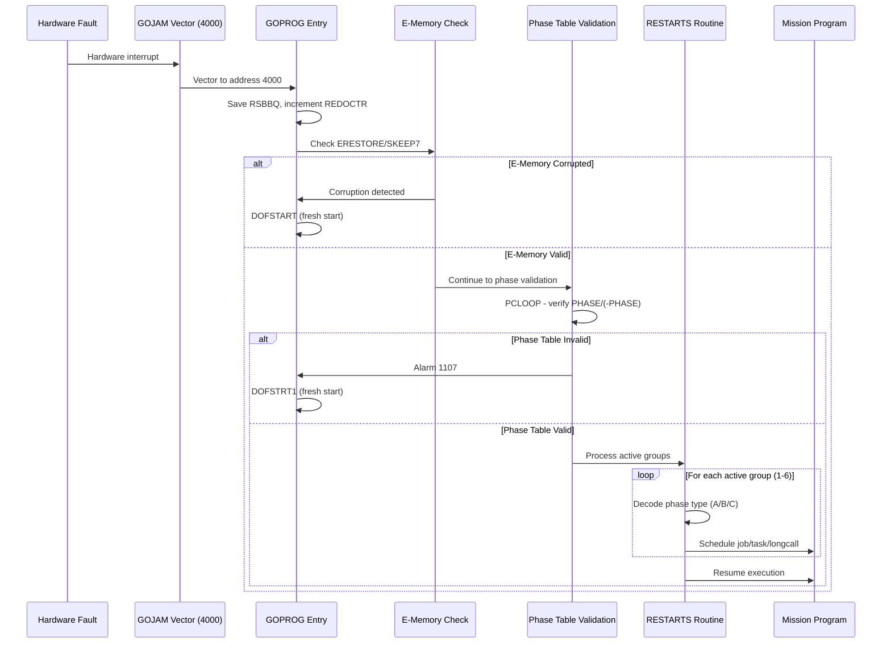
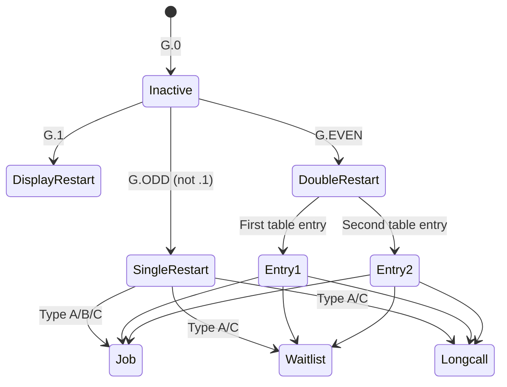
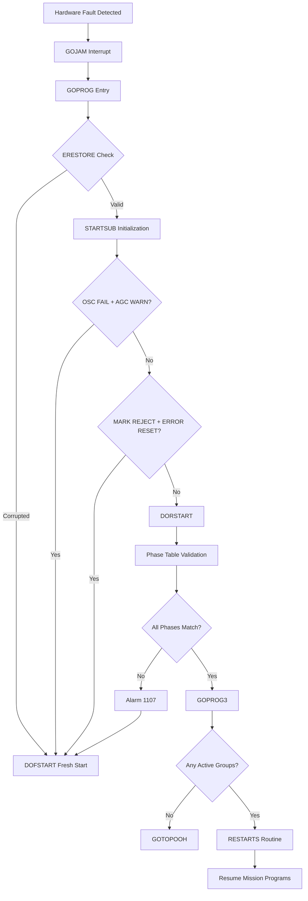
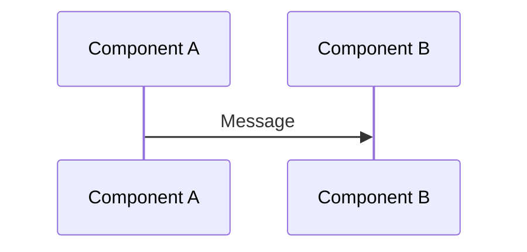

# Technical Specification

# 0. Agent Action Plan

## 0.1 Intent Clarification

### 0.1.1 Core Documentation Objective

Based on the provided requirements, the Blitzy platform understands that the documentation objective is to **create comprehensive technical documentation for the Apollo 11 Guidance Computer's Fault Recovery and State Preservation subsystem** while maintaining absolute fidelity to the original 1969 assembly source code.

**Request Categorization**: Create new documentation | Documentation gaps

**Documentation Types Required**:
- Architecture documentation (new `/docs/architecture/recovery/` directory)
- Inline assembly comments explaining recovery logic (AGC files)
- Cross-reference alarm documentation (repository-wide `ALARMS.md`)
- Traceability matrix linking recovery entry points to mission phases

**Primary Audience**: Modern software engineers analyzing historical fault-tolerant systems, aerospace historians, computer science researchers

**Success Metric**: A developer can trace P63 Landing Guidance resumption after transient hardware fault without IMU realignment

### 0.1.2 Documented Requirements

The following requirements have been explicitly stated:

- **REQ-DOC-001**: Document GOPROG hardware restart mechanism
- **REQ-DOC-002**: Document PHASE1-6 state registers and CADRTAB phase table
- **REQ-DOC-003**: Document Executive Scheduler interaction with Phase Table Maintenance
- **REQ-DOC-004**: Document hardware automatic register save (A, L, Q, BBANK)
- **REQ-DOC-005**: Document RESTARTS routine and fault recovery transitions
- **REQ-DOC-006**: Document Alarm 1107 triggering DOFSTART fresh start logic
- **REQ-DOC-007**: Create Mermaid.js sequence diagram for restart flow
- **REQ-DOC-008**: Create traceability matrix for recovery entry points to mission phases
- **REQ-DOC-009**: Document 1201/1202 Executive Overflow alarm root causes and impacts

### 0.1.3 Special Instructions and Constraints

**CRITICAL: Minimal Change Clause**

USER PROVIDED DIRECTIVE: "CRITICAL: Add only documentation without modifying 1969 assembly code."

The following preservation requirements MUST be honored:

- Original 1969 assembly code MUST remain unmodified
- Existing comment formatting patterns MUST be replicated
- Historical register naming conventions MUST be retained
- Character-by-character alignment with MIT Museum scanned printouts MUST be maintained
- Do NOT refactor, optimize, or correct assembly code
- Do NOT change register usage patterns or memory allocation
- Do NOT modernize assembly syntax or instruction sequences

**Bug Discovery Protocol**:

If logic errors are identified during documentation:
- Note in comment with `[HISTORICAL NOTE: ...]` prefix
- Do NOT fix bugs to maintain archival integrity
- Document workarounds present in original code
- Explain why certain edge cases exist

**Inline Comment Requirements**:

- Maintain existing column markers and `#` comment syntax
- Use tab characters with width 8 for indentation
- Trim trailing whitespace
- Match existing patterns from repository (as documented in `CONTRIBUTING.md`)

**Terminology Translation Requirements**:

Modern equivalents for 1960s concepts must be documented:

| 1960s Term | Modern Equivalent |
|------------|-------------------|
| Phase Tables | State Checkpointing |
| GOPROG | Hardware Interrupt Handler |
| CADRTAB | Recovery Routing Table |
| Temporal Multiplexing | Memory Timesharing |
| PHASCHNG | State Checkpoint Update |
| Executive | Priority-Based Job Scheduler |

### 0.1.4 Technical Interpretation

These documentation requirements translate to the following technical documentation strategy:

- **To document the GOPROG hardware restart mechanism**, we will create `docs/architecture/recovery/RESTART_FLOW.md` detailing the Hardware fault → GOPROG → Phase Validation → Resumption sequence
- **To document PHASE1-6 state registers and CADRTAB phase table**, we will create `docs/architecture/recovery/PHASE_TABLE_MAINTENANCE.md` explaining the type A, B, and C phase change mechanisms
- **To document Executive Scheduler interaction**, we will extend `docs/architecture/recovery/RECOVERY_OVERVIEW.md` with cross-references to `EXECUTIVE.agc` job scheduling primitives
- **To document hardware automatic register save**, we will add inline comments in `Luminary099/FRESH_START_AND_RESTART.agc` explaining the RSBBQ register storage mechanism at GOPROG entry
- **To document RESTARTS routine**, we will create detailed inline comments in `Luminary099/RESTARTS_ROUTINE.agc` and `Comanche055/RESTARTS_ROUTINE.agc`
- **To document Alarm 1107**, we will add content to `ALARMS.md` explaining phase table failure detection and DOFSTART invocation
- **To create the restart flow diagram**, we will add a Mermaid sequence diagram in `RESTART_FLOW.md`
- **To create traceability matrix**, we will add tables in `RECOVERY_OVERVIEW.md` mapping restart points to mission phases

### 0.1.5 Inferred Documentation Needs

Based on code analysis, the following implicit documentation needs have been identified:

- **Alarm Code Comprehensive Documentation**: The repository lacks a centralized `ALARMS.md` file documenting all alarm codes. The alarm listing exists only within `ASSEMBLY_AND_OPERATION_INFORMATION.agc` (pages 23-25) as inline comments. A standalone alarm reference is needed.

- **Phase Table Encoding Documentation**: The `PHASE_TABLE_MAINTENANCE.agc` file contains extensive header comments explaining phase encoding (`TL0 00P PPP PPP GGG` format), but lacks visual diagrams. A Mermaid state diagram showing phase transitions would improve comprehension.

- **Executive Overflow Context**: The 1201/1202 alarms in `EXECUTIVE.agc` lack historical context about the Apollo 11 landing (the famous 1202 alarm during P63 descent). Historical mission event documentation is needed.

- **CADRTAB/PRDTTAB Structure Documentation**: The restart tables in `RESTART_TABLES.agc` use OCT addresses (PRDTTAB = 12000, CADRTAB = 12001) but lack explanation of the table addressing scheme.

- **Cross-Module Recovery Documentation**: Both Comanche055 (Command Module) and Luminary099 (Lunar Module) have independent restart systems. Documentation should explain commonalities and differences between modules.

- **E-Memory Consistency Validation**: The ERESTORE/SKEEP7 mechanism in `FRESH_START_AND_RESTART.agc` (lines 221-246 in Luminary099) for detecting corrupted erasable memory during restart needs detailed explanation.

## 0.2 Documentation Discovery and Analysis

### 0.2.1 Existing Documentation Infrastructure Assessment

**Repository Analysis Summary**: The repository analysis reveals a **minimal documentation structure focused on transcription guidance** with no existing architectural or technical documentation for the AGC subsystems.

**Documentation Files Discovered**:

| File Path | Purpose | Current Coverage |
|-----------|---------|------------------|
| `README.md` | Project overview, attribution, contract approvals | General introduction only |
| `CONTRIBUTING.md` | Transcription and proofreading guidelines | Process-focused, not technical |
| `LICENSE.md` | Public Domain Mark 1.0 dedication | Legal only |
| `Comanche055/README.md` | Source file index with page numbers | File catalog, no technical content |
| `Luminary099/README.md` | Source file index with page numbers | File catalog, no technical content |
| `Translations/*.md` | Localized README/CONTRIBUTING files | Translations only |

**Documentation Gap Finding**: No `/docs/` directory exists. No architectural documentation exists for any AGC subsystem. Recovery system documentation is limited to inline assembly comments within source files.

**Current Documentation Framework**:

| Aspect | Status |
|--------|--------|
| Documentation generator | None (static markdown only) |
| API documentation tools | None |
| Diagram tools | None (Mermaid support available via GitHub markdown rendering) |
| Documentation hosting | GitHub repository only |
| Style guide | `CONTRIBUTING.md` - focused on code transcription, not documentation |

**Markdown Linting Configuration**:

According to `package.json`, the repository uses `markdownlint-cli2` version `^0.16.0` for markdown validation:

```json
{
  "devDependencies": {
    "markdownlint-cli2": "^0.16.0"
  }
}
```

The `.markdownlint.yml` configuration disables several rules:
- MD007 (list indentation)
- MD010 (tabs)
- MD013 (line length)
- MD033 (inline HTML)
- MD041 (first heading)

This permissive configuration accommodates the existing README structure and will support new documentation.

### 0.2.2 Repository Code Analysis for Documentation

**Search Patterns Employed**:

Recovery system files identified through targeted search:

```
Comanche055/FRESH_START_AND_RESTART.agc (32,186 bytes, pages 181-210)
Comanche055/RESTART_TABLES.agc (11,852 bytes, pages 211-221)
Comanche055/RESTARTS_ROUTINE.agc (7,809 bytes, pages 1414-1419)
Comanche055/PHASE_TABLE_MAINTENANCE.agc (pages 1404-1413)
Luminary099/FRESH_START_AND_RESTART.agc (27,861 bytes, pages 211-237)
Luminary099/RESTART_TABLES.agc (7,458 bytes, pages 238-243)
Luminary099/RESTARTS_ROUTINE.agc (7,689 bytes, pages 1303-1309)
Luminary099/PHASE_TABLE_MAINTENANCE.agc (12,373 bytes, pages 1294-1302)
```

**Supporting Files Relevant to Recovery**:

```
Luminary099/EXECUTIVE.agc (pages 1103-1114) - Job scheduler, 1201/1202 alarms
Luminary099/WAITLIST.agc - Time-based task scheduling
Luminary099/ALARM_AND_ABORT.agc (pages 1381-1385) - Alarm handling
Luminary099/ASSEMBLY_AND_OPERATION_INFORMATION.agc (pages 1-26) - Alarm code listing
Comanche055/EXECUTIVE.agc (pages 1208-1220) - CM job scheduler
Comanche055/ALARM_AND_ABORT.agc (pages 1493-1496) - CM alarm handling
```

**Key Directories Examined**:

| Directory | Contents | Recovery Relevance |
|-----------|----------|-------------------|
| `Comanche055/` | 85 AGC source files (Command Module) | FRESH_START_AND_RESTART, RESTART_TABLES, RESTARTS_ROUTINE, PHASE_TABLE_MAINTENANCE |
| `Luminary099/` | 90 AGC source files (Lunar Module) | FRESH_START_AND_RESTART, RESTART_TABLES, RESTARTS_ROUTINE, PHASE_TABLE_MAINTENANCE |
| `.github/` | CI workflows, issue templates | Markdown lint workflow |

### 0.2.3 Recovery System Code Analysis Summary

**GOPROG Entry Point** (`Luminary099/FRESH_START_AND_RESTART.agc:206`):

The hardware restart entry point at address 4000 (GOJAM vector):
- Increments REDOCTR (restart counter)
- Saves return address via RSBBQ register pair
- Validates E-memory consistency via ERESTORE/SKEEP7 mechanism
- Branches to DOFSTART if corruption detected
- Otherwise continues to DORSTART for controlled restart

**Phase Table System** (`Luminary099/PHASE_TABLE_MAINTENANCE.agc`):

Three phase change types documented in source comments (lines 84-179):
- **Type A**: Fixed phase changes (`TL0 00P PPP PPP GGG`)
- **Type B**: Combined variable + fixed (`TL1 DAP PPP PPP GGG`)
- **Type C**: Variable phase changes (`TL0 1AD XXX CJW GGG`)

Phase groups 1-6 with state preservation in PHASE1-PHASE6 registers.

**Restart Tables** (`Luminary099/RESTART_TABLES.agc`):

- PRDTTAB (12000 octal): Priority or delta-time storage
- CADRTAB (12001 octal): Restart 2CADR addresses
- SIZETAB: Table size pointers for each group
- Support for jobs, waitlist tasks, and longcalls

**Alarm 1107 - Phase Table Failure** (`Luminary099/FRESH_START_AND_RESTART.agc:347-350`):

```
PTBAD    TC    ALARM     # SET ALARM TO SHOW PHASE TABLE FAILURE.
         OCT   1107
         TCF   DOFSTRT1
```

**Executive Overflow Alarms** (`Luminary099/EXECUTIVE.agc:147,208`):
- Alarm 1201: No VAC areas available
- Alarm 1202: No core sets available

### 0.2.4 Existing Inline Documentation Quality

**Current State Assessment**:

| File | Comment Quality | Documentation Gaps |
|------|-----------------|-------------------|
| `PHASE_TABLE_MAINTENANCE.agc` | **Good** - Extensive header documentation explaining phase encoding | No visual diagrams, no cross-references |
| `FRESH_START_AND_RESTART.agc` | **Moderate** - Page headers with functional descriptions | Missing WHY explanations for register operations |
| `RESTART_TABLES.agc` | **Good** - Header explains table structure and usage | No examples of typical restart scenarios |
| `RESTARTS_ROUTINE.agc` | **Minimal** - Basic page markers only | No algorithm explanation, no state machine documentation |
| `EXECUTIVE.agc` | **Minimal** - Basic calling sequence comments | No explanation of 1201/1202 alarm scenarios |

**Comment Patterns Identified**:

1. **Page markers**: `# Page NNNN` at section boundaries
2. **Header blocks**: Multi-line comments at file start with copyright, purpose, contact
3. **Inline comments**: `# text` following code, typically terse
4. **Label annotations**: Comments describing subroutine purpose above entry points

## 0.3 Documentation Scope Analysis

### 0.3.1 Code-to-Documentation Mapping

**Recovery System Modules Requiring Documentation**:

#### Module: Luminary099/FRESH_START_AND_RESTART.agc

- **Public Entry Points**: SLAP1, DOFSTART, DOFSTRT1, GOPROG, ENEMA, GOPROG3, MR.KLEAN, P00KLEAN, V37KLEAN
- **Current Documentation**: Page headers with functional descriptions (pages 211-237)
- **Documentation Needed**:
  - Detailed inline comments explaining ERESTORE/SKEEP7 E-memory validation
  - GOPROG → DORSTART flow explanation
  - Phase table verification algorithm (PCLOOP)
  - Hardware register save mechanism (RSBBQ)

#### Module: Luminary099/PHASE_TABLE_MAINTENANCE.agc

- **Public Entry Points**: PHASCHNG, 2PHSCHNG, NEWMODEX, NEWMODEA, CHECKMM
- **Current Documentation**: Extensive header comments (lines 84-179) explaining Type A/B/C phases
- **Documentation Needed**:
  - Visual Mermaid diagram of phase encoding
  - Examples of typical PHASCHNG usage in mission programs
  - TEMPG/TEMPP/TEMPPR register usage explanation

#### Module: Luminary099/RESTART_TABLES.agc

- **Table Structures**: SIZETAB, PRDTTAB, CADRTAB, X.YSPOT entries (1.2SPOT through 6.7SPOT)
- **Current Documentation**: Header explains table format (pages 238-243)
- **Documentation Needed**:
  - Complete table of all restart points with mission program mapping
  - Explanation of OCT 77777 immediate restart pattern
  - GENADR vs -GENADR indirect addressing explanation

#### Module: Luminary099/RESTARTS_ROUTINE.agc

- **Public Entry Points**: RESTARTS, ITSAVAR, ITSAWAIT, ITSAJOB, ITSATBL, FINDTIME
- **Current Documentation**: Minimal (page markers only)
- **Documentation Needed**:
  - State machine diagram for restart type dispatching
  - Job vs waitlist vs longcall restart differentiation
  - Time calculation algorithm explanation

#### Module: Luminary099/EXECUTIVE.agc

- **Public Entry Points**: NOVAC, FINDVAC, SPVAC, CHANG1, CHANG2, JOBSLEEP, JOBWAKE, PRIOCHNG, ENDOFJOB
- **Current Documentation**: Calling sequence comments
- **Documentation Needed**:
  - Core set allocation algorithm explanation
  - VAC area exhaustion scenario (1201 alarm)
  - Core set exhaustion scenario (1202 alarm)
  - Historical context for Apollo 11 landing alarms

#### Module: Luminary099/ALARM_AND_ABORT.agc

- **Public Entry Points**: ALARM, PRIOLARM, BAILOUT, POODOO, VARALARM, ABORT
- **Current Documentation**: Calling sequence examples (pages 1381-1385)
- **Documentation Needed**:
  - FAILREG cascade mechanism explanation
  - BAILOUT vs POODOO abort distinction
  - Alarm display flow to DSKY

### 0.3.2 Comanche055 Parallel Documentation Requirements

The Command Module (Comanche055) contains parallel recovery system files requiring equivalent documentation:

| Luminary099 File | Comanche055 Equivalent | Key Differences |
|------------------|----------------------|-----------------|
| `FRESH_START_AND_RESTART.agc` | `FRESH_START_AND_RESTART.agc` | CM-specific flag initialization, no landing radar |
| `PHASE_TABLE_MAINTENANCE.agc` | `PHASE_TABLE_MAINTENANCE.agc` | Identical phase encoding mechanism |
| `RESTART_TABLES.agc` | `RESTART_TABLES.agc` | Different restart point definitions for CM programs |
| `RESTARTS_ROUTINE.agc` | `RESTARTS_ROUTINE.agc` | Identical restart dispatch logic |
| `EXECUTIVE.agc` | `EXECUTIVE.agc` | Same job scheduler with CM-specific priorities |
| `ALARM_AND_ABORT.agc` | `ALARM_AND_ABORT.agc` | Same alarm mechanism |

### 0.3.3 Documentation Gap Analysis

Given the requirements and repository analysis, documentation gaps include:

**Architectural Documentation Gaps** (HIGH PRIORITY):

| Gap | Current State | Required Documentation |
|-----|--------------|----------------------|
| Recovery system overview | None | `docs/architecture/recovery/RECOVERY_OVERVIEW.md` |
| Phase table mechanism | Inline comments only | `docs/architecture/recovery/PHASE_TABLE_MAINTENANCE.md` |
| Restart flow | None | `docs/architecture/recovery/RESTART_FLOW.md` with Mermaid diagram |
| Alarm reference | Embedded in source comments | `ALARMS.md` at repository root |

**Inline Comment Gaps** (MEDIUM PRIORITY):

| File | Lines Needing Comments | Content Required |
|------|----------------------|------------------|
| `Luminary099/FRESH_START_AND_RESTART.agc:206-248` | GOPROG entry, ERESTORE check | WHY register operations occur |
| `Luminary099/FRESH_START_AND_RESTART.agc:290-304` | PCLOOP phase validation | Phase table consistency algorithm |
| `Luminary099/RESTARTS_ROUTINE.agc:35-80` | RESTARTS dispatcher | Type A/B/C discrimination logic |
| `Luminary099/EXECUTIVE.agc:134-148` | FINDVAC2 VAC allocation | VAC exhaustion handling (1201) |
| `Luminary099/EXECUTIVE.agc:155-207` | NOVAC2 core allocation | Core exhaustion handling (1202) |

**Traceability Documentation Gaps** (MEDIUM PRIORITY):

| Gap | Required Content |
|-----|-----------------|
| Recovery entry point to mission phase mapping | Table linking restart groups to P63/P66/P12/P70/P71 |
| Alarm code to recovery action mapping | Table linking 1107/1201/1202 to recovery paths |
| Phase table state to program restart mapping | Table linking X.YSPOT entries to program restart points |

### 0.3.4 Configuration Options Requiring Documentation

**Phase Encoding Configuration**:

| Configuration | Encoding | Documentation Needed |
|--------------|----------|---------------------|
| Group number (GGG) | Bits 0-2 (octal 1-7) | Group assignment for restart protection |
| Phase value (PPP) | Bits 3-9 (0-127) | Phase within group for restart table lookup |
| TBASE flag (T) | Bit 15 | Time base setting for delta-time calculations |
| LONGBASE flag (L) | Bit 14 | Long call base time setting |

**Restart Table Configuration**:

| Table | Address | Purpose | Documentation Needed |
|-------|---------|---------|---------------------|
| SIZETAB | Bank 01 | Index offsets to restart entries | Table structure explanation |
| PRDTTAB | 12000 | Priority or delta-time storage | Sign convention explanation |
| CADRTAB | 12001 | 2CADR restart addresses | Address format documentation |

### 0.3.5 Features Requiring User Guides

**Recovery System User Guide Components**:

| Feature | Current Coverage | Gaps |
|---------|-----------------|------|
| P63 Landing Guidance Recovery | None | Complete flow from GOPROG to P63 resumption |
| Executive Overflow Handling | Alarm code listing only | Historical context, root cause analysis |
| Phase Change Programming | Source comments | Usage patterns, common mistakes |
| Fresh Start vs Restart | Source comments | Decision tree documentation |

## 0.4 Documentation Implementation Design

### 0.4.1 Documentation Structure Planning

**Proposed Documentation Hierarchy**:

```
docs/
└── architecture/
    └── recovery/
        ├── RECOVERY_OVERVIEW.md      # Purpose, responsibility, system integration
        ├── PHASE_TABLE_MAINTENANCE.md # PHASE1-6 registers, CADRTAB structure
        ├── RESTART_FLOW.md           # Hardware fault → GOPROG → Resumption
        └── ALARM_REFERENCE.md        # 1201/1202 analysis, recovery decisions

ALARMS.md                             # Repository-wide alarm reference (root level)

Comanche055/
├── README.md                         # UPDATE: Add recovery system overview section
├── FRESH_START_AND_RESTART.agc       # ADD: Inline recovery logic comments
├── RESTART_TABLES.agc                # ADD: Inline table structure comments
└── RESTARTS_ROUTINE.agc              # ADD: Inline dispatcher comments

Luminary099/
├── README.md                         # UPDATE: Add recovery system overview section
├── FRESH_START_AND_RESTART.agc       # ADD: Inline recovery logic comments
├── PHASE_TABLE_MAINTENANCE.agc       # ADD: Inline phase encoding comments
├── RESTART_TABLES.agc                # ADD: Inline table structure comments
└── RESTARTS_ROUTINE.agc              # ADD: Inline dispatcher comments
```

### 0.4.2 Content Generation Strategy

**Information Extraction Approach**:

- Extract restart entry points from `RESTART_TABLES.agc` by parsing X.YSPOT labels and 2CADR definitions
- Extract alarm codes from `ASSEMBLY_AND_OPERATION_INFORMATION.agc` pages 23-25 for alarm reference
- Generate phase encoding examples by analyzing existing PHASCHNG calls throughout codebase
- Create sequence diagrams by mapping control flow from GOPROG through RESTARTS to job/task resumption

**Documentation Standards**:

- Markdown formatting with proper headers (# ## ###)
- Mermaid diagram integration using triple-backtick mermaid blocks
- Code examples using triple-backtick agc blocks for syntax highlighting
- Source citations as inline references: `Source: Luminary099/FRESH_START_AND_RESTART.agc:206`
- Tables for parameter descriptions and state mappings
- Consistent terminology following the 1960s-to-modern translation table

**Template Structure for Architectural Guides**:

Each architectural guide must answer:
1. Module purpose and responsibility
2. Key component inventory with register/table definitions
3. System architecture integration points
4. Hardware and software dependencies
5. Data flow from fault detection to resumption
6. Known edge cases and failure modes

### 0.4.3 Diagram and Visual Strategy

**Mermaid Diagrams to Create**:

## RESTART_FLOW.md - Hardware Restart Sequence Diagram



## PHASE_TABLE_MAINTENANCE.md - Phase Encoding State Diagram



## RECOVERY_OVERVIEW.md - Recovery Decision Flowchart



### 0.4.4 Inline Comment Strategy

**Comment Placement Guidelines**:

Comments must be added following existing patterns observed in the codebase:

1. **Multi-line block headers** above major entry points (GOPROG, DOFSTART, RESTARTS)
2. **Inline explanatory comments** for complex register operations
3. **[HISTORICAL NOTE: ...]** prefix for any observations about potential issues
4. **WHY explanations** for non-obvious operations (e.g., ERESTORE validation)

**Example Comment Format** (following existing style):

```agc
# THE FOLLOWING CODE VALIDATES ERASABLE MEMORY CONSISTENCY AFTER A HARDWARE

##### RESTART. IF ERESTORE DOES NOT EQUAL +0 OR A SMALL POSITIVE NUMBER LESS THAN

#### 2000 OCTAL, THE E-MEMORY MAY HAVE BEEN CORRUPTED DURING THE RESTART.

#### MODERN EQUIVALENT: This implements a state checkpointing validation where

#### ERESTORE serves as a sentinel value indicating whether a memory-modifying

#### operation (ERASCHK) was interrupted by the hardware fault.

```

**Target Files for Inline Comments**:

| File | Lines | Comment Purpose |
|------|-------|-----------------|
| `Luminary099/FRESH_START_AND_RESTART.agc` | 206-248 | GOPROG entry, ERESTORE validation |
| `Luminary099/FRESH_START_AND_RESTART.agc` | 290-350 | PCLOOP phase validation, Alarm 1107 |
| `Luminary099/PHASE_TABLE_MAINTENANCE.agc` | 84-200 | Enhanced phase encoding explanation |
| `Luminary099/RESTARTS_ROUTINE.agc` | 35-100 | Type A/B/C dispatch logic |
| `Luminary099/RESTART_TABLES.agc` | 30-100 | Table structure and entry format |
| `Comanche055/FRESH_START_AND_RESTART.agc` | 290-350 | Parallel CM documentation |

### 0.4.5 Traceability Matrix Design

**Recovery Entry Points to Mission Phases Matrix** (for `RECOVERY_OVERVIEW.md`):

| Restart Group | Primary Mission Phase | Key Programs | Recovery Scope |
|--------------|----------------------|--------------|----------------|
| Group 1 | General timing | Ullage tasks | Timer-based tasks |
| Group 2 | State vector integration | P20/P22 tracking | Navigation state preservation |
| Group 3 | Guidance calculations | S40.13 steering | Guidance computation restart |
| Group 4 | Burn sequences | P12/P40/P63/P70/P71 | Powered flight recovery |
| Group 5 | Servicer functions | SERVICER | Sensor processing restart |
| Group 6 | Clock/timing | CLOKTASK, TIMEDIDR | Time reference maintenance |

**Alarm Codes to Recovery Actions Matrix** (for `ALARMS.md`):

| Alarm Code | Description | Recovery Action | Impact |
|------------|-------------|-----------------|--------|
| 1107 | Phase table failure | DOFSTART (fresh start) | All programs terminated |
| 1201 | No VAC areas | BAILOUT abort | Current job terminated |
| 1202 | No core sets | BAILOUT abort | Job scheduling failure |
| 1203 | Waitlist overflow | BAILOUT abort | Task scheduling failure |

## 0.5 Documentation File Transformation Mapping

### 0.5.1 File-by-File Documentation Plan

**Documentation Transformation Modes**:
- **CREATE** - Create a new documentation file
- **UPDATE** - Update an existing documentation file
- **DELETE** - Remove an obsolete documentation file
- **REFERENCE** - Use as an example for documentation style and structure

| Target Documentation File | Transformation | Source Code/Docs | Content/Changes |
|---------------------------|----------------|------------------|-----------------|
| `docs/architecture/recovery/RECOVERY_OVERVIEW.md` | CREATE | `Luminary099/FRESH_START_AND_RESTART.agc`, `Comanche055/FRESH_START_AND_RESTART.agc` | Complete recovery system overview with purpose, component inventory, integration points, traceability matrix |
| `docs/architecture/recovery/PHASE_TABLE_MAINTENANCE.md` | CREATE | `Luminary099/PHASE_TABLE_MAINTENANCE.agc`, `Luminary099/RESTART_TABLES.agc` | PHASE1-6 registers, CADRTAB structure, Type A/B/C encoding with Mermaid diagrams |
| `docs/architecture/recovery/RESTART_FLOW.md` | CREATE | `Luminary099/FRESH_START_AND_RESTART.agc`, `Luminary099/RESTARTS_ROUTINE.agc` | Hardware fault → GOPROG → Phase Validation → Resumption sequence with Mermaid diagram |
| `docs/architecture/recovery/ALARM_REFERENCE.md` | CREATE | `Luminary099/ASSEMBLY_AND_OPERATION_INFORMATION.agc`, `Luminary099/EXECUTIVE.agc` | 1201/1202/1107 alarm analysis, Executive queue impacts, recovery decision tree |
| `ALARMS.md` | CREATE | `Luminary099/ASSEMBLY_AND_OPERATION_INFORMATION.agc:900-1022`, `Comanche055/ASSEMBLY_AND_OPERATION_INFORMATION.agc` | Repository-wide alarm code reference with recovery-specific analysis |
| `Comanche055/README.md` | UPDATE | `Comanche055/README.md` | Add recovery system overview section linking to `/docs/architecture/recovery/` |
| `Luminary099/README.md` | UPDATE | `Luminary099/README.md` | Add recovery system overview section linking to `/docs/architecture/recovery/` |
| `Luminary099/FRESH_START_AND_RESTART.agc` | UPDATE | Self | Add inline comments explaining GOPROG entry, ERESTORE validation, phase table checking |
| `Luminary099/PHASE_TABLE_MAINTENANCE.agc` | UPDATE | Self | Add inline comments enhancing existing header documentation with modern terminology |
| `Luminary099/RESTARTS_ROUTINE.agc` | UPDATE | Self | Add inline comments explaining Type A/B/C dispatch logic and time calculations |
| `Luminary099/RESTART_TABLES.agc` | UPDATE | Self | Add inline comments explaining table structure and entry format |
| `Comanche055/FRESH_START_AND_RESTART.agc` | UPDATE | Self | Add inline comments parallel to Luminary099 version |
| `Comanche055/RESTARTS_ROUTINE.agc` | UPDATE | Self | Add inline comments parallel to Luminary099 version |
| `Comanche055/RESTART_TABLES.agc` | UPDATE | Self | Add inline comments parallel to Luminary099 version |
| `README.md` | REFERENCE | Self | Use existing structure as template for README updates |
| `CONTRIBUTING.md` | REFERENCE | Self | Use formatting guidelines for documentation style |

### 0.5.2 New Documentation Files Detail

#### File: docs/architecture/recovery/RECOVERY_OVERVIEW.md

**Type**: Architecture Guide  
**Source Code**: `Luminary099/FRESH_START_AND_RESTART.agc`, `Comanche055/FRESH_START_AND_RESTART.agc`

**Sections**:
- Overview (purpose and capabilities of AGC fault recovery)
- Component Inventory (GOPROG, DOFSTART, STARTSUB, MR.KLEAN)
- System Architecture Integration (relationship to Executive, Waitlist)
- Hardware Dependencies (GOJAM vector, channel I/O preservation)
- Data Flow (fault detection → state validation → resumption)
- Traceability Matrix (recovery entry points to mission phases)
- Historical Context (Apollo 11 landing alarms)

**Diagrams**:
- Recovery decision flowchart (Mermaid)
- Component relationship diagram

**Key Citations**: 
- `Luminary099/FRESH_START_AND_RESTART.agc:206-350`
- `Luminary099/EXECUTIVE.agc:147,208`

---

#### File: docs/architecture/recovery/PHASE_TABLE_MAINTENANCE.md

**Type**: Technical Reference  
**Source Code**: `Luminary099/PHASE_TABLE_MAINTENANCE.agc`, `Luminary099/RESTART_TABLES.agc`

**Sections**:
- Overview (phase table purpose as state checkpointing)
- Phase Encoding Format (TL0 00P PPP PPP GGG breakdown)
- Type A Phase Changes (fixed phases, examples)
- Type B Phase Changes (combined variable + fixed)
- Type C Phase Changes (variable phases)
- 2PHSCHNG Double Phase Changes
- CADRTAB/PRDTTAB Table Structure
- SIZETAB Index Mechanism
- Register Usage (TEMPG, TEMPP, TEMPPR, TEMPSWCH)

**Diagrams**:
- Phase encoding state diagram (Mermaid)
- Table addressing diagram

**Key Citations**:
- `Luminary099/PHASE_TABLE_MAINTENANCE.agc:84-200`
- `Luminary099/RESTART_TABLES.agc:29-100`

---

#### File: docs/architecture/recovery/RESTART_FLOW.md

**Type**: Process Documentation  
**Source Code**: `Luminary099/FRESH_START_AND_RESTART.agc`, `Luminary099/RESTARTS_ROUTINE.agc`

**Sections**:
- Hardware Fault Detection (GOJAM trigger conditions)
- GOPROG Invocation (register save, counter increment)
- E-Memory Validation (ERESTORE/SKEEP7 mechanism)
- Phase Table Validation (PCLOOP algorithm)
- RESTARTS Dispatch (type discrimination)
- Job Restart (FINDVAC/NOVAC reentry)
- Waitlist Task Restart (time delta calculation)
- Longcall Restart (LONGBASE handling)
- Program Resumption (control flow return)

**Diagrams**:
- Hardware restart sequence diagram (Mermaid)
- Complete end-to-end flow

**Key Citations**:
- `Luminary099/FRESH_START_AND_RESTART.agc:206-350`
- `Luminary099/RESTARTS_ROUTINE.agc:35-324`

---

#### File: docs/architecture/recovery/ALARM_REFERENCE.md

**Type**: Reference Documentation  
**Source Code**: `Luminary099/EXECUTIVE.agc`, `Luminary099/ALARM_AND_ABORT.agc`

**Sections**:
- Executive Overflow Alarms (1201/1202)
  - Root Cause Analysis
  - Impact on Priority Queue
  - Historical Apollo 11 Occurrences
- Phase Table Failure Alarm (1107)
  - Detection Mechanism
  - Fresh Start Trigger
- Recovery Actions vs Abort Conditions
- Alarm Display Flow
- FAILREG Cascade Mechanism

**Diagrams**:
- Alarm handling flowchart
- Executive resource exhaustion diagram

**Key Citations**:
- `Luminary099/EXECUTIVE.agc:134-210`
- `Luminary099/ALARM_AND_ABORT.agc:50-100`
- `Luminary099/ASSEMBLY_AND_OPERATION_INFORMATION.agc:966-967`

---

#### File: ALARMS.md

**Type**: Repository-Wide Reference  
**Source Code**: `Luminary099/ASSEMBLY_AND_OPERATION_INFORMATION.agc:900-1022`

**Sections**:
- Alarm Code Format (AAANN structure)
- Alarm Categories (* abort, ** serious, P priority)
- Complete Alarm Code Table (from source)
- Recovery-Related Alarms (1107, 1201, 1202, 1203)
- Historical Mission Events (Apollo 11 1202 alarms)
- Cross-References to Recovery Documentation

**Key Citations**:
- `Luminary099/ASSEMBLY_AND_OPERATION_INFORMATION.agc:900-1022`
- `Comanche055/ASSEMBLY_AND_OPERATION_INFORMATION.agc:920-1020`

### 0.5.3 Documentation Files to Update Detail

## Comanche055/README.md

**New Section**: Recovery System Overview

**Content to Add**:
```
## Recovery System

The Comanche055 recovery system provides fault-tolerant restart capability through 
phase-based state checkpointing. Key components:

- **FRESH_START_AND_RESTART.agc** (pages 181-210): GOPROG entry, DOFSTART fresh start
- **RESTART_TABLES.agc** (pages 211-221): Restart point definitions
- **RESTARTS_ROUTINE.agc** (pages 1414-1419): Restart type dispatching
- **PHASE_TABLE_MAINTENANCE.agc** (pages 1404-1413): Phase change mechanism

For detailed recovery system documentation, see [Recovery Architecture](/docs/architecture/recovery/).
```

**Placement**: After "Source Code Index" section

---

## Luminary099/README.md

**New Section**: Recovery System Overview (identical structure to Comanche055)

**Content to Add**:
```
## Recovery System

The Luminary099 recovery system provides fault-tolerant restart capability through 
phase-based state checkpointing. Key components:

- **FRESH_START_AND_RESTART.agc** (pages 211-237): GOPROG entry, DOFSTART fresh start
- **PHASE_TABLE_MAINTENANCE.agc** (pages 1294-1302): Phase change mechanism
- **RESTART_TABLES.agc** (pages 238-243): Restart point definitions
- **RESTARTS_ROUTINE.agc** (pages 1303-1309): Restart type dispatching

For detailed recovery system documentation, see [Recovery Architecture](/docs/architecture/recovery/).
```

### 0.5.4 Inline Comment Updates Detail

## Luminary099/FRESH_START_AND_RESTART.agc

**Lines 206-248 (GOPROG Entry)**:
- Add block comment explaining hardware restart trigger conditions
- Document RSBBQ register save mechanism
- Explain ERESTORE/SKEEP7 E-memory validation algorithm
- Add modern terminology equivalents

**Lines 290-350 (Phase Table Validation)**:
- Document PCLOOP verification algorithm
- Explain RXOR LCHAN consistency check
- Document Alarm 1107 trigger conditions
- Add recovery flow explanation

## Luminary099/RESTARTS_ROUTINE.agc

**Lines 35-100 (RESTARTS Entry)**:
- Document type A/B/C discrimination logic
- Explain ITSAVAR, ITSAWAIT, ITSAJOB branches
- Document time calculation in FINDTIME
- Add modern state machine terminology

## Luminary099/RESTART_TABLES.agc

**Lines 30-100 (Table Structure)**:
- Document PRDTTAB/CADRTAB addressing
- Explain positive/negative sign conventions
- Document immediate restart (OCT 77777) pattern
- Add examples for each entry type

### 0.5.5 Documentation Configuration

No documentation generator configuration files need to be created or updated since the repository uses static Markdown files rendered directly by GitHub.

The existing `.markdownlint.yml` configuration and `package.json` lint scripts will validate new documentation files automatically.

**Lint Command for New Documentation**:
```bash
npm run lint -- docs/**/*.md ALARMS.md
```

## 0.6 Dependency Inventory

### 0.6.1 Documentation Dependencies

The following documentation tools and packages are relevant to this documentation exercise:

| Registry | Package Name | Version | Purpose |
|----------|--------------|---------|---------|
| npm | markdownlint-cli2 | ^0.16.0 | Markdown linting for documentation validation |
| GitHub | Mermaid.js | Native | Diagram rendering in GitHub markdown (no installation required) |
| N/A | yaYUL | N/A | AGC assembler for functional validation (mentioned but out of scope) |
| N/A | yaAGC | N/A | AGC emulator for behavioral validation (mentioned but out of scope) |

**Note**: The repository has minimal tooling dependencies. Documentation is rendered natively by GitHub's markdown processor which includes built-in Mermaid diagram support. No additional documentation generators (MkDocs, Sphinx, Docusaurus) are present or required.

### 0.6.2 Existing Package Configuration

From `package.json`:

```json
{
  "scripts": {
    "lint": "markdownlint-cli2 *.md translations/*.md Comanche055/*.md Luminary099/*.md --config .markdownlint.yml",
    "lint:fix": "markdownlint-cli2 *.md translations/*.md Comanche055/*.md Luminary099/*.md --config .markdownlint.yml --fix"
  },
  "dependencies": {},
  "devDependencies": {
    "markdownlint-cli2": "^0.16.0"
  }
}
```

### 0.6.3 Lint Script Update Required

The existing lint scripts in `package.json` do not include the new `docs/` directory. The scripts should be updated to include new documentation paths:

**Current**:
```bash
markdownlint-cli2 *.md translations/*.md Comanche055/*.md Luminary099/*.md
```

**Updated** (recommended):
```bash
markdownlint-cli2 *.md translations/*.md Comanche055/*.md Luminary099/*.md docs/**/*.md
```

This update ensures new architectural documentation in `docs/architecture/recovery/` is validated by the markdown linter.

### 0.6.4 Documentation Reference Dependencies

**Source Files Required for Documentation**:

| Source File | Documentation Dependency | Purpose |
|-------------|------------------------|---------|
| `Luminary099/FRESH_START_AND_RESTART.agc` | RECOVERY_OVERVIEW.md, RESTART_FLOW.md | Primary recovery system reference |
| `Luminary099/PHASE_TABLE_MAINTENANCE.agc` | PHASE_TABLE_MAINTENANCE.md | Phase encoding reference |
| `Luminary099/RESTARTS_ROUTINE.agc` | RESTART_FLOW.md | Restart dispatch reference |
| `Luminary099/RESTART_TABLES.agc` | PHASE_TABLE_MAINTENANCE.md | Table structure reference |
| `Luminary099/EXECUTIVE.agc` | ALARM_REFERENCE.md | 1201/1202 alarm reference |
| `Luminary099/ALARM_AND_ABORT.agc` | ALARM_REFERENCE.md, ALARMS.md | Alarm handling reference |
| `Luminary099/ASSEMBLY_AND_OPERATION_INFORMATION.agc` | ALARMS.md | Complete alarm listing |
| `Comanche055/FRESH_START_AND_RESTART.agc` | RECOVERY_OVERVIEW.md | CM parallel reference |

### 0.6.5 External Reference Dependencies

**Validation Resources** (for documentation accuracy verification):

| Resource | URL | Purpose |
|----------|-----|---------|
| Virtual AGC Project | www.ibiblio.org/apollo | Authoritative AGC reference |
| Luminary099 Scans | www.ibiblio.org/apollo/ScansForConversion/Luminary099/ | Original source verification |
| Comanche055 Scans | www.ibiblio.org/apollo/ScansForConversion/Comanche055/ | Original source verification |
| Interactive Viewer | 28gpc.csb.app | Cross-reference navigation |

### 0.6.6 Documentation Link Updates

**Cross-Reference Links Required**:

| Documentation File | Link Target | Link Purpose |
|-------------------|-------------|--------------|
| `docs/architecture/recovery/RECOVERY_OVERVIEW.md` | `PHASE_TABLE_MAINTENANCE.md` | Phase table details |
| `docs/architecture/recovery/RECOVERY_OVERVIEW.md` | `RESTART_FLOW.md` | Flow details |
| `docs/architecture/recovery/RECOVERY_OVERVIEW.md` | `../../ALARMS.md` | Alarm reference |
| `docs/architecture/recovery/RESTART_FLOW.md` | `PHASE_TABLE_MAINTENANCE.md` | Phase encoding |
| `docs/architecture/recovery/RESTART_FLOW.md` | `ALARM_REFERENCE.md` | Alarm handling |
| `ALARMS.md` | `docs/architecture/recovery/ALARM_REFERENCE.md` | Detailed analysis |
| `Comanche055/README.md` | `../docs/architecture/recovery/` | Recovery documentation |
| `Luminary099/README.md` | `../docs/architecture/recovery/` | Recovery documentation |

**Link Transformation Rules**:

- Internal markdown links use relative paths
- Source file references use GitHub-compatible relative paths from documentation location
- All links should be validated by markdown linter

## 0.7 Coverage and Quality Targets

### 0.7.1 Documentation Coverage Metrics

**Current Coverage Analysis**:

| Documentation Area | Files Examined | Currently Documented | Target Coverage |
|-------------------|---------------|---------------------|-----------------|
| Recovery Entry Points | 8 (4 per module) | 0/8 (0%) | 8/8 (100%) |
| Phase Table Mechanism | 2 | 2/2 (inline only) | Full architectural guide |
| Alarm Codes (Recovery-Related) | 4 codes | Inline listing only | Dedicated ALARMS.md |
| Restart Table Structure | 2 | 2/2 (inline only) | Enhanced inline + guide |
| Executive Overflow Scenarios | 2 | 0/2 (0%) | Full analysis |

**Target Coverage**: 100% of recovery system components documented

**Coverage Gaps to Address**:

| Component | Current State | Target State | Gap |
|-----------|--------------|--------------|-----|
| GOPROG entry point | Minimal inline | Full inline + architectural | +Block comments, +Flow documentation |
| Phase encoding types | Header comments | Enhanced inline + visual diagram | +Mermaid diagrams |
| RESTARTS dispatch | Page markers only | Full algorithmic explanation | +State machine documentation |
| 1201/1202 alarms | Code listing | Historical context + root cause | +Apollo 11 mission context |
| E-memory validation | No comments | Complete algorithm explanation | +ERESTORE/SKEEP7 documentation |

### 0.7.2 Documentation Quality Criteria

**Completeness Requirements**:

- All GOPROG entry points documented with context (purpose, trigger conditions, outcomes)
- Complete phase table state transition map (Type A, B, C with examples)
- Full alarm code recovery action matrix (1107, 1201, 1202, 1203)
- End-to-end recovery flow trace for P63 landing scenario
- Both Comanche055 and Luminary099 modules covered with parity

**Accuracy Validation**:

| Validation Method | Application |
|------------------|-------------|
| Source file cross-reference | All documentation cites specific file:line references |
| Assembly code verification | Code snippets match source files exactly |
| Terminology consistency | 1960s terms mapped to modern equivalents uniformly |
| Historical accuracy | Apollo 11 events verified against NASA historical records |

**Clarity Standards**:

- Modern engineer can understand 1960s recovery logic without aerospace background
- Recovery decision points clearly explained with rationale
- Hardware constraints explicitly documented at each stage (2KB RAM, 36KB ROM)
- Visual diagrams accurately represent system behavior

**Maintainability**:

- Source citations for traceability (`Source: file.agc:line`)
- Clear cross-references between related documentation
- Consistent formatting matching existing repository style
- Markdown-lint compliant for automated validation

### 0.7.3 Example and Diagram Requirements

**Minimum Content Per Documentation File**:

| File | Required Diagrams | Required Examples | Required Tables |
|------|------------------|-------------------|-----------------|
| RECOVERY_OVERVIEW.md | 1 flowchart | 2 restart scenarios | 2 (traceability, components) |
| PHASE_TABLE_MAINTENANCE.md | 1 state diagram | 3 (Type A, B, C) | 2 (encoding format, register usage) |
| RESTART_FLOW.md | 1 sequence diagram | 1 complete flow trace | 1 (entry points) |
| ALARM_REFERENCE.md | 1 flowchart | 2 alarm scenarios | 1 (alarm-to-action) |
| ALARMS.md | 0 | 0 | 1 (complete alarm listing) |

**Diagram Rendering Verification**:

All Mermaid diagrams must render correctly in:
- GitHub markdown preview
- GitHub repository view
- Common markdown editors (VS Code, etc.)

### 0.7.4 Success Criteria

**Primary Success Metric** (from user requirements):

> "Developer can trace P63 Landing Guidance resumption after transient hardware fault without IMU realignment"

**Verification Scenario**:

A developer should be able to follow this documentation path:
1. Read `RECOVERY_OVERVIEW.md` to understand the recovery system purpose
2. Follow `RESTART_FLOW.md` sequence diagram from hardware fault to GOPROG
3. Understand phase validation via `PHASE_TABLE_MAINTENANCE.md`
4. Trace P63 restart through Group 4 restart table entries
5. Understand why IMU realignment is not required (state preserved in phase tables)

**Secondary Success Metrics**:

| Metric | Target | Verification |
|--------|--------|--------------|
| Alarm documentation coverage | 100% recovery-related alarms | ALARMS.md includes 1107, 1201, 1202, 1203 |
| Inline comment coverage | All major entry points | GOPROG, PHASCHNG, RESTARTS have block comments |
| Diagram accuracy | All diagrams match code | Review diagrams against source |
| Historical accuracy | Apollo 11 events documented | 1202 alarm during descent documented |

### 0.7.5 Quality Assurance Checklist

**Pre-Completion Verification**:

- [ ] All documentation files created per transformation map
- [ ] All Mermaid diagrams render correctly
- [ ] All source citations verified against actual source files
- [ ] All cross-reference links validated
- [ ] Markdown lint passes for all new files
- [ ] Terminology translation table applied consistently
- [ ] Inline comments follow existing formatting patterns
- [ ] README updates include proper relative links
- [ ] Historical accuracy verified for Apollo 11 references
- [ ] P63 recovery trace scenario validated end-to-end

## 0.8 Scope Boundaries

### 0.8.1 Exhaustively In Scope

**New Documentation Files**:

| Path Pattern | Description |
|--------------|-------------|
| `docs/architecture/recovery/RECOVERY_OVERVIEW.md` | Recovery system overview and traceability |
| `docs/architecture/recovery/PHASE_TABLE_MAINTENANCE.md` | Phase encoding and table documentation |
| `docs/architecture/recovery/RESTART_FLOW.md` | Complete restart sequence documentation |
| `docs/architecture/recovery/ALARM_REFERENCE.md` | Recovery-related alarm analysis |
| `ALARMS.md` | Repository-wide alarm code reference |

**Documentation File Updates**:

| Path Pattern | Description |
|--------------|-------------|
| `Comanche055/README.md` | Add recovery system overview section |
| `Luminary099/README.md` | Add recovery system overview section |

**Inline Comment Additions** (documentation-only, no code changes):

| Path Pattern | Description |
|--------------|-------------|
| `Luminary099/FRESH_START_AND_RESTART.agc` | Inline comments for GOPROG, DORSTART, PCLOOP |
| `Luminary099/PHASE_TABLE_MAINTENANCE.agc` | Enhanced inline documentation |
| `Luminary099/RESTARTS_ROUTINE.agc` | Inline comments for restart dispatch |
| `Luminary099/RESTART_TABLES.agc` | Inline comments for table structure |
| `Comanche055/FRESH_START_AND_RESTART.agc` | Parallel inline comments |
| `Comanche055/RESTARTS_ROUTINE.agc` | Parallel inline comments |
| `Comanche055/RESTART_TABLES.agc` | Parallel inline comments |

**Documentation Assets**:

| Path Pattern | Description |
|--------------|-------------|
| Mermaid diagrams embedded in markdown | Sequence, state, and flowchart diagrams |
| Tables in markdown format | Traceability, encoding, alarm matrices |

**Documentation Configuration**:

| Path Pattern | Description |
|--------------|-------------|
| `package.json` | Update lint script to include docs/**/*.md |

### 0.8.2 Explicitly Out of Scope

**Source Code Modifications**:

| Exclusion | Rationale |
|-----------|-----------|
| Assembly code logic changes | User directive: "Add only documentation without modifying 1969 assembly code" |
| Register usage pattern changes | Preservation requirement |
| Memory allocation changes | Preservation requirement |
| Assembly syntax modernization | Archival fidelity requirement |
| Bug fixes | "Do NOT fix bugs to maintain archival integrity" |
| Performance optimizations | Not documentation |

**External Tools**:

| Exclusion | Rationale |
|-----------|-----------|
| yaYUL assembler modifications | Out of scope per user directive |
| yaAGC emulator configuration | "beyond brief functional validation mention" |
| External emulator tool documentation | Explicitly excluded |

**Non-Recovery System Modules**:

| Exclusion | Rationale |
|-----------|-----------|
| Guidance equations (P63, P66) | "outside recovery context" unless directly related |
| Navigation algorithms | Not recovery system |
| IMU calibration routines | Not recovery system |
| Autopilot control laws | Not recovery system |
| Telemetry processing | Not recovery system |

**Documentation Types**:

| Exclusion | Rationale |
|-----------|-----------|
| Test file modifications | Unless updating test documentation |
| Feature additions | Documentation only |
| Deployment configuration | Unless documentation deployment |
| Unrelated documentation | "not specified by user" |

### 0.8.3 Boundary Clarifications

**Inline Comments vs Code Changes**:

Inline comments ARE in scope when they:
- Add `#` prefixed comment lines explaining existing code
- Insert block comments above existing labels
- Add `[HISTORICAL NOTE: ...]` annotations for observations
- Use modern terminology translations in comments

Inline comments are OUT of scope when they:
- Modify actual AGC instructions
- Change label names or addresses
- Add or remove code statements
- Modify existing comment content (only additions allowed)

**Recovery System Boundary**:

IN SCOPE - Components directly involved in restart/recovery:
- GOPROG hardware restart entry
- DOFSTART/DOFSTRT1 fresh start
- STARTSUB/STARTSB2 initialization
- MR.KLEAN/V37KLEAN/P00KLEAN phase clearing
- PHASCHNG/2PHSCHNG phase changes
- RESTARTS routine dispatcher
- RESTART_TABLES phase definitions
- ALARM/BAILOUT/POODOO alarm handlers
- Executive FINDVAC/NOVAC (for 1201/1202 context)

OUT OF SCOPE - Components using recovery but not part of it:
- P63 guidance equations (document restart points only)
- Servicer processing
- Display routines
- Navigation integration
- Burn sequencing (except restart table entries)

### 0.8.4 Documentation Boundary Enforcement

**Validation Rules**:

1. Every new documentation file must be in `docs/architecture/recovery/` or repository root
2. README updates limited to adding section linking to recovery documentation
3. Inline comments must follow existing `#` comment syntax
4. No instruction modifications (CAF, TC, CA, etc.) permitted
5. No label modifications (GOPROG, PHASCHNG, etc.) permitted
6. Character alignment with scanned printouts must be maintained for inline comments

**Change Classification**:

| Change Type | Classification | Permitted |
|-------------|---------------|-----------|
| New .md file in docs/ | Documentation | YES |
| New ALARMS.md at root | Documentation | YES |
| Section added to README.md | Documentation | YES |
| Comment line added to .agc | Documentation | YES |
| Comment block added to .agc | Documentation | YES |
| Instruction modified in .agc | Code change | NO |
| Label renamed in .agc | Code change | NO |
| Existing comment modified | Content change | NO (additions only) |

## 0.9 Execution Parameters

### 0.9.1 Documentation-Specific Instructions

**Documentation Build Command**:
```bash
# No build required - static markdown files rendered by GitHub

#### Validation only:

npm run lint
```

**Documentation Preview Command**:
```bash
# Local preview using any markdown viewer, or:

#### Push to GitHub and view rendered markdown in repository

```

**Diagram Generation Command**:
```bash
# No generation required - Mermaid diagrams rendered inline by GitHub

#### For local preview, use VS Code with Mermaid extension or similar

```

**Documentation Validation Command**:
```bash
# Lint all markdown files including new docs directory

npm run lint

#### With explicit paths (after package.json update):

npx markdownlint-cli2 "*.md" "docs/**/*.md" "Comanche055/*.md" "Luminary099/*.md" --config .markdownlint.yml
```

**Documentation Deployment**: 
Not applicable - repository uses GitHub's native markdown rendering.

### 0.9.2 Default Formatting Standards

**Markdown Format**:
- Use ATX-style headers (`#`, `##`, `###`)
- Code blocks use triple backticks with language identifier
- Tables use pipe-delimited format
- Lists use dashes (`-`) for unordered, numbers for ordered
- Mermaid diagrams enclosed in triple backticks with `mermaid` identifier

**AGC Code Block Format**:
```agc
# EXAMPLE COMMENT BLOCK FOR GOPROG ENTRY POINT

#### THIS ROUTINE IS ENTERED VIA THE GOJAM VECTOR AT ADDRESS 4000 WHEN A

#### HARDWARE RESTART OCCURS.

GOPROG		INCR	REDOCTR		# ADVANCE RESTART COUNTER.
```

**Mermaid Diagram Format**:


### 0.9.3 Citation Requirements

**Inline Source Citation Format**:
```
Source: Luminary099/FRESH_START_AND_RESTART.agc:206-248
```

**Reference-Style Citation**:
```
[GOPROG]: Luminary099/FRESH_START_AND_RESTART.agc, lines 206-248
[PHASCHNG]: Luminary099/PHASE_TABLE_MAINTENANCE.agc, lines 228-239
```

Every technical claim must reference a specific source file and line range.

### 0.9.4 Style Guide Compliance

**Repository Style Requirements** (from `CONTRIBUTING.md`):

| Requirement | Value | Application |
|-------------|-------|-------------|
| Tab indentation | Required | AGC inline comments |
| Tab width | 8 | AGC inline comments |
| Trailing whitespace | Trim | All files |
| Comment accuracy | Match scans exactly | Existing comments only |

**New Documentation Style**:

| Requirement | Value | Application |
|-------------|-------|-------------|
| Heading style | ATX (`#`) | Markdown files |
| List style | Dashes (`-`) | Markdown files |
| Code fences | Triple backticks | All code blocks |
| Line length | No limit (MD013 disabled) | All markdown |
| Inline HTML | Permitted (MD033 disabled) | Diagrams if needed |

### 0.9.5 Comment Formatting Patterns

**Block Comment Header** (for major entry points):

```agc
# ============================================================================

#### GOPROG - HARDWARE RESTART ENTRY POINT

#### ============================================================================

#### MODERN EQUIVALENT: Hardware Interrupt Handler for System Recovery

#
#### PURPOSE: This routine handles hardware-initiated restarts triggered by

####          transient faults (radiation-induced bit flips, power transients,

####          oscillator failures).

#
#### ENTRY CONDITIONS:

####   - GOJAM hardware vector transfers control to address 4000

####   - Registers A, L, Q automatically saved by hardware

####   - BBANK preserved in RSBBQ along with Q and SUPERBNK

#
#### FLOW:

####   Increment restart counter (REDOCTR)

####   Save Q and SUPERBNK to RSBBQ

####   Validate erasable memory consistency (ERESTORE check)

####   If corrupted: Branch to DOFSTART (fresh start)

####   If valid: Continue to DORSTART (controlled restart)

#
#### EXIT: Via ENDRSTRT to DUMMYJOB or via restart table dispatch

#
#### SOURCE: Luminary099/FRESH_START_AND_RESTART.agc:206

#### ============================================================================

```

**Inline Explanatory Comment**:

```agc
GOPROG		INCR	REDOCTR		# ADVANCE RESTART COUNTER.
					# [Modern: Increment fault occurrence counter
					#  for telemetry and debugging purposes]

		LXCH	Q		# SAVE Q REGISTER
		EXTEND			# [Hardware saves A, L, Q, BBANK automatically
		ROR	SUPERBNK	#  but we need to preserve SUPERBNK for
		DXCH	RSBBQ		#  cross-bank return addressing]
```

**Historical Note Format**:

```agc
# [HISTORICAL NOTE: The E-memory validation using ERESTORE/SKEEP7 was

####  designed to detect cases where ERASCHK was interrupted mid-operation.

####  If ERESTORE doesn't match expected values, erasable memory may be

####  corrupted and a fresh start is required rather than a controlled

##  restart.]

```

### 0.9.6 Directory Creation

**New Directories to Create**:

```bash
mkdir -p docs/architecture/recovery
```

This creates the nested directory structure for the new architectural documentation.

## 0.10 Rules for Documentation

### 0.10.1 User-Specified Documentation Rules

The following rules have been explicitly emphasized by the user and MUST be followed:

**RULE 1: Minimal Change Clause**

> "CRITICAL: Add only documentation without modifying 1969 assembly code."

- Add comments, markdown files, and diagrams ONLY
- Do NOT refactor, optimize, or correct assembly code
- Do NOT change register usage patterns or memory allocation
- Do NOT modernize assembly syntax or instruction sequences
- Isolate all documentation in comment blocks and `/docs/` directory
- Document existing code behavior without prescribing changes

**RULE 2: Archival Fidelity**

> "Original 1969 assembly code MUST remain unmodified"

- Existing comment formatting patterns MUST be replicated
- Historical register naming conventions MUST be retained
- Character-by-character alignment with MIT Museum scanned printouts MUST be maintained
- Original functionality preservation supersedes documentation clarity
- When in doubt about code behavior, document observed behavior without interpretation
- Maintain exact spacing and formatting in inline comments matching existing patterns

**RULE 3: Bug Discovery Protocol**

> "If logic error identified during documentation, note in comment with `[HISTORICAL NOTE: ...]` prefix"

- Do NOT fix bugs to maintain archival integrity
- Document workarounds present in original code
- Explain why certain edge cases exist
- Note any observed anomalies without modification

**RULE 4: Terminology Translation**

Provide modern equivalents for 1960s concepts in documentation:

| 1960s Term | Modern Equivalent |
|------------|-------------------|
| Phase Tables | State Checkpointing |
| GOPROG | Hardware Interrupt Handler |
| CADRTAB | Recovery Routing Table |
| Temporal Multiplexing | Memory Timesharing |
| PHASCHNG | State Checkpoint Update |
| Executive | Priority-Based Job Scheduler |
| Waitlist | Time-Based Task Scheduler |
| FINDVAC | Job with VAC Area Allocation |
| NOVAC | Job without VAC Area |
| 2CADR | Two-Word Bank-Switched Address |
| BBCON | Bank-Bank Configuration Word |

**RULE 5: Documentation Focus**

> "Document only fault recovery state preservation mechanisms"

- Focus on GOPROG → Phase Validation → Resumption workflow
- Cover transition logic and PHASCHNG data structures
- Address 1201/1202 alarm impacts on Executive priority queue
- Do NOT document non-recovery modules unless directly related to restart logic

**RULE 6: Source Validation**

> "Validate documentation against MIT Museum scanned printouts"

- Maintain character-level accuracy for referenced code
- Preserve original formatting in quoted assembly snippets
- Document any discrepancies between sources
- Reference specific page numbers from scanned printouts

**RULE 7: Audience Targeting**

> "Primary Audience: Modern software engineers analyzing historical fault-tolerant systems"

- Documentation must be accessible to engineers without aerospace background
- Include sufficient context for understanding 1960s computing constraints
- Explain WHY operations occur, not just WHAT
- Provide progressive disclosure from overview to detail

### 0.10.2 Derived Documentation Rules

Based on repository analysis, the following additional rules apply:

**RULE 8: Comment Syntax Compliance**

- Use `#` prefix for all AGC inline comments (existing pattern)
- Use tab characters (width 8) for indentation
- Trim trailing whitespace
- Match column alignment of surrounding code

**RULE 9: Cross-Reference Standards**

- All architectural documentation must cross-reference source files
- Use format: `Source: Module/File.agc:LineNumber`
- Link related documentation sections bidirectionally
- Update table of contents in README files

**RULE 10: Mermaid Diagram Standards**

- Diagrams must render in GitHub markdown
- Use sequence diagrams for flow documentation
- Use state diagrams for encoding documentation
- Use flowcharts for decision documentation
- Include text descriptions alongside diagrams for accessibility

**RULE 11: Table Standards**

- Use pipe-delimited markdown tables
- Include header row with alignment indicators
- Keep table contents concise
- Reference detailed information via links

### 0.10.3 Quality Enforcement Rules

**RULE 12: Validation Requirements**

- All new markdown files must pass `npm run lint`
- All Mermaid diagrams must render in GitHub preview
- All source citations must be verifiable against source files
- All cross-reference links must resolve

**RULE 13: Completeness Requirements**

- Every documented entry point must include: purpose, entry conditions, flow, exit
- Every alarm code must include: description, root cause, recovery action
- Every phase encoding type must include: format, examples, usage
- No documentation section may be left incomplete or marked "TBD"

**RULE 14: Historical Accuracy Requirements**

- Apollo 11 mission references must be verified against NASA records
- Alarm occurrences must reference actual mission events where applicable
- Technical details must match AGC Block II specifications
- No speculation or assumptions without clear labeling

## 0.11 References

### 0.11.1 Repository Files Searched

The following files and folders were examined to derive the conclusions in this Agent Action Plan:

**Root Level Files**:

| File Path | Purpose | Key Information Extracted |
|-----------|---------|--------------------------|
| `README.md` | Repository overview | Project purpose, attribution, stakeholders |
| `CONTRIBUTING.md` | Contribution guidelines | Formatting requirements, comment rules |
| `LICENSE.md` | License information | Public Domain Mark 1.0 |
| `package.json` | NPM configuration | markdownlint-cli2 ^0.16.0 dependency |
| `.markdownlint.yml` | Linting configuration | Disabled rules for existing content |
| `.editorconfig` | Editor configuration | Tab width 8, UTF-8, LF line endings |
| `.gitignore` | Git ignore rules | yaYUL.exe, node_modules excluded |

**Luminary099 Source Files**:

| File Path | Page Numbers | Key Information Extracted |
|-----------|--------------|--------------------------|
| `Luminary099/README.md` | N/A | Source file index, page mappings |
| `Luminary099/FRESH_START_AND_RESTART.agc` | 211-237 | GOPROG, DOFSTART, DORSTART, phase clearing |
| `Luminary099/PHASE_TABLE_MAINTENANCE.agc` | 1294-1302 | PHASCHNG, 2PHSCHNG, phase encoding |
| `Luminary099/RESTART_TABLES.agc` | 238-243 | SIZETAB, PRDTTAB, CADRTAB, X.YSPOT entries |
| `Luminary099/RESTARTS_ROUTINE.agc` | 1303-1309 | Type A/B/C dispatch, FINDTIME, job/task restart |
| `Luminary099/EXECUTIVE.agc` | 1103-1114 | FINDVAC, NOVAC, core sets, VAC areas, 1201/1202 |
| `Luminary099/ALARM_AND_ABORT.agc` | 1381-1385 | ALARM, BAILOUT, POODOO, FAILREG |
| `Luminary099/ASSEMBLY_AND_OPERATION_INFORMATION.agc` | 1-26 | Complete alarm code listing (pages 23-25) |

**Comanche055 Source Files**:

| File Path | Page Numbers | Key Information Extracted |
|-----------|--------------|--------------------------|
| `Comanche055/README.md` | N/A | Source file index, page mappings |
| `Comanche055/FRESH_START_AND_RESTART.agc` | 181-210 | CM parallel restart system |
| `Comanche055/RESTART_TABLES.agc` | 211-221 | CM restart table definitions |
| `Comanche055/RESTARTS_ROUTINE.agc` | 1414-1419 | CM restart dispatch |
| `Comanche055/EXECUTIVE.agc` | 1208-1220 | CM job scheduler |
| `Comanche055/ALARM_AND_ABORT.agc` | 1493-1496 | CM alarm handling |

**Configuration Files**:

| File Path | Purpose |
|-----------|---------|
| `.github/` | CI workflows, issue templates |
| `Translations/` | Localized documentation (30+ languages) |

### 0.11.2 Technical Specification Sections Referenced

The following sections from the Technical Specification were consulted:

| Section | Title | Key Information Extracted |
|---------|-------|--------------------------|
| 1.1 | Executive Summary | Project overview, stakeholders, historical context |
| 5.1 | High-Level Architecture | System architecture, component details, data flow |

### 0.11.3 External References

**Primary Sources for Validation**:

| Source | URL | Purpose |
|--------|-----|---------|
| Virtual AGC Project | www.ibiblio.org/apollo | Authoritative AGC technical reference |
| Luminary099 Scans | www.ibiblio.org/apollo/ScansForConversion/Luminary099/ | Original printout verification |
| Comanche055 Scans | www.ibiblio.org/apollo/ScansForConversion/Comanche055/ | Original printout verification |
| Interactive Viewer | 28gpc.csb.app | Cross-reference navigation |

**Historical References**:

| Reference | Description |
|-----------|-------------|
| NASA Apollo 11 Mission Overview | Historical mission context for 1202 alarms |
| AGC Block II Technical Reference | Hardware specifications for restart behavior |
| MIT Instrumentation Laboratory Documentation | Original development documentation |

### 0.11.4 Attachments

**No attachments were provided for this project.**

### 0.11.5 Figma URLs

**No Figma URLs were provided for this project.**

### 0.11.6 Key Source Code Citations

The following specific source code locations are critical references for the documentation:

**Recovery Entry Points**:

| Label | File | Line | Purpose |
|-------|------|------|---------|
| GOPROG | Luminary099/FRESH_START_AND_RESTART.agc | 206 | Hardware restart entry |
| DOFSTART | Luminary099/FRESH_START_AND_RESTART.agc | 65 | Fresh start entry |
| DORSTART | Luminary099/FRESH_START_AND_RESTART.agc | 247 | Controlled restart entry |
| PHASCHNG | Luminary099/PHASE_TABLE_MAINTENANCE.agc | 228 | Phase change entry |
| RESTARTS | Luminary099/RESTARTS_ROUTINE.agc | 35 | Restart dispatch entry |

**Critical Code Sections**:

| Section | File | Lines | Purpose |
|---------|------|-------|---------|
| E-Memory Check | Luminary099/FRESH_START_AND_RESTART.agc | 221-246 | ERESTORE/SKEEP7 validation |
| Phase Validation | Luminary099/FRESH_START_AND_RESTART.agc | 290-304 | PCLOOP algorithm |
| Alarm 1107 | Luminary099/FRESH_START_AND_RESTART.agc | 347-350 | Phase table failure |
| Alarm 1201 | Luminary099/EXECUTIVE.agc | 147 | No VAC areas |
| Alarm 1202 | Luminary099/EXECUTIVE.agc | 208 | No core sets |
| Type A/B/C Encoding | Luminary099/PHASE_TABLE_MAINTENANCE.agc | 84-179 | Phase format documentation |
| Restart Tables | Luminary099/RESTART_TABLES.agc | 29-100 | Table structure |

### 0.11.7 Documentation File Inventory Summary

**Files to CREATE (5)**:
1. `docs/architecture/recovery/RECOVERY_OVERVIEW.md`
2. `docs/architecture/recovery/PHASE_TABLE_MAINTENANCE.md`
3. `docs/architecture/recovery/RESTART_FLOW.md`
4. `docs/architecture/recovery/ALARM_REFERENCE.md`
5. `ALARMS.md`

**Files to UPDATE (9)**:
1. `Comanche055/README.md`
2. `Luminary099/README.md`
3. `Luminary099/FRESH_START_AND_RESTART.agc`
4. `Luminary099/PHASE_TABLE_MAINTENANCE.agc`
5. `Luminary099/RESTARTS_ROUTINE.agc`
6. `Luminary099/RESTART_TABLES.agc`
7. `Comanche055/FRESH_START_AND_RESTART.agc`
8. `Comanche055/RESTARTS_ROUTINE.agc`
9. `Comanche055/RESTART_TABLES.agc`

**Total Documentation Artifacts**: 14 files

