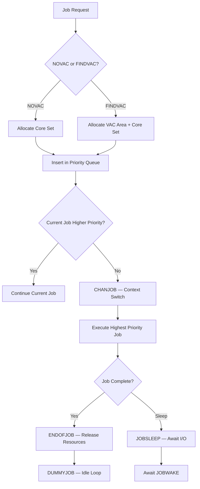
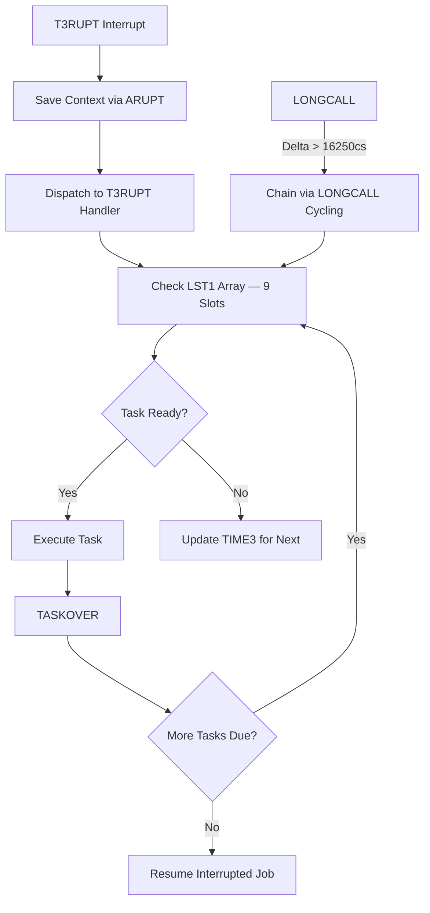
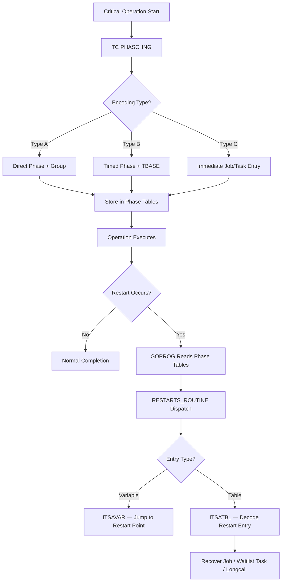
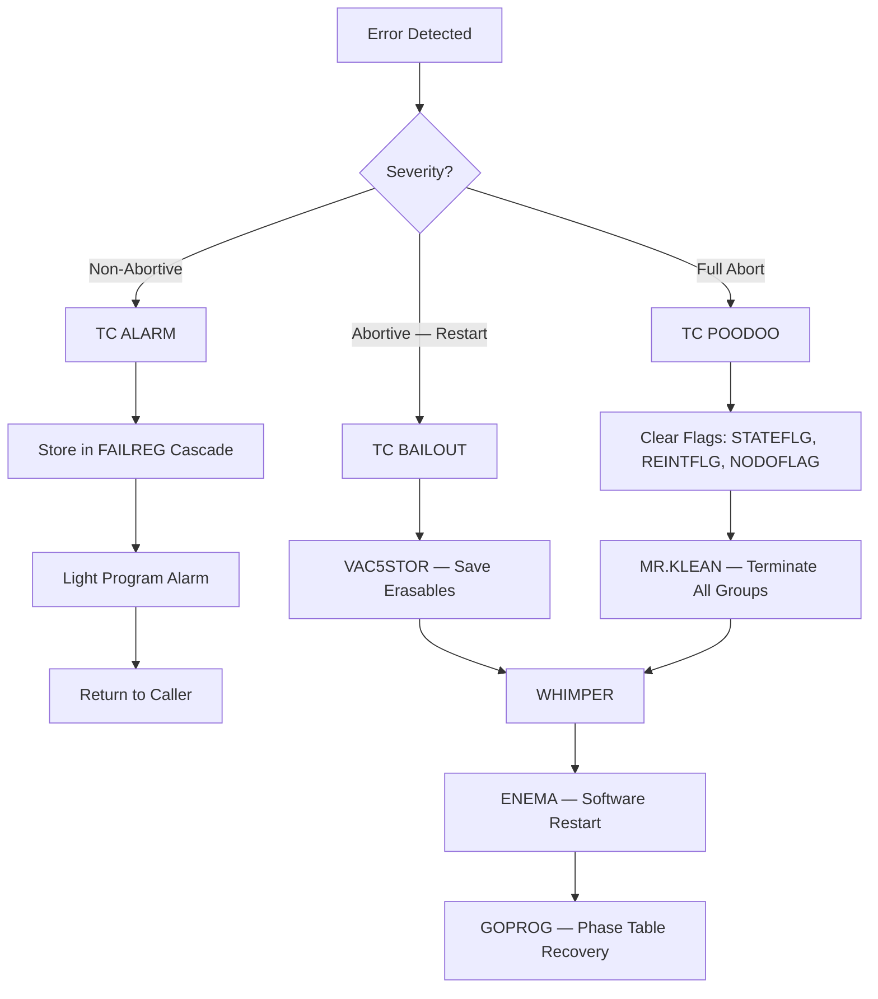
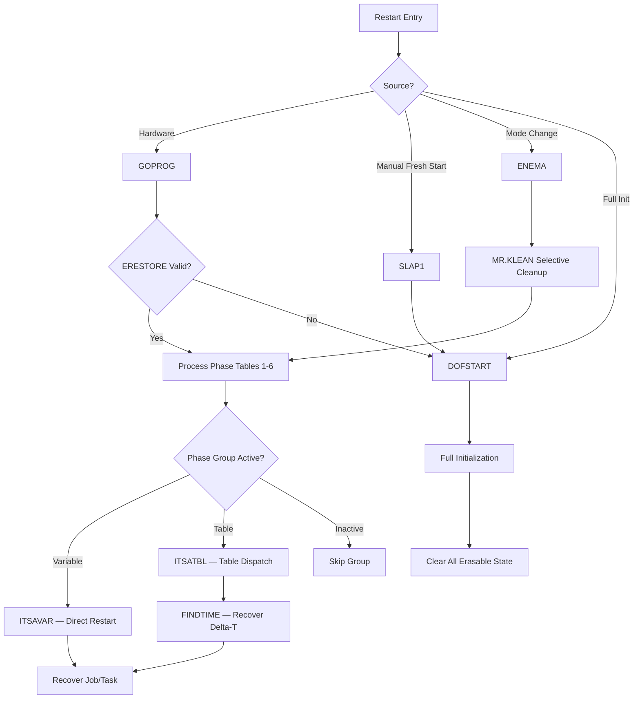

# Apollo 11 AGC: Engineering Tradeoffs and Architectural Decisions

This report is a read-only architectural analysis of the Apollo 11 Guidance Computer (AGC) source code. It documents engineering tradeoffs, design constraints, and architectural decisions embedded in the flight software, drawing evidence exclusively from the repository's AGC assembly source files. No source code has been modified.

**Scope**: Analysis is limited strictly to `Comanche055/*.agc` (Command Module / Colossus 2A, assembled April 1, 1969) and `Luminary099/*.agc` (Lunar Module / Luminary 1A, assembled July 14, 1969). The repository contains 175 `.agc` source files totaling approximately 130,186 lines of code — two parallel implementations sharing core architecture but diverging where mission requirements demanded. `Comanche055/` comprises 85 source files (84 included modules plus MAIN.agc); `Luminary099/` comprises 90 (89 included modules plus MAIN.agc). Ground systems, hardware schematics, and non-AGC artifacts are excluded.

## 1. Memory and Resource Constraints

The AGC operated within 36,864 words of fixed (core-rope) ROM and 2,048 words of erasable RAM — shared across navigation, guidance, autopilot, crew display, and every other function of the flight computer. Every architectural decision in the codebase traces back to this constraint.

### Core-Rope Memory and Bank-Switching

Fixed memory was organized into banks, with only 1K words directly addressable at a time. Every cross-bank subroutine call required an explicit bank-switching sequence. The `BANKCALL` routine (`Comanche055/INTER-BANK_COMMUNICATION.agc`, line 41) saves the caller's A and L registers into `BUF2`, extracts the target CADR, switches the FBANK register, and dispatches via indirect `TC`. The companion `SWCALL` (line 48) performs the same operation when the CADR arrives in the accumulator rather than inline. Return is handled by `SWRETURN` (line 56), which restores FBANK from `BUF2+1`.

This overhead — save registers, extract sub-address, switch bank, indirect jump, then reverse on return — executes on **every** cross-module function call. It is the direct architectural cost of fitting 36KB of flight software into a banked memory model. `POSTJUMP` (line 64) and `BANKJUMP` (line 70) provide unilateral jump variants that preserve A and L without return linkage, used where subroutine return is unnecessary.

Beyond 32 fixed banks, superbank addressing extends the address space through channel 07. The `SUPERSW` routine (line 176) writes superbank select bits to channel 07, enabling access to banks 30-67 (superbanks SB3 through SB6). The `SUPDACAL` routine (line 84) handles data access across superbank boundaries, requiring interrupt inhibition because the hardware does not save superbank state across interrupts.

### Erasable Register Allocation and Sharing

The 2,048-word erasable memory required meticulous allocation tracked across thousands of lines of assignment directives. `Comanche055/ERASABLE_ASSIGNMENTS.agc` spans 3,785 lines; `Luminary099/ERASABLE_ASSIGNMENTS.agc` spans 2,635 lines — the difference reflecting divergent mission-phase requirements (CM handles reentry trajectory; LM handles powered descent and ascent).

A self-documenting notation system embedded in comments (`Comanche055/ERASABLE_ASSIGNMENTS.agc`, lines 66-95) classifies every register:

| Code | Meaning | Example |
| ---- | ------- | ------- |
| **M** (Mobility) | `B` = bank-sensitive (basic instructions), `I` = bank-insensitive (interpretive only) | `B(2)PRM` |
| **SIZE** | Number of registers in the group | `(6)` = six registers |
| **N** (Nature) | `PL` = pad loaded, `DSP` = display, `PRM` = permanent, `TMP` = temporary/scratch, `IN` = input, `OUT` = output | `TMP` |

The `EQUALS` directive serves double duty. For **movable groups** (lines 44-54), it chains consecutive allocations so that relocating a block requires changing only one address: `X EQUALS START`, `Y EQUALS X +SIZE.X`, `Z EQUALS Y +SIZE.Y`. For **register sharing** (lines 56-59), it maps different symbolic names to the same physical register — different routines, different data, same hardware location. This sharing was essential to fit within 2,048 words but required careful coordination to prevent conflicts between concurrently active routines.

Special registers occupy hardwired addresses: `A=0`, `L=1`, `Q=2`, `Z=5`, `BBANK=6` (lines 101-107). The `NEWJOB` register at location 67 is particularly significant — the interrupt-driven priority check uses this hardwired address to determine whether a higher-priority job is waiting, enabling preemptive scheduling without a software lookup.

### Interpretive Language as Memory Compression

The AGC Interpreter (`Comanche055/INTERPRETER.agc`, `Luminary099/INTERPRETER.agc`) implements a compact pseudo-instruction set for double-precision vector and matrix arithmetic. Interpretive code packs roughly twice the functionality per word compared to basic instructions for math-heavy navigation and guidance routines. The tradeoff is execution speed — interpretive code runs significantly slower — but for trajectory calculations that are computationally complex but not time-critical at the instruction level, the memory savings were decisive. The majority of guidance equations (powered flight, orbital mechanics, rendezvous targeting) are written in interpretive code for this reason. Fixed memory bank layout is governed by `SETLOC` directives cataloged in `Comanche055/TAGS_FOR_RELATIVE_SETLOC.agc` and `Luminary099/TAGS_FOR_RELATIVE_SETLOC.agc`, which define the logical-to-physical bank mapping for every code section. Shared numeric constants reside in `Comanche055/FIXED_FIXED_CONSTANT_POOL.agc` and `Luminary099/FIXED_FIXED_CONSTANT_POOL.agc` — a single location in fixed-fixed (non-banked) memory accessible from any bank without switching overhead, reducing both code size and call latency for frequently used values.

### CM vs. LM Erasable Budget

The CM's 3,785-line erasable allocation versus the LM's 2,635 lines reflects fundamentally different operational profiles. Comanche055 carries 85 source files handling reentry guidance, star-based navigation for cislunar flight, and service module separation sequences. Luminary099 carries 90 source files (more program modules) but requires fewer erasable registers because the LM's operational phases — powered descent, lunar stay, and ascent — are shorter-duration and more sequential, allowing greater register reuse between phases.

## 2. Real-Time Scheduling and Priority Architecture

The AGC implemented priority-based preemptive multitasking in approximately 1,000 words of code, managing concurrent navigation, guidance, autopilot, and crew-interface tasks on a 2 MHz single-core processor with no hardware memory protection.

### Executive: Priority-Based Job Scheduling

The Executive manages long-running **jobs** — computations that may span many instruction cycles and can be preempted. Two entry points create jobs:

- **NOVAC** (`Comanche055/EXECUTIVE.agc`, line 37): Creates a job that requires no VAC (Vector Accumulator) area — used for basic-instruction-only jobs
- **FINDVAC** (line 52): Creates a job that requires a VAC area — used for jobs containing interpretive code, which needs the multi-purpose accumulator workspace

FINDVAC sequentially checks five VAC areas (`VAC1USE` through `VAC5USE`, lines 134-144). If all five are occupied, it triggers `BAILOUT` with alarm `OCT 01201` (line 145-146) — the famous "Executive overflow — no VAC areas" alarm.

After securing resources, `NOVAC2` (line 154) scans core sets to find a free slot. The CM provides **7 core sets** (`NO.CORES DEC 6` at line 161 — six scannable plus the currently running job's set). The LM provides **8 core sets** (`NO.CORES DEC 7`, `Luminary099/EXECUTIVE.agc`, line 162) — the additional core set accommodating the heavier concurrent workload during powered descent, where landing guidance, radar processing, and crew display all compete for Executive resources. If no core sets are available, `BAILOUT` fires with alarm `OCT 01202` (line 204-205) — "Executive overflow — no core sets."

**CHANJOB** (`Comanche055/EXECUTIVE.agc`, line 211) performs context switching by swapping the contents of core set 0 (the active set) with the highest-priority waiting job's core set. This includes the location counter, bank registers, multi-purpose accumulator (MPAC through MPAC+6), push-down pointer, and priority — a complete context save/restore in approximately 30 instructions.

**JOBSLEEP** (line 90) and **JOBWAKE** (line 97) provide voluntary suspension for I/O-bound jobs. A sleeping job retains its core set but yields execution until explicitly awakened, preventing busy-wait loops from consuming CPU cycles needed by higher-priority tasks.

**ENDOFJOB** (line 117) releases the job's core set and VAC area. When no jobs are ready, control falls to **DUMMYJOB** (line 455 CM, line 464 LM), which sets `NEWJOB` to negative zero for idling and toggles the computer activity light off — a visible heartbeat indicating the Executive is alive but idle.

### CM vs. LM Core Set Allocation

| Property | Comanche055 (CM) | Luminary099 (LM) |
| -------- | ----------------- | ----------------- |
| `NO.CORES` constant | `DEC 6` (7 total) | `DEC 7` (8 total) |
| VAC areas | 5 | 5 |
| Source | `Comanche055/EXECUTIVE.agc`, line 161 | `Luminary099/EXECUTIVE.agc`, line 162 |
| Rationale | Cislunar navigation workload | Powered descent concurrent demands |

The LM's extra core set was added because the landing phase runs guidance, radar processing, and crew display simultaneously — a workload density that would saturate seven core sets. The LM also uses `BAILOUT1` (`Luminary099/ALARM_AND_ABORT.agc`, line 189) instead of `BAILOUT` for overflow alarms, accepting the alarm code through a `DXCH ALMCADR` calling convention rather than inline — a minor interface difference reflecting independent development of the two modules.

### Waitlist: Timer-Driven Task Scheduling

The Waitlist manages short-duration **tasks** — time-critical operations that execute to completion without preemption, driven by the T3RUPT hardware timer interrupt. The `LST1`/`LST2` arrays hold up to **9 concurrent timer tasks**, each with a delta-time and dispatch address.

The T3RUPT interrupt vector (`Comanche055/INTERRUPT_LEAD_INS.agc`, lines 51-54; mirrored in `Luminary099/INTERRUPT_LEAD_INS.agc`) saves context via `DXCH ARUPT`, loads the T3RUPT bank via `CAF T3RPTBB`, and dispatches to the handler. The same interrupt vector table defines all ten hardware interrupts (T6RUPT through hand controller) at `SETLOC 4000`, with the GOPROG restart vector occupying the first slot (lines 36-39). Tasks are scheduled via `TWIDDLE`, `FIXDELAY`, and `VARDELAY` — each placing a task-address/delta-time pair into the sorted LST1/LST2 structure.

**LONGCALL** extends the Waitlist beyond its native 16,250-centisecond (162.5-second) range by chaining successive waitlist entries, enabling delays of arbitrary duration.

If all 9 task slots are full, the system triggers `WTABORT` with alarm `OCT 01203` — annotated with the comment `# NO ROOM IN THE INN.` (`Comanche055/WAITLIST.agc`, line 339). The LM Waitlist (`Luminary099/WAITLIST.agc`) adds a `FILLED` routine for overflow handling and alternate `WAITPOOH`/`LONGPOOH` error paths that route through `POODOO1` with alarm `OCT 01204`.

### Phase Table Restart Protection

The phase table system (`Comanche055/PHASE_TABLE_MAINTENANCE.agc`, with LM counterpart `Luminary099/PHASE_TABLE_MAINTENANCE.agc`) is the AGC's mechanism for surviving restarts without losing critical work. Before each significant operation, code calls `PHASCHNG` to record the current execution phase in one of six phase groups. Three encoding types handle different restart scenarios:

- **Type A**: Direct phase value and group — records a restart point for variable-address recovery
- **Type B**: Timed phase with `TBASE` reference — enables delta-time recovery for timer-dependent operations
- **Type C**: Immediate job/task entry — records a complete restart table entry for table-driven recovery

`2PHSCHNG` (dual phase change) atomically updates two groups when an operation spans multiple restart domains. `NEWMODEX` (line 39) updates the DSKY program display on mode changes.

This system is what made the 1202/1201 alarm recovery possible during the Apollo 11 landing. When Executive overflow triggered a software restart, the restart routine read the phase tables and re-established only those jobs and tasks that had recorded their phase — effectively shedding unprotected low-priority work while preserving mission-critical guidance.

### The 1202/1201 Alarm Mechanism

The alarms that nearly aborted the Apollo 11 lunar landing trace directly to the Executive's resource exhaustion detection:

- **OCT 01201**: FINDVAC exhausts all 5 VAC areas → `BAILOUT` (`Comanche055/EXECUTIVE.agc`, lines 145-146)
- **OCT 01202**: Core set scan finds no free sets → `BAILOUT` (lines 204-205)
- **OCT 01203**: Waitlist overflow → `WTABORT` (`Comanche055/WAITLIST.agc`, lines 339-340)

During descent, the rendezvous radar — its processing logic located in `Luminary099/P20-P25.agc` — was left in an auto-track mode that generated a stream of interrupts spawning Executive jobs competing with landing guidance (driven by `Luminary099/SERVICER.agc` and `Luminary099/THE_LUNAR_LANDING.agc`) for core sets and VAC areas. The resulting 1202 alarms triggered software restarts. Because the landing guidance had properly called `PHASCHNG` before each critical computation, the restart routine recovered it. The rendezvous radar tasks, lacking restart protection, were shed — exactly the designed behavior.

## 3. Error Handling and Recovery Philosophy

The AGC's error handling philosophy prioritized **availability over correctness** — the computer must never stop, because stopping during powered flight means mission abort or loss of crew. Every error path ultimately leads back to a running system, even if that system has shed functionality.

### Three-Tier Alarm Hierarchy

The alarm system implements three severity levels, each with distinct behavior:

**Tier 1 — ALARM** (`Comanche055/ALARM_AND_ABORT.agc`, line 53): Non-abortive. Stores the alarm code in the FAILREG cascade, lights the program alarm indicator, and **returns to the caller**. The calling program continues execution. Used for conditions that are abnormal but not dangerous — the crew is informed but the software proceeds.

**Tier 2 — BAILOUT** (line 143): Abortive with restart. Saves five erasable registers via `VAC5STOR` for post-flight debugging, then falls through to `WHIMPER` (line 156), which forces a software restart via `ENEMA`. The current job is terminated but the system recovers through phase table processing. Used for resource exhaustion (no VAC areas, no core sets) where continuing is impossible but the system can restart and recover.

**Tier 3 — POODOO** (line 166): Full abort. Clears state flags (`STATEFLG`, `REINTFLG`, `NODOFLAG`), calls `MR.KLEAN` to terminate all restart groups, then enters `WHIMPER` for restart. Unlike BAILOUT, POODOO wipes the restart protection state — the system restarts clean rather than recovering in-progress work. Used for conditions so severe that recovering the current operational state would be dangerous.

**WHIMPER** (line 156) is the common restart entry point shared by both BAILOUT and POODOO — its name an allusion to T.S. Eliot. It manipulates the `BRUPT` register and executes `RESUME` to force control through `POSTJUMP` to `ENEMA`.

**CURTAINS** (line 205) handles unrecoverable software faults (alarm `OCT 00217` — "Bad return from IMUSTALL"). Despite the dramatic name, it returns to the caller — even a fatal error condition does not halt the computer.

### LM-Specific Alarm Differences

The Lunar Module's `ALARM_AND_ABORT.agc` introduces several adaptations reflecting the LM's more complex operational environment:

- **BAILOUT1** / **POODOO1** (`Luminary099/ALARM_AND_ABORT.agc`, lines 189, 197): Alternate entry points accepting the alarm code via `DXCH ALMCADR` rather than inline after the `TC` — a calling convention used when the alarm code must be computed rather than literal.

- **GOPOODOO** (line 162): LM-specific abort handler that checks whether the SERVICER (guidance computation loop) is running by testing `V37FLBIT` in `FLAGWRD7`. If SERVICER is active, GOPOODOO routes to `STRTIDLE` → `SERVIDLE` to safely idle the guidance loop before cleanup, rather than executing the full `MR.KLEAN` cascade. This prevents aborting mid-guidance-cycle, which could leave the LM in an uncontrolled attitude.

- **Default abort severity differs**: `ABORT EQUALS BAILOUT` in CM (line 230) versus `ABORT EQUALS WHIMPER` in LM (line 234). The LM defaults to a softer abort because the consequences of a full POODOO during powered descent are more severe — the LM has no abort tower and limited abort windows.

### FAILREG Cascade

The alarm code storage system (`Comanche055/ALARM_AND_ABORT.agc`, lines 74-105) implements a three-deep FIFO:

1. **CHKFAIL1** (line 74): Check `FAILREG` — if empty, store alarm code and light the program alarm via `PROGLARM`
2. **CHKFAIL2** (line 79): If FAILREG occupied, check `FAILREG+1` — store if empty
3. **FAIL3** (line 84): If both occupied, check `FAILREG+2` — store if empty
4. **MULTFAIL** (line 101): If all three full, OR the latest code with `BIT15` into `FAILREG+2` — the overflow bit signals to ground that alarm codes have been lost

`PROGLARM` (line 92) lights the program alarm on `DSPTAB+11D` only for the **first** alarm — subsequent alarms store silently to avoid display thrashing.

### Four Restart Pathways

`Comanche055/FRESH_START_AND_RESTART.agc` (and its LM counterpart `Luminary099/FRESH_START_AND_RESTART.agc`) defines four entry points into system initialization, ordered from most destructive to most conservative:

| Pathway | Entry | Trigger | Behavior |
| ------- | ----- | ------- | -------- |
| **SLAP1** | Manual fresh start | Crew-initiated | Full initialization, clears fail registers and restart counter |
| **DOFSTART** | Machine fresh start | Unrecoverable errors | Clears all phase tables, reinitializes all flags, enters DUMMYJOB |
| **GOPROG** | Hardware restart | Power transient, watchdog | Validates `ERESTORE`, processes phase tables, recovers active groups |
| **ENEMA** | Software restart | BAILOUT/POODOO via WHIMPER | Selective cleanup, kills integration-waiting programs, processes phase tables |

**GOPROG** (line 290) is the critical restart path. It increments the restart counter, stores erasables for debugging via `VAC5STOR`, checks hardware status (oscillator fail, AGC warning), and — if erasable memory passes validation — proceeds to process phase tables and recover active jobs and tasks. If phase table validation fails, it displays alarm `OCT 01107` ("Phase table failure — erasable memory suspect", `Luminary099/ASSEMBLY_AND_OPERATION_INFORMATION.agc`, line 964) and falls through to DOFSTART.

**MR.KLEAN** (`Comanche055/FRESH_START_AND_RESTART.agc`, line 264) is the group termination cascade. It zeroes phase tables for groups 2, 4, 1, 3, 5, and 6 in sequence — the ordering ensures that the most critical groups (2 and 4, typically guidance) are terminated first to establish a known state before cleaning up auxiliary groups. **P00KLEAN** and **V37KLEAN** (lines 268, 274) are partial-cascade entry points for less destructive cleanup.

### Phase Group Restart Dispatch

`Comanche055/RESTARTS_ROUTINE.agc` (and the corresponding `Luminary099/RESTARTS_ROUTINE.agc`) processes each active phase group after a restart:

- **ITSAVAR** (line 69): Variable restart — the phase table contains a direct 2CADR address. The routine loads the restart address from `PHSNAMEx` and jumps to it. Used when the restart point is a fixed location in code.

- **ITSATBL** (line 178): Table restart — the phase value encodes an index into `Comanche055/RESTART_TABLES.agc` (and its LM counterpart `Luminary099/RESTART_TABLES.agc`), which contains structured entries specifying whether to restart as a job (via FINDVAC or NOVAC), a waitlist task, or a longcall. Each restart group has two table forms (even and odd phases), with priority encoding using sign convention (+FINDVAC, -NOVAC) and longcall entry format for extended-duration recovery. **FINDTIME** recovers the elapsed delta-time from `TBASE`/`LONGBASE` registers to re-establish timer-dependent tasks at the correct point in their timing sequence.

### CCSHOLE: Defensive Programming Pattern

The CCS (Count, Compare, and Skip) instruction has four branches: positive, +0, negative, -0. In many uses, one or more branches represent "impossible" states. Rather than leaving these branches as dead code, the AGC programmers routed every impossible CCS branch to `CCSHOLE` (`Comanche055/ALARM_AND_ABORT.agc`, line 197), which triggers alarm `OCT 01103` ("Unused CCS branch executed"). This transforms undefined behavior into a detectable, diagnosable alarm — a defensive programming pattern that converts silent corruption into visible failure.

### The DOALARM Equivalence

`DOALARM EQUALS ENDOFJOB` (`Comanche055/ALARM_AND_ABORT.agc`, line 211; `Luminary099/ALARM_AND_ABORT.agc`, line 212). This symbolic equivalence captures the AGC error philosophy in a single line: when the alarm display routine completes, it simply ends the current job. The alarm *is* the job's conclusion. There is no error recovery handler, no retry logic, no exception propagation — the system alarms, the crew is notified, and the computer moves on to the next job. Alarm and proceed.

## 4. Naming Conventions and Inline Documentation

In a system where labels were limited to approximately six characters and inline comments were the sole documentation layer, the AGC programmers developed a naming culture that served as mnemonic aid, severity indicator, and institutional knowledge — often simultaneously.

### Cultural and Literary References

**BURN BABY BURN** (`Luminary099/BURN_BABY_BURN--MASTER_IGNITION_ROUTINE.agc`): The Master Ignition Routine's name traces to DJ Magnificent Montague, whose catchphrase "Burn, baby! BURN!" was the voice of soul music in 1960s Los Angeles (lines 33-44 header comments). Peter Adler and Don Eyles chose this name for the routine that handles APS/DPS engine ignition for programs P12, P40, P42, P61, and P63. The name made the most critical routine in the LM — the one that lights the descent engine — immediately recognizable in code listings and alarm reports.

**PINBALL** (`Comanche055/PINBALL_GAME_BUTTONS_AND_LIGHTS.agc`, line 37): The DSKY keyboard-and-display interface, formally "Keyboard and Display Program," was nicknamed PINBALL after the arcade game. The verb-noun command structure (V35, N69, etc.) resembled a game interface more than a flight computer, and the name stuck through the entire development cycle.

**FLAGORGY** (`Luminary099/THE_LUNAR_LANDING.agc`, line 64): The lunar landing initialization sequence that sets up all required flags before powered descent. The comment reads `# DIONYSIAN FLAG WAVING` — the programmers were fully aware of the label's implications and doubled down with the classical allusion.

### Latin and Literary Phrases as Maintainer Warnings

`HONI SOIT QUI MAL Y PENSE` ("Shame on him who thinks evil of it") appears at line 66 of the BURN BABY BURN routine header — defending the unconventional table-driven design of the ignition routine against skeptical reviewers.

`NOLI SE TANGERE` ("Do not touch") at line 72 warns maintainers not to modify the ignition tables that follow. These are not decorative comments. They are warnings encoded in a form that commands attention precisely because they are unexpected in assembly code — a programmer who encounters Latin in a flight computer listing will stop and read carefully, which is the intent.

### Abort Naming as Severity Hierarchy

The alarm routine names form an intuitive severity scale communicated entirely through naming:

| Label | Allusion | Severity | Source |
| ----- | -------- | -------- | ------ |
| **ALARM** | Neutral | Non-abortive, returns to caller | `Comanche055/ALARM_AND_ABORT.agc`, line 53 |
| **BAILOUT** | Emergency exit | Abortive, software restart | Line 143 |
| **POODOO** | Expletive (scatological) | Full abort, wipes restart state | Line 166 |
| **WHIMPER** | T.S. Eliot ("not with a bang but a whimper") | Common restart entry | Line 156 |
| **CURTAINS** | Theatrical ("it's curtains for you") | Fatal hardware error | Line 205 |

The progression from ALARM through BAILOUT to POODOO to CURTAINS conveys escalating severity without consulting documentation. A programmer encountering `TC POODOO` immediately understands this is worse than `TC BAILOUT`, which is worse than `TC ALARM` — the names carry their own documentation.

### Sardonic Humor as Documentation Layer

Comments throughout the codebase use humor as a mnemonic device:

- `# NO ROOM IN THE INN.` — Biblical allusion annotating waitlist overflow (`Comanche055/WAITLIST.agc`, line 339). The waitlist is full; there is no space for a new task, just as there was no room at the inn.

- `# OFF TO SEE THE WIZARD...` — The Wizard of Oz reference marking the jump to `BURNBABY` at the end of lunar landing initialization (`Luminary099/THE_LUNAR_LANDING.agc`, line 254). The landing program has done its preparation; now it hands off to the ignition routine, hoping for the best.

- `# PLEASE CRANK THE SILLY THING AROUND` — Annotating the crew prompt to reposition the landing radar antenna (line 245-246). A V50N25 display asks the astronaut to manually adjust hardware — the comment captures the programmer's mild exasperation at requiring human intervention in an automated sequence.

- **ENEMA** (`Comanche055/FRESH_START_AND_RESTART.agc`, line 393) — The software restart that "cleanses" system state. The medical metaphor is deliberately uncomfortable and therefore memorable.

- **MR.KLEAN** (line 264) — The cleanup routine that terminates restart groups. Named after the cleaning product mascot, immediately communicating its purpose: it cleans everything out.

- `DOALARM EQUALS ENDOFJOB` — The alarm display routine is literally defined as the end of the job. When an alarm fires, the job's work is done. The equivalence is both technically accurate and philosophically revealing.

### M/SIZE/N Erasable Notation

The erasable assignment notation (`Comanche055/ERASABLE_ASSIGNMENTS.agc`, lines 66-95) is itself a naming convention — a compact self-documenting classification system that made 3,785 lines of register assignments navigable. A comment like `B(2)PRM` instantly communicates: bank-sensitive, two registers, permanent allocation. Without this convention, maintaining the erasable memory map across multiple development teams would have been impractical.

### Readability Under Label Length Constraints

AGC labels were limited to approximately six characters, forcing aggressive abbreviation. The programmers compensated with maximally informative abbreviations: `CHANJOB` (change job), `NEWPRIO` (new priority), `ALMCADR` (alarm CADR), `BANKSET` (bank setting), `PHASCHNG` (phase change). These pack maximum semantic content into minimum characters. Where abbreviation was insufficient, comments filled the gap — every routine begins with a block comment explaining its purpose, calling sequence, and return conventions.

## 5. Modern Context

The AGC's 1960s design patterns anticipate several contemporary software engineering concepts, arriving at similar solutions from constraints far more extreme than any modern system faces.

### Load Shedding and Priority Inversion

The BAILOUT mechanism on Executive overflow (`OCT 01202`) is functionally **load shedding** — when demand exceeds capacity, the system discards lower-priority work to preserve critical functions. The Apollo 11 landing's 1202 alarms are the canonical example: the computer shed rendezvous radar tasks to maintain landing guidance. Modern systems implement the same pattern through Kubernetes pod eviction under resource pressure, circuit breakers that reject excess requests, and backpressure mechanisms in streaming systems. The AGC's approach was more dramatic — a full software restart rather than selective rejection — but the principle is identical: when overloaded, shed non-essential work to protect essential functions.

### Watchdog and Heartbeat Patterns

DUMMYJOB's activity light toggle (`Comanche055/EXECUTIVE.agc`, line 455; `Luminary099/EXECUTIVE.agc`, line 464) is a **heartbeat indicator**. When the Executive has no jobs to run, DUMMYJOB turns off the computer activity light; when a new job arrives, it turns the light back on. Mission Control could monitor this light to confirm the Executive was cycling normally. Modern equivalents include health-check endpoints in web services, hardware watchdog timers in embedded systems, and Kubernetes liveness probes — all serving the same purpose of providing external visibility into a system's operational status.

### Graceful Degradation Under Load

The restart protection system (phase tables + restart groups + RESTARTS_ROUTINE) implements **graceful degradation by design**. When the system restarts, only tasks that registered their phase via `PHASCHNG` are recovered. Unprotected tasks are silently discarded. This is not a bug — it is the intended behavior, ensuring that overload causes degraded functionality rather than total failure. Modern microservice architectures implement similar patterns through bulkhead isolation (failing components do not cascade), circuit breakers (repeated failures trigger fallback behavior), and graceful degradation strategies (serving cached content when backends are unavailable).

### Phase-Based Checkpointing vs. Write-Ahead Logging

`PHASCHNG` (`Comanche055/PHASE_TABLE_MAINTENANCE.agc`) records the current execution phase before each critical operation. On restart, `RESTARTS_ROUTINE` (`Comanche055/RESTARTS_ROUTINE.agc`) reads phase tables and dispatches to the appropriate recovery point via `ITSAVAR` or `ITSATBL`. This is functionally equivalent to **write-ahead logging (WAL)** in modern databases — record the intent before performing the action, so that recovery can replay or resume from the last recorded state. The tradeoff is granularity: WAL records individual operations; the AGC's phase system records only major checkpoints. But WAL requires orders of magnitude more storage than the AGC had available. The phase table system achieves reliable recovery using six pairs of registers — roughly 12 words of erasable memory.

### Resource Pool Exhaustion Strategies

The AGC's response to VAC area exhaustion (`OCT 01201`) and core set exhaustion (`OCT 01202`) follows a **detect → alarm → restart → recover** pattern. Modern systems face analogous resource exhaustion: thread pool exhaustion, connection pool depletion, memory pressure triggering OOM killers. The key insight embedded in the AGC design is that for real-time systems, **queuing is not an acceptable response to exhaustion** — a navigation computation that arrives 500 milliseconds late is worse than one that never runs, because stale guidance commands can send the vehicle in the wrong direction. The AGC chose restart over queuing because bounded-time recovery through restart protection was more predictable than unbounded queuing delay.

## Appendix: Key Alarm Codes Reference

The following table catalogs critical alarm codes from `Luminary099/ASSEMBLY_AND_OPERATION_INFORMATION.agc` (lines 900-1021). Severity markers follow the conventions defined in the source.

| Code (OCT) | Severity | Description | Source Module |
| ---------- | -------- | ----------- | ------------- |
| 00105 | ** | AOTMARK system in use | AOTMARK |
| 00206 | — | Zero encode not allowed with coarse align + gimbal lock | IMU Mode Switching |
| 00210 | — | IMU not operating | IMU Mode Switch, IMU-2, RD2, P51, P57 |
| 00217 | — | Bad return from IMUSTALL | P51, P52, P57 |
| 00401 | — | Desired gimbal angle yields gimbal lock | INF Align, IMU-2, FINDCDUW |
| 00421 | — | W-matrix overflow | INTEGRV |
| 00430 | ** | Acceleration overflow in integration | Orbital Integration |
| 00501 | P | Radar antenna out of limits | R23 |
| 00607 | ** | No solution from TIME-THETA or TIME-RADIUS | TIMETHET, TIMERAD |
| 01102 | — | AGC self test error | Self Check (`Luminary099/AGC_BLOCK_TWO_SELF_CHECK.agc`) |
| 01103 | ** | Unused CCS branch executed (CCSHOLE) | Abort |
| 01104 | * | Delay routine busy | Exec |
| 01105 | — | Downlink too fast | T4RUPT |
| 01107 | — | Phase table failure — erasable memory suspect | Restart |
| 01201 | * | Executive overflow — no VAC areas | Exec |
| 01202 | * | Executive overflow — no core sets | Exec |
| 01203 | * | Waitlist overflow — too many tasks | Waitlist |
| 01204 | ** | Waitlist/VARDELAY/FIXDELAY/LONGCALL called with zero or negative delta-time | Waitlist Routines |
| 01206 | ** | Second job attempts to go to sleep via keyboard and display program | Pinball |
| 01207 | * | No VAC areas for marks | AOTMARK |
| 01210 | * | Two programs using device at same time | Mode Switching |
| 01301 | — | ARCSIN-ARCCOS argument too large | Interpreter |
| 01302 | ** | SQRT called with negative argument | Interpreter |
| 01406 | —/\*\* | Bad return from ROOTPSRS — non-abortive in Descent Guidance EQS., abortive (\*\*) during Ignition Algorithm | Descent Guidance / Ignition Algorithm |
| 01501 | ** | Keyboard and display alarm during internal use (NVSUB) | Pinball |
| 01520 | — | V37 request not permitted at this time | V37 |
| 02000 | * | DAP still in progress at next TIMES RUPT | DAP (`Luminary099/DAPIDLER_PROGRAM.agc`) |

**Severity Legend** (source: `Luminary099/ASSEMBLY_AND_OPERATION_INFORMATION.agc`, lines 1014-1021):

| Marker | Meaning |
| ------ | ------- |
| `*` | Abort code resulting in software restart |
| `**` | More serious abort code resulting in program going to R00 |
| `P` | Priority alarm |
| `—` | Non-abortive |
