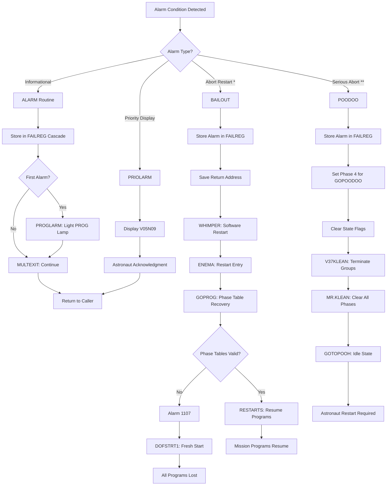

# Alarm Reference for AGC Fault Recovery

Technical reference documentation for recovery-related Apollo Guidance Computer (AGC) alarm codes. This document provides detailed analysis of alarms 1107, 1201, 1202, and 1203—the critical alarms related to the fault recovery and restart system.

**Modern Equivalent**: This document covers exceptions and error conditions in the AGC's priority-based job scheduler and state checkpointing systems.

---

## Table of Contents

1. [Overview](#overview)
2. [Alarm Code Format](#alarm-code-format)
3. [Executive Overflow Alarms (1201/1202)](#executive-overflow-alarms-12011202)
   - [Alarm 1201: No VAC Areas](#alarm-1201-no-vac-areas)
   - [Alarm 1202: No Core Sets](#alarm-1202-no-core-sets)
   - [Root Cause Analysis](#root-cause-analysis)
   - [Impact on Priority Queue](#impact-on-priority-queue)
   - [Historical Apollo 11 Context](#historical-apollo-11-context)
4. [Phase Table Failure Alarm (1107)](#phase-table-failure-alarm-1107)
   - [Detection Mechanism](#detection-mechanism)
   - [Fresh Start Trigger](#fresh-start-trigger)
5. [Waitlist Overflow Alarm (1203)](#waitlist-overflow-alarm-1203)
6. [Recovery Actions vs Abort Conditions](#recovery-actions-vs-abort-conditions)
   - [BAILOUT: Software Restart with Alarm](#bailout-software-restart-with-alarm)
   - [POODOO: Program Abort to Idle](#poodoo-program-abort-to-idle)
   - [Alarm Classification System](#alarm-classification-system)
7. [Alarm Display Flow](#alarm-display-flow)
8. [FAILREG Cascade Mechanism](#failreg-cascade-mechanism)
9. [Alarm Handling Decision Flowchart](#alarm-handling-decision-flowchart)
10. [Terminology Reference](#terminology-reference)
11. [Cross-References](#cross-references)

---

## Overview

The AGC's fault recovery system includes a comprehensive alarm mechanism that records and displays error conditions. Recovery-related alarms fall into two categories:

1. **Resource Exhaustion Alarms** (1201, 1202, 1203): Triggered when the Executive scheduler or Waitlist manager cannot allocate required resources
2. **State Corruption Alarms** (1107): Triggered when phase table validation detects inconsistency

These alarms interact with the restart system to determine whether the AGC should:

- Continue execution after recording the alarm
- Perform a software restart (BAILOUT)
- Abort to program idle (POODOO)
- Perform a complete fresh start (DOFSTART)

---

## Alarm Code Format

AGC alarm codes follow a structured format documented in the assembly listing:

```text
AAANN

Where:
  AAA = General area code (octal)
  NN  = Specific alarm number within area (octal)
```

**Alarm Classification Markers**:

| Marker | Meaning | Recovery Action |
|--------|---------|-----------------|
| `*` | Abort restart | BAILOUT - software restart with alarm display |
| `**` | Serious abort | Abort to R00 (POODOO) |
| `P` | Priority display | Non-abortive alarm, displayed via PRIOLARM |
| (none) | Informational | Non-abortive, logged in FAILREG only |

Source: Luminary099/ASSEMBLY_AND_OPERATION_INFORMATION.agc:898-900

---

## Executive Overflow Alarms (1201/1202)

The Executive (modern equivalent: Priority-Based Job Scheduler) manages concurrent program execution through two critical resources:

1. **VAC Areas**: Interpretive code work areas (5 available)
2. **Core Sets**: Job context storage registers (7 available in LM, 6 in CM)

When these resources are exhausted, the corresponding alarm is triggered.

### Alarm 1201: No VAC Areas

**Definition**: EXECUTIVE OVERFLOW - NO VAC AREAS

**Trigger Location**: The alarm is raised in `FINDVAC2` when all five VAC areas are in use.

```agc
# Source: Luminary099/EXECUTIVE.agc:133-147
FINDVAC2        TS      EXECTEM1        # (SAVE CALLER'S BANK FIRST.)
                CCS     VAC1USE
                TCF     VACFOUND
                CCS     VAC2USE
                TCF     VACFOUND
                CCS     VAC3USE
                TCF     VACFOUND
                CCS     VAC4USE
                TCF     VACFOUND
                CCS     VAC5USE
                TCF     VACFOUND
                LXCH    EXECTEM1
                CA      Q
                TC      BAILOUT1
                OCT     1201            # NO VAC AREAS.
```

**What are VAC Areas?**

VAC (Vector Accumulator) areas are 43-word blocks of erasable memory used as work areas for interpretive (vector/matrix) code. Programs requiring interpretive computation must be started via `FINDVAC` rather than `NOVAC`.

The five VAC areas provide:

- Temporary storage during interpretive operations
- Push-down list (stack) for nested subroutine calls
- Working registers for vector/matrix calculations

**Trigger Conditions**:

- Five interpretive jobs already running
- New interpretive job requested via `FINDVAC`
- No VAC areas available for allocation

Source: Luminary099/EXECUTIVE.agc:50-60, 133-147

### Alarm 1202: No Core Sets

**Definition**: EXECUTIVE OVERFLOW - NO CORE SETS

**Trigger Location**: The alarm is raised in `NOVAC2`/`NOVAC3` loop when all seven core sets are occupied.

```agc
# Source: Luminary099/EXECUTIVE.agc:155-208
NOVAC2          CAF     ZERO            # NOVAC ENTERS HERE.  FIND A CORE SET.
                TS      LOCCTR
                CAF     NO.CORES        # SEVEN SETS OF ELEVEN REGISTERS EACH.
NOVAC3          TS      EXECTEM2
                INDEX   LOCCTR
                CCS     PRIORITY        # EACH PRIORITY REGISTER CONTAINS -0 IF
                TCF     NEXTCORE        # THE CORESPONDING CORE SET IS AVAILABLE.
NO.CORES        DEC     7
                TCF     NEXTCORE        # AN ACTIVE JOB HAS A POSITIVE PRIORITY
                                        # BUT A DORMANT JOB'S PRIORITY IS NEGATIVE

# ... (core allocation loop)

NEXTCORE        CAF     COREINC
                ADS     LOCCTR
                CCS     EXECTEM2
                TCF     NOVAC3
                LXCH    EXECTEM1
                CA      Q
                TC      BAILOUT1        # NO CORE SETS AVAILABLE.
                OCT     1202
```

**What are Core Sets?**

Core sets are 12-word blocks of erasable memory that store the execution context for each active job:

| Register | Purpose |
|----------|---------|
| LOC | Current program location |
| LOC+1 | Bank information (BANKSET) |
| PRIORITY | Job priority (positive=active, negative=dormant, -0=available) |
| PUSHLOC | Push-down pointer |
| MPAC through MPAC+6 | Multi-purpose accumulator registers |

The Lunar Module Executive supports 7 core sets (DEC 7), while the Command Module supports 6 (DEC 6).

**Trigger Conditions**:

- Seven jobs already registered (active or dormant)
- New job requested via `NOVAC` or `FINDVAC`
- No core set has PRIORITY = -0 (available)

Source: Luminary099/EXECUTIVE.agc:155-208; Comanche055/EXECUTIVE.agc:154-205

### Root Cause Analysis

Executive overflow alarms indicate the job scheduler has run out of capacity. Common causes include:

1. **Too Many Concurrent Programs**: More than 7 programs attempting to run simultaneously
2. **Jobs Not Terminating**: Programs failing to call `ENDOFJOB` after completion
3. **Interrupt Storms**: Rapid interrupts creating jobs faster than completion
4. **Hardware Interference**: External equipment creating unexpected workload

**Resource Capacity Summary**:

| Resource | Quantity | Purpose |
|----------|----------|---------|
| Core Sets | 7 (LM) / 6 (CM) | Job context storage |
| VAC Areas | 5 | Interpretive work areas |
| Waitlist Tasks | 8 | Time-driven task queue |

### Impact on Priority Queue

When BAILOUT is triggered for 1201 or 1202:

1. **Current Job Terminated**: The requesting job cannot be started
2. **Higher-Priority Jobs Preserved**: Jobs with higher priority continue execution
3. **Software Restart Initiated**: BAILOUT causes controlled restart via GOPROG
4. **Phase Tables Consulted**: Restart tables determine which programs resume

The priority-based design ensures that critical guidance programs (higher priority) survive while lower-priority tasks are shed. This was a deliberate design choice that proved crucial during Apollo 11.

### Historical Apollo 11 Context

**The Famous 1202 Alarms During Lunar Landing**

On July 20, 1969, during the Apollo 11 powered descent to the Moon's surface, the AGC displayed multiple 1202 alarms. This is one of the most famous incidents in computing history.

**Timeline of Events**:

- **T-05:17** (5 minutes 17 seconds before touchdown): First 1202 alarm
- Mission Control (Steve Bales, Guidance Officer): "We're GO on that alarm"
- Multiple additional 1202 alarms during descent
- Successful landing at Tranquility Base

**Root Cause**:

The rendezvous radar (used for tracking the Command Module in orbit) was inadvertently left in a mode that caused it to continuously request attention from the AGC. This "radar stealing" consumed Executive resources:

1. Rendezvous radar generated continuous hardware interrupts
2. Each interrupt spawned tasks in the Executive queue
3. Tasks accumulated faster than they could complete
4. Core sets exhausted, triggering 1202 alarms

**Why the Mission Continued**:

The AGC's priority-based design saved the mission:

1. **P63 Guidance Program Priority**: The landing guidance (P63, later P66) ran at priority 37-40
2. **Radar Tasks Priority**: Rendezvous radar tasks ran at lower priority (~20)
3. **BAILOUT Behavior**: When 1202 triggered, BAILOUT terminated the overflow condition
4. **Automatic Recovery**: Phase tables allowed P63 to restart from checkpointed state
5. **Guidance Continuity**: Critical guidance calculations were never lost

The AGC's designers (MIT Instrumentation Laboratory) had built a system that gracefully degraded under overload, shedding lower-priority work to preserve mission-critical functions.

**Lessons for Modern Systems**:

- Priority-based scheduling enables graceful degradation
- State checkpointing allows recovery without data loss
- Alarm systems should distinguish severity levels
- Resource exhaustion should not cause complete system failure

Source: Luminary099/EXECUTIVE.agc:147,208; Luminary099/ASSEMBLY_AND_OPERATION_INFORMATION.agc:966-967

---

## Phase Table Failure Alarm (1107)

**Definition**: PHASE TABLE FAILURE. ASSUME ERASABLE MEMORY IS SUSPECT.

This alarm indicates corruption in the phase table state checkpointing system, suggesting potential erasable memory problems.

### Detection Mechanism

The PCLOOP algorithm validates phase table consistency during restart by checking that each phase register and its complement XOR to produce -0:

```agc
# Source: Luminary099/FRESH_START_AND_RESTART.agc:290-304
GOPROG3         CAF     NUMGRPS         # VERIFY PHASE TABLE AGREEMENTS
PCLOOP          TS      MPAC +5
                DOUBLE
                EXTEND
                INDEX   A
                DCA     -PHASE1         # COMPLEMENT INTO A, DIRECT INTO L.
                EXTEND
                RXOR    LCHAN           # RESULT MUST BE -0 FOR AGREEMENT.
                CCS     A
                TCF     PTBAD           # RESTART FAILURE.
                TCF     PTBAD
                TCF     PTBAD
                CCS     MPAC +5         # PROCESS ALL RESTART GROUPS.
                TCF     PCLOOP
```

**Validation Logic**:

For each restart group (1-6), the algorithm:

1. Loads `-PHASE` register (complement) into A
2. Loads `PHASE` register (direct value) into L
3. Performs `RXOR LCHAN` (XOR operation)
4. Checks result: must be -0 for consistency

If any group fails validation, control transfers to `PTBAD`:

```agc
# Source: Luminary099/FRESH_START_AND_RESTART.agc:347-350
PTBAD           TC      ALARM           # SET ALARM TO SHOW PHASE TABLE FAILURE.
                OCT     1107

                TCF     DOFSTRT1
```

**Why Dual Storage?**

Phase tables store critical restart state. The dual-storage mechanism (PHASE and -PHASE) provides:

- Corruption detection during restart validation
- Protection against single-bit memory errors
- Indication of potential systematic memory failure

### Fresh Start Trigger

Unlike 1201/1202 (which cause BAILOUT), alarm 1107 triggers a complete fresh start via `DOFSTRT1`:

1. **ALARM routine called**: Records 1107 in FAILREG cascade
2. **TCF DOFSTRT1**: Branches to fresh start continuation
3. **Complete Reinitialization**: All programs terminated, state cleared
4. **No Phase Table Recovery**: Cannot trust corrupted phase data

**Implications**:

- All running programs are lost
- Navigation state must be re-established
- Astronaut intervention required to restart mission programs
- Indicates potential hardware or radiation-induced memory issues

Source: Luminary099/FRESH_START_AND_RESTART.agc:290-350; Luminary099/ASSEMBLY_AND_OPERATION_INFORMATION.agc:964-965

---

## Waitlist Overflow Alarm (1203)

**Definition**: WAITLIST OVERFLOW - TOO MANY TASKS

**Classification**: `*` (abort restart via BAILOUT)

The Waitlist manager handles time-driven task scheduling. When the task queue is exhausted, alarm 1203 is triggered.

**Waitlist Capacity**: 8 concurrent tasks

**Trigger Conditions**:

- Eight waitlist tasks already scheduled
- New task requested via `WAITLIST`, `VARDELAY`, or `FIXDELAY`
- No available task slots

**Recovery Behavior**:
Similar to 1201/1202, the BAILOUT mechanism initiates a software restart, allowing phase-protected programs to resume.

Source: Luminary099/ASSEMBLY_AND_OPERATION_INFORMATION.agc:968

---

## Recovery Actions vs Abort Conditions

The AGC distinguishes between alarms that allow continued operation and those requiring restart or abort.

### BAILOUT: Software Restart with Alarm

BAILOUT provides a controlled restart mechanism that:

1. Records the alarm in FAILREG
2. Preserves return address in ALMCADR
3. Performs software restart via WHIMPER/ENEMA
4. Consults phase tables for recovery

```agc
# Source: Luminary099/ALARM_AND_ABORT.agc:133-149
BAILOUT         INHINT
                CA      Q
                TS      ALMCADR

                INDEX   Q
                CAF     0
                TC      BORTENT
OCT40400        OCT     40400

                INHINT
WHIMPER         CA      TWO
                AD      Z
                TS      BRUPT
                RESUME
                TC      POSTJUMP        # RESUME SENDS CONTROL HERE
                CADR    ENEMA
```

**Used By**: Alarms 1201, 1202, 1203, and other `*` classified alarms

### POODOO: Program Abort to Idle

POODOO provides a more severe abort that terminates to idle state:

```agc
# Source: Luminary099/ALARM_AND_ABORT.agc:150-173
POODOO          INHINT
                CA      Q
ABORT2          TS      ALMCADR
                INDEX   Q
                CAF     0
                TC      BORTENT
OCT77770        OCT     77770           # DON'T MOVE

                CAF     OCT35           # 4.35SPOT FOR GOPOODOO
                TS      L
                COM
                DXCH    -PHASE4
GOPOODOO        INHINT
                TC      BANKCALL        # RESET STATEFLG, REINTFLG, AND NODOFLAG.
                CADR    FLAGS
```

POODOO:

1. Records alarm in FAILREG
2. Sets up phase 4 for GOPOODOO restart
3. Clears state flags
4. Terminates all program groups via V37KLEAN/MR.KLEAN
5. Returns to GOTOPOOH (idle state)

**Used By**: `**` classified alarms and critical failures

### Alarm Classification System

| Classification | Marker | Recovery Path | Programs Affected |
|---------------|--------|---------------|-------------------|
| Informational | (none) | Continue | None - logged only |
| Priority Display | `P` | PRIOLARM | None - crew notification |
| Abort Restart | `*` | BAILOUT | Current job terminated |
| Serious Abort | `**` | POODOO | All programs terminated |

---

## Alarm Display Flow

The ALARM routine provides the core alarm handling mechanism:

```agc
# Source: Luminary099/ALARM_AND_ABORT.agc:50-69
ALARM           INHINT

                CA      Q
ALARM2          TS      ALMCADR
                INDEX   Q
                CA      0
BORTENT         TS      L

PRIOENT         CA      BBANK
 +1             EXTEND
                ROR     SUPERBNK        # ADD SUPER BITS.
                TS      ALMCADR +1

LARMENT         CA      Q               # STORE RETURN FOR ALARM
                TS      ITEMP1

CHKFAIL1        CCS     FAILREG         # IS ANYTHING IN FAILREG
                TCF     CHKFAIL2        # YES TRY NEXT REG
                LXCH    FAILREG
                TCF     PROGLARM        # TURN ALARM LIGHT ON FOR FIRST ALARM
```

**ALARM Routine Flow**:

1. **INHINT**: Inhibit interrupts for atomic operation
2. **Save Context**: Store return address (Q) and alarm code
3. **CHKFAIL1**: Check if FAILREG empty, store alarm if so
4. **PROGLARM**: Activate program alarm light on first alarm

**Program Alarm Light Activation**:

```agc
# Source: Luminary099/ALARM_AND_ABORT.agc:85-88
PROGLARM        CS      DSPTAB +11D
                MASK    OCT40400
                ADS     DSPTAB +11D
```

This sets bits in DSPTAB+11D to illuminate the PROG lamp on the DSKY (Display and Keyboard).

---

## FAILREG Cascade Mechanism

The AGC maintains three FAILREG registers to store multiple alarm codes without losing earlier alarms:

```agc
# Source: Luminary099/ALARM_AND_ABORT.agc:66-99
CHKFAIL1        CCS     FAILREG         # IS ANYTHING IN FAILREG
                TCF     CHKFAIL2        # YES TRY NEXT REG
                LXCH    FAILREG
                TCF     PROGLARM        # TURN ALARM LIGHT ON FOR FIRST ALARM

CHKFAIL2        CCS     FAILREG +1
                TCF     FAIL3
                LXCH    FAILREG +1
                TCF     MULTEXIT

FAIL3           CA      FAILREG +2
                MASK    POSMAX
                CCS     A
                TCF     MULTFAIL
                LXCH    FAILREG +2
                TCF     MULTEXIT

MULTFAIL        CA      L
                AD      BIT15
                TS      FAILREG +2
```

**Cascade Logic**:

| Step | Condition | Action |
|------|-----------|--------|
| 1 | FAILREG empty (-0) | Store alarm in FAILREG |
| 2 | FAILREG full, FAILREG+1 empty | Store alarm in FAILREG+1 |
| 3 | Both full, FAILREG+2 empty | Store alarm in FAILREG+2 |
| 4 | All full | Set overflow bit (BIT15) in FAILREG+2, discard new alarm |

**Register Contents**:

| Register | Contents |
|----------|----------|
| FAILREG | First alarm code |
| FAILREG+1 | Second alarm code |
| FAILREG+2 | Third alarm code (bits 1-14) + overflow flag (bit 15) |

The overflow flag (BIT15 in FAILREG+2) indicates that more than three alarms occurred and some were lost.

---

## Alarm Handling Decision Flowchart



---

## Terminology Reference

| 1960s AGC Term | Modern Equivalent | Description |
|----------------|-------------------|-------------|
| Executive | Priority-Based Job Scheduler | Manages concurrent program execution |
| VAC Area | Interpretive Work Area | 43-word memory block for vector/matrix operations |
| Core Set | Job Context Storage | 12-word block storing job execution state |
| BAILOUT | Software Restart with Alarm | Controlled restart preserving phase-protected programs |
| POODOO | Program Abort to Idle | Complete abort terminating all programs |
| FAILREG | Alarm Code Register | Three-register cascade storing alarm history |
| Phase Table | State Checkpoint | Saved program state for restart recovery |
| DSKY | Display and Keyboard | Astronaut interface panel |
| PROG Lamp | Program Alarm Indicator | Visual alarm indicator on DSKY |
| GOJAM | Hardware Restart Vector | Entry point at address 4000 for hardware restart |
| WHIMPER | Restart Initiation | Initiates software restart via RESUME/POSTJUMP |

---

## Cross-References

### Related Documentation

- **[RECOVERY_OVERVIEW.md](RECOVERY_OVERVIEW.md)**: Complete recovery system architecture
- **[PHASE_TABLE_MAINTENANCE.md](PHASE_TABLE_MAINTENANCE.md)**: Phase encoding and state checkpointing
- **[RESTART_FLOW.md](RESTART_FLOW.md)**: Hardware restart sequence from GOPROG to resumption
- **[../../ALARMS.md](../../ALARMS.md)**: Complete AGC alarm code listing

### Source File References

| File | Lines | Content |
|------|-------|---------|
| Luminary099/EXECUTIVE.agc | 133-147 | Alarm 1201 (FINDVAC2) |
| Luminary099/EXECUTIVE.agc | 155-208 | Alarm 1202 (NOVAC2/NOVAC3) |
| Luminary099/FRESH_START_AND_RESTART.agc | 290-304 | PCLOOP phase validation |
| Luminary099/FRESH_START_AND_RESTART.agc | 347-350 | Alarm 1107 (PTBAD) |
| Luminary099/ALARM_AND_ABORT.agc | 50-100 | ALARM routine and FAILREG cascade |
| Luminary099/ALARM_AND_ABORT.agc | 133-149 | BAILOUT mechanism |
| Luminary099/ALARM_AND_ABORT.agc | 150-173 | POODOO mechanism |
| Luminary099/ASSEMBLY_AND_OPERATION_INFORMATION.agc | 896-1000 | Alarm code listing |
| Comanche055/EXECUTIVE.agc | 145-146 | CM Alarm 1201 |
| Comanche055/EXECUTIVE.agc | 204-205 | CM Alarm 1202 |
| Comanche055/ALARM_AND_ABORT.agc | 53-105 | CM ALARM routine |

---

## Summary of Recovery-Related Alarms

| Code | Name | Classification | Cause | Recovery |
|------|------|----------------|-------|----------|
| 1107 | Phase Table Failure | Fresh Start | PHASE/(-PHASE) mismatch | DOFSTRT1 |
| 1201 | No VAC Areas | `*` Abort Restart | 5 VAC areas exhausted | BAILOUT → RESTARTS |
| 1202 | No Core Sets | `*` Abort Restart | 7 core sets exhausted | BAILOUT → RESTARTS |
| 1203 | Waitlist Overflow | `*` Abort Restart | 8 waitlist tasks exhausted | BAILOUT → RESTARTS |

---

*Documentation generated for the Apollo Guidance Computer recovery system analysis.*  
*Source: MIT Instrumentation Laboratory / NASA Apollo Program, 1969*
