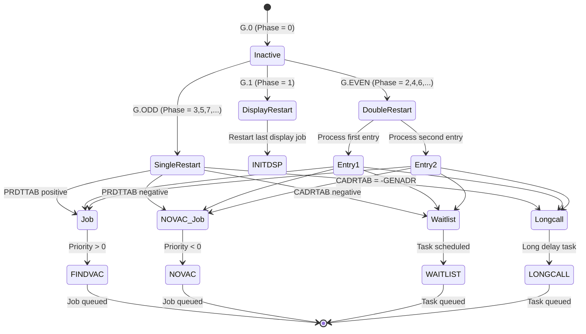
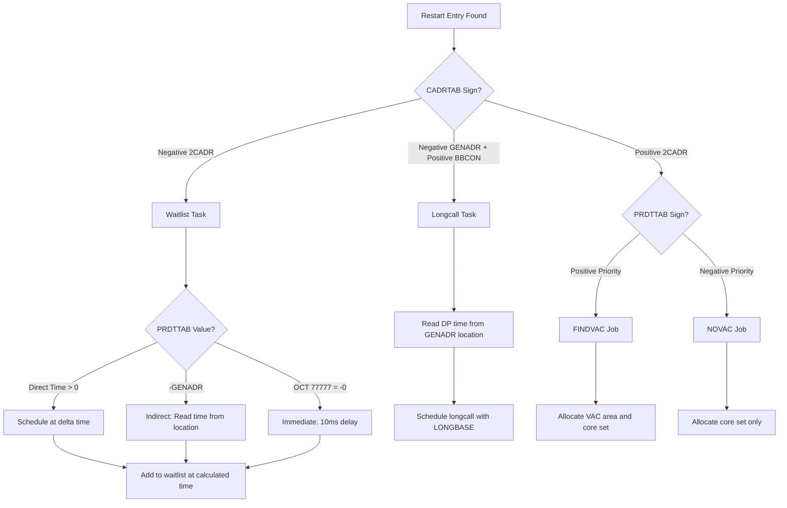

# Phase Table Maintenance

Technical reference documentation for the Apollo Guidance Computer's phase table state checkpointing mechanism.

## Overview

The Phase Table Maintenance system implements **state checkpointing** for the Apollo Guidance Computer (AGC), enabling fault-tolerant restart capability. This mechanism saves program state so that in the event of a hardware restart (triggered by radiation-induced bit flips, power transients, or oscillator failures), the system can resume execution without losing critical progress.

**Modern Equivalent**: State Checkpointing / Transaction Savepoints

**Purpose**: The phase table system allows mission-critical programs to establish restart points at key execution milestones. When a hardware fault triggers a restart, the recovery system consults the phase tables to determine what programs were active and where execution should resume.

**Key Concepts**:

- Six independent **restart groups** (1-6) can operate concurrently
- Each group maintains a **phase register** indicating current execution state
- Phase values index into **restart tables** containing recovery addresses
- **Type A, B, and C** encoding formats support different restart scenarios

Source: Luminary099/PHASE_TABLE_MAINTENANCE.agc:84-95

---

## Phase Register Inventory

The AGC maintains six independent restart groups, each with its own phase register pair for validation:

### Primary Phase Registers

| Register | Group | Purpose |
|----------|-------|---------|
| PHASE1 | Group 1 | General timing, ullage tasks |
| PHASE2 | Group 2 | State vector integration, tracking |
| PHASE3 | Group 3 | Guidance calculations, steering |
| PHASE4 | Group 4 | Burn sequences, powered flight |
| PHASE5 | Group 5 | Servicer functions, sensor processing |
| PHASE6 | Group 6 | Clock/timing tasks |

### Complementary Validation Registers

| Register | Complement Of | Purpose |
|----------|--------------|---------|
| -PHASE1 | PHASE1 | Dual-storage validation |
| -PHASE2 | PHASE2 | Dual-storage validation |
| -PHASE3 | PHASE3 | Dual-storage validation |
| -PHASE4 | PHASE4 | Dual-storage validation |
| -PHASE5 | PHASE5 | Dual-storage validation |
| -PHASE6 | PHASE6 | Dual-storage validation |

### Dual-Storage Validation Mechanism

Each phase value is stored twice: once in PHASEN and once (complemented) in -PHASEN. During restart validation, the recovery system performs an RXOR operation:

```agc
DCA     -PHASE1         # Load -PHASE and PHASE
EXTEND
RXOR    LCHAN           # XOR should yield -0 if consistent
```

If the result is not negative zero (-0), the phase table is considered corrupted, triggering Alarm 1107 and a fresh start via DOFSTRT1.

Source: Luminary099/FRESH_START_AND_RESTART.agc:290-350

### Associated Registers

| Register | Purpose |
|----------|---------|
| TBASE1-TBASE6 | Time base for delta time calculations (one per group) |
| LONGBASE | Double-precision time base for longcall restarts |
| PHSPRDT1-PHSPRDT6 | Variable storage for priority or delta time |
| PHSNAME1-PHSNAME6 | Variable storage for 2CADR restart addresses |

---

## Phase Encoding Formats

The phase change system supports three encoding formats, all invoked via the PHASCHNG subroutine:

```agc
        TC      PHASCHNG
        OCT     XXXXX           # Phase encoding in octal
```

### Summary of Bit Formats

| Type | Bit Pattern | Purpose |
|------|-------------|---------|
| Type A | `TL0 00P PPP PPP GGG` | Fixed phase changes |
| Type B | `TL1 DAP PPP PPP GGG` | Combined variable + fixed |
| Type C | `TL0 1AD XXX CJW GGG` | Variable phase changes |

Source: Luminary099/PHASE_TABLE_MAINTENANCE.agc:176-179

---

## Type A: Fixed Phase Changes

Type A phase changes store fixed phase information permanently in the restart tables. This is the simplest form of restart protection.

### Type A Bit Format

```text
TL0 00P PPP PPP GGG
│││   │ │││ │││ └┴┴── G's: Group number (octal 1-7)
│││   │ └┴┴─┴┴┴────── P's: Phase value (octal 0-127)
│││   └───────────── Must be 0
││└─────────────────── Must be 0
│└──────────────────── L: LONGBASE flag (bit 14)
└───────────────────── T: TBASE flag (bit 15)
```

### Phase Value Meanings

| Phase Pattern | Meaning | Effect |
|---------------|---------|--------|
| G.0 | Inactive | Group G will not restart |
| G.1 | Display restart | Reactivates last display (manned flights) |
| G.EVEN | Double entry | Two items restarted from table |
| G.ODD (not .1) | Single entry | One item restarted from table |

### Type A Examples

Source: Luminary099/PHASE_TABLE_MAINTENANCE.agc:102-120

**Example 1: Make Group 3 Inactive**

```agc
        TC      PHASCHNG        # Set group 3 phase to 0
        OCT     00003           # Group 3 inactive, no restart
```

**Example 2: Display Restart for Group 2**

```agc
        TC      PHASCHNG        # Set up display restart
        OCT     00012           # Group 2, phase 1 = display restart
```

**Example 3: Double Restart with TBASE**

```agc
        TC      PHASCHNG        # Set TBASE4 and double restart
        OCT     40064           # T=1, Group 4, phase 6 (4.6SPOT)
                                # Two items from double 4.6 restart location
```

**Example 4: Longcall Restart**

```agc
        TC      PHASCHNG        # Set LONGBASE and single restart
        OCT     20135           # L=1, Group 5, phase 13 (5.13SPOT)
                                # Entry should be a longcall since LONGBASE set
```

**Example 5: Both TBASE and LONGBASE**

```agc
        TC      PHASCHNG        # Set both TBASE4 and LONGBASE
        OCT     60124           # T=1, L=1, Group 4, phase 12
                                # 4.12 contains task + longcall
```

---

## Type B: Combined Variable and Fixed Phase Changes

Type B combines a variable job restart with a fixed restart entry. It starts up a job as specified and also starts the first entry of a fixed restart location.

### Type B Bit Format

```text
TL1 DAP PPP PPP GGG
│││ ││  │││ │││ └┴┴── G's: Group number (octal 1-7)
│││ ││  └┴┴─┴┴┴────── P's: Fixed phase (octal 0-127)
│││ │└──────────────── A: Address bit (1=2CADR given, 0=next location)
│││ └───────────────── D: Priority bit (1=priority given)
││└─────────────────── Must be 1 (identifies Type B)
│└──────────────────── L: LONGBASE flag (bit 14)
└───────────────────── T: TBASE flag (bit 15)
```

### Address and Priority Bits

| D Bit | Effect |
|-------|--------|
| 0 | Use previously stored priority |
| 1 | Read priority from next word |

| A Bit | Effect |
|-------|--------|
| 0 | Restart address is next location after PHASCHNG return |
| 1 | Read 2CADR from next two words |

### Job Type Selection

The sign of the priority determines job type:

- **Positive priority** → FINDVAC (job with VAC area allocation)
- **Negative priority** → NOVAC (job without VAC area)

Source: Luminary099/PHASE_TABLE_MAINTENANCE.agc:150-174

### Type B Examples

**Example 1: Full Variable Job + Fixed Restart**

```agc
AD      TC      PHASCHNG        # TBASE3 set, start job + fixed restart
AD+1    OCT     56043           # T=1, D=1, A=1, Group 3, phase 4
AD+2    OCT     31000           # Priority 31
AD+3    2CADR   AJOBAJOB        # Job restart address
AD+4                            # First entry of 3.4SPOT also starts (task)
AD+5                            # PHASCHNG returns here
```

**Example 2: Display + Variable Job with Old Priority**

```agc
AD      TC      PHASCHNG        # Display restart + job restart
AD+1    OCT     10015           # D=0, A=0, Group 5, phase 1
AD+2                            # Job starts at AD+2 with old priority
                                # Group 5 display restart also occurs
```

---

## Type C: Variable Phase Changes

Type C provides fully variable restart information. Instead of referencing fixed restart table entries, the restart address and timing information are stored in erasable memory.

### Type C Bit Format

```text
TL0 1AD XXX CJW GGG
│││ │││     │││ └┴┴── G's: Group number (octal 1-7)
│││ │││     ││└────── W: Waitlist restart (only one of C,J,W set)
│││ │││     │└─────── J: Job restart (only one of C,J,W set)
│││ │││     └──────── C: Longcall restart (only one of C,J,W set)
│││ ││└────────────── D: Delta time/priority provided
│││ │└─────────────── A: Address provided (2CADR in next words)
│││ └──────────────── Must be 1 (identifies Type C)
││└─────────────────── Must be 0
│└──────────────────── L: LONGBASE flag (bit 14)
└───────────────────── T: TBASE flag (bit 15)
```

### Restart Type Bits (Only One May Be Set)

| Bit | Restart Type |
|-----|--------------|
| W (bit 3) | Waitlist task restart |
| J (bit 4) | Job restart |
| C (bit 5) | Longcall restart |

### Variable Information Bits

| D Bit | Effect |
|-------|--------|
| 0 | Use previously stored priority/delta time |
| 1 | Read from next word (direct or -GENADR for indirect) |

| A Bit | Effect |
|-------|--------|
| 0 | Restart at (TC PHASCHNG)+2 or +3 depending on D |
| 1 | Read 2CADR from next two words |

Source: Luminary099/PHASE_TABLE_MAINTENANCE.agc:122-151

### Type C Examples

**Example 1: Job with Direct Priority**

```agc
AD      TC      PHASCHNG        # Variable job restart for group 3
AD+1    OCT     05023           # D=1, J=1, Group 3
AD+2    OCT     23000           # Priority 23
AD+3                            # Job restarts at AD+3
                                # PHASCHNG also returns to AD+3
```

**Example 2: Longcall with Indirect Time**

```agc
AD      TC      PHASCHNG        # Variable longcall for group 1
AD+1    OCT     27441           # L=1, D=1, A=1, C=1, Group 1
AD+2    -GENADR DELTIME         # Indirect: -GENADR of delta time location
AD+3    2CADR   CALLCALL        # Longcall restart address
AD+4                            # BBCON should contain EBANK of DELTIME
AD+5                            # PHASCHNG returns here
```

**Note on Indirect Time**: If a delta time is provided via -GENADR (negative GENADR), the BBCON portion of the 2CADR must contain the E-bank information for the indirect location if it resides in a switched erasable bank.

---

## 2PHSCHNG: Double Phase Change

The 2PHSCHNG routine allows changing the phase of one group while under the control of a different group. This is essential when a program protected by one restart group needs to modify the state of another group.

### Calling Sequence

```agc
        TC      2PHSCHNG
        OCT     XXXXX           # First phase change (MUST be Type A)
        OCT     YYYYY           # Second phase change (Type A, B, or C)
```

### Constraints

1. **First OCT (XXXXX)** must be Type A format
2. **Second OCT (YYYYY)** may be Type A, B, or C
3. **LONGBASE**: If LONGBASE needs to be set, specify it in the second OCT word only; it is disregarded in the first OCT word

Source: Luminary099/PHASE_TABLE_MAINTENANCE.agc:182-196

### 2PHSCHNG Example

```agc
AD      TC      2PHSCHNG        # Double phase change
AD+1    OCT     40083           # Type A: TBASE3, Group 3, phase 8 (3.8)
AD+2    OCT     05025           # Type C: Job for Group 5
AD+3    OCT     18000           # Priority 18
AD+4                            # Job starts at AD+4 for Group 5
                                # Group 3 also set to 3.8 restart
```

---

## CADRTAB/PRDTTAB Table Structure

The restart tables consist of two parallel structures that work together to define restart actions:

### Table Addresses

| Table | Address (Octal) | Purpose |
|-------|-----------------|---------|
| PRDTTAB | 12000 | Priority or delta-time storage |
| CADRTAB | 12001 | 2CADR restart addresses |

Source: Luminary099/RESTART_TABLES.agc:89-91

### Table Entry Formats

The restart tables support three types of restart actions, distinguished by how data is stored:

#### Job Restart Entry

```agc
X.YSPOT         OCT     pppp0           # PRDTTAB: Priority (positive=FINDVAC, negative=NOVAC)
                2CADR   JOBADDR         # CADRTAB: Job address
```

**Priority Sign Convention**:

- **Positive priority** → FINDVAC call (job with VAC area for interpreter)
- **Negative priority** → NOVAC call (job without VAC area)

**Example: FINDVAC Job**

```agc
5.7SPOT         OCT     23000           # Priority 23, positive = FINDVAC
                2CADR   SOMEJOB         # Restart SOMEJOB as FINDVAC
```

Source: Luminary099/RESTART_TABLES.agc:37-44

**Example: NOVAC Job**

```agc
5.5SPOT         OCT     -23000          # Priority 23, negative = NOVAC
                2CADR   ANYJOB          # Restart ANYJOB as NOVAC
```

Source: Luminary099/RESTART_TABLES.agc:46-49

#### Waitlist Task Entry

```agc
X.YSPOT         DEC/OCT/GENADR  tttt    # PRDTTAB: Time specification
               -2CADR   TASKADDR        # CADRTAB: NEGATIVE 2CADR identifies waitlist
```

**Time Specification Options**:

| PRDTTAB Value | Meaning |
|---------------|---------|
| Positive number | Direct delta time in centiseconds |
| -GENADR location | Indirect: delta time stored at location |
| OCT 77777 (-0) | Immediate restart (10ms from now) |

**Example: Direct Time**

```agc
                DEC     200             # Delta time: 2 seconds (200 centiseconds)
               -2CADR   DUMMY           # Task starts when time elapses
```

Source: Luminary099/RESTART_TABLES.agc:75-78

**Example: Indirect Time**

```agc
               -GENADR  DTIME           # Time stored in DTIME register
               -2CADR   TASKTASK        # Task address
```

Source: Luminary099/RESTART_TABLES.agc:80-81

**Example: Immediate Restart**

```agc
                OCT     77777           # -0 means immediate restart
               -2CADR   ATASK           # Task starts in 10ms
```

Source: Luminary099/RESTART_TABLES.agc:72-73

#### Longcall Entry

```agc
X.YSPOT         GENADR  DELTATIME       # PRDTTAB: Location of DP delta time
               -GENADR  TASKADDR        # CADRTAB: Negative GENADR of task
                BBCON   TASKADDR        # Positive BBCON for bank info
```

**Example: Longcall**

```agc
3.6SPOT         GENADR  DELTAT          # DP delta time at DELTAT
               -GENADR  LONGTASK        # Task address (negative GENADR)
                BBCON   LONGTASK        # Bank information

                OCT     31000           # Second entry: Job with priority 31
                2CADR   JOBAGAIN        # Job address
```

**Note**: If DELTAT resides in a switched E-bank, the BBCON must contain the appropriate E-bank information.

Source: Luminary099/RESTART_TABLES.agc:50-63

---

## SIZETAB Index Mechanism

The SIZETAB table provides index offsets to locate restart entries within the tables. It uses a clever offset calculation based on the TC instruction encoding.

### SIZETAB Structure

```agc
SIZETAB         TC      1.2SPOT -12006
                TC      1.3SPOT -12004
                TC      2.2SPOT -12006
                TC      2.3SPOT -12004
                TC      3.2SPOT -12006
                TC      3.3SPOT -12004
                TC      4.2SPOT -12006
                TC      4.3SPOT -12004
                TC      5.2SPOT -12006
                TC      5.3SPOT -12004
                TC      6.2SPOT -12006
                TC      6.3SPOT -12004
```

Source: Luminary099/RESTART_TABLES.agc:93-105

### Index Calculation

The SIZETAB entries are computed as `TC X.YSPOT - 12006` (for even) or `TC X.YSPOT - 12004` (for odd). When the RESTARTS routine accesses SIZETAB:

1. The index value (group × 2 + even/odd offset) selects a SIZETAB entry
2. The TC address minus the base (12000 for PRDTTAB) yields the offset into the restart tables
3. This offset locates the correct X.YSPOT entry

### Even vs Odd Entry Sizes

| Phase Type | Entries | Words per Entry |
|------------|---------|-----------------|
| G.EVEN | 2 entries | 6 words total (3 per entry) |
| G.ODD | 1 entry | 3 words |

---

## X.YSPOT Entry Format

Restart table entries are labeled X.YSPOT where X is the group number (1-6) and Y is the phase number.

### Entry Organization

**Even Spots (G.EVEN)**: Two restart items per phase

- First entry: Words 0-2 (PRDTTAB, CADRTAB, CADRTAB+1)
- Second entry: Words 3-5

**Odd Spots (G.ODD, not G.1)**: One restart item per phase

- Single entry: Words 0-2

### Luminary099 Restart Table Entries

Source: Luminary099/RESTART_TABLES.agc:106-294

#### Group 1 Entries

| Entry | Type | Description |
|-------|------|-------------|
| 1.2SPOT | Double | Dummy job (ENDOFJOB) + Task (TASKOVER) |
| 1.3SPOT | Single | Waitlist task (ULLGTASK) with indirect time |

#### Group 2 Entries

| Entry | Type | Description |
|-------|------|-------------|
| 2.2SPOT | Double | Equals 1.2SPOT (placeholder) |
| 2.3SPOT | Single | Longcall (STATEINT) for state vector integration |
| 2.5SPOT | Single | Job (STATINT1) for integration continuation |
| 2.7SPOT | Single | Waitlist (P20LEMC1) with direct time |
| 2.11SPOT | Single | Job (P25LEM1) tracking program |
| 2.13SPOT | Single | Job (RELINUS) inertial reference |
| 2.15SPOT | Single | Job (R22RSTRT) tracking restart |
| 2.17SPOT | Single | Immediate waitlist (REDO2.17) |
| 2.21SPOT | Single | Waitlist (R10,R11) attitude display |

#### Group 3 Entries

| Entry | Type | Description |
|-------|------|-------------|
| 3.2SPOT | Double | Equals 1.2SPOT (placeholder) |
| 3.3SPOT | Single | Waitlist (ZOOM) with indirect time |
| 3.5SPOT | Single | Job (S40.13) steering calculations |

#### Group 4 Entries (Powered Flight)

| Entry | Type | Description |
|-------|------|-------------|
| 4.2SPOT | Double | Waitlist (TIG-5) + Immediate (REDO4.2) |
| 4.3SPOT | Single | Job (GOABORT) abort handling |
| 4.5SPOT | Single | Waitlist (ULLAGOFF) ullage cutoff |
| 4.7SPOT | Single | Waitlist (TIG-0) ignition |
| 4.11SPOT | Single | Waitlist (ENGOFTSK) engine off |
| 4.13SPOT | Single | Job (POSTBURN) post-burn processing |
| 4.15SPOT | Single | Waitlist (TIG-30) pre-ignition |
| 4.17SPOT | Single | Immediate waitlist (TIG-5) |
| 4.21SPOT | Single | Job (R51.1+1) IMU alignment |
| 4.23SPOT | Single | Immediate waitlist (IGNITION) |
| 4.25SPOT | Single | Longcall (TIG-35) |
| 4.27SPOT | Single | Job (P70A) abort programs |
| 4.31SPOT | Single | Job (P71A) abort programs |
| 4.33SPOT | Single | Job (GOP00FIX) |
| 4.35SPOT | Single | Job (GOPOODOO) |
| 4.37SPOT | Single | Job (COMFAIL) communications |

#### Group 5 Entries (Servicer)

| Entry | Type | Description |
|-------|------|-------------|
| 5.2SPOT | Double | Job (NORMLIZE) + Waitlist (REREADAC) |
| 5.4SPOT | Double | Waitlist (REREADAC) + Job (SERVICER) |
| 5.3SPOT | Single | Waitlist (REREADAC) sensor read |
| 5.5SPOT | Single | Immediate waitlist (REDO5.5) |
| 5.7SPOT | Single | Immediate waitlist (BIBIBIAS) IMU compensation |

#### Group 6 Entries (Timing)

| Entry | Type | Description |
|-------|------|-------------|
| 6.2SPOT | Double | Equals 1.2SPOT (placeholder) |
| 6.3SPOT | Single | Waitlist (CLOKTASK) clock task |
| 6.5SPOT | Single | Job (TIMEDIDR) time update |
| 6.7SPOT | Single | Job (REDO6.7) |

---

## Register Usage

The PHASCHNG routines use several temporary registers during execution:

### Primary Temporary Registers

| Register | Alias | Purpose |
|----------|-------|---------|
| ITEMP1 | TEMPG | Group number temporary (doubled for indexing) |
| ITEMP2 | TEMPP | Phase value temporary |
| ITEMP3 | TEMPNM | 2CADR name (low word) temporary |
| ITEMP4 | TEMPBB | 2CADR BBCON (high word) temporary |
| ITEMP5 | TEMPSW | Switch flags (T/L bits) temporary |
| ITEMP6 | TEMPSW2 | Second switch temporary (2PHSCHNG indicator) |

Source: Luminary099/PHASE_TABLE_MAINTENANCE.agc:295-300

### Secondary Temporary Registers (2PHSCHNG)

| Register | Alias | Purpose |
|----------|-------|---------|
| RUPTREG1 | TEMPPR | Priority temporary |
| RUPTREG2 | TEMPG2 | Second group number (doubled) |
| RUPTREG3 | TEMPP2 | Second phase value |
| RUPTREG4 | TEMPBBCN | BBANK save during bank switching |

Source: Luminary099/PHASE_TABLE_MAINTENANCE.agc:301-305

### Variable Phase Storage Registers

Each group has associated registers for storing variable restart information:

| Register Set | Purpose |
|--------------|---------|
| PHSPRDT1-6 | Priority or delta time for variable restarts |
| PHSNAME1-6 | 2CADR address for variable restarts |

These are indexed using the group number: `PHSPRDT1 -2 + TEMPG` where TEMPG contains the doubled group number.

---

## Phase Encoding State Diagram

The following diagram illustrates the state transitions based on phase values:



### State Descriptions

| State | Condition | Action |
|-------|-----------|--------|
| Inactive | Phase = 0 | Group will not restart |
| DisplayRestart | Phase = 1 | INITDSP job restarts last display |
| SingleRestart | Phase = odd (not 1) | One table entry processed |
| DoubleRestart | Phase = even | Two table entries processed |
| Job | Positive PRDTTAB, positive CADRTAB | FINDVAC job scheduled |
| NOVAC_Job | Negative PRDTTAB, positive CADRTAB | NOVAC job scheduled |
| Waitlist | Negative CADRTAB | Waitlist task scheduled |
| Longcall | Negative GENADR in CADRTAB | Longcall task scheduled |

---

## Restart Type Decision Flowchart



---

## Executive Scheduler Integration

The phase table system interacts closely with the Executive scheduler:

### Job Restart Flow

When a restart requires scheduling a job:

1. Phase table lookup provides priority and 2CADR
2. Priority sign determines call type:
   - **Positive** → `TC FINDVAC` (needs VAC area for interpreter)
   - **Negative** → `TC NOVAC` (no VAC area needed)
3. Executive queues job in priority order
4. Job executes when it becomes highest priority

### Task Restart Flow

When a restart requires scheduling a waitlist task:

1. Phase table provides delta time and 2CADR
2. FINDTIME calculates when task should execute:

   ```text
   Scheduled Time = TBASE(group) + Delta Time
   Current Time = TIME1
   Remaining = Scheduled - Current
   ```

3. If time already passed, task executes immediately (10ms delay)
4. Task added to waitlist

### Longcall Restart Flow

When a restart requires scheduling a longcall:

1. Phase table provides location of DP delta time
2. LONGBASE provides the time base reference
3. Longcall routine handles delays > 163.84 seconds

---

## Terminology Translations

| 1960s Term | Modern Equivalent | Description |
|------------|-------------------|-------------|
| Phase Tables | State Checkpointing | Saving program state for recovery |
| PHASCHNG | State Checkpoint Update | Updating the current checkpoint |
| CADRTAB | Recovery Routing Table | Table of restart addresses |
| PRDTTAB | Priority/Timing Table | Table of priorities or delta times |
| 2CADR | Two-Word Bank-Switched Address | Full address including bank info |
| FINDVAC | Job with VAC Area | Job requiring interpreter workspace |
| NOVAC | Job without VAC Area | Job not using interpreter |
| GENADR | General Address | Address without bank information |
| -GENADR | Negative General Address | Indirection marker |
| BBCON | Bank-Bank Configuration | Bank selection word |
| TBASE | Time Base | Reference time for delta calculations |
| LONGBASE | Long Time Base | DP reference for longcalls |
| Executive | Priority-Based Job Scheduler | Main job scheduling system |
| Waitlist | Time-Based Task Scheduler | Timer-driven task system |

---

## Cross-References

- **[RECOVERY_OVERVIEW.md](RECOVERY_OVERVIEW.md)**: System-level recovery documentation
- **[RESTART_FLOW.md](RESTART_FLOW.md)**: Detailed restart sequence documentation
- **[ALARM_REFERENCE.md](ALARM_REFERENCE.md)**: Alarm 1107 phase table failure analysis
- **[../../ALARMS.md](../../ALARMS.md)**: Complete alarm code reference

---

## Source Files

### Luminary099 (Lunar Module)

| File | Pages | Purpose |
|------|-------|---------|
| PHASE_TABLE_MAINTENANCE.agc | 1294-1302 | PHASCHNG, 2PHSCHNG routines |
| RESTART_TABLES.agc | 238-243 | X.YSPOT restart entries |

### Comanche055 (Command Module)

| File | Pages | Purpose |
|------|-------|---------|
| PHASE_TABLE_MAINTENANCE.agc | 1404-1413 | PHASCHNG, 2PHSCHNG routines |
| RESTART_TABLES.agc | 211-221 | X.YSPOT restart entries |

**Note**: The phase table mechanism is identical between Luminary099 (LM) and Comanche055 (CM). The differences lie only in the specific restart table entries, which are tailored to each vehicle's mission programs.

---

*Documentation generated from Apollo 11 AGC source code. Source: Luminary099 and Comanche055 repositories.*
