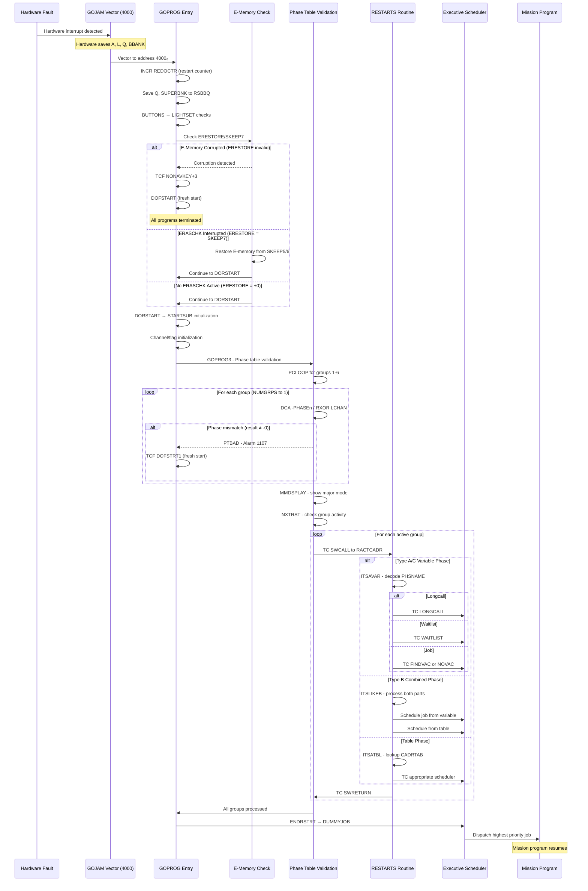
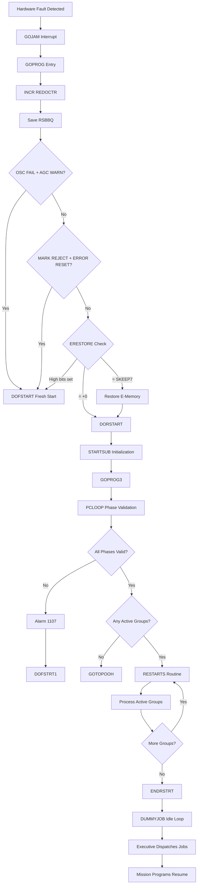

# Hardware Restart Sequence Flow

Process documentation for the Apollo Guidance Computer's hardware restart mechanism, from fault detection through program resumption.

## Overview

The AGC restart flow is a sophisticated fault recovery mechanism that enables the computer to survive transient hardware faults and resume execution of mission-critical programs. When a hardware fault occurs, the system follows a carefully orchestrated sequence to validate memory integrity, verify program state, and reschedule interrupted tasks.

**Modern Equivalent**: Hardware Interrupt Handler / Exception Recovery Sequence

**Primary Components**:
- **GOJAM Vector (4000₈)**: Hardware restart interrupt entry point
- **GOPROG**: Software handler for hardware restarts
- **E-Memory Validation**: ERESTORE/SKEEP7 consistency checking
- **Phase Table Validation**: PCLOOP integrity verification
- **RESTARTS Routine**: Job/task rescheduling dispatcher

**Success Metric**: A mission program like P63 Landing Guidance can be interrupted by a transient hardware fault and resume execution without requiring IMU realignment or losing critical navigation state.

---

## Hardware Fault Detection

### GOJAM Trigger Conditions

The AGC hardware initiates a restart (GOJAM - "Go to JAM") when it detects any of the following fault conditions:

| Fault Type | Description | Root Cause |
|------------|-------------|------------|
| **Radiation-Induced Bit Flips** | Single-event upsets (SEU) in memory or registers | Cosmic rays, solar particle events |
| **Power Transients** | Voltage fluctuations beyond acceptable tolerances | Spacecraft electrical system anomalies |
| **Oscillator Failures** | Clock signal interruption or instability | OSC FAIL detection circuit trigger |
| **Counter Overflow** | SCALER or TIME counter exceeds capacity | Software or timing anomalies |
| **Parity Errors** | Memory read verification failures | Memory cell degradation |

### GOJAM Vector Entry

When a fault is detected, the hardware forces an unconditional transfer to memory address **4000₈** (octal):

```
Address 4000₈ = GOJAM Vector → GOPROG Entry Point
```

This vector is hard-wired in the AGC Block II architecture and cannot be changed by software.

### Automatic Hardware Register Save

The AGC hardware **automatically preserves** the following registers during GOJAM:

| Register | Size | Purpose |
|----------|------|---------|
| **A** | 15 bits | Accumulator contents |
| **L** | 15 bits | Lower accumulator contents |
| **Q** | 15 bits | Return address register |
| **BBANK** | 15 bits | Both bank register (E-bank + F-bank) |

This automatic preservation allows the software restart handler to determine where execution was interrupted and potentially restore context.

Source: Luminary099/FRESH_START_AND_RESTART.agc:203-206

---

## GOPROG Invocation

The GOPROG routine is the primary software handler for hardware restarts. It performs initial bookkeeping and determines whether a controlled restart or fresh start is required.

### Entry Point

```agc
# Page 215
# COMES HERE FROM LOCATION 4000, GOJAM, RESTART ANY PROGRAMS WHICH MAY 
# HAVE BEEN RUNNING AT THE TIME.

                EBANK=  LST1
GOPROG          INCR    REDOCTR         # ADVANCE RESTART COUNTER.
```

Source: Luminary099/FRESH_START_AND_RESTART.agc:203-206

### Restart Counter Increment

The first action is to increment the **REDOCTR** (restart counter), which:
- Provides telemetry data about system stability
- Helps diagnose potential hardware problems
- Tracks restart frequency during mission phases

### RSBBQ Register Save

GOPROG saves the Q register and SUPERBNK for potential use in debugging and restoration:

```agc
                LXCH    Q               # Move Q to L register
                EXTEND
                ROR     SUPERBNK        # OR with SUPERBNK for complete address
                DXCH    RSBBQ           # Store both in RSBBQ double register
```

This preserves the complete 2CADR (two-word address) of where execution was interrupted, enabling:
- Post-flight analysis of restart locations
- Debugging of restart patterns
- Potential future restoration (not typically used)

Source: Luminary099/FRESH_START_AND_RESTART.agc:208-211

### BUTTONS and LIGHTSET

After register save, GOPROG checks the ISS (Inertial Subsystem) state and calls LIGHTSET:

```agc
                CA      DSPTAB +11D
                MASK    BIT4
                EXTEND
                BZF     +4
                AD      BIT6            # SET ERROR COUNTER ENABLE
                EXTEND
                WOR     CHAN12          # ISS WAS IN COARSE ALIGN SO GO BACK TO
BUTTONS         TC      LIGHTSET
```

**LIGHTSET** performs additional fresh start checks:
- Verifies MARK REJECT button state
- Checks for ERROR RESET simultaneous press
- Provides early exit to DOFSTART if certain conditions are met

Source: Luminary099/FRESH_START_AND_RESTART.agc:212-219

---

## E-Memory Validation

The E-memory (Erasable memory) validation is a critical step that determines whether the erasable memory contents can be trusted after a hardware restart.

### ERASCHK Context

The AGC includes a diagnostic routine called **ERASCHK** that periodically tests erasable memory. When ERASCHK runs, it temporarily stores the contents of two memory locations (X and X+1) into backup registers:

| Register | Contents | Purpose |
|----------|----------|---------|
| **SKEEP5** | Original contents of location X | Backup storage |
| **SKEEP6** | Original contents of location X+1 | Backup storage |
| **SKEEP7** | Address X | Location indicator |
| **ERESTORE** | Address X | Sentinel/status indicator |
| **SKEEP4** | EBANK of location X | Bank information |

### Validation Logic

The restart handler uses ERESTORE to determine the state when the restart occurred:

```agc
# ERASCHK TEMPORARILY STORES THE CONTENTS OF TWO ERASABLE LOCATIONS, X
# AND X+1 INTO SKEEP5 AND SKEEP6.  IT ALSO STORES X INTO SKEEP7 AND
# ERESTORE.  IF ERASCHK IS INTERRUPTED BY A RESTART, C(ERESTORE) SHOULD
# EQUAL C(SKEEP7), AND SHOULD BE A + NUMBER LESS THAN 2000 OCT.  OTHERWISE
# C(ERESTORE) SHOULD EQUAL +0.

                CAF     HI5
                MASK    ERESTORE
                EXTEND
                BZF     +2              # IF ERESTORE NOT = +0 OR +N LESS THAN 2K,
                TCF     NONAVKEY +3     # DO FRESH START -- E MEMORY MIGHT BE BAD
```

Source: Luminary099/FRESH_START_AND_RESTART.agc:221-231

### Decision Tree

```
ERESTORE value:
│
├─ High 5 bits non-zero → FRESH START (memory likely corrupted)
│
├─ +0 (zero) → DORSTART (controlled restart, no ERASCHK in progress)
│
├─ = SKEEP7 → RESTORE E-MEMORY, then DORSTART
│   (ERASCHK was interrupted, restore the tested locations)
│
└─ ≠ SKEEP7 → FRESH START (inconsistent state, memory suspect)
```

### E-Memory Restoration

If ERESTORE equals SKEEP7, the interrupted ERASCHK test must be undone by restoring the original memory contents:

```agc
                CA      SKEEP4
                TS      EBANK           # EBANK OF E MEMORY THAT WAS UNDER TEST.
                EXTEND                  # (NOT DXCH SINCE THIS MIGHT HAPPEN AGAIN)
                DCA     SKEEP5
                INDEX   SKEEP7
                DXCH    0000            # E MEMORY RESTORED
                CA      ZERO
                TS      ERESTORE
DORSTART        TC      STARTSUB        # DO INITIALIZATION AFTER ERASE RESTORE.
```

This ensures the memory locations being tested are returned to their original state before proceeding with the restart.

Source: Luminary099/FRESH_START_AND_RESTART.agc:239-247

### DORSTART Path

After E-memory validation passes, **DORSTART** calls **STARTSUB** to perform common initialization for both fresh starts and restarts:
- Initialize TIME3, TIME4, TIME5 counters
- Reset outbit channels
- Clear waitlist structures
- Initialize executive register sets

---

## Phase Table Validation

After DORSTART initialization, GOPROG3 validates the integrity of all six phase table groups.

### PCLOOP Algorithm

The **PCLOOP** (Phase Consistency Loop) verifies that each phase register pair (PHASEN and -PHASEN) contains consistent values:

```agc
GOPROG3         CAF     NUMGRPS         # VERIFY PHASE TABLE AGREEMENTS
PCLOOP          TS      MPAC +5
                DOUBLE
                EXTEND
                INDEX   A
                DCA     -PHASE1         # COMPLEMENT INTO A, DIRECT INTO L.
                EXTEND
                RXOR    LCHAN           # RESULT MUST BE -0 FOR AGREEMENT.
                CCS     A
                TCF     PTBAD           # RESTART FAILURE.
                TCF     PTBAD
                TCF     PTBAD
```

Source: Luminary099/FRESH_START_AND_RESTART.agc:290-301

### RXOR Validation

The validation uses a clever bit-manipulation technique:

1. Load -PHASEN (complemented) into A, PHASEN (direct) into L
2. Execute RXOR LCHAN (XOR A with L)
3. If PHASEN = complement of -PHASEN, result is **negative zero** (-0)
4. Any other result indicates corruption

**Why -0?**: When you XOR a value with its one's complement, all bits become 1, which in the AGC's one's complement arithmetic equals -0.

### Phase Table Failure (Alarm 1107)

If any phase group fails validation, PCLOOP branches to PTBAD:

```agc
PTBAD           TC      ALARM           # SET ALARM TO SHOW PHASE TABLE FAILURE.
                OCT     1107

                TCF     DOFSTRT1
```

**Alarm 1107** indicates the phase table is corrupted and cannot be trusted. The system must perform a fresh start (DOFSTRT1), which:
- Clears all phase tables
- Terminates all programs
- Returns to the idle loop

Source: Luminary099/FRESH_START_AND_RESTART.agc:347-350

### Group Activity Check

After phase validation passes, GOPROG3 checks which groups have active phases:

```agc
                CAF     NUMGRPS         # SEE IF ANY GROUPS RUNNING.
NXTRST          TS      MPAC +5
                DOUBLE
                INDEX   A
                CCS     PHASE1
                TCF     PACTIVE         # PNZ -- GROUP ACTIVE.
                TCF     PINACT          # +0 -- GROUP NOT RUNNING.
```

For each active group (non-zero phase), control transfers to PACTIVE, which invokes the RESTARTS routine.

Source: Luminary099/FRESH_START_AND_RESTART.agc:323-329

---

## RESTARTS Dispatch

The RESTARTS routine decodes phase values and dispatches to appropriate restart handlers based on the phase type.

### Entry and Setup

```agc
RESTARTS        CA      MPAC +5         # GET GROUP NUMBER -1
                DOUBLE                  # SAVE FOR INDEXING
                TS      TEMP2G

                CA      PHS2CADR        # SET UP EXIT IN CASE IT IS AN EVEN
                TS      TEMPSWCH        # TABLE PHASE

                CA      RTRNCADR        # TO SAVE TIME ASSUME IT WILL GET NEXT
                TS      GOLOC +2        # GROUP AFTER THIS
```

Source: Luminary099/RESTARTS_ROUTINE.agc:35-43

### Type Discrimination

The phase value's bit pattern determines the restart type:

```agc
                CA      TEMPPHS
                MASK    OCT1400
                CCS     A               # IS IT A VARIABLE OR TABLE RESTART
                TCF     ITSAVAR         # IT'S A VARIABLE RESTART
```

| Condition | Branch | Restart Type |
|-----------|--------|--------------|
| Bits 10-11 set | ITSAVAR | Variable restart (Type A or B) |
| Bits 10-11 clear, phase non-zero | ITSATBL | Table restart (Phase uses table entry) |
| Phase = X.1 | INITDSP | Display restart job |

Source: Luminary099/RESTARTS_ROUTINE.agc:45-52

### ITSAVAR Further Discrimination

Variable restarts are further categorized:

```agc
ITSAVAR         MASK    OCT1400         # IS IT TYPE B ?
                CCS     A
                TCF     ITSLIKEB        # YES, IT IS TYPE B

                EXTEND                  # STORE THE JOB (OR TASK) 2CADR FOR EXIT
                NDX     TEMP2G
                DCA     PHSNAME1
                DXCH    GOLOC

                CA      TEMPPHS         # SEE IF THIS IS A JOB, TASK, OR A LONGCALL
                MASK    OCT7
                AD      MINUS2
                CCS     A
                TCF     ITSLNGCL        # ITS A LONGCALL
```

The low 3 bits (CJW field) determine:
- **1**: Longcall restart
- **2**: Waitlist task restart  
- **3+**: Job restart

Source: Luminary099/RESTARTS_ROUTINE.agc:61-74

---

## Job Restart

Jobs are restarted using either FINDVAC or NOVAC depending on priority sign.

### ITSAJOB Branch

```agc
ITSAJOB         NDX     TEMP2G          # NOW ADD THE PRIORITY AND LET'S GO
                CA      PHSPRDT1
CHKNOVAC        TS      GOLOC -1        # SAVE PRIO UNTIL WE SEE IF ITS
                EXTEND                  # A FINDVAC OR A NOVAC
                BZMF    ITSNOVAC

                CAF     FVACCADR        # POSITIVE, SET UP FINDVAC CALL.
                XCH     GOLOC -1        # PICK UP PRIO,
                TC      GOLOC -1        # AND GO

ITSNOVAC        CAF     NOVACADR        # NEGATIVE,
                XCH     GOLOC -1        # SET UP NOVAC CALL,
                COM                     # CORRECT PRIO,
                TC      GOLOC -1        # AND GO
```

Source: Luminary099/RESTARTS_ROUTINE.agc:153-166

### FINDVAC vs NOVAC Selection

| Priority Sign | Restart Function | VAC Area |
|---------------|------------------|----------|
| **Positive** | FINDVAC | Allocates new VAC area |
| **Negative** | NOVAC | No VAC area needed |

**FINDVAC** is used when the job requires its own computation workspace (VAC area).
**NOVAC** is used for simpler jobs that don't need dedicated workspace.

The priority's absolute value determines the job's scheduling priority.

---

## Waitlist Task Restart

Waitlist tasks are time-based entries that execute after a specified delay.

### ITSAWAIT Branch

```agc
ITSAWAIT        CA      WTLTCADR        # SET UP WAITLIST CALL
                TS      GOLOC -1

                NDX     TEMP2G          # DIRECTLY STORED
                CA      PHSPRDT1
TIMETEST        CCS     A               # IS IT AN IMMEDIATE RESTART
                INCR    A               # NO.
                TCF     FINDTIME        # FIND OUT WHEN IT SHOULD BEGIN

                TCF     ITSINDIR        # STORED INDIRECTLY

                TCF     IMEDIATE        # IT WANTS AN IMMEDIATE RESTART
```

Source: Luminary099/RESTARTS_ROUTINE.agc:82-93

### FINDTIME Calculation

The FINDTIME routine calculates the remaining time until a task should execute:

```agc
FINDTIME        COM                     # MAKE NEGATIVE SINCE IT WILL BE SUBTRACTED
                TS      L               # AND SAVE
                NDX     TEMP2G
                CS      TBASE1
                EXTEND
                SU      TIME1
                CCS     A
                COM
                AD      OCT37776
                AD      ONE
                AD      L
                CCS     A
                CA      ZERO
                TCF     +2
                TCF     +1
IMEDIATE        AD      ONE
                TC      GOLOC -1
```

**Calculation**: `Time remaining = TBASE + Original_Delta - Current_TIME1`

If the calculated time is zero or negative, the task executes immediately.

Source: Luminary099/RESTARTS_ROUTINE.agc:120-137

### Immediate Restart (OCT 77777)

If **PRDTTAB** contains **OCT 77777** (negative zero), the task restarts immediately:

```agc
# From RESTART_TABLES.agc:
#       OCT     77777           # THIS WILL CAUSE AN IMMEDIATE RESTART
#      -2CADR   ATASK           # OF THE TASK 'ATASK'
```

This pattern is used when a task must resume as quickly as possible after restart.

Source: Luminary099/RESTART_TABLES.agc:72-74

### Indirect Time Retrieval (ITSINDIR)

If PRDTTAB contains a negative GENADR, the delta time is stored indirectly:

```agc
ITSINDIR        LXCH    GOLOC +1        # GET THE CORRECT E BANK IN CASE THIS IS
                LXCH    BB              # SWITCHED ERASABLE

                NDX     A               # GET THE TIME INDIRECTLY
                CA      1

                LXCH    BB              # RESTORE THE BB AND GOLOC
                LXCH    GOLOC +1

                TCF     FINDTIME        # FIND OUT WHEN IT SHOULD BEGIN
```

This allows the delta time to be stored in an erasable register rather than fixed memory, enabling dynamic timing adjustments.

Source: Luminary099/RESTARTS_ROUTINE.agc:102-111

---

## Longcall Restart

Longcalls are waitlist tasks with extended timing capability, using double-precision time values.

### ITSLNGCL Branch

```agc
ITSLNGCL        CA      WTLTCADR        # ASSUME IT WILL GO TO WAITLIST
                TS      GOLOC -1

                NDX     TEMP2G
                CS      PHSPRDT1        # GET THE DELTA T ADDRESS

                TCF     ITSLGCL1        # NOW GET THE DELTA TIME
```

Source: Luminary099/RESTARTS_ROUTINE.agc:266-272

### LONGBASE Handling

Longcalls use LONGBASE for double-precision time tracking:

```agc
ITSLGCL2        DXCH    LONGTIME

                EXTEND                  # CALCULATE TIME LEFT
                DCS     TIME2
                DAS     LONGTIME
                EXTEND
                DCA     LONGBASE
                DAS     LONGTIME

                CCS     LONGTIME        # FIND OUT HOW THIS SHOULD BE RESTARTED
                TCF     LONGCLCL
                TCF     +2
                TCF     IMEDIATE -3
```

**Calculation**: `Time remaining = LONGBASE + Original_Delta - Current_TIME2`

If time remaining is positive, call LONGCALL with the remaining time.
If time remaining is zero or negative, restart immediately.

Source: Luminary099/RESTARTS_ROUTINE.agc:240-257

---

## Program Resumption

After all active groups have been processed by RESTARTS, control returns to the normal execution flow.

### GOLOC Exit Sequence

The GOLOC area serves as a trampoline for restarted jobs and tasks:

```agc
GOLOC           EQUALS  VAC5 +20D       # Location for 2CADR of restart destination
```

The restart routines populate:
- **GOLOC-1**: Address of FINDVAC, NOVAC, WAITLIST, or LONGCALL
- **GOLOC**: Low word of restart 2CADR
- **GOLOC+1**: High word of restart 2CADR (BBCON)
- **GOLOC+2**: Return address for next group processing

### SWRETURN at RTRNCADR

After scheduling a job or task, RESTARTS returns via SWRETURN:

```agc
RTRNCADR        TC      SWRETURN        # CANT GET HERE (actually returns to GOPROG3)
```

SWRETURN transfers control back to GOPROG3's NXTRST loop to process the next restart group.

Source: Luminary099/RESTARTS_ROUTINE.agc:76

### ENDRSTRT Exit

When all groups have been processed:

```agc
                CCS     MPAC +6         # NO, CHECK PHASE ACTIVITY FLAG
                TCF     ENDRSTRT        # PHASE ACTIVE
                CAF     BIT15           # IS MODE -0
                MASK    MODREG
                EXTEND
                BZF     GOTOPOOH        # NO
                TCF     ENDRSTRT        # YES

ENDRSTRT        TC      POSTJUMP
                CADR    DUMMYJOB +2     # PICKS UP AT RELINT. (DON'T ZERO NEWJOB)
```

**ENDRSTRT** returns to the DUMMYJOB idle loop, allowing the executive scheduler to dispatch the highest-priority restarted job.

Source: Luminary099/FRESH_START_AND_RESTART.agc:340-346, 177-178

---

## Hardware Restart Sequence Diagram



---

## Recovery Decision Flowchart



---

## Terminology Translations

| 1960s AGC Term | Modern Equivalent | Description |
|----------------|-------------------|-------------|
| **GOPROG** | Hardware Interrupt Handler | Entry point for hardware-initiated restarts |
| **GOJAM** | Hardware Restart Vector | Fixed interrupt vector at address 4000₈ |
| **DORSTART** | Controlled Restart Entry | Restart path when E-memory is valid |
| **DOFSTART** | Fresh Start Entry | Complete reinitialization path |
| **DOFSTRT1** | Partial Fresh Start | Fresh start preserving engine state |
| **PCLOOP** | Phase Consistency Loop | Validation routine for phase tables |
| **ERESTORE** | Memory Test Sentinel | Indicator of ERASCHK state during restart |
| **RSBBQ** | Debug Context Save | Storage for interrupted location information |
| **RESTARTS** | Restart Dispatcher | Routine that decodes and schedules restarts |
| **ITSAVAR** | Variable Restart Handler | Branch for Type A/C variable phases |
| **ITSATBL** | Table Restart Handler | Branch for table-based phase restarts |
| **FINDTIME** | Delta Time Calculator | Computes remaining time for waitlist tasks |
| **SWRETURN** | Subroutine Return | Cooperative return to restart loop |

---

## Cross-References

- **[Phase Table Maintenance](PHASE_TABLE_MAINTENANCE.md)**: Details of phase encoding formats (Type A, B, C) and PHASCHNG usage
- **[Recovery Overview](RECOVERY_OVERVIEW.md)**: High-level recovery system architecture and traceability matrix
- **[Alarm Reference](ALARM_REFERENCE.md)**: Detailed analysis of Alarm 1107, 1201, and 1202

---

## Source Citations

| Section | Primary Source | Lines |
|---------|----------------|-------|
| Hardware Fault Detection | Luminary099/FRESH_START_AND_RESTART.agc | 203-206 |
| GOPROG Invocation | Luminary099/FRESH_START_AND_RESTART.agc | 206-219 |
| E-Memory Validation | Luminary099/FRESH_START_AND_RESTART.agc | 221-247 |
| Phase Table Validation | Luminary099/FRESH_START_AND_RESTART.agc | 290-350 |
| RESTARTS Entry | Luminary099/RESTARTS_ROUTINE.agc | 35-52 |
| Type Discrimination | Luminary099/RESTARTS_ROUTINE.agc | 45-74 |
| Job Restart | Luminary099/RESTARTS_ROUTINE.agc | 153-166 |
| Waitlist Restart | Luminary099/RESTARTS_ROUTINE.agc | 82-137 |
| Longcall Restart | Luminary099/RESTARTS_ROUTINE.agc | 240-272 |
| Table Structure | Luminary099/RESTART_TABLES.agc | 29-100 |
| CM GOPROG | Comanche055/FRESH_START_AND_RESTART.agc | 290-391 |
| CM RESTARTS | Comanche055/RESTARTS_ROUTINE.agc | 43-100 |
