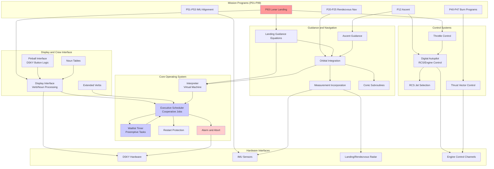
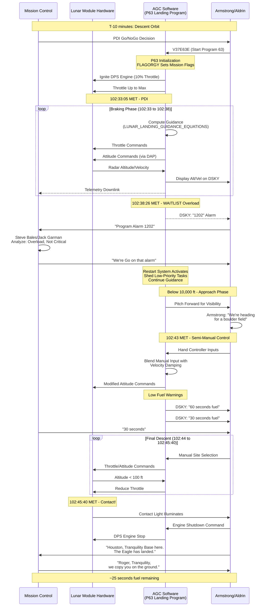
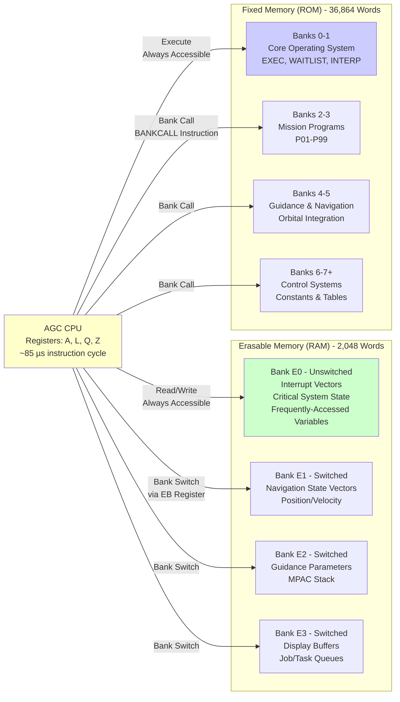
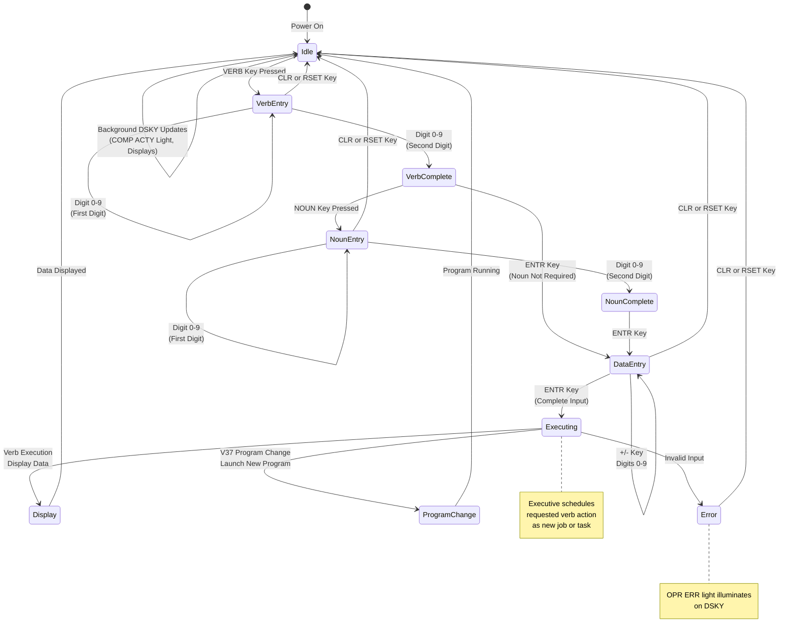
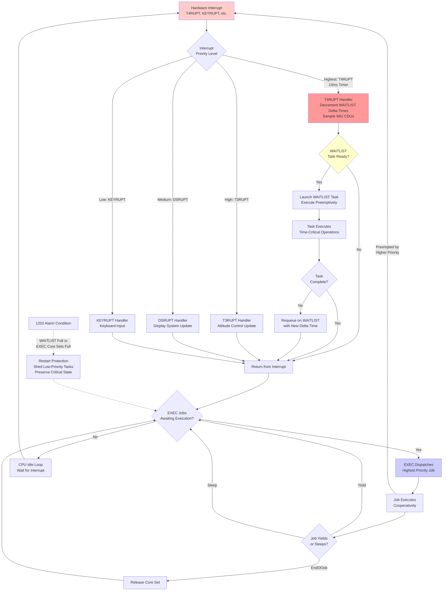

# Reading the Apollo 11 Guidance Computer Source Code

## Table of Contents

1. [Introduction](#introduction)
2. [Quick Start Guide](#quick-start-guide)
3. [Reading Path Selection](#reading-path-selection)
4. [AGC Architecture Primer](#agc-architecture-primer)
5. [Mission Timeline and Reading Order](#mission-timeline-and-reading-order)
6. [Terminology Glossary](#terminology-glossary)
7. [Module Interdependency Map](#module-interdependency-map)
8. [Historical Context and Critical Events](#historical-context-and-critical-events)
9. [Further Resources](#further-resources)

---

## Introduction

This guide provides a comprehensive framework for exploring the Apollo 11 Guidance Computer (AGC) source code—the software that enabled humanity's first lunar landing on July 20, 1969. The AGC code in this repository represents one of the most significant software engineering achievements in history, and this documentation has been designed to make it accessible to diverse audiences through a dual-path reading strategy.

**Dual-Path Documentation System**: This repository has been enhanced with comprehensive inline documentation that serves two distinct reading experiences:

- **Comment-Only Reading Path**: For space history enthusiasts and general technical audiences who want to follow the Apollo 11 mission narrative without deep code examination. By reading only the comment blocks (lines beginning with `;`), you can experience the mission chronologically from launch through splashdown.

- **Code-Along Reading Path**: For software engineers, computer science students, and AGC architecture researchers who want to understand both the technical implementation and historical context. This path integrates assembly code examination with explanatory comments covering AGC-specific operations, memory management, and spacecraft system integration.

**How to Use This Guide**: Whether you're tracing the historic moment when Neil Armstrong manually selected the lunar landing site, understanding how the AGC handled the famous 1202 program alarm, or studying the real-time operating system that made it all possible, this guide will help you navigate the codebase effectively. Each section below provides essential context, from AGC hardware architecture to mission timeline organization, enabling you to explore this remarkable software with the appropriate background knowledge.

**Expected Outcomes**: Comment-only readers will gain a narrative understanding of how software orchestrated the Apollo 11 mission's critical moments. Code-along readers will develop deep technical knowledge of 1960s-era software engineering constraints, real-time system design, and the ingenious solutions that overcame severe memory and processing limitations. Both paths honor the historical significance of code that successfully landed humans on the Moon.

---

## Quick Start Guide

### For Comment-Only Readers (Historical Narrative Path)

**Best for**: Space history enthusiasts, general technical audience seeking Apollo 11 mission story

**Time commitment**: 4-6 hours for complete mission narrative through the codebase

**Prerequisites**: Basic understanding of spaceflight concepts (orbit, descent, rendezvous), interest in Apollo history

**Starting point**: `Luminary099/THE_LUNAR_LANDING.agc` - The heart of the lunar descent sequence

**Navigation strategy**:
1. Open AGC source files (`.agc` extension) in any text editor
2. Read **only** the comment blocks (lines starting with `;`)
3. Skip over the assembly code instructions entirely
4. Follow the mission timeline using Section 5 below as your roadmap
5. Focus on the operational narrative: what happens, when it happens, why it matters

**What to expect**: You'll follow Armstrong and Aldrin's descent to the lunar surface, experience the tension of the 1202 alarm, understand the manual landing site selection that extended the mission to its fuel limits, and celebrate "The Eagle has landed" through the lens of the software that made it possible—all without needing to understand assembly language.

### For Code-Along Readers (Technical Analysis Path)

**Best for**: Software engineers, computer science students, AGC architecture researchers, embedded systems developers

**Time commitment**: 15-25 hours for complete technical understanding across both Command Module (Comanche055) and Lunar Module (Luminary099) code

**Prerequisites**: Familiarity with assembly language programming, computer architecture concepts (registers, memory addressing, interrupts), understanding of basic control systems

**Starting point**: 
- **Option A** (OS-first): `Comanche055/EXECUTIVE.agc` or `Luminary099/EXECUTIVE.agc` - Understand the real-time operating system foundation
- **Option B** (Mission-first): `Luminary099/THE_LUNAR_LANDING.agc` - Start with the most historically significant code

**Navigation strategy**:
1. Read file-header TL;DR blocks for high-level context
2. Study inline comments alongside assembly instructions
3. Pay attention to register usage (A, L, Q, Z), memory addressing, and scaling factors
4. Trace subroutine call chains across files using cross-references
5. Consult Section 4 (AGC Architecture Primer) for foundational concepts
6. Use Section 6 (Terminology Glossary) for unfamiliar terms

**What to expect**: You'll gain deep technical insight into fixed-point arithmetic with exotic scaling factors, cooperative and preemptive multitasking implementations predating modern operating systems, interrupt-driven real-time control under severe timing constraints (85 microseconds per instruction), and ingenious workarounds for 2K RAM and 36K ROM limitations.

---

## Reading Path Selection

### Audience Type Descriptions

**Comment-Only Readers** are those who:
- Want to understand the Apollo 11 mission flow through the software lens
- Are interested in space history and the human story behind the engineering
- May not have programming experience but enjoy technical narratives
- Prefer operational context ("The spacecraft descends...") over implementation details
- Want to know *what* happened and *why* it mattered historically

**Code-Along Readers** are those who:
- Have programming experience and want to understand *how* the AGC worked
- Are studying computer architecture, real-time systems, or software history
- Want to see how engineers solved problems with 1960s hardware constraints
- Are interested in assembly language techniques and system-level programming
- Seek technical depth: register operations, memory banking, fixed-point arithmetic

### Self-Assessment Questionnaire

**Choose Comment-Only Path if you answer "yes" to most of these**:
- [ ] I want to follow the Apollo 11 mission story without learning assembly language
- [ ] I'm more interested in what Armstrong and Aldrin experienced than in register operations
- [ ] I prefer narrative flow over technical implementation details
- [ ] I have limited time (4-6 hours) and want the mission highlights
- [ ] I'm comfortable skipping over code I don't understand

**Choose Code-Along Path if you answer "yes" to most of these**:
- [ ] I have assembly language or low-level programming experience
- [ ] I want to understand the technical constraints and solutions
- [ ] I'm willing to invest 15-25 hours for comprehensive understanding
- [ ] I'm interested in computer architecture and system design
- [ ] I want to see exactly how the AGC implemented critical algorithms

**Hybrid Approach**: Many readers will find value in switching between paths. Start with comment-only reading for mission-critical files (landing sequence), then deep-dive with code-along reading for technically interesting subsystems (interpreter, executive scheduler).

### Expected Learning Outcomes

**Comment-Only Path Outcomes**:
- Understand the Apollo 11 mission timeline through software execution
- Recognize critical moments: PDI, 1202 alarm, manual landing selection, "The Eagle has landed"
- Appreciate crew procedures and ground controller decisions
- Grasp the role of software in spacecraft control (guidance, navigation, displays)
- Gain historical context for one of humanity's greatest engineering achievements

**Code-Along Path Outcomes**:
- Master AGC assembly language instruction set and addressing modes
- Understand fixed-point arithmetic with non-power-of-2 scaling factors
- Analyze real-time operating system design (EXEC cooperative multitasking, WAITLIST preemptive scheduling)
- Study interpretive language virtual machine implementation
- Comprehend memory banking, interrupt handling, and restart protection mechanisms
- Recognize elegant solutions to severe hardware constraints
- Appreciate 1960s software engineering practices that enabled mission success

---

## AGC Architecture Primer

This section provides essential background on the Apollo Guidance Computer hardware and software architecture. Understanding these fundamentals will significantly enhance both reading paths.

### Hardware Specifications

The Apollo Guidance Computer (AGC) was a marvel of 1960s miniaturization, designed by MIT's Instrumentation Laboratory (now Draper Laboratory) for NASA's Apollo program.

**Core Specifications**:
- **Word Length**: 16 bits (15 data bits + 1 parity bit for error detection)
- **Erasable Memory (RAM)**: 2,048 words (approximately 4KB) for variables, computation, and dynamic state
- **Fixed Memory (ROM)**: 36,864 words (approximately 72KB) of core rope memory for program code
- **Instruction Cycle Time**: Approximately 85 microseconds per basic machine instruction (11.7 kHz effective clock)
- **Physical Dimensions**: 24" × 12.5" × 6" (61cm × 32cm × 15cm), weighing 70 pounds (32 kg)
- **Power Consumption**: 55 watts during operation
- **Priority Interrupt System**: Multiple interrupt levels for time-critical operations

**Core Rope Memory**: The AGC's "fixed memory" used a unique technology where program bits were physically woven into copper wires through magnetic cores. Binary 1s were represented by wires threaded *through* cores, while 0s were wires passing *around* cores. This made the program read-only and permanent—literally woven by hand, earning the nickname "LOL memory" (Little Old Ladies, referring to the workers who wove the programs).

**Remarkable for its Era**: In 1969, the AGC was more powerful than most ground-based computers. Its reliability requirements (human lives depended on it) drove innovations in integrated circuits, contributing to the broader development of microelectronics.

### Memory Architecture

The AGC's memory system used a banking architecture to address more memory than the 16-bit word size would normally allow.

**Erasable Memory (RAM) - 2K Words Total**:
- **Organization**: Eight banks (E0-E7) of 256 words each, though only E0-E3 were implemented in the flight computers
- **Bank E0**: Unswitched erasable memory, always accessible, containing interrupt vectors, critical system state, frequently-accessed variables
- **Banks E1-E3**: Switched banks accessed through bank register mechanism
- **Typical Usage**:
  - Navigation state vectors (position, velocity)
  - Guidance algorithm parameters and intermediate computations
  - Display buffers for DSKY output
  - Executive scheduler job queues
  - WAITLIST timer task lists
  - Interpreter stack (MPAC - Multi-Purpose Accumulator)

**Fixed Memory (ROM) - 36K Words Total**:
- **Organization**: Multiple banks accessed through bank call mechanism
- **Bank Switching**: Special instructions (BANKCALL, TC with bank addressing) enabled subroutine calls across memory banks
- **Typical Contents**:
  - Banks 0-1: Core operating system (EXECUTIVE, WAITLIST, INTERPRETER)
  - Banks 2-3: Mission programs (P01-P99, numbered programs for different mission phases)
  - Banks 4-5: Guidance and navigation algorithms
  - Banks 6-7+: Additional mission-specific code, tables, constants

**Addressing Modes**:
- **Direct Addressing**: Instruction contains memory address directly (limited to current bank plus unswitched regions)
- **Indexed Addressing**: Address computed by adding index register to base address
- **Indirect Addressing**: Address points to memory location containing the actual target address

### Register Set

The AGC had a minimal register architecture designed for efficiency within severe size constraints.

**Primary Registers**:

**A (Accumulator)**: 
- Primary arithmetic register for computations
- Destination for load instructions (CA - Clear and Add)
- Source for store instructions (TS - Transfer to Storage)
- 16-bit with sign extension for arithmetic

**L (Lower Accumulator)**:
- Extends A register for double-precision operations
- Used in multiplication (A×B produces 30-bit result in A:L registers)
- Division operations use A:L as dividend
- Shift operations can span A and L registers

**Q (Return Address Register)**:
- Stores return address for subroutine calls (TC - Transfer Control instruction)
- Enables subroutine nesting by saving Q to stack
- Critical for structured programming in assembly

**Z (Program Counter)**:
- Points to next instruction to be executed
- Automatically incremented after each instruction fetch
- Modified by branch and jump instructions

**Special Registers**:
- **BBANK**: Current erasable bank register
- **FBANK**: Current fixed bank register
- **EB/FB**: Extended bank registers for far addressing
- **TIME registers**: Mission elapsed time counters
- **CDU registers**: Coupling Data Units for IMU gimbal angles

### Instruction Set Overview

The AGC employed two distinct execution modes: native AGC instructions and an interpretive language for high-level operations.

**Native AGC Instructions** (~37 basic instructions):

**Arithmetic Operations**:
- CA (Clear and Add): Load value into A register
- CS (Clear and Subtract): Load negative value into A
- AD (Add): Add to A register
- SU (Subtract): Subtract from A register  
- MP (Multiply): Multiply A by operand, result in A:L
- DV (Divide): Divide A:L by operand, quotient in A, remainder in L

**Logical Operations**:
- MASK: Bitwise AND with A register
- XCH (Exchange): Swap A register with memory location

**Control Flow**:
- TC (Transfer Control): Subroutine call, saves return address in Q
- TCF (Transfer Control to Fixed): Unconditional jump
- CCS (Count, Compare, and Skip): Decrement and conditional branch (enables loops and conditionals)
- INDEX: Next instruction uses indexed addressing

**Memory Operations**:
- TS (Transfer to Storage): Store A register to memory
- LXCH: Exchange L register with memory
- DXCH: Double-precision exchange (A:L with memory pair)
- INCR/AUG: Increment memory location

**Interpretive Language** (~70 interpretive instructions):

The AGC designers created a virtual machine called the "interpreter" to overcome memory limitations and provide high-level operations for navigation and guidance computations. Interpretive instructions executed more slowly than native instructions but provided vector and matrix operations impossible with native instructions alone.

**Activation**: `TC INTPRET` transfers control from native AGC mode to interpretive mode. `EXIT` returns to native mode.

**Key Interpretive Instructions**:
- **Vector Operations**: VLOAD, VAD (vector add), VSU (vector subtract), VXSC (vector times scalar), V/SC (vector divide scalar), VXV (vector cross product), UNIT (normalize vector), ABVAL (absolute value/magnitude)
- **Matrix Operations**: MXV (matrix times vector), VXM (vector times matrix)
- **Trigonometric**: SIN, COS, ASIN, ACOS
- **Stack Operations**: PUSH, PULL, STORE, LOAD using MPAC (Multi-Purpose Accumulator) as computational stack
- **Double-Precision**: DLOAD, DCOMP, DDV, DMP for higher precision arithmetic

**Scaling Conventions**: The AGC lacked floating-point hardware, requiring all computations to use fixed-point arithmetic with carefully chosen scaling factors. For example, position vectors were commonly scaled by 2²⁹ meters, meaning 1 in the computer represented approximately 1.863 nanometers—allowing cislunar distances to fit in 15-bit signed words while maintaining precision.

### DSKY Interface

The Display and Keyboard (DSKY, pronounced "DIS-kee") was the astronauts' primary interface to the AGC.

**Physical Layout**:
- **7-Segment Displays**: Three rows of display fields
  - Row 1: PROG (Program), VERB, NOUN displays
  - Row 2: Three 5-digit numerical display fields (R1, R2, R3 "registers")
  - Row 3: Additional data displays
- **Indicator Lights**: Warning and status indicators
  - COMP ACTY (Computer Activity - AGC actively computing)
  - UPLINK ACTY (Receiving data from ground control)
  - NO ATT (No Attitude - IMU not providing valid attitude data)
  - STBY (Standby mode)
  - KEY REL (Key Release requested)
  - OPR ERR (Operator Error - invalid input)
  - TEMP (Temperature warning)
  - GIMBAL LOCK (Middle gimbal near 90°, singularity risk)
  - PROG (Program running)
  - RESTART (Computer restart occurred)
  - TRACKER (Optics tracking)
  - ALT (Altitude data)
  - VEL (Velocity data)
- **Keyboard**: Numeric keys (0-9), function keys (VERB, NOUN, +, -, ENTR, RSET, KEY REL, CLR)

**Verb/Noun System**:

The AGC used a two-level command structure:
- **VERB** (V01-V99): Specifies the *action* to perform (display, load, start program, etc.)
  - Example: V16 = Display in decimal
  - Example: V06 = Display in decimal (fresh data)
  - Example: V37 = Change program (leads to mission program selection)
- **NOUN** (N01-N99): Specifies the *data* to display or modify
  - Example: N36 = AGC time
  - Example: N63 = Landing altitude and velocity
  - Example: N93 = Delta-V (velocity change) for burn

**Usage Example**: To display current altitude and velocity during landing:
1. Astronaut presses: VERB
2. Enters: 16 (Display in decimal)
3. Presses: NOUN
4. Enters: 63 (Altitude and velocity data)
5. Presses: ENTR (Execute)
6. DSKY displays three values: altitude, velocity X, velocity Y

**Display Formats**: Data could be displayed in decimal or octal, with scaling factors applied automatically. The DSKY handled unit conversions (e.g., displaying meters as feet for crew familiarity).

### Real-Time Operating System

The AGC ran a sophisticated real-time operating system that predated many modern OS concepts, designed by J. Halcombe Laning.

**EXEC (Executive Scheduler) - Cooperative Multitasking**:

The Executive managed "jobs" using cooperative multitasking:
- **Seven Core Sets**: Fixed slots for running jobs (like modern process control blocks)
- **Priority Levels**: Jobs assigned priorities determining execution order
- **Job Management**:
  - NOVAC: Request a new job slot (No VAC - get vacant core set)
  - FINDVAC: Find available core set for job launch
  - JOBSLEEP/JOBWAKE: Suspend and resume jobs
  - ENDOFJOB: Terminate current job and release core set

**Cooperative Nature**: Jobs voluntarily yielded control by calling EXEC routines. A misbehaving job could monopolize the CPU, but this rarely occurred in the carefully designed flight software.

**WAITLIST (Timer-Driven Scheduler) - Preemptive Multitasking**:

The Waitlist managed time-delayed "tasks" using preemptive scheduling:
- **Delta-Time Queue**: Tasks organized by time-until-execution (not absolute time)
- **Task Structure**: Each entry contains delta-time to next task and task address
- **Insertion/Deletion**: WAITLIST routines insert new tasks maintaining time-order
- **T4RUPT Integration**: Timer 4 interrupt (every 10 milliseconds) decrements first entry's delta-time and launches tasks whose time has arrived

**Preemptive Nature**: Timer interrupts forced task execution regardless of current job state, enabling real-time responsiveness.

**Priority Interrupt Structure**:

Multiple interrupt levels ensured critical operations executed promptly:
1. **T4RUPT** (Highest Priority): 10ms timer, drives WAITLIST, samples IMU
2. **T3RUPT**: Attitude control update cycle
3. **DSRUPT**: Display system update
4. **KEYRUPT**: Keyboard input from DSKY
5. **UPRUPT**: Uplink data from ground control

**Context Saving**: Interrupt handlers automatically preserved register state, enabling transparent preemption.

**Restart Protection**:

The AGC included sophisticated restart protection to recover from power transients or computational overloads:
- **Restart Groups**: Code sections marked with restart points
- **Phase Tables**: Track progress within mission programs
- **State Preservation**: Critical variables protected in restart-safe regions
- **Automatic Recovery**: Upon restart, system restores state and continues mission

This system famously saved the Apollo 11 landing when 1202 program alarms (executive overflow) occurred—the AGC restarted critical tasks and continued descent.

**Historical Significance**: The 1202 alarm during Apollo 11's descent was caused by the landing radar sending data faster than expected, overloading the WAITLIST and EXEC job queues. The restart system shed lower-priority tasks and maintained guidance/control—exactly as designed. Flight controller Steve Bales' "Go" decision to continue descent was based on confidence in this restart system.

---

## Mission Timeline and Reading Order

This section maps AGC source files to the Apollo 11 mission timeline, enabling chronological exploration of how software controlled each mission phase.

### Mission Phase Organization

The Apollo 11 mission is divided into 10 major phases. Each phase below lists the most relevant AGC files for understanding that phase's software operations.

**Note**: Files exist in two directories:
- **Comanche055/**: Command Module (CM) - "Columbia" (Michael Collins)
- **Luminary099/**: Lunar Module (LM) - "Eagle" (Neil Armstrong, Buzz Aldrin)

### Phase 1: Pre-Launch and System Initialization

**Timeline**: Ground operations, pre-launch checks  
**Mission Date**: Before July 16, 1969

**Key Files**:
- `Comanche055/FRESH_START_AND_RESTART.agc` - Cold start initialization sequence
- `Luminary099/FRESH_START_AND_RESTART.agc` - LM initialization
- `Comanche055/ERASABLE_ASSIGNMENTS.agc` - Memory map showing variable allocation
- `Luminary099/ERASABLE_ASSIGNMENTS.agc` - LM memory organization
- `Comanche055/AGC_BLOCK_TWO_SELF-CHECK.agc` - Pre-flight self-test diagnostics

**What Happens**: Ground crews powered up the AGC and ran diagnostic programs to verify computer health. The FRESH START routines initialized all memory locations to known states, loaded default values for mission parameters, and verified subsystem functionality.

### Phase 2: Launch and Earth Orbit

**Timeline**: Saturn V launch, Earth orbit insertion, systems checkout  
**Mission Dates**: July 16, 1969, 13:32:00 UTC (launch)

**Key Files**:
- `Comanche055/P11.agc` - Earth orbit insertion monitoring program
- `Comanche055/EXECUTIVE.agc` - Job scheduler managing launch phase tasks
- `Comanche055/INTERRUPT_LEAD_INS.agc` - Interrupt handlers for sensor data
- `Comanche055/IMU_CALIBRATION_AND_ALIGNMENT.agc` - Inertial platform alignment after orbit insertion

**What Happens**: During launch, the Saturn V's Instrument Unit (separate computer) controlled ascent. Upon reaching Earth orbit, the AGC took over navigation and guidance responsibilities. The crew verified computer systems, performed IMU alignment using star sightings, and prepared for translunar injection.

### Phase 3: Translunar Injection and Coast

**Timeline**: TLI burn, translunar coast, course corrections  
**Mission Dates**: July 16, 1969 (TLI burn) through July 19, 1969

**Key Files**:
- `Comanche055/P30-P37.agc` - External ΔV program suite for TLI targeting
- `Comanche055/P40-P47.agc` - Service Propulsion System (SPS) burn programs
- `Comanche055/BURN_BABY_BURN--MASTER_IGNITION_ROUTINE.agc` - Engine ignition sequencing
- `Comanche055/ORBITAL_INTEGRATION.agc` - Trajectory propagation during coast
- `Comanche055/CONIC_SUBROUTINES.agc` - Orbital mechanics calculations for trajectory prediction
- `Comanche055/MEASUREMENT_INCORPORATION.agc` - Navigation updates using star sightings and ground tracking

**What Happens**: The SPS engine burned for TLI (Translunar Injection), accelerating Apollo 11 to escape velocity. During the 3-day coast to the Moon, the AGC continuously computed trajectory, performed mid-course corrections, and updated navigation state with optical sightings of stars and Earth/Moon landmarks.

### Phase 4: Lunar Orbit Insertion

**Timeline**: LOI burn, establishing lunar orbit  
**Mission Date**: July 19, 1969

**Key Files**:
- `Comanche055/P40-P47.agc` - SPS burn program for LOI maneuver
- `Comanche055/LUNAR_AND_SOLAR_EPHEMERIDES_SUBROUTINES.agc` - Moon position calculations
- `Comanche055/P51-P53.agc` - Post-burn IMU alignment verification
- `Comanche055/TVCDAPS.agc` - Thrust vector control during burn
- `Comanche055/TVCEXECUTIVE.agc` - TVC autopilot executive

**What Happens**: The SPS engine fired retrograde to slow Apollo 11 into lunar orbit. The AGC computed burn parameters, controlled engine gimbal for thrust vector control, monitored altitude and velocity, and verified successful orbit insertion.

### Phase 5: LM Separation and Descent Orbit Insertion

**Timeline**: CM/LM separation, descent orbit maneuver  
**Mission Date**: July 20, 1969 (early)

**Key Files**:
- `Luminary099/P30_P37.agc` - LM external ΔV program for descent orbit insertion (DOI)
- `Luminary099/P40-P47.agc` - Descent Propulsion System (DPS) initial burn program
- `Luminary099/CONTROLLED_CONSTANTS.agc` - Landing site coordinates and mission parameters
- `Comanche055/P20-P25.agc` - CM rendezvous navigation (tracking LM separation)

**What Happens**: Armstrong and Aldrin entered the LM, separated from the CM, and performed a small DPS burn to lower their orbit's periapsis to 50,000 feet above the landing site. This set up the geometry for powered descent initiation.

### Phase 6: Powered Descent and Landing ⭐ **CRITICAL SEQUENCE**

**Timeline**: PDI through touchdown, approximately 12 minutes  
**Mission Date**: July 20, 1969, approximately 102:33:00 to 102:45:40 Mission Elapsed Time (MET)

**THIS IS THE MOST HISTORICALLY SIGNIFICANT SOFTWARE EXECUTION**

**Reading Order for Landing Sequence** (Luminary099 directory):

1. **THE_LUNAR_LANDING.agc** (pages 785-792) - **START HERE**
   - P63 braking phase program entry point
   - Flag initialization (FLAGORGY - "Dionysian flag waving")
   - Descent phase sequencing logic
   - Transition to approach phase at 10,000 feet
   - **1202 alarm context**: This code triggered the famous program alarm at 102:38:26 MET

2. **LUNAR_LANDING_GUIDANCE_EQUATIONS.agc** (pages 798-828)
   - Powered descent trajectory mathematics
   - Fuel-optimal guidance law
   - Landing site targeting and gravity turn
   - Throttle and attitude command generation
   - **Manual control integration**: Where Armstrong's inputs modified computed trajectory

3. **THROTTLE_CONTROL_ROUTINES.agc** (pages 793-797)
   - DPS engine throttle management (10-60%, then 60-100% range)
   - Engine response dynamics and command smoothing
   - **Low fuel warnings**: 60-second and 30-second fuel callouts
   - Final approach fuel monitoring

4. **LANDING_ANALOG_DISPLAYS.agc** (pages 898-907)
   - Crew landing displays (altitude rate, horizontal velocity)
   - DSKY numerical display updates
   - Landing radar data formatting
   - **What Armstrong and Aldrin saw** on their instruments

5. **ALARM_AND_ABORT.agc** (pages 1381-1385)
   - Program alarm system including 1201/1202 alarm codes
   - **1202 alarm handling**: WAITLIST overflow detection and restart
   - Alarm display on DSKY
   - Crew alarm response procedures

6. **WAITLIST.agc** (pages 1117-1132)
   - Timer task scheduler that overloaded during descent
   - **1202 alarm root cause**: Landing radar data overwhelming task queue
   - Delta-time queue structure
   - Task prioritization during overload

**What Happens** (Chronological Narrative):

**102:33:05 MET - Powered Descent Initiation (PDI)**: P63 program starts, DPS engine throttles up to 10% then ramps to maximum thrust. LM begins 12-minute descent from 50,000 feet.

**102:33 to 102:38 MET - Braking Phase**: Guidance steers LM to dissipate horizontal velocity and reduce altitude. Engine at near-maximum throttle. Armstrong and Aldrin monitor altitude and velocity displays.

**102:38:26 MET - 1202 PROGRAM ALARM**: DSKY displays "1202" alarm code. Landing radar data is overloading the WAITLIST task queue. Executive scheduler cannot keep up with job requests. **Restart system activates**, shedding low-priority tasks and preserving critical guidance/control. Flight controller Steve Bales in Mission Control: "We're Go on that alarm." Descent continues.

**102:40 to 102:43 MET - Approach Phase**: Below 10,000 feet, guidance transitions to approach phase. Engine throttles down. LM pitches forward giving crew view of landing site. Armstrong sees they're heading toward boulder field.

**102:43 MET - Semi-Manual Control**: Armstrong takes semi-manual control (P66 mode). AGC provides velocity damping while Armstrong selects landing site with hand controller. Flies past originally targeted site seeking smoother terrain.

**102:44 MET - Low Fuel Warnings**: DSKY displays low fuel warnings. Mission Control: "60 seconds." Then "30 seconds." Fuel margins critical. Armstrong continues searching for safe site.

**102:45:40 MET - TOUCHDOWN**: Contact light illuminates. Armstrong: "Shutdown." Aldrin: "Okay, engine stop." Mission Control: "We copy you down, Eagle." Armstrong: **"Houston, Tranquility Base here. The Eagle has landed."** Mission Control: "Roger, Tranquility. We copy you on the ground. You got a bunch of guys about to turn blue. We're breathing again. Thanks a lot."

Approximately **25 seconds of fuel remaining**. Manual site selection consumed extra time and fuel, but the AGC's guidance and throttle control executed flawlessly throughout.

### Phase 7: Surface Operations

**Timeline**: Lunar surface stay, EVA preparation  
**Mission Date**: July 20-21, 1969 (21.5 hours on surface)

**Key Files**:
- `Luminary099/R60_62.agc` - Rendezvous radar self-test preparation
- `Luminary099/IMU_CALIBRATION_AND_ALIGNMENT.agc` - Platform alignment for ascent
- `Luminary099/P12.agc` - Ascent program pre-flight verification

**What Happens**: While Armstrong and Aldrin conducted moonwalks (EVAs), the AGC performed housekeeping tasks, maintained time-keeping, and prepared for ascent. Rendezvous radar tested and aligned for tracking Columbia in orbit.

### Phase 8: Ascent and Rendezvous

**Timeline**: Launch from Moon, rendezvous with CM, docking  
**Mission Date**: July 21, 1969

**Key Files** (Luminary099):
- `P12.agc` (pages 838-842) - Powered ascent program from lunar surface
- `ASCENT_GUIDANCE.agc` (pages 843-856) - Ascent trajectory guidance and insertion targeting
- `BURN_BABY_BURN--MASTER_IGNITION_ROUTINE.agc` - Ascent Propulsion System (APS) ignition
- `P20-P25.agc` (pages 492-614) - Rendezvous navigation tracking Columbia
- `GENERAL_LAMBERT_AIMPOINT_GUIDANCE.agc` - Rendezvous trajectory targeting

**Key Files** (Comanche055):
- `P20-P25.agc` - CM rendezvous navigation tracking Eagle
- `RCS-CSM_DIGITAL_AUTOPILOT.agc` - Attitude control during rendezvous maneuvers

**What Happens**: P12 program controlled APS engine for vertical rise then pitchover to orbital insertion velocity. Guidance targeted an orbit intersecting Columbia's orbit. P20 series programs on both spacecraft computed relative position and velocity for rendezvous maneuvers (CSI, CDH, TPI burns). After docking, crew transferred to Columbia and jettisoned the LM.

### Phase 9: Transearth Injection

**Timeline**: TEI burn, return coast to Earth  
**Mission Date**: July 21, 1969 (TEI burn) through July 24, 1969

**Key Files** (Comanche055):
- `P37_P70.agc` (pages 890-933) - Return to Earth targeting and TEI program
- `P40-P47.agc` - SPS burn program for TEI maneuver
- `ORBITAL_INTEGRATION.agc` - Return trajectory propagation
- `CONIC_SUBROUTINES.agc` - Earth approach trajectory calculations

**What Happens**: SPS engine fired to accelerate Apollo 11 to escape velocity from lunar orbit, targeting atmospheric entry corridor at Earth. During 3-day coast, AGC computed trajectory, performed mid-course corrections, and prepared for entry.

### Phase 10: Entry and Landing

**Timeline**: CM/SM separation, atmospheric entry, splashdown  
**Mission Date**: July 24, 1969

**Key Files** (Comanche055):
- `P61-P67.agc` (pages 789-818) - Complete entry program suite
- `REENTRY_CONTROL.agc` (pages 844-882) - Atmospheric entry guidance
- `ENTRY_LEXICON.agc` (pages 837-843) - Entry constants and atmospheric model
- `CM_ENTRY_DIGITAL_AUTOPILOT.agc` (pages 1063-1092) - Lift vector control during entry

**What Happens**: CM separated from SM, oriented heat shield forward. AGC controlled attitude during entry, modulating lift vector (by rolling the CM) to target splashdown point in Pacific Ocean. Entry guidance managed energy dissipation while maintaining crew G-loads within limits. Successful splashdown at 16:50:35 UTC in Pacific Ocean, 13 miles from recovery ship USS Hornet.

---

## Terminology Glossary

### AGC-Specific Terms

**AGC (Apollo Guidance Computer)**: The primary computer system aboard Apollo spacecraft, responsible for navigation, guidance, and control. Separate AGC units in Command Module and Lunar Module.

**Bank**: A segment of memory in the AGC's banking system. Erasable memory organized in 256-word banks (E0-E7, though only E0-E3 implemented). Fixed memory organized in banks accessed via special instructions.

**CDU (Coupling Data Unit)**: Interface between IMU gimbals and AGC. Provides digital readout of gimbal angles, enabling AGC to determine spacecraft attitude.

**Core Rope Memory**: Read-only memory technology using magnetic cores with wires threaded through (binary 1) or around (binary 0) them. Used for AGC's fixed memory storing program code.

**DSKY (Display and Keyboard)**: Pronounced "DIS-kee". Astronaut interface to AGC featuring 7-segment displays, indicator lights, and numeric/function keyboard. Two DSKYs in CM, one in LM.

**Erasable Memory**: AGC's read-write RAM memory, 2,048 words (approximately 4KB). Stores variables, computation state, and dynamic mission data.

**EXEC (Executive)**: AGC's cooperative multitasking job scheduler. Manages "jobs" (like processes) with priority-based execution. Predates many modern operating system concepts.

**Fixed Memory**: AGC's read-only ROM memory (core rope), 36,864 words (approximately 72KB). Stores program code and constants.

**Interpretive Language**: Virtual machine instruction set implemented on AGC for high-level operations. Enabled vector/matrix operations and complex mathematics with reduced memory usage. Activated with `TC INTPRET`, exited with `EXIT`.

**INTPRET**: TC INTPRET instruction transfers control from native AGC mode to interpretive language mode. Enables execution of higher-level instructions for navigation/guidance computations.

**Job**: In AGC terminology, a cooperatively-scheduled task managed by EXEC. Similar to processes in modern operating systems.

**MPAC (Multi-Purpose Accumulator)**: Stack-based working memory used by interpretive language for intermediate computation values. Analogous to a stack frame in modern architectures.

**Noun**: DSKY data type specifier (N01-N99). Identifies what data to display or modify (e.g., N36 = AGC time, N63 = altitude/velocity).

**PIPA (Pulsed Integrating Pendulous Accelerometer)**: Accelerometer in IMU measuring spacecraft acceleration along each axis. AGC reads PIPA pulses to update velocity state.

**Restart Protection**: AGC system for recovering from power transients or computational overloads. Restart groups and phase tables enabled resuming mission programs after interruption. Critical during 1202 alarm recovery.

**Task**: In AGC terminology, a timer-driven operation managed by WAITLIST scheduler. Preemptively scheduled at specific times.

**Verb**: DSKY command specifier (V01-V99). Identifies action to perform (e.g., V16 = display in decimal, V37 = change program).

**WAITLIST**: AGC's timer-driven preemptive task scheduler. Manages tasks scheduled for future execution using delta-time queue. Driven by T4RUPT 10ms timer interrupt.

### Mission Phase Abbreviations

**APS (Ascent Propulsion System)**: LM ascent engine used for launch from lunar surface. Single fixed-thrust engine (3,500 lbf).

**DPS (Descent Propulsion System)**: LM descent engine used for lunar landing. Throttleable from 1,050 lbf (10%) to 9,870 lbf (100%) thrust.

**LOI (Lunar Orbit Insertion)**: Engine burn to slow spacecraft into lunar orbit. Apollo 11 LOI occurred July 19, 1969, using SPS engine.

**PDI (Powered Descent Initiation)**: Start of LM powered descent to lunar surface. Apollo 11 PDI at 102:33:05 MET, beginning 12-minute descent.

**RCS (Reaction Control System)**: Small thrusters used for attitude control and translation. CM had 12 RCS thrusters, LM had 16.

**SPS (Service Propulsion System)**: Large main engine on Service Module. Used for major maneuvers: TLI (some missions), LOI, TEI. Thrust: 20,500 lbf.

**TEI (Transearth Injection)**: Engine burn to leave lunar orbit and return to Earth. Apollo 11 TEI occurred July 21, 1969.

**TLI (Translunar Injection)**: Engine burn to leave Earth orbit toward Moon. For Apollo 11, Saturn V S-IVB stage performed TLI (not SPS).

### Spacecraft Systems and Components

**AOT (Alignment Optical Telescope)**: LM optical instrument for star sightings. Used for IMU alignment when docked or on lunar surface.

**CM (Command Module)**: Crew cabin and Earth reentry vehicle. Apollo 11's CM named "Columbia", piloted by Michael Collins.

**CSM (Command/Service Module)**: Combined Command Module (crew cabin) and Service Module (propulsion, life support). CM and SM separated before reentry.

**IMU (Inertial Measurement Unit)**: Gyroscope and accelerometer platform providing spacecraft attitude and acceleration data to AGC. Stabilized platform requiring periodic alignment.

**LM (Lunar Module)**: Two-stage spacecraft for lunar landing and ascent. Apollo 11's LM named "Eagle", crewed by Neil Armstrong (Commander) and Buzz Aldrin (LM Pilot). Descent stage remained on Moon; ascent stage returned crew to CM.

**RADAR (Landing and Rendezvous)**: Two radar systems on LM:
- **Landing Radar**: Measured altitude and velocity relative to lunar surface during descent
- **Rendezvous Radar**: Measured range and range-rate to CM during rendezvous

**REFSMMAT (Reference Stable Member Matrix)**: Coordinate transformation matrix relating IMU stable member orientation to mission reference frame. Updated periodically to maintain proper coordinate system alignment.

**SM (Service Module)**: Section containing SPS engine, RCS thrusters, fuel cells, oxygen tanks, and other consumables. Jettisoned before CM reentry.

### Navigation and Sensor Terms

**Gimbal Lock**: Condition when IMU middle gimbal reaches ±90°, causing loss of one degree of freedom. AGC detected this condition and illuminated GIMBAL LOCK warning light on DSKY.

**State Vector**: Position and velocity of spacecraft in 3D space, typically expressed in Earth-centered or Moon-centered inertial coordinates. Foundation of navigation computations.

**ΔV (Delta-V)**: Change in velocity, typically from engine burn. Mission planning computed required ΔVs for all maneuvers.

**Ephemeris**: Predicted position of celestial body (Earth, Moon, Sun) as function of time. AGC computed ephemerides for navigation and guidance.

---

## Module Interdependency Map

This section provides architectural diagrams showing how AGC software modules interact, helping you understand system structure and trace execution flow across files.

### System Architecture Overview

This diagram shows high-level relationships between mission programs, guidance/navigation subsystems, core operating system, and hardware interfaces:

**How to Read This Diagram**:
- **Mission Programs** (top) are what astronauts interact with via DSKY (e.g., "V37E12E" = Run Program 12 Ascent)
- **Guidance and Navigation** compute where spacecraft is and where it should go
- **Control Systems** translate guidance commands into physical actuator movements
- **Core Operating System** manages multitasking and system resources
- **Display Interface** connects crew inputs to program execution
- Arrows show primary data/control flow dependencies

**Key Observation**: P63 (lunar landing program) sits at the top but depends on guidance equations, throttle control, interpreter for math, executive for scheduling, and ultimately hardware interfaces. Understanding any one file requires context from its dependencies.

### Lunar Descent Sequence (Mission Timeline)

This sequence diagram shows the interaction between Mission Control, spacecraft hardware, AGC software, and crew during the critical landing sequence:

**Key Moments in This Sequence**:
- **102:38:26**: The 1202 alarm—WAITLIST overflow from radar data
- **Steve Bales' Decision**: Mission Control "Go" on alarm based on restart system confidence
- **Armstrong's Manual Control**: Extending landing to avoid boulders
- **Fuel Margins**: 60-second warning, then 30-second warning, landing with ~25 seconds remaining

### AGC Memory Architecture

This diagram shows how the AGC's 2K erasable (RAM) and 36K fixed (ROM) memory is organized:

**Memory Management Notes**:
- **Unswitched E0**: Fastest access, no bank switching overhead. Contains time-critical interrupt state.
- **Switched Erasable**: Accessed via EB (Erasable Bank) register. Bank switching adds instruction overhead.
- **Fixed Bank Calls**: BANKCALL instruction switches fixed bank and calls subroutine. Return address in Q register includes bank information.
- **Addressing Limits**: 16-bit word size limits direct addressing. Banking extends addressable space beyond 64K.

### DSKY Verb/Noun State Machine

This state diagram shows the DSKY's verb/noun command input flow:

**Common Verb/Noun Sequences**:
- **V16N36E**: Display AGC time in decimal
- **V16N63E**: Display altitude and velocity during landing
- **V37E63E**: Start Program 63 (lunar landing)
- **V06N62E**: Display fresh radar data (range, range-rate)

### Executive Scheduler and WAITLIST Priority

This diagram shows how the AGC's dual scheduling system manages jobs and tasks:

**Scheduling Priority Summary**:
1. **Interrupts** (Highest): Hardware events force immediate attention
2. **WAITLIST Tasks**: Timer-driven, preemptive execution at scheduled times
3. **EXEC Jobs**: Cooperative multitasking with priority levels
4. **Idle Loop** (Lowest): CPU waits for next interrupt when no work

**1202 Alarm Context**: When WAITLIST or EXEC queues overflow (too many tasks/jobs), the restart system activates. It preserves critical mission state, sheds lower-priority work, and allows high-priority guidance/control to continue—exactly what happened during Apollo 11's landing.

---

## Historical Context and Critical Events

### Apollo 11 Crew

**Neil Armstrong** - Commander
- Mission role: Commanded Lunar Module during descent and landing
- AGC interaction: Operated DSKY for program selection, monitoring, and manual control inputs during final landing approach
- Famous moment: Took semi-manual control at ~500 feet altitude to avoid boulder field, extending landing time to fuel limits
- Post-landing: "Houston, Tranquility Base here. The Eagle has landed."

**Buzz Aldrin** - Lunar Module Pilot  
- Mission role: Operated LM systems, monitored AGC displays, provided altitude/velocity callouts to Armstrong during landing
- AGC interaction: Primary DSKY operator for data display requests, verb/noun entries, navigation updates
- Landing support: Called out altitude and velocity readings from DSKY during final descent: "750 feet, coming down at 23..." "540 feet, down at 30..." "75 feet, things looking good..."

**Michael Collins** - Command Module Pilot
- Mission role: Remained in Command Module "Columbia" in lunar orbit while Armstrong and Aldrin descended in "Eagle"
- AGC interaction: Operated Command Module AGC for rendezvous navigation, tracking LM during descent, orbit maintenance
- Rendezvous: Used P20 rendezvous navigation programs to track LM and prepare for post-ascent rendezvous maneuvers

### Mission-Critical Events in Code

#### 1202 Program Alarm (102:38:26 Mission Elapsed Time)

**Location in Code**:
- `Luminary099/ALARM_AND_ABORT.agc` - Alarm code definitions and display logic
- `Luminary099/WAITLIST.agc` - Timer task scheduler that overflowed
- `Luminary099/EXECUTIVE.agc` - Job scheduler experiencing queue overflow
- `Luminary099/THE_LUNAR_LANDING.agc` - P63 program executing when alarm occurred

**What Happened**:
The landing radar was sending altitude and velocity data to the AGC faster than expected. Each radar update triggered WAITLIST task insertions. Combined with P63 guidance computations, DSKY display updates, and other ongoing jobs, the WAITLIST queue and EXEC core sets approached capacity limits.

At 102:38:26 MET, the AGC detected queue overflow conditions and triggered a 1202 program alarm. The DSKY displayed "1202" and the PROG warning light illuminated. Armstrong's voice: "Program alarm." Aldrin: "It's a 1202." Mission Control: "1202... we got—"

**Steve Bales' Decision**:
Steve Bales, the GUIDO (Guidance Officer) in Mission Control, had seconds to decide: continue or abort. His backroom support, Jack Garman, had prepared a list of non-critical alarm codes. 1202 indicated executive overflow but not a computer failure. Bales: "We're Go on that alarm." CapCom Charlie Duke: "Eagle, Houston. We're Go on that alarm."

**AGC's Response**:
The AGC's restart protection system activated automatically. It did NOT restart the computer entirely; instead, it:
1. Identified lower-priority tasks and jobs
2. Removed them from queues to free capacity
3. Preserved all critical navigation state
4. Continued guidance, throttle control, and display updates
5. Mission-critical code continued executing without interruption

The alarm occurred several more times during descent (1201 also appeared—similar executive overflow). Each time, the restart system shed non-critical work and preserved mission functions. **The AGC performed exactly as designed**. The landing continued successfully.

**Historical Significance**:
The 1202 alarm is one of the most famous moments in software history. It demonstrated:
- **Robust system design**: Restart protection enabled graceful degradation under overload
- **Human-computer trust**: Bales trusted the AGC's design enough to continue descent during alarms
- **Engineering foresight**: MIT engineers anticipated overload scenarios and designed recovery mechanisms
- **Mission success despite stress**: Software + human decision-making enabled landing despite anomalous conditions

Post-mission analysis found the alarm was caused by checklist error: rendezvous radar left in AUTO mode instead of SLEW mode, sending unnecessary data. The AGC handled the resulting overload flawlessly.

#### Manual Landing Site Selection (~500 Feet Altitude)

**Location in Code**:
- `Luminary099/THE_LUNAR_LANDING.agc` - P63 approach phase logic
- `Luminary099/LUNAR_LANDING_GUIDANCE_EQUATIONS.agc` - Guidance law blending automated and manual inputs
- `Luminary099/THROTTLE_CONTROL_ROUTINES.agc` - Throttle management during manual control

**What Happened**:
As the LM descended below 10,000 feet, the AGC pitched the spacecraft forward to give Armstrong and Aldrin visibility of the landing site. Armstrong saw they were heading toward a crater filled with large boulders—unsuitable for landing.

At approximately 500 feet altitude, Armstrong transitioned from fully automated descent (P63) to semi-manual control mode (P66). In this mode:
- Armstrong's hand controller inputs commanded attitude changes
- AGC provided velocity damping (automatic corrections to maintain desired descent rate)
- AGC continued throttle management based on altitude and velocity
- Armstrong flew past the originally targeted site, searching for smoother terrain

**Code Behavior**:
The guidance equations in `LUNAR_LANDING_GUIDANCE_EQUATIONS.agc` blended Armstrong's manual attitude commands with computed velocity corrections. The AGC did NOT turn off—it provided stabilization and prevented dangerous descent rates while Armstrong selected landing site.

This manual override extended the landing time by approximately 30 seconds, consuming additional fuel. Mission rules called for abort if fuel dropped to critically low levels, but Armstrong continued site selection until finding suitable location.

**Historical Significance**:
- Demonstrated **human-machine cooperation**: Armstrong overrode automated targeting while AGC maintained safe descent profile
- **Risk management**: Armstrong judged boulder field risk greater than fuel risk
- **AGC flexibility**: Semi-manual mode design anticipated need for crew override
- **Successful outcome**: Manual site selection found safe landing spot, AGC maintained control throughout

Armstrong later described flying over boulders "the size of Volkswagens" before finding Tranquility Base's final landing site.

#### "The Eagle Has Landed" (102:45:40 Mission Elapsed Time)

**Location in Code**:
- `Luminary099/THE_LUNAR_LANDING.agc` - P63 landing completion logic
- `Luminary099/THROTTLE_CONTROL_ROUTINES.agc` - Engine shutdown sequence
- `Luminary099/LANDING_ANALOG_DISPLAYS.agc` - Contact light sensor processing

**What Happened**:
At 102:45:40 MET, one of the 68-inch probes extending from the LM's landing pads touched the lunar surface. This triggered the contact light on the instrument panel. Aldrin: "Contact light!" Armstrong immediately commanded: "Shutdown." Aldrin executed shutdown procedure: "Okay, engine stop. ACA out of detent." Mission Control: "We copy you down, Eagle."

Armstrong's voice, calm and matter-of-fact: **"Houston, Tranquility Base here. The Eagle has landed."**

CapCom Charlie Duke, audibly relieved: "Roger, Tranquility. We copy you on the ground. You got a bunch of guys about to turn blue. We're breathing again. Thanks a lot."

**Code Execution at This Moment**:
The AGC was executing final descent monitoring in `THE_LUNAR_LANDING.agc`:
1. Processed contact light sensor input
2. Confirmed stable descent rate (<3 ft/s vertical velocity)
3. Validated landing pad touchdown (multiple sensor confirmation)
4. Awaited crew engine shutdown command
5. Commanded DPS engine stop when Armstrong initiated shutdown

After touchdown, AGC transitioned to surface stay mode, maintaining time-keeping, monitoring systems, and preparing for ascent program initialization.

**Fuel Remaining**: Approximately 25 seconds of hover time remaining (estimated 45 seconds total fuel remaining, with 20 seconds reserve required for abort). Manual site selection consumed nearly all margin, but landing was successful.

**Historical Significance**:
This is the code that enabled humanity's first landing on another celestial body. `THE_LUNAR_LANDING.agc` orchestrated powered descent from 50,000 feet to soft touchdown—a feat of guidance, navigation, and control that had never been accomplished. The AGC brought Armstrong and Aldrin safely to the lunar surface, achieving President Kennedy's goal set eight years earlier: "land a man on the Moon and return him safely to the Earth."

#### Low Fuel Warnings

**Location in Code**:
- `Luminary099/THROTTLE_CONTROL_ROUTINES.agc` - Fuel quantity monitoring and warning thresholds
- `Luminary099/LANDING_ANALOG_DISPLAYS.agc` - DSKY fuel display and warning light control

**What Happened**:
As Armstrong extended landing time to find suitable site, fuel quantity dropped to critically low levels. The AGC monitored remaining DPS propellant and triggered warnings:

**60-Second Warning** (~102:44:30 MET): DSKY illuminated low fuel warning. Mission Control Bob Carlton: "60 seconds." This meant 60 seconds of hover time remaining at current throttle setting (not 60 seconds until complete depletion).

**30-Second Warning** (~102:45:10 MET): CapCom Charlie Duke's voice, tension evident: "30 seconds." Armstrong and Aldrin knew abort procedures required ~5 seconds to initiate if necessary. Window for safe landing rapidly closing.

**Code Behavior**:
Fuel quantity calculations in `THROTTLE_CONTROL_ROUTINES.agc` continuously computed:
1. Remaining propellant mass from tank sensors
2. Current throttle setting and fuel flow rate
3. Estimated hover time remaining at current consumption
4. Warning threshold crossings (60 seconds, 30 seconds)

Warnings appeared on DSKY and were telemetered to Mission Control. The AGC did NOT initiate automatic abort—that decision remained with crew and Mission Control.

**Historical Significance**:
- **Calm under pressure**: Armstrong continued site selection with fuel warnings active
- **Trust in design**: Fuel warnings were estimates with built-in margins; actual fuel remaining was slightly more than warnings indicated
- **Decision-making**: Crew, flight controllers, and AGC worked together; AGC provided information, humans made decisions
- **Successful outcome**: Landing occurred with adequate fuel margin, validating Armstrong's judgment

Post-mission analysis confirmed approximately 45 seconds total fuel remaining at touchdown, with ~25 seconds usable hover time (20 seconds unusable reserve for ullage/slosh).

### Flight Controller Roles

**Steve Bales - GUIDO (Guidance Officer)**
- **Position**: Mission Control console responsible for LM guidance, navigation, and targeting
- **Critical Decision**: Made "Go" call during 1202 program alarms, allowing descent to continue
- **Context**: Had been trained on alarm codes, knew 1202 indicated AGC overload but not failure
- **Quote**: "We're Go on that alarm"
- **Post-Mission**: Received NASA's highest honor, Distinguished Service Medal, for cool-headed decision-making

**Jack Garman - Backroom Support for GUIDO**
- **Position**: Guidance support engineer in Mission Control backroom
- **Critical Contribution**: Had prepared list of non-critical alarm codes before mission, including 1201/1202
- **Context**: When 1202 appeared, immediately recognized it from his list and advised Bales: "It's okay as long as it doesn't recur continuously"
- **Impact**: His preparation and quick recall enabled Bales' Go decision
- **Post-Mission**: Credited with saving the landing through preparation and situational awareness

**Gene Kranz - Flight Director**
- **Position**: Lead Flight Director for Apollo 11 mission during descent and landing
- **Role**: Coordinated all Mission Control positions, made final Go/NoGo decisions
- **Philosophy**: "Tough and competent" motto—demanded excellence and preparation
- **1202 Alarm**: Relied on Bales' expertise, trusted his GUIDO's judgment
- **Quote** (pre-mission): "Whatever happens, we're responsible... We will never again compromise our responsibilities"
- **Post-Mission**: Embodied Mission Control's professionalism and preparedness that enabled mission success

**Charlie Duke - CapCom (Capsule Communicator)**
- **Position**: Astronaut serving as primary voice link between Mission Control and crew
- **Role**: Relayed Flight Director's Go/NoGo decisions to Armstrong and Aldrin
- **1202 Alarm**: "Eagle, Houston. We're Go on that alarm."
- **Touchdown Communication**: "Roger, Tranquility. We copy you on the ground. You got a bunch of guys about to turn blue. We're breathing again. Thanks a lot."
- **Significance**: Maintained calm, clear communication during most stressful mission moments

**Collective Achievement**:
The Apollo 11 landing was a triumph of human-machine collaboration. The AGC provided guidance and control, engineers designed robust systems anticipating failures, astronauts trusted their training and flew skillfully, and flight controllers made split-second decisions based on deep knowledge. Every person and every line of code played a role in "The Eagle has landed."

---

## Further Resources

### Virtual AGC Project

**Website**: [www.ibiblio.org/apollo](http://www.ibiblio.org/apollo)

The Virtual AGC Project is the authoritative resource for Apollo Guidance Computer documentation, tools, and emulation.

**Key Resources**:
- **Assembly Language Manual**: [www.ibiblio.org/apollo/assembly_language_manual.html](http://www.ibiblio.org/apollo/assembly_language_manual.html)  
  Comprehensive reference documenting all AGC native instructions, addressing modes, and interpretive language opcodes. Essential for code-along readers.

- **yaYUL Assembler**: Open-source AGC assembler tool that builds this repository's source code into executable form. Useful for verifying code modifications or experimenting with AGC programming.

- **yaAGC Emulator**: Software emulator running actual AGC code. Enables interactive experimentation with DSKY interface and mission programs without 1960s hardware.

- **Scanned Printouts**: Original AGC program listings from MIT. These repository source files were transcribed from these printouts. Useful for comparing digital transcription to original documentation.

- **Technical Documentation**: MIT Instrumentation Laboratory reports (R-series), AGC memos (E-series), design documents explaining architecture and algorithms.

**Scanned Printout Viewer**: [https://28gpc.csb.app/](https://28gpc.csb.app/)  
Web-based viewer providing easy navigation of scanned Comanche055 and Luminary099 printouts. Useful for viewing original formatting, annotations, and GAP-generated cross-reference tables.

### Mission Documentation

**Apollo 11 Flight Journal**: [https://history.nasa.gov/ap11fj/](https://history.nasa.gov/ap11fj/)  
Comprehensive minute-by-minute account of Apollo 11 mission compiled from mission transcripts, technical debriefs, and historical documents. Provides mission elapsed time references, crew commentary, and ground communications. Essential for understanding mission timeline context referenced in AGC code comments.

**Apollo 11 Surface Journal**: [https://www.hq.nasa.gov/alsj/a11/a11.html](https://www.hq.nasa.gov/alsj/a11/a11.html)  
Detailed documentation of lunar surface operations, EVA procedures, crew commentary. Includes synchronized audio/video of moonwalks.

**Mission Transcripts**: [https://www.hq.nasa.gov/alsj/a11/a11trans.html](https://www.hq.nasa.gov/alsj/a11/a11trans.html)  
Complete crew and Mission Control communications transcript. Search for "1202" to read alarm sequence, "The Eagle has landed" for touchdown moment.

**Apollo Program Mission Reports**: NASA technical reports documenting post-mission analysis, systems performance, anomalies, and lessons learned. Available through NASA Technical Reports Server (NTRS).

### Academic Resources

**MIT Instrumentation Laboratory Reports** (R-Series):
- **R-577**: "Apollo Guidance and Navigation" - Primary reference for AGC design and operational theory
- **R-695**: "Descent Guidance for Lunar Landing" - Mathematical derivation of guidance laws implemented in `LUNAR_LANDING_GUIDANCE_EQUATIONS.agc`
- **R-700**: "AGC4 Basic Training Manual" - Programmer training material explaining AGC architecture and coding practices

Available through NASA Technical Reports Server: [https://ntrs.nasa.gov/](https://ntrs.nasa.gov/)

**AGC Technical Memos** (E-Series):  
MIT Instrumentation Laboratory engineering memos documenting specific subsystems, algorithms, and design decisions. Search NTRS for "E-1234" format or "AGC memo".

**Apollo Spacecraft News Reference Manuals**:  
Public affairs technical documentation describing spacecraft systems, mission profiles, and operational procedures. Useful for understanding hardware context of AGC operations.

**Books**:
- **"Digital Apollo: Human and Machine in Spaceflight"** by David Mindell - Historical and technical account of AGC development and human-computer interaction during Apollo
- **"Sunburst and Luminary: An Apollo Memoir"** by Don Eyles - Personal memoir by AGC software engineer who wrote LM landing programs
- **"Journey to the Moon: The History of the Apollo Guidance Computer"** by Eldon Hall - First-person account by AGC hardware designer

### External Learning Resources

**Online Courses**:
- **MIT OpenCourseWare - Computer Architecture**: Foundational concepts applicable to understanding AGC design
- **EdX/Coursera - Embedded Systems**: Real-time programming concepts similar to AGC scheduling

**Documentaries**:
- **"Moon Machines: The Navigation Computer"** (Science Channel) - Documentary specifically about AGC development and Apollo 11 landing
- **"Apollo 11"** (2019 film) - Restored footage and audio, includes landing sequence with Mission Control communications

**Museum Exhibits**:
- **Smithsonian National Air and Space Museum**: Original AGC hardware on display with Apollo 11 Command Module
- **MIT Museum**: AGC development history and artifacts
- **Computer History Museum (Mountain View, CA)**: History of computing including AGC significance

### Contributing to This Repository

**GitHub Repository**: [https://github.com/chrislgarry/Apollo-11](https://github.com/chrislgarry/Apollo-11)

This repository welcomes contributions:
- **Transcription corrections**: Compare with scanned printouts to identify transcription errors
- **Documentation improvements**: Enhance inline comments with additional context
- **Translation**: README and documentation translations to other languages
- **Issue reports**: Identify discrepancies or missing information

**Contributing Guide**: [CONTRIBUTING.md](CONTRIBUTING.md) - Read before submitting pull requests. Maintains historical fidelity standards for transcription accuracy.

---

**Thank you for exploring the Apollo 11 Guidance Computer source code.** Whether you're following the mission narrative through comments alone or conducting deep technical analysis of 1960s software engineering, you're engaging with one of humanity's greatest technological achievements. The code in this repository enabled Neil Armstrong and Buzz Aldrin to land safely on the Moon on July 20, 1969—a feat that required thousands of engineers, mathematicians, programmers, and astronauts working together.

As you read through these files, remember: **This is the code that made the impossible possible.**

*"That's one small step for [a] man, one giant leap for mankind."* - Neil Armstrong, July 20, 1969
